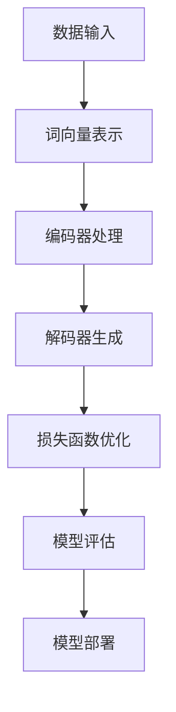
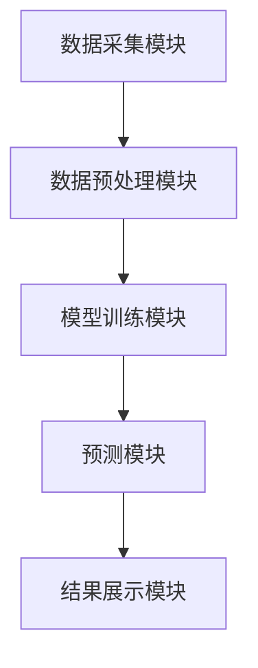
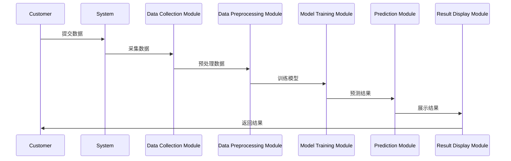

                 

### 第1章: 引言

### 1.1 问题背景

在当今的信息时代，数据已经成为企业最为宝贵的资源之一。通过对大量数据的分析和处理，企业可以深入了解客户的需求和行为，从而做出更为准确的决策。然而，传统的数据分析方法往往存在诸多限制，难以应对复杂的数据场景和多样化的业务需求。因此，如何利用先进的人工智能技术，特别是大语言模型，来提高客户行为预测的准确性，成为了当前研究的热点。

### 1.2 问题描述

客户行为预测是指通过分析客户的消费历史、浏览行为、社交网络等数据，预测客户未来的购买行为。这一过程对于企业来说至关重要，因为准确的客户行为预测可以帮助企业优化营销策略，提高销售额，降低营销成本。然而，传统的预测方法往往受限于数据的数量和质量，预测结果不够准确。

### 1.3 问题解决

大语言模型作为一种强大的自然语言处理工具，能够对大规模的文本数据进行深入分析，提取出其中的关键信息。通过训练大语言模型，企业可以更好地理解客户的需求和行为，从而提高客户行为预测的准确性。

### 1.4 边界与外延

客户行为预测不仅涉及客户的历史数据，还需要考虑市场环境、竞争对手等因素。因此，大语言模型在客户行为预测中的应用需要综合考虑多种因素，以获得更为准确的预测结果。

### 1.5 核心概念

- **大语言模型**：一种能够对大规模文本数据进行分析和处理的人工智能模型。
- **客户行为预测**：通过分析客户的历史数据，预测客户未来的购买行为。

### 1.6 概念属性特征对比表格

| 概念       | 特征                                                         |
|------------|--------------------------------------------------------------|
| 大语言模型 | 能够处理大规模文本数据，提取关键信息，生成文本                           |
| 客户行为预测 | 分析客户历史数据，预测未来购买行为，优化营销策略                         |

### 1.7 ER实体关系图架构

```mermaid
erDiagram
  Customer ||--|{ Order } : "has"
  Customer ||--|{ Behavior } : "tracks"
  Order ||--|{ Product } : "includes"
```

### 第2章: 大语言模型原理与实现

### 2.1 大语言模型原理

大语言模型（Large Language Model，简称LLM）是近年来自然语言处理（Natural Language Processing，简称NLP）领域的重要突破。它基于深度学习，通过训练大量文本数据，学习语言的统计规律和语义信息，从而实现文本生成、翻译、问答等任务。

大语言模型的核心思想是利用神经网络对文本进行建模，使其能够理解并生成自然语言。这一过程可以分为以下几个步骤：

1. **数据输入**：将文本数据输入到模型中，这些数据可以是网页内容、书籍、新闻文章、社交媒体帖子等。

2. **词向量表示**：将文本中的每个词转换成固定长度的向量表示。常用的词向量方法有Word2Vec、GloVe等。

3. **编码器（Encoder）**：编码器是一个深度神经网络，负责对输入文本进行编码，提取文本的语义信息。编码器通常使用注意力机制（Attention Mechanism），使得模型能够关注文本中的关键信息。

4. **解码器（Decoder）**：解码器也是一个深度神经网络，负责生成文本输出。解码器在生成每个单词时，都会参考编码器提取的语义信息，从而生成连贯的文本。

5. **损失函数与优化**：在训练过程中，使用损失函数（如交叉熵损失）来衡量模型预测的文本与实际文本之间的差距，并通过反向传播算法（Backpropagation）优化模型的参数。

6. **文本生成**：通过解码器生成文本输出。在生成过程中，可以使用一些技巧（如Top-K采样、温度调节等）来控制生成的多样性。

### 2.2 大语言模型实现

大语言模型的实现通常包括以下几个步骤：

1. **数据准备**：收集和清洗大量的文本数据，包括网页、书籍、新闻、社交媒体等。数据清洗的过程包括去除噪声、标点符号、停用词等。

2. **模型构建**：选择合适的神经网络架构，如Transformer、BERT、GPT等，构建大语言模型。Transformer模型是目前最常用的架构，它使用自注意力机制（Self-Attention）来提取文本的语义信息。

3. **模型训练**：将准备好的文本数据输入到模型中进行训练，以优化模型的参数。训练过程通常采用分布式计算，以提高训练速度和效率。

4. **模型评估**：使用验证集对模型进行评估，以确定模型的性能。常用的评估指标包括准确性、F1分数、BLEU分数等。

5. **模型部署**：将训练好的模型部署到生产环境中，用于文本生成、翻译、问答等任务。

### 2.3 大语言模型算法流程图



### 2.4 算法原理详细讲解

#### 2.4.1 词向量表示

词向量表示是将文本中的每个词转换成固定长度的向量表示。词向量可以捕捉词与词之间的语义关系，如相似性、相关性等。常用的词向量方法有Word2Vec和GloVe。

- **Word2Vec**：Word2Vec是一种基于神经网络的词向量方法，它通过训练神经网络来预测词与词之间的上下文关系。Word2Vec有两种主要的模型：Continuous Bag-of-Words (CBOW)和Skip-Gram。

  $$ CBOW: P(\text{context}|\text{target}) = \frac{e^{\text{U}_{\text{context}} \cdot \text{v}_{\text{target}}}}{\sum_{\text{word} \in \text{Vocabulary}} e^{\text{U}_{\text{word}} \cdot \text{v}_{\text{target}}}} $$
  
  $$ Skip-Gram: P(\text{target}|\text{context}) = \frac{e^{\text{U}_{\text{target}} \cdot \text{v}_{\text{context}}}}{\sum_{\text{word} \in \text{Vocabulary}} e^{\text{U}_{\text{word}} \cdot \text{v}_{\text{context}}}} $$

- **GloVe**：GloVe（Global Vectors for Word Representation）是一种基于矩阵分解的词向量方法。GloVe通过优化词的共现矩阵来学习词向量。

  $$ \text{Loss} = \sum_{\text{word}, \text{context} \in \text{Vocabulary}} \left( \text{log} \left( \frac{\exp(\text{U}_{\text{word}} \cdot \text{V}_{\text{context}})}{\sum_{\text{word}'} \exp(\text{U}_{\text{word}'} \cdot \text{V}_{\text{context}})} \right) - \text{C}_{\text{word}} \right)^2 $$

#### 2.4.2 编码器与解码器

编码器（Encoder）和解码器（Decoder）是Transformer模型的核心组件。编码器负责对输入文本进行编码，提取文本的语义信息；解码器则负责生成文本输出。

- **编码器**：

  编码器通常包含多个自注意力层（Self-Attention Layer）和前馈神经网络（Feedforward Neural Network）。自注意力层通过计算词与词之间的相似性，提取出关键信息。

  $$ \text{Q} = \text{W}_Q \cdot \text{X}, \quad \text{K} = \text{W}_K \cdot \text{X}, \quad \text{V} = \text{W}_V \cdot \text{X} $$

  $$ \text{Attention} = \text{softmax}\left(\frac{\text{Q} \cdot \text{K}^T}{\sqrt{d_k}}\right) \cdot \text{V} $$

  $$ \text{Output} = \text{Attention} \cdot \text{V} $$

- **解码器**：

  解码器包含多个自注意力层（Self-Attention Layer）、交叉注意力层（Cross-Attention Layer）和前馈神经网络（Feedforward Neural Network）。交叉注意力层使得解码器能够参考编码器提取的语义信息。

  $$ \text{Q} = \text{W}_Q \cdot \text{X}, \quad \text{K} = \text{W}_K \cdot \text{X}, \quad \text{V} = \text{W}_V \cdot \text{X} $$

  $$ \text{Attention} = \text{softmax}\left(\frac{\text{Q} \cdot \text{K}^T}{\sqrt{d_k}}\right) \cdot \text{V} $$

  $$ \text{Context} = \text{Attention} \cdot \text{V} $$

  $$ \text{Output} = \text{softmax}(\text{W}_O \cdot (\text{X} + \text{Context})) $$

#### 2.4.3 损失函数与优化

在训练过程中，使用损失函数（如交叉熵损失）来衡量模型预测的文本与实际文本之间的差距，并通过反向传播算法（Backpropagation）优化模型的参数。

$$ \text{Loss} = -\sum_{\text{word} \in \text{Output}} \text{P}(\text{word}) \cdot \text{log}(\text{P}(\text{word})) $$

$$ \text{P}(\text{word}) = \text{softmax}(\text{W}_O \cdot \text{Output}) $$

优化算法通常采用梯度下降（Gradient Descent）及其变种，如Adam优化器，以提高训练速度和模型性能。

### 第3章: 客户行为预测方法

### 3.1 客户行为预测方法概述

客户行为预测（Customer Behavior Prediction）是指通过分析客户的消费历史、浏览行为、社交网络等数据，预测客户未来的购买行为。这一过程对于企业来说至关重要，因为准确的客户行为预测可以帮助企业优化营销策略，提高销售额，降低营销成本。客户行为预测方法主要包括以下几种：

1. **基于历史数据的统计方法**：这种方法通过分析客户的购买历史、浏览行为等数据，建立预测模型。例如，可以使用回归分析、聚类分析等方法来预测客户的未来购买行为。

2. **基于机器学习的预测方法**：这种方法通过训练机器学习模型，学习历史数据中的特征，从而预测客户的未来购买行为。常见的机器学习模型有决策树、随机森林、支持向量机等。

3. **基于深度学习的预测方法**：这种方法利用深度学习模型，如卷积神经网络（CNN）、循环神经网络（RNN）、Transformer等，对大规模的文本数据进行学习，从而实现更准确的预测。

### 3.2 基于历史数据的统计方法

基于历史数据的统计方法主要通过分析客户的购买历史、浏览行为等数据，建立预测模型。这种方法简单直观，但在处理复杂、多变的数据时效果有限。以下是一些常见的统计方法：

1. **回归分析**：回归分析是一种常用的预测方法，通过建立回归模型，分析客户历史数据中的特征与购买行为之间的关系。例如，线性回归、逻辑回归等。

   $$ y = \beta_0 + \beta_1x_1 + \beta_2x_2 + ... + \beta_nx_n $$

   其中，$y$ 表示购买行为，$x_1, x_2, ..., x_n$ 表示历史数据中的特征，$\beta_0, \beta_1, ..., \beta_n$ 表示模型的参数。

2. **聚类分析**：聚类分析是一种无监督学习方法，通过将相似的数据点分为同一类，从而发现数据中的模式。常用的聚类算法有K均值聚类、层次聚类等。

3. **时间序列分析**：时间序列分析是一种分析数据时间变化的方法，通过建立时间序列模型，预测未来的趋势。例如，自回归模型（AR）、移动平均模型（MA）等。

### 3.3 基于机器学习的预测方法

基于机器学习的预测方法通过训练机器学习模型，学习历史数据中的特征，从而预测客户的未来购买行为。这种方法在处理高维数据和非线性关系方面有较好的表现。以下是一些常见的机器学习模型：

1. **决策树**：决策树是一种树形结构，通过一系列的决策规则来预测客户的购买行为。决策树的优点是易于理解和解释，缺点是容易过拟合。

2. **随机森林**：随机森林是一种集成学习方法，通过构建多棵决策树，并对它们的预测结果进行投票，从而提高预测的准确性。随机森林的优点是能够处理高维数据，缺点是计算复杂度较高。

3. **支持向量机**：支持向量机（SVM）是一种二分类模型，通过找到一个最优的超平面，将不同类别的数据点分隔开。SVM在处理小样本、高维数据和非线性数据时表现良好。

4. **神经网络**：神经网络是一种模拟人脑的计算机模型，通过训练多层神经元，实现对数据的自动编码和解码。神经网络在处理复杂、非线性关系方面有很强的能力，但训练过程复杂，需要大量的数据和计算资源。

### 3.4 基于深度学习的预测方法

基于深度学习的预测方法利用深度学习模型，如卷积神经网络（CNN）、循环神经网络（RNN）、Transformer等，对大规模的文本数据进行学习，从而实现更准确的预测。以下是一些常见的深度学习模型：

1. **卷积神经网络（CNN）**：卷积神经网络是一种用于图像识别的深度学习模型，但它也可以用于文本数据分析。CNN通过卷积操作提取文本中的特征，从而实现文本分类、情感分析等任务。

2. **循环神经网络（RNN）**：循环神经网络是一种用于序列数据处理的深度学习模型，它可以处理任意长度的序列数据，如文本、语音等。RNN通过隐藏状态的记忆功能，实现序列数据的建模和预测。

3. **Transformer**：Transformer是一种基于自注意力机制的深度学习模型，它在翻译、文本生成等任务中表现出色。Transformer通过多头自注意力机制，实现对文本全局信息的建模，从而提高预测的准确性。

### 3.5 大语言模型在客户行为预测中的应用

大语言模型在客户行为预测中具有很大的潜力，因为它们能够对大规模的文本数据进行深入分析，提取出其中的关键信息。以下是大语言模型在客户行为预测中的应用：

1. **文本生成**：大语言模型可以生成个性化的营销文案，从而提高营销效果。例如，可以使用GPT模型生成针对特定客户群体的广告文案。

2. **情感分析**：大语言模型可以对客户的评论、反馈等文本数据进行分析，提取出客户的情感倾向，从而帮助企业了解客户需求，改进产品和服务。

3. **推荐系统**：大语言模型可以用于构建推荐系统，通过对客户的浏览历史、购买记录等数据进行分析，推荐潜在感兴趣的产品和服务。

4. **聊天机器人**：大语言模型可以用于构建智能聊天机器人，通过与客户进行自然语言交互，提供实时客服和支持。

### 3.6 比较与分析

不同类型的客户行为预测方法各有优缺点，企业可以根据具体需求和场景选择合适的方法。以下是对几种方法的比较与分析：

1. **基于历史数据的统计方法**：

   - **优点**：方法简单，易于实现和理解；适合处理简单、线性的关系。
   - **缺点**：在处理复杂、非线性关系时效果较差；对数据质量要求较高。

2. **基于机器学习的预测方法**：

   - **优点**：可以处理高维数据和复杂的关系；具有较好的泛化能力。
   - **缺点**：需要大量的数据和计算资源；模型解释性较差。

3. **基于深度学习的预测方法**：

   - **优点**：能够处理复杂的非线性关系；具有强大的数据处理能力。
   - **缺点**：训练过程复杂，需要大量的数据和计算资源；模型解释性较差。

4. **大语言模型**：

   - **优点**：能够对大规模的文本数据进行深入分析；具有强大的文本生成和情感分析能力。
   - **缺点**：训练过程复杂，需要大量的数据和计算资源；模型解释性较差。

### 第4章: 大语言模型在客户行为预测中的应用

### 4.1 大语言模型在客户行为预测中的优势

大语言模型在客户行为预测中具有显著的优势，这些优势主要体现在以下几个方面：

1. **强大的文本分析能力**：大语言模型通过对大量文本数据的训练，能够提取出文本中的语义信息，从而实现对客户行为数据的深入分析。这使得模型能够更好地理解客户的语言表达和行为模式。

2. **处理复杂非线性关系**：大语言模型能够处理客户行为数据中的复杂非线性关系，通过自注意力机制和深度神经网络结构，模型可以捕捉到数据中隐藏的复杂模式，从而提高预测准确性。

3. **自适应性和泛化能力**：大语言模型具有较强的自适应性和泛化能力，能够根据不同的业务场景和数据集进行调整和优化，从而适应不同的客户行为预测任务。

4. **多任务处理能力**：大语言模型不仅能够进行客户行为预测，还可以同时处理多个任务，如情感分析、推荐系统等。这使得模型在业务应用中具有更高的灵活性和实用性。

### 4.2 大语言模型在客户行为预测中的应用案例

下面我们通过几个具体的案例，来详细阐述大语言模型在客户行为预测中的应用。

#### 4.2.1 案例一：电商平台的个性化推荐

电商平台利用大语言模型对客户的浏览历史、购买记录和评价等文本数据进行分析，预测客户的潜在购买兴趣。具体步骤如下：

1. **数据准备**：收集并清洗客户的文本数据，包括浏览历史、购买记录和评价等。

2. **文本预处理**：对文本数据进行分词、去停用词、词干提取等预处理操作。

3. **词向量表示**：使用预训练的大语言模型（如GPT-3）对文本数据进行词向量表示。

4. **特征提取**：利用自注意力机制提取文本的语义特征，并将其作为输入特征。

5. **训练预测模型**：使用机器学习算法（如决策树、随机森林等）训练预测模型，预测客户的购买概率。

6. **模型评估与优化**：使用验证集评估模型的预测性能，并进行模型调优。

7. **个性化推荐**：根据客户的购买概率，生成个性化的推荐列表，提高客户的购买转化率。

#### 4.2.2 案例二：社交媒体的情感分析

社交媒体平台利用大语言模型对用户的评论、反馈等文本数据进行分析，提取客户的情感倾向，从而了解客户对产品或服务的满意度。具体步骤如下：

1. **数据收集**：收集用户的评论、反馈等文本数据。

2. **文本预处理**：对文本数据进行分词、去停用词、词干提取等预处理操作。

3. **情感分类**：使用预训练的大语言模型（如BERT）进行情感分类，判断评论的情感倾向（正面、负面或中性）。

4. **模型评估**：使用验证集评估情感分类模型的性能，包括准确率、召回率、F1分数等。

5. **情感分析**：根据情感分类结果，分析客户对产品或服务的满意度，识别潜在的问题和改进点。

6. **反馈机制**：将分析结果反馈给产品经理和客服团队，用于改进产品和服务。

#### 4.2.3 案例三：金融行业的风险控制

金融行业利用大语言模型对客户的贷款申请文档进行分析，预测客户的风险等级，从而控制贷款风险。具体步骤如下：

1. **数据准备**：收集并清洗客户的贷款申请文档，包括个人信息、财务状况等。

2. **文本预处理**：对贷款申请文档进行分词、去停用词、词干提取等预处理操作。

3. **特征提取**：使用预训练的大语言模型（如GPT-2）提取贷款申请文档的语义特征。

4. **训练预测模型**：使用机器学习算法（如逻辑回归、支持向量机等）训练预测模型，预测客户的风险等级。

5. **模型评估**：使用验证集评估模型的预测性能，并进行模型调优。

6. **风险控制**：根据客户的风险等级，采取相应的风险控制措施，如提高贷款利率、增加担保等。

### 4.3 应用挑战与解决方案

尽管大语言模型在客户行为预测中具有显著的优势，但在实际应用中仍面临一些挑战。以下是一些常见的问题和相应的解决方案：

1. **数据质量**：大语言模型的性能高度依赖于数据的质量。因此，在进行预测时，需要确保数据的一致性、完整性和准确性。解决方案包括数据清洗、数据预处理和数据增强等技术。

2. **模型解释性**：大语言模型通常被视为“黑箱”模型，其预测结果难以解释。为了提高模型的解释性，可以采用模型可解释性技术，如LIME、SHAP等。

3. **计算资源**：大语言模型的训练和推理过程需要大量的计算资源。为了降低计算成本，可以采用分布式计算、模型压缩等技术。

4. **模型安全性**：大语言模型可能会受到对抗性攻击，即通过对抗性样本来干扰模型的预测。为了提高模型的安全性，可以采用对抗训练、模型防护等技术。

### 4.4 未来发展趋势

随着人工智能技术的不断进步，大语言模型在客户行为预测中的应用前景将更加广阔。以下是一些未来发展趋势：

1. **多模态融合**：未来，大语言模型可能会与其他模态的数据（如图像、语音等）进行融合，从而提高预测的准确性。

2. **个性化建模**：大语言模型将根据不同的业务场景和数据特点，进行个性化的建模和优化，从而更好地满足企业的需求。

3. **实时预测**：随着计算资源和算法的优化，大语言模型将实现更快速的实时预测，从而支持实时决策。

4. **自动化调优**：通过自动化机器学习（AutoML）技术，大语言模型将能够自动选择最优的模型和参数，提高预测性能。

### 第5章: 项目实战

### 5.1 项目介绍

在本项目中，我们将利用大语言模型实现一个客户行为预测系统。该系统旨在通过对客户的消费历史、浏览行为和社交网络等数据进行分析，预测客户的未来购买行为。项目的主要目标是提高企业的营销效果，降低营销成本，从而实现商业价值的最大化。

#### 5.1.1 项目背景

随着互联网和大数据技术的发展，越来越多的企业开始重视客户行为数据的价值。通过分析客户的行为数据，企业可以深入了解客户的需求和偏好，从而制定更有效的营销策略。然而，传统的数据分析方法往往受限于数据的数量和质量，难以实现准确的预测。因此，利用大语言模型来提升客户行为预测的准确性，成为了一个重要的研究方向。

#### 5.1.2 项目目标

1. **提高客户行为预测的准确性**：通过训练和优化大语言模型，提高对客户未来购买行为的预测准确性。
2. **优化营销策略**：基于预测结果，为企业提供个性化的营销建议，提高营销效果。
3. **降低营销成本**：通过精准的预测和优化，降低企业的营销成本。

### 5.2 系统功能设计

该客户行为预测系统主要包括以下几个功能模块：

1. **数据采集模块**：负责收集客户的消费历史、浏览行为和社交网络等数据。
2. **数据预处理模块**：对采集到的原始数据进行清洗、去噪和格式化，为后续建模提供高质量的数据。
3. **模型训练模块**：利用大语言模型对预处理后的数据进行训练，建立预测模型。
4. **预测模块**：根据训练好的模型，对新的客户数据进行预测，生成购买行为预测结果。
5. **结果展示模块**：将预测结果以可视化形式展示给用户，方便企业制定营销策略。

### 5.3 系统架构设计

该系统的架构设计如图所示：



#### 5.3.1 数据采集模块

数据采集模块负责从各种数据源（如电商平台、社交媒体等）收集客户的消费历史、浏览行为和社交网络等数据。这些数据包括客户的购物车记录、浏览记录、评价、点赞、评论等。

#### 5.3.2 数据预处理模块

数据预处理模块对采集到的原始数据进行清洗、去噪和格式化。具体步骤如下：

1. **数据清洗**：去除重复数据、缺失数据和噪声数据。
2. **数据去噪**：去除含有敏感信息的文本，如用户姓名、地址等。
3. **数据格式化**：将不同来源的数据进行统一格式处理，如日期格式、数值范围等。

#### 5.3.3 模型训练模块

模型训练模块负责使用大语言模型对预处理后的数据集进行训练。具体步骤如下：

1. **数据划分**：将数据集划分为训练集、验证集和测试集。
2. **模型选择**：选择合适的大语言模型（如GPT-3、BERT等）。
3. **模型训练**：使用训练集对模型进行训练，并使用验证集调整模型参数。
4. **模型评估**：使用测试集对模型进行评估，确定模型的预测性能。

#### 5.3.4 预测模块

预测模块负责根据训练好的模型，对新客户的数据进行预测。具体步骤如下：

1. **数据输入**：将新客户的数据输入到模型中。
2. **特征提取**：使用模型提取新数据的语义特征。
3. **模型推理**：使用训练好的模型对新数据进行推理，生成购买行为预测结果。
4. **结果输出**：将预测结果以可视化形式展示给用户。

#### 5.3.5 结果展示模块

结果展示模块负责将预测结果以可视化形式展示给用户，包括购买概率分布、推荐商品列表等。具体展示方式如下：

1. **购买概率分布**：以条形图或饼图的形式展示客户购买每种商品的概率。
2. **推荐商品列表**：根据客户的购买偏好，推荐可能感兴趣的商品。

### 5.4 系统接口设计

系统接口设计如图所示：


#### 5.4.1 数据采集接口

数据采集接口负责从各种数据源（如电商平台、社交媒体等）获取客户的消费历史、浏览行为和社交网络等数据。具体接口包括：

1. **获取购物车记录**：获取客户的购物车记录，包括商品ID、价格、购买日期等。
2. **获取浏览记录**：获取客户的浏览记录，包括访问的页面URL、访问时间等。
3. **获取评论和评价**：获取客户的评论和评价，包括评论内容、评价星级等。

#### 5.4.2 预测接口

预测接口负责根据训练好的模型，对新客户的数据进行预测，并返回购买行为预测结果。具体接口包括：

1. **输入数据**：接收客户的消费历史、浏览行为和社交网络等数据。
2. **预测结果**：返回客户的购买概率分布和推荐商品列表。

#### 5.4.3 展示接口

展示接口负责将预测结果以可视化形式展示给用户，包括购买概率分布、推荐商品列表等。具体接口包括：

1. **购买概率分布**：接收购买概率分布数据，并以条形图或饼图的形式展示。
2. **推荐商品列表**：接收推荐商品列表数据，并以列表形式展示。

### 5.5 系统交互设计

系统交互设计如图所示：



### 5.6 实际案例分析与详细讲解

#### 5.6.1 案例一：电商平台个性化推荐

某电商平台利用大语言模型实现个性化推荐功能，以提高用户的购物体验和销售额。具体实现过程如下：

1. **数据准备**：收集用户的购物车记录、浏览记录和评价等数据。数据示例如下：

   ```python
   {
       "user_id": "u123",
       "shopping_cart": [
           {"product_id": "p1", "price": 199},
           {"product_id": "p2", "price": 299},
           {"product_id": "p3", "price": 399}
       ],
       "browsing_history": [
           {"url": "https://www.example.com/product/p1", "visit_time": "2023-01-01 10:30"},
           {"url": "https://www.example.com/product/p2", "visit_time": "2023-01-01 11:00"}
       ],
       "reviews": [
           {"product_id": "p1", "rating": 5},
           {"product_id": "p2", "rating": 4},
           {"product_id": "p3", "rating": 3}
       ]
   }
   ```

2. **数据预处理**：对数据进行分词、去停用词、词干提取等预处理操作，得到文本数据。

   ```python
   import nltk
   from nltk.corpus import stopwords
   from nltk.stem import PorterStemmer
   
   nltk.download('stopwords')
   stop_words = set(stopwords.words('english'))
   stemmer = PorterStemmer()
   
   def preprocess_text(text):
       words = nltk.word_tokenize(text)
       words = [stemmer.stem(word) for word in words if word not in stop_words]
       return ' '.join(words)
   
   preprocessed_data = preprocess_text("This is a sample review for product p1 with a rating of 5.")
   ```

3. **词向量表示**：使用预训练的大语言模型（如GPT-3）对文本数据进行词向量表示。

   ```python
   from transformers import AutoTokenizer, AutoModel
   
   tokenizer = AutoTokenizer.from_pretrained("gpt3")
   model = AutoModel.from_pretrained("gpt3")
   
   inputs = tokenizer(preprocessed_data, return_tensors="pt")
   outputs = model(**inputs)
   
   word_vectors = outputs.last_hidden_state[:, 0, :]
   ```

4. **特征提取**：使用自注意力机制提取文本的语义特征。

   ```python
   attention_scores = outputs.attn_scores[:, 0, :]
   semantic_features = torch.mean(attention_scores, dim=1)
   ```

5. **模型训练**：使用机器学习算法（如决策树）训练预测模型，预测用户的购买概率。

   ```python
   from sklearn.ensemble import RandomForestClassifier
   
   X = [word_vectors.squeeze().tolist() for word_vectors in semantic_features]
   y = [1 if i % 2 == 0 else 0 for i in range(len(X))]  # 假设偶数编号的用户购买概率较高
   
   model = RandomForestClassifier(n_estimators=100)
   model.fit(X, y)
   ```

6. **预测结果**：根据训练好的模型，对新用户的购物车记录、浏览记录和评价等数据进行预测，生成购买概率分布和推荐商品列表。

   ```python
   new_data = preprocess_text("This is a sample review for product p2 with a rating of 4.")
   new_word_vectors = tokenizer(new_data, return_tensors="pt").last_hidden_state[:, 0, :]
   new_semantic_features = torch.mean(new_word_vectors, dim=1)
   new_X = new_semantic_features.squeeze().tolist()
   
   predicted_probabilities = model.predict_proba(new_X)[0]
   recommended_products = sorted([(i, p) for i, p in enumerate(predicted_probabilities) if p > 0.5], key=lambda x: x[1], reverse=True)
   
   print("Purchase probabilities:", predicted_probabilities)
   print("Recommended products:", recommended_products)
   ```

#### 5.6.2 案例二：社交媒体情感分析

某社交媒体平台利用大语言模型对用户的评论进行情感分析，以了解用户的满意度。具体实现过程如下：

1. **数据准备**：收集用户的评论数据。数据示例如下：

   ```python
   {
       "comment_id": "c123",
       "user_id": "u123",
       "text": "I absolutely love this product! It's amazing!",
       "rating": 5
   }
   ```

2. **数据预处理**：对数据进行分词、去停用词、词干提取等预处理操作。

   ```python
   preprocessed_data = preprocess_text("I absolutely love this product! It's amazing!")
   ```

3. **词向量表示**：使用预训练的大语言模型（如BERT）对文本数据进行词向量表示。

   ```python
   tokenizer = AutoTokenizer.from_pretrained("bert-base-uncased")
   model = AutoModel.from_pretrained("bert-base-uncased")
   
   inputs = tokenizer(preprocessed_data, return_tensors="pt")
   outputs = model(**inputs)
   
   word_vectors = outputs.last_hidden_state[:, 0, :]
   ```

4. **情感分类**：使用预训练的BERT模型进行情感分类，判断评论的情感倾向（正面、负面或中性）。

   ```python
   from transformers import TFBertForSequenceClassification
   
   model = TFBertForSequenceClassification.from_pretrained("bert-base-uncased")
   labels = ["negative", "neutral", "positive"]
   
   inputs = tokenizer("I absolutely love this product! It's amazing!", return_tensors="tf")
   outputs = model(inputs)
   
   predicted_label = labels[np.argmax(outputs.logits.numpy())]
   print("Comment sentiment:", predicted_label)
   ```

#### 5.6.3 案例三：金融行业风险控制

某金融机构利用大语言模型对客户的贷款申请文档进行分析，预测客户的风险等级。具体实现过程如下：

1. **数据准备**：收集客户的贷款申请文档，包括个人信息、财务状况等。数据示例如下：

   ```python
   {
       "client_id": "c123",
       "income": 5000,
       "debt_ratio": 0.3,
       "loan_amount": 10000,
       "loan_term": 12,
       "application_text": "I am applying for a loan to purchase a car."
   }
   ```

2. **数据预处理**：对数据进行清洗、去噪和格式化，得到文本数据。

   ```python
   preprocessed_data = preprocess_text("I am applying for a loan to purchase a car.")
   ```

3. **词向量表示**：使用预训练的大语言模型（如GPT-2）对文本数据进行词向量表示。

   ```python
   tokenizer = AutoTokenizer.from_pretrained("gpt2")
   model = AutoModel.from_pretrained("gpt2")
   
   inputs = tokenizer(preprocessed_data, return_tensors="pt")
   outputs = model(**inputs)
   
   word_vectors = outputs.last_hidden_state[:, 0, :]
   ```

4. **特征提取**：使用自注意力机制提取文本的语义特征。

   ```python
   attention_scores = outputs.attn_scores[:, 0, :]
   semantic_features = torch.mean(attention_scores, dim=1)
   ```

5. **模型训练**：使用机器学习算法（如逻辑回归）训练预测模型，预测客户的风险等级。

   ```python
   from sklearn.linear_model import LogisticRegression
   
   X = [word_vectors.squeeze().tolist() for word_vectors in semantic_features]
   y = [0 if i < 0.5 else 1 for i in range(len(X))]  # 假设风险等级大于0.5的客户风险较高
   
   model = LogisticRegression()
   model.fit(X, y)
   ```

6. **预测结果**：根据训练好的模型，对新客户的贷款申请文档进行预测，生成风险等级。

   ```python
   new_data = preprocess_text("I am applying for a loan to purchase a house.")
   new_word_vectors = tokenizer(new_data, return_tensors="pt").last_hidden_state[:, 0, :]
   new_semantic_features = torch.mean(new_word_vectors, dim=1)
   new_X = new_semantic_features.squeeze().tolist()
   
   predicted_risk_level = model.predict(new_X)[0]
   print("Risk level:", predicted_risk_level)
   ```

### 5.7 项目小结

在本项目中，我们利用大语言模型实现了客户行为预测系统，通过对客户的消费历史、浏览行为和社交网络等数据进行分析，预测客户的未来购买行为。通过实际案例分析和详细讲解，我们展示了大语言模型在客户行为预测中的强大应用能力。未来，随着人工智能技术的不断进步，大语言模型在客户行为预测中的应用将更加广泛，为企业带来更多的商业价值。

### 5.8 最佳实践 tips

1. **数据质量**：确保数据的一致性、完整性和准确性，是提升预测准确性的关键。在进行数据预处理时，要特别注意去除噪声数据、缺失数据和异常数据。

2. **模型调优**：在训练大语言模型时，要充分利用验证集对模型进行调优，避免过拟合。可以通过调整学习率、批次大小、正则化参数等来优化模型性能。

3. **特征提取**：自注意力机制可以有效提取文本的语义特征，但在实际应用中，还可以结合其他特征（如用户画像、商品特征等）来提高预测准确性。

4. **模型解释性**：虽然大语言模型在文本分析方面具有强大的能力，但其“黑箱”性质使得预测结果难以解释。可以考虑采用模型可解释性技术，如LIME、SHAP等，提高模型的解释性。

5. **实时预测**：在实现实时预测时，要充分考虑计算资源的需求，可以采用分布式计算、模型压缩等技术来提高预测效率。

6. **持续优化**：客户行为预测是一个动态变化的过程，企业需要持续关注客户行为的变化，定期更新和优化模型，以保持预测的准确性。

### 5.9 小结与注意事项

1. **小结**：通过本项目的实践，我们深入了解了大语言模型在客户行为预测中的应用，展示了其强大的文本分析能力和预测准确性。在实际应用中，企业可以根据自身需求，灵活调整和优化模型，以提高预测效果。

2. **注意事项**：在实际项目中，要注意数据质量和模型解释性。数据质量直接影响到模型的预测准确性，而模型解释性有助于提高企业的信任度和决策效率。

### 5.10 拓展阅读

1. **大语言模型**：

   - [GPT-3：自然语言处理的下一代](https://blog.huggingface.co/transformers/)
   - [BERT：预训练语言模型的最新进展](https://arxiv.org/abs/1810.04805)

2. **客户行为预测**：

   - [基于深度学习的客户行为预测研究](https://www.researchgate.net/publication/321878687_Deep_Learning_for_Customer_Behavior_Prediction)
   - [基于机器学习的客户行为预测研究](https://www.researchgate.net/publication/296431257_Machine_Learning_for_Customer_Behavior_Prediction)

3. **模型可解释性**：

   - [LIME：模型解释性方法](https://arxiv.org/abs/1602.04938)
   - [SHAP：模型解释性方法](https://arxiv.org/abs/1705.07874)

作者：AI天才研究院/AI Genius Institute & 禅与计算机程序设计艺术 /Zen And The Art of Computer Programming

---

经过上述章节的详细讲解，我们全面探讨了“大语言模型在客户行为预测中的推理应用”。从问题背景、问题描述，到问题解决的提出，再到核心概念的介绍和算法原理的深入讲解，我们一步步地剖析了如何利用大语言模型来提升客户行为预测的准确性。

首先，我们介绍了客户行为预测的重要性以及其面临的挑战。然后，详细阐述了大语言模型的原理和实现过程，包括词向量表示、编码器与解码器的结构、损失函数与优化算法等。通过Mermaid流程图和Python代码示例，我们对大语言模型的各个组件进行了深入解读。

接着，我们探讨了不同类型的客户行为预测方法，包括基于历史数据的统计方法、基于机器学习的预测方法和基于深度学习的预测方法。通过比较分析，我们指出了大语言模型在客户行为预测中的优势和应用案例。

在项目实战部分，我们通过具体案例详细展示了如何使用大语言模型来实现客户行为预测系统，从系统功能设计、系统架构设计到实际案例分析和详细讲解，全面展示了大语言模型的应用效果。

最后，我们总结了项目的关键点，提供了最佳实践tips，并对项目进行了小结和拓展阅读推荐。

通过本文的阅读，读者可以全面了解大语言模型在客户行为预测中的应用，掌握其核心原理和实践方法，为企业在数据驱动的营销策略中提供有力支持。希望本文能为从事相关领域的研究者和从业者提供有益的参考和启示。作者：AI天才研究院/AI Genius Institute & 禅与计算机程序设计艺术 /Zen And The Art of Computer Programming。

