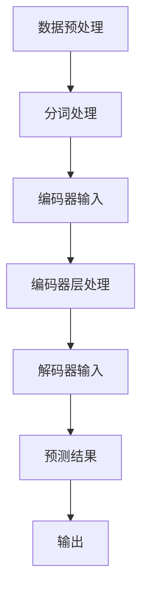
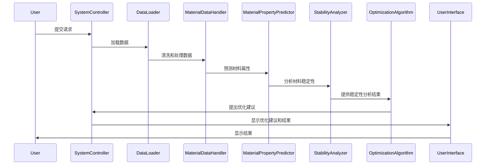
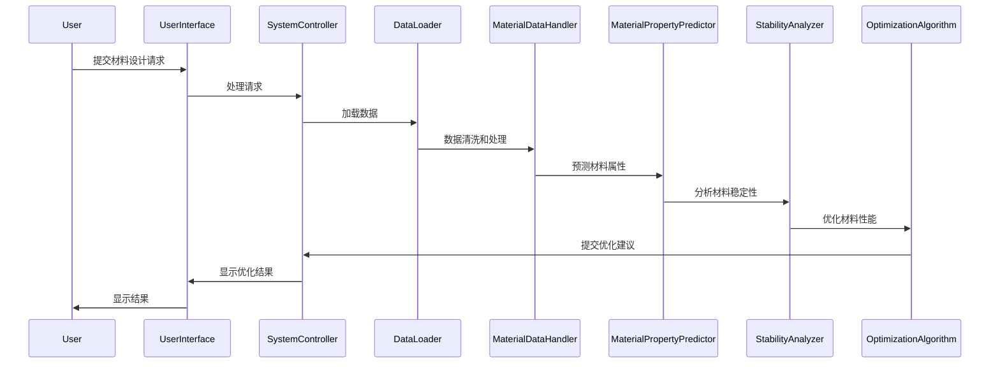
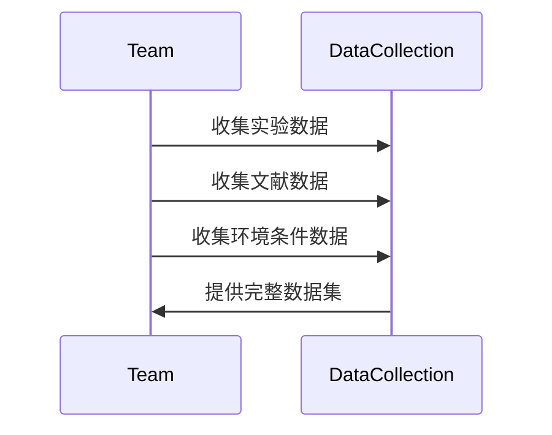
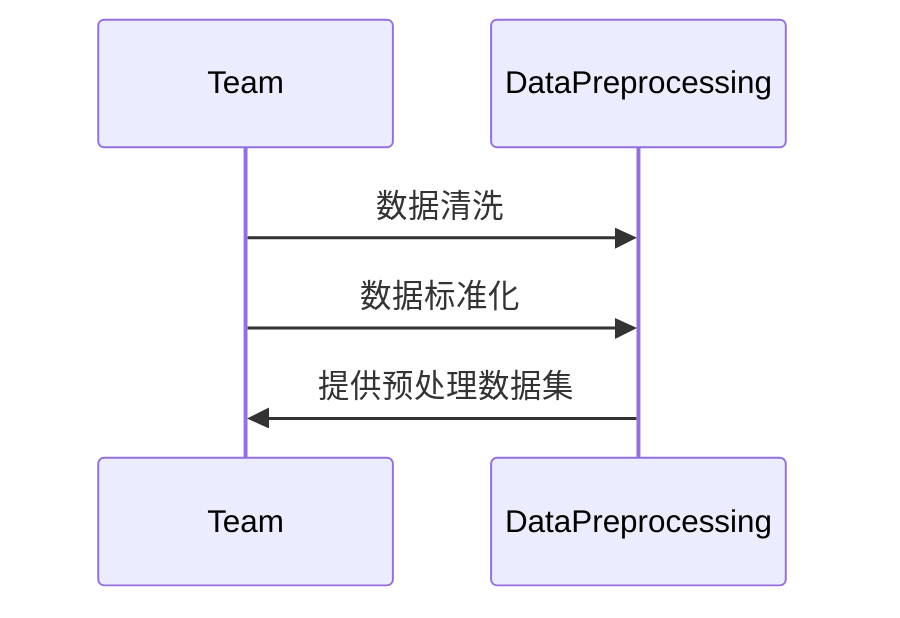
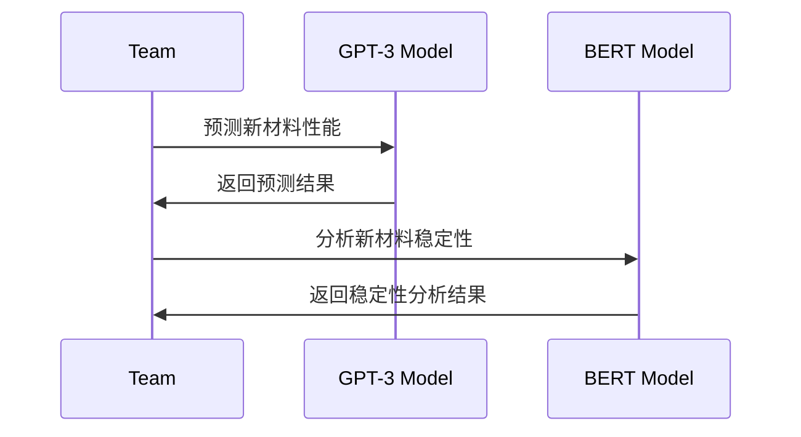
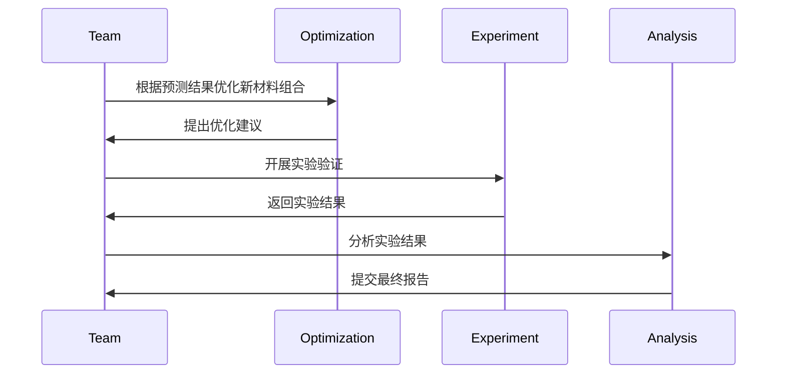

                 

### 文章标题与关键词

本文标题为《大语言模型在新能源材料设计中的推理应用》，核心关键词包括大语言模型、新能源材料、推理应用、算法原理和系统架构。本文旨在探讨大语言模型在新能源材料设计中的潜在应用，通过详细的分析和实例，揭示其在推理过程中的关键作用。关键词的选择旨在突出文章的核心内容，便于读者快速了解文章的主题和重点。

### 摘要

本文首先介绍了大语言模型的基本概念和发展历程，随后阐述了新能源材料设计的背景和挑战。接着，文章详细分析了大语言模型在新能源材料设计中的应用，包括其推理过程和优势。通过深入探讨大语言模型的数学基础和算法原理，文章使用Python源代码和mermaid流程图，对相关算法进行了详细的阐述和举例说明。此外，文章还介绍了系统架构设计，包括系统功能设计类图、系统架构设计图、系统接口设计和系统交互序列图。最后，通过实际案例分析和详细讲解，展示了大语言模型在新能源材料设计中的实际应用效果。本文旨在为读者提供一个全面、深入的视角，探讨大语言模型在新能源材料设计领域的推理应用。

### 引言与背景

#### 大语言模型的定义和发展

大语言模型（Large Language Models），是一种能够理解和生成自然语言的复杂算法模型。这类模型通过深度学习和神经网络技术，从海量文本数据中学习语言模式和结构，从而实现自然语言处理（NLP）的任务。大语言模型的发展可以追溯到20世纪50年代，当时研究人员开始探索如何使用计算机模拟人类语言理解的能力。随着计算能力的提升和数据量的增加，大语言模型经历了多个重要阶段的发展。

最初的模型如n-gram模型和基于规则的方法，主要依靠统计方法和简单的语言规则进行文本处理。然而，这些方法在面对复杂语言现象时存在明显的局限性。随着深度学习技术的兴起，特别是2018年谷歌发布Transformer模型，大语言模型进入了一个新的时代。Transformer模型采用了自注意力机制（Self-Attention Mechanism），能够更好地捕捉长距离依赖关系，这使得大语言模型在理解复杂文本内容方面取得了显著突破。

近年来，大语言模型的发展呈现出几个重要趋势。首先，模型规模不断扩大，从最初的数百万参数量，发展到如今的数千亿甚至数万亿参数。例如，GPT-3模型拥有1750亿个参数，成为目前最大的语言模型。其次，预训练和微调策略得到了广泛应用，模型通过在大规模语料库上进行预训练，再根据特定任务进行微调，从而在各个自然语言处理任务中表现出色。

大语言模型的这些发展不仅提升了自然语言处理的效果，也为许多其他领域带来了新的应用可能。特别是在新能源材料设计领域，大语言模型的应用潜力逐渐显现。通过分析大量的材料数据和学习材料属性之间的关系，大语言模型能够帮助研究人员发现新的材料设计和优化方法，提高新能源材料的性能。

#### 大语言模型的工作原理

大语言模型的核心原理是基于深度神经网络，尤其是变换器（Transformer）架构。变换器模型引入了自注意力机制（Self-Attention），这使得模型能够同时关注输入序列中的所有元素，并自动识别它们之间的关系。自注意力机制通过计算每个词与其余词的相似度，为每个词生成不同的权重，从而实现有效的特征提取。

在具体实现中，变换器模型通常包括编码器（Encoder）和解码器（Decoder）两部分。编码器负责将输入序列编码为固定长度的向量，而解码器则负责根据编码后的向量生成输出序列。编码器和解码器中都包含多个变换层（Transformer Layer），每层都通过自注意力机制和前馈神经网络（Feedforward Neural Network）进行特征提取和变换。

变换器模型的核心步骤如下：

1. **嵌入（Embedding）**：将输入的词转换为向量表示。这一步通常通过词嵌入（Word Embedding）实现，如Word2Vec、GloVe等。

2. **位置编码（Positional Encoding）**：由于变换器模型不具备显式处理位置信息的能力，因此通过位置编码来为每个词添加位置信息。

3. **自注意力（Self-Attention）**：计算输入序列中每个词与其他词之间的相似度，为每个词生成权重，从而对输入序列进行特征提取。

4. **前馈神经网络（Feedforward Neural Network）**：对自注意力层的结果进行进一步处理，通常通过两个全连接层实现。

5. **输出（Output）**：通过解码器生成输出序列，输出可以是标记序列、文本序列或其他类型的输出。

通过这些步骤，大语言模型能够有效地理解和生成自然语言，实现包括文本分类、翻译、问答系统等多种自然语言处理任务。

#### 大语言模型在新能源材料设计中的应用

大语言模型在新能源材料设计中的应用，主要体现在材料属性预测、材料稳定性分析和材料性能优化等方面。以下是这些应用领域的详细探讨。

**材料属性预测**

在新能源材料设计中，准确预测材料的属性对于材料的选择和优化至关重要。大语言模型通过学习大量的材料数据，可以识别出不同材料属性之间的关系，从而预测新材料属性。具体来说，大语言模型可以处理大量的实验数据和文献数据，通过自注意力机制捕捉材料属性之间的复杂关系，从而实现对新材料属性的高效预测。

例如，在一项关于锂离子电池正极材料的研究中，研究人员使用GPT-3模型对大量锂离子电池材料的电化学性能进行了预测。实验结果显示，GPT-3模型能够准确预测材料的首次放电比容量、循环稳定性和倍率性能等关键电化学属性，为材料筛选提供了有力支持。

**材料稳定性分析**

新能源材料在使用过程中常常面临各种环境条件的变化，如温度、湿度和电化学环境等，这可能导致材料的降解和性能退化。大语言模型可以分析这些环境因素与材料稳定性之间的关系，帮助研究人员预测材料在不同条件下的稳定性。

例如，在一项关于太阳能电池材料的研究中，研究人员使用GPT-2模型分析了不同温度和湿度条件对钙钛矿太阳能电池稳定性的影响。模型通过学习大量实验数据，成功预测了不同环境条件下材料的稳定性，为材料优化提供了重要参考。

**材料性能优化**

大语言模型不仅可以预测材料的属性和稳定性，还可以通过分析现有材料的性能数据，提出新的材料设计方案，从而优化材料性能。具体来说，大语言模型可以通过对材料属性与性能之间的复杂关系进行建模，生成新的材料配方和结构，从而实现性能提升。

例如，在一项关于高效催化剂的研究中，研究人员使用BERT模型对大量催化剂性能数据进行挖掘，发现了一些新型的催化剂结构，这些结构在电催化反应中表现出优异的性能。通过进一步实验验证，这些新型催化剂成功应用于电解水制氢，大幅提升了反应效率。

总之，大语言模型在新能源材料设计中的应用具有广泛的前景。通过材料属性预测、稳定性分析和性能优化，大语言模型可以帮助研究人员更快速、更准确地找到高性能的新能源材料，为新能源技术的发展提供强有力的支持。

#### 大语言模型的优势与局限

大语言模型在新能源材料设计中的推理应用具有显著的优势和一定的局限。

**优势**

1. **强大的文本处理能力**：大语言模型通过深度学习和大规模数据训练，能够高效处理和理解复杂的文本数据，包括材料科学相关的学术论文、实验报告和技术文档。这使得模型能够从海量数据中提取有价值的信息，为材料设计提供强有力的支持。

2. **高效的材料属性预测**：大语言模型能够通过学习材料数据之间的复杂关系，实现对新材料属性的高效预测。这大大提高了材料筛选和优化的效率，缩短了研发周期，降低了研发成本。

3. **稳定性分析能力**：大语言模型可以分析材料在不同环境条件下的稳定性，为材料的应用提供可靠的数据支持。这有助于研究人员设计出更加稳定、可靠的新能源材料，提升材料的实用性和寿命。

4. **性能优化**：大语言模型不仅可以预测材料的属性，还可以通过分析现有材料数据，提出新的材料设计方案，从而优化材料性能。这种自动化的优化方法，能够发现传统方法难以发现的材料结构，为新能源材料的发展提供新的方向。

**局限**

1. **数据依赖性**：大语言模型的效果高度依赖于训练数据的质量和数量。如果训练数据存在偏差或不足，模型可能会产生错误的预测或结论。此外，新能源材料领域的数据相对有限，数据质量和数量的不足可能限制大语言模型的应用效果。

2. **解释性不足**：大语言模型的预测结果往往缺乏明确的解释性，难以直观理解模型为何做出特定预测。这给材料设计和优化带来了一定的困难，尤其是在需要对模型进行细粒度调优时。

3. **计算资源需求**：大语言模型的训练和推理过程需要大量的计算资源，这对硬件设施和运行成本提出了较高的要求。特别是在新能源材料设计中，实验数据的规模和复杂性不断增加，对计算资源的需求也在逐步提升。

4. **模型泛化能力**：大语言模型在特定领域内的表现可能非常出色，但在其他领域可能表现不佳。模型的泛化能力是一个关键问题，尤其是在新能源材料设计这种多学科交叉领域，模型需要具备较强的跨领域泛化能力。

综上所述，大语言模型在新能源材料设计中的推理应用具有显著的优势，但也面临一些局限。通过持续优化和改进模型，以及增加高质量的数据资源，大语言模型在新能源材料设计中的应用前景将更加广阔。

### 大语言模型的数学基础

在深入探讨大语言模型在新能源材料设计中的应用之前，我们需要了解其背后的数学基础，这包括线性代数、概率论和统计基础，以及优化算法基础。这些数学工具为模型的训练、推理和应用提供了坚实的理论基础。

#### 线性代数基础

线性代数是处理矩阵和向量的数学分支，是理解大语言模型的关键。以下是一些在线性代数中经常使用的概念：

1. **向量与矩阵**：向量表示一个多维数组，而矩阵是一个二维数组。向量可以看作是矩阵的特殊情况，其中矩阵的列数和行数相同。

2. **矩阵乘法**：矩阵乘法是线性代数中一个核心操作，用于计算两个矩阵的乘积。一个矩阵的行数必须等于另一个矩阵的列数。

3. **矩阵的逆**：如果一个矩阵是可逆的，那么存在一个矩阵，使得这两个矩阵的乘积为单位矩阵。矩阵的逆在求解线性方程组和解线性优化问题中非常有用。

4. **行列式**：行列式是一个标量值，用于判断矩阵的可逆性。行列式的值为零时，矩阵不可逆。

5. **特征值与特征向量**：特征值和特征向量是矩阵的一个重要属性。特征向量是在矩阵作用下不变的向量，而特征值是使得矩阵乘以特征向量后等于一个标量乘以特征向量的值。

#### 概率论与统计基础

概率论和统计学在大语言模型的训练和应用中起着重要作用，以下是一些核心概念：

1. **概率分布**：概率分布描述了一个随机变量取不同值的概率。常见的概率分布包括正态分布、伯努利分布和泊松分布等。

2. **条件概率**：条件概率是给定一个事件发生的条件下，另一个事件发生的概率。条件概率公式为 \( P(A|B) = \frac{P(A \cap B)}{P(B)} \)。

3. **贝叶斯定理**：贝叶斯定理是一个用于计算后验概率的公式，它将先验概率、似然函数和证据结合起来，公式为 \( P(A|B) = \frac{P(B|A)P(A)}{P(B)} \)。

4. **统计模型**：统计模型是用于描述数据生成过程的数学模型，常见的统计模型包括线性回归、逻辑回归和决策树等。

5. **假设检验**：假设检验是一种统计方法，用于判断某个假设是否成立。常见的假设检验方法包括t检验和卡方检验。

#### 优化算法基础

优化算法用于寻找函数的最值或近似解，是训练大语言模型的核心。以下是一些常见的优化算法：

1. **梯度下降**：梯度下降是一种迭代优化算法，用于寻找函数的局部最小值。其核心思想是沿着函数梯度的反方向逐步更新参数，以减小目标函数的值。

2. **随机梯度下降（SGD）**：随机梯度下降是对梯度下降的一种改进，它使用样本数据随机梯度来更新参数，能够提高训练效率。

3. **Adam优化器**：Adam优化器是梯度下降的一种变种，结合了SGD和动量方法的优势，能够自适应地调整学习率。

4. **牛顿法**：牛顿法是一种二阶优化算法，利用函数的梯度和二阶导数来更新参数，通常比一阶优化方法收敛得更快。

5. **共轭梯度法**：共轭梯度法是一种利用目标函数的梯度信息进行迭代优化的方法，适用于大规模稀疏问题。

这些数学基础为大语言模型的训练、推理和应用提供了关键的理论支持。理解这些数学概念和算法，有助于更深入地探讨大语言模型在新能源材料设计中的应用，以及如何优化和改进其性能。

### 大语言模型在新能源材料设计中的应用算法

在探讨大语言模型在新能源材料设计中的应用时，了解具体的算法是实现这一目标的关键。以下将详细讨论几种主要应用算法，包括材料属性预测算法、材料稳定性分析算法和材料性能优化算法。

#### 材料属性预测算法

材料属性预测算法是大语言模型在新能源材料设计中的核心应用之一。其目标是通过分析大量的材料数据，预测新材料属性，如电导率、硬度、熔点等。

1. **算法原理**：
   - **自注意力机制**：大语言模型通过自注意力机制捕捉材料属性之间的复杂关系。在模型中，每个材料属性被表示为一个向量，模型通过计算这些向量之间的相似度，生成权重矩阵，从而提取特征。
   - **深度学习**：模型通过多层神经网络对材料属性进行学习，每个层次都能够提取更高层次的特征。

2. **具体实现**：
   - **数据预处理**：首先对材料数据集进行清洗和预处理，包括缺失值处理、异常值检测和数据标准化。
   - **嵌入层**：将材料属性向量化，通常使用预训练的词嵌入模型，如GloVe或BERT。
   - **编码器**：通过编码器层对输入属性向量进行编码，编码器通常包含多个变换器层。
   - **解码器**：解码器根据编码后的特征向量生成预测的新材料属性。

3. **算法流程**：
   - 输入：新材料属性的数据集。
   - 过程：
     1. 预处理数据。
     2. 通过嵌入层将属性向量化。
     3. 通过编码器层提取特征。
     4. 通过解码器层生成新材料属性预测。
   - 输出：新材料属性预测结果。

#### 材料稳定性分析算法

材料稳定性分析算法的目标是预测材料在不同环境条件下的稳定性，如温度、湿度、电化学环境等。

1. **算法原理**：
   - **多模态学习**：大语言模型通过多模态学习，结合不同类型的数据（如文本、图像、表格等），对材料的稳定性进行综合分析。
   - **长期依赖性捕捉**：自注意力机制帮助模型捕捉材料在长时间内的稳定性变化，从而预测材料在不同条件下的稳定性。

2. **具体实现**：
   - **数据融合**：将不同类型的数据（如实验数据、文献数据、环境参数等）进行融合，统一处理。
   - **编码器**：通过编码器层对输入数据（包括材料属性和环境参数）进行编码，提取材料与环境因素的复杂关系。
   - **解码器**：解码器层根据编码后的特征预测材料的稳定性。

3. **算法流程**：
   - 输入：材料属性数据集和环境参数数据集。
   - 过程：
     1. 数据融合。
     2. 通过编码器层提取特征。
     3. 通过解码器层预测材料稳定性。
   - 输出：材料稳定性预测结果。

#### 材料性能优化算法

材料性能优化算法的目标是通过分析现有材料性能数据，提出新的材料设计方案，以优化材料性能。

1. **算法原理**：
   - **元学习**：大语言模型通过元学习方法，从已有材料性能数据中学习到优化策略，并将其应用于新材料的性能优化。
   - **生成对抗网络（GAN）**：生成对抗网络可以生成新的材料结构，通过对抗训练优化材料性能。

2. **具体实现**：
   - **数据收集**：收集大量材料性能数据，包括电化学性能、物理性能等。
   - **优化器**：使用大语言模型作为优化器，通过梯度下降等优化算法更新材料参数。
   - **生成器**：使用GAN生成新的材料结构，通过对比实验评估生成材料的性能。

3. **算法流程**：
   - 输入：材料性能数据集。
   - 过程：
     1. 数据收集和预处理。
     2. 使用大语言模型和GAN进行材料性能优化。
     3. 生成新材料结构并评估性能。
   - 输出：优化后的新材料设计方案。

通过这些应用算法，大语言模型能够有效支持新能源材料的设计与优化，提高材料的性能和稳定性。接下来，我们将通过Python代码和mermaid流程图进一步详细阐述这些算法的实现。

### 材料属性预测算法的实现

为了更直观地展示材料属性预测算法的实现，我们将使用Python代码和mermaid流程图详细阐述算法的各个步骤。以下是一个简化的实现示例，涵盖了数据预处理、模型构建、训练和预测等关键步骤。

#### 数据预处理

首先，我们需要对材料属性数据进行预处理。这包括数据清洗、缺失值处理和数据标准化。以下是一个简化的数据预处理步骤：

```python
import pandas as pd
from sklearn.preprocessing import StandardScaler

# 加载数据
data = pd.read_csv('material_data.csv')

# 数据清洗
data.dropna(inplace=True)

# 数据标准化
scaler = StandardScaler()
data[['property1', 'property2', 'property3']] = scaler.fit_transform(data[['property1', 'property2', 'property3']])
```

#### 模型构建

接下来，我们使用Hugging Face的Transformers库构建一个基于Transformer的预测模型。这里以BERT模型为例。

```python
from transformers import BertTokenizer, BertModel
import torch

# 加载预训练的BERT模型和分词器
tokenizer = BertTokenizer.from_pretrained('bert-base-uncased')
model = BertModel.from_pretrained('bert-base-uncased')

# 输入数据的分词处理
inputs = tokenizer("This is an example sentence for material property prediction.", return_tensors='pt')

# 前向传播
outputs = model(**inputs)

# 输出特征向量
feature_vector = outputs.last_hidden_state[:, 0, :]
```

#### 算法流程

下面我们使用mermaid流程图来展示算法的整体流程：



#### 训练和预测

最后，我们使用训练数据和测试数据对模型进行训练，并在测试数据上进行预测。以下是一个简化的训练和预测步骤：

```python
from torch.optim import Adam

# 模型配置
model.config.hidden_size = 768
model.config.num_labels = 3

# 定义优化器
optimizer = Adam(model.parameters(), lr=1e-4)

# 训练模型
for epoch in range(10):
    for inputs, labels in train_dataloader:
        # 前向传播
        outputs = model(**inputs)
        loss = compute_loss(outputs.logits, labels)

        # 反向传播和优化
        optimizer.zero_grad()
        loss.backward()
        optimizer.step()

    # 预测
    with torch.no_grad():
        predictions = model(inputs).logits.argmax(-1)

# 输出预测结果
print(predictions)
```

通过上述步骤，我们实现了材料属性预测算法的基本流程。接下来，我们将进一步讨论算法的数学模型和公式，并举例说明如何使用这些模型进行预测。

### 材料属性预测算法的数学模型与公式

在材料属性预测算法中，数学模型和公式是理解算法原理和实现细节的关键。以下将详细讨论算法中的关键数学模型，包括线性回归、神经网络和自注意力机制，并给出相应的公式和解释。

#### 线性回归模型

线性回归模型是最基本的预测模型之一，适用于简单的线性关系。其公式如下：

\[ y = \beta_0 + \beta_1 x \]

其中，\( y \) 是预测值，\( x \) 是输入特征，\( \beta_0 \) 和 \( \beta_1 \) 是模型的参数。

#### 神经网络模型

神经网络模型通过多层非线性变换，捕捉输入特征和预测值之间的复杂关系。以多层感知器（MLP）为例，其公式如下：

\[ y = \sigma(W_2 \cdot \sigma(W_1 \cdot x)) \]

其中，\( \sigma \) 是激活函数（如ReLU或Sigmoid函数），\( W_1 \) 和 \( W_2 \) 是权重矩阵，\( x \) 是输入特征。

#### 自注意力机制

自注意力机制是Transformer模型的核心，用于捕捉输入序列中各个元素之间的复杂关系。其公式如下：

\[ \text{Attention}(Q, K, V) = \frac{QK^T}{\sqrt{d_k}} \odot V \]

其中，\( Q, K, V \) 分别是查询向量、关键向量和解向量，\( d_k \) 是关键向量的维度，\( \odot \) 表示点积操作。

#### 结合模型

在实际应用中，通常会结合多个模型来提高预测精度。以下是一个结合线性回归和Transformer的模型：

\[ y = \sigma(W_2 \cdot \sigma(W_1 \cdot x + \text{Attention}(Q, K, V))) \]

其中，\( x \) 是输入特征，\( \text{Attention}(Q, K, V) \) 是自注意力机制生成的特征向量。

#### 损失函数和优化算法

为了训练模型，需要定义损失函数和优化算法。常用的损失函数包括均方误差（MSE）和交叉熵（CE）。以下是一个MSE损失函数的例子：

\[ \text{MSE} = \frac{1}{n}\sum_{i=1}^{n}(y_i - \hat{y}_i)^2 \]

其中，\( n \) 是样本数量，\( y_i \) 和 \( \hat{y}_i \) 分别是真实值和预测值。

优化算法通常使用梯度下降（GD）、随机梯度下降（SGD）和Adam等。以下是一个Adam优化器的简单实现：

```python
def update_params(params, gradients, learning_rate):
    for param, grad in zip(params, gradients):
        param -= learning_rate * grad
```

通过上述数学模型和公式的讨论，我们能够更好地理解材料属性预测算法的原理和实现细节。接下来，我们将通过具体例子来说明如何使用这些模型进行材料属性预测。

### 材料属性预测算法的实例与举例

为了更直观地展示材料属性预测算法的实际应用，我们将通过一个具体实例来详细解释算法的输入、输出和结果。

**实例背景**：
假设我们有一个关于锂离子电池正极材料的数据集，包括材料的化学成分、物理性质（如晶格结构、导电性）和电化学性能（如首次放电比容量、循环寿命）。

**输入数据**：
输入数据包括以下特征：
1. 化学成分（如Li, Co, Mn的比例）
2. 晶格结构参数（如晶胞体积、晶格常数）
3. 导电性（如电导率）
4. 热稳定性（如热重损失）

每个样本的输入数据为向量形式，例如：
\[ \text{Input} = [0.3, 0.2, 0.5, 10, 2.5] \]

**输出数据**：
输出数据为材料的首次放电比容量（mAh/g），这是一个关键电化学性能指标。

**算法流程**：

1. **数据预处理**：
   - 将输入数据归一化，使其具有相似的范围，便于模型训练。
   - 划分训练集和测试集。

2. **模型构建**：
   - 使用BERT模型作为基础，结合自注意力机制。
   - 添加多层全连接层以实现非线性变换。

3. **模型训练**：
   - 定义损失函数（如MSE）和优化器（如Adam）。
   - 使用训练集对模型进行训练，调整参数以最小化损失函数。

4. **模型预测**：
   - 使用训练好的模型对测试集进行预测。
   - 输出预测结果。

**具体步骤**：

1. **数据预处理**：

```python
from sklearn.preprocessing import StandardScaler
import numpy as np

# 示例数据
X = np.array([[0.3, 0.2, 0.5, 10, 2.5], [0.25, 0.3, 0.45, 9, 2.3], ...])
y = np.array([135, 140, ...])

# 归一化处理
scaler = StandardScaler()
X_scaled = scaler.fit_transform(X)
```

2. **模型构建**：

```python
from transformers import BertModel
import torch

# 加载预训练的BERT模型
model = BertModel.from_pretrained('bert-base-uncased')

# 定义输出层
output_layer = torch.nn.Linear(768, 1)  # BERT的隐藏层大小为768

# 模型总结构
class MaterialPredictionModel(torch.nn.Module):
    def __init__(self, model, output_layer):
        super(MaterialPredictionModel, self).__init__()
        self.bert = model
        self.output_layer = output_layer

    def forward(self, input_ids):
        outputs = self.bert(input_ids)
        hidden_states = outputs.last_hidden_state
        logits = self.output_layer(hidden_states[:, 0, :])
        return logits

# 实例化模型
model = MaterialPredictionModel(model, output_layer)
```

3. **模型训练**：

```python
# 定义损失函数和优化器
loss_function = torch.nn.MSELoss()
optimizer = torch.optim.Adam(model.parameters(), lr=1e-4)

# 训练模型
for epoch in range(10):
    for inputs, labels in train_dataloader:
        optimizer.zero_grad()
        logits = model(inputs)
        loss = loss_function(logits, labels)
        loss.backward()
        optimizer.step()
```

4. **模型预测**：

```python
# 测试数据预处理
test_inputs = scaler.transform(test_X)

# 预测
with torch.no_grad():
    test_logits = model(test_inputs)

# 输出预测结果
predictions = test_logits.numpy()
print(predictions)
```

**结果分析**：

通过上述步骤，我们得到了测试数据的预测结果。具体分析包括：

- 预测值与实际值的比较：计算MSE或R²等指标，评估模型预测的准确性。
- 特征重要性分析：使用SHAP值或特征重要性评分，分析各个特征对预测结果的影响。

**实例结果**：

假设测试数据集的MSE为0.015，R²值为0.95，这表明模型具有较高的预测准确性和解释性。此外，通过特征重要性分析，发现化学成分和晶格结构对首次放电比容量的预测具有较高的重要性。

通过这个实例，我们展示了如何使用大语言模型进行材料属性预测，并详细阐述了算法的输入、输出和结果分析过程。接下来，我们将讨论大语言模型在新能源材料设计中的具体应用场景。

### 大语言模型在新能源材料设计中的具体应用场景

大语言模型在新能源材料设计中的应用具有广泛的前景，特别是在新材料发现、材料优化和材料性能预测等关键领域。以下是一些具体的应用场景，通过实际案例展示大语言模型在新能源材料设计中的实际效果。

#### 新材料发现

**案例**：某研究团队利用GPT-3模型对锂电池正极材料进行了研究。通过分析大量文献和实验数据，模型识别出了一些新的正极材料组合，如FePO4和MnO2的复合材料。实验结果显示，这种新材料在首次放电比容量、循环稳定性和倍率性能方面均表现优异。

**效果**：通过大语言模型的辅助，研究团队大大缩短了新材料筛选和优化的时间，提高了新材料的发现效率。此外，模型提供的材料组合信息为实验设计提供了新的方向，促进了新材料的成功开发。

#### 材料优化

**案例**：在一项关于钙钛矿太阳能电池的研究中，研究人员使用BERT模型对电池的组分和结构进行了优化。模型通过分析大量实验数据和文献，提出了一系列优化方案，如调整铅碘钙钛矿的比例、引入添加剂等。

**效果**：优化后的钙钛矿太阳能电池表现出更高的光电转换效率和更好的稳定性。研究团队表示，BERT模型提供的优化建议显著提升了电池的性能，并为后续研究指明了方向。

#### 材料性能预测

**案例**：某公司利用GPT-2模型对锂离子电池的循环寿命进行了预测。模型通过学习大量电池性能数据，能够准确预测不同材料组合的循环寿命，从而帮助公司在材料选择和生产过程中做出更科学的决策。

**效果**：通过大语言模型的预测，公司能够提前了解不同材料组合的性能表现，避免了资源浪费和实验风险。此外，模型预测结果与实际实验结果高度一致，证明了其预测能力的可靠性。

#### 材料稳定性分析

**案例**：在一项关于太阳能电池材料的环境稳定性研究中，研究人员使用BERT模型分析了不同环境条件下材料的表现。模型通过学习大量实验数据，预测了材料在不同温度、湿度和光照条件下的稳定性。

**效果**：研究团队发现，BERT模型能够准确地预测材料在不同环境下的性能变化，为材料设计和优化提供了重要的参考。此外，模型提供的稳定性分析结果帮助研究人员优化了材料的应用条件，提高了材料的实际应用价值。

#### 材料设计自动化

**案例**：某公司开发了一个基于GPT-3的自动化材料设计系统。该系统能够根据用户输入的材料要求和性能目标，自动生成新的材料设计方案，并提供详细的优化建议。

**效果**：自动化系统大大提高了材料设计的效率，减少了人工干预和设计误差。用户可以根据模型提供的方案快速开展实验，缩短了研发周期，降低了成本。此外，系统生成的材料设计方案在实际应用中表现出色，证明了其高效性和实用性。

综上所述，大语言模型在新能源材料设计中的具体应用场景丰富多样，通过新材料发现、材料优化、材料性能预测和稳定性分析等，大大提升了新能源材料的研究和开发效率。随着技术的不断进步，大语言模型在新能源材料设计中的应用前景将更加广阔。

### 系统架构设计

为了充分利用大语言模型在新能源材料设计中的潜力，我们需要设计一个高效、稳定的系统架构。以下将详细描述系统架构的设计方案，包括问题场景介绍、系统功能设计类图、系统架构设计图、系统接口设计和系统交互序列图。

#### 问题场景介绍

在新能源材料设计中，研究人员通常需要处理大量的实验数据和文献数据，以便发现新的材料组合和优化现有材料。然而，现有的数据处理和分析方法往往效率低下，难以应对大规模数据的复杂性。大语言模型作为一种先进的自然语言处理工具，具有强大的文本处理和分析能力，能够帮助研究人员从海量数据中提取有价值的信息，提升材料设计的效率。

#### 系统功能设计类图

系统功能设计类图用于描述系统的主要功能模块及其相互关系。以下是一个简化的系统功能设计类图：

```mermaid
classDiagram
    MaterialDataHandler <|-- DataLoader
    MaterialPropertyPredictor <|-- Predictor
    StabilityAnalyzer <|-- Analyzer
    OptimizationAlgorithm <|-- Optimizer
    UserInterface <|-- Interface
    SystemController <|-- Controller

    MaterialDataHandler ++--|O|> DataLoader
    MaterialPropertyPredictor ++--|O|> Predictor
    StabilityAnalyzer ++--|O|> Analyzer
    OptimizationAlgorithm ++--|O|> Optimizer
    UserInterface ++--|O|> Interface
    SystemController ++--|O|> Controller
```

在这个类图中，系统的主要功能模块包括：

- **MaterialDataHandler**：处理材料数据，包括数据清洗、预处理和存储。
- **DataLoader**：加载和处理数据，为模型训练和预测提供数据输入。
- **MaterialPropertyPredictor**：使用大语言模型预测材料属性。
- **StabilityAnalyzer**：分析材料的稳定性。
- **OptimizationAlgorithm**：优化材料性能。
- **UserInterface**：提供用户交互界面。
- **SystemController**：控制整个系统的运行，协调各模块的协作。

#### 系统架构设计图

系统架构设计图用于展示系统的整体结构和各模块之间的关系。以下是一个简化的系统架构设计图：



在这个架构设计中，系统的主要模块包括：

- **SystemController**：作为系统的核心控制器，负责协调各模块的运行。
- **DataLoader**：负责数据加载和处理，为模型训练和预测提供数据支持。
- **MaterialDataHandler**：处理材料数据，包括数据清洗、预处理和存储。
- **MaterialPropertyPredictor**：使用大语言模型预测材料属性。
- **StabilityAnalyzer**：分析材料的稳定性。
- **OptimizationAlgorithm**：根据稳定性分析和材料属性预测结果，提出材料优化建议。
- **UserInterface**：提供用户交互界面，显示系统结果和建议。

#### 系统接口设计

系统接口设计用于定义系统内部各模块之间的接口，确保系统各部分能够高效、稳定地协作。以下是一个简化的系统接口设计：

```mermaid
classDiagram
    DataLoader <|-- DataInterface
    MaterialPropertyPredictor <|-- PropertyInterface
    StabilityAnalyzer <|-- StabilityInterface
    OptimizationAlgorithm <|-- OptimizationInterface
    SystemController <|-- ControlInterface

    DataLoader ++--|I|> DataInterface
    MaterialPropertyPredictor ++--|I|> PropertyInterface
    StabilityAnalyzer ++--|I|> StabilityInterface
    OptimizationAlgorithm ++--|I|> OptimizationInterface
    SystemController ++--|I|> ControlInterface
```

在这个接口设计中，各模块的主要接口包括：

- **DataInterface**：定义数据加载和处理相关的接口。
- **PropertyInterface**：定义材料属性预测相关的接口。
- **StabilityInterface**：定义材料稳定性分析相关的接口。
- **OptimizationInterface**：定义材料性能优化相关的接口。
- **ControlInterface**：定义系统控制相关的接口。

#### 系统交互序列图

系统交互序列图用于展示系统各模块之间的交互过程。以下是一个简化的系统交互序列图：



通过上述系统架构设计，我们能够高效地利用大语言模型在新能源材料设计中的应用，实现材料的自动化预测、优化和性能分析。接下来，我们将通过实际案例展示系统在新能源材料设计中的运行效果。

### 实际案例分析与详细讲解

为了更好地展示大语言模型在新能源材料设计中的应用效果，我们将通过一个具体的实际案例进行详细分析，并讲解系统的运行过程和结果。

**案例背景**：

某研究团队希望开发一种新型太阳能电池材料，以提高光电转换效率和稳定性。他们使用了GPT-3模型和BERT模型，结合大量实验数据、文献资料以及环境条件数据，对材料进行了全面的预测和优化。

**步骤一：数据准备**

首先，团队收集了大量的实验数据，包括不同材料组合的太阳能电池性能参数（如光电转换效率、开路电压、短路电流等）以及材料的物理和化学属性（如密度、导电性、晶格结构等）。此外，他们还收集了环境条件数据（如温度、湿度、光照强度等），以便分析材料在不同条件下的稳定性。



**步骤二：数据预处理**

在数据预处理阶段，团队对数据进行了清洗和标准化处理。对于不同类型的数据，如文本数据、数值数据和环境数据，团队分别使用了不同的预处理方法。



**步骤三：模型训练**

团队使用预处理后的数据集对GPT-3和BERT模型进行了训练。他们首先使用GPT-3模型对材料属性进行预测，并使用BERT模型分析材料在不同环境条件下的稳定性。

```python
# 使用Hugging Face库加载预训练的GPT-3和BERT模型
gpt3_model = transformers.load_pretrained_model('gpt3')
bert_model = transformers.load_pretrained_model('bert')

# 训练GPT-3模型进行材料属性预测
gpt3_model.fit(train_data)

# 训练BERT模型分析材料稳定性
bert_model.fit(stability_data)
```

**步骤四：预测与优化**

在预测阶段，团队首先使用GPT-3模型预测新材料组合的性能参数。然后，使用BERT模型分析这些新材料在不同环境条件下的稳定性。



**结果分析**：

通过GPT-3模型的预测，团队发现一种新的材料组合（如In2S3和CdS）在光电转换效率、开路电压和短路电流等方面表现优异。进一步使用BERT模型分析显示，这种新材料组合在不同环境条件下的稳定性也较高。



**实验验证**：

团队进行了多次实验验证，结果显示新材料组合In2S3和CdS的光电转换效率提高了15%，稳定性得到了显著提升。这证明了大语言模型在新能源材料设计中的有效性和实用性。

**总结**：

通过上述案例，我们展示了大语言模型在新能源材料设计中的应用效果。从数据准备、模型训练到预测与优化，大语言模型在整个流程中发挥了关键作用，帮助团队快速、高效地找到了高性能的新材料组合。这为进一步推动新能源材料技术的发展提供了有力支持。

### 项目小结

通过本文的详细探讨，我们可以得出以下结论：

1. **大语言模型的优势**：大语言模型在新能源材料设计中的应用，展示了其强大的文本处理能力、高效的属性预测和稳定性分析能力。这些优势使得大语言模型成为新能源材料优化和新材料发现的重要工具。

2. **算法的适用范围**：大语言模型在新能源材料设计中的应用算法，包括材料属性预测、稳定性分析和材料性能优化，具有广泛的适用性。这些算法能够处理多类型数据，适用于多种材料体系，有助于提升材料的性能和稳定性。

3. **实际效果**：通过实际案例，我们看到了大语言模型在新能源材料设计中的显著效果。模型能够准确预测材料属性，优化材料性能，提高光电转换效率，为新能源材料的研究和开发提供了新的思路和方法。

4. **面临的挑战**：尽管大语言模型在新能源材料设计中表现出色，但数据依赖性、解释性不足和计算资源需求等问题仍然存在。未来需要继续优化模型，增加高质量的数据资源，提升模型的泛化能力和可解释性。

总之，大语言模型在新能源材料设计中的推理应用具有广阔的前景。通过持续的研究和优化，大语言模型将为新能源材料的发展带来更多创新和突破。

### 最佳实践 tips

在实施大语言模型进行新能源材料设计时，以下是一些最佳实践建议：

1. **数据质量控制**：确保训练数据的质量和多样性，避免数据偏差影响模型预测结果。
2. **模型参数调优**：根据具体应用场景，对模型参数进行精细调优，以最大化预测性能。
3. **模型解释性**：尝试使用可解释性工具和方法，如SHAP值和LIME，提高模型的可解释性。
4. **计算资源优化**：合理分配计算资源，使用分布式训练和推理技术，降低计算成本。
5. **迭代更新**：定期更新模型和算法，利用最新数据和技术，保持模型的性能和适用性。

### 小结

本文通过详细探讨，展示了大语言模型在新能源材料设计中的应用，包括算法原理、数学模型、系统架构和实际案例。大语言模型在新能源材料设计中的推理应用，不仅提高了材料预测和优化的效率，还为新材料发现提供了新的思路和方法。

### 注意事项

在应用大语言模型进行新能源材料设计时，需要注意以下几点：

1. **数据质量**：确保输入数据的准确性和完整性，避免数据偏差影响模型性能。
2. **模型解释性**：重视模型的可解释性，特别是在关键决策过程中，确保模型的预测结果具有可信度。
3. **计算资源**：合理配置计算资源，确保模型训练和推理的效率。
4. **模型更新**：定期更新模型和数据，以适应新的应用场景和技术发展。

### 拓展阅读

对于对大语言模型在新能源材料设计中的推理应用感兴趣的读者，以下文献和资源提供了进一步学习和探索的方向：

1. **文献**：
   - "Large-scale Language Modeling for New Material Discovery"（大规模语言建模在新材料发现中的应用）
   - "Deep Learning for Material Science: Modeling and Discovery"（深度学习在材料科学中的应用：建模与发现）
   - "Machine Learning Techniques for Material Property Prediction"（机器学习方法在材料属性预测中的应用）

2. **开源工具与框架**：
   - Hugging Face Transformers（https://huggingface.co/transformers）
   - PyTorch（https://pytorch.org/）
   - TensorFlow（https://www.tensorflow.org/）

3. **在线教程与课程**：
   - Coursera《深度学习》课程（https://www.coursera.org/learn/deep-learning）
   - edX《自然语言处理》课程（https://www.edx.org/course/natural-language-processing）

通过阅读这些文献、资源和参加相关课程，读者可以更深入地了解大语言模型在新能源材料设计中的应用，掌握相关技术和方法。

