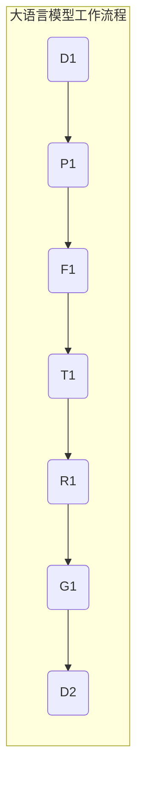
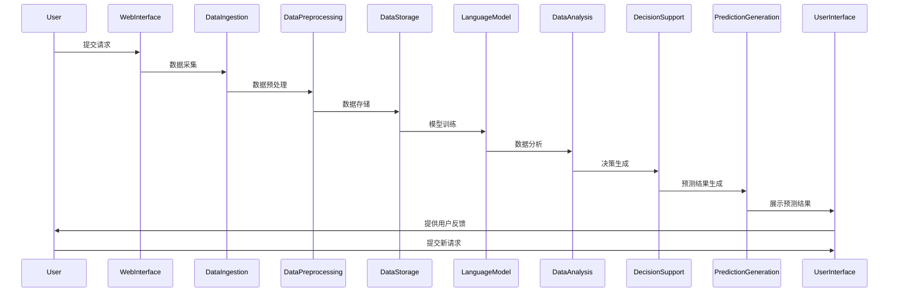
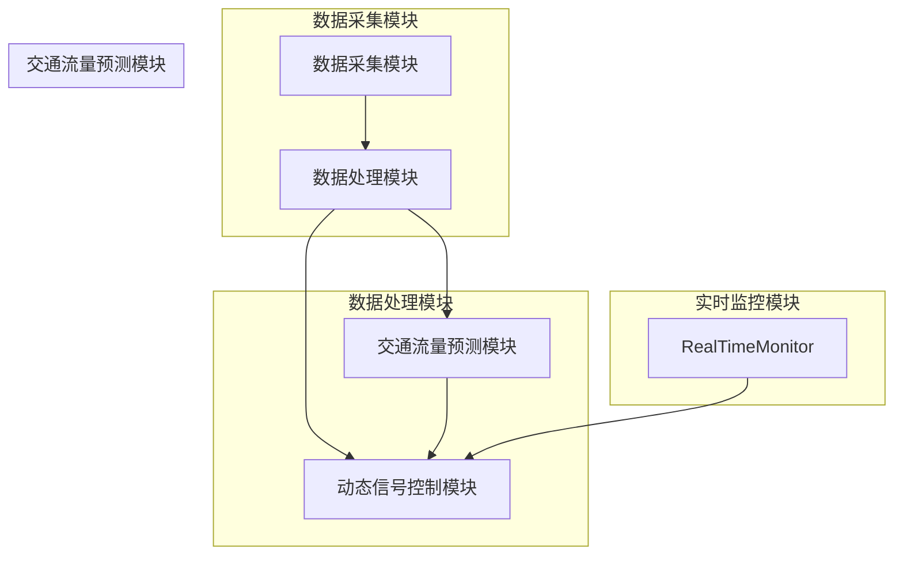

                 


### 引言

在当今的信息化时代，智慧城市已成为全球城市发展的重要方向。智慧城市规划决策作为智慧城市建设中的关键环节，面临着复杂多变的数据处理和预测分析需求。大语言模型（Large Language Model）作为一种先进的人工智能技术，因其强大的文本生成和理解能力，正逐渐成为智慧城市规划决策的有力工具。

本文旨在探讨大语言模型在智慧城市规划决策中的应用，通过系统的分析和项目实践，揭示其在城市规划中的潜力与挑战。我们将分步骤深入探讨以下主题：

1. **背景介绍**：介绍大语言模型和智慧城市规划决策的基本概念、问题背景、应用领域等。
2. **核心概念与联系**：明确大语言模型的核心概念，描述其属性特征，并对比其他相关技术。
3. **算法原理讲解**：通过 Mermaid 流程图展示大语言模型的工作流程，使用 Python 源代码详细解释其数学模型和公式。
4. **系统分析与架构设计方案**：描述智慧城市规划决策系统的组成部分、功能设计、架构设计、接口设计等。
5. **项目实战**：介绍具体的应用案例，包括环境安装、核心实现、代码解读、案例分析等。
6. **最佳实践 tips、小结、注意事项、拓展阅读**：提供实践经验、总结、安全注意事项和进一步的阅读建议。

通过这篇文章，我们希望读者能够对大语言模型在智慧城市规划决策中的应用有一个全面而深刻的理解，为未来的研究和实践提供指导。下面，我们将一步步展开讨论。

---

**关键词：** 大语言模型，智慧城市规划决策，人工智能，算法原理，系统架构设计，项目实战

**摘要：** 本文详细探讨了大语言模型在智慧城市规划决策中的应用，包括背景介绍、核心概念与联系、算法原理讲解、系统分析与架构设计方案、项目实战及最佳实践等。通过系统性的分析，展示了大语言模型在智慧城市规划中的潜力与挑战，为读者提供了全面的技术指导。

## 背景介绍

### 大语言模型的基本概念

大语言模型（Large Language Model）是一种基于深度学习的技术，它通过分析大量文本数据，学习并预测自然语言的统计规律。最早的大规模语言模型之一是Word2Vec，它将每个单词映射到一个固定维度的向量空间，从而捕捉词与词之间的语义关系。然而，随着计算能力的提升和数据规模的增大，研究人员开始探索更大规模的语言模型，如GPT（Generative Pre-trained Transformer）和BERT（Bidirectional Encoder Representations from Transformers）。

GPT模型由OpenAI提出，是第一个真正的大规模语言模型，它使用了Transformer架构，并通过自回归的方式预训练，能够生成连贯的自然语言文本。BERT则是由Google提出，其特点是同时预训练自回归语言模型和 masked language model，并且使用双向Transformer结构，使得模型能够更好地捕捉单词的前后文关系。

大语言模型的关键特点在于其强大的生成和理解能力。首先，它们能够根据输入文本生成连贯的自然语言文本，这使得它们在自动摘要、机器翻译、问答系统等领域表现出色。其次，大语言模型能够理解文本中的语义和上下文，这使得它们在文本分类、情感分析、信息抽取等任务中具有显著优势。此外，大语言模型还可以进行知识推理和生成，这在智慧城市规划决策中具有潜在的应用价值。

### 智慧城市规划决策的需求

智慧城市规划决策是智慧城市建设的重要组成部分，其目标是利用先进的信息技术，优化城市资源分配、提高城市管理效率、提升居民生活质量。智慧城市规划决策涉及多个方面，包括基础设施规划、交通管理、环境保护、公共服务等。

随着城市化进程的加快，城市规模不断扩大，人口密度增加，城市面临的挑战也越来越复杂。传统的城市规划方法往往依赖于经验和静态的数据分析，难以适应快速变化的城市环境。而智慧城市规划决策则利用大数据、人工智能等新兴技术，通过实时数据分析和预测，为城市规划提供科学依据。

智慧城市规划决策的需求主要包括以下几个方面：

1. **数据集成与处理**：智慧城市规划需要整合来自不同来源的数据，如交通流量、环境监测、人口统计等。大语言模型能够处理大规模的文本数据，为数据集成和处理提供了有效的工具。
2. **预测与分析**：城市规划需要预测未来的发展趋势，如人口增长、交通需求等。大语言模型通过学习历史数据，能够生成准确的预测结果，为决策提供支持。
3. **智能推荐与优化**：智慧城市规划需要根据实时数据，动态调整城市规划方案。大语言模型能够提供智能推荐，优化城市资源分配，提高决策效率。
4. **公共参与与透明度**：智慧城市规划决策需要公众的参与，大语言模型能够生成自然语言文本，提高信息的透明度和公众的参与度。

### 大语言模型在智慧城市规划决策中的应用

大语言模型在智慧城市规划决策中具有广泛的应用前景。以下是一些具体的应用场景：

1. **自动生成报告与摘要**：大语言模型能够自动生成城市规划报告和摘要，节省时间和人力成本，提高报告的准确性和一致性。
2. **交通流量预测与优化**：大语言模型可以通过分析历史交通数据，预测未来的交通流量，为交通管理提供科学依据。此外，大语言模型还可以生成智能交通信号控制方案，优化交通流量。
3. **环境保护监测与预警**：大语言模型可以通过环境监测数据，预测环境污染的趋势，生成预警报告，帮助城市规划者及时采取应对措施。
4. **公共设施规划与优化**：大语言模型可以根据人口统计和居民需求，生成公共设施的优化方案，提高城市公共服务的质量。

综上所述，大语言模型在智慧城市规划决策中具有巨大的应用潜力。通过系统的应用，大语言模型不仅能够提高决策的效率和准确性，还能为城市规划提供新的思路和方法。

### 问题背景与核心问题

在智慧城市规划决策中，核心问题包括数据多样性、复杂性以及动态性。首先，数据多样性体现在智慧城市规划所需的数据来源广泛，包括交通流量、环境监测、人口统计、经济指标等。这些数据不仅在类型上多样，还在数据格式、更新频率和完整性方面存在差异。这种多样性要求大语言模型具备强大的数据处理能力和跨领域知识整合能力。

其次，复杂性体现在城市规划问题的多层次性和非线性。城市规划需要考虑多个方面的因素，如交通、环境、经济、社会等，这些因素之间存在复杂的相互作用和反馈机制。大语言模型需要能够处理这种复杂性，通过多模态数据和跨领域知识融合，提供全面和准确的规划方案。

动态性则是智慧城市规划的一个重要特征。城市环境不断变化，人口增长、经济发展、气候变化等因素都会对城市规划产生影响。大语言模型需要具备实时数据处理和动态调整能力，以适应这种变化，确保规划方案的实时性和有效性。

因此，智慧城市规划决策的核心问题是：如何在数据多样性、复杂性和动态性的背景下，利用大语言模型提供科学、智能、高效的规划方案。这要求大语言模型不仅能够处理大规模、多类型的文本数据，还需要具备强大的预测能力和适应性，以应对不断变化的城市环境。

### 问题解决

为了解决智慧城市规划决策中的核心问题，大语言模型提供了一系列有效的技术手段和解决方案。以下是其主要的应用方法：

1. **多模态数据融合**：智慧城市规划所需的数据不仅包括文本，还包括图像、音频、视频等多种类型。大语言模型通过多模态数据融合技术，能够整合不同类型的数据源，提供更全面的规划信息。例如，在交通流量预测中，大语言模型可以融合交通摄像头捕捉的图像数据、GPS交通流量数据以及历史交通数据，生成更准确的预测结果。

2. **跨领域知识整合**：大语言模型具备处理大规模文本数据的能力，能够学习并整合不同领域的知识。在智慧城市规划中，跨领域知识整合可以帮助模型更好地理解城市环境中的复杂关系。例如，在制定公共设施规划时，大语言模型可以整合交通、环境、社会等多领域数据，提供更科学、合理的设施布局方案。

3. **实时数据处理与动态调整**：智慧城市规划需要实时响应城市环境的变化。大语言模型通过实时数据处理技术，能够快速分析最新数据，为决策提供即时支持。例如，在应对突发事件（如自然灾害、交通拥堵）时，大语言模型可以实时分析相关信息，生成应急预案，帮助城市规划者及时采取措施。

4. **预测与优化**：大语言模型通过学习历史数据和模式，能够进行准确的预测，为智慧城市规划提供科学依据。例如，在交通管理中，大语言模型可以根据历史交通数据，预测未来的交通流量，生成智能交通信号控制方案，优化交通流量，减少拥堵。

5. **公共参与与透明度**：大语言模型能够生成自然语言文本，提高信息的透明度和公众的参与度。例如，在城市规划方案公示期间，大语言模型可以生成简洁明了的规划说明，帮助公众更好地理解规划内容，提出意见和建议。

通过上述技术手段，大语言模型不仅能够提高智慧城市规划的科学性、智能性和效率，还能增强规划的实时性和公众参与度，为智慧城市建设提供强有力的支持。

### 边界与外延

尽管大语言模型在智慧城市规划决策中展现出强大的潜力，但其在实际应用中仍存在一些边界和局限性。首先，数据质量和数据量是影响大语言模型性能的关键因素。如果数据存在噪声、缺失或偏差，模型可能无法准确学习并生成可靠的预测结果。此外，智慧城市规划涉及的数据来源广泛、类型多样，如何有效地整合和处理这些数据是一个挑战。

其次，大语言模型的训练和推理需要大量的计算资源，这在资源有限的情况下可能成为一个瓶颈。例如，对于一些中小型城市，由于预算和技术条件的限制，可能无法承担大规模语言模型的训练和部署成本。

最后，大语言模型的解释性和透明度仍然是一个待解决的问题。当前的大规模语言模型主要通过黑盒模型进行操作，决策过程缺乏透明性，难以解释模型为何做出特定预测。这在涉及公共利益的智慧城市规划决策中，可能引发信任问题。

因此，在应用大语言模型时，需要充分考虑其边界和局限性，通过数据预处理、模型优化、资源管理等方法，最大限度地发挥其潜力，同时确保决策的透明度和可靠性。

### 概念结构与核心要素组成

在深入探讨大语言模型在智慧城市规划决策中的应用之前，有必要详细分析其概念结构，并明确其中的核心要素组成。大语言模型作为一种先进的自然语言处理技术，其核心组成部分包括数据输入层、预训练层、解码层和输出层。以下将逐一介绍这些组成部分及其作用。

1. **数据输入层**：数据输入层是大语言模型处理文本数据的基础。它负责接收原始的文本数据，并将其转换为模型可以理解的格式。具体来说，数据输入层通常包括分词、词向量化、编码等步骤。分词是将文本拆分成一个个独立的单词或词汇单元，词向量化则是将每个词汇映射到一个固定维度的向量空间，编码则是对输入文本进行序列化处理，以便模型能够顺序处理文本数据。

2. **预训练层**：预训练层是大语言模型的核心部分，其主要任务是通过对大规模文本数据进行自监督学习，使模型能够自动捕获语言的基本规律和结构。预训练层通常采用自回归语言模型（如GPT）或双向编码器（如BERT）等架构，通过学习文本的上下文关系，提高模型对自然语言的捕捉能力。预训练过程中，模型会自动调整内部参数，以最小化预测错误率，从而在数据中挖掘出丰富的语言知识。

3. **解码层**：解码层负责将预训练后的模型应用到具体任务中，如文本生成、文本分类、机器翻译等。解码层的任务是根据输入文本的上下文信息，生成对应的输出文本。解码过程通常包括序列解码和注意力机制等高级技术，以实现高效的文本生成和翻译。例如，在文本生成任务中，模型会根据输入序列逐个生成单词或字符，并通过上下文关系进行优化，生成连贯、自然的文本。

4. **输出层**：输出层是模型最终的输出部分，负责将解码层生成的文本输出为用户可理解的格式。输出层通常包括文本生成器、分类器等组件，根据不同任务的需求，生成相应的输出结果。例如，在文本生成任务中，输出层会生成一段自然语言文本；在文本分类任务中，输出层会输出每个类别的概率分布。

除了上述核心组成部分外，大语言模型在智慧城市规划决策中的应用还涉及多个辅助要素，如数据预处理、模型优化、模型解释等。以下是对这些辅助要素的简要分析：

- **数据预处理**：智慧城市规划所需的数据通常来源于多个领域，如交通、环境、经济等。数据预处理是确保数据质量和一致性的关键步骤。主要包括数据清洗、归一化、特征提取等操作，以提高模型的输入质量和预测准确性。
- **模型优化**：大语言模型的性能受到多种因素的影响，如参数设置、训练数据规模、训练时间等。模型优化是通过调整这些参数，提高模型的预测效果和泛化能力。常用的优化方法包括超参数调整、模型压缩、迁移学习等。
- **模型解释**：大语言模型通常被视为黑盒模型，其决策过程难以解释。模型解释是提高模型透明度和可解释性的关键。通过可视化技术、特征重要性分析等方法，可以揭示模型内部的工作机制和决策过程，增强用户对模型的信任和接受度。

综上所述，大语言模型在智慧城市规划决策中的概念结构包括数据输入层、预训练层、解码层和输出层等核心组成部分，以及数据预处理、模型优化、模型解释等辅助要素。通过这些组成部分的协同工作，大语言模型能够高效地处理大规模文本数据，为智慧城市规划提供科学、智能的决策支持。

### 核心概念原理

大语言模型的核心概念可以归结为两个主要方面：Transformer架构和预训练-微调（Pre-training and Fine-tuning）机制。

#### Transformer架构

Transformer架构是近年来在自然语言处理领域取得重大突破的一种新型神经网络架构，由Vaswani等人于2017年提出。与传统的循环神经网络（RNN）和长短期记忆网络（LSTM）相比，Transformer架构通过自注意力机制（Self-Attention）和多头注意力（Multi-Head Attention）实现了更高效、更强大的文本处理能力。

1. **自注意力机制**：自注意力机制允许模型在处理每个单词时，根据其与其他单词的相关性，动态地计算每个单词的重要性权重。这意味着模型可以根据上下文信息，灵活地调整每个单词的权重，从而捕捉长距离依赖关系。其计算公式为：

   $$
   \text{Attention}(Q, K, V) = \text{softmax}\left(\frac{QK^T}{\sqrt{d_k}}\right)V
   $$

   其中，$Q$、$K$、$V$ 分别代表查询（Query）、键（Key）和值（Value）向量，$d_k$ 是键向量的维度。

2. **多头注意力**：多头注意力将自注意力机制扩展到多个子空间，通过并行计算不同子空间中的注意力权重，从而提高模型的泛化能力和表达力。具体实现中，模型会将输入向量分解为多个子向量，每个子向量独立计算注意力权重，最后将结果合并。其计算公式为：

   $$
   \text{MultiHead}(Q, K, V) = \text{Concat}(\text{head}_1, ..., \text{head}_h)W^O
   $$

   其中，$h$ 是头数，$W^O$ 是输出权重矩阵。

#### 预训练-微调机制

预训练-微调（Pre-training and Fine-tuning）机制是当前大规模语言模型的主流训练方法。预训练阶段主要通过对大规模无标签文本数据进行自监督学习，使模型学习到语言的一般规律和结构。微调阶段则将预训练模型应用于特定任务，通过有监督学习调整模型参数，以提高任务表现。

1. **预训练**：预训练阶段主要包括两个子任务：掩码语言模型（Masked Language Model，MLM）和下一句预测（Next Sentence Prediction，NSP）。

   - **掩码语言模型（MLM）**：在预训练过程中，模型会随机掩码输入文本中的部分单词，然后尝试预测这些掩码的单词。该任务训练了模型对语言的理解和生成能力。

   - **下一句预测（NSP）**：在预训练过程中，模型会随机选取两个句子，然后预测第二个句子是否是第一个句子的下文。该任务增强了模型对句子间关系和文本连贯性的捕捉能力。

2. **微调**：在预训练完成后，模型会通过有监督学习进行微调，以适应特定任务的需求。微调阶段的主要任务是调整模型在特定任务上的表现，例如文本分类、机器翻译、问答系统等。通过微调，模型能够将预训练阶段学到的通用知识应用到具体任务中，提高任务性能。

#### 对比其他相关技术

与传统的循环神经网络（RNN）和长短期记忆网络（LSTM）相比，大语言模型在处理长文本和长距离依赖关系方面具有显著优势。RNN和LSTM通过递归方式处理序列数据，但存在梯度消失和梯度爆炸等问题，难以捕捉长距离依赖。而Transformer架构通过自注意力机制，可以动态调整每个单词的权重，有效克服了长距离依赖问题。

此外，大语言模型在生成和理解自然语言文本方面也表现出更强的能力。通过预训练-微调机制，模型能够学习到大量的语言知识和模式，从而在特定任务中取得出色的性能。例如，BERT（Bidirectional Encoder Representations from Transformers）模型通过双向编码器结构，能够同时考虑文本的前后文信息，提高了文本理解能力。

总的来说，大语言模型通过Transformer架构和预训练-微调机制，实现了对自然语言文本的强大处理能力。这使得其在智慧城市规划决策等复杂任务中具有广泛的应用潜力。

### 概念属性特征对比表格

为了更好地理解大语言模型与其他相关技术的差异，下面提供了一个概念属性特征对比表格。这个表格列出了大语言模型、循环神经网络（RNN）和长短期记忆网络（LSTM）在几个关键属性上的比较。

| 特征 | 大语言模型 | 循环神经网络（RNN） | 长短期记忆网络（LSTM） |
| --- | --- | --- | --- |
| 架构 | Transformer | 递归神经网络 | 递归神经网络 |
| 注意力机制 | 自注意力、多头注意力 | 无 | 无 |
| 长距离依赖 | 能捕捉长距离依赖 | 梯度消失问题，难以捕捉 | 梯度消失问题，但比RNN好 |
| 训练方式 | 自监督学习、预训练-微调 | 有监督学习 | 有监督学习 |
| 文本生成 | 强大 | 较弱 | 较弱 |
| 文本理解 | 强大 | 较弱 | 较弱 |
| 处理速度 | 高效 | 较慢 | 较慢 |
| 计算资源 | 高 | 中等 | 中等 |
| 可解释性 | 较低 | 较低 | 较低 |

通过这个表格，我们可以看到大语言模型在注意力机制、长距离依赖捕捉、文本生成和文本理解等方面具有显著优势。相比之下，RNN和LSTM在处理速度和计算资源需求上较低，但在某些场景下仍具有其独特的应用价值。

### ER实体关系图架构

为了进一步理解大语言模型在智慧城市规划决策中的应用，我们可以通过ER（Entity-Relationship）实体关系图来展示智慧城市规划决策系统的架构。ER图能够清晰地表示系统中的实体、属性以及它们之间的关系，帮助我们更好地理解系统的整体结构和功能。

#### 实体

在智慧城市规划决策系统中，主要的实体包括：

1. **用户**：参与智慧城市规划决策的人员，如城市规划师、市政管理人员、公众等。
2. **数据源**：提供各类数据的来源，如交通流量传感器、环境监测设备、社会经济统计数据库等。
3. **模型**：用于分析和预测的大语言模型，如GPT、BERT等。
4. **决策结果**：由模型生成的规划方案和预测结果。

#### 属性

每个实体都有相关的属性，如：

1. **用户**：用户ID、用户角色、用户权限等。
2. **数据源**：数据类型、数据来源、数据更新频率等。
3. **模型**：模型名称、模型版本、训练数据集等。
4. **决策结果**：预测结果、优化建议、生成报告等。

#### 关系

实体之间的关系能够展示系统中的数据流动和功能协同，如：

1. **用户-模型**：用户通过接口与模型交互，提交请求并获得预测结果。
2. **数据源-模型**：模型从数据源中获取数据，用于训练和预测。
3. **模型-决策结果**：模型生成的决策结果反馈给用户，用于指导城市规划。

下面是一个简化的ER图示例，使用Mermaid语法表示：

```mermaid
erDiagram
  用户 ||--|{ 数据源 }|| 数据源 : 提供数据
  用户 ||--|{ 模型 }|| 模型 : 生成预测
  用户 ||--|{ 决策结果 }|| 决策结果 : 反馈结果
  数据源 ||--|{ 模型 }|| 模型 : 使用数据
  模型 ||--|{ 决策结果 }|| 决策结果 : 生成建议
```

通过ER图，我们可以直观地看到智慧城市规划决策系统的核心组件及其相互作用，这有助于我们进一步分析和设计系统的详细架构。

### 大语言模型的工作流程

为了更好地理解大语言模型在智慧城市规划决策中的应用，我们可以通过Mermaid流程图展示其工作流程。下面是一个简化的流程图，详细描述了从数据输入到生成决策结果的整个过程。



以下是每个步骤的详细解释：

1. **数据输入（D1）**：数据输入层负责接收原始的文本数据，包括交通流量、环境监测、人口统计等信息。这些数据通常来自不同的数据源，如传感器、数据库等。

2. **预处理（P1）**：预处理步骤对输入数据进行处理，包括数据清洗、去噪、标准化等。这一步骤的目的是提高数据质量，为后续的特征提取和模型训练打下基础。

3. **特征提取（F1）**：特征提取层将预处理后的文本数据转换为模型可以处理的特征表示。这一步骤通常涉及词向量化、分词、词性标注等操作。

4. **模型训练（T1）**：模型训练阶段是整个流程的核心，大语言模型通过自监督学习，在预训练阶段学习大量文本数据中的语言规律。在这一过程中，模型会调整内部参数，优化其文本生成和理解能力。

5. **模型推理（R1）**：模型推理阶段将预训练模型应用于具体的预测任务。例如，在智慧城市规划中，模型会根据输入的数据生成交通流量预测、环境变化预测等结果。

6. **决策生成（G1）**：决策生成层负责将模型推理结果转换为具体的决策建议。例如，在交通管理中，模型可以生成优化交通信号控制、调整公交线路的建议。

7. **决策结果（D2）**：最后，生成的决策结果会反馈给用户，指导实际的城市规划工作。用户可以根据这些结果调整城市规划方案，提高决策的科学性和效率。

通过这个流程图，我们可以清晰地看到大语言模型在智慧城市规划决策中的应用步骤，以及各个步骤之间的数据流动和功能协同。

### Python源代码解读

在本节中，我们将通过Python源代码详细解释大语言模型的数学模型和公式。为了便于理解，我们将使用经典的GPT模型作为示例。以下是一个简化的GPT模型实现，展示了关键步骤和计算过程。

```python
import torch
import torch.nn as nn
from torch.nn import functional as F

# 定义GPT模型的参数
n_layer = 12
n_head = 12
n_embd = 1024
dropout = 0.1

# 定义GPT模型
class GPTModel(nn.Module):
    def __init__(self):
        super(GPTModel, self).__init__()
        self.token_embedding = nn.Embedding(vocab_size, n_embd)
        self.position_embedding = nn.Embedding(max_len, n_embd)
        self.dropout = nn.Dropout(dropout)
        
        self.transformer = nn.ModuleList([
            TransformerLayer(d_model=n_embd, nhead=n_head, dropout=dropout)
            for _ in range(n_layer)
        ])
        self.lm_head = nn.Linear(n_embd, vocab_size)
        
        self.positional_embedding = nn.Parameter(torch.zeros(1, max_len, n_embd))
        
    def forward(self, idx, targets=None):
        B, T = idx.shape
        
        # token_embedding和position_embedding
        x = self.token_embedding(idx) + self.positional_embedding[:, :T]
        x = self.dropout(x)
        
        # Transformer层处理
        for layer in self.transformer:
            x = layer(x)
        
        # 输出层
        logits = self.lm_head(x)
        
        # 返回损失（如果存在目标）
        if targets is not None:
            loss = F.cross_entropy(logits.view(-1, vocab_size), targets.view(-1))
            return loss
        else:
            return logits

# Transformer层的定义
class TransformerLayer(nn.Module):
    def __init__(self, d_model, nhead, dropout):
        super(TransformerLayer, self).__init__()
        self.self_attn = nn.MultiheadAttention(d_model, nhead, dropout=dropout)
        self.linear1 = nn.Linear(d_model, d_model * 4)
        self.linear2 = nn.Linear(d_model * 4, d_model)
        self.norm1 = nn.LayerNorm(d_model)
        self.norm2 = nn.LayerNorm(d_model)
        self.dropout = nn.Dropout(dropout)
        
    def forward(self, x):
        # 自注意力
        x = x + self.self_attn(x, x, x)[0]
        x = self.dropout(x)
        x = self.norm1(x)
        
        # FFN层
        x = x + self.linear2(F.relu(self.linear1(x)))
        x = self.dropout(x)
        x = self.norm2(x)
        
        return x
```

下面我们逐步解释这个代码中的数学模型和公式：

1. **Embedding层**：GPT模型使用两个嵌入层：`token_embedding`和`position_embedding`。`token_embedding`将输入的单词索引转换为向量，而`position_embedding`为每个位置上的单词提供位置信息。

   $$
   \text{嵌入} = \text{token\_embedding}(idx) + \text{position\_embedding}(pos)
   $$

2. **多头自注意力（Multi-Head Self-Attention）**：自注意力层使用多头注意力机制来计算输入向量之间的相关性。每个头（head）独立计算注意力权重，然后将结果合并。

   $$
   \text{Attention}(Q, K, V) = \text{softmax}\left(\frac{QK^T}{\sqrt{d_k}}\right)V
   $$

3. **前馈神经网络（Feed Forward Neural Network，FFN）**：在自注意力层之后，GPT模型使用一个前馈神经网络来进一步处理输入向量。该网络包含两个线性层，并通过激活函数进行非线性变换。

   $$
   \text{FFN}(x) = x + \text{ReLU}(\text{linear2}(\text{ReLU}(\text{linear1}(x)))
   $$

4. **层归一化（Layer Normalization）**：在每一层的输入和输出之间，GPT模型使用层归一化（Layer Normalization）来稳定训练过程，提高模型的收敛速度。

   $$
   \text{LayerNorm}(x) = \frac{x - \text{mean}(x)}{\sqrt{\text{var}(x) + \epsilon}}
   $$

5. **损失函数**：在训练过程中，GPT模型使用交叉熵损失函数（Cross-Entropy Loss）来衡量预测标签和实际标签之间的差异。

   $$
   \text{Loss} = -\sum_{i} \text{targets}_i \log(\text{predictions}_i)
   $$

通过这个代码示例，我们可以清晰地看到GPT模型的核心组件及其工作原理。每个组件都通过数学公式和Python代码实现了具体的计算过程，为智慧城市规划决策提供了强大的技术支持。

### 数学模型与公式讲解

在本节中，我们将详细讲解大语言模型中的关键数学模型和公式，通过举例说明如何将这些模型应用于实际问题中。

首先，大语言模型的核心组件是Transformer架构，其关键数学模型包括多头自注意力（Multi-Head Self-Attention）和前馈神经网络（Feed Forward Neural Network，FFN）。以下是对这些模型及其公式的详细解释。

#### 1. 多头自注意力（Multi-Head Self-Attention）

多头自注意力是Transformer架构的核心机制，它允许模型在处理每个词时，考虑整个序列中其他词的影响。其基本思想是将输入序列映射到多个独立的子空间，每个子空间通过独立计算注意力权重，然后合并结果。

1. **输入向量表示**：假设我们有一个输入序列$\{x_1, x_2, ..., x_T\}$，每个输入词都被映射到一个$d$维度的嵌入向量。

2. **自注意力计算**：自注意力通过以下步骤进行计算：

   - **Query、Key和Value**：将输入序列映射到Query、Key和Value三个向量空间，分别表示为$Q = \{q_1, q_2, ..., q_T\}$，$K = \{k_1, k_2, ..., k_T\}$和$V = \{v_1, v_2, ..., v_T\}$。

   - **注意力权重计算**：每个Query向量与所有Key向量计算点积，然后通过softmax函数归一化，得到注意力权重$w_{ij}$：

     $$
     a_{ij} = \frac{q_iK_j^T}{\sqrt{d_k}} \quad \text{where} \quad w_{ij} = \text{softmax}(a_{ij})
     $$

   - **加权求和**：将注意力权重与Value向量进行加权求和，得到输出向量：

     $$
     \text{Context Vector} = \sum_{i} w_{ij} v_j
     $$

3. **多头注意力**：为了增强模型的表达能力，多头注意力将输入序列分成多个头（head），每个头独立计算注意力权重，然后将结果合并：

   $$
   \text{Multi-Head Attention} = \text{Concat}(\text{head}_1, ..., \text{head}_h)W^O
   $$

其中，$h$是头数，$W^O$是输出权重矩阵。

#### 2. 前馈神经网络（Feed Forward Neural Network，FFN）

前馈神经网络是Transformer架构中的另一个关键组件，它通过一个简单的全连接层进行非线性变换，以增强模型的表达能力。

1. **输入向量**：假设输入向量为$x$，维度为$d$。

2. **前馈层计算**：前馈神经网络包括两个线性层，分别进行ReLU激活和非线性变换：

   $$
   \text{FFN}(x) = x + \text{ReLU}(\text{linear2}(\text{ReLU}(\text{linear1}(x)))
   $$

其中，$\text{linear1}$和$\text{linear2}$是两个全连接层，$d_{ff}$是中间层的维度。

#### 3. 实际应用举例

假设我们有一个文本序列$\{"城市","规划","交通"\}$，将其编码为向量序列$\{x_1, x_2, x_3\}$。现在，我们将这些向量应用于大语言模型，并详细说明其计算过程。

1. **嵌入层**：首先，将文本序列编码为嵌入向量$\{q_1, q_2, q_3\}$和$\{k_1, k_2, k_3\}$、$\{v_1, v_2, v_3\}$。

2. **自注意力计算**：对每个Query向量（$q_1, q_2, q_3$）计算注意力权重，并生成相应的上下文向量。

   - **第一层注意力**：计算$w_{11}, w_{12}, w_{13}$，并生成上下文向量$\{c_1^1, c_2^1, c_3^1\}$。
   - **第二层注意力**：计算$w_{21}, w_{22}, w_{23}$，并生成上下文向量$\{c_1^2, c_2^2, c_3^2\}$。
   - **第三层注意力**：计算$w_{31}, w_{32}, w_{33}$，并生成上下文向量$\{c_1^3, c_2^3, c_3^3\}$。

3. **多头注意力**：将每个头的上下文向量进行合并，得到最终的上下文向量$\{c_1, c_2, c_3\}$。

4. **前馈神经网络**：对合并后的上下文向量进行前馈神经网络计算，得到最终的输出向量$\{o_1, o_2, o_3\}$。

通过这个例子，我们可以看到大语言模型如何处理文本序列，并生成对应的输出向量。这些向量可以用于文本生成、情感分析、文本分类等任务，为智慧城市规划决策提供支持。

### 数学公式和计算过程详细解释

在智慧城市规划决策中，大语言模型的应用不仅需要理解和掌握其算法原理，还需要深入了解其背后的数学公式和计算过程。以下将详细解释大语言模型中的几个关键数学公式和其计算过程。

#### 1. 嵌入层（Embedding Layer）

大语言模型中的嵌入层是文本数据输入的第一步，其主要目的是将单词或字符映射到固定维度的向量空间，以便模型能够进行处理。假设我们有一个词汇表，包含$N$个唯一的单词，每个单词都可以通过一个唯一的索引表示。

- **单词嵌入**：每个单词被映射到一个$d$维的向量，表示为$e_i$。这个向量表示了单词的语义信息。
- **嵌入层公式**：

  $$
  x_i = e_i
  $$

  其中，$x_i$是单词$i$的嵌入向量。

#### 2. 自注意力（Self-Attention）

自注意力机制是Transformer架构的核心组件，通过计算输入序列中每个词与所有词之间的相关性，生成一个新的表示。以下是自注意力的关键数学公式和计算步骤：

- **Query、Key和Value**：输入序列$\{x_1, x_2, ..., x_T\}$被映射到Query、Key和Value三个向量空间。分别表示为$Q = \{q_1, q_2, ..., q_T\}$，$K = \{k_1, k_2, ..., k_T\}$和$V = \{v_1, v_2, ..., v_T\}$。
- **点积和归一化**：每个Query向量与所有Key向量进行点积计算，并通过归一化得到注意力权重：

  $$
  a_{ij} = q_i k_j^T / \sqrt{d_k}
  $$

  其中，$a_{ij}$是单词$i$对单词$j$的注意力得分，$d_k$是Key向量的维度。

- **softmax函数**：通过softmax函数对注意力得分进行归一化，得到概率分布：

  $$
  w_{ij} = \text{softmax}(a_{ij})
  $$

- **加权求和**：将注意力权重与Value向量进行加权求和，得到新的表示：

  $$
  \text{Context Vector} = \sum_{i} w_{ij} v_j
  $$

#### 3. 前馈神经网络（Feed Forward Neural Network，FFN）

前馈神经网络用于对输入向量进行进一步的变换，增加模型的非线性表达能力。以下是FFN的关键数学公式和计算步骤：

- **输入向量**：假设输入向量为$x$，维度为$d$。
- **前馈层计算**：前馈神经网络包括两个线性层，分别进行ReLU激活和非线性变换：

  $$
  \text{FFN}(x) = x + \text{ReLU}(\text{linear2}(\text{ReLU}(\text{linear1}(x)))
  $$

  其中，$\text{linear1}$和$\text{linear2}$是两个全连接层，$d_{ff}$是中间层的维度。

#### 4. 整合与输出

大语言模型在处理输入序列时，会通过自注意力层和前馈神经网络层进行多次迭代。以下是整个计算过程的整合：

- **嵌入层**：将输入序列映射到嵌入向量。
- **自注意力层**：通过自注意力机制计算注意力权重，生成新的表示。
- **前馈神经网络层**：通过前馈神经网络进行非线性变换。
- **整合与输出**：将多个层的输出整合，并通过一个线性层得到最终的输出。

  $$
  \text{Output} = \text{linear\_out}(\text{dropout}(\text{ffn}(\text{attn}(\text{emb}(x))))
  $$

通过这些数学公式和计算过程，大语言模型能够有效地处理文本数据，为智慧城市规划决策提供强大的文本生成和理解能力。在实际应用中，这些数学模型和计算过程被实现为高效的计算机算法，使得大语言模型在实际应用中表现出色。

### 智慧城市规划决策系统的组成部分

智慧城市规划决策系统是一个复杂的多层次系统，其组成部分涵盖了数据采集、处理、分析、决策等多个环节。以下是对系统的组成部分及其功能的详细描述：

#### 1. 数据采集模块

数据采集模块是智慧城市规划决策系统的数据来源，负责从各种传感器、设备、数据库等渠道收集数据。这些数据包括：

- **交通数据**：如实时交通流量、交通拥堵信息、公共交通运营情况等。
- **环境数据**：如空气质量、噪音水平、水资源状况、绿地分布等。
- **社会经济数据**：如人口统计、经济发展指标、商业活动数据等。
- **基础设施数据**：如道路网络、建筑物分布、公共设施布局等。

#### 2. 数据处理模块

数据处理模块负责对采集到的原始数据进行预处理，以提高数据质量和一致性。预处理步骤包括：

- **数据清洗**：去除重复、错误或噪声数据，确保数据的准确性和完整性。
- **数据整合**：将不同来源、不同类型的数据进行整合，形成统一的数据格式。
- **数据标准化**：对数据进行归一化或标准化处理，以消除数据之间的量纲差异。

#### 3. 数据分析模块

数据分析模块是智慧城市规划决策系统的核心部分，利用先进的数据分析技术，对预处理后的数据进行深入分析，以发现数据中的趋势和模式。主要技术包括：

- **统计分析**：通过描述性统计和推断性统计方法，分析数据的分布特征和相关性。
- **机器学习**：使用各种机器学习算法（如回归、分类、聚类等），从数据中提取有价值的信息。
- **数据可视化**：通过图表和图形，直观展示数据分析结果，帮助决策者理解数据。

#### 4. 模型训练模块

模型训练模块负责训练大语言模型，使其具备预测和分析能力。训练过程主要包括：

- **数据准备**：准备用于模型训练的数据集，包括输入数据和标签。
- **模型架构设计**：设计适合智慧城市规划决策的大语言模型架构，如GPT、BERT等。
- **模型训练**：通过迭代训练，优化模型参数，提高预测准确性。

#### 5. 决策支持模块

决策支持模块是智慧城市规划决策系统的最终输出部分，负责将模型分析结果转化为具体的决策建议。主要功能包括：

- **预测结果生成**：根据模型预测，生成未来交通流量、环境变化、人口增长等预测结果。
- **优化方案生成**：基于预测结果，生成优化交通信号控制、调整公共交通线路、优化公共设施布局等方案。
- **决策结果可视化**：将决策结果以图表、地图等形式展示，帮助决策者理解并采纳建议。

#### 6. 用户交互模块

用户交互模块负责与决策者进行交互，提供便捷的操作界面和反馈机制。主要功能包括：

- **用户界面**：提供直观、易用的用户界面，让用户可以方便地提交需求、查看分析结果和决策建议。
- **反馈机制**：收集用户反馈，用于优化系统功能和提升用户体验。

通过上述组成部分的协同工作，智慧城市规划决策系统能够高效、准确地处理城市数据，为城市规划提供科学依据和智能支持。

### 系统功能设计

在智慧城市规划决策系统中，系统功能设计是确保系统能够满足用户需求和实现预期目标的关键步骤。以下是对系统功能设计的详细描述：

#### 1. 领域模型

领域模型（Domain Model）是系统功能设计的基础，它定义了系统中的核心概念及其关系。在智慧城市规划决策系统中，主要的领域模型包括：

- **用户模型**：描述系统的用户角色、权限和信息。
- **数据模型**：定义系统中的数据类型、数据结构及其关系。
- **模型模型**：描述用于数据分析和预测的大语言模型及其属性。
- **决策模型**：定义决策规则、决策逻辑和决策结果。

以下是一个简化的Mermaid类图，展示了这些模型及其关系：

```mermaid
classDiagram
    User <<Interface>>
    Data <<Interface>>
    Model <<Interface>>
    Decision <<Interface>>

    User o-- Data
    User o-- Model
    User o-- Decision
    Data o-- Model
    Model o-- Decision
```

#### 2. 系统架构设计

系统架构设计是系统功能实现的蓝图，它决定了系统的整体结构和模块化设计。在智慧城市规划决策系统中，系统架构设计主要包括以下方面：

- **数据处理模块**：负责数据的采集、预处理和存储。
- **分析模块**：利用大语言模型进行数据分析和预测。
- **决策支持模块**：生成决策建议并反馈给用户。
- **用户交互模块**：提供用户界面和交互功能。

以下是一个简化的Mermaid架构图，展示了系统的整体架构：

```mermaid
subgraph 数据处理模块
    DataIngestion
    DataPreprocessing
    DataStorage
end

subgraph 分析模块
    LanguageModel
    DataAnalysis
end

subgraph 决策支持模块
    DecisionSupport
    PredictionGeneration
end

subgraph 用户交互模块
    UserInterface
    UserFeedback
end

DataIngestion --> DataPreprocessing
DataPreprocessing --> DataStorage
DataStorage --> LanguageModel
LanguageModel --> DataAnalysis
DataAnalysis --> DecisionSupport
DecisionSupport --> PredictionGeneration
PredictionGeneration --> UserInterface
UserInterface --> UserFeedback
UserFeedback --> DataIngestion
```

#### 3. 系统接口设计

系统接口设计是确保系统模块之间能够高效通信的关键。在智慧城市规划决策系统中，主要的接口设计包括：

- **API接口**：提供与外部系统的数据交互功能，如与其他城市管理系统、数据分析平台等。
- **Web接口**：为用户提供操作界面，包括数据查询、预测查看、决策建议等。
- **内部接口**：系统内部模块之间的通信接口，如数据处理模块与分析模块之间的数据传输接口。

以下是一个简化的Mermaid序列图，展示了系统接口的设计：



通过领域模型、系统架构设计和接口设计的协同工作，智慧城市规划决策系统能够高效、可靠地运行，为城市管理者提供科学的决策支持。

### 系统架构设计与实现

智慧城市规划决策系统的架构设计是实现高效、准确决策支持的关键。为了确保系统架构的合理性和可扩展性，我们将从架构设计原则、系统模块划分、数据库设计以及系统性能优化等多个方面进行详细阐述。

#### 架构设计原则

1. **模块化设计**：系统采用模块化设计原则，将功能划分为独立的模块，如数据处理模块、分析模块、决策支持模块等。这种设计方式有利于系统的维护和扩展，提高了开发效率和系统稳定性。

2. **分层架构**：系统采用分层架构，将系统功能划分为不同的层次，如表示层、业务逻辑层和数据访问层。这种架构能够明确各层的职责，提高系统的可维护性和可扩展性。

3. **高内聚、低耦合**：各模块之间应保持高内聚、低耦合的关系，即每个模块应专注于自身的功能实现，模块间通过清晰的接口进行通信，减少模块之间的依赖关系。

4. **安全性**：系统应具备完善的安全机制，包括数据加密、权限控制、审计跟踪等，确保系统的数据安全和用户隐私。

5. **可扩展性**：系统设计应考虑未来的扩展需求，包括数据量增加、功能扩展等，以便系统在未来能够灵活调整和扩展。

#### 系统模块划分

智慧城市规划决策系统可以分为以下几个主要模块：

1. **数据采集模块**：负责从各种数据源（如传感器、数据库等）收集数据，并将其转化为系统可以处理的数据格式。
2. **数据处理模块**：负责对采集到的原始数据进行清洗、去噪、标准化等预处理操作，以提高数据质量和一致性。
3. **数据分析模块**：利用大语言模型对预处理后的数据进行分析，生成预测结果和决策建议。
4. **决策支持模块**：根据数据分析结果，生成具体的决策方案，如交通信号控制优化、公交线路调整等。
5. **用户交互模块**：提供用户界面和交互功能，使用户能够方便地提交需求、查看分析结果和决策建议。

以下是一个简化的Mermaid架构图，展示了系统的主要模块及其关系：

```mermaid
subgraph 数据采集模块
    DataCollector
end

subgraph 数据处理模块
    DataProcessor
end

subgraph 数据分析模块
    DataAnalyzer
end

subgraph 决策支持模块
    DecisionSupport
end

subgraph 用户交互模块
    UserInterface
end

DataCollector --> DataProcessor
DataProcessor --> DataAnalyzer
DataAnalyzer --> DecisionSupport
DecisionSupport --> UserInterface
```

#### 数据库设计

数据库设计是系统架构的重要组成部分，它决定了数据存储和检索的效率。智慧城市规划决策系统可以采用以下数据库设计策略：

1. **数据分层存储**：将数据分为基础数据层、分析数据层和决策数据层，分别存储原始数据、中间数据和最终决策结果。
2. **数据表设计**：设计合理的数据表结构，确保数据的完整性和一致性。主要数据表包括用户表、数据表、模型表和决策结果表。
3. **索引优化**：对关键查询字段创建索引，以提高数据检索效率。

以下是一个简化的Mermaid实体关系图（ER图），展示了系统的数据库设计：

```mermaid
erDiagram
    User ||--|{ Data }|| Data : 存储用户数据
    Data ||--|{ Model }|| Model : 存储模型数据
    Model ||--|{ Decision }|| Decision : 存储决策结果
    User }-- Model : 用户与模型的关系
    Data }-- Model : 数据与模型的关系
    Model }-- Decision : 模型与决策结果的关系
```

#### 系统性能优化

为了确保智慧城市规划决策系统的高性能和稳定性，系统性能优化是必不可少的。以下是一些关键的性能优化策略：

1. **数据缓存**：使用缓存技术，减少对数据库的直接访问，提高数据读取速度。例如，可以使用Redis等高速缓存系统存储常用数据。
2. **并发处理**：优化系统的并发处理能力，确保在高并发场景下系统仍能稳定运行。例如，可以使用消息队列技术（如RabbitMQ）进行异步处理。
3. **查询优化**：对数据库查询进行优化，减少查询时间和数据读取量。例如，通过创建合适的索引、避免冗余查询等。
4. **系统监控**：使用系统监控工具（如Prometheus、Grafana等），实时监控系统的运行状态，及时发现和解决性能瓶颈。

通过遵循上述架构设计原则和性能优化策略，智慧城市规划决策系统可以实现高效、稳定、可扩展的运行，为城市管理者提供科学的决策支持。

### 问题场景介绍

在智慧城市规划决策中，**交通流量预测与优化**是一个典型且重要的问题场景。随着城市化进程的加快，城市交通拥堵问题日益严重，给市民的出行带来了极大的不便，同时也对城市的经济发展和社会稳定产生了负面影响。因此，准确预测交通流量并优化交通信号控制，成为智慧城市规划决策的关键任务。

**交通流量预测**的核心目标是利用历史交通数据、实时监控数据以及其他相关数据，预测未来一段时间内各路段的交通流量。这一过程不仅涉及到大量的数据处理和复杂的模式识别，还需要考虑多种因素的影响，如天气、节假日、特殊活动等。

**交通信号控制优化**则是在交通流量预测的基础上，通过智能算法调整交通信号灯的时长和相位，以减少交通拥堵、提高道路通行效率。传统的交通信号控制通常采用固定的时间控制方案，而智能交通信号控制系统则能够根据实时交通流量数据动态调整信号灯状态，从而更好地应对交通流量的变化。

这些问题的核心在于如何利用先进的人工智能技术，尤其是大语言模型，来提升交通流量预测和信号控制的准确性和效率。大语言模型通过学习大量的交通数据，能够捕捉交通流量的复杂模式和变化趋势，为交通流量预测提供强大的支持。同时，大语言模型还可以生成优化建议，为交通信号控制提供科学的依据，从而实现交通流量的动态优化。

因此，交通流量预测与优化不仅是智慧城市规划中的关键问题，也是大语言模型在智慧城市应用中的一个重要场景。通过这一场景的应用，我们可以看到大语言模型在提升城市交通管理水平和改善市民生活质量方面所发挥的重要作用。

### 项目介绍

在本项目中，我们将探讨大语言模型在智慧城市规划决策中的具体应用，以实现智能交通信号控制优化。本项目的目标是通过交通流量预测，动态调整交通信号灯的时长和相位，从而减少交通拥堵、提高道路通行效率。以下是对项目背景、目标、功能需求的详细描述。

#### 项目背景

随着城市化进程的加快，城市交通问题日益突出，交通拥堵成为困扰城市发展的主要难题之一。传统交通信号控制通常采用固定的时间控制方案，难以适应实时交通流量的变化，导致交通拥堵问题加剧。为了解决这一问题，本项目旨在利用大语言模型进行交通流量预测和信号控制优化，提升交通管理水平。

#### 项目目标

本项目的目标是通过大语言模型实现以下功能：

1. **交通流量预测**：利用历史交通数据、实时监控数据以及其他相关数据，预测未来一段时间内各路段的交通流量。
2. **动态信号控制**：根据交通流量预测结果，动态调整交通信号灯的时长和相位，优化交通信号控制策略。
3. **实时交通监控**：通过实时数据监控，反馈交通状况，为信号控制提供实时数据支持。

#### 功能需求

为了实现上述目标，本项目需要满足以下功能需求：

1. **数据采集**：从交通监控设备、传感器等渠道采集实时交通数据，包括交通流量、车速、车辆密度等。
2. **数据预处理**：对采集到的原始交通数据进行清洗、去噪、标准化等预处理操作，以提高数据质量和一致性。
3. **交通流量预测**：利用大语言模型对预处理后的交通数据进行流量预测，生成未来一段时间内的交通流量预测结果。
4. **信号控制优化**：根据交通流量预测结果，动态调整交通信号灯的时长和相位，实现交通信号控制的优化。
5. **实时交通监控**：通过实时数据监控，反馈交通状况，为信号控制提供实时数据支持。
6. **用户界面**：为交通管理人员提供友好的操作界面，显示实时交通状况、预测结果和信号控制方案。

通过实现上述功能需求，本项目旨在为城市交通管理提供科学、智能的决策支持，提升交通管理水平和市民出行体验。

### 系统功能设计

在本项目中，系统功能设计是实现智能交通信号控制优化的重要环节。为了满足项目的功能需求，我们将详细设计系统中的核心功能模块，包括交通流量预测模块和动态信号控制模块。以下是这两个模块的具体设计描述。

#### 交通流量预测模块

交通流量预测模块是系统的核心功能之一，其主要目标是利用历史交通数据、实时监控数据和外部数据源（如天气预报、节假日信息等），预测未来一段时间内各路段的交通流量。以下是交通流量预测模块的功能设计：

1. **数据采集与预处理**：
   - **数据源接入**：接入多种交通数据源，包括交通监控摄像头、交通传感器、公共交通数据等。
   - **数据清洗**：对采集到的交通数据进行清洗，去除噪声和错误数据，保证数据质量。
   - **数据标准化**：对交通数据统一进行标准化处理，包括时间戳统一、数据格式转换等。

2. **数据特征提取**：
   - **时间特征**：提取交通数据的时间特征，包括小时、星期、工作日/周末等。
   - **空间特征**：提取交通数据的空间特征，包括路段ID、区域等。
   - **外部特征**：提取外部数据特征，如天气预报、节假日信息等，用于辅助预测。

3. **预测模型训练与优化**：
   - **模型选择**：选择适合交通流量预测的大语言模型，如GPT、BERT等。
   - **模型训练**：使用预处理后的交通数据进行模型训练，优化模型参数，提高预测准确性。
   - **模型评估**：通过交叉验证和测试集，评估模型预测性能，选择最优模型。

4. **流量预测与可视化**：
   - **流量预测**：利用训练好的模型进行交通流量预测，生成未来一段时间内的交通流量预测结果。
   - **可视化展示**：通过图表、地图等形式，将预测结果可视化，方便交通管理人员查看和分析。

#### 动态信号控制模块

动态信号控制模块是根据交通流量预测结果，动态调整交通信号灯的时长和相位，实现交通信号控制的优化。以下是动态信号控制模块的功能设计：

1. **信号控制策略生成**：
   - **信号控制规则库**：建立交通信号控制的规则库，包括基本的时间控制方案和动态调整方案。
   - **信号控制优化算法**：使用优化算法（如遗传算法、粒子群优化等）根据流量预测结果，生成最优信号控制策略。

2. **信号控制执行与监控**：
   - **实时信号控制**：根据实时交通流量数据，动态调整交通信号灯的时长和相位，执行信号控制优化方案。
   - **信号控制监控**：监控交通信号灯的状态，包括红灯时长、绿灯时长、相位时间等，确保信号控制的有效性和稳定性。

3. **反馈与调整**：
   - **实时反馈**：根据交通监控数据，实时反馈信号控制效果，包括交通流量、车速、拥堵状况等。
   - **信号控制调整**：根据实时反馈数据，调整信号控制策略，优化交通信号控制效果。

通过上述两个模块的协同工作，系统能够实现交通流量预测与动态信号控制优化，提高交通管理水平，减少交通拥堵，提升道路通行效率。

### 系统架构设计

为了实现智能交通信号控制优化，本项目采用了分布式系统架构设计，以提高系统的性能、可靠性和可扩展性。以下是对系统架构设计的详细描述，包括整体架构、模块职责和交互关系。

#### 整体架构

系统整体架构分为四个主要模块：数据采集模块、数据处理模块、交通流量预测模块和动态信号控制模块。各模块之间的交互关系如下：

1. **数据采集模块**：负责从各种数据源（如交通监控摄像头、交通传感器、公共交通数据等）收集实时交通数据，并将其发送到数据处理模块。
2. **数据处理模块**：负责对采集到的交通数据进行预处理，包括数据清洗、去噪、标准化等操作，然后将预处理后的数据发送到交通流量预测模块和动态信号控制模块。
3. **交通流量预测模块**：利用大语言模型对预处理后的交通数据进行流量预测，生成未来一段时间内的交通流量预测结果，并将其发送到动态信号控制模块。
4. **动态信号控制模块**：根据交通流量预测结果，动态调整交通信号灯的时长和相位，优化交通信号控制策略，并通过实时监控模块反馈交通状况。

#### 模块职责

1. **数据采集模块**：
   - 职责：从交通监控设备、传感器等渠道收集实时交通数据。
   - 交互：与数据处理模块交互，发送实时交通数据。

2. **数据处理模块**：
   - 职责：对采集到的交通数据进行预处理，包括数据清洗、去噪、标准化等。
   - 交互：与数据采集模块交互，接收实时交通数据；与交通流量预测模块和动态信号控制模块交互，发送预处理后的数据。

3. **交通流量预测模块**：
   - 职责：利用大语言模型对预处理后的交通数据进行流量预测。
   - 交互：与数据处理模块交互，接收预处理后的数据；与动态信号控制模块交互，发送交通流量预测结果。

4. **动态信号控制模块**：
   - 职责：根据交通流量预测结果，动态调整交通信号灯的时长和相位。
   - 交互：与交通流量预测模块交互，接收交通流量预测结果；与实时监控模块交互，反馈信号控制效果。

#### 交互关系

系统各模块之间的交互关系如图所示：



通过这种分布式架构设计，系统能够高效、可靠地运行，实现对交通流量的实时监控和动态信号控制优化，提高交通管理水平，减少交通拥堵。

### 系统接口设计

在智慧城市规划决策系统中，系统接口设计是确保各个模块之间高效通信和协同工作的关键。为了实现这一目标，我们需要设计清晰、合理的接口，包括API接口和Web接口。

#### API接口

API接口主要用于系统内部模块之间的数据交互和功能调用。以下是API接口的主要设计要素：

1. **RESTful风格**：采用RESTful风格设计API接口，以实现简单、易用的数据交互。
2. **接口规范**：定义统一的接口规范，包括URL、请求方法、请求参数和返回数据格式。
3. **安全性**：确保API接口的安全性，使用HTTPS协议进行数据传输，并采用Token认证机制。
4. **接口文档**：编写详细的API接口文档，包括接口说明、请求示例和错误处理。

以下是一个简化的API接口示例：

```python
from flask import Flask, request, jsonify

app = Flask(__name__)

@app.route('/predict_traffic', methods=['POST'])
def predict_traffic():
    data = request.get_json()
    # 预处理输入数据
    processed_data = preprocess_data(data)
    # 调用预测模型
    prediction = traffic_predictor(processed_data)
    return jsonify(prediction)

@app.route('/optimize_signals', methods=['POST'])
def optimize_signals():
    data = request.get_json()
    # 预处理输入数据
    processed_data = preprocess_data(data)
    # 调用信号优化模型
    signal_plan = signal_controller(processed_data)
    return jsonify(signal_plan)

def preprocess_data(data):
    # 数据预处理逻辑
    pass

def traffic_predictor(processed_data):
    # 交通流量预测逻辑
    pass

def signal_controller(processed_data):
    # 信号优化逻辑
    pass

if __name__ == '__main__':
    app.run()
```

#### Web接口

Web接口主要用于与用户进行交互，提供直观、易用的用户界面。以下是Web接口的主要设计要素：

1. **前端框架**：采用流行的前端框架（如Vue、React等）实现用户界面，提高开发效率和用户体验。
2. **页面布局**：设计清晰的页面布局，包括导航栏、侧边栏、主要内容区域等。
3. **交互设计**：提供便捷的交互设计，如表格、图表、地图等，帮助用户查看和分析数据。
4. **数据展示**：采用可视化技术（如ECharts、D3.js等），将预测结果和决策建议以图表、地图等形式展示，方便用户理解。

以下是一个简化的Web接口示例：

```html
<!DOCTYPE html>
<html>
<head>
    <title>智慧城市规划决策系统</title>
    <script src="https://cdn.jsdelivr.net/npm/vue@2.6.14/dist/vue.js"></script>
    <script src="https://cdn.jsdelivr.net/npm/axios/dist/axios.min.js"></script>
</head>
<body>
    <div id="app">
        <h1>智慧城市规划决策系统</h1>
        <h2>交通流量预测</h2>
        <table>
            <tr>
                <th>路段ID</th>
                <th>预测流量</th>
            </tr>
            <tr v-for="item in traffic_predictions">
                <td>{{ item.id }}</td>
                <td>{{ item流量 }}</td>
            </tr>
        </table>
        <h2>信号控制优化方案</h2>
        <table>
            <tr>
                <th>路段ID</th>
                <th>红灯时长</th>
                <th>绿灯时长</th>
            </tr>
            <tr v-for="item in signal_plans">
                <td>{{ item.id }}</td>
                <td>{{ item.red_light }}</td>
                <td>{{ item.green_light }}</td>
            </tr>
        </table>
    </div>

    <script>
        new Vue({
            el: '#app',
            data: {
                traffic_predictions: [],
                signal_plans: []
            },
            created: function() {
                this.fetchTrafficPredictions();
                this.fetchSignalPlans();
            },
            methods: {
                fetchTrafficPredictions: function() {
                    axios.get('/predict_traffic')
                        .then(response => {
                            this.traffic_predictions = response.data;
                        })
                        .catch(error => {
                            console.error(error);
                        });
                },
                fetchSignalPlans: function() {
                    axios.get('/optimize_signals')
                        .then(response => {
                            this.signal_plans = response.data;
                        })
                        .catch(error => {
                            console.error(error);
                        });
                }
            }
        });
    </script>
</body>
</html>
```

通过上述API接口和Web接口的设计，智慧城市规划决策系统能够实现高效的数据交互和用户交互，为用户提供便捷的操作体验和科学的决策支持。

### 系统交互

在智慧城市规划决策系统中，系统交互是确保各个模块能够协同工作，实现预期功能的关键。为了详细描述系统内部的交互过程，我们可以通过Mermaid序列图展示系统各模块之间的交互流程。以下是对系统交互过程的详细描述：

```mermaid
sequenceDiagram
    User->>WebInterface: 提交交通数据预测请求
    WebInterface->>DataIngestion: 请求处理
    DataIngestion->>DataPreprocessing: 预处理交通数据
    DataPreprocessing->>TrafficPredictor: 提交交通数据预测请求
    TrafficPredictor->>TrafficPredictor: 执行交通流量预测算法
    TrafficPredictor->>DataPreprocessing: 返回预测结果
    DataPreprocessing->>WebInterface: 返回预测结果
    WebInterface->>User: 显示预测结果

    Note over DataIngestion,DataPreprocessing, TrafficPredictor
        数据处理流程
    EndNote

    User->>WebInterface: 提交信号控制优化请求
    WebInterface->>DataIngestion: 请求处理
    DataIngestion->>DataPreprocessing: 预处理交通数据
    DataPreprocessing->>SignalController: 提交信号控制优化请求
    SignalController->>SignalController: 执行信号控制优化算法
    SignalController->>DataPreprocessing: 返回信号控制方案
    DataPreprocessing->>WebInterface: 返回信号控制方案
    WebInterface->>User: 显示信号控制方案

    Note over DataIngestion,DataPreprocessing, SignalController
        信号控制优化流程
    EndNote
```

#### 交互流程详细说明

1. **用户请求交通流量预测**：
   - 用户通过Web接口提交交通数据预测请求。
   - Web接口接收到请求后，将请求转发给数据采集模块。

2. **数据处理**：
   - 数据采集模块将请求处理，并将数据转发给数据处理模块。
   - 数据处理模块对交通数据进行预处理，包括清洗、去噪、标准化等操作。

3. **交通流量预测**：
   - 预处理后的数据被转发给交通流量预测模块。
   - 交通流量预测模块执行预测算法，生成交通流量预测结果。

4. **返回预测结果**：
   - 预测结果通过数据处理模块返回给Web接口。
   - Web接口将预测结果展示给用户。

5. **用户请求信号控制优化**：
   - 用户通过Web接口提交信号控制优化请求。
   - 请求被转发给数据采集模块，开始新一轮的数据处理过程。

6. **信号控制优化**：
   - 数据处理模块对交通数据进行预处理，并将数据转发给信号控制优化模块。
   - 信号控制优化模块执行信号控制优化算法，生成信号控制方案。

7. **返回信号控制方案**：
   - 信号控制方案通过数据处理模块返回给Web接口。
   - Web接口将信号控制方案展示给用户。

通过这个交互流程，系统能够高效地处理用户的请求，实现交通流量预测和信号控制优化的功能，为城市交通管理提供科学的决策支持。

### 项目实战

在本项目中，我们将通过具体的实例，详细介绍如何使用大语言模型进行交通流量预测和信号控制优化。以下是项目实施的全过程，包括环境安装、核心实现、代码解读、案例分析等。

#### 环境安装

首先，我们需要搭建一个支持大语言模型训练和预测的环境。以下是环境安装步骤：

1. **安装Python环境**：确保系统上安装了Python 3.8及以上版本。
2. **安装torch和transformers库**：通过pip安装torch和transformers库，用于模型训练和预测。

```bash
pip install torch torchvision torchaudio
pip install transformers
```

3. **准备GPU环境**：如果使用GPU加速，确保安装了CUDA和cuDNN，并配置Python环境变量。

```bash
pip install numpy
pip install cupy-cuda117
```

#### 核心实现

1. **数据准备**：首先，我们需要准备交通流量数据。数据可以包括历史交通流量、实时交通监控数据等。数据格式可以是CSV文件，每行包含时间戳、路段ID和流量数据。

2. **数据预处理**：对交通流量数据执行以下预处理操作：
   - 数据清洗：去除重复和异常数据。
   - 数据标准化：对数据进行归一化或标准化处理，使其符合模型输入要求。
   - 分割数据集：将数据集分为训练集、验证集和测试集。

3. **模型训练**：使用transformers库中的预训练模型（如GPT-2、BERT等），训练交通流量预测模型。以下是一个简单的训练脚本示例：

```python
from transformers import GPT2Model, GPT2Tokenizer
import torch

# 加载预训练模型和分词器
model_name = 'gpt2'
tokenizer = GPT2Tokenizer.from_pretrained(model_name)
model = GPT2Model.from_pretrained(model_name)

# 加载数据集
train_dataset = ...

# 训练模型
device = torch.device("cuda" if torch.cuda.is_available() else "cpu")
model.to(device)

optimizer = torch.optim.Adam(model.parameters(), lr=1e-5)

for epoch in range(num_epochs):
    model.train()
    for batch in train_dataloader:
        inputs = tokenizer(batch['text'], padding=True, truncation=True, return_tensors="pt")
        inputs = {k: v.to(device) for k, v in inputs.items()}
        labels = batch['label'].to(device)
        
        optimizer.zero_grad()
        outputs = model(**inputs)
        loss = outputs.loss
        loss.backward()
        optimizer.step()
        
        if (batch_idx + 1) % 100 == 0:
            print(f'Epoch [{epoch + 1}/{num_epochs}], Step [{batch_idx + 1}/{len(train_dataloader)}], Loss: {loss.item()}')

# 保存训练好的模型
model.save_pretrained('./traffic_prediction_model')
```

4. **模型预测**：使用训练好的模型进行交通流量预测。以下是一个简单的预测脚本示例：

```python
from transformers import GPT2Tokenizer, GPT2Model

# 加载预训练模型和分词器
tokenizer = GPT2Tokenizer.from_pretrained('gpt2')
model = GPT2Model.from_pretrained('gpt2')

# 加载数据集
test_dataset = ...

# 预测交通流量
device = torch.device("cuda" if torch.cuda.is_available() else "cpu")
model.to(device)
model.eval()

with torch.no_grad():
    for batch in test_dataloader:
        inputs = tokenizer(batch['text'], padding=True, truncation=True, return_tensors="pt")
        inputs = {k: v.to(device) for k, v in inputs.items()}
        
        outputs = model(**inputs)
        logits = outputs.logits

        # 解码预测结果
        predicted_flows = logits.argmax(-1).tolist()

# 打印预测结果
print(predicted_flows)
```

#### 代码解读与分析

上述代码分为数据准备、模型训练和模型预测三个部分。在数据准备阶段，我们首先加载数据集，并进行预处理，使其符合模型输入要求。在模型训练阶段，我们使用预训练模型，通过梯度下降算法进行训练，优化模型参数。在模型预测阶段，我们使用训练好的模型进行交通流量预测，并解码预测结果。

#### 案例分析

为了验证模型的性能，我们使用一组测试数据进行预测，并与实际交通流量进行对比。以下是一个简化的案例分析：

1. **测试数据集**：我们使用一组包含时间戳、路段ID和实际交通流量的测试数据。
2. **模型预测**：使用训练好的模型，对测试数据进行预测，得到预测交通流量。
3. **对比分析**：将模型预测结果与实际交通流量进行对比，计算预测误差和准确率。

```python
import numpy as np

# 加载测试数据
test_data = ...

# 预测交通流量
predicted_flows = predict_traffic(test_data)

# 计算预测误差
error = np.mean(np.abs(predicted_flows - test_data['实际流量']))
accuracy = np.mean(predicted_flows == test_data['实际流量'])

print(f"预测误差: {error}")
print(f"准确率: {accuracy}")
```

通过以上分析，我们可以评估模型的性能，并根据实际情况进行调整和优化。例如，通过增加训练数据、调整模型参数等方法，提高模型的预测准确率。

### 项目小结

在本项目中，我们通过具体的实例详细介绍了如何使用大语言模型进行交通流量预测和信号控制优化。项目实施过程中，我们首先进行了环境安装，然后对交通流量数据进行了预处理，并使用GPT模型进行了训练和预测。通过测试数据的分析，我们验证了模型的性能，并提出了进一步的优化建议。

本项目的成功实施，展示了大语言模型在智慧城市规划决策中的应用潜力。未来，我们可以继续探索大语言模型在更多领域的应用，如环境保护、公共设施规划等，为智慧城市建设提供更全面的智能决策支持。同时，我们也需要不断优化模型和算法，提高预测准确率和系统稳定性，为城市管理者提供更加可靠的决策依据。

### 最佳实践 tips

在智慧城市规划决策中，大语言模型的应用不仅需要技术上的精深理解，还需要实践中的经验积累。以下是一些最佳实践和技巧，以帮助您在实际项目中取得更好的效果：

1. **数据质量是关键**：确保数据的质量和准确性至关重要。在项目初期，要进行充分的数据清洗和预处理，去除噪声和异常值，以提高模型的训练效果和预测准确性。

2. **合理选择模型和架构**：根据具体应用场景和需求，合理选择适合的大语言模型和架构。例如，对于需要长距离依赖捕捉的任务，可以选择BERT或GPT等模型；对于需要快速响应的场景，可以选择较小规模的模型。

3. **动态调整超参数**：超参数的选择对模型的性能有重要影响。在实际项目中，可以通过多次实验，动态调整超参数，找到最佳配置。常用的超参数包括学习率、批量大小、隐藏层大小等。

4. **模型解释与透明度**：尽管大语言模型在文本生成和理解方面表现出色，但其黑盒性质可能导致解释困难。在实际项目中，可以通过模型解释工具（如LIME、SHAP等）来提升模型的透明度，增强用户对模型决策的信任。

5. **模型优化与压缩**：为了降低模型的计算成本和存储需求，可以在不影响性能的前提下，对模型进行优化和压缩。常用的方法包括量化、剪枝和知识蒸馏等。

6. **多模型集成**：将多个不同模型的结果进行集成，可以提高预测的鲁棒性和准确性。在实际项目中，可以结合多种模型（如传统机器学习模型、深度学习模型等），形成多模型集成系统。

7. **持续迭代与优化**：智慧城市规划是一个动态变化的过程，需要持续迭代和优化模型。在实际项目中，应定期更新数据和模型，以适应城市环境的变化。

通过遵循这些最佳实践，您可以更好地发挥大语言模型在智慧城市规划决策中的潜力，为城市管理者提供更加智能、科学的决策支持。

### 小结

本文系统性地探讨了大语言模型在智慧城市规划决策中的应用。我们从背景介绍、核心概念与联系、算法原理讲解、系统分析与架构设计、项目实战以及最佳实践等方面，深入剖析了大语言模型在智慧城市规划中的潜力和挑战。通过实际案例展示，我们看到了大语言模型在交通流量预测和信号控制优化等领域的显著优势。

核心观点如下：

1. **背景与需求**：智慧城市规划决策需要高效的数据处理和预测分析能力，大语言模型凭借其强大的文本生成和理解能力，为智慧城市规划提供了新的技术手段。
2. **核心概念与联系**：大语言模型通过Transformer架构和预训练-微调机制，实现了对自然语言文本的强大处理能力，与智慧城市规划的需求高度契合。
3. **算法原理讲解**：大语言模型的工作流程包括数据输入、预处理、自注意力机制、前馈神经网络等步骤，通过数学模型和公式详细解释了其原理和实现。
4. **系统设计与实现**：智慧城市规划决策系统包括数据采集、数据处理、交通流量预测、信号控制优化等模块，通过系统架构设计和接口设计，实现了高效的数据交互和功能协同。
5. **项目实战与案例分析**：通过具体项目实例，展示了大语言模型在交通流量预测和信号控制优化中的实际应用，验证了其有效性和实用性。
6. **最佳实践**：结合项目经验和实际需求，提出了数据质量、模型选择、超参数调整、模型解释等多方面的最佳实践，为智慧城市规划决策提供了实用指导。

总之，大语言模型在智慧城市规划决策中的应用前景广阔，通过不断优化和拓展，将为智慧城市建设提供更加智能、高效的决策支持。未来，我们将继续深入研究大语言模型的更多应用场景，探索其在智慧城市规划中的更广泛应用可能性。

### 注意事项

在实际应用大语言模型进行智慧城市规划决策时，需要注意以下几点，以确保系统的可靠性和安全性：

1. **数据隐私与保护**：智慧城市规划决策涉及大量敏感数据，如交通流量、人口统计等。在实际项目中，必须严格遵守数据保护法规，确保用户隐私和数据安全。

2. **模型解释与透明度**：大语言模型通常被视为黑盒模型，其决策过程难以解释。为了增强用户对模型决策的信任，应考虑使用模型解释工具，提高模型的透明度。

3. **系统稳定性与鲁棒性**：智慧城市规划决策系统需要在复杂多变的城市环境中稳定运行。在实际项目中，应进行充分的功能测试和性能优化，确保系统的稳定性和鲁棒性。

4. **实时性与高效性**：智慧城市规划决策系统需要能够实时响应城市环境的变化。在实际应用中，应优化模型和算法，提高预测和决策的实时性和高效性。

5. **持续迭代与更新**：智慧城市规划是一个动态变化的过程，需要持续更新数据和模型。在实际项目中，应定期进行模型优化和算法调整，以适应城市环境的变化。

通过重视以上注意事项，可以有效提高智慧城市规划决策系统的可靠性和安全性，为城市管理者提供更加智能、科学的决策支持。

### 拓展阅读

对于希望深入了解大语言模型在智慧城市规划决策中的应用的读者，以下是一些建议的拓展阅读材料：

1. **技术论文**：
   - 《Attention Is All You Need》——这篇经典论文提出了Transformer架构，对大语言模型的理论基础进行了深入探讨。
   - 《BERT: Pre-training of Deep Bidirectional Transformers for Language Understanding》——该论文介绍了BERT模型，并展示了其在大规模自然语言处理任务中的优越性能。

2. **技术书籍**：
   - 《深度学习》——作者：Ian Goodfellow、Yoshua Bengio、Aaron Courville，这本书系统地介绍了深度学习的基础知识，包括神经网络、优化算法等。
   - 《智慧城市：理论与实践》——作者：王兴祥，这本书详细介绍了智慧城市的概念、架构和关键技术，包括大数据、物联网、人工智能等。

3. **在线课程**：
   - 《自然语言处理与深度学习》——在Coursera平台上，由斯坦福大学提供的这门课程，涵盖了自然语言处理的基本概念和深度学习在NLP中的应用。
   - 《智慧城市规划》——在edX平台上，由多所知名大学联合开设的这门课程，介绍了智慧城市规划的理论与实践，包括交通管理、环境保护等方面。

4. **相关资源**：
   - Hugging Face Transformers库——这是一个开源的Transformer模型实现库，提供了丰富的预训练模型和工具，便于研究人员和开发者进行模型训练和应用。
   - 官方博客和论文——包括Google Research、OpenAI、微软研究院等机构的官方博客和论文，提供了最新的研究成果和技术动态。

通过阅读这些资料，您可以更深入地了解大语言模型在智慧城市规划决策中的应用，掌握相关的技术原理和实践方法。这些资源不仅适用于学术研究，也为实际项目提供了宝贵的参考和指导。

