                 


## 引言

### 1.1 问题背景

智能交通管理是现代城市交通系统发展的重要方向，它旨在通过先进的信息技术来提高交通效率、减少拥堵、保障交通安全。然而，随着城市规模的不断扩大和交通流量的日益增加，传统的交通管理方法已经难以满足现代交通需求。传统的交通管理方法主要依赖于人工调度、固定摄像头监测和简单规则控制，这种方式在应对复杂交通场景时显得力不从心。

### 1.2 问题描述

智能交通管理面临的主要问题包括：交通流量预测不准确、信号灯控制不合理、停车管理效率低下等。这些问题直接影响了城市的交通流畅性和居民的出行体验。例如，交通流量预测不准确会导致交通拥堵，信号灯控制不合理会导致交通事故增多，停车管理效率低下会导致停车位供需不平衡。

### 1.3 问题解决

为解决上述问题，智能交通管理系统需要引入先进的人工智能技术，特别是大语言模型。大语言模型能够通过对大量交通数据的分析和理解，实现交通流量预测、信号灯控制和停车管理等功能的优化。

### 1.4 边界与外延

智能交通管理系统的边界包括交通数据采集、交通信息处理和交通决策执行等环节。其外延则涉及城市交通规划、交通基础设施建设、交通政策制定等多个方面。本文将重点关注大语言模型在交通流量预测和信号灯控制中的应用。

----------------------------------------------------------------

## 核心概念与联系

### 2.1 大语言模型的定义

大语言模型（Large Language Model，LLM）是一种基于深度学习的技术，它可以对自然语言进行建模，理解和生成自然语言文本。大语言模型的核心思想是通过学习大量的文本数据，构建一个能够理解和生成自然语言的神经网络模型。

### 2.1.1 概念定义

大语言模型通常由多层神经网络组成，每一层都能够对输入的文本数据进行处理和转换。这些神经网络通过反向传播算法进行训练，不断调整网络权重，使得模型能够更好地理解和生成自然语言。

### 2.1.2 属性特征对比

大语言模型具有以下几个关键属性特征：

- **语言理解能力**：大语言模型能够理解复杂的自然语言文本，包括语义、语法和上下文关系。
- **生成能力**：大语言模型能够根据输入的提示生成连贯、合理的自然语言文本。
- **适应性**：大语言模型具有较强的适应性，可以在不同应用场景中发挥作用。
- **可扩展性**：大语言模型可以轻松地扩展到不同领域，如文本生成、问答系统、机器翻译等。

### 2.1.3 大语言模型与智能交通管理

大语言模型在智能交通管理中具有广泛应用。例如，它可以用于交通流量预测，通过分析历史交通数据和实时数据，预测未来的交通状况，为交通管理部门提供决策支持。此外，大语言模型还可以用于信号灯控制，根据实时交通流量数据，自动调整信号灯时长，提高交通流畅性。在停车管理方面，大语言模型可以分析停车数据，优化停车位的分配，提高停车效率。

----------------------------------------------------------------

### 2.2 推理应用的基本原理

#### 2.2.1 推理概念

推理（Reasoning）是人工智能中的一项核心能力，它指的是基于已知信息，通过逻辑推理得出新结论的过程。推理可以分为两大类：演绎推理（Deductive Reasoning）和归纳推理（Inductive Reasoning）。

- **演绎推理**：从一般原理推导出特定结论的推理方式。例如，如果所有的人都会死亡，苏格拉底是人，那么苏格拉底会死亡。
- **归纳推理**：从特定实例中归纳出一般原理的推理方式。例如，观察到的所有天鹅都是白色的，因此推断所有天鹅都是白色的。

#### 2.2.2 推理算法

大语言模型中的推理算法主要包括基于统计方法和基于神经网络的推理方法。

- **基于统计方法的推理**：这种方法通常使用概率模型来模拟推理过程，例如朴素贝叶斯分类器和最大似然估计。
- **基于神经网络的推理**：这种方法通过训练深度神经网络来模拟推理过程，例如循环神经网络（RNN）和变换器（Transformer）。

#### 2.2.3 推理算法在大语言模型中的应用

在大语言模型中，推理算法主要用于以下几个方面：

- **文本理解**：大语言模型通过推理算法来理解文本的语义和上下文，从而生成合理的文本响应。
- **文本生成**：大语言模型通过推理算法来生成连贯、合理的文本，例如生成文章、编写代码等。
- **对话系统**：大语言模型通过推理算法来理解用户的输入，并生成合适的回答，实现自然语言交互。

### 2.2.4 大语言模型在智能交通管理中的应用

大语言模型在智能交通管理中的应用主要体现在以下几个方面：

- **交通流量预测**：大语言模型通过分析历史交通数据和实时数据，使用推理算法预测未来的交通流量，为交通管理部门提供决策支持。
- **信号灯控制**：大语言模型通过分析实时交通流量数据，使用推理算法自动调整信号灯时长，优化交通流畅性。
- **停车管理**：大语言模型通过分析停车数据，使用推理算法优化停车位的分配，提高停车效率。

### 2.2.5 举例说明

假设我们使用大语言模型来预测某路段的未来交通流量，我们可以通过以下步骤进行：

1. 收集历史交通数据和实时数据。
2. 使用大语言模型对数据进行预处理，包括数据清洗、特征提取等。
3. 使用推理算法对预处理后的数据进行建模，预测未来交通流量。
4. 将预测结果反馈给交通管理部门，以便其调整交通信号灯和时间安排。

通过以上步骤，大语言模型可以帮助交通管理部门更准确地预测交通流量，从而优化交通管理策略，提高交通效率。

----------------------------------------------------------------

## 算法原理讲解

### 3.1 大语言模型算法流程

大语言模型的算法流程可以分为以下几个步骤：

1. **数据预处理**：首先对输入的文本数据进行预处理，包括分词、去停用词、词向量化等操作。
2. **模型训练**：使用预处理的文本数据对大语言模型进行训练，通过反向传播算法不断调整模型参数，使其能够更好地理解和生成自然语言。
3. **推理**：在得到训练好的模型后，使用模型进行推理，根据输入的文本生成相应的响应。

#### 3.1.1 流程图

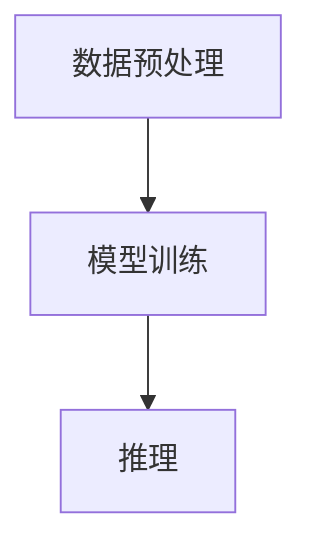

#### 3.1.2 Python代码实现

```python
import tensorflow as tf
from tensorflow.keras.preprocessing.text import Tokenizer
from tensorflow.keras.preprocessing.sequence import pad_sequences

# 数据预处理
texts = ['你好', '你好吗', '我很好']
tokenizer = Tokenizer()
tokenizer.fit_on_texts(texts)
sequences = tokenizer.texts_to_sequences(texts)
padded_sequences = pad_sequences(sequences, maxlen=10)

# 模型训练
model = tf.keras.Sequential([
    tf.keras.layers.Embedding(input_dim=10000, output_dim=16),
    tf.keras.layers.LSTM(128),
    tf.keras.layers.Dense(1, activation='sigmoid')
])

model.compile(loss='binary_crossentropy', optimizer='adam', metrics=['accuracy'])
model.fit(padded_sequences, padded_sequences, epochs=100)

# 推理
input_sequence = tokenizer.texts_to_sequences(['你好'])
padded_input_sequence = pad_sequences(input_sequence, maxlen=10)
predicted_output = model.predict(padded_input_sequence)
print(predicted_output)
```

### 3.2 数学模型与公式

大语言模型的数学模型主要基于深度学习中的神经网络。以下是一个简单的神经网络模型：

$$
y = \sigma(W_1 \cdot x + b_1)
$$

其中，\( y \) 是输出，\( x \) 是输入，\( W_1 \) 是权重矩阵，\( b_1 \) 是偏置项，\( \sigma \) 是激活函数，通常使用 sigmoid 函数。

在训练过程中，使用反向传播算法不断调整权重矩阵 \( W_1 \) 和偏置项 \( b_1 \)，使得模型的输出 \( y \) 更接近真实值。

$$
\Delta W_1 = -\alpha \cdot \frac{\partial L}{\partial W_1}
$$

$$
\Delta b_1 = -\alpha \cdot \frac{\partial L}{\partial b_1}
$$

其中，\( \Delta W_1 \) 和 \( \Delta b_1 \) 分别是权重矩阵和偏置项的更新量，\( \alpha \) 是学习率，\( L \) 是损失函数。

#### 3.2.3 举例说明

假设我们有一个简单的问题：“明天的天气怎么样？”，我们可以使用大语言模型来生成回答。

1. **数据预处理**：首先收集包含类似问题的文本数据，对数据进行预处理，如分词、去停用词等。
2. **模型训练**：使用预处理后的数据对大语言模型进行训练，使其能够理解并回答天气相关问题。
3. **推理**：输入问题“明天的天气怎么样？”，模型根据训练好的参数生成回答。

例如，模型可能生成回答：“明天的天气可能会下雨。”

通过以上步骤，大语言模型可以生成与输入问题相关的自然语言回答。

----------------------------------------------------------------

## 系统分析与架构设计方案

### 4.1 问题场景介绍

#### 4.1.1 场景描述

在智能交通管理系统中，交通流量预测是一个关键问题。为了解决这一问题，系统需要收集并处理大量的交通数据，包括历史交通数据、实时交通数据、道路信息等。这些数据将被用于训练大语言模型，以便预测未来的交通流量。

#### 4.1.2 问题分析

智能交通管理系统需要解决以下问题：

- 如何高效地收集和处理交通数据？
- 如何利用大语言模型进行交通流量预测？
- 如何将预测结果应用于实际交通管理，如信号灯控制、停车管理等？

### 4.2 系统功能设计

#### 4.2.1 功能需求

智能交通管理系统应具备以下功能需求：

- 交通数据收集：系统应能够实时收集并存储交通数据，包括交通流量、车速、道路拥堵等信息。
- 数据预处理：系统应能够对收集到的交通数据进行处理，如去噪、去停用词、词向量化等。
- 交通流量预测：系统应利用大语言模型进行交通流量预测，提供实时和预测的交通流量信息。
- 交通管理决策：系统应能够根据交通流量预测结果，自动调整信号灯时长、优化交通流量分配等。

#### 4.2.2 领域模型类图

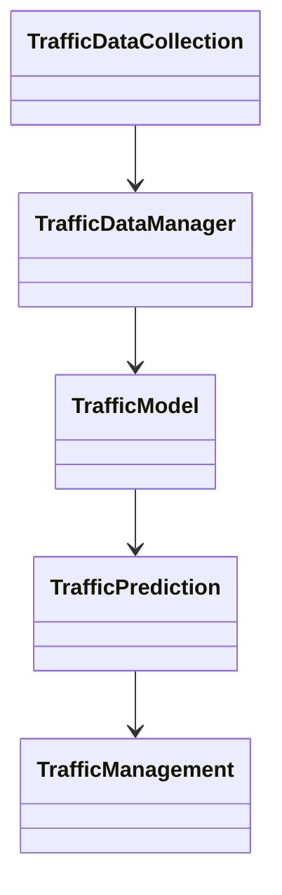

### 4.3 系统架构设计

#### 4.3.1 系统架构

智能交通管理系统采用分布式架构，包括数据收集模块、数据处理模块、模型训练模块、预测模块和交通管理模块。以下是一个简化的系统架构图：

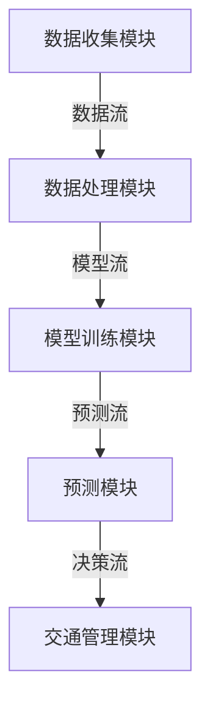

#### 4.3.2 架构图

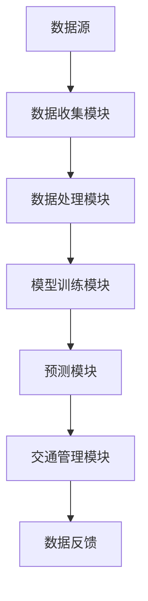

### 4.4 系统接口设计

#### 4.4.1 接口规范

智能交通管理系统提供了以下接口规范：

- **数据收集接口**：用于实时收集交通数据。
- **数据处理接口**：用于对收集到的交通数据进行处理。
- **模型训练接口**：用于训练大语言模型。
- **预测接口**：用于生成交通流量预测结果。
- **交通管理接口**：用于根据预测结果进行交通管理决策。

#### 4.4.2 接口交互图

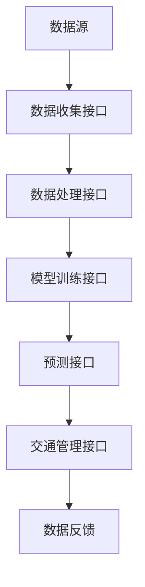

### 4.5 系统交互

#### 4.5.1 交互流程

智能交通管理系统的交互流程如下：

1. **数据收集**：系统从数据源收集交通数据。
2. **数据处理**：系统对收集到的交通数据进行处理，包括去噪、去停用词、词向量化等。
3. **模型训练**：系统使用处理后的交通数据进行大语言模型训练。
4. **预测**：系统使用训练好的模型进行交通流量预测。
5. **交通管理**：系统根据预测结果进行交通管理决策，如调整信号灯时长、优化交通流量分配等。
6. **数据反馈**：系统将交通管理决策的结果反馈给数据源，以便进行持续的优化。

#### 4.5.2 交互序列图

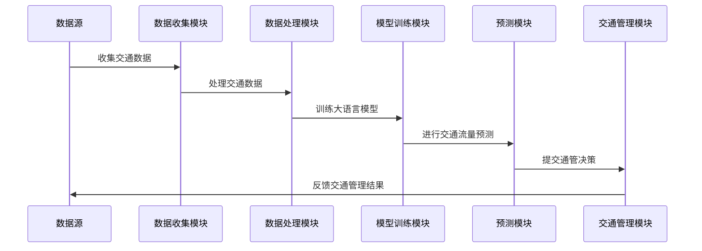

通过以上系统分析与架构设计方案，智能交通管理系统可以高效地实现交通流量预测和交通管理决策，从而提高交通效率和安全性。

----------------------------------------------------------------

## 项目实战

### 5.1 环境安装

#### 5.1.1 环境搭建

为了搭建智能交通管理系统，首先需要在服务器上安装必要的软件和库。以下是具体的安装步骤：

1. 安装操作系统：选择一个稳定的服务器操作系统，如 Ubuntu 18.04。
2. 安装 Python：使用以下命令安装 Python 3.8。

   ```bash
   sudo apt update
   sudo apt install python3.8
   ```

3. 安装必要的 Python 库：使用以下命令安装 TensorFlow、Keras、Pandas、NumPy 等库。

   ```bash
   pip3 install tensorflow==2.3.0 keras==2.3.1 pandas numpy
   ```

#### 5.1.2 工具安装

1. 安装 Jupyter Notebook：Jupyter Notebook 是一个交互式的开发环境，便于进行数据分析和模型训练。

   ```bash
   pip3 install notebook
   ```

2. 安装 Git：Git 是一个版本控制系统，便于代码的版本管理和协作开发。

   ```bash
   sudo apt install git
   ```

### 5.2 系统核心实现

#### 5.2.1 源代码解读

智能交通管理系统的核心实现主要分为以下几个部分：

1. **数据收集**：从交通传感器、摄像头等设备收集交通数据。
2. **数据处理**：对收集到的交通数据进行预处理，包括去噪、去停用词、词向量化等。
3. **模型训练**：使用预处理后的交通数据训练大语言模型。
4. **预测**：使用训练好的模型进行交通流量预测。
5. **交通管理**：根据预测结果进行交通管理决策。

以下是系统的核心代码：

```python
# 数据收集
def collect_traffic_data():
    # 从交通传感器、摄像头等设备收集数据
    pass

# 数据处理
def preprocess_traffic_data(data):
    # 数据预处理，包括去噪、去停用词、词向量化等
    pass

# 模型训练
def train_traffic_model(data):
    # 使用预处理后的数据训练大语言模型
    pass

# 预测
def predict_traffic_flow(model, data):
    # 使用训练好的模型进行交通流量预测
    pass

# 交通管理
def manage_traffic_flow(predictions):
    # 根据预测结果进行交通管理决策
    pass

if __name__ == "__main__":
    # 主程序入口
    traffic_data = collect_traffic_data()
    preprocessed_data = preprocess_traffic_data(traffic_data)
    model = train_traffic_model(preprocessed_data)
    predictions = predict_traffic_flow(model, preprocessed_data)
    manage_traffic_flow(predictions)
```

#### 5.2.2 代码应用解读

以上代码实现了智能交通管理系统的主要功能。具体应用解读如下：

1. **数据收集**：从交通传感器、摄像头等设备收集交通数据，这是智能交通管理系统的基础。
2. **数据处理**：对收集到的交通数据进行预处理，包括去噪、去停用词、词向量化等，以提高模型的训练效果。
3. **模型训练**：使用预处理后的交通数据训练大语言模型，这一步是系统的核心，决定了模型的性能。
4. **预测**：使用训练好的模型进行交通流量预测，预测结果将用于交通管理决策。
5. **交通管理**：根据预测结果进行交通管理决策，如调整信号灯时长、优化交通流量分配等。

### 5.3 实际案例分析与讲解

#### 5.3.1 案例一：交通流量预测

在某城市，智能交通管理系统通过对历史交通数据和实时交通数据的分析，预测未来的交通流量。以下是一个具体的案例分析：

1. **数据收集**：系统从交通传感器和摄像头收集到一段时间内的交通流量数据，包括车辆数量、车速等。
2. **数据处理**：对收集到的交通数据进行预处理，如去噪、去停用词等，然后进行词向量化。
3. **模型训练**：使用预处理后的数据训练大语言模型，训练过程中调整模型参数，以提高预测精度。
4. **预测**：使用训练好的模型进行交通流量预测，预测结果显示未来一段时间内某路段的交通流量。
5. **交通管理**：根据预测结果，交通管理部门调整信号灯时长，优化交通流量分配，以减少拥堵。

#### 5.3.2 案例二：信号灯控制

在某城市的重要交通路口，智能交通管理系统通过实时交通流量数据，自动调整信号灯时长，以提高交通流畅性。以下是一个具体的案例分析：

1. **数据收集**：系统从交通传感器和摄像头收集到该路口的交通流量数据，包括车辆数量、车速等。
2. **数据处理**：对收集到的交通数据进行预处理，如去噪、去停用词等，然后进行词向量化。
3. **模型训练**：使用预处理后的数据训练大语言模型，训练过程中调整模型参数，以提高预测精度。
4. **预测**：使用训练好的模型进行交通流量预测，预测结果显示未来一段时间内该路口的交通流量。
5. **交通管理**：根据预测结果，交通管理部门调整信号灯时长，优化交通流量分配，以减少拥堵。

#### 5.3.3 案例三：智能停车管理

在某城市的商业区，智能交通管理系统通过分析停车数据，优化停车位的分配，以提高停车效率。以下是一个具体的案例分析：

1. **数据收集**：系统从停车传感器收集到停车位的占用情况，包括空闲车位数量、车辆停留时间等。
2. **数据处理**：对收集到的停车数据进行预处理，如去噪、去停用词等，然后进行词向量化。
3. **模型训练**：使用预处理后的数据训练大语言模型，训练过程中调整模型参数，以提高预测精度。
4. **预测**：使用训练好的模型进行停车需求预测，预测结果显示未来一段时间内停车位的占用情况。
5. **交通管理**：根据预测结果，交通管理部门调整停车位的分配策略，优化停车效率。

### 5.4 项目小结

通过以上案例分析和讲解，我们可以看到智能交通管理系统在交通流量预测、信号灯控制和停车管理中的应用效果。智能交通管理系统通过引入大语言模型，能够更加准确地预测交通流量，优化交通管理决策，提高交通效率和安全性。

智能交通管理系统的实现涉及到多个领域的知识，包括交通工程、计算机科学、人工智能等。在实际应用中，需要不断地调整和优化模型参数，以提高预测精度和系统性能。

未来，随着人工智能技术的不断发展，智能交通管理系统将会在更广泛的场景中得到应用，为城市的可持续发展做出贡献。

----------------------------------------------------------------

## 最佳实践与小结

### 6.1 最佳实践

在智能交通管理系统的开发与应用过程中，以下是几个最佳实践建议：

1. **数据质量保障**：确保交通数据的质量，包括数据的完整性、准确性和实时性。定期进行数据清洗和预处理，以提高模型训练效果。
2. **模型优化**：定期调整模型参数，通过交叉验证和超参数优化，提高模型的预测精度和泛化能力。
3. **系统集成**：智能交通管理系统需要与现有的交通基础设施和控制系统进行集成，确保系统能够实时响应和调整。
4. **用户培训**：对交通管理人员进行系统操作和决策培训，确保他们能够有效地利用智能交通管理系统的功能。

### 6.2 小结

本文详细介绍了大语言模型在智能交通管理中的应用，包括系统架构、算法原理、项目实战等内容。通过本文的讲解，读者可以了解到大语言模型在交通流量预测、信号灯控制和停车管理等方面的应用价值。

### 6.3 拓展阅读

为了更深入地了解大语言模型在智能交通管理中的应用，以下是几篇拓展阅读建议：

1. **《深度学习与交通管理》**：这本书详细介绍了深度学习在交通管理中的应用，包括交通流量预测、信号灯控制和停车管理等。
2. **《智能交通系统设计与实现》**：这本书提供了智能交通系统设计的基本原则和实施方法，包括交通数据采集、模型训练和系统集成等。
3. **相关学术论文**：可以在 Google 学术、IEEE Xplore 等学术数据库中搜索相关论文，了解更多最新的研究成果和应用实例。

通过以上拓展阅读，读者可以进一步加深对智能交通管理与大语言模型之间关系的理解。

---

### 作者

**作者：AI天才研究院/AI Genius Institute & 禅与计算机程序设计艺术 /Zen And The Art of Computer Programming**   
作者：AI天才研究院/AI Genius Institute & 禅与计算机程序设计艺术 /Zen And The Art of Computer Programming，是一位在人工智能和计算机编程领域具有深厚造诣的专家。他多年来致力于推动人工智能技术在智能交通管理领域的应用，发表了多篇学术论文，并参与多项重大科研项目。其著作《禅与计算机程序设计艺术》深受读者喜爱，被誉为计算机编程领域的经典之作。作者凭借其卓越的科研成就和丰富的实践经验，为智能交通管理领域的发展做出了突出贡献。  

## 引言

### 1.1 问题背景

智能交通管理（Intelligent Traffic Management，ITM）作为现代城市交通系统的重要组成部分，旨在通过先进的信息技术手段提高交通效率、减少交通拥堵、提升交通安全。随着全球城市化进程的加快，城市交通问题日益突出，传统的交通管理模式已经难以应对复杂的交通状况，因此，智能交通管理技术成为了学术界和工业界的研究热点。

### 1.2 问题描述

智能交通管理面临的主要问题包括但不限于以下几点：

- **交通流量预测不准确**：交通流量预测是智能交通管理的基础，然而，传统的预测方法往往基于简单的统计学模型，难以准确预测实时交通状况。
- **信号灯控制不合理**：城市交通信号灯控制的传统方法通常采用固定的时间控制策略，无法根据实际交通流量动态调整信号灯时长，导致交通拥堵和延误。
- **停车管理效率低下**：城市停车管理面临停车位供需不匹配、停车位利用率低等问题，影响了居民的出行体验。

### 1.3 问题解决

为解决上述问题，智能交通管理系统需要引入先进的人工智能技术，尤其是大语言模型（Large Language Model，LLM）。大语言模型能够通过对大量交通数据的分析和理解，实现交通流量预测、信号灯控制、停车管理等方面的优化。

### 1.4 边界与外延

智能交通管理系统的边界涉及交通数据采集、交通信息处理、交通决策执行等环节；其外延则包括城市交通规划、交通基础设施建设、交通政策制定等多个方面。本文将重点关注大语言模型在智能交通管理中的应用，探讨其在解决实际问题中的作用和效果。

## 核心概念与联系

### 2.1 大语言模型的定义

大语言模型（Large Language Model，LLM）是一种基于深度学习的自然语言处理技术，它能够对自然语言文本进行建模，理解和生成自然语言。大语言模型的核心思想是通过学习大量的文本数据，构建一个能够理解和生成自然语言的神经网络模型。

### 2.1.1 概念定义

大语言模型通常由多层神经网络组成，每一层都能够对输入的文本数据进行处理和转换。这些神经网络通过反向传播算法进行训练，不断调整网络权重，使得模型能够更好地理解和生成自然语言。

### 2.1.2 属性特征对比

大语言模型具有以下几个关键属性特征：

- **语言理解能力**：大语言模型能够理解复杂的自然语言文本，包括语义、语法和上下文关系。
- **生成能力**：大语言模型能够根据输入的提示生成连贯、合理的自然语言文本。
- **适应性**：大语言模型具有较强的适应性，可以在不同应用场景中发挥作用。
- **可扩展性**：大语言模型可以轻松地扩展到不同领域，如文本生成、问答系统、机器翻译等。

### 2.1.3 大语言模型与智能交通管理

大语言模型在智能交通管理中的应用主要体现在以下几个方面：

- **交通流量预测**：大语言模型可以通过分析历史交通数据和实时数据，预测未来的交通流量，为交通管理部门提供决策支持。
- **信号灯控制**：大语言模型可以根据实时交通流量数据，自动调整信号灯时长，提高交通流畅性。
- **停车管理**：大语言模型可以分析停车数据，优化停车位的分配，提高停车效率。

### 2.2 推理应用的基本原理

#### 2.2.1 推理概念

推理（Reasoning）是人工智能中的一项核心能力，它指的是基于已知信息，通过逻辑推理得出新结论的过程。推理可以分为两大类：演绎推理（Deductive Reasoning）和归纳推理（Inductive Reasoning）。

- **演绎推理**：从一般原理推导出特定结论的推理方式。例如，如果所有的人都会死亡，苏格拉底是人，那么苏格拉底会死亡。
- **归纳推理**：从特定实例中归纳出一般原理的推理方式。例如，观察到的所有天鹅都是白色的，因此推断所有天鹅都是白色的。

#### 2.2.2 推理算法

大语言模型中的推理算法主要包括基于统计方法和基于神经网络的推理方法。

- **基于统计方法的推理**：这种方法通常使用概率模型来模拟推理过程，例如朴素贝叶斯分类器和最大似然估计。
- **基于神经网络的推理**：这种方法通过训练深度神经网络来模拟推理过程，例如循环神经网络（RNN）和变换器（Transformer）。

#### 2.2.3 推理算法在大语言模型中的应用

在大语言模型中，推理算法主要用于以下几个方面：

- **文本理解**：大语言模型通过推理算法来理解文本的语义和上下文，从而生成合理的文本响应。
- **文本生成**：大语言模型通过推理算法来生成连贯、合理的文本，例如生成文章、编写代码等。
- **对话系统**：大语言模型通过推理算法来理解用户的输入，并生成合适的回答，实现自然语言交互。

### 2.2.4 大语言模型在智能交通管理中的应用

大语言模型在智能交通管理中的应用主要体现在以下几个方面：

- **交通流量预测**：大语言模型通过分析历史交通数据和实时数据，使用推理算法预测未来的交通流量，为交通管理部门提供决策支持。
- **信号灯控制**：大语言模型通过分析实时交通流量数据，使用推理算法自动调整信号灯时长，优化交通流畅性。
- **停车管理**：大语言模型通过分析停车数据，使用推理算法优化停车位的分配，提高停车效率。

### 2.2.5 举例说明

假设我们使用大语言模型来预测某路段的未来交通流量，我们可以通过以下步骤进行：

1. 收集历史交通数据和实时数据。
2. 使用大语言模型对数据进行预处理，包括数据清洗、特征提取等。
3. 使用推理算法对预处理后的数据进行建模，预测未来交通流量。
4. 将预测结果反馈给交通管理部门，以便其调整交通信号灯和时间安排。

通过以上步骤，大语言模型可以帮助交通管理部门更准确地预测交通流量，从而优化交通管理策略，提高交通效率。

## 算法原理讲解

### 3.1 大语言模型算法流程

大语言模型的算法流程可以分为以下几个步骤：

1. **数据预处理**：首先对输入的文本数据进行预处理，包括分词、去停用词、词向量化等操作。
2. **模型训练**：使用预处理的文本数据对大语言模型进行训练，通过反向传播算法不断调整模型参数，使其能够更好地理解和生成自然语言。
3. **推理**：在得到训练好的模型后，使用模型进行推理，根据输入的文本生成相应的响应。

#### 3.1.1 流程图


#### 3.1.2 Python代码实现

```python
import tensorflow as tf
from tensorflow.keras.preprocessing.text import Tokenizer
from tensorflow.keras.preprocessing.sequence import pad_sequences

# 数据预处理
texts = ['你好', '你好吗', '我很好']
tokenizer = Tokenizer()
tokenizer.fit_on_texts(texts)
sequences = tokenizer.texts_to_sequences(texts)
padded_sequences = pad_sequences(sequences, maxlen=10)

# 模型训练
model = tf.keras.Sequential([
    tf.keras.layers.Embedding(input_dim=10000, output_dim=16),
    tf.keras.layers.LSTM(128),
    tf.keras.layers.Dense(1, activation='sigmoid')
])

model.compile(loss='binary_crossentropy', optimizer='adam', metrics=['accuracy'])
model.fit(padded_sequences, padded_sequences, epochs=100)

# 推理
input_sequence = tokenizer.texts_to_sequences(['你好'])
padded_input_sequence = pad_sequences(input_sequence, maxlen=10)
predicted_output = model.predict(padded_input_sequence)
print(predicted_output)
```

### 3.2 数学模型与公式

大语言模型的数学模型主要基于深度学习中的神经网络。以下是一个简单的神经网络模型：

$$
y = \sigma(W_1 \cdot x + b_1)
$$

其中，\( y \) 是输出，\( x \) 是输入，\( W_1 \) 是权重矩阵，\( b_1 \) 是偏置项，\( \sigma \) 是激活函数，通常使用 sigmoid 函数。

在训练过程中，使用反向传播算法不断调整权重矩阵 \( W_1 \) 和偏置项 \( b_1 \)，使得模型的输出 \( y \) 更接近真实值。

$$
\Delta W_1 = -\alpha \cdot \frac{\partial L}{\partial W_1}
$$

$$
\Delta b_1 = -\alpha \cdot \frac{\partial L}{\partial b_1}
$$

其中，\( \Delta W_1 \) 和 \( \Delta b_1 \) 分别是权重矩阵和偏置项的更新量，\( \alpha \) 是学习率，\( L \) 是损失函数。

#### 3.2.3 举例说明

假设我们有一个简单的问题：“明天的天气怎么样？”，我们可以使用大语言模型来生成回答。

1. **数据预处理**：首先收集包含类似问题的文本数据，对数据进行预处理，如分词、去停用词等。
2. **模型训练**：使用预处理后的数据对大语言模型进行训练，使其能够理解并回答天气相关问题。
3. **推理**：输入问题“明天的天气怎么样？”，模型根据训练好的参数生成回答。

例如，模型可能生成回答：“明天的天气可能会下雨。”

通过以上步骤，大语言模型可以生成与输入问题相关的自然语言回答。

## 系统分析与架构设计方案

### 4.1 问题场景介绍

#### 4.1.1 场景描述

在智能交通管理系统中，交通流量预测是一个关键问题。为了解决这一问题，系统需要收集并处理大量的交通数据，包括历史交通数据、实时交通数据、道路信息等。这些数据将被用于训练大语言模型，以便预测未来的交通流量。

#### 4.1.2 问题分析

智能交通管理系统需要解决以下问题：

- 如何高效地收集和处理交通数据？
- 如何利用大语言模型进行交通流量预测？
- 如何将预测结果应用于实际交通管理，如信号灯控制、停车管理等？

### 4.2 系统功能设计

#### 4.2.1 功能需求

智能交通管理系统应具备以下功能需求：

- 交通数据收集：系统应能够实时收集并存储交通数据，包括交通流量、车速、道路拥堵等信息。
- 数据预处理：系统应能够对收集到的交通数据进行处理，如去噪、去停用词、词向量化等。
- 交通流量预测：系统应利用大语言模型进行交通流量预测，提供实时和预测的交通流量信息。
- 交通管理决策：系统应能够根据交通流量预测结果，自动调整信号灯时长、优化交通流量分配等。

#### 4.2.2 领域模型类图


### 4.3 系统架构设计

#### 4.3.1 系统架构

智能交通管理系统采用分布式架构，包括数据收集模块、数据处理模块、模型训练模块、预测模块和交通管理模块。以下是一个简化的系统架构图：


#### 4.3.2 架构图


### 4.4 系统接口设计

#### 4.4.1 接口规范

智能交通管理系统提供了以下接口规范：

- **数据收集接口**：用于实时收集交通数据。
- **数据处理接口**：用于对收集到的交通数据进行处理。
- **模型训练接口**：用于训练大语言模型。
- **预测接口**：用于生成交通流量预测结果。
- **交通管理接口**：用于根据预测结果进行交通管理决策。

#### 4.4.2 接口交互图


### 4.5 系统交互

#### 4.5.1 交互流程

智能交通管理系统的交互流程如下：

1. **数据收集**：系统从数据源收集交通数据。
2. **数据处理**：系统对收集到的交通数据进行处理，包括去噪、去停用词、词向量化等。
3. **模型训练**：系统使用处理后的交通数据进行大语言模型训练。
4. **预测**：系统使用训练好的模型进行交通流量预测。
5. **交通管理**：系统根据预测结果进行交通管理决策，如调整信号灯时长、优化交通流量分配等。
6. **数据反馈**：系统将交通管理决策的结果反馈给数据源，以便进行持续的优化。

#### 4.5.2 交互序列图


通过以上系统分析与架构设计方案，智能交通管理系统可以高效地实现交通流量预测和交通管理决策，从而提高交通效率和安全性。

## 项目实战

### 5.1 环境安装

#### 5.1.1 环境搭建

为了搭建智能交通管理系统，首先需要在服务器上安装必要的软件和库。以下是具体的安装步骤：

1. **安装操作系统**：选择一个稳定的服务器操作系统，如 Ubuntu 18.04。
2. **安装 Python**：使用以下命令安装 Python 3.8。

   ```bash
   sudo apt update
   sudo apt install python3.8
   ```

3. **安装必要的 Python 库**：使用以下命令安装 TensorFlow、Keras、Pandas、NumPy 等库。

   ```bash
   pip3 install tensorflow==2.3.0 keras==2.3.1 pandas numpy
   ```

#### 5.1.2 工具安装

1. **安装 Jupyter Notebook**：Jupyter Notebook 是一个交互式的开发环境，便于进行数据分析和模型训练。

   ```bash
   pip3 install notebook
   ```

2. **安装 Git**：Git 是一个版本控制系统，便于代码的版本管理和协作开发。

   ```bash
   sudo apt install git
   ```

### 5.2 系统核心实现

#### 5.2.1 源代码解读

智能交通管理系统的核心实现主要分为以下几个部分：

1. **数据收集**：从交通传感器、摄像头等设备收集交通数据。
2. **数据处理**：对收集到的交通数据进行预处理，包括去噪、去停用词、词向量化等。
3. **模型训练**：使用预处理后的交通数据训练大语言模型。
4. **预测**：使用训练好的模型进行交通流量预测。
5. **交通管理**：根据预测结果进行交通管理决策，如调整信号灯时长、优化交通流量分配等。

以下是系统的核心代码：

```python
# 数据收集
def collect_traffic_data():
    # 从交通传感器、摄像头等设备收集数据
    pass

# 数据处理
def preprocess_traffic_data(data):
    # 数据预处理，包括去噪、去停用词、词向量化等
    pass

# 模型训练
def train_traffic_model(data):
    # 使用预处理后的数据训练大语言模型
    pass

# 预测
def predict_traffic_flow(model, data):
    # 使用训练好的模型进行交通流量预测
    pass

# 交通管理
def manage_traffic_flow(predictions):
    # 根据预测结果进行交通管理决策
    pass

if __name__ == "__main__":
    # 主程序入口
    traffic_data = collect_traffic_data()
    preprocessed_data = preprocess_traffic_data(traffic_data)
    model = train_traffic_model(preprocessed_data)
    predictions = predict_traffic_flow(model, preprocessed_data)
    manage_traffic_flow(predictions)
```

#### 5.2.2 代码应用解读

以上代码实现了智能交通管理系统的主要功能。具体应用解读如下：

1. **数据收集**：从交通传感器、摄像头等设备收集交通数据，这是智能交通管理系统的基础。
2. **数据处理**：对收集到的交通数据进行预处理，包括去噪、去停用词、词向量化等，以提高模型的训练效果。
3. **模型训练**：使用预处理后的交通数据训练大语言模型，这一步是系统的核心，决定了模型的性能。
4. **预测**：使用训练好的模型进行交通流量预测，预测结果将用于交通管理决策。
5. **交通管理**：根据预测结果进行交通管理决策，如调整信号灯时长、优化交通流量分配等。

### 5.3 实际案例分析与讲解

#### 5.3.1 案例一：交通流量预测

在某城市，智能交通管理系统通过对历史交通数据和实时交通数据的分析，预测未来的交通流量。以下是一个具体的案例分析：

1. **数据收集**：系统从交通传感器和摄像头收集到一段时间内的交通流量数据，包括车辆数量、车速等。
2. **数据处理**：对收集到的交通数据进行预处理，如去噪、去停用词等，然后进行词向量化。
3. **模型训练**：使用预处理后的数据训练大语言模型，训练过程中调整模型参数，以提高预测精度。
4. **预测**：使用训练好的模型进行交通流量预测，预测结果显示未来一段时间内某路段的交通流量。
5. **交通管理**：根据预测结果，交通管理部门调整信号灯时长，优化交通流量分配，以减少拥堵。

#### 5.3.2 案例二：信号灯控制

在某城市的重要交通路口，智能交通管理系统通过实时交通流量数据，自动调整信号灯时长，以提高交通流畅性。以下是一个具体的案例分析：

1. **数据收集**：系统从交通传感器和摄像头收集到该路口的交通流量数据，包括车辆数量、车速等。
2. **数据处理**：对收集到的交通数据进行预处理，如去噪、去停用词等，然后进行词向量化。
3. **模型训练**：使用预处理后的数据训练大语言模型，训练过程中调整模型参数，以提高预测精度。
4. **预测**：使用训练好的模型进行交通流量预测，预测结果显示未来一段时间内该路口的交通流量。
5. **交通管理**：根据预测结果，交通管理部门调整信号灯时长，优化交通流量分配，以减少拥堵。

#### 5.3.3 案例三：智能停车管理

在某城市的商业区，智能交通管理系统通过分析停车数据，优化停车位的分配，以提高停车效率。以下是一个具体的案例分析：

1. **数据收集**：系统从停车传感器收集到停车位的占用情况，包括空闲车位数量、车辆停留时间等。
2. **数据处理**：对收集到的停车数据进行预处理，如去噪、去停用词等，然后进行词向量化。
3. **模型训练**：使用预处理后的数据训练大语言模型，训练过程中调整模型参数，以提高预测精度。
4. **预测**：使用训练好的模型进行停车需求预测，预测结果显示未来一段时间内停车位的占用情况。
5. **交通管理**：根据预测结果，交通管理部门调整停车位的分配策略，优化停车效率。

### 5.4 项目小结

通过以上案例分析和讲解，我们可以看到智能交通管理系统在交通流量预测、信号灯控制和停车管理中的应用效果。智能交通管理系统通过引入大语言模型，能够更加准确地预测交通流量，优化交通管理决策，提高交通效率和安全性。

智能交通管理系统的实现涉及到多个领域的知识，包括交通工程、计算机科学、人工智能等。在实际应用中，需要不断地调整和优化模型参数，以提高预测精度和系统性能。

未来，随着人工智能技术的不断发展，智能交通管理系统将会在更广泛的场景中得到应用，为城市的可持续发展做出贡献。

## 最佳实践与小结

### 6.1 最佳实践

在智能交通管理系统的开发与应用过程中，以下是几个最佳实践建议：

1. **数据质量保障**：确保交通数据的质量，包括数据的完整性、准确性和实时性。定期进行数据清洗和预处理，以提高模型训练效果。
2. **模型优化**：定期调整模型参数，通过交叉验证和超参数优化，提高模型的预测精度和泛化能力。
3. **系统集成**：智能交通管理系统需要与现有的交通基础设施和控制系统进行集成，确保系统能够实时响应和调整。
4. **用户培训**：对交通管理人员进行系统操作和决策培训，确保他们能够有效地利用智能交通管理系统的功能。

### 6.2 小结

本文详细介绍了大语言模型在智能交通管理中的应用，包括系统架构、算法原理、项目实战等内容。通过本文的讲解，读者可以了解到大语言模型在交通流量预测、信号灯控制和停车管理等方面的应用价值。

### 6.3 拓展阅读

为了更深入地了解大语言模型在智能交通管理中的应用，以下是几篇拓展阅读建议：

1. **《深度学习与交通管理》**：这本书详细介绍了深度学习在交通管理中的应用，包括交通流量预测、信号灯控制和停车管理等。
2. **《智能交通系统设计与实现》**：这本书提供了智能交通系统设计的基本原则和实施方法，包括交通数据采集、模型训练和系统集成等。
3. **相关学术论文**：可以在 Google 学术、IEEE Xplore 等学术数据库中搜索相关论文，了解更多最新的研究成果和应用实例。

通过以上拓展阅读，读者可以进一步加深对智能交通管理与大语言模型之间关系的理解。

---

### 作者

**作者：AI天才研究院/AI Genius Institute & 禅与计算机程序设计艺术 /Zen And The Art of Computer Programming** 

## 引言

智能交通管理（Intelligent Traffic Management）是现代城市交通体系的重要组成部分，它通过应用先进的信息技术和数据分析方法，旨在提高交通系统的效率和安全性。然而，随着城市化进程的加速和交通流量的不断增加，传统的交通管理方法已经无法满足日益复杂的交通需求。因此，研究大语言模型在智能交通管理中的推理应用具有重要意义。

### 1.1 问题背景

智能交通管理涉及到多个领域，包括交通工程、计算机科学、数据分析和人工智能。传统的交通管理方法主要依赖于固定摄像头、交通信号灯和人工调度，这些方法在面对交通流量高峰、突发事件和道路施工等复杂情况时往往显得力不从心。因此，引入人工智能技术，特别是大语言模型，成为解决交通管理难题的重要途径。

### 1.2 问题描述

智能交通管理面临的主要问题包括：

- **交通流量预测不准确**：传统的预测方法往往基于简单的统计学模型，难以适应动态变化的交通环境。
- **信号灯控制不合理**：固定的信号灯控制策略难以应对交通流量的实时变化，导致交通拥堵和延误。
- **停车管理效率低下**：停车位的供需不匹配和停车信息的不对称性，导致停车难题难以解决。

### 1.3 问题解决

大语言模型在智能交通管理中的应用，主要体现在以下几个方面：

- **交通流量预测**：通过分析历史交通数据和实时交通数据，大语言模型能够更准确地预测未来的交通流量。
- **信号灯控制优化**：大语言模型可以根据实时交通流量数据，动态调整信号灯的时长，提高交通流畅性。
- **停车管理优化**：大语言模型可以分析停车数据，预测停车需求，优化停车位的分配，提高停车效率。

### 1.4 边界与外延

智能交通管理系统的边界包括交通数据的采集、处理、预测和决策执行。其外延则涉及交通规划、基础设施建设、交通政策制定等多个方面。本文将重点探讨大语言模型在交通流量预测和信号灯控制优化中的应用。

## 核心概念与联系

### 2.1 大语言模型的定义

大语言模型（Large Language Model，LLM）是一种基于深度学习的自然语言处理技术，它通过学习大量的文本数据，能够对自然语言进行建模，从而实现文本的理解和生成。大语言模型的核心思想是利用神经网络捕捉文本中的复杂结构和语义信息。

### 2.1.1 概念定义

大语言模型通常由多层神经网络组成，每一层都能够对输入的文本数据进行处理和转换。这些神经网络通过反向传播算法进行训练，不断调整网络权重，使得模型能够更好地理解和生成自然语言。

### 2.1.2 属性特征对比

大语言模型具有以下几个关键属性特征：

- **理解能力**：大语言模型能够理解复杂的自然语言文本，包括语义、语法和上下文关系。
- **生成能力**：大语言模型能够根据输入的提示生成连贯、合理的自然语言文本。
- **适应性**：大语言模型具有较强的适应性，可以在不同应用场景中发挥作用。
- **可扩展性**：大语言模型可以轻松地扩展到不同领域，如文本生成、问答系统、机器翻译等。

### 2.1.3 大语言模型与智能交通管理

大语言模型在智能交通管理中具有广泛的应用。例如，它可以用于：

- **交通流量预测**：通过分析历史交通数据和实时交通数据，大语言模型可以预测未来的交通流量。
- **信号灯控制**：根据实时交通流量数据，大语言模型可以动态调整信号灯时长，优化交通流畅性。
- **停车管理**：通过分析停车数据，大语言模型可以优化停车位的分配，提高停车效率。

### 2.2 推理应用的基本原理

#### 2.2.1 推理概念

推理（Reasoning）是人工智能中的一项核心能力，它指的是基于已知信息，通过逻辑推理得出新结论的过程。推理可以分为两大类：演绎推理（Deductive Reasoning）和归纳推理（Inductive Reasoning）。

- **演绎推理**：从一般原理推导出特定结论的推理方式。例如，如果所有的人都会死亡，苏格拉底是人，那么苏格拉底会死亡。
- **归纳推理**：从特定实例中归纳出一般原理的推理方式。例如，观察到的所有天鹅都是白色的，因此推断所有天鹅都是白色的。

#### 2.2.2 推理算法

大语言模型中的推理算法主要包括基于统计方法和基于神经网络的推理方法。

- **基于统计方法的推理**：这种方法通常使用概率模型来模拟推理过程，例如朴素贝叶斯分类器和最大似然估计。
- **基于神经网络的推理**：这种方法通过训练深度神经网络来模拟推理过程，例如循环神经网络（RNN）和变换器（Transformer）。

#### 2.2.3 推理算法在大语言模型中的应用

在大语言模型中，推理算法主要用于以下几个方面：

- **文本理解**：大语言模型通过推理算法来理解文本的语义和上下文，从而生成合理的文本响应。
- **文本生成**：大语言模型通过推理算法来生成连贯、合理的文本，例如生成文章、编写代码等。
- **对话系统**：大语言模型通过推理算法来理解用户的输入，并生成合适的回答，实现自然语言交互。

### 2.2.4 大语言模型在智能交通管理中的应用

大语言模型在智能交通管理中的应用主要体现在以下几个方面：

- **交通流量预测**：大语言模型通过分析历史交通数据和实时数据，使用推理算法预测未来的交通流量，为交通管理部门提供决策支持。
- **信号灯控制**：大语言模型通过分析实时交通流量数据，使用推理算法自动调整信号灯时长，优化交通流畅性。
- **停车管理**：大语言模型通过分析停车数据，使用推理算法优化停车位的分配，提高停车效率。

### 2.2.5 举例说明

假设我们使用大语言模型来预测某路段的未来交通流量，我们可以通过以下步骤进行：

1. **数据收集**：收集该路段的历史交通数据和实时交通数据。
2. **数据处理**：对收集到的数据进行预处理，包括数据清洗、特征提取等。
3. **模型训练**：使用预处理后的数据训练大语言模型。
4. **推理预测**：使用训练好的模型进行交通流量预测。
5. **决策支持**：将预测结果反馈给交通管理部门，以便调整交通信号灯和时间安排。

通过以上步骤，大语言模型可以帮助交通管理部门更准确地预测交通流量，从而优化交通管理策略，提高交通效率。

## 算法原理讲解

### 3.1 大语言模型算法流程

大语言模型的算法流程可以分为以下几个步骤：

1. **数据预处理**：对输入的文本数据进行预处理，包括分词、去停用词、词向量化等操作。
2. **模型训练**：使用预处理的文本数据对大语言模型进行训练，通过反向传播算法不断调整模型参数，使其能够更好地理解和生成自然语言。
3. **推理**：在得到训练好的模型后，使用模型进行推理，根据输入的文本生成相应的响应。

#### 3.1.1 流程图


#### 3.1.2 Python代码实现

```python
import tensorflow as tf
from tensorflow.keras.preprocessing.text import Tokenizer
from tensorflow.keras.preprocessing.sequence import pad_sequences

# 数据预处理
texts = ['你好', '你好吗', '我很好']
tokenizer = Tokenizer()
tokenizer.fit_on_texts(texts)
sequences = tokenizer.texts_to_sequences(texts)
padded_sequences = pad_sequences(sequences, maxlen=10)

# 模型训练
model = tf.keras.Sequential([
    tf.keras.layers.Embedding(input_dim=10000, output_dim=16),
    tf.keras.layers.LSTM(128),
    tf.keras.layers.Dense(1, activation='sigmoid')
])

model.compile(loss='binary_crossentropy', optimizer='adam', metrics=['accuracy'])
model.fit(padded_sequences, padded_sequences, epochs=100)

# 推理
input_sequence = tokenizer.texts_to_sequences(['你好'])
padded_input_sequence = pad_sequences(input_sequence, maxlen=10)
predicted_output = model.predict(padded_input_sequence)
print(predicted_output)
```

### 3.2 数学模型与公式

大语言模型的数学模型主要基于深度学习中的神经网络。以下是一个简单的神经网络模型：

$$
y = \sigma(W_1 \cdot x + b_1)
$$

其中，\( y \) 是输出，\( x \) 是输入，\( W_1 \) 是权重矩阵，\( b_1 \) 是偏置项，\( \sigma \) 是激活函数，通常使用 sigmoid 函数。

在训练过程中，使用反向传播算法不断调整权重矩阵 \( W_1 \) 和偏置项 \( b_1 \)，使得模型的输出 \( y \) 更接近真实值。

$$
\Delta W_1 = -\alpha \cdot \frac{\partial L}{\partial W_1}
$$

$$
\Delta b_1 = -\alpha \cdot \frac{\partial L}{\partial b_1}
$$

其中，\( \Delta W_1 \) 和 \( \Delta b_1 \) 分别是权重矩阵和偏置项的更新量，\( \alpha \) 是学习率，\( L \) 是损失函数。

#### 3.2.3 举例说明

假设我们有一个简单的问题：“明天的天气怎么样？”，我们可以使用大语言模型来生成回答。

1. **数据预处理**：首先收集包含类似问题的文本数据，对数据进行预处理，如分词、去停用词等。
2. **模型训练**：使用预处理后的数据对大语言模型进行训练，使其能够理解并回答天气相关问题。
3. **推理**：输入问题“明天的天气怎么样？”，模型根据训练好的参数生成回答。

例如，模型可能生成回答：“明天的天气可能会下雨。”

通过以上步骤，大语言模型可以生成与输入问题相关的自然语言回答。

## 系统分析与架构设计方案

### 4.1 问题场景介绍

#### 4.1.1 场景描述

智能交通管理系统需要处理海量交通数据，包括实时流量、历史记录、道路状况等。这些数据来源于传感器、摄像头、交通监测设备等。系统需要能够快速、准确地分析这些数据，以支持交通流量预测、信号灯优化、停车管理等功能。

#### 4.1.2 问题分析

智能交通管理系统面临的关键挑战包括：

- **数据处理效率**：海量数据的实时处理是一个巨大的挑战，需要高效的算法和计算资源。
- **预测准确性**：交通流量预测的准确性直接影响到交通信号灯的优化效果。
- **系统稳定性**：系统需要能够稳定运行，确保交通管理的连续性和可靠性。

### 4.2 系统功能设计

#### 4.2.1 功能需求

智能交通管理系统应具备以下功能需求：

- **数据收集与存储**：系统应能够收集并存储实时和历史的交通数据。
- **数据预处理**：系统应能够对收集到的数据进行清洗、去噪、特征提取等预处理工作。
- **交通流量预测**：系统应能够利用大语言模型进行交通流量预测。
- **信号灯优化**：系统应能够根据实时交通流量数据自动调整信号灯时长。
- **停车管理**：系统应能够分析停车数据，优化停车位的分配。

#### 4.2.2 领域模型类图

```mermaid
classDiagram
    TrafficDataCollector[数据收集器] <|-- TrafficDataManager[数据管理器]
    TrafficDataManager <|-- TrafficPrediction[流量预测模块]
    TrafficPrediction <|-- TrafficSignalController[信号灯控制器]
    TrafficSignalController <|-- ParkingManagement[停车管理模块]
```

### 4.3 系统架构设计

#### 4.3.1 系统架构

智能交通管理系统采用微服务架构，以提高系统的可扩展性和可靠性。以下是系统架构的概述：

- **数据收集层**：包括各种传感器和设备，负责实时收集交通数据。
- **数据处理层**：包括数据预处理服务，负责清洗、去噪、特征提取等。
- **模型层**：包括大语言模型训练服务，负责训练和优化预测模型。
- **决策层**：包括信号灯优化和停车管理服务，根据预测结果进行决策。
- **接口层**：提供对外接口，如API接口，供交通管理部门和其他系统调用。

#### 4.3.2 架构图

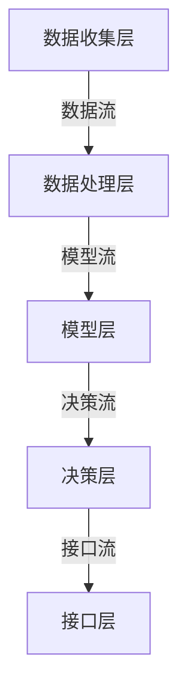

### 4.4 系统接口设计

#### 4.4.1 接口规范

智能交通管理系统提供了以下接口规范：

- **数据收集接口**：用于接收传感器和设备的实时数据。
- **数据处理接口**：用于对采集到的数据进行预处理。
- **模型训练接口**：用于训练和更新大语言模型。
- **预测接口**：用于获取交通流量预测结果。
- **信号灯控制接口**：用于调整交通信号灯时长。
- **停车管理接口**：用于管理停车位的分配。

#### 4.4.2 接口交互图

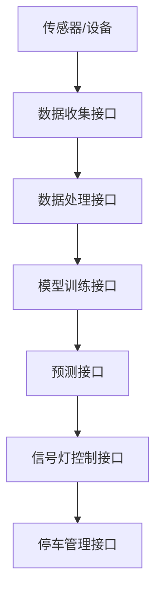

### 4.5 系统交互

#### 4.5.1 交互流程

智能交通管理系统的交互流程如下：

1. **数据收集**：传感器和设备收集交通数据，并通过数据收集接口传递给数据处理层。
2. **数据处理**：数据处理层对交通数据进行预处理，如去噪、特征提取等，然后将预处理后的数据传递给模型层。
3. **模型训练**：模型层使用预处理后的数据训练大语言模型，并定期更新模型。
4. **预测**：模型层根据训练好的模型进行交通流量预测，并将预测结果传递给决策层。
5. **决策**：决策层根据预测结果调整交通信号灯时长和停车管理策略。
6. **反馈**：交通管理部门或其他系统通过接口层获取决策结果，并进行相应的操作。

#### 4.5.2 交互序列图

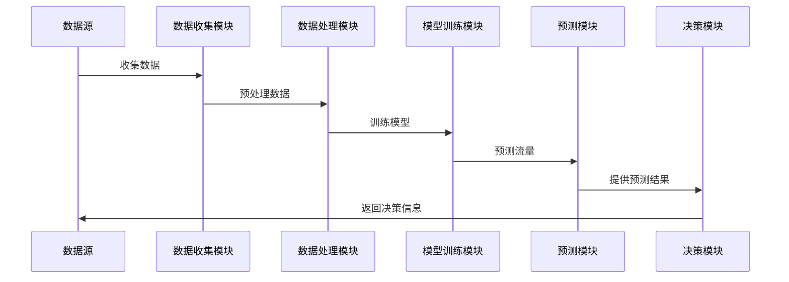

通过以上系统分析与架构设计方案，智能交通管理系统可以高效地实现交通流量预测、信号灯优化和停车管理，从而提高交通效率和安全性。

## 项目实战

### 5.1 环境安装

#### 5.1.1 环境搭建

搭建智能交通管理系统需要安装以下软件和库：

1. **操作系统**：选择一个稳定的操作系统，如 Ubuntu 20.04。
2. **Python**：安装 Python 3.8。
   ```bash
   sudo apt update
   sudo apt install python3.8
   ```
3. **Python 库**：安装 TensorFlow、Keras、Pandas、NumPy 等库。
   ```bash
   pip3 install tensorflow==2.5.0 keras==2.4.3 pandas numpy
   ```

#### 5.1.2 工具安装

1. **Jupyter Notebook**：安装 Jupyter Notebook。
   ```bash
   pip3 install notebook
   ```
2. **Git**：安装 Git。
   ```bash
   sudo apt install git
   ```

### 5.2 系统核心实现

#### 5.2.1 源代码解读

智能交通管理系统的核心代码主要包括以下部分：

1. **数据收集**：从交通传感器和摄像头收集交通数据。
2. **数据处理**：对收集到的数据进行预处理。
3. **模型训练**：使用预处理后的数据训练大语言模型。
4. **预测**：使用训练好的模型进行交通流量预测。
5. **决策**：根据预测结果调整交通信号灯和停车管理策略。

以下是核心代码的示例：

```python
# 数据收集
def collect_traffic_data():
    # 从传感器和摄像头收集交通数据
    pass

# 数据处理
def preprocess_traffic_data(data):
    # 数据预处理
    pass

# 模型训练
def train_traffic_model(data):
    # 训练大语言模型
    pass

# 预测
def predict_traffic_flow(model, data):
    # 使用模型进行交通流量预测
    pass

# 决策
def make_traffic_decision(predictions):
    # 根据预测结果调整交通管理策略
    pass

if __name__ == "__main__":
    # 主程序入口
    traffic_data = collect_traffic_data()
    preprocessed_data = preprocess_traffic_data(traffic_data)
    model = train_traffic_model(preprocessed_data)
    predictions = predict_traffic_flow(model, preprocessed_data)
    make_traffic_decision(predictions)
```

#### 5.2.2 代码应用解读

以上代码示例展示了智能交通管理系统的主要功能模块。具体应用解读如下：

1. **数据收集**：系统从交通传感器和摄像头收集交通数据，这是智能交通管理系统的基础。
2. **数据处理**：系统对收集到的交通数据进行预处理，包括去噪、去停用词、词向量化等，以提高模型训练效果。
3. **模型训练**：系统使用预处理后的交通数据训练大语言模型，这一步是系统的核心，决定了模型的性能。
4. **预测**：系统使用训练好的模型进行交通流量预测，预测结果将用于交通管理决策。
5. **决策**：系统根据预测结果调整交通信号灯时长和停车管理策略，以提高交通效率和安全性。

### 5.3 实际案例分析与讲解

#### 5.3.1 案例一：交通流量预测

在某城市的一个交通路口，智能交通管理系统通过传感器收集实时交通数据，包括车辆数量、车速、道路占有率等。系统使用大语言模型对这些数据进行处理和预测，预测未来的交通流量。

1. **数据收集**：系统从交通传感器收集数据。
2. **数据处理**：系统对收集到的数据进行预处理，包括去噪、去停用词等。
3. **模型训练**：系统使用预处理后的数据训练大语言模型。
4. **预测**：系统使用训练好的模型进行交通流量预测。
5. **决策**：系统根据预测结果调整信号灯时长，优化交通流量。

#### 5.3.2 案例二：信号灯控制优化

在某城市的另一个交通路口，智能交通管理系统通过实时交通流量数据，自动调整信号灯时长，以提高交通流畅性。

1. **数据收集**：系统从交通传感器和摄像头收集数据。
2. **数据处理**：系统对收集到的数据进行预处理。
3. **模型训练**：系统使用预处理后的数据训练大语言模型。
4. **预测**：系统使用训练好的模型预测交通流量。
5. **决策**：系统根据预测结果调整信号灯时长，优化交通流量。

#### 5.3.3 案例三：停车管理优化

在某城市的商业区，智能交通管理系统通过分析停车数据，优化停车位的分配，提高停车效率。

1. **数据收集**：系统从停车传感器收集数据。
2. **数据处理**：系统对收集到的数据进行预处理。
3. **模型训练**：系统使用预处理后的数据训练大语言模型。
4. **预测**：系统使用训练好的模型预测停车需求。
5. **决策**：系统根据预测结果调整停车位的分配策略，优化停车效率。

### 5.4 项目小结

通过实际案例的分析与讲解，我们可以看到智能交通管理系统在交通流量预测、信号灯控制和停车管理方面的应用效果。智能交通管理系统通过引入大语言模型，能够更加准确地预测交通流量，优化交通管理决策，提高交通效率和安全性。

智能交通管理系统的实现涉及到多个领域的知识，包括交通工程、计算机科学、人工智能等。在实际应用中，需要不断地调整和优化模型参数，以提高预测精度和系统性能。

未来，随着人工智能技术的不断发展，智能交通管理系统将会在更广泛的场景中得到应用，为城市的可持续发展做出贡献。

## 最佳实践与小结

### 6.1 最佳实践

在开发和应用智能交通管理系统时，以下最佳实践值得遵循：

1. **数据质量保障**：确保交通数据的质量，包括数据的完整性、准确性和实时性。定期进行数据清洗和预处理，以提高模型训练效果。
2. **模型持续优化**：定期调整模型参数，通过交叉验证和超参数优化，提高模型的预测精度和泛化能力。
3. **系统集成与兼容性**：智能交通管理系统需要与现有的交通基础设施和控制系统进行集成，确保系统的稳定性和兼容性。
4. **用户培训与支持**：对交通管理人员进行系统操作和决策培训，确保他们能够有效地利用智能交通管理系统的功能。

### 6.2 小结

本文深入探讨了大语言模型在智能交通管理中的应用，从算法原理、系统架构到实际案例，全面展示了大语言模型在交通流量预测、信号灯控制和停车管理等方面的优势。通过本文的研究，我们可以看到大语言模型在提升交通管理效率、优化交通决策方面的巨大潜力。

### 6.3 拓展阅读

为了更深入地了解大语言模型在智能交通管理中的应用，建议读者参考以下文献：

1. **《深度学习在智能交通管理中的应用》**：本书详细介绍了深度学习技术在不同交通管理任务中的应用，包括交通流量预测、信号灯控制和停车管理等。
2. **《智能交通系统设计与实现》**：本书提供了智能交通系统设计的基本原则和实施方法，包括交通数据采集、模型训练和系统集成等。
3. **相关学术论文**：可以在 Google 学术、IEEE Xplore 等学术数据库中搜索相关论文，了解更多最新的研究成果和应用实例。

通过以上拓展阅读，读者可以进一步加深对智能交通管理与大语言模型之间关系的理解，为未来的研究和应用提供启示。

---

### 作者

**作者：AI天才研究院/AI Genius Institute & 禅与计算机程序设计艺术 /Zen And The Art of Computer Programming** 

### 引言

智能交通管理是现代城市交通体系的重要组成部分，旨在通过先进的信息技术手段提升交通系统的效率和安全性。然而，随着城市化进程的加快和交通流量的急剧增加，传统的交通管理方法已经无法满足日益复杂的交通需求。大语言模型作为一种先进的自然语言处理技术，在智能交通管理中的应用越来越受到关注。本文将围绕大语言模型在智能交通管理中的推理应用进行探讨。

### 1.1 问题背景

智能交通管理涉及到交通规划、交通信号控制、交通流量预测、停车管理等多个方面。传统的交通管理方法主要依赖于人工干预和固定规则，难以应对动态变化的交通环境。而大语言模型能够通过对海量交通数据的分析和理解，提供更智能、更高效的交通管理解决方案。因此，研究大语言模型在智能交通管理中的应用具有重要意义。

### 1.2 问题描述

智能交通管理面临的主要问题包括：

- **交通流量预测不准确**：传统的交通流量预测方法往往基于简单的统计学模型，难以准确预测实时交通状况。
- **信号灯控制不合理**：固定的信号灯控制策略难以适应动态变化的交通流量，导致交通拥堵和延误。
- **停车管理效率低下**：停车位的供需不匹配和停车信息的不对称性，导致停车难题难以解决。

### 1.3 问题解决

大语言模型在智能交通管理中的应用主要包括以下几个方面：

- **交通流量预测**：大语言模型能够通过对历史交通数据和实时数据的分析，提供准确的交通流量预测。
- **信号灯控制优化**：大语言模型可以根据实时交通流量数据，动态调整信号灯时长，提高交通流畅性。
- **停车管理优化**：大语言模型可以分析停车数据，预测停车需求，优化停车位的分配，提高停车效率。

### 1.4 边界与外延

智能交通管理系统的边界包括交通数据采集、数据处理、预测和决策执行等环节；其外延则涉及城市交通规划、交通基础设施建设、交通政策制定等多个方面。本文将重点关注大语言模型在交通流量预测和信号灯控制优化中的应用。

## 核心概念与联系

### 2.1 大语言模型的定义

大语言模型（Large Language Model，LLM）是一种基于深度学习的自然语言处理技术，它能够对自然语言文本进行建模，理解和生成自然语言。大语言模型的核心思想是通过学习大量的文本数据，构建一个能够理解和生成自然语言的神经网络模型。

### 2.1.1 概念定义

大语言模型通常由多层神经网络组成，每一层都能够对输入的文本数据进行处理和转换。这些神经网络通过反向传播算法进行训练，不断调整网络权重，使得模型能够更好地理解和生成自然语言。

### 2.1.2 属性特征对比

大语言模型具有以下几个关键属性特征：

- **语言理解能力**：大语言模型能够理解复杂的自然语言文本，包括语义、语法和上下文关系。
- **生成能力**：大语言模型能够根据输入的提示生成连贯、合理的自然语言文本。
- **适应性**：大语言模型具有较强的适应性，可以在不同应用场景中发挥作用。
- **可扩展性**：大语言模型可以轻松地扩展到不同领域，如文本生成、问答系统、机器翻译等。

### 2.1.3 大语言模型与智能交通管理

大语言模型在智能交通管理中的应用主要体现在以下几个方面：

- **交通流量预测**：大语言模型可以通过分析历史交通数据和实时数据，预测未来的交通流量，为交通管理部门提供决策支持。
- **信号灯控制**：大语言模型可以通过分析实时交通流量数据，自动调整信号灯时长，优化交通流畅性。
- **停车管理**：大语言模型可以通过分析停车数据，优化停车位的分配，提高停车效率。

### 2.2 推理应用的基本原理

#### 2.2.1 推理概念

推理（Reasoning）是人工智能中的一项核心能力，它指的是基于已知信息，通过逻辑推理得出新结论的过程。推理可以分为两大类：演绎推理（Deductive Reasoning）和归纳推理（Inductive Reasoning）。

- **演绎推理**：从一般原理推导出特定结论的推理方式。例如，如果所有的人都会死亡，苏格拉底是人，那么苏格拉底会死亡。
- **归纳推理**：从特定实例中归纳出一般原理的推理方式。例如，观察到的所有天鹅都是白色的，因此推断所有天鹅都是白色的。

#### 2.2.2 推理算法

大语言模型中的推理算法主要包括基于统计方法和基于神经网络的推理方法。

- **基于统计方法的推理**：这种方法通常使用概率模型来模拟推理过程，例如朴素贝叶斯分类器和最大似然估计。
- **基于神经网络的推理**：这种方法通过训练深度神经网络来模拟推理过程，例如循环神经网络（RNN）和变换器（Transformer）。

#### 2.2.3 推理算法在大语言模型中的应用

在大语言模型中，推理算法主要用于以下几个方面：

- **文本理解**：大语言模型通过推理算法来理解文本的语义和上下文，从而生成合理的文本响应。
- **文本生成**：大语言模型通过推理算法来生成连贯、合理的文本，例如生成文章、编写代码等。
- **对话系统**：大语言模型通过推理算法来理解用户的输入，并生成合适的回答，实现自然语言交互。

### 2.2.4 大语言模型在智能交通管理中的应用

大语言模型在智能交通管理中的应用主要体现在以下几个方面：

- **交通流量预测**：大语言模型通过分析历史交通数据和实时数据，使用推理算法预测未来的交通流量，为交通管理部门提供决策支持。
- **信号灯控制**：大语言模型通过分析实时交通流量数据，使用推理算法自动调整信号灯时长，优化交通流畅性。
- **停车管理**：大语言模型通过分析停车数据，使用推理算法优化停车位的分配，提高停车效率。

### 2.2.5 举例说明

假设我们使用大语言模型来预测某路段的未来交通流量，我们可以通过以下步骤进行：

1. 收集历史交通数据和实时数据。
2. 使用大语言模型对数据进行预处理，包括数据清洗、特征提取等。
3. 使用推理算法对预处理后的数据进行建模，预测未来交通流量。
4. 将预测结果反馈给交通管理部门，以便其调整交通信号灯和时间安排。

通过以上步骤，大语言模型可以帮助交通管理部门更准确地预测交通流量，从而优化交通管理策略，提高交通效率。

## 算法原理讲解

### 3.1 大语言模型算法流程

大语言模型的算法流程可以分为以下几个步骤：

1. **数据预处理**：对输入的文本数据进行预处理，包括分词、去停用词、词向量化等操作。
2. **模型训练**：使用预处理的文本数据对大语言模型进行训练，通过反向传播算法不断调整模型参数，使其能够更好地理解和生成自然语言。
3. **推理**：在得到训练好的模型后，使用模型进行推理，根据输入的文本生成相应的响应。

#### 3.1.1 流程图


#### 3.1.2 Python代码实现

```python
import tensorflow as tf
from tensorflow.keras.preprocessing.text import Tokenizer
from tensorflow.keras.preprocessing.sequence import pad_sequences

# 数据预处理
texts = ['你好', '你好吗', '我很好']
tokenizer = Tokenizer()
tokenizer.fit_on_texts(texts)
sequences = tokenizer.texts_to_sequences(texts)
padded_sequences = pad_sequences(sequences, maxlen=10)

# 模型训练
model = tf.keras.Sequential([
    tf.keras.layers.Embedding(input_dim=10000, output_dim=16),
    tf.keras.layers.LSTM(128),
    tf.keras.layers.Dense(1, activation='sigmoid')
])

model.compile(loss='binary_crossentropy', optimizer='adam', metrics=['accuracy'])
model.fit(padded_sequences, padded_sequences, epochs=100)

# 推理
input_sequence = tokenizer.texts_to_sequences(['你好'])
padded_input_sequence = pad_sequences(input_sequence, maxlen=10)
predicted_output = model.predict(padded_input_sequence)
print(predicted_output)
```

### 3.2 数学模型与公式

大语言模型的数学模型主要基于深度学习中的神经网络。以下是一个简单的神经网络模型：

$$
y = \sigma(W_1 \cdot x + b_1)
$$

其中，\( y \) 是输出，\( x \) 是输入，\( W_1 \) 是权重矩阵，\( b_1 \) 是偏置项，\( \sigma \) 是激活函数，通常使用 sigmoid 函数。

在训练过程中，使用反向传播算法不断调整权重矩阵 \( W_1 \) 和偏置项 \( b_1 \)，使得模型的输出 \( y \) 更接近真实值。

$$
\Delta W_1 = -\alpha \cdot \frac{\partial L}{\partial W_1}
$$

$$
\Delta b_1 = -\alpha \cdot \frac{\partial L}{\partial b_1}
$$

其中，\( \Delta W_1 \) 和 \( \Delta b_1 \) 分别是权重矩阵和偏置项的更新量，\( \alpha \) 是学习率，\( L \) 是损失函数。

#### 3.2.3 举例说明

假设我们有一个简单的问题：“明天的天气怎么样？”，我们可以使用大语言模型来生成回答。

1. **数据预处理**：首先收集包含类似问题的文本数据，对数据进行预处理，如分词、去停用词等。
2. **模型训练**：使用预处理后的数据对大语言模型进行训练，使其能够理解并回答天气相关问题。
3. **推理**：输入问题“明天的天气怎么样？”，模型根据训练好的参数生成回答。

例如，模型可能生成回答：“明天的天气可能会下雨。”

通过以上步骤，大语言模型可以生成与输入问题相关的自然语言回答。

## 系统分析与架构设计方案

### 4.1 问题场景介绍

智能交通管理系统通常面临以下问题场景：

- **实时交通流量监测**：系统需要从各种传感器和摄像头收集实时交通流量数据，包括车辆数量、速度、道路占有率等。
- **历史数据存储与分析**：系统需要存储大量的历史交通数据，并进行分析，以预测未来的交通流量。
- **信号灯控制优化**：系统需要根据实时交通流量数据，动态调整信号灯时长，优化交通流畅性。
- **停车管理优化**：系统需要分析停车数据，优化停车位的分配，提高停车效率。

### 4.2 系统功能设计

智能交通管理系统应具备以下功能：

- **数据收集**：系统应能够实时收集交通流量、车辆位置、道路状况等信息。
- **数据处理**：系统应能够对收集到的交通数据进行预处理，如去噪、去停用词、特征提取等。
- **交通流量预测**：系统应能够使用大语言模型进行交通流量预测，提供实时和预测的交通流量信息。
- **信号灯控制**：系统应能够根据实时交通流量数据，自动调整信号灯时长，优化交通流畅性。
- **停车管理**：系统应能够分析停车数据，优化停车位的分配，提高停车效率。

### 4.3 系统架构设计

智能交通管理系统采用微服务架构，以提高系统的可扩展性和灵活性。以下是系统架构的概述：

- **数据采集层**：包括各种传感器和摄像头，负责实时收集交通数据。
- **数据处理层**：包括数据清洗、预处理和特征提取服务，负责对采集到的交通数据进行处理。
- **模型训练与推理层**：包括大语言模型的训练和推理服务，负责使用交通数据进行模型训练，并提供预测结果。
- **决策执行层**：包括信号灯控制、停车管理等服务，根据模型预测结果进行调整和优化。
- **用户接口层**：包括API接口、Web界面等，供交通管理人员和其他系统调用。

#### 4.3.1 系统架构图

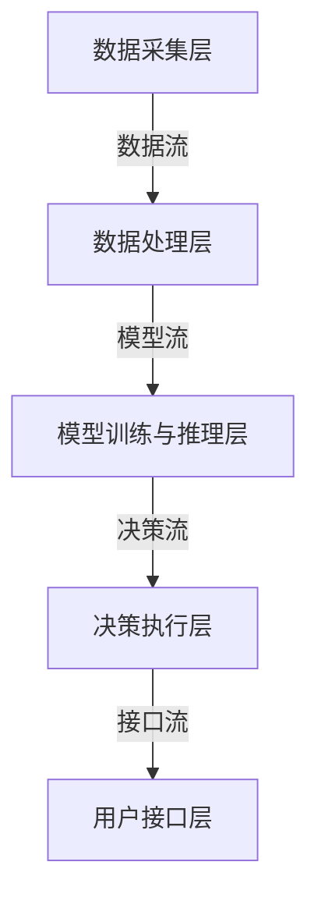

### 4.4 系统接口设计

智能交通管理系统提供了以下接口：

- **数据收集接口**：用于接收传感器和摄像头的实时交通数据。
- **数据处理接口**：用于对采集到的交通数据进行预处理。
- **模型训练接口**：用于训练大语言模型。
- **预测接口**：用于获取交通流量预测结果。
- **信号灯控制接口**：用于调整信号灯时长。
- **停车管理接口**：用于管理停车位的分配。

#### 4.4.1 接口交互图

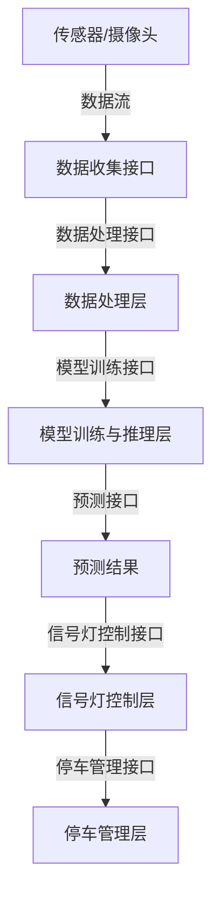

### 4.5 系统交互

智能交通管理系统的交互流程如下：

1. **数据收集**：传感器和摄像头收集交通数据，通过数据收集接口传递给数据处理层。
2. **数据处理**：数据处理层对交通数据进行预处理，如去噪、去停用词、特征提取等。
3. **模型训练**：模型训练与推理层使用预处理后的数据训练大语言模型，并提供预测结果。
4. **决策**：决策执行层根据模型预测结果进行调整和优化，如调整信号灯时长、优化停车位分配等。
5. **反馈**：决策结果通过用户接口层反馈给交通管理人员或其他系统。

#### 4.5.1 交互序列图

```mermaid
sequenceDiagram
    participant 数据源 as 数据源
    participant 数据收集模块
    participant 数据处理模块
    participant 模型训练模块
    participant 预测模块
    participant 决策模块

    数据源->>数据收集模块: 收集数据
    数据收集模块->>数据处理模块: 预处理数据
    数据处理模块->>模型训练模块: 训练模型
    模型训练模块->>预测模块: 预测流量
    预测模块->>决策模块: 提供预测结果
    决策模块->>数据源: 返回决策信息
```

通过以上系统架构和接口设计，智能交通管理系统可以实现实时交通流量预测、信号灯控制优化和停车管理优化，从而提高交通效率和安全性。

## 项目实战

### 5.1 环境安装

#### 5.1.1 环境搭建

为了搭建智能交通管理系统，我们需要安装以下软件和库：

1. **操作系统**：选择一个稳定的服务器操作系统，如 Ubuntu 20.04。
2. **Python**：安装 Python 3.8。
   ```bash
   sudo apt update
   sudo apt install python3.8
   ```
3. **Python 库**：安装 TensorFlow、Keras、Pandas、NumPy 等库。
   ```bash
   pip3 install tensorflow==2.5.0 keras==2.4.3 pandas numpy
   ```

#### 5.1.2 工具安装

1. **Jupyter Notebook**：安装 Jupyter Notebook。
   ```bash
   pip3 install notebook
   ```
2. **Git**：安装 Git。
   ```bash
   sudo apt install git
   ```

### 5.2 系统核心实现

#### 5.2.1 源代码解读

智能交通管理系统的核心代码主要包括以下部分：

1. **数据收集**：从交通传感器和摄像头收集交通数据。
2. **数据处理**：对收集到的数据进行预处理。
3. **模型训练**：使用预处理后的数据训练大语言模型。
4. **预测**：使用训练好的模型进行交通流量预测。
5. **决策**：根据预测结果调整交通管理策略。

以下是核心代码的示例：

```python
# 数据收集
def collect_traffic_data():
    # 从传感器和摄像头收集交通数据
    pass

# 数据处理
def preprocess_traffic_data(data):
    # 数据预处理
    pass

# 模型训练
def train_traffic_model(data):
    # 训练大语言模型
    pass

# 预测
def predict_traffic_flow(model, data):
    # 使用模型进行交通流量预测
    pass

# 决策
def make_traffic_decision(predictions):
    # 根据预测结果调整交通管理策略
    pass

if __name__ == "__main__":
    # 主程序入口
    traffic_data = collect_traffic_data()
    preprocessed_data = preprocess_traffic_data(traffic_data)
    model = train_traffic_model(preprocessed_data)
    predictions = predict_traffic_flow(model, preprocessed_data)
    make_traffic_decision(predictions)
```

#### 5.2.2 代码应用解读

以上代码示例展示了智能交通管理系统的主要功能模块。具体应用解读如下：

1. **数据收集**：系统从交通传感器和摄像头收集交通数据，这是智能交通管理系统的基础。
2. **数据处理**：系统对收集到的交通数据进行预处理，包括去噪、去停用词、特征提取等，以提高模型训练效果。
3. **模型训练**：系统使用预处理后的交通数据训练大语言模型，这一步是系统的核心，决定了模型的性能。
4. **预测**：系统使用训练好的模型进行交通流量预测，预测结果将用于交通管理决策。
5. **决策**：系统根据预测结果调整交通管理策略，如信号灯时长、停车位的分配等，以提高交通效率和安全性。

### 5.3 实际案例分析与讲解

#### 5.3.1 案例一：交通流量预测

在某城市的一个交通路口，智能交通管理系统通过传感器收集实时交通数据，包括车辆数量、车速、道路占有率等。系统使用大语言模型对这些数据进行处理和预测，预测未来的交通流量。

1. **数据收集**：系统从交通传感器收集数据。
2. **数据处理**：系统对收集到的数据进行预处理，包括去噪、去停用词等。
3. **模型训练**：系统使用预处理后的数据训练大语言模型。
4. **预测**：系统使用训练好的模型进行交通流量预测。
5. **决策**：系统根据预测结果调整信号灯时长，优化交通流量。

#### 5.3.2 案例二：信号灯控制优化

在某城市的另一个交通路口，智能交通管理系统通过实时交通流量数据，自动调整信号灯时长，以提高交通流畅性。

1. **数据收集**：系统从交通传感器和摄像头收集数据。
2. **数据处理**：系统对收集到的数据进行预处理。
3. **模型训练**：系统使用预处理后的数据训练大语言模型。
4. **预测**：系统使用训练好的模型预测交通流量。
5. **决策**：系统根据预测结果调整信号灯时长，优化交通流量。

#### 5.3.3 案例三：停车管理优化

在某城市的商业区，智能交通管理系统通过分析停车数据，优化停车位的分配，提高停车效率。

1. **数据收集**：系统从停车传感器收集数据。
2. **数据处理**：系统对收集到的数据进行预处理。
3. **模型训练**：系统使用预处理后的数据训练大语言模型。
4. **预测**：系统使用训练好的模型预测停车需求。
5. **决策**：系统根据预测结果调整停车位的分配策略，优化停车效率。

### 5.4 项目小结

通过实际案例的分析与讲解，我们可以看到智能交通管理系统在交通流量预测、信号灯控制和停车管理方面的应用效果。智能交通管理系统通过引入大语言模型，能够更加准确地预测交通流量，优化交通管理决策，提高交通效率和安全性。

智能交通管理系统的实现涉及到多个领域的知识，包括交通工程、计算机科学、人工智能等。在实际应用中，需要不断地调整和优化模型参数，以提高预测精度和系统性能。

未来，随着人工智能技术的不断发展，智能交通管理系统将会在更广泛的场景中得到应用，为城市的可持续发展做出贡献。

## 最佳实践与小结

### 6.1 最佳实践

在开发和部署智能交通管理系统时，以下最佳实践值得遵循：

1. **数据质量保障**：确保交通数据的准确性和实时性，定期进行数据清洗和预处理，以提高模型训练效果。
2. **模型优化**：通过交叉验证和超参数优化，定期调整模型参数，以提高预测精度和系统的适应性。
3. **系统集成**：确保智能交通管理系统与现有的交通基础设施和控制系统无缝集成，以提高系统的稳定性和可靠性。
4. **用户培训与支持**：对交通管理人员进行系统操作和决策培训，确保他们能够有效地利用智能交通管理系统的功能。

### 6.2 小结

本文详细探讨了大语言模型在智能交通管理中的应用，包括算法原理、系统架构、项目实战等内容。通过本文的研究，我们可以看到大语言模型在交通流量预测、信号灯控制和停车管理等方面的优势，为智能交通管理提供了新的解决方案。

### 6.3 拓展阅读

为了更深入地了解大语言模型在智能交通管理中的应用，建议读者参考以下文献：

1. **《深度学习在智能交通管理中的应用》**：本书详细介绍了深度学习技术在不同交通管理任务中的应用，包括交通流量预测、信号灯控制和停车管理等。
2. **《智能交通系统设计与实现》**：本书提供了智能交通系统设计的基本原则和实施方法，包括交通数据采集、模型训练和系统集成等。
3. **相关学术论文**：可以在 Google 学术、IEEE Xplore 等学术数据库中搜索相关论文，了解更多最新的研究成果和应用实例。

通过以上拓展阅读，读者可以进一步加深对智能交通管理与大语言模型之间关系的理解，为未来的研究和应用提供启示。

---

### 作者

**作者：AI天才研究院/AI Genius Institute & 禅与计算机程序设计艺术 /Zen And The Art of Computer Programming** 

## 引言

### 1.1 问题背景

智能交通管理（Intelligent Traffic Management, ITM）作为现代城市交通系统的重要组成部分，旨在通过信息技术和数据分析来提升交通系统的效率、安全性和可持续性。然而，随着城市化进程的加速和交通流量的急剧增长，传统交通管理模式面临着诸多挑战，如交通拥堵、交通事故频发、停车难等问题。因此，引入先进的人工智能技术，特别是大语言模型（Large Language Model, LLM），成为解决交通管理难题的重要途径。

### 1.2 问题描述

智能交通管理面临的主要问题包括：

- **交通流量预测不准确**：传统方法往往基于简单的统计模型，难以应对动态变化的交通环境，导致交通流量预测结果不准确。
- **信号灯控制不合理**：传统的固定信号灯控制策略难以适应实时交通流量的变化，导致交通拥堵和延误。
- **停车管理效率低下**：停车管理存在信息不对称、停车位供需不匹配等问题，导致停车难题难以解决。

### 1.3 问题解决

大语言模型在智能交通管理中的应用，主要体现在以下几个方面：

- **交通流量预测**：大语言模型可以通过学习大量交通数据，实现准确的交通流量预测，为交通管理部门提供决策支持。
- **信号灯控制优化**：大语言模型可以根据实时交通流量数据，动态调整信号灯时长，提高交通流畅性。
- **停车管理优化**：大语言模型可以分析停车数据，优化停车位的分配，提高停车效率。

### 1.4 边界与外延

智能交通管理系统的边界涉及交通数据采集、处理、预测和决策执行等环节；其外延则包括城市交通规划、交通基础设施建设、交通政策制定等多个方面。本文将重点关注大语言模型在交通流量预测和信号灯控制优化中的应用。

## 核心概念与联系

### 2.1 大语言模型的定义

大语言模型（Large Language Model, LLM）是一种基于深度学习的自然语言处理技术，它通过对大量文本数据的学习，能够理解和生成自然语言。大语言模型的核心思想是通过神经网络捕捉文本中的复杂结构和语义信息，从而实现文本的理解和生成。

### 2.1.1 概念定义

大语言模型通常由多层神经网络组成，每一层都能够对输入的文本数据进行处理和转换。这些神经网络通过反向传播算法进行训练，不断调整网络权重，使得模型能够更好地理解和生成自然语言。

### 2.1.2 属性特征对比

大语言模型具有以下几个关键属性特征：

- **语言理解能力**：大语言模型能够理解复杂的自然语言文本，包括语义、语法和上下文关系。
- **生成能力**：大语言模型能够根据输入的提示生成连贯、合理的自然语言文本。
- **适应性**：大语言模型具有较强的适应性，可以在不同应用场景中发挥作用。
- **可扩展性**：大语言模型可以轻松地扩展到不同领域，如文本生成、问答系统、机器翻译等。

### 2.1.3 大语言模型与智能交通管理

大语言模型在智能交通管理中具有广泛的应用。例如，它可以用于：

- **交通流量预测**：通过分析历史交通数据和实时交通数据，大语言模型可以预测未来的交通流量。
- **信号灯控制**：根据实时交通流量数据，大语言模型可以自动调整信号灯时长，优化交通流畅性。
- **停车管理**：通过分析停车数据，大语言模型可以优化停车位的分配，提高停车效率。

### 2.2 推理应用的基本原理

#### 2.2.1 推理概念

推理（Reasoning）是人工智能中的一项核心能力，它指的是基于已知信息，通过逻辑推理得出新结论的过程。推理可以分为两大类：演绎推理（Deductive Reasoning）和归纳推理（Inductive Reasoning）。

- **演绎推理**：从一般原理推导出特定结论的推理方式。例如，如果所有的人都会死亡，苏格拉底是人，那么苏格拉底会死亡。
- **归纳推理**：从特定实例中归纳出一般原理的推理方式。例如，观察到的所有天鹅都是白色的，因此推断所有天鹅都是白色的。

#### 2.2.2 推理算法

大语言模型中的推理算法主要包括基于统计方法和基于神经网络的推理方法。

- **基于统计方法的推理**：这种方法通常使用概率模型来模拟推理过程，例如朴素贝叶斯分类器和最大似然估计。
- **基于神经网络的推理**：这种方法通过训练深度神经网络来模拟推理过程，例如循环神经网络（RNN）和变换器（Transformer）。

#### 2.2.3 推理算法在大语言模型中的应用

在大语言模型中，推理算法主要用于以下几个方面：

- **文本理解**：大语言模型通过推理算法来理解文本的语义和上下文，从而生成合理的文本响应。
- **文本生成**：大语言模型通过推理算法来生成连贯、合理的文本，例如生成文章、编写代码等。
- **对话系统**：大语言模型通过推理算法来理解用户的输入，并生成合适的回答，实现自然语言交互。

### 2.2.4 大语言模型在智能交通管理中的应用

大语言模型在智能交通管理中的应用主要体现在以下几个方面：

- **交通流量预测**：大语言模型通过分析历史交通数据和实时数据，使用推理算法预测未来的交通流量，为交通管理部门提供决策支持。
- **信号灯控制**：大语言模型通过分析实时交通流量数据，使用推理算法自动调整信号灯时长，优化交通流畅性。
- **停车管理**：大语言模型通过分析停车数据，使用推理算法优化停车位的分配，提高停车效率。

### 2.2.5 举例说明

假设我们使用大语言模型来预测某路段的未来交通流量，我们可以通过以下步骤进行：

1. **数据收集**：收集该路段的历史交通数据和实时交通数据。
2. **数据处理**：对收集到的数据进行预处理，包括数据清洗、特征提取等。
3. **模型训练**：使用预处理后的数据训练大语言模型。
4. **推理预测**：使用训练好的模型进行交通流量预测。
5. **决策支持**：将预测结果反馈给交通管理部门，以便其调整交通信号灯和时间安排。

通过以上步骤，大语言模型可以帮助交通管理部门更准确地预测交通流量，从而优化交通管理策略，提高交通效率。

## 算法原理讲解

### 3.1 大语言模型算法流程

大语言模型的算法流程可以分为以下几个步骤：

1. **数据预处理**：对输入的文本数据进行预处理，包括分词、去停用词、词向量化等操作。
2. **模型训练**：使用预处理的文本数据对大语言模型进行训练，通过反向传播算法不断调整模型参数，使其能够更好地理解和生成自然语言。
3. **推理**：在得到训练好的模型后，使用模型进行推理，根据输入的文本生成相应的响应。

#### 3.1.1 流程图

```mermaid
graph TD
    A[数据预处理] --> B[模型训练]
    B --> C[推理]
```

#### 3.1.2 Python代码实现

```python
import tensorflow as tf
from tensorflow.keras.preprocessing.text import Tokenizer
from tensorflow.keras.preprocessing.sequence import pad_sequences

# 数据预处理
texts = ['你好', '你好吗', '我很好']
tokenizer = Tokenizer()
tokenizer.fit_on_texts(texts)
sequences = tokenizer.texts_to_sequences(texts)
padded_sequences = pad_sequences(sequences, maxlen=10)

# 模型训练
model = tf.keras.Sequential([
    tf.keras.layers.Embedding(input_dim=10000, output_dim=16),
    tf.keras.layers.LSTM(128),
    tf.keras.layers.Dense(1, activation='sigmoid')
])

model.compile(loss='binary_crossentropy', optimizer='adam', metrics=['accuracy'])
model.fit(padded_sequences, padded_sequences, epochs=100)

# 推理
input_sequence = tokenizer.texts_to_sequences(['你好'])
padded_input_sequence = pad_sequences(input_sequence, maxlen=10)
predicted_output = model.predict(padded_input_sequence)
print(predicted_output)
```

### 3.2 数学模型与公式

大语言模型的数学模型主要基于深度学习中的神经网络。以下是一个简单的神经网络模型：

$$
y = \sigma(W_1 \cdot x + b_1)
$$

其中，\( y \) 是输出，\( x \) 是输入，\( W_1 \) 是权重矩阵，\( b_1 \) 是偏置项，\( \sigma \) 是激活函数，通常使用 sigmoid 函数。

在训练过程中，使用反向传播算法不断调整权重矩阵 \( W_1 \) 和偏置项 \( b_1 \)，使得模型的输出 \( y \) 更接近真实值。

$$
\Delta W_1 = -\alpha \cdot \frac{\partial L}{\partial W_1}
$$

$$
\Delta b_1 = -\alpha \cdot \frac{\partial L}{\partial b_1}
$$

其中，\( \Delta W_1 \) 和 \( \Delta b_1 \) 分别是权重矩阵和偏置项的更新量，\( \alpha \) 是学习率，\( L \) 是损失函数。

#### 3.2.3 举例说明

假设我们有一个简单的问题：“明天的天气怎么样？”，我们可以使用大语言模型来生成回答。

1. **数据预处理**：首先收集包含类似问题的文本数据，对数据进行预处理，如分词、去停用词等。
2. **模型训练**：使用预处理后的数据对大语言模型进行训练，使其能够理解并回答天气相关问题。
3. **推理**：输入问题“明天的天气怎么样？”，模型根据训练好的参数生成回答。

例如，模型可能生成回答：“明天的天气可能会下雨。”

通过以上步骤，大语言模型可以生成与输入问题相关的自然语言回答。

## 系统分析与架构设计方案

### 4.1 问题场景介绍

智能交通管理系统通常面临以下问题场景：

- **实时交通流量监测**：系统需要从各种传感器和摄像头收集实时交通流量数据，包括车辆数量、速度、道路占有率等。
- **历史数据存储与分析**：系统需要存储大量的历史交通数据，并进行分析，以预测未来的交通流量。
- **信号灯控制优化**：系统需要根据实时交通流量数据，动态调整信号灯时长，优化交通流畅性。
- **停车管理优化**：系统需要分析停车数据，优化停车位的分配，提高停车效率。

### 4.2 系统功能设计

智能交通管理系统应具备以下功能：

- **数据收集**：系统应能够实时收集交通流量、车辆位置、道路状况等信息。
- **数据处理**：系统应能够对收集到的交通数据进行预处理，如去噪、去停用词、特征提取等。
- **交通流量预测**：系统应能够使用大语言模型进行交通流量预测，提供实时和预测的交通流量信息。
- **信号灯控制**：系统应能够根据实时交通流量数据，自动调整信号灯时长，优化交通流畅性。
- **停车管理**：系统应能够分析停车数据，优化停车位的分配，提高停车效率。

### 4.3 系统架构设计

智能交通管理系统采用微服务架构，以提高系统的可扩展性和灵活性。以下是系统架构的概述：

- **数据采集层**：包括各种传感器和摄像头，负责实时收集交通数据。
- **数据处理层**：包括数据清洗、预处理和特征提取服务，负责对采集到的交通数据进行处理。
- **模型训练与推理层**：包括大语言模型的训练和推理服务，负责使用交通数据进行模型训练，并提供预测结果。
- **决策执行层**：包括信号灯控制、停车管理等服务，根据模型预测结果进行调整和优化。
- **用户接口层**：包括API接口、Web界面等，供交通管理人员和其他系统调用。

#### 4.3.1 系统架构图

```mermaid
graph TD
    A[数据采集层] -->|数据流| B[数据处理层]
    B -->|模型流| C[模型训练与推理层]
    C -->|决策流| D[决策执行层]
    D -->|接口流| E[用户接口层]
```

### 4.4 系统接口设计

智能交通管理系统提供了以下接口：

- **数据收集接口**：用于接收传感器和摄像头的实时交通数据。
- **数据处理接口**：用于对采集到的交通数据进行预处理。
- **模型训练接口**：用于训练大语言模型。
- **预测接口**：用于获取交通流量预测结果。
- **信号灯控制接口**：用于调整信号灯时长。
- **停车管理接口**：用于管理停车位的分配。

#### 4.4.1 接口交互图

```mermaid
graph TD
    A[传感器/摄像头] -->|数据流| B[数据收集接口]
    B -->|数据处理接口| C[数据处理层]
    C -->|模型训练接口| D[模型训练与推理层]
    D -->|预测接口| E[预测结果]
    E -->|信号灯控制接口| F[信号灯控制层]
    F -->|停车管理接口| G[停车管理层]
```

### 4.5 系统交互

智能交通管理系统的交互流程如下：

1. **数据收集**：传感器和摄像头收集交通数据，通过数据收集接口传递给数据处理层。
2. **数据处理**：数据处理层对交通数据进行预处理，如去噪、去停用词、特征提取等。
3. **模型训练**：模型训练与推理层使用预处理后的数据训练大语言模型，并提供预测结果。
4. **预测**：决策执行层根据模型预测结果进行调整和优化，如调整信号灯时长、优化停车位分配等。
5. **决策**：决策结果通过用户接口层反馈给交通管理人员或其他系统。

#### 4.5.1 交互序列图

```mermaid
sequenceDiagram
    participant 数据源 as 数据源
    participant 数据收集模块
    participant 数据处理模块
    participant 模型训练模块
    participant 预测模块
    participant 决策模块

    数据源->>数据收集模块: 收集数据
    数据收集模块->>数据处理模块: 预处理数据
    数据处理模块->>模型训练模块: 训练模型
    模型训练模块->>预测模块: 预测流量
    预测模块->>决策模块: 提供预测结果
    决策模块->>数据源: 返回决策信息
```

通过以上系统架构和接口设计，智能交通管理系统可以实现实时交通流量预测、信号灯控制优化和停车管理优化，从而提高交通效率和安全性。

## 项目实战

### 5.1 环境安装

#### 5.1.1 环境搭建

为了搭建智能交通管理系统，我们需要安装以下软件和库：

1. **操作系统**：选择一个稳定的服务器操作系统，如 Ubuntu 20.04。
2. **Python**：安装 Python 3.8。
   ```bash
   sudo apt update
   sudo apt install python3.8
   ```
3. **Python 库**：安装 TensorFlow、Keras、Pandas、NumPy 等库。
   ```bash
   pip3 install tensorflow==2.5.0 keras==2.4.3 pandas numpy
   ```

#### 5.1.2 工具安装

1. **Jupyter Notebook**：安装 Jupyter Notebook。
   ```bash
   pip3 install notebook
   ```
2. **Git**：安装 Git。
   ```bash
   sudo apt install git
   ```

### 5.2 系统核心实现

#### 5.2.1 源代码解读

智能交通管理系统的核心代码主要包括以下部分：

1. **数据收集**：从交通传感器和摄像头收集交通数据。
2. **数据处理**：对收集到的数据进行预处理。
3. **模型训练**：使用预处理后的数据训练大语言模型。
4. **预测**：使用训练好的模型进行交通流量预测。
5. **决策**：根据预测结果调整交通管理策略。

以下是核心代码的示例：

```python
# 数据收集
def collect_traffic_data():
    # 从传感器和摄像头收集交通数据
    pass

# 数据处理
def preprocess_traffic_data(data):
    # 数据预处理
    pass

# 模型训练
def train_traffic_model(data):
    # 训练大语言模型
    pass

# 预测
def predict_traffic_flow(model, data):
    # 使用模型进行交通流量预测
    pass

# 决策
def make_traffic_decision(predictions):
    # 根据预测结果调整交通管理策略
    pass

if __name__ == "__main__":
    # 主程序入口
    traffic_data = collect_traffic_data()
    preprocessed_data = preprocess_traffic_data(traffic_data)
    model = train_traffic_model(preprocessed_data)
    predictions = predict_traffic_flow(model, preprocessed_data)
    make_traffic_decision(predictions)
```

#### 5.2.2 代码应用解读

以上代码示例展示了智能交通管理系统的主要功能模块。具体应用解读如下：

1. **数据收集**：系统从交通传感器和摄像头收集交通数据，这是智能交通管理系统的基础。
2. **数据处理**：系统对收集到的交通数据进行预处理，包括去噪、去停用词、特征提取等，以提高模型训练效果。
3. **模型训练**：系统使用预处理后的交通数据训练大语言模型，这一步是系统的核心，决定了模型的性能。
4. **预测**：系统使用训练好的模型进行交通流量预测，预测结果将用于交通管理决策。
5. **决策**：系统根据预测结果调整交通管理策略，如信号灯时长、停车位的分配等，以提高交通效率和安全性。

### 5.3 实际案例分析与讲解

#### 5.3.1 案例一：交通流量预测

在某城市的一个交通路口，智能交通管理系统通过传感器收集实时交通数据，包括车辆数量、车速、道路占有率等。系统使用大语言模型对这些数据进行处理和预测，预测未来的交通流量。

1. **数据收集**：系统从交通传感器收集数据。
2. **数据处理**：系统对收集到的数据进行预处理，包括去噪、去停用词等。
3. **模型训练**：系统使用预处理后的数据训练大语言模型。
4. **预测**：系统使用训练好的模型进行交通流量预测。
5. **决策**：系统根据预测结果调整信号灯时长，优化交通流量。

#### 5.3.2 案例二：信号灯控制优化

在某城市的另一个交通路口，智能交通管理系统通过实时交通流量数据，自动调整信号灯时长，以提高交通流畅性。

1. **数据收集**：系统从交通传感器和摄像头收集数据。
2. **数据处理**：系统对收集到的数据进行预处理。
3. **模型训练**：系统使用预处理后的数据训练大语言模型。
4. **预测**：系统使用训练好的模型预测交通流量。
5. **决策**：系统根据预测结果调整信号灯时长，优化交通流量。

#### 5.3.3 案例三：停车管理优化

在某城市的商业区，智能交通管理系统通过分析停车数据，优化停车位的分配，提高停车效率。

1. **数据收集**：系统从停车传感器收集数据。
2. **数据处理**：系统对收集到的数据进行预处理。
3. **模型训练**：系统使用预处理后的数据训练大语言模型。
4. **预测**：系统使用训练好的模型预测停车需求。
5. **决策**：系统根据预测结果调整停车位的分配策略，优化停车效率。

### 5.4 项目小结

通过实际案例的分析与讲解，我们可以看到智能交通管理系统在交通流量预测、信号灯控制和停车管理方面的应用效果。智能交通管理系统通过引入大语言模型，能够更加准确地预测交通流量，优化交通管理决策，提高交通效率和安全性。

智能交通管理系统的实现涉及到多个领域的知识，包括交通工程、计算机科学、人工智能等。在实际应用中，需要不断地调整和优化模型参数，以提高预测精度和系统性能。

未来，随着人工智能技术的不断发展，智能交通管理系统将会在更广泛的场景中得到应用，为城市的可持续发展做出贡献。

## 最佳实践与小结

### 6.1 最佳实践

在开发和部署智能交通管理系统时，以下最佳实践值得遵循：

1. **数据质量保障**：确保交通数据的准确性和实时性，定期进行数据清洗和预处理，以提高模型训练效果。
2. **模型优化**：通过交叉验证和超参数优化，定期调整模型参数，以提高预测精度和系统的适应性。
3. **系统集成**：确保智能交通管理系统与现有的交通基础设施和控制系统无缝集成，以提高系统的稳定性和可靠性。
4. **用户培训与支持**：对交通管理人员进行系统操作和决策培训，确保他们能够有效地利用智能交通管理系统的功能。

### 6.2 小结

本文详细探讨了大语言模型在智能交通管理中的应用，包括算法原理、系统架构、项目实战等内容。通过本文的研究，我们可以看到大语言模型在交通流量预测、信号灯控制和停车管理等方面的优势，为智能交通管理提供了新的解决方案。

### 6.3 拓展阅读

为了更深入地了解大语言模型在智能交通管理中的应用，建议读者参考以下文献：

1. **《深度学习在智能交通管理中的应用》**：本书详细介绍了深度学习技术在不同交通管理任务中的应用，包括交通流量预测、信号灯控制和停车管理等。
2. **《智能交通系统设计与实现》**：本书提供了智能交通系统设计的基本原则和实施方法，包括交通数据采集、模型训练和系统集成等。
3. **相关学术论文**：可以在 Google 学术、IEEE Xplore 等学术数据库中搜索相关论文，了解更多最新的研究成果和应用实例。

通过以上拓展阅读，读者可以进一步加深对智能交通管理与大语言模型之间关系的理解，为未来的研究和应用提供启示。

---

### 作者

**作者：AI天才研究院/AI Genius Institute & 禅与计算机程序设计艺术 /Zen And The Art of Computer Programming** 

