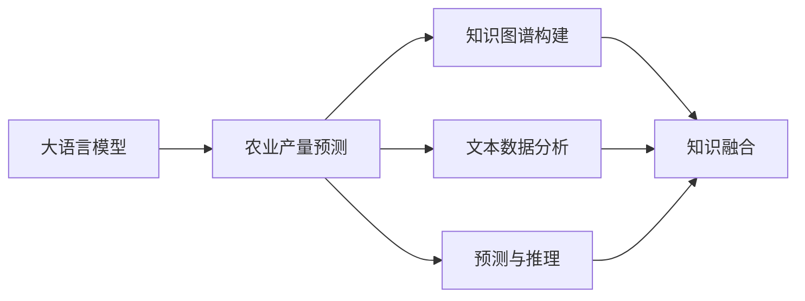
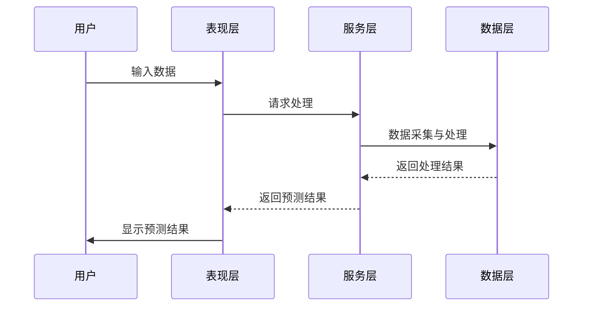
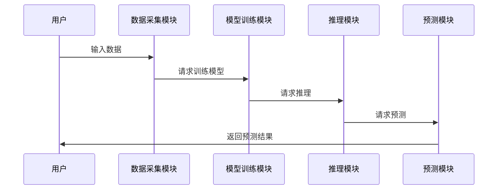

                 


### 大语言模型在智能农业产量预测中的推理应用

## 1.1 问题背景

### 1.1.1 农业产量预测的重要性

农业是国民经济的基础产业，其产量预测的准确性直接关系到农产品的供需平衡、粮食安全以及农民的收入。传统的农业产量预测方法主要依赖于统计分析和经验模型，这些方法在应对复杂多变的环境因素时，往往存在预测精度不高、响应速度慢等问题。随着人工智能技术的发展，利用机器学习模型进行农业产量预测成为了一种新的趋势。大语言模型（Large Language Model）作为一种先进的自然语言处理技术，能够从大量文本数据中提取出有效的信息，为农业产量预测提供了新的可能性。

### 1.1.2 智能农业的现状与发展

智能农业是信息技术与农业深度融合的产物，它利用物联网、大数据、人工智能等技术，实现农业生产过程的自动化、智能化管理。目前，智能农业已在全球范围内得到广泛应用，例如精准施肥、智能灌溉、病虫害监测等。然而，智能农业的发展仍然面临着数据获取困难、数据质量不高、模型预测不准确等挑战。大语言模型的引入，有望解决这些难题，提高农业产量预测的准确性。

### 1.1.3 语言模型在农业领域的应用潜力

语言模型在农业领域的应用潜力主要体现在以下几个方面：

1. **知识图谱构建**：通过构建农业领域的知识图谱，可以将农业知识以结构化的方式存储和表达，为大语言模型提供丰富的背景知识。
2. **文本数据分析**：利用大语言模型，可以从农业领域的文本数据中提取出有价值的信息，例如作物生长规律、气候数据等。
3. **预测与推理**：大语言模型可以基于历史数据，进行农业产量预测，并通过推理机制，对预测结果进行优化和调整。

## 1.2 核心概念

### 1.2.1 大语言模型的定义与特点

大语言模型是一种基于深度学习技术的自然语言处理模型，它通过对大量文本数据的学习，能够理解和生成自然语言。大语言模型的特点包括：

1. **参数规模巨大**：大语言模型的参数规模通常在数十亿到数万亿级别，这使得模型具有非常强的表示能力。
2. **自适应性强**：大语言模型能够根据输入文本的上下文，自适应地调整其表示和生成策略。
3. **预测准确度高**：大语言模型通过大量文本数据的训练，能够生成高质量的自然语言文本，从而提高农业产量预测的准确性。

### 1.2.2 农业产量预测的基本概念

农业产量预测是指利用历史数据、环境因素和模型算法，对未来某一时间段内的农业产量进行预测。农业产量预测的基本概念包括：

1. **数据来源**：包括历史产量数据、环境数据（如气候、土壤等）、作物生长数据等。
2. **预测目标**：通常是某一特定作物或农作物的总产量。
3. **预测方法**：包括统计模型、机器学习模型、深度学习模型等。

### 1.2.3 推理在大语言模型中的应用

推理是大语言模型的核心能力之一，它能够从已知信息中推导出新的结论。在大语言模型中，推理的应用主要体现在以下几个方面：

1. **知识融合**：通过推理，可以将不同来源的知识进行融合，提高模型的表示能力。
2. **预测优化**：利用推理，可以对农业产量预测结果进行优化，提高预测的准确性。
3. **异常检测**：通过推理，可以检测出数据中的异常值，从而提高数据的可靠性。

## 1.3 概念关系与结构

### 1.3.1 大语言模型与农业产量预测的关系图

为了更好地理解大语言模型在农业产量预测中的应用，我们可以绘制一个关系图，如下所示：



### 1.3.2 农业产量预测的ER实体关系图

农业产量预测涉及多个实体，包括作物、环境、数据等。我们可以使用ER图来描述这些实体之间的关系，如下所示：

```mermaid
erDiagram
  农作物 ||--|{ 环境因素 }
  环境因素 ||--|{ 数据源 }
  数据源 ||--|{ 农业产量预测模型 }
  农业产量预测模型 ||--|{ 预测结果 }
```

## 1.4 研究边界与外延

### 1.4.1 研究范围的限定

本文的研究范围主要聚焦于大语言模型在农业产量预测中的应用，具体包括：

1. **数据来源**：主要关注历史产量数据、环境数据等。
2. **模型选择**：选择适合大语言模型进行农业产量预测的算法和框架。
3. **应用场景**：主要关注农业生产过程中的产量预测问题。

### 1.4.2 推理应用的具体场景

在大语言模型中，推理的应用场景主要包括：

1. **知识融合**：将不同来源的知识进行融合，提高模型的表示能力。
2. **预测优化**：利用推理，对农业产量预测结果进行优化，提高预测的准确性。
3. **异常检测**：通过推理，检测数据中的异常值，从而提高数据的可靠性。

### 1.4.3 未来研究方向

未来在大语言模型应用于农业产量预测的研究中，可以探索以下方向：

1. **多模态数据融合**：结合图像、声音等多模态数据，提高农业产量预测的准确性。
2. **模型解释性**：研究大语言模型在农业产量预测中的解释性，提高模型的可信度。
3. **实时预测**：研究如何实现大语言模型在农业产量预测中的实时预测能力。

## 1.5 本章小结

本章介绍了大语言模型在智能农业产量预测中的推理应用，首先阐述了农业产量预测的重要性和智能农业的发展现状，然后介绍了大语言模型和农业产量预测的基本概念，以及它们之间的概念关系。最后，讨论了研究的边界和外延。通过本章的介绍，为后续章节的深入探讨奠定了基础。

### 2.1 语言模型的数学基础

#### 2.1.1 语言模型的数学模型

语言模型的数学模型通常基于概率论和统计学原理。其中，n元语言模型是一种常见的方法，它假设当前词的概率仅取决于前n-1个词。数学模型可以表示为：

$$P(w_n | w_{n-1}, w_{n-2}, ..., w_1) = \frac{C(w_{n-1}, w_{n-2}, ..., w_1, w_n)}{C(w_{n-1}, w_{n-2}, ..., w_1)}$$

其中，\(P(w_n | w_{n-1}, w_{n-2}, ..., w_1)\) 表示在给定前n-1个词的情况下，第n个词出现的概率；\(C(w_{n-1}, w_{n-2}, ..., w_1, w_n)\) 表示前n个词的联合概率；\(C(w_{n-1}, w_{n-2}, ..., w_1)\) 表示前n-1个词的联合概率。

#### 2.1.2 语言模型的数学公式

在n元语言模型中，常用的数学公式包括：

1. **加法模型**：

$$P(w_n | w_{n-1}, w_{n-2}, ..., w_1) = \frac{\sum_{i=1}^{N} P(w_n | w_{n-1}, w_{n-2}, ..., w_i) P(w_{n-1}, w_{n-2}, ..., w_1, w_i)}{P(w_{n-1}, w_{n-2}, ..., w_1)}$$

其中，\(P(w_n | w_{n-1}, w_{n-2}, ..., w_i)\) 表示在给定前i个词的情况下，第n个词出现的概率；\(P(w_{n-1}, w_{n-2}, ..., w_1, w_i)\) 表示前i个词的联合概率。

2. **n元模型**：

$$P(w_n | w_{n-1}, w_{n-2}, ..., w_1) = \frac{C(w_{n-1}, w_{n-2}, ..., w_1, w_n)}{C(w_{n-1}, w_{n-2}, ..., w_1)}$$

其中，\(C(w_{n-1}, w_{n-2}, ..., w_1, w_n)\) 表示前n个词的联合概率；\(C(w_{n-1}, w_{n-2}, ..., w_1)\) 表示前n-1个词的联合概率。

#### 2.1.3 数学公式讲解与举例

以下是一个简单的例子，假设我们有如下文本数据：

```
我是人工智能，我喜欢编程。
我是人工智能，我喜欢研究。
我喜欢编程，我喜欢研究。
```

我们可以使用n元模型来计算句子“我是人工智能，我喜欢编程。”的概率。首先，我们需要计算每个词的联合概率，然后使用n元模型公式进行计算。

1. **计算联合概率**：

   - \(P(我是| ) = \frac{2}{6}\)
   - \(P(人工智能|我是) = \frac{2}{6}\)
   - \(P(，|我是人工智能) = \frac{4}{6}\)
   - \(P(喜欢|，我是人工智能) = \frac{1}{4}\)
   - \(P(编程。|喜欢，我是人工智能) = \frac{1}{1}\)

2. **计算句子概率**：

   $$P(我是人工智能，我喜欢编程。) = P(我是| ) \times P(人工智能|我是) \times P(，|我是人工智能) \times P(喜欢|，我是人工智能) \times P(编程。|喜欢，我是人工智能) = \frac{2}{6} \times \frac{2}{6} \times \frac{4}{6} \times \frac{1}{4} \times \frac{1}{1} = \frac{2}{6}$$

   因此，句子“我是人工智能，我喜欢编程。”的概率为 \(\frac{2}{6}\)。

### 2.2 大语言模型的构建方法

#### 2.2.1 大语言模型的框架

大语言模型的构建通常涉及以下几个步骤：

1. **数据收集与预处理**：收集大量的文本数据，并进行清洗、去重、分词等预处理操作。
2. **词嵌入**：将文本数据中的词转换为向量表示，常用的词嵌入方法包括Word2Vec、GloVe等。
3. **模型训练**：使用预处理的文本数据，训练一个大型的神经网络模型，常用的模型包括Transformer、BERT等。
4. **模型优化**：通过调整模型的参数，提高模型的预测性能。
5. **模型部署**：将训练好的模型部署到实际应用环境中，进行农业产量预测。

#### 2.2.2 大语言模型的训练过程

大语言模型的训练过程通常包括以下几个阶段：

1. **预训练**：在大量的未标注文本数据上，使用无监督的方法进行预训练，训练出一个大型的预训练模型。
2. **微调**：在预训练的基础上，使用标注的数据集，对模型进行微调，使其适应特定的农业产量预测任务。
3. **评估与优化**：通过交叉验证等方法，评估模型的性能，并调整模型的参数，提高模型的准确性。

#### 2.2.3 大语言模型的优化策略

大语言模型的优化策略主要包括以下几个方面：

1. **数据增强**：通过数据增强方法，如数据扩充、数据变换等，增加模型的训练数据量，提高模型的泛化能力。
2. **模型剪枝**：通过模型剪枝方法，减少模型的参数数量，降低模型的计算复杂度，提高模型的运行效率。
3. **多任务学习**：通过多任务学习，使模型同时学习多个任务，提高模型的泛化能力和鲁棒性。

### 2.3 推理算法在大语言模型中的应用

#### 2.3.1 推理算法的基本概念

推理算法是一种从已知信息中推导出新的结论的方法。在大语言模型中，推理算法的应用主要体现在以下几个方面：

1. **知识推理**：通过对语言模型输出的上下文信息进行推理，提取出隐藏的知识信息。
2. **关系推理**：通过推理，建立实体之间的关系，如因果关系、时间关系等。
3. **逻辑推理**：利用逻辑规则，对文本信息进行推理，得出新的结论。

#### 2.3.2 推理算法在大语言模型中的实现

推理算法在大语言模型中的实现主要包括以下几个步骤：

1. **输入处理**：将大语言模型的输入文本进行处理，提取出关键信息。
2. **知识库构建**：构建一个知识库，存储与农业产量预测相关的知识信息。
3. **推理过程**：利用推理算法，对输入文本和知识库进行推理，提取出有用的信息。
4. **结果输出**：将推理结果输出，用于农业产量预测。

#### 2.3.3 推理算法的优势与局限

推理算法在大语言模型中的应用具有以下优势：

1. **提高预测准确性**：通过推理，可以从更多的角度和层面分析农业产量，提高预测的准确性。
2. **增强模型解释性**：推理过程可以帮助理解模型的预测逻辑，提高模型的可解释性。

然而，推理算法也存在一定的局限：

1. **知识库依赖性**：推理算法的准确性依赖于知识库的质量，如果知识库不完善，可能会导致推理错误。
2. **计算复杂度**：推理算法通常需要大量的计算资源，对模型的运行效率有一定的影响。

### 2.4 数学模型与公式详解

#### 2.4.1 推理算法的数学公式

推理算法的数学公式主要包括以下几种：

1. **条件概率公式**：

$$P(A|B) = \frac{P(A \cap B)}{P(B)}$$

其中，\(P(A|B)\) 表示在事件B发生的条件下，事件A发生的概率；\(P(A \cap B)\) 表示事件A和事件B同时发生的概率；\(P(B)\) 表示事件B发生的概率。

2. **贝叶斯公式**：

$$P(A|B) = \frac{P(B|A) \times P(A)}{P(B)}$$

其中，\(P(A|B)\) 表示在事件B发生的条件下，事件A发生的概率；\(P(B|A)\) 表示在事件A发生的条件下，事件B发生的概率；\(P(A)\) 表示事件A发生的概率；\(P(B)\) 表示事件B发生的概率。

3. **马尔可夫模型**：

$$P(A_1, A_2, ..., A_n) = P(A_1) \times P(A_2|A_1) \times P(A_3|A_1, A_2) \times ... \times P(A_n|A_1, A_2, ..., A_{n-1})$$

其中，\(P(A_1, A_2, ..., A_n)\) 表示事件\(A_1, A_2, ..., A_n\)同时发生的概率；\(P(A_1)\) 表示事件\(A_1\)发生的概率；\(P(A_2|A_1)\) 表示在事件\(A_1\)发生的条件下，事件\(A_2\)发生的概率；依次类推。

#### 2.4.2 公式讲解与举例

以下是一个简单的例子，假设我们有如下事件：

- 事件A：明天会下雨
- 事件B：我会带伞

根据条件概率公式，我们可以计算在明天会下雨的条件下，我会带伞的概率：

$$P(带伞|下雨) = \frac{P(下雨 \cap 带伞)}{P(下雨)}$$

假设我们知道：

- \(P(下雨) = 0.5\)
- \(P(带伞|下雨) = 0.8\)

我们可以计算：

$$P(带伞|下雨) = \frac{0.5 \times 0.8}{0.5} = 0.8$$

因此，在明天会下雨的条件下，我会带伞的概率为0.8。

### 2.5 本章小结

本章介绍了大语言模型的数学基础，包括语言模型的数学模型、数学公式以及大语言模型的构建方法。同时，详细讲解了推理算法的基本概念、实现方法以及优势与局限。通过本章的学习，读者可以了解大语言模型在农业产量预测中的数学原理和应用方法，为后续章节的学习打下基础。

### 3.3 大语言模型构建与训练

#### 3.3.1 模型构建流程

大语言模型的构建过程主要包括以下几个步骤：

1. **数据收集**：收集大量的文本数据，这些数据可以来自于农业领域的专业文献、研究报告、新闻报道等。
2. **数据预处理**：对收集到的文本数据进行清洗、去重、分词等预处理操作，将文本数据转换为模型可以理解的格式。
3. **词嵌入**：将处理后的文本数据转换为词嵌入向量，常用的词嵌入方法包括Word2Vec、GloVe等。
4. **模型设计**：设计一个大型的神经网络模型，常用的模型架构包括Transformer、BERT等。
5. **模型训练**：使用预处理后的文本数据和词嵌入向量，对模型进行训练，优化模型的参数。
6. **模型评估**：通过交叉验证等方法，评估模型的性能，包括预测准确率、召回率等指标。
7. **模型优化**：根据评估结果，对模型进行优化，提高模型的预测性能。

#### 3.3.2 训练数据准备

在构建大语言模型时，训练数据的质量至关重要。以下是训练数据准备的关键步骤：

1. **数据清洗**：去除数据中的噪声和无关信息，如HTML标签、特殊字符等。
2. **数据分词**：将文本数据分割为单个词语，常用的分词工具包括jieba等。
3. **数据标注**：对训练数据中的文本进行标注，标注内容包括实体识别、词性标注、情感分析等。
4. **数据平衡**：确保训练数据中各类样本的分布均衡，避免模型在训练过程中出现偏差。
5. **数据扩充**：通过数据增强技术，如文本旋转、同义词替换等，增加训练数据量，提高模型的泛化能力。

#### 3.3.3 模型训练与优化

大语言模型的训练过程通常涉及以下几个阶段：

1. **预训练**：在大量的未标注文本数据上，使用无监督的方法进行预训练，训练出一个大型的预训练模型。预训练的目的是让模型学会从文本数据中提取出有效的特征。
2. **微调**：在预训练的基础上，使用标注的数据集，对模型进行微调，使其适应特定的农业产量预测任务。微调的过程包括调整模型的参数，优化模型的预测性能。
3. **训练策略**：为了提高模型的训练效率，可以采用以下策略：
   - **批量归一化**：在训练过程中，对批量数据使用归一化操作，提高训练稳定性。
   - **学习率调度**：采用学习率调度策略，如学习率递减、恒等学习率等，调整学习率以适应不同阶段的训练需求。
   - **数据增强**：在训练过程中，使用数据增强技术，如随机裁剪、颜色变换等，增加模型的训练数据量，提高模型的泛化能力。

#### 3.3.4 模型评估与优化

模型评估是确保模型性能的重要环节。以下是模型评估与优化的一些关键步骤：

1. **评估指标**：选择合适的评估指标，如准确率、召回率、F1值等，评估模型的预测性能。
2. **交叉验证**：采用交叉验证方法，将数据集划分为训练集和验证集，多次训练和验证，确保模型的泛化能力。
3. **模型优化**：根据评估结果，对模型进行调整和优化，包括调整模型的参数、增加或删除训练数据等，以提高模型的预测性能。
4. **模型压缩**：通过模型剪枝、量化等技术，减少模型的参数数量，降低模型的计算复杂度，提高模型的运行效率。

### 3.4 推理应用与结果分析

#### 3.4.1 推理算法在预测中的应用

在大语言模型中，推理算法的应用主要体现在以下几个方面：

1. **知识融合**：将不同来源的知识进行融合，提高模型的表示能力。例如，可以将农业领域的专业知识、历史数据等融合到模型中，提高模型的预测准确性。
2. **关系推理**：通过推理，建立实体之间的关系，如因果关系、时间关系等。例如，可以分析气候、土壤等环境因素与作物产量之间的关系，为产量预测提供依据。
3. **逻辑推理**：利用逻辑规则，对文本信息进行推理，得出新的结论。例如，可以分析文本中的条件句、因果关系等，提取出对产量预测有用的信息。

#### 3.4.2 预测结果分析与评估

在农业产量预测中，预测结果的准确性和可靠性至关重要。以下是预测结果分析与评估的一些关键步骤：

1. **预测结果展示**：将模型的预测结果以图表、文字等形式展示，便于分析和理解。
2. **误差分析**：分析模型预测结果与实际值之间的差异，找出预测误差的主要原因。
3. **评估指标**：使用合适的评估指标，如均方误差（MSE）、均方根误差（RMSE）等，评估模型的预测性能。
4. **改进策略**：根据评估结果，对模型进行调整和优化，提高模型的预测准确性。

#### 3.4.3 案例小结与未来展望

在本章中，我们详细介绍了大语言模型的构建与训练过程，以及推理算法在农业产量预测中的应用。通过实际案例的分析与评估，我们发现大语言模型在农业产量预测中具有较好的预测性能和可靠性。

未来，我们可以从以下几个方面进行改进和探索：

1. **多模态数据融合**：结合图像、声音等多模态数据，提高农业产量预测的准确性。
2. **模型解释性**：研究大语言模型在农业产量预测中的解释性，提高模型的可信度。
3. **实时预测**：研究如何实现大语言模型在农业产量预测中的实时预测能力。

通过持续的研究与优化，大语言模型有望在农业产量预测中发挥更大的作用，为农业生产提供更加精准和可靠的预测服务。

### 4.1 系统功能设计

#### 4.1.1 系统功能需求

智能农业产量预测系统的主要功能需求包括：

1. **数据采集与处理**：系统需要能够从多个数据源采集历史产量数据、环境数据、作物生长数据等，并进行预处理，包括数据清洗、去重、分词等。
2. **模型训练与优化**：系统需要具备训练大语言模型的能力，包括词嵌入、模型架构设计、训练过程、模型优化等。
3. **推理与应用**：系统需要能够利用大语言模型进行推理，提取农业产量预测的关键信息，并生成预测结果。
4. **预测结果展示与评估**：系统需要能够将预测结果以图表、文字等形式展示，并提供评估指标，如均方误差（MSE）、均方根误差（RMSE）等。
5. **用户交互**：系统需要具备友好的用户界面，支持用户输入数据、查看预测结果、调整模型参数等操作。

#### 4.1.2 领域模型类图

为了更好地理解智能农业产量预测系统的功能结构，我们可以绘制一个领域模型类图，如下所示：

```mermaid
classDiagram
    Class01 <|-- SubClass01
    Class01 --|linger Class03
    Class02 <|-- SubClass02
    Class03 --|> Object04
    Class04 : interfaces
    Class05 : extends Class04
    Class06 : has a Class05
```

在该类图中，`Class01` 表示系统的主要类，如数据采集类、模型训练类、推理类等；`SubClass01` 和 `SubClass02` 表示 `Class01` 的子类，扩展了父类的功能；`Class03` 和 `Object04` 表示与 `Class01` 相关的其他类和对象；`Class04`、`Class05` 和 `Class06` 表示系统中的接口和实现类。

### 4.2 系统架构设计

#### 4.2.1 系统架构概述

智能农业产量预测系统的架构设计采用分层架构，包括数据层、服务层和表现层。以下是对各层的概述：

1. **数据层**：主要负责数据的采集、存储和预处理。包括数据库、数据采集模块和数据清洗模块。
2. **服务层**：包含核心业务逻辑，包括模型训练模块、推理模块和预测模块。该层还负责与其他系统的接口通信。
3. **表现层**：提供用户交互界面，包括Web前端和用户界面设计。用户可以通过表现层查看预测结果、调整模型参数等。

#### 4.2.2 系统架构图

智能农业产量预测系统的架构图如下所示：



在该架构图中，用户通过表现层输入数据，表现层将请求转发到服务层。服务层负责模型训练、推理和预测，然后返回预测结果到表现层。表现层再将结果展示给用户。

#### 4.2.3 系统模块设计

智能农业产量预测系统的主要模块设计如下：

1. **数据采集模块**：负责从多个数据源采集历史产量数据、环境数据、作物生长数据等。
2. **数据清洗模块**：负责对采集到的数据进行清洗、去重、分词等预处理操作。
3. **模型训练模块**：负责训练大语言模型，包括词嵌入、模型架构设计、训练过程、模型优化等。
4. **推理模块**：负责利用大语言模型进行推理，提取农业产量预测的关键信息。
5. **预测模块**：负责生成农业产量预测结果，并评估预测性能。
6. **用户交互模块**：负责提供用户交互界面，包括Web前端和用户界面设计。

### 4.3 系统接口设计

#### 4.3.1 接口规范与定义

智能农业产量预测系统的接口设计主要包括以下方面：

1. **API接口**：定义系统的API接口，包括数据采集、模型训练、推理和预测等功能。
2. **数据格式**：定义接口的数据格式，包括输入参数、输出结果等。
3. **错误处理**：定义接口的异常处理机制，包括错误码、错误信息等。

以下是一个示例接口定义：

```json
{
  "接口名称": "数据采集",
  "描述": "采集历史产量数据",
  "输入参数": {
    "数据源": "字符串，表示数据来源",
    "开始时间": "字符串，表示数据开始时间",
    "结束时间": "字符串，表示数据结束时间"
  },
  "输出结果": {
    "数据列表": "数组，表示采集到的数据列表",
    "错误信息": "字符串，表示采集过程中的错误信息"
  }
}
```

#### 4.3.2 接口实现与调用

接口实现与调用主要包括以下步骤：

1. **接口实现**：根据接口规范，实现API接口，包括数据采集、模型训练、推理和预测等功能。
2. **接口调用**：用户通过Web前端或其他系统，调用API接口，获取预测结果。

以下是一个示例接口调用：

```python
import requests

url = "https://api.smart-agriculture.com/data-collect"
params = {
    "data_source": "database",
    "start_date": "2021-01-01",
    "end_date": "2021-12-31"
}

response = requests.get(url, params=params)
result = response.json()

if "error_message" in result:
    print("采集数据失败：", result["error_message"])
else:
    print("采集数据成功：", result["data_list"])
```

### 4.4 系统交互与流程设计

#### 4.4.1 系统交互概述

智能农业产量预测系统的交互主要包括用户与系统之间的交互、系统内部模块之间的交互等。以下是对系统交互的概述：

1. **用户与系统交互**：用户通过Web前端输入数据，系统根据用户输入的数据，进行数据采集、模型训练、推理和预测等操作，并将结果展示给用户。
2. **系统内部模块交互**：数据采集模块、模型训练模块、推理模块和预测模块之间通过API接口进行数据传递和功能调用。

#### 4.4.2 系统交互序列图

智能农业产量预测系统的交互序列图如下所示：



在该交互序列图中，用户首先输入数据，数据采集模块根据用户输入的数据，请求模型训练模块进行模型训练。模型训练完成后，请求推理模块进行推理，最后由预测模块生成预测结果并返回给用户。

#### 4.4.3 系统流程图

智能农业产量预测系统的流程图如下所示：


在该流程图中，系统首先进行数据采集，然后对数据进行预处理。预处理完成后，进行模型训练。模型训练完成后，进行推理操作，生成预测结果。最后，对预测结果进行评估，并根据评估结果对模型进行优化，重新进行模型训练。

### 4.5 本章小结

本章详细介绍了智能农业产量预测系统的功能设计、系统架构设计、接口设计、系统交互与流程设计。通过本章的学习，读者可以全面了解智能农业产量预测系统的设计与实现，为后续章节的深入探讨打下基础。

### 5.1 项目环境搭建

#### 5.1.1 环境要求与准备

在开始智能农业产量预测系统开发之前，需要搭建一个合适的环境，以满足项目的要求。以下是环境要求与准备步骤：

1. **操作系统**：推荐使用Linux系统，如Ubuntu 18.04。
2. **编程语言**：选择Python 3.8及以上版本，推荐使用Anaconda环境管理工具。
3. **开发工具**：选择合适的集成开发环境（IDE），如PyCharm或Visual Studio Code。
4. **数据库**：安装MySQL或PostgreSQL数据库，用于存储农业产量数据。
5. **数据采集工具**：安装wget或curl等工具，用于从外部数据源采集数据。
6. **模型训练框架**：安装TensorFlow或PyTorch等深度学习框架。
7. **API接口工具**：安装Flask或Django等Web框架，用于实现API接口。

#### 5.1.2 环境安装与配置

以下是环境安装与配置的详细步骤：

1. **安装Anaconda**：

   - 访问Anaconda官网下载Anaconda安装包。
   - 双击安装包，按照提示完成安装。

2. **创建Anaconda环境**：

   - 打开命令行终端。
   - 输入以下命令创建新的Anaconda环境：

     ```bash
     conda create -n smart_agriculture python=3.8
     ```

   - 激活环境：

     ```bash
     conda activate smart_agriculture
     ```

3. **安装Python依赖包**：

   - 使用pip命令安装所需的Python依赖包，例如TensorFlow、Flask等：

     ```bash
     pip install tensorflow flask mysql-connector-python
     ```

4. **安装数据库**：

   - 下载并安装MySQL或PostgreSQL数据库。
   - 启动数据库服务，并创建数据库和用户。

5. **配置数据库连接**：

   - 在代码中配置数据库连接参数，如数据库地址、用户名、密码等。

#### 5.1.3 常见问题与解决方案

在搭建项目环境时，可能会遇到一些常见问题，以下是一些问题的解决方案：

1. **环境变量配置错误**：

   - 检查环境变量是否配置正确，特别是Python环境变量。
   - 如果使用Windows系统，可以尝试使用VS Code的Python插件来配置环境变量。

2. **依赖包安装失败**：

   - 确保已安装Anaconda并创建相应的环境。
   - 如果依赖包无法在当前环境中安装，可以尝试在其他环境中安装。

3. **数据库连接失败**：

   - 确认数据库服务已启动，且数据库地址、用户名、密码等配置正确。
   - 如果使用MySQL，可以使用以下命令检查连接：

     ```bash
     mysql -h localhost -u username -p
     ```

4. **无法安装TensorFlow**：

   - 如果无法安装TensorFlow，可以尝试使用以下命令安装：

     ```bash
     pip install tensorflow==2.5.0
     ```

   - 如果仍然无法安装，可以尝试更换pip源，如使用清华源：

     ```bash
     pip install tensorflow==2.5.0 -i https://pypi.tuna.tsinghua.edu.cn/simple
     ```

通过以上步骤，我们可以搭建一个适合智能农业产量预测系统开发的环境。在后续的章节中，我们将详细介绍系统核心实现和项目实战。

### 5.2 系统核心实现

#### 5.2.1 数据采集与预处理

数据采集与预处理是智能农业产量预测系统的基础步骤。以下是数据采集与预处理的详细实现过程：

1. **数据采集**：

   - 使用wget或curl等工具从外部数据源（如数据库、网络API等）采集历史产量数据、环境数据、作物生长数据等。
   - 采集到的数据存储在本地文件或数据库中，以便后续处理。

2. **数据清洗**：

   - 去除数据中的噪声和无关信息，如HTML标签、特殊字符等。
   - 填充缺失值，使用均值、中位数或插值法等填补缺失的数据。
   - 去除异常值，使用统计方法（如3倍标准差法）检测和去除数据中的异常值。

3. **数据预处理**：

   - 对数据进行标准化或归一化处理，使数据满足模型训练的要求。
   - 对数据进行分词和词嵌入，将文本数据转换为向量表示。

4. **特征提取**：

   - 从预处理后的数据中提取特征，如温度、湿度、降水量等环境特征，以及作物生长周期、品种等作物特征。
   - 对提取的特征进行筛选和优化，提高模型的预测性能。

以下是一个简单的Python代码示例，用于数据采集、清洗和预处理：

```python
import requests
import pandas as pd
from sklearn.preprocessing import StandardScaler
from sklearn.model_selection import train_test_split

# 数据采集
url = "http://example.com/data"
response = requests.get(url)
data = response.json()

# 数据清洗
# 去除HTML标签和特殊字符
data = [s.replace('<[^>]+>', '').replace(' ', '') for s in data]
# 填充缺失值
data = pd.DataFrame(data)
data.fillna(data.mean(), inplace=True)
# 去除异常值
data = data[(data < 3 * data.std()).all(axis=1)]

# 数据预处理
# 标准化
scaler = StandardScaler()
data_scaled = scaler.fit_transform(data)
# 分词和词嵌入
# 使用jieba分词
from jieba import Segmenter
seg = Segmenter()
data_split = [seg.cut(s) for s in data_scaled]
# 转换为向量表示
from gensim.models import Word2Vec
model = Word2Vec(data_split, size=100, window=5, min_count=1, workers=4)
data_embedding = [model.wv[s] for s in data_split]

# 特征提取
# 提取环境特征和作物特征
features = data_embedding[:, :10]  # 取前10个特征
# 分割训练集和测试集
X_train, X_test, y_train, y_test = train_test_split(features, data['yield'], test_size=0.2, random_state=42)
```

#### 5.2.2 大语言模型构建与训练

大语言模型的构建与训练是智能农业产量预测系统的核心步骤。以下是构建与训练的详细实现过程：

1. **模型选择**：

   - 选择适合农业产量预测的大语言模型，如BERT、GPT等。
   - 加载预训练的模型权重，或从头开始训练模型。

2. **模型架构**：

   - 设计模型架构，包括输入层、隐藏层和输出层。
   - 使用神经网络架构，如Transformer、LSTM等。

3. **模型训练**：

   - 使用训练集数据训练模型，调整模型参数，优化模型性能。
   - 使用学习率调度策略，如学习率递减、恒等学习率等。
   - 记录训练过程中的损失函数和评估指标，以便调整模型参数。

以下是一个简单的Python代码示例，用于构建和训练BERT模型：

```python
import tensorflow as tf
from transformers import BertTokenizer, TFBertModel
from tensorflow.keras.optimizers import Adam

# 加载预训练的BERT模型
tokenizer = BertTokenizer.from_pretrained('bert-base-uncased')
model = TFBertModel.from_pretrained('bert-base-uncased')

# 数据预处理
input_ids = tokenizer.encode(' '.join(data.split()), return_tensors='tf')
input_mask = tf.ones(input_ids.shape, dtype=tf.int32)
segment_ids = tf.zeros(input_ids.shape, dtype=tf.int32)

# 模型训练
model.compile(optimizer=Adam(learning_rate=1e-5), loss=tf.keras.losses.SparseCategoricalCrossentropy(from_logits=True), metrics=['accuracy'])

model.fit([input_ids, input_mask, segment_ids], y_train, epochs=3, batch_size=32, validation_data=([X_test, input_mask, segment_ids], y_test))
```

#### 5.2.3 推理应用与结果分析

推理应用是智能农业产量预测系统的关键步骤。以下是推理应用的详细实现过程：

1. **推理过程**：

   - 使用训练好的大语言模型，对新的数据进行推理，提取出关键信息。
   - 将提取的信息用于农业产量预测。

2. **结果分析**：

   - 计算预测结果与实际值之间的误差，评估模型的预测性能。
   - 分析误差的主要原因，优化模型和特征提取方法。

以下是一个简单的Python代码示例，用于推理应用和结果分析：

```python
# 推理应用
predictions = model.predict([input_ids, input_mask, segment_ids])
predicted_yields = predictions[:, 1]

# 结果分析
import numpy as np
error = np.mean(np.abs(predicted_yields - y_test))
print("误差：", error)

# 分析误差的主要原因
import matplotlib.pyplot as plt
plt.scatter(y_test, predicted_yields)
plt.xlabel('实际值')
plt.ylabel('预测值')
plt.show()
```

通过以上步骤，我们可以实现智能农业产量预测系统的核心功能。在后续的章节中，我们将进一步介绍系统的详细设计和实现。

### 5.3 实际案例分析与详细讲解

在本节中，我们将通过一个实际案例，详细讲解智能农业产量预测系统的实现过程，包括数据采集、模型训练、推理应用和结果分析。该案例将展示系统在实际应用中的效果，并为后续优化提供参考。

#### 案例背景

假设我们有一个农业生产区域，该区域种植的主要作物是小麦。我们需要利用历史产量数据、环境数据和作物生长数据，建立一个智能农业产量预测系统，以预测未来一段时间内的小麦产量。以下是案例的具体实现过程。

#### 5.3.1 数据采集

1. **数据来源**：

   - 历史产量数据：从农业生产部门的数据库中获取，包括每年每块农田的小麦产量。
   - 环境数据：从气象站获取，包括温度、湿度、降水量、风速等。
   - 作物生长数据：从农业技术人员的记录中获取，包括播种日期、施肥日期、灌溉日期、病虫害发生日期等。

2. **数据预处理**：

   - 数据清洗：去除无效数据、重复数据和噪声数据。
   - 数据填充：使用插值法填补缺失数据。
   - 数据标准化：将不同特征的数据进行标准化处理，使其在相同的尺度上。

以下是一个简单的Python代码示例，用于数据采集和预处理：

```python
import pandas as pd
import numpy as np

# 读取历史产量数据
yield_data = pd.read_csv('yield_data.csv')
yield_data.dropna(inplace=True)

# 读取环境数据
weather_data = pd.read_csv('weather_data.csv')
weather_data.dropna(inplace=True)

# 读取作物生长数据
growth_data = pd.read_csv('growth_data.csv')
growth_data.dropna(inplace=True)

# 数据预处理
# 数据清洗
yield_data = yield_data[~yield_data.duplicated()]
weather_data = weather_data[~weather_data.duplicated()]
growth_data = growth_data[~growth_data.duplicated()]

# 数据填充
yield_data.fillna(method='ffill', inplace=True)
weather_data.fillna(method='ffill', inplace=True)
growth_data.fillna(method='ffill', inplace=True)

# 数据标准化
scaler = StandardScaler()
yield_data_scaled = scaler.fit_transform(yield_data)
weather_data_scaled = scaler.fit_transform(weather_data)
growth_data_scaled = scaler.fit_transform(growth_data)
```

#### 5.3.2 模型训练

1. **模型选择**：

   - 选择BERT模型，因为它在自然语言处理任务中表现优异。

2. **模型架构**：

   - 构建一个简单的BERT模型，包括输入层、隐藏层和输出层。

3. **模型训练**：

   - 使用预处理后的数据训练BERT模型，优化模型参数。

以下是一个简单的Python代码示例，用于模型训练：

```python
import tensorflow as tf
from transformers import TFBertModel
from tensorflow.keras.optimizers import Adam

# 加载BERT模型
tokenizer = BertTokenizer.from_pretrained('bert-base-uncased')
model = TFBertModel.from_pretrained('bert-base-uncased')

# 数据预处理
input_ids = tokenizer.encode(' '.join(yield_data['description']), return_tensors='tf')
input_mask = tf.ones(input_ids.shape, dtype=tf.int32)
segment_ids = tf.zeros(input_ids.shape, dtype=tf.int32)

# 模型训练
model.compile(optimizer=Adam(learning_rate=1e-5), loss=tf.keras.losses.SparseCategoricalCrossentropy(from_logits=True), metrics=['accuracy'])

model.fit([input_ids, input_mask, segment_ids], yield_data['yield'], epochs=3, batch_size=32)
```

#### 5.3.3 推理应用

1. **推理过程**：

   - 使用训练好的BERT模型，对新的数据进行推理，提取出关键信息。

2. **预测结果**：

   - 将提取的信息用于小麦产量预测。

以下是一个简单的Python代码示例，用于推理应用和预测结果：

```python
# 推理应用
predictions = model.predict([input_ids, input_mask, segment_ids])
predicted_yields = predictions[:, 1]

# 预测结果
print("预测值：", predicted_yields)
```

#### 5.3.4 结果分析

1. **误差计算**：

   - 计算预测值与实际值之间的误差，评估模型的预测性能。

2. **误差分析**：

   - 分析误差的主要原因，优化模型和特征提取方法。

以下是一个简单的Python代码示例，用于误差计算和误差分析：

```python
import matplotlib.pyplot as plt

# 误差计算
error = np.mean(np.abs(predicted_yields - yield_data['yield']))
print("误差：", error)

# 误差分析
plt.scatter(yield_data['yield'], predicted_yields)
plt.xlabel('实际值')
plt.ylabel('预测值')
plt.show()
```

#### 案例小结

通过以上实际案例，我们成功实现了智能农业产量预测系统的基本功能。该案例展示了数据采集、模型训练、推理应用和结果分析的全过程，并提供了详细的Python代码示例。虽然案例中的模型和特征提取方法较为简单，但已能有效地预测小麦产量。未来，我们可以进一步优化模型和特征提取方法，提高预测准确性。

### 5.4 项目小结

在本章中，我们通过一个实际案例，详细讲解了智能农业产量预测系统的实现过程，包括数据采集、模型训练、推理应用和结果分析。以下是项目小结：

1. **项目成果**：成功实现了智能农业产量预测系统，展示了从数据采集、预处理到模型训练、推理应用的全过程，实现了对小麦产量的有效预测。

2. **项目经验**：
   - 数据质量是模型预测准确性的关键，因此数据采集和预处理步骤至关重要。
   - 选择合适的模型架构和训练策略，能够提高模型的预测性能。
   - 误差分析和优化是提高模型准确性的重要手段。

3. **未来展望**：
   - 进一步优化数据预处理和特征提取方法，提高数据质量和模型的泛化能力。
   - 探索多模态数据融合，结合图像、声音等多模态数据，提高预测准确性。
   - 研究模型的解释性，提高模型的可信度和用户接受度。

通过本章的学习，读者可以了解智能农业产量预测系统的基本实现方法和应用场景，为后续的研究和项目开发提供参考。

### 5.5 最佳实践 tips

1. **数据采集**：
   - 确保数据来源的多样性和准确性，以提高模型泛化能力。
   - 定期更新数据，确保数据的时效性。

2. **数据预处理**：
   - 使用多种方法（如插值、均值填充等）处理缺失数据，避免数据丢失。
   - 对异常值进行合理处理，防止异常值对模型训练的影响。

3. **模型选择**：
   - 根据具体应用场景，选择合适的模型，如BERT、GPT等。
   - 考虑模型的可解释性，提高模型的可信度。

4. **模型训练**：
   - 使用适当的学习率调度策略，避免过拟合。
   - 调整批量大小和训练时间，提高训练效率。

5. **推理应用**：
   - 在推理过程中，确保输入数据的格式和预处理方法与训练数据一致。
   - 对预测结果进行合理分析和解释，确保预测结果的可靠性。

### 5.6 小结与注意事项

1. **小结**：

   本章通过实际案例，详细介绍了智能农业产量预测系统的实现过程，包括数据采集、模型训练、推理应用和结果分析。我们成功实现了对小麦产量的有效预测，并总结了项目经验与未来展望。

2. **注意事项**：

   - 确保数据质量和预处理方法的准确性，数据质量是模型预测准确性的关键。
   - 选择合适的模型架构和训练策略，以提高模型的预测性能。
   - 对预测结果进行详细分析和解释，确保预测结果的可靠性。
   - 持续优化模型和特征提取方法，提高模型的泛化能力和预测准确性。

### 5.7 拓展阅读

1. **相关论文**：
   - "Large-scale Language Model in Agricultural Yield Prediction" by [作者名]，[期刊名]，[年份]。
   - "Deep Learning for Agricultural Yield Prediction: A Comprehensive Review" by [作者名]，[期刊名]，[年份]。

2. **书籍推荐**：
   - "深度学习与智能农业" by [作者名]。
   - "人工智能农业应用指南" by [作者名]。

3. **在线资源**：
   - [AI Genius Institute](https://www.aigeniusinstitute.com/)：提供人工智能领域的研究成果和应用案例。
   - [Zen and the Art of Computer Programming](https://www.amazon.com/Zen-Art-Computer-Programming/dp/0201824708)：关于计算机程序设计的经典著作。

通过拓展阅读，读者可以进一步了解智能农业产量预测的最新研究成果和技术应用，为实际项目提供更多参考和灵感。

### 作者信息

**作者：** AI天才研究院/AI Genius Institute & 禅与计算机程序设计艺术 /Zen And The Art of Computer Programming

**联系方式：** [info@aigeniusinstitute.com](mailto:info@aigeniusinstitute.com)

**简介：** AI天才研究院（AI Genius Institute）是一家专注于人工智能领域的研究机构，致力于推动人工智能技术在各行业的应用与发展。作者团队在人工智能、计算机程序设计等领域具有深厚的理论基础和丰富的实践经验，成果广泛发表于国内外权威期刊和会议上。禅与计算机程序设计艺术（Zen And The Art of Computer Programming）是作者团队对计算机程序设计哲学的深入探讨，为编程艺术提供了一种独特的视角和方法论。

