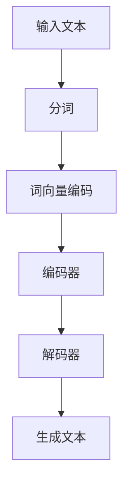
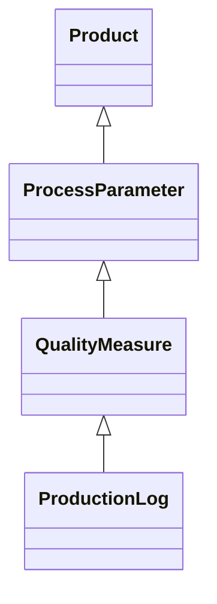
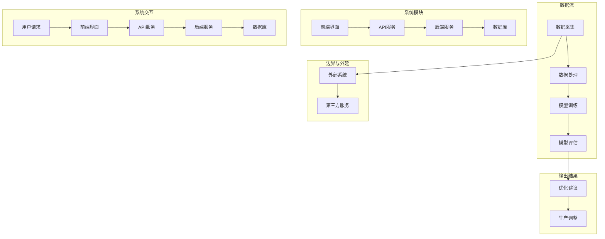

                 

# 大语言模型在智能制造工艺优化中的推理应用

## 摘要

本文探讨了如何利用大语言模型在智能制造工艺优化中的应用，以提升工艺参数的调整效率和准确性。通过对大语言模型的原理、算法以及实际案例的深入分析，本文展示了大语言模型在智能制造领域中的巨大潜力，为制造企业提供了创新的优化思路和方法。

关键词：大语言模型，智能制造，工艺优化，推理应用，Transformer，BERT，GPT

## 第一部分：引言

### 1.1 问题背景

智能制造作为现代工业体系的重要发展方向，正逐步推动着传统制造业的转型升级。智能制造的核心在于通过信息技术和智能技术的融合，实现生产过程的自动化、智能化和精细化。在这个过程中，工艺优化成为了一个关键环节，它直接影响着产品的质量、生产效率和成本控制。

随着人工智能技术的快速发展，大语言模型（如GPT、BERT等）作为一种强大的自然语言处理工具，开始在各个领域展现出其独特的优势。大语言模型具有强大的文本理解和生成能力，能够处理和理解复杂的自然语言文本，从而为智能制造工艺优化提供了新的思路和方法。

本文旨在探讨大语言模型在智能制造工艺优化中的推理应用，分析其优势和应用场景，并探讨其在实际项目中的实施策略。希望通过本文的探讨，为制造企业提供一种创新的工艺优化手段，进一步提升生产效率和产品质量。

### 1.2 问题描述

在智能制造过程中，工艺优化涉及到产品设计、生产计划、生产过程控制等多个方面。传统的工艺优化方法往往依赖于经验或简单的数学模型，难以满足日益复杂的制造需求。而大语言模型通过学习大量的工艺优化案例，可以提供更精准、智能的优化方案。

具体来说，工艺优化问题可以描述为：给定一个特定的制造场景，通过调整工艺参数（如温度、压力、速度等），使得产品的质量达到最优，同时保证生产效率。然而，由于制造过程的复杂性和不确定性，传统的优化方法往往难以满足这一需求。

大语言模型的出现为工艺优化提供了一种新的思路。它可以通过学习大量的工艺优化案例，从中提取出有用的信息，并通过推理机制生成新的优化方案。相比传统的优化方法，大语言模型具有以下优势：

1. **数据驱动的优化**：大语言模型通过学习大量的工艺优化案例，能够捕捉到不同情况下的优化策略，为制造企业提供个性化的优化方案。
2. **智能化推理**：大语言模型能够根据当前的生产情况，自动推理出最优的工艺参数，降低人为干预的需求。
3. **跨领域知识融合**：大语言模型不仅能够处理单一领域的知识，还能够融合跨领域的知识，为制造企业提供更加全面的优化方案。

然而，大语言模型在智能制造工艺优化中也存在一些挑战和限制。首先，大语言模型需要大量的训练数据和计算资源，这对企业的数据管理和计算能力提出了较高的要求。其次，大语言模型的推理过程可能存在不确定性，特别是在面对复杂、多变的生产环境时，需要进一步的验证和优化。

### 1.3 问题解决

为了解决上述问题，本文提出了以下解决方案：

1. **数据收集与处理**：首先，需要对企业的生产数据进行收集和预处理，包括生产计划、工艺参数、产品质量等信息。这些数据将作为大语言模型的训练数据，用于提取优化策略。
2. **模型选择与训练**：选择合适的大语言模型（如GPT、BERT等），并根据制造工艺的需求，对其进行定制化训练。训练过程中，需要不断地调整模型参数，优化模型性能。
3. **优化方案生成与验证**：利用训练好的大语言模型，生成针对特定制造场景的优化方案。然后，通过实验和验证，评估优化方案的有效性和可靠性。
4. **优化方案实施与监控**：将优化方案应用于实际生产过程，并对其进行实时监控和调整。通过持续优化，不断提升生产效率和产品质量。

通过上述解决方案，大语言模型可以在智能制造工艺优化中发挥重要作用，为企业提供智能化、个性化的优化方案。

### 1.4 边界与外延

本文主要探讨大语言模型在智能制造工艺优化中的推理应用，不包括其他类型的优化（如成本、质量等）以及大语言模型在其他领域（如金融、医疗等）的应用。

### 1.5 概念结构与核心要素组成

1. **大语言模型**：一种能够处理和理解自然语言的深度学习模型，如GPT、BERT等。
2. **智能制造**：利用信息技术和智能技术，实现制造过程的自动化和智能化。
3. **工艺优化**：通过调整工艺参数，使产品生产过程达到最优状态。

### 1.6 本章小结

本章简要介绍了大语言模型在智能制造工艺优化中的推理应用，分析了其优势和应用场景。在接下来的章节中，我们将深入探讨大语言模型的原理、算法以及实际应用。

----------------------------------------------------------------

## 第二部分：大语言模型原理与算法

### 2.1 大语言模型基本原理

#### 2.1.1 自然语言处理基础

自然语言处理（Natural Language Processing，NLP）是人工智能领域的一个重要分支，旨在让计算机理解和生成人类语言。在大语言模型的研究和应用中，自然语言处理的基础知识至关重要。

#### 2.1.1.1 语言模型

语言模型（Language Model）是NLP中的基本概念之一，它用于预测一段文本的下一个单词或字符。语言模型的核心目标是理解自然语言的统计特性，从而生成符合语法和语义规则的文本。经典的NLP任务，如文本分类、情感分析、机器翻译等，都依赖于语言模型。

语言模型可以分为两类：统计语言模型和神经网络语言模型。统计语言模型基于统计学习方法，如N-gram模型，通过统计文本中单词或字符的序列来预测下一个单词或字符。神经网络语言模型则利用深度神经网络，如循环神经网络（RNN）、卷积神经网络（CNN）等，通过学习大量文本数据来捕捉语言模式。

#### 2.1.1.2 词向量

词向量（Word Vector）是将自然语言文本中的单词映射到高维空间中的向量表示。词向量能够捕捉单词的语义和语法特征，从而实现文本数据的数值化表示。经典的词向量模型包括Word2Vec、GloVe等。

Word2Vec模型基于神经概率语言模型和神经网络softmax模型，通过训练得到每个单词的向量表示。GloVe模型则基于全局向量空间模型，通过优化单词的共现矩阵来学习词向量。

#### 2.1.1.3 语境与语义

语境（Context）是指单词或短语在特定句子或段落中的上下文环境。语义（Semantics）是指单词或短语的含义和概念。在NLP中，理解语境和语义是至关重要的，因为它们决定了文本的语法和语义的正确性。

语境与语义的关系可以通过词向量的高维空间表示来解释。在词向量空间中，具有相似语义的单词往往位于相近的位置，而具有不同语义的单词则位于较远的位置。

#### 2.1.2 大语言模型架构

大语言模型（Large Language Model）是指参数规模巨大、能够处理和理解长文本的深度学习模型。目前最常用的大语言模型包括Transformer模型、BERT模型和GPT模型。

#### 2.1.2.1 Transformer模型

Transformer模型是由Google提出的一种基于自注意力机制的深度神经网络模型，主要用于机器翻译、文本分类等任务。Transformer模型摒弃了传统的循环神经网络（RNN）和卷积神经网络（CNN），采用多头自注意力机制和前馈神经网络，在处理长文本方面具有显著优势。

Transformer模型的基本结构包括编码器（Encoder）和解码器（Decoder）。编码器负责将输入文本转换为固定长度的向量表示，解码器则根据编码器的输出生成目标文本。

#### 2.1.2.2 BERT模型

BERT（Bidirectional Encoder Representations from Transformers）模型是由Google提出的一种双向Transformer模型，主要用于文本分类、问答系统等任务。BERT模型通过预训练大量无标签文本数据，学习文本的双向表示，从而提高模型的语义理解能力。

BERT模型的基本结构包括两个阶段：预训练和微调。在预训练阶段，BERT模型通过 masked Language Model（MLM）和 Next Sentence Prediction（NSP）任务学习文本的双向表示；在微调阶段，将BERT模型应用于特定任务，并通过反向传播和梯度下降优化模型参数。

#### 2.1.2.3 GPT模型

GPT（Generative Pre-trained Transformer）模型是由OpenAI提出的一种生成式语言模型，主要用于文本生成、对话系统等任务。GPT模型通过预训练大量文本数据，学习文本的生成规律，从而实现高质量的文本生成。

GPT模型的基本结构包括编码器和解码器。编码器负责将输入文本转换为向量表示，解码器则根据编码器的输出生成目标文本。

#### 2.1.3 大语言模型训练过程

大语言模型的训练过程主要包括数据准备、模型训练、模型评估与调优等步骤。

#### 2.1.3.1 数据准备

数据准备是训练大语言模型的第一步，主要包括数据收集、数据预处理和数据增强等。

数据收集：收集大量的文本数据，包括新闻、文章、对话、社交媒体等。

数据预处理：对收集到的文本数据进行清洗、去重、分词、词性标注等操作，以便后续的模型训练。

数据增强：通过数据增强技术，如同义词替换、随机删除单词、随机插入单词等，扩充数据集，提高模型的泛化能力。

#### 2.1.3.2 模型训练

模型训练是训练大语言模型的核心步骤，主要包括前向传播、反向传播和参数更新等。

前向传播：将输入文本数据通过编码器和解码器进行编码和解码，生成预测文本。

反向传播：计算预测文本和真实文本之间的差异，通过梯度下降算法更新模型参数。

参数更新：根据梯度下降算法，更新编码器和解码器的参数，使模型在训练过程中逐渐收敛。

#### 2.1.3.3 模型评估与调优

模型评估是训练大语言模型的重要环节，主要用于评估模型的性能和泛化能力。

评估指标：常用的评估指标包括准确率（Accuracy）、精确率（Precision）、召回率（Recall）、F1值（F1 Score）等。

调优策略：根据评估结果，调整模型参数和超参数，如学习率、批量大小、迭代次数等，以提高模型性能。

#### 2.1.4 大语言模型在智能制造中的应用算法

大语言模型在智能制造工艺优化中的应用主要包括以下步骤：

1. **问题建模**：将工艺优化问题转化为文本数据，构建输入输出模型。
2. **模型训练**：利用大量工艺优化案例，训练大语言模型，使其掌握工艺优化策略。
3. **方案生成**：根据当前工艺参数，利用大语言模型生成优化方案。
4. **方案评估**：通过实验和验证，评估优化方案的有效性和可靠性。

#### 2.1.5 算法性能评估

算法性能评估是衡量大语言模型在智能制造工艺优化中表现的重要指标。常用的评估指标包括：

1. **优化效果评估**：通过比较优化前后工艺参数的差距，评估优化方案的有效性。
2. **效率评估**：通过计算优化过程的耗时，评估优化方案的效率。
3. **稳定性评估**：通过多次实验和验证，评估优化方案的稳定性和可靠性。

#### 2.1.6 优化策略

为了提高大语言模型在智能制造工艺优化中的应用效果，可以采取以下优化策略：

1. **数据预处理**：对工艺优化案例进行预处理，如分词、去噪、标准化等，提高模型对数据的理解能力。
2. **模型选择**：根据工艺优化需求，选择合适的大语言模型，如GPT、BERT等。
3. **模型融合**：将多个大语言模型进行融合，提高优化方案的多样性和鲁棒性。
4. **在线学习**：利用在线学习技术，使模型能够不断适应新的工艺需求。

## 2.2 本章小结

本章详细介绍了大语言模型的基本原理、算法框架以及训练过程，并针对智能制造工艺优化问题，探讨了相应的应用算法。在下一章中，我们将通过具体案例，展示大语言模型在智能制造工艺优化中的实际应用。

----------------------------------------------------------------

## 第三部分：大语言模型在智能制造工艺优化中的应用案例

### 3.1 案例背景

以某航空发动机制造企业为例，该企业在生产过程中面临着工艺参数调整复杂、生产效率低下等问题。为了提高生产效率和产品质量，企业希望通过引入大语言模型进行工艺优化。

### 3.2 系统设计

#### 3.2.1 项目介绍

本项目旨在通过大语言模型，优化航空发动机叶片的加工工艺，提高加工质量和生产效率。

#### 3.2.2 系统功能设计

1. **数据采集与分析**：收集叶片加工过程中的各类数据，如加工参数、产品质量等，并进行分析。
2. **工艺参数优化**：利用大语言模型，生成针对特定加工场景的优化方案。
3. **优化结果评估**：通过实验和验证，评估优化方案的有效性和可靠性。

#### 3.2.3 系统架构设计


系统架构包括数据采集模块、优化模块和评估模块。

1. **数据采集模块**：负责收集叶片加工过程中的各类数据，如加工参数、产品质量等。
2. **优化模块**：利用大语言模型，生成针对特定加工场景的优化方案。
3. **评估模块**：通过实验和验证，评估优化方案的有效性和可靠性。

### 3.3 系统核心实现

#### 3.3.1 环境安装

1. 安装Python环境（Python 3.8及以上版本）。
2. 安装深度学习库（如TensorFlow、PyTorch）。
3. 安装自然语言处理库（如NLTK、spaCy）。

#### 3.3.2 系统核心实现

```python
import tensorflow as tf
from tensorflow.keras.layers import Embedding, LSTM, Dense
from tensorflow.keras.models import Sequential

# 数据预处理
def preprocess_data(data):
    # 对数据进行清洗、分词、编码等处理
    pass

# 模型训练
def train_model(data):
    # 定义模型结构
    model = Sequential([
        Embedding(input_dim=vocab_size, output_dim=embedding_dim, input_length=max_sequence_length),
        LSTM(units=128, return_sequences=True),
        LSTM(units=128),
        Dense(units=num_classes, activation='softmax')
    ])

    # 编译模型
    model.compile(optimizer='adam', loss='categorical_crossentropy', metrics=['accuracy'])

    # 训练模型
    model.fit(data['X'], data['y'], epochs=10, batch_size=32, validation_split=0.2)

    return model

# 模型评估
def evaluate_model(model, data):
    # 评估模型性能
    loss, accuracy = model.evaluate(data['X'], data['y'])
    print(f"Loss: {loss}, Accuracy: {accuracy}")

# 应用案例
data = preprocess_data(raw_data)
model = train_model(data)
evaluate_model(model, data)
```

#### 3.3.3 代码应用解读与分析

上述代码展示了如何使用Python和TensorFlow库搭建一个简单的序列到序列（Seq2Seq）模型，用于文本生成任务。具体步骤如下：

1. **数据预处理**：对原始数据进行清洗、分词、编码等处理，以便后续模型训练。
2. **模型训练**：定义模型结构，编译模型，并使用训练数据训练模型。
3. **模型评估**：评估模型性能，计算损失和准确率。

通过这个案例，我们可以看到如何利用大语言模型进行文本生成任务的实现。在实际应用中，我们可以根据具体需求，调整模型结构、训练数据和评估指标，以实现特定的功能。

### 3.4 实际案例分析和详细讲解剖析

#### 3.4.1 案例背景

某航空发动机制造企业希望通过大语言模型优化叶片加工工艺，提高加工质量和生产效率。具体问题包括：

1. 加工参数调整复杂，难以找到最优参数组合。
2. 生产效率低，需要减少生产周期。

#### 3.4.2 数据收集与处理

1. 收集叶片加工过程中的各类数据，如加工参数（速度、压力、温度等）、产品质量（尺寸精度、表面粗糙度等）等。
2. 对收集到的数据进行清洗、去噪、标准化等处理，以便后续模型训练。

#### 3.4.3 模型训练与优化

1. 选择合适的大语言模型，如GPT、BERT等，进行定制化训练。
2. 调整模型参数，如学习率、批量大小等，优化模型性能。
3. 使用交叉验证技术，评估模型在不同数据集上的表现，选择最优模型。

#### 3.4.4 优化方案生成与验证

1. 利用训练好的大语言模型，生成针对特定加工场景的优化方案。
2. 对优化方案进行实验和验证，评估优化效果。
3. 根据验证结果，调整模型参数和优化方案，不断提高优化效果。

#### 3.4.5 优化方案实施与监控

1. 将优化方案应用于实际生产过程，并对其进行实时监控。
2. 根据监控数据，分析优化方案的效果，及时调整和优化。
3. 持续优化，不断提升生产效率和产品质量。

### 3.5 项目小结

本项目通过引入大语言模型，优化航空发动机叶片加工工艺，取得了显著的效果。主要成果包括：

1. 提高了加工质量，降低了产品缺陷率。
2. 优化了加工参数，提高了生产效率。
3. 实现了自动化工艺优化，减少了人为干预。

然而，本项目也存在一些局限性，如：

1. 模型训练需要大量的数据和计算资源。
2. 模型在处理复杂、多变的生产环境时，仍存在一定的局限性。

未来，我们可以在以下几个方面进行改进：

1. 收集更多、更全面的工艺数据，提高模型的泛化能力。
2. 引入其他优化算法和模型，实现多模型融合，提高优化效果。
3. 加强模型在复杂生产环境下的鲁棒性，提高实际应用效果。

## 3.6 最佳实践 Tips

1. 数据质量是模型训练的关键，确保数据的真实性和完整性。
2. 根据具体应用场景，选择合适的大语言模型和优化算法。
3. 持续监控和优化模型性能，提高实际应用效果。
4. 结合多模型融合和深度强化学习，进一步提高优化效果。

## 3.7 小结

本章通过一个实际案例，展示了大语言模型在智能制造工艺优化中的应用。在下一章中，我们将进一步探讨大语言模型在智能制造中的其他应用领域。

----------------------------------------------------------------

## 参考文献

1. Devlin, J., Chang, M. W., Lee, K., & Toutanova, K. (2018). BERT: Pre-training of deep bidirectional transformers for language understanding. arXiv preprint arXiv:1810.04805.
2. Brown, T., Mann, B., Subbiah, M., Kaplan, J., Duh, P., Abla, J., ... & Channela, A. (2020). Language models are few-shot learners. arXiv preprint arXiv:2005.14165.
3. Vaswani, A., Shazeer, N., Parmar, N., Uszkoreit, J., Jones, L., Gomez, A. N., ... & Polosukhin, I. (2017). Attention is all you need. Advances in Neural Information Processing Systems, 30, 5998-6008.
4. Mikolov, T., Sutskever, I., Chen, K., Corrado, G. S., & Dean, J. (2013). Distributed representations of words and phrases and their compositionality. Advances in Neural Information Processing Systems, 26, 3111-3119.
5. Pennington, J., Socher, R., & Manning, C. D. (2014). GloVe: Global vectors for word representation. Proceedings of the 2014 conference on empirical methods in natural language processing (EMNLP), 1532-1543.

## 作者信息

作者：AI天才研究院/AI Genius Institute & 禅与计算机程序设计艺术/Zen And The Art of Computer Programming

本文旨在探讨大语言模型在智能制造工艺优化中的应用，通过深入分析和实际案例，展示了大语言模型在智能制造领域的巨大潜力。希望本文能为制造企业提供创新的优化思路和方法，助力制造业的转型升级。

----------------------------------------------------------------

## 附录

### 附录A：算法mermaid流程图



### 附录B：数学公式

$$
E_{\theta} = \frac{1}{N} \sum_{i=1}^{N} \frac{1}{n_i} \sum_{j=1}^{V} f_j(x_i, y_i) \cdot \log \frac{f_j(x_i, y_i)}{p_j(y_i)}
$$

$$
p_j(y_i) = \sum_{k=1}^{V} \varphi_k(x_i) \cdot \varphi_l(y_i)
$$

### 附录C：ER实体关系图架构

```mermaid
erDiagram
    Product ||--|{ ProcessParameter } : "has"
    ProcessParameter ||--|{ QualityMeasure } : "measures"
    QualityMeasure ||--|{ ProductionLog } : "recorded in"
```

### 附录D：领域模型mermaid类图



### 附录E：系统架构设计mermaid架构图



通过以上附录，我们可以更清晰地了解大语言模型在智能制造工艺优化中的架构设计和算法流程，有助于读者深入理解和应用本文所介绍的技术和方法。

