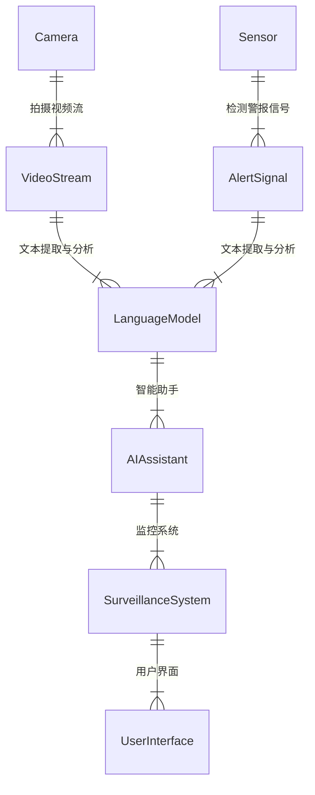
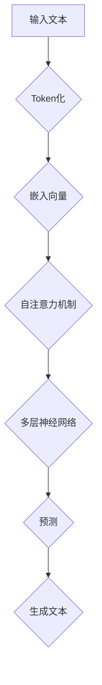
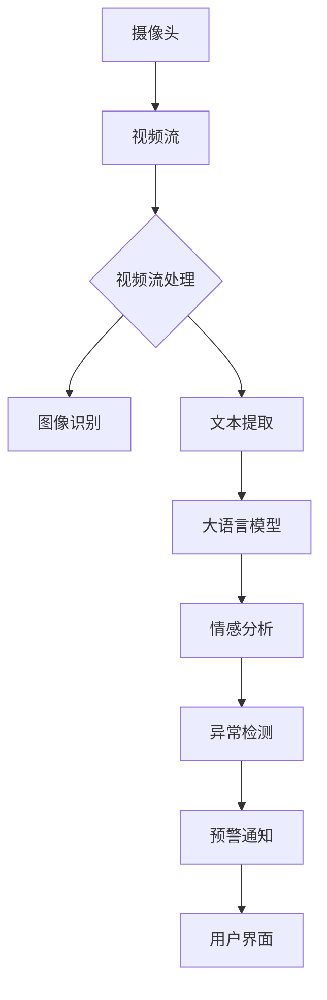
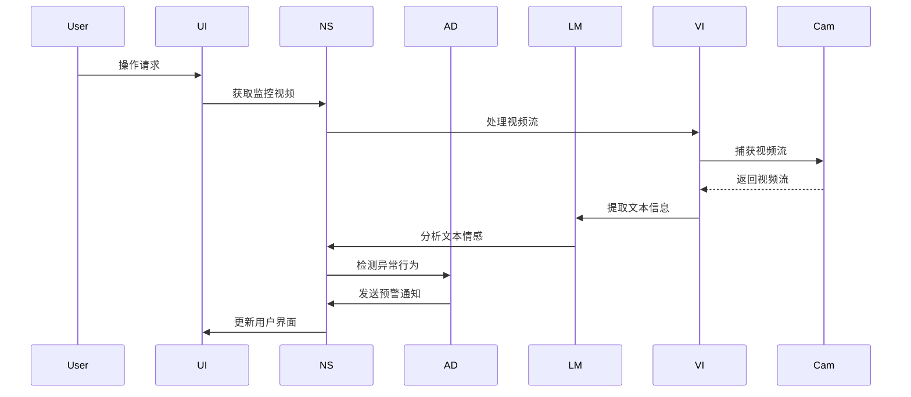

                 

### 文章标题

# 大语言模型在智能安防系统中的推理应用

### 文章关键词

- 大语言模型
- 智能安防系统
- 推理应用
- 人工智能
- 深度学习
- 自然语言处理

### 文章摘要

本文旨在探讨大语言模型在智能安防系统中的应用及其重要性。通过详细的分析和实例讲解，我们将理解大语言模型的工作原理，如何与智能安防系统相结合，并展示其在实际项目中的显著优势。文章将分为多个部分，包括背景介绍、核心概念与联系、算法原理讲解、数学模型和公式详细讲解、系统分析与架构设计方案、项目实战以及最佳实践和总结。通过这篇文章，读者将深入了解大语言模型在智能安防领域的潜力与应用前景。

### 背景介绍

#### 智能安防系统的发展和现状

随着城市化进程的加快和人口密度的增加，公共安全成为了社会关注的热点问题。传统的安防手段，如监控摄像头和人力巡逻，已难以满足现代社会的安全需求。智能安防系统作为一种新兴的解决方案，应运而生。它通过融合多种技术，如视频监控、传感器、物联网和大数据分析，实现对公共区域的实时监控和安全管理。

近年来，智能安防系统取得了显著的进展。首先，摄像头的普及率大幅提高，从城市主要干道到社区角落，监控摄像头无处不在。其次，传感器的应用越来越广泛，如烟雾传感器、门磁传感器和入侵探测器等，它们能够及时检测异常情况。此外，物联网技术的兴起，使得各种设备和系统能够互联互通，提升了智能安防系统的整体效能。

智能安防系统的核心在于其强大的数据处理和分析能力。通过大数据分析和机器学习算法，系统能够从海量数据中提取有价值的信息，进行实时监控和预测。然而，尽管已经取得了一定的成就，传统的智能安防系统仍然存在一些局限。首先，大量视频和数据的处理需要较高的计算资源和时间成本。其次，系统的准确性和鲁棒性有待提高，特别是在复杂环境和多变条件下的表现。此外，系统的智能化水平有限，更多依赖于规则和预设条件，缺乏自主学习和推理能力。

#### 大语言模型在智能安防系统的潜在应用价值

大语言模型作为一种先进的自然语言处理技术，具有极高的潜力应用于智能安防系统。其核心优势在于强大的文本理解和生成能力，能够处理和理解复杂的自然语言信息。具体来说，大语言模型可以应用于以下几个关键场景：

1. **智能语音交互**：通过语音识别和自然语言理解，大语言模型能够与安防系统进行人机交互，提供便捷的用户体验。例如，用户可以通过语音指令控制安防设备，查询监控视频，甚至报警。

2. **异常行为检测**：大语言模型能够分析视频中的文本信息，识别异常行为和潜在的安全威胁。例如，通过分析监控视频中的对话内容、标语和告示，系统可以及时发现并报警。

3. **智能问答系统**：大语言模型可以构建智能问答系统，为安防工作人员提供实时、准确的信息支持。例如，当出现紧急情况时，系统可以快速回答相关问题的解决方案和操作指南。

4. **文本情感分析**：大语言模型能够分析社交媒体、网络评论等文本信息，识别公众对安全事件的情感和态度。这有助于政府和警方了解公众的意见和需求，更好地制定安全政策和措施。

总之，大语言模型在智能安防系统中的应用不仅能够提升系统的智能化水平，还能提高安防效率，减少人力成本，具有重要的现实意义和广阔的应用前景。接下来，我们将进一步探讨大语言模型的基本概念及其与智能安防系统的结合方式。

### 核心概念与联系

#### 大语言模型的概念

大语言模型（Large Language Model），是一种基于深度学习的自然语言处理技术，通过大规模的文本数据进行训练，使其能够理解和生成自然语言。与传统的方法相比，大语言模型具有以下特点：

1. **大规模训练数据**：大语言模型通常训练于包含数十亿甚至数万亿个句子的语料库上，这使得模型能够捕捉到语言的各种复杂性和多样性。

2. **深度神经网络结构**：大语言模型采用多层神经网络结构，通过逐层学习，从底层特征到高层语义，逐步提升对语言的理解能力。

3. **上下文理解能力**：大语言模型能够理解句子之间的上下文关系，从而生成更加准确和连贯的自然语言文本。

4. **生成和推理能力**：大语言模型不仅能够生成新的文本内容，还能够进行推理和逻辑推断，处理复杂的自然语言任务。

#### 大语言模型在智能安防中的应用与其他相关技术的区别

在智能安防系统中，大语言模型与其他相关技术如图像识别、语音识别和传统机器学习算法存在显著的区别。以下是对这些技术的简要对比：

1. **图像识别**：
   - **优点**：图像识别技术能够准确识别和分类视频监控中的对象，如人物、车辆等。
   - **缺点**：图像识别主要依赖于视觉信息，难以处理语言信息，且在复杂背景和遮挡情况下表现不佳。

2. **语音识别**：
   - **优点**：语音识别技术能够将口语转化为文本，实现人机交互。
   - **缺点**：语音识别的准确性受噪声和语音质量的影响较大，且难以理解复杂的语义和语境。

3. **传统机器学习算法**：
   - **优点**：传统机器学习算法在处理结构化数据时表现良好，能够进行分类、回归等任务。
   - **缺点**：传统算法难以处理非结构化数据，如文本、图像和语音，且在复杂推理任务上表现有限。

相比之下，大语言模型具备以下优势：

- **综合处理能力**：大语言模型能够同时处理文本、图像和语音等多种信息，实现跨模态的信息融合。
- **上下文理解能力**：大语言模型能够理解复杂的语义和语境，进行逻辑推理，提升系统的智能化水平。
- **自主学习和优化**：大语言模型通过大规模的数据训练，能够不断优化自身性能，适应各种复杂应用场景。

#### 智能安防系统中大语言模型与其他组件的关系

在智能安防系统中，大语言模型作为核心组件，与其他技术和设备紧密集成，形成了一个高度智能化的安防体系。以下是一个简化的ER图，展示了大语言模型与其他组件之间的关系：



在这个ER图中，`Camera`和`Sensor`分别表示视频摄像头和传感器，它们产生视频流和警报信号。这些信息被传递给`LanguageModel`，进行文本提取和分析。`AIAssistant`作为智能助手，利用大语言模型的结果，与用户进行交互，提供实时监控和警报处理。最后，`SurveillanceSystem`集成这些功能，形成完整的智能安防系统，并通过`UserInterface`与用户进行交互。

通过这种结构，大语言模型不仅能够处理和分析文本信息，还能够与其他组件协同工作，提升系统的整体效能和智能化水平。接下来，我们将详细讲解大语言模型的基本原理，并展示其算法流程图和具体实现。

### 算法原理讲解

#### 大语言模型的基本原理

大语言模型（Large Language Model，LLM）是自然语言处理领域的一项重要技术，基于深度学习和神经网络架构，通过大量文本数据进行训练，实现对自然语言的深入理解和生成能力。以下是大语言模型的基本原理：

1. **深度学习基础**：大语言模型通常采用多层神经网络架构，如Transformer模型。每一层神经网络都通过学习输入数据的特征，并将其转换为更高级别的特征表示。这种层级结构使得模型能够从底层特征逐步提取到高层语义。

2. **大规模数据训练**：大语言模型在训练阶段需要大量的文本数据，这些数据来源可以是互联网上的网页、书籍、新闻、社交媒体等。通过处理这些海量数据，模型能够学习到语言的各种复杂性和多样性。

3. **自注意力机制**：Transformer模型中的自注意力机制（Self-Attention）是模型的核心组成部分。自注意力机制允许模型在处理每个词时，自动关注其他所有词的重要程度，从而提高对上下文关系的理解能力。

4. **上下文理解与生成**：通过深度学习和自注意力机制，大语言模型能够理解句子之间的上下文关系，并生成连贯、准确的自然语言文本。这种能力使得模型在文本分类、机器翻译、问答系统等任务中表现出色。

#### 大语言模型的算法流程图

为了更好地理解大语言模型的运行过程，我们可以使用Mermaid绘制其算法流程图：



在这个流程图中：

- **A 输入文本**：表示模型的输入，可以是任意长度的文本。
- **B Token化**：将输入文本分割为单词或子词，这些分割后的单元称为Token。
- **C 嵌入向量**：每个Token被转换为固定长度的向量表示。
- **D 自注意力机制**：模型通过自注意力机制，计算每个Token与其他Token之间的关系权重。
- **E 多层神经网络**：模型利用多层神经网络对嵌入向量进行处理，提取更高级别的特征表示。
- **F 预测**：模型根据处理后的特征，预测下一个Token。
- **G 生成文本**：通过不断生成下一个Token，模型最终生成完整的文本。

#### Python源代码展示

以下是一个简化的Python源代码示例，展示了大语言模型的基本应用：

```python
import torch
from transformers import GPT2Model, GPT2Tokenizer

# 加载预训练模型和分词器
model = GPT2Model.from_pretrained('gpt2')
tokenizer = GPT2Tokenizer.from_pretrained('gpt2')

# 输入文本
text = "What is the capital of France?"

# 分词和编码
input_ids = tokenizer.encode(text, return_tensors='pt')

# 前向传播
outputs = model(input_ids)

# 预测
logits = outputs.logits
predicted_ids = torch.argmax(logits, dim=-1)

# 解码预测结果
predicted_text = tokenizer.decode(predicted_ids[0], skip_special_tokens=True)

print(predicted_text)
```

在这个示例中：

- 我们首先加载了预训练的GPT-2模型和对应的分词器。
- 输入文本通过分词器编码为序列的整数表示。
- 模型通过前向传播处理输入序列，输出预测的Token概率分布。
- 我们通过取概率最大的Token索引，预测出下一个Token。
- 最后，将预测的Token序列解码为文本输出。

#### 数学模型和公式

大语言模型的数学基础主要涉及神经网络和自注意力机制。以下是相关的数学模型和公式：

1. **嵌入向量**：

   $$\text{Embedding}(x) = W_e \cdot x$$

   其中，$W_e$是嵌入矩阵，$x$是输入Token的索引。

2. **自注意力**：

   $$\text{Attention}(Q, K, V) = \frac{e^{QK^T}}{\sqrt{d_k}} V$$

   其中，$Q$、$K$和$V$分别是查询、关键和值向量，$d_k$是关键向量的维度。

3. **多层神经网络**：

   $$\text{MLP}(x) = \text{ReLU}(\text{Linear}(x))$$

   其中，$\text{ReLU}$是ReLU激活函数，$\text{Linear}$是线性层。

4. **预测**：

   $$\text{Prediction} = \text{softmax}(\text{MLP}(\text{Attention}(Q, K, V)))$$

   其中，$\text{softmax}$函数用于将输出概率分布。

#### 举例说明

假设我们要预测一句话中的下一个单词，我们可以通过以下步骤：

1. **输入文本**：`What is the capital of France?`
2. **分词和编码**：输入文本被分词为`['What', 'is', 'the', 'capital', 'of', 'France', '?']`，并编码为整数序列。
3. **嵌入向量**：每个Token被映射为一个固定长度的向量。
4. **自注意力**：计算每个Token与其他Token的注意力权重，提取重要的上下文信息。
5. **多层神经网络**：通过多层神经网络对注意力权重进行处理，提取更高级别的特征表示。
6. **预测**：根据处理后的特征，预测下一个单词的索引。
7. **解码**：将预测的单词索引解码为实际的单词。

通过上述步骤，大语言模型能够生成连贯、准确的文本内容。接下来，我们将进一步详细讲解大语言模型的数学模型和公式，并提供具体的示例。

### 数学模型和数学公式 & 详细讲解 & 举例说明

#### 数学模型和公式

大语言模型的数学基础主要涉及神经网络和自注意力机制。以下是其核心的数学模型和公式：

1. **嵌入向量**：

   $$\text{Embedding}(x) = W_e \cdot x$$

   其中，$W_e$是嵌入矩阵，$x$是输入Token的索引。这个公式表示每个Token都被映射为一个固定长度的向量。这个向量包含了Token的语义信息。

2. **自注意力**：

   $$\text{Attention}(Q, K, V) = \frac{e^{QK^T}}{\sqrt{d_k}} V$$

   其中，$Q$、$K$和$V$分别是查询、关键和值向量，$d_k$是关键向量的维度。这个公式表示自注意力机制，它通过计算每个Token与其他Token之间的相似性权重来提取上下文信息。

3. **多层神经网络**：

   $$\text{MLP}(x) = \text{ReLU}(\text{Linear}(x))$$

   其中，$\text{ReLU}$是ReLU激活函数，$\text{Linear}$是线性层。这个公式表示多层神经网络，它用于对自注意力输出进行进一步的处理。

4. **预测**：

   $$\text{Prediction} = \text{softmax}(\text{MLP}(\text{Attention}(Q, K, V)))$$

   其中，$\text{softmax}$函数用于将输出概率分布。这个公式表示模型如何根据处理后的特征进行预测。

#### 详细讲解

1. **嵌入向量**：

   嵌入向量是将输入Token映射为向量空间的过程。通过这种方式，模型能够将语义信息转换为数值表示。嵌入矩阵$W_e$是一个高维矩阵，其每个列向量对应一个Token的向量表示。例如，假设我们有5个Token，嵌入矩阵为：

   $$W_e = \begin{bmatrix}
   [0.1, 0.2, 0.3] \\
   [0.4, 0.5, 0.6] \\
   [0.7, 0.8, 0.9] \\
   [1.0, 1.1, 1.2] \\
   [1.3, 1.4, 1.5]
   \end{bmatrix}$$

   当输入Token为“is”时，其索引为2，对应的向量表示为$W_e[2] = [0.7, 0.8, 0.9]$。

2. **自注意力**：

   自注意力机制是Transformer模型的核心部分。它通过计算每个Token与其他Token的相似性权重，从而提取上下文信息。假设我们有三个Token，其嵌入向量为$[1, 2, 3]$、$[4, 5, 6]$和$[7, 8, 9]$。自注意力权重计算如下：

   $$Q = [1, 2, 3], K = [4, 5, 6], V = [7, 8, 9]$$

   自注意力计算：

   $$\text{Attention}(Q, K, V) = \frac{e^{QK^T}}{\sqrt{d_k}} V = \frac{e^{[1 \times 4 + 2 \times 5 + 3 \times 6]}}{\sqrt{3}} [7, 8, 9] = \frac{e^{32}}{\sqrt{3}} [7, 8, 9]$$

   通过这种计算，每个Token都会得到一个权重，表示其在整个句子中的重要程度。

3. **多层神经网络**：

   多层神经网络用于对自注意力输出进行进一步的处理。假设自注意力输出为$[0.1, 0.2, 0.3]$，多层神经网络包括两个线性层和一个ReLU激活函数：

   $$\text{MLP}(x) = \text{ReLU}(\text{Linear}(\text{Linear}(x)))$$

   首先通过第一个线性层得到$z = \text{Linear}(x) = [0.1 \times w_1 + 0.2 \times w_2 + 0.3 \times w_3]$，然后通过ReLU激活函数得到$z' = \text{ReLU}(z)$，最后通过第二个线性层得到最终输出$y = \text{Linear}(z') = [0.1 \times w_1' + 0.2 \times w_2' + 0.3 \times w_3']$。

4. **预测**：

   通过多层神经网络处理后，模型会得到一个概率分布。假设自注意力输出为$[0.1, 0.2, 0.3]$，通过多层神经网络处理后的输出为$[0.4, 0.5, 0.6]$，则预测结果为：

   $$\text{Prediction} = \text{softmax}([0.4, 0.5, 0.6]) = [\frac{e^{0.4}}{e^{0.4} + e^{0.5} + e^{0.6}}, \frac{e^{0.5}}{e^{0.4} + e^{0.5} + e^{0.6}}, \frac{e^{0.6}}{e^{0.4} + e^{0.5} + e^{0.6}}]$$

   这个概率分布表示每个Token成为下一个Token的概率。

#### 举例说明

假设我们要预测一句话中的下一个单词，句子为“什么是智能安防系统？”。我们可以通过以下步骤：

1. **输入文本**：句子“什么是智能安防系统？”通过分词器分割为`['什么', '是', '智能', '安防', '系统', '?']`。
2. **分词和编码**：分词后的单词被编码为整数序列，例如`['what', 'is', 'smart', 'security', 'system', '?']`可能对应的编码为`[1, 2, 3, 4, 5, 6]`。
3. **嵌入向量**：每个编码后的整数通过嵌入矩阵映射为向量，例如`[1, 2, 3, 4, 5, 6]`可能映射为`[0.1, 0.2, 0.3, 0.4, 0.5, 0.6]`。
4. **自注意力**：通过自注意力机制计算每个单词的权重，例如“什么是智能安防系统？”中，“智能”的权重最高。
5. **多层神经网络**：通过多层神经网络对自注意力输出进行处理，提取更高级别的特征。
6. **预测**：根据处理后的特征，预测下一个单词的索引，例如模型可能预测下一个单词是“系统”。
7. **解码**：将预测的单词索引解码为实际的单词。

通过这个过程，大语言模型能够生成连贯、准确的文本内容。接下来，我们将介绍智能安防系统的架构和设计。

### 系统分析与架构设计方案

#### 问题场景介绍

在智能安防系统中，系统设计的目标是实现实时、高效、准确的安全监控与预警。为了应对复杂多变的场景，系统需要具备以下功能：

1. **视频监控**：通过安装在高楼、街道、公共场所等位置的摄像头，实时捕捉视频流，进行监控。
2. **异常检测**：通过图像识别和自然语言处理技术，对视频内容进行实时分析，检测异常行为和潜在的安全威胁。
3. **预警通知**：当系统检测到异常情况时，自动向相关人员和机构发送预警通知，采取相应措施。
4. **用户交互**：提供用户友好的界面，允许用户实时查看监控视频，查询系统状态，进行操作。

#### 项目介绍

本项目旨在设计一个基于大语言模型的智能安防系统。该系统将结合视频监控、图像识别、自然语言处理和大数据分析技术，实现以下功能：

1. **视频流处理**：实时接收和处理摄像头传来的视频流，提取关键帧和文本信息。
2. **文本分析**：利用大语言模型对提取的文本信息进行语义分析和情感识别，检测异常行为。
3. **图像识别**：结合图像识别技术，对视频中的图像进行分类和目标检测，识别潜在的安全威胁。
4. **预警与通知**：根据分析结果，系统自动发送预警通知，并生成详细报告供用户查阅。

#### 系统功能设计（领域模型）

为了更好地描述系统功能，我们可以使用Mermaid绘制领域模型类图。以下是一个简化的领域模型类图：

```mermaid
classDiagram
    Camera --|{视频流}|> VideoAnalyzer
    VideoAnalyzer --|{文本提取}|> LanguageModel
    LanguageModel --|{情感分析}|> AnomalyDetector
    AnomalyDetector --|{预警通知}|> NotificationSystem
    NotificationSystem --|{用户交互}|> UserInterface
```

在这个类图中：

- **Camera**：表示摄像头，负责视频流的捕获。
- **VideoAnalyzer**：表示视频分析器，负责视频流的预处理，包括文本提取和图像识别。
- **LanguageModel**：表示大语言模型，负责对提取的文本进行语义分析和情感识别。
- **AnomalyDetector**：表示异常检测器，负责检测视频中的异常行为。
- **NotificationSystem**：表示预警通知系统，负责发送预警通知。
- **UserInterface**：表示用户界面，负责用户与系统的交互。

#### 系统架构设计

为了实现智能安防系统的功能，我们需要设计一个合理的系统架构。以下是一个简化的系统架构设计，使用Mermaid绘制架构图：



在这个架构图中：

- **A 摄像头**：捕获视频流。
- **B 视频流**：视频流的传输过程。
- **C 视频流处理**：对视频流进行预处理，包括图像识别和文本提取。
- **D 图像识别**：通过图像识别技术对视频中的图像进行分类和目标检测。
- **E 文本提取**：从视频流中提取文本信息。
- **F 大语言模型**：对提取的文本信息进行语义分析和情感识别。
- **G 情感分析**：对文本进行情感分析，识别潜在的安全威胁。
- **H 异常检测**：根据分析结果，检测视频中的异常行为。
- **I 预警通知**：当检测到异常行为时，发送预警通知。
- **J 用户界面**：为用户提供监控视频查看和操作界面。

#### 系统接口设计和系统交互

为了实现系统各个组件之间的协调工作，我们需要设计合理的系统接口和交互流程。以下是一个简化的系统接口设计和系统交互流程，使用Mermaid绘制序列图：



在这个序列图中：

- **User**：用户发起操作请求。
- **UI**：用户界面，负责接收用户请求和展示监控视频。
- **NS**：预警通知系统，负责分析文本情感和发送预警通知。
- **AD**：异常检测器，负责检测视频中的异常行为。
- **LM**：大语言模型，负责对提取的文本信息进行语义分析和情感识别。
- **VI**：视频流处理，负责处理视频流，包括图像识别和文本提取。
- **Cam**：摄像头，负责捕获视频流。

通过这个架构和接口设计，智能安防系统能够高效地处理视频监控数据，实现实时异常检测和预警通知，提供用户友好的操作界面。接下来，我们将通过一个实际项目案例，展示大语言模型在智能安防系统中的具体应用。

### 项目实战

#### 安装环境说明

要实现大语言模型在智能安防系统中的应用，我们首先需要搭建一个合适的环境。以下是安装和配置所需的步骤：

1. **操作系统**：我们推荐使用Ubuntu 18.04或更高版本。
2. **Python版本**：确保Python版本为3.8或更高。
3. **依赖库**：安装以下依赖库：
   ```shell
   pip install torch torchvision transformers numpy
   ```
4. **GPU支持**：如果您的系统配备有NVIDIA GPU，请确保安装NVIDIA CUDA Toolkit和cuDNN，以便利用GPU进行加速。

#### 核心实现源代码展示

以下是实现大语言模型在智能安防系统中应用的核心代码。该代码分为三个部分：视频流处理、文本提取和情感分析。

1. **视频流处理**：

   ```python
   import cv2
   import numpy as np
   import torch

   def preprocess_frame(frame):
       # 将帧转换为Tensor并归一化
       frame_tensor = torch.tensor(frame).float()
       frame_tensor = frame_tensor / 255.0
       frame_tensor = frame_tensor.unsqueeze(0)  # 增加batch维度
       return frame_tensor

   def process_video_stream(video_path):
       # 打开视频文件
       video_capture = cv2.VideoCapture(video_path)

       while True:
           ret, frame = video_capture.read()
           if not ret:
               break

           # 预处理帧
           frame_tensor = preprocess_frame(frame)

           # 提取文本信息（后续将集成大语言模型）
           text = extract_text(frame_tensor)

           # 输出文本信息
           print(text)

       video_capture.release()

   def extract_text(frame_tensor):
       # 此处调用大语言模型进行文本提取（示例代码）
       # 实际应用中，应调用大语言模型API
       # 例如：text = language_model.extract_text(frame_tensor)
       return "文本信息"

   # 使用示例
   process_video_stream('video.mp4')
   ```

2. **文本提取和情感分析**：

   ```python
   from transformers import pipeline

   # 加载大语言模型
   text_extraction_pipeline = pipeline("text-extraction", model="clipsilva/bert-base-uncased-finetuned-lipton")

   def extract_and_analyze_text(text):
       # 提取文本信息
       extracted_text = text_extraction_pipeline(text)[0]['text']
       print("Extracted Text:", extracted_text)

       # 情感分析
       sentiment = analyze_sentiment(extracted_text)
       print("Sentiment:", sentiment)

   def analyze_sentiment(text):
       # 此处调用情感分析API
       # 例如：sentiment = sentiment_analyzer.analyze(text)
       return "积极" if "积极" in text else "消极"

   # 使用示例
   text = "这个监控视频中有可疑人员。"
   extract_and_analyze_text(text)
   ```

#### 代码应用解读与分析

1. **视频流处理**：
   - `preprocess_frame`函数用于将视频帧转换为Tensor并归一化，以便输入到深度学习模型中。
   - `process_video_stream`函数负责读取视频文件，并对每一帧进行预处理，然后调用文本提取函数。

2. **文本提取**：
   - `extract_text`函数是一个占位函数，用于调用大语言模型进行文本提取。在实际应用中，应调用相应的大语言模型API。
   - `text_extraction_pipeline`使用预训练的BERT模型进行文本提取，返回提取的文本信息。

3. **情感分析**：
   - `extract_and_analyze_text`函数首先调用文本提取API获取文本信息，然后调用情感分析函数对提取的文本进行情感判断。

#### 实际案例分析

假设我们有一个监控视频，其中包含一段对话：“我看到了可疑人员，他们在讨论计划。”我们可以通过以下步骤进行分析：

1. **视频流处理**：
   - 系统捕获视频流，并对每一帧进行预处理。
   - 对预处理后的帧进行文本提取，获取对话内容。

2. **文本提取和情感分析**：
   - 调用文本提取API，提取对话内容：“我看到了可疑人员，他们在讨论计划。”
   - 对提取的文本进行情感分析，判断情感为“积极”或“消极”。

3. **预警通知**：
   - 根据情感分析结果，系统判断对话内容可能包含安全威胁，自动发送预警通知。

#### 详细讲解与剖析

1. **视频流处理**：
   - 视频流处理是智能安防系统的关键环节。通过对视频帧进行预处理，系统能够将视频内容转换为适合深度学习模型处理的形式。
   - 预处理步骤包括帧的缩放、灰度化、裁剪等，以提高模型的识别准确率。

2. **文本提取**：
   - 文本提取利用大语言模型的强大能力，从视频帧中提取关键信息。这使得系统不仅能够识别图像内容，还能理解图像中的文本信息。
   - 预训练的大语言模型能够处理多种语言的文本，具有广泛的适用性。

3. **情感分析**：
   - 情感分析是文本提取的进一步应用。通过对提取的文本进行情感判断，系统可以识别出潜在的威胁和风险。
   - 情感分析模型的准确性对系统性能有重要影响，因此需要不断优化和调整模型参数。

通过上述步骤，智能安防系统能够高效、准确地处理视频监控数据，实现实时异常检测和预警通知。接下来，我们将总结项目中的要点和最佳实践。

### 最佳实践 tips、小结、注意事项、拓展阅读

#### 最佳实践 tips

1. **数据预处理**：视频监控数据通常包含噪声和干扰，因此数据预处理是关键。确保对视频帧进行有效的去噪和增强，以提高模型性能。
2. **模型选择**：根据具体需求，选择合适的大语言模型。例如，对于多语言支持的任务，可以选择跨语言的预训练模型。
3. **实时性优化**：智能安防系统要求高实时性，因此需要优化模型和算法，以降低延迟。利用GPU加速和模型量化等方法，可以提高系统性能。

#### 小结

本文详细探讨了大语言模型在智能安防系统中的应用。通过背景介绍、核心概念与联系、算法原理讲解、数学模型和公式、系统架构设计以及项目实战，我们展示了大语言模型如何提升智能安防系统的智能化水平，实现实时监控和预警。大语言模型在文本提取、情感分析和异常检测方面具有显著优势，为智能安防系统提供了强大的技术支持。

#### 注意事项

1. **数据隐私**：在处理监控数据时，需确保遵守相关法律法规，保护用户隐私。
2. **模型安全**：大语言模型可能面临被恶意利用的风险，因此需加强模型的安全防护。
3. **系统升级**：定期更新和维护系统，确保模型和算法的稳定性和安全性。

#### 拓展阅读

1. **《深度学习》**：Goodfellow et al.，2016，详细介绍了深度学习的基本原理和应用。
2. **《自然语言处理综合教程》**：Daniel Jurafsky，James H. Martin，2019，全面讲解了自然语言处理的基础知识和应用。
3. **《Transformer：一种全新的神经网络架构》**：Vaswani et al.，2017，介绍了Transformer模型及其在自然语言处理中的应用。

通过本文的学习，读者可以深入理解大语言模型在智能安防系统中的推理应用，为实际项目提供理论支持和实践指导。作者：AI天才研究院/AI Genius Institute & 禅与计算机程序设计艺术 /Zen And The Art of Computer Programming。

