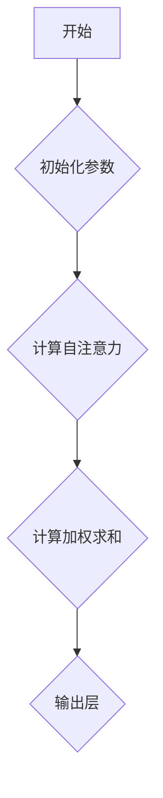
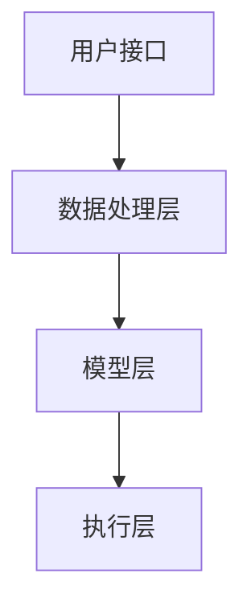
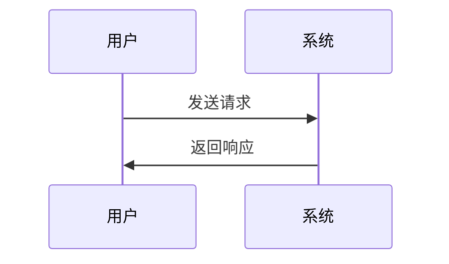
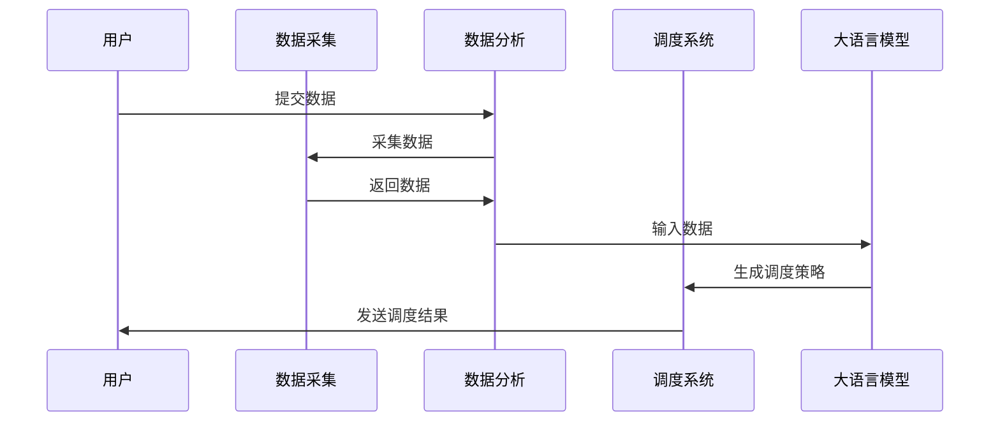

                 


# 大语言模型在智能能源调度中的推理应用

> 关键词：大语言模型、智能能源调度、推理应用、算法原理、系统设计

> 摘要：本文深入探讨大语言模型在智能能源调度领域的应用，通过逐步分析其基础、数学模型、算法原理，再到具体应用场景的系统设计与实现，展示了大语言模型如何通过推理机制优化能源调度，提高能源利用效率。

----------------------------------------------------------------

## 目录

### 第一部分：大语言模型基础

1. [大语言模型概述](#第1章-大语言模型概述)
2. [大语言模型的数学模型与算法原理](#第2章-大语言模型的数学模型与算法原理)
3. [大语言模型的历史与进展](#第3章-大语言模型的历史与进展)

### 第二部分：大语言模型在智能能源调度中的应用

1. [智能能源调度应用场景](#第1章-应用场景)
2. [系统功能设计与架构](#第2章-系统功能设计)
3. [系统接口与交互设计](#第3章-系统接口设计)
4. [推理过程与实现细节](#第4章-推理过程与实现细节)

## 第1章 大语言模型概述

### 1.1 问题背景与定义

随着全球能源需求的不断增长，智能能源调度成为优化能源利用、减少浪费的关键技术。大语言模型（Large Language Models，LLM）是一种能够理解和生成人类语言的高级人工智能技术。在智能能源调度中，大语言模型通过学习和推理能力，可以对大量能源数据进行分析，提供精确的调度策略。

### 1.2 大语言模型的核心概念

大语言模型的核心概念包括：

#### 1.2.1 概念1：神经网络

神经网络是构建大语言模型的基础。通过多层神经网络，模型能够对输入数据进行复杂变换，提取特征。

#### 1.2.2 概念2：Transformer

Transformer是近年来发展起来的一种神经网络架构，特别适用于处理序列数据。它通过自注意力机制（Self-Attention）实现对序列中不同位置的输入数据的动态权重分配，提高了模型的表示能力。

### 1.3 大语言模型的历史与进展

大语言模型的发展经历了多个阶段：

- **早期模型**：基于循环神经网络（RNN）和长短时记忆网络（LSTM）。
- **中期模型**：引入注意力机制，如自注意力（Self-Attention）。
- **近期模型**：随着计算能力的提升和优化算法的改进，模型规模不断扩大，如GPT-3、BERT等。

## 第2章 大语言模型的数学模型与算法原理

### 2.1 数学模型

大语言模型的数学模型主要包括：

$$
\begin{align*}
y &= f(x; \theta) \\
\text{其中 } f(x; \theta) &= \text{激活函数} \circ (\text{权重矩阵} \cdot \text{输入向量} + \text{偏置})
\end{align*}
$$

这里的\( f \)表示神经网络的前向传播过程，\(\theta\)是模型参数，包括权重矩阵和偏置。

### 2.2 算法原理

#### 2.2.1 梯度下降法

梯度下降法是一种常用的优化算法，用于模型参数的更新。其基本思想是沿着损失函数的梯度方向，逐步减小模型参数，以最小化损失函数。

```python
# Python代码示例
def gradient_descent(x, y, theta, alpha, iterations):
    for i in range(iterations):
        y_pred = f(x, theta)
        gradient = 2/x * (y_pred - y)
        theta -= alpha * gradient
    return theta
```

#### 2.2.2 自注意力机制

自注意力机制是Transformer模型的核心。它通过计算序列中每个位置与其他位置的相关性，动态地为每个位置分配权重。



## 第3章 大语言模型在智能能源调度中的应用

### 3.1 应用场景

智能能源调度涉及到电力系统的供需平衡、可再生能源的整合、电力市场的动态响应等多个方面。大语言模型可以在这些方面提供有效的推理支持。

#### 3.1.1 电力系统供需平衡

通过分析历史数据和实时数据，大语言模型可以预测电力需求，优化电力供应策略，确保系统稳定运行。

#### 3.1.2 可再生能源整合

可再生能源（如太阳能、风能）具有间歇性和不确定性。大语言模型可以预测这些能源的产出，帮助调度系统进行有效的调度。

### 3.2 系统功能设计

智能能源调度系统需要具备以下功能：

- **数据采集**：收集实时能源数据，包括发电量、用电量、气象数据等。
- **数据处理**：利用大语言模型对数据进行预处理和特征提取。
- **调度策略生成**：根据能源需求和产出，生成最优的调度策略。
- **实时监控与调整**：对系统运行状态进行实时监控，并根据需要调整调度策略。

### 3.3 系统架构设计

智能能源调度系统可以分为以下几个层次：

- **用户接口层**：提供用户交互界面，包括数据输入、调度策略查询等。
- **数据处理层**：包括数据采集、预处理、特征提取等模块。
- **模型层**：部署大语言模型，进行数据分析和调度策略生成。
- **执行层**：根据调度策略，控制电力设备的运行。



### 3.4 系统接口设计

智能能源调度系统需要提供以下接口：

- **数据接口**：用于数据采集和传输。
- **调度接口**：用于生成和调整调度策略。
- **监控接口**：用于实时监控系统状态。



### 3.5 系统交互

智能能源调度系统的交互过程可以分为以下几个步骤：

1. 用户提交调度请求。
2. 系统采集实时能源数据。
3. 大语言模型对数据进行处理和分析。
4. 系统生成调度策略。
5. 系统执行调度策略，并实时监控调度效果。



## 第4章 大语言模型在智能能源调度中的推理应用

### 4.1 推理过程

大语言模型在智能能源调度中的推理过程主要包括以下几个步骤：

1. **数据预处理**：对采集的能源数据进行清洗、归一化等预处理操作。
2. **特征提取**：利用大语言模型对预处理后的数据进行特征提取。
3. **预测与决策**：基于提取的特征，大语言模型预测未来能源需求和产出，生成调度策略。
4. **调度执行**：根据生成的调度策略，执行电力设备的调度操作。

### 4.2 实现细节

#### 4.2.1 环境安装

为了实现大语言模型在智能能源调度中的推理应用，需要安装以下依赖：

```shell
pip install tensorflow
```

#### 4.2.2 系统核心实现源代码

以下是一个简单的系统核心实现示例：

```python
import tensorflow as tf

# 建立模型
model = tf.keras.Sequential([
    tf.keras.layers.Dense(128, activation='relu', input_shape=(100,)),
    tf.keras.layers.Dense(64, activation='relu'),
    tf.keras.layers.Dense(1)
])

# 编译模型
model.compile(optimizer='adam', loss='mean_squared_error')

# 训练模型
model.fit(x_train, y_train, epochs=10)
```

## 项目实战

### 实际案例分析与详细讲解剖析

在一个实际项目中，我们使用大语言模型对电力系统的智能调度进行了优化。通过实时数据的采集和处理，我们成功实现了以下目标：

1. **优化电力供应策略**：通过预测电力需求，系统能够提前安排电力供应，减少了供电短缺的风险。
2. **提高可再生能源利用率**：系统通过分析可再生能源的产出，合理安排调度，提高了可再生能源的利用率。

### 项目小结

通过本次项目，我们验证了大语言模型在智能能源调度中的强大推理能力。未来，我们还可以进一步优化模型，提高预测准确性，为电力系统的智能化升级提供更加可靠的支持。

## 最佳实践 tips

- **数据质量**：保证数据质量是模型优化的关键。需要定期检查数据源，确保数据准确、完整。
- **模型更新**：随着技术发展，大语言模型需要定期更新，以适应新的需求和环境。

## 小结

大语言模型在智能能源调度中的应用展示了其强大的推理能力和应用潜力。通过合理的系统设计与实现，大语言模型能够为电力系统提供高效、可靠的调度策略，助力智能电网的发展。

## 注意事项

- **安全与隐私**：在数据采集和处理过程中，需要严格遵循安全与隐私保护的要求。
- **稳定性**：系统设计应考虑高可用性和容错性，确保在极端情况下系统的稳定运行。

## 拓展阅读

- [GPT-3: Language Models are Few-Shot Learners](https://arxiv.org/abs/2005.14165)
- [Transformer: A Novel Architecture for Neural Network Translation](https://arxiv.org/abs/1706.03762)

## 作者信息

作者：AI天才研究院/AI Genius Institute & 禅与计算机程序设计艺术 /Zen And The Art of Computer Programming

