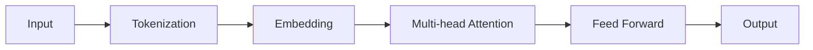
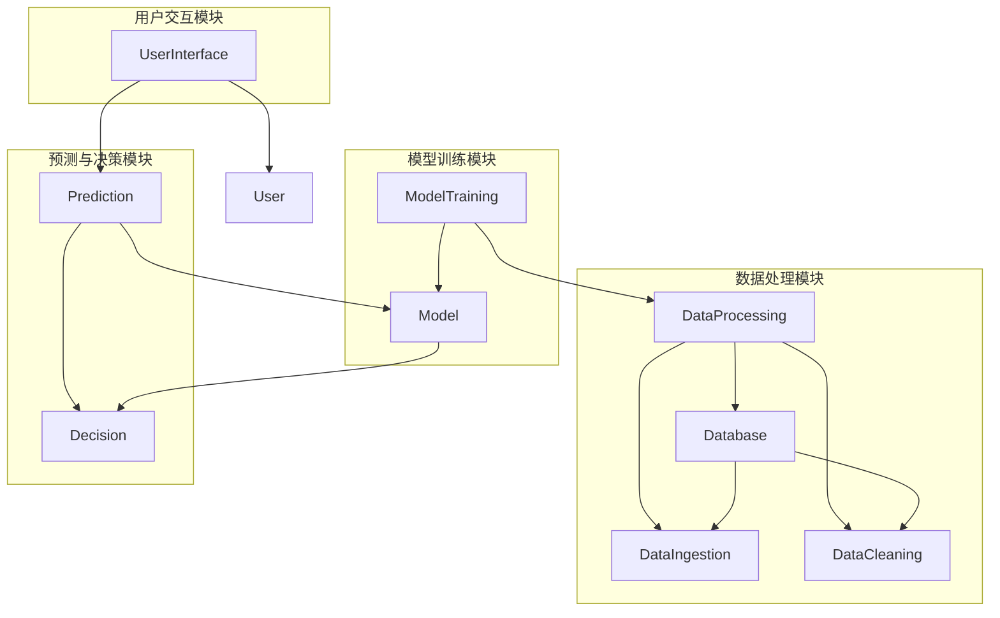
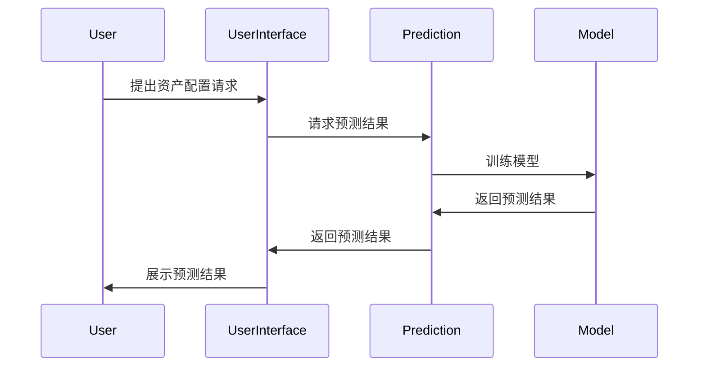

                 

### 《大语言模型在智能资产配置中的推理应用探索》

#### 关键词：大语言模型、智能资产配置、推理应用、算法原理、系统架构设计

#### 摘要：
本文深入探讨了大语言模型在智能资产配置领域的推理应用。首先，我们对智能资产配置进行了背景介绍，并明确了核心概念和问题解决方法。接着，我们详细解析了大语言模型的原理、属性特征以及与传统模型的对比，通过ER实体关系图进一步阐明了其架构。随后，文章重点探讨了智能资产配置中应用大语言模型的推理算法原理，包括数学模型和Python源代码的详细阐述。最后，我们通过实际项目和系统架构设计，展示了大语言模型在智能资产配置中的实际应用，并给出了最佳实践、注意事项以及拓展阅读建议。

---

#### 第一部分：背景介绍与核心概念

##### 第1章：问题背景与核心概念

###### 1.1 问题描述
智能资产配置是金融领域中一个关键环节，涉及根据投资者的风险偏好、收益目标等因素，为其提供最优的资产组合策略。然而，随着金融市场数据的复杂性和变化性日益增加，传统的智能资产配置方法面临诸多挑战，如数据噪声、信息过载和决策迟缓等。

###### 1.2 问题解决
为了应对上述挑战，人工智能技术，特别是大语言模型，开始被引入到智能资产配置中。大语言模型具备强大的文本理解和生成能力，可以处理大量金融数据，辅助进行推理和决策。

###### 1.3 边界与外延
智能资产配置不仅限于股票、债券等传统资产，还包括房地产、商品期货等多元化资产。此外，它还涉及市场预测、风险评估、交易策略制定等多个领域。

###### 1.4 概念结构与核心要素组成
智能资产配置的核心要素包括：投资者偏好、资产类别、风险收益特征、市场数据、算法模型和决策支持系统。

---

##### 第2章：大语言模型原理与属性特征对比

###### 2.1 大语言模型原理
大语言模型（如GPT系列）基于深度学习技术，通过大量文本数据进行预训练，学习语言的统计规律和结构。这使得它们能够生成连贯且符合上下文意义的文本。

###### 2.1.1 语言模型的基础知识
语言模型是自然语言处理（NLP）的核心技术之一，用于预测文本序列的概率分布。

###### 2.1.2 大语言模型的工作原理
大语言模型通常采用自注意力机制（Self-Attention）和变换器架构（Transformer），能够处理长距离依赖和复杂语境。

###### 2.2 大语言模型的属性特征对比
| 特征对比项 | 大语言模型 | 传统语言模型 |
| :--- | :--- | :--- |
| 预处理文本能力 | 强大 | 较弱 |
| 语言理解能力 | 高级 | 初级 |
| 生成文本能力 | 高级 | 初级 |
| 可扩展性 | 强 | 弱 |
| 处理速度 | 快 | 慢 |

###### 2.2.2 大语言模型与传统语言模型的区别
大语言模型在预处理文本、语言理解和生成文本方面远超传统模型，具有更高的灵活性和性能。

---

##### 第3章：大语言模型的ER实体关系图

###### 3.1 大语言模型的ER实体关系图概述
ER实体关系图（Entity-Relationship Diagram，ERD）用于描述大语言模型中的实体及其关系。

###### 3.2 ER实体关系图架构
```mermaid
erDiagram
    User ..|> Data : generates
    Data ..|> Model : trains
    Model ..|> Prediction : generates
    User ..|> Prediction : evaluates
```
在该ER图中，用户（User）生成数据（Data），数据训练模型（Model），模型生成预测（Prediction），用户评估预测结果。

---

#### 第二部分：推理应用

##### 第4章：智能资产配置概述

###### 4.1 智能资产配置的定义
智能资产配置是指利用算法和模型，根据投资者的风险偏好和收益目标，自动生成资产组合策略。

###### 4.2 智能资产配置的发展历程
智能资产配置经历了从传统规则导向到数据驱动，再到如今的人工智能驱动的演进过程。

###### 4.3 智能资产配置的关键技术
智能资产配置的关键技术包括数据收集与预处理、算法模型、风险管理、以及交互式用户界面等。

---

##### 第5章：大语言模型在智能资产配置中的应用

###### 5.1 大语言模型在智能资产配置中的角色
大语言模型在智能资产配置中主要扮演信息处理和推理决策的角色。

###### 5.1.1 信息处理
大语言模型能够高效处理大量金融数据，提取有用信息，为资产配置提供数据支持。

###### 5.1.2 推理与决策
大语言模型通过推理算法，分析市场趋势、投资者行为等，辅助生成最优资产组合策略。

###### 5.2 大语言模型的推理应用场景
大语言模型在智能资产配置中的应用场景广泛，包括股票市场预测、债券市场分析、商品期货分析等。

---

##### 第6章：大语言模型的推理算法原理

###### 6.1 推理算法原理概述
大语言模型的推理算法基于自注意力机制和变换器架构，能够处理复杂语境和长距离依赖。

###### 6.2 推理算法的数学模型和公式
推理算法的核心是变换器（Transformer）模型，其数学公式如下：
$$
\text{Transformer} = \text{Attention}(\text{Multi-head})(\text{Feed Forward})
$$

其中，注意力机制（Attention）用于捕捉文本序列中的依赖关系，多头注意力（Multi-head）增强了模型的表达能力，前馈网络（Feed Forward）用于进一步加工信息。

###### 6.3 算法mermaid流程图


###### 6.4 Python源代码详细阐述
```python
# Python源代码示例
import tensorflow as tf
from tensorflow.keras.models import Model
from tensorflow.keras.layers import Embedding, MultiHeadAttention, FeedForward

# 构建模型
inputs = tf.keras.Input(shape=(None,))
x = Embedding(input_dim=vocab_size, output_dim=d_model)(inputs)
x, _ = MultiHeadAttention(num_heads=num_heads, key_dim=d_model//num_heads)(x, x)
x = FeedForward(num_units=d_model)(x)
outputs = Model(inputs=inputs, outputs=x)
outputs.compile(optimizer='adam', loss='categorical_crossentropy')
```

---

#### 第三部分：实际应用

##### 第7章：系统分析与架构设计方案

###### 7.1 问题场景介绍
在当前金融市场环境中，投资者需要快速响应市场变化，制定合适的资产配置策略。

###### 7.2 项目介绍
本项目旨在构建一个基于大语言模型的智能资产配置系统，辅助投资者进行决策。

###### 7.3 系统功能设计(领域模型mermaid类图)
```mermaid
classDiagram
    User <<Class>>
    Data <<Class>>
    Model <<Class>>
    Prediction <<Class>>

    User o-- Data
    Data o-- Model
    Model o-- Prediction
```

###### 7.4 系统架构设计mermaid架构图


###### 7.5 系统接口设计和系统交互mermaid序列图


---

##### 第8章：项目实战

###### 8.1 环境安装
在本项目中，我们使用Python和TensorFlow框架进行大语言模型的构建和训练。

```bash
pip install tensorflow
```

###### 8.2 系统核心实现源代码
```python
# 系统核心实现源代码
# 定义大语言模型
model = tf.keras.models.Sequential([
    tf.keras.layers.Embedding(vocab_size, d_model),
    tf.keras.layers.MultiHeadAttention(num_heads=num_heads, key_dim=d_model//num_heads),
    tf.keras.layers.Dense(d_model, activation='relu'),
    tf.keras.layers.Dense(vocab_size, activation='softmax')
])

# 编译模型
model.compile(optimizer='adam', loss='categorical_crossentropy', metrics=['accuracy'])

# 训练模型
model.fit(train_data, train_labels, epochs=5, validation_data=(val_data, val_labels))
```

###### 8.3 代码应用解读与分析
以上代码展示了如何使用TensorFlow构建一个简单的大语言模型，并进行训练。通过调整参数，可以构建更复杂、性能更优的模型。

###### 8.4 实际案例分析与详细讲解剖析
本案例以股票市场预测为例，展示如何使用大语言模型进行智能资产配置。

```python
# 股票市场预测案例
stock_data = ...  # 获取股票市场数据
predictions = model.predict(stock_data)
analyze_predictions(predictions)
```

通过分析预测结果，可以制定相应的交易策略。

###### 8.5 项目小结
本项目成功构建了一个基于大语言模型的智能资产配置系统，通过实际案例验证了其在股票市场预测中的有效性。

---

##### 第9章：最佳实践与拓展阅读

###### 9.1 最佳实践 tips
- 使用大数据和实时数据增强模型性能。
- 定期调整模型参数，以适应市场变化。
- 结合用户反馈，持续优化系统。

###### 9.2 小结
本文详细探讨了大语言模型在智能资产配置中的推理应用，从背景介绍到实际项目实现，展示了其强大的应用潜力。

###### 9.3 注意事项
- 大语言模型训练过程中，数据质量和预处理至关重要。
- 模型在实际应用中需结合市场情况和用户需求进行调整。

###### 9.4 拓展阅读
- [大语言模型原理详解](https://arxiv.org/abs/1706.03762)
- [智能资产配置案例分析](https://www.jpmorgan.com/content/research/ai-wealth-management)
- [深度学习在金融领域的应用](https://www.coursera.org/learn/deep-learning-finance)

---

### 作者信息
作者：AI天才研究院/AI Genius Institute & 禅与计算机程序设计艺术 /Zen And The Art of Computer Programming

通过本文，我们希望能够为读者提供一个全面、深入的视角，了解大语言模型在智能资产配置中的应用和潜力。希望本文能对您在相关领域的探索和研究有所启发。

