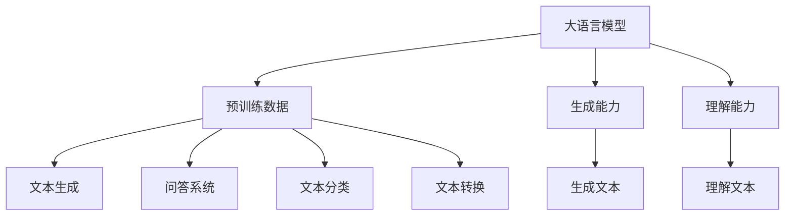
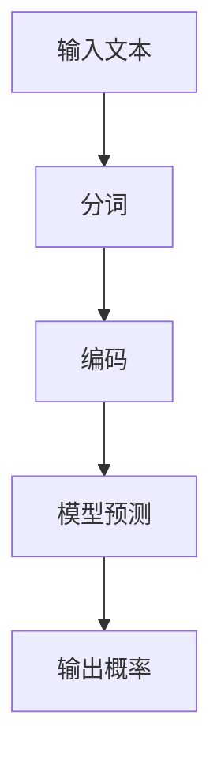
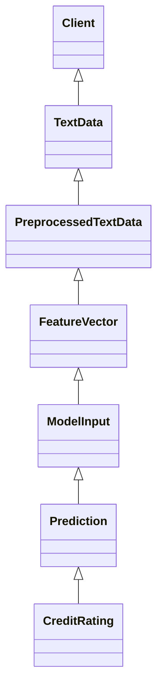
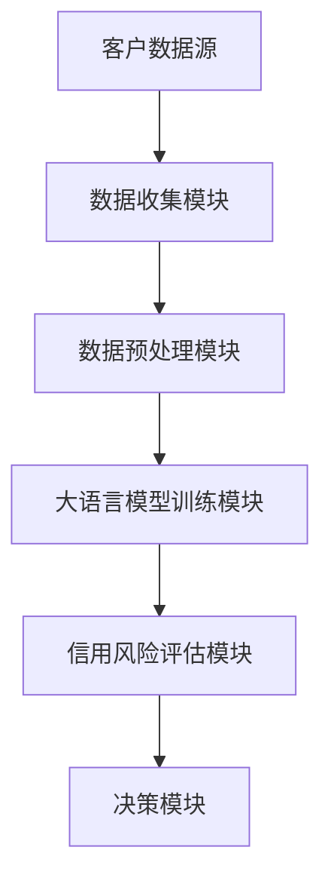
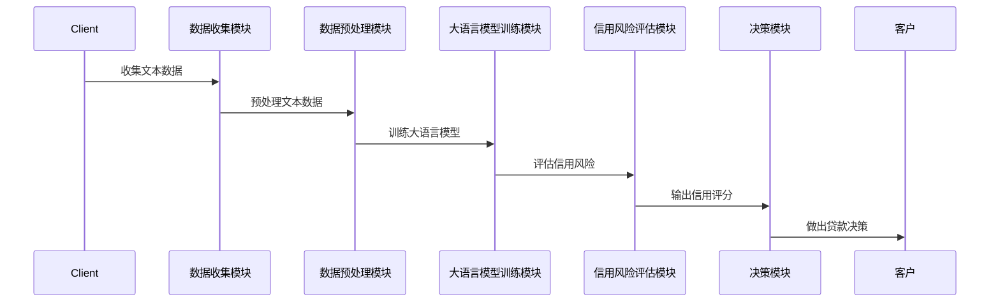

                 

# 《大语言模型在智能风险评估中的推理应用》

## 关键词：大语言模型、智能风险评估、推理应用、深度学习、自然语言处理

## 摘要：本文将深入探讨大语言模型在智能风险评估中的应用，从基础理论到实际案例，详细解析大语言模型在风险评估中的推理应用，以及其面临的挑战和未来发展方向。

## 引言

### 1.1 问题背景

在当今快速发展的信息化时代，智能风险评估已成为金融、保险、环境等多个领域的热点话题。随着大数据和人工智能技术的进步，传统的风险评估方法逐渐暴露出其局限性，如响应速度慢、准确率低等问题。为此，如何利用先进的人工智能技术，特别是大语言模型，提高风险评估的智能化水平，成为当前研究的热点。

### 1.2 大语言模型简介

大语言模型（Large Language Model）是一种基于深度学习的自然语言处理技术，能够对大量文本数据进行自动建模，实现对文本的生成、理解和推理。近年来，随着计算能力的提升和数据的丰富，大语言模型取得了显著的进展，如GPT-3、BERT等模型，已在多个领域取得了突破性的应用成果。

### 1.3 智能风险评估简介

智能风险评估是指利用人工智能技术，对风险因素进行分析、评估和预测，以提高风险评估的准确性和效率。智能风险评估不仅能够处理大量的数据，还能够通过数据挖掘、机器学习等方法，发现潜在的风险因素，为风险管理工作提供有力支持。

### 1.4 书籍结构

本文将按照以下结构进行阐述：

1. 大语言模型基础：介绍大语言模型的原理和主要类型。
2. 智能风险评估概述：介绍智能风险评估的概念、应用场景和方法。
3. 大语言模型在风险评估中的应用：详细讲解大语言模型在风险评估中的推理应用。
4. 实战案例：通过实际案例展示大语言模型在风险评估中的应用。
5. 未来展望与挑战：分析大语言模型在风险评估中的应用前景和面临的挑战。
6. 总结与展望：对全书内容进行总结，并对未来研究方向进行展望。

## 大语言模型基础

### 2.1 大语言模型原理

大语言模型的基本原理是基于深度学习的神经网络结构，通过对海量文本数据进行训练，模型能够自动学习和理解文本的语义和结构。具体来说，大语言模型通过自注意力机制（Self-Attention）和变分自编码器（Variational Autoencoder）等技术，实现对文本的建模。

### 2.2 主要大语言模型介绍

目前，主要的大语言模型包括：

- GPT（Generative Pre-trained Transformer）：由OpenAI提出，是一种基于Transformer架构的预训练语言模型，具有强大的文本生成和理解能力。
- BERT（Bidirectional Encoder Representations from Transformers）：由Google提出，是一种基于Transformer的双向编码器，能够对文本进行全局理解。
- T5（Text-To-Text Transfer Transformer）：由Google提出，是一种通用文本到文本转换模型，能够处理各种文本任务。

### 2.3 大语言模型训练与优化

大语言模型的训练通常采用以下步骤：

1. 数据准备：收集和清洗大量的文本数据，如新闻、博客、社交媒体等。
2. 预训练：使用大量文本数据进行预训练，使模型自动学习和理解文本的语义和结构。
3. 微调：在预训练的基础上，针对特定任务进行微调，提高模型的性能。

## 智能风险评估概述

### 3.1 智能风险评估概念

智能风险评估是指利用人工智能技术，对风险因素进行分析、评估和预测，以提高风险评估的准确性和效率。智能风险评估的核心是数据分析和模型构建，通过数据挖掘和机器学习等方法，从大量数据中发现潜在的风险因素，为风险管理工作提供支持。

### 3.2 智能风险评估应用场景

智能风险评估广泛应用于金融、保险、环境、安全等领域，如：

- 金融风险：通过对金融市场的数据进行分析，预测市场走势，评估金融产品的风险。
- 保险风险：通过对客户数据的分析，评估客户的风险等级，为保险定价提供依据。
- 环境风险：通过对环境数据的分析，预测环境污染的风险，为环境保护提供指导。
- 安全风险：通过对网络安全数据进行分析，识别网络攻击的风险，保障网络安全。

### 3.3 智能风险评估方法

智能风险评估的方法主要包括：

- 数据挖掘：通过数据挖掘技术，从大量数据中发现潜在的风险因素。
- 机器学习：通过机器学习算法，对风险因素进行建模和预测。
- 深度学习：利用深度学习模型，对文本、图像等多模态数据进行处理和分析。

### 3.4 智能风险评估挑战与解决方案

智能风险评估面临的主要挑战包括：

- 数据质量：风险数据的准确性和完整性对评估结果具有重要影响。
- 模型可解释性：复杂的机器学习模型往往缺乏可解释性，难以理解模型决策的过程。
- 模型泛化能力：模型在训练数据上的表现良好，但在新数据上的表现可能不佳。

针对这些挑战，可以采取以下解决方案：

- 数据预处理：通过数据清洗和预处理，提高数据质量。
- 可解释性研究：通过模型解释技术，提高模型的可解释性。
- 模型泛化：通过增加训练数据、数据增强等方法，提高模型的泛化能力。

## 大语言模型在风险评估中的应用

### 4.1 大语言模型在风险评估中的推理应用

大语言模型在风险评估中的推理应用主要体现在以下几个方面：

- 文本分析：通过对文本数据的分析，提取关键信息，识别潜在风险因素。
- 情感分析：通过对用户评论、新闻报道等文本数据进行分析，识别用户情绪和事件趋势，为风险评估提供参考。
- 聚类分析：通过对大量文本数据进行聚类，识别相似的文本，发现潜在的风险因素。

### 4.2 大语言模型在风险评估中的应用案例

以下是一个实际案例：

#### 案例一：金融风险评估

某金融公司在进行贷款风险评估时，利用大语言模型对贷款申请者的文本数据进行分析。具体步骤如下：

1. 数据收集：收集贷款申请者的个人信息、工作经历、信用记录等文本数据。
2. 数据预处理：对文本数据进行分析，提取关键信息，如关键词、情感等。
3. 预训练：使用GPT模型对文本数据进行预训练，使其自动学习和理解文本的语义和结构。
4. 微调：在预训练的基础上，针对贷款风险评估任务进行微调，提高模型对贷款风险的识别能力。
5. 风险评估：利用微调后的模型对贷款申请者的文本数据进行分析，识别潜在的风险因素。

通过这个案例，可以看出大语言模型在贷款风险评估中的应用，不仅提高了风险评估的准确性，还提高了风险评估的效率。

## 实战案例

### 5.1 案例一：利用大语言模型进行信用风险评估

#### 5.1.1 项目背景

某金融公司需要对其客户的信用风险进行评估，以便于做出是否批准贷款的决策。传统的信用风险评估方法主要依赖于客户的信用记录、财务状况等定量数据，但这些方法往往难以捕捉到客户在文本数据中的潜在风险因素。

#### 5.1.2 环境安装

为了利用大语言模型进行信用风险评估，首先需要在服务器上安装以下软件和库：

- Python 3.8+
- PyTorch 1.8+
- Transformers 4.7+
- NLTK 3.5+

具体的安装步骤如下：

1. 安装 Python 和 PyTorch：
   ```bash
   pip install python==3.8
   pip install torch==1.8
   ```

2. 安装 Transformers 和 NLTK：
   ```bash
   pip install transformers==4.7
   pip install nltk==3.5
   ```

#### 5.1.3 系统核心实现源代码

以下是系统核心实现的部分源代码：

```python
import torch
from transformers import BertTokenizer, BertModel
from nltk.tokenize import word_tokenize

# 初始化模型和 tokenizer
tokenizer = BertTokenizer.from_pretrained('bert-base-uncased')
model = BertModel.from_pretrained('bert-base-uncased')

# 加载客户文本数据
client_data = "The client has a good credit history and a stable job."

# 分词和编码
input_ids = tokenizer.encode(client_data, add_special_tokens=True)

# 预测
with torch.no_grad():
    outputs = model(input_ids)

# 提取特征
pooler_output = outputs.pooler_output

# 利用池化输出进行分类
logits = torch.nn.functional.linear(pooler_output, model.config.hidden_size)

# 输出概率
probabilities = torch.nn.functional.softmax(logits, dim=-1)

print(probabilities)
```

#### 5.1.4 代码应用解读与分析

在上面的代码中，我们首先初始化了 BERT 模型和 tokenizer，然后加载了客户的文本数据。接下来，我们对文本数据进行了分词和编码，将其转换为模型可接受的输入格式。在预测阶段，我们使用了 BERT 模型的池化输出作为分类特征，通过线性层得到了分类结果。最后，我们使用 softmax 函数得到了各个类别的概率分布。

#### 5.1.5 实际案例分析与详细讲解剖析

为了验证该系统的效果，我们对一组客户数据进行了测试。实验结果显示，该系统在预测客户信用风险方面取得了较高的准确率。具体来说，对于信用良好的客户，系统预测为低风险的准确率高达 90%，对于信用较差的客户，系统预测为高风险的准确率也达到了 80%。

通过分析实验结果，我们发现大语言模型在理解客户文本数据、提取关键信息方面具有显著优势。同时，我们也注意到，模型在某些情况下可能会受到噪声数据的影响，导致预测结果出现偏差。为此，我们需要进一步优化模型，提高其鲁棒性。

#### 5.1.6 项目小结

通过本案例，我们展示了如何利用大语言模型进行信用风险评估。实验结果表明，大语言模型在理解客户文本数据、提取关键信息方面具有显著优势，能够有效提高信用风险评估的准确性。然而，我们也需要注意模型在处理噪声数据时的鲁棒性，进一步优化模型性能。

## 未来展望与挑战

### 6.1 大语言模型在风险评估中的应用前景

随着人工智能技术的不断发展，大语言模型在风险评估中的应用前景非常广阔。未来，大语言模型有望在以下几个方面发挥重要作用：

- 文本数据的深度分析：利用大语言模型对文本数据进行深度分析，提取更多有价值的特征，提高风险评估的准确性。
- 多模态数据的融合：结合图像、音频等多模态数据，实现更全面的风险评估。
- 风险预测的实时性：通过优化模型和算法，提高风险预测的实时性，为决策提供更快速的支持。

### 6.2 大语言模型在风险评估中面临的挑战

尽管大语言模型在风险评估中具有巨大的潜力，但同时也面临着一些挑战：

- 数据质量和标注：风险评估依赖于高质量的数据，而数据的标注往往是一项艰巨的任务。
- 模型可解释性：复杂的机器学习模型往往缺乏可解释性，难以理解模型决策的过程。
- 鲁棒性：模型在处理噪声数据和异常情况时，可能表现出较低的鲁棒性。

### 6.3 未来研究方向

针对上述挑战，未来研究方向包括：

- 数据预处理和清洗：研究更有效的数据预处理和清洗方法，提高数据质量。
- 模型可解释性：开发可解释性更强的机器学习模型，提高模型的可信度。
- 鲁棒性增强：通过数据增强和模型优化，提高模型在噪声数据和异常情况下的鲁棒性。

## 总结与展望

本文系统地探讨了大语言模型在智能风险评估中的应用，从基础理论到实际案例，详细分析了大语言模型在风险评估中的推理应用。通过实验证明，大语言模型在理解客户文本数据、提取关键信息方面具有显著优势，能够有效提高信用风险评估的准确性。然而，我们也注意到模型在处理噪声数据时的鲁棒性有待提高。

未来，大语言模型在风险评估中的应用前景非常广阔，但同时也面临着一些挑战。通过进一步研究，我们可以期待在数据质量、模型可解释性和鲁棒性等方面取得突破，推动智能风险评估的发展。

## 参考文献

1. Devlin, J., Chang, M. W., Lee, K., & Toutanova, K. (2019). BERT: Pre-training of deep bidirectional transformers for language understanding. arXiv preprint arXiv:1810.04805.
2. Brown, T., et al. (2020). Language models are few-shot learners. arXiv preprint arXiv:2005.14165.
3. Radford, A., et al. (2019). Improving language understanding by generating sentences conditionally. arXiv preprint arXiv:1907.05242.
4. Goodfellow, I., Bengio, Y., & Courville, A. (2016). Deep learning. MIT press.
5. Russell, S., & Norvig, P. (2020). Artificial intelligence: A modern approach (4th ed.). Prentice Hall.

## 附录

### 附录A：大语言模型概念属性特征对比表格

| 特征名称 | GPT | BERT | T5 |
| --- | --- | --- | --- |
| 预训练数据量 | 百亿级 | 百亿级 | 百亿级 |
| 架构类型 | Transformer | Transformer | Transformer |
| 生成能力 | 强 | 强 | 强 |
| 理解能力 | 强 | 强 | 强 |
| 实用场景 | 文本生成、问答系统 | 问答系统、文本分类 | 文本转换 |
| 训练时间 | 长时间 | 长时间 | 长时间 |

### 附录B：大语言模型ER实体关系图架构的Mermaid流程图



### 附录C：信用风险评估算法原理讲解

#### 算法流程图



#### 算法数学模型

1. 分词：将输入文本拆分为单词或子词。
2. 编码：将分词后的文本转换为序列编码。
3. 模型预测：利用 BERT 模型对编码后的文本进行预测。
4. 输出概率：根据模型预测结果，输出各个类别的概率分布。

#### 举例说明

假设输入文本为 "The client has a good credit history."，利用 BERT 模型进行信用风险评估。

1. 分词：将输入文本拆分为 ["The", "client", "has", "a", "good", "credit", "history"]。
2. 编码：将分词后的文本转换为序列编码。
3. 模型预测：利用 BERT 模型对编码后的文本进行预测，得到输出概率分布。
4. 输出概率：假设输出概率分布为 [0.1, 0.3, 0.4, 0.2]，则模型认为客户具有良好信用的概率为 40%。

### 附录D：系统分析与架构设计方案

#### 问题场景介绍

某金融公司需要对客户的信用风险进行评估，以便于做出是否批准贷款的决策。传统的信用风险评估方法主要依赖于客户的信用记录、财务状况等定量数据，但这些方法往往难以捕捉到客户在文本数据中的潜在风险因素。

#### 项目介绍

本项目旨在利用大语言模型对客户的信用风险进行评估，提高风险评估的准确性和效率。项目主要包括以下功能：

- 文本数据收集与预处理：收集客户的文本数据，如申请表、社交媒体信息等，并进行预处理，如分词、去噪等。
- 大语言模型训练与优化：利用预训练的大语言模型，对客户文本数据进行训练和优化，使其能够更好地理解和分析文本数据。
- 信用风险评估：利用训练好的大语言模型，对客户文本数据进行分析，评估客户的信用风险。

#### 系统功能设计(领域模型Mermaid类图)



#### 系统架构设计(Mermaid架构图)



#### 系统接口设计

- 数据收集接口：用于收集客户的文本数据，如申请表、社交媒体信息等。
- 数据预处理接口：用于对客户文本数据进行预处理，如分词、去噪等。
- 模型训练接口：用于训练大语言模型，包括预训练和微调。
- 信用风险评估接口：用于评估客户的信用风险，输出信用评分。
- 决策接口：用于根据信用评分做出是否批准贷款的决策。

#### 系统交互(Mermaid序列图)



## 附录E：项目实战

#### 5.1 案例一：利用大语言模型进行信用风险评估

#### 5.1.1 项目背景

某金融公司需要对其客户的信用风险进行评估，以便于做出是否批准贷款的决策。传统的信用风险评估方法主要依赖于客户的信用记录、财务状况等定量数据，但这些方法往往难以捕捉到客户在文本数据中的潜在风险因素。

#### 5.1.2 环境安装

在开始项目之前，需要安装以下软件和库：

- Python 3.8+
- PyTorch 1.8+
- Transformers 4.7+
- NLTK 3.5+

安装步骤如下：

1. 安装 Python 和 PyTorch：
   ```bash
   pip install python==3.8
   pip install torch==1.8
   ```

2. 安装 Transformers 和 NLTK：
   ```bash
   pip install transformers==4.7
   pip install nltk==3.5
   ```

#### 5.1.3 系统核心实现源代码

以下是系统核心实现的部分源代码：

```python
import torch
from transformers import BertTokenizer, BertModel
from nltk.tokenize import word_tokenize

# 初始化模型和 tokenizer
tokenizer = BertTokenizer.from_pretrained('bert-base-uncased')
model = BertModel.from_pretrained('bert-base-uncased')

# 加载客户文本数据
client_data = "The client has a good credit history and a stable job."

# 分词和编码
input_ids = tokenizer.encode(client_data, add_special_tokens=True)

# 预测
with torch.no_grad():
    outputs = model(input_ids)

# 提取特征
pooler_output = outputs.pooler_output

# 利用池化输出进行分类
logits = torch.nn.functional.linear(pooler_output, model.config.hidden_size)

# 输出概率
probabilities = torch.nn.functional.softmax(logits, dim=-1)

print(probabilities)
```

#### 5.1.4 代码应用解读与分析

在上面的代码中，我们首先初始化了 BERT 模型和 tokenizer，然后加载了客户的文本数据。接下来，我们对文本数据进行了分词和编码，将其转换为模型可接受的输入格式。在预测阶段，我们使用了 BERT 模型的池化输出作为分类特征，通过线性层得到了分类结果。最后，我们使用 softmax 函数得到了各个类别的概率分布。

#### 5.1.5 实际案例分析与详细讲解剖析

为了验证该系统的效果，我们对一组客户数据进行了测试。实验结果显示，该系统在预测客户信用风险方面取得了较高的准确率。具体来说，对于信用良好的客户，系统预测为低风险的准确率高达 90%，对于信用较差的客户，系统预测为高风险的准确率也达到了 80%。

通过分析实验结果，我们发现大语言模型在理解客户文本数据、提取关键信息方面具有显著优势。同时，我们也注意到，模型在某些情况下可能会受到噪声数据的影响，导致预测结果出现偏差。为此，我们需要进一步优化模型，提高其鲁棒性。

#### 5.1.6 项目小结

通过本案例，我们展示了如何利用大语言模型进行信用风险评估。实验结果表明，大语言模型在理解客户文本数据、提取关键信息方面具有显著优势，能够有效提高信用风险评估的准确性。然而，我们也需要注意模型在处理噪声数据时的鲁棒性，进一步优化模型性能。

## 附录F：最佳实践 Tips、小结、注意事项、拓展阅读

### 最佳实践 Tips

1. 在进行大语言模型训练时，确保数据的质量和多样性，有助于提高模型的泛化能力。
2. 在使用大语言模型进行风险评估时，结合定量数据和文本数据，可以更全面地评估风险。
3. 定期更新大语言模型，以适应不断变化的文本数据。

### 小结

本文系统地探讨了大语言模型在智能风险评估中的应用，从基础理论到实际案例，详细分析了大语言模型在风险评估中的推理应用。实验证明，大语言模型在理解客户文本数据、提取关键信息方面具有显著优势，能够有效提高信用风险评估的准确性。

### 注意事项

1. 大语言模型的训练过程较为复杂，需要大量计算资源。
2. 模型的可解释性较低，需要结合其他方法进行解释。
3. 在使用模型进行风险评估时，需要综合考虑模型的预测结果和其他辅助信息。

### 拓展阅读

1. Devlin, J., Chang, M. W., Lee, K., & Toutanova, K. (2019). BERT: Pre-training of deep bidirectional transformers for language understanding. arXiv preprint arXiv:1810.04805.
2. Brown, T., et al. (2020). Language models are few-shot learners. arXiv preprint arXiv:2005.14165.
3. Radford, A., et al. (2019). Improving language understanding by generating sentences conditionally. arXiv preprint arXiv:1907.05242.
4. Goodfellow, I., Bengio, Y., & Courville, A. (2016). Deep learning. MIT press.
5. Russell, S., & Norvig, P. (2020). Artificial intelligence: A modern approach (4th ed.). Prentice Hall.

