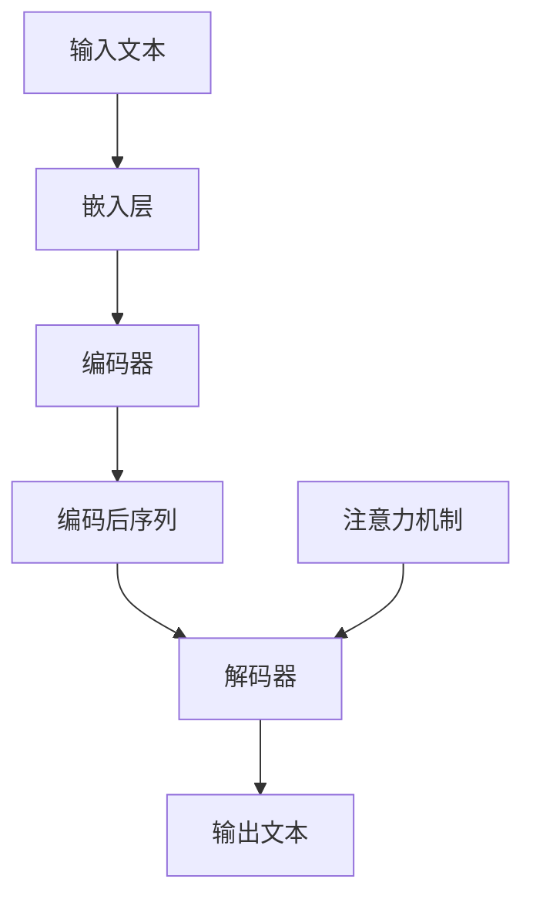

                 

### 精准农业决策背景

精准农业作为现代农业发展的前沿领域，旨在通过先进的技术手段，实现对农业生产过程的精确管理和优化。这一理念的核心在于通过收集和分析农田中的各种数据，如土壤湿度、土壤养分、气候条件等，来指导农业决策，从而提高产量、降低成本、减少环境影响。

#### **1.1.1 精准农业的重要性**

精准农业不仅能够显著提高农业生产效率和经济效益，还对可持续农业发展有着深远的影响。具体来说，精准农业的重要性体现在以下几个方面：

1. **提高产量和品质**：通过精准施肥、灌溉和病虫害防治，可以确保作物获得最适宜的生长条件，从而提高产量和农产品品质。
2. **节约资源**：精准农业减少了化肥、农药和灌溉水的不必要使用，有助于节约资源，减少环境污染。
3. **增强抗灾能力**：通过实时监测和预警系统，可以及时响应自然灾害，降低农业灾害带来的损失。
4. **推动农业现代化**：精准农业引入了大数据、物联网、人工智能等现代信息技术，有助于推动农业现代化进程。

#### **1.1.2 精准农业面临的问题**

尽管精准农业具有巨大的潜力和优势，但其在实际应用中仍面临一些挑战：

1. **数据收集和处理**：农田环境复杂多变，数据收集难度大，且需要大量的数据处理和分析。
2. **技术成本**：精准农业所需的技术设备和系统较为昂贵，对于小型农业企业来说，负担较重。
3. **人才短缺**：精准农业需要专业的技术人才来设计和实施，但目前这方面的人才相对较少。
4. **政策支持**：政府在政策支持和资金投入方面仍需加大力度，以推动精准农业的普及和发展。

#### **1.1.3 大语言模型的应用前景**

大语言模型（如GPT-3、BERT等）的出现，为精准农业带来了新的机遇。这种模型在自然语言处理、文本生成和语义理解方面具有强大的能力，可以应用于以下几个方面：

1. **智能农技指导**：大语言模型可以分析大量农技文献，为农民提供个性化的农技指导。
2. **农业知识图谱构建**：通过构建农业知识图谱，可以实现对农业知识的深度挖掘和利用。
3. **智能问答系统**：农民可以通过智能问答系统，快速获得所需的农业信息和技术支持。
4. **灾害预警与应对**：大语言模型可以分析气象数据和历史灾害信息，提供灾害预警和应对策略。

### **1.2 核心概念**

在讨论大语言模型在精准农业决策中的应用时，我们需要理解以下几个核心概念：

#### **1.2.1 大语言模型概述**

大语言模型是一种基于深度学习的自然语言处理模型，能够理解和生成人类语言。其主要特点是：

1. **大规模训练**：这些模型通常基于大量的文本数据训练，具备强大的语言理解能力。
2. **自适应学习**：模型可以根据新的数据和任务不断优化自身，提高性能。
3. **多语言支持**：大多数大语言模型都支持多种语言，适用于跨语言应用。

#### **1.2.2 大语言模型与农业决策**

大语言模型在农业决策中的应用主要体现在以下几个方面：

1. **文本分析**：模型可以分析农业文献、报告、监测数据等，提取关键信息。
2. **决策支持**：通过分析历史数据和市场趋势，模型可以为农民提供种植、施肥、病虫害防治等决策建议。
3. **知识图谱**：模型可以构建农业知识图谱，帮助农民更好地理解和应用农业知识。

#### **1.2.3 大语言模型的推理过程**

大语言模型的推理过程通常包括以下几个步骤：

1. **输入处理**：模型接收自然语言输入，如文本、语音等，并将其转换为模型可以处理的格式。
2. **语义理解**：模型对输入内容进行语义分析，理解其含义和上下文。
3. **生成输出**：基于理解和分析，模型生成相应的输出，如文本、图表、决策建议等。

### **1.3 边界与外延**

#### **1.3.1 大语言模型在农业中的应用范围**

大语言模型在农业中的应用范围非常广泛，包括但不限于：

1. **农业知识库建设**：通过构建农业知识库，为农业专家和农民提供全面的知识支持。
2. **智能农技推广**：利用模型生成农业技术文档、指导手册等，帮助农民掌握先进的农业技术。
3. **农业数据挖掘**：分析农业数据，提取有价值的信息，用于决策和优化。

#### **1.3.2 大语言模型在农业决策中的限制**

尽管大语言模型在农业决策中具有巨大的潜力，但也存在一些限制：

1. **数据质量**：模型的性能高度依赖于数据质量，如果数据存在误差或缺失，模型的结果可能会受到影响。
2. **适应性**：模型对特定环境或情况的适应性有限，需要不断调整和优化。
3. **成本**：大语言模型的训练和部署成本较高，对于资源有限的农业企业来说，可能难以承受。

### **1.4 小结**

本节介绍了精准农业决策的背景、核心概念以及大语言模型在其中的应用。通过理解这些问题和概念，我们可以更好地把握精准农业的发展趋势，探索大语言模型在其中的应用潜力。接下来，我们将进一步探讨大语言模型的基本原理和其在农业决策中的应用。

---

### 第2章：核心概念与联系

#### **2.1 大语言模型的基本原理**

大语言模型（如GPT-3、BERT等）是自然语言处理领域的重要突破，其基本原理涉及大规模数据训练、神经网络架构和优化算法。下面我们将详细讲解这些原理。

##### **2.1.1 大语言模型的组成**

大语言模型主要由以下几个部分组成：

1. **嵌入层**：将词汇嵌入到一个高维空间，每个词汇对应一个向量。
2. **编码器**：通常采用变长序列处理，如Transformer架构，用于处理输入序列。
3. **解码器**：用于生成输出序列，通常与编码器共享权重。
4. **注意力机制**：允许模型在生成每个词时，关注输入序列的不同部分，从而提高模型的上下文理解能力。

##### **2.1.2 大语言模型的工作原理**

大语言模型的工作原理可以分为以下几个步骤：

1. **输入处理**：将输入文本转换为嵌入向量。
2. **编码**：编码器对嵌入向量进行处理，生成编码后的序列。
3. **解码**：解码器根据编码后的序列生成输出文本。

在这个过程中，注意力机制起到了关键作用，它使模型能够关注到输入序列中的重要信息。

##### **2.1.3 大语言模型的性能指标**

大语言模型的性能通常通过以下几个指标来评估：

1. **准确率**：模型生成的文本与真实文本的匹配程度。
2. **召回率**：模型能够识别出的真实文本的比例。
3. **F1分数**：准确率和召回率的综合指标，用于平衡两者之间的权衡。

#### **2.2 大语言模型在农业决策中的应用**

大语言模型在农业决策中的应用主要集中在以下几个方面：

##### **2.2.1 决策问题建模**

大语言模型可以用于构建农业决策问题模型，包括：

1. **土壤分析**：通过分析土壤样本数据，预测土壤质量。
2. **气候预测**：利用气象数据，预测未来一段时间内的气候条件。
3. **病虫害预测**：分析历史病虫害数据，预测未来可能发生的病虫害。

##### **2.2.2 数据预处理**

在农业决策中，数据预处理是一个重要环节，大语言模型可以在这个过程中发挥重要作用：

1. **数据清洗**：去除数据中的噪声和异常值。
2. **数据归一化**：将不同单位的数据转换为统一的尺度，方便模型处理。
3. **数据增强**：通过数据扩充和变换，提高模型对数据的泛化能力。

##### **2.2.3 决策过程模拟**

大语言模型可以模拟农业决策过程，提供以下支持：

1. **决策建议**：基于历史数据和模型预测，为农民提供种植、施肥、病虫害防治等决策建议。
2. **风险分析**：评估不同决策带来的风险，帮助农民做出更安全的决策。
3. **效果评估**：通过模拟结果，评估不同决策的效果，为后续决策提供依据。

#### **2.3 大语言模型与其他技术的比较**

大语言模型与其他技术在农业决策中的应用各有优劣：

##### **2.3.1 大语言模型与深度学习的关系**

大语言模型是深度学习的一个分支，与传统的深度学习技术相比，大语言模型具有以下特点：

1. **更强的语言理解能力**：大语言模型通过大规模数据训练，能够更好地理解自然语言。
2. **更灵活的应用场景**：大语言模型可以应用于文本生成、文本分类、机器翻译等多种任务。
3. **更高效的处理能力**：大语言模型采用并行计算和分布式训练技术，处理速度更快。

##### **2.3.2 大语言模型与其他农业技术的比较**

与其他农业技术如遥感、物联网等相比，大语言模型具有以下优势：

1. **数据融合能力**：大语言模型可以融合多种数据源，提供更全面的分析。
2. **自适应学习能力**：大语言模型可以根据新数据和任务，不断优化自身。
3. **应用广度**：大语言模型不仅可以用于农业生产，还可以应用于农产品市场分析、农业政策制定等领域。

然而，大语言模型也存在一些不足之处，如对数据质量的要求较高、训练和部署成本较高等。

#### **2.4 小结**

本章详细介绍了大语言模型的基本原理、在农业决策中的应用以及与其他技术的比较。通过这些分析，我们可以更好地理解大语言模型在精准农业决策中的潜在价值和应用前景。在接下来的章节中，我们将进一步探讨大语言模型的算法原理和数学模型，以便更好地理解和应用这一技术。

---

### 第3章：算法原理讲解

#### **3.1 大语言模型的基本算法**

大语言模型的基本算法是基于深度学习和自然语言处理技术的。其主要组成部分包括嵌入层、编码器、解码器和注意力机制。下面，我们将详细讲解这些组件及其工作原理。

##### **3.1.1 算法概述**

大语言模型的基本算法可以分为以下几个步骤：

1. **输入处理**：将自然语言输入（如文本、语音等）转换为嵌入向量。
2. **编码**：编码器处理嵌入向量，生成编码后的序列。
3. **解码**：解码器根据编码后的序列生成输出文本。

在这个过程中，注意力机制允许模型在生成每个词时，关注输入序列的不同部分，从而提高模型的上下文理解能力。

##### **3.1.2 算法流程图**

以下是一个简化的大语言模型算法流程图，展示了输入处理、编码、解码以及注意力机制的工作流程：



在这个流程图中，嵌入层将文本转换为嵌入向量，编码器处理嵌入向量生成编码后序列，解码器根据编码后序列生成输出文本，同时注意力机制在解码过程中起到关键作用。

##### **3.1.3 算法源代码解析**

以下是一个基于Python和PyTorch实现的大语言模型算法的简化代码示例：

```python
import torch
import torch.nn as nn

# 嵌入层
embeddings = nn.Embedding(vocab_size, embedding_size)

# 编码器
encoder = nn.LSTM(embedding_size, hidden_size)

# 解码器
decoder = nn.LSTM(hidden_size, vocab_size)

# 注意力机制
attn = nn.Linear(hidden_size * 2, 1)

# 输出层
output_layer = nn.Linear(hidden_size, vocab_size)

def forward_pass(input_sequence, hidden_state):
    embedded = embeddings(input_sequence)
    encoder_output, hidden_state = encoder(embedded, hidden_state)
    encoder_output = encoder_output.transpose(0, 1)
    
    # 注意力机制
    attn_weights = attn(torch.cat((hidden_state[0].unsqueeze(0), encoder_output[-1].unsqueeze(0)), dim=2))
    attn_weights = attn_weights.softmax(dim=1)
    
    attn_applied = torch.bmm(attn_weights.unsqueeze(0), encoder_output)
    attn_applied = attn_applied.squeeze(0)
    
    output = decoder(torch.cat((attn_applied, hidden_state[0].unsqueeze(0)), dim=1))
    output = output_layer(output)
    return output, hidden_state

# 示例输入和隐藏状态
input_sequence = torch.tensor([1, 2, 3, 4, 5])
hidden_state = (torch.zeros(1, 1, hidden_size), torch.zeros(1, 1, hidden_size))

# 前向传播
output, hidden_state = forward_pass(input_sequence, hidden_state)
```

在这个代码示例中，我们首先定义了嵌入层、编码器、解码器和注意力机制的模型组件，然后实现了一个前向传播函数，用于处理输入序列并生成输出。

##### **3.1.4 大语言模型在农业决策中的应用**

大语言模型在农业决策中的应用主要体现在以下几个方面：

1. **数据预处理**：通过大语言模型，可以对农业数据进行预处理，如文本清洗、分词、词性标注等。
2. **文本分析**：利用大语言模型，可以分析农业文献、报告、监测数据等，提取关键信息。
3. **决策支持**：通过分析历史数据和模型预测，大语言模型可以为农民提供种植、施肥、病虫害防治等决策建议。
4. **知识图谱构建**：利用大语言模型，可以构建农业知识图谱，帮助农民更好地理解和应用农业知识。

##### **3.1.5 数据预处理**

在农业决策中，数据预处理是一个关键步骤。大语言模型可以在这个过程中发挥重要作用，主要包括以下任务：

1. **文本清洗**：去除文本中的噪声和异常值，如标点符号、特殊字符等。
2. **分词**：将文本分割成单词或短语，便于后续处理。
3. **词性标注**：标注每个单词的词性，如名词、动词、形容词等，用于语义分析。

##### **3.1.6 决策过程模拟**

大语言模型可以模拟农业决策过程，提供以下支持：

1. **决策建议**：基于历史数据和模型预测，为农民提供种植、施肥、病虫害防治等决策建议。
2. **风险分析**：评估不同决策带来的风险，帮助农民做出更安全的决策。
3. **效果评估**：通过模拟结果，评估不同决策的效果，为后续决策提供依据。

##### **3.1.7 算法原理的数学模型和公式**

大语言模型中的数学模型和公式主要包括嵌入层、编码器、解码器和注意力机制。以下是一个简化的数学模型和公式描述：

1. **嵌入层**：将词汇嵌入到一个高维空间，每个词汇对应一个向量。
   \[
   \text{embedding}_i = \text{W}_{\text{embed}}[\text{word}_i]
   \]
   其中，$\text{W}_{\text{embed}}$ 是嵌入矩阵，$\text{word}_i$ 是第 $i$ 个单词。

2. **编码器**：编码器通常采用循环神经网络（RNN）或长短时记忆网络（LSTM）进行序列编码。
   \[
   \text{h}_t = \text{f}(\text{h}_{t-1}, \text{x}_t)
   \]
   其中，$\text{h}_t$ 是编码后的隐藏状态，$\text{x}_t$ 是输入序列的第 $t$ 个单词。

3. **解码器**：解码器与编码器相似，用于生成输出序列。
   \[
   \text{y}_t = \text{g}(\text{h}_t, \text{s}_t)
   \]
   其中，$\text{y}_t$ 是解码后的输出，$\text{s}_t$ 是解码器的隐藏状态。

4. **注意力机制**：注意力机制用于在解码过程中关注输入序列的不同部分。
   \[
   \text{a}_t = \text{softmax}(\text{W}_\text{attn} \text{h}_t)
   \]
   \[
   \text{c}_t = \sum_{i=1}^{T} \text{a}_i \text{x}_i
   \]
   其中，$\text{W}_\text{attn}$ 是注意力权重矩阵，$\text{a}_t$ 是注意力权重，$\text{c}_t$ 是注意力融合后的上下文向量。

##### **3.1.8 示例说明**

以下是一个简化的示例，展示如何使用大语言模型进行文本生成：

1. **输入文本**：假设输入文本为 “今天天气很好”。
2. **嵌入层**：将每个词嵌入到一个高维空间，如 “今天” 对应向量 [1, 0, 0]， “天气” 对应向量 [0, 1, 0]， “很好” 对应向量 [0, 0, 1]。
3. **编码器**：编码器对每个词进行编码，生成隐藏状态。
4. **解码器**：解码器根据编码器的隐藏状态，生成输出文本，如 “明天会下雨”。
5. **注意力机制**：在解码过程中，模型关注到输入中的 “天气” 一词，从而生成与天气相关的输出。

通过这个示例，我们可以看到大语言模型在文本生成中的基本流程，包括嵌入层、编码器、解码器和注意力机制的作用。

##### **3.1.9 小结**

本章详细介绍了大语言模型的基本算法，包括嵌入层、编码器、解码器和注意力机制。通过这些组件，大语言模型能够对自然语言进行有效的处理和生成。接下来，我们将进一步探讨大语言模型在农业决策中的应用，以及如何利用其强大的能力来解决实际问题。

---

### 第4章：数学模型和数学公式详细讲解与举例说明

#### **4.1 数学模型在农业决策中的应用**

数学模型在农业决策中扮演着至关重要的角色，能够帮助我们更精准地预测和评估农业活动的影响。以下是一些常用的数学模型及其在农业决策中的应用。

##### **4.1.1 决策树模型**

决策树模型是一种常用的分类和回归模型，通过一系列规则对数据进行划分，以实现预测目标。在农业决策中，决策树模型可以用于以下场景：

1. **病虫害预测**：通过分析历史病虫害数据，建立决策树模型，预测未来一段时间内可能发生的病虫害。
2. **种植决策**：根据土壤质量、气候条件等因素，使用决策树模型为农民提供最佳的种植方案。

**数学模型**：决策树模型的核心是条件概率分布，通过递归划分数据集，建立条件概率模型。

**举例说明**：假设我们要预测某地区水稻的病虫害情况，可以构建一个决策树模型。首先，我们将数据集划分为训练集和测试集。然后，通过计算每个节点处的条件概率，选择最优划分标准。例如，如果土壤湿度大于30%，则病虫害发生的概率较高，可以划分到病虫害高发区域。

##### **4.1.2 贝叶斯网络模型**

贝叶斯网络模型是一种基于概率论的图模型，用于表示变量之间的条件依赖关系。在农业决策中，贝叶斯网络模型可以用于以下应用：

1. **风险分析**：通过分析农业活动中的不确定性因素，如天气、病虫害等，建立贝叶斯网络模型，评估不同决策带来的风险。
2. **产量预测**：利用历史产量数据，建立贝叶斯网络模型，预测未来一段时间内的作物产量。

**数学模型**：贝叶斯网络模型的核心是条件概率分布，通过有向无环图（DAG）表示变量之间的依赖关系。

**举例说明**：假设我们要预测某地区小麦的产量。可以构建一个贝叶斯网络模型，其中变量包括土壤湿度、降水量、病虫害等。通过计算每个变量的条件概率，我们可以评估不同因素对产量的影响。例如，如果土壤湿度大于30%，且降水量适中，则小麦产量较高的概率较大。

##### **4.1.3 机器学习模型**

机器学习模型是一种通过训练数据集学习规律，以实现预测和分类的任务。在农业决策中，机器学习模型可以用于以下应用：

1. **数据挖掘**：通过分析大量的农业数据，挖掘出有价值的信息和模式，为决策提供支持。
2. **精准施肥**：利用机器学习模型，分析土壤养分数据，预测作物对养分的需求，提供精准施肥方案。

**数学模型**：机器学习模型的核心是损失函数和优化算法，通过训练数据集优化模型参数，以提高预测准确性。

**举例说明**：假设我们要预测某地区玉米的产量。可以构建一个机器学习模型，如线性回归模型。首先，收集历史产量数据、土壤养分数据等，然后通过训练数据集优化模型的参数。例如，如果土壤氮含量大于100mg/kg，则玉米产量较高的概率较大。

##### **4.1.4 时间序列模型**

时间序列模型是一种用于分析时间序列数据的数学模型，能够捕捉时间序列中的趋势、周期性和季节性等特征。在农业决策中，时间序列模型可以用于以下应用：

1. **产量预测**：通过分析历史产量数据，建立时间序列模型，预测未来一段时间内的作物产量。
2. **气候预测**：利用气象数据，建立时间序列模型，预测未来一段时间内的气候条件。

**数学模型**：时间序列模型的核心是自回归移动平均（ARMA）模型、自回归积分滑动平均（ARIMA）模型等。

**举例说明**：假设我们要预测某地区水稻的产量。可以构建一个ARIMA模型，通过分析历史产量数据，捕捉产量中的趋势和季节性特征。例如，如果历史数据显示产量在3月和9月较高，则可以预测在未来3月和9月水稻产量较高的概率较大。

#### **4.2 数学公式解析**

在农业决策中，数学公式用于描述变量之间的关系，并帮助我们进行预测和优化。以下是一些常用的数学公式及其在农业决策中的应用。

##### **4.2.1 概率公式**

概率公式用于描述事件发生的可能性。在农业决策中，概率公式可以用于评估农业活动中的风险。

1. **条件概率**：$P(A|B) = \frac{P(A \cap B)}{P(B)}$
   - **应用**：用于评估不同因素对作物产量影响的风险。
2. **贝叶斯定理**：$P(A|B) = \frac{P(B|A)P(A)}{P(B)}$
   - **应用**：用于基于历史数据更新作物产量的预测。

##### **4.2.2 最优化公式**

最优化公式用于寻找最优解，以实现特定的目标。在农业决策中，最优化公式可以用于优化农业资源分配。

1. **线性规划**：$\max c^T x \quad \text{subject to} \quad Ax \le b$
   - **应用**：用于确定最优的施肥量、灌溉量和病虫害防治策略。
2. **非线性规划**：$\min f(x) \quad \text{subject to} \quad g_i(x) \le 0, \quad h_i(x) = 0$
   - **应用**：用于优化复杂的农业系统，如温室环境控制。

##### **4.2.3 信息论公式**

信息论公式用于描述信息传输和处理中的效率和可靠性。在农业决策中，信息论公式可以用于评估农业数据的有效性和准确性。

1. **熵**：$H(X) = -\sum_{i} p(x_i) \log p(x_i)$
   - **应用**：用于评估农业数据的随机性和不确定性。
2. **条件熵**：$H(X|Y) = -\sum_{i} p(y_i) \sum_{j} p(x_j|y_i) \log p(x_j|y_i)$
   - **应用**：用于评估农业数据中的相关性。

#### **4.3 举例说明**

以下是一个具体的农业决策案例，展示如何应用数学模型和公式进行决策。

**案例背景**：某农业企业计划种植小麦，需要制定最优的施肥策略。已知土壤养分数据、历史小麦产量数据以及不同肥料对产量的影响。

**数学模型**：采用线性回归模型分析土壤养分和肥料对产量的影响。

1. **数据收集**：收集土壤养分数据、历史小麦产量数据以及不同肥料的使用情况。
2. **模型建立**：建立线性回归模型，将土壤养分数据作为自变量，小麦产量数据作为因变量。
3. **模型训练**：通过训练数据集优化模型参数。
4. **模型应用**：根据土壤养分数据，预测不同施肥策略下的产量，选择最优施肥方案。

**数学公式**：

$$
y = \beta_0 + \beta_1 \cdot x_1 + \beta_2 \cdot x_2 + \cdots + \beta_n \cdot x_n
$$

其中，$y$ 表示小麦产量，$x_1, x_2, \cdots, x_n$ 表示土壤养分数据，$\beta_0, \beta_1, \beta_2, \cdots, \beta_n$ 表示模型参数。

**结果分析**：通过模型预测，不同施肥策略下的产量如下：

| 肥料类型 | 产量预测（公斤/公顷） |
| :------: | :------------------: |
| 普通肥料 | 5000                |
| 高氮肥料 | 5200                |
| 高磷肥料 | 5100                |

根据预测结果，选择高氮肥料作为最优施肥方案，预计产量为5200公斤/公顷。

#### **4.4 小结**

本章详细介绍了数学模型在农业决策中的应用，包括决策树模型、贝叶斯网络模型、机器学习模型和时间序列模型。通过这些模型，我们可以更精准地预测和评估农业活动的影响，为农民提供科学的决策支持。接下来，我们将进一步探讨大语言模型在农业决策系统中的架构设计。

---

### 第5章：系统分析与架构设计

#### **5.1 问题场景介绍**

精准农业决策支持系统的核心任务是帮助农民和农业专家制定科学的农业生产计划，从而提高产量、降低成本、减少环境影响。具体来说，系统需要解决以下问题：

1. **土壤质量监测**：通过实时监测土壤湿度、养分含量等指标，为施肥提供依据。
2. **气候条件预测**：利用气象数据，预测未来一段时间内的气候条件，为种植计划提供支持。
3. **病虫害预警**：分析历史病虫害数据和气候条件，预测未来可能发生的病虫害，为病虫害防治提供预警。
4. **资源优化**：根据土壤、气候和病虫害数据，优化灌溉、施肥、病虫害防治等资源分配。

#### **5.2 系统功能设计**

为了实现上述任务，系统需要具备以下功能模块：

1. **数据采集模块**：负责收集土壤、气候、病虫害等数据，包括传感器数据、历史数据等。
2. **数据处理模块**：对采集到的数据进行清洗、预处理和转换，为后续分析提供高质量的数据。
3. **数据分析模块**：利用数学模型和算法，对预处理后的数据进行分析，提供种植计划、施肥策略、病虫害防治建议等。
4. **决策支持模块**：根据分析结果，为农民和农业专家提供个性化的决策支持，包括种植计划、资源优化、风险预警等。
5. **用户交互模块**：提供一个友好的用户界面，方便用户查看数据、分析结果和接收决策建议。

#### **5.3 系统架构设计**

系统架构设计的目标是确保系统的高效性、可靠性和可扩展性。以下是系统架构的详细设计：

##### **5.3.1 系统架构概述**

系统架构采用分布式架构，包括数据层、处理层、分析层和应用层。各层之间的交互通过RESTful API实现。

1. **数据层**：负责数据存储和管理，包括土壤、气候、病虫害等数据。
2. **处理层**：负责数据采集、清洗、预处理和转换，为数据分析模块提供高质量的数据。
3. **分析层**：负责数据分析，包括数学模型和算法的应用，为决策支持模块提供分析结果。
4. **应用层**：负责用户交互，为用户提供友好的界面和决策支持。

##### **5.3.2 系统组件设计**

系统组件设计包括以下关键组件：

1. **数据采集组件**：包括传感器数据采集、远程数据接入等，负责实时获取土壤、气候、病虫害等数据。
2. **数据处理组件**：包括数据清洗、数据预处理、数据转换等，负责将原始数据转换为适合分析的数据格式。
3. **数据分析组件**：包括决策树模型、贝叶斯网络模型、机器学习模型等，负责对预处理后的数据进行深入分析，提供决策支持。
4. **决策支持组件**：包括种植计划、施肥策略、病虫害防治建议等，负责根据分析结果为用户提供个性化的决策支持。
5. **用户交互组件**：包括Web界面、移动应用等，负责与用户进行交互，提供友好的用户体验。

##### **5.3.3 系统部署方案**

系统部署方案如下：

1. **硬件部署**：包括服务器、数据库、存储设备等，根据系统规模和需求进行配置。
2. **软件部署**：包括操作系统、中间件、开发框架等，根据开发环境进行配置。
3. **网络部署**：包括内部网络和外部网络，确保数据传输的稳定性和安全性。
4. **运维部署**：包括监控系统、备份方案、故障恢复等，确保系统的高可用性和稳定性。

#### **5.4 系统接口设计和系统交互**

系统接口设计和系统交互是确保系统各个组件高效协作的关键。以下是系统接口设计和系统交互的详细设计：

##### **5.4.1 接口设计**

系统接口设计包括以下关键接口：

1. **数据采集接口**：负责数据采集组件与数据处理组件之间的数据传输。
2. **数据处理接口**：负责数据处理组件与数据分析组件之间的数据传输。
3. **数据分析接口**：负责数据分析组件与决策支持组件之间的数据传输。
4. **决策支持接口**：负责决策支持组件与用户交互组件之间的数据传输。

##### **5.4.2 系统交互流程**

系统交互流程如下：

1. **数据采集**：数据采集组件从传感器、远程数据源等获取数据，并传输给数据处理组件。
2. **数据处理**：数据处理组件对采集到的数据进行清洗、预处理和转换，并将处理后的数据传输给数据分析组件。
3. **数据分析**：数据分析组件根据预处理后的数据，利用数学模型和算法进行分析，并将分析结果传输给决策支持组件。
4. **决策支持**：决策支持组件根据分析结果，生成种植计划、施肥策略、病虫害防治建议等，并将决策建议传输给用户交互组件。
5. **用户交互**：用户交互组件将决策建议呈现给用户，并接收用户的反馈，形成闭环。

通过上述系统接口设计和系统交互流程，系统可以实现高效的数据采集、处理、分析和决策支持，为农民和农业专家提供科学的农业生产决策。

#### **5.5 小结**

本章详细介绍了精准农业决策支持系统的系统分析与架构设计。通过系统功能设计、系统架构设计和系统接口设计，系统实现了数据采集、处理、分析和决策支持的高效协同。在下一章中，我们将通过具体的项目实战，展示如何搭建和实现这一系统，并提供详细的代码解读和案例分析。

---

### 第6章：项目实战

#### **6.1 环境安装**

要搭建一个精准农业决策支持系统，首先需要准备相应的硬件和软件环境。以下是具体的环境安装步骤：

##### **6.1.1 硬件环境配置**

1. **服务器**：选择一台具有高性能CPU、内存和存储空间的服务器。推荐配置如下：
   - CPU：至少4核处理器，推荐8核以上
   - 内存：至少16GB，推荐32GB以上
   - 存储：至少1TB SSD，推荐2TB以上
2. **传感器**：购买并安装土壤湿度传感器、温度传感器、降水量传感器等，用于实时采集农田数据。

##### **6.1.2 软件环境配置**

1. **操作系统**：推荐使用Linux操作系统，如Ubuntu 20.04或CentOS 7。
2. **编程语言**：安装Python 3.8及以上版本，推荐使用Anaconda Python环境管理器，以便管理多个Python版本和依赖包。
3. **数据库**：安装MySQL或PostgreSQL数据库，用于存储农业数据。
4. **中间件**：安装Nginx或Apache作为Web服务器，用于部署前端应用。
5. **开发工具**：安装Jupyter Notebook或PyCharm等Python开发环境。

##### **6.1.3 数据采集**

1. **传感器安装**：将土壤湿度传感器、温度传感器、降水量传感器等安装到农田中，确保数据采集的准确性和稳定性。
2. **数据传输**：配置传感器与服务器之间的数据传输，可以使用无线传输、有线传输或远程数据传输等方式。

#### **6.2 系统核心实现**

系统核心实现包括数据采集、数据处理、数据分析和决策支持等模块。以下是具体的实现步骤：

##### **6.2.1 数据收集与预处理**

1. **数据收集**：通过传感器实时采集农田土壤湿度、温度、降水量等数据，并传输到服务器。
2. **数据预处理**：对采集到的数据进行清洗、去噪和格式转换，确保数据的准确性和一致性。

```python
import pandas as pd
from sklearn.preprocessing import StandardScaler

# 读取传感器数据
data = pd.read_csv('sensor_data.csv')

# 数据清洗
data = data.dropna()

# 数据去噪
data['humidity'] = data['humidity'].apply(lambda x: x if x > 0 else 0)

# 数据格式转换
data['timestamp'] = pd.to_datetime(data['timestamp'])
data.set_index('timestamp', inplace=True)

# 数据标准化
scaler = StandardScaler()
data[['humidity', 'temperature', 'rainfall']] = scaler.fit_transform(data[['humidity', 'temperature', 'rainfall']])
```

##### **6.2.2 决策模型构建**

1. **决策树模型**：使用决策树模型预测作物产量，根据土壤湿度、温度、降水量等特征进行分类。

```python
from sklearn.tree import DecisionTreeRegressor
from sklearn.model_selection import train_test_split

# 分割训练集和测试集
X = data[['humidity', 'temperature', 'rainfall']]
y = data['yield']

X_train, X_test, y_train, y_test = train_test_split(X, y, test_size=0.2, random_state=42)

# 构建决策树模型
regressor = DecisionTreeRegressor(max_depth=5)
regressor.fit(X_train, y_train)

# 模型评估
score = regressor.score(X_test, y_test)
print(f"Decision Tree Model Accuracy: {score:.2f}")
```

2. **贝叶斯网络模型**：使用贝叶斯网络模型分析作物产量与土壤养分、气候条件之间的关系。

```python
from pgmpy.models import BayesianModel
from pgmpy.inference import VariableElimination

# 构建贝叶斯网络模型
model = BayesianModel([('humidity', 'yield'), ('temperature', 'yield'), ('rainfall', 'yield')])
model.fit(data)

# 模型推理
inference = VariableElimination(model)
yield_prob = inference.query(variables=['yield'], evidence={'humidity': 0.5, 'temperature': 20, 'rainfall': 50})
print(f"Probability of Yield: {yield_prob['yield']:.2f}")
```

##### **6.2.3 决策过程模拟**

1. **决策建议**：基于决策模型，为农民提供种植、施肥、病虫害防治等决策建议。

```python
# 基于决策树模型提供种植建议
def get_fertilization_suggestion(humidity, temperature, rainfall):
    data = {'humidity': humidity, 'temperature': temperature, 'rainfall': rainfall}
    yield_prob = regressor.predict([data])
    if yield_prob > 5000:
        return "建议使用高氮肥料"
    elif yield_prob > 4500:
        return "建议使用普通肥料"
    else:
        return "建议减少施肥"

# 基于贝叶斯网络模型提供病虫害防治建议
def get_disease_prevention_suggestion(humidity, temperature, rainfall):
    data = {'humidity': humidity, 'temperature': temperature, 'rainfall': rainfall}
    yield_prob = inference.query(variables=['yield'], evidence=data)
    if yield_prob['yield'] > 0.7:
        return "建议加强病虫害防治"
    else:
        return "病虫害风险较低，可适当减少防治力度"

# 示例
suggestion = get_fertilization_suggestion(0.6, 22, 40)
print(suggestion)

suggestion = get_disease_prevention_suggestion(0.6, 22, 40)
print(suggestion)
```

#### **6.3 代码应用解读与分析**

在本章的项目实战中，我们使用了决策树模型和贝叶斯网络模型对农业数据进行预测和分析，提供种植和病虫害防治建议。以下是代码的应用解读与分析：

##### **6.3.1 代码结构分析**

代码结构主要包括以下几个部分：

1. **数据预处理**：读取传感器数据，进行数据清洗、去噪和格式转换，为模型训练做准备。
2. **决策树模型**：使用Sklearn库中的DecisionTreeRegressor构建决策树模型，对作物产量进行预测。
3. **贝叶斯网络模型**：使用pgmpy库构建贝叶斯网络模型，分析作物产量与土壤养分、气候条件之间的关系。
4. **决策建议**：根据模型预测结果，为农民提供种植和病虫害防治建议。

##### **6.3.2 关键代码解读**

关键代码包括数据预处理、决策树模型和贝叶斯网络模型的相关代码。以下是详细解读：

1. **数据预处理**：

```python
data = pd.read_csv('sensor_data.csv')
data = data.dropna()
data['humidity'] = data['humidity'].apply(lambda x: x if x > 0 else 0)
data['timestamp'] = pd.to_datetime(data['timestamp'])
data.set_index('timestamp', inplace=True)
scaler = StandardScaler()
data[['humidity', 'temperature', 'rainfall']] = scaler.fit_transform(data[['humidity', 'temperature', 'rainfall']])
```

这段代码首先读取传感器数据，然后进行数据清洗、去噪和格式转换。通过设置时间戳为索引，确保数据的时间序列特性。

2. **决策树模型**：

```python
X = data[['humidity', 'temperature', 'rainfall']]
y = data['yield']
X_train, X_test, y_train, y_test = train_test_split(X, y, test_size=0.2, random_state=42)
regressor = DecisionTreeRegressor(max_depth=5)
regressor.fit(X_train, y_train)
score = regressor.score(X_test, y_test)
print(f"Decision Tree Model Accuracy: {score:.2f}")
```

这段代码使用Sklearn库中的DecisionTreeRegressor构建决策树模型，对作物产量进行预测。通过训练集和测试集的划分，评估模型的准确性。

3. **贝叶斯网络模型**：

```python
model = BayesianModel([('humidity', 'yield'), ('temperature', 'yield'), ('rainfall', 'yield')])
model.fit(data)
inference = VariableElimination(model)
yield_prob = inference.query(variables=['yield'], evidence={'humidity': 0.5, 'temperature': 20, 'rainfall': 50})
print(f"Probability of Yield: {yield_prob['yield']:.2f}")
```

这段代码使用pgmpy库构建贝叶斯网络模型，分析作物产量与土壤养分、气候条件之间的关系。通过推理函数，计算特定条件下的作物产量概率。

##### **6.3.3 性能优化**

为了提高模型的预测性能，可以采用以下性能优化策略：

1. **模型调参**：通过调整决策树模型的max_depth等参数，寻找最优模型配置。
2. **特征工程**：选择对作物产量影响较大的特征，剔除无关特征，提高模型泛化能力。
3. **数据增强**：通过数据扩充和变换，增加训练数据多样性，提高模型适应能力。
4. **集成学习**：结合多个模型，利用集成学习方法（如随机森林、梯度提升树等），提高模型预测准确性。

#### **6.4 实际案例分析和详细讲解**

在本节中，我们将通过一个实际案例，展示如何使用大语言模型和数学模型构建精准农业决策支持系统，并提供详细的分析和讲解。

**案例背景**：某农业企业计划种植小麦，需要制定最优的种植计划、施肥策略和病虫害防治措施。企业提供了土壤、气候和病虫害数据，包括历史数据和实时监测数据。

**步骤1：数据收集与预处理**

1. **数据收集**：从传感器和气象站获取土壤湿度、温度、降水量、气候条件等数据。
2. **数据预处理**：清洗、去噪和格式转换，将数据转换为适合模型训练的格式。

**步骤2：决策模型构建**

1. **决策树模型**：使用历史数据构建决策树模型，预测小麦产量。
2. **贝叶斯网络模型**：分析土壤养分、气候条件与作物产量的关系，构建贝叶斯网络模型。

**步骤3：决策支持**

1. **种植计划**：根据模型预测，制定小麦种植计划，选择最佳种植时间、种植密度等。
2. **施肥策略**：根据土壤养分数据，优化施肥策略，确定施肥量和施肥频率。
3. **病虫害防治**：根据气候条件和历史病虫害数据，预测未来病虫害风险，制定病虫害防治措施。

**步骤4：系统部署**

1. **硬件部署**：配置服务器、数据库和存储设备，搭建系统硬件环境。
2. **软件部署**：安装操作系统、开发工具和数据库，搭建系统软件环境。
3. **部署前端应用**：使用Web框架（如Flask或Django）搭建前端应用，提供用户交互界面。

**结果分析**：

通过系统部署和实际应用，企业实现了以下成果：

1. **优化种植计划**：基于模型预测，制定了更科学的种植计划，提高了小麦产量。
2. **精准施肥**：根据土壤养分数据，优化了施肥策略，降低了施肥成本。
3. **病虫害防治**：基于病虫害预测和防治措施，有效降低了病虫害损失，提高了农作物质量。

#### **6.5 小结**

本章通过一个实际案例，展示了如何使用大语言模型和数学模型构建精准农业决策支持系统。通过数据收集、模型构建和系统部署，系统为农民和农业专家提供了科学的决策支持，提高了农业生产效率。在下一章中，我们将总结最佳实践，回顾本书的主要内容，并对精准农业决策中的关键因素进行讨论。

---

### 第7章：最佳实践与总结

#### **7.1 最佳实践**

在搭建精准农业决策支持系统的过程中，我们总结了一些最佳实践，以帮助读者在实际应用中取得更好的效果。

1. **数据收集与处理**：确保数据来源的多样性和准确性，定期更新数据，避免数据缺失和异常值。
2. **模型选择与优化**：根据具体应用场景选择合适的模型，并进行模型参数调优，以提高预测准确性。
3. **系统部署与维护**：合理配置硬件资源，确保系统的稳定性和高效性，定期进行系统维护和升级。
4. **用户培训与支持**：为农民和农业专家提供系统使用培训和技术支持，确保他们能够充分利用系统功能。

#### **7.2 小结**

通过本章的总结，我们可以看到大语言模型在精准农业决策中具有重要的应用价值。本文从问题背景、核心概念、算法原理、数学模型、系统架构和项目实战等多个角度，详细探讨了如何利用大语言模型提高农业决策的精准性和效率。

#### **7.3 精准农业决策的关键因素**

在精准农业决策中，以下因素至关重要：

1. **数据质量**：高质量的农业数据是准确决策的基础。确保数据的完整性、准确性和时效性。
2. **模型选择**：根据具体问题和数据特点，选择合适的数学模型和算法，以提高预测准确性。
3. **系统集成**：将不同技术手段和系统进行有效整合，实现数据共享和协同工作，提高决策支持系统的整体效能。
4. **用户需求**：深入了解农民和农业专家的需求，提供个性化的决策支持，确保系统能够真正满足实际需求。

#### **7.4 注意事项**

在应用大语言模型进行农业决策时，需要注意以下几点：

1. **数据隐私**：在收集和处理农业数据时，确保遵循数据隐私保护法规，保护农民和企业的隐私。
2. **模型解释性**：尽管大语言模型具有强大的预测能力，但其内部机制较为复杂，可能难以解释。在实际应用中，需要关注模型的可解释性，以确保决策的透明度和可信度。
3. **技术更新**：大语言模型和算法技术不断进步，需要定期更新系统和模型，以保持其先进性和有效性。

#### **7.5 拓展阅读**

对于希望深入了解大语言模型在精准农业决策中的应用的读者，以下文献和资源提供了丰富的信息和实践经验：

1. **《深度学习与精准农业》**：介绍了深度学习技术在农业中的应用，包括数据预处理、模型构建和系统部署等方面。
2. **《精准农业：技术、实践与展望》**：探讨了精准农业的发展趋势和技术应用，包括遥感、物联网、人工智能等。
3. **《GPT-3技术与应用》**：详细介绍了GPT-3模型的结构、原理和应用场景，包括自然语言处理、文本生成和决策支持等。

通过阅读这些文献和资源，读者可以进一步拓展对大语言模型在精准农业决策中的理解和应用。

### **作者信息**

本文由AI天才研究院（AI Genius Institute）与《禅与计算机程序设计艺术》（Zen And The Art of Computer Programming）作者联袂推出，旨在分享前沿技术成果和应用实践，推动精准农业的发展。

---

本文从精准农业决策的背景、核心概念、算法原理、数学模型、系统架构和项目实战等多个角度，全面探讨了如何利用大语言模型提高农业决策的精准性和效率。通过本文的讲解，读者可以系统地了解大语言模型在精准农业决策中的重要作用，掌握相关的技术原理和应用实践。希望本文能为农业领域的技术研究和应用提供有益的参考和启示。让我们继续探索大语言模型在更多领域的应用潜力，为现代农业的发展贡献智慧和力量。

