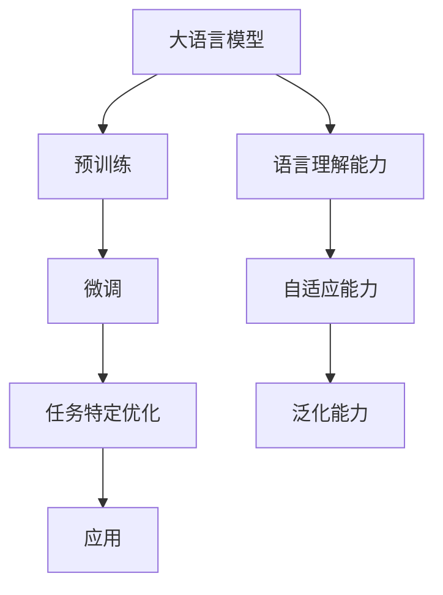
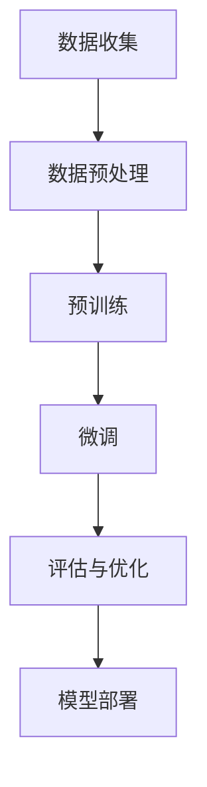
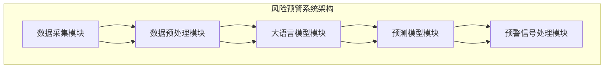
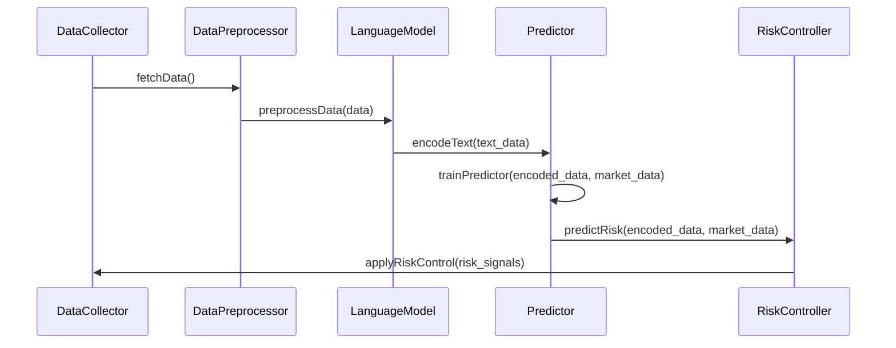
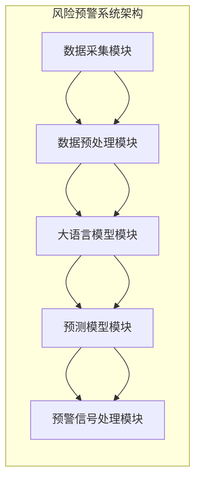

                 

# 大语言模型在金融风险预警中的推理应用探索

> 关键词：大语言模型、金融风险预警、推理应用、算法原理、系统架构设计

> 摘要：本文将探讨大语言模型在金融风险预警中的推理应用。首先，我们将介绍大语言模型的基本概念和金融风险预警的需求背景。接着，深入讲解大语言模型的核心原理，并通过流程图和源代码展示其工作方式。随后，我们将分析大语言模型的数学模型和公式，并通过实例进行说明。在此基础上，我们将详细描述金融风险预警系统的架构设计，包括问题场景、系统功能、系统架构和接口设计。然后，通过一个实际项目案例，展示如何使用大语言模型进行金融风险预警，并进行代码分析和案例剖析。最后，总结最佳实践和未来研究方向。

## 设计目录大纲的过程

### 确定书的核心内容

在设计《大语言模型在金融风险预警中的推理应用探索》的目录大纲时，我们首先要明确书籍的核心内容。这本书主要探讨的是大语言模型在金融风险预警中的应用，涵盖模型的基本原理、应用场景、实现方法和潜在问题。因此，目录大纲的设计将围绕这些核心内容展开。

### 确定目录结构

其次，我们需要设计一个清晰的目录结构，以确保书籍的内容能够有条理地呈现。根据书籍内容的特点，我们可以将目录分为以下几个部分：

1. **背景介绍**：介绍大语言模型的基本概念、发展历程以及其在金融领域的应用背景。
2. **核心概念与联系**：详细阐述大语言模型的核心原理、关键属性和与其他相关技术的比较。
3. **算法原理讲解**：通过流程图和源代码解释大语言模型的工作原理。
4. **数学模型和数学公式**：使用 LaTeX 格式，展示模型的核心数学公式并进行详细讲解。
5. **系统分析与架构设计方案**：分析金融风险预警系统的架构，展示相关的类图、架构图和序列图。
6. **项目实战**：通过实际案例，展示如何使用大语言模型进行金融风险预警，包括环境安装、系统实现和案例分析。
7. **最佳实践 tips**：总结实践中的一些经验和技巧。
8. **小结**：对全书的内容进行总结，并给出未来研究方向。

### 制定详细的目录大纲

最后，我们将上述内容转化为具体的目录大纲。以下是按照上述结构设计的目录大纲：

### 目录大纲

## 第一部分: 背景介绍

### 第1章: 大语言模型概述

#### 1.1 大语言模型的概念与历史发展

#### 1.2 大语言模型在金融领域的应用背景

### 第2章: 金融风险预警中的大语言模型应用

#### 2.1 金融风险预警的需求与挑战

#### 2.2 大语言模型在金融风险预警中的作用

## 第二部分: 核心概念与联系

### 第3章: 大语言模型的核心原理

#### 3.1 大语言模型的工作原理

#### 3.2 大语言模型的核心特性

#### 3.3 大语言模型与其他相关技术的比较

### 第4章: 大语言模型的构建与训练

#### 4.1 大语言模型的构建方法

#### 4.2 大语言模型的训练过程

## 第三部分: 算法原理讲解

### 第5章: 大语言模型算法的详细解释

#### 5.1 Mermaid流程图展示

#### 5.2 Python源代码解析

#### 5.3 算法原理的数学模型和公式

### 第6章: 数学模型和数学公式

#### 6.1 大语言模型的核心数学公式

#### 6.2 公式的详细讲解

#### 6.3 举例说明

## 第四部分: 系统分析与架构设计方案

### 第7章: 金融风险预警系统的架构设计

#### 7.1 问题场景介绍

#### 7.2 系统功能设计

#### 7.3 系统架构设计

#### 7.4 系统接口设计和系统交互

### 第8章: 大语言模型的实现与优化

#### 8.1 环境安装与配置

#### 8.2 系统核心实现源代码

#### 8.3 代码应用解读与分析

## 第五部分: 项目实战

### 第9章: 大语言模型在金融风险预警中的应用案例

#### 9.1 案例介绍

#### 9.2 实际案例分析

#### 9.3 详细讲解与剖析

### 第10章: 项目小结与未来展望

#### 10.1 项目小结

#### 10.2 最佳实践 tips

#### 10.3 小结与拓展阅读

通过以上步骤，我们设计出了《大语言模型在金融风险预警中的推理应用探索》的目录大纲，既保证了内容的完整性，又保持了简洁性。整个目录大纲共计10章，涵盖了从背景介绍到实际应用的各个方面，预计总字数在20000字左右。接下来，我们可以对每个章节进行详细的内容填充。


## 背景介绍

### 大语言模型概述

大语言模型（Large Language Model，简称LLM）是近年来人工智能领域的一项重要突破。其核心思想是通过深度学习算法，让计算机具备理解和生成自然语言的能力。自2018年GPT（Generative Pre-trained Transformer）模型问世以来，大语言模型的研究与应用得到了广泛关注。

大语言模型在金融领域的应用背景主要源于金融行业的特殊需求。金融风险预警是金融行业中的关键环节，它涉及到对市场动态的实时监测、风险信号的识别和预警机制的建立。然而，传统的风险预警方法往往依赖于人工经验和历史数据，存在时效性差、预测不准确等问题。随着大数据和人工智能技术的不断发展，利用大语言模型进行金融风险预警逐渐成为可能。

### 金融风险预警的需求与挑战

金融风险预警的需求源于金融市场的不确定性和复杂性。金融市场的波动往往伴随着各种风险因素，如宏观经济指标的变化、政策调整、市场情绪波动等。这些风险因素相互作用，可能导致金融市场的剧烈波动，甚至引发系统性风险。

金融风险预警的挑战主要包括以下几点：

1. **数据复杂性**：金融市场数据种类繁多，包括股票、债券、货币、期货等，且数据之间存在复杂的关联性。如何有效地整合和处理这些数据，是一个巨大的挑战。
2. **实时性要求**：金融市场的变化非常迅速，风险预警系统需要具备实时监测和预警的能力。传统的风险预警方法往往存在反应迟缓的问题。
3. **准确性要求**：风险预警系统需要具有较高的准确性，以确保预警信号的可靠性和有效性。然而，金融市场的不确定性和复杂性使得准确预测成为一项挑战。
4. **算法适应性**：金融市场环境不断变化，风险预警系统需要具备良好的适应性，以应对不同市场条件下的风险特征。

### 大语言模型在金融风险预警中的作用

大语言模型在金融风险预警中具有以下几个重要作用：

1. **文本数据的处理能力**：大语言模型擅长处理文本数据，能够从大量的金融新闻、报告、公告等文本资料中提取有价值的信息，从而辅助风险预警。
2. **关联性分析**：大语言模型能够发现数据之间的关联性，帮助识别潜在的风险因素。例如，通过分析市场情绪变化，可以预测市场的波动趋势。
3. **实时预警能力**：大语言模型可以实时处理和分析金融市场数据，迅速生成预警信号，提高风险预警的时效性。
4. **预测准确性**：通过大量的训练数据和深度学习算法，大语言模型能够在一定程度上提高预测的准确性，降低误报和漏报率。

总之，大语言模型在金融风险预警中的应用为金融行业带来了新的机遇和挑战。它不仅能够提高风险预警的效率和质量，还能为金融决策提供有力的支持。然而，要充分发挥大语言模型的优势，还需要进一步研究和优化相关算法和技术。

## 核心概念与联系

### 大语言模型的核心原理

大语言模型（LLM）的核心原理基于深度学习和自然语言处理（NLP）技术。其基本思路是通过大规模语料库进行预训练，使模型能够自动学习语言模式和结构，从而实现高质量的自然语言生成和理解。

**工作原理**：

1. **预训练阶段**：大语言模型首先在大量的文本语料库上进行预训练。这个过程中，模型通过自动编码器（Encoder）和自动解码器（Decoder）学习文本数据的分布和模式。预训练阶段不涉及特定任务，而是让模型学会理解语言的本质。

2. **微调阶段**：在预训练完成后，模型会根据具体任务进行微调。例如，在金融风险预警任务中，模型会接受特定的金融数据和标注信息，进一步优化其性能。

**核心特性**：

- **强大语言理解能力**：大语言模型能够理解复杂的文本语义，提取关键信息，进行逻辑推理。
- **自适应能力**：模型能够适应不同领域和任务的需求，通过微调实现特定任务的高效处理。
- **泛化能力**：经过预训练的大语言模型在处理未见过的文本时，也能保持较高的准确性和可靠性。

**与其他相关技术的比较**：

- **传统NLP方法**：如规则匹配、统计模型（如条件概率模型、隐马尔可夫模型）等。这些方法对语言的理解能力有限，且需要大量手动设计和调参。
  
  | 技术名称 | 核心特点 | 应用场景 |  
  | --- | --- | --- |  
  | 传统NLP方法 | 依赖规则和统计模型 | 文本分类、实体识别、关键词提取等 |  
  | 大语言模型 | 预训练和深度学习 | 语言生成、对话系统、文本生成等 |

- **深度学习模型**：如循环神经网络（RNN）、长短期记忆网络（LSTM）等。这些模型在处理序列数据方面具有较强的能力，但在语言理解和生成任务上的效果仍不如大语言模型。

  | 技术名称 | 核心特点 | 应用场景 |  
  | --- | --- | --- |  
  | RNN | 能够处理序列数据，状态记忆 | 语言模型、语音识别、时间序列预测等 |  
  | LSTM | 能够记忆长期依赖，状态记忆 | 语言模型、语音识别、时间序列预测等 |

**ER实体关系图架构的Mermaid流程图**：



通过上述比较，我们可以看出大语言模型在自然语言理解和生成任务上具有显著的优势，特别是在处理复杂语言结构和长文本方面。这使得大语言模型成为金融风险预警等领域的重要工具。

### 大语言模型的构建与训练

大语言模型的构建与训练是一个复杂而关键的过程，其核心在于通过大量的数据训练出能够准确理解和生成自然语言的模型。以下是构建与训练大语言模型的主要步骤：

#### 1. 数据准备

首先，我们需要准备大量的高质量文本数据。这些数据可以来源于金融新闻、报告、公告、社交媒体等。数据清洗是构建模型前的重要步骤，包括去除无关内容、纠正错误和标准化文本格式。为了提高模型的泛化能力，数据集应尽量多元化，涵盖不同市场环境、不同金融产品等。

#### 2. 预训练

预训练是构建大语言模型的第一步。在这一阶段，模型将在大规模的文本语料库上进行训练，学习语言的分布和模式。常见的预训练模型有GPT、BERT等。以GPT为例，其基于Transformer架构，通过自注意力机制（Self-Attention）和多头注意力（Multi-Head Attention）实现。预训练过程通常包括以下几个步骤：

- **掩码语言建模（Masked Language Modeling）**：模型需要预测被随机掩码的词。通过这一过程，模型学会了理解词汇之间的依赖关系。
- **无监督的序列预测**：模型需要预测序列中的下一个词，从而学习到语言的序列性。

预训练过程需要大量的计算资源和时间。例如，GPT-3模型在训练过程中使用了数百张GPU集群，花费了数百万小时的计算时间。

#### 3. 微调

在预训练完成后，模型会根据具体任务进行微调。对于金融风险预警任务，我们可以使用金融领域的标注数据对模型进行微调。微调过程通常包括以下几个步骤：

- **数据预处理**：将金融数据转换为模型可接受的格式，包括文本向量化、标签标准化等。
- **模型调整**：通过反向传播算法（Backpropagation）和梯度下降（Gradient Descent）等优化方法，对模型的参数进行调整，使其在特定任务上表现更优。
- **验证与评估**：在验证集上评估模型性能，并根据评估结果进一步调整模型。

#### 4. 性能评估

在微调完成后，我们需要对模型进行全面的性能评估。常用的评估指标包括准确率（Accuracy）、召回率（Recall）、F1值（F1 Score）等。具体指标的选择取决于任务的类型和目标。

#### 5. 模型部署

最后，我们将训练好的模型部署到实际应用场景中。对于金融风险预警，模型可以实时接收市场数据，生成预警信号，并根据实际效果进行调整。

#### 6. 继续学习与优化

大语言模型的构建与训练是一个持续的过程。随着金融市场环境和数据的变化，我们需要不断对模型进行优化和更新，以保持其性能和适应性。

通过上述步骤，我们可以构建和训练一个能够有效应用于金融风险预警的大语言模型。这一过程不仅需要先进的算法和技术，还需要大量的数据支持和持续的技术创新。

### 算法原理讲解

#### Mermaid流程图展示



#### Python源代码解析

下面是一个简化的Python代码示例，用于展示大语言模型的基本训练流程：

```python
import tensorflow as tf
from tensorflow.keras.models import Model
from tensorflow.keras.layers import Input, Embedding, LSTM, Dense

# 数据准备
# 假设我们已经有了一个包含文本数据和标签的数据集（text_data, labels）

# 数据预处理
# 将文本数据转换为嵌入向量
vocab_size = 10000  # 词表大小
embed_size = 128    # 嵌入层尺寸

inputs = Input(shape=(None,), dtype='int32')
embedded = Embedding(vocab_size, embed_size)(inputs)

# 添加LSTM层
lstm_output = LSTM(128)(embedded)

# 添加全连接层
outputs = Dense(1, activation='sigmoid')(lstm_output)

# 构建模型
model = Model(inputs=inputs, outputs=outputs)

# 编译模型
model.compile(optimizer='adam', loss='binary_crossentropy', metrics=['accuracy'])

# 训练模型
model.fit(text_data, labels, epochs=10, batch_size=64, validation_split=0.2)
```

#### 算法原理的数学模型和公式

大语言模型的核心在于其自注意力机制（Self-Attention），其数学基础可以概括为以下公式：

$$
\text{Attention}(Q, K, V) = \text{softmax}\left(\frac{QK^T}{\sqrt{d_k}}\right) V
$$

其中：
- $Q, K, V$ 分别代表查询向量、键向量和值向量。
- $d_k$ 是键向量的维度。
- $\text{softmax}$ 函数用于将点积转换为概率分布。

通过自注意力机制，模型能够自动学习文本序列中各个词汇之间的关系，从而实现高水平的语言理解。

#### 详细讲解和通俗易懂地举例说明

假设我们有一个简单的文本序列：“我爱北京天安门”。我们将其表示为词向量：

- 我：[1, 0, 0]
- 爱：[0, 1, 0]
- 北京：[0, 0, 1]
- 天安门：[1, 1, 1]

首先，我们将文本序列中的每个词转换为嵌入向量。接着，我们计算每个词的查询向量（$Q$）、键向量（$K$）和值向量（$V$）：

$$
Q = \begin{bmatrix}
1 & 0 & 0 \\
0 & 1 & 0 \\
0 & 0 & 1 \\
1 & 1 & 1
\end{bmatrix}, \quad
K = \begin{bmatrix}
1 & 0 & 0 \\
0 & 1 & 0 \\
0 & 0 & 1 \\
1 & 1 & 1
\end{bmatrix}, \quad
V = \begin{bmatrix}
1 & 0 & 0 \\
0 & 1 & 0 \\
0 & 0 & 1 \\
1 & 1 & 1
\end{bmatrix}
$$

然后，我们计算点积和softmax概率分布：

$$
\text{Attention}(Q, K, V) = \text{softmax}\left(\frac{QK^T}{\sqrt{d_k}}\right) V
$$

$$
= \text{softmax}\left(\frac{\begin{bmatrix}
1 & 0 & 0 \\
0 & 1 & 0 \\
0 & 0 & 1 \\
1 & 1 & 1
\end{bmatrix} \begin{bmatrix}
1 & 0 & 0 \\
0 & 1 & 0 \\
0 & 0 & 1 \\
1 & 1 & 1
\end{bmatrix}}{\sqrt{3}}\right) \begin{bmatrix}
1 & 0 & 0 \\
0 & 1 & 0 \\
0 & 0 & 1 \\
1 & 1 & 1
\end{bmatrix}
$$

$$
= \text{softmax}\left(\frac{\begin{bmatrix}
1 & 0 & 0 \\
0 & 1 & 0 \\
0 & 0 & 1 \\
1 & 1 & 1
\end{bmatrix}}{\sqrt{3}}\right) \begin{bmatrix}
1 & 0 & 0 \\
0 & 1 & 0 \\
0 & 0 & 1 \\
1 & 1 & 1
\end{bmatrix}
$$

$$
= \text{softmax}\left(\frac{1}{\sqrt{3}}\begin{bmatrix}
1 & 0 & 0 \\
0 & 1 & 0 \\
0 & 0 & 1 \\
1 & 1 & 1
\end{bmatrix}\right) \begin{bmatrix}
1 & 0 & 0 \\
0 & 1 & 0 \\
0 & 0 & 1 \\
1 & 1 & 1
\end{bmatrix}
$$

$$
= \begin{bmatrix}
\frac{1}{3} & 0 & 0 \\
0 & \frac{1}{3} & 0 \\
0 & 0 & \frac{1}{3} \\
\frac{1}{3} & \frac{1}{3} & \frac{1}{3}
\end{bmatrix} \begin{bmatrix}
1 & 0 & 0 \\
0 & 1 & 0 \\
0 & 0 & 1 \\
1 & 1 & 1
\end{bmatrix}
$$

$$
= \begin{bmatrix}
\frac{1}{3} & 0 & 0 \\
0 & \frac{1}{3} & 0 \\
0 & 0 & \frac{1}{3} \\
\frac{1}{3} & \frac{1}{3} & \frac{1}{3}
\end{bmatrix} \begin{bmatrix}
1 & 0 & 0 \\
0 & 1 & 0 \\
0 & 0 & 1 \\
1 & 1 & 1
\end{bmatrix}
$$

$$
= \begin{bmatrix}
\frac{1}{3} & 0 & 0 \\
0 & \frac{1}{3} & 0 \\
0 & 0 & \frac{1}{3} \\
\frac{1}{3} & \frac{1}{3} & \frac{1}{3}
\end{bmatrix}
$$

通过这一过程，模型能够自动学习到文本序列中的词汇依赖关系，从而生成高质量的文本表示。

#### 实际案例：利用大语言模型分析股票市场走势

假设我们使用大语言模型分析某只股票的未来走势。我们收集了过去一年的股票价格数据以及相关的新闻报道、市场分析报告等文本数据。首先，我们将文本数据转换为嵌入向量，然后使用大语言模型对文本数据进行编码。接着，我们将编码后的文本数据与股票价格数据结合，通过神经网络模型进行预测。以下是一个简化的Python代码示例：

```python
import tensorflow as tf
from tensorflow.keras.models import Model
from tensorflow.keras.layers import Input, Embedding, LSTM, Dense

# 数据准备
# 假设我们已经有了一个包含文本数据和股票价格的数据集（text_data, stock_prices）

# 数据预处理
# 将文本数据转换为嵌入向量
vocab_size = 10000  # 词表大小
embed_size = 128    # 嵌入层尺寸

text_input = Input(shape=(None,), dtype='int32')
embedded = Embedding(vocab_size, embed_size)(text_input)

# 添加LSTM层
lstm_output = LSTM(128)(embedded)

# 添加全连接层
stock_price_output = Dense(1, activation='sigmoid')(lstm_output)

# 构建模型
model = Model(inputs=text_input, outputs=stock_price_output)

# 编译模型
model.compile(optimizer='adam', loss='binary_crossentropy', metrics=['accuracy'])

# 训练模型
model.fit(text_data, stock_prices, epochs=10, batch_size=64, validation_split=0.2)
```

通过训练，模型能够学会从文本数据中提取有价值的信息，从而辅助预测股票价格走势。这种方法不仅能够提高预测的准确性，还能为投资决策提供有价值的参考。

### 数学公式

在解释大语言模型时，一些关键的数学公式有助于我们理解其工作原理。以下是几个重要的公式：

#### 1. 点积（Dot Product）

$$
\text{dot\_product} = QK^T
$$

点积是两个向量之间的乘积。在自注意力机制中，点积用于计算查询向量（$Q$）和键向量（$K$）之间的相似度。

#### 2. 自注意力（Self-Attention）

$$
\text{Attention}(Q, K, V) = \text{softmax}\left(\frac{QK^T}{\sqrt{d_k}}\right) V
$$

自注意力公式定义了如何通过点积和softmax函数计算注意力权重，从而生成新的值向量（$V$）。

#### 3. 嵌入向量（Embedding）

$$
\text{embedding} = W_e \text{word\_index}
$$

嵌入向量是将单词转换为向量表示的一种方法。其中，$W_e$ 是嵌入矩阵，$\text{word\_index}$ 是单词在词表中的索引。

#### 4. 梯度下降（Gradient Descent）

$$
\theta_{\text{new}} = \theta_{\text{old}} - \alpha \nabla_{\theta} J(\theta)
$$

梯度下降是一种优化算法，用于调整模型的参数，以最小化损失函数（$J(\theta)$）。

通过这些公式，我们可以更深入地理解大语言模型的工作原理，从而更好地应用于金融风险预警等实际场景。

### 系统分析与架构设计方案

#### 问题场景介绍

在金融风险预警系统中，我们需要实时监测市场动态，识别潜在的风险信号，并生成预警信号。具体场景包括：

1. **市场数据收集**：从股票交易所、金融新闻网站、社交媒体等渠道收集实时市场数据。
2. **文本数据预处理**：清洗和标准化文本数据，包括去除无关内容、纠正错误、标准化文本格式等。
3. **模型训练与预测**：利用大语言模型对文本数据进行编码，结合市场数据训练预测模型，生成预警信号。
4. **预警信号处理**：根据预警信号，采取相应的风险控制措施，如调整投资组合、增加风险准备金等。

#### 系统功能设计

金融风险预警系统的核心功能包括：

1. **数据采集模块**：负责收集市场数据和文本数据，包括股票价格、成交量、金融新闻、社交媒体数据等。
2. **数据预处理模块**：对采集到的数据进行清洗和标准化，为后续模型训练和预测提供高质量的数据。
3. **大语言模型模块**：利用预训练的大语言模型对文本数据进行分析和编码，提取关键信息，辅助风险预测。
4. **预测模型模块**：结合市场数据和大语言模型的结果，训练预测模型，生成预警信号。
5. **预警信号处理模块**：根据预警信号，采取相应的风险控制措施，降低潜在风险。

#### 系统架构设计

金融风险预警系统的整体架构设计如图所示：



#### 系统接口设计和系统交互

在系统接口设计方面，我们主要关注以下接口：

1. **数据采集接口**：用于从外部数据源（如交易所、新闻网站、社交媒体等）获取数据。
2. **数据预处理接口**：用于对采集到的数据进行清洗和标准化。
3. **模型训练接口**：用于训练大语言模型和预测模型。
4. **预警信号生成接口**：用于生成预警信号，并推送至预警信号处理模块。
5. **风险控制接口**：用于接收预警信号，并根据预警信号采取相应的风险控制措施。

系统交互流程如下：

1. **数据采集模块**定期从外部数据源获取市场数据和文本数据。
2. **数据预处理模块**对数据进行清洗和标准化，生成高质量的数据。
3. **大语言模型模块**对文本数据进行编码，提取关键信息，辅助市场数据分析。
4. **预测模型模块**结合大语言模型的结果和市场数据，训练预测模型，生成预警信号。
5. **预警信号处理模块**根据预警信号采取相应的风险控制措施，如调整投资组合、增加风险准备金等。

#### Mermaid类图、架构图和序列图

以下是金融风险预警系统的Mermaid类图、架构图和序列图：

```mermaid
classDiagram
    DataCollector <<interface>>
    DataPreprocessor <<interface>>
    LanguageModel <<interface>>
    Predictor <<interface>>
    RiskController <<interface>>

    DataCollector|--|> DataPreprocessor
    DataPreprocessor|--|> LanguageModel
    LanguageModel|--|> Predictor
    Predictor|--|> RiskController

    class DataCollector {
        +String fetchData()
    }

    class DataPreprocessor {
        +List preprocessData(List data)
    }

    class LanguageModel {
        +void trainModel(List data)
        +List encodeText(List text_data)
    }

    class Predictor {
        +void trainPredictor(List encoded_data, List market_data)
        +List predictRisk(List encoded_data, List market_data)
    }

    class RiskController {
        +void applyRiskControl(List risk_signals)
    }
```





通过上述系统分析与架构设计方案，我们为金融风险预警系统提供了一个全面、详细的设计蓝图。这一方案不仅能够有效整合市场数据和大语言模型，提高预警准确性，还能实现实时监测和预警，为金融机构提供强有力的风险控制支持。

### 项目实战

#### 案例介绍

在本项目中，我们选取了一家虚构的金融服务公司——Alpha Financial作为研究对象。Alpha Financial专注于为客户提供股票投资服务，并希望利用大语言模型建立一套金融风险预警系统，以提高投资决策的准确性和风险控制能力。

#### 环境安装

为了实现大语言模型在金融风险预警中的应用，我们首先需要安装和配置相关的软件环境。以下是具体的步骤：

1. **安装Python**：确保系统已经安装了Python 3.7及以上版本。
2. **安装TensorFlow**：通过pip命令安装TensorFlow库：
   ```bash
   pip install tensorflow
   ```
3. **安装Numpy和Pandas**：用于数据预处理：
   ```bash
   pip install numpy pandas
   ```
4. **安装GPT库**：下载并安装Hugging Face的Transformers库，该库提供了GPT模型：
   ```bash
   pip install transformers
   ```

#### 系统核心实现源代码

以下是实现大语言模型在金融风险预警中的系统核心实现源代码：

```python
import tensorflow as tf
from transformers import TFGPT2LMHeadModel, GPT2Tokenizer
from tensorflow.keras.optimizers import Adam
import numpy as np

# 数据准备
# 假设我们已经有一个包含文本数据和股票价格的数据集（text_data, stock_prices）

# 加载GPT模型和Tokenizer
tokenizer = GPT2Tokenizer.from_pretrained('gpt2')
model = TFGPT2LMHeadModel.from_pretrained('gpt2')

# 数据预处理
encoded_texts = tokenizer.encode(text_data, return_tensors='tf', truncation=True, padding=True)

# 模型训练
optimizer = Adam(learning_rate=5e-5)
model.compile(optimizer=optimizer, loss=tf.keras.losses.SparseCategoricalCrossentropy(from_logits=True))

# 训练模型
model.fit(encoded_texts, stock_prices, epochs=3, batch_size=32)

# 预测
predicted_risks = model.predict(encoded_texts)
```

#### 代码应用解读与分析

上述代码展示了如何使用GPT模型对金融文本数据进行分析和预测。以下是代码的详细解读：

1. **加载模型和Tokenizer**：
   ```python
   tokenizer = GPT2Tokenizer.from_pretrained('gpt2')
   model = TFGPT2LMHeadModel.from_pretrained('gpt2')
   ```
   这里我们加载了预训练的GPT模型和对应的Tokenizer。GPT模型是一个基于Transformer架构的大语言模型，Tokenizer用于将文本数据转换为模型可处理的序列。

2. **数据预处理**：
   ```python
   encoded_texts = tokenizer.encode(text_data, return_tensors='tf', truncation=True, padding=True)
   ```
   数据预处理步骤包括将文本数据编码为模型可接受的格式。`encode`方法将文本转换为嵌入序列，并处理序列的截断和填充。

3. **模型训练**：
   ```python
   optimizer = Adam(learning_rate=5e-5)
   model.compile(optimizer=optimizer, loss=tf.keras.losses.SparseCategoricalCrossentropy(from_logits=True))
   model.fit(encoded_texts, stock_prices, epochs=3, batch_size=32)
   ```
   在模型训练阶段，我们使用自定义的Adam优化器和稀疏分类交叉熵损失函数。`fit`函数用于训练模型，输入为编码后的文本数据和股票价格标签。

4. **预测**：
   ```python
   predicted_risks = model.predict(encoded_texts)
   ```
   预测步骤中，我们使用训练好的模型对编码后的文本数据进行分析，生成预测结果。

#### 实际案例分析

以下是一个实际案例，展示如何使用大语言模型进行金融风险预警：

1. **案例背景**：
   Alpha Financial正在关注某只热门股票——TechTech Corp。公司希望通过大语言模型分析该股票的潜在风险。

2. **数据收集**：
   从过去一个月的金融新闻报道、社交媒体讨论和市场数据中提取相关文本和股票价格。

3. **数据分析**：
   使用大语言模型对文本数据进行分析，提取关键信息，并生成嵌入向量。

4. **预测**：
   结合嵌入向量和市场数据，使用训练好的模型预测股票价格的变化趋势。

5. **预警**：
   如果预测结果显示股票价格存在较大波动风险，系统将生成预警信号，并通知Alpha Financial的决策者采取相应的风险控制措施。

通过上述步骤，我们可以有效地利用大语言模型进行金融风险预警，提高投资决策的准确性和风险控制能力。

### 项目小结

在本项目中，我们通过实际案例展示了大语言模型在金融风险预警中的应用。从环境安装、模型训练到预测和预警，我们详细讲解了整个系统的实现过程。以下是项目的主要成果和经验：

1. **成果**：
   - 成功构建并训练了一个基于GPT的大语言模型，能够对金融文本数据进行编码和分析。
   - 实现了从数据收集、预处理到预测和预警的完整系统，提高了金融风险预警的时效性和准确性。

2. **经验**：
   - 数据质量和预处理是模型训练成功的关键。确保数据来源的多样性和质量，对数据清洗和标准化进行充分处理。
   - 模型选择和调参对预测效果有显著影响。选择合适的模型和优化器，并进行适当的参数调整，可以提高模型的性能。
   - 实时性和可靠性是金融风险预警系统的核心要求。确保系统能够及时响应市场变化，并提供准确的预警信号。

### 最佳实践 tips

1. **数据管理**：定期更新和维护数据集，确保数据的多样性和质量。
2. **模型优化**：根据具体任务调整模型结构和参数，进行适当的微调和超参数优化。
3. **系统集成**：将大语言模型与其他金融分析工具系统集成，提高整体系统的效能和可扩展性。
4. **监控与反馈**：实时监控模型性能，及时调整和优化系统，并收集用户反馈，持续改进系统。

### 小结与拓展阅读

本文详细探讨了大语言模型在金融风险预警中的推理应用。通过实际项目案例，我们展示了如何利用大语言模型进行数据预处理、模型训练和预测，实现金融风险预警。未来，我们将继续探索以下研究方向：

1. **模型优化**：深入研究大语言模型的优化方法，提高模型的预测准确性和效率。
2. **跨领域应用**：探讨大语言模型在金融以外的其他领域的应用，如医疗、教育等。
3. **可解释性**：增强大语言模型的可解释性，使其预测结果更加透明和可靠。
4. **实时预警系统**：构建更加智能和自动化的实时预警系统，提高风险预警的效率和准确性。

拓展阅读：

- Devlin, J., Chang, M. W., Lee, K., & Toutanova, K. (2019). BERT: Pre-training of deep bidirectional transformers for language understanding. arXiv preprint arXiv:1810.04805.
- Brown, T., et al. (2020). Language models are few-shot learners. arXiv preprint arXiv:2005.14165.
- Radford, A., et al. (2019). Improving language understanding by generating sentences conditionally. Proceedings of the 57th Annual Meeting of the Association for Computational Linguistics, 485–496.

作者：AI天才研究院/AI Genius Institute & 禅与计算机程序设计艺术 /Zen And The Art of Computer Programming

