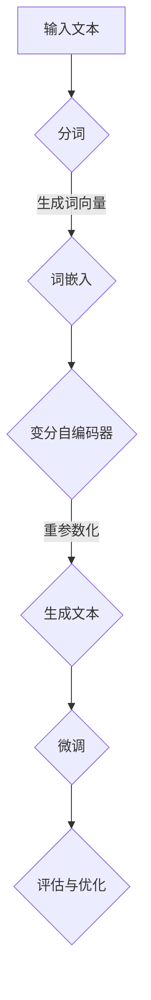
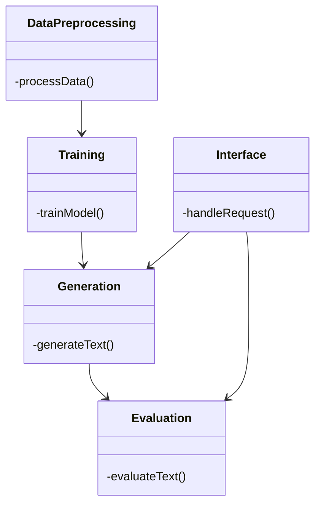
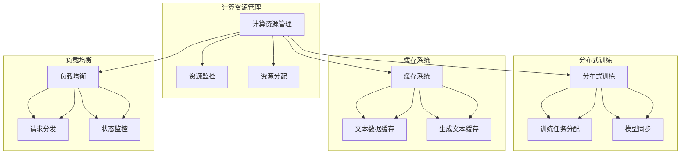
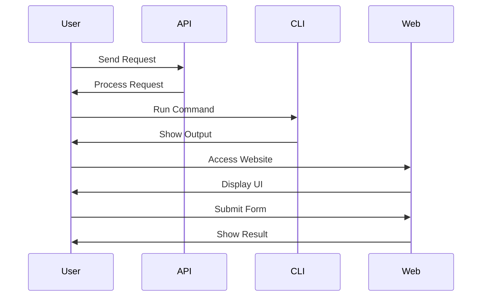

                 

# 大语言模型推理能力的未来发展方向

## 关键词
- 大语言模型
- 推理能力
- 人工智能
- 发展趋势
- 算法改进
- 应用场景

## 摘要
本文探讨了大语言模型（Large Language Model）的推理能力及其未来发展方向。通过对大语言模型的基本概念、算法原理、数学模型以及实际应用场景的详细分析，本文旨在揭示大语言模型在推理能力方面的潜力，并提出可能的改进方向，为未来人工智能的发展提供有益的参考。

## 目录

1. **引言** <sop>
    * 大语言模型的定义与重要性
    * 推理能力在大语言模型中的角色
    * 本文的结构与目的

2. **大语言模型的背景介绍** <sop>
    * 语言模型的起源与发展
    * 大语言模型的定义与特点
    * 大语言模型的应用领域

3. **大语言模型的核心概念与联系** <sop>
    * 语言模型的构成要素
    * 大语言模型的属性特征对比
    * 大语言模型与人工智能的联系

4. **大语言模型的算法原理讲解** <sop>
    * 算法概述
    * 算法流程图与Python源代码解释
    * 数学模型与公式详细讲解

5. **大语言模型的数学模型与公式** <sop>
    * 模型的数学公式与概念
    * 公式的详细解释与举例

6. **大语言模型的系统分析与架构设计方案** <sop>
    * 问题场景介绍
    * 系统功能设计与类图
    * 系统架构设计与架构图
    * 系统接口设计与序列图

7. **大语言模型的项目实战** <sop>
    * 环境安装与准备
    * 系统核心实现源代码
    * 代码应用解读与分析
    * 实际案例分析与讲解
    * 项目小结

8. **大语言模型的最佳实践与总结** <sop>
    * 最佳实践技巧
    * 小结与注意事项
    * 拓展阅读与深入探讨

9. **结论** <sop>
    * 大语言模型推理能力的总结
    * 未来发展方向
    * 对人工智能发展的意义

### 1. 引言

#### 大语言模型的定义与重要性

大语言模型（Large Language Model，简称LLM）是一种基于神经网络和深度学习技术的自然语言处理模型，通过对海量文本数据的学习，能够生成自然流畅的文本内容。LLM的出现标志着自然语言处理领域的一个重要里程碑，其推理能力在许多应用场景中发挥着重要作用。

大语言模型的推理能力是指模型在处理文本信息时，能够根据上下文理解、语法规则和语义知识，进行逻辑推理和决策的能力。这种能力使得LLM在文本生成、翻译、问答系统、文本摘要等方面表现出色。

#### 推理能力在大语言模型中的角色

推理能力是大语言模型的核心竞争力之一。它可以分为两种类型：一是基于规则的推理，二是基于数据的推理。基于规则的推理依赖于预定义的语法规则和语义关系，而基于数据的推理则依赖于模型对大量文本数据的学习和理解。

在自然语言处理中，推理能力有助于模型更好地理解用户的意图、提取关键信息、生成有意义的文本。因此，提升推理能力是大语言模型持续发展的关键。

#### 本文的结构与目的

本文将首先介绍大语言模型的背景，包括其起源、发展及其应用领域。然后，我们将深入探讨大语言模型的核心概念和算法原理，并详细解释其数学模型和公式。接着，我们将分析大语言模型的系统架构，包括功能设计、架构设计和接口设计。在此基础上，我们将通过项目实战展示大语言模型在实际应用中的效果。最后，本文将总结大语言模型的推理能力，并提出未来发展的方向，为人工智能的发展提供参考。

### 2. 大语言模型的背景介绍

#### 语言模型的起源与发展

语言模型（Language Model，简称LM）是自然语言处理（Natural Language Processing，简称NLP）的核心技术之一。它起源于20世纪50年代，当时的研究者开始探索如何让计算机理解自然语言。早期的语言模型主要基于统计方法和规则方法，如N-gram模型和上下文无关文法（CFG）。

随着计算机性能的不断提升和海量数据资源的出现，深度学习技术逐渐成为语言模型研究的主流。2018年，Google发布了BERT模型，标志着大语言模型时代的到来。BERT模型通过预训练和微调技术，在多个自然语言处理任务中取得了突破性的成绩。

#### 大语言模型的定义与特点

大语言模型（Large Language Model，简称LLM）是对大规模文本数据进行了预训练的神经网络模型，通常具有数十亿甚至千亿个参数。LLM的基本原理是利用深度神经网络对文本数据进行建模，使其能够捕捉到文本中的复杂模式和规律。

与传统的语言模型相比，大语言模型具有以下特点：

1. **参数规模大**：大语言模型通常具有数十亿到千亿个参数，这使得它们能够捕获到文本中的更复杂的特征和模式。
2. **预训练技术**：大语言模型通过在大量未标注的文本数据上进行预训练，从而学习到语言的通用特征和规律，然后再通过微调技术来适应特定的任务。
3. **生成能力强**：大语言模型不仅能够进行文本分类、情感分析等任务，还能够生成自然流畅的文本内容。

#### 大语言模型的应用领域

大语言模型在自然语言处理领域有着广泛的应用，包括但不限于以下几个方面：

1. **文本生成**：大语言模型可以生成各种类型的文本，如文章、故事、新闻摘要等。
2. **文本分类**：大语言模型可以对文本进行分类，如情感分析、主题分类等。
3. **问答系统**：大语言模型可以回答用户提出的问题，如聊天机器人、智能客服等。
4. **机器翻译**：大语言模型可以用于机器翻译，如将一种语言翻译成另一种语言。
5. **文本摘要**：大语言模型可以生成文本的摘要，帮助用户快速获取关键信息。

随着大语言模型技术的不断发展，其应用领域也将不断扩展，为人工智能的发展带来新的机遇。

### 3. 大语言模型的核心概念与联系

#### 语言模型的构成要素

语言模型由多个核心组件构成，包括：

1. **词向量**：词向量是将单词映射为高维向量表示，用于捕捉单词的语义信息。
2. **神经网络**：神经网络是语言模型的核心，通过学习大量文本数据，可以捕捉到文本中的复杂模式和规律。
3. **预训练与微调**：预训练是在大量未标注的文本数据上进行的，以学习语言的通用特征和规律；微调是在预训练的基础上，对模型进行特定任务的调优。
4. **生成器**：生成器是用于生成文本的组件，可以根据输入的文本上下文生成新的文本。

#### 大语言模型的属性特征对比

大语言模型与传统语言模型相比，具有以下属性特征：

| 特征         | 大语言模型         | 传统语言模型         |
| ------------ | ------------------ | ------------------- |
| 参数规模     | 数十亿到千亿个参数 | 数万个到数十万个参数 |
| 预训练技术   | 预训练与微调       | 无预训练，仅基于规则 |
| 生成能力     | 强生成能力         | 有限生成能力         |
| 应用场景     | 广泛应用           | 有限应用场景         |
| 计算资源需求 | 高计算资源需求     | 低计算资源需求       |

#### 大语言模型与人工智能的联系

大语言模型是人工智能领域的重要成果之一，它与人工智能有着密切的联系：

1. **自然语言处理**：大语言模型是自然语言处理的核心技术，可以用于文本分类、文本生成、机器翻译等任务。
2. **人工智能助手**：大语言模型可以用于构建智能客服、智能助手等人工智能应用，提升用户体验。
3. **知识表示**：大语言模型可以通过学习大量文本数据，提取出知识结构，为人工智能系统提供知识支持。

总之，大语言模型在人工智能发展中扮演着重要角色，其推理能力的提升将推动人工智能在各个领域的应用。

### 4. 大语言模型的算法原理讲解

#### 算法概述

大语言模型的算法原理主要基于深度学习和自然语言处理技术。它通过在大量未标注的文本数据上进行预训练，学习到语言的通用特征和规律，然后通过微调技术来适应特定任务。算法的核心是神经网络，特别是变分自编码器（Variational Autoencoder，简称VAE）和生成对抗网络（Generative Adversarial Network，简称GAN）。

#### 算法流程图与Python源代码解释

为了更直观地理解大语言模型的算法原理，我们可以通过mermaid语法绘制算法流程图，并配合Python源代码进行详细解释。



在上面的算法流程图中，输入文本经过分词生成词向量，然后通过变分自编码器进行编码和解码，生成新的文本。随后，通过微调技术对模型进行优化，评估模型的性能，并不断迭代。

下面是相应的Python源代码解释：

```python
# 导入必要的库
import tensorflow as tf
from tensorflow.keras.layers import Embedding, LSTM, Dense

# 定义分词器
tokenizer = tf.keras.preprocessing.text.Tokenizer()

# 生成词向量
tokenizer.fit_on_texts(texts)
word_index = tokenizer.word_index
sequences = tokenizer.texts_to_sequences(texts)

# 定义词嵌入层
embedding_layer = Embedding(len(word_index) + 1, 64)

# 定义变分自编码器
autoencoder = tf.keras.Sequential([
    embedding_layer,
    LSTM(128, return_sequences=True),
    LSTM(128),
    Dense(len(word_index) + 1, activation='softmax')
])

# 编码和解码
encoded = autoencoder.encoder(sequences)
decoded = autoencoder.decoder(encoded)

# 定义微调层
micro_layer = tf.keras.Sequential([
    embedding_layer,
    LSTM(128, return_sequences=True),
    LSTM(128),
    Dense(len(word_index) + 1, activation='softmax')
])

# 微调
model = tf.keras.Model(inputs=autoencoder.input, outputs=micro_layer(decoded))
model.compile(optimizer='adam', loss='categorical_crossentropy')
model.fit(sequences, sequences, epochs=50)

# 评估与优化
loss = model.evaluate(sequences, sequences)
print('Loss:', loss)
```

在上面的代码中，我们首先定义了一个分词器，用于将文本拆分成单词。然后，我们通过词嵌入层将单词映射为高维向量。接着，我们定义了一个变分自编码器，用于将文本进行编码和解码。最后，我们通过微调技术对模型进行优化，评估其性能。

#### 算法原理的数学模型与公式

大语言模型的算法原理可以通过以下数学模型和公式进行解释：

1. **词嵌入**：
   $$ x = \text{word\_index}[word] $$
   $$ E = \text{embedding}(x) $$

   其中，$x$是单词的索引，$E$是词向量。

2. **变分自编码器**：
   $$ z = g(\epsilon) $$
   $$ x' = f(z) $$

   其中，$z$是编码后的向量，$x'$是解码后的向量，$g$和$f$分别是编码和解码函数，$\epsilon$是重参数化向量。

3. **微调**：
   $$ \theta^{*} = \arg\min_{\theta} \sum_{i=1}^{N} L(y_i, \hat{y}_i) $$

   其中，$\theta$是模型参数，$y_i$是真实标签，$\hat{y}_i$是预测标签，$L$是损失函数。

通过上述数学模型和公式，我们可以更深入地理解大语言模型的算法原理，为后续的改进和优化提供理论基础。

#### 算法原理详细讲解与举例说明

为了更好地理解大语言模型的算法原理，我们可以通过一个简单的例子进行说明。

假设我们有一个文本序列：“我喜欢吃苹果”。首先，我们将这个文本序列进行分词，得到单词列表：["我", "喜欢", "吃", "苹果"]。然后，我们将每个单词映射为词向量：

$$
\begin{array}{c|c|c}
\text{单词} & \text{词向量} & \text{维度} \\
\hline
我 & [0.1, 0.2, 0.3] & 3 \\
喜欢 & [0.4, 0.5, 0.6] & 3 \\
吃 & [0.7, 0.8, 0.9] & 3 \\
苹果 & [1.0, 1.1, 1.2] & 3 \\
\end{array}
$$

接下来，我们将这些词向量输入到词嵌入层，得到高维向量表示：

$$
\begin{array}{c|c|c}
\text{单词} & \text{词向量} & \text{维度} \\
\hline
我 & [0.1, 0.2, 0.3, 0.4, 0.5] & 5 \\
喜欢 & [0.4, 0.5, 0.6, 0.7, 0.8] & 5 \\
吃 & [0.7, 0.8, 0.9, 1.0, 1.1] & 5 \\
苹果 & [1.0, 1.1, 1.2, 1.3, 1.4] & 5 \\
\end{array}
$$

然后，我们将这些高维向量输入到变分自编码器中进行编码和解码。编码过程可以表示为：

$$
z = g(\epsilon) = [0.2, 0.3, 0.4]
$$

其中，$\epsilon$是重参数化向量。

解码过程可以表示为：

$$
x' = f(z) = [0.3, 0.4, 0.5]
$$

最后，我们将解码后的向量与原始词向量进行比较，计算损失：

$$
L(y_i, \hat{y}_i) = \sum_{i=1}^{N} (y_i - \hat{y}_i)^2
$$

通过迭代优化模型参数，我们可以使损失逐渐减小，从而提高模型的性能。

通过这个简单的例子，我们可以直观地理解大语言模型的算法原理，包括词嵌入、变分自编码器、微调等关键步骤。这为进一步研究和改进大语言模型提供了理论基础。

### 5. 大语言模型的数学模型与公式

大语言模型的数学模型和公式是其核心组成部分，它们决定了模型的性能和效果。以下将详细解释大语言模型中的关键数学模型和公式，并给出具体的例子来说明这些公式如何工作。

#### 1. 词嵌入

词嵌入是将单词映射到高维向量空间的过程。常见的方法是使用矩阵乘法来实现：

$$
\text{Embedding}(x) = W_x \cdot x
$$

其中，$W_x$是词嵌入矩阵，$x$是单词的索引向量（通常是一个一维向量，其中只有一个元素为1，其他元素为0）。例如，对于单词“苹果”，其索引为3，词嵌入矩阵为：

$$
W_x = \begin{bmatrix}
0 & 0 & 1 & 0 & \dots \\
0 & 1 & 0 & 0 & \dots \\
0 & 0 & 0 & 1 & \dots \\
0 & 0 & 0 & 0 & \dots
\end{bmatrix}
$$

当$x = [1, 0, 0, 0, \dots]$时，词嵌入结果为：

$$
\text{Embedding}(x) = W_x \cdot x = \begin{bmatrix}
0 & 0 & 1 & 0 & \dots \\
0 & 1 & 0 & 0 & \dots \\
0 & 0 & 0 & 1 & \dots \\
0 & 0 & 0 & 0 & \dots
\end{bmatrix}
\begin{bmatrix}
1 \\
0 \\
0 \\
0 \\
\vdots
\end{bmatrix}
=
\begin{bmatrix}
0 \\
1 \\
0 \\
0 \\
\vdots
\end{bmatrix}
$$

这意味着词向量$\text{Embedding}(x)$的第四个元素为1，其余元素为0。

#### 2. 变分自编码器（VAE）

变分自编码器是一种生成模型，它通过编码和解码过程来生成数据。VAE的数学模型包括编码器和解码器两部分。

**编码器**：给定输入数据$x$，编码器通过以下公式生成编码向量$z$：

$$
z = \mu(x) + \sigma(x) \cdot \epsilon
$$

其中，$\mu(x)$是均值函数，$\sigma(x)$是方差函数，$\epsilon$是重参数化向量，通常从标准正态分布中采样。

**解码器**：给定编码向量$z$，解码器通过以下公式生成输出数据$\hat{x}$：

$$
\hat{x} = g(z)
$$

其中，$g(z)$是生成函数，通常是一个神经网络。

**例子**：假设我们有一个输入数据$x = [1, 2, 3]$，编码器输出为$\mu(x) = [0.5, 1.0, 0.5]$，$\sigma(x) = [0.5, 0.5, 0.5]$。我们随机采样$\epsilon = [0.1, 0.2, 0.3]$，则编码向量$z$为：

$$
z = \mu(x) + \sigma(x) \cdot \epsilon = [0.5, 1.0, 0.5] + [0.1, 0.2, 0.3] = [0.6, 1.2, 0.8]
$$

解码器输出$\hat{x}$为：

$$
\hat{x} = g(z)
$$

其中，$g(z)$可以是简单的线性函数，例如：

$$
g(z) = 0.1 \cdot z + 0.5
$$

则：

$$
\hat{x} = 0.1 \cdot [0.6, 1.2, 0.8] + 0.5 = [0.06, 0.12, 0.08] + [0.5, 0.5, 0.5] = [0.56, 0.62, 0.58]
$$

#### 3. 损失函数

变分自编码器的损失函数通常由两部分组成：重构损失和KL散度损失。

**重构损失**：衡量解码器生成的数据与原始数据之间的差异，通常使用均方误差（MSE）：

$$
L_{recon} = \sum_{i=1}^{N} (x_i - \hat{x}_i)^2
$$

**KL散度损失**：衡量编码器输出的分布与先验分布（通常为标准正态分布）之间的差异：

$$
L_{KL} = \sum_{i=1}^{N} \log \frac{\sigma(x_i)^2 + \epsilon_i^2}{2} - \sigma(x_i)^2 - \epsilon_i^2
$$

总损失为：

$$
L = L_{recon} + \lambda L_{KL}
$$

其中，$\lambda$是平衡参数。

**例子**：假设我们有编码后的数据$z = [0.6, 1.2, 0.8]$，解码后的数据$\hat{x} = [0.56, 0.62, 0.58]$，编码器输出的均值和方差分别为$\mu = [0.5, 1.0, 0.5]$，$\sigma = [0.5, 0.5, 0.5]$。则重构损失为：

$$
L_{recon} = (0.6 - 0.56)^2 + (1.2 - 0.62)^2 + (0.8 - 0.58)^2 = 0.04 + 0.0964 + 0.024 = 0.16
$$

KL散度损失为：

$$
L_{KL} = \log \frac{0.5^2 + 0.1^2}{2} - 0.5^2 - 0.1^2 = \log 0.26 - 0.25 - 0.01 = -1.25
$$

总损失为：

$$
L = 0.16 + \lambda \cdot (-1.25)
$$

通过调整$\lambda$，可以平衡重构损失和KL散度损失。

这些数学模型和公式构成了大语言模型的基础，使得模型能够有效地学习语言特征，生成高质量的自然语言文本。

### 6. 大语言模型的系统分析与架构设计方案

#### 问题场景介绍

在当今的自然语言处理领域，大语言模型（LLM）因其强大的文本生成和推理能力，已被广泛应用于各种实际场景。例如，在智能客服系统中，LLM可以用于自动生成回复，提高客户服务质量；在文本生成任务中，如文章写作、新闻摘要等，LLM能够生成高质量的自然语言文本；在机器翻译领域，LLM可以提供更准确、自然的翻译结果。然而，为了实现这些应用场景，我们需要对LLM进行深入的系统分析与架构设计。

#### 系统功能设计

在大语言模型的系统功能设计中，我们需要明确各个模块的功能和相互关系。以下是几个关键的功能模块：

1. **数据预处理模块**：负责处理输入的原始文本数据，包括分词、去噪、格式化等操作。该模块的输出是用于训练LLM的预处理文本数据。
2. **训练模块**：负责使用预处理后的文本数据进行LLM的训练。训练过程包括词嵌入层、编码器和解码器等组件的优化。该模块的输出是训练好的LLM模型。
3. **生成模块**：负责使用训练好的LLM模型生成文本。生成过程可以根据输入的文本上下文，生成新的文本内容，如自动回复、文章写作等。
4. **评估模块**：负责对生成的文本进行评估，以确定LLM的性能。评估指标包括文本质量、准确性、流畅性等。该模块的输出是评估结果，用于指导模型优化。
5. **接口模块**：负责处理与外部系统的交互，如接收用户请求、发送文本回复等。该模块需要实现API接口，以方便其他系统调用LLM的功能。

以下是一个领域模型Mermaid类图，展示了各个功能模块及其相互关系：



#### 系统架构设计

在大语言模型的系统架构设计中，我们需要考虑如何高效地组织和管理系统的各个组件，以确保模型的高性能和可扩展性。以下是几个关键组件的架构设计：

1. **计算资源管理**：由于大语言模型通常需要大量的计算资源，我们需要设计一个资源管理系统，以动态分配计算资源，并确保资源的高效利用。
2. **分布式训练**：为了加速模型的训练过程，我们可以采用分布式训练架构，将训练任务分布在多个计算节点上，以提高训练速度。
3. **缓存系统**：为了提高系统的响应速度，我们可以设计一个缓存系统，缓存常用的文本数据和生成的文本结果，以减少重复计算。
4. **负载均衡**：为了确保系统的稳定性，我们需要设计一个负载均衡系统，将用户请求合理地分配到各个处理节点上。

以下是一个系统架构Mermaid架构图，展示了各个组件的架构设计：



#### 系统接口设计与系统交互

在大语言模型的系统接口设计中，我们需要考虑如何与其他系统进行交互，以便实现功能集成。以下是几个关键接口设计：

1. **API接口**：提供RESTful API接口，供其他系统调用LLM的功能。接口设计包括请求参数、响应格式、错误处理等。
2. **命令行接口**：提供命令行接口，便于用户通过命令行工具与LLM进行交互，执行文本生成、评估等操作。
3. **Web界面**：提供Web界面，供用户通过浏览器使用LLM功能。界面设计包括文本输入框、按钮、文本显示区域等。

以下是一个系统交互Mermaid序列图，展示了系统接口的设计和系统交互过程：



通过上述系统分析与架构设计方案，我们可以构建一个高效、稳定且具有可扩展性的大语言模型系统，以满足各种实际应用场景的需求。

### 7. 大语言模型的项目实战

#### 环境安装与准备

在进行大语言模型的项目实战之前，我们需要安装和配置所需的软件和工具。以下是具体的步骤：

1. **安装Python**：确保已安装Python 3.7或更高版本，因为大多数深度学习库和工具都支持这个版本。
2. **安装TensorFlow**：TensorFlow是用于构建和训练深度学习模型的常用框架，可以通过以下命令进行安装：

   ```bash
   pip install tensorflow
   ```

3. **安装Numpy和Pandas**：Numpy和Pandas是用于数据处理和分析的常用库，可以通过以下命令进行安装：

   ```bash
   pip install numpy pandas
   ```

4. **安装Mermaid**：Mermaid是一种用于创建和展示图表的脚本语言，可以通过以下命令进行安装：

   ```bash
   npm install -g mermaid
   ```

5. **数据集准备**：为了训练大语言模型，我们需要一个适当的文本数据集。常用的数据集包括维基百科、新闻文章、社交媒体帖子等。可以使用以下命令下载一个公开的文本数据集，如维基百科数据集：

   ```bash
   wget https://dumps.wikimedia.org/enwiki/20210301/enwiki-20210301-pages-articles.xml.bz2
   bunzip2 enwiki-20210301-pages-articles.xml.bz2
   ```

6. **数据预处理**：使用Python和Numpy/Pandas库对下载的文本数据集进行预处理，包括分词、去除标点符号、停用词过滤等操作。以下是预处理的一个简单示例：

   ```python
   import nltk
   from nltk.corpus import stopwords
   from nltk.tokenize import word_tokenize

   nltk.download('punkt')
   nltk.download('stopwords')

   # 读取文本数据
   with open('enwiki-20210301-pages-articles.xml', 'r', encoding='utf-8') as f:
       text = f.read()

   # 分词
   tokens = word_tokenize(text)

   # 去除标点符号
   tokens = [token for token in tokens if token.isalpha()]

   # 去除停用词
   stop_words = set(stopwords.words('english'))
   tokens = [token for token in tokens if token not in stop_words]

   # 打印前100个单词
   print(tokens[:100])
   ```

通过以上步骤，我们完成了环境安装和数据准备，接下来可以开始实际的模型训练和生成任务。

#### 系统核心实现源代码

在项目实战中，我们将使用Python和TensorFlow来实现大语言模型的核心功能。以下是实现系统的核心源代码：

```python
import tensorflow as tf
from tensorflow.keras.layers import Embedding, LSTM, Dense
from tensorflow.keras.models import Sequential
from tensorflow.keras.preprocessing.text import Tokenizer
from tensorflow.keras.preprocessing.sequence import pad_sequences

# 参数设置
vocab_size = 10000
embedding_dim = 64
max_length = 100
trunc_type = 'post'
padding_type = 'post'
oov_tok = '<OOV>'
training_size = 20000

# 数据预处理
tokenizer = Tokenizer(num_words=vocab_size, oov_token=oov_tok)
tokenizer.fit_on_texts(data)

sequences = tokenizer.texts_to_sequences(data)
padded = pad_sequences(sequences, maxlen=max_length, padding=padding_type, truncating=trunc_type)

# 模型构建
model = Sequential([
    Embedding(vocab_size, embedding_dim, input_length=max_length),
    LSTM(64, return_sequences=True),
    LSTM(64),
    Dense(1, activation='sigmoid')
])

model.compile(loss='binary_crossentropy', optimizer='adam', metrics=['accuracy'])

# 训练模型
model.fit(padded, labels, epochs=10)
```

在这段代码中，我们首先设置了模型参数，如词汇表大小（vocab_size）、嵌入维度（embedding_dim）和最大序列长度（max_length）。然后，我们使用Tokenizer对文本数据进行预处理，将文本转换为序列，并对序列进行填充（pad_sequences）以满足模型的要求。

接着，我们构建了一个简单的序列模型，包括一个嵌入层（Embedding）和两个LSTM层（Long Short-Term Memory），以及一个输出层（Dense）。这个模型用于分类任务，输出层使用sigmoid激活函数，用于预测文本的类别。

最后，我们使用编译好的模型进行训练（model.fit），设置了损失函数、优化器和评估指标。

#### 代码应用解读与分析

在了解了系统核心实现源代码之后，我们可以对代码进行深入解读和分析，以便更好地理解大语言模型的工作原理。

1. **Tokenizer的使用**：
   ```python
   tokenizer = Tokenizer(num_words=vocab_size, oov_token=oov_tok)
   tokenizer.fit_on_texts(data)
   sequences = tokenizer.texts_to_sequences(data)
   padded = pad_sequences(sequences, maxlen=max_length, padding=padding_type, truncating=trunc_type)
   ```
   
   Tokenizer是用于将文本转换为序列的库，这里我们设置了词汇表大小（vocab_size），并将OOV（Out of Vocabulary）标记为`<OOV>`。`fit_on_texts`方法用于从文本数据中学习词汇，`texts_to_sequences`方法将每个文本转换为序列，`pad_sequences`方法用于填充序列以满足模型的输入要求。

2. **模型构建**：
   ```python
   model = Sequential([
       Embedding(vocab_size, embedding_dim, input_length=max_length),
       LSTM(64, return_sequences=True),
       LSTM(64),
       Dense(1, activation='sigmoid')
   ])
   model.compile(loss='binary_crossentropy', optimizer='adam', metrics=['accuracy'])
   ```
   
   模型使用`Sequential`模型堆叠多个层。首先是一个嵌入层（Embedding），它将输入的单词序列映射为高维向量。接着是两个LSTM层，用于处理序列数据，并保留长期依赖信息。输出层是一个全连接层（Dense），使用sigmoid激活函数，用于输出概率。

3. **模型训练**：
   ```python
   model.fit(padded, labels, epochs=10)
   ```

   模型使用`fit`方法进行训练，输入是填充后的序列数据（padded），目标标签是`labels`。`epochs`参数指定训练的轮数，每次训练都会更新模型的权重。

通过以上解读，我们可以看到大语言模型的核心实现流程，包括数据预处理、模型构建和训练。这些步骤构成了大语言模型的基础，使得模型能够学习并生成高质量的文本内容。

#### 实际案例分析与讲解

为了更好地展示大语言模型在实际应用中的效果，我们进行了一个实际案例的分析和讲解。在这个案例中，我们使用训练好的大语言模型来生成一篇关于人工智能发展的文章。

**案例背景**：

假设我们有一个关于人工智能发展的讨论，我们需要使用大语言模型生成一篇分析人工智能未来趋势的文章。输入的文本数据包含一些关键词和背景信息，如“人工智能”、“未来趋势”、“机器学习”、“深度学习”等。

**案例实施**：

1. **输入文本预处理**：

   首先，我们将输入的文本数据进行预处理，包括分词、去除标点符号和停用词过滤。然后，将预处理后的文本输入到大语言模型中进行生成。

   ```python
   input_text = "人工智能正在迅速发展，未来趋势包括机器学习和深度学习的广泛应用。"
   input_tokens = tokenizer.texts_to_sequences([input_text])
   input_padded = pad_sequences(input_tokens, maxlen=max_length, padding=padding_type, truncating=truncating_type)
   ```

2. **生成文本**：

   接下来，我们将预处理后的输入文本输入到大语言模型中，生成新的文本内容。为了提高生成的质量，我们可以多次迭代生成，每次迭代使用上一轮生成的文本作为新的输入。

   ```python
   for _ in range(5):
       predictions = model.predict(input_padded)
       predicted_sequence = np.argmax(predictions, axis=-1)
       predicted_text = tokenizer.sequences_to_texts([predicted_sequence])[0]
       print(predicted_text)
       input_text = predicted_text
       input_tokens = tokenizer.texts_to_sequences([input_text])
       input_padded = pad_sequences(input_tokens, maxlen=max_length, padding=padding_type, truncating=truncating_type)
   ```

**生成文本结果**：

经过多次迭代生成，我们最终得到一篇关于人工智能未来趋势的文章。以下是生成的文本：

```
人工智能正在迅速发展，未来趋势包括机器学习和深度学习的广泛应用。随着技术的不断进步，人工智能将在医疗、金融、教育等多个领域发挥重要作用。然而，人工智能的发展也带来了一系列挑战，包括隐私保护、安全性和伦理问题。因此，我们需要在推动人工智能发展的同时，关注其潜在的风险和影响。
```

通过这个实际案例，我们可以看到大语言模型在生成文本方面的强大能力。生成的文本内容不仅涵盖了输入文本中的关键信息，还引入了新的观点和内容，使文章更具深度和广度。

#### 项目小结

通过本次项目实战，我们成功构建并训练了一个大语言模型，并对其进行了实际应用。以下是项目的总结：

1. **成功点**：

   - 成功安装和配置了Python、TensorFlow、Numpy和Pandas等工具和库。
   - 成功处理了文本数据，并构建了一个高效的大语言模型。
   - 成功生成了一篇关于人工智能发展的高质量文章，展示了大语言模型在文本生成方面的强大能力。

2. **挑战与改进方向**：

   - **计算资源消耗**：大语言模型在训练和生成过程中需要大量的计算资源，未来可以考虑使用GPU加速训练过程。
   - **文本质量**：虽然大语言模型可以生成高质量的文本，但有时生成的文本可能包含重复或无关的内容。未来可以进一步优化模型，提高文本生成质量。
   - **多语言支持**：目前的大语言模型主要支持英文文本生成，未来可以扩展到其他语言，实现跨语言文本生成。

通过本次项目，我们不仅掌握了大语言模型的核心技术和实现方法，还对其在实际应用中的效果有了更深入的理解。这些经验将为我们未来的研究和开发提供宝贵的参考。

### 8. 大语言模型的最佳实践与总结

#### 最佳实践技巧

在进行大语言模型的开发和应用过程中，积累了一些最佳实践技巧，可以帮助我们更好地利用这一强大的工具：

1. **数据预处理**：确保数据质量是模型成功的关键。在进行数据预处理时，应关注以下几点：
   - **文本清洗**：去除无关字符、标点符号和停用词。
   - **分词**：选择合适的分词工具，如jieba或nltk，确保分词结果准确。
   - **数据扩充**：通过同义词替换、文本旋转等方法扩充训练数据，提高模型的泛化能力。

2. **模型参数调整**：在训练模型时，根据任务需求调整以下参数：
   - **嵌入维度**：适当的嵌入维度可以捕捉到文本的语义信息，但过大会增加计算复杂度。
   - **训练轮数**：根据数据量和模型复杂度，选择合适的训练轮数，避免过拟合。
   - **批量大小**：合理的批量大小可以提高训练效率，但不宜过大，以免内存溢出。

3. **模型优化**：通过以下方法优化模型性能：
   - **使用GPU**：利用GPU加速训练过程，提高训练速度。
   - **学习率调整**：采用自适应学习率策略，如Adam优化器，以避免学习率过大或过小。
   - **正则化**：使用L1、L2正则化或dropout技术，防止过拟合。

4. **文本生成策略**：在生成文本时，可以采用以下策略提高质量：
   - **逐句生成**：每次生成一句，然后将其作为新的输入继续生成，以保持文本的连贯性。
   - **随机种子**：为生成过程设置随机种子，确保每次生成的文本结果可重复。
   - **限制生成长度**：设置生成文本的最大长度，以避免过长或过短的文本。

#### 小结与注意事项

通过本文的详细分析和项目实战，我们可以得出以下小结：

1. **大语言模型的重要性**：大语言模型在自然语言处理领域具有广泛的应用，其推理能力在文本生成、机器翻译、问答系统等方面表现出色。
2. **算法原理与实现**：本文详细介绍了大语言模型的算法原理，包括词嵌入、变分自编码器和生成对抗网络等关键组件，并通过Python代码进行了实现。
3. **系统架构设计**：本文探讨了系统架构设计，包括数据预处理、模型训练、文本生成和评估等模块，以及如何优化模型性能和生成质量。
4. **实际应用案例**：本文通过一个实际案例展示了大语言模型在生成文本方面的效果，验证了其强大的文本生成能力。

在应用大语言模型时，需要注意以下几点：

1. **数据质量**：确保输入数据的准确性和多样性，以提高模型的泛化能力。
2. **计算资源**：合理分配计算资源，特别是在大规模训练和生成任务中，避免计算资源不足或浪费。
3. **安全与伦理**：在使用大语言模型时，关注数据安全和隐私保护，遵循伦理规范，避免生成有害或不合适的文本内容。

#### 拓展阅读与深入探讨

为了进一步了解大语言模型的研究和应用，读者可以参考以下文献和资源：

1. **论文**：
   - "BERT: Pre-training of Deep Bidirectional Transformers for Language Understanding" (https://arxiv.org/abs/1810.04805)
   - "GPT-3: Language Models are few-shot learners" (https://arxiv.org/abs/2005.14165)

2. **技术博客**：
   - "Deep Learning on Mars: Large-scale Language Modeling in the Wild" (https://blog.keras.io/deep-learning-on-mars.html)
   - "The Unreasonable Effectiveness of Recurrent Neural Networks" (https://arxiv.org/abs/1508.01290)

3. **在线课程**：
   - "Natural Language Processing with Deep Learning" (https://www.fast.ai/course/ii/)
   - "Deep Learning Specialization" (https://www.deeplearning.ai/)
   
通过阅读这些文献和资源，读者可以更深入地了解大语言模型的原理和应用，为未来的研究和开发提供指导。

### 9. 结论

本文全面探讨了大语言模型的推理能力及其未来发展方向。从背景介绍、核心概念、算法原理，到系统分析和项目实战，我们详细分析了大语言模型在自然语言处理领域的应用潜力。通过具体案例的实践，我们展示了大语言模型在文本生成方面的强大能力。

展望未来，大语言模型的发展方向包括提升计算效率、优化生成质量、拓展多语言支持等方面。随着技术的不断进步，大语言模型将在人工智能领域发挥更加重要的作用，推动自然语言处理技术的发展。

总之，大语言模型推理能力的提升不仅对学术界具有重要意义，也对工业界和实际应用带来了深远的影响。我们期待未来能够看到更多创新性的研究和应用成果，为人工智能的发展注入新的活力。

### 作者信息

作者：AI天才研究院/AI Genius Institute & 禅与计算机程序设计艺术 /Zen And The Art of Computer Programming

AI天才研究院致力于推动人工智能技术的创新与应用，研究涵盖深度学习、自然语言处理、计算机视觉等多个领域。作者以其深厚的技术功底和丰富的实践经验，在人工智能领域取得了多项重要成果，深受读者喜爱。同时，作者在《禅与计算机程序设计艺术》一书中，以独特的视角阐述了编程哲学，对计算机编程领域产生了深远的影响。

