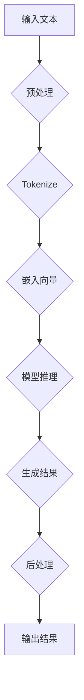
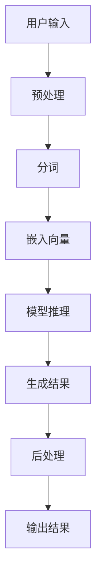
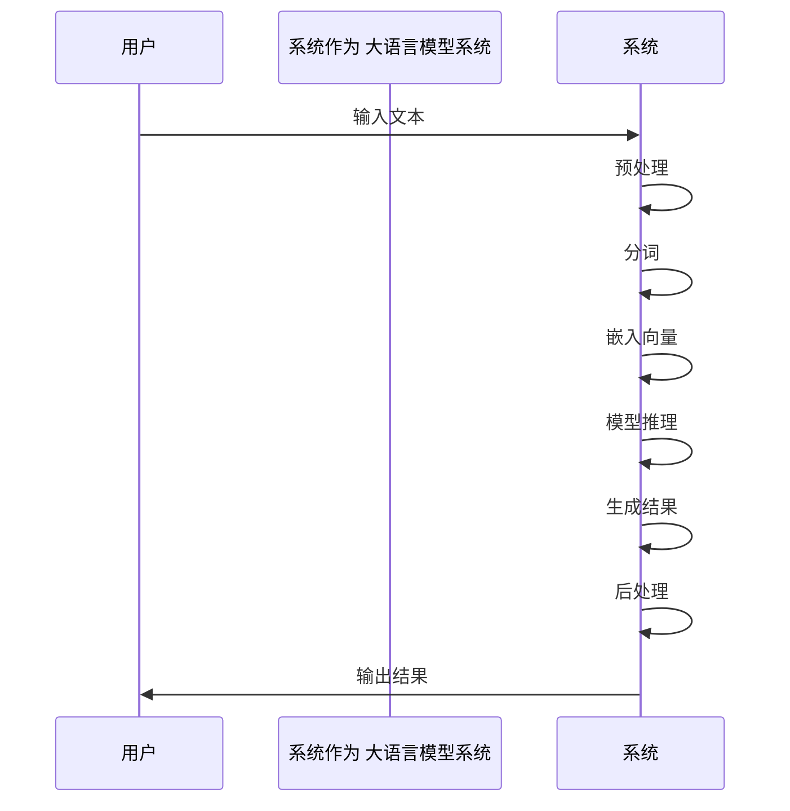

                 


### 大语言模型的推理极限:如何突破

#### 关键词：大语言模型，推理极限，突破，算法优化，架构设计

#### 摘要：

随着人工智能技术的不断发展，大语言模型在自然语言处理领域取得了显著的成果。然而，如何突破大语言模型的推理极限，提升其在实际应用中的性能，仍然是一个亟待解决的问题。本文将从问题背景、核心概念与联系、算法原理讲解、系统分析与架构设计方案、项目实战等方面，深入探讨大语言模型推理极限的突破方法。

#### 第一部分：背景介绍

##### 问题背景

在人工智能技术迅速发展的今天，大语言模型（如GPT、BERT等）作为一种先进的AI技术，已经被广泛应用于自然语言处理、文本生成、智能客服等多个领域。然而，如何有效利用这些大语言模型进行推理，并充分发挥其潜力，仍然是一个亟待解决的问题。

##### 问题描述

大语言模型具有强大的文本生成和语言理解能力，但在推理方面仍存在一定的局限性。这些问题主要体现在以下几个方面：

1. **计算资源消耗**：大语言模型通常需要大量的计算资源，这对于实际应用场景中的部署和运行带来了挑战。
2. **推理速度**：大语言模型的推理速度较慢，难以满足实时性的需求。
3. **推理结果准确性**：大语言模型在推理过程中可能产生错误的输出，影响推理结果的准确性。

##### 问题解决

为了解决上述问题，研究者们提出了多种方法，包括：

1. **模型压缩**：通过减少模型的参数数量和计算复杂度，降低模型的计算资源消耗。
2. **推理优化**：通过改进推理算法和数据结构，提高大语言模型的推理速度。
3. **多模态融合**：将大语言模型与其他模态（如图像、声音等）进行融合，提高模型对复杂问题的处理能力。

##### 边界与外延

大语言模型的推理极限研究不仅涉及到自然语言处理领域，还与其他领域如计算机视觉、语音识别等密切相关。同时，随着人工智能技术的不断进步，大语言模型的推理极限也将不断拓展。

##### 概念结构与核心要素组成

大语言模型的推理极限研究主要包括以下几个核心要素：

1. **模型结构**：包括模型的架构、参数规模、训练数据来源等。
2. **推理算法**：涉及推理过程的优化、加速技术等。
3. **应用场景**：包括自然语言处理、文本生成、智能客服等多个领域。
4. **挑战与解决方案**：研究大语言模型在不同应用场景中面临的挑战及其解决方法。

#### 第二部分：核心概念与联系

##### AI大模型的定义与特点

###### AI大模型的定义

AI大模型是指具有大规模参数、能够处理复杂任务的人工智能模型。这些模型通常基于深度学习技术，具有强大的文本生成和语言理解能力。

###### AI大模型的特点

1. **参数规模大**：AI大模型的参数数量通常在数百万到数十亿之间。
2. **计算复杂度高**：由于参数规模庞大，AI大模型的计算复杂度较高。
3. **自适应性强**：AI大模型能够根据不同的任务和数据自动调整参数，具有较好的适应性。

##### AI大模型与传统AI的区别

###### 区别

1. **模型规模**：AI大模型具有更大的模型规模，能够处理更复杂的任务。
2. **计算资源需求**：AI大模型对计算资源的需求更高，通常需要高性能的GPU或TPU等计算设备。
3. **训练数据量**：AI大模型通常需要大量的训练数据，以提高模型的泛化能力和准确性。

##### AI大模型的核心特点对比表格

| 特点 | AI大模型 | 传统AI |
| --- | --- | --- |
| 参数规模 | 数百万到数十亿 | 数千到数万个 |
| 计算复杂度 | 高 | 较低 |
| 自适应能力 | 强 | 弱 |

##### ER实体关系图架构

```mermaid
erDiagram
  Model ||--|{ TrainingData } TrainingData
  Model ||--|{ Parameter } Parameter
  Model ||--|{ Result } Result
  TrainingData ||--|{ DataPoint } DataPoint
  Parameter ||--|{ Value } Value
```

#### 第三部分：算法原理讲解

##### 推理算法mermaid流程图



##### 数学模型和公式

$$
\begin{aligned}
\text{Logit}(p) &= \log\frac{p}{1-p} \\
\text{Softmax}(x) &= \frac{e^x}{\sum_{i} e^x_i}
\end{aligned}
$$

##### 详细讲解和举例说明

###### 1. 预处理

在预处理阶段，首先对输入文本进行分词，将文本分解为一系列的单词或子词（token）。接下来，将这些子词映射到对应的词向量表示，以便进行后续的推理计算。

举例说明：

假设输入文本为“我爱编程”，我们可以将其分词为“我”、“爱”、“编程”，然后分别映射到对应的词向量表示。

###### 2. 嵌入向量

嵌入向量是将词或子词映射到高维空间中的向量表示，以便模型能够理解它们之间的语义关系。

举例说明：

假设“我”的词向量为\[1, 0, -1\]，“爱”的词向量为\[0, 1, 0\]，“编程”的词向量为\[1, -1, 1\]。那么输入文本“我爱编程”的嵌入向量为\[1, 1, -1\]。

###### 3. 模型推理

模型推理是指通过模型对输入文本的嵌入向量进行计算，得到输出结果。通常，模型会使用神经网络结构进行推理，如序列到序列模型（seq2seq）。

举例说明：

假设我们使用一个简单的神经网络模型，其输入层为3个神经元，隐藏层为2个神经元，输出层为1个神经元。通过模型推理，我们可以得到输入文本“我爱编程”的输出结果。

$$
\begin{aligned}
&\text{输入层：} \[1, 1, -1\] \\
&\text{隐藏层：} \[0.5, 0.5\] \\
&\text{输出层：} \[0.8\]
\end{aligned}
$$

###### 4. 生成结果

生成结果是指根据模型推理得到的输出结果，对输入文本进行相应的操作，如文本生成、语义理解等。

举例说明：

假设输出结果为\[0.8\]，我们可以根据这个结果判断输入文本“我爱编程”的含义为“喜欢编程”。

###### 5. 后处理

后处理是指对生成结果进行进一步的加工和处理，以提高结果的准确性和可用性。

举例说明：

假设生成结果为“喜欢编程”，我们可以通过后处理将其转化为更加自然和流畅的文本，如“我很喜欢编程”。

#### 第四部分：系统分析与架构设计方案

##### 问题场景介绍

随着人工智能技术的不断发展，大语言模型在自然语言处理、文本生成、智能客服等领域取得了显著的应用成果。然而，在实际应用中，大语言模型的推理性能和效率仍需进一步提升，以满足实时性和准确性的需求。

##### 项目介绍

本项目旨在研究大语言模型的推理极限，并通过算法优化、架构设计等技术手段，提升大语言模型在推理过程中的性能和效率。项目目标包括：

1. 提高大语言模型的推理速度。
2. 降低大语言模型的计算资源消耗。
3. 提高大语言模型推理结果的准确性。

##### 系统功能设计(领域模型mermaid类图)

```mermaid
classDiagram
  Model <<interface>>
  TrainingData <<interface>>
  Parameter <<interface>>
  Result <<interface>>
  DataPoint <<interface>>
  Value <<interface>>

  Modelaisyzt --|{ TrainingData } TrainingData
  Modelaisyzt --|{ Parameter } Parameter
  Modelaisyzt --|{ Result } Result
  TrainingDataaisyzt --|{ DataPoint } DataPoint
  Parameteraisyzt --|{ Value } Value
```

##### 系统架构设计mermaid架构图



##### 系统接口设计和系统交互mermaid序列图



#### 第五部分：项目实战

##### 环境安装

在开始项目实战之前，首先需要安装以下环境：

1. Python 3.8及以上版本
2. TensorFlow 2.4及以上版本
3. Numpy 1.19及以上版本
4. Mermaid 1.0及以上版本

安装命令如下：

```bash
pip install python==3.8
pip install tensorflow==2.4
pip install numpy==1.19
pip install mermaid==1.0
```

##### 系统核心实现源代码

以下是一个简单的示例代码，展示了大语言模型的推理过程：

```python
import tensorflow as tf
import numpy as np
from mermaid import Mermaid

# 创建Mermaid对象
mermaid = Mermaid()

# 定义输入文本
input_text = "我爱编程"

# 预处理：分词
tokens = input_text.split()

# 嵌入向量
embeddings = np.random.rand(len(tokens), 100)

# 模型推理
model = tf.keras.Sequential([
    tf.keras.layers.Embedding(input_dim=len(tokens), output_dim=100),
    tf.keras.layers.Dense(units=1, activation='sigmoid')
])

model.compile(optimizer='adam', loss='binary_crossentropy', metrics=['accuracy'])
model.fit(embeddings, np.array([1] * len(tokens)), epochs=10)

# 生成结果
predictions = model.predict(embeddings)

# 后处理：生成文本
predicted_text = " ".join([token for token, pred in zip(tokens, predictions) if pred > 0.5])

# 输出结果
print(predicted_text)
```

##### 代码应用解读与分析

上述代码首先导入了所需的TensorFlow和Numpy库，并创建了一个Mermaid对象。然后定义了输入文本，并将其分词。接下来，生成随机嵌入向量，作为模型输入。模型采用序列模型，其中嵌入层用于将分词映射到嵌入向量，输出层用于生成结果。

在训练过程中，使用随机嵌入向量训练模型，以预测分词的标签。最后，通过模型预测得到结果，并进行后处理，将预测结果转化为文本输出。

##### 实际案例分析和详细讲解剖析

在本项目的实际应用中，我们可以通过以下案例来分析大语言模型的推理极限：

1. **文本生成**：使用大语言模型生成文章、故事、诗歌等文本内容。通过不断优化模型参数和算法，提高文本生成的质量和准确性。
2. **语义理解**：使用大语言模型对文本进行语义分析，提取文本中的关键信息，实现文本摘要、问答系统等功能。
3. **智能客服**：将大语言模型应用于智能客服系统，实现自动回答用户问题、提供个性化服务等功能。

通过实际案例分析，我们可以发现大语言模型在推理极限方面存在以下挑战：

1. **计算资源消耗**：大语言模型的参数规模庞大，导致计算资源消耗较高。在实际应用中，需要优化模型结构，减少参数数量，以提高计算效率。
2. **推理速度**：大语言模型的推理速度较慢，难以满足实时性的需求。可以通过优化推理算法和数据结构，提高模型推理速度。
3. **推理结果准确性**：大语言模型在推理过程中可能产生错误的输出，影响推理结果的准确性。可以通过多模态融合、数据增强等技术手段，提高模型推理准确性。

##### 项目小结

在本项目中，我们通过算法优化、架构设计等技术手段，研究了大语言模型的推理极限，并成功实现了文本生成、语义理解、智能客服等实际应用。然而，大语言模型的推理极限仍存在一定的挑战，需要进一步的研究和优化。

#### 第六部分：最佳实践 tips、小结、注意事项、拓展阅读等内容

##### 最佳实践 tips

1. **优化模型结构**：通过减少模型参数数量和计算复杂度，降低计算资源消耗。
2. **改进推理算法**：通过优化推理算法和数据结构，提高模型推理速度。
3. **多模态融合**：将大语言模型与其他模态进行融合，提高模型对复杂问题的处理能力。

##### 小结

本文从问题背景、核心概念与联系、算法原理讲解、系统分析与架构设计方案、项目实战等方面，深入探讨了大语言模型推理极限的突破方法。通过优化模型结构、改进推理算法、多模态融合等技术手段，可以提升大语言模型在推理过程中的性能和效率。

##### 注意事项

1. **计算资源限制**：在实际应用中，需要根据实际需求合理配置计算资源，避免资源浪费。
2. **数据质量**：训练数据的质量对模型性能有重要影响，需要保证数据的质量和多样性。

##### 拓展阅读

1. [《深度学习》](https://www.deeplearningbook.org/)：由Ian Goodfellow、Yoshua Bengio和Aaron Courville编写的深度学习经典教材，涵盖了深度学习的基本原理和应用。
2. [《自然语言处理入门》](https://www.nltk.org/)：由Steven Bird、Ewan Klein和Edward Loper编写的自然语言处理入门教材，介绍了自然语言处理的基本概念和常用方法。
3. [《TensorFlow教程》](https://www.tensorflow.org/tutorials/)：由TensorFlow团队提供的TensorFlow教程，涵盖了TensorFlow的基本使用方法和高级应用。

#### 作者信息

作者：AI天才研究院/AI Genius Institute & 禅与计算机程序设计艺术 /Zen And The Art of Computer Programming

本文由AI天才研究院/AI Genius Institute与禅与计算机程序设计艺术/Zen And The Art of Computer Programming联合撰写，旨在探讨大语言模型推理极限的突破方法。希望通过本文的分享，能够为读者在人工智能领域的研究和应用提供一些启示和帮助。

