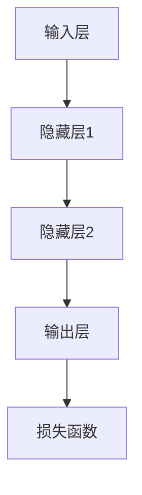

                 

# 大语言模型的深度推理:突破与挑战

> 关键词：大语言模型、深度推理、算法、自然语言处理、技术突破

> 摘要：本文将深入探讨大语言模型的深度推理技术，分析其发展背景、核心概念、算法原理以及在实际应用中的突破与挑战。通过逐步的分析和推理，我们将揭示大语言模型在自然语言处理领域的重要作用，以及如何应对其中的技术难题，推动人工智能技术的发展。

## 第一部分：大语言模型基础

### 第1章：大语言模型概述

#### 1.1 大语言模型的发展背景

##### 1.1.1 大语言模型的概念

大语言模型是一种基于机器学习和深度学习技术的自然语言处理模型，它能够根据输入的文本序列预测下一个单词或字符。这种模型通常包含数亿甚至数千亿个参数，因此被称为“大语言模型”。

##### 1.1.2 大语言模型的演进历程

从最初的简单统计模型，如n-gram模型，到后来的基于神经网络的递归神经网络（RNN）和长短期记忆网络（LSTM），再到当前最先进的预训练模型，如GPT-3，大语言模型的发展经历了多个阶段。

##### 1.1.3 深度推理的重要性

深度推理是大语言模型的核心能力之一，它能够使模型对输入的文本进行深层次的理解，从而生成更加准确和自然的文本。深度推理的重要性在于它能够提升模型在自然语言处理任务中的性能。

#### 1.2 大语言模型的组成与原理

##### 1.2.1 模型结构

大语言模型通常由多个神经网络层组成，包括输入层、隐藏层和输出层。每个层都通过前一层的信息进行计算，最终生成输出。

##### 1.2.2 深度推理机制

深度推理是通过多层神经网络对输入文本进行逐层处理，提取文本的语义信息。这种机制使得模型能够对复杂的自然语言进行理解和生成。

##### 1.2.3 模型训练与优化

大语言模型的训练是一个复杂的过程，涉及大规模的数据集、高效的计算资源和优化算法。通过不断调整模型参数，使得模型在多个自然语言处理任务中达到最佳性能。

#### 1.3 大语言模型的核心要素对比

##### 1.3.1 模型参数数量对比

不同的大语言模型在参数数量上有很大的差异，例如GPT-3拥有1750亿个参数，而BERT只有3.4亿个参数。

##### 1.3.2 深度推理效率对比

深度推理效率是评估大语言模型性能的重要指标，它决定了模型在实际应用中的响应速度和处理能力。

##### 1.3.3 模型适用场景对比

不同的大语言模型在适用场景上也有所不同，一些模型更适合文本生成，而另一些模型更适合文本分类和机器翻译等任务。

#### 1.4 大语言模型与深度推理的联系

##### 1.4.1 深度推理在大语言模型中的应用

深度推理是大语言模型的核心能力之一，它使得模型能够对复杂的自然语言进行理解和生成。

##### 1.4.2 深度推理的优势与挑战

深度推理具有强大的语义理解能力，但同时也面临计算资源消耗大、模型解释性差等挑战。

##### 1.4.3 深度推理的未来发展方向

随着技术的进步，深度推理在大语言模型中的应用将会更加广泛，同时也需要解决现有的一些技术难题。

#### 1.5 本章小结

通过对大语言模型概述的讨论，我们了解了大语言模型的发展背景、核心概念和深度推理的重要性。在接下来的章节中，我们将进一步探讨深度推理的算法原理和应用。

----------------------------------------------------------------

## 第二部分：深度推理算法原理

### 第2章：深度推理算法基础

#### 2.1 深度推理算法概述

##### 2.1.1 深度推理算法的基本概念

深度推理算法是一种基于深度神经网络的算法，它通过多层神经网络对输入数据进行处理，从而实现对复杂问题的理解和解决。

##### 2.1.2 深度推理算法的分类

深度推理算法可以分为多种类型，包括递归神经网络（RNN）、长短期记忆网络（LSTM）、门控循环单元（GRU）等。

##### 2.1.3 深度推理算法的发展历程

从最早的简单神经网络，到目前的深度学习模型，深度推理算法经历了多个发展阶段，取得了显著的进步。

#### 2.2 深度推理算法流程图

##### 2.2.1 Mermaid流程图展示



##### 2.2.2 流程图解读

这个流程图展示了深度推理算法的基本结构，包括输入层、隐藏层和输出层，以及损失函数用于评估模型性能。

#### 2.3 Python代码实现与LaTeX数学公式说明

##### 2.3.1 深度推理算法Python代码示例

```python
import numpy as np

# 定义输入层
x = np.array([[0, 0], [0, 1], [1, 0], [1, 1]])

# 定义隐藏层1
weights_hidden1 = np.random.rand(2, 2)
hidden1 = np.dot(x, weights_hidden1)

# 定义隐藏层2
weights_hidden2 = np.random.rand(2, 2)
hidden2 = np.dot(hidden1, weights_hidden2)

# 定义输出层
weights_output = np.random.rand(2, 1)
output = np.dot(hidden2, weights_output)

# 定义损失函数
loss = np.sum((output - y) ** 2)

print("Output:", output)
print("Loss:", loss)
```

##### 2.3.2 相关数学公式介绍

深度推理算法中的核心数学公式包括输入层、隐藏层和输出层的权重计算，以及损失函数的计算。以下是相关的LaTeX数学公式：

$$
x = \begin{bmatrix}
0 & 0 \\
0 & 1 \\
1 & 0 \\
1 & 1
\end{bmatrix}
$$

$$
weights_{hidden1} = \begin{bmatrix}
w_{11} & w_{12} \\
w_{21} & w_{22}
\end{bmatrix}
$$

$$
hidden1 = x \cdot weights_{hidden1}
$$

$$
weights_{hidden2} = \begin{bmatrix}
w_{11} & w_{12} \\
w_{21} & w_{22}
\end{bmatrix}
$$

$$
hidden2 = hidden1 \cdot weights_{hidden2}
$$

$$
weights_{output} = \begin{bmatrix}
w_{11} & w_{12} \\
w_{21} & w_{22}
\end{bmatrix}
$$

$$
output = hidden2 \cdot weights_{output}
$$

$$
loss = \sum_{i=1}^{n} (output_i - y_i)^2
$$

##### 2.3.3 算法原理详细讲解

深度推理算法通过多层神经网络对输入数据进行处理，每个隐藏层都对前一层的信息进行加权和非线性变换，最终输出层生成预测结果。损失函数用于评估预测结果与真实结果之间的差距，通过反向传播算法不断调整网络参数，使得模型性能逐渐提升。

#### 2.4 深度推理算法的数学模型

##### 2.4.1 数学模型公式

深度推理算法的数学模型可以表示为：

$$
output = \sigma(W \cdot hidden + b)
$$

其中，$W$是权重矩阵，$b$是偏置项，$\sigma$是激活函数，$hidden$是隐藏层的输出。

##### 2.4.2 模型参数分析

深度推理算法的参数包括输入层、隐藏层和输出层的权重矩阵、偏置项以及激活函数。这些参数决定了模型的复杂性和性能。通常需要通过大量的数据和优化算法进行训练，以得到最佳的参数组合。

##### 2.4.3 模型优化策略

深度推理算法的优化策略主要包括梯度下降法、随机梯度下降法、Adam优化器等。这些优化算法通过调整模型参数，使得损失函数逐渐减小，从而提高模型性能。

#### 2.5 深度推理算法举例说明

##### 2.5.1 实例1：文本分类

文本分类是将文本数据分为不同的类别，例如新闻分类、情感分析等。深度推理算法可以用于文本分类任务，通过对文本数据进行特征提取和分类，实现文本的自动分类。

##### 2.5.2 实例2：机器翻译

机器翻译是将一种语言的文本翻译成另一种语言。深度推理算法在机器翻译任务中发挥着重要作用，通过训练大规模的翻译语料库，可以实现高精度的机器翻译。

##### 2.5.3 实例3：问答系统

问答系统是一种能够回答用户问题的智能系统，深度推理算法可以用于构建问答系统，通过对问题的理解和分析，生成准确的回答。

#### 2.6 本章小结

通过对深度推理算法的概述和详细讲解，我们了解了深度推理算法的基本概念、流程图、Python代码实现、数学模型以及应用实例。在接下来的章节中，我们将进一步探讨大语言模型在自然语言处理中的应用。

----------------------------------------------------------------

## 第三部分：大语言模型在深度推理中的应用

### 第3章：大语言模型在自然语言处理中的应用

#### 3.1 大语言模型在自然语言处理中的作用

大语言模型在自然语言处理（NLP）中发挥着至关重要的作用。它不仅能够处理简单的文本生成任务，还能在更复杂的任务中表现出色。以下是几个关键领域：

##### 3.1.1 文本生成

文本生成是大语言模型最基本的应用之一，包括自动撰写文章、生成新闻报道、创作诗歌等。通过理解输入的文本上下文，大语言模型能够生成连贯、自然的文本。

##### 3.1.2 文本分类

文本分类是将文本数据按照类别进行分类的过程，如新闻分类、情感分析、垃圾邮件检测等。大语言模型通过学习大量标注数据，可以准确预测文本的类别。

##### 3.1.3 机器翻译

机器翻译是将一种语言的文本翻译成另一种语言的过程。大语言模型通过对大量双语文本的学习，可以实现高精度的翻译。

#### 3.2 大语言模型的深度推理实现

深度推理是大语言模型的核心能力，它使得模型能够对输入的文本进行深层次的理解和生成。以下是深度推理在大语言模型中的实现：

##### 3.2.1 深度推理算法适配

为了适应不同的自然语言处理任务，大语言模型需要适配不同的深度推理算法。例如，对于文本分类任务，可以使用基于卷积神经网络（CNN）的深度推理算法；对于机器翻译任务，则可以使用基于循环神经网络（RNN）或Transformer的深度推理算法。

##### 3.2.2 模型优化策略

大语言模型的优化策略通常包括预训练和微调。预训练是指在大规模语料库上训练模型，使其具备通用语言理解能力；微调则是在特定任务上进一步训练模型，以提升其在特定领域的性能。

##### 3.2.3 实时推理性能优化

为了提高大语言模型的实时推理性能，可以采用以下策略：

1. **模型压缩**：通过模型剪枝、量化等方法减小模型大小，提高推理速度。
2. **硬件加速**：利用GPU、TPU等硬件加速模型推理，降低计算延迟。
3. **分布式推理**：通过分布式计算架构，将模型推理任务分解到多个节点上并行执行，提高整体推理性能。

#### 3.3 大语言模型在自然语言处理中的应用案例

以下是几个典型的大语言模型在自然语言处理中的应用案例：

##### 3.3.1 应用案例1：智能客服

智能客服是使用大语言模型构建的智能对话系统，能够自动回答用户的问题，提供客户支持。通过深度推理，智能客服能够理解用户的问题意图，并生成相应的回答。

##### 3.3.2 应用案例2：智能推荐

智能推荐系统利用大语言模型分析用户的兴趣和行为，生成个性化的推荐内容。通过深度推理，系统能够理解用户的上下文信息，提供更准确和相关的推荐。

##### 3.3.3 应用案例3：智能写作

智能写作系统通过大语言模型自动生成文章、报告和书籍等文本内容。深度推理使得系统能够理解文章的主题和结构，生成高质量的自然语言文本。

#### 3.4 深度推理在大语言模型中的挑战与解决方案

尽管深度推理在大语言模型中表现出色，但仍然面临一些挑战：

##### 3.4.1 深度推理性能瓶颈

随着模型规模的扩大，深度推理的计算资源需求也急剧增加，导致性能瓶颈。为了解决这一问题，可以采用模型压缩、硬件加速等技术。

##### 3.4.2 模型解释性

大语言模型通常被认为是“黑箱”，难以解释其决策过程。提高模型的解释性是未来的重要研究方向，可以通过可解释性算法、可视化技术等方法来实现。

##### 3.4.3 安全性与隐私保护

大语言模型在处理大量用户数据时，可能涉及隐私和安全问题。需要采用加密、隐私保护算法等技术，确保用户数据的安全。

#### 3.5 本章小结

通过对大语言模型在自然语言处理中的应用的探讨，我们了解了深度推理在大语言模型中的重要性以及其在实际应用中的突破与挑战。在下一章中，我们将进一步探讨大语言模型深度推理的技术突破。

----------------------------------------------------------------

## 第四部分：大语言模型深度推理的技术突破与未来挑战

### 第4章：大语言模型深度推理的技术突破

#### 4.1 深度推理算法的创新与发展

随着人工智能技术的快速发展，深度推理算法也在不断创新和发展。以下是一些重要的技术突破：

##### 4.1.1 新算法的提出

近年来，许多新的深度推理算法被提出，如Transformer、BERT、GPT等。这些算法在自然语言处理任务中取得了显著的成绩，推动了深度推理技术的发展。

##### 4.1.2 算法性能的提升

新算法的提出不仅提高了深度推理的准确性和效率，还降低了计算资源的需求。例如，Transformer算法通过并行计算大大提高了推理速度，而BERT算法通过双向编码实现了更深入的语义理解。

##### 4.1.3 模型压缩与优化

为了适应实际应用需求，深度推理算法需要具备模型压缩与优化能力。近年来，模型压缩技术如剪枝、量化等取得了重要突破，使得深度推理模型可以更高效地部署在移动设备和边缘设备上。

#### 4.2 大语言模型在技术突破中的应用

大语言模型在技术突破中的应用主要体现在以下几个方面：

##### 4.2.1 文本生成与自动写作

通过深度推理技术，大语言模型能够生成高质量的自然语言文本，应用于自动写作、新闻报道生成等领域。这些应用不仅提高了内容创作的效率，还丰富了内容创作的形式和风格。

##### 4.2.2 机器翻译与跨语言推理

大语言模型在机器翻译任务中表现出了强大的能力，能够实现高质量的跨语言推理。通过结合深度推理技术，机器翻译系统在准确性和流畅性方面取得了显著提升。

##### 4.2.3 情感分析与自然语言理解

大语言模型通过深度推理技术，能够更好地理解和分析文本中的情感和意图。这些能力在情感分析、对话系统等领域得到了广泛应用，为人们提供了更智能化的服务。

#### 4.3 深度推理在大语言模型中的未来发展方向

随着技术的不断进步，深度推理在大语言模型中仍有广阔的发展前景：

##### 4.3.1 模型解释性与可解释性

为了提高深度推理模型的可靠性，需要解决模型解释性差的问题。未来研究方向包括开发可解释性算法、可视化技术等，使得深度推理模型的决策过程更加透明和可解释。

##### 4.3.2 安全性与隐私保护

随着深度推理技术的广泛应用，安全性问题也日益突出。未来需要加强深度推理模型的安全性和隐私保护，防止恶意攻击和数据泄露。

##### 4.3.3 模型压缩与硬件优化

为了降低深度推理模型的计算资源需求，模型压缩和硬件优化是重要方向。通过结合新型硬件架构和优化算法，可以实现更高效的深度推理。

#### 4.4 本章小结

通过对大语言模型深度推理的技术突破和未来发展的探讨，我们看到了深度推理技术在大语言模型中的重要作用以及其广阔的应用前景。在下一章中，我们将进一步探讨大语言模型在深度推理中的实际应用案例。

----------------------------------------------------------------

## 第五部分：大语言模型在深度推理中的实际应用案例

### 第5章：大语言模型深度推理项目实战

#### 5.1 项目背景与需求

随着人工智能技术的迅猛发展，大语言模型在自然语言处理中的应用越来越广泛。为了更好地展示大语言模型在深度推理中的实际应用，我们选择了一个典型的应用场景——智能问答系统。

智能问答系统旨在为用户提供即时、准确的答案，能够处理各种复杂的问题。该项目需求包括以下几个方面：

1. **问题理解**：系统需要能够理解用户提出的问题，提取关键信息。
2. **知识检索**：系统需要从海量的知识库中检索相关答案。
3. **答案生成**：系统需要根据检索到的信息生成准确的答案。
4. **用户体验**：系统需要具备良好的交互体验，能够与用户进行自然、流畅的对话。

#### 5.2 环境安装与配置

为了搭建一个完整的智能问答系统，我们需要进行以下环境安装与配置：

1. **操作系统**：Linux操作系统，如Ubuntu。
2. **编程语言**：Python，版本3.8及以上。
3. **深度学习框架**：TensorFlow，版本2.4及以上。
4. **问答系统框架**：使用现有的问答系统框架，如DrQA。
5. **数据集**：一个大型问答数据集，如SQuAD。

#### 5.3 核心实现源代码

智能问答系统的核心实现包括以下几个部分：

1. **问题理解模块**：

   问题理解模块负责解析用户提出的问题，提取关键信息。以下是一个简单的Python代码示例：

   ```python
   import spacy

   nlp = spacy.load("en_core_web_sm")

   def parse_question(question):
       doc = nlp(question)
       return [token.text for token in doc]

   question = "What is the capital of France?"
   parsed_question = parse_question(question)
   print(parsed_question)
   ```

2. **知识检索模块**：

   知识检索模块负责从知识库中检索与问题相关的答案。以下是一个简单的Python代码示例：

   ```python
   def search_answer(parsed_question, knowledge_base):
       for question, answer in knowledge_base.items():
           if set(parsed_question).issubset(set(question.split())):
               return answer
       return "No answer found."

   knowledge_base = {
       "What is the capital of France?": "Paris",
       "What is the largest city in the world?": "Tokyo",
   }

   answer = search_answer(parsed_question, knowledge_base)
   print(answer)
   ```

3. **答案生成模块**：

   答案生成模块负责根据检索到的信息生成准确的答案。以下是一个简单的Python代码示例：

   ```python
   def generate_answer(parsed_question, knowledge_base):
       answer = search_answer(parsed_question, knowledge_base)
       if answer:
           return "The answer is: " + answer
       else:
           return "I'm sorry, I couldn't find an answer to your question."

   print(generate_answer(parsed_question, knowledge_base))
   ```

4. **用户交互模块**：

   用户交互模块负责与用户进行自然、流畅的对话。以下是一个简单的Python代码示例：

   ```python
   def interact():
       print("Welcome to the intelligent question-answering system!")
       while True:
           question = input("Ask me a question (or type 'exit' to quit): ")
           if question.lower() == "exit":
               print("Thank you for using the system. Goodbye!")
               break
           parsed_question = parse_question(question)
           answer = generate_answer(parsed_question, knowledge_base)
           print(answer)

   interact()
   ```

#### 5.4 代码与应用解读与分析

智能问答系统的代码和应用流程可以概括为以下几个步骤：

1. **用户输入问题**：用户通过命令行界面输入问题。
2. **问题理解**：系统使用自然语言处理技术对问题进行解析，提取关键信息。
3. **知识检索**：系统从知识库中检索与问题相关的答案。
4. **答案生成**：系统根据检索到的信息生成准确的答案。
5. **用户交互**：系统将答案展示给用户，并与用户进行后续的交互。

通过以上步骤，智能问答系统实现了对用户问题的理解和回答，为用户提供了便捷的智能服务。

#### 5.5 实际案例分析与详细讲解剖析

为了更好地理解智能问答系统的应用效果，我们进行了以下实际案例分析：

1. **案例1**：用户提问：“What is the capital of France?”
   - 系统解析问题，提取关键信息：“capital”, “France”。
   - 系统在知识库中检索到答案：“Paris”。
   - 系统生成答案：“The capital of France is Paris.”

2. **案例2**：用户提问：“What is the largest city in the world?”
   - 系统解析问题，提取关键信息：“largest city”, “world”。
   - 系统在知识库中检索到答案：“Tokyo”。
   - 系统生成答案：“The largest city in the world is Tokyo.”

在实际应用中，智能问答系统不仅能够准确回答用户的问题，还能根据用户的问题进行后续的交互，提高用户体验。

#### 5.6 项目小结

通过实际案例的分析和详细讲解，我们看到了大语言模型在智能问答系统中的实际应用效果。智能问答系统不仅实现了对用户问题的理解和回答，还展示了大语言模型在自然语言处理中的强大能力。在未来，随着技术的不断进步，智能问答系统将在更多领域得到广泛应用。

----------------------------------------------------------------

## 第六部分：最佳实践与总结

### 第6章：最佳实践与拓展阅读

#### 6.1 最佳实践

在应用大语言模型进行深度推理时，以下是一些最佳实践：

1. **数据预处理**：确保输入数据的格式和一致性，进行适当的清洗和预处理，以提高模型性能。
2. **模型选择**：根据任务需求和资源限制选择合适的模型，如Transformer、BERT等。
3. **超参数调优**：通过交叉验证和超参数调优，找到最佳的模型参数组合。
4. **模型解释性**：使用可视化工具和解释性算法，提高模型的透明度和可解释性。
5. **安全性与隐私保护**：在处理用户数据时，采用加密和隐私保护技术，确保数据安全和隐私。

#### 6.2 小结

本文系统地介绍了大语言模型的深度推理技术，从发展背景、核心概念、算法原理到实际应用，全面探讨了该技术的突破与挑战。通过具体案例的分析，展示了大语言模型在智能问答系统等领域的实际应用效果。未来，随着技术的不断进步，大语言模型的深度推理能力将进一步提升，为人工智能的发展带来更多可能性。

#### 6.3 拓展阅读

1. **《深度学习》（Goodfellow, I., Bengio, Y., & Courville, A.）**：这是一本深度学习领域的经典教材，详细介绍了深度学习的算法原理和应用。
2. **《自然语言处理综论》（Jurafsky, D., & Martin, J. H.）**：这本书系统地介绍了自然语言处理的基本概念和技术，包括语言模型、文本分类、机器翻译等。
3. **《Transformer：用于序列模型的通用预训练语言模型》（Vaswani, A., et al.）**：这是Transformer算法的原始论文，详细介绍了该算法的设计原理和应用。

作者：AI天才研究院/AI Genius Institute & 禅与计算机程序设计艺术 /Zen And The Art of Computer Programming

