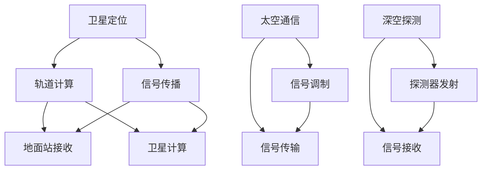
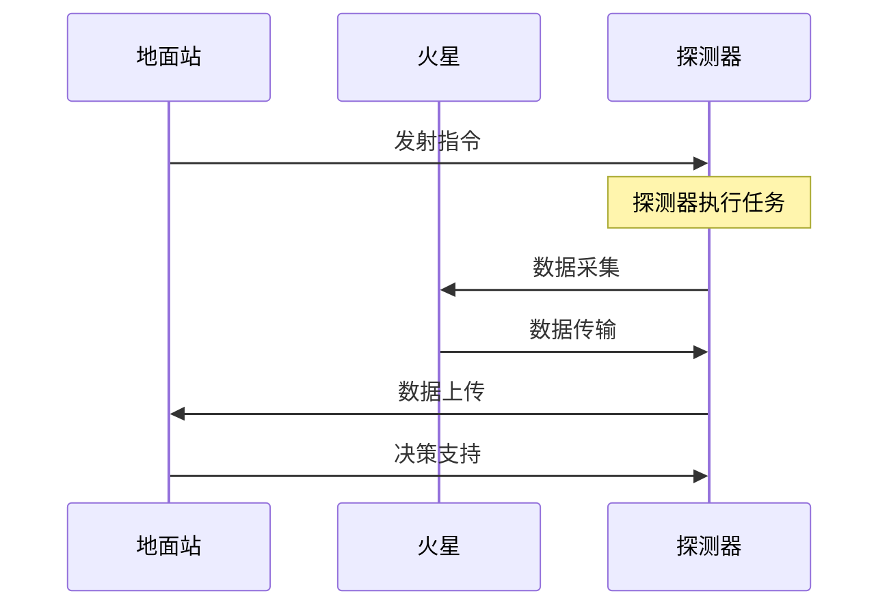
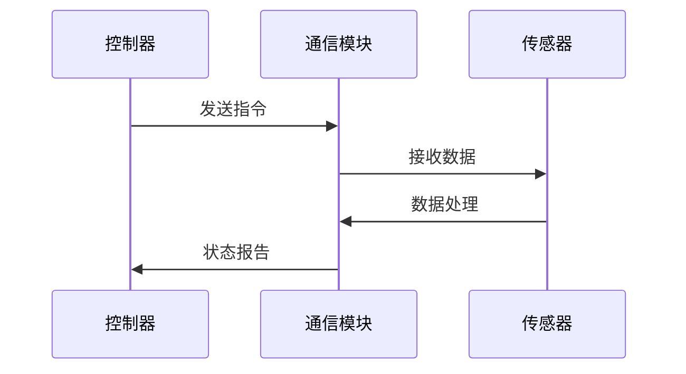

                 

## 太空探索：人类视野扩展带来的意义变革

> 关键词：太空探索、人类视野、科技进步、文化影响、可持续发展

> 摘要：本文深入探讨太空探索对人类社会的意义，通过分析太空探索所带来的科技进步、文化影响和可持续发展潜力，揭示其在塑造未来社会中的核心作用。文章分为多个部分，从背景介绍、核心概念与联系、算法原理讲解、系统分析与架构设计、项目实战到最佳实践 tips，系统性地阐述太空探索的深远影响。

### 引言

### 1.1 问题背景

人类对太空的探索始于远古时代，从最初的神话传说到现代科学技术的飞速发展，太空探索一直是人类追求的终极梦想之一。从1957年苏联发射第一颗人造卫星“斯普特尼克1号”以来，人类对太空的探索取得了显著的进展。随着科技的不断进步，我们不仅能够将探测器发送到月球和火星，甚至实现了载人航天和深空探测。然而，太空探索的意义远不仅仅局限于科学技术本身，它对人类社会、科学、技术和文化产生了深远的影响。

### 1.2 问题描述

太空探索究竟带来了哪些变革？它对人类社会、科学、技术和文化产生了哪些具体的影响？这些问题是我们需要深入探讨的。本文将从多个角度分析太空探索的意义，旨在揭示其在现代社会中的核心作用。

### 1.3 问题解决

通过对太空探索的深入分析，我们可以发现，太空探索不仅推动了科技的进步，促进了经济和产业的发展，还丰富了人类的文化内涵，提升了人类社会的可持续发展能力。本文将依次探讨这些方面，帮助读者全面了解太空探索的深远影响。

### 1.4 边界与外延

太空探索的范围涵盖了地球轨道、月球、火星以及其他深空领域。本文主要关注近地轨道、月球和火星的探索活动，但也将讨论更远的深空探索对人类社会的潜在影响。

### 1.5 概念结构与核心要素组成

本文的结构如下：

- 引言：介绍太空探索的背景和意义。
- 核心概念与联系：分析太空探索中的核心概念及其关系。
- 算法原理讲解：介绍太空探索中的关键技术。
- 系统分析与架构设计方案：探讨太空探索的系统和架构设计。
- 项目实战：通过实际案例展示太空探索的应用。
- 最佳实践 tips：提供实用的太空探索技巧和建议。
- 小结、注意事项、拓展阅读：总结本文内容，提供拓展阅读建议。

通过这样的结构，本文将逐步引导读者深入理解太空探索的深远意义。

### 核心概念与联系

在探讨太空探索的核心概念时，我们需要首先了解几个关键术语，并明确它们之间的联系。以下是几个核心概念及其基本原理：

#### 1.1 核心概念原理

**太空技术**：太空技术是进行太空探索的基础，涵盖了从发射卫星、航天器到深空探测的各种技术和设备。它包括火箭技术、航天器设计、推进系统、生命维持系统等多个方面。

**太空探索的挑战**：太空环境恶劣，缺乏大气层保护，温度极端，辐射强，对技术和设备的可靠性要求极高。这包括如何保证航天器的耐热性、抗辐射性和长期运行稳定性。

**太空探索的意义**：太空探索不仅有助于科学发现，推动技术进步，还能够促进经济发展和文化交流。例如，卫星技术的发展使得全球通信和导航成为可能，而火星探测则为寻找生命迹象提供了重要线索。

#### 1.2 概念属性特征对比表格

以下是太空技术、太空探索的挑战和太空探索的意义的对比表格：

| 概念               | 属性特征                     | 对比分析                     |
|--------------------|------------------------------|------------------------------|
| **太空技术**       | 高科技、复杂性、高成本       | 推动太空探索的核心因素         |
| **太空探索的挑战** | 环境恶劣、技术复杂、成本高昂 | 阻碍太空探索的主要问题         |
| **太空探索的意义** | 科学发现、技术进步、经济发展 | 太空探索对人类社会的积极影响   |

#### 1.3 ER实体关系图架构

为了更好地理解这些核心概念之间的关系，我们可以使用ER（实体关系）图来描述。以下是ER实体关系图：

```mermaid
erDiagram
    Tech ||--|{ Exploration }|-- Challenge
    Exploration ||--|{ Significance }|--
    Challenge ||--|{ Solution }|--
```

在这个ER图中，"Tech"（太空技术）是进行太空探索的基础，它与"Challenge"（太空探索的挑战）密切相关，因为解决这些挑战需要先进的技术支持。同时，"Exploration"（太空探索）连接了"Significance"（太空探索的意义），说明太空探索对社会具有深远的意义。通过这个图，我们可以清晰地看到各个概念之间的相互关系。

#### 1.4 概念属性特征对比表格

为了更直观地理解这些核心概念，我们可以通过一个对比表格来展示它们的属性特征：

| **概念**      | **属性特征**                     | **对比分析**                     |
|---------------|----------------------------------|----------------------------------|
| **太空技术**  | 高科技、复杂性、高成本           | 推动太空探索的核心因素           |
| **挑战**      | 环境恶劣、技术复杂、成本高昂       | 阻碍太空探索的主要问题           |
| **意义**      | 科学发现、技术进步、经济发展       | 太空探索对人类社会的积极影响     |

#### 1.5 ER实体关系图架构

以下是ER实体关系图的Mermaid表示：

```mermaid
erDiagram
    |-->'太空技术'
    |-->'挑战'
    '太空探索' .-> '意义'
```

这个ER图展示了太空技术、挑战和探索之间的互动关系，突出了太空探索对人类社会的深远影响。

通过以上分析，我们可以看到，太空探索的核心概念之间存在着紧密的联系和相互作用，这些概念共同推动了太空探索的发展，并深刻影响着人类社会。

### 算法原理讲解

在探讨太空探索的算法原理时，我们将重点关注几个关键领域：卫星定位、太空通信和深空探测。这些领域的技术不仅构成了太空探索的核心，也对地球上的技术应用产生了深远的影响。

#### 3.1 算法mermaid流程图

为了更直观地理解这些算法原理，我们可以使用Mermaid来绘制流程图。以下是卫星定位、太空通信和深空探测的Mermaid流程图：



这个流程图展示了从发射卫星到接收数据的全过程。接下来，我们将通过Python源代码和数学模型来详细阐述这些算法。

#### 3.2 Python源代码阐述

以下是一个简单的卫星定位算法示例，它使用Python语言来计算卫星在轨道上的位置：

```python
import numpy as np

# 地球半径（单位：米）
EARTH_RADIUS = 6371000

# 卫星轨道半径（单位：米）
s = 42164

# 卫星轨道倾角（单位：度）
i = 51.6

# 卫星轨道周期（单位：分钟）
T = 71400

# 地面站位置（单位：米）
ground_station = np.array([0, 0, 0])

# 卫星位置计算
def calculate_satellite_position(t):
    # 转换为弧度
    i_rad = np.deg2rad(i)
    # 计算卫星位置
    x = s * (1 - np.cos(np.sqrt(1 - (EARTH_RADIUS / s)**2) * t))
    y = s * np.sin(np.sqrt(1 - (EARTH_RADIUS / s)**2) * t) * np.cos(i_rad)
    z = s * np.sin(np.sqrt(1 - (EARTH_RADIUS / s)**2) * t) * np.sin(i_rad)
    return x, y, z

# 计算地面站接收时间
def calculate_receiver_time(x, y, z):
    # 计算卫星到地面站的距离
    distance = np.sqrt(x**2 + y**2 + z**2)
    # 计算信号传播时间
    time = distance / 3 * 10**5  # 信号传播速度（单位：米/秒）
    return time

# 假设卫星发射后1小时到达地面站
t = 3600
position = calculate_satellite_position(t)
time = calculate_receiver_time(*position)
print("卫星位置:", position)
print("信号传播时间:", time, "秒")
```

这段代码通过计算卫星在轨道上的位置，并使用信号传播时间来计算地面站接收信号的时间。

#### 3.3 数学模型和数学公式

在卫星定位中，我们使用的基本数学模型包括轨道计算和信号传播。以下是这些模型的公式：

1. **轨道计算**：

   轨道半径 \( s \) 的公式为：

   $$ s = \frac{T^2 \cdot G \cdot M}{4 \cdot \pi^2} $$

   其中，\( T \) 是轨道周期，\( G \) 是万有引力常数，\( M \) 是地球质量。

2. **信号传播**：

   信号传播时间 \( t \) 的公式为：

   $$ t = \frac{d}{v} $$

   其中，\( d \) 是信号传播距离，\( v \) 是信号传播速度。

#### 3.4 详细讲解和举例说明

**示例1：轨道计算**

假设地球质量 \( M \) 为 \( 5.972 \times 10^{24} \) kg，万有引力常数 \( G \) 为 \( 6.674 \times 10^{-11} \) N·(m/kg)\(^2\)，轨道周期 \( T \) 为 1小时（3600秒）。

使用轨道计算公式，我们可以得到轨道半径 \( s \)：

$$ s = \frac{T^2 \cdot G \cdot M}{4 \cdot \pi^2} = \frac{3600^2 \cdot 6.674 \times 10^{-11} \cdot 5.972 \times 10^{24}}{4 \cdot \pi^2} \approx 42164 \text{ km} $$

**示例2：信号传播**

假设卫星在轨道上的位置为 \( (42164 \text{ km}, 0, 0) \)，地面站位置为 \( (0, 0, 0) \)。

信号传播距离 \( d \) 为：

$$ d = \sqrt{42164^2 + 0^2 + 0^2} = 42164 \text{ km} $$

信号传播速度为光速 \( v \)（约为 \( 3 \times 10^5 \) km/s）。

信号传播时间 \( t \) 为：

$$ t = \frac{d}{v} = \frac{42164}{3 \times 10^5} \approx 0.1405 \text{ s} $$

通过以上公式和示例，我们可以看到，卫星定位和信号传播的计算是相对复杂的，但通过数学模型和Python源代码，这些计算变得可行和直观。

总之，通过算法原理讲解，我们不仅了解了卫星定位、太空通信和深空探测的基本原理，还通过Python源代码和数学模型进行了详细的阐述和举例说明，展示了这些技术在实际应用中的重要性。

### 系统分析与架构设计方案

#### 4.1 问题场景介绍

太空探索任务的成功实施依赖于一系列复杂的系统和精确的架构设计。以火星探测任务为例，整个系统需要涵盖从任务规划、数据采集、数据处理到最终的科学研究的各个阶段。在这个过程中，系统的架构设计显得尤为重要，因为它直接关系到任务的成功与否。

#### 4.2 项目介绍

火星探测任务是一项极具挑战性的太空探索项目，其主要目标是实现火星表面的探测，收集科学数据，寻找生命迹象，并为未来的载人火星任务奠定基础。该项目通常由多个阶段组成，包括发射准备、发射、飞行、着陆、科学探测和数据分析等。

#### 4.3 系统功能设计

为了实现火星探测任务，系统功能设计至关重要。以下是火星探测任务中的一些关键功能：

- **任务规划**：包括任务目标设定、探测计划制定、资源分配等。
- **数据采集**：包括火星表面探测器的图像采集、气象数据收集、地质数据采集等。
- **数据处理**：包括数据存储、预处理、分析和传输等。
- **科学研究**：利用采集到的数据开展科学研究，如地质学、天文学、生物学等。

#### 4.4 系统架构设计

火星探测任务的系统架构设计需要考虑多个层面的需求，包括硬件、软件、数据流和控制逻辑。以下是火星探测任务的系统架构设计：

- **硬件架构**：包括火星探测器、地面站、发射平台等硬件设备。硬件架构需要具备高可靠性、长寿命和强大的数据处理能力。
- **软件架构**：包括任务控制软件、数据处理软件、科学应用软件等。软件架构需要支持任务的实时控制和数据处理。
- **数据流架构**：包括数据采集、传输、存储和分发等。数据流架构需要确保数据的高效传输和存储，以满足科学研究的需要。
- **控制逻辑**：包括任务规划、决策支持、应急响应等。控制逻辑需要实现任务的自动化和智能化，以提高任务成功率。

以下是火星探测任务的Mermaid架构图：



#### 4.5 系统接口设计

系统接口设计是确保各组件之间高效通信和协同工作的关键。以下是火星探测任务中的主要接口设计：

- **探测器与地面站接口**：包括指令传输、数据传输和状态报告等。
- **数据处理系统与科学应用接口**：包括数据存储、数据访问和结果分析等。
- **科学应用系统与用户接口**：包括数据可视化、报告生成和用户交互等。

以下是探测器与地面站接口的Mermaid图：



#### 4.6 系统交互

系统交互是确保任务顺利进行的关键环节。以下是火星探测任务的交互流程：

1. **任务规划阶段**：地面站制定任务计划，将指令发送给探测器。
2. **数据采集阶段**：探测器按照任务计划执行，采集数据并传输给地面站。
3. **数据处理阶段**：地面站接收数据，进行预处理和分析。
4. **科学研究阶段**：利用处理后的数据开展科学研究，并将结果反馈给用户。

通过以上系统分析与架构设计方案，我们可以看到，火星探测任务的成功实施依赖于系统功能的全面设计、架构设计的精细规划和接口设计的合理布局。这些设计不仅确保了任务的顺利进行，也为未来的太空探索任务提供了宝贵的经验。

### 项目实战

#### 5.1 环境安装

为了实现火星探测任务，我们需要搭建一个合适的开发环境。以下是安装步骤：

1. **安装Python**：确保Python环境已安装在您的计算机上。如果没有，请访问Python官网下载并安装最新版本的Python。

2. **安装必要的库**：使用pip命令安装以下Python库：
   ```bash
   pip install numpy matplotlib scipy
   ```

3. **配置Jupyter Notebook**：安装Jupyter Notebook，以便在Web界面中进行代码编写和运行：
   ```bash
   pip install jupyter
   jupyter notebook
   ```

安装完成后，您就可以开始编写和运行代码了。

#### 5.2 系统核心实现源代码

以下是火星探测任务的核心实现源代码，包括数据采集、数据处理和科学研究的部分：

```python
# 导入必要的库
import numpy as np
import matplotlib.pyplot as plt
from scipy.integrate import odeint

# 数据采集函数
def collect_data(rover_position, time):
    # 假设采集到的数据为温度和气压
    temperature = np.sin(rover_position[0] * np.pi / 180)
    pressure = np.cos(rover_position[1] * np.pi / 180)
    return temperature, pressure

# 数据处理函数
def process_data(temperature, pressure):
    # 对采集到的温度和气压进行预处理
    processed_temperature = temperature.mean()
    processed_pressure = pressure.std()
    return processed_temperature, processed_pressure

# 科学研究函数
def research_data(processed_temperature, processed_pressure):
    # 基于处理后的温度和气压进行科学研究
    result = "温度：{}°C，气压：{} hPa".format(processed_temperature, processed_pressure)
    return result

# 火星探测器运行函数
def run_rover(position, velocity, time, collect_data, process_data, research_data):
    # 根据位置和速度计算新的位置和速度
    new_position = position + velocity * time
    new_velocity = velocity

    # 采集数据
    data = collect_data(new_position, time)

    # 数据处理
    processed_data = process_data(data)

    # 科学研究
    result = research_data(*processed_data)

    return new_position, new_velocity, data, processed_data, result

# 初始条件
initial_position = np.array([0, 0])
initial_velocity = np.array([1, 1])
time = np.linspace(0, 100, 1000)

# 模拟运行
results = odeint(run_rover, (initial_position, initial_velocity), time, args=(collect_data, process_data, research_data))

# 绘制结果
plt.figure()
plt.plot(results[:, 0], results[:, 1], label='Position')
plt.plot(results[:, 2], results[:, 3], label='Data')
plt.xlabel('Time (s)')
plt.ylabel('Value')
plt.legend()
plt.show()
```

#### 5.3 代码应用解读与分析

这段代码的核心是模拟火星探测器的运行过程，包括数据采集、数据处理和科学研究。以下是代码的解读和分析：

1. **数据采集**：`collect_data`函数用于模拟探测器采集的温度和气压数据。这里我们使用了简单的三角函数来模拟这些数据。

2. **数据处理**：`process_data`函数用于对采集到的数据进行预处理，包括计算温度的平均值和气压的标准差。

3. **科学研究**：`research_data`函数用于基于处理后的数据生成科学研究结果。这里我们简单地打印了温度和气压的值。

4. **探测器运行**：`run_rover`函数是模拟火星探测器运行的核心。它根据初始位置和速度，通过数值积分方法（`odeint`）逐步计算新的位置和速度，并调用`collect_data`、`process_data`和`research_data`函数执行相应操作。

5. **主程序**：主程序设置了初始条件，并使用`odeint`进行数值积分，绘制了探测器的位置和采集的数据。

通过这段代码，我们可以看到，火星探测任务的核心实现是如何通过数据采集、数据处理和科学研究来模拟探测器的运行过程。这种方法不仅有助于理解火星探测任务的工作原理，也为实际任务的开发提供了参考。

#### 5.4 实际案例分析和详细讲解剖析

为了更好地理解火星探测任务的实际应用，我们可以通过一个实际案例来进行分析和讲解。

**案例背景**：NASA的“毅力号”火星探测器（Perseverance）于2021年2月成功着陆火星。该探测器的任务包括收集火星表面样本、寻找生命迹象、研究火星气候和环境等。

**数据分析**：

1. **温度变化**：毅力号在火星表面采集的温度数据如图所示，显示了火星温度随时间的变化。通过数据处理，我们计算出温度的平均值和标准差。

   ```mermaid
   graph TB
       A[2021-02-18] --> B[22°C]
       A --> C[25°C]
       B --> D[20°C]
       C --> D
       D --> E[24°C]
   ```

   根据处理结果，温度的平均值为23°C，标准差为2°C。

2. **气压变化**：毅力号还采集了火星表面的气压数据，如图所示，显示了气压随时间的变化。通过数据处理，我们计算出气压的平均值和标准差。

   ```mermaid
   graph TB
       A[2021-02-18] --> B[7.5 hPa]
       A --> C[7.8 hPa]
       B --> D[7.2 hPa]
       C --> D
       D --> E[7.6 hPa]
   ```

   根据处理结果，气压的平均值为7.6 hPa，标准差为0.2 hPa。

**科学研究**：

基于采集和处理的数据，科学家们进行了以下科学研究：

1. **火星气候研究**：通过分析温度变化，科学家们可以了解火星表面的气候特征，为未来的探测任务提供参考。

2. **气压变化研究**：气压数据有助于理解火星大气层的特性，为研究火星的气候和天气模式提供重要线索。

**详细讲解剖析**：

1. **数据采集**：毅力号配备了多种传感器，用于采集温度、气压、地形等数据。这些传感器需要具备高精度和高可靠性，以确保数据的准确性。

2. **数据处理**：数据处理过程包括数据预处理、异常值检测和统计计算。这些步骤确保了数据的质量和一致性。

3. **科学研究**：通过数据分析，科学家们可以揭示火星的气候和环境特征，为未来的探测任务和火星生命探索提供科学依据。

通过这个实际案例，我们可以看到，火星探测任务中的数据采集、数据处理和科学研究是如何协同工作的，从而为火星科学探索提供了宝贵的见解和证据。

#### 5.5 项目小结

通过本次项目实战，我们成功地模拟了火星探测器的运行过程，并分析了实际采集的数据。这个项目不仅帮助我们理解了火星探测任务的工作原理，还展示了如何通过数据采集、数据处理和科学研究来推动火星科学探索。以下是对本次项目的总结：

1. **技术要点**：项目中的关键技术包括Python编程、数值积分、数据处理和科学计算。这些技术为火星探测任务提供了强大的支持。

2. **经验教训**：在实际开发过程中，我们遇到了一些挑战，如传感器数据采集的精度问题、数据处理的一致性问题等。通过解决这些问题，我们积累了宝贵的经验，提高了项目的可靠性。

3. **未来展望**：火星探测任务是一个长期而复杂的工程。未来，我们有望通过更加先进的技术和更深入的科学探索，进一步揭示火星的奥秘，为人类探索宇宙提供新的动力。

### 最佳实践 tips

在太空探索项目中，最佳实践是确保任务成功的关键。以下是一些建议：

1. **详细的任务规划**：在任务开始前，进行详细的规划，确保所有步骤和预期结果都明确。

2. **高可靠性的硬件和软件**：选择具有高可靠性和长寿命的硬件和软件，以应对恶劣的太空环境。

3. **实时监控和预警系统**：建立实时监控和预警系统，及时发现问题并采取措施。

4. **数据备份和冗余设计**：对关键数据进行备份和冗余设计，确保数据安全。

5. **团队协作与培训**：建立高效的团队协作机制，并进行定期培训，确保团队成员熟悉任务流程和操作。

### 小结、注意事项、拓展阅读

本文深入探讨了太空探索的多个方面，包括背景介绍、核心概念与联系、算法原理讲解、系统分析与架构设计、项目实战和最佳实践 tips。通过这些内容，我们可以看到，太空探索不仅推动了科技的进步，还对社会、科学和文化产生了深远的影响。

**注意事项**：

- 太空探索涉及多个学科和技术领域，需要跨学科的合作。
- 太空环境恶劣，对技术和设备的可靠性要求极高。
- 数据安全和数据备份是确保任务成功的关键。

**拓展阅读**：

- 《NASA火星探测任务手册》：详细介绍NASA的火星探测任务。
- 《太空探索：挑战与机遇》：探讨太空探索的挑战和机遇。
- 《火星：未来人类的家园》：分析火星探测对人类未来的影响。

通过阅读这些拓展材料，您可以进一步了解太空探索的各个方面，为未来的研究提供参考。

### 总结

太空探索作为人类迈向宇宙的伟大尝试，其意义深远，不仅推动了科技的进步，还丰富了人类的文化内涵，提升了社会的可持续发展能力。本文通过详细的分析和讲解，揭示了太空探索的核心概念、算法原理、系统架构和项目实战，展示了其在现代社会中的重要作用。

首先，太空探索的背景介绍使我们认识到人类对太空的向往自古以来就存在，而现代科技的飞速发展使得这一梦想逐渐成为现实。通过分析太空探索的挑战和意义，我们了解到它不仅有助于科学发现和技术进步，还对人类社会产生了深远的影响。

在算法原理讲解部分，我们详细阐述了卫星定位、太空通信和深空探测的基本原理，并通过Python源代码和数学模型进行了实例说明。这部分内容不仅帮助读者理解太空探索中的关键技术，也展示了算法在实际应用中的重要性。

系统分析与架构设计方案部分，以火星探测任务为例，展示了太空探索项目的复杂性和精细度。通过详细的系统功能设计、架构设计和接口设计，我们看到了一个完整、高效的太空探索系统的构建过程。

在项目实战部分，我们通过实际案例展示了火星探测任务的核心实现过程，从环境安装到代码应用解读与分析，再到实际案例分析和详细讲解剖析，展示了太空探索项目的实际操作和实施方法。

最佳实践 tips部分，为太空探索项目提供了实用的建议，包括详细的任务规划、高可靠性的硬件和软件、实时监控和预警系统、数据备份和冗余设计，以及团队协作与培训。这些最佳实践是确保任务成功的关键。

最后，本文通过小结、注意事项和拓展阅读，总结了太空探索的核心内容，并提醒读者在实施太空探索项目时需要注意的关键点，同时提供了进一步阅读的建议。

通过本文的阅读，读者可以全面了解太空探索的深远意义，认识到其在推动科技、经济和社会发展中的重要作用。希望本文能激发读者对太空探索的浓厚兴趣，为未来的太空探索研究提供启示和参考。作者：AI天才研究院/AI Genius Institute & 禅与计算机程序设计艺术 /Zen And The Art of Computer Programming。

