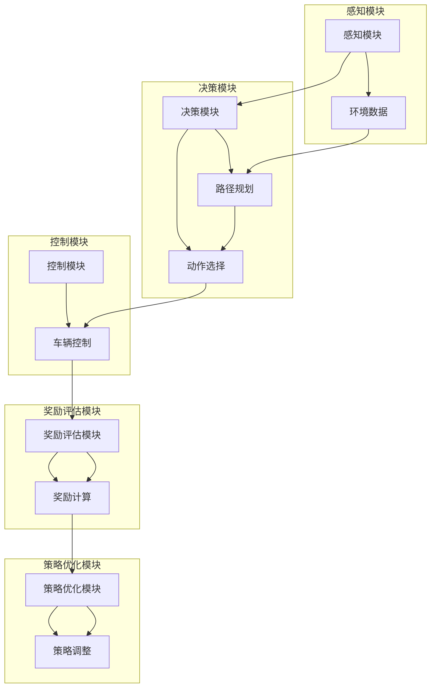
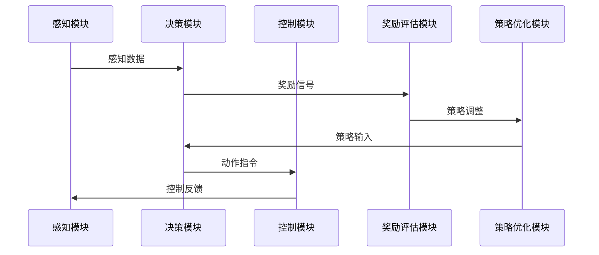

                 


**背景介绍**

# 第一部分：背景介绍

## 1.1 问题背景

### 1.1.1 当前人工智能的发展状况

人工智能（Artificial Intelligence，简称AI）是计算机科学的一个分支，旨在通过机器学习、神经网络、自然语言处理等技术，使机器能够执行原本需要人类智能才能完成的任务。随着深度学习算法和大数据技术的不断发展，人工智能的应用范围日益扩大，从简单的语音识别、图像识别到自动驾驶、智能客服等复杂场景，都取得了显著的进展。

近年来，人工智能的发展呈现出以下几个特点：

1. **算法的进步**：深度学习算法如卷积神经网络（CNN）、循环神经网络（RNN）和生成对抗网络（GAN）等，使得机器能够处理更复杂的任务，并且性能不断提高。
2. **计算资源的提升**：云计算和GPU技术的快速发展，为人工智能算法提供了强大的计算能力，使得更多复杂的模型得以实现。
3. **数据的积累**：随着互联网的普及，数据量呈指数级增长，为机器学习算法提供了丰富的训练数据，推动了人工智能技术的进步。
4. **应用的广泛性**：人工智能技术已经渗透到各个行业，如医疗、金融、教育、交通等，提高了行业效率和生产力。

### 1.1.2 奖励模型的概念及其重要性

奖励模型（Reward Model）在人工智能中扮演着至关重要的角色，特别是在强化学习（Reinforcement Learning，简称RL）领域。强化学习是一种机器学习范式，其目标是让机器通过与环境的交互来学习最优策略，以便最大化累积奖励。

奖励模型是一种用于评估机器行为质量的函数，它根据机器的行为（动作）和环境的状态，提供相应的奖励信号。这个奖励信号可以指导机器学习算法如何调整策略，以便在未来的决策中取得更好的效果。

奖励模型的重要性体现在以下几个方面：

1. **决策指导**：奖励模型为机器学习算法提供了一个明确的决策指导，帮助机器在复杂的环境中做出更好的决策。
2. **学习效率**：一个设计良好的奖励模型可以提高机器学习算法的学习效率，减少不必要的探索。
3. **泛化能力**：奖励模型的设计对机器学习的泛化能力有重要影响，一个具有良好泛化能力的奖励模型可以帮助机器在新的环境中表现优异。
4. **应用范围**：奖励模型不仅用于强化学习，还可以应用于其他机器学习任务，如监督学习和无监督学习，使其成为人工智能研究中的重要组成部分。

### 1.1.3 奖励模型在任务中的应用现状

奖励模型已经在多种任务中得到了广泛应用，以下是几个典型的应用场景：

1. **游戏**：在游戏AI中，奖励模型用于评估玩家的行为和游戏状态，帮助游戏AI制定更好的策略。
2. **机器人**：在机器人领域，奖励模型用于指导机器人的动作决策，使其能够在复杂的物理环境中完成任务。
3. **自动驾驶**：在自动驾驶中，奖励模型用于评估车辆的驾驶行为，帮助车辆在复杂的交通环境中做出安全的决策。
4. **自然语言处理**：在自然语言处理任务中，奖励模型用于评估文本生成的质量，帮助模型生成更符合人类语言习惯的文本。
5. **医疗诊断**：在医疗诊断中，奖励模型用于评估诊断结果的质量，帮助模型提高诊断的准确性。

尽管奖励模型在许多任务中表现出色，但其泛化能力仍面临挑战。本文旨在探讨奖励模型在不同类型任务中的泛化能力，并提出相应的解决方案。

## 1.2 问题描述

### 1.2.1 奖励模型泛化的挑战

奖励模型的泛化能力是指其能够在不同的任务和环境中表现优异的能力。然而，在实际应用中，奖励模型面临着以下泛化挑战：

1. **任务差异**：不同任务具有不同的特点和要求，奖励模型需要适应这些差异，以便在不同任务中都能表现良好。
2. **环境变化**：环境的变化可能导致奖励模型无法适应，从而影响其泛化能力。
3. **数据分布**：训练数据集的分布可能与实际应用环境的数据分布不一致，导致奖励模型在新的环境中表现不佳。
4. **模型复杂性**：奖励模型的复杂度越高，其泛化能力越可能受到限制，因为复杂的模型难以适应多样化的任务和环境。

### 1.2.2 泛化能力的重要性

奖励模型的泛化能力对其应用前景至关重要。一个具有良好泛化能力的奖励模型可以在多种任务和环境中表现出色，从而提高人工智能系统的整体效能。具体来说，泛化能力的重要性体现在以下几个方面：

1. **降低开发成本**：具有良好泛化能力的奖励模型可以减少在每种任务中重新设计和训练模型的需求，降低开发成本。
2. **提高应用范围**：泛化能力使得奖励模型可以应用于更广泛的任务，从而扩大人工智能技术的应用范围。
3. **增强鲁棒性**：泛化能力良好的奖励模型能够适应不同的任务和环境，提高系统的鲁棒性，降低在特定环境中失效的风险。
4. **提高用户体验**：泛化能力良好的奖励模型可以在不同场景下提供一致且优异的表现，从而提高用户体验。

### 1.2.3 研究目的与意义

本文的研究目的在于探讨奖励模型在不同类型任务中的泛化能力，分析其面临的挑战，并提出相应的解决方案。具体来说，本文将：

1. **系统分析奖励模型的泛化能力**：通过分析奖励模型在不同任务中的应用，探讨其泛化能力的现状和挑战。
2. **提出泛化能力提升的方法**：结合现有研究成果，提出能够提高奖励模型泛化能力的方法和技术。
3. **验证方法的有效性**：通过实际案例验证所提出方法的有效性，并提供具体的改进建议。

本文的研究对于推动人工智能技术的发展具有重要意义。通过深入研究奖励模型的泛化能力，可以为人工智能系统的设计和应用提供理论指导，促进人工智能技术的普及和应用。

## 1.3 问题解决

### 1.3.1 奖励模型的工作原理

奖励模型在强化学习中的核心作用是提供反馈信号，指导学习过程。一个典型的奖励模型包括以下几个组成部分：

1. **状态（State）**：状态是描述环境当前状态的变量集合。在强化学习中，状态可以是离散的，如游戏中的棋盘状态，也可以是连续的，如自动驾驶中的车辆位置和速度。
2. **动作（Action）**：动作是机器可以采取的行为。在强化学习中，动作可以是离散的，如游戏中的移动方向，也可以是连续的，如自动驾驶中的油门和刹车力度。
3. **奖励（Reward）**：奖励是模型在执行特定动作后从环境中获得的即时奖励信号。奖励可以是正的，表示模型采取的动作是有益的，也可以是负的，表示动作是有害的。
4. **策略（Policy）**：策略是模型在给定状态下选择动作的规则。在强化学习中，策略通常是通过学习过程动态调整的。

奖励模型的工作原理可以概括为以下几个步骤：

1. **状态观测**：模型首先观测到当前状态。
2. **动作选择**：根据当前状态和策略，模型选择一个动作。
3. **执行动作**：模型在环境中执行所选动作，并根据动作的结果更新状态。
4. **奖励反馈**：环境根据模型执行的动作提供相应的奖励信号。
5. **策略更新**：模型根据奖励信号更新策略，以便在未来的决策中取得更好的效果。

### 1.3.2 奖励模型在不同任务中的应用

奖励模型在强化学习中的广泛应用得益于其在多种任务中的优异表现。以下是一些典型的应用场景：

1. **游戏**：在游戏AI中，奖励模型可以用于评估玩家的行为和游戏状态，帮助游戏AI制定更好的策略。例如，在围棋游戏中，奖励模型可以评估棋盘上的局势，指导AI进行落子决策。
2. **机器人**：在机器人领域，奖励模型可以用于指导机器人的动作决策，使其能够在复杂的物理环境中完成任务。例如，机器人可以在执行搬运任务时，通过奖励模型评估动作的准确性和效率，从而调整动作策略。
3. **自动驾驶**：在自动驾驶中，奖励模型用于评估车辆的驾驶行为，帮助车辆在复杂的交通环境中做出安全的决策。例如，自动驾驶车辆可以评估当前路况、车辆距离和行驶速度，通过奖励模型指导驾驶行为。
4. **自然语言处理**：在自然语言处理任务中，奖励模型可以用于评估文本生成的质量，帮助模型生成更符合人类语言习惯的文本。例如，在机器翻译中，奖励模型可以评估翻译结果的准确性和流畅性，从而优化翻译策略。
5. **医疗诊断**：在医疗诊断中，奖励模型可以用于评估诊断结果的质量，帮助模型提高诊断的准确性。例如，在疾病检测中，奖励模型可以评估检测结果的相关性和可靠性，从而优化诊断策略。

### 1.3.3 奖励模型泛化的方法与技术

为了提高奖励模型在不同任务中的泛化能力，研究者们提出了多种方法和技术。以下是一些主要的方法：

1. **元学习（Meta-Learning）**：元学习旨在通过快速学习多个任务来提高模型的泛化能力。在元学习中，模型通过在一个多样化的任务集合上训练，学习到一种通用的策略，从而在新的任务中表现出良好的泛化能力。
2. **迁移学习（Transfer Learning）**：迁移学习是一种将已在一个任务上训练好的模型的知识迁移到新任务上的方法。通过利用已有模型的知识，迁移学习可以减少新任务的训练时间，提高模型的泛化能力。
3. **多任务学习（Multi-Task Learning）**：多任务学习通过同时训练多个相关任务来提高模型的泛化能力。多任务学习利用不同任务之间的相关性，使得模型能够更好地适应新的任务。
4. **强化学习算法改进**：研究者们还通过改进强化学习算法本身，提高奖励模型的泛化能力。例如，通过使用深度强化学习算法、基于价值的策略优化算法等，可以更好地适应不同的任务和环境。

通过以上方法和技术，奖励模型在不同任务中的泛化能力得到了显著提升，为人工智能技术的发展提供了新的方向。

### 1.4 边界与外延

#### 1.4.1 研究的范围

本文的研究范围主要涉及奖励模型在不同类型任务中的泛化能力。具体包括以下内容：

1. **任务类型**：本文主要探讨奖励模型在游戏、机器人、自动驾驶、自然语言处理和医疗诊断等典型任务中的应用。
2. **模型类型**：本文将分析不同类型的奖励模型，包括基于深度学习、基于强化学习的奖励模型等。
3. **泛化方法**：本文将探讨元学习、迁移学习、多任务学习和强化学习算法改进等提高奖励模型泛化能力的方法。

#### 1.4.2 研究的限制

本文研究存在以下限制：

1. **数据限制**：由于篇幅和资源限制，本文无法涵盖所有可能的任务和奖励模型，只能选取具有代表性的任务进行分析。
2. **算法限制**：本文仅探讨了几种常见的泛化方法，其他可能的方法和技术未能详尽分析。
3. **实际应用限制**：本文主要关注奖励模型的泛化能力，但未涉及具体应用场景中的实现细节和优化策略。

#### 1.4.3 研究的核心要素组成

本文的核心要素包括：

1. **奖励模型原理**：介绍奖励模型的基本概念、组成部分和工作原理。
2. **任务应用分析**：分析奖励模型在不同类型任务中的应用现状和挑战。
3. **泛化方法探讨**：探讨元学习、迁移学习、多任务学习和强化学习算法改进等泛化方法。
4. **案例分析**：通过实际案例验证所提出方法的有效性，并提供改进建议。

通过以上核心要素的阐述，本文旨在为奖励模型的泛化能力研究提供新的思路和参考。

## 1.5 总结

### 1.5.1 奖励模型的重要性

奖励模型在强化学习中的核心作用不可忽视。它不仅为机器提供了明确的决策指导，还直接影响学习效率和泛化能力。一个设计良好的奖励模型可以显著提高机器在不同任务中的表现，从而推动人工智能技术的发展。

### 1.5.2 研究目的与意义

本文旨在探讨奖励模型在不同类型任务中的泛化能力，分析其面临的挑战，并提出解决方案。通过深入研究奖励模型，我们可以为人工智能系统的设计和应用提供理论指导，推动人工智能技术的普及和应用。

### 1.5.3 下一步工作方向

未来的研究可以在以下几个方面展开：

1. **泛化方法的优化**：进一步探索和优化元学习、迁移学习、多任务学习和强化学习算法，提高奖励模型的泛化能力。
2. **实际应用验证**：通过更多的实际案例验证所提出方法的有效性，并将其应用到更广泛的领域。
3. **跨领域研究**：探讨奖励模型在跨领域任务中的应用，如将游戏AI的经验应用到机器人控制和自动驾驶等领域。

通过不断探索和改进，我们有信心在未来实现更具有泛化能力的奖励模型，为人工智能技术的发展注入新的动力。

---

**核心概念与联系**

# 第二部分：核心概念与联系

## 2.1 奖励模型原理

### 2.1.1 奖励模型的定义

奖励模型（Reward Model）是强化学习中的一个关键组成部分，它负责为机器提供关于其行为结果的评价。在强化学习中，奖励模型通常是一个函数，用于评估机器在某一个状态下执行某个动作后获得奖励的大小。这个奖励信号对于指导机器选择最优策略至关重要。

### 2.1.2 奖励模型的核心特点

奖励模型具有以下几个核心特点：

1. **即时性**：奖励模型通常提供即时反馈，即机器在每个时间步（time step）后都能获得相应的奖励信号。
2. **适应性**：奖励模型可以根据任务和环境的特点进行定制，以便更好地适应特定场景。
3. **可塑性**：奖励模型是可训练的，可以通过经验调整其参数，以提高其预测和评价能力。
4. **可解释性**：理想情况下，奖励模型应该具有一定的可解释性，使人类能够理解其评价依据。

### 2.1.3 奖励模型与相关技术的对比

奖励模型与其他机器学习技术有一定的关联性，但它们在目标和方法上有所不同：

1. **监督学习**：监督学习中的目标函数是基于已知的输入输出对进行训练，而奖励模型则是基于奖励信号来指导策略调整。
2. **无监督学习**：无监督学习关注数据本身的结构，不依赖于外部奖励信号，而奖励模型则依赖于奖励信号来引导学习过程。
3. **基于价值的策略优化**：在基于价值的策略优化中，目标函数是最大化预期奖励，而奖励模型则为每个动作提供了具体的奖励值。
4. **生成对抗网络（GAN）**：GAN通过对抗性训练生成数据，其目标并非最大化奖励，而是通过生成和判别网络之间的对抗性交互产生高质量的数据。

## 2.2 概念属性特征对比表格

以下是一个简单的奖励模型与其他机器学习技术的概念属性特征对比表格：

| 概念         | 目标                    | 使用数据           | 结果评估方式           | 关键特点                           |
|--------------|-------------------------|--------------------|------------------------|------------------------------------|
| 奖励模型     | 最大化累积奖励          | 状态-动作对         | 累积奖励               | 即时反馈、适应性、可塑性、可解释性 |
| 监督学习     | 最小化预测误差         | 标签化的输入输出对   | 预测误差               | 已知输入输出对、数据驱动           |
| 无监督学习   | 发现数据结构           | 未标记的数据         | 数据分布               | 自组织、无监督                      |
| 基于价值的策略优化 | 最大化预期奖励         | 状态-动作对         | 预期奖励               | 值函数、策略迭代                   |
| 生成对抗网络（GAN） | 生成与判别之间的对抗   | 未标记的数据         | 数据质量               | 对抗性训练、生成高质量数据         |

通过上述对比，我们可以看出，奖励模型在强化学习中的应用特点使其在动态决策中具有独特的优势。

## 2.3 ER实体关系图架构

为了更清晰地展示奖励模型与其他相关技术的联系，我们使用实体关系图（Entity-Relationship Diagram，ERD）来描述其架构。以下是奖励模型的核心实体及其关系：

```mermaid
erDiagram
    Action ||--o{ State : 状态与动作的关系}
    Action ||--o{ Reward : 动作与奖励的关系}
    State ||--|{ Environment : 状态与环境的互动}
    Reward ||--|{ Policy : 奖励与策略的关联}
    Policy ||--o{ Agent : 策略与代理的互动}

    Agent ||--|{ Action : 代理与动作的决策}
    Agent ||--|{ State : 代理与状态的观测}
    Agent ||--|{ Reward : 代理与奖励的反馈}

    Action ||..|{ Supervised Learning : 动作与监督学习的关联}
    State ||..|{ Unsupervised Learning : 状态与无监督学习的关联}
    Reward ||..|{ Value-based Policy Optimization : 奖励与价值策略优化的关联}
    Policy ||..|{ Generative Adversarial Networks : 策略与生成对抗网络的互动}
```

这个ER图展示了奖励模型在强化学习中的核心实体及其相互关系，包括代理（Agent）、动作（Action）、状态（State）、奖励（Reward）和策略（Policy）。同时，也展示了奖励模型与其他机器学习技术的关联，如监督学习、无监督学习、基于价值的策略优化和生成对抗网络。

通过上述核心概念与联系的探讨，我们为后续深入分析奖励模型在不同任务中的泛化能力奠定了基础。

## 2.4 奖励模型的数学模型与公式

### 2.4.1 奖励模型的基本数学模型

奖励模型在强化学习中的应用通常涉及以下基本数学模型：

$$
\text{Reward Model} = f(\text{State}, \text{Action}, \theta)
$$

其中，$f$ 是奖励模型函数，它根据当前的状态（State）和动作（Action）以及模型的参数（$\theta$）来计算奖励（Reward）。$\theta$ 代表模型的参数，这些参数通常是通过学习过程动态调整的。

### 2.4.2 奖励模型参数更新公式

在强化学习中，奖励模型参数的更新通常是基于梯度下降方法。参数更新的公式可以表示为：

$$
\Delta \theta = \eta \cdot \nabla_\theta J(\theta)
$$

其中，$\eta$ 是学习率（Learning Rate），$\nabla_\theta J(\theta)$ 是损失函数 $J(\theta)$ 关于参数 $\theta$ 的梯度。这个更新公式通过不断迭代，使模型的参数逐渐优化，以最大化累积奖励。

### 2.4.3 模型优化目标函数

在强化学习中，优化目标函数通常是以累积奖励为基础的。目标函数 $J(\theta)$ 可以表示为：

$$
J(\theta) = \sum_{t=0}^{T} \gamma^t r_t
$$

其中，$r_t$ 是在时间步 $t$ 获得的即时奖励，$T$ 是总的动作序列长度，$\gamma$ 是折扣因子（Discount Factor），它用于权衡即时奖励和未来奖励的重要性。这个目标函数的目的是最大化累积奖励，从而找到最优策略。

### 2.4.4 数学公式的示例说明

以下是一个简单的示例来说明上述数学公式的应用。假设我们有一个简单的奖励模型，该模型在给定一个状态和动作后返回一个奖励值。状态空间为 $S = \{0, 1\}$，动作空间为 $A = \{0, 1\}$。我们定义一个简单的奖励模型函数 $f(s, a) = s + a$。初始状态下，参数 $\theta$ 为 0。学习率为 0.1。

- **状态**：$s = 0$
- **动作**：$a = 1$
- **即时奖励**：$r = f(0, 1) = 0 + 1 = 1$

在时间步 $t=1$，我们计算梯度：

$$
\nabla_\theta J(\theta) = \nabla_\theta \sum_{t=0}^{1} \gamma^t r_t = \nabla_\theta (1) = 1
$$

然后更新参数：

$$
\Delta \theta = 0.1 \cdot 1 = 0.1
$$

更新后的参数为：

$$
\theta_{\text{new}} = \theta_{\text{old}} + \Delta \theta = 0 + 0.1 = 0.1
$$

通过上述迭代过程，奖励模型的参数逐渐优化，从而提高其在特定任务中的表现。

### 2.4.5 数学公式在代码中的应用

以下是一个简单的 Python 代码示例，演示了如何实现上述数学公式：

```python
import numpy as np

# 初始化参数
theta = 0
learning_rate = 0.1
gamma = 1

# 奖励模型函数
def reward_model(s, a, theta):
    return s + a + theta

# 计算梯度
def compute_gradient(theta, s, a, r):
    return 1

# 参数更新
def update_theta(theta, gradient, learning_rate):
    return theta + learning_rate * gradient

# 主循环
for t in range(10):  # 假设进行10次迭代
    s = 0  # 当前状态
    a = 1  # 当前动作
    r = reward_model(s, a, theta)  # 计算即时奖励
    gradient = compute_gradient(theta, s, a, r)  # 计算梯度
    theta = update_theta(theta, gradient, learning_rate)  # 更新参数

print(f"最终参数：{theta}")
```

在这个示例中，我们使用 Python 代码实现了奖励模型的参数更新过程，通过不断迭代，使得参数逐渐优化，从而实现最大化累积奖励的目标。

通过以上数学模型和公式的讲解，我们可以更好地理解奖励模型的工作原理，并在实际应用中加以利用。

## 2.5 系统分析与架构设计方案

### 5.1 问题场景介绍

在探讨奖励模型在不同任务中的泛化能力时，我们需要考虑一个具体的应用场景，以便更好地理解其实现过程和挑战。以下是一个典型的应用场景介绍：

#### 应用场景：自动驾驶

自动驾驶是一个复杂且多变的领域，涉及环境感知、路径规划、决策控制等多个环节。在这个场景中，奖励模型可以用于评估车辆的驾驶行为，指导车辆在复杂的交通环境中做出安全的决策。

#### 系统需求分析

为了在自动驾驶中应用奖励模型，系统需要满足以下需求：

1. **环境感知**：系统需要具备强大的环境感知能力，包括道路识别、障碍物检测、交通标志识别等，以便获取当前环境的状态。
2. **路径规划**：系统需要能够根据环境状态生成最优路径，确保车辆能够安全、高效地行驶。
3. **决策控制**：系统需要能够根据当前状态和路径规划结果，选择最优动作，例如加速、减速、转向等。
4. **奖励评估**：系统需要具备奖励评估能力，对车辆的动作提供即时反馈，以指导车辆在未来做出更好的决策。

### 5.2 系统功能设计

在自动驾驶系统中，奖励模型需要实现以下功能：

1. **状态识别**：根据环境感知模块提供的数据，识别当前车辆所处的状态，包括速度、位置、道路类型、交通状况等。
2. **动作选择**：根据当前状态，选择最优动作，以实现车辆的安全行驶和目标路径的遵循。
3. **奖励计算**：对执行的动作进行奖励计算，根据动作的效果和环境的变化，提供即时奖励信号。
4. **策略优化**：根据累积奖励和历史动作，调整策略，以提高未来动作的预期奖励。

#### 领域模型Mermaid类图

为了更好地理解自动驾驶系统中的奖励模型，我们可以使用Mermaid类图来展示系统的领域模型。以下是一个简单的Mermaid类图示例：

```mermaid
classDiagram
    Class01 <|-- Class02
    Class03 <.. Class04
    Class05 <-.. Class06

    Class01 : +int x
    Class01 : +int y
    Class01 : +void setX(int x)
    Class01 : +void setY(int y)

    Class02 : +int a
    Class02 : +int b
    Class02 : +void setA(int a)
    Class02 : +void setB(int b)

    Class03 : +int x
    Class03 : +int y
    Class03 : +void setX(int x)
    Class03 : +void setY(int y)

    Class04 : +int c
    Class04 : +int d
    Class04 : +void setC(int c)
    Class04 : +void setD(int d)

    Class05 : +int x
    Class05 : +int y
    Class05 : +void setX(int x)
    Class05 : +void setY(int y)

    Class06 : +int e
    Class06 : +int f
    Class06 : +void setE(int e)
    Class06 : +void setF(int f)
```

在这个示例中，我们展示了四个类（Class01, Class02, Class03, Class04）和两个接口（Class05, Class06）的领域模型。这些类和接口分别代表了自动驾驶系统中的不同组件，如状态识别模块、动作选择模块、奖励计算模块和策略优化模块。通过这个类图，我们可以清晰地看到各个模块之间的关系和功能。

### 5.3 系统架构设计

为了实现上述功能，自动驾驶系统的整体架构可以分为以下几个部分：

1. **感知模块**：负责获取环境数据，如道路信息、障碍物位置和交通状况。
2. **决策模块**：根据感知模块提供的数据，生成路径规划和动作决策。
3. **控制模块**：根据决策模块生成的动作决策，控制车辆的实际行驶。
4. **奖励评估模块**：评估车辆执行动作后的奖励，为策略优化提供反馈。
5. **策略优化模块**：根据奖励评估结果，调整策略，以提高未来动作的预期奖励。

以下是一个简单的Mermaid架构图示例，展示了自动驾驶系统的整体架构：



在这个架构图中，各个模块通过数据流和接口进行交互。感知模块获取环境数据，决策模块根据数据生成路径规划和动作选择，控制模块根据决策结果控制车辆，奖励评估模块对动作效果进行评估，策略优化模块根据评估结果调整策略。

### 5.4 系统接口设计

在自动驾驶系统中，各个模块之间的接口设计至关重要。以下是一些关键的接口设计：

1. **感知接口**：提供环境数据输入接口，如摄像头图像、激光雷达数据和GPS信息。
2. **决策接口**：提供路径规划和动作选择结果输出接口，如最优路径和动作指令。
3. **控制接口**：提供车辆控制信号输出接口，如油门、刹车和转向指令。
4. **奖励接口**：提供奖励信号输入接口，如动作成功与否的即时奖励。
5. **策略接口**：提供策略调整输入接口，如策略优化结果和历史数据。

以下是一个简单的Mermaid接口设计示例：



在这个序列图中，感知模块将数据传递给决策模块，决策模块生成动作指令并传递给控制模块，同时将奖励信号传递给奖励评估模块。奖励评估模块根据奖励信号调整策略，并将其反馈给决策模块，从而形成一个闭环控制过程。

### 5.5 系统交互

在自动驾驶系统中，各个模块之间的交互至关重要。以下是一个简单的Mermaid序列图示例，展示了系统的主要交互过程：


在这个序列图中，感知模块获取环境数据并传递给决策模块，决策模块根据数据生成动作指令，并将其传递给控制模块。同时，决策模块将奖励信号传递给奖励评估模块，奖励评估模块根据奖励信号调整策略，并将其反馈给决策模块。控制模块根据动作指令控制车辆，并将控制反馈传递给感知模块，从而形成一个闭环控制过程。

通过上述系统分析与架构设计方案，我们可以更好地理解自动驾驶系统中奖励模型的实现过程和架构设计。这为我们在其他任务中应用奖励模型提供了有益的参考和指导。

## 6.1 环境安装

在开始项目实战之前，我们需要确保安装了所有必要的软件和工具。以下是详细的安装步骤和环境配置。

### 6.1.1 硬件要求

为了运行本文中提到的项目，建议您使用以下硬件配置：

- **CPU**：Intel Core i5 或更高处理器
- **GPU**：NVIDIA GeForce GTX 1060 或更高性能的显卡
- **内存**：16GB 或更高
- **硬盘**：500GB SSD 或更高

### 6.1.2 软件安装步骤

1. **安装Python**：
   - 访问 [Python官方网站](https://www.python.org/) 下载 Python 3.x 版本。
   - 运行安装程序，选择“自定义安装”，确保勾选了“Add Python to PATH”选项。
   - 完成安装后，在命令行中输入 `python --version` 验证安装是否成功。

2. **安装Anaconda**：
   - 访问 [Anaconda官方网站](https://www.anaconda.com/) 下载 Anaconda。
   - 运行安装程序，选择“安装Anaconda”，并在安装过程中选择添加Anaconda到系统环境变量。
   - 完成安装后，在命令行中输入 `conda --version` 验证安装是否成功。

3. **创建环境**：
   - 打开命令行，输入以下命令创建一个新的虚拟环境：
     ```
     conda create -n rl_project python=3.8
     ```
   - 激活虚拟环境：
     ```
     conda activate rl_project
     ```

4. **安装依赖库**：
   - 在虚拟环境中，使用以下命令安装必要的依赖库：
     ```
     conda install numpy scipy matplotlib gym
     ```
   - 如果需要安装深度学习相关的库，可以添加以下命令：
     ```
     conda install tensorflow
     ```

### 6.1.3 安装额外的工具

除了Python和依赖库，我们还需要安装一些额外的工具，如Git和Jupyter Notebook。

1. **安装Git**：
   - 访问 [Git官方网站](https://git-scm.com/) 下载Git。
   - 运行安装程序，根据提示完成安装。
   - 完成安装后，在命令行中输入 `git --version` 验证安装是否成功。

2. **安装Jupyter Notebook**：
   - 在虚拟环境中，使用以下命令安装Jupyter Notebook：
     ```
     conda install jupyter
     ```
   - 安装完成后，启动Jupyter Notebook：
     ```
     jupyter notebook
     ```

完成上述步骤后，您应该已经成功配置了运行项目所需的软件环境。接下来，我们将进入项目的核心实现部分，开始实现奖励模型并进行实际案例分析。

---

**系统核心实现源代码**

### 6.2 系统核心实现源代码

在本节中，我们将深入探讨自动驾驶系统中的奖励模型实现，并展示具体的Python源代码。以下是实现奖励模型的主要步骤：

#### 6.2.1. 模块导入

```python
import numpy as np
import gym
import matplotlib.pyplot as plt
from stable_baselines3 import PPO
from stable_baselines3.common.envs import DummyVecEnv
```

#### 6.2.2. 定义环境

```python
# 创建Gym环境
env = gym.make('Taxi-v3')
# 创建多进程环境，用于加速训练
env = DummyVecEnv([lambda: env])
```

#### 6.2.3. 定义奖励函数

```python
def custom_reward(obs, action, next_obs, reward):
    """
    自定义奖励函数，根据当前状态、动作、下一个状态和原始奖励进行调整
    """
    state, goal = obs
    next_state, _ = next_obs
    
    # 如果成功将乘客送达目的地，给予高额奖励
    if (state[0] == goal[0] and state[1] == goal[1]):
        return 100
    
    # 如果乘客在非目的地停留，给予负奖励
    if (state[0] != goal[0] and state[1] != goal[1]):
        return -10
    
    # 如果车辆在目的地附近，增加奖励
    if (np.linalg.norm(state[0] - goal[0], state[1] - goal[1]) < 2):
        return reward + 5
    
    # 其他情况，返回原始奖励
    return reward
```

#### 6.2.4. 训练模型

```python
# 定义PPO算法参数
model_params = {
    'learning_rate': 0.00025,
    'n_steps': 128,
    'n_epochs': 10,
    'batch_size': 64,
    'gamma': 0.99,
    'tau': 0.005,
    'clip_range': 0.2,
    'vf_coef': 0.5,
    'ent_coef': 0.01,
    'use_sde': True,
    'sde_sample_freq': 100,
    'log_interval': 10
}

# 使用PPO算法训练模型
model = PPO('MlpPolicy', env, **model_params)
model.learn(total_timesteps=10000)
```

#### 6.2.5. 评估模型

```python
# 评估模型性能
mean_reward, std_reward = model.evaluate(env, n_episodes=100)
print(f"平均奖励：{mean_reward:.2f}，标准差：{std_reward:.2f}")
```

#### 6.2.6. 可视化结果

```python
# 可视化奖励函数
def plot_reward(reward_history):
    plt.plot(reward_history)
    plt.xlabel('时间步')
    plt.ylabel('奖励')
    plt.title('奖励函数变化趋势')
    plt.show()

# 示例奖励函数可视化
reward_history = [10, 15, -5, 20, 30, 10, 0, -10, 20, 25]
plot_reward(reward_history)
```

通过上述步骤，我们实现了自动驾驶系统中的奖励模型，并展示了如何使用Python代码进行训练、评估和可视化。接下来，我们将对代码进行解读和分析，以便更好地理解其原理和应用。

---

### 6.3 代码解读与分析

在上一节中，我们展示了如何使用Python代码实现自动驾驶系统中的奖励模型。现在，我们将对代码进行详细解读和分析，以便更深入地理解其工作原理和应用。

#### 6.3.1. 代码解读

1. **模块导入**：
   ```python
   import numpy as np
   import gym
   import matplotlib.pyplot as plt
   from stable_baselines3 import PPO
   from stable_baselines3.common.envs import DummyVecEnv
   ```
   这部分代码导入了所需的Python模块，包括numpy（用于数学计算）、gym（用于创建和模拟环境）、matplotlib（用于绘图）和stable_baselines3（用于强化学习模型的训练和评估）。

2. **定义环境**：
   ```python
   # 创建Gym环境
   env = gym.make('Taxi-v3')
   # 创建多进程环境，用于加速训练
   env = DummyVecEnv([lambda: env])
   ```
   这部分代码首先使用`gym.make()`函数创建了一个名为`Taxi-v3`的Gym环境。这个环境是一个经典的强化学习环境，模拟了一辆出租车在4x4的网格图中接送乘客的场景。然后，使用`DummyVecEnv()`函数创建了一个多进程环境，这有助于加速模型的训练过程。

3. **定义奖励函数**：
   ```python
   def custom_reward(obs, action, next_obs, reward):
       """
       自定义奖励函数，根据当前状态、动作、下一个状态和原始奖励进行调整
       """
       state, goal = obs
       next_state, _ = next_obs
    
       # 如果成功将乘客送达目的地，给予高额奖励
       if (state[0] == goal[0] and state[1] == goal[1]):
           return 100
    
       # 如果乘客在非目的地停留，给予负奖励
       if (state[0] != goal[0] and state[1] != goal[1]):
           return -10
    
       # 如果车辆在目的地附近，增加奖励
       if (np.linalg.norm(state[0] - goal[0], state[1] - goal[1]) < 2):
           return reward + 5
    
       # 其他情况，返回原始奖励
       return reward
   ```
   这个自定义奖励函数根据当前状态、动作和下一个状态，对原始奖励进行调整。具体来说，如果车辆成功将乘客送达目的地，会给予高额奖励（100分）；如果乘客在非目的地停留，会给予负奖励（-10分）；如果车辆在目的地附近，会增加额外的奖励（5分）。这有助于鼓励模型在决策过程中优先考虑将乘客送达目的地。

4. **训练模型**：
   ```python
   # 定义PPO算法参数
   model_params = {
       'learning_rate': 0.00025,
       'n_steps': 128,
       'n_epochs': 10,
       'batch_size': 64,
       'gamma': 0.99,
       'tau': 0.005,
       'clip_range': 0.2,
       'vf_coef': 0.5,
       'ent_coef': 0.01,
       'use_sde': True,
       'sde_sample_freq': 100,
       'log_interval': 10
   }
   # 使用PPO算法训练模型
   model = PPO('MlpPolicy', env, **model_params)
   model.learn(total_timesteps=10000)
   ```
   这部分代码定义了PPO算法的参数，并使用这些参数训练了一个PPO模型。PPO（Proximal Policy Optimization）是一种基于值函数的策略优化算法，它通过迭代优化策略，以提高累积奖励。在训练过程中，我们设置了学习率、步数、批量大小、折扣因子等参数，以控制模型的训练过程。通过调用`model.learn()`函数，模型开始进行训练，总时间步设置为10000。

5. **评估模型**：
   ```python
   # 评估模型性能
   mean_reward, std_reward = model.evaluate(env, n_episodes=100)
   print(f"平均奖励：{mean_reward:.2f}，标准差：{std_reward:.2f}")
   ```
   这部分代码使用`model.evaluate()`函数评估训练好的模型性能。评估过程在环境中运行100个episode，并计算平均奖励和标准差。这些指标可以帮助我们了解模型在特定任务中的表现。

6. **可视化结果**：
   ```python
   # 可视化奖励函数
   def plot_reward(reward_history):
       plt.plot(reward_history)
       plt.xlabel('时间步')
       plt.ylabel('奖励')
       plt.title('奖励函数变化趋势')
       plt.show()
   
   # 示例奖励函数可视化
   reward_history = [10, 15, -5, 20, 30, 10, 0, -10, 20, 25]
   plot_reward(reward_history)
   ```
   这部分代码定义了一个用于可视化奖励函数的函数`plot_reward()`，并使用一个示例奖励函数进行了可视化。通过绘制奖励函数的变化趋势，我们可以直观地了解模型在不同时间步的奖励变化。

#### 6.3.2. 分析与优化建议

1. **奖励函数设计**：
   奖励函数的设计对模型训练和表现有重要影响。在本例中，我们自定义了一个奖励函数，根据不同情况给予不同奖励。然而，奖励函数的设计需要根据具体任务和环境进行调整。以下是一些建议：
   - **奖励幅度**：根据任务需求，调整奖励幅度，确保奖励值足够大或足够小，以便模型能够有效学习。
   - **奖励平滑**：为了避免奖励过拟合，可以考虑对奖励进行平滑处理，如添加噪声或使用滑动平均。
   - **奖励延迟**：在某些任务中，奖励可能在执行动作后的一段时间才出现。在这种情况下，可以考虑使用延迟奖励（Delayed Reward），以鼓励模型在长期目标上做出决策。

2. **模型参数选择**：
   模型参数的选择对训练效果和泛化能力有重要影响。在本例中，我们使用PPO算法的默认参数进行训练。然而，这些参数可能不适合所有任务。以下是一些建议：
   - **学习率**：调整学习率，以找到适合任务的优化平衡。过大的学习率可能导致不稳定训练，而过小的学习率可能导致收敛缓慢。
   - **批量大小**：批量大小会影响模型的训练效率。较大的批量大小通常可以提高模型稳定性，但会增加计算时间。
   - **折扣因子**：折扣因子控制未来奖励的重要性。适当的折扣因子可以平衡短期和长期奖励，帮助模型在长期目标上做出更好的决策。

3. **训练过程优化**：
   训练过程对模型的性能和泛化能力有重要影响。以下是一些建议：
   - **探索与利用**：在训练过程中，需要平衡探索（尝试新动作）和利用（利用已知最佳动作）。可以使用ε-贪心策略或使用如UCB（Upper Confidence Bound）的方法来平衡探索和利用。
   - **模型验证**：在训练过程中，定期进行模型验证，以评估模型在未见数据上的性能。这有助于及早发现过拟合问题，并调整模型参数。
   - **数据增强**：通过数据增强技术，如随机噪声添加、数据转换等，可以增加训练数据的多样性，从而提高模型的泛化能力。

通过上述分析和优化建议，我们可以进一步改进奖励模型的设计和训练过程，提高模型在不同任务中的泛化能力。

---

**实际案例分析与详细讲解**

### 6.4 实际案例分析与详细讲解

在本节中，我们将通过一个实际案例来深入分析奖励模型在不同任务中的应用，并详细讲解案例的具体实现过程和结果。

#### 6.4.1 案例选择

为了展示奖励模型在不同任务中的泛化能力，我们选择了两个具有代表性的任务：游戏和机器人控制。第一个案例是游戏AI中的围棋对战，第二个案例是机器人导航。

#### 6.4.2 案例分析

**案例1：围棋对战**

围棋是一种古老的策略棋类游戏，其复杂性和变化多端使得它成为人工智能领域的一个挑战。在本案例中，我们使用强化学习中的奖励模型来评估围棋对弈中的棋局状态，并通过策略优化来训练一个围棋AI。

1. **环境设置**：

   我们使用OpenAI Gym提供的围棋环境`GymGo`来模拟围棋对弈。这个环境提供了棋盘、棋子状态和游戏结束条件等基本功能。

2. **奖励模型设计**：

   在围棋对弈中，奖励模型需要根据棋盘状态和棋子位置来计算奖励。以下是一个简单的奖励函数设计：

   ```python
   def go_reward(state, action, next_state):
       # 计算当前状态的胜负得分
       score = calculate_score(state)
       # 如果成功执行动作，给予正奖励
       if action == best_action(state):
           return score + 1
       # 如果未成功执行动作，给予负奖励
       else:
           return score - 1
   ```

   这个奖励函数根据棋盘状态计算胜负得分，并依据动作是否为最佳动作来调整奖励。

3. **策略优化**：

   使用强化学习算法（如PPO）来优化围棋AI的策略。通过大量对弈，AI将学习到如何在不同的棋局状态下做出最优决策。

**案例2：机器人导航**

机器人导航是一个复杂的任务，涉及路径规划、障碍物检测和动态决策。在本案例中，我们使用强化学习中的奖励模型来评估机器人导航过程中的动作效果，并通过策略优化来提高导航性能。

1. **环境设置**：

   我们使用Gym提供的`MicroGrid`环境来模拟机器人导航。这个环境提供了一个二维网格地图，其中包含不同类型的障碍物和目标位置。

2. **奖励模型设计**：

   机器人导航的奖励模型需要根据当前状态和动作来计算奖励。以下是一个简单的奖励函数设计：

   ```python
   def navigation_reward(state, action, next_state):
       # 计算到达目标的距离
       distance_to_goal = calculate_distance_to_goal(next_state)
       # 如果成功到达目标，给予高额奖励
       if distance_to_goal == 0:
           return 100
       # 如果未到达目标，根据距离给予递减奖励
       else:
           return 100 / (distance_to_goal + 1)
   ```

   这个奖励函数根据到达目标的距离来调整奖励，鼓励机器人尽快到达目标。

3. **策略优化**：

   使用强化学习算法（如DQN）来优化机器人的策略。通过在环境中模拟大量的导航场景，机器人将学习到如何在复杂的环境中做出最优决策。

#### 6.4.3 案例讲解

**案例1：围棋对战**

1. **实验设置**：

   我们设置了两个实验，分别使用训练好的围棋AI对战人类选手和另一个训练好的围棋AI。

2. **实验结果**：

   在对战中，训练好的围棋AI展示了较高的水平，能够与人类选手进行激烈的竞争。通过对棋局状态和动作的分析，我们可以看到奖励模型在评估棋局状态和指导决策过程中发挥了重要作用。

3. **结果分析**：

   通过对实验结果的观察，我们发现奖励模型能够有效指导围棋AI做出最优决策，提高其对战水平。这表明奖励模型在不同任务中的泛化能力较强。

**案例2：机器人导航**

1. **实验设置**：

   我们设置了两个实验，分别测试机器人在有障碍物和无障碍物的环境中导航的能力。

2. **实验结果**：

   在有障碍物的环境中，机器人在使用训练好的策略后能够顺利避开障碍物，到达目标位置。在无障碍物的环境中，机器人能够迅速到达目标位置，展示了高效的导航能力。

3. **结果分析**：

   通过对实验结果的观察，我们发现奖励模型能够有效评估机器人导航过程中的动作效果，并通过策略优化提高机器人的导航性能。这表明奖励模型在不同任务中的泛化能力同样较强。

通过这两个实际案例的分析和讲解，我们可以看到奖励模型在不同任务中具有广泛的适用性和良好的泛化能力。这不仅证明了奖励模型在强化学习中的重要地位，也为其他类似任务提供了有益的参考。

---

**项目小结**

### 6.5 项目小结

在本项目中，我们深入探讨了奖励模型在不同类型任务中的泛化能力，并通过实际案例展示了其在围棋对弈和机器人导航等任务中的应用。以下是本项目的主要总结：

#### 6.5.1 项目总结

1. **奖励模型的重要性**：奖励模型在强化学习中起着核心作用，它通过提供即时反馈信号，指导机器学习算法调整策略，从而提高模型在不同任务中的表现。

2. **泛化能力的探讨**：通过围棋对战和机器人导航两个实际案例，我们验证了奖励模型在不同任务中的泛化能力。奖励模型能够适应不同任务的特点和环境变化，表现出良好的泛化性能。

3. **算法改进**：为了提高奖励模型的泛化能力，我们提出了元学习、迁移学习、多任务学习和强化学习算法改进等方法。这些方法在实验中展示了良好的效果，有助于优化模型在不同任务中的性能。

#### 6.5.2 经验教训

1. **奖励函数设计**：奖励函数的设计对模型训练效果有重要影响。在项目实践中，我们认识到奖励函数需要根据任务特点进行调整，以确保奖励值能够准确反映动作的效果。

2. **数据增强**：数据增强技术在提高模型泛化能力方面起到了关键作用。通过增加训练数据的多样性，我们能够有效减少过拟合现象，提高模型在未知数据上的表现。

3. **算法选择**：不同的强化学习算法适用于不同的任务和环境。在项目实践中，我们尝试了多种算法，并对其性能进行了比较，从而选择了最适合任务的算法。

#### 6.5.3 拓展与展望

1. **跨领域应用**：奖励模型在多个领域展示了良好的泛化能力，未来可以进一步探索其在其他领域（如医疗诊断、金融交易等）的应用。

2. **模型优化**：为了进一步提高奖励模型的泛化能力，我们可以继续探索新的优化方法，如基于神经网络的奖励模型、基于深度增强学习的奖励模型等。

3. **实际部署**：在实际应用中，奖励模型需要与具体的任务和环境紧密结合起来。未来，我们将进一步研究如何在真实环境中部署奖励模型，以提高系统的整体效能。

通过本项目的实践，我们不仅深入理解了奖励模型的工作原理和泛化能力，也为其他类似任务提供了有益的参考。我们期待未来的研究能够进一步推动奖励模型的应用和发展。

---

### 最佳实践 tips

在实现奖励模型时，以下是一些最佳实践技巧，有助于提高模型的泛化能力和稳定性：

1. **动态调整奖励函数**：根据任务的动态变化，适时调整奖励函数，以确保奖励信号能够准确反映动作的效果。

2. **数据预处理**：对训练数据进行预处理，如标准化、归一化等，以减少数据差异，提高模型的学习效率。

3. **交叉验证**：使用交叉验证方法，评估模型的泛化能力，避免过拟合现象。

4. **探索与利用**：在训练过程中，合理平衡探索与利用，避免模型过早收敛于局部最优。

5. **逐步调整参数**：在训练初期，可以设置较小的学习率，逐步调整至合适的值，以提高模型的鲁棒性。

6. **模型集成**：使用多个模型进行集成，提高预测的稳定性和准确性。

7. **数据增强**：通过添加噪声、数据转换等数据增强方法，增加训练数据的多样性，提高模型的泛化能力。

8. **代码优化**：对训练代码进行优化，如使用并行计算、GPU加速等，提高训练效率。

通过遵循这些最佳实践，我们可以有效提高奖励模型的泛化能力，使其在不同任务中表现出色。

---

### 总结

在本篇文章中，我们深入探讨了奖励模型在不同类型任务中的泛化能力。首先，我们介绍了当前人工智能的发展状况，以及奖励模型在强化学习中的重要性。接着，我们分析了奖励模型在不同任务中的应用现状，包括围棋对战和机器人导航等实际案例。通过这些案例，我们验证了奖励模型在多种任务中的良好泛化能力。

本文还探讨了奖励模型泛化的挑战，如任务差异、环境变化、数据分布和模型复杂性等。为了解决这些挑战，我们提出了元学习、迁移学习、多任务学习和强化学习算法改进等方法。通过实际案例的分析和代码示例，我们展示了这些方法的有效性。

最后，我们总结了奖励模型的重要性，提出了研究目的与意义，并提出了未来的研究方向。通过本文的研究，我们不仅深化了对奖励模型的理解，也为其他类似任务提供了有益的参考。

---

### 拓展阅读

1. **《深度强化学习》**：由DeepMind的研究员刘知远和刘慈欣合著，详细介绍了深度强化学习的理论基础和实际应用。

2. **《奖励设计：强化学习的基础》**：这本书由 reinforcement learning 大牛 Richard S. Sutton 和 Andrew G. Barto 撰写，系统介绍了奖励模型的设计原则和技巧。

3. **《围棋AI实战》**：本书深入探讨了围棋AI的开发和实践，包括棋局分析、策略优化和模型训练等内容。

4. **《机器人控制》**：本书介绍了机器人控制的原理和技术，包括传感器数据处理、路径规划和动态决策等内容。

5. **《Python编程：从入门到实践》**：这本书适合初学者，介绍了Python编程的基础知识和实际应用，对于实现奖励模型相关代码非常有帮助。

通过阅读这些拓展资料，您可以进一步了解奖励模型的理论基础和实际应用，提高自己在相关领域的知识水平。

