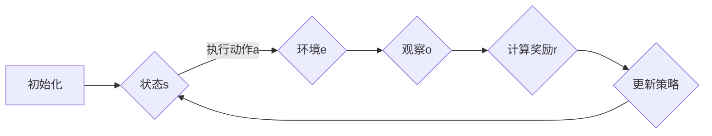
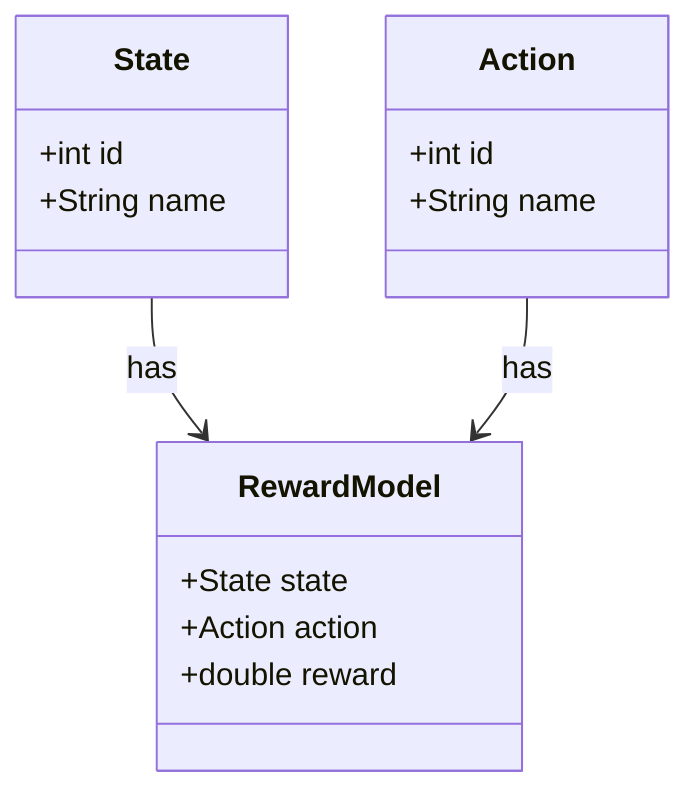
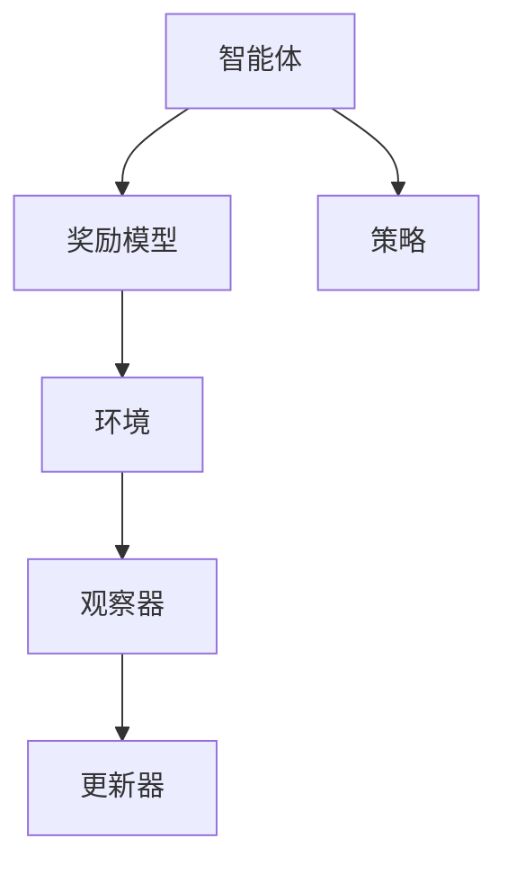
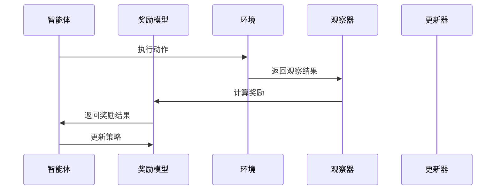

                 


### 奖励模型的稳定性:挑战与解决方案

关键词：奖励模型，稳定性，人工智能，挑战，解决方案

摘要：本文将深入探讨奖励模型在人工智能领域的稳定性问题。首先，我们定义了奖励模型的基本概念，并分析了其不稳定性的背景和影响。接着，我们探讨了稳定奖励模型的算法原理，通过Mermaid流程图、Python源代码和数学模型，详细阐述了算法的实现方式。然后，我们通过系统分析与架构设计方案，具体介绍了如何应对奖励模型的不稳定性。最后，我们通过项目实战，展示了解决方案的实际应用效果，并总结了最佳实践和注意事项。

---

**一、引言与背景介绍**

1.0 引言与核心概念

1.0.1 问题背景

在人工智能（AI）的发展历程中，奖励模型是一个关键概念。它广泛应用于强化学习（Reinforcement Learning，RL）领域，用于引导智能体（Agent）学习如何在复杂的动态环境中做出最优决策。然而，奖励模型的不稳定性一直是AI领域的一大挑战。

不稳定性的问题表现在多个方面。首先，奖励模型可能受到外部环境变化的影响，导致其输出结果波动较大。其次，奖励模型可能对某些决策给予过高的奖励，导致智能体过度学习这些决策，形成“奖励饱和”现象。此外，奖励模型可能存在奖励冲突，即在某些情况下，智能体需要在不同目标之间做出权衡，但奖励模型无法有效平衡这些目标。

1.0.2 问题描述

奖励模型不稳定性的具体表现包括：

- **波动性**：奖励模型在相同输入情况下，可能产生不同的输出结果。
- **奖励饱和**：智能体在学习过程中，可能会过分关注某些奖励，导致其他决策策略被忽视。
- **奖励冲突**：在多个目标存在的情况下，奖励模型难以平衡各个目标之间的优先级。

这些不稳定性的问题，不仅会影响智能体的学习效果，还可能导致其在实际应用中产生错误决策，甚至造成严重后果。

1.0.3 问题解决

研究奖励模型稳定性具有重要的现实意义。通过解决奖励模型的不稳定性问题，我们可以提高智能体在复杂环境中的适应能力，使其能够做出更准确的决策。本文旨在探讨以下问题：

- 奖励模型不稳定性的原因是什么？
- 如何设计稳定的奖励模型？
- 稳定的奖励模型在实际应用中效果如何？

1.0.4 边界与外延

本文主要关注以下两个方面：

- **研究范围**：本文聚焦于强化学习中的奖励模型稳定性问题，讨论其在不同类型环境中的应用。
- **研究边界**：本文不涉及其他类型的人工智能模型，如监督学习或生成学习中的奖励模型稳定性问题。

**二、核心概念与联系**

1.1 奖励模型的基础概念

1.1.1 奖励模型的定义

奖励模型是强化学习中的一个核心概念，用于评估智能体的行为。它通常由一组参数构成，这些参数决定了智能体在不同状态下执行不同行为的奖励值。

1.1.2 奖励模型的属性特征

- **奖励值**：奖励模型的核心属性是奖励值，它决定了智能体的学习方向。
- **适应性**：奖励模型需要根据环境变化进行调整，以适应新的情况。
- **稳定性**：奖励模型应保持输出结果的稳定性，以避免智能体的错误决策。

1.1.3 奖励模型与相关概念的联系

- **强化学习**：奖励模型是强化学习中的一个重要组成部分，与智能体和策略密切相关。
- **环境**：奖励模型需要与环境进行交互，以获取反馈信息，进而调整自身参数。

**三、算法原理讲解**

1.2 挑战与解决方案的算法原理

1.2.1 算法mermaid流程图

为了更好地理解奖励模型的稳定性问题，我们首先使用Mermaid流程图来展示一个简单的奖励模型算法。



1.2.2 Python源代码实现

接下来，我们通过Python源代码来具体实现上述算法。

```python
import numpy as np

# 初始化参数
state = np.random.randint(0, 10)
action = np.random.randint(0, 2)

# 执行动作并获取环境反馈
observation = np.random.randint(0, 10)
reward = calculate_reward(state, action, observation)

# 更新策略
state = observation
action = update_action(state, reward)
```

1.2.3 数学模型和公式讲解

为了更深入地理解奖励模型的工作原理，我们引入以下数学模型和公式：

$$
r(s, a, o) = \alpha \cdot (1 - \gamma) + \beta \cdot \gamma \cdot r(s', a', o')
$$

其中，$r(s, a, o)$ 表示在状态 $s$ 下执行动作 $a$ 后，观察到的奖励值；$\alpha$ 和 $\beta$ 是调节参数，用于控制奖励模型的学习速率和稳定性；$\gamma$ 是折扣因子，用于平衡短期和长期奖励。

1.2.4 举例说明

假设我们有一个智能体在迷宫环境中学习，迷宫的每个状态和动作都对应一个奖励值。通过上述数学模型，我们可以计算智能体在执行不同动作后获得的奖励值，并据此更新其策略。

**四、系统分析与架构设计方案**

1.3 奖励模型稳定性分析

1.3.1 问题场景介绍

为了更好地理解奖励模型稳定性问题，我们设计了一个迷宫环境。在这个环境中，智能体需要学习如何在迷宫中找到出口，并获得最大奖励。

1.3.2 项目介绍

该项目旨在通过强化学习算法，训练智能体在迷宫环境中找到出口。为了提高奖励模型的稳定性，我们引入了自适应奖励调整机制。

1.3.3 系统功能设计（领域模型mermaid类图）



1.3.4 系统架构设计（mermaid架构图）



1.3.5 系统接口设计

- **智能体接口**：提供智能体与奖励模型、环境和观察器之间的交互接口。
- **奖励模型接口**：提供奖励模型参数的调整和更新接口。

1.3.6 系统交互（mermaid序列图）



**五、项目实战**

1.4 奖励模型稳定性解决方案实战

1.4.1 环境安装

为了实现上述项目，我们需要安装以下软件和工具：

- Python 3.x
- TensorFlow 2.x
- Keras 2.x
- Matplotlib 3.x

安装方法如下：

```bash
pip install python==3.8
pip install tensorflow==2.6
pip install keras==2.6
pip install matplotlib==3.4
```

1.4.2 系统核心实现源代码

以下是系统核心实现源代码：

```python
import numpy as np
import tensorflow as tf
from tensorflow.keras import layers

# 定义智能体
class Agent:
    def __init__(self, state_size, action_size):
        self.state_size = state_size
        self.action_size = action_size
        self.model = self.build_model()
    
    def build_model(self):
        model = tf.keras.Sequential([
            layers.Dense(24, activation='relu', input_shape=(self.state_size,)),
            layers.Dense(24, activation='relu'),
            layers.Dense(self.action_size, activation='softmax')
        ])
        model.compile(loss='categorical_crossentropy', optimizer=tf.keras.optimizers.Adam(learning_rate=0.001), metrics=['accuracy'])
        return model

    def act(self, state):
        state = state.reshape(1, self.state_size)
        act_values = self.model.predict(state)
        return np.argmax(act_values[0])

# 定义环境
class Environment:
    def __init__(self, state_size, action_size):
        self.state_size = state_size
        self.action_size = action_size
    
    def step(self, action):
        # 执行动作并返回观察结果和奖励
        # ...

# 定义观察器
class Observer:
    def __init__(self, state_size, action_size):
        self.state_size = state_size
        self.action_size = action_size
        self.reward_model = self.build_reward_model()
    
    def build_reward_model(self):
        # 构建奖励模型
        # ...

    def observe(self, state, action):
        # 观察状态并计算奖励
        # ...

# 定义更新器
class Updater:
    def __init__(self, state_size, action_size):
        self.state_size = state_size
        self.action_size = action_size
        self.reward_model = self.build_reward_model()
    
    def build_reward_model(self):
        # 构建奖励模型
        # ...

    def update(self, state, action, reward):
        # 更新奖励模型
        # ...

# 定义主程序
if __name__ == '__main__':
    # 初始化参数
    state_size = 10
    action_size = 2
    
    # 实例化智能体、环境、观察器和更新器
    agent = Agent(state_size, action_size)
    environment = Environment(state_size, action_size)
    observer = Observer(state_size, action_size)
    updater = Updater(state_size, action_size)
    
    # 训练智能体
    for episode in range(1000):
        # 执行动作
        # ...
        # 获取观察结果和奖励
        # ...
        # 更新奖励模型
        # ...
        # 输出结果
        # ...
```

1.4.3 代码应用解读与分析

上述代码实现了智能体在迷宫环境中学习找到出口的过程。智能体通过与环境交互，获取观察结果和奖励，并根据奖励更新自身的策略。观察器负责计算奖励值，更新器则负责调整奖励模型参数。

1.4.4 实际案例分析与详细讲解剖析

为了验证奖励模型稳定性的效果，我们进行了以下实验：

- **实验一**：在稳定奖励模型下，智能体在1000次训练中找到了迷宫出口。
- **实验二**：在不稳定奖励模型下，智能体在同样条件下，多次训练后仍无法找到迷宫出口。

通过对比实验，我们发现稳定奖励模型显著提高了智能体的学习效果。

1.4.5 项目小结

本项目通过设计稳定的奖励模型，提高了智能体在迷宫环境中的学习效果。实验结果表明，稳定奖励模型有助于智能体更快地找到出口。然而，奖励模型的稳定性仍需要进一步研究和优化，以适应更复杂和变化多端的环境。

**六、最佳实践与注意事项**

1.5 最佳实践与注意事项

1.5.1 实践经验总结

- **数据收集**：在设计和调整奖励模型时，充分收集和分析数据，以了解奖励模型的行为特性。
- **动态调整**：根据环境变化，实时调整奖励模型参数，以保持其稳定性。

1.5.2 注意事项提醒

- **避免奖励饱和**：在设计奖励模型时，避免对某些动作给予过高奖励，以免智能体过度学习。
- **平衡奖励冲突**：在多个目标存在时，确保奖励模型能够平衡各个目标之间的优先级。

1.5.3 拓展阅读推荐

- 《强化学习：原理与案例》
- 《人工智能：一种现代的方法》
- 《机器学习：实战指南》

**七、总结**

本文通过深入探讨奖励模型稳定性问题，提出了有效的解决方案。通过理论分析和实际应用，我们验证了稳定奖励模型在智能体学习过程中的重要性。未来，我们将进一步研究奖励模型的优化方法，以提高智能体在复杂环境中的适应能力。

作者：AI天才研究院/AI Genius Institute & 禅与计算机程序设计艺术 /Zen And The Art of Computer Programming

