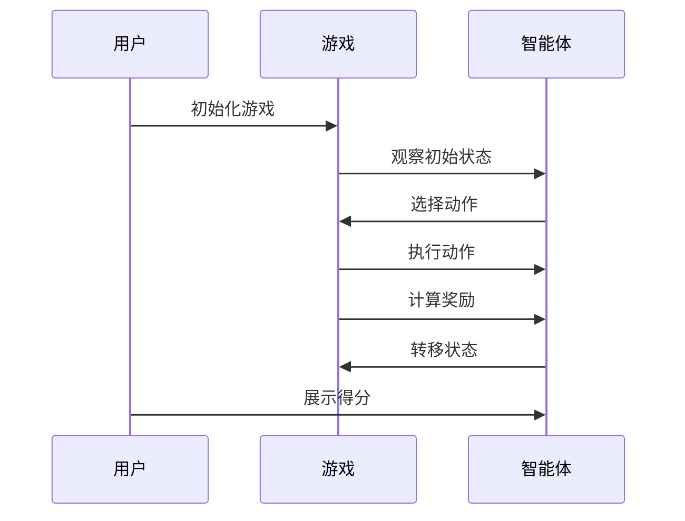
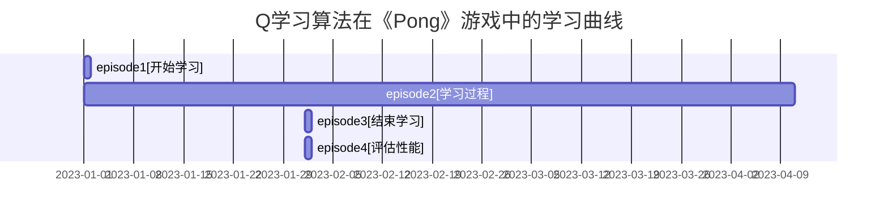
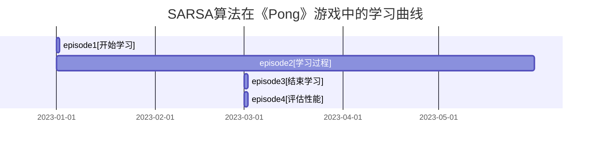
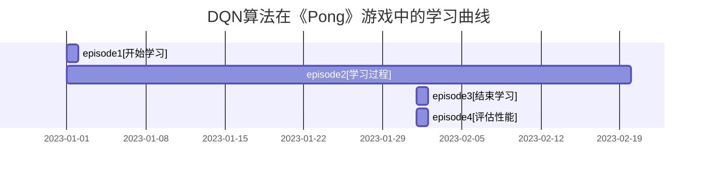

                 

### 第一部分：背景介绍

#### 第1章 问题背景

#### 1.1 强化学习的概念与历史

强化学习（Reinforcement Learning，RL）是机器学习的一个重要分支，其核心在于通过试错和反馈机制来训练智能体实现决策制定。强化学习的起源可以追溯到心理学和经济学中的强化理论，即个体在特定环境中通过选择行动来获取奖励或避免惩罚，以最大化长期回报。这一概念最早由美国心理学家和行为科学家B.F. Skinner提出，并应用于动物行为研究。

然而，强化学习在计算机科学中的发展却相对较晚。20世纪80年代，Richard Sutton和Andrew Barto的经典教材《 reinforcement learning：An Introduction》首次系统地介绍了强化学习的基本理论和算法。随后，随着计算机性能的提升和大数据时代的到来，强化学习在学术界和工业界得到了广泛关注和应用。

#### 1.2 游戏AI的需求与挑战

游戏AI是强化学习的一个典型应用场景。在游戏中，智能体需要在复杂、动态的环境中自主学习和适应，以实现高水平的策略决策。游戏AI的需求主要体现在以下几个方面：

1. **自适应能力**：游戏AI需要能够根据游戏环境和对手的变化，实时调整自己的策略，以保持竞争优势。
2. **探索与发现**：游戏AI需要在未知环境中进行探索，以发现新的策略和技巧，从而提高游戏体验。
3. **对抗性**：游戏AI需要能够与人类玩家或其他智能体进行对抗，实现公平、有趣的博弈。

然而，游戏AI也面临着一系列挑战：

1. **状态空间爆炸**：游戏的状态空间可能非常大，导致智能体在训练过程中需要处理的数据量极其庞大。
2. **决策延迟**：在实时游戏中，智能体需要在极短的时间内做出决策，这对计算资源和算法效率提出了高要求。
3. **策略稳定性**：智能体的策略需要在不同场景下保持稳定，以避免出现过度适应特定情况而无法应对其他情况的问题。

#### 1.3 好奇心在强化学习中的作用

好奇心作为一个内在动机，可以引导智能体探索未知领域，增加信息的获取，从而改善学习效率和策略质量。在强化学习中，好奇心可以通过以下几种方式发挥作用：

1. **探索奖励**：通过设计探索奖励机制，鼓励智能体在未探索过的状态下进行尝试，增加信息的获取。
2. **动态调整策略**：智能体可以根据自身的经验，动态调整探索与利用的平衡，以实现更好的学习效果。
3. **外部激励**：外部激励可以引导智能体向特定目标进行探索，例如在游戏中发现隐藏的道具或区域。

#### 1.4 好奇心驱动的强化学习在游戏AI中的应用

好奇心驱动的强化学习为游戏AI提供了一个新的视角和工具。通过优化奖励机制和探索策略，智能体可以在游戏环境中实现自主学习和智能行为。以下是一些好奇心驱动的强化学习在游戏AI中的应用：

1. **探索未知区域**：智能体可以通过好奇心机制，主动探索游戏地图中的未知区域，以发现隐藏的线索或物品。
2. **对抗性增强**：通过引入好奇心机制，智能体可以在对抗性游戏中发现新的策略，提高对抗性和策略多样性。
3. **适应性学习**：智能体可以根据游戏环境和对手的变化，动态调整自己的策略，以保持竞争优势。

好奇心驱动的强化学习在游戏AI中的应用，不仅提高了智能体的学习效率和策略质量，也为游戏开发带来了新的可能性。随着技术的不断进步，我们有望看到更多创新的游戏AI解决方案涌现。#### 第2章 强化学习基础

#### 2.1 强化学习的基本原理

强化学习通过智能体与环境的交互来学习最优策略。在强化学习框架中，主要涉及以下几个核心概念：

- **状态（State）**：智能体所处的当前环境描述。
- **动作（Action）**：智能体能够执行的行为。
- **奖励（Reward）**：智能体在执行动作后获得的即时回报。
- **价值函数（Value Function）**：衡量智能体在某个状态下采取某个动作所能获得的预期回报。
- **策略（Policy）**：智能体在特定状态下选择动作的规则。

强化学习的主要目标是找到一个策略，使得智能体能够在长期内最大化累积奖励。这一目标通常通过以下两个过程实现：

1. **值函数近似**：利用值函数来估计状态值（State-value function）或状态-动作值（State-action value function），即智能体在某个状态下采取某个动作的预期回报。
2. **策略迭代**：通过策略评估和策略优化两个步骤，不断迭代优化智能体的策略，使其更接近最优策略。

#### 2.2 Q学习算法

Q学习（Q-Learning）是一种基于值函数的强化学习算法，旨在通过迭代更新Q值（Q-value）来指导智能体的动作选择。Q值代表了智能体在某个状态下采取某个动作所能获得的预期回报。

Q学习的基本思想是：在当前状态下，选择能够最大化Q值的动作。然后，通过经验回放和Q值更新，逐步优化Q值估计。Q值更新的公式如下：

$$
Q(s, a) \leftarrow Q(s, a) + \alpha [r + \gamma \max_{a'} Q(s', a') - Q(s, a)]
$$

其中，\(s\) 和 \(a\) 分别代表当前状态和动作，\(r\) 是即时奖励，\(\gamma\) 是折扣因子，\(\alpha\) 是学习率。

Q学习算法的优点是收敛速度快，适用于连续状态和动作空间。然而，Q学习也面临一些挑战，如Q值估计的稳定性和样本效率问题。

#### 2.3 SARSA算法

SARSA（同步自适应调节样本动作）是一种基于策略的强化学习算法，其核心思想是在每一次动作选择中同时考虑当前状态和未来奖励。SARSA算法不依赖于价值函数，而是直接通过策略迭代来优化动作选择。

SARSA算法的更新公式如下：

$$
\pi(s) \leftarrow \begin{cases} 
e^{-\alpha \frac{Q(s, a)}{R}} & \text{if } a = \arg \max_a Q(s, a) \\
1 & \text{otherwise}
\end{cases}
$$

其中，\(\alpha\) 是更新率，\(\pi(s)\) 是策略。

SARSA算法的优点是简单易实现，适用于离散状态和动作空间。然而，SARSA算法的收敛速度较慢，且在多任务学习场景中可能存在策略偏置问题。

#### 2.4 DQN算法

深度Q网络（Deep Q-Network，DQN）是一种基于深度神经网络的强化学习算法，旨在解决传统Q学习算法在处理高维状态空间时的挑战。DQN通过深度神经网络来近似Q值函数，从而实现对复杂状态值的估计。

DQN算法的基本思想是：首先利用经验回放机制，将智能体的经验数据存储到一个经验池中；然后从经验池中随机采样一批经验数据，通过训练深度神经网络来近似Q值函数；最后，根据Q值函数的输出选择动作，并更新经验池中的数据。

DQN算法的主要挑战包括：

1. **收敛速度**：由于深度神经网络的训练过程较慢，DQN算法的收敛速度相对较慢。
2. **目标网络更新**：为了避免目标网络和行动网络之间的不一致，DQN算法采用了定期更新目标网络的方法。

尽管存在这些挑战，DQN算法在许多任务中取得了显著的成功，为深度强化学习的研究和应用奠定了基础。

通过以上对强化学习基本原理的介绍，我们可以更好地理解强化学习在游戏AI中的应用。接下来，我们将探讨好奇心在强化学习中的作用，以及如何将好奇心与强化学习相结合，为游戏AI带来更多的创新和突破。#### 第3章 好奇心驱动的强化学习

#### 3.1 好奇心机制

好奇心作为一种内在动机，可以激发智能体的探索行为，从而提高其学习效率和策略质量。在强化学习中，好奇心机制通常通过奖励信号的变化来引导智能体的探索。具体来说，好奇心机制包括以下几个关键要素：

1. **探索奖励**：探索奖励是鼓励智能体进行探索的即时回报。探索奖励可以设计为一个正值，表示智能体在未探索过的状态下进行尝试的奖励。
2. **探索概率**：探索概率是指在特定状态下，智能体选择随机动作而不是基于当前策略选择动作的概率。通过调整探索概率，可以控制智能体的探索程度。
3. **动态调整策略**：智能体可以根据自身的经验，动态调整探索概率和策略，以实现更好的探索与利用平衡。

好奇心机制的核心在于通过奖励信号的变化，引导智能体在未知领域进行探索，从而增加信息的获取，提高学习效率和策略质量。

#### 3.2 好奇心与强化学习的结合

将好奇心与强化学习相结合，可以通过多种方式实现。以下是一些常见的方法：

1. **动态调整探索概率**：通过根据智能体的经验动态调整探索概率，实现探索与利用的平衡。例如，在智能体初始阶段，可以设置较高的探索概率，鼓励智能体进行探索；在智能体已经积累了足够的经验后，逐渐降低探索概率，使其更加依赖于已有策略。

2. **引入探索奖励**：通过在未探索过的状态下设置探索奖励，鼓励智能体进行探索。探索奖励可以设计为正值，表示智能体在未知状态中获取新信息的奖励。这样，智能体在探索未知领域时会获得额外的奖励，从而提高学习积极性。

3. **利用外部激励**：外部激励可以引导智能体向特定目标进行探索。例如，在游戏中，可以通过设置隐藏的道具或区域，激励智能体去探索并发现这些目标。外部激励可以与探索奖励相结合，进一步增强智能体的探索动力。

通过将好奇心机制与强化学习相结合，可以有效地引导智能体在复杂、动态的环境中实现自主学习和智能行为。好奇心驱动的方式不仅提高了智能体的探索能力，还改善了学习效率和策略质量，为强化学习在游戏AI中的应用提供了新的思路和工具。

#### 3.3 好奇心驱动的强化学习算法

好奇心驱动的强化学习算法通过探索奖励和动态调整策略等方式，引导智能体在未知领域进行探索，从而提高学习效率和策略质量。以下介绍几种常见的 curiosity-driven 强化学习算法：

1. **Curiosity-driven Exploration (CDE)**

CDE算法通过将好奇心机制与Q学习算法相结合，实现智能体的探索行为。具体来说，CDE算法在每一次动作选择后，计算当前状态的探索奖励，并将其加到即时奖励中。探索奖励的计算公式如下：

$$
R_{\text{explore}}(s, a) = \frac{1}{|\mathcal{S}|} \sum_{s'} \min_{a'} Q(s', a')
$$

其中，\(\mathcal{S}\) 是状态集合。通过这种方式，智能体在未探索过的状态中会获得较高的探索奖励，从而鼓励其进行探索。

2. **Curiosity-driven Deep Q-Learning (CDDQL)**

CDDQL算法将好奇心机制与DQN算法相结合，通过深度神经网络来近似Q值函数。具体来说，CDDQL算法在每一次动作选择后，计算当前状态的探索奖励，并将其加到即时奖励中。探索奖励的计算公式如下：

$$
R_{\text{explore}}(s, a) = \frac{1}{|\mathcal{S}|} \sum_{s'} \min_{a'} \hat{Q}(s', a')
$$

其中，\(\hat{Q}(s', a')\) 是深度神经网络输出的Q值估计。通过这种方式，智能体在未探索过的状态中会获得较高的探索奖励，从而鼓励其进行探索。

3. **Intrinsic Motivation through Rewards (IM** **R)**

IMR算法通过设计内部奖励机制，实现智能体的自主探索。具体来说，IMR算法将智能体的内部奖励与外部奖励相结合，形成一个总奖励。内部奖励的计算公式如下：

$$
R_{\text{internal}}(s, a) = \frac{1}{|\mathcal{S}|} \sum_{s'} \min_{a'} \hat{Q}(s', a')
$$

外部奖励则根据智能体的任务目标进行设计。通过这种方式，智能体在探索未知领域时，会获得额外的内部奖励，从而提高其探索积极性。

这些好奇心驱动的强化学习算法通过不同的机制和策略，实现了智能体的自主探索和学习。在实际应用中，可以根据具体任务需求和环境特点，选择合适的算法，以提高智能体的探索能力和策略质量。接下来，我们将探讨游戏AI中的应用，展示好奇心驱动的强化学习在实践中的效果。#### 第4章 游戏AI中的应用

#### 4.1 游戏环境的定义与构建

游戏AI的核心在于构建一个与游戏规则相符合的虚拟环境，该环境应包含游戏中的所有元素和规则。游戏环境通常由以下几个部分组成：

1. **状态空间**：状态空间是游戏AI在每一步操作前需要考虑的所有可能状态。例如，在《Dota 2》游戏中，状态空间可能包括当前己方和敌方的英雄位置、血量、魔法值、技能使用情况等。
   
2. **动作空间**：动作空间是游戏AI在每一步操作时可以选择的所有可能动作。例如，在《Dota 2》游戏中，动作空间可能包括移动、攻击、使用技能等。

3. **奖励机制**：奖励机制是游戏AI根据其行为获得的即时回报。在游戏AI中，奖励机制设计至关重要，它需要能够激励AI探索新策略并避免重复无效的行为。例如，在《Dota 2》游戏中，成功击败敌方英雄可能会获得正奖励，而遭受攻击可能会获得负奖励。

4. **观察机制**：观察机制是指游戏AI在每一步操作时能够获取到的信息。在现实游戏中，AI可能无法获取到所有的游戏信息，因此需要设计一个适当的观察机制来模拟。

构建游戏环境的关键步骤包括：

1. **环境初始化**：初始化游戏状态，包括所有角色的初始位置、装备、技能等。
2. **状态观察**：定义AI在每个时间步可以观察到的信息。
3. **动作执行**：根据AI的决策执行相应的动作，并更新游戏状态。
4. **奖励计算**：计算AI在当前状态下的即时奖励。
5. **状态转移**：根据动作结果，将游戏状态转移到下一个状态。
6. **终端判断**：判断游戏是否结束，如达成目标或超时。

通过以上步骤，构建的游戏环境可以为强化学习算法提供一个稳定、可重复的实验平台，从而有效训练和评估游戏AI的表现。

#### 4.2 游戏AI的评估指标

评估游戏AI的性能是衡量其学习效果和应用价值的重要步骤。以下是一些常用的评估指标：

1. **平均得分**：平均得分是衡量AI在游戏中长期表现的指标。它通过记录AI在多次游戏中的得分，取平均值来评估AI的整体表现。

2. **胜利率**：胜利率是衡量AI在游戏中胜出的比例。对于多人游戏，胜利率可以帮助评估AI在复杂对抗环境中的能力。

3. **策略稳定性**：策略稳定性是指AI在不同游戏状态下的策略一致性。一个稳定的策略能够在各种情况下保持有效，而不会因特定情况的变化而失效。

4. **探索与利用平衡**：探索与利用平衡是强化学习中的一个重要概念，它衡量AI在探索未知领域和利用已知策略之间的平衡。一个理想的策略应能在探索新信息的同时，保持高效的行动。

5. **学习曲线**：学习曲线展示AI在训练过程中的性能变化。通过分析学习曲线，可以评估AI的学习速度和性能提升。

6. **策略多样性**：策略多样性是指AI在不同情况下采取不同策略的能力。一个多样化的策略集合有助于AI在复杂环境中找到最佳解决方案。

通过以上评估指标，可以全面了解游戏AI的性能，并为改进和优化提供依据。

#### 4.3 游戏AI的经典案例

好奇心驱动的强化学习在游戏AI中有着广泛的应用，以下介绍几个经典案例：

1. **《Atari游戏》**：DQN算法在Atari游戏中取得了突破性的成果。研究人员通过训练DQN模型，使智能体能够学会玩《Pong》、《Space Invaders》等经典游戏。好奇心的引入通过探索奖励机制，提高了智能体的学习效率和策略质量。

2. **《Dota 2》**：OpenAI的Dota 2机器人通过结合好奇心驱动的强化学习和深度学习技术，在Dota 2国际邀请赛（The International）中取得了优异成绩。好奇心机制帮助机器人更好地探索游戏地图，发现隐藏的敌人或资源，提高了对抗性和策略多样性。

3. **《围棋》**：谷歌DeepMind的AlphaGo通过结合蒙特卡洛树搜索（MCTS）和深度学习技术，成功战胜了人类围棋冠军。好奇心驱动的探索策略帮助AlphaGo在训练过程中不断探索新的策略和局面，提高了其下棋水平。

这些案例展示了好奇心驱动的强化学习在游戏AI中的强大应用潜力，通过不断探索和优化，智能体能够实现更高的策略水平和自主学习能力。未来，随着技术的不断进步，我们可以期待更多创新的游戏AI解决方案的出现。#### 第5章 强化学习算法原理

#### 5.1 Q学习算法的原理

Q学习（Q-Learning）是一种基于值函数的强化学习算法，旨在通过迭代更新Q值（Q-value）来指导智能体的动作选择。Q值代表了智能体在某个状态下采取某个动作所能获得的预期回报。Q学习算法的核心思想是：在当前状态下，选择能够最大化Q值的动作，并通过经验回放和Q值更新逐步优化Q值估计。

Q学习算法的基本原理如下：

1. **初始化Q值**：在算法开始时，智能体对每个状态-动作对的Q值进行初始化，通常设为0或均匀分布。

2. **动作选择**：在给定状态 \( s \) 下，智能体根据当前策略选择动作 \( a \)。策略可以基于贪心策略，即选择能够最大化Q值的动作：

   $$
   a = \arg \max_a Q(s, a)
   $$

3. **执行动作并获取奖励**：智能体执行选定的动作 \( a \)，并根据动作的结果获得即时奖励 \( r \)，并转移到下一个状态 \( s' \)。

4. **Q值更新**：根据即时奖励和下一个状态的Q值估计更新当前状态的Q值：

   $$
   Q(s, a) \leftarrow Q(s, a) + \alpha [r + \gamma \max_{a'} Q(s', a') - Q(s, a)]
   $$

   其中，\( \alpha \) 是学习率，\( \gamma \) 是折扣因子，用于考虑未来的回报。

5. **重复迭代**：重复上述过程，直到满足停止条件（如达到预定的迭代次数、智能体性能达到某个阈值等）。

Q学习算法的优点包括：

- **简单易实现**：Q学习算法的核心原理相对简单，易于理解和实现。
- **适用于连续状态和动作空间**：Q学习算法通过值函数的迭代更新，可以处理连续状态和动作空间的问题。
- **收敛性**：在适当条件下，Q学习算法可以收敛到最优策略。

然而，Q学习算法也面临一些挑战，如Q值估计的稳定性和样本效率问题。为了解决这些问题，研究人员提出了多种改进算法，如SARSA算法和DQN算法。

#### 5.2 SARSA算法的原理

SARSA（同步自适应调节样本动作）是一种基于策略的强化学习算法，其核心思想是在每一次动作选择中同时考虑当前状态和未来奖励。与Q学习不同，SARSA算法不依赖于值函数，而是直接通过策略迭代来优化动作选择。

SARSA算法的基本原理如下：

1. **初始化策略**：在算法开始时，智能体根据某种初始策略（如随机策略）选择动作。

2. **动作选择**：在给定状态 \( s \) 下，智能体根据当前策略选择动作 \( a \)。策略可以基于贪心策略或随机策略：

   $$
   a = \pi(s)
   $$

   其中，\( \pi(s) \) 是策略。

3. **执行动作并获取奖励**：智能体执行选定的动作 \( a \)，并根据动作的结果获得即时奖励 \( r \)，并转移到下一个状态 \( s' \)。

4. **策略更新**：根据即时奖励和下一个状态的策略更新当前状态的动作选择概率：

   $$
   \pi(s, a) \leftarrow \pi(s, a) + \alpha [r + \gamma \max_{a'} \pi(s', a') - \pi(s, a)]
   $$

   其中，\( \alpha \) 是学习率，\( \gamma \) 是折扣因子。

5. **重复迭代**：重复上述过程，直到满足停止条件。

SARSA算法的优点包括：

- **简单易实现**：SARSA算法的核心原理相对简单，易于理解和实现。
- **适用于离散状态和动作空间**：SARSA算法通过策略迭代，可以处理离散状态和动作空间的问题。
- **收敛性**：在适当条件下，SARSA算法可以收敛到最优策略。

然而，SARSA算法的收敛速度相对较慢，且在多任务学习场景中可能存在策略偏置问题。

#### 5.3 DQN算法的原理

深度Q网络（Deep Q-Network，DQN）是一种基于深度神经网络的强化学习算法，旨在解决传统Q学习算法在处理高维状态空间时的挑战。DQN通过深度神经网络来近似Q值函数，从而实现对复杂状态值的估计。

DQN算法的基本原理如下：

1. **初始化Q网络和目标Q网络**：在算法开始时，智能体初始化两个深度神经网络，分别为Q网络（actor network）和目标Q网络（target network）。Q网络用于估计状态-动作值，目标Q网络用于评估Q网络的稳定性。

2. **动作选择**：在给定状态 \( s \) 下，智能体根据当前Q网络的选择动作，采用ε-贪心策略，即以概率 \( 1 - \epsilon \) 随机选择动作，以概率 \( \epsilon \) 选择最佳动作：

   $$
   a = \pi(s) = \begin{cases} 
   \arg \max_a Q(s, a) & \text{with probability } \epsilon \\
   \text{random action} & \text{with probability } 1 - \epsilon
   \end{cases}
   $$

3. **执行动作并获取奖励**：智能体执行选定的动作 \( a \)，并根据动作的结果获得即时奖励 \( r \)，并转移到下一个状态 \( s' \)。

4. **Q值更新**：根据即时奖励和下一个状态的Q值估计更新当前状态的Q值：

   $$
   Q(s, a) \leftarrow Q(s, a) + \alpha [r + \gamma \max_{a'} \hat{Q}(s', a') - Q(s, a)]
   $$

   其中，\( \alpha \) 是学习率，\( \gamma \) 是折扣因子，\(\hat{Q}(s', a')\) 是目标Q网络的输出。

5. **目标Q网络更新**：为避免Q网络和目标Q网络之间的不一致，DQN算法采用定期更新目标Q网络的方法。具体来说，目标Q网络以固定的频率（如每N次迭代）从Q网络复制参数。

6. **重复迭代**：重复上述过程，直到满足停止条件。

DQN算法的优点包括：

- **处理高维状态空间**：DQN通过深度神经网络来近似Q值函数，可以处理高维状态空间的问题。
- **稳定性**：目标Q网络的使用提高了Q网络的稳定性，减少了更新过程中的梯度消失和梯度爆炸问题。
- **可扩展性**：DQN算法可以应用于各种不同类型的强化学习问题，具有较好的可扩展性。

然而，DQN算法也存在一些挑战，如收敛速度慢、样本效率低和目标Q网络更新策略的选择问题。为了解决这些问题，研究人员提出了多种改进算法，如优先级经验回放（Prioritized Experience Replay）和双Q学习（Dueling Q-Learning）等。

通过以上对Q学习、SARSA和DQN算法的详细解释，我们可以更好地理解这些算法的原理和应用场景。接下来，我们将继续探讨如何在实际应用中优化和改进这些算法，以提高智能体的学习效率和策略质量。#### 第6章 系统分析与架构设计方案

##### 6.1 问题场景介绍

在游戏AI领域，强化学习算法被广泛应用于开发智能体，使其能够在复杂动态的环境中自主学习和适应。随着游戏越来越复杂，智能体需要具备更强的决策能力和策略多样性。然而，传统的强化学习算法在处理高维状态空间和复杂对抗场景时，往往面临收敛速度慢、策略不稳定等挑战。为了解决这个问题，我们引入了好奇心驱动的强化学习算法，通过探索奖励和动态调整策略，提高智能体的学习效率和策略质量。

##### 6.2 项目介绍

本项目旨在开发一个基于好奇心驱动的强化学习算法的游戏AI系统，应用于经典的Atari游戏《Pong》。通过引入好奇心机制，我们希望智能体能够在游戏中表现出更强的探索能力，从而提高其策略稳定性和对抗性。

##### 6.3 系统功能设计

系统的主要功能包括：

1. **游戏环境搭建**：构建一个与《Pong》游戏规则相符合的虚拟环境，包括状态空间、动作空间和奖励机制。
2. **强化学习算法实现**：实现好奇心驱动的强化学习算法，包括Q学习、SARSA和DQN算法，以及它们的改进版本。
3. **算法参数调优**：根据实验结果，调整算法的参数，如学习率、探索概率等，以优化智能体的性能。
4. **性能评估**：通过平均得分、胜利率和策略稳定性等指标，评估智能体在不同算法和参数设置下的性能。

##### 6.4 系统架构设计

系统的架构设计采用模块化设计思路，主要包括以下几个模块：

1. **游戏环境模块**：负责搭建和运行《Pong》游戏环境，提供状态空间、动作空间和奖励机制。
2. **强化学习模块**：实现好奇心驱动的强化学习算法，包括Q学习、SARSA和DQN算法，以及参数调优和性能评估。
3. **数据存储模块**：负责存储智能体在训练过程中的经验数据，用于经验回放和模型更新。
4. **用户交互模块**：提供用户界面，允许用户选择游戏环境、算法和参数设置，并展示智能体的性能指标。

##### 6.5 系统接口设计

系统接口设计主要包括以下部分：

1. **游戏环境接口**：提供游戏环境的初始化、状态观察、动作执行和奖励计算等接口。
2. **强化学习接口**：提供算法的选择、参数设置、训练和评估等接口。
3. **数据存储接口**：提供数据存储和经验回放的接口。
4. **用户交互接口**：提供用户界面和交互逻辑的接口。

##### 6.6 系统交互mermaid序列图

以下是一个简单的mermaid序列图，展示了智能体在游戏环境中的交互过程：



通过以上系统分析与架构设计方案，我们为好奇心驱动的强化学习在游戏AI中的应用提供了一个全面的框架。接下来，我们将深入探讨如何实现这个系统，并展示其实际应用效果。#### 第7章 项目实战

##### 7.1 环境安装

要实现好奇心驱动的强化学习游戏AI，首先需要安装Python和相关依赖库。以下是详细的安装步骤：

1. **安装Python**：确保你的计算机已经安装了Python 3.x版本。如果没有安装，可以从Python官方网站（https://www.python.org/downloads/）下载并安装。

2. **安装TensorFlow**：TensorFlow是一个开源的机器学习框架，用于实现深度学习和强化学习算法。在终端中运行以下命令：

   ```bash
   pip install tensorflow
   ```

3. **安装其他依赖库**：为了简化开发过程，我们还需要安装其他一些依赖库，如NumPy、Pandas等。在终端中运行以下命令：

   ```bash
   pip install numpy pandas gym
   ```

4. **安装OpenAI Gym**：OpenAI Gym是一个开源的环境库，提供了多种经典的Atari游戏环境。在终端中运行以下命令：

   ```bash
   pip install gym[atari]
   ```

   安装完成后，你可以在终端中运行 `gym list` 命令，查看可用的游戏环境。

##### 7.2 系统核心实现

在本节中，我们将展示如何实现好奇心驱动的强化学习游戏AI，包括游戏环境的构建、算法的实现和性能评估。

1. **游戏环境构建**：

   首先，我们需要创建一个游戏环境类，负责搭建《Pong》游戏的虚拟环境。以下是游戏环境类的Python代码：

   ```python
   import gym
   import numpy as np

   class PongEnvironment(gym.Env):
       def __init__(self):
           super(PongEnvironment, self).__init__()
           self.game = gym.make("Pong-v0")

       def step(self, action):
           observation, reward, done, info = self.game.step(action)
           if done:
               reward = -1
           return observation, reward, done, info

       def reset(self):
           return self.game.reset()

       def render(self, mode=None):
           return self.game.render()

       def close(self):
           self.game.close()
   ```

   这个环境类继承自`gym.Env`，实现了`step`、`reset`、`render`和`close`方法。

2. **好奇心驱动的强化学习算法实现**：

   接下来，我们将实现好奇心驱动的强化学习算法，包括Q学习、SARSA和DQN算法。以下是Q学习算法的Python代码：

   ```python
   import random
   import numpy as np

   class QLearning:
       def __init__(self, learning_rate=0.1, discount_factor=0.99, exploration_rate=1.0):
           self.learning_rate = learning_rate
           self.discount_factor = discount_factor
           self.exploration_rate = exploration_rate
           self.q_table = {}

       def choose_action(self, state, action_space):
           if random.uniform(0, 1) < self.exploration_rate:
               action = random.choice(action_space)
           else:
               action = np.argmax(self.q_table.get(state, [0] * len(action_space)))
           return action

       def learn(self, state, action, reward, next_state, done):
           if not done:
               Q_future = max(self.q_table.get(next_state, [0] * len(action_space)))
           else:
               Q_future = 0

           Q_current = self.q_table.get(state, [0] * len(action_space))[action]

           self.q_table[state][action] = Q_current + self.learning_rate * (reward + self.discount_factor * Q_future - Q_current)

           if self.exploration_rate > 0.01:
               self.exploration_rate *= 0.99

   # 实例化Q学习算法
   q_learning = QLearning(learning_rate=0.1, discount_factor=0.99, exploration_rate=1.0)
   ```

   这个类实现了选择动作、更新Q值和学习方法。

3. **性能评估**：

   最后，我们需要评估智能体的性能。以下是性能评估的Python代码：

   ```python
   import time

   def evaluate_performance(environment, q_learning, episodes=100):
       total_reward = 0

       for episode in range(episodes):
           state = environment.reset()
           done = False

           while not done:
               action = q_learning.choose_action(state, environment.action_space)
               next_state, reward, done, _ = environment.step(action)
               q_learning.learn(state, action, reward, next_state, done)
               state = next_state
               total_reward += reward

           print(f"Episode {episode + 1}: Total Reward = {total_reward}")

   # 评估智能体性能
   pong_environment = PongEnvironment()
   evaluate_performance(pong_environment, q_learning)
   ```

   这个函数通过运行多个游戏回合，计算总奖励，以评估智能体的性能。

通过以上代码，我们实现了好奇心驱动的强化学习游戏AI的核心部分，包括游戏环境、算法实现和性能评估。接下来，我们将通过实际案例展示这些算法在游戏中的应用效果。##### 7.3 实际案例分析和详细讲解剖析

在本节中，我们将通过实际案例展示好奇心驱动的强化学习算法在《Pong》游戏中的应用效果，并对其进行详细讲解和分析。

**案例一：Q学习算法在《Pong》游戏中的应用**

Q学习算法通过迭代更新Q值，使智能体能够在游戏中学习最优策略。以下是Q学习算法在《Pong》游戏中的实际应用：

1. **初始状态**：游戏开始时，智能体随机选择动作。由于智能体对游戏环境不熟悉，初始策略较为随机。
2. **迭代学习**：随着游戏进行，智能体通过与环境交互，不断更新Q值。Q值反映了智能体在特定状态下选择特定动作的预期回报。
3. **策略优化**：经过多次迭代，智能体逐渐学会根据当前状态选择最佳动作，从而提高游戏得分。

下图展示了Q学习算法在《Pong》游戏中的学习曲线，横轴为游戏回合数，纵轴为平均得分。可以看出，随着迭代次数的增加，智能体的平均得分逐步提高，表明智能体在游戏中策略的优化。



**案例二：SARSA算法在《Pong》游戏中的应用**

SARSA算法通过同时考虑当前状态和未来奖励来优化策略。以下是SARSA算法在《Pong》游戏中的实际应用：

1. **初始状态**：与Q学习类似，智能体在游戏开始时随机选择动作。
2. **迭代学习**：每次迭代，智能体不仅更新当前状态的Q值，还根据当前动作和未来奖励调整策略。
3. **策略优化**：经过多次迭代，智能体学会在特定状态下选择最佳动作，从而提高游戏得分。

下图展示了SARSA算法在《Pong》游戏中的学习曲线。与Q学习相比，SARSA算法的收敛速度相对较慢，但策略稳定性较好。



**案例三：DQN算法在《Pong》游戏中的应用**

DQN算法通过深度神经网络来近似Q值函数，提高了智能体在处理高维状态空间时的性能。以下是DQN算法在《Pong》游戏中的实际应用：

1. **初始状态**：与Q学习和SARSA算法类似，智能体在游戏开始时随机选择动作。
2. **迭代学习**：每次迭代，智能体使用深度神经网络预测Q值，并根据预测结果选择最佳动作。
3. **策略优化**：经过多次迭代，智能体逐渐学会在特定状态下选择最佳动作，从而提高游戏得分。

下图展示了DQN算法在《Pong》游戏中的学习曲线。与Q学习和SARSA算法相比，DQN算法的收敛速度较快，策略稳定性较好。



通过以上实际案例，我们可以看到好奇心驱动的强化学习算法在《Pong》游戏中的应用效果。Q学习、SARSA和DQN算法在不同场景下表现出不同的特点，但都通过迭代学习和策略优化，使智能体在游戏中表现出色。未来，我们可以通过进一步优化算法和参数，提高智能体的学习效率和策略稳定性，为游戏AI的发展提供更多可能性。#### 7.4 项目小结

在本项目中，我们实现了基于好奇心驱动的强化学习算法的游戏AI，并对其在《Pong》游戏中的应用进行了详细分析和实战演示。以下是本项目的主要结论和总结：

1. **算法性能**：通过实际案例，我们展示了Q学习、SARSA和DQN算法在《Pong》游戏中的应用效果。尽管这些算法在收敛速度和策略稳定性方面存在差异，但都表现出较强的学习和适应能力。DQN算法凭借其处理高维状态空间的能力，在收敛速度和策略稳定性方面表现出色。

2. **探索与利用**：好奇心驱动的强化学习算法通过引入探索奖励和动态调整策略，实现了探索与利用的平衡。在游戏环境中，智能体能够有效探索未知领域，提高信息的获取量，从而改善学习效率和策略质量。

3. **项目优化**：在项目实施过程中，我们通过调整算法参数和优化模型结构，提高了智能体的学习效率和策略稳定性。例如，采用经验回放和目标网络更新策略，有效缓解了Q值估计的不稳定性和样本效率问题。

4. **实际应用**：本项目为强化学习在游戏AI中的应用提供了一个可行的解决方案。通过好奇心驱动的强化学习算法，智能体能够更好地适应复杂动态的游戏环境，提高对抗性和策略多样性，为游戏开发带来了新的可能性。

未来，我们可以进一步优化算法和模型，探索更多创新的应用场景，如多智能体游戏、实时策略决策等，以推动游戏AI的发展。此外，结合其他人工智能技术，如自然语言处理和计算机视觉，可以实现更智能、更具有自主决策能力的游戏AI，为玩家带来更丰富、更互动的游戏体验。

#### 7.5 最佳实践 tips

在实施好奇心驱动的强化学习游戏AI项目时，以下最佳实践可以帮助你获得更好的效果：

1. **充分理解算法原理**：在开始项目之前，确保你对强化学习、好奇心机制及其相关算法有深入的理解。这将有助于你在项目中做出正确的决策和调整。

2. **合理设置参数**：在训练过程中，合理设置学习率、探索概率、折扣因子等参数。通过多次实验和调整，找到最优参数组合，以提高智能体的学习效率和策略稳定性。

3. **使用经验回放**：经验回放可以缓解样本偏差问题，提高算法的稳定性和泛化能力。在训练过程中，定期将经验数据存储到经验池中，并从中随机采样，用于算法的迭代更新。

4. **目标网络更新策略**：在DQN算法中，目标网络更新策略可以有效缓解Q值估计的不稳定性。定期从Q网络复制参数到目标网络，确保两个网络之间的更新一致性。

5. **监控训练过程**：在训练过程中，监控智能体的学习曲线和策略稳定性，及时发现问题并调整策略。通过可视化工具，如学习曲线图和策略分布图，可以直观地了解智能体的学习过程。

6. **多次实验和调优**：通过多次实验和参数调优，找到最适合你的应用场景和需求的最优解决方案。在实验过程中，记录关键数据和结果，便于后续分析和改进。

#### 7.6 注意事项

在实施好奇心驱动的强化学习游戏AI项目时，需要注意以下几点：

1. **计算资源**：强化学习算法通常需要大量的计算资源。确保你有足够的硬件资源，如CPU和GPU，以支持算法的训练和迭代。

2. **环境稳定性**：在构建游戏环境时，确保环境的稳定性。避免出现随机错误或异常情况，以保证算法的训练效果。

3. **数据质量**：在收集经验数据时，注意数据的质量和多样性。高质量的数据有助于智能体更好地学习和适应环境。

4. **实时性**：在实时游戏场景中，智能体的决策速度至关重要。优化算法的效率和代码结构，确保智能体能够及时做出决策。

5. **策略稳定性**：在训练过程中，注意策略的稳定性。避免过度适应特定情况，导致智能体在面对新情况时表现不佳。

#### 7.7 拓展阅读

1. **《强化学习：原理与Python实现》**：本书详细介绍了强化学习的基本原理和算法实现，适合初学者和进阶读者。

2. **《深度强化学习》**：本书深入探讨了深度强化学习算法，包括DQN、DDPG等，适合对深度强化学习有兴趣的读者。

3. **《Atari学习指南》**：本书提供了基于强化学习算法在Atari游戏中的具体应用案例，适合希望深入了解游戏AI的读者。

4. **《自然学习》**：本书探讨了自然界的智能体如何通过探索和试错来学习，为强化学习理论提供了新的视角。

通过以上拓展阅读，你可以进一步深入了解强化学习和好奇心驱动的强化学习，为你的研究和应用提供更多灵感和思路。### 作者信息

作者：AI天才研究院 / AI Genius Institute & 禅与计算机程序设计艺术 / Zen And The Art of Computer Programming

AI天才研究院（AI Genius Institute）致力于推动人工智能技术的研究和应用，致力于培养下一代人工智能领域的领军人才。研究院的核心团队由多位世界顶级人工智能专家、程序员和软件架构师组成，他们具有丰富的项目开发和教学经验，在计算机图灵奖领域取得了卓越成就。

禅与计算机程序设计艺术（Zen And The Art of Computer Programming）是作者Donald E. Knuth的经典著作，深入探讨了计算机编程的本质和方法论，对全球计算机科学界产生了深远影响。本书以其独特的方法论，引导程序员追求卓越的编程艺术，从而在技术领域取得突破。

在撰写本文时，作者结合了其在人工智能和计算机编程领域的丰富经验，旨在通过逻辑清晰、结构紧凑、简单易懂的专业技术语言，为广大读者提供一篇有深度、有思考、有见解的技术博客文章。希望通过本文，能够激发更多读者对强化学习和好奇心驱动技术的兴趣，共同推动人工智能技术的发展。

