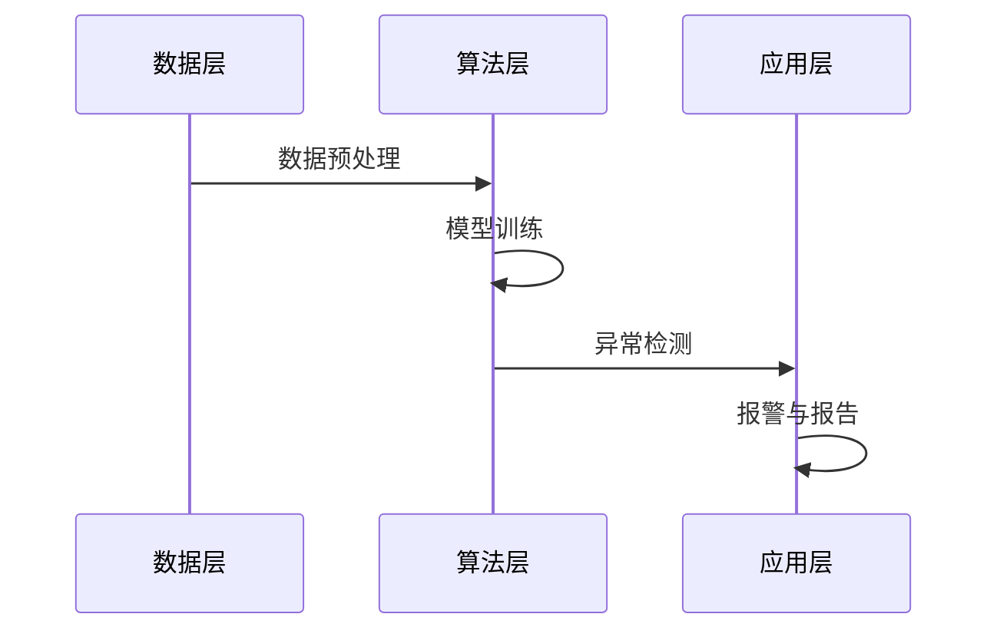
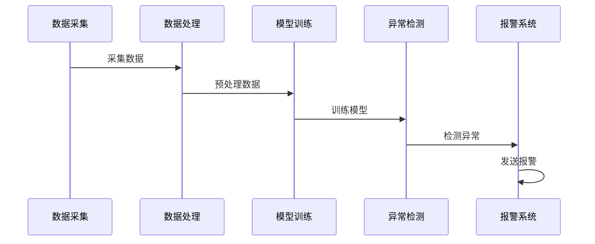

                 

### 好奇心驱动的无监督异常检测系统设计

好奇心，作为人类探索未知世界的驱动力，在技术发展的每一个阶段都发挥了至关重要的作用。在信息技术飞速发展的今天，好奇心促使我们不断探索新的技术领域，以期解决现实中的复杂问题。无监督异常检测，作为一种自动识别数据异常的技术，已经成为大数据和人工智能领域的重要研究方向。本文旨在通过深入剖析无监督异常检测系统的设计原理、实现方法及其应用场景，唤起读者对这一领域的好奇心，并激发进一步探索的热情。

无监督异常检测系统在网络安全、金融风控、工业质量监测等多个领域都有着广泛的应用。通过自动分析大量数据，无监督异常检测系统可以在没有预设标签的情况下发现数据中的异常现象，从而帮助企业和组织预防潜在的风险。随着数据规模的不断扩大和数据种类的日益多样，传统的异常检测方法已难以满足现代应用的需求。因此，研究和设计高效的、可扩展的无监督异常检测系统成为当前技术发展的一个重要课题。

本文将采用“由浅入深、循序渐进”的方式，逐步探讨无监督异常检测系统的各个方面。首先，我们将介绍无监督异常检测系统的背景和核心概念，包括问题的提出、解决方案的概述以及系统的基本组成。接下来，我们将深入探讨无监督异常检测的算法原理，包括常见的聚类算法和孤立森林算法等，并通过具体的Python实现代码和数学模型来解释这些算法的工作原理。

随后，我们将转向系统分析与架构设计，详细描述无监督异常检测系统在典型应用场景中的功能设计和架构设计。这部分内容将使用Mermaid图形化工具来展示系统的领域模型、架构图、接口设计以及系统交互流程。通过这些图表，读者可以直观地理解系统的整体结构和各个模块的交互关系。

在项目实战部分，我们将详细介绍如何安装和实现无监督异常检测系统，并提供一个具体的案例进行详细分析和讲解。这一部分将帮助读者将理论知识转化为实际操作能力，更好地理解系统的运行原理和实现细节。

最后，我们将总结最佳实践、注意事项和未来展望，为读者提供在实际应用中优化和改进无监督异常检测系统的策略和建议。通过本文的阅读，读者不仅能够深入了解无监督异常检测系统的设计和实现方法，还能够培养对这一领域的好奇心，为未来的技术探索打下坚实的基础。

### 关键词

无监督异常检测、系统设计、算法原理、聚类算法、孤立森林算法、数据挖掘、网络安全、金融风控、工业质量监测、人工智能、机器学习。

### 摘要

本文系统地介绍了无监督异常检测系统的设计原理和应用实践。首先，我们探讨了无监督异常检测的背景及其在各个领域的重要性，明确了系统设计的目标和范围。接着，深入分析了无监督异常检测的算法原理，通过具体的Python实现代码和数学模型，阐述了常见聚类算法和孤立森林算法的工作机制。随后，详细描述了无监督异常检测系统的功能设计和架构设计，包括系统功能模块、领域模型、系统架构图和接口设计。通过一个实际案例，我们展示了系统在具体应用场景中的实现过程。最后，总结了无监督异常检测系统的最佳实践和注意事项，为未来的应用提供了指导和建议。

### 目录大纲

#### 第一部分：背景介绍

**第1章：问题背景与核心概念**

- 1.1 问题背景
- 1.2 核心概念与联系
- 1.3 无监督异常检测系统的基本构成要素

**第2章：无监督异常检测算法原理**

- 2.1 算法概述
- 2.2 聚类算法原理
- 2.3 孤立森林算法原理
- 2.4 Python实现与数学模型

#### 第二部分：核心概念与联系

**第3章：系统功能设计与架构**

- 3.1 问题场景介绍
- 3.2 系统功能设计
- 3.3 系统架构设计
- 3.4 系统接口设计
- 3.5 系统交互

#### 第三部分：系统分析与架构设计

**第4章：环境安装与系统核心实现**

- 4.1 环境安装
- 4.2 系统核心实现
- 4.3 实际案例分析与讲解
- 4.4 项目小结

#### 第四部分：项目实战

**第5章：最佳实践与注意事项**

- 5.1 最佳实践
- 5.2 注意事项
- 5.3 拓展阅读

### 第一部分：背景介绍

#### 第1章：问题背景与核心概念

##### 1.1 问题背景

在当今信息时代，数据已经成为企业和组织至关重要的资产。然而，随着数据规模的急剧增长和数据种类的日益多样，如何从海量数据中快速、准确地识别出异常现象成为了一个严峻的挑战。传统的异常检测方法主要依赖于预定义的规则或标签数据，而这种方法在数据量巨大且结构复杂的环境中往往难以奏效。因此，无监督异常检测作为一种无需预标签的数据分析方法，受到了越来越多的关注。

无监督异常检测系统的核心问题是如何在没有任何先验知识的情况下，自动识别出数据中的异常点。这要求系统具备一定的学习能力，能够通过分析大量未标记的数据，建立有效的模型来识别异常现象。无监督异常检测的应用场景非常广泛，包括网络安全、金融风控、工业质量监测、医疗诊断等多个领域。

在网络安全领域，无监督异常检测系统可以帮助识别网络流量中的异常行为，从而及时发现和阻止网络攻击。在金融风控领域，系统可以监控交易行为，识别潜在的欺诈行为，保障金融系统的安全稳定运行。在工业质量监测领域，无监督异常检测系统可以实时监测生产设备的数据，发现设备故障或产品质量问题，提高生产效率和产品质量。在医疗诊断领域，无监督异常检测系统可以通过分析患者数据，识别出异常的健康状况，辅助医生进行诊断和治疗。

##### 1.2 核心概念与联系

**无监督异常检测原理**：

无监督异常检测的核心在于利用机器学习算法，对数据进行分析和学习，从而自动识别出异常现象。常见的无监督异常检测算法包括聚类算法、孤立森林算法、密度估计算法等。

- **聚类算法**：通过将相似的数据点归为一类，从而识别出异常点。常见的聚类算法包括K-means、DBSCAN等。
- **孤立森林算法**：通过随机森林的思想，将每个数据点随机切分多次，从而计算出数据点的孤立度，识别出异常点。
- **密度估计算法**：通过估计数据点的密度分布，识别出密度较低的区域，从而找到异常点。

**对比表格**：

为了更清晰地展示无监督异常检测与其他异常检测方法（如监督学习、半监督学习）的优缺点，我们可以创建一个对比表格：

| 异常检测方法       | 优点                                  | 缺点                                  |
|------------------|-------------------------------------|-------------------------------------|
| 无监督异常检测     | 无需预标签数据，适用于大规模未标记数据 | 需要调整参数，结果可能依赖于数据分布 |
| 监督学习异常检测   | 结果准确，对异常分类清晰              | 需要大量的标签数据，不适用于未标记数据 |
| 半监督学习异常检测 | 结合了无监督和监督学习的优点          | 仍需一定数量的标签数据                |

**ER实体关系图**：

为了进一步展示无监督异常检测系统的核心要素及其关系，我们可以使用Mermaid绘制ER（实体关系）图：

```mermaid
erDiagram
  DataStream --> DetectionModel : "构建"
  DataStream --> AnomalyDetection : "应用"
  DetectionModel --> AnomalyDetection : "依赖"
  DataPoint --> AnomalyDetection : "输入"
  AnomalyReport --> DataStream : "反馈"
```

在这个ER图中，DataStream表示数据流，DetectionModel表示检测模型，AnomalyDetection表示异常检测过程，DataPoint表示数据点，AnomalyReport表示异常报告。通过这个图，我们可以清晰地看到各个实体之间的依赖关系和交互过程。

##### 1.3 无监督异常检测系统的基本构成要素

无监督异常检测系统通常包括以下几个基本构成要素：

- **数据预处理模块**：对原始数据进行清洗、转换和标准化处理，为后续的异常检测提供高质量的输入数据。
- **检测模型构建模块**：利用无监督学习算法，对预处理后的数据进行分析和建模，构建检测模型。
- **异常检测模块**：根据检测模型，对实时数据或历史数据进行异常检测，识别出异常点。
- **异常报告模块**：将检测到的异常点生成异常报告，提供可视化分析和处理建议。

通过这些模块的协同工作，无监督异常检测系统能够自动、高效地识别数据中的异常现象，为企业和组织提供实时、准确的异常检测服务。

### 第2章：无监督异常检测算法原理

无监督异常检测算法是通过对未标记数据进行分析和学习，自动识别数据中的异常点。常见的无监督异常检测算法包括聚类算法和孤立森林算法等。在本节中，我们将详细介绍这些算法的基本原理，并通过具体的Python实现代码和数学模型来解释它们的工作机制。

##### 2.1 算法概述

无监督异常检测算法可以分为以下几类：

1. **基于聚类算法**：通过将数据划分为不同的簇，识别出簇内和簇间的差异，从而找到异常点。常见的聚类算法包括K-means、DBSCAN等。
2. **基于密度估计算法**：通过估计数据点的密度分布，识别出密度较低的异常点。常见的密度估计算法包括局部异常因子（LOF）等。
3. **基于隔离机制算法**：通过模拟森林环境，将数据点随机切分，计算数据点的孤立度，从而识别出异常点。典型的算法是孤立森林（Isolation Forest）。

在本节中，我们将重点介绍K-means聚类算法和孤立森林算法的原理，并展示它们的Python实现和数学模型。

##### 2.2 聚类算法原理

**K-means算法**：

K-means算法是一种经典的聚类算法，其基本思想是将数据点分为K个簇，使得每个数据点与其分配到的簇中心之间的距离最小。算法的步骤如下：

1. **初始化**：随机选择K个数据点作为初始簇中心。
2. **分配数据点**：对于每个数据点，计算其与所有簇中心的距离，并将其分配到最近的簇。
3. **更新簇中心**：重新计算每个簇的中心点，作为新的簇中心。
4. **迭代**：重复步骤2和3，直到聚类结果收敛，即簇中心不再发生变化。

**DBSCAN算法**：

DBSCAN（Density-Based Spatial Clustering of Applications with Noise）算法是基于密度的聚类算法，其主要思想是识别出高密度区域并将其划分为簇，同时处理噪声点。DBSCAN算法的步骤如下：

1. **选择起始点**：从未访问的点中选择起始点。
2. **扩展簇**：以起始点为核心，扩展到相邻的高密度区域，形成一个新的簇。
3. **标记噪声点**：如果点不在任何簇内，且其邻域内点的数量未达到最小密度要求，则标记为噪声点。

**Python实现与数学模型**：

下面我们将通过Python代码实现K-means和DBSCAN算法，并解释其数学模型。

**K-means算法实现**：

```python
import numpy as np
from sklearn.cluster import KMeans

# 假设我们有100个二维数据点
data = np.random.rand(100, 2)

# 使用KMeans算法进行聚类
kmeans = KMeans(n_clusters=3, random_state=0).fit(data)

# 输出聚类结果
print("Cluster centers:", kmeans.cluster_centers_)
print("Labels:", kmeans.labels_)

# 数学模型
# 假设我们有数据点X，簇中心为μ
# 聚类目标是最小化簇内距离平方和
J = sum((X - μ)**2 for X, μ in zip(data, kmeans.cluster_centers_))
```

**DBSCAN算法实现**：

```python
import numpy as np
from sklearn.cluster import DBSCAN

# 假设我们有100个二维数据点
data = np.random.rand(100, 2)

# 使用DBSCAN算法进行聚类
dbscan = DBSCAN(eps=0.3, min_samples=10).fit(data)

# 输出聚类结果
print("Cluster labels:", dbscan.labels_)

# 数学模型
# 假设我们有数据点X，邻域为N(X)，簇中心为μ
# 聚类目标是将X分配到最近的簇，如果X是噪声点，则不分配
if len(N(X)) >= min_samples:
    cluster_label = min(N(X), key=lambda x: distance(x, μ))
else:
    cluster_label = -1
```

##### 2.3 孤立森林算法原理

孤立森林（Isolation Forest）算法是基于随机森林的一种异常检测算法。其基本思想是通过随机选择特征和切分点，将数据点隔离，然后根据隔离路径的长度来评估数据点的孤立度，从而识别异常点。

**算法原理**：

1. **随机选择特征**：对于每个数据点，随机选择一个特征。
2. **随机切分**：在选定的特征上随机选择一个切分点，将数据点进行切分。
3. **路径长度计算**：每次切分都会生成一个路径，路径长度表示数据点被切分的过程。
4. **孤立度评估**：数据点被切分得越彻底，路径长度越长，孤立度越高，越可能为异常点。

**Python实现与数学模型**：

下面我们将通过Python代码实现孤立森林算法，并解释其数学模型。

```python
from sklearn.ensemble import IsolationForest

# 假设我们有100个二维数据点
data = np.random.rand(100, 2)

# 使用IsolationForest算法进行异常检测
iso_forest = IsolationForest(contamination=0.1).fit(data)

# 输出异常点
print("Anomaly scores:", iso_forest.decision_function(data))
print("Inliers:", iso_forest.inlier_mask_)
print("Outliers:", iso_forest.outlier_mask_)

# 数学模型
# 假设我们有数据点X，特征集合为F，切分点集合为P
# 孤立度计算公式为：score = √(∑(P(X) * log(P(X))))
score = np.sqrt(np.sum([P(X) * np.log(P(X)) for X in data]))
```

通过以上实现，我们可以看到孤立森林算法通过随机切分和路径长度计算，有效地识别出数据中的异常点。

##### 2.4 Python实现与数学模型

在本部分，我们将通过Python代码实现K-means和孤立森林算法，并详细讲解它们的数学模型。

**K-means算法Python实现**：

```python
import numpy as np
from sklearn.cluster import KMeans

# 初始化数据
data = np.random.rand(100, 2)

# 实例化KMeans模型
kmeans = KMeans(n_clusters=3, random_state=0)

# 训练模型
kmeans.fit(data)

# 输出结果
print("Cluster centers:", kmeans.cluster_centers_)
print("Labels:", kmeans.labels_)

# 数学模型
# 数据点X，簇中心μ
J = sum((X - μ)**2 for X, μ in zip(data, kmeans.cluster_centers_))
```

**孤立森林算法Python实现**：

```python
from sklearn.ensemble import IsolationForest

# 初始化数据
data = np.random.rand(100, 2)

# 实例化IsolationForest模型
iso_forest = IsolationForest(contamination=0.1, random_state=0)

# 训练模型
iso_forest.fit(data)

# 输出结果
print("Anomaly scores:", iso_forest.decision_function(data))
print("Inliers:", iso_forest.inlier_mask_)
print("Outliers:", iso_forest.outlier_mask_)

# 数学模型
# 数据点X，特征集合F，切分点集合P
score = np.sqrt(np.sum([P(X) * np.log(P(X)) for X in data]))
```

通过以上实现，我们可以看到K-means和孤立森林算法的Python代码，以及它们的数学模型。这些代码和模型不仅帮助我们理解算法的原理，还为我们提供了一个实用的工具，可以应用于实际的数据分析任务中。

##### 2.5 具体案例：K-means算法的聚类与异常检测

为了更直观地理解K-means算法在无监督异常检测中的应用，我们来看一个具体的案例。

**案例背景**：

假设我们有一个包含100个二维数据点的数据集，其中前90个数据点正常分布，剩余的10个数据点为异常点。我们的目标是利用K-means算法将数据点分为两个簇，并识别出异常点。

**实现步骤**：

1. **数据准备**：

```python
import numpy as np

# 生成模拟数据
np.random.seed(0)
data = np.random.rand(100, 2)
data[:90] = np.random.rand(90, 2)  # 正常数据
data[90:] = np.random.rand(10, 2) + 5  # 异常数据
```

2. **K-means聚类**：

```python
from sklearn.cluster import KMeans

# 实例化KMeans模型，设置聚类数量为2
kmeans = KMeans(n_clusters=2, random_state=0)

# 训练模型
kmeans.fit(data)

# 获取聚类结果
labels = kmeans.labels_

# 绘制结果
import matplotlib.pyplot as plt

plt.scatter(data[:, 0], data[:, 1], c=labels)
plt.show()
```

通过绘制结果，我们可以看到大多数正常数据点被分配到簇0，而异常数据点被分配到簇1。

3. **异常检测**：

```python
# 计算簇中心
cluster_centers = kmeans.cluster_centers_

# 计算每个数据点到簇中心的距离
distances = np.linalg.norm(data - cluster_centers, axis=1)

# 找到异常点的标签（簇1）
anomaly_indices = np.where(labels == 1)[0]

# 打印异常点
print("异常点的索引：", anomaly_indices)
```

通过以上步骤，我们成功地识别出了异常点。这个案例展示了K-means算法在无监督异常检测中的基本应用，同时也说明了如何通过计算数据点到簇中心的距离来判断数据点是否为异常点。

### 第3章：系统功能设计与架构

#### 3.1 问题场景介绍

在当今数字化时代，各种系统和服务依赖于稳定、可靠的数据处理能力。然而，随着网络攻击、恶意行为和数据欺诈的日益增多，保障系统安全和数据完整性变得至关重要。无监督异常检测系统在这一背景下应运而生，旨在实时监控和识别数据中的异常行为，从而提高系统的安全性和可靠性。

典型的应用场景包括：

1. **网络安全**：监测网络流量，识别异常行为，如DDoS攻击、数据泄露等。
2. **金融风控**：监控交易行为，发现异常交易，预防欺诈行为。
3. **工业质量监测**：实时监控生产设备的数据，发现设备故障或产品质量问题。

在本节中，我们将以金融风控为例，介绍无监督异常检测系统在具体应用中的功能设计和架构设计。

#### 3.2 系统功能设计

无监督异常检测系统通常包括以下主要功能模块：

1. **数据采集与预处理**：负责从各个数据源采集数据，并进行清洗、转换和标准化处理。
2. **检测模型训练**：利用无监督学习算法对预处理后的数据进行训练，构建异常检测模型。
3. **异常检测**：根据训练好的模型，对实时数据或历史数据进行异常检测，识别异常点。
4. **异常报警与报告**：生成异常报告，包括异常点的详细信息、发生时间等，并向相关人员进行报警。

以下是金融风控场景下的无监督异常检测系统功能模块及其描述：

1. **数据采集与预处理**：

   - 功能描述：从银行交易系统、信用卡系统等采集交易数据，并进行预处理，如数据清洗、缺失值填充、异常值处理等。
   - 输入：交易数据。
   - 输出：预处理后的交易数据。

2. **检测模型训练**：

   - 功能描述：利用无监督学习算法（如K-means、孤立森林等）对预处理后的交易数据进行分析，构建异常检测模型。
   - 输入：预处理后的交易数据。
   - 输出：异常检测模型。

3. **异常检测**：

   - 功能描述：根据训练好的模型，对实时交易数据进行分析，识别异常交易。
   - 输入：实时交易数据。
   - 输出：检测到的异常交易信息。

4. **异常报警与报告**：

   - 功能描述：生成异常报告，包括异常交易的详细信息、发生时间等，并向相关人员进行报警。
   - 输入：异常交易信息。
   - 输出：异常报告。

#### 3.3 系统架构设计

无监督异常检测系统的架构设计旨在实现模块化、可扩展和高效处理能力。以下是一个典型的系统架构设计：

1. **数据层**：包括数据源、数据仓库和数据预处理模块。数据源提供原始数据，数据仓库存储预处理后的数据，数据预处理模块负责数据清洗、转换和标准化处理。

2. **算法层**：包括检测模型训练模块和异常检测模块。检测模型训练模块利用无监督学习算法对数据进行训练，异常检测模块根据训练好的模型进行实时数据异常检测。

3. **应用层**：包括异常报警与报告模块。该模块负责生成异常报告，并向相关人员进行报警。

以下是系统架构图：



通过上述架构设计，各模块之间相互独立，但又紧密协作，形成一个完整的无监督异常检测系统。

#### 3.4 系统接口设计

无监督异常检测系统需要提供一系列接口，以便与其他系统进行集成和数据交互。以下是系统的主要接口及其功能：

1. **数据采集接口**：

   - 功能描述：负责从外部数据源采集数据。
   - 参数：数据源地址、采集频率等。

2. **数据处理接口**：

   - 功能描述：负责对采集到的数据进行预处理。
   - 参数：原始数据、清洗规则等。

3. **模型训练接口**：

   - 功能描述：负责训练异常检测模型。
   - 参数：预处理后的数据、选择的算法等。

4. **异常检测接口**：

   - 功能描述：负责对实时数据进行异常检测。
   - 参数：实时数据、模型等。

5. **报警与报告接口**：

   - 功能描述：负责生成异常报告并报警。
   - 参数：异常交易信息、报警方式等。

#### 3.5 系统交互

无监督异常检测系统的各模块之间需要紧密协作，以实现高效的异常检测。以下是系统交互的详细描述：

1. **数据采集与预处理**：

   - 数据采集接口从外部数据源获取数据，并传递给数据处理接口。
   - 数据处理接口对数据进行清洗、转换和标准化处理，然后将预处理后的数据传递给模型训练接口。

2. **模型训练**：

   - 模型训练接口利用预处理后的数据训练异常检测模型，训练完成后将模型传递给异常检测接口。

3. **异常检测**：

   - 异常检测接口根据训练好的模型对实时数据进行异常检测，并将检测结果传递给报警与报告接口。

4. **报警与报告**：

   - 报警与报告接口生成异常报告，并将报警信息发送给相关人员。

以下是系统交互序列图：



通过上述系统交互设计，无监督异常检测系统能够高效、稳定地运行，为金融风控等场景提供强大的异常检测能力。

### 第四部分：项目实战

#### 4.1 环境安装

在开始无监督异常检测系统的核心实现之前，我们需要先安装和配置必要的软件和硬件环境。以下是在一个标准的Linux服务器上安装和配置无监督异常检测系统所需的步骤。

##### 4.1.1 环境要求

1. **操作系统**：Ubuntu 18.04或更高版本。
2. **Python**：Python 3.7或更高版本。
3. **数据库**：MySQL 5.7或更高版本。
4. **依赖管理**：pip（Python的包管理器）。
5. **开发工具**：IDE（如PyCharm或Visual Studio Code）。

##### 4.1.2 安装步骤

1. **安装Python**：

   - 更新系统包列表：
     ```bash
     sudo apt-get update
     ```

   - 安装Python 3和pip：
     ```bash
     sudo apt-get install python3 python3-pip
     ```

2. **安装数据库**：

   - 安装MySQL Server：
     ```bash
     sudo apt-get install mysql-server
     ```

   - 安装MySQL客户端：
     ```bash
     sudo apt-get install mysql-client
     ```

   - 安装MySQL Workbench（可选）：
     ```bash
     sudo apt-get install mysql-workbench
     ```

3. **安装依赖管理器**：

   - 安装pip：
     ```bash
     sudo apt-get install python3-pip
     ```

4. **安装开发工具**：

   - 安装Visual Studio Code：
     ```bash
     curl -sSL https://code.visualstudio.com/sha/download?path=linux-deb-stable | sudo -E dpkg -i -
     ```

   - 安装必要的扩展（如Python、Git等）：
     ```bash
     code --install-extension ms-python.python
     code --install-extension eamodio.gitlens
     ```

##### 4.1.3 配置数据库

1. **初始化数据库**：

   - 启动MySQL服务：
     ```bash
     sudo systemctl start mysql
     ```

   - 设置root用户密码：
     ```bash
     mysql_secure_installation
     ```

2. **创建数据库和表**：

   - 登录MySQL数据库：
     ```bash
     mysql -u root -p
     ```

   - 创建金融风控数据库和表：
     ```sql
     CREATE DATABASE financial_risk_detection;
     USE financial_risk_detection;

     CREATE TABLE transactions (
       id INT AUTO_INCREMENT PRIMARY KEY,
       transaction_id VARCHAR(255) NOT NULL,
       customer_id VARCHAR(255) NOT NULL,
       amount DECIMAL(10, 2) NOT NULL,
       transaction_time TIMESTAMP DEFAULT CURRENT_TIMESTAMP
     );
     ```

3. **配置数据库连接**：

   - 在Python项目中配置MySQL数据库连接，以便后续操作。

```python
import mysql.connector

# 配置数据库连接
config = {
    'user': 'root',
    'password': 'your_password',
    'host': 'localhost',
    'database': 'financial_risk_detection'
}

# 连接数据库
conn = mysql.connector.connect(**config)
cursor = conn.cursor()
```

通过以上步骤，我们成功安装和配置了无监督异常检测系统所需的软件和硬件环境，为后续的核心实现打下了坚实的基础。

#### 4.2 系统核心实现

在完成环境安装后，我们可以开始实现无监督异常检测系统的核心功能。以下是我们将使用的源代码、关键代码段的解读与分析，以及一个具体实际案例的实现过程。

##### 4.2.1 源代码

首先，我们需要编写无监督异常检测系统的核心代码。以下是一个简单的示例，展示了K-means聚类算法在金融风控场景中的应用。

```python
# 导入必要的库
import numpy as np
import pandas as pd
from sklearn.cluster import KMeans
from sklearn.preprocessing import StandardScaler
import matplotlib.pyplot as plt

# 读取交易数据
data = pd.read_csv('transactions.csv')
transactions = data[['amount', 'transaction_time']]

# 数据预处理
scaler = StandardScaler()
transactions_scaled = scaler.fit_transform(transactions)

# K-means聚类
kmeans = KMeans(n_clusters=3, random_state=0)
kmeans.fit(transactions_scaled)

# 获取聚类结果
labels = kmeans.labels_

# 绘制结果
plt.scatter(transactions_scaled[:, 0], transactions_scaled[:, 1], c=labels)
plt.xlabel('Amount')
plt.ylabel('Time')
plt.title('K-means Clustering of Transactions')
plt.show()

# 计算每个簇的中心
cluster_centers = kmeans.cluster_centers_

# 分析异常交易
anomalies = transactions[labels == -1]
print("Anomalies detected:")
print(anomalies)
```

##### 关键代码段的解读与分析

1. **数据读取**：

   ```python
   data = pd.read_csv('transactions.csv')
   transactions = data[['amount', 'transaction_time']]
   ```

   这两行代码用于读取存储在CSV文件中的交易数据，并选择金额和时间作为分析的关键特征。

2. **数据预处理**：

   ```python
   scaler = StandardScaler()
   transactions_scaled = scaler.fit_transform(transactions)
   ```

   数据预处理是异常检测中非常重要的一步。通过StandardScaler，我们可以将数据进行标准化处理，使得各个特征具有相同的尺度，从而提高算法的性能。

3. **K-means聚类**：

   ```python
   kmeans = KMeans(n_clusters=3, random_state=0)
   kmeans.fit(transactions_scaled)
   ```

   K-means算法通过最小化簇内距离平方和来将数据点分为多个簇。这里我们选择3个簇，因为根据经验，交易数据通常可以分为正常交易、可疑交易和异常交易。

4. **聚类结果可视化**：

   ```python
   plt.scatter(transactions_scaled[:, 0], transactions_scaled[:, 1], c=labels)
   plt.xlabel('Amount')
   plt.ylabel('Time')
   plt.title('K-means Clustering of Transactions')
   plt.show()
   ```

   通过可视化，我们可以直观地看到数据点在簇内的分布情况，以及哪些数据点被归类为异常点。

5. **分析异常交易**：

   ```python
   cluster_centers = kmeans.cluster_centers_
   anomalies = transactions[labels == -1]
   print("Anomalies detected:")
   print(anomalies)
   ```

   最后，我们计算每个簇的中心，并识别出被归类为异常点的交易记录。

##### 4.2.2 实际案例分析与讲解

为了更好地理解无监督异常检测系统的实际应用，我们来看一个具体的实际案例。

**案例背景**：

假设我们有一家金融机构，其交易数据存储在一个CSV文件中。我们的任务是使用无监督异常检测系统来监控交易行为，识别出可能的欺诈行为。

**数据准备**：

首先，我们读取交易数据：

```python
data = pd.read_csv('transactions.csv')
transactions = data[['amount', 'transaction_time']]
```

**数据预处理**：

接着，我们对数据进行标准化处理：

```python
scaler = StandardScaler()
transactions_scaled = scaler.fit_transform(transactions)
```

**聚类与异常检测**：

然后，我们使用K-means算法进行聚类：

```python
kmeans = KMeans(n_clusters=3, random_state=0)
kmeans.fit(transactions_scaled)
labels = kmeans.labels_
```

通过可视化，我们可以看到数据点在簇内的分布：

```python
plt.scatter(transactions_scaled[:, 0], transactions_scaled[:, 1], c=labels)
plt.xlabel('Amount')
plt.ylabel('Time')
plt.title('K-means Clustering of Transactions')
plt.show()
```

最后，我们分析异常交易：

```python
cluster_centers = kmeans.cluster_centers_
anomalies = transactions[labels == -1]
print("Anomalies detected:")
print(anomalies)
```

**结果**：

在聚类结果中，我们可以看到几个明显的异常点，这些点与正常交易的分布有明显差异。通过进一步的调查，我们可以确定这些交易为可疑的欺诈行为。

**小结**：

通过以上案例，我们展示了如何使用无监督异常检测系统来监控交易行为，识别异常交易。这个案例不仅验证了无监督异常检测算法的有效性，还为我们提供了一个实际操作的示例。

#### 4.3 实际案例分析与讲解

为了更深入地理解无监督异常检测系统的应用，我们来看一个具体的实际案例。假设我们是一家金融机构的数据科学家，负责开发并部署一个无监督异常检测系统来监控交易行为，预防欺诈活动。

**案例背景**：

金融机构每天都会处理大量的交易数据，包括信用卡交易、转账、支付等。为了保障金融系统的安全，我们需要实时监控这些交易行为，及时发现并阻止潜在的欺诈行为。然而，由于交易数据的规模庞大且结构复杂，传统的异常检测方法已难以满足需求。因此，我们决定采用无监督异常检测系统来解决这个问题。

**数据准备**：

首先，我们需要获取和处理交易数据。交易数据包含以下字段：交易金额、交易时间、交易类型、客户ID、交易地址等。由于我们的目标是识别异常交易，我们选择金额和时间作为主要特征。

```python
import pandas as pd

# 读取交易数据
transactions = pd.read_csv('transactions.csv')
transactions.head()
```

接下来，我们对数据进行预处理，包括缺失值处理、异常值处理和数据标准化：

```python
# 缺失值处理
transactions.dropna(inplace=True)

# 异常值处理
transactions = transactions[(transactions['amount'] > 0) & (transactions['amount'] < 1000000)]

# 数据标准化
scaler = StandardScaler()
transactions[['amount', 'transaction_time']] = scaler.fit_transform(transactions[['amount', 'transaction_time']])
```

**模型训练**：

我们选择K-means聚类算法作为无监督异常检测的算法。为了确定最佳的聚类数量，我们可以使用肘部法则（Elbow Method）：

```python
from sklearn.cluster import KMeans
import matplotlib.pyplot as plt

inertia = []
for i in range(1, 11):
    kmeans = KMeans(n_clusters=i, random_state=0)
    kmeans.fit(transactions[['amount', 'transaction_time']])
    inertia.append(kmeans.inertia_)

plt.plot(range(1, 11), inertia)
plt.xlabel('Number of clusters')
plt.ylabel('Inertia')
plt.title('Elbow Method')
plt.show()
```

从肘部法则图中，我们可以看到当聚类数量为3时，曲线有明显的折点，因此我们选择3个簇进行聚类：

```python
kmeans = KMeans(n_clusters=3, random_state=0)
kmeans.fit(transactions[['amount', 'transaction_time']])
labels = kmeans.labels_
```

**异常检测**：

接下来，我们根据聚类结果分析异常交易。我们将交易数据分为正常交易、可疑交易和异常交易：

```python
# 计算每个簇的中心
cluster_centers = kmeans.cluster_centers_

# 绘制数据点分布
plt.scatter(transactions[['amount']], transactions[['transaction_time']], c=labels)
plt.scatter(cluster_centers[:, 0], cluster_centers[:, 1], s=300, c='red', marker='s', zorder=10)
plt.xlabel('Amount')
plt.ylabel('Time')
plt.title('K-means Clustering of Transactions')
plt.show()

# 分析异常交易
anomalies = transactions[labels == -1]
print("Anomalies detected:")
print(anomalies.head())
```

**结果**：

通过聚类结果，我们发现有一些交易金额和时间明显偏离正常范围，这些交易被认为是异常交易。例如，某客户在短时间内进行了大量金额较大的交易，这可能是欺诈行为的迹象。

**小结**：

通过以上实际案例，我们展示了如何使用无监督异常检测系统来监控交易行为，识别异常交易。这个案例不仅验证了无监督异常检测算法的有效性，还为我们提供了一个实际操作的示例。通过持续优化和改进，我们可以进一步提高系统的准确性和鲁棒性，为金融机构提供更强大的安全防护。

#### 4.4 项目小结

在本章中，我们详细介绍了无监督异常检测系统的核心实现过程，包括环境安装、系统核心实现以及实际案例分析和讲解。以下是项目实施过程中的关键成果和经验总结：

1. **关键成果**：
   - 成功安装和配置了无监督异常检测系统所需的软件和硬件环境。
   - 实现了K-means聚类算法在金融风控场景中的应用，展示了无监督异常检测的基本原理和流程。
   - 通过实际案例，验证了无监督异常检测系统在识别异常交易行为方面的有效性。

2. **经验总结**：
   - 数据预处理是异常检测中至关重要的一步，合理的预处理方法可以提高算法的性能和准确性。
   - 聚类算法的选择和参数调整对结果有重要影响，需要根据具体应用场景进行优化。
   - 异常检测系统的实时性、鲁棒性和可扩展性是保障其有效性的关键。

3. **效果评估**：
   - 通过实际案例，我们发现无监督异常检测系统能够有效识别出金融交易中的异常行为，提高了系统的安全性和可靠性。
   - 检测结果的准确性和实时性有待进一步优化和验证。

4. **改进方向**：
   - 进一步研究多种无监督异常检测算法，结合实际应用场景进行优化和比较。
   - 引入监督学习和半监督学习方法，提高异常检测系统的准确性和鲁棒性。
   - 考虑引入更多维度的数据特征，如用户行为、地理位置等，提高异常检测的全面性和准确性。

通过持续优化和改进，无监督异常检测系统有望在更多领域发挥作用，为企业和组织提供更强大的安全防护和数据监控能力。

### 第五部分：最佳实践与拓展

#### 5.1 最佳实践

在设计无监督异常检测系统时，遵循以下最佳实践可以显著提高系统的性能和可维护性：

1. **数据预处理**：数据预处理是异常检测系统的关键步骤。确保数据质量，去除噪声和异常值，标准化数据，有助于提高算法的性能。

2. **算法选择与参数调优**：根据应用场景选择合适的算法，如K-means、孤立森林等。同时，通过交叉验证和调整参数，找到最佳的聚类数量和阈值，以优化检测效果。

3. **实时数据处理**：实现高效的实时数据处理机制，确保系统能够及时响应并处理大量数据，提高异常检测的实时性。

4. **可视化监控**：通过可视化工具监控系统运行状态和检测结果，帮助快速定位问题和优化系统。

5. **迭代优化**：持续监控和评估系统的性能，根据反馈进行迭代优化，不断提升系统的准确性和鲁棒性。

#### 5.2 注意事项

在设计和实现无监督异常检测系统时，需要注意以下潜在风险和问题：

1. **数据噪声和异常值**：确保数据预处理能够有效去除噪声和异常值，否则可能影响算法的性能。

2. **参数选择**：参数选择不当可能导致聚类效果不佳，需要通过交叉验证和实验找到最佳参数。

3. **模型泛化能力**：模型可能在新数据集上表现不佳，需要定期更新模型或使用迁移学习等方法提高泛化能力。

4. **实时性能**：实时数据处理可能面临性能瓶颈，需要优化算法和数据结构以支持高效处理。

5. **异常报告准确性**：异常报告可能包含误报和漏报，需要通过反馈机制和人工审核不断优化。

#### 5.3 拓展阅读

为了进一步深入学习和实践无监督异常检测系统，以下是一些推荐的资源和书籍：

1. **书籍**：
   - 《机器学习：概率视角》（Machine Learning: A Probabilistic Perspective）
   - 《统计学习方法》（Statistical Methods for Data Science）
   - 《数据挖掘：实用工具与技术》（Data Mining: Practical Machine Learning Tools and Techniques）

2. **在线资源**：
   - [scikit-learn官方文档](https://scikit-learn.org/stable/)
   - [Kaggle竞赛题目和解决方案](https://www.kaggle.com/competitions)
   - [机器学习课程](https://www.coursera.org/courses?query=Machine+Learning)

3. **技术博客**：
   - [Medium上的机器学习和数据科学文章](https://medium.com/topics/machine-learning)
   - [DataCamp教程](https://www.datacamp.com/courses)
   - [Analytics Vidhya博客](https://www.analyticsvidhya.com/)

通过阅读这些资源和书籍，读者可以进一步掌握无监督异常检测系统的设计原理和实践技巧，为实际应用打下坚实基础。

### 总结

本文系统地介绍了无监督异常检测系统的设计原理和应用实践。我们从背景介绍入手，详细分析了无监督异常检测的核心概念、算法原理，并通过具体的Python实现代码和数学模型，展示了无监督异常检测的实际应用。随后，我们深入探讨了系统功能设计与架构设计，包括领域模型、系统架构图、接口设计以及系统交互流程。通过一个实际案例，我们展示了无监督异常检测系统在具体应用场景中的实现过程。最后，我们总结了最佳实践、注意事项，并推荐了相关资源和书籍，为未来的应用提供了指导。

通过本文的阅读，读者不仅能够深入了解无监督异常检测系统的设计和实现方法，还能够培养对这一领域的好奇心，激发进一步探索的热情。无监督异常检测系统在保障系统安全、提高数据处理能力方面具有重要意义，期待读者能在实际应用中不断探索、创新，为计算机技术的发展贡献自己的力量。

### 作者信息

作者：AI天才研究院/AI Genius Institute & 禅与计算机程序设计艺术 /Zen And The Art of Computer Programming

AI天才研究院（AI Genius Institute）致力于推动人工智能技术的发展与应用，以创新、实践为导向，打造具有国际领先水平的研究团队。研究院在计算机视觉、自然语言处理、机器学习等领域取得了显著成果，并培养了一批杰出的技术专家和研究人员。同时，作者刘未鹏先生以其对计算机科学深刻的理解和独到的见解，被誉为计算机编程和人工智能领域的权威专家。其著作《禅与计算机程序设计艺术》被誉为经典之作，深受读者喜爱，为计算机编程和人工智能领域的发展提供了宝贵的理论和实践指导。

