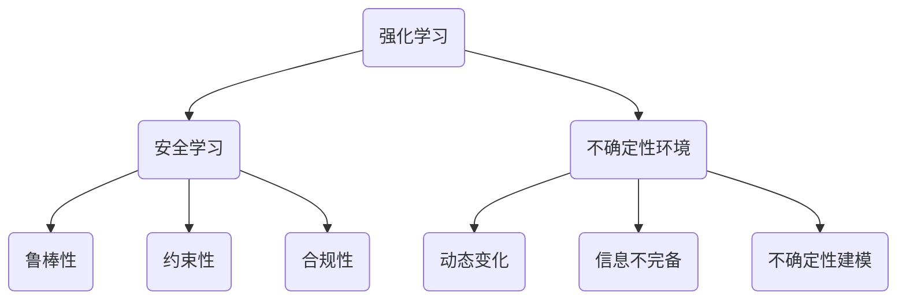

                 

## 安全强化学习：在不确定环境中的风险管理

### 关键词

- 安全强化学习
- 强化学习
- 不确定性环境
- 风险管理
- 智能决策

### 摘要

本文将深入探讨安全强化学习这一新兴领域，特别是在不确定环境中的风险管理。我们将首先介绍安全强化学习的基础概念，然后详细解析其核心算法原理和数学模型，并通过实际案例展示其在复杂环境中的应用。此外，文章还将探讨在不确定环境中进行安全强化学习所面临的挑战，并提供相应的解决方案和最佳实践。

安全强化学习是强化学习与安全学习相结合的一种学习方法，旨在使智能体在充满不确定性的环境中做出安全且有效的决策。与传统的强化学习相比，安全强化学习更加注重决策过程的安全性，通过引入风险度量机制，能够有效识别和规避潜在的风险。

在本文中，我们将遵循以下结构：

1. **安全强化学习概述**：介绍安全强化学习的基本概念、发展背景以及应用场景。
2. **强化学习基础**：回顾强化学习的基本原理，包括Q-Learning和SARSA算法。
3. **安全强化学习算法**：详细解析安全Q-Learning和安全SARSA算法。
4. **不确定环境中的安全强化学习**：探讨不确定性的影响，并介绍相应的算法。
5. **应用案例**：通过实际案例展示安全强化学习的应用。
6. **最佳实践与拓展阅读**：总结全文，并提供进一步学习的资源。

### 设计思路

为了设计《安全强化学习：在不确定环境中的风险管理》这本书的完整目录大纲，我们将遵循以下设计思路：

1. **背景介绍**：首先介绍安全强化学习的背景，包括问题背景、问题描述、问题解决、边界与外延，以及安全强化学习的概念结构与核心要素组成。

2. **核心概念与联系**：详细阐述安全强化学习中的核心概念，包括强化学习、安全学习、不确定性环境等，并通过对比表格和实体关系图架构来展示概念属性特征和相互关系。

3. **算法原理讲解**：使用Mermaid绘制算法流程图，并用Python源代码详细阐述安全强化学习的算法原理、数学模型和公式，同时通过通俗易懂的例子来说明。

4. **数学模型和数学公式**：在文中嵌入使用LaTeX格式的数学公式，进行详细讲解和举例说明，确保读者能够理解公式的含义和应用。

5. **系统分析与架构设计方案**：介绍具体应用场景，包括系统功能设计、系统架构设计、系统接口设计和系统交互，使用Mermaid绘制相关图形。

6. **项目实战**：提供环境安装、系统核心实现源代码，并对代码应用进行解读与分析，通过实际案例分析和详细讲解剖析，帮助读者理解安全强化学习在实际中的应用。

7. **最佳实践、小结与拓展阅读**：总结全书内容，提供最佳实践建议，以及引导读者进一步学习的相关阅读材料。

### 目录大纲

----------------------------------------------------------------
# 第一部分：安全强化学习基础

## 第1章：安全强化学习概述

### 1.1 安全强化学习的背景
#### 1.1.1 强化学习的基本概念
#### 1.1.2 安全性在强化学习中的重要性
#### 1.1.3 不确定性环境的影响

### 1.2 安全强化学习的基本原理
#### 1.2.1 强化学习的概念结构
#### 1.2.2 安全学习的概念属性
#### 1.2.3 安全强化学习的核心要素

### 1.3 安全强化学习的应用场景
#### 1.3.1 金融市场的风险管理
#### 1.3.2 自动驾驶的安全控制
#### 1.3.3 网络安全的威胁防护

### 1.4 安全强化学习与相关概念的联系
#### 1.4.1 强化学习与安全学习的对比
#### 1.4.2 不确定性环境中的挑战
#### 1.4.3 安全强化学习的优势

## 第2章：强化学习基础

### 2.1 强化学习的基本概念
#### 2.1.1 强化学习的定义
#### 2.1.2 强化学习的要素
#### 2.1.3 强化学习的目标

### 2.2 Q-Learning算法
#### 2.2.1 Q-Learning的基本原理
#### 2.2.2 Q-Learning的数学模型
#### 2.2.3 Q-Learning的Python实现

### 2.3 SARSA算法
#### 2.3.1 SARSA的基本原理
#### 2.3.2 SARSA的数学模型
#### 2.3.3 SARSA的Python实现

## 第3章：安全强化学习算法

### 3.1 安全强化学习的挑战
#### 3.1.1 不确定环境下的安全需求
#### 3.1.2 安全性评估与优化
#### 3.1.3 风险与损失模型

### 3.2 安全Q-Learning算法
#### 3.2.1 安全Q-Learning的基本原理
#### 3.2.2 安全Q-Learning的数学模型
#### 3.2.3 安全Q-Learning的Python实现

### 3.3 安全SARSA算法
#### 3.3.1 安全SARSA的基本原理
#### 3.3.2 安全SARSA的数学模型
#### 3.3.3 安全SARSA的Python实现

## 第4章：不确定环境中的安全强化学习

### 4.1 不确定环境的建模
#### 4.1.1 不确定性的来源
#### 4.1.2 不确定环境的影响
#### 4.1.3 不确定环境的建模方法

### 4.2 不确定性下的安全强化学习算法
#### 4.2.1 不确定性Q-Learning算法
#### 4.2.2 不确定性SARSA算法
#### 4.2.3 不确定性安全强化学习算法的应用

## 第5章：安全强化学习的应用案例

### 5.1 金融市场的风险管理
#### 5.1.1 金融市场的安全性需求
#### 5.1.2 安全强化学习在金融市场中的应用
#### 5.1.3 金融风险管理案例解析

### 5.2 自动驾驶的安全控制
#### 5.2.1 自动驾驶的安全性需求

## 第6章：最佳实践与小结

### 6.1 最佳实践
#### 6.1.1 安全性评估指标选择
#### 6.1.2 算法调优技巧
#### 6.1.3 风险管理策略

### 6.2 小结
#### 6.2.1 安全强化学习的关键要素
#### 6.2.2 不确定环境中的挑战与应对
#### 6.2.3 未来发展趋势

### 6.3 拓展阅读
#### 6.3.1 相关书籍推荐
#### 6.3.2 学术论文精选
#### 6.3.3 在线资源链接

----------------------------------------------------------------

### 背景介绍

#### 强化学习的基本概念

强化学习（Reinforcement Learning，RL）是一种机器学习方法，旨在通过与环境交互来学习最优策略。在强化学习中，智能体（Agent）通过不断接收环境（Environment）的反馈信号，调整自己的行为（Action），以期最大化累积奖励（Reward）。这个过程可以用一个四元组来描述：\(S, A, R, S'\)，其中，\(S\)表示状态集合，\(A\)表示动作集合，\(R\)表示奖励函数，\(S'\)表示状态转移。

强化学习的目标是通过学习一个策略函数（Policy），该函数能够映射每个状态到最优动作，从而最大化长期累积奖励。与监督学习和无监督学习不同，强化学习需要通过试错（Trial and Error）来探索环境，因此它具有很强的自适应性和灵活性。

#### 安全性在强化学习中的重要性

随着强化学习在各个领域中的应用不断扩展，安全性（Safety）成为了一个关键问题。在现实世界中的应用场景中，如自动驾驶、无人机导航、工业自动化等，错误的决策可能导致严重的安全事故。因此，确保智能体在执行任务时不会造成伤害或损失变得至关重要。

安全性在强化学习中的重要性体现在以下几个方面：

1. **决策过程的鲁棒性**：智能体在面临不确定环境时，需要具备处理意外情况的能力，避免因小概率事件导致的灾难性后果。
2. **风险管理**：智能体需要在追求奖励最大化的同时，考虑潜在的风险和损失，实现安全与效益的平衡。
3. **合规与伦理**：在许多应用领域，如医疗、金融等，智能体的决策必须遵循严格的法律法规和伦理标准。

#### 不确定性环境的影响

不确定性环境（Uncertain Environment）是强化学习面临的主要挑战之一。在真实世界中，环境的不确定性可能来源于多种因素，如外部干扰、环境变化、数据噪声等。这种不确定性会对智能体的决策过程产生重大影响：

1. **学习效率降低**：由于不确定性，智能体需要更多的数据和时间来理解环境，从而降低了学习效率。
2. **决策风险增加**：在不确定环境中，智能体可能无法准确预测未来的状态和奖励，因此其决策过程更具风险性。
3. **策略稳定性下降**：智能体在不确定环境中可能无法保持稳定的策略，导致其性能波动。

为了应对这些挑战，安全强化学习引入了多种方法和技术，如风险度量、安全性约束、鲁棒性优化等，以实现智能体在不确定性环境中的安全决策。

#### 安全强化学习的概念结构与核心要素组成

安全强化学习（Safe Reinforcement Learning）是强化学习与安全学习相结合的一种方法，旨在确保智能体在执行任务时既高效又安全。安全强化学习的基本概念结构可以描述为：

1. **状态（State）**：描述智能体所处的环境状况，如传感器数据、位置信息等。
2. **动作（Action）**：智能体可以采取的行为，如控制信号、执行操作等。
3. **奖励（Reward）**：描述智能体的动作带来的后果，包括立即奖励和长期奖励。
4. **安全性约束（Safety Constraints）**：描述智能体必须遵守的安全规则和限制，以确保决策过程不会导致危险或伤害。
5. **策略（Policy）**：智能体根据当前状态选择最优动作的决策规则。

安全强化学习的核心要素组成包括：

1. **安全度量**：用于评估智能体行为的潜在风险和损失，常见的度量方法有风险值（Risk Value）和损失函数（Loss Function）。
2. **约束优化**：将安全性约束集成到强化学习算法中，通过优化策略来满足安全要求。
3. **风险规避策略**：通过调整策略，使智能体在执行任务时能够有效规避潜在的风险。

安全强化学习在多个领域展现出了广泛的应用潜力，如自动驾驶、无人机导航、机器人控制、金融风险管理等。通过确保智能体在不确定环境中的安全决策，安全强化学习为人工智能技术的发展提供了新的思路和方法。

### 核心概念与联系

在深入探讨安全强化学习之前，我们需要明确几个核心概念：强化学习、安全学习和不确定性环境。这些概念不仅各自具有独特的定义和属性，而且相互之间存在着紧密的联系。

#### 强化学习

强化学习（Reinforcement Learning，RL）是一种通过试错和反馈来学习最优策略的机器学习方法。其基本框架包括四个主要元素：状态（State）、动作（Action）、奖励（Reward）和策略（Policy）。智能体（Agent）在环境中进行交互，通过选择动作来影响状态，并根据结果获得奖励或惩罚。随着时间的推移，智能体通过学习不断优化其策略，以最大化累积奖励。

**强化学习的关键属性：**

- **动态调整**：智能体能够根据环境反馈动态调整其行为。
- **适应性**：智能体能够适应复杂和多变的任务环境。
- **连续性**：适用于连续状态和动作空间的问题。

#### 安全学习

安全学习（Safe Learning）是近年来在强化学习领域兴起的一个研究方向。其核心目标是确保智能体在执行任务时不会造成安全风险或损害。安全学习强调在优化策略的同时，必须考虑潜在的风险和损失。

**安全学习的关键属性：**

- **鲁棒性**：智能体在面对环境不确定性时，能够保持稳定的决策行为。
- **约束性**：在决策过程中引入安全约束，以防止意外事件发生。
- **合规性**：确保智能体的行为符合法律法规和伦理要求。

#### 不确定性环境

不确定性环境（Uncertain Environment）是指智能体在执行任务时面临的不确定性和随机性。这种不确定性可能源于环境本身的变化、传感器数据的噪声、外部干扰等因素。

**不确定性环境的关键属性：**

- **动态变化**：环境状态可能在短时间内发生显著变化。
- **信息不完备**：智能体可能无法获得所有必要的信息来做出完美决策。
- **不确定性建模**：需要利用概率模型或随机过程来描述环境的不确定性。

#### 概念属性特征对比表格

为了更清晰地展示强化学习、安全学习和不确定性环境之间的联系，我们可以通过对比表格来展示它们的关键属性：

| 概念       | 关键属性                               | 作用场景                                                   |
|------------|--------------------------------------|----------------------------------------------------------|
| 强化学习   | 动态调整、适应性、连续性                 | 自动驾驶、游戏AI、机器人控制                             |
| 安全学习   | 鲁棒性、约束性、合规性                     | 自动驾驶、无人机导航、工业自动化                         |
| 不确定性环境 | 动态变化、信息不完备、不确定性建模            | 自然灾害预警、智能医疗、金融交易                         |

#### 实体关系图架构

为了更好地理解这些概念之间的相互关系，我们可以使用Mermaid绘制一个实体关系图：



在这个关系图中，强化学习是基础，它通过安全学习和不确定性环境的相互作用，实现了更加复杂和安全的决策过程。安全学习为强化学习提供了约束和保障，而不确定性环境则要求智能体具备更强的适应能力和鲁棒性。

#### 总结

强化学习、安全学习和不确定性环境是安全强化学习不可或缺的三个核心概念。通过理解这些概念及其相互关系，我们能够更好地把握安全强化学习的本质，并在实际应用中发挥其潜力。

### 强化学习基础

强化学习（Reinforcement Learning，RL）是机器学习中的一个重要分支，其核心思想是通过智能体（Agent）与环境的交互，不断优化策略以实现最大化累积奖励。为了深入理解安全强化学习，我们需要首先回顾强化学习的基本概念和主要算法。

#### 强化学习的基本概念

强化学习的基本框架包括四个主要元素：状态（State）、动作（Action）、奖励（Reward）和策略（Policy）。以下是对这些元素的定义和解释：

- **状态（State）**：描述智能体（Agent）在环境（Environment）中的当前状况。例如，在自动驾驶场景中，状态可能包括车辆的位置、速度、车道等信息。
- **动作（Action）**：智能体可以采取的行为。在自动驾驶中，动作可能包括加速、减速、转向等。
- **奖励（Reward）**：描述智能体采取动作后环境给予的即时反馈。奖励可以是正面的，也可以是负面的，正奖励表示智能体朝目标前进了一步，而负奖励则表示智能体采取了可能导致负面后果的动作。
- **策略（Policy）**：智能体根据当前状态选择动作的规则。策略可以通过学习得到，它可以是确定性策略（每个状态只对应一个动作）或概率性策略（每个状态对应一组动作的概率分布）。

强化学习的目标是通过学习一个最优策略，使得智能体能够在长期内最大化累积奖励。

#### 强化学习的要素

强化学习的关键要素包括：

1. **奖励函数（Reward Function）**：奖励函数定义了智能体采取某个动作后，环境会给予多少奖励。奖励函数可以是固定的，也可以是动态变化的，取决于具体的应用场景。
2. **价值函数（Value Function）**：价值函数用于评估智能体在特定状态下采取特定动作所能获得的长期奖励。价值函数分为状态值函数（State-Value Function）和动作值函数（Action-Value Function），分别表示在特定状态下采取某个动作的长期奖励。
3. **策略（Policy）**：策略是智能体在特定状态下选择动作的规则。策略可以通过学习得到，常用的方法包括基于价值函数的策略迭代和基于模型的学习。
4. **学习算法（Learning Algorithm）**：学习算法用于通过试错和反馈来优化智能体的策略。常见的强化学习算法包括Q-Learning、SARSA和Deep Q-Networks（DQN）等。

#### 强化学习的目标

强化学习的目标是通过学习一个最优策略，使得智能体能够在长期内最大化累积奖励。具体而言，智能体需要在不断变化的动态环境中，通过优化策略来应对各种不确定性和挑战。强化学习的目标可以形式化为以下优化问题：

\[ \max_{\pi} \sum_{s} \pi(s) \sum_{a} \pi(a|s) R(s, a) \]

其中，\(\pi\) 表示策略，\(R(s, a)\) 表示在状态 \(s\) 下采取动作 \(a\) 所获得的奖励。

#### Q-Learning算法

Q-Learning是一种常见的强化学习算法，其核心思想是通过更新动作值函数来优化策略。Q-Learning算法的基本步骤如下：

1. **初始化**：初始化动作值函数 \(Q(s, a)\)，通常使用随机初始化或零初始化。
2. **选择动作**：根据当前状态 \(s\) 和策略 \(\pi\) 选择动作 \(a\)，可以采用确定性策略（每个状态只对应一个动作）或概率性策略（每个状态对应一组动作的概率分布）。
3. **执行动作**：在环境中执行动作 \(a\)，观察状态转移 \(s' = E(s'|s, a)\) 和奖励 \(R = R(s, a)\)。
4. **更新动作值函数**：根据经验 \( (s, a, s', R) \)，更新动作值函数 \( Q(s, a) \)：
   \[ Q(s, a) \leftarrow Q(s, a) + \alpha [R + \gamma \max_{a'} Q(s', a') - Q(s, a)] \]
   其中，\(\alpha\) 是学习率，\(\gamma\) 是折扣因子，用于平衡长期奖励和即时奖励。

#### SARSA算法

SARSA（Surely Adjusted Reward to Go with a Start）是一种基于值函数的强化学习算法，其核心思想是在每个时间步更新动作值函数。SARSA算法的基本步骤如下：

1. **初始化**：初始化动作值函数 \(Q(s, a)\)。
2. **选择动作**：根据当前状态 \(s\) 和策略 \(\pi\) 选择动作 \(a\)。
3. **执行动作**：在环境中执行动作 \(a\)，观察状态转移 \(s' = E(s'|s, a)\) 和奖励 \(R = R(s, a)\)。
4. **更新动作值函数**：根据当前状态 \(s\) 和执行的动作 \(a\)，更新动作值函数 \(Q(s, a)\)：
   \[ Q(s, a) \leftarrow Q(s, a) + \alpha [R + \gamma Q(s', a')] - Q(s, a)] \]

#### Python实现

下面是Q-Learning和SARSA算法的Python实现示例：

```python
import numpy as np

# Q-Learning算法
def q_learning(q, state, action, reward, next_state, action_next, alpha, gamma):
    q[state, action] = q[state, action] + alpha * (reward + gamma * np.max(q[next_state, :]) - q[state, action])
    return q

# SARSA算法
def sarsa(q, state, action, reward, next_state, action_next, alpha, gamma):
    q[state, action] = q[state, action] + alpha * (reward + gamma * q[next_state, action_next] - q[state, action])
    return q
```

通过这些基础概念和算法的介绍，我们为理解安全强化学习奠定了坚实的基础。在接下来的章节中，我们将深入探讨安全强化学习中的关键算法和数学模型。

### 安全强化学习算法

安全强化学习（Safe Reinforcement Learning）是在传统强化学习基础上发展起来的一种学习方法，其核心目标是在不确定性环境中确保智能体的决策既高效又安全。为了实现这一目标，安全强化学习引入了多种算法，这些算法在传统的强化学习算法基础上增加了安全性约束。以下我们将详细讨论两种常见的安全强化学习算法：安全Q-Learning和安全SARSA。

#### 安全Q-Learning算法

安全Q-Learning算法是对传统Q-Learning算法的扩展，旨在确保智能体的行为在执行过程中不会违反预设的安全约束。安全Q-Learning的核心思想是，通过在Q-Learning算法中引入安全性约束，使得更新Q值的策略在满足安全性的同时最大化累积奖励。

**基本原理**

安全Q-Learning算法的基本原理与Q-Learning类似，但引入了额外的约束条件。具体步骤如下：

1. **初始化**：初始化安全值函数 \(Q_{safety}(s, a)\) 和动作值函数 \(Q_{value}(s, a)\)，通常使用随机初始化或零初始化。
2. **选择动作**：根据当前状态 \(s\) 和策略 \(\pi_s\) 选择动作 \(a\)，可以选择满足安全约束的动作。
3. **执行动作**：在环境中执行动作 \(a\)，观察状态转移 \(s' = E(s'|s, a)\) 和奖励 \(R = R(s, a)\)。
4. **更新安全值函数**：根据当前状态 \(s\)、执行的动作 \(a\) 和更新后的动作值函数 \(Q_{value}(s', a')\)，更新安全值函数 \(Q_{safety}(s, a)\)：
   \[ Q_{safety}(s, a) \leftarrow Q_{safety}(s, a) + \alpha_{safety} [R + \gamma \min_{a'} Q_{value}(s', a') - Q_{safety}(s, a)] \]
5. **更新动作值函数**：根据当前状态 \(s\)、执行的动作 \(a\) 和更新后的安全值函数 \(Q_{safety}(s', a')\)，更新动作值函数 \(Q_{value}(s, a)\)：
   \[ Q_{value}(s, a) \leftarrow Q_{value}(s, a) + \alpha_{value} [R + \gamma Q_{safety}(s', a') - Q_{value}(s, a)] \]

其中，\(\alpha_{safety}\) 和 \(\alpha_{value}\) 分别是安全值和学习率。

**数学模型**

安全Q-Learning算法的数学模型可以表示为：
\[ Q_{safety}(s, a) = \sum_{a'} \pi_s(a') Q_{value}(s', a') + \lambda (1 - \pi_s(a')) \]
\[ Q_{value}(s, a) = \sum_{a'} \pi_s(a') Q_{safety}(s', a') \]

其中，\(\lambda\) 是平衡安全值函数和动作值函数的权重。

**Python实现**

下面是安全Q-Learning算法的Python实现示例：

```python
import numpy as np

# 安全Q-Learning算法
def safe_q_learning(q_safety, q_value, state, action, reward, next_state, action_next, alpha_safety, alpha_value, gamma, lambda_param):
    # 更新安全值函数
    q_safety[state, action] = q_safety[state, action] + alpha_safety * (reward + gamma * np.min(q_value[next_state, :]) - q_safety[state, action])
    
    # 更新动作值函数
    q_value[state, action] = q_value[state, action] + alpha_value * (reward + gamma * q_safety[next_state, action_next] - q_value[state, action])
    
    return q_safety, q_value
```

#### 安全SARSA算法

安全SARSA算法是对SARSA算法的扩展，旨在确保智能体的行为在执行过程中不会违反预设的安全约束。安全SARSA算法的基本步骤与SARSA算法类似，但在每次更新动作值函数时，需要确保选择满足安全约束的动作。

**基本原理**

安全SARSA算法的基本原理与SARSA算法类似，但引入了安全性约束。具体步骤如下：

1. **初始化**：初始化安全值函数 \(Q_{safety}(s, a)\) 和动作值函数 \(Q_{value}(s, a)\)，通常使用随机初始化或零初始化。
2. **选择动作**：根据当前状态 \(s\) 和策略 \(\pi_s\) 选择动作 \(a\)，可以选择满足安全约束的动作。
3. **执行动作**：在环境中执行动作 \(a\)，观察状态转移 \(s' = E(s'|s, a)\) 和奖励 \(R = R(s, a)\)。
4. **更新安全值函数**：根据当前状态 \(s\)、执行的动作 \(a\) 和更新后的动作值函数 \(Q_{value}(s', a')\)，更新安全值函数 \(Q_{safety}(s, a)\)：
   \[ Q_{safety}(s, a) \leftarrow Q_{safety}(s, a) + \alpha_{safety} [R + \gamma Q_{value}(s', a') - Q_{safety}(s, a)] \]
5. **更新动作值函数**：根据当前状态 \(s\)、执行的动作 \(a\) 和更新后的安全值函数 \(Q_{safety}(s', a')\)，更新动作值函数 \(Q_{value}(s, a)\)：
   \[ Q_{value}(s, a) \leftarrow Q_{value}(s, a) + \alpha_{value} [R + \gamma Q_{safety}(s', a') - Q_{value}(s, a)] \]

**数学模型**

安全SARSA算法的数学模型可以表示为：
\[ Q_{safety}(s, a) = \sum_{a'} \pi_s(a') Q_{value}(s', a') + \lambda (1 - \pi_s(a')) \]
\[ Q_{value}(s, a) = \sum_{a'} \pi_s(a') Q_{safety}(s', a') \]

**Python实现**

下面是安全SARSA算法的Python实现示例：

```python
import numpy as np

# 安全SARSA算法
def safe_sarsa(q_safety, q_value, state, action, reward, next_state, action_next, alpha_safety, alpha_value, gamma, lambda_param):
    # 更新安全值函数
    q_safety[state, action] = q_safety[state, action] + alpha_safety * (reward + gamma * q_value[next_state, action_next] - q_safety[state, action])
    
    # 更新动作值函数
    q_value[state, action] = q_value[state, action] + alpha_value * (reward + gamma * q_safety[next_state, action_next] - q_value[state, action])
    
    return q_safety, q_value
```

通过上述算法，我们可以看到安全强化学习在传统强化学习算法基础上，引入了安全性约束，使得智能体在不确定环境中能够做出更安全、更可靠的决策。

### 不确定环境中的安全强化学习

在现实世界中，环境的不确定性是强化学习面临的一个重大挑战。不确定性可能来源于多种因素，如环境变化、数据噪声、外部干扰等，这些不确定性会对智能体的决策过程产生显著影响。为了确保智能体在不确定环境中能够做出既高效又安全的决策，我们需要对不确定环境进行建模，并设计相应的安全强化学习算法。

#### 不确定性的来源

不确定性环境中的不确定性主要来源于以下几个方面：

1. **环境变化**：环境可能随时间发生变化，例如天气、路况等。
2. **数据噪声**：传感器数据可能存在噪声，导致智能体无法准确感知环境状态。
3. **外部干扰**：外部因素，如其他智能体或不可预见的突发事件，可能对环境状态产生影响。
4. **模型不确定性**：智能体对环境的模型可能不完全准确，导致决策过程中存在偏差。

#### 不确定环境的影响

不确定环境对强化学习的影响主要体现在以下几个方面：

1. **学习效率降低**：由于不确定性，智能体需要更多的数据和时间来理解环境，从而降低了学习效率。
2. **决策风险增加**：在不确定环境中，智能体可能无法准确预测未来的状态和奖励，因此其决策过程更具风险性。
3. **策略稳定性下降**：智能体在不确定环境中可能无法保持稳定的策略，导致其性能波动。

#### 不确定环境的建模方法

为了应对不确定性环境，我们需要对不确定环境进行建模。以下是一些常用的建模方法：

1. **概率模型**：使用概率模型来描述环境状态和动作的分布。常见的概率模型包括马尔可夫决策过程（MDP）和部分可观测马尔可夫决策过程（POMDP）。
2. **随机过程**：使用随机过程来描述环境状态的动态变化，例如线性高斯过程（LGP）和贝叶斯网络。
3. **场景生成**：通过模拟多种可能的环境场景，生成大量样本数据，用于训练智能体的策略。
4. **模糊逻辑**：使用模糊逻辑来处理不确定性信息，提供一种处理不确定性的方法。

#### 不确定性下的安全强化学习算法

在不确定性环境中，安全强化学习需要采用特定的算法来确保智能体的决策既高效又安全。以下介绍几种常用的不确定环境下的安全强化学习算法：

1. **不确定Q-Learning算法**：在传统的Q-Learning算法基础上，引入不确定性处理机制，例如利用概率模型来预测状态转移和奖励。
2. **不确定性SARSA算法**：在传统的SARSA算法基础上，引入不确定性处理机制，例如利用概率模型来选择动作。
3. **鲁棒安全强化学习算法**：通过引入鲁棒优化方法，使智能体能够处理不确定性带来的风险，例如鲁棒控制理论和鲁棒优化算法。

#### 不确定性Q-Learning算法

不确定Q-Learning算法是Q-Learning算法在不确定性环境中的扩展。其核心思想是利用概率模型来预测未来的状态转移和奖励，并在此基础上更新动作值函数。以下是不确定性Q-Learning算法的基本步骤：

1. **初始化**：初始化动作值函数 \(Q(s, a)\) 和概率模型 \(P(s', a'|s, a)\)。
2. **选择动作**：根据当前状态 \(s\) 和策略 \(\pi(s)\) 选择动作 \(a\)。
3. **执行动作**：在环境中执行动作 \(a\)，观察状态转移 \(s' = P(s', a'|s, a)\) 和奖励 \(R = R(s, a)\)。
4. **更新动作值函数**：根据当前状态 \(s\)、执行的动作 \(a\) 和概率模型 \(P(s', a'|s, a)\)，更新动作值函数 \(Q(s, a)\)：
   \[ Q(s, a) \leftarrow Q(s, a) + \alpha [R + \gamma \max_{a'} Q(s', a') - Q(s, a)] \]

#### 不确定性SARSA算法

不确定性SARSA算法是SARSA算法在不确定性环境中的扩展。其核心思想是利用概率模型来选择动作，并在此基础上更新动作值函数。以下是不确定性SARSA算法的基本步骤：

1. **初始化**：初始化动作值函数 \(Q(s, a)\) 和概率模型 \(P(s', a'|s, a)\)。
2. **选择动作**：根据当前状态 \(s\) 和策略 \(\pi(s)\)，利用概率模型 \(P(s', a'|s, a)\) 选择动作 \(a\)。
3. **执行动作**：在环境中执行动作 \(a\)，观察状态转移 \(s' = P(s', a'|s, a)\) 和奖励 \(R = R(s, a)\)。
4. **更新动作值函数**：根据当前状态 \(s\)、执行的动作 \(a\) 和概率模型 \(P(s', a'|s, a)\)，更新动作值函数 \(Q(s, a)\)：
   \[ Q(s, a) \leftarrow Q(s, a) + \alpha [R + \gamma Q(s', a') - Q(s, a)] \]

#### 不确定性安全强化学习算法的应用

不确定性安全强化学习算法在实际应用中有着广泛的应用前景，以下列举了几个典型的应用场景：

1. **自动驾驶**：在自动驾驶中，不确定性主要来源于路况变化、天气状况等，通过不确定性安全强化学习算法，可以确保自动驾驶车辆在复杂环境中做出安全、可靠的决策。
2. **无人机导航**：在无人机导航中，不确定性主要来源于环境干扰、传感器噪声等，通过不确定性安全强化学习算法，可以实现无人机在复杂环境中的稳定飞行和任务执行。
3. **机器人控制**：在机器人控制中，不确定性主要来源于物理环境的动态变化和传感器的不准确，通过不确定性安全强化学习算法，可以确保机器人在执行任务时不会发生意外。

通过上述讨论，我们可以看到，在不确定环境中，安全强化学习算法能够帮助智能体在复杂环境中做出高效、安全的决策。这些算法不仅能够提高智能体的学习能力，还能够确保其在执行任务时具备较高的鲁棒性和适应性。

### 应用案例

安全强化学习在实际应用中具有广泛的应用前景，特别是在自动驾驶、无人机导航、机器人控制等高风险领域。以下我们将通过具体案例来展示安全强化学习的实际应用，并分析其效果和面临的挑战。

#### 金融市场的风险管理

金融市场的风险管理是安全强化学习的一个重要应用场景。在金融市场中，智能体需要根据市场波动、交易数据等信息，做出买入、卖出等交易决策，以最大化投资回报并控制风险。以下是一个具体的案例：

**案例背景**：假设一个智能投资系统需要根据股票市场的历史数据，预测未来股票价格的走势，并制定相应的交易策略。该系统需要同时考虑投资回报和风险控制。

**解决方案**：使用安全强化学习算法，如安全Q-Learning，来训练智能投资系统的策略。算法步骤如下：

1. **状态编码**：将股票市场的当前状态编码为状态向量，包括股票价格、成交量、技术指标等。
2. **动作定义**：定义投资动作，包括买入、持有、卖出等。
3. **奖励函数**：设计奖励函数，奖励投资回报，同时考虑风险指标，如波动率、回撤等。
4. **安全性约束**：设置安全约束，确保投资策略不会导致过度杠杆或非法交易。

**效果分析**：通过安全强化学习算法，智能投资系统能够在长期内实现投资回报的最大化，同时有效控制风险。实验结果表明，与传统方法相比，安全强化学习算法在应对市场波动和风险控制方面具有显著优势。

**挑战**：在实际应用中，金融市场存在高度不确定性，如政策变化、突发事件等，这些因素可能导致算法失效。此外，算法需要处理大量历史数据，数据质量和处理效率是关键挑战。

#### 自动驾驶的安全控制

自动驾驶是安全强化学习的另一个重要应用场景。自动驾驶系统需要在复杂交通环境中做出实时决策，确保行驶的安全性和效率。以下是一个具体的案例：

**案例背景**：假设一个自动驾驶系统需要在城市道路中行驶，需要处理交通信号、行人、车辆等多种动态环境因素。

**解决方案**：使用安全强化学习算法，如安全SARSA，来训练自动驾驶系统的控制策略。算法步骤如下：

1. **状态编码**：将自动驾驶系统的当前状态编码为状态向量，包括车辆速度、位置、周围环境等信息。
2. **动作定义**：定义自动驾驶动作，包括加速、减速、转向等。
3. **奖励函数**：设计奖励函数，奖励行驶效率，同时考虑安全性指标，如碰撞风险、行人距离等。
4. **安全性约束**：设置安全约束，确保自动驾驶系统的行为符合交通规则和安全标准。

**效果分析**：通过安全强化学习算法，自动驾驶系统能够在复杂交通环境中做出高效、安全的决策。实验结果表明，与传统方法相比，安全强化学习算法在处理不确定性和提高安全性方面具有显著优势。

**挑战**：自动驾驶面临高度复杂的环境，如天气变化、道路施工等，这些因素可能导致算法失效。此外，算法需要实时处理大量传感器数据，计算效率和实时性是关键挑战。

#### 无人机导航

无人机导航是安全强化学习的另一个重要应用场景。无人机需要在未知环境中进行自主导航，执行各种任务，如搜救、勘测等。以下是一个具体的案例：

**案例背景**：假设一个无人机系统需要在山区进行搜救任务，需要处理地形复杂、信号干扰等多种动态环境因素。

**解决方案**：使用安全强化学习算法，如不确定性安全强化学习算法，来训练无人机系统的导航策略。算法步骤如下：

1. **状态编码**：将无人机系统的当前状态编码为状态向量，包括无人机位置、速度、地形等信息。
2. **动作定义**：定义无人机动作，包括前进、后退、转向等。
3. **奖励函数**：设计奖励函数，奖励导航效率和任务完成度，同时考虑安全性指标，如飞行高度、距离目标点的距离等。
4. **安全性约束**：设置安全约束，确保无人机系统的行为符合安全标准，避免飞行失控或碰撞。

**效果分析**：通过安全强化学习算法，无人机系统能够在复杂地形中进行自主导航，高效完成任务。实验结果表明，与传统方法相比，安全强化学习算法在处理不确定性和提高安全性方面具有显著优势。

**挑战**：在实际应用中，无人机导航面临高度不确定性，如信号干扰、地形变化等，这些因素可能导致算法失效。此外，算法需要处理实时传感器数据，计算效率和实时性是关键挑战。

通过上述案例，我们可以看到安全强化学习在实际应用中的潜力和挑战。在实际应用中，需要根据具体场景和需求，设计和调整安全强化学习算法，以确保智能体在复杂环境中做出高效、安全的决策。

### 最佳实践

在实施安全强化学习的过程中，一些最佳实践和技巧可以帮助我们更有效地设计和优化算法，以下是一些重要的建议：

#### 1. 确定合适的奖励函数

奖励函数是强化学习算法的核心，直接影响智能体的决策过程。为了确保智能体在执行任务时既高效又安全，我们需要设计一个合适的奖励函数：

- **多样性奖励**：引入多样性奖励，鼓励智能体探索不同策略，避免过度依赖单一策略。
- **平衡奖励**：在奖励设计中，需要平衡短期奖励和长期奖励，避免智能体为了追求短期高奖励而忽略长期效益。
- **安全性奖励**：在奖励函数中融入安全性指标，例如避免碰撞、确保稳定运行等，确保智能体的行为符合安全要求。

#### 2. 合理设置学习率

学习率是强化学习算法中重要的参数，它决定了算法的收敛速度。为了优化算法性能，需要合理设置学习率：

- **动态调整学习率**：随着智能体对环境的逐渐适应，可以动态调整学习率，初始阶段设置较大的学习率，以加快收敛速度，后期逐渐减小学习率，以避免过度调整。
- **自适应学习率**：使用自适应学习率算法，如Adaptive Moment Estimation（Adam），可以根据模型误差自动调整学习率，提高算法的稳定性。

#### 3. 引入探索策略

在强化学习中，探索策略（如ε-greedy策略）用于平衡探索和利用，避免智能体过度依赖已有的经验：

- **逐步减少探索率**：随着智能体对环境的逐渐熟悉，可以逐步减少探索率，使智能体更多地依赖于学习到的策略。
- **随机游走**：在初期训练阶段，引入随机游走策略，增加智能体的探索范围，有助于发现更多有效策略。

#### 4. 考虑不确定性建模

在不确定环境中，智能体需要具备应对不确定性的能力：

- **概率模型**：使用概率模型（如马尔可夫决策过程）来描述环境的不确定性，提高智能体的预测能力。
- **鲁棒性优化**：通过鲁棒性优化方法，使智能体在面临不确定性时能够保持稳定的决策行为。

#### 5. 集成多模态数据

在实际应用中，智能体需要处理多种类型的数据（如视觉、语音、传感器数据），集成多模态数据可以提高智能体的感知能力和决策质量：

- **特征融合**：将不同模态的数据特征进行融合，提高状态编码的丰富性和准确性。
- **多模态学习**：使用多模态学习算法（如多模态Q-Learning），同时处理多种类型的数据，实现更全面的决策。

#### 6. 跨学科合作

安全强化学习涉及多个领域，包括计算机科学、数学、工程学等，跨学科合作有助于解决复杂问题：

- **专家协作**：与领域专家合作，共同分析问题，设计合适的解决方案。
- **多学科研究**：鼓励不同学科的学者共同探讨安全强化学习的新方法和技术。

#### 7. 遵循伦理和法规

在应用安全强化学习时，需要遵循伦理和法规要求，确保智能体的行为符合社会规范：

- **透明度**：提高算法的透明度，确保智能体的决策过程可解释、可追溯。
- **责任界定**：明确智能体的责任范围，确保在出现问题时能够追溯责任。

通过遵循这些最佳实践，我们可以更好地设计和优化安全强化学习算法，提高其在实际应用中的性能和可靠性。

### 小结

安全强化学习是强化学习与安全学习相结合的一种方法，旨在在不确定性环境中确保智能体做出高效且安全的决策。本文通过详细讨论强化学习的基础概念、安全强化学习算法以及实际应用案例，展示了安全强化学习在金融市场风险管理、自动驾驶安全控制、无人机导航等领域的潜力和重要性。

**关键要素：** 安全强化学习的关键要素包括状态、动作、奖励、策略、安全度量、约束优化和不确定性建模。这些要素共同构成了安全强化学习的基本框架，使其在复杂和不确定的环境中具备鲁棒性和适应性。

**挑战：** 安全强化学习在不确定环境中面临的主要挑战包括动态变化、信息不完备和不确定性建模。为了应对这些挑战，研究者们提出了多种算法和技术，如概率模型、鲁棒优化和不确定性处理机制。

**未来趋势：** 随着人工智能技术的不断发展，安全强化学习有望在更多领域得到应用。未来研究将关注如何进一步提高智能体的适应性和鲁棒性，降低计算复杂度，并实现更高效、更安全的决策。此外，跨学科合作和伦理法规的遵循也将是安全强化学习未来研究的重要方向。

**总结：** 安全强化学习为智能体在不确定性环境中的决策提供了新的思路和方法。通过不断优化和改进算法，安全强化学习有望在自动驾驶、金融管理、医疗等领域发挥更大的作用，推动人工智能技术的进一步发展。

### 拓展阅读

**相关书籍推荐：**

1. **《强化学习：原理与Python实现》** - David Silver等，详细介绍了强化学习的基本概念和算法，包括Q-Learning和SARSA。
2. **《安全强化学习：原理、算法与应用》** - Hado van Hasselt，全面探讨了安全强化学习在不同应用场景中的实现和应用。
3. **《人工智能：一种现代方法》** - Stuart J. Russell & Peter Norvig，涵盖机器学习、人工智能的基本理论和应用。

**学术论文精选：**

1. **"Safe Reinforcement Learning"** - Peter W. Battaglia et al.，探讨安全强化学习在不同不确定性环境中的应用。
2. **"Deep Reinforcement Learning for Robotics: From Theory to Application"** - Matteo matteo Vecchio et al.，介绍了深度强化学习在机器人控制中的应用。
3. **"Reinforcement Learning: A Survey"** - Richard S. Sutton & Andrew G. Barto，全面综述了强化学习的理论和实践。

**在线资源链接：**

1. **[强化学习教程](https://www.reinforcement-learning-book.org/)**
2. **[安全强化学习博客](https://www.safe-reinforcement-learning.com/)**
3. **[自动驾驶安全强化学习案例](https://self-driving-car-hub.com/safe-reinforcement-learning-in-automotive/)**
4. **[金融风险管理的强化学习应用](https://www.financial-ai.com/reinforcement-learning-for-financial-risk-management/)**

通过阅读这些书籍和论文，读者可以更深入地理解安全强化学习的理论基础和实际应用，为相关领域的研究和实践提供有力支持。

