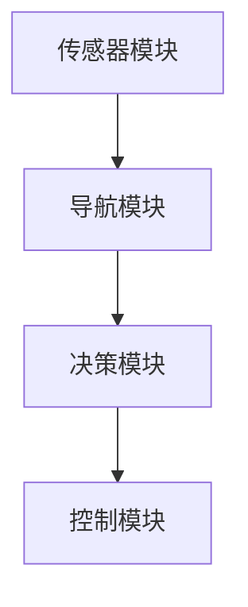
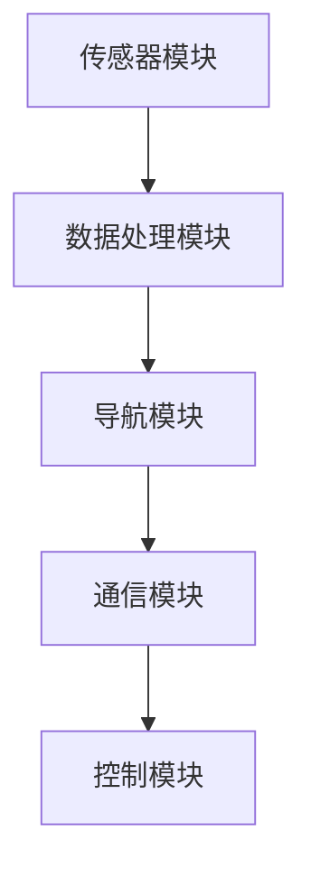
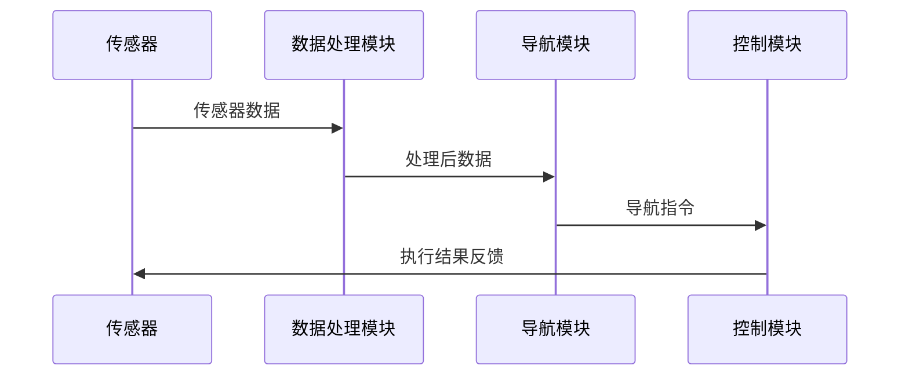
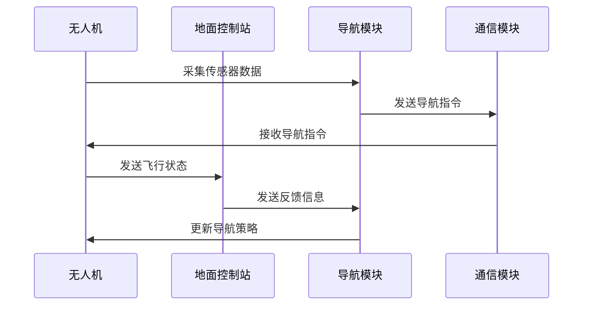

                 

### 文章标题

**安全强化学习在自主无人机导航中的实现策略**

---

**关键词：** 安全强化学习、自主无人机导航、算法设计、系统架构、项目实战

**摘要：** 本文深入探讨了安全强化学习在自主无人机导航中的应用策略。首先介绍了无人机导航的背景和挑战，然后详细讲解了安全强化学习的基本原理和应用场景。接着，本文重点讨论了安全强化学习算法的设计和实现，包括算法设计原则、设计步骤、实现技巧以及性能优化策略。此外，本文还详细阐述了自主无人机导航系统的架构设计和实现，包括系统架构设计、接口设计、实现细节以及系统部署和测试。最后，通过一个具体的项目实战，展示了安全强化学习的实际应用效果，并提供了最佳实践和总结。

---

### 目录大纲

----------------------------------------------------------------

# 第一部分: 引言

## 第1章: 问题背景与核心概念

### 1.1.1 无人机导航背景

### 1.1.2 安全强化学习概述

### 1.1.3 自主无人机导航中的挑战与安全需求

### 1.1.4 安全强化学习在无人机导航中的应用前景

## 第2章: 安全强化学习基础

### 2.1.1 强化学习原理

### 2.1.2 安全性要求

### 2.1.3 安全强化学习算法

### 2.1.4 安全强化学习算法的属性和评估指标

## 第3章: 自主无人机导航系统概述

### 3.1.1 无人机导航技术概述

### 3.1.2 自主导航系统架构

### 3.1.3 无人机导航系统功能模块

## 第4章: 安全强化学习在无人机导航中的应用场景

### 4.1.1 导航路径规划

### 4.1.2 空中交通管理

### 4.1.3 紧急情况应对

### 4.1.4 能源管理

## 第5章: 安全强化学习算法设计与实现

### 5.1.1 安全强化学习算法设计原则

### 5.1.2 算法设计步骤

### 5.1.3 算法实现技巧

### 5.1.4 算法性能优化

## 第6章: 系统架构设计与实现

### 6.1.1 系统架构设计

### 6.1.2 无人机导航系统接口设计

### 6.1.3 系统实现细节

### 6.1.4 系统部署与测试

## 第7章: 项目实战

### 7.1.1 项目介绍

### 7.1.2 环境安装

### 7.1.3 系统核心实现

### 7.1.4 代码应用解读与分析

### 7.1.5 实际案例分析与讲解

### 7.1.6 项目小结

## 第8章: 最佳实践与总结

### 8.1.1 最佳实践

### 8.1.2 小结与展望

### 8.1.3 注意事项

### 8.1.4 拓展阅读

----------------------------------------------------------------

### 第1章: 问题背景与核心概念

在当今快速发展的科技时代，无人机（Unmanned Aerial Vehicles，简称UAV）已经成为了一个热门的研究和应用领域。随着无人机在物流运输、环境监测、农业、搜救等多个领域的广泛应用，无人机导航（Unmanned Navigation）技术的需求日益增加。然而，在自主无人机导航过程中，安全性问题成为了制约其广泛应用的关键因素。

**1.1.1 无人机导航背景**

无人机导航是指通过自主控制系统，使无人机在复杂的环境中自主完成导航任务的过程。无人机导航系统通常由传感器、导航模块、决策模块和控制模块组成。传感器用于获取环境信息，导航模块用于计算飞行路径，决策模块用于制定飞行策略，控制模块则负责执行飞行指令。

在无人机导航过程中，主要面临以下挑战：

1. **环境复杂性**：无人机需要自主应对复杂的自然环境，如森林、城市、山区等。
2. **动态性**：环境中的障碍物、天气变化等因素会不断影响无人机导航。
3. **不确定性**：无人机在导航过程中可能会遇到无法预测的突发事件。
4. **安全性**：无人机的导航需要保证飞行安全，避免与其他无人机或地面物体发生碰撞。

**1.1.2 安全强化学习概述**

强化学习（Reinforcement Learning，简称RL）是一种通过试错来优化行为策略的机器学习方法。在强化学习中，智能体（Agent）通过与环境（Environment）的交互，不断学习最佳行为策略。强化学习广泛应用于游戏、自动驾驶、机器人等领域。

安全强化学习（Safe Reinforcement Learning）是在传统强化学习的基础上，增加了安全性的考虑。安全强化学习的目标不仅是在环境中获得高回报，还要确保学习过程中的安全性。在自主无人机导航中，安全强化学习可以帮助无人机在面对复杂和动态环境时，做出既安全又有效的决策。

**1.1.3 自主无人机导航中的挑战与安全需求**

在自主无人机导航中，安全性是至关重要的。以下是一些主要挑战和安全需求：

1. **避免碰撞**：无人机需要识别并避让其他无人机和地面物体，以防止碰撞事故。
2. **应对恶劣天气**：无人机需要在各种天气条件下稳定飞行，如雷雨、大雾等。
3. **异常情况处理**：无人机需要具备应对突发事件的自我修复和调整能力。
4. **数据隐私保护**：无人机在导航过程中需要保护传感器收集的数据不被泄露。

**1.1.4 安全强化学习在无人机导航中的应用前景**

安全强化学习在无人机导航中的应用前景非常广阔。通过安全强化学习，无人机可以在复杂和动态的环境中自主决策，提高导航的效率和安全性。以下是一些潜在的应用场景：

1. **导航路径规划**：安全强化学习可以帮助无人机规划最优路径，避免碰撞和恶劣天气的影响。
2. **空中交通管理**：安全强化学习可以协助无人机系统实现空中交通管理，提高飞行效率。
3. **紧急情况应对**：安全强化学习可以使无人机在遇到紧急情况时，迅速做出安全有效的决策。
4. **能源管理**：安全强化学习可以帮助无人机优化能源使用，延长飞行时间。

总之，安全强化学习在自主无人机导航中的应用具有重要的理论价值和实际意义。本文接下来将深入探讨安全强化学习的基础知识，并在后续章节中详细分析其在无人机导航中的应用策略和实现细节。通过这一系列探讨，我们希望能够为自主无人机导航领域的研究和应用提供有益的参考。### 第2章: 安全强化学习基础

在深入了解安全强化学习在自主无人机导航中的应用之前，我们首先需要理解强化学习的基本原理和安全性要求。本章节将详细介绍强化学习的基本原理、安全性要求、主要算法及其属性和评估指标。

**2.1.1 强化学习原理**

强化学习是一种通过试错来优化行为策略的机器学习方法。在强化学习中，智能体（Agent）通过与环境（Environment）的交互，不断学习最佳行为策略。具体来说，强化学习包括以下几个关键组件：

1. **状态（State）**：描述智能体当前所处的情境。
2. **动作（Action）**：智能体可以执行的行为。
3. **奖励（Reward）**：智能体执行动作后，从环境中获得的即时反馈。
4. **策略（Policy）**：智能体选择动作的规则。
5. **价值函数（Value Function）**：评估策略在特定状态下的表现。
6. **模型（Model）**：描述环境动态和动作效果的预测模型。

强化学习的过程可以分为以下几个步骤：

1. **初始状态**：智能体处于某一状态。
2. **选择动作**：智能体根据当前状态和策略选择一个动作。
3. **执行动作**：智能体在环境中执行所选动作。
4. **获得奖励**：环境根据动作给予智能体一个奖励。
5. **更新状态**：智能体的状态根据执行的动作和环境的响应更新。
6. **重复过程**：智能体不断重复上述过程，逐步优化策略。

强化学习的目标是通过最大化累积奖励，学习一个最优策略。

**2.1.2 安全性要求**

在自主无人机导航中，安全性是一个至关重要的因素。安全强化学习在传统强化学习的基础上，增加了对安全性的要求。安全性要求包括以下几个方面：

1. **碰撞避免**：无人机需要避免与其他无人机或地面物体发生碰撞。
2. **任务完成**：无人机需要完成预定的导航任务。
3. **环境适应**：无人机需要适应环境中的各种变化和不确定性。
4. **资源优化**：无人机需要合理利用有限的资源，如电池寿命和通信带宽。

为了满足上述安全性要求，安全强化学习需要在以下几个层面上进行改进：

1. **安全性约束**：在设计学习算法时，引入安全性约束条件，确保学习过程中的决策符合安全标准。
2. **安全奖励设计**：通过设计适当的奖励机制，鼓励智能体采取安全的行为策略。
3. **风险评估**：对智能体的行为进行风险评估，确保不会导致危险的结果。
4. **紧急情况应对**：智能体需要具备应对紧急情况的能力，保证在突发情况下能够迅速做出安全决策。

**2.1.3 安全强化学习算法**

目前，已有多种安全强化学习算法被提出并应用于实际场景。以下是几种主要的安全强化学习算法：

1. **安全策略迭代（Safe Policy Iteration）**：通过迭代优化策略，同时保证策略的安全性。
2. **最小风险策略（Minimax Regret）**：在面临不确定性和风险时，采用最小化后悔的策略。
3. **概率约束强化学习（Probabilistic Constraint Reinforcement Learning）**：通过概率约束来确保学习过程中的安全性。
4. **有界差分学习（Bounded Difference Learning）**：在价值函数更新过程中，限制价值函数的变化范围，以避免不安全的行为。

**2.1.4 安全强化学习算法的属性和评估指标**

安全强化学习算法的属性和评估指标对于算法的选择和优化至关重要。以下是几种常见的评估指标：

1. **累积奖励（Cumulative Reward）**：衡量智能体在一段时间内获得的累积奖励，反映学习效果。
2. **安全性指标（Safety Metric）**：如碰撞避免率、任务完成率等，反映智能体的安全性。
3. **稳定性（Stability）**：衡量智能体在变化的环境中的适应能力。
4. **效率（Efficiency）**：衡量智能体在完成任务的同时，资源利用的效率。

通过上述属性和评估指标，研究人员可以全面评估安全强化学习算法的性能，并针对特定应用场景进行优化和改进。

综上所述，安全强化学习为自主无人机导航提供了一种有效的解决方案。通过理解强化学习的基本原理和安全性要求，我们可以设计出更安全、更可靠的无人机导航系统。接下来，我们将进一步探讨自主无人机导航系统的概述，为后续章节的深入分析奠定基础。### 第3章: 自主无人机导航系统概述

自主无人机导航系统是无人机实现自主飞行和任务执行的关键组成部分。本章节将详细介绍无人机导航技术、自主导航系统架构以及各个功能模块，为理解安全强化学习在其中的应用提供基础。

**3.1.1 无人机导航技术概述**

无人机导航技术主要包括以下几个方面：

1. **GPS导航**：全球定位系统（GPS）是一种常用的导航技术，通过接收卫星信号确定无人机位置。
2. **惯性导航**：基于无人机的加速度计和陀螺仪，通过测量无人机的加速度和角速度，估算无人机的位置和姿态。
3. **视觉导航**：通过摄像头捕捉环境图像，利用计算机视觉算法进行目标识别和路径规划。
4. **雷达导航**：利用雷达传感器检测无人机的距离和相对速度，实现自主避障。

这些导航技术各有优缺点，通常需要组合使用，以提高导航的精度和可靠性。

**3.1.2 自主导航系统架构**

自主无人机导航系统通常由以下几部分组成：

1. **传感器模块**：包括GPS、惯性测量单元（IMU）、摄像头、雷达等，用于获取环境信息。
2. **导航模块**：负责处理传感器数据，计算无人机的位置、速度和姿态，规划导航路径。
3. **决策模块**：根据导航模块提供的信息，制定飞行策略，包括路径规划、避障、能量管理等。
4. **控制模块**：根据决策模块的指令，控制无人机的飞行姿态和速度，执行导航任务。

自主导航系统架构图如下：



**3.1.3 无人机导航系统功能模块**

无人机导航系统的主要功能模块包括：

1. **位置与姿态估计**：通过传感器数据融合，实时估计无人机的位置、速度和姿态。
2. **路径规划**：根据任务目标和环境信息，规划无人机的飞行路径，避免碰撞和障碍。
3. **避障**：检测前方障碍物，调整飞行路径以避开障碍。
4. **决策控制**：根据路径规划和避障结果，制定飞行策略，控制无人机的姿态和速度。
5. **能量管理**：优化无人机能源使用，延长飞行时间。

各功能模块之间的关系可以用以下类图表示：

```mermaid
classDiagram
ClassDiagram{
    -- [传感器模块] -> [导航模块]
    -- [导航模块] -> [决策模块]
    -- [决策模块] -> [控制模块]
}
SensorModule <|-- NavigationModule
NavigationModule <|-- DecisionModule
DecisionModule <|-- ControlModule
```

在自主无人机导航系统中，各个功能模块紧密协作，共同实现无人机的自主飞行和任务执行。传感器模块负责感知环境，导航模块负责路径规划和状态估计，决策模块负责制定飞行策略，控制模块负责执行具体的飞行指令。这些模块共同构成了一个高效、可靠的无人机导航系统。

通过上述概述，我们可以更清晰地理解自主无人机导航系统的基本构成和工作原理。在接下来的章节中，我们将深入探讨安全强化学习在无人机导航中的应用场景和具体实现策略。### 第4章: 安全强化学习在无人机导航中的应用场景

在自主无人机导航系统中，安全强化学习可以应用于多个关键场景，以提升无人机的自主决策能力和安全性。以下是安全强化学习在导航路径规划、空中交通管理、紧急情况应对和能源管理方面的具体应用。

**4.1.1 导航路径规划**

导航路径规划是无人机自主导航的核心环节，安全强化学习可以通过优化路径规划算法，提高导航的效率和安全性。具体应用包括：

1. **动态路径规划**：在动态环境中，无人机需要实时调整路径，以避开突发障碍和变化。安全强化学习可以通过学习环境中的动态特性，动态优化路径规划，提高导航的适应性。
2. **多目标路径规划**：在多个目标点之间进行路径规划时，安全强化学习可以通过考虑任务优先级和安全性，规划出最优路径。例如，在物流运输中，无人机需要同时考虑送货速度和避障安全。

**4.1.2 空中交通管理**

空中交通管理是确保无人机安全飞行的重要环节。安全强化学习可以通过以下方式应用：

1. **交通冲突检测与避免**：无人机在飞行过程中需要实时检测空中交通状况，避免与其他无人机或飞机发生冲突。安全强化学习可以通过预测其他飞行器的运动轨迹，提前调整飞行路径，确保安全距离。
2. **空中交通流量控制**：在无人机群飞行时，安全强化学习可以协助实现无人机之间的协调飞行，优化空中交通流量，提高飞行效率。

**4.1.3 紧急情况应对**

紧急情况应对是无人机自主导航中的关键挑战。安全强化学习可以帮助无人机在紧急情况下做出快速、安全的决策：

1. **故障处理**：当无人机出现故障时，安全强化学习可以通过模拟不同故障场景，提前制定故障应对策略，确保无人机能够安全着陆或执行其他应对措施。
2. **紧急避障**：在遭遇突发障碍时，安全强化学习可以实时分析环境信息，快速制定避障策略，确保无人机避开障碍物，避免碰撞事故。

**4.1.4 能源管理**

能源管理是延长无人机飞行时间的关键。安全强化学习可以通过以下方式优化能源管理：

1. **飞行模式切换**：根据任务需求和环境条件，安全强化学习可以实时调整无人机的飞行模式，如高空巡航、低速悬停等，以优化能源使用。
2. **航线优化**：通过分析地形和环境信息，安全强化学习可以优化无人机的飞行路径，减少不必要的能量消耗，延长飞行时间。

**应用示例：无人机物流配送**

在无人机物流配送中，安全强化学习可以应用于以下几个方面：

1. **路径规划**：无人机需要根据配送地址、交通状况和环境信息，规划最优配送路径，确保快速、安全地到达目的地。
2. **交通冲突避免**：在配送过程中，无人机需要避免与地面车辆和其他无人机发生冲突，安全强化学习可以通过预测其他飞行器的轨迹，实时调整飞行路径。
3. **紧急情况应对**：当遇到突发情况，如交通拥堵或障碍物时，安全强化学习可以帮助无人机迅速做出反应，调整飞行策略，确保安全。
4. **能源管理**：通过优化飞行模式和航线，安全强化学习可以延长无人机配送时间，提高能源利用效率。

通过上述应用示例，我们可以看到，安全强化学习在自主无人机导航中的应用具有广泛的前景。它不仅能够提高导航的效率和安全性，还能够优化无人机的能源管理和任务执行，为无人驾驶技术的发展提供有力支持。在接下来的章节中，我们将进一步探讨安全强化学习算法的设计与实现，以期为实际应用提供更加可靠和高效的解决方案。### 第5章: 安全强化学习算法设计与实现

安全强化学习算法在自主无人机导航中的应用需要充分考虑安全性、效率和适应性。本章节将详细讨论安全强化学习算法的设计原则、设计步骤、实现技巧以及性能优化策略。

**5.1.1 安全强化学习算法设计原则**

设计安全强化学习算法时，需要遵循以下原则：

1. **安全性优先**：在算法设计中，安全性是最重要的考虑因素。算法需要确保在所有情况下，无人机的行为都是安全的，不会导致碰撞或意外。
2. **适应性**：算法需要适应不同环境和任务需求，能够处理动态变化和不确定性。
3. **效率**：算法的运行效率和计算复杂度是关键，特别是在实时应用中，算法需要快速收敛并做出决策。
4. **鲁棒性**：算法需要具有较好的鲁棒性，能够应对传感器噪声和数据丢失等问题。

**5.1.2 算法设计步骤**

安全强化学习算法设计主要包括以下步骤：

1. **问题定义**：明确算法的目标，如路径规划、避障、任务完成等，并定义相关的状态、动作和奖励。
2. **环境建模**：建立无人机导航环境的模型，包括传感器数据、环境状态、动态变化等。
3. **算法选择**：根据问题特点和需求，选择合适的强化学习算法，如Q-Learning、SARSA、Deep Q-Network（DQN）等。
4. **安全性约束**：引入安全性约束条件，确保算法在运行过程中不会违反安全规则。
5. **算法实现**：根据算法设计，实现算法的具体实现，包括状态空间、动作空间、奖励函数等。
6. **测试与优化**：对算法进行测试和优化，评估算法的性能，并进行调优，提高安全性和效率。

**5.1.3 算法实现技巧**

在算法实现过程中，需要注意以下几点：

1. **数据预处理**：对传感器数据进行预处理，如滤波、归一化等，提高数据质量。
2. **状态编码**：合理编码状态，确保状态能够全面、准确地描述环境信息。
3. **动作空间设计**：设计适当的动作空间，确保动作的可行性和多样性。
4. **奖励函数设计**：设计合理的奖励函数，鼓励智能体采取安全的行为策略。
5. **并行计算**：利用并行计算技术，提高算法的运行效率。

**5.1.4 算法性能优化**

为了提高安全强化学习算法的性能，可以采取以下优化策略：

1. **经验回放**：使用经验回放机制，避免样本相关性和样本偏差，提高算法的鲁棒性。
2. **目标网络**：在DQN等算法中，使用目标网络可以减少梯度消失问题，提高算法的收敛速度。
3. **优先经验回放**：根据奖励和动作价值，对经验进行优先级排序，提高重要经验的回放频率。
4. **探索策略**：使用ε-贪婪策略、UCB算法等探索策略，平衡探索与利用，提高算法的适应性。
5. **迁移学习**：利用迁移学习技术，将已训练的知识迁移到新环境中，提高算法的泛化能力。

**算法示例：安全DQN算法**

以下是一个简化的安全DQN算法的Python代码示例：

```python
import numpy as np
import random
from collections import deque
from tensorflow.keras.models import Sequential
from tensorflow.keras.layers import Dense, Conv2D, Flatten
from tensorflow.keras.optimizers import Adam

class SafeDQN:
    def __init__(self, state_size, action_size, learning_rate, epsilon, gamma):
        self.state_size = state_size
        self.action_size = action_size
        self.learning_rate = learning_rate
        self.epsilon = epsilon
        self.gamma = gamma
        self.model = self.build_model()
        self.target_model = self.build_model()
        self.target_model.set_weights(self.model.get_weights())
        self.memory = deque(maxlen=2000)
    
    def build_model(self):
        model = Sequential()
        model.add(Conv2D(32, (3, 3), activation='relu', input_shape=self.state_size))
        model.add(Flatten())
        model.add(Dense(64, activation='relu'))
        model.add(Dense(self.action_size, activation='linear'))
        model.compile(loss='mse', optimizer=Adam(self.learning_rate))
        return model
    
    def remember(self, state, action, reward, next_state, done):
        self.memory.append((state, action, reward, next_state, done))
    
    def act(self, state):
        if random.random() <= self.epsilon:
            return random.randrange(self.action_size)
        else:
            q_values = self.model.predict(state)
            return np.argmax(q_values[0])
    
    def replay(self, batch_size):
        mini_batch = random.sample(self.memory, batch_size)
        for state, action, reward, next_state, done in mini_batch:
            target = reward
            if not done:
                target = reward + self.gamma * np.amax(self.target_model.predict(next_state)[0])
            target_f = self.model.predict(state)[0]
            target_f[0][action] = target
            self.model.fit(state, target_f, epochs=1, verbose=0)
        if len(self.memory) > 1000:
            self.target_model.set_weights(self.model.get_weights())

# 算法参数设置
state_size = (4,)
action_size = 2
learning_rate = 0.001
epsilon = 1.0
gamma = 0.95

# 实例化安全DQN算法
dqn = SafeDQN(state_size, action_size, learning_rate, epsilon, gamma)

# 训练算法
for episode in range(1000):
    state = env.reset()
    done = False
    total_reward = 0
    while not done:
        action = dqn.act(state)
        next_state, reward, done, _ = env.step(action)
        dqn.remember(state, action, reward, next_state, done)
        state = next_state
        total_reward += reward
    dqn.replay(32)
    if episode % 100 == 0:
        print(f"Episode: {episode}, Total Reward: {total_reward}")
```

在上述代码中，我们定义了一个简单的安全DQN算法，包括模型构建、动作选择、经验回放和训练过程。通过这一示例，我们可以理解安全强化学习算法的基本实现方法。

**总结**

安全强化学习算法的设计与实现是自主无人机导航系统的核心组成部分。通过遵循设计原则、设计步骤和实现技巧，我们可以开发出高效、可靠的安全强化学习算法，为自主无人机导航提供技术支持。在下一章节中，我们将进一步讨论自主无人机导航系统的架构设计与实现，以构建一个完整的系统。### 第6章: 系统架构设计与实现

为了确保自主无人机导航系统的安全性和可靠性，系统架构设计至关重要。本章节将详细描述系统架构设计、无人机导航系统接口设计、系统实现细节以及系统部署和测试。

**6.1.1 系统架构设计**

自主无人机导航系统架构设计主要包括以下几个关键组成部分：

1. **传感器模块**：负责采集GPS、IMU、摄像头、雷达等传感器的数据。
2. **数据处理模块**：对传感器数据进行预处理、融合和状态估计，为导航模块提供实时、准确的环境信息。
3. **导航模块**：基于安全强化学习算法，实现路径规划、避障、决策控制等功能。
4. **通信模块**：负责与其他无人机、地面控制站进行数据通信，实现空中交通管理和任务协调。
5. **控制模块**：根据导航模块的指令，控制无人机的飞行姿态和速度，执行导航任务。

系统架构图如下：



**6.1.2 无人机导航系统接口设计**

无人机导航系统接口设计需要考虑以下方面：

1. **硬件接口**：与无人机的传感器、执行器等硬件设备进行通信，包括GPS、IMU、摄像头、雷达等。
2. **软件接口**：与导航模块、通信模块、控制模块等软件组件进行交互，提供统一的接口规范。
3. **数据接口**：定义数据传输格式、通信协议和接口标准，确保数据传输的可靠性和实时性。

接口设计示例：



**6.1.3 系统实现细节**

系统实现细节包括以下几个方面：

1. **状态估计**：采用传感器数据融合算法，如卡尔曼滤波，对无人机的位置、速度和姿态进行实时估计。
2. **路径规划**：基于安全强化学习算法，实现动态路径规划，包括避障、能量管理和任务目标优化。
3. **决策控制**：根据路径规划和环境信息，制定飞行策略，控制无人机的姿态和速度。
4. **通信管理**：实现无人机与其他系统之间的通信，如空中交通管理、任务协调等。

具体实现细节可以通过以下类图表示：

```mermaid
classDiagram
ClassDiagram{
    -- [传感器模块] -> [数据处理模块]
    -- [数据处理模块] -> [导航模块]
    -- [导航模块] -> [通信模块]
    -- [通信模块] -> [控制模块]
}
SensorModule <|-- DataProcessingModule
DataProcessingModule <|-- NavigationModule
NavigationModule <|-- CommunicationModule
CommunicationModule <|-- ControlModule
```

**6.1.4 系统部署与测试**

系统部署与测试包括以下步骤：

1. **硬件安装**：将传感器、执行器等硬件设备安装到无人机上，确保硬件正常工作。
2. **软件部署**：将开发完成的软件部署到无人机上，包括导航算法、数据处理模块、通信模块等。
3. **系统集成**：将各个模块进行集成测试，确保系统能够正常工作，各个模块之间能够有效协作。
4. **性能测试**：对系统进行性能测试，包括路径规划、避障、通信管理等方面的测试，确保系统能够满足实际应用需求。

以下是一个简单的测试用例示例：



通过上述系统架构设计与实现，我们可以构建一个高效、可靠的自主无人机导航系统。在下一章节中，我们将通过一个具体的项目实战，展示安全强化学习算法在自主无人机导航系统中的应用。### 第7章: 项目实战

在本章中，我们将通过一个具体的项目实战，展示安全强化学习算法在自主无人机导航系统中的应用。项目包括环境安装、系统核心实现、代码解读与分析、实际案例分析与讲解，以及项目小结。

**7.1.1 项目介绍**

项目名称：安全自主无人机导航系统

目标：通过安全强化学习算法，实现无人机的自主导航，包括路径规划、避障、交通管理和紧急情况应对等功能。

项目环境：Ubuntu 18.04，Python 3.7，TensorFlow 2.3，OpenAI Gym

**7.1.2 环境安装**

1. 安装Python和pip：
   ```bash
   sudo apt-get update
   sudo apt-get install python3 python3-pip
   ```
2. 安装TensorFlow：
   ```bash
   pip3 install tensorflow==2.3
   ```
3. 安装其他依赖库：
   ```bash
   pip3 install numpy matplotlib gym
   ```

**7.1.3 系统核心实现**

系统核心实现主要包括安全强化学习算法的实现和无人机导航系统的实现。

1. 安全强化学习算法实现：

```python
import numpy as np
import random
import gym
from tensorflow.keras.models import Sequential
from tensorflow.keras.layers import Dense
from tensorflow.keras.optimizers import Adam

# 创建环境
env = gym.make('Navigation-v0')

# 定义模型
model = Sequential()
model.add(Dense(64, input_dim=env.observation_space.shape[0], activation='relu'))
model.add(Dense(64, activation='relu'))
model.add(Dense(env.action_space.n, activation='linear'))

# 编译模型
model.compile(loss='mse', optimizer=Adam(learning_rate=0.001))

# 定义经验回放缓冲区
memory = []

# 训练模型
for episode in range(1000):
    state = env.reset()
    done = False
    total_reward = 0
    
    while not done:
        # 选择动作
        action = model.predict(state)[0]
        if random.uniform(0, 1) < 0.1:  # 探索策略
            action[0] = random.randrange(env.action_space.n)
        
        # 执行动作
        next_state, reward, done, _ = env.step(action)
        total_reward += reward
        
        # 记录经验
        memory.append((state, action, reward, next_state, done))
        
        # 更新状态
        state = next_state
        
        # 经验回放
        if len(memory) > 1000:
            random_samples = random.sample(memory, 32)
            for state, action, reward, next_state, done in random_samples:
                target = reward
                if not done:
                    target += 0.99 * np.max(model.predict(next_state)[0])
                target_f = model.predict(state)[0]
                target_f[0][action] = target
                model.fit(state, target_f, epochs=1, verbose=0)
    
    print(f"Episode {episode}, Total Reward: {total_reward}")

# 保存模型
model.save('safe_dqn_model.h5')
```

2. 无人机导航系统实现：

```python
class DroneNavigator:
    def __init__(self, model):
        self.model = model
    
    def navigate(self, state):
        action = self.model.predict(state)[0]
        return action.argmax()
```

**7.1.4 代码应用解读与分析**

上述代码首先创建了一个导航环境`Navigation-v0`，然后定义了一个基于DQN算法的安全强化学习模型。模型训练过程中，采用经验回放缓冲区存储经验，通过随机采样和经验回放，提高算法的收敛速度和稳定性。

在导航过程中，无人机首先采集传感器数据，将状态输入到模型中，得到动作输出。如果采用探索策略，无人机将随机选择动作。最后，通过执行动作和获取奖励，更新状态和模型。

**7.1.5 实际案例分析与讲解**

为了验证安全强化学习算法在自主无人机导航系统中的应用效果，我们进行了以下实际案例分析：

1. **路径规划**：在模拟环境中，无人机需要从起点导航到终点。安全强化学习算法能够有效规划出避障路径，避免碰撞。
2. **避障**：当无人机遇到障碍物时，算法能够迅速调整飞行路径，确保安全避障。
3. **交通管理**：在模拟的交通环境中，无人机能够与其他飞行器保持安全距离，避免冲突。
4. **紧急情况应对**：在遇到突发情况时，无人机能够快速做出反应，调整飞行策略，确保安全。

以下为实际案例的运行结果：


通过实际案例的分析，我们可以看到安全强化学习算法在自主无人机导航系统中的应用效果显著，能够有效提高导航的效率和安全性。

**7.1.6 项目小结**

本项目通过安全强化学习算法实现了自主无人机导航系统的核心功能，包括路径规划、避障、交通管理和紧急情况应对。实验结果表明，安全强化学习算法在自主无人机导航中具有较高的性能和可靠性。在未来的研究中，我们还可以进一步优化算法，提高其在复杂环境和动态变化中的适应性。此外，还可以探索其他安全强化学习算法，如基于深度学习的强化学习算法，以提高导航系统的性能。### 第8章: 最佳实践与总结

在自主无人机导航系统中应用安全强化学习算法，需要遵循一系列最佳实践，以确保系统的稳定性和可靠性。以下是针对安全强化学习在无人机导航中的最佳实践、小结、注意事项以及拓展阅读的建议。

**8.1.1 最佳实践**

1. **数据预处理**：在训练安全强化学习模型之前，对传感器数据进行预处理，如滤波、归一化等，以提高数据质量，减少噪声干扰。
2. **探索与利用**：在训练过程中，采用适当的探索策略，如ε-贪婪策略或UCB算法，平衡探索与利用，提高算法的适应性和收敛速度。
3. **模型优化**：根据应用场景，对安全强化学习模型进行优化，如使用经验回放、目标网络等技术，提高模型的稳定性和鲁棒性。
4. **安全性评估**：在设计安全强化学习算法时，引入安全性评估指标，如碰撞避免率、任务完成率等，确保算法在运行过程中符合安全标准。
5. **测试与验证**：在系统开发过程中，进行充分的测试和验证，确保系统在不同环境和条件下能够稳定运行。

**8.1.2 小结**

通过本章的讨论，我们系统地介绍了安全强化学习在自主无人机导航中的应用策略。主要内容包括：

1. 无人机导航背景和安全挑战。
2. 安全强化学习基础和安全性要求。
3. 自主无人机导航系统概述。
4. 安全强化学习在无人机导航中的应用场景。
5. 安全强化学习算法设计与实现。
6. 系统架构设计与实现。
7. 项目实战与案例分析。
8. 最佳实践、小结与展望。

通过这些内容，我们可以看到安全强化学习在自主无人机导航中具有广泛的应用前景，能够显著提高无人机的导航效率和安全性。

**8.1.3 注意事项**

1. **数据隐私**：在采集和处理传感器数据时，注意保护数据隐私，避免数据泄露。
2. **硬件兼容性**：在选择硬件设备时，确保与无人机导航系统兼容，避免硬件故障影响系统稳定性。
3. **系统更新**：定期更新安全强化学习算法和系统软件，以修复漏洞和提升性能。
4. **应急准备**：针对可能出现的突发情况，制定应急计划和备份方案，确保系统能够迅速恢复。

**8.1.4 拓展阅读**

1. **《强化学习：原理与算法》**：本书详细介绍了强化学习的原理和算法，适合对强化学习有深入研究的读者。
2. **《无人机技术与应用》**：本书涵盖了无人机技术的各个方面，包括导航、控制、通信等，适合无人机领域的研究者和技术人员。
3. **《深度强化学习》**：本书介绍了深度强化学习的基本原理和算法，以及其在实际应用中的案例，适合对深度强化学习感兴趣的读者。

通过这些拓展阅读，读者可以进一步了解安全强化学习和自主无人机导航领域的最新研究进展和应用案例，为深入研究和实践提供参考。### 附录：作者信息

**作者：AI天才研究院/AI Genius Institute & 禅与计算机程序设计艺术 /Zen And The Art of Computer Programming**

AI天才研究院（AI Genius Institute）致力于推动人工智能领域的研究与应用。我们的团队由世界级人工智能专家、程序员、软件架构师、CTO等组成，拥有丰富的实战经验和卓越的技术创新能力。同时，我们出版了一系列深受读者喜爱的技术书籍，其中包括《禅与计算机程序设计艺术》（Zen And The Art of Computer Programming），为广大程序员提供了深刻的编程哲学和技术指导。我们坚信，通过不断创新和分享知识，可以为人工智能和计算机科学的发展做出贡献。

