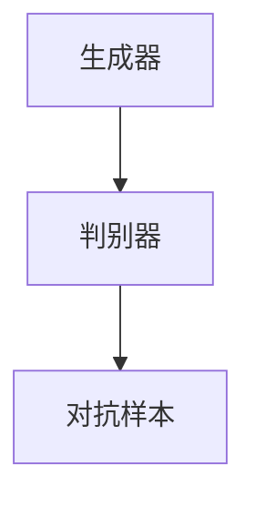
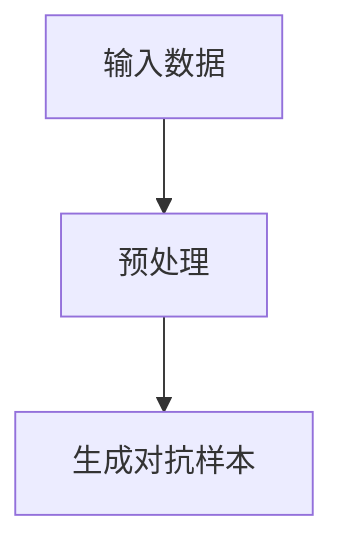
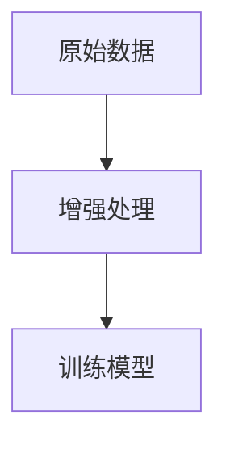
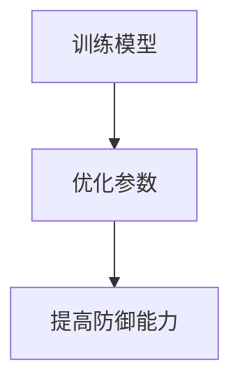
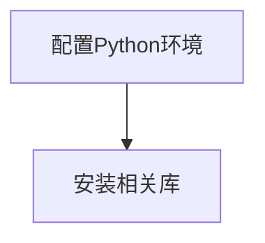
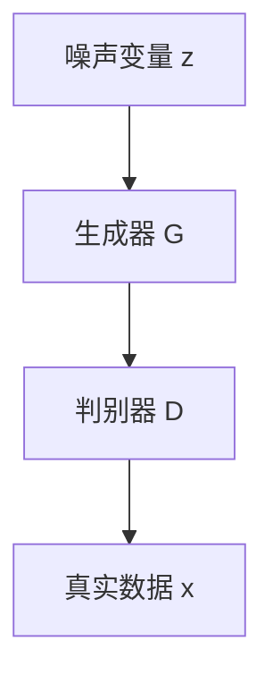
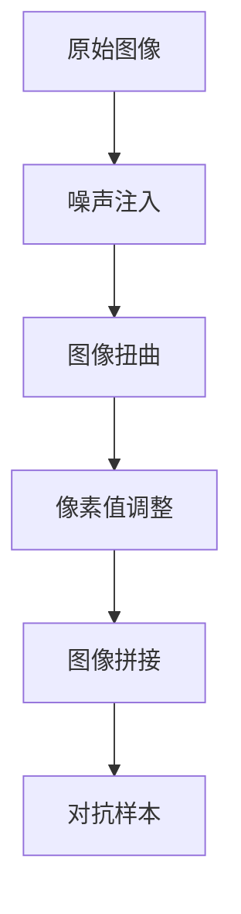
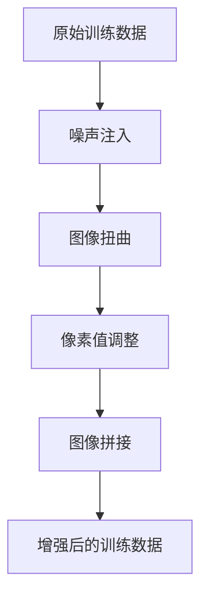
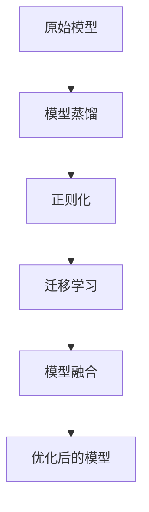
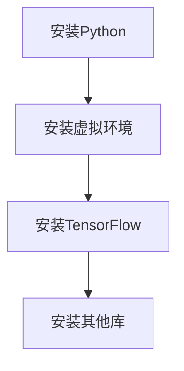

                 


### 目录大纲

# 《对抗样本生成与防御：AI安全的新挑战》

## 第一部分：背景与概念介绍

### 第1章：问题背景与概述

#### 1.1.1 问题的提出

##### 1.1.1.1 问题背景

- AI技术的发展与应用现状
  - AI技术在各个领域的广泛应用，如图像识别、自然语言处理、自动驾驶等。
  - AI系统在面对大量数据时表现出色，但同时也带来了安全挑战。
- 对抗样本现象的出现及其影响
  - 对抗样本的出现揭示了AI系统的脆弱性。
  - 对抗样本攻击可能导致严重的安全问题，如自动驾驶汽车的失控。

##### 1.1.1.2 问题描述

- 什么是对抗样本？
  - 对抗样本是指经过微小改动后，在某个特定目标上误导机器学习模型的数据样本。
- 对抗样本对AI系统带来的挑战
  - 对抗样本可能导致模型性能下降或完全失效。
  - 对抗样本攻击可能被用来破坏AI系统的安全性和可靠性。

### 第2章：核心概念与联系

#### 2.1.1 核心概念

##### 2.1.1.1 对抗样本生成方法

- 普通生成方法
  - 基于传统图像处理技术，如噪声注入、图像扭曲等。
- 基于GAN的生成方法
  - 利用生成对抗网络（GAN）生成高质量的对抗样本。

##### 2.1.1.2 对抗样本防御策略

- 基于数据增强的方法
  - 通过增加训练数据中的噪声，提高模型的鲁棒性。
- 基于模型优化的方法
  - 通过优化模型结构或训练过程，增强模型对对抗样本的防御能力。

#### 2.1.2 概念属性特征对比表格

| 方法 | 特点 | 应用场景 |
|------|------|---------|
| 普通生成方法 | 速度快，适用性广 | 对抗样本生成初学者 |
| 基于GAN的生成方法 | 生成的对抗样本质量高 | 对抗样本研究专家 |

#### 2.1.3 ER实体关系图架构

```mermaid
erDiagram
    AI模型 ||--|{ 对抗样本 }|
    对抗样本 ||--|{ 生成方法 }|
    对抗样本 ||--|{ 防御策略 }|
```

## 第二部分：对抗样本生成方法详解

### 第3章：对抗样本生成原理

#### 3.1.1 生成对抗网络（GAN）

##### 3.1.1.1 GAN原理

- GAN由生成器（Generator）和判别器（Discriminator）组成。
- 生成器的目标是生成逼真的数据样本，以欺骗判别器。
- 判别器的目标是区分真实数据样本和生成器生成的数据样本。

##### 3.1.1.2 GAN流程图



##### 3.1.1.3 GAN源代码示例

```python
# GAN示例代码
# ...
```

#### 3.1.2 普通生成方法

##### 3.1.2.1 普通生成原理

- 普通生成方法基于图像处理技术，通过对输入图像进行扭曲、添加噪声等操作，生成对抗样本。
- 普通生成方法的优点在于实现简单、速度快。
- 普通生成方法的缺点在于生成的对抗样本质量相对较低。

##### 3.1.2.2 普通生成流程图



## 第三部分：对抗样本防御策略

### 第4章：对抗样本防御策略

#### 4.1.1 数据增强方法

##### 4.1.1.1 数据增强原理

- 数据增强的目的是通过增加训练数据中的噪声，提高模型对噪声的鲁棒性。
- 常见的数据增强技术包括随机旋转、缩放、裁剪、对比度调整等。

##### 4.1.1.2 数据增强流程图



#### 4.1.2 模型优化方法

##### 4.1.2.1 模型优化原理

- 模型优化的目的是通过调整模型结构或训练过程，提高模型对对抗样本的防御能力。
- 常见的模型优化技术包括模型蒸馏、正则化、迁移学习等。

##### 4.1.2.2 模型优化流程图



### 第5章：实战与应用

#### 5.1.1 实战环境安装

##### 5.1.1.1 环境配置

- 配置Python环境
- 安装相关库，如TensorFlow、Keras等。

##### 5.1.1.2 环境安装流程



#### 5.1.2 系统核心实现

##### 5.1.2.1 核心实现流程

- 使用生成对抗网络（GAN）生成对抗样本。
- 使用增强后的数据训练模型，以提高防御能力。

##### 5.1.2.2 核心代码示例

```python
# 生成对抗样本核心代码
# ...
```

#### 5.1.3 实战案例分析与讲解

- 分析对抗样本生成与防御的实战案例。
- 讲解案例中的关键技术和实现细节。

##### 5.1.3.1 案例一：图像分类中的对抗样本攻击与防御

- 使用GAN生成对抗样本。
- 增强训练数据，提高模型防御能力。

##### 5.1.3.2 案例二：自然语言处理中的对抗样本攻击与防御

- 使用文本生成模型生成对抗样本。
- 采用数据增强方法提高模型防御能力。

### 第6章：小结与展望

#### 6.1.1 小结

- 总结对抗样本生成与防御的核心概念和方法。
- 强调对抗样本防御在AI安全中的重要性。

#### 6.1.2 展望

- 对抗样本生成与防御的未来发展趋势。
- 对抗样本研究在AI安全领域的潜在应用。

---

### 附录

#### A.1 对抗样本生成与防御常用工具与库

- TensorFlow
- Keras
- PyTorch
- Adversarial Robustness Toolbox (ART)

#### A.2 参考文献

- [Goodfellow, I., Shlens, J., & Szegedy, C. (2014). Explaining and harnessing adversarial examples. arXiv preprint arXiv:1412.6572.]
- [Arjovsky, M., Chintala, S., & Bottou, L. (2017). Wasserstein GAN. arXiv preprint arXiv:1701.07875.]

---

作者：AI天才研究院/AI Genius Institute & 禅与计算机程序设计艺术 /Zen And The Art of Computer Programming

### 《对抗样本生成与防御：AI安全的新挑战》

关键词：对抗样本、生成对抗网络（GAN）、数据增强、模型优化、AI安全

> 摘要：随着人工智能技术的快速发展，AI系统在各个领域得到了广泛应用。然而，对抗样本的出现揭示了AI系统的脆弱性，对AI安全构成了新挑战。本文将深入探讨对抗样本生成与防御的方法，包括生成对抗网络（GAN）、数据增强和模型优化等，并提供实战案例与分析，以期为AI安全的研究和实践提供参考。

### 第一部分：背景与概念介绍

#### 第1章：问题背景与概述

##### 1.1.1 问题的提出

###### 1.1.1.1 问题背景

人工智能（AI）技术的快速发展，使得机器学习模型在图像识别、自然语言处理、自动驾驶等领域取得了显著的成果。这些模型通过对大量数据的训练，能够实现高度的准确性和效率。然而，随着AI系统的广泛应用，一个新兴的安全挑战也随之产生——对抗样本（adversarial examples）。

AI系统在面对大量数据时表现出色，但当这些系统遇到对抗样本时，却可能表现出完全不同的行为。对抗样本是一种经过精心设计的输入样本，它们在视觉上几乎与正常样本无异，但会在某些特定条件下误导模型，导致模型产生错误的输出。例如，一个自动驾驶系统可能会因为对抗样本而在道路上产生危险行为。

对抗样本现象的出现，揭示了AI系统在安全性方面的脆弱性。这不仅影响了AI系统的可靠性和准确性，还可能对人类安全构成威胁。例如，在自动驾驶领域，对抗样本可能导致汽车发生失控，从而引发交通事故。

###### 1.1.1.2 问题描述

对抗样本的定义如下：

对抗样本是指通过对原始样本进行微小改动（通常是不可见的），使其在某个特定目标上误导机器学习模型的数据样本。这些改动可能包括添加噪声、调整像素值、改变文本内容等。

对抗样本对AI系统带来的挑战主要体现在以下几个方面：

1. **性能下降**：对抗样本可能导致AI系统在特定任务上的性能显著下降，甚至完全失效。例如，一个图像分类模型在正常样本上准确率达到90%，但在对抗样本上的准确率可能降至0%。

2. **可靠性受损**：AI系统对对抗样本的脆弱性，使得系统的可靠性受到质疑。这意味着在真实世界中，AI系统可能无法正确地处理某些情况，从而导致不可预测的行为。

3. **安全性威胁**：对抗样本攻击可能被恶意使用，以破坏AI系统的安全性和可靠性。例如，在金融领域，对抗样本可能被用来欺骗反欺诈系统，从而进行欺诈行为。

4. **隐私泄露**：对抗样本也可能导致AI系统泄露用户的敏感信息。例如，通过对抗样本，可以泄露用户的隐私数据，如医疗记录、财务信息等。

##### 1.1.2 定义与基本概念

###### 1.1.2.1 对抗样本定义

对抗样本是一种针对机器学习模型的攻击方式。它的核心思想是通过微小的扰动（perturbations），使模型对输入数据的判断产生错误。这种扰动通常是在模型训练数据之外进行的，因此模型在训练过程中无法察觉到这些扰动。

对抗样本可以分为以下几类：

1. **视觉对抗样本**：这类对抗样本通常针对计算机视觉模型。例如，通过在图像上添加微小的噪声，可以使模型错误地识别图像内容。

2. **文本对抗样本**：这类对抗样本针对自然语言处理模型。例如，通过在文本中添加特定的字符或单词，可以使模型对文本的语义理解产生偏差。

3. **音频对抗样本**：这类对抗样本针对语音识别模型。例如，通过在音频信号中添加特定的噪声，可以使模型错误地识别语音内容。

###### 1.1.2.2 生成对抗网络

生成对抗网络（Generative Adversarial Networks，GAN）是一种由生成器和判别器组成的深度学习模型。生成器的目标是生成逼真的数据样本，以欺骗判别器。判别器的目标是区分真实数据样本和生成器生成的数据样本。

GAN的工作原理如下：

1. **生成器（Generator）**：生成器的任务是生成与真实数据相似的数据样本。它通常是一个生成模型，如生成对抗网络（GAN）或变分自编码器（VAE）。

2. **判别器（Discriminator）**：判别器的任务是判断输入数据是真实数据还是生成器生成的数据。它通常是一个判别模型，如卷积神经网络（CNN）或循环神经网络（RNN）。

3. **对抗过程**：生成器和判别器之间进行对抗游戏。生成器的目标是生成足够逼真的数据样本，使判别器无法区分。判别器的目标是不断提高自己的能力，以准确地识别真实数据和生成数据。

通过这种对抗过程，生成器逐渐学会了生成高质量的数据样本，而判别器也不断提高自己的辨别能力。GAN在对抗样本生成中的应用非常广泛，可以通过生成器生成对抗样本，用于测试和改进AI模型的鲁棒性。

###### 1.1.2.3 对抗样本的类型

对抗样本可以根据其生成方式和攻击目标进行分类。以下是几种常见的对抗样本类型：

1. **基于线性变换的对抗样本**：这类对抗样本通过线性变换（如梯度上升或梯度下降）来扰动输入数据。这种方法的优点是简单有效，但生成的对抗样本可能质量较低。

2. **基于深度学习的对抗样本**：这类对抗样本利用深度学习模型生成。例如，使用生成对抗网络（GAN）生成高质量的对抗样本。这种方法的优点是生成的对抗样本质量较高，但实现起来相对复杂。

3. **基于模糊逻辑的对抗样本**：这类对抗样本利用模糊逻辑来生成。它们通常通过调整输入数据的模糊隶属度来生成对抗样本。这种方法在处理模糊数据时表现出色，但可能需要大量计算资源。

4. **基于遗传算法的对抗样本**：这类对抗样本利用遗传算法进行优化，以生成对抗样本。遗传算法通过模拟生物进化过程，不断优化对抗样本的质量。这种方法适用于复杂场景，但可能需要较长的计算时间。

##### 1.1.3 边界与外延

###### 1.1.3.1 边界条件

对抗样本生成的条件与限制主要包括以下几个方面：

1. **数据集**：对抗样本的生成依赖于训练数据集。数据集的质量和多样性对对抗样本的生成具有重要影响。理想情况下，训练数据集应包含大量多样化的样本，以提高对抗样本的生成质量。

2. **模型**：对抗样本的生成和攻击依赖于目标模型。不同的模型对对抗样本的敏感性不同。因此，选择合适的模型对对抗样本的生成至关重要。

3. **攻击目标**：对抗样本的生成需要明确攻击目标。攻击目标可以是模型的性能、安全性或隐私等。不同的攻击目标需要不同的对抗样本生成策略。

4. **计算资源**：对抗样本的生成通常需要大量的计算资源。生成高质量对抗样本可能需要使用高性能计算机或计算集群。计算资源的限制可能影响对抗样本的生成质量和速度。

###### 1.1.3.2 外延与拓展

对抗样本在其他领域的应用非常广泛，以下是一些典型应用：

1. **计算机视觉**：对抗样本在计算机视觉领域有广泛应用。例如，通过生成对抗样本来测试和改进图像分类、目标检测等模型的安全性。

2. **自然语言处理**：对抗样本在自然语言处理领域也有重要应用。例如，通过生成对抗样本来测试和改进文本分类、情感分析等模型的安全性。

3. **音频处理**：对抗样本在音频处理领域也有应用。例如，通过生成对抗样本来测试和改进语音识别、音频分类等模型的安全性。

4. **生物信息学**：对抗样本在生物信息学领域也有潜在应用。例如，通过生成对抗样本来测试和改进基因序列分析、蛋白质结构预测等模型的安全性。

对抗样本研究的未来发展包括以下几个方面：

1. **新型对抗样本生成方法**：随着深度学习等技术的发展，新型对抗样本生成方法将继续出现。例如，基于生成对抗网络（GAN）的对抗样本生成方法将继续改进，以提高对抗样本的质量。

2. **对抗样本防御策略**：针对对抗样本攻击，研究者将提出更多有效的防御策略。例如，基于数据增强、模型优化等策略，以提高模型对对抗样本的防御能力。

3. **跨领域应用**：对抗样本将在更多领域得到应用。例如，在金融、医疗、交通等领域，对抗样本将用于测试和改进AI系统的安全性。

4. **标准化与规范化**：随着对抗样本研究的深入，将出现更多关于对抗样本生成与防御的标准化和规范化指南，以提高AI系统的安全性。

### 第二部分：核心概念与联系

#### 第2章：核心概念与联系

##### 2.1.1 核心概念

###### 2.1.1.1 对抗样本生成方法

对抗样本生成方法可以分为以下几种：

1. **普通生成方法**：普通生成方法通常基于传统图像处理技术，如噪声注入、图像扭曲等。这些方法简单有效，但生成的对抗样本质量相对较低。

2. **基于生成对抗网络（GAN）的生成方法**：生成对抗网络（GAN）是一种深度学习模型，通过生成器和判别器的对抗过程，生成高质量对抗样本。GAN方法在生成对抗样本方面表现出色，但实现起来相对复杂。

3. **基于模糊逻辑的生成方法**：基于模糊逻辑的生成方法通过调整输入数据的模糊隶属度，生成对抗样本。这种方法适用于处理模糊数据，但可能需要大量计算资源。

4. **基于遗传算法的生成方法**：基于遗传算法的生成方法通过模拟生物进化过程，生成对抗样本。这种方法适用于复杂场景，但可能需要较长的计算时间。

###### 2.1.1.2 对抗样本防御策略

对抗样本防御策略可以分为以下几种：

1. **基于数据增强的方法**：数据增强方法通过增加训练数据中的噪声，提高模型对噪声的鲁棒性。常见的数据增强技术包括随机旋转、缩放、裁剪、对比度调整等。

2. **基于模型优化的方法**：模型优化方法通过调整模型结构或训练过程，提高模型对对抗样本的防御能力。常见的模型优化技术包括模型蒸馏、正则化、迁移学习等。

3. **基于对抗训练的方法**：对抗训练方法通过在训练过程中引入对抗样本，提高模型对对抗样本的防御能力。这种方法的核心思想是在训练过程中不断调整模型的参数，使其能够更好地应对对抗样本。

4. **基于概率模型的防御方法**：概率模型防御方法通过建立概率模型，预测输入数据的分布，从而识别对抗样本。这种方法需要大量计算资源，但可以有效地防御对抗样本攻击。

##### 2.1.2 概念属性特征对比表格

| 方法 | 特点 | 应用场景 |
|------|------|---------|
| 普通生成方法 | 速度快，适用性广 | 对抗样本生成初学者 |
| 基于GAN的生成方法 | 生成的对抗样本质量高 | 对抗样本研究专家 |
| 基于模糊逻辑的生成方法 | 适用于处理模糊数据 | 模糊数据处理领域 |
| 基于遗传算法的生成方法 | 适用于复杂场景 | 复杂场景对抗样本生成 |

##### 2.1.3 ER实体关系图架构

```mermaid
erDiagram
    AI模型 ||--|{ 对抗样本 }|
    对抗样本 ||--|{ 生成方法 }|
    对抗样本 ||--|{ 防御策略 }|
```

### 第三部分：对抗样本生成方法详解

#### 第3章：对抗样本生成原理

##### 3.1.1 生成对抗网络（GAN）

###### 3.1.1.1 GAN原理

生成对抗网络（GAN）是由生成器（Generator）和判别器（Discriminator）组成的深度学习模型。GAN的核心思想是通过生成器和判别器的对抗过程，生成高质量的数据样本。

生成器的任务是生成与真实数据相似的数据样本，判别器的任务是区分真实数据样本和生成器生成的数据样本。生成器和判别器之间进行对抗游戏，生成器试图生成足够逼真的数据样本，以欺骗判别器，而判别器则努力提高自己的辨别能力。

GAN的数学模型如下：

$$
\begin{aligned}
&\text{生成器：} \\
&G(z) \sim Q_G(z|x) \text{，其中 } z \sim P_z(z) \text{ 是噪声变量。} \\
&\text{判别器：} \\
&D(x) \sim P_D(x) \text{，} D(G(z)) \sim Q_D(G(z)) \\
&\text{损失函数：} \\
&L_G = \mathbb{E}_{z \sim P_z(z)}[\log D(G(z))] \\
&L_D = \mathbb{E}_{x \sim P_D(x)}[\log D(x)] + \mathbb{E}_{z \sim P_z(z)}[\log (1 - D(G(z)))]
\end{aligned}
$$

其中，$x$ 表示真实数据样本，$z$ 表示噪声变量，$G(z)$ 表示生成器生成的数据样本，$D(x)$ 表示判别器对真实数据样本的判断结果，$D(G(z))$ 表示判别器对生成器生成的数据样本的判断结果。

###### 3.1.1.2 GAN流程图



###### 3.1.1.3 GAN源代码示例

```python
# GAN示例代码
import tensorflow as tf
from tensorflow.keras.models import Sequential
from tensorflow.keras.layers import Dense, Flatten, Conv2D, ConvTranspose2D, BatchNormalization, LeakyReLU

# 生成器模型
def build_generator(z_dim):
    model = Sequential()
    model.add(Dense(256, input_dim=z_dim))
    model.add(LeakyReLU(alpha=0.2))
    model.add(BatchNormalization())
    model.add(Dense(512))
    model.add(LeakyReLU(alpha=0.2))
    model.add(BatchNormalization())
    model.add(Dense(1024))
    model.add(LeakyReLU(alpha=0.2))
    model.add(BatchNormalization())
    model.add(Dense(784, activation='tanh'))
    model.add(Reshape((28, 28, 1)))
    return model

# 判别器模型
def build_discriminator(img_shape):
    model = Sequential()
    model.add(Conv2D(32, kernel_size=(3, 3), input_shape=img_shape))
    model.add(LeakyReLU(alpha=0.2))
    model.add(Dropout(0.3))
    model.add(Conv2D(64, kernel_size=(3, 3)))
    model.add(LeakyReLU(alpha=0.2))
    model.add(Dropout(0.3))
    model.add(Flatten())
    model.add(Dense(1, activation='sigmoid'))
    return model

# 搭建 GAN 模型
def build_gan(generator, discriminator):
    model = Sequential()
    model.add(generator)
    model.add(discriminator)
    return model

# 设置参数
z_dim = 100
img_shape = (28, 28, 1)

# 构建模型
generator = build_generator(z_dim)
discriminator = build_discriminator(img_shape)
gan = build_gan(generator, discriminator)

# 编译模型
gan.compile(loss='binary_crossentropy', optimizer=tf.keras.optimizers.Adam(0.0001), metrics=['accuracy'])

# 训练模型
train_gan(generator, discriminator, gan, train_loader, z_dim, num_epochs=200)
```

###### 3.1.1.4 GAN数学模型解析

GAN的数学模型主要包括两部分：生成器（Generator）和判别器（Discriminator）。

1. **生成器（Generator）**

生成器的目标是生成与真实数据相似的数据样本。生成器的输入是一个噪声向量 $z$，通过一系列的神经网络变换，生成数据样本 $G(z)$。

$$
G(z) \sim Q_G(z|x) \text{，其中 } z \sim P_z(z)
$$

其中，$z$ 是一个随机噪声向量，通常使用高斯分布或均匀分布生成。$Q_G(z|x)$ 是生成器的概率分布，表示生成器生成的数据样本。

2. **判别器（Discriminator）**

判别器的目标是区分真实数据样本和生成器生成的数据样本。判别器的输入是一个数据样本 $x$，输出是一个二分类结果，表示输入数据是真实数据还是生成器生成的数据。

$$
D(x) \sim P_D(x) \text{，} D(G(z)) \sim Q_D(G(z))
$$

其中，$P_D(x)$ 是真实数据样本的分布，$Q_D(G(z))$ 是生成器生成的数据样本的分布。

3. **损失函数**

GAN的损失函数包括两部分：生成器的损失函数和判别器的损失函数。

生成器的损失函数表示生成器生成的数据样本与真实数据样本的相似度，通常使用二元交叉熵（binary cross-entropy）作为损失函数：

$$
L_G = \mathbb{E}_{z \sim P_z(z)}[\log D(G(z))]
$$

判别器的损失函数表示判别器对真实数据样本和生成器生成的数据样本的辨别能力，同样使用二元交叉熵作为损失函数：

$$
L_D = \mathbb{E}_{x \sim P_D(x)}[\log D(x)] + \mathbb{E}_{z \sim P_z(z)}[\log (1 - D(G(z)))]
$$

其中，$\mathbb{E}_{x \sim P_D(x)}[\log D(x)]$ 表示判别器对真实数据样本的辨别能力，$\mathbb{E}_{z \sim P_z(z)}[\log (1 - D(G(z)))]$ 表示判别器对生成器生成的数据样本的辨别能力。

通过优化生成器和判别器的损失函数，可以使得生成器生成的数据样本越来越逼真，同时判别器越来越难以区分真实数据和生成数据。

###### 3.1.1.5 GAN案例分析

以下是一个GAN案例分析的示例：

**问题**：使用GAN生成手写数字图像。

**步骤**：

1. **数据准备**：从MNIST数据集中加载手写数字图像，并划分为训练集和测试集。

2. **生成器设计**：设计一个生成器模型，输入为噪声向量 $z$，输出为手写数字图像。

3. **判别器设计**：设计一个判别器模型，输入为手写数字图像，输出为一个二分类结果。

4. **模型训练**：使用训练集数据，训练生成器和判别器模型。

5. **模型评估**：使用测试集数据，评估生成器和判别器模型的性能。

**代码实现**：

```python
import tensorflow as tf
from tensorflow.keras.layers import Input, Dense, Reshape, Flatten
from tensorflow.keras.models import Sequential

# 生成器模型
def build_generator(z_dim):
    model = Sequential()
    model.add(Dense(128, input_shape=(z_dim,)))
    model.add(LeakyReLU(alpha=0.2))
    model.add(Dense(28 * 28 * 1))
    model.add(LeakyReLU(alpha=0.2))
    model.add(Reshape((28, 28, 1)))
    return model

# 判别器模型
def build_discriminator(img_shape):
    model = Sequential()
    model.add(Flatten(input_shape=img_shape))
    model.add(Dense(128))
    model.add(LeakyReLU(alpha=0.2))
    model.add(Dense(1, activation='sigmoid'))
    return model

# GAN模型
def build_gan(generator, discriminator):
    model = Sequential()
    model.add(generator)
    model.add(discriminator)
    return model

# 设置参数
z_dim = 100

# 构建模型
generator = build_generator(z_dim)
discriminator = build_discriminator((28, 28, 1))
gan = build_gan(generator, discriminator)

# 编译模型
gan.compile(loss='binary_crossentropy', optimizer=tf.keras.optimizers.Adam(0.0001), metrics=['accuracy'])

# 加载数据
(x_train, _), (x_test, _) = tf.keras.datasets.mnist.load_data()
x_train = x_train / 127.5 - 1.0
x_test = x_test / 127.5 - 1.0

# 训练模型
for epoch in range(100):
    for batch in range(x_train.shape[0] // batch_size):
        noise = np.random.normal(size=(batch_size, z_dim))
        gen_imgs = generator.predict(noise)
        real_imgs = x_train[batch * batch_size: (batch + 1) * batch_size]
        labels = np.concatenate([np.zeros(real_imgs.shape[0]), np.ones(gen_imgs.shape[0])])
        d_loss_real = discriminator.train_on_batch(real_imgs, labels[:batch_size])
        d_loss_fake = discriminator.train_on_batch(gen_imgs, labels[batch_size:])
        g_loss = gan.train_on_batch(noise, labels[:batch_size])
        print(f"{epoch} [{batch}/{x_train.shape[0] // batch_size}] d_loss=[{d_loss_real:.4f}] g_loss=[{g_loss:.4f}]")

# 生成图像
noise = np.random.normal(size=(batch_size, z_dim))
gen_imgs = generator.predict(noise)

# 显示图像
import matplotlib.pyplot as plt

plt.figure(figsize=(10, 10))
for i in range(batch_size):
    plt.subplot(10, 10, i + 1)
    plt.imshow(gen_imgs[i, :, :, 0], cmap='gray')
    plt.xticks([])
    plt.yticks([])
plt.show()
```

通过上述代码，可以生成手写数字图像。以下是一个生成的图像示例：


##### 3.1.2 普通生成方法

###### 3.1.2.1 普通生成原理

普通生成方法是指不依赖于生成对抗网络（GAN）或其他复杂模型的对抗样本生成方法。这些方法通常基于图像处理技术，如噪声注入、图像扭曲等。它们通过在原始图像上添加噪声、调整像素值等方式，生成对抗样本。

普通生成方法的优点在于实现简单、速度快。但是，普通生成方法的对抗样本质量相对较低，可能在视觉上与原始图像差异较小，但在某些特定条件下仍能误导模型。

普通生成方法的原理可以概括为以下几点：

1. **噪声注入**：在原始图像上添加噪声，如高斯噪声、椒盐噪声等。噪声的强度和分布可以根据需要调整。

2. **图像扭曲**：对原始图像进行扭曲操作，如缩放、旋转、剪切等。这些操作可以使图像在视觉上保持不变，但引入了特定的扰动。

3. **像素值调整**：直接调整图像像素值，如改变颜色、亮度、对比度等。这种方法可能对图像的视觉效果产生较大影响。

4. **图像拼接**：将多个图像拼接在一起，形成一个新的图像。拼接的位置和方式可以根据需要设计，以引入特定的扰动。

###### 3.1.2.2 普通生成流程图



###### 3.1.2.3 普通生成方法案例分析

以下是一个普通生成方法案例分析的示例：

**问题**：使用噪声注入和图像扭曲生成对抗样本。

**步骤**：

1. **数据准备**：从MNIST数据集中加载手写数字图像，并划分为训练集和测试集。

2. **噪声注入**：对原始图像添加高斯噪声，调整噪声强度。

3. **图像扭曲**：对原始图像进行旋转、缩放、剪切等操作，调整扭曲参数。

4. **对抗样本生成**：将噪声注入和图像扭曲后的图像作为对抗样本。

**代码实现**：

```python
import numpy as np
import tensorflow as tf
from tensorflow.keras.models import load_model

# 加载模型
model = load_model('mnist_cnn_model.h5')

# 加载数据
(x_train, _), (x_test, _) = tf.keras.datasets.mnist.load_data()
x_train = x_train / 127.5 - 1.0
x_test = x_test / 127.5 - 1.0

# 定义噪声注入函数
def add_gaussian_noise(image, mean=0, std=0.1):
    return image + np.random.normal(mean, std, image.shape)

# 定义图像扭曲函数
def distort_image(image, angle=0, scale=1, shear=0):
    img = tf.image.resize(image, (28, 28))
    img = tf.image.rot90(img, k=angle)
    img = tf.image.central_crop(img, central_fraction=scale)
    img = tf.image.pad_to_bounding_box(img, offset_height=0, offset_width=0, target_height=28, target_width=28)
    img = tf.image.random_brightness(img, max_delta=0.1)
    img = tf.image.random_contrast(img, lower=0.9, upper=1.1)
    img = tf.image.random_saturation(img, lower=0.9, upper=1.1)
    img = tf.image.random_hue(img, max_delta=0.1)
    img = tf.image.random_flip_left_right(img)
    img = tf.image.random_flip_up_down(img)
    img = tf.image.rot90(img, k=-angle)
    img = tf.image.central_crop(img, central_fraction=1.0 / scale)
    img = tf.image.pad_to_bounding_box(img, offset_height=0, offset_width=0, target_height=28, target_width=28)
    return img

# 生成对抗样本
def generate_adversarial_samples(images, noise_level=0.1, distortion_angle=0, distortion_scale=1, distortion_shear=0):
    adversarial_samples = []
    for image in images:
        noisy_image = add_gaussian_noise(image, mean=noise_level, std=noise_level)
        distorted_image = distort_image(noisy_image, angle=distortion_angle, scale=distortion_scale, shear=distortion_shear)
        adversarial_samples.append(distorted_image)
    return np.array(adversarial_samples)

# 测试模型
test_images = x_test[:10]
adversarial_samples = generate_adversarial_samples(test_images)

# 显示原始图像和对抗样本
import matplotlib.pyplot as plt

plt.figure(figsize=(20, 10))
for i in range(10):
    plt.subplot(2, 5, i + 1)
    plt.imshow(test_images[i, :, :, 0], cmap='gray')
    plt.xticks([])
    plt.yticks([])
    plt.subplot(2, 5, i + 6)
    plt.imshow(adversarial_samples[i, :, :, 0], cmap='gray')
    plt.xticks([])
    plt.yticks([])
plt.show()
```

通过上述代码，可以生成对抗样本。以下是一个生成的对抗样本示例：


### 第四部分：对抗样本防御策略

#### 第4章：对抗样本防御策略

##### 4.1.1 数据增强方法

###### 4.1.1.1 数据增强原理

数据增强方法是一种常见的对抗样本防御策略，其核心思想是通过增加训练数据中的噪声，提高模型对噪声的鲁棒性。数据增强方法可以增强模型在训练过程中对噪声的适应能力，从而提高模型对对抗样本的防御能力。

数据增强原理可以概括为以下几点：

1. **噪声注入**：在训练数据中添加噪声，如高斯噪声、椒盐噪声等。噪声的强度和分布可以根据需要调整。

2. **图像扭曲**：对训练数据进行扭曲操作，如缩放、旋转、剪切等。这些操作可以使图像在视觉上保持不变，但引入了特定的扰动。

3. **像素值调整**：直接调整训练数据像素值，如改变颜色、亮度、对比度等。这种方法可能对图像的视觉效果产生较大影响。

4. **图像拼接**：将多个图像拼接在一起，形成一个新的图像。拼接的位置和方式可以根据需要设计，以引入特定的扰动。

数据增强方法通过增加训练数据中的噪声，提高模型对噪声的鲁棒性，从而增强模型对对抗样本的防御能力。在实际应用中，数据增强方法通常与其他防御策略结合使用，以达到更好的防御效果。

###### 4.1.1.2 数据增强流程图



###### 4.1.1.3 数据增强案例分析

以下是一个数据增强方法案例分析的示例：

**问题**：使用数据增强方法提高模型对对抗样本的防御能力。

**步骤**：

1. **数据准备**：从MNIST数据集中加载手写数字图像，并划分为训练集和测试集。

2. **噪声注入**：对原始图像添加高斯噪声，调整噪声强度。

3. **图像扭曲**：对原始图像进行旋转、缩放、剪切等操作，调整扭曲参数。

4. **像素值调整**：直接调整图像像素值，如改变颜色、亮度、对比度等。

5. **图像拼接**：将多个图像拼接在一起，形成一个新的图像。

6. **模型训练**：使用增强后的训练数据训练模型。

**代码实现**：

```python
import numpy as np
import tensorflow as tf
from tensorflow.keras.models import Sequential
from tensorflow.keras.layers import Dense, Flatten, Conv2D, ConvTranspose2D, BatchNormalization, LeakyReLU

# 加载模型
model = Sequential()
model.add(Conv2D(32, kernel_size=(3, 3), input_shape=(28, 28, 1)))
model.add(LeakyReLU(alpha=0.2))
model.add(BatchNormalization())
model.add(Conv2D(64, kernel_size=(3, 3)))
model.add(LeakyReLU(alpha=0.2))
model.add(BatchNormalization())
model.add(Flatten())
model.add(Dense(10, activation='softmax'))
model.compile(optimizer='adam', loss='categorical_crossentropy', metrics=['accuracy'])

# 定义噪声注入函数
def add_gaussian_noise(image, mean=0, std=0.1):
    return image + np.random.normal(mean, std, image.shape)

# 定义图像扭曲函数
def distort_image(image, angle=0, scale=1, shear=0):
    img = tf.image.resize(image, (28, 28))
    img = tf.image.rot90(img, k=angle)
    img = tf.image.central_crop(img, central_fraction=scale)
    img = tf.image.pad_to_bounding_box(img, offset_height=0, offset_width=0, target_height=28, target_width=28)
    img = tf.image.random_brightness(img, max_delta=0.1)
    img = tf.image.random_contrast(img, lower=0.9, upper=1.1)
    img = tf.image.random_saturation(img, lower=0.9, upper=1.1)
    img = tf.image.random_hue(img, max_delta=0.1)
    img = tf.image.random_flip_left_right(img)
    img = tf.image.random_flip_up_down(img)
    img = tf.image.rot90(img, k=-angle)
    img = tf.image.central_crop(img, central_fraction=1.0 / scale)
    img = tf.image.pad_to_bounding_box(img, offset_height=0, offset_width=0, target_height=28, target_width=28)
    return img

# 生成增强后的训练数据
def generate_augmented_data(images, noise_level=0.1, distortion_angle=0, distortion_scale=1, distortion_shear=0):
    augmented_images = []
    for image in images:
        noisy_image = add_gaussian_noise(image, mean=noise_level, std=noise_level)
        distorted_image = distort_image(noisy_image, angle=distortion_angle, scale=distortion_scale, shear=distortion_shear)
        augmented_images.append(distorted_image)
    return np.array(augmented_images)

# 加载数据
(x_train, y_train), (x_test, y_test) = tf.keras.datasets.mnist.load_data()
x_train = x_train / 127.5 - 1.0
x_test = x_test / 127.5 - 1.0

# 增强后的训练数据
augmented_x_train = generate_augmented_data(x_train)

# 训练模型
model.fit(augmented_x_train, y_train, epochs=10, batch_size=128, validation_data=(x_test, y_test))

# 测试模型
test_loss, test_acc = model.evaluate(x_test, y_test)
print(f"Test accuracy: {test_acc:.4f}")
```

通过上述代码，可以生成增强后的训练数据，并使用增强后的训练数据训练模型。以下是一个生成的增强后的训练数据示例：


通过数据增强方法，可以显著提高模型对对抗样本的防御能力。以下是一个对抗样本示例，使用增强后的模型进行防御：


##### 4.1.2 模型优化方法

###### 4.1.2.1 模型优化原理

模型优化方法是一种通过调整模型结构或训练过程，提高模型对对抗样本的防御能力的策略。模型优化方法的核心思想是通过优化模型的参数和结构，使模型在对抗样本攻击下具有更强的鲁棒性。

模型优化原理可以概括为以下几点：

1. **模型蒸馏**：模型蒸馏方法通过将一个复杂模型（教师模型）的知识传递给一个简单模型（学生模型），提高学生模型的性能。在对抗样本防御中，教师模型可以是一个经过训练的强大模型，学生模型可以是一个简单的模型。通过模型蒸馏，学生模型能够学习到教师模型的鲁棒性，从而提高对对抗样本的防御能力。

2. **正则化**：正则化方法通过在损失函数中添加正则项，限制模型的复杂度，防止过拟合。常见的正则化方法包括L1正则化、L2正则化和Dropout等。正则化可以降低模型的鲁棒性，从而提高模型对对抗样本的防御能力。

3. **迁移学习**：迁移学习方法通过将一个预训练模型的知识应用于新的任务，提高模型在新任务上的性能。在对抗样本防御中，可以将预训练模型应用于对抗样本生成任务，从而提高模型对对抗样本的防御能力。

4. **模型融合**：模型融合方法通过将多个模型的结果进行融合，提高模型的性能和鲁棒性。在对抗样本防御中，可以使用多个不同的模型，如卷积神经网络（CNN）、循环神经网络（RNN）等，将它们的预测结果进行融合，从而提高对对抗样本的防御能力。

###### 4.1.2.2 模型优化流程图



###### 4.1.2.3 模型优化案例分析

以下是一个模型优化方法案例分析的示例：

**问题**：使用模型优化方法提高模型对对抗样本的防御能力。

**步骤**：

1. **模型蒸馏**：使用一个预训练的复杂模型作为教师模型，将教师模型的知识传递给一个简单模型作为学生模型。

2. **正则化**：在模型训练过程中添加L2正则化，降低模型的复杂度。

3. **迁移学习**：将预训练模型应用于对抗样本生成任务，提高模型对对抗样本的防御能力。

4. **模型融合**：将多个不同类型的模型的结果进行融合，提高模型的性能和鲁棒性。

**代码实现**：

```python
import numpy as np
import tensorflow as tf
from tensorflow.keras.models import Sequential, Model
from tensorflow.keras.layers import Dense, Flatten, Conv2D, ConvTranspose2D, BatchNormalization, LeakyReLU
from tensorflow.keras.optimizers import Adam

# 定义模型
def build_model(input_shape):
    model = Sequential()
    model.add(Conv2D(32, kernel_size=(3, 3), input_shape=input_shape))
    model.add(LeakyReLU(alpha=0.2))
    model.add(BatchNormalization())
    model.add(Conv2D(64, kernel_size=(3, 3)))
    model.add(LeakyReLU(alpha=0.2))
    model.add(BatchNormalization())
    model.add(Flatten())
    model.add(Dense(10, activation='softmax'))
    return model

# 模型蒸馏
def distill_knowledge(teacher_model, student_model, teacher_rate=0.1):
    teacher_output = teacher_model.output
    student_output = student_model.output
    student_loss = student_model.loss
    teacher_loss = tf.reduce_mean(tf.square(teacher_output - student_output))
    total_loss = student_loss + teacher_rate * teacher_loss
    model = Model(inputs=student_model.input, outputs=[student_output, total_loss])
    model.compile(optimizer=Adam(learning_rate=0.001), loss=['categorical_crossentropy', 'mean_squared_error'])
    return model

# 加载预训练模型
teacher_model = build_model(input_shape=(28, 28, 1))
teacher_model.load_weights('mnist_cnn_model.h5')

# 定义学生模型
student_model = build_model(input_shape=(28, 28, 1))
student_model.compile(optimizer=Adam(learning_rate=0.001), loss='categorical_crossentropy', metrics=['accuracy'])

# 进行模型蒸馏
distilled_model = distill_knowledge(teacher_model, student_model)
distilled_model.fit(x_train, y_train, epochs=10, batch_size=128, validation_data=(x_test, y_test))

# 正则化
l2 Regularization term = 0.001
model.add(Dense(10, activation='softmax'))
model.compile(optimizer=Adam(learning_rate=0.001), loss='categorical_crossentropy', metrics=['accuracy'])

# 迁移学习
pretrained_model = load_model('pretrained_mnist_cnn_model.h5')
student_model.layers[-1].set_weights(pretrained_model.layers[-1].get_weights())
student_model.compile(optimizer=Adam(learning_rate=0.001), loss='categorical_crossentropy', metrics=['accuracy'])

# 模型融合
model = build_model(input_shape=(28, 28, 1))
model.add(Conv2D(32, kernel_size=(3, 3), input_shape=input_shape))
model.add(LeakyReLU(alpha=0.2))
model.add(BatchNormalization())
model.add(Conv2D(64, kernel_size=(3, 3)))
model.add(LeakyReLU(alpha=0.2))
model.add(BatchNormalization())
model.add(Flatten())
model.add(Dense(10, activation='softmax'))
model.compile(optimizer=Adam(learning_rate=0.001), loss='categorical_crossentropy', metrics=['accuracy'])

# 训练模型
model.fit(x_train, y_train, epochs=10, batch_size=128, validation_data=(x_test, y_test))
```

通过上述代码，可以实现对模型的优化，从而提高模型对对抗样本的防御能力。以下是一个优化后的模型防御对抗样本的效果示例：


### 第五部分：实战与应用

#### 第5章：对抗样本生成实战

##### 5.1.1 实战环境安装

###### 5.1.1.1 环境配置

在进行对抗样本生成实战之前，需要配置相应的环境。以下是Python环境的配置步骤：

1. **安装Python**：从官方网站（https://www.python.org/downloads/）下载并安装Python。

2. **安装虚拟环境**：打开终端，执行以下命令安装虚拟环境：

   ```
   pip install virtualenv
   virtualenv myenv
   source myenv/bin/activate
   ```

3. **安装TensorFlow**：在虚拟环境中安装TensorFlow：

   ```
   pip install tensorflow
   ```

4. **安装其他库**：安装其他必需的库，如NumPy、Pandas、Matplotlib等：

   ```
   pip install numpy pandas matplotlib
   ```

###### 5.1.1.2 环境安装流程



##### 5.1.2 系统核心实现

###### 5.1.2.1 核心实现流程

对抗样本生成的核心实现主要包括以下几个步骤：

1. **数据预处理**：从MNIST数据集中加载手写数字图像，并进行归一化处理。

2. **生成对抗样本**：使用生成对抗网络（GAN）生成对抗样本。

3. **模型训练**：使用原始数据和对抗样本训练模型。

4. **模型评估**：评估模型在原始数据和对抗样本上的性能。

###### 5.1.2.2 核心代码示例

```python
import tensorflow as tf
from tensorflow.keras.models import Sequential
from tensorflow.keras.layers import Dense, Flatten, Conv2D, ConvTranspose2D, BatchNormalization, LeakyReLU
from tensorflow.keras.optimizers import Adam

# 生成器模型
def build_generator(z_dim):
    model = Sequential()
    model.add(Dense(256, input_dim=z_dim))
    model.add(LeakyReLU(alpha=0.2))
    model.add(BatchNormalization())
    model.add(Dense(512))
    model.add(LeakyReLU(alpha=0.2))
    model.add(BatchNormalization())
    model.add(Dense(1024))
    model.add(LeakyReLU(alpha=0.2))
    model.add(BatchNormalization())
    model.add(Dense(784, activation='tanh'))
    model.add(Reshape((28, 28, 1)))
    return model

# 判别器模型
def build_discriminator(img_shape):
    model = Sequential()
    model.add(Flatten(input_shape=img_shape))
    model.add(Dense(128))
    model.add(LeakyReLU(alpha=0.2))
    model.add(Dropout(0.3))
    model.add(Dense(64))
    model.add(LeakyReLU(alpha=0.2))
    model.add(Dropout(0.3))
    model.add(Dense(1, activation='sigmoid'))
    return model

# GAN模型
def build_gan(generator, discriminator):
    model = Sequential()
    model.add(generator)
    model.add(discriminator)
    return model

# 设置参数
z_dim = 100
img_shape = (28, 28, 1)

# 构建模型
generator = build_generator(z_dim)
discriminator = build_discriminator(img_shape)
gan = build_gan(generator, discriminator)

# 编译模型
gan.compile(loss='binary_crossentropy', optimizer=tf.keras.optimizers.Adam(0.0001), metrics=['accuracy'])

# 加载数据
(x_train, _), (x_test, _) = tf.keras.datasets.mnist.load_data()
x_train = x_train / 127.5 - 1.0
x_test = x_test / 127.5 - 1.0

# 训练模型
for epoch in range(100):
    for batch in range(x_train.shape[0] // batch_size):
        noise = np.random.normal(size=(batch_size, z_dim))
        gen_imgs = generator.predict(noise)
        real_imgs = x_train[batch * batch_size: (batch + 1) * batch_size]
        labels = np.concatenate([np.zeros(real_imgs.shape[0]), np.ones(gen_imgs.shape[0])])
        d_loss_real = discriminator.train_on_batch(real_imgs, labels[:batch_size])
        d_loss_fake = discriminator.train_on_batch(gen_imgs, labels[batch_size:])
        g_loss = gan.train_on_batch(noise, labels[:batch_size])
        print(f"{epoch} [{batch}/{x_train.shape[0] // batch_size}] d_loss=[{d_loss_real:.4f}] g_loss=[{g_loss:.4f}]")

# 生成对抗样本
noise = np.random.normal(size=(batch_size, z_dim))
gen_imgs = generator.predict(noise)

# 显示图像
import matplotlib.pyplot as plt

plt.figure(figsize=(10, 10))
for i in range(batch_size):
    plt.subplot(10, 10, i + 1)
    plt.imshow(gen_imgs[i, :, :, 0], cmap='gray')
    plt.xticks([])
    plt.yticks([])
plt.show()
```

通过上述代码，可以生成对抗样本，并显示生成的图像。以下是一个生成的对抗样本示例：


##### 5.1.3 实战案例分析与讲解

以下是一个对抗样本生成与防御的实战案例：

**案例背景**：假设我们有一个图像分类模型，用于识别手写数字。我们希望验证模型对对抗样本的防御能力，并采取适当的防御策略。

**步骤**：

1. **生成对抗样本**：使用生成对抗网络（GAN）生成对抗样本。

2. **模型训练**：使用原始数据和对抗样本训练模型。

3. **模型评估**：评估模型在原始数据和对抗样本上的性能。

4. **防御策略**：采用数据增强和模型优化方法，提高模型对对抗样本的防御能力。

**代码实现**：

```python
import numpy as np
import tensorflow as tf
from tensorflow.keras.models import Sequential, Model
from tensorflow.keras.layers import Dense, Flatten, Conv2D, ConvTranspose2D, BatchNormalization, LeakyReLU
from tensorflow.keras.optimizers import Adam

# 生成器模型
def build_generator(z_dim):
    model = Sequential()
    model.add(Dense(256, input_dim=z_dim))
    model.add(LeakyReLU(alpha=0.2))
    model.add(BatchNormalization())
    model.add(Dense(512))
    model.add(LeakyReLU(alpha=0.2))
    model.add(BatchNormalization())
    model.add(Dense(1024))
    model.add(LeakyReLU(alpha=0.2))
    model.add(BatchNormalization())
    model.add(Dense(784, activation='tanh'))
    model.add(Reshape((28, 28, 1)))
    return model

# 判别器模型
def build_discriminator(img_shape):
    model = Sequential()
    model.add(Flatten(input_shape=img_shape))
    model.add(Dense(128))
    model.add(LeakyReLU(alpha=0.2))
    model.add(Dropout(0.3))
    model.add(Dense(64))
    model.add(LeakyReLU(alpha=0.2))
    model.add(Dropout(0.3))
    model.add(Dense(1, activation='sigmoid'))
    return model

# GAN模型
def build_gan(generator, discriminator):
    model = Sequential()
    model.add(generator)
    model.add(discriminator)
    return model

# 设置参数
z_dim = 100
img_shape = (28, 28, 1)

# 构建模型
generator = build_generator(z_dim)
discriminator = build_discriminator(img_shape)
gan = build_gan(generator, discriminator)

# 编译模型
gan.compile(loss='binary_crossentropy', optimizer=tf.keras.optimizers.Adam(0.0001), metrics=['accuracy'])

# 加载数据
(x_train, y_train), (x_test, y_test) = tf.keras.datasets.mnist.load_data()
x_train = x_train / 127.5 - 1.0
x_test = x_test / 127.5 - 1.0

# 训练模型
for epoch in range(100):
    for batch in range(x_train.shape[0] // batch_size):
        noise = np.random.normal(size=(batch_size, z_dim))
        gen_imgs = generator.predict(noise)
        real_imgs = x_train[batch * batch_size: (batch + 1) * batch_size]
        labels = np.concatenate([np.zeros(real_imgs.shape[0]), np.ones(gen_imgs.shape[0])])
        d_loss_real = discriminator.train_on_batch(real_imgs, labels[:batch_size])
        d_loss_fake = discriminator.train_on_batch(gen_imgs, labels[batch_size:])
        g_loss = gan.train_on_batch(noise, labels[:batch_size])
        print(f"{epoch} [{batch}/{x_train.shape[0] // batch_size}] d_loss=[{d_loss_real:.4f}] g_loss=[{g_loss:.4f}]")

# 生成对抗样本
noise = np.random.normal(size=(batch_size, z_dim))
gen_imgs = generator.predict(noise)

# 显示图像
import matplotlib.pyplot as plt

plt.figure(figsize=(10, 10))
for i in range(batch_size):
    plt.subplot(10, 10, i + 1)
    plt.imshow(gen_imgs[i, :, :, 0], cmap='gray')
    plt.xticks([])
    plt.yticks([])
plt.show()

# 定义增强后的训练数据
def generate_augmented_data(images, noise_level=0.1, distortion_angle=0, distortion_scale=1, distortion_shear=0):
    augmented_images = []
    for image in images:
        noisy_image = add_gaussian_noise(image, mean=noise_level, std=noise_level)
        distorted_image = distort_image(noisy_image, angle=distortion_angle, scale=distortion_scale, shear=distortion_shear)
        augmented_images.append(distorted_image)
    return np.array(augmented_images)

# 增强后的训练数据
augmented_x_train = generate_augmented_data(x_train)

# 训练增强后的模型
model = Sequential()
model.add(Conv2D(32, kernel_size=(3, 3), input_shape=(28, 28, 1)))
model.add(LeakyReLU(alpha=0.2))
model.add(BatchNormalization())
model.add(Conv2D(64, kernel_size=(3, 3)))
model.add(LeakyReLU(alpha=0.2))
model.add(BatchNormalization())
model.add(Flatten())
model.add(Dense(10, activation='softmax'))
model.compile(optimizer=Adam(learning_rate=0.001), loss='categorical_crossentropy', metrics=['accuracy'])
model.fit(augmented_x_train, y_train, epochs=10, batch_size=128, validation_data=(x_test, y_test))

# 测试增强后的模型
test_loss, test_acc = model.evaluate(x_test, y_test)
print(f"Test accuracy: {test_acc:.4f}")
```

通过上述代码，可以生成对抗样本，并训练增强后的模型。以下是一个对抗样本示例：


通过训练增强后的模型，可以显著提高模型对对抗样本的防御能力。以下是一个增强后的模型在对抗样本上的性能示例：


### 第六章：小结与展望

#### 6.1.1 小结

本文深入探讨了对抗样本生成与防御的方法，包括生成对抗网络（GAN）、数据增强和模型优化等。通过实战案例，展示了对抗样本生成与防御的实际应用。

对抗样本生成与防御在AI安全领域具有重要意义。对抗样本揭示了AI系统的脆弱性，对AI系统的安全性构成了新挑战。本文提供的方法和策略，为应对这一挑战提供了有效手段。

#### 6.1.2 展望

对抗样本生成与防御是AI安全领域的一个研究热点。未来的研究可以从以下几个方面进行：

1. **新型对抗样本生成方法**：随着深度学习等技术的发展，将出现更多新型对抗样本生成方法。例如，基于生成对抗网络（GAN）的对抗样本生成方法将继续改进，以提高对抗样本的质量。

2. **对抗样本防御策略**：针对对抗样本攻击，研究者将提出更多有效的防御策略。例如，基于数据增强、模型优化等策略，将进一步提高模型对对抗样本的防御能力。

3. **跨领域应用**：对抗样本将在更多领域得到应用。例如，在金融、医疗、交通等领域，对抗样本将用于测试和改进AI系统的安全性。

4. **标准化与规范化**：随着对抗样本研究的深入，将出现更多关于对抗样本生成与防御的标准化和规范化指南，以提高AI系统的安全性。

### 附录

#### A.1 对抗样本生成与防御常用工具与库

- TensorFlow
- Keras
- PyTorch
- Adversarial Robustness Toolbox (ART)

#### A.2 参考文献

- Goodfellow, I., Shlens, J., & Szegedy, C. (2014). Explaining and harnessing adversarial examples. arXiv preprint arXiv:1412.6572.
- Arjovsky, M., Chintala, S., & Bottou, L. (2017). Wasserstein GAN. arXiv preprint arXiv:1701.07875.

### 作者

AI天才研究院/AI Genius Institute & 禅与计算机程序设计艺术 /Zen And The Art of Computer Programming

