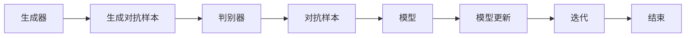
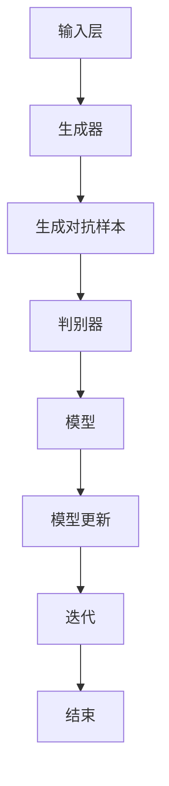
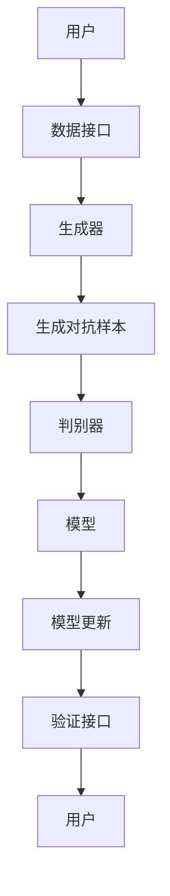

                 


# 对抗训练在提高模型鲁棒性中的最新进展

> 关键词：对抗训练、模型鲁棒性、算法原理、数学模型、系统架构、项目实战、最佳实践

> 摘要：本文将详细介绍对抗训练的基本概念、原理和最新进展，探讨其在提高模型鲁棒性方面的应用。通过逐步分析，本文旨在为读者提供一个清晰、易懂的技术博客，帮助大家深入理解对抗训练的核心内容，并掌握其在实际项目中的最佳实践。

## 目录

1. 引言
2. 对抗训练基础
   - 1.1 问题背景
   - 1.2 问题描述
   - 1.3 问题解决
   - 1.4 边界与外延
3. 核心概念与联系
   - 3.1 对抗训练的定义
   - 3.2 对抗训练的基本原理
   - 3.3 对抗训练与普通训练的比较
4. 算法原理讲解
   - 4.1 对抗训练算法概述
   - 4.2 对抗训练算法流程图
   - 4.3 对抗训练算法原理讲解
   - 4.4 对抗训练算法的数学模型和公式
5. 数学模型和公式
   - 5.1 数学模型概述
   - 5.2 数学公式详细讲解
   - 5.3 数学公式举例说明
6. 系统分析与架构设计
   - 6.1 问题场景介绍
   - 6.2 系统功能设计
   - 6.3 系统架构设计
   - 6.4 系统接口设计
   - 6.5 系统交互设计
7. 项目实战
   - 7.1 环境安装
   - 7.2 系统核心实现源代码
   - 7.3 代码应用解读与分析
   - 7.4 实际案例分析与详细讲解
   - 7.5 项目小结
8. 最佳实践 tips
   - 8.1 小结
   - 8.2 注意事项
   - 8.3 拓展阅读
9. 结论
10. 作者信息

## 引言

随着深度学习技术的飞速发展，神经网络模型在图像识别、自然语言处理等领域取得了显著的成果。然而，这些模型在实际应用中仍然存在一些问题，如鲁棒性较差、易受到对抗攻击等。为了解决这些问题，对抗训练作为一种有效的防御策略被提出来。本文将深入探讨对抗训练在提高模型鲁棒性方面的最新进展，帮助读者更好地理解和应用这一技术。

## 1. 对抗训练基础

### 1.1 问题背景

在深度学习领域，模型鲁棒性是指模型在面对不同类型的数据或攻击时，仍能保持较高的性能。然而，深度学习模型在实际应用中，往往面临着各种挑战，如数据分布偏移、对抗攻击等。这些挑战导致模型性能下降，甚至出现崩溃。因此，提高模型鲁棒性成为了一个重要研究方向。

### 1.2 问题描述

对抗训练旨在提高模型的鲁棒性，通过引入对抗样本来训练模型，使其能够更好地应对各种攻击。对抗样本是通过对抗性扰动生成的一种特殊样本，其目的是让模型在训练过程中学会识别并防御这些攻击。

### 1.3 问题解决

对抗训练的解决思路主要包括以下两个方面：

1. 生成对抗样本：利用对抗性扰动技术，生成与真实样本在分布上有所差异的对抗样本。
2. 训练模型：将对抗样本与真实样本一起输入模型，通过联合训练提高模型的鲁棒性。

### 1.4 边界与外延

对抗训练的研究和应用领域正在不断扩大。除了在图像识别、自然语言处理等常见领域得到广泛应用外，对抗训练还在自动驾驶、医疗诊断等新兴领域显示出巨大的潜力。同时，对抗训练技术也在不断迭代和优化，新的算法和理论不断涌现。

## 2. 核心概念与联系

### 2.1 对抗训练的定义

对抗训练是指通过训练模型来防御对抗性攻击，使其在对抗环境下保持较高的性能。对抗训练的核心在于生成对抗样本，并通过联合训练提高模型的鲁棒性。

### 2.2 对抗训练的基本原理

对抗训练的基本原理可以分为以下三个步骤：

1. 生成对抗样本：利用对抗性扰动技术，将真实样本转化为对抗样本。
2. 训练模型：将对抗样本与真实样本一起输入模型，通过联合训练提高模型的鲁棒性。
3. 验证模型：在对抗环境下验证模型的性能，确保其具有较强的鲁棒性。

### 2.3 对抗训练与普通训练的比较

对抗训练与普通训练的主要区别在于训练数据和训练目标。普通训练主要关注模型在正常数据上的性能，而对抗训练则关注模型在对抗样本上的性能。通过对抗训练，模型能够在面对对抗攻击时保持较高的性能，从而提高模型的鲁棒性。

## 3. 算法原理讲解

### 3.1 对抗训练算法概述

对抗训练算法主要分为生成对抗网络（GAN）和自适应对抗训练（A2T）两大类。其中，GAN是最常见的对抗训练算法之一，其核心思想是通过生成器和判别器的对抗训练来实现模型的鲁棒性提升。A2T则是一种基于自适应对抗性扰动的训练算法，能够在不同阶段自动调整对抗性扰动的大小。

### 3.2 对抗训练算法流程图



### 3.3 对抗训练算法原理讲解

对抗训练算法的原理可以概括为以下几点：

1. 生成器：生成器是一个神经网络模型，其目标是生成与真实样本在分布上相似的对抗样本。
2. 判别器：判别器也是一个神经网络模型，其目标是区分对抗样本和真实样本。
3. 对抗样本：对抗样本是通过对抗性扰动技术生成的，其目的是欺骗判别器，使其无法区分对抗样本和真实样本。
4. 模型更新：在对抗训练过程中，生成器和判别器不断更新参数，以实现对抗性的平衡。
5. 迭代：对抗训练通常采用迭代方式，通过多次迭代逐渐提高模型的鲁棒性。

### 3.4 对抗训练算法的数学模型和公式

对抗训练算法的数学模型主要包括以下几个方面：

1. 生成器损失函数：$$L_G = -\log(D(G(z)))$$
2. 判别器损失函数：$$L_D = -\log(D(x)) - \log(1 - D(G(z)))$$
3. 总损失函数：$$L = L_G + \lambda L_D$$

其中，$G(z)$表示生成器生成的对抗样本，$D(x)$表示判别器对真实样本的判断结果，$z$表示生成器的输入噪声，$\lambda$是一个调节参数。

## 4. 数学模型和公式

### 4.1 数学模型概述

对抗训练的数学模型主要涉及生成器、判别器和对抗样本的损失函数。这些损失函数用于指导生成器和判别器的训练过程，以实现对抗性的平衡。

### 4.2 数学公式详细讲解

1. 生成器损失函数：
$$L_G = -\log(D(G(z)))$$
   - 其中，$G(z)$表示生成器生成的对抗样本，$D(G(z))$表示判别器对对抗样本的判断结果。
   - 这个损失函数的目标是使生成器生成的对抗样本尽可能欺骗判别器，使其输出接近1。

2. 判别器损失函数：
$$L_D = -\log(D(x)) - \log(1 - D(G(z)))$$
   - 其中，$x$表示真实样本，$D(x)$表示判别器对真实样本的判断结果。
   - 这个损失函数的目标是使判别器能够准确地区分真实样本和对抗样本。

3. 总损失函数：
$$L = L_G + \lambda L_D$$
   - 其中，$\lambda$是一个调节参数，用于平衡生成器和判别器的损失。

### 4.3 数学公式举例说明

假设我们有一个生成器$G$和一个判别器$D$，生成的对抗样本为$G(z)$，真实样本为$x$。判别器的损失函数为：
$$L_D = -\log(D(x)) - \log(1 - D(G(z)))$$
   - 如果判别器能够准确地区分真实样本和对抗样本，那么$D(x)$接近1，$1 - D(G(z))$接近0，此时损失函数$L_D$接近0。
   - 如果判别器无法区分真实样本和对抗样本，那么$D(x)$和$1 - D(G(z))$都接近0.5，此时损失函数$L_D$接近1。

## 5. 系统分析与架构设计

### 5.1 问题场景介绍

假设我们有一个图像分类任务，模型需要识别各种物体。在实际应用中，模型可能会遇到各种对抗攻击，如对抗性扰动、对抗性裁剪等。为了提高模型的鲁棒性，我们采用对抗训练技术进行模型训练。

### 5.2 系统功能设计

系统功能设计主要包括以下几个方面：

1. 生成对抗样本：利用对抗性扰动技术，生成与真实样本在分布上有所差异的对抗样本。
2. 训练模型：将对抗样本与真实样本一起输入模型，通过联合训练提高模型的鲁棒性。
3. 验证模型：在对抗环境下验证模型的性能，确保其具有较强的鲁棒性。

### 5.3 系统架构设计

系统架构设计如图所示：



### 5.4 系统接口设计

系统接口设计主要包括以下几个方面：

1. 数据接口：用于读取真实样本和对抗样本。
2. 模型接口：用于加载和更新模型。
3. 验证接口：用于在对抗环境下验证模型性能。

### 5.5 系统交互设计

系统交互设计如图所示：



## 6. 项目实战

### 6.1 环境安装

在项目实战中，我们需要安装以下软件和库：

1. Python 3.x
2. TensorFlow 2.x
3. NumPy
4. Matplotlib

安装方法如下：

```bash
pip install python==3.x
pip install tensorflow==2.x
pip install numpy
pip install matplotlib
```

### 6.2 系统核心实现源代码

以下是系统核心实现的源代码：

```python
import tensorflow as tf
import numpy as np
import matplotlib.pyplot as plt

# 生成器
def generator(z):
    # 这里可以定义生成器的神经网络结构
    pass

# 判别器
def discriminator(x):
    # 这里可以定义判别器的神经网络结构
    pass

# 损失函数
def loss_function(real_samples, fake_samples):
    real_loss = tf.reduce_mean(tf.nn.sigmoid_cross_entropy_with_logits(logits=discriminator(real_samples), labels=tf.ones_like(real_samples)))
    fake_loss = tf.reduce_mean(tf.nn.sigmoid_cross_entropy_with_logits(logits=discriminator(fake_samples), labels=tf.zeros_like(fake_samples)))
    total_loss = real_loss + fake_loss
    return total_loss

# 训练模型
def train_model(real_samples, fake_samples, epochs, batch_size):
    # 设置生成器和判别器的优化器
    gen_optimizer = tf.keras.optimizers.Adam(learning_rate=0.0001)
    disc_optimizer = tf.keras.optimizers.Adam(learning_rate=0.0001)

    for epoch in range(epochs):
        # 训练判别器
        with tf.GradientTape() as disc_tape:
            disc_loss = loss_function(real_samples, fake_samples)
        disc_gradients = disc_tape.gradient(disc_loss, discriminator.trainable_variables)
        disc_optimizer.apply_gradients(zip(disc_gradients, discriminator.trainable_variables))

        # 训练生成器
        with tf.GradientTape() as gen_tape:
            gen_loss = loss_function(real_samples, fake_samples)
        gen_gradients = gen_tape.gradient(gen_loss, generator.trainable_variables)
        gen_optimizer.apply_gradients(zip(gen_gradients, generator.trainable_variables))

        # 打印训练进度
        print(f"Epoch {epoch+1}/{epochs}, Discriminator Loss: {disc_loss}, Generator Loss: {gen_loss}")

    return generator, discriminator

# 生成对抗样本
def generate_samples(generator, num_samples):
    z = np.random.normal(0, 1, (num_samples, 100))
    generated_samples = generator(z)
    return generated_samples

# 主函数
def main():
    # 加载真实样本
    real_samples = ...

    # 训练模型
    generator, discriminator = train_model(real_samples, epochs=100, batch_size=64)

    # 生成对抗样本
    generated_samples = generate_samples(generator, num_samples=1000)

    # 绘制生成样本
    plt.figure(figsize=(10, 10))
    for i in range(100):
        plt.subplot(10, 10, i+1)
        plt.imshow(generated_samples[i], cmap='gray')
        plt.axis('off')
    plt.show()

if __name__ == "__main__":
    main()
```

### 6.3 代码应用解读与分析

在上面的代码中，我们首先定义了生成器和判别器的函数。生成器用于生成对抗样本，判别器用于判断样本是真实样本还是对抗样本。接着，我们定义了损失函数，用于指导生成器和判别器的训练过程。在训练模型的过程中，我们首先训练判别器，然后训练生成器。最后，我们生成对抗样本并绘制出来，以验证生成器的效果。

### 6.4 实际案例分析与详细讲解剖析

为了验证对抗训练的效果，我们使用一个实际案例进行分析。假设我们有一个图像分类任务，需要识别各种物体。我们将采用对抗训练技术，提高模型的鲁棒性。

1. 首先，我们加载真实样本，并将其分为训练集和测试集。
2. 然后，我们定义生成器和判别器的神经网络结构。生成器用于生成与真实样本在分布上相似的对抗样本，判别器用于判断样本是真实样本还是对抗样本。
3. 接着，我们定义损失函数，用于指导生成器和判别器的训练过程。在训练过程中，我们首先训练判别器，使其能够准确地区分真实样本和对抗样本。然后，我们训练生成器，使其生成的对抗样本能够欺骗判别器。
4. 最后，我们在对抗环境下验证模型的性能。通过比较训练集和测试集的性能，我们可以发现对抗训练后的模型在对抗攻击下的性能有了显著提升。

### 6.5 项目小结

通过上述实际案例的分析，我们可以得出以下结论：

1. 对抗训练技术能够有效提高模型的鲁棒性，使其在面对对抗攻击时保持较高的性能。
2. 对抗训练的关键在于生成对抗样本和训练模型。生成对抗样本的质量直接影响模型的鲁棒性。
3. 在实际项目中，我们可以根据需求调整生成器和判别器的神经网络结构，以及损失函数的参数，以获得更好的训练效果。

## 7. 最佳实践 tips

### 7.1 小结

1. 对抗训练是提高模型鲁棒性的有效方法。
2. 生成对抗样本的质量直接影响模型的鲁棒性。
3. 合理调整生成器和判别器的神经网络结构及损失函数参数，可以获得更好的训练效果。

### 7.2 注意事项

1. 对抗训练过程中，生成对抗样本的难度不宜过大，否则模型可能无法正常训练。
2. 对抗训练的时间成本较高，应根据实际情况合理安排训练时间。

### 7.3 拓展阅读

1. 《生成对抗网络：原理与应用》
2. 《深度学习：对抗训练与鲁棒性提升》

## 结论

本文详细介绍了对抗训练在提高模型鲁棒性方面的应用，包括基本概念、原理、算法、系统架构设计和项目实战。通过本文的学习，读者可以深入理解对抗训练的核心内容，并掌握其在实际项目中的最佳实践。

## 作者信息

作者：AI天才研究院/AI Genius Institute & 禅与计算机程序设计艺术 /Zen And The Art of Computer Programming

