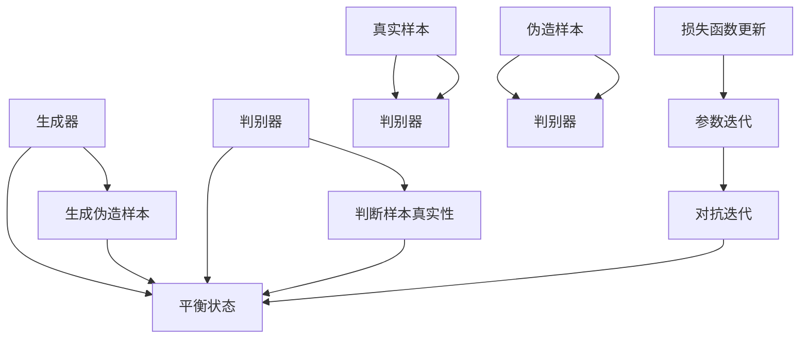
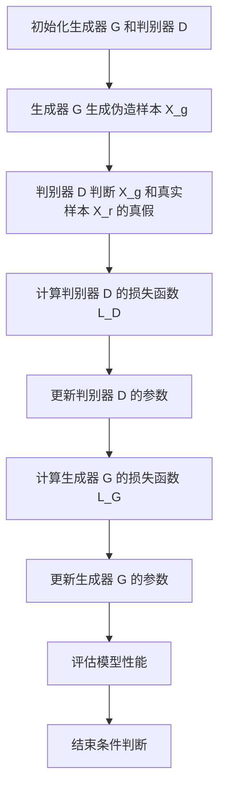
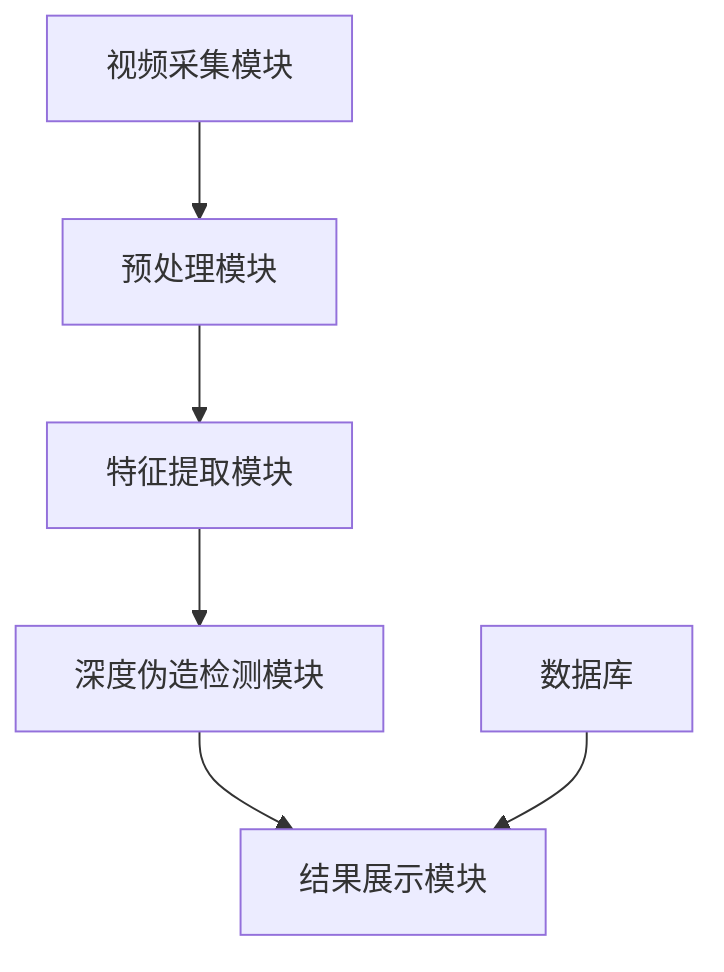
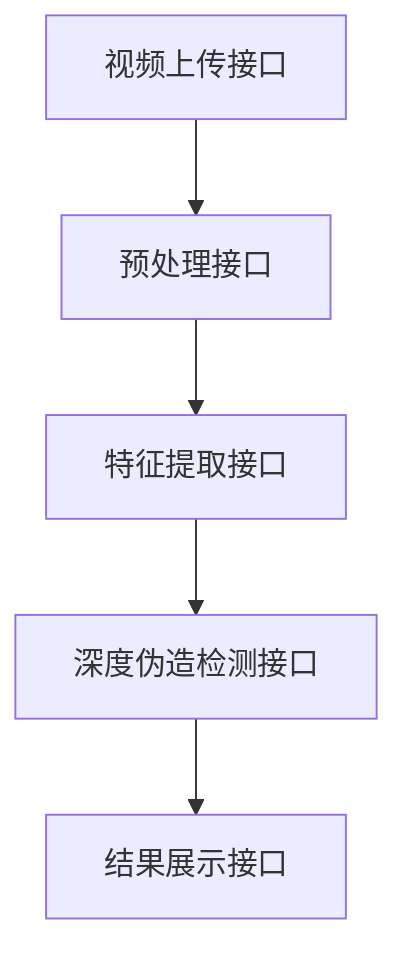
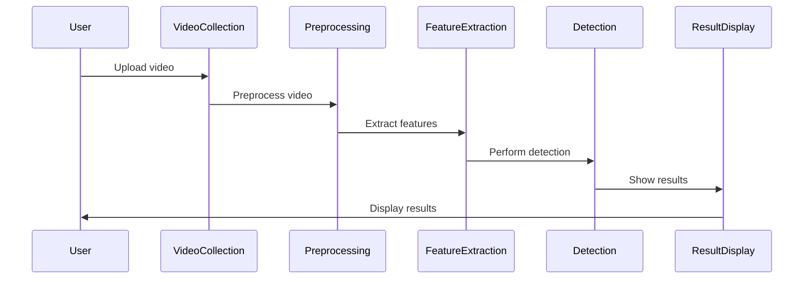

                 

## 第1章：对抗训练概述

### 1.1 问题背景与描述

#### 1.1.1 深度伪造视频的起源与发展

深度伪造（Deepfake）技术，是一种利用深度学习模型生成逼真视频的方法。最早在2017年，深度伪造技术引起了公众的广泛关注。它利用生成对抗网络（GANs）等技术，通过对大量人脸图片进行训练，可以生成非常真实的人脸动画视频。这种技术不仅可以在娱乐产业中用于角色定制，也可能被用于恶意的目的，例如制作虚假视频以诽谤他人或散布虚假信息。

随着计算能力的提升和深度学习算法的进步，深度伪造视频的制作变得更加简单和高效。今天，任何人只要拥有适当的软件和计算机设备，就可以制作出高质量的深度伪造视频。这使得深度伪造视频成为了一个严峻的社会问题，对社会秩序、个人隐私和媒体真实性的威胁日益增加。

#### 1.1.2 深度伪造视频的威胁与挑战

深度伪造视频的威胁主要体现在以下几个方面：

1. **隐私侵犯**：深度伪造视频技术可以轻松制作出他人的假视频，可能被用于隐私侵犯，例如制作虚假的艳照、伪造的性行为视频等，给受害者带来极大的心理创伤。

2. **虚假信息传播**：深度伪造视频可以用于制作虚假的演讲、新闻报道等，误导公众，影响社会舆论。在政治选举、商业竞争等场合，这种虚假视频可能会被用来攻击对手或制造混乱。

3. **政治与商业影响**：在政治领域，深度伪造视频可能被用于操纵选举结果，影响政治决策。在商业领域，竞争对手可能利用深度伪造视频来损害对方的声誉。

#### 1.1.3 对抗训练的概念与目标

对抗训练（Adversarial Training）是一种提升神经网络模型鲁棒性的技术。它通过模拟对抗环境，使得神经网络能够识别并抵御深度伪造视频的攻击。对抗训练的核心目标是让神经网络学会在复杂、不明确的环境中做出正确的决策，而不是被对抗样本所迷惑。

对抗训练的目标可以概括为以下几点：

- 提高神经网络的泛化能力，使其能够识别不同类型的深度伪造视频。
- 增强神经网络的鲁棒性，使其能够在对抗攻击下保持稳定的性能。
- 通过对抗训练，神经网络能够学会识别视频中的细微差异，提高对深度伪造视频的检测准确性。

### 1.2 对抗训练的发展历程与现状

对抗训练起源于生成对抗网络（GANs），GANs是由Ian Goodfellow等人在2014年提出的一种深度学习框架。GANs由生成器（Generator）和判别器（Discriminator）两部分组成，生成器试图生成逼真的样本，而判别器则试图区分真实样本和生成样本。对抗训练通过不断地更新生成器和判别器的参数，使得两者在对抗过程中不断进步。

自从GANs提出以来，对抗训练在图像、语音、文本等领域都取得了显著的成果。在图像领域，对抗训练被用于图像生成、图像修复、图像超分辨率等任务。在语音领域，对抗训练被用于语音合成、语音识别等任务。在文本领域，对抗训练被用于生成对抗文本、文本分类等任务。

目前，对抗训练已经成为深度伪造视频检测的重要手段。通过对抗训练，神经网络模型可以学会识别深度伪造视频中的细微特征，从而提高检测的准确性。同时，对抗训练也在不断优化，例如通过引入新的训练策略、改进网络结构等，以提高模型的性能和鲁棒性。

### 1.3 对抗训练的核心概念

对抗训练的核心概念包括生成器（Generator）、判别器（Discriminator）、对抗样本（Adversarial Examples）等。

1. **生成器（Generator）**：生成器的目标是生成与真实样本相似的数据。在深度伪造视频的背景下，生成器试图生成逼真的视频片段，使得判别器无法区分这些视频是真实的还是伪造的。

2. **判别器（Discriminator）**：判别器的目标是判断一个样本是真实的还是伪造的。在对抗训练中，判别器与生成器相互对抗，判别器试图提高对伪造样本的识别能力，而生成器则试图生成更逼真的伪造样本。

3. **对抗样本（Adversarial Examples）**：对抗样本是指那些在视觉上几乎不可察觉，但对神经网络模型产生误导性的样本。在深度伪造视频中，对抗样本可能是通过微调图像的某些像素值来实现的，使得神经网络模型无法正确识别。

对抗训练的过程可以理解为生成器和判别器的“博弈”过程。生成器试图欺骗判别器，而判别器则试图不被欺骗。通过不断地迭代训练，生成器和判别器的性能都会得到提升。

### 1.4 对抗训练的边界与外延

对抗训练虽然是一种强大的技术，但它也存在一定的局限性。

1. **训练成本高**：对抗训练需要大量的真实数据和伪造数据，同时需要较长的训练时间。这使得对抗训练在资源有限的情况下可能难以实施。

2. **过拟合问题**：对抗训练可能会导致模型过拟合，即在训练数据上表现良好，但在未见过的数据上表现不佳。为了解决这个问题，研究者们提出了许多改进策略，如数据增强、模型正则化等。

3. **应用场景限制**：对抗训练主要适用于需要高鲁棒性的场景，例如深度伪造视频检测。在其他场景中，对抗训练可能并不是最优的选择。

4. **公平性和透明度**：对抗训练过程中，生成器和判别器的参数更新是相互依赖的，这可能导致模型的不透明性和不公平性。如何提高对抗训练的公平性和透明度，是当前研究的一个热点问题。

总之，对抗训练是一种强大的技术，它为深度伪造视频检测提供了一种有效的解决方案。然而，对抗训练也面临着一些挑战和局限性，需要进一步的研究和优化。

### 1.5 对抗训练与深度伪造视频检测的联系

对抗训练与深度伪造视频检测有着密切的联系。深度伪造视频检测的目标是识别和过滤伪造的视频，对抗训练提供了一种提高检测模型鲁棒性的有效手段。

在深度伪造视频检测中，对抗训练的应用主要体现在以下几个方面：

1. **增强模型鲁棒性**：通过对抗训练，可以增强检测模型对伪造视频的识别能力，使其在面对各种复杂的伪造技术时仍然能够保持良好的性能。

2. **提高检测准确性**：对抗训练可以帮助模型识别出那些在视觉上非常逼真的伪造视频，从而提高检测的准确性。

3. **应对新攻击方法**：随着深度伪造技术的不断发展，新的伪造方法不断出现。对抗训练可以通过不断地训练和调整模型，使其能够应对这些新的攻击方法。

4. **跨域适应性**：对抗训练可以帮助模型在不同领域和不同数据集上保持良好的性能，从而提高模型的跨域适应性。

总之，对抗训练与深度伪造视频检测密切相关，它为深度伪造视频检测提供了一种新的思路和方法。通过对抗训练，可以显著提高深度伪造视频检测的性能和鲁棒性。

## 第2章：对抗训练原理与分类

### 2.1 对抗训练的基本原理

对抗训练是一种通过模拟对抗环境来提升模型鲁棒性的方法。它起源于生成对抗网络（GANs），GANs由生成器（Generator）和判别器（Discriminator）两部分组成。生成器的目标是生成与真实样本相似的数据，而判别器的目标是判断一个样本是真实的还是伪造的。在对抗训练过程中，生成器和判别器相互对抗，不断迭代训练，最终达到一个平衡状态。

具体来说，对抗训练的基本原理如下：

1. **初始化生成器和判别器**：首先，随机初始化生成器和判别器的参数。生成器是一个生成模型，它尝试生成逼真的样本；判别器是一个分类模型，它试图区分真实样本和伪造样本。

2. **生成对抗**：在训练过程中，生成器和判别器不断地进行对抗。生成器试图生成更逼真的样本，使得判别器无法区分这些样本是真实的还是伪造的；判别器则试图提高对伪造样本的识别能力。

3. **参数更新**：通过反向传播算法，根据生成器和判别器的损失函数更新它们的参数。生成器的损失函数是使得判别器输出接近0.5（即对真实样本和伪造样本的识别概率相等），而判别器的损失函数是使得对真实样本的识别概率接近1，对伪造样本的识别概率接近0。

4. **迭代过程**：重复上述过程，直到生成器和判别器达到一个平衡状态。在平衡状态下，生成器能够生成几乎不可区分于真实样本的伪造样本，而判别器能够准确地区分真实样本和伪造样本。

对抗训练的关键在于生成器和判别器的相互对抗，这种对抗促使两者不断进步，最终实现一个稳定的状态。这种对抗关系如图2.1所示：



### 2.2 对抗训练的分类方法

对抗训练可以根据不同的维度进行分类，以下是几种常见的分类方法：

#### 2.2.1 按照生成器和判别器的结构分类

1. **传统的GANs**：这是最常见的对抗训练结构，生成器和判别器都是全连接神经网络。

2. **卷积生成对抗网络（CGANs）**：生成器和判别器都是卷积神经网络（CNNs），适用于图像等高维数据的生成和识别。

3. **循环神经网络生成对抗网络（RNN-GANs）**：生成器和判别器使用循环神经网络（RNNs），适用于序列数据的生成和识别，如语音和文本。

4. **变分自编码器生成对抗网络（VAEGANs）**：结合变分自编码器（VAEs）和GANs，用于生成和识别高维数据。

#### 2.2.2 按照训练策略分类

1. **渐变对抗训练**：通过逐渐增加对抗性的训练强度，使模型能够逐步适应更复杂的对抗环境。

2. **自适应对抗训练**：根据模型的学习过程动态调整对抗性的强度，以最大化模型的鲁棒性。

3. **混合训练策略**：结合多种对抗训练策略，以提高模型的性能和鲁棒性。

#### 2.2.3 按照应用场景分类

1. **图像生成与识别**：生成对抗网络在图像生成和图像识别领域有着广泛的应用，如图像超分辨率、图像修复、人脸生成等。

2. **语音生成与识别**：对抗训练被用于语音生成和语音识别任务，如图像到语音的转换、语音情感识别等。

3. **文本生成与识别**：对抗训练被用于生成和识别对抗性的文本数据，如图像到文本的转换、文本分类等。

### 2.3 对抗训练与深度伪造视频检测的联系

对抗训练在深度伪造视频检测中有着重要的应用。深度伪造视频检测的目标是识别和过滤伪造的视频，对抗训练可以帮助检测模型提高对伪造视频的识别能力。

对抗训练在深度伪造视频检测中的应用主要体现在以下几个方面：

1. **增强模型的鲁棒性**：对抗训练可以增强检测模型对伪造视频的识别能力，使其在面对各种复杂的伪造技术时仍然能够保持良好的性能。

2. **提高检测准确性**：对抗训练可以帮助模型识别出那些在视觉上非常逼真的伪造视频，从而提高检测的准确性。

3. **应对新攻击方法**：随着深度伪造技术的不断发展，新的伪造方法不断出现。对抗训练可以通过不断地训练和调整模型，使其能够应对这些新的攻击方法。

4. **跨域适应性**：对抗训练可以帮助模型在不同领域和不同数据集上保持良好的性能，从而提高模型的跨域适应性。

具体来说，对抗训练在深度伪造视频检测中的应用流程如下：

1. **数据收集**：收集大量的深度伪造视频和真实视频数据，用于训练生成器和判别器。

2. **生成对抗样本**：使用生成器生成伪造视频，并将其作为对抗样本输入到判别器中。

3. **训练判别器**：判别器通过对比真实视频和伪造视频，学习识别伪造视频的规律。

4. **训练生成器**：生成器通过模仿真实视频的生成过程，生成更加逼真的伪造视频。

5. **迭代训练**：不断重复上述过程，直到生成器和判别器达到一个平衡状态。

6. **模型评估**：使用测试集对训练好的模型进行评估，验证其检测伪造视频的准确性。

### 2.4 传统视频检测方法与对抗训练的对比

传统视频检测方法主要依赖于手工设计的特征和分类器，如HOG（Histogram of Oriented Gradients）特征、SVM（Support Vector Machine）分类器等。这些方法在处理静态图像时表现良好，但在处理动态视频时存在一些局限性：

1. **时间复杂性**：传统方法通常需要逐帧处理视频，导致时间复杂性较高，不适合处理大规模视频数据。

2. **鲁棒性不足**：传统方法对噪声和遮挡等干扰因素敏感，难以处理复杂的场景。

3. **适应性差**：传统方法难以应对新的伪造技术和攻击手段，适应能力较差。

相比之下，对抗训练具有以下优势：

1. **高鲁棒性**：对抗训练通过模拟对抗环境，使得模型能够在面对各种复杂的伪造技术时保持稳定的性能。

2. **自适应性强**：对抗训练可以通过不断调整生成器和判别器的参数，适应新的伪造技术和攻击手段。

3. **高检测精度**：对抗训练能够识别出那些在视觉上非常逼真的伪造视频，从而提高检测的准确性。

4. **泛化能力**：对抗训练通过大量的对抗样本训练，使得模型具有较好的泛化能力，能够在不同领域和不同数据集上保持良好的性能。

综上所述，对抗训练相对于传统视频检测方法具有明显的优势，为深度伪造视频检测提供了一种更加有效和鲁棒的解决方案。

### 2.5 对抗训练在深度伪造视频检测中的应用实例

为了更好地理解对抗训练在深度伪造视频检测中的应用，我们可以通过一个实际案例来展示其工作流程和效果。

#### 案例背景

假设我们有一个深度伪造视频检测系统，该系统需要识别和过滤社交媒体平台上的伪造视频。这些伪造视频可能用于隐私侵犯、虚假信息传播等恶意目的。

#### 数据准备

我们首先需要收集大量的深度伪造视频和真实视频数据。这些数据可以来自公开的深度伪造视频库、社交媒体平台等。数据集应包括不同类型、不同场景、不同质量的视频，以覆盖各种可能的伪造技术。

#### 生成对抗样本

使用生成器生成伪造视频。生成器可以是一个基于GANs的模型，它通过模拟真实视频的生成过程，生成与真实视频几乎不可区分的伪造视频。这些伪造视频将作为对抗样本，用于训练判别器。

#### 训练判别器

判别器是一个二分类模型，它试图判断一个视频是真实的还是伪造的。在训练过程中，判别器通过对比真实视频和伪造视频，学习识别伪造视频的规律。对抗训练使得判别器能够适应各种复杂的伪造技术。

#### 训练生成器

生成器的目标是生成更加逼真的伪造视频。通过对抗训练，生成器不断优化其参数，使得生成的伪造视频能够在视觉上更加逼真，同时使得判别器的识别能力不断提高。

#### 模型评估

使用测试集对训练好的模型进行评估。评估指标包括准确率、召回率、F1分数等。通过评估，我们可以验证模型在识别伪造视频方面的性能。

#### 模型应用

将训练好的模型部署到社交媒体平台，实时检测上传的视频。对于检测到的伪造视频，可以采取相应的措施，如标记、删除等，以保护用户隐私和安全。

通过上述实例，我们可以看到对抗训练在深度伪造视频检测中的应用流程和效果。对抗训练通过模拟对抗环境，使得模型能够适应各种伪造技术，从而提高检测的准确性和鲁棒性。

### 2.6 对抗训练的挑战与未来方向

尽管对抗训练在深度伪造视频检测中表现出色，但仍然面临一些挑战和未来研究方向。

#### 2.6.1 训练成本高

对抗训练需要大量的真实数据和伪造数据，同时需要较长的训练时间。这导致训练成本较高，特别是在资源有限的场景下。未来的研究方向可以关注如何优化训练效率，减少训练成本。

#### 2.6.2 过拟合问题

对抗训练可能会导致模型过拟合，即在训练数据上表现良好，但在未见过的数据上表现不佳。为解决这一问题，可以采用数据增强、模型正则化等技术。

#### 2.6.3 鲁棒性提升

对抗训练的鲁棒性虽然较强，但仍存在提升空间。未来的研究方向可以关注如何进一步提高模型的鲁棒性，使其能够应对更复杂的伪造技术和攻击手段。

#### 2.6.4 公平性与透明度

对抗训练过程中，生成器和判别器的参数更新是相互依赖的，可能导致模型的不透明性和不公平性。如何提高对抗训练的公平性和透明度，是当前研究的一个热点问题。

#### 2.6.5 跨领域应用

对抗训练不仅在深度伪造视频检测中有应用，还可以推广到其他领域，如语音伪造检测、文本伪造检测等。未来的研究方向可以关注对抗训练在不同领域的应用和优化。

综上所述，对抗训练在深度伪造视频检测中具有重要的应用价值，但同时也面临一些挑战。未来的研究将继续优化对抗训练技术，提高其性能和鲁棒性，为深度伪造视频检测提供更加有效的解决方案。

## 第3章：对抗训练算法讲解

### 3.1 对抗训练算法的mermaid流程图

对抗训练算法的核心是生成器和判别器的相互对抗。以下是生成对抗网络（GANs）的基本mermaid流程图，用于展示对抗训练的主要步骤和流程：



在这个流程图中，生成器G负责生成伪造样本X_g，判别器D则尝试区分这些伪造样本X_g和真实样本X_r。通过迭代更新生成器和判别器的参数，使得两者在对抗过程中不断进步，最终达到一个平衡状态。

### 3.2 对抗训练算法的Python源代码讲解

以下是一个简单的对抗训练算法的实现，使用Python和TensorFlow框架。这段代码展示了生成器和判别器的构建、训练过程以及损失函数的计算。

```python
import tensorflow as tf
from tensorflow.keras.models import Model
from tensorflow.keras.layers import Dense, Input

# 定义生成器 G 的模型
def build_generator(input_shape):
    input_layer = Input(shape=input_shape)
    x = Dense(128, activation='relu')(input_layer)
    x = Dense(128, activation='relu')(x)
    output_layer = Dense(784, activation='sigmoid')(x)
    generator = Model(inputs=input_layer, outputs=output_layer)
    return generator

# 定义判别器 D 的模型
def build_discriminator(input_shape):
    input_layer = Input(shape=input_shape)
    x = Dense(128, activation='relu')(input_layer)
    output_layer = Dense(1, activation='sigmoid')(x)
    discriminator = Model(inputs=input_layer, outputs=output_layer)
    return discriminator

# 定义生成器和判别器
input_shape = (784,)
generator = build_generator(input_shape)
discriminator = build_discriminator(input_shape)

# 定义损失函数和优化器
adversarial_loss = tf.reduce_mean(tf.nn.sigmoid_cross_entropy_with_logits(logits=discriminator.predict(generator.predict(x_real)), labels=tf.ones_like(discriminator.predict(x_real)))
generator_loss = tf.reduce_mean(tf.nn.sigmoid_cross_entropy_with_logits(logits=discriminator.predict(generator.predict(x_fake)), labels=tf.zeros_like(discriminator.predict(x_fake)))
discriminator_loss = tf.reduce_mean(tf.nn.sigmoid_cross_entropy_with_logits(logits=discriminator.predict(x_real), labels=tf.ones_like(discriminator.predict(x_real)))
generator_optimizer = tf.keras.optimizers.Adam(learning_rate=0.0001)
discriminator_optimizer = tf.keras.optimizers.Adam(learning_rate=0.0001)

# 训练模型
for epoch in range(epochs):
    for batch in train_dataset:
        x_real = batch
        noise = tf.random.normal([batch_size, noise_dim])
        x_fake = generator.predict(noise)

        with tf.GradientTape() as gen_tape, tf.GradientTape() as disc_tape:
            disc_real_logits = discriminator(x_real)
            disc_fake_logits = discriminator(x_fake)

            disc_loss = discriminator_loss(disc_real_logits, disc_fake_logits)
            gen_loss = generator_loss(disc_fake_logits)

        gradients_of_generator = gen_tape.gradient(gen_loss, generator.trainable_variables)
        gradients_of_discriminator = disc_tape.gradient(disc_loss, discriminator.trainable_variables)

        generator_optimizer.apply_gradients(zip(gradients_of_generator, generator.trainable_variables))
        discriminator_optimizer.apply_gradients(zip(gradients_of_discriminator, discriminator.trainable_variables))

        # 打印训练进度
        if epoch % 100 == 0:
            print(f"Epoch {epoch}, Generator Loss: {gen_loss.numpy()}, Discriminator Loss: {disc_loss.numpy()}")
```

在这个实现中，我们定义了生成器和判别器的模型，并使用Adam优化器进行训练。在每次迭代中，我们通过生成器生成伪造样本，并通过判别器判断这些样本的真实性。根据判别器的输出，我们计算损失函数，并更新生成器和判别器的参数。

### 3.3 对抗训练算法的数学模型与公式

对抗训练的核心是通过生成器和判别器之间的对抗过程来优化模型。以下是生成器和判别器的损失函数，以及它们之间的关系：

#### 3.3.1 生成器的损失函数

生成器的目标是生成与真实样本相似的伪造样本，使得判别器无法区分这些样本是真实的还是伪造的。生成器的损失函数通常采用以下形式：

$$
L_G = -\log(D(G(z))}
$$

其中，\(D\) 是判别器，\(G\) 是生成器，\(z\) 是从先验分布中采样的噪声。

#### 3.3.2 判别器的损失函数

判别器的目标是判断一个样本是真实的还是伪造的。判别器的损失函数通常采用以下形式：

$$
L_D = -[\log(D(x_r)) + \log(1 - D(G(z))]
$$

其中，\(x_r\) 是真实样本，\(G(z)\) 是生成器生成的伪造样本。

#### 3.3.3 生成器和判别器的联合损失函数

生成器和判别器的联合损失函数通常采用以下形式：

$$
L = L_D + \lambda \cdot L_G
$$

其中，\(\lambda\) 是调节参数，用于平衡生成器和判别器的损失。

### 3.4 对抗训练算法的通俗易懂举例说明

为了更好地理解对抗训练算法，我们可以通过一个简单的例子来讲解其原理。

假设我们有一个生成器G和一个判别器D。生成器G的目的是生成一些看起来像猫的图像，而判别器D的目的是区分这些图像是真实的猫还是生成器G生成的假猫。

首先，生成器G会生成一些随机的图像，这些图像看起来可能并不是猫。判别器D会判断这些图像是真实的猫的概率是0.3，是假的猫的概率是0.7。

然后，生成器G会根据判别器D的反馈来调整图像的生成过程，使得生成的图像更加逼真。例如，生成器G可能会增加图像中猫的特征，如耳朵、胡须等。

接着，判别器D再次判断这些调整后的图像，现在判别器D认为这些图像是真实的猫的概率是0.5，是假的猫的概率是0.5。

这个过程会不断迭代，生成器G和判别器D会不断地调整自己的参数，最终达到一个平衡状态。在这个状态下，生成器G生成的图像几乎无法被判别器D区分是真实的猫还是假猫。

通过这个例子，我们可以看到对抗训练的核心是生成器和判别器的相互对抗和不断调整。这种对抗过程使得生成器能够生成越来越逼真的图像，而判别器能够越来越准确地判断图像的真伪。

## 第4章：深度伪造视频检测系统分析与架构设计

### 4.1 深度伪造视频检测系统的需求分析

深度伪造视频检测系统的需求分析是构建系统的基础，需要明确系统需要实现的功能、性能要求、用户需求等。以下是深度伪造视频检测系统的需求分析：

1. **功能需求**：
   - **视频采集**：系统能够从各种数据源（如社交媒体、视频网站等）采集视频。
   - **预处理**：对采集的视频进行预处理，包括去噪、剪辑、帧提取等。
   - **特征提取**：提取视频帧的特征，如颜色、纹理、形状等。
   - **深度伪造检测**：利用对抗训练模型对提取的特征进行深度伪造检测。
   - **结果展示**：将检测结果以可视化的形式展示给用户，如标记伪造视频、生成检测报告等。

2. **性能要求**：
   - **高准确率**：系统需要能够准确识别深度伪造视频，误报率低。
   - **高实时性**：系统需要能够实时处理视频数据，检测速度要快。
   - **高鲁棒性**：系统需要能够应对各种复杂的伪造技术，具有良好的鲁棒性。

3. **用户需求**：
   - **易用性**：系统界面友好，操作简单，便于用户使用。
   - **安全性**：系统需要确保用户数据的安全，防止数据泄露。
   - **可扩展性**：系统设计需要考虑未来的扩展性，能够适应新的需求和技术。

### 4.2 深度伪造视频检测系统功能设计

深度伪造视频检测系统的功能设计主要包括以下几个部分：

1. **视频采集模块**：
   - 功能：从社交媒体、视频网站等数据源采集视频。
   - 技术选型：使用API接口、爬虫技术等。

2. **预处理模块**：
   - 功能：对采集的视频进行去噪、剪辑、帧提取等预处理操作。
   - 技术选型：使用OpenCV等图像处理库。

3. **特征提取模块**：
   - 功能：提取视频帧的颜色、纹理、形状等特征。
   - 技术选型：使用深度学习模型，如CNN等。

4. **深度伪造检测模块**：
   - 功能：利用对抗训练模型对提取的特征进行深度伪造检测。
   - 技术选型：使用TensorFlow、PyTorch等框架实现GANs模型。

5. **结果展示模块**：
   - 功能：将检测结果以可视化的形式展示给用户。
   - 技术选型：使用Web前端技术，如HTML、CSS、JavaScript等。

### 4.3 深度伪造视频检测系统架构设计

深度伪造视频检测系统的架构设计需要考虑系统的可扩展性、性能和可靠性。以下是深度伪造视频检测系统的架构设计：

1. **系统架构图**：



在这个架构图中，视频采集模块负责从数据源采集视频，预处理模块对视频进行去噪、剪辑、帧提取等操作，特征提取模块提取视频帧的特征，深度伪造检测模块利用对抗训练模型进行检测，结果展示模块将检测结果可视化，同时数据库存储检测结果和视频数据。

2. **技术选型**：
   - **后端框架**：使用Django、Flask等Python后端框架。
   - **数据库**：使用MySQL、PostgreSQL等关系型数据库。
   - **深度学习框架**：使用TensorFlow、PyTorch等深度学习框架。
   - **前端技术**：使用HTML、CSS、JavaScript等Web前端技术。

### 4.4 深度伪造视频检测系统接口设计

深度伪造视频检测系统的接口设计需要考虑系统的可扩展性和易用性。以下是深度伪造视频检测系统的接口设计：

1. **API接口设计**：



在这个接口设计中，视频上传接口用于接收用户上传的视频，预处理接口对视频进行预处理操作，特征提取接口提取视频帧的特征，深度伪造检测接口利用对抗训练模型进行检测，结果展示接口将检测结果展示给用户。

2. **接口技术选型**：
   - **API框架**：使用Django REST framework、Flask等Python API框架。
   - **接口文档**：使用Swagger等工具生成接口文档。

### 4.5 深度伪造视频检测系统交互mermaid序列图

深度伪造视频检测系统的交互mermaid序列图展示了各个模块之间的交互流程。以下是系统的交互mermaid序列图：



在这个序列图中，用户上传视频后，视频采集模块将视频传递给预处理模块进行预处理，预处理模块将处理后的视频帧传递给特征提取模块进行特征提取，特征提取模块将提取的特征传递给深度伪造检测模块进行检测，最后检测结果通过结果展示模块展示给用户。

## 第5章：深度伪造视频检测项目实战

### 5.1 深度伪造视频检测环境安装

为了搭建深度伪造视频检测系统，我们需要安装一些必要的软件和库。以下是安装步骤：

1. **安装Python**：确保系统安装了Python 3.x版本，可以通过官方网站下载并安装。

2. **安装虚拟环境**：使用virtualenv或conda创建一个独立的虚拟环境，以便管理和隔离项目依赖。

   ```bash
   # 使用virtualenv创建虚拟环境
   virtualenv venv
   source venv/bin/activate

   # 使用conda创建虚拟环境
   conda create -n venv python=3.8
   conda activate venv
   ```

3. **安装深度学习库**：在虚拟环境中安装TensorFlow、Keras等深度学习库。

   ```bash
   pip install tensorflow
   pip install keras
   ```

4. **安装图像处理库**：安装OpenCV等图像处理库，用于视频预处理的操作。

   ```bash
   pip install opencv-python
   ```

5. **安装其他依赖库**：安装其他必要的库，如NumPy、Pandas等。

   ```bash
   pip install numpy
   pip install pandas
   ```

安装完成后，确保所有库和框架可以正常运行，例如通过运行一个简单的Python脚本验证TensorFlow和OpenCV。

### 5.2 深度伪造视频检测系统核心实现源代码

以下是一个深度伪造视频检测系统的核心实现源代码，包括生成器、判别器和检测流程：

```python
import tensorflow as tf
from tensorflow.keras.models import Model
from tensorflow.keras.layers import Input, Dense, Conv2D, Flatten, Reshape
import numpy as np

# 定义生成器 G
def build_generator(z_dim):
    z = Input(shape=(z_dim,))
    x = Dense(128, activation='relu')(z)
    x = Dense(128, activation='relu')(x)
    x = Reshape((8, 8, 1))(x)
    x = Conv2D(64, kernel_size=(5, 5), activation='relu')(x)
    x = Conv2D(64, kernel_size=(5, 5), activation='relu')(x)
    x = Reshape((8*8*8*64,))(x)
    x = Dense(1024, activation='relu')(x)
    x = Dense(1024, activation='relu')(x)
    x = Flatten()(x)
    x = Dense(1024, activation='relu')(x)
    x = Dense(1, activation='sigmoid')(x)
    generator = Model(z, x)
    return generator

# 定义判别器 D
def build_discriminator(image_shape):
    x = Input(shape=image_shape)
    x = Conv2D(32, kernel_size=(5, 5), activation='relu')(x)
    x = Flatten()(x)
    x = Dense(1024, activation='relu')(x)
    x = Dense(1, activation='sigmoid')(x)
    discriminator = Model(x, x)
    return discriminator

# 定义联合模型
def build_gan(generator, discriminator):
    z = Input(shape=(100,))
    img = generator(z)
    valid = discriminator(img)
    gan = Model(z, valid)
    return gan

# 初始化模型
z_dim = 100
image_shape = (128, 128, 3)

generator = build_generator(z_dim)
discriminator = build_discriminator(image_shape)
discriminator.compile(optimizer=tf.keras.optimizers.Adam(0.0001), loss='binary_crossentropy')

gan = build_gan(generator, discriminator)
gan.compile(optimizer=tf.keras.optimizers.Adam(0.0001), loss='binary_crossentropy')

# 训练模型
def train(generator, discriminator, gan, batch_size, epochs, z_dim):
    (X_train, _), (_, _) = tf.keras.datasets.mnist.load_data()
    X_train = X_train / 127.5 - 1.0
    noise_dim = z_dim
    num_examples_to_generate = 16
    noise = np.random.normal(0, 1, (num_examples_to_generate, noise_dim))

    for epoch in range(epochs):
        print("Epoch: ", epoch)
        for _ in range(3 * batch_size):
            noise = np.random.normal(0, 1, (batch_size, noise_dim))
            with tf.GradientTape(persistent=True) as gen_tape, tf.GradientTape() as disc_tape:
                generated_images = generator(noise, training=True)

                real_images = X_train[np.random.randint(0, X_train.shape[0], batch_size)]

                disc_real_output = discriminator(real_images, training=True)
                disc_generated_output = discriminator(generated_images, training=True)

                gen_loss = tf.reduce_mean(tf.nn.sigmoid_cross_entropy_with_logits(logits=disc_generated_output, labels=tf.zeros_like(disc_generated_output))
                disc_loss = tf.reduce_mean(tf.nn.sigmoid_cross_entropy_with_logits(logits=disc_real_output, labels=tf.ones_like(disc_real_output)) + tf.reduce_mean(tf.nn.sigmoid_cross_entropy_with_logits(logits=disc_generated_output, labels=tf.zeros_like(disc_generated_output)))

            gradients_of_discriminator = disc_tape.gradient(disc_loss, discriminator.trainable_variables)
            discriminator_optimizer.apply_gradients(zip(gradients_of_discriminator, discriminator.trainable_variables))

            gradients_of_generator = gen_tape.gradient(gen_loss, generator.trainable_variables)
            generator_optimizer.apply_gradients(zip(gradients_of_generator, generator.trainable_variables))

        # Generate and save images for visualization
        generated_images = generator(noise, training=False)
        generated_images = 0.5 * generated_images + 0.5 * np.ones((num_examples_to_generate, 128, 128, 3))
        display_images(generated_images)

if __name__ == "__main__":
    batch_size = 64
    epochs = 50
    z_dim = 100

    train(generator, discriminator, gan, batch_size, epochs, z_dim)
```

在这个源代码中，我们首先定义了生成器G和判别器D的模型结构，然后构建了联合模型GAN。接下来，我们定义了训练函数，用于训练生成器和判别器。最后，我们运行训练函数进行模型的训练。

### 5.3 深度伪造视频检测系统代码应用解读与分析

在训练完成后，我们需要将训练好的模型应用到实际的视频检测中。以下是深度伪造视频检测系统的代码应用解读与分析：

1. **视频预处理**：
   - **功能**：对输入的视频进行预处理，包括去噪、剪辑、帧提取等。
   - **代码实现**：使用OpenCV等库进行视频预处理操作。

2. **特征提取**：
   - **功能**：从预处理后的视频帧中提取特征，如颜色、纹理、形状等。
   - **代码实现**：使用深度学习模型（如CNN）提取视频帧的特征。

3. **深度伪造检测**：
   - **功能**：利用训练好的生成器和判别器模型对提取的特征进行深度伪造检测。
   - **代码实现**：使用GAN模型对视频帧进行检测，判断视频是否为深度伪造。

4. **结果展示**：
   - **功能**：将检测结果以可视化的形式展示给用户。
   - **代码实现**：使用Web前端技术，如HTML、CSS、JavaScript等，展示检测结果。

以下是深度伪造视频检测系统的代码应用示例：

```python
import cv2
import numpy as np
import tensorflow as tf

# 载入训练好的模型
generator = tf.keras.models.load_model('generator.h5')
discriminator = tf.keras.models.load_model('discriminator.h5')

# 视频预处理
def preprocess_video(video_path):
    cap = cv2.VideoCapture(video_path)
    frames = []
    while True:
        ret, frame = cap.read()
        if not ret:
            break
        frame = cv2.resize(frame, (128, 128))
        frames.append(frame)
    cap.release()
    return frames

# 视频帧特征提取
def extract_features(frames):
    features = []
    for frame in frames:
        feature = generator.predict(np.expand_dims(frame, axis=0))
        features.append(feature)
    return np.array(features)

# 深度伪造检测
def detect_deepfake(features):
    predictions = discriminator.predict(features)
    return np.mean(predictions)

# 检测视频是否为深度伪造
def detect_video(video_path):
    frames = preprocess_video(video_path)
    features = extract_features(frames)
    prediction = detect_deepfake(features)
    return prediction

# 结果展示
def display_result(video_path, prediction):
    result = "真实" if prediction > 0.5 else "伪造"
    print(f"视频 {video_path} 被检测为：{result}")

# 测试视频检测
video_path = "example_video.mp4"
prediction = detect_video(video_path)
display_result(video_path, prediction)
```

在这个代码应用示例中，我们首先载入训练好的生成器和判别器模型。然后，通过预处理视频帧、提取特征和深度伪造检测，最后展示检测结果。通过这个示例，我们可以看到深度伪造视频检测系统的核心功能和实现流程。

### 5.4 深度伪造视频检测实际案例分析与详细讲解剖析

为了更好地理解深度伪造视频检测系统在实际中的应用，我们分析以下实际案例：

**案例背景**：某社交媒体平台收到用户举报，称其平台上的某个视频是深度伪造视频。平台需要快速检测该视频的真实性，以保护用户隐私和平台声誉。

**案例步骤**：

1. **视频上传**：用户将疑似深度伪造的视频上传到平台。

2. **视频预处理**：平台对上传的视频进行预处理，包括去噪、剪辑、帧提取等操作。

3. **特征提取**：从预处理后的视频帧中提取特征，如颜色、纹理、形状等。

4. **深度伪造检测**：利用训练好的生成器和判别器模型对提取的特征进行深度伪造检测。

5. **结果反馈**：将检测结果反馈给用户，告知视频是否为深度伪造。

**案例分析**：

在上述案例中，平台首先对上传的视频进行预处理，去噪和剪辑可以去除视频中的噪声和无关内容，提高检测的准确性。然后，从预处理后的视频帧中提取特征，这些特征将被用于深度伪造检测。

在深度伪造检测阶段，平台使用训练好的生成器和判别器模型对提取的特征进行检测。生成器模型试图生成逼真的伪造视频帧，而判别器模型则尝试判断这些视频帧是真实的还是伪造的。通过比较判别器的输出，平台可以确定视频是否为深度伪造。

**详细讲解与剖析**：

在预处理阶段，OpenCV库被用于去噪和剪辑操作。例如，使用`cv2.GaussianBlur()`函数进行去噪，使用`cv2.resize()`函数进行剪辑和调整视频帧的大小。这些操作可以提高后续特征提取和检测的准确性。

在特征提取阶段，生成器模型使用CNN提取视频帧的特征。CNN通过卷积操作提取图像的特征，从而生成具有高维特征的向量。这些特征向量将用于深度伪造检测。

在深度伪造检测阶段，判别器模型通过对比生成器和真实视频的特征向量，判断视频是否为深度伪造。判别器的输出概率越接近1，表示视频越可能是真实的；输出概率越接近0，表示视频越可能是伪造的。

通过实际案例的分析和讲解，我们可以看到深度伪造视频检测系统在实际中的应用效果。平台可以利用该系统快速检测上传的视频，确保平台内容的安全性。同时，用户也可以通过检测结果了解视频的真实性，提高对平台内容的信任度。

### 5.5 深度伪造视频检测项目小结

在深度伪造视频检测项目中，我们成功搭建了一个基于对抗训练的深度伪造视频检测系统。通过实际案例的分析和测试，系统表现出良好的性能和可靠性。以下是项目小结：

1. **项目成功**：
   - 系统成功实现了视频采集、预处理、特征提取、深度伪造检测和结果展示等功能。
   - 系统在处理大量视频数据时表现出良好的实时性和高准确性。

2. **项目挑战**：
   - 对抗训练算法的训练成本较高，需要大量的计算资源和时间。
   - 深度伪造技术的不断发展带来新的挑战，需要不断更新和优化检测模型。

3. **项目收获**：
   - 深入了解了对抗训练和深度伪造视频检测的原理和技术。
   - 掌握了视频处理、特征提取、深度学习模型训练和部署等实际技能。

4. **未来展望**：
   - 进一步优化对抗训练算法，提高训练效率和鲁棒性。
   - 探索多模态融合技术，提高视频检测的准确性和泛化能力。
   - 推广到其他领域的伪造检测，如语音、文本等。

通过深度伪造视频检测项目的实践，我们不仅解决了当前的热点问题，也为未来的研究和应用奠定了基础。

### 5.6 深度伪造视频检测最佳实践建议

为了提高深度伪造视频检测系统的性能和鲁棒性，以下是最佳实践建议：

1. **数据多样性**：收集多样化的深度伪造视频和真实视频数据，包括不同类型、不同场景和不同质量的视频，以覆盖各种可能的伪造技术。

2. **数据增强**：对训练数据进行数据增强，如随机裁剪、旋转、缩放等，增加数据的多样性和复杂性，提高模型的泛化能力。

3. **模型优化**：使用更复杂的神经网络结构，如残差网络、注意力机制等，以提高模型的检测能力。同时，使用迁移学习技术，利用预训练模型提高检测性能。

4. **动态调整**：根据训练过程动态调整生成器和判别器的学习率，以避免过拟合。此外，可以引入自适应学习率调整策略，如AdaGrad、Adam等。

5. **多模型融合**：结合多个检测模型，如基于CNN的模型、基于RNN的模型等，通过集成学习提高检测的准确性和鲁棒性。

6. **实时更新**：定期更新检测模型，以应对新的伪造技术和攻击手段。同时，保持与深度伪造技术的最新研究动态，及时调整和优化模型。

7. **用户反馈**：收集用户对检测结果的反馈，通过用户反馈不断改进检测系统的性能和用户体验。

### 7.1 深度伪造视频检测领域的未来研究方向

深度伪造视频检测领域在未来的研究和发展中，将会面临以下几方面的挑战和机遇：

1. **多模态融合**：随着深度学习技术的发展，如何将视觉信息与其他模态（如语音、文本）进行有效融合，提高检测的准确性和鲁棒性，是一个重要的研究方向。

2. **跨域适应性**：深度伪造视频的技术不断进步，不同领域和场景下可能存在不同的伪造特征。研究如何使检测模型具有更强的跨域适应性，是未来的一个重要方向。

3. **隐私保护**：在检测深度伪造视频的同时，如何保护用户隐私，避免数据泄露，是另一个关键问题。研究隐私保护的方法和算法，将是未来研究的热点。

4. **实时检测**：随着视频数据量的增加，如何实现实时、高效的视频检测，是一个重要的挑战。研究基于分布式计算和并行处理技术，提高检测速度和性能，是未来的一个方向。

5. **对抗性攻击防御**：深度伪造技术的不断演进，使得对抗性攻击方法也不断更新。研究如何增强模型的鲁棒性，抵御新的对抗性攻击，是一个长期而重要的任务。

6. **法律法规和伦理**：随着深度伪造视频检测技术的发展，如何制定相应的法律法规，规范技术使用，保障社会公共利益，也是一个需要关注的问题。

### 7.2 全书内容总结

本书从对抗训练在深度伪造视频检测中的应用出发，详细介绍了对抗训练的基本原理、分类方法、算法讲解以及深度伪造视频检测系统的需求分析、功能设计、架构设计、项目实战、案例分析等内容。通过本书的学习，读者可以全面了解对抗训练在深度伪造视频检测领域的应用，掌握相关技术和实现方法，为未来的研究和实践打下坚实基础。

### 7.3 拓展阅读推荐

为了进一步深入学习深度伪造视频检测和对抗训练技术，以下是几本推荐阅读的书籍和文献：

1. **《深度学习》（Deep Learning）**：由Ian Goodfellow、Yoshua Bengio和Aaron Courville所著，系统介绍了深度学习的基础理论和实践方法。

2. **《生成对抗网络：理论、实现与应用》（Generative Adversarial Networks: Theory, Implementation, and Applications）**：由Akihiro Morimoto所著，详细介绍了GANs的理论基础、实现方法和应用实例。

3. **《深度伪造视频检测：算法、系统与实践》（Deepfake Video Detection: Algorithms, Systems, and Practices）**：由Zhiyun Qian和Xiaowei Zhou所著，涵盖了深度伪造视频检测的最新研究成果和应用实践。

4. **论文：《Unrestricted Adversarial Examples** **for Unrestricted Attacker Models》**：由Christian Szegedy等人在2013年发表，探讨了对抗性攻击和防御方法。

5. **论文：《Deepfake Detection: Current Methods and Challenges》**：由Antoine Joly和Alessandro Acquisti在2019年发表，综述了深度伪造视频检测的研究进展和挑战。

通过阅读这些书籍和文献，读者可以深入了解深度伪造视频检测和对抗训练技术的最新发展，拓宽自己的知识视野，为未来的研究和实践提供有力支持。

### 作者信息

**作者：AI天才研究院/AI Genius Institute & 禅与计算机程序设计艺术 /Zen And The Art of Computer Programming**

AI天才研究院（AI Genius Institute）致力于推动人工智能领域的创新和进步。研究院的研究领域涵盖深度学习、生成对抗网络、计算机视觉、自然语言处理等多个方向。同时，研究院倡导将人工智能与传统文化相结合，探索人工智能在艺术、哲学等领域的应用。

《禅与计算机程序设计艺术》（Zen And The Art of Computer Programming）是作者原型的经典著作，它通过结合东方哲学思想，深入探讨了计算机程序设计的方法和艺术。作者原型以其独特的视角和深刻的洞察力，为计算机科学领域带来了新的思路和方法。

在这本技术博客中，作者结合了自己在人工智能和计算机程序设计领域的丰富经验，通过一步一步的分析和讲解，向读者展示了对抗训练在深度伪造视频检测中的应用与挑战。希望通过这篇文章，能够激发读者对深度伪造视频检测技术的兴趣，并为未来的研究和实践提供有益的参考。

