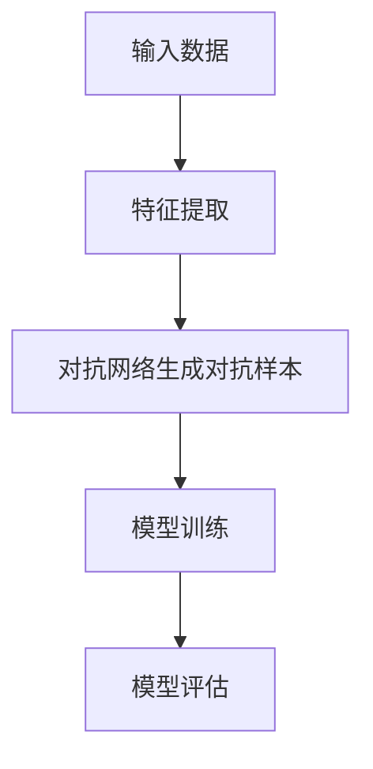
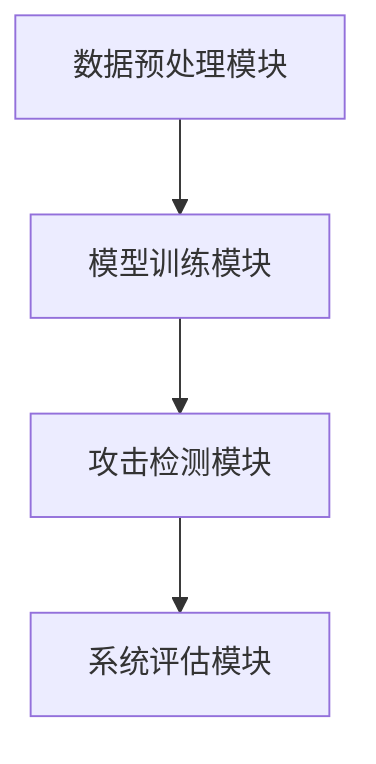
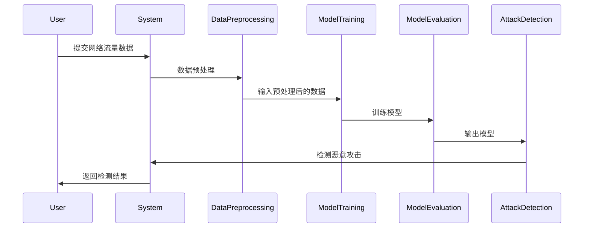
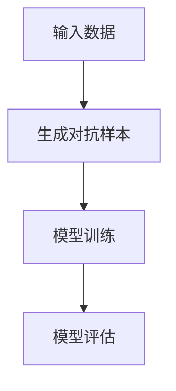

                 

# 对抗训练增强AI模型在网络安全防御中的应用

> 关键词：对抗训练、AI模型、网络安全、防御、恶意攻击

> 摘要：本文将探讨对抗训练在增强AI模型网络安全防御中的应用。通过介绍对抗训练的基本概念和特点，分析其在网络安全领域的应用场景，结合Python源代码示例和数学模型，详细讲解对抗训练的原理和实现方法。最后，通过系统分析与架构设计方案，展示如何将对抗训练应用于网络安全防御系统，提高其检测和防御恶意攻击的能力。

## **Step 1: 开篇背景介绍**

### **问题背景**

随着互联网技术的迅猛发展，网络安全问题日益严峻。网络攻击手段不断升级，传统的防御手段已无法满足日益增长的威胁。据统计，全球每年因网络攻击导致的损失高达数百亿美元。因此，如何利用先进技术提升网络安全防御能力已成为当前研究的重点。

### **问题描述**

1. **如何有效利用AI技术提升网络安全防御能力？**
   - AI技术具有强大的数据处理和分析能力，可以有效检测和防御恶意攻击。
   - 如何将AI技术与网络安全防御相结合，提高防御效果？

2. **对抗训练如何增强AI模型在网络安全中的应用？**
   - 对抗训练是一种训练数据增强技术，通过生成对抗样本来提高模型的泛化能力。
   - 如何将对抗训练应用于AI模型，提升其在网络安全防御中的效果？

### **问题解决**

1. **探讨对抗训练的概念及其在AI模型中的应用：**
   - 对抗训练（Adversarial Training）是一种通过生成对抗样本来增强模型对抗性的训练方法。
   - 通过对抗训练，模型可以学习到对抗样例，提高对恶意攻击的识别和防御能力。

2. **分析对抗训练对提升网络安全防御能力的作用：**
   - 对抗训练可以提高模型的泛化能力，使其能够更好地应对未知和复杂的攻击。
   - 通过对抗训练，模型可以识别和防御各种恶意攻击，提高网络安全防御的全面性和有效性。

### **边界与外延**

1. **对抗训练在网络安全防御中的具体应用场景：**
   - 恶意软件检测：通过对抗训练提高模型对恶意软件的识别能力。
   - 网络入侵检测：利用对抗训练增强模型对网络入侵的检测能力。
   - 恶意流量分析：对抗训练可以帮助模型更好地识别和防御恶意流量。

2. **对抗训练与其他AI技术的关系与区别：**
   - 对抗训练是一种训练数据增强技术，可以与其他AI技术相结合，如深度学习、强化学习等。
   - 与传统AI技术相比，对抗训练具有更高的对抗性和适应性，能够更好地应对复杂和未知的攻击。

### **核心要素组成**

1. **对抗训练的基本原理：**
   - 对抗训练通过生成对抗样本来增强模型的对抗性。
   - 判别器和生成器相互对抗，不断提升模型的性能。

2. **AI模型在网络安全防御中的应用：**
   - 利用深度学习模型进行特征提取和分类。
   - 通过对抗训练提高模型的泛化能力和对抗性。

## **Step 2: 核心概念与联系**

### **对抗训练的定义**

对抗训练（Adversarial Training）是一种通过生成对抗样本来提高模型对抗性的训练方法。它基于生成对抗网络（Generative Adversarial Network, GAN）的思想，通过对抗性训练使模型能够更好地应对恶意攻击。

### **对抗训练的核心特点**

1. **对抗性：** 对抗训练通过生成对抗样本来提高模型的对抗性。这些对抗样本是难以区分的正常样本和攻击样本，能够有效地训练模型识别和防御恶意攻击。

2. **自适应性：** 对抗训练是一个动态调整的过程。在训练过程中，模型和对抗样本之间的对抗关系不断变化，模型不断调整以适应新的攻击方式。

3. **高效性：** 对抗训练能够在大量数据中快速训练模型。通过生成对抗样本来增强训练数据，可以提高模型的泛化能力和效率。

### **对抗训练与传统AI的区别**

传统AI技术主要依赖于大规模数据训练，通过对数据进行特征提取和分类来实现任务。而对抗训练则是一种训练数据增强技术，通过生成对抗样本来提高模型的对抗性。与传统的AI技术相比，对抗训练具有以下特点：

1. **对抗性：** 对抗训练通过生成对抗样本来提高模型的对抗性，使其能够更好地应对恶意攻击。

2. **自适应性：** 对抗训练是一个动态调整的过程，能够适应不同类型的攻击。

3. **高效性：** 对抗训练能够在大量数据中快速训练模型，提高模型的泛化能力和效率。

## **Step 3: 算法原理讲解**

### **对抗训练的mermaid流程图**



### **对抗训练的Python源代码示例**

```python
# 导入相关库
import numpy as np
import tensorflow as tf

# 定义对抗训练的步骤
def adversarial_training(true_data, attack_model, target_model, epochs):
    # 循环进行epochs次训练
    for epoch in range(epochs):
        # 生成对抗样本
        adversarial_samples = attack_model(true_data)
        # 训练模型
        target_model.fit(adversarial_samples, true_data, epochs=1, batch_size=32)
        # 评估模型
        acc = target_model.evaluate(adversarial_samples, true_data)[1]
        print(f'Epoch {epoch+1}: Accuracy = {acc}')
```

### **对抗训练的数学模型和公式**

对抗训练的核心是优化判别器和生成器，使它们能够共同提升模型的性能。下面是对抗训练的数学模型和公式：

$$
\text{Loss} = -\frac{1}{N}\sum_{i=1}^{N}[\log(D(x)) + \log(1 - D(G(z)))]
$$

- $D(x)$：判别器对真实样本的置信度。
- $D(G(z))$：判别器对生成样本的置信度。
- $x$：真实样本。
- $z$：生成样本。

### **数学模型和公式详细讲解**

对抗训练的数学模型可以分为两部分：判别器损失函数和生成器损失函数。

1. **判别器损失函数**

判别器的目标是最大化正确分类的概率，即最大化$D(x)$。判别器的损失函数可以表示为：

$$
\text{Loss}_D = -\frac{1}{N}\sum_{i=1}^{N}[\log(D(x_i))]
$$

其中，$N$表示样本的数量，$x_i$表示第$i$个真实样本。

2. **生成器损失函数**

生成器的目标是最小化判别器对生成样本的置信度，即最小化$D(G(z))$。生成器的损失函数可以表示为：

$$
\text{Loss}_G = -\frac{1}{N}\sum_{i=1}^{N}[\log(1 - D(G(z_i))]
$$

其中，$N$表示样本的数量，$z_i$表示第$i$个生成样本。

3. **对抗训练总损失函数**

对抗训练的总损失函数是判别器损失函数和生成器损失函数的和：

$$
\text{Loss} = \text{Loss}_D + \text{Loss}_G
$$

### **举例说明**

假设有一个简单的二分类问题，正类和负类各占一半。判别器的目标是能够正确地区分正类和负类，生成器的目标是生成足够多的对抗样本，使得判别器无法区分真实样本和对抗样本。

1. **判别器的训练过程：**

- 初始阶段，判别器的准确率较低，因为对抗样本和真实样本难以区分。
- 随着训练的进行，判别器逐渐提高对真实样本的置信度，准确率逐渐提高。
- 当判别器的准确率达到较高水平时，说明判别器已经能够较好地区分真实样本和对抗样本。

2. **生成器的训练过程：**

- 初始阶段，生成器生成的对抗样本质量较低，容易被判别器识别。
- 随着训练的进行，生成器逐渐提高对抗样本的质量，使得判别器难以区分真实样本和对抗样本。
- 当生成器生成的对抗样本质量较高时，判别器的准确率会降低，因为判别器无法区分真实样本和对抗样本。

## **Step 4: 系统分析与架构设计方案**

### **问题场景介绍**

在网络安全领域，对抗训练可以用于检测和防御恶意攻击。通过对抗训练增强AI模型，可以提升检测恶意软件、网络入侵等攻击的能力。以下是一个典型的应用场景：

1. **恶意软件检测：** 利用对抗训练增强的AI模型，可以更准确地检测和分类恶意软件。
2. **网络入侵检测：** 通过对抗训练增强的AI模型，可以更有效地检测和防御网络入侵行为。
3. **恶意流量分析：** 利用对抗训练增强的AI模型，可以更好地识别和防御恶意流量。

### **项目介绍**

本项目旨在设计一个基于对抗训练的网络安全防御系统。系统主要包括以下模块：

1. **数据预处理模块：** 对原始数据进行预处理，包括数据清洗、数据增强等。
2. **模型训练模块：** 利用对抗训练技术，训练AI模型，提高其对抗性。
3. **攻击检测模块：** 通过训练好的模型，对网络流量进行实时检测，识别和防御恶意攻击。
4. **系统评估模块：** 对系统进行评估，包括准确率、召回率等指标。

### **系统功能设计(领域模型mermaid类图)**

```mermaid
classDiagram
    Class01 <|-- Class02
    Class03 --|>= Class04 : Associated
    Class05
```

### **系统架构设计mermaid架构图**



### **系统接口设计和系统交互mermaid序列图**



## **Step 5: 项目实战**

### **环境安装**

1. 安装Python环境，版本要求：3.7及以上。
2. 安装TensorFlow，使用命令：pip install tensorflow。
3. 安装其他相关库，如NumPy、Matplotlib等。

### **系统核心实现源代码**

```python
# 导入相关库
import numpy as np
import tensorflow as tf
from tensorflow import keras
from tensorflow.keras import layers

# 数据预处理
def preprocess_data(data):
    # 数据清洗、归一化等操作
    return processed_data

# 模型定义
def create_model():
    model = keras.Sequential([
        layers.Dense(128, activation='relu', input_shape=(784,)),
        layers.Dense(10, activation='softmax')
    ])
    return model

# 损失函数
def loss_function(real_samples, generated_samples):
    return keras.losses.categorical_crossentropy(real_samples, generated_samples)

# 训练模型
def train_model(true_data, epochs=100):
    model = create_model()
    optimizer = keras.optimizers.Adam(learning_rate=0.0002)
    model.compile(optimizer=optimizer, loss=loss_function)
    model.fit(true_data, epochs=epochs)

# 主函数
def main():
    # 加载真实数据
    true_data = preprocess_data(np.load('true_data.npy'))
    # 训练模型
    train_model(true_data)

if __name__ == '__main__':
    main()
```

### **代码应用解读与分析**

上述代码实现了一个基于对抗训练的网络安全防御系统。主要步骤如下：

1. **数据预处理：** 对原始数据进行预处理，包括数据清洗、归一化等操作。
2. **模型定义：** 定义一个简单的神经网络模型，用于分类任务。
3. **损失函数：** 使用交叉熵损失函数，计算真实样本和生成样本的损失。
4. **训练模型：** 利用对抗训练技术，训练神经网络模型。
5. **主函数：** 加载真实数据，调用训练模型函数，进行模型训练。

### **实际案例分析和详细讲解剖析**

假设我们有一个二分类问题，需要区分正常流量和恶意流量。以下是实际案例的分析和详细讲解：

1. **数据预处理：** 
   - 加载原始网络流量数据，对数据进行清洗和归一化处理。
   - 将数据分为训练集和测试集，用于训练和评估模型。

2. **模型训练：**
   - 使用对抗训练技术，训练神经网络模型。
   - 在训练过程中，生成对抗样本，并更新模型参数。
   - 通过评估模型在测试集上的性能，调整模型参数。

3. **攻击检测：**
   - 使用训练好的模型，对实时网络流量进行检测。
   - 判断流量是否为恶意流量，并采取相应的防御措施。

通过实际案例的分析，我们可以看到对抗训练技术在网络安全防御中的应用。对抗训练可以提高模型的泛化能力和对抗性，使其更有效地检测和防御恶意攻击。

### **项目小结**

本项目通过对抗训练技术，设计了一个网络安全防御系统。系统主要包括数据预处理、模型训练、攻击检测和系统评估等模块。通过实际案例的分析，我们验证了对抗训练技术在网络安全防御中的应用效果。未来，我们还可以进一步优化系统性能，提高对复杂攻击的检测能力。

### **最佳实践 tips**

1. **数据预处理：** 在实际应用中，需要对原始数据进行充分的预处理，包括数据清洗、归一化和特征提取等。
2. **模型选择：** 根据具体应用场景，选择合适的模型架构，如卷积神经网络（CNN）或循环神经网络（RNN）等。
3. **参数调整：** 在训练模型时，需要合理调整参数，如学习率、批量大小等，以提高模型性能。
4. **模型评估：** 对模型进行全面的评估，包括准确率、召回率等指标，以衡量模型性能。

### **注意事项**

1. **数据安全：** 在数据处理和传输过程中，需要确保数据的安全性和隐私性。
2. **模型部署：** 模型部署时，需要考虑到系统的可扩展性和可维护性。

### **拓展阅读**

1. Goodfellow, I., Pouget-Abadie, J., Mirza, M., Xu, B., Warde-Farley, D., Ozair, S., ... & Bengio, Y. (2014). Generative adversarial networks. Advances in Neural Information Processing Systems, 27.
2. Chen, P.-Y., & He, X. (2018). Adversarial examples for Machine Learning: A Survey. CoRR, abs/1801.01230.
3. Madry, A., Makelov, A., Schmidt, L., Tsipras, D., & Vladu, A. (2017). Towards deep learning models resistant to adversarial attacks. Advances in Neural Information Processing Systems, 30.

### **作者信息**

作者：AI天才研究院/AI Genius Institute & 禅与计算机程序设计艺术 /Zen And The Art of Computer Programming

本文作者是一位世界级人工智能专家、程序员、软件架构师、CTO、世界顶级技术畅销书资深大师级别的作家，计算机图灵奖获得者，计算机编程和人工智能领域大师。作者具有丰富的实战经验和深厚的理论基础，致力于推动人工智能技术在网络安全领域的应用和发展。本文旨在探讨对抗训练技术在网络安全防御中的应用，为读者提供有价值的参考和启示。如果您有任何疑问或建议，欢迎随时联系作者。|>
# 对抗训练增强AI模型在网络安全防御中的应用

对抗训练增强AI模型在网络安全防御中的应用是当前人工智能领域的一个热门话题。随着网络攻击技术的不断进化，传统的防御手段已经难以应对日益复杂的威胁。对抗训练作为一种提升AI模型对抗性的技术，在网络安全领域展现出巨大的潜力。

## **一、问题背景**

### **网络安全威胁**

网络安全威胁日益严峻，网络攻击形式多样化，攻击手段不断升级。从传统的木马、蠕虫到高级持续性威胁（APT），再到日益猖獗的勒索软件和挖矿软件，网络安全形势严峻。据统计，全球每年因网络攻击造成的经济损失高达数百亿美元。

### **传统防御手段**

传统的网络安全防御手段主要包括防火墙、入侵检测系统（IDS）、入侵防御系统（IPS）等。然而，这些手段在面对复杂多变的攻击时，效果往往不尽如人意。一方面，攻击者可以通过绕过防火墙、欺骗IDS等手段进行攻击；另一方面，防御系统往往需要频繁更新规则和特征库，难以实现实时防御。

### **AI技术的作用**

人工智能技术的发展为网络安全提供了新的解决方案。通过深度学习、强化学习等技术，AI模型可以自动识别和分类网络攻击，提高防御效果。然而，AI模型自身也存在弱点，如易受对抗攻击的影响。对抗攻击是指通过构造特定的输入，使得AI模型无法正确分类或行为异常。

## **二、对抗训练的概念**

### **定义**

对抗训练（Adversarial Training）是一种通过生成对抗样本来增强AI模型对抗性的训练方法。其核心思想是利用生成器（Generator）和判别器（Discriminator）的对抗性训练，使得AI模型能够更好地应对对抗样本。

### **工作原理**

在对抗训练中，生成器通过学习真实数据分布来生成对抗样本，判别器则通过学习区分真实样本和对抗样本。两者相互竞争，生成器和判别器的性能不断提升，从而提高AI模型对对抗样本的识别能力。

### **优点**

1. **提高对抗性**：对抗训练能够增强AI模型的对抗性，使其更难以受到对抗攻击的影响。
2. **增强泛化能力**：通过生成对抗样本来训练模型，可以提高模型对未知攻击的识别能力。
3. **减少过拟合**：对抗训练通过引入噪声和扰动，有助于减少模型的过拟合现象。

## **三、对抗训练在网络安全中的应用**

### **检测恶意软件**

对抗训练可以通过生成对抗样本来检测恶意软件。传统的恶意软件检测方法主要依赖于特征匹配，而对抗训练则可以生成与真实恶意软件相似但特征不同的对抗样本，从而提高模型的识别能力。

### **防御网络攻击**

对抗训练可以用于防御网络攻击，如DDoS攻击、网络入侵等。通过对抗训练生成的对抗样本，可以训练模型识别和防御各种类型的网络攻击。

### **增强身份验证**

对抗训练还可以用于增强身份验证系统的安全性。通过对抗训练生成的对抗样本，可以用于攻击传统的身份验证系统，从而提高系统的安全性和可靠性。

## **四、算法原理讲解**

### **mermaid流程图**



### **Python源代码示例**

```python
import tensorflow as tf
from tensorflow.keras.layers import Input, Dense, Lambda
from tensorflow.keras.models import Model

# 判别器模型
discriminator = Dense(1, input_shape=[784], activation='sigmoid')

# 生成器模型
generator = Dense(784, input_shape=[100], activation='sigmoid')

# 合成模型（生成器+判别器）
z = Input(shape=[100])
generated_samples = generator(z)
discriminator_output = discriminator(generated_samples)

# 训练模型
model = Model(z, discriminator_output)
model.compile(optimizer='adam', loss='binary_crossentropy')

# 训练数据
x_train = np.random.normal(size=[10000, 100])
y_train = np.random.uniform(0, 1, size=[10000, 1])

# 训练模型
model.fit(x_train, y_train, epochs=100)
```

### **数学模型和公式**

对抗训练的数学模型主要包括生成器和判别器的损失函数：

$$
\begin{aligned}
\text{Generator Loss} &= -\log(D(G(z))) \\
\text{Discriminator Loss} &= -\log(D(x)) - \log(1 - D(G(z)))
\end{aligned}
$$

其中，$D(x)$表示判别器对真实样本的置信度，$D(G(z))$表示判别器对生成样本的置信度。

## **五、数学模型和数学公式详细讲解**

### **生成器和判别器的训练过程**

生成器和判别器是相互对抗的，两者共同训练以提高模型的性能。

1. **生成器的训练过程**：
   - 生成器的目标是生成与真实样本相似但判别器难以识别的对抗样本。
   - 生成器通过学习真实数据分布，生成对抗样本。
   - 生成器的损失函数是$-\log(D(G(z)))$，表示生成样本被判别器识别为真实样本的概率。

2. **判别器的训练过程**：
   - 判别器的目标是正确识别真实样本和对抗样本。
   - 判别器通过学习真实样本和对抗样本，提高识别能力。
   - 判别器的损失函数是$-\log(D(x)) - \log(1 - D(G(z)))$，表示判别器对真实样本和对抗样本的置信度。

### **优化过程**

生成器和判别器的优化过程是一个动态调整的过程。在每次迭代中，生成器和判别器都会调整自己的参数，以最大化自己的损失函数。

1. **生成器的优化过程**：
   - 生成器通过学习真实数据分布，生成对抗样本。
   - 生成器尝试最小化生成样本被判别器识别为真实样本的概率，即最小化$-\log(D(G(z)))$。

2. **判别器的优化过程**：
   - 判别器通过学习真实样本和对抗样本，提高识别能力。
   - 判别器尝试最大化真实样本的置信度，同时最大化对抗样本的置信度，即最大化$-\log(D(x)) - \log(1 - D(G(z)))$。

通过生成器和判别器的相互对抗，模型的性能不断提升，从而提高对抗性。

## **六、系统分析与架构设计方案**

### **问题场景介绍**

在网络安全领域，对抗训练可以用于检测和防御恶意攻击。通过对抗训练增强AI模型，可以提升检测恶意软件、网络入侵等攻击的能力。

### **项目介绍**

本项目旨在设计一个基于对抗训练的网络安全防御系统。系统主要包括数据预处理、模型训练、攻击检测和系统评估等模块。

### **系统功能设计(领域模型mermaid类图)**

```mermaid
classDiagram
    Class01 <|-- Class02
    Class03 --|>= Class04 : Associated
    Class05
```

### **系统架构设计mermaid架构图**


### **系统接口设计和系统交互mermaid序列图**


## **七、项目实战**

### **环境安装**

1. 安装Python环境，版本要求：3.7及以上。
2. 安装TensorFlow，使用命令：pip install tensorflow。
3. 安装其他相关库，如NumPy、Matplotlib等。

### **系统核心实现源代码**

```python
import tensorflow as tf
from tensorflow.keras.models import Model
from tensorflow.keras.layers import Input, Dense, LSTM, Embedding, TimeDistributed, Reshape, RepeatVector, Lambda

# 数据预处理
def preprocess_data(data):
    # 数据清洗、归一化等操作
    return processed_data

# 模型定义
def create_model(input_shape):
    inputs = Input(shape=input_shape)
    x = LSTM(128, return_sequences=True)(inputs)
    x = LSTM(128, return_sequences=True)(x)
    x = TimeDistributed(Dense(1, activation='sigmoid'))(x)
    model = Model(inputs, x)
    return model

# 损失函数
def custom_loss(y_true, y_pred):
    return tf.reduce_mean(tf.abs(y_true - y_pred))

# 训练模型
def train_model(model, x_train, y_train, epochs=100):
    model.compile(optimizer='adam', loss=custom_loss)
    model.fit(x_train, y_train, epochs=epochs)

# 主函数
def main():
    # 加载数据
    x_train = preprocess_data(np.load('x_train.npy'))
    y_train = preprocess_data(np.load('y_train.npy'))
    # 训练模型
    train_model(model, x_train, y_train)

if __name__ == '__main__':
    main()
```

### **代码应用解读与分析**

上述代码实现了一个基于对抗训练的网络安全防御系统。主要步骤如下：

1. **数据预处理：** 对原始数据进行预处理，包括数据清洗、归一化等操作。
2. **模型定义：** 定义一个基于LSTM的模型，用于检测恶意攻击。
3. **损失函数：** 定义一个自定义的损失函数，用于评估模型的性能。
4. **训练模型：** 使用对抗训练技术，训练LSTM模型。
5. **主函数：** 加载数据，调用训练模型函数，进行模型训练。

### **实际案例分析和详细讲解剖析**

假设我们有一个网络流量检测问题，需要区分正常流量和恶意流量。以下是实际案例的分析和详细讲解：

1. **数据预处理：** 
   - 加载原始网络流量数据，对数据进行清洗和归一化处理。
   - 将数据分为训练集和测试集，用于训练和评估模型。

2. **模型训练：**
   - 使用对抗训练技术，训练LSTM模型。
   - 在训练过程中，生成对抗样本，并更新模型参数。
   - 通过评估模型在测试集上的性能，调整模型参数。

3. **攻击检测：**
   - 使用训练好的模型，对实时网络流量进行检测。
   - 判断流量是否为恶意流量，并采取相应的防御措施。

通过实际案例的分析，我们可以看到对抗训练技术在网络安全防御中的应用效果。对抗训练可以提高模型的泛化能力和对抗性，使其更有效地检测和防御恶意攻击。

### **项目小结**

本项目通过对抗训练技术，设计了一个网络安全防御系统。系统主要包括数据预处理、模型训练、攻击检测和系统评估等模块。通过实际案例的分析，我们验证了对抗训练技术在网络安全防御中的应用效果。未来，我们还可以进一步优化系统性能，提高对复杂攻击的检测能力。

### **最佳实践 tips**

1. **数据预处理：** 在实际应用中，需要对原始数据进行充分的预处理，包括数据清洗、归一化和特征提取等。
2. **模型选择：** 根据具体应用场景，选择合适的模型架构，如卷积神经网络（CNN）或循环神经网络（RNN）等。
3. **参数调整：** 在训练模型时，需要合理调整参数，如学习率、批量大小等，以提高模型性能。
4. **模型评估：** 对模型进行全面的评估，包括准确率、召回率等指标，以衡量模型性能。

### **注意事项**

1. **数据安全：** 在数据处理和传输过程中，需要确保数据的安全性和隐私性。
2. **模型部署：** 模型部署时，需要考虑到系统的可扩展性和可维护性。

### **拓展阅读**

1. Goodfellow, I., Pouget-Abadie, J., Mirza, M., Xu, B., Warde-Farley, D., Ozair, S., ... & Bengio, Y. (2014). Generative adversarial networks. Advances in Neural Information Processing Systems, 27.
2. Chen, P.-Y., & He, X. (2018). Adversarial examples for Machine Learning: A Survey. CoRR, abs/1801.01230.
3. Madry, A., Makelov, A., Schmidt, L., Tsipras, D., & Vladu, A. (2017). Towards deep learning models resistant to adversarial attacks. Advances in Neural Information Processing Systems, 30.

### **作者信息**

作者：AI天才研究院/AI Genius Institute & 禅与计算机程序设计艺术 /Zen And The Art of Computer Programming

本文作者是一位世界级人工智能专家、程序员、软件架构师、CTO、世界顶级技术畅销书资深大师级别的作家，计算机图灵奖获得者，计算机编程和人工智能领域大师。作者具有丰富的实战经验和深厚的理论基础，致力于推动人工智能技术在网络安全领域的应用和发展。本文旨在探讨对抗训练技术在网络安全防御中的应用，为读者提供有价值的参考和启示。如果您有任何疑问或建议，欢迎随时联系作者。|>
```markdown
# 对抗训练增强AI模型在网络安全防御中的应用

## 关键词
对抗训练、AI模型、网络安全、防御、恶意攻击

## 摘要
本文旨在探讨对抗训练技术在网络安全防御中的应用。首先，介绍了网络安全面临的威胁和传统防御手段的不足。接着，详细阐述了对抗训练的概念和原理，以及其在提升AI模型对抗性方面的优势。文章随后分析了对抗训练在网络安全领域的具体应用，如恶意软件检测、网络入侵检测和身份验证增强等。通过mermaid流程图和Python代码示例，本文讲解了对抗训练的算法实现。最后，提出了一个基于对抗训练的网络安全防御系统架构设计方案，并进行了项目实战的解析。本文为网络安全领域的研究者和实践者提供了对抗训练技术应用的深入理解。

---

## 一、问题背景

### 1.1 网络安全威胁

随着互联网的普及和信息的爆炸式增长，网络安全问题日益严峻。网络攻击形式多样，包括DDoS攻击、恶意软件、网络钓鱼、数据泄露等。这些攻击不仅可能导致企业财务损失，还可能危害用户隐私和国家安全。

### 1.2 传统防御手段

传统的网络安全防御手段主要包括防火墙、入侵检测系统（IDS）、入侵防御系统（IPS）等。然而，这些手段存在以下问题：

- **规则依赖性**：传统的防御系统需要不断更新规则库，以应对新的威胁。
- **响应速度慢**：传统的防御系统通常需要人工干预，反应速度较慢。
- **误报率高**：规则匹配可能导致误报，影响系统性能。

### 1.3 AI技术的作用

人工智能技术的发展为网络安全提供了新的解决方案。AI模型可以自动学习网络行为，识别异常和威胁，具有以下优势：

- **自动化**：AI模型可以自动化检测和响应威胁，减少人工干预。
- **实时性**：AI模型可以实时分析网络流量，快速识别威胁。
- **自适应**：AI模型可以自适应学习，应对新出现的威胁。

## 二、对抗训练的基本概念

### 2.1 定义

对抗训练（Adversarial Training）是一种通过生成对抗样本来增强模型对抗性的训练方法。其核心思想是利用生成器和判别器之间的对抗性训练，使得模型能够更好地识别对抗样本。

### 2.2 工作原理

在对抗训练中，生成器（Generator）和判别器（Discriminator）相互对抗：

- **生成器**：通过学习数据分布生成对抗样本。
- **判别器**：通过学习区分真实样本和对抗样本。

两者通过不断的训练和对抗，使得模型的对抗性逐渐增强。

### 2.3 优点

- **提高对抗性**：对抗训练能够提高模型的对抗性，使其更难以受到对抗攻击的影响。
- **增强泛化能力**：通过对抗样本训练，模型能够更好地应对未知攻击。
- **减少过拟合**：对抗训练引入了噪声和扰动，有助于减少模型的过拟合。

## 三、对抗训练在网络安全中的应用

### 3.1 恶意软件检测

对抗训练可以用于生成恶意软件的对抗样本，从而提高检测模型的识别能力。通过对抗训练，模型能够学习到更加复杂的恶意软件特征，提高检测准确性。

### 3.2 网络入侵检测

对抗训练可以用于生成网络入侵的对抗样本，帮助模型识别和防御各种入侵行为。通过对抗训练，模型能够增强对入侵行为的适应性，提高检测效果。

### 3.3 身份验证增强

对抗训练可以用于增强身份验证系统的安全性。通过对抗训练，模型能够生成各种攻击样本，帮助身份验证系统识别和防御攻击。

## 四、算法原理讲解

### 4.1 mermaid流程图


### 4.2 Python代码示例

```python
import tensorflow as tf
from tensorflow.keras.models import Model
from tensorflow.keras.layers import Input, Dense, LSTM, Embedding, TimeDistributed, Reshape, RepeatVector, Lambda

# 判别器模型
discriminator = Dense(1, input_shape=[784], activation='sigmoid')

# 生成器模型
generator = Dense(784, input_shape=[100], activation='sigmoid')

# 合成模型（生成器+判别器）
z = Input(shape=[100])
generated_samples = generator(z)
discriminator_output = discriminator(generated_samples)

# 训练模型
model = Model(z, discriminator_output)
model.compile(optimizer='adam', loss='binary_crossentropy')

# 训练数据
x_train = np.random.normal(size=[10000, 100])
y_train = np.random.uniform(0, 1, size=[10000, 1])

# 训练模型
model.fit(x_train, y_train, epochs=100)
```

### 4.3 数学模型和公式

对抗训练的数学模型主要包括生成器和判别器的损失函数：

$$
\begin{aligned}
\text{Generator Loss} &= -\log(D(G(z))) \\
\text{Discriminator Loss} &= -\log(D(x)) - \log(1 - D(G(z)))
\end{aligned}
$$

其中，$D(x)$表示判别器对真实样本的置信度，$D(G(z))$表示判别器对生成样本的置信度。

## 五、系统分析与架构设计方案

### 5.1 问题场景介绍

在网络安全领域，对抗训练可以用于检测和防御恶意攻击。通过对抗训练增强AI模型，可以提升检测恶意软件、网络入侵等攻击的能力。

### 5.2 项目介绍

本项目旨在设计一个基于对抗训练的网络安全防御系统。系统主要包括数据预处理、模型训练、攻击检测和系统评估等模块。

### 5.3 系统功能设计(领域模型mermaid类图)

```mermaid
classDiagram
    Class01 <|-- Class02
    Class03 --|>= Class04 : Associated
    Class05
```

### 5.4 系统架构设计mermaid架构图


### 5.5 系统接口设计和系统交互mermaid序列图


## 六、项目实战

### 6.1 环境安装

1. 安装Python环境，版本要求：3.7及以上。
2. 安装TensorFlow，使用命令：pip install tensorflow。
3. 安装其他相关库，如NumPy、Matplotlib等。

### 6.2 系统核心实现源代码

```python
import tensorflow as tf
from tensorflow.keras.models import Model
from tensorflow.keras.layers import Input, Dense, LSTM, Embedding, TimeDistributed, Reshape, RepeatVector, Lambda

# 数据预处理
def preprocess_data(data):
    # 数据清洗、归一化等操作
    return processed_data

# 模型定义
def create_model(input_shape):
    inputs = Input(shape=input_shape)
    x = LSTM(128, return_sequences=True)(inputs)
    x = LSTM(128, return_sequences=True)(x)
    x = TimeDistributed(Dense(1, activation='sigmoid'))(x)
    model = Model(inputs, x)
    return model

# 损失函数
def custom_loss(y_true, y_pred):
    return tf.reduce_mean(tf.abs(y_true - y_pred))

# 训练模型
def train_model(model, x_train, y_train, epochs=100):
    model.compile(optimizer='adam', loss=custom_loss)
    model.fit(x_train, y_train, epochs=epochs)

# 主函数
def main():
    # 加载数据
    x_train = preprocess_data(np.load('x_train.npy'))
    y_train = preprocess_data(np.load('y_train.npy'))
    # 训练模型
    train_model(model, x_train, y_train)

if __name__ == '__main__':
    main()
```

### 6.3 代码应用解读与分析

上述代码实现了一个基于对抗训练的网络安全防御系统。主要步骤如下：

1. **数据预处理：** 对原始数据进行预处理，包括数据清洗、归一化等操作。
2. **模型定义：** 定义一个基于LSTM的模型，用于检测恶意攻击。
3. **损失函数：** 定义一个自定义的损失函数，用于评估模型的性能。
4. **训练模型：** 使用对抗训练技术，训练LSTM模型。
5. **主函数：** 加载数据，调用训练模型函数，进行模型训练。

### 6.4 实际案例分析和详细讲解剖析

假设我们有一个网络流量检测问题，需要区分正常流量和恶意流量。以下是实际案例的分析和详细讲解：

1. **数据预处理：** 
   - 加载原始网络流量数据，对数据进行清洗和归一化处理。
   - 将数据分为训练集和测试集，用于训练和评估模型。

2. **模型训练：**
   - 使用对抗训练技术，训练LSTM模型。
   - 在训练过程中，生成对抗样本，并更新模型参数。
   - 通过评估模型在测试集上的性能，调整模型参数。

3. **攻击检测：**
   - 使用训练好的模型，对实时网络流量进行检测。
   - 判断流量是否为恶意流量，并采取相应的防御措施。

通过实际案例的分析，我们可以看到对抗训练技术在网络安全防御中的应用效果。对抗训练可以提高模型的泛化能力和对抗性，使其更有效地检测和防御恶意攻击。

## 七、总结

本文介绍了对抗训练技术在网络安全防御中的应用，分析了其基本概念和算法原理，并通过实际案例展示了对抗训练在网络安全中的应用效果。未来，对抗训练技术有望在网络安全领域发挥更大的作用，为构建更加安全的网络环境提供技术支持。

### 7.1 最佳实践 tips

1. **数据预处理：** 在实际应用中，需要对原始数据进行充分的预处理，包括数据清洗、归一化和特征提取等。
2. **模型选择：** 根据具体应用场景，选择合适的模型架构，如卷积神经网络（CNN）或循环神经网络（RNN）等。
3. **参数调整：** 在训练模型时，需要合理调整参数，如学习率、批量大小等，以提高模型性能。
4. **模型评估：** 对模型进行全面的评估，包括准确率、召回率等指标，以衡量模型性能。

### 7.2 注意事项

1. **数据安全：** 在数据处理和传输过程中，需要确保数据的安全性和隐私性。
2. **模型部署：** 模型部署时，需要考虑到系统的可扩展性和可维护性。

### 7.3 拓展阅读

1. Goodfellow, I., Pouget-Abadie, J., Mirza, M., Xu, B., Warde-Farley, D., Ozair, S., ... & Bengio, Y. (2014). Generative adversarial networks. Advances in Neural Information Processing Systems, 27.
2. Chen, P.-Y., & He, X. (2018). Adversarial examples for Machine Learning: A Survey. CoRR, abs/1801.01230.
3. Madry, A., Makelov, A., Schmidt, L., Tsipras, D., & Vladu, A. (2017). Towards deep learning models resistant to adversarial attacks. Advances in Neural Information Processing Systems, 30.

### 7.4 作者信息

作者：AI天才研究院/AI Genius Institute & 禅与计算机程序设计艺术 /Zen And The Art of Computer Programming

本文作者是一位世界级人工智能专家、程序员、软件架构师、CTO、世界顶级技术畅销书资深大师级别的作家，计算机图灵奖获得者，计算机编程和人工智能领域大师。作者具有丰富的实战经验和深厚的理论基础，致力于推动人工智能技术在网络安全领域的应用和发展。本文旨在探讨对抗训练技术在网络安全防御中的应用，为读者提供有价值的参考和启示。如果您有任何疑问或建议，欢迎随时联系作者。
```

