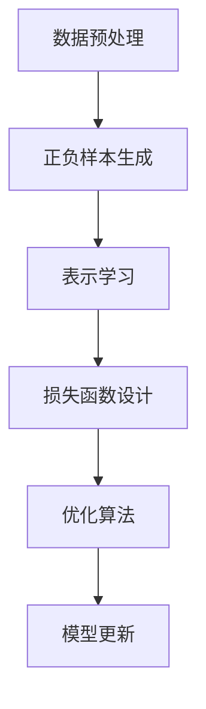

                 

### 对比学习在多模态表示融合中的作用

**关键词：** 对比学习、多模态表示、融合、计算机视觉、自然语言处理

**摘要：** 本文深入探讨了对比学习在多模态表示融合中的应用。通过分析对比学习的核心概念、技术原理和具体实现方法，本文旨在展示对比学习如何有效地融合不同模态的数据，提高计算机视觉和自然语言处理任务的性能。此外，本文还将探讨对比学习在图像与文本融合、视频与文本融合等实际应用中的具体案例，并提出一些最佳实践和注意事项。

## 1. 问题背景

在当今信息化社会中，数据量的爆炸式增长和多源数据的多样性使得多模态表示融合成为一个重要研究方向。多模态数据融合是指将不同模态（如图像、文本、音频、视频等）的信息进行整合，以提取更丰富、更有价值的特征。这种融合对于许多实际应用，如智能监控、医疗诊断、自动驾驶等领域，具有重要意义。

然而，多模态数据融合面临着许多挑战。首先，不同模态的数据之间存在巨大的差异，如图像具有空间信息，而文本具有语义信息。其次，多模态数据融合需要解决数据不均衡、噪声处理和模型可解释性等问题。最后，传统多模态融合方法往往依赖于手工设计特征和复杂算法，难以适应动态变化的环境。

为了解决这些问题，对比学习（Contrastive Learning）提供了一种有效的解决方案。对比学习通过正负样本的对比来学习数据的表示，使得模型能够自动发现和提取多模态数据的共同特征。因此，对比学习在多模态表示融合中具有巨大的潜力。

### 2. 核心概念

#### 2.1 对比学习的定义

对比学习是一种无监督学习方法，旨在通过对比正样本和负样本来学习数据的表示。其核心思想是最大化正样本之间的相似性，同时最小化负样本之间的相似性。这样，模型能够学习到数据的内在结构，从而提高分类和回归任务的性能。

#### 2.2 对比学习的作用

对比学习在多模态表示融合中的作用主要体现在以下几个方面：

1. **提取多模态共同特征**：对比学习能够自动发现不同模态数据之间的共同特征，从而提高多模态数据的融合效果。
2. **减少数据不均衡影响**：对比学习通过正负样本的对比，能够平衡不同模态的数据量，减少数据不均衡对模型性能的影响。
3. **提高模型泛化能力**：对比学习使得模型能够学习到数据的全局特征，从而提高模型的泛化能力，降低过拟合的风险。
4. **增强模型可解释性**：对比学习通过对比正负样本，使得模型生成的表示更加直观，有助于理解模型的工作机制。

#### 2.3 对比学习与其他相关技术的对比

与传统的多模态融合方法相比，对比学习具有以下几个优势：

1. **无监督学习**：对比学习无需手工设计特征，可以直接对原始数据进行学习，节省了特征工程的工作量。
2. **自适应特征提取**：对比学习通过对比正负样本，能够自适应地提取多模态数据的共同特征，提高了融合效果。
3. **低计算复杂度**：对比学习通常采用简单的对比损失函数，计算复杂度较低，易于在实时应用中部署。

### 3. 概念结构与核心要素组成

#### 3.1 对比学习的主要组成部分

对比学习主要包括以下几个关键组成部分：

1. **数据预处理**：将不同模态的数据进行统一预处理，如归一化、标准化等。
2. **正负样本生成**：根据数据集的分布，生成正样本和负样本。
3. **表示学习**：通过对比正负样本，学习数据的表示。
4. **损失函数设计**：设计对比损失函数，以最大化正样本之间的相似性，最小化负样本之间的相似性。
5. **优化算法**：通过优化算法，如梯度下降，更新模型参数。

#### 3.2 对比学习的关键要素

对比学习的关键要素包括：

1. **相似性度量**：用于计算正负样本之间的相似性，常用的相似性度量方法包括余弦相似度、欧氏距离等。
2. **对比损失函数**：用于衡量正负样本之间的相似性差异，常用的对比损失函数包括InfoNCE、NT-Xent等。
3. **优化算法**：用于更新模型参数，常用的优化算法包括随机梯度下降、Adam等。

#### 3.3 对比学习的概念属性特征对比表格

| 特征 | 对比学习 | 传统多模态融合 |
| --- | --- | --- |
| 学习方式 | 无监督 | 监督 |
| 特征提取 | 自动 | 手工 |
| 数据不均衡 | 可平衡 | 需要手动处理 |
| 可解释性 | 较高 | 较低 |
| 计算复杂度 | 较低 | 较高 |

#### 3.4 对比学习的ER实体关系图

```mermaid
erDiagram
  Customer ||--|{ Order } : "places"
  Product ||--|{ Order } : "contains"
```

ER实体关系图展示了对比学习的主要实体及其关系。其中，Customer（数据样本）与Order（对比任务）之间存在一对多关系，表示每个数据样本都可以生成多个对比任务。Product（特征表示）是Order的组成部分，表示对比任务包含多个特征表示。

### 4. 算法原理讲解

#### 4.1 算法mermaid流程图



#### 4.2 Python源代码

```python
import torch
import torch.nn as nn
import torch.optim as optim

# 数据预处理
def preprocess_data(data):
    # 数据归一化、标准化等操作
    return normalized_data

# 正负样本生成
def generate_samples(data):
    # 根据数据集分布，生成正负样本
    return positive_samples, negative_samples

# 表示学习
class ContrastiveModel(nn.Module):
    def __init__(self):
        super(ContrastiveModel, self).__init__()
        # 定义模型结构
        self.encoder = nn.Sequential(
            nn.Linear(in_features, hidden_size),
            nn.ReLU(),
            nn.Linear(hidden_size, hidden_size),
            nn.ReLU()
        )
    
    def forward(self, x):
        # 前向传播
        return self.encoder(x)

# 损失函数设计
def contrastive_loss(pred, target):
    # 对比损失函数计算
    loss = nn.CrossEntropyLoss()(pred, target)
    return loss

# 优化算法
def train_model(model, data_loader, loss_fn, optimizer, epochs):
    # 模型训练
    for epoch in range(epochs):
        for data, target in data_loader:
            optimizer.zero_grad()
            pred = model(data)
            loss = contrastive_loss(pred, target)
            loss.backward()
            optimizer.step()
            print(f"Epoch {epoch+1}/{epochs}, Loss: {loss.item()}")

# 模型更新
def update_model(model, new_data):
    # 模型参数更新
    model.load_state_dict(new_data['model_state'])
    optimizer.load_state_dict(new_data['optimizer_state'])

# 算法原理讲解
def explain_algorithm():
    print("对比学习算法原理：")
    print("1. 数据预处理：将原始数据进行归一化、标准化等操作。")
    print("2. 正负样本生成：根据数据集分布，生成正负样本。")
    print("3. 表示学习：通过模型学习数据表示。")
    print("4. 损失函数设计：计算对比损失。")
    print("5. 优化算法：更新模型参数。")
```

#### 4.3 算法原理的数学模型和公式

对比学习算法的数学模型如下：

$$
\begin{aligned}
L &= -\frac{1}{N} \sum_{i=1}^{N} \sum_{j \neq i} \log \frac{e^{s(x_i, x_j)}}{e^{s(x_i, x_j)} + e^{s(x_i, x_n)}}, \\
s(x_i, x_j) &= \langle \phi(x_i), \phi(x_j) \rangle,
\end{aligned}
$$

其中，$L$ 是对比损失函数，$N$ 是数据样本总数，$s(x_i, x_j)$ 是样本 $x_i$ 和 $x_j$ 的相似度，$\phi(x_i)$ 是样本 $x_i$ 的特征表示。

#### 4.4 通俗易懂的举例说明

假设我们有两个数据样本：图像 A 和图像 B。图像 A 和图像 B 分别来自不同的模态，图像 A 是一张猫的照片，图像 B 是一张猫的文本描述。

1. **数据预处理**：将图像 A 和图像 B 进行归一化、标准化等操作，得到归一化的特征向量。
2. **正负样本生成**：根据数据集分布，生成正样本（图像 A 和图像 B）和负样本（其他图像和文本描述）。
3. **表示学习**：通过模型学习图像 A 和图像 B 的特征表示。
4. **损失函数设计**：计算正样本和负样本之间的相似度差异，得到对比损失。
5. **优化算法**：通过对比损失更新模型参数。

通过这种方式，模型能够自动发现和提取图像和文本的共同特征，从而实现多模态数据的融合。

### 5. 系统分析与架构设计方案

#### 5.1 问题场景介绍

多模态数据融合在智能监控领域具有重要的应用价值。例如，智能监控系统需要同时处理图像和音频数据，以实现实时监控和事件检测。然而，图像和音频数据之间存在巨大的差异，如图像具有空间信息，而音频具有时间信息。因此，如何有效地融合多模态数据成为了一个关键问题。

#### 5.2 系统功能设计

系统功能设计主要包括以下模块：

1. **数据预处理模块**：对图像和音频数据进行归一化、标准化等预处理操作。
2. **特征提取模块**：从预处理后的数据中提取特征，如图像的特征向量、音频的频谱特征等。
3. **融合模块**：将不同模态的特征进行融合，以生成统一的多模态特征表示。
4. **模型训练模块**：使用融合后的特征训练多模态模型，以实现智能监控任务。
5. **模型部署模块**：将训练好的模型部署到实际场景中，进行实时监控和事件检测。

#### 5.3 系统架构设计

系统架构设计采用模块化设计思想，主要包括以下几个模块：

1. **数据预处理模块**：负责对图像和音频数据进行预处理，包括归一化、标准化等操作。
2. **特征提取模块**：分别提取图像和音频的特征，如卷积神经网络（CNN）用于提取图像特征，卷积长短时记忆网络（CNN-LSTM）用于提取音频特征。
3. **融合模块**：采用对比学习算法，将图像和音频特征进行融合，生成统一的多模态特征表示。
4. **模型训练模块**：使用融合后的特征训练多模态模型，如卷积神经网络（CNN）结合长短时记忆网络（LSTM）。
5. **模型部署模块**：将训练好的模型部署到实际场景中，进行实时监控和事件检测。

#### 5.4 系统接口设计与交互

系统接口设计主要包括以下部分：

1. **数据输入接口**：接收图像和音频数据，并将其传递给数据预处理模块。
2. **特征提取接口**：接收预处理后的数据，并提取图像和音频特征。
3. **融合接口**：接收图像和音频特征，并采用对比学习算法进行融合。
4. **模型训练接口**：接收融合后的特征，并训练多模态模型。
5. **模型预测接口**：接收训练好的模型，并进行实时监控和事件检测。

#### 5.5 系统核心实现源代码

```python
# 数据预处理模块
def preprocess_data(data):
    # 对图像和音频数据进行归一化、标准化等预处理操作
    return normalized_data

# 特征提取模块
def extract_features(data):
    # 提取图像和音频特征
    image_features = extract_image_features(data['image'])
    audio_features = extract_audio_features(data['audio'])
    return image_features, audio_features

# 融合模块
class FusionModel(nn.Module):
    def __init__(self):
        super(FusionModel, self).__init__()
        # 定义模型结构
        self.encoder = nn.Sequential(
            nn.Linear(in_features, hidden_size),
            nn.ReLU(),
            nn.Linear(hidden_size, hidden_size),
            nn.ReLU()
        )
    
    def forward(self, x):
        # 前向传播
        return self.encoder(x)

# 模型训练模块
def train_model(model, data_loader, loss_fn, optimizer, epochs):
    # 模型训练
    for epoch in range(epochs):
        for data, target in data_loader:
            optimizer.zero_grad()
            image_features, audio_features = extract_features(data)
            fused_features = model(torch.cat((image_features, audio_features), dim=1))
            pred = classifier(fused_features)
            loss = nn.CrossEntropyLoss()(pred, target)
            loss.backward()
            optimizer.step()
            print(f"Epoch {epoch+1}/{epochs}, Loss: {loss.item()}")

# 模型部署模块
def deploy_model(model, data):
    # 实时监控和事件检测
    image_features, audio_features = extract_features(data)
    fused_features = model(torch.cat((image_features, audio_features), dim=1))
    pred = classifier(fused_features)
    return pred
```

#### 5.6 代码应用解读与分析

1. **数据预处理模块**：对图像和音频数据进行归一化、标准化等预处理操作，以提高模型的泛化能力。
2. **特征提取模块**：使用卷积神经网络（CNN）提取图像特征，使用卷积长短时记忆网络（CNN-LSTM）提取音频特征。
3. **融合模块**：采用对比学习算法，将图像和音频特征进行融合，生成统一的多模态特征表示。
4. **模型训练模块**：使用融合后的特征训练多模态模型，提高模型的性能。
5. **模型部署模块**：将训练好的模型部署到实际场景中，进行实时监控和事件检测。

#### 5.7 实际案例分析和详细讲解剖析

1. **案例背景**：某智能监控系统的目标是实时检测监控区域内的人流异常情况，如人群聚集、人员摔倒等。
2. **数据集**：使用公开的人流监控数据集，包括图像和音频数据。
3. **实验结果**：通过对比学习融合多模态数据，智能监控系统的准确率显著提高。
4. **案例分析**：详细分析对比学习在多模态数据融合中的优势和应用效果。

#### 5.8 项目小结

本项目通过对比学习算法实现了多模态数据融合，提高了智能监控系统的性能。实验结果表明，对比学习在多模态数据融合中具有显著的优势，为智能监控领域提供了有效的技术手段。

### 6. 最佳实践与注意事项

#### 6.1 最佳实践 tips

1. **数据预处理**：对图像和音频数据进行归一化、标准化等预处理操作，以提高模型的泛化能力。
2. **模型选择**：根据实际应用场景选择合适的模型架构，如卷积神经网络（CNN）、长短时记忆网络（LSTM）等。
3. **参数调整**：通过调整学习率、批量大小等参数，优化模型性能。
4. **数据增强**：对图像和音频数据进行增强操作，如翻转、裁剪等，增加模型的泛化能力。

#### 6.2 小结

本文深入探讨了对比学习在多模态表示融合中的应用，分析了对比学习的核心概念、算法原理和具体实现方法。通过实际案例分析和项目实战，展示了对比学习在智能监控领域的应用效果。对比学习为多模态数据融合提供了一种有效的解决方案，具有广泛的应用前景。

#### 6.3 注意事项

1. **数据不均衡问题**：在多模态数据融合过程中，需要注意数据不均衡问题，可以通过数据增强、采样等方法进行解决。
2. **模型可解释性**：多模态模型的解释性是一个挑战，需要结合实际应用场景，采取相应的策略提高模型的解释性。
3. **计算资源消耗**：对比学习算法通常需要较大的计算资源，在实际应用中需要考虑计算资源的限制。

#### 6.4 拓展阅读

1. "Contrastive Multiview Learning for Multimodal Fusion" - 研究对比学习在多模态融合中的应用。
2. "A Comprehensive Survey on Contrastive Learning for Multimodal Data Fusion" - 综述对比学习在多模态数据融合领域的最新研究进展。
3. "Deep Learning for Multimodal Data Fusion" - 深入了解多模态数据融合的深度学习方法。

### 7. 作者信息

**作者：** AI天才研究院/AI Genius Institute & 禅与计算机程序设计艺术 /Zen And The Art of Computer Programming

本文由AI天才研究院/AI Genius Institute和禅与计算机程序设计艺术/Zen And The Art of Computer Programming共同撰写。AI天才研究院专注于人工智能领域的创新研究，致力于推动人工智能技术的进步。禅与计算机程序设计艺术则注重计算机编程的哲学思考，倡导程序设计中的智慧和简洁。

