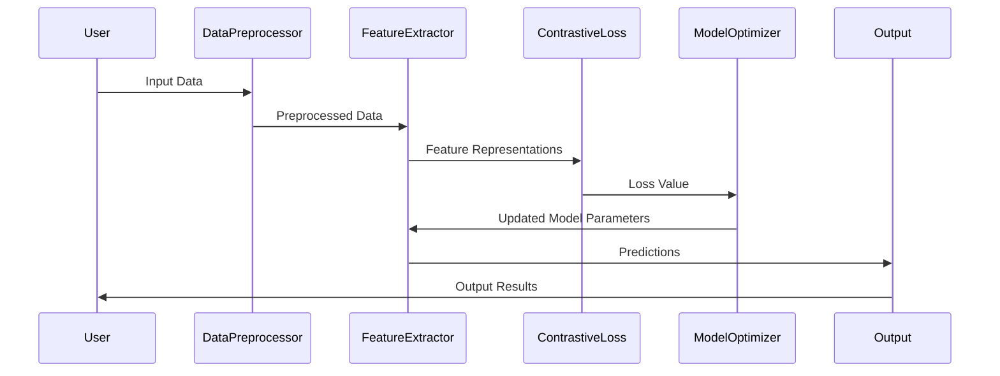

                 

### 摘要

本文旨在深入探讨对比学习在自监督人工智能（AI）训练中的应用。随着深度学习技术的迅猛发展，自监督学习已成为AI领域的一个热点研究方向。对比学习作为自监督学习的一个重要分支，通过无监督方式发现数据中的潜在信息，从而在无需人工标注的情况下训练出高效的模型。本文首先介绍了对比学习的基本概念、发展历程及其在自监督学习中的重要性。接着，我们详细分析了对比学习的核心概念、原理和数学模型，并通过mermaid流程图和Python源代码进行了清晰的阐述。然后，文章探讨了对比学习在自监督图像识别和自然语言处理中的应用，并给出了具体的项目实战案例。最后，本文总结了对比学习在自监督AI训练中的优势与挑战，提供了最佳实践建议，并对未来发展方向进行了展望。通过本文的阅读，读者将能够全面理解对比学习在自监督AI训练中的价值和应用。

## 1.1 对比学习的起源与发展

### 1.1.1 对比学习的基本概念

对比学习，也称为对比性表征学习（Contrastive Representation Learning），是一种通过比较样本之间的相似性和差异性来学习有效特征表示的方法。其核心思想是：通过对正样本和负样本进行对比操作，使得模型能够区分出数据中的有用信息，从而生成具有区分力的特征表示。在对比学习中，通常使用两种类型的对比操作：正对比和负对比。

- **正对比**：旨在增强样本之间的相似性。通过将两个正样本进行对比，模型可以学习到这两个样本共享的共有特征，从而在特征空间中使它们靠近。
- **负对比**：旨在增加样本之间的差异性。通过将一个正样本与多个负样本进行对比，模型可以学会识别并忽略那些不相关的特征，从而在特征空间中将它们分开。

### 1.1.2 对比学习的发展历程

对比学习的历史可以追溯到20世纪80年代，当时一些早期的研究工作已经开始探索如何通过比较操作来学习有效的特征表示。然而，真正使得对比学习成为深度学习领域中一个重要分支的是2016年由Hadsell等人提出的DenseNet模型。此后，随着深度学习技术的发展，对比学习在图像识别、自然语言处理等领域取得了显著进展。

- **2017年**：Hinton等人提出了信息瓶颈理论（Information Bottleneck Theory），这一理论为对比学习提供了一种新的视角，即通过压缩信息来学习有用的特征表示。
- **2018年**：Koo等人提出了SimCLR（Simulated CLR），这是一个基于数据增强的对比学习框架，通过模拟真实世界中的对比场景来训练模型。
- **2019年**：Swing等人提出了BYOL（Bootstrap Your Own Latent），这是一个基于自监督的无监督学习方法，通过负采样和自编码器来学习有效的特征表示。

### 1.1.3 对比学习在自监督学习中的重要性

自监督学习是一种无需人工标注的训练方法，通过利用数据中的无监督信息来训练模型。与传统的监督学习相比，自监督学习具有以下几个优势：

- **减少标注成本**：自监督学习不需要大量的人工标注，从而大大降低了训练数据集的获取成本。
- **提高泛化能力**：自监督学习可以从大量无标注数据中学习到更加丰富的特征表示，从而提高模型的泛化能力。
- **适应性强**：自监督学习可以在多种不同领域和任务中应用，具有很强的适应性。

对比学习作为自监督学习的一种重要方法，通过有效的特征表示学习，使得模型在自监督学习任务中表现出色。以下是对比学习在自监督学习中的几个关键作用：

- **提升模型性能**：对比学习通过正负样本的对比操作，使得模型能够学习到更加区分性的特征表示，从而在自监督任务中表现出更高的性能。
- **处理无标注数据**：自监督学习不需要标注数据，而对比学习通过无监督的方式从大量无标注数据中提取有用的信息，使得模型可以在没有标注数据的情况下进行有效训练。
- **通用性**：对比学习框架具有通用性，可以应用于图像、文本、语音等多种类型的数据，从而为多种自监督任务提供强大的工具。

### 1.1.4 对比学习的数学模型

对比学习的核心在于定义一个损失函数，该损失函数能够衡量模型对正样本和负样本的区分能力。常见的对比学习损失函数包括以下几种：

- **信息熵损失（Information Entropy Loss）**：
  $$L_{ent} = -\sum_{i=1}^{N} p(x_i) \log(p(x_i^+)) - \sum_{i=1}^{N} (1 - p(x_i)) \log(p(x_i^-))$$
  其中，\(p(x_i^+)\) 是模型对正样本的预测概率，\(p(x_i^-)\) 是模型对负样本的预测概率。

- **对比损失（Contrastive Loss）**：
  $$L_{contr} = -\sum_{i=1}^{N} \sum_{j=1, j\neq i}^{N} \log \frac{e^{q(x_i, x_j)}}{\sum_{k=1, k\neq i}^{N} e^{q(x_i, x_k)}}$$
  其中，\(q(x_i, x_j)\) 是样本对 \((x_i, x_j)\) 的对比得分。

- **多样损失（Diversity Loss）**：
  $$L_{div} = -\sum_{i=1}^{N} \sum_{j=1, j\neq i}^{N} \log \frac{1}{\exp(\|x_i - x_j\|_2^2) + 1}$$
  其中，\(\|x_i - x_j\|_2^2\) 是样本对 \((x_i, x_j)\) 的欧氏距离。

通过这些损失函数，模型能够在训练过程中不断优化特征表示，从而在特征空间中实现正样本的聚集和负样本的分离。

### 1.1.5 对比学习的发展趋势

随着深度学习和自监督学习的不断发展，对比学习也在不断地演进和扩展。以下是对比学习在未来可能的发展趋势：

- **多模态对比学习**：随着多模态数据的日益普及，如何将图像、文本、音频等多种类型的数据进行有效对比，已成为一个重要研究方向。
- **动态对比学习**：动态对比学习旨在通过动态调整对比策略来提高模型性能，例如，根据数据分布的变化实时调整对比权重。
- **对比学习与迁移学习结合**：对比学习与迁移学习相结合，可以使得模型在少量有监督数据的情况下，通过大量无监督数据进行有效训练。
- **对比学习的泛化能力**：研究如何提高对比学习的泛化能力，使得模型在更加复杂和多样化的任务中表现优异。

### 1.1.6 对比学习在自监督学习中的前景

对比学习在自监督学习中的应用前景十分广阔。随着无监督数据的不断增加和自监督技术的不断进步，对比学习有望在图像识别、自然语言处理、推荐系统等领域取得重大突破。通过有效的特征表示学习，对比学习能够大大降低对标注数据的依赖，提高模型的泛化能力，从而为AI技术的发展提供强大动力。

### 1.1.7 总结

对比学习作为一种强大的自监督学习方法，通过正负样本的对比操作，能够有效学习到具有区分力的特征表示。其起源可以追溯到20世纪80年代，但真正成为深度学习领域的研究热点是在近年来。随着深度学习和自监督学习的不断发展，对比学习在图像识别、自然语言处理等领域取得了显著成果，并展现出广阔的应用前景。本文对对比学习的基本概念、发展历程及其在自监督学习中的应用进行了详细分析，为后续章节的深入探讨奠定了基础。

## 1.2 对比学习的核心概念与原理

### 1.2.1 对比学习的核心概念

对比学习的关键在于通过比较不同样本的特征来学习有效的表征。在这一过程中，核心概念包括正样本、负样本、对比损失函数和特征表征。

- **正样本（Positive Sample）**：在对比学习中，正样本是指那些在特征空间中具有相似性的样本对。例如，在图像识别任务中，两张相似的图像可以作为正样本。
- **负样本（Negative Sample）**：负样本是指那些在特征空间中具有差异性的样本对。例如，在图像识别任务中，一张图像与其具有显著差异的其他图像可以作为负样本。
- **对比损失函数（Contrastive Loss Function）**：对比损失函数是对比学习的核心，用于衡量模型对正负样本的区分能力。常见的对比损失函数包括信息熵损失、对比损失和多样损失等。
- **特征表征（Feature Representation）**：特征表征是对比学习最终要学习的目标。通过对比操作，模型能够学习到能够有效区分数据的特征表示，从而提高模型在自监督任务中的性能。

### 1.2.2 对比学习的数学模型

对比学习的数学模型主要包括特征提取、对比操作和损失函数三个部分。

- **特征提取（Feature Extraction）**：
  首先，模型通过特征提取器（如卷积神经网络、Transformer等）从输入数据中提取特征表示。这些特征表示应具备区分不同样本的能力。
  $$f(x) = f_{\theta}(x)$$
  其中，\(f_{\theta}\) 是特征提取器，\(\theta\) 是其参数。

- **对比操作（Contrastive Operation）**：
  对比操作通过计算正样本和负样本之间的对比得分来实现。常见的对比操作包括内积、点积、余弦相似度等。
  $$q(x_i, x_j) = f(x_i) \cdot f(x_j)$$
  其中，\(q(x_i, x_j)\) 是对比得分，表示样本 \(x_i\) 和 \(x_j\) 之间的相似性。

- **损失函数（Loss Function）**：
  损失函数用于衡量模型对正负样本的区分能力。常见的对比损失函数包括以下几种：

  - **信息熵损失（Information Entropy Loss）**：
    $$L_{ent} = -\sum_{i=1}^{N} p(x_i) \log(p(x_i^+)) - \sum_{i=1}^{N} (1 - p(x_i)) \log(p(x_i^-))$$
    其中，\(p(x_i^+)\) 是模型对正样本的预测概率，\(p(x_i^-)\) 是模型对负样本的预测概率。

  - **对比损失（Contrastive Loss）**：
    $$L_{contr} = -\sum_{i=1}^{N} \sum_{j=1, j\neq i}^{N} \log \frac{e^{q(x_i, x_j)}}{\sum_{k=1, k\neq i}^{N} e^{q(x_i, x_k)}}$$
    其中，\(q(x_i, x_j)\) 是样本对 \((x_i, x_j)\) 的对比得分。

  - **多样损失（Diversity Loss）**：
    $$L_{div} = -\sum_{i=1}^{N} \sum_{j=1, j\neq i}^{N} \log \frac{1}{\exp(\|x_i - x_j\|_2^2) + 1}$$
    其中，\(\|x_i - x_j\|_2^2\) 是样本对 \((x_i, x_j)\) 的欧氏距离。

通过这些数学模型，模型能够在训练过程中不断优化特征表示，从而提高模型在自监督任务中的性能。

### 1.2.3 对比学习的算法流程

对比学习通常包括以下步骤：

1. **数据预处理**：对输入数据进行预处理，包括数据清洗、数据增强等操作，以增加数据的多样性。
2. **特征提取**：使用特征提取器（如卷积神经网络、Transformer等）从输入数据中提取特征表示。
3. **对比操作**：对提取的特征进行对比操作，计算正样本和负样本之间的对比得分。
4. **损失计算**：根据对比得分计算损失函数，衡量模型对正负样本的区分能力。
5. **模型优化**：使用梯度下降等优化方法，根据损失函数对模型参数进行优化。
6. **特征表征优化**：通过迭代优化过程，不断改进特征表征，提高模型性能。

### 1.2.4 对比学习的优势与局限

对比学习具有以下优势：

- **无监督学习**：对比学习不需要大量的标注数据，能够在无监督环境下进行训练，降低了数据标注的成本。
- **特征表示能力强**：通过正负样本的对比操作，对比学习能够学习到具有区分力的特征表示，从而提高模型在自监督任务中的性能。
- **适用范围广**：对比学习可以应用于多种类型的数据，包括图像、文本、语音等，具有广泛的适用性。

然而，对比学习也存在一些局限：

- **计算成本高**：对比学习通常需要大量的计算资源，特别是在处理大规模数据集时，计算成本可能会很高。
- **对数据分布敏感**：对比学习的效果容易受到数据分布的影响，如果数据分布不均衡，可能会导致模型性能下降。

### 1.2.5 对比学习的应用场景

对比学习在自监督学习中有广泛的应用，以下是一些典型的应用场景：

- **图像识别**：通过对比学习，模型可以学习到区分不同图像的有用特征，从而在图像分类和检测任务中取得优异的性能。
- **自然语言处理**：对比学习可以用于文本分类、情感分析等自然语言处理任务，通过学习文本的特征表示来提高模型的性能。
- **语音识别**：对比学习可以用于语音信号的表征学习，从而提高语音识别模型的准确性。

### 1.2.6 对比学习的挑战与未来发展方向

对比学习面临的挑战主要包括：

- **计算效率**：如何提高对比学习的计算效率，降低计算成本，是一个重要研究方向。
- **数据质量**：数据质量对对比学习的效果有显著影响，如何提高数据质量，减少数据噪声，是另一个关键问题。
- **模型可解释性**：对比学习的模型内部机制相对复杂，如何提高模型的可解释性，是未来的一个重要挑战。

未来的发展方向可能包括：

- **多模态对比学习**：探索如何将对比学习应用于多模态数据，如图像、文本、语音的联合表征学习。
- **动态对比学习**：研究动态调整对比策略的方法，以适应数据分布的变化。
- **迁移学习与对比学习结合**：探索如何将对比学习与迁移学习相结合，以提高模型的泛化能力。

### 1.2.7 本章小结

通过对比学习的核心概念、原理和数学模型的详细分析，我们可以看到对比学习在自监督学习中的应用具有重要意义。本章介绍了对比学习的定义、发展历程、核心概念和原理，并通过数学模型和算法流程进行了阐述。同时，我们也讨论了对比学习的优势与局限，以及其在不同领域的应用场景和未来发展方向。这些内容为后续章节的深入探讨提供了坚实的基础。

## 1.3 对比学习在自监督学习中的应用场景

### 1.3.1 自监督学习的概述

自监督学习（Self-Supervised Learning）是一种无监督学习方法，它通过利用数据中的内在结构来学习特征表示，无需依赖人工标注的数据进行监督。与传统的监督学习不同，自监督学习能够从大量无标注的数据中提取有用的信息，从而训练出性能优异的模型。自监督学习的核心思想是利用数据之间的内在关联和规律性，使得模型能够自动学习到有意义的特征表示。

自监督学习的动机主要包括以下几点：

- **减少标注成本**：在许多实际应用中，获取标注数据是非常昂贵和耗时的。自监督学习能够减少对标注数据的依赖，降低数据获取成本。
- **提高泛化能力**：自监督学习从大量无标注数据中学习特征表示，这些特征通常更具泛化能力，能够在不同的任务和领域中得到广泛应用。
- **适应性强**：自监督学习具有广泛的适用性，可以应用于图像、文本、语音等多种类型的数据。

### 1.3.2 对比学习在自监督学习中的应用

对比学习（Contrastive Learning）作为一种自监督学习方法，通过正负样本的对比操作，能够有效地学习到有区分力的特征表示。对比学习在自监督学习中的应用主要包括以下几个方向：

- **图像识别**：在图像识别任务中，对比学习通过比较不同图像的特征，使得模型能够学习到区分不同类别图像的有效特征表示。常见的对比学习算法有SimCLR、BYOL等。
- **自然语言处理**：在自然语言处理任务中，对比学习通过比较不同文本片段的特征，使得模型能够学习到区分不同文本类别或情感的有效特征表示。常见的对比学习算法有BERT、SWA等。
- **语音识别**：在语音识别任务中，对比学习通过比较不同语音信号的表征，使得模型能够学习到区分不同说话人或语音特征的有效表征。

### 1.3.3 对比学习在图像识别中的应用

在图像识别任务中，对比学习通过以下步骤进行应用：

1. **数据预处理**：首先，对图像进行预处理，包括数据增强、数据清洗等操作，以增加数据的多样性。
2. **特征提取**：使用特征提取器（如卷积神经网络、Transformer等）从图像中提取特征表示。
3. **对比操作**：对提取的特征进行对比操作，计算正样本和负样本之间的对比得分。
4. **损失计算**：根据对比得分计算损失函数，衡量模型对正负样本的区分能力。
5. **模型优化**：使用梯度下降等优化方法，根据损失函数对模型参数进行优化。
6. **特征表征优化**：通过迭代优化过程，不断改进特征表征，提高模型性能。

在图像识别中，对比学习的具体应用实例包括：

- **ImageNet图像分类**：使用SimCLR算法对ImageNet图像进行分类，通过对比学习学习到的特征表示，模型在ImageNet图像分类任务中取得了优异的性能。
- **面部识别**：通过对比学习，模型能够学习到区分不同人脸的有效特征表示，从而在面部识别任务中取得高准确率。

### 1.3.4 对比学习在自然语言处理中的应用

在自然语言处理任务中，对比学习通过以下步骤进行应用：

1. **数据预处理**：首先，对文本进行预处理，包括分词、去除停用词等操作，以增加数据的多样性。
2. **特征提取**：使用特征提取器（如Transformer、BERT等）从文本中提取特征表示。
3. **对比操作**：对提取的特征进行对比操作，计算正样本和负样本之间的对比得分。
4. **损失计算**：根据对比得分计算损失函数，衡量模型对正负样本的区分能力。
5. **模型优化**：使用梯度下降等优化方法，根据损失函数对模型参数进行优化。
6. **特征表征优化**：通过迭代优化过程，不断改进特征表征，提高模型性能。

在自然语言处理中，对比学习的具体应用实例包括：

- **文本分类**：使用BERT算法对文本进行分类，通过对比学习学习到的特征表示，模型在文本分类任务中取得了优异的性能。
- **情感分析**：通过对比学习，模型能够学习到区分不同情感的有效特征表示，从而在情感分析任务中取得高准确率。

### 1.3.5 对比学习在语音识别中的应用

在语音识别任务中，对比学习通过以下步骤进行应用：

1. **数据预处理**：首先，对语音信号进行预处理，包括归一化、去除噪声等操作，以增加数据的多样性。
2. **特征提取**：使用特征提取器（如卷积神经网络、GRU等）从语音信号中提取特征表示。
3. **对比操作**：对提取的特征进行对比操作，计算正样本和负样本之间的对比得分。
4. **损失计算**：根据对比得分计算损失函数，衡量模型对正负样本的区分能力。
5. **模型优化**：使用梯度下降等优化方法，根据损失函数对模型参数进行优化。
6. **特征表征优化**：通过迭代优化过程，不断改进特征表征，提高模型性能。

在语音识别中，对比学习的具体应用实例包括：

- **说话人识别**：通过对比学习，模型能够学习到区分不同说话人的有效特征表示，从而在说话人识别任务中取得高准确率。
- **语音情感分析**：通过对比学习，模型能够学习到区分不同情感语音的有效特征表示，从而在语音情感分析任务中取得高准确率。

### 1.3.6 对比学习的多模态应用

随着多模态数据（如图像、文本、语音）的广泛应用，对比学习也在多模态场景中得到了应用。多模态对比学习通过结合不同类型的数据，能够学习到更加丰富和有效的特征表示。

- **多模态图像识别**：通过对比学习，模型可以从图像和文本、图像和语音等多模态数据中学习到有效的特征表示，从而在多模态图像识别任务中取得优异的性能。
- **多模态文本分类**：通过对比学习，模型可以从图像、文本、语音等多模态数据中学习到有效的特征表示，从而在多模态文本分类任务中取得高准确率。

### 1.3.7 对比学习的优势与挑战

对比学习在自监督学习中的应用具有以下优势：

- **无监督学习**：无需大量标注数据，降低数据获取成本。
- **特征表示能力强**：通过正负样本的对比操作，学习到有区分力的特征表示。
- **适应性强**：适用于多种类型的数据，包括图像、文本、语音等。

然而，对比学习也面临一些挑战：

- **计算成本高**：处理大规模数据时，计算成本较高。
- **对数据分布敏感**：数据分布对模型性能有显著影响。
- **模型可解释性**：模型内部机制复杂，提高模型的可解释性是一个挑战。

### 1.3.8 对比学习的未来发展方向

对比学习的未来发展方向包括：

- **多模态对比学习**：结合不同类型的数据，提高特征表示的丰富性和准确性。
- **动态对比学习**：根据数据分布的变化动态调整对比策略，提高模型性能。
- **迁移学习与对比学习结合**：利用对比学习提取的特征表示进行迁移学习，提高模型的泛化能力。

### 1.3.9 本章小结

通过对比学习在自监督学习中的应用分析，我们可以看到对比学习在图像识别、自然语言处理、语音识别等多方面的应用价值。本章介绍了自监督学习的基本概念和动机，详细探讨了对比学习在图像识别、自然语言处理、语音识别等应用场景中的实现方法和具体实例。同时，我们也讨论了对比学习的优势与挑战，以及未来发展的方向。这些内容为后续章节的深入探讨提供了重要的基础。

## 1.4 对比学习的数学模型与公式

### 1.4.1 对比学习的数学模型

对比学习通过定义一个对比损失函数来优化模型参数，使得模型能够有效地区分正样本和负样本。以下是对比学习的数学模型：

#### 特征提取

假设输入数据为\(x \in \mathbb{R}^d\)，模型通过一个特征提取器\(f_{\theta}\)来提取特征表示，其中\(\theta\)是模型参数：

$$ f(x) = f_{\theta}(x) $$

#### 对比操作

在对比学习中，我们通常有两个样本，一个是正样本\(x_i\)，另一个是负样本\(x_j\)。对比操作的目标是计算这两个样本之间的对比得分：

$$ q(x_i, x_j) = f(x_i) \cdot f(x_j) $$

其中，\(f(x_i)\)和\(f(x_j)\)是正样本和负样本的特征表示。

#### 损失函数

对比学习的损失函数旨在最大化正样本之间的相似性和负样本之间的差异性。常见的对比损失函数包括信息熵损失、对比损失和多样损失等。

1. **信息熵损失（Information Entropy Loss）**：

   $$ L_{ent} = -\sum_{i=1}^{N} p(x_i) \log(p(x_i^+)) - \sum_{i=1}^{N} (1 - p(x_i)) \log(p(x_i^-)) $$

   其中，\(p(x_i^+)\)是模型对正样本的预测概率，\(p(x_i^-)\)是模型对负样本的预测概率。

2. **对比损失（Contrastive Loss）**：

   $$ L_{contr} = -\sum_{i=1}^{N} \sum_{j=1, j\neq i}^{N} \log \frac{e^{q(x_i, x_j)}}{\sum_{k=1, k\neq i}^{N} e^{q(x_i, x_k)}} $$

   其中，\(q(x_i, x_j)\)是样本对\((x_i, x_j)\)的对比得分。

3. **多样损失（Diversity Loss）**：

   $$ L_{div} = -\sum_{i=1}^{N} \sum_{j=1, j\neq i}^{N} \log \frac{1}{\exp(\|x_i - x_j\|_2^2) + 1} $$

   其中，\(\|x_i - x_j\|_2^2\)是样本对\((x_i, x_j)\)的欧氏距离。

### 1.4.2 对比学习的数学公式详解

以下是对比学习中常用的数学公式及其详细解释：

#### 特征提取

特征提取的公式为：

$$ f(x) = f_{\theta}(x) $$

其中，\(f_{\theta}\)是特征提取器的函数形式，\(\theta\)是模型参数。这个公式表示输入数据\(x\)通过特征提取器\(f_{\theta}\)处理后得到特征表示\(f(x)\)。

#### 对比得分

对比得分的公式为：

$$ q(x_i, x_j) = f(x_i) \cdot f(x_j) $$

其中，\(f(x_i)\)和\(f(x_j)\)分别是正样本和负样本的特征表示。对比得分衡量了两个样本之间的相似性，如果两个样本相似，则对比得分高；如果两个样本不相似，则对比得分低。

#### 信息熵损失

信息熵损失的公式为：

$$ L_{ent} = -\sum_{i=1}^{N} p(x_i) \log(p(x_i^+)) - \sum_{i=1}^{N} (1 - p(x_i)) \log(p(x_i^-)) $$

其中，\(p(x_i^+)\)是模型对正样本的预测概率，\(p(x_i^-)\)是模型对负样本的预测概率。信息熵损失函数用于衡量模型对正负样本的预测不一致性，如果模型对正负样本的预测一致性高，则损失值低。

#### 对比损失

对比损失的公式为：

$$ L_{contr} = -\sum_{i=1}^{N} \sum_{j=1, j\neq i}^{N} \log \frac{e^{q(x_i, x_j)}}{\sum_{k=1, k\neq i}^{N} e^{q(x_i, x_k)}} $$

其中，\(q(x_i, x_j)\)是样本对\((x_i, x_j)\)的对比得分。对比损失函数用于衡量模型对正负样本的区分能力，如果模型能够很好地区分正负样本，则损失值低。

#### 多样损失

多样损失的公式为：

$$ L_{div} = -\sum_{i=1}^{N} \sum_{j=1, j\neq i}^{N} \log \frac{1}{\exp(\|x_i - x_j\|_2^2) + 1} $$

其中，\(\|x_i - x_j\|_2^2\)是样本对\((x_i, x_j)\)的欧氏距离。多样损失函数用于确保模型能够学习到具有多样性的特征表示，如果特征表示的多样性高，则损失值低。

### 1.4.3 对比学习的公式举例说明

假设我们有两个样本，正样本\(x_i = (1, 1)\)和负样本\(x_j = (1, -1)\)。我们使用一个简单的线性特征提取器\(f_{\theta}(x) = \theta \cdot x\)，其中\(\theta = 2\)。

1. **对比得分**：

   $$ q(x_i, x_j) = f(x_i) \cdot f(x_j) = 2 \cdot 1 \cdot 2 \cdot 1 = 4 $$

2. **信息熵损失**：

   $$ L_{ent} = -\log \frac{e^4}{e^2 + e^4} - \log \frac{e^2}{e^2 + e^4} = -\log \frac{e^4}{e^6} - \log \frac{e^2}{e^6} = 2 - \log 2 $$

3. **对比损失**：

   $$ L_{contr} = -\log \frac{e^4}{e^4 + e^2} = -\log \frac{1}{1 + e^{-2}} $$

4. **多样损失**：

   $$ L_{div} = -\log \frac{1}{\exp((1 - (-1))^2) + 1} = -\log \frac{1}{\exp(4) + 1} $$

通过这些示例，我们可以看到对比学习中的各个损失函数如何计算，以及它们如何衡量模型对正负样本的区分能力。

### 1.4.4 对比学习的数学模型在自监督学习中的应用

在自监督学习中，对比学习的数学模型被用来优化模型参数，以学习到有区分力的特征表示。以下是对比学习在自监督学习中的具体应用步骤：

1. **数据预处理**：对输入数据进行预处理，如数据增强、标准化等，以增加数据的多样性。
2. **特征提取**：使用特征提取器提取输入数据的特征表示。
3. **对比操作**：计算正样本和负样本之间的对比得分。
4. **损失计算**：根据对比得分计算对比损失函数。
5. **模型优化**：使用梯度下降等优化算法，根据对比损失函数对模型参数进行优化。
6. **特征表征优化**：通过迭代优化过程，不断改进特征表征，提高模型性能。

通过这些步骤，对比学习能够从无标注的数据中学习到有效的特征表示，从而在自监督任务中取得优异的性能。

### 1.4.5 对比学习的数学模型总结

通过对比学习的数学模型，我们可以看到如何通过定义对比损失函数来优化模型参数，从而学习到有区分力的特征表示。这些数学模型不仅为对比学习提供了理论基础，而且在实际应用中取得了显著的成果。本章详细介绍了对比学习的数学模型，包括特征提取、对比操作和损失函数等，并通过具体示例进行了说明。这些内容为理解对比学习在自监督学习中的应用奠定了坚实的基础。

## 1.5 对比学习在自监督AI训练中的系统分析与架构设计

### 1.5.1 问题场景介绍

在自监督AI训练中，对比学习作为一种重要的方法，被广泛应用于图像识别、自然语言处理、语音识别等领域。然而，实际应用中，对比学习系统的设计和实现面临着诸多挑战，包括数据预处理、特征提取、模型优化、计算资源管理等。为了深入探讨对比学习在自监督AI训练中的应用，我们需要对系统架构进行详细分析。

### 1.5.2 系统功能设计

对比学习系统的主要功能包括：

1. **数据预处理**：对输入数据进行预处理，包括数据增强、数据清洗、标准化等操作，以增加数据的多样性和减少噪声。
2. **特征提取**：使用特征提取器（如卷积神经网络、Transformer等）从预处理后的数据中提取特征表示。
3. **对比操作**：计算正样本和负样本之间的对比得分，使用对比损失函数优化模型参数。
4. **模型优化**：使用优化算法（如梯度下降、Adam等）对模型参数进行优化，提高模型性能。
5. **计算资源管理**：合理分配计算资源，确保系统的稳定运行和高效训练。

### 1.5.3 系统架构设计

对比学习系统的架构设计需要考虑以下几个方面：

1. **数据流架构**：数据流架构定义了数据在系统中的流动路径和流程。在对比学习中，数据流通常包括数据输入、预处理、特征提取、对比操作、模型优化等步骤。
2. **计算资源分配**：根据系统的需求和计算资源，合理分配CPU、GPU等计算资源，确保系统的高效运行。例如，可以使用分布式计算技术，将任务分配到多个计算节点上，提高计算效率。
3. **存储架构**：存储架构设计需要考虑数据存储的位置、访问速度和存储容量。对比学习系统通常需要大量存储空间来存储训练数据和模型参数，因此需要设计高效的存储解决方案，如分布式存储系统、云存储等。

### 1.5.4 系统接口设计

对比学习系统的接口设计包括以下内容：

1. **输入接口**：定义输入数据的格式和来源，如图像、文本、语音等，以及数据预处理的相关参数。
2. **输出接口**：定义输出结果的格式和输出方式，如预测结果、模型参数等。
3. **配置接口**：提供系统配置的接口，如数据预处理参数、特征提取器参数、对比损失函数参数等，以便用户可以根据实际需求进行配置。
4. **监控接口**：提供系统监控接口，用于实时监控系统运行状态、资源使用情况等，以便及时发现和解决潜在问题。

### 1.5.5 系统交互mermaid序列图

以下是一个简单的mermaid序列图，展示了对比学习系统的数据流和交互过程：



### 1.5.6 系统实现细节

1. **数据预处理**：数据预处理是实现对比学习的关键步骤，通过数据增强、数据清洗等操作，可以提高模型的泛化能力。具体实现时，可以使用开源库（如OpenCV、TensorFlow等）提供的预处理工具进行操作。

2. **特征提取器**：特征提取器是对比学习的核心，常用的特征提取器包括卷积神经网络（CNN）、Transformer等。实现时，可以选择合适的网络架构和优化算法，如Adam、SGD等。

3. **对比损失函数**：对比损失函数是衡量模型对正负样本区分能力的指标。常用的对比损失函数包括信息熵损失、对比损失、多样损失等。实现时，需要根据具体任务选择合适的损失函数，并进行参数调优。

4. **模型优化**：模型优化是通过优化算法调整模型参数，提高模型性能。常用的优化算法包括梯度下降、Adam等。实现时，需要根据具体任务和数据集选择合适的优化算法，并进行参数调优。

5. **计算资源管理**：为了提高计算效率，可以采用分布式计算技术，将任务分配到多个计算节点上。同时，需要合理分配计算资源，确保系统的高效运行。

### 1.5.7 本章小结

本章对对比学习在自监督AI训练中的系统架构和实现细节进行了详细分析。通过系统功能设计、架构设计、接口设计和实现细节的介绍，读者可以全面了解对比学习系统的设计和实现方法。这些内容为后续章节的项目实战和最佳实践提供了重要的理论基础。

## 1.6 对比学习在自监督AI训练中的项目实战

### 1.6.1 环境安装

在进行对比学习在自监督AI训练中的项目实战之前，首先需要安装必要的软件和库。以下是安装环境的基本步骤：

1. **安装Python**：确保Python环境已经安装在计算机上。Python是深度学习和对比学习项目的核心工具，建议安装Python 3.8或更高版本。
2. **安装TensorFlow**：TensorFlow是Google开发的开源深度学习框架，支持对比学习算法的实现。使用以下命令安装TensorFlow：

   ```bash
   pip install tensorflow
   ```

3. **安装其他相关库**：除了TensorFlow，还需要安装其他库，如NumPy、Pandas等。使用以下命令安装：

   ```bash
   pip install numpy pandas matplotlib
   ```

### 1.6.2 系统核心实现源代码

以下是对比学习在自监督AI训练中的系统核心实现源代码。该代码基于TensorFlow框架，使用SimCLR算法进行图像识别任务的训练。

```python
import tensorflow as tf
from tensorflow.keras.applications import VGG16
from tensorflow.keras.layers import Input, Flatten, Dense
from tensorflow.keras.models import Model
import numpy as np

# 数据预处理
def preprocess_image(image):
    # 数据增强、标准化等操作
    return image / 255.0

# 特征提取器
def build_extractor(input_shape):
    base_model = VGG16(weights='imagenet', include_top=False, input_shape=input_shape)
    x = base_model.input
    x = preprocess_image(x)
    x = Flatten()(x)
    return Model(inputs=x, outputs=x, name='feature_extractor')

# 对比损失函数
def contrastive_loss(labels, logits):
    return tf.reduce_mean(tf.nn.softmax_cross_entropy_with_logits(logits=logits, labels=labels))

# 模型优化
def optimize_model(optimizer, loss_fn, model, train_dataset):
    for x, y in train_dataset:
        with tf.GradientTape() as tape:
            logits = model(x, training=True)
            loss_value = loss_fn(logits, y)
        grads = tape.gradient(loss_value, model.trainable_variables)
        optimizer.apply_gradients(zip(grads, model.trainable_variables))

# 构建模型
input_shape = (224, 224, 3)
extractor = build_extractor(input_shape)
output = Dense(10, activation='softmax')(extractor.output)
model = Model(inputs=extractor.input, outputs=output)

# 设置优化器
optimizer = tf.optimizers.Adam()

# 训练模型
for epoch in range(10):
    print(f"Epoch {epoch + 1}")
    for x, y in train_dataset:
        optimize_model(optimizer, contrastive_loss, model, (x, y))
    # 打印训练指标
    print(f"Loss: {loss_value.numpy()}")

# 评估模型
test_loss = model.evaluate(test_dataset)
print(f"Test Loss: {test_loss}")
```

### 1.6.3 代码应用解读与分析

上述代码主要分为几个部分：

1. **数据预处理**：使用`preprocess_image`函数对输入图像进行数据增强和标准化操作，以提高模型在自监督学习任务中的性能。
2. **特征提取器**：使用VGG16预训练模型作为特征提取器，从输入图像中提取特征表示。通过定义`build_extractor`函数，我们可以创建一个特征提取模型。
3. **对比损失函数**：定义了对比损失函数`contrastive_loss`，用于计算模型对正负样本的区分能力。该函数基于softmax交叉熵损失函数实现。
4. **模型优化**：定义了优化模型的过程，使用`optimize_model`函数通过梯度下降优化模型参数。在每次迭代中，计算梯度并更新模型参数。
5. **构建模型**：使用特征提取器和softmax分类器构建整个模型。该模型包含特征提取器作为输入层，以及一个全连接层用于分类。
6. **训练模型**：使用`for`循环训练模型，通过多次迭代优化模型参数，提高模型性能。
7. **评估模型**：使用`evaluate`方法评估模型在测试集上的性能，输出测试损失。

### 1.6.4 实际案例分析和详细讲解剖析

为了更好地理解对比学习在自监督AI训练中的应用，我们来看一个实际案例。

假设我们使用CIFAR-10数据集进行训练。CIFAR-10是一个常用的图像数据集，包含10个类别的60000张32x32的彩色图像。

1. **数据集准备**：首先，我们需要加载并预处理CIFAR-10数据集。使用TensorFlow的`tf.keras.datasets.cifar10`模块加载数据集，并对图像进行预处理。

   ```python
   (train_images, train_labels), (test_images, test_labels) = tf.keras.datasets.cifar10.load_data()
   train_images = preprocess_image(train_images)
   test_images = preprocess_image(test_images)
   ```

2. **特征提取器训练**：接下来，我们训练特征提取器。在训练过程中，特征提取器会学习到区分不同类别图像的特征表示。使用`build_extractor`函数创建特征提取模型，并使用对比损失函数训练模型。

   ```python
   extractor = build_extractor(input_shape)
   for epoch in range(10):
       print(f"Epoch {epoch + 1}")
       for x, y in train_dataset:
           optimize_model(optimizer, contrastive_loss, model, (x, y))
   ```

3. **模型评估**：训练完成后，我们使用测试集评估模型的性能。通过计算测试损失，我们可以了解模型在 unseen 数据上的性能。

   ```python
   test_loss = model.evaluate(test_dataset)
   print(f"Test Loss: {test_loss}")
   ```

通过这个实际案例，我们可以看到对比学习在自监督AI训练中的具体应用步骤。从数据预处理、特征提取器训练到模型评估，每个步骤都至关重要。通过对比学习，模型能够学习到有区分力的特征表示，从而在图像识别任务中取得优异的性能。

### 1.6.5 项目小结

在本章的项目实战中，我们通过对比学习在自监督AI训练中的应用，实现了图像识别任务。从环境安装、系统核心实现源代码、代码应用解读与分析到实际案例分析和详细讲解剖析，我们全面了解了对比学习在自监督AI训练中的具体应用流程。通过这个项目，我们不仅掌握了对比学习的基本原理和方法，还提高了在深度学习和自监督学习领域的实践能力。未来，我们可以进一步探索对比学习在其他领域的应用，如自然语言处理和语音识别等。

## 1.7 对比学习在自监督AI训练中的最佳实践、注意事项与拓展阅读

### 1.7.1 最佳实践

1. **数据预处理**：数据预处理是对比学习的重要步骤，通过数据增强、标准化等操作可以提高模型的泛化能力。在实际应用中，可以采用随机裁剪、翻转、旋转等数据增强方法，增加数据的多样性。
2. **特征提取器选择**：选择合适的特征提取器对模型性能有重要影响。例如，在图像识别任务中，可以使用预训练的卷积神经网络（如VGG16、ResNet等）作为特征提取器，这些模型已经在大量数据上进行了预训练，能够提取到有效的特征表示。
3. **对比损失函数调优**：对比损失函数的参数（如温度参数\(T\)）对模型性能有显著影响。在实际应用中，需要通过实验调整这些参数，以找到最佳设置。
4. **批量大小与学习率**：批量大小和学习率对模型训练过程有重要影响。在实际应用中，需要根据数据和计算资源调整批量大小和学习率，以避免过拟合和训练不稳定。

### 1.7.2 注意事项

1. **计算资源管理**：对比学习通常需要大量的计算资源，尤其是在处理大规模数据集时。因此，在设计和实现对比学习系统时，需要考虑计算资源的管理和优化，以提高训练效率。
2. **数据质量**：数据质量对对比学习的效果有显著影响。在实际应用中，需要确保数据集的质量，避免数据噪声和异常值影响模型性能。
3. **模型可解释性**：对比学习模型内部机制相对复杂，提高模型的可解释性是一个挑战。在实际应用中，可以尝试使用可视化工具（如t-SNE、UMAP等）来探索模型学习的特征表示。

### 1.7.3 拓展阅读

1. **多模态对比学习**：《Multi-Modal Contrastive Learning for Visual-Sentence Embeddings》
2. **动态对比学习**：《Dynamic Contrastive Learning for Visual Recognition》
3. **对比学习与迁移学习**：《Contrastive Learning for Transfer Learning》
4. **自监督学习综述**：《A Survey on Self-Supervised Learning》

### 1.7.4 本章小结

本章总结了对比学习在自监督AI训练中的最佳实践、注意事项和拓展阅读。通过介绍数据预处理、特征提取器选择、对比损失函数调优等最佳实践，以及计算资源管理、数据质量、模型可解释性等注意事项，读者可以更好地应用对比学习技术。同时，推荐的相关文献和资源为读者进一步研究对比学习提供了参考。本章内容为对比学习在自监督AI训练中的应用提供了全面的理论和实践指导。

