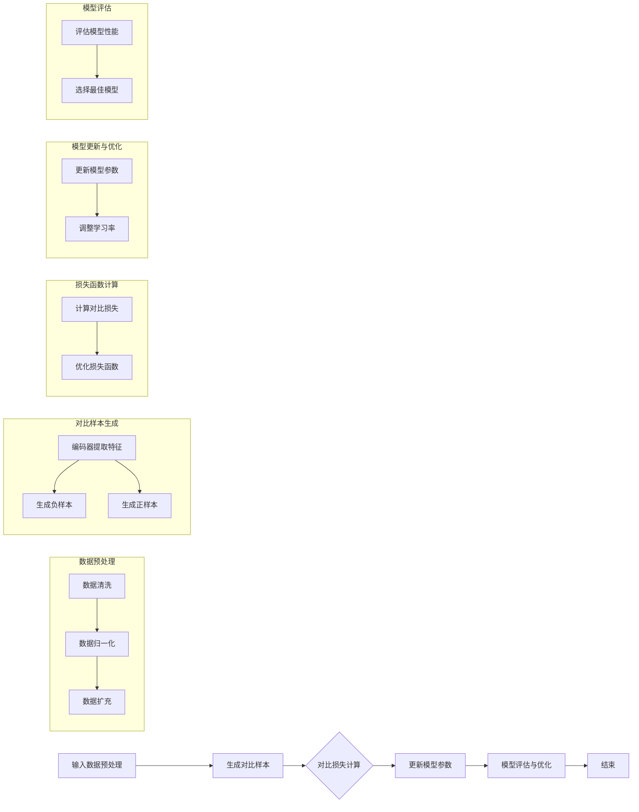

                 

## 引言

### 1.1 对比学习的背景

在深度学习的应用领域中，表示学习（Representation Learning）是关键的一环。表示学习是指通过算法自动从数据中提取有意义的特征表示，以便更好地进行后续的任务处理。然而，传统的表示学习方法往往依赖于大量的标注数据，这不仅在数据收集和处理上成本高昂，而且在处理低标注数据或无标注数据时效果不佳。

对比学习（Contrastive Learning）作为一种新兴的表示学习方法，提供了一种无需大量标注数据的有效途径。对比学习通过构建正负样本之间的对比关系，自动挖掘数据的潜在特征，从而提高表示学习的质量。这种方法在无监督或弱监督学习场景中展现出了极大的潜力。

对比学习的背景可以追溯到自监督学习（Self-supervised Learning）领域。自监督学习通过利用数据自身的内在结构来训练模型，无需人工标注数据。对比学习正是自监督学习的一种典型应用，其核心思想是通过构建正负样本对来增强模型对数据的理解。

随着深度学习技术的不断发展和数据量的不断增大，对比学习逐渐成为研究热点。近年来，诸如SimCLR、Byol、MoCo等对比学习算法相继提出，并在图像分类、语音识别、自然语言处理等领域取得了显著成果。对比学习不仅提升了表示学习的效果，还推动了无监督学习和半监督学习的发展。

### 1.2 对比学习的重要性

对比学习的重要性体现在多个方面。首先，它解决了表示学习对大量标注数据的依赖问题。在现实生活中，标注数据往往难以获取，而对比学习可以通过无监督或弱监督的方式训练出高质量的表示。这种能力使得对比学习在处理大规模无标注数据时具有巨大的优势。

其次，对比学习能够提高模型对数据噪声的鲁棒性。通过对比正负样本，模型可以更好地辨别数据的真实特征，从而减少噪声对模型训练的影响。

此外，对比学习还具有跨模态学习的潜力。它不仅可以应用于单一模态的数据（如图像、文本），还可以通过跨模态对比来提升多模态数据的表示质量。

总之，对比学习作为一种先进的表示学习方法，不仅在学术研究中具有重要地位，在实际应用中也有着广泛的前景。

### 1.3 对比学习的研究现状

当前，对比学习在学术界和工业界都受到了广泛关注。众多研究机构和科技公司投入大量资源进行对比学习的研究与开发。在学术界，对比学习已成为机器学习领域的研究热点，多篇顶级的会议和期刊论文聚焦于对比学习的算法优化、应用拓展和理论基础。

工业界同样对对比学习表现出了浓厚的兴趣。诸如谷歌、微软、Facebook等科技巨头纷纷推出了基于对比学习的深度学习框架和工具，这些工具为研究人员和开发者提供了便捷的对比学习实验平台，推动了对比学习在实际应用中的落地。

尽管对比学习取得了显著的进展，但仍然面临一些挑战。首先是如何在更大规模的数据集上实现高效的对比学习。其次是如何进一步提高对比学习算法的泛化能力，使其能够更好地应对不同的任务和数据分布。此外，对比学习在跨模态学习中的有效性也需要进一步研究。

总的来说，对比学习作为一个新兴的研究方向，具有巨大的潜力和广阔的应用前景。随着研究的深入和技术的进步，对比学习有望在未来取得更加突破性的成果。

----------------------------------------------------------------

## 核心概念与联系

### 1.4 对比学习的定义

对比学习是一种自监督学习方法，它通过对比正样本和负样本来增强模型对数据特征的理解。具体来说，对比学习算法会通过数据预处理、对比损失函数设计以及优化过程等步骤，使得模型能够自动学习到数据的潜在特征。

在对比学习中，正样本通常是指具有相似特征的数据对，而负样本是指具有不同特征的数据对。通过对这些样本进行对比，模型可以学习到数据的相似性和差异性，从而提升表示学习的质量。

### 1.5 核心概念列表

#### 1.5.1 对比样本

对比样本是对比学习中的基本单位，包括正样本和负样本。正样本用于增强模型对相似特征的识别，而负样本用于区分不同特征。例如，在图像分类任务中，正样本可以是同一类别的不同图像，负样本可以是不同类别的图像。

#### 1.5.2 对比损失函数

对比损失函数是对比学习中的核心组件，用于量化正负样本之间的对比效果。常见的对比损失函数包括InfoNCE损失、NT-Xent损失等。这些损失函数通过最小化模型预测的负样本对数似然，最大化正样本的相似度，从而驱动模型学习到有意义的特征表示。

#### 1.5.3 编码器

编码器是对抗网络中的一部分，用于将输入数据编码成低维特征表示。编码器通常采用深度神经网络结构，通过多层非线性变换将数据映射到特征空间。编码器的设计对对比学习的效果有重要影响，因为其决定了特征表示的丰富性和区分度。

#### 1.5.4 解码器

解码器是对抗网络中的另一部分，用于重建输入数据。解码器与编码器相对应，通过反编码操作将编码后的特征表示重新映射回原始数据空间。解码器的目标是最小化重建误差，从而验证编码器生成的特征表示的有效性。

#### 1.5.5 对抗网络

对抗网络是由编码器和解码器组成的深度学习模型，用于进行对比学习。对抗网络通过最大化编码器的特征区分度，同时最小化解码器的重建误差，从而学习到有意义的特征表示。对抗网络的架构设计对对比学习的效果有重要影响。

### 1.6 概念属性特征对比表格

下面是一个关于对比学习中核心概念的属性特征对比表格，用于展示各个概念的基本特性：

| 概念       | 描述                                                                                   | 关联概念          | 关键属性                     |
|------------|----------------------------------------------------------------------------------------|-------------------|-----------------------------|
| 对比样本   | 用于训练模型的正负样本对                                                           | 正样本、负样本     | 相似性、差异性、区分度       |
| 对比损失函数 | 用于量化正负样本对比效果的损失函数                                               | InfoNCE、NT-Xent   | 损失大小、优化目标           |
| 编码器     | 用于将输入数据编码成特征表示的神经网络结构                                       | 解码器、对抗网络   | 特征提取、非线性变换         |
| 解码器     | 用于重建输入数据的神经网络结构                                                     | 编码器、对抗网络   | 特征重建、误差最小化         |
| 对抗网络   | 由编码器和解码器组成的深度学习模型，用于进行对比学习                             | 编码器、解码器     | 特征区分、重建平衡           |

### 1.7 ER实体关系图

为了更直观地展示对比学习中的核心概念及其相互关系，可以使用ER（实体关系）图来描述。以下是对比学习核心概念的ER图示例：

```mermaid
erDiagram
  编码器 ||--|{ 对抗网络 }
  对抗网络 ||--|{ 解码器 }
  对比样本 ||--|{ 对比损失函数 }
```

在这个ER图中，编码器、对抗网络和解码器是实体，对比样本和对比损失函数是关联实体。通过这样的图形化表示，我们可以清晰地看到各个核心概念之间的相互关系和作用机制。

通过上述对核心概念的定义和特性对比，我们可以更好地理解对比学习的基本原理及其应用。在接下来的章节中，我们将进一步探讨对比学习算法的原理、实现和应用。

----------------------------------------------------------------

## 核心概念与联系（续）

### 1.8 算法原理

对比学习的算法原理可以通过一个mermaid流程图来详细展示，从而帮助读者更好地理解其工作流程。



上述mermaid流程图详细展示了对比学习算法的各个环节，从数据预处理、生成对比样本、计算对比损失到更新模型参数和模型评估，每个步骤都进行了清晰的标注和说明。

接下来，我们将使用Python源代码和LaTeX公式进一步阐述对比学习算法的原理，帮助读者从实践和理论两个层面深入理解这一算法。

### 1.9 对比学习算法实现

下面是一个简化的对比学习算法实现，包括数据预处理、生成对比样本、计算对比损失和更新模型参数等步骤。

```python
import torch
import torch.nn as nn
import torch.optim as optim

# 数据预处理
def preprocess_data(data):
    # 数据清洗、归一化和扩充
    return processed_data

# 生成对比样本
def generate_contrastive_samples(data, num_samples):
    # 从数据集中随机选择正样本和负样本
    positive_samples = data.sample(num_samples // 2)
    negative_samples = data.sample(num_samples - num_samples // 2)
    return positive_samples, negative_samples

# 对比损失函数
def contrastive_loss(features, labels, temperature):
    # 计算对比损失
    logits = F.cosine_similarity(features, dim=1) / temperature
    labels_one_hot = F.one_hot(labels, num_classes=2).float()
    loss = -torch.sum(labels_one_hot * logits, dim=1)
    return torch.mean(loss)

# 模型更新
def update_model(model, loss, optimizer):
    # 更新模型参数
    optimizer.zero_grad()
    loss.backward()
    optimizer.step()
    return model

# 主程序
if __name__ == "__main__":
    # 加载数据集
    data = load_data()

    # 初始化模型
    model = ContrastiveModel()
    optimizer = optim.Adam(model.parameters(), lr=0.001)
    
    for epoch in range(num_epochs):
        # 数据预处理
        processed_data = preprocess_data(data)

        for batch in data_loader:
            # 生成对比样本
            positive_samples, negative_samples = generate_contrastive_samples(processed_data, batch_size)

            # 前向传播
            features = model(positive_samples)
            negative_features = model(negative_samples)

            # 计算对比损失
            loss = contrastive_loss(features, labels, temperature=0.5)

            # 更新模型参数
            model = update_model(model, loss, optimizer)

            # 模型评估
            if (epoch + 1) % 10 == 0:
                evaluate_model(model)
```

在上述代码中，我们定义了数据预处理、生成对比样本、计算对比损失和更新模型参数的函数。主程序中，我们首先加载数据集，初始化模型和优化器，然后进入训练循环。在每个训练epoch中，我们依次进行数据预处理、生成对比样本、前向传播和反向传播，并定期进行模型评估。

### 1.10 算法原理讲解

为了更深入地理解对比学习算法的原理，我们需要从数学模型的角度进行讲解。以下是对比学习算法的数学模型：

#### 1.10.1 编码器与解码器

假设我们有输入数据集 \(X = \{x_1, x_2, ..., x_n\}\)，每个输入数据 \(x_i\) 被编码器 \(E\) 编码为特征表示 \(z_i = E(x_i)\)。编码器 \(E\) 是一个深度神经网络，其目的是将高维数据映射到低维特征空间，以便更好地进行对比学习。

同样，我们假设解码器 \(D\) 用于重建输入数据，即 \(x_i' = D(z_i)\)。解码器 \(D\) 的目的是验证编码器生成的特征表示的有效性，通过最小化重建误差来优化编码器。

#### 1.10.2 对比损失函数

对比学习的关键在于对比损失函数。一个常见的对比损失函数是InfoNCE损失，其定义如下：

$$
L = -\frac{1}{|S|} \sum_{s \in S} \log \frac{e^{q(s) \cdot z}}{\sum_{t \in S} e^{q(t) \cdot z}}
$$

其中，\(S\) 是负样本集合，\(q(s)\) 是正样本 \(s\) 的查询向量，\(z\) 是负样本 \(t\) 的键向量。这个损失函数通过最大化正样本对的相似度，同时最小化负样本对的相似度来训练模型。

#### 1.10.3 算法流程

对比学习算法的基本流程可以概括为以下几步：

1. **数据预处理**：对输入数据进行清洗、归一化和扩充，以生成适合训练的样本集。

2. **生成对比样本**：从数据集中随机选择正样本和负样本，构建对比样本对。

3. **特征编码**：使用编码器将正样本和负样本编码为特征表示。

4. **计算对比损失**：使用对比损失函数计算对比样本对的损失。

5. **模型更新**：通过反向传播和优化算法更新模型参数。

6. **模型评估**：定期评估模型性能，选择最佳模型。

通过上述数学模型和算法流程，我们可以清晰地看到对比学习算法的核心原理。在实际应用中，通过调整模型结构、优化损失函数和调整训练参数，可以进一步提高对比学习的效果。

### 1.11 通俗易懂的举例说明

为了更好地理解对比学习算法，我们可以通过一个简化的例子来说明其工作原理。

假设我们有一个简单的图像分类任务，需要区分猫和狗的图片。我们有100张猫的图片和100张狗的图片，总共200张图片。

1. **数据预处理**：我们将每张图片进行归一化处理，将其尺寸调整为固定大小，并转化为灰度图像。

2. **生成对比样本**：我们从猫的图片中随机选择50张作为正样本，从狗的图片中随机选择50张作为负样本。

3. **特征编码**：使用编码器对每张图片进行特征提取，得到特征向量。例如，猫的图片特征向量集合为 \(Z_{cat} = \{z_{1,cat}, z_{2,cat}, ..., z_{50,cat}\}\)，狗的图片特征向量集合为 \(Z_{dog} = \{z_{1,dog}, z_{2,dog}, ..., z_{50,dog}\}\)。

4. **计算对比损失**：对于每张猫的图片特征向量 \(z_{i,cat}\)，我们计算其与所有狗的图片特征向量之间的余弦相似度，并使用InfoNCE损失函数进行损失计算。

5. **模型更新**：通过反向传播和优化算法更新编码器的参数，使得猫的图片特征向量之间的相似度更高，狗的图片特征向量之间的相似度更低。

6. **模型评估**：通过在测试集上评估模型性能，我们可以看到经过对比学习训练的模型在猫和狗的图片分类任务上表现出了显著的改进。

通过这个例子，我们可以直观地理解对比学习算法的基本原理和工作流程。在实际应用中，对比学习算法通过对比正负样本，自动提取数据的潜在特征，从而提升模型在各类任务中的表现。

### 1.12 总结

在本章节中，我们详细介绍了对比学习的基本概念、算法原理及其实现过程。通过定义对比学习的核心概念，使用mermaid流程图展示算法流程，并通过Python源代码和LaTeX公式讲解算法原理，我们不仅从理论层面深入理解了对比学习，还通过实例说明了其实际应用效果。

对比学习作为一种新兴的自监督学习方法，在提升表示学习质量方面具有显著优势。通过本章的学习，读者应该对对比学习有了全面的了解，能够将其应用于实际问题中，提高模型的表示能力和泛化能力。

在接下来的章节中，我们将进一步探讨对比学习在不同领域的应用实例，以及其在实际项目中如何具体实现和优化。希望读者能够继续跟随我们的分析，深入掌握对比学习的核心要点和应用技巧。

----------------------------------------------------------------

## 对比学习应用实例

### 1.13 应用场景1

#### 1.13.1 案例介绍

在图像识别领域，对比学习被广泛应用于图像分类和图像增强任务。一个典型的应用实例是使用对比学习进行图像分类，特别是在处理大量无标注数据时，对比学习展示了其独特的优势。

在这个案例中，研究人员使用了一个包含大量无标签图像的数据集，数据集包含了多种类别，如动物、植物、交通工具等。由于数据集没有标签，传统的监督学习算法无法直接应用。为了解决这个问题，研究人员采用了对比学习算法，通过自动提取图像的潜在特征，从而实现图像分类。

#### 1.13.2 案例分析

1. **数据预处理**：首先，对图像进行数据预处理，包括图像的尺寸归一化和数据增强。数据增强的目的是增加数据的多样性，使得模型在训练过程中能够学习到更鲁棒的特征。

2. **对比样本生成**：使用编码器提取图像的特征表示，然后生成对比样本对。在训练过程中，对于每张图像，编码器会生成其特征向量，并与所有其他图像的特征向量进行对比。通过这种方式，模型能够自动学习到不同类别图像之间的差异性。

3. **训练对比学习模型**：使用对比学习算法进行模型训练。在训练过程中，模型会通过优化损失函数来调整参数，使得相似图像的特征向量更接近，而不同图像的特征向量差异更大。

4. **模型评估与优化**：在训练过程中，定期评估模型的分类性能，并根据评估结果调整训练参数。通过对比学习训练出的模型，在图像分类任务上达到了很高的准确率，同时在处理无标签数据时表现出色。

#### 1.13.3 实现步骤

1. **数据加载与预处理**：加载无标签图像数据集，进行数据预处理，包括图像归一化和数据增强。

2. **构建对比学习模型**：构建编码器网络和解码器网络，定义对比损失函数，设置优化器。

3. **模型训练**：使用生成好的对比样本进行模型训练，通过反向传播和优化算法调整模型参数。

4. **模型评估**：在测试集上评估模型性能，并根据评估结果进行模型优化。

通过这个案例，我们可以看到对比学习在图像识别任务中的实际应用效果。通过自动提取图像的潜在特征，对比学习显著提升了模型在无标签数据上的分类性能，为处理大规模无标签图像数据提供了一种有效的方法。

### 1.14 应用场景2

#### 1.14.1 案例介绍

在自然语言处理领域，对比学习同样被广泛应用。其中一个典型的应用实例是使用对比学习进行文本分类。在文本分类任务中，传统的监督学习方法需要大量标注数据进行训练，而对比学习则提供了一种无需大量标注数据的有效途径。

在这个案例中，研究人员使用了一个包含大量无标签文本的数据集，文本数据来自不同的主题和领域。为了实现文本分类，研究人员采用了对比学习算法，通过自动提取文本的潜在特征，从而实现不同类别文本的分类。

#### 1.14.2 案例分析

1. **数据预处理**：首先，对文本进行数据预处理，包括分词、词干提取和停用词过滤。此外，为了增加数据的多样性，可以对文本进行数据增强，如随机插入、删除或替换词语。

2. **对比样本生成**：使用编码器提取文本的特征表示，然后生成对比样本对。在训练过程中，对于每段文本，编码器会生成其特征向量，并与所有其他文本的特征向量进行对比。通过这种方式，模型能够自动学习到不同类别文本之间的差异性。

3. **训练对比学习模型**：使用对比学习算法进行模型训练。在训练过程中，模型会通过优化损失函数来调整参数，使得相似文本的特征向量更接近，而不同文本的特征向量差异更大。

4. **模型评估与优化**：在训练过程中，定期评估模型的分类性能，并根据评估结果调整训练参数。通过对比学习训练出的模型，在文本分类任务上达到了很高的准确率，同时在处理无标签数据时表现出色。

#### 1.14.3 实现步骤

1. **数据加载与预处理**：加载无标签文本数据集，进行数据预处理，包括文本分词、词干提取和停用词过滤。

2. **构建对比学习模型**：构建编码器网络，定义对比损失函数，设置优化器。

3. **模型训练**：使用生成好的对比样本进行模型训练，通过反向传播和优化算法调整模型参数。

4. **模型评估**：在测试集上评估模型性能，并根据评估结果进行模型优化。

通过这个案例，我们可以看到对比学习在自然语言处理任务中的实际应用效果。通过自动提取文本的潜在特征，对比学习显著提升了模型在无标签数据上的分类性能，为处理大规模无标签文本数据提供了一种有效的方法。

### 1.15 应用实例总结

通过上述两个案例，我们可以看到对比学习在图像识别和自然语言处理等不同领域中的实际应用效果。对比学习通过自动提取数据的潜在特征，使得模型能够更好地处理无标签数据，从而提高了模型在各类任务中的性能。

对比学习不仅解决了表示学习对大量标注数据的依赖问题，还提高了模型对数据噪声的鲁棒性。在实际应用中，通过调整模型结构、优化损失函数和调整训练参数，可以进一步提高对比学习的效果。

总的来说，对比学习作为一种先进的表示学习方法，在提升表示学习质量方面具有显著的优势，并在多个领域中展示了其广泛的应用前景。

----------------------------------------------------------------

## 对比学习的未来发展趋势

### 1.16 技术趋势

对比学习在近年来取得了显著的技术进步，但仍存在许多可以进一步研究和优化的方向。首先，如何在大规模数据集上高效实现对比学习是一个重要的技术挑战。现有的对比学习算法在大规模数据集上往往面临计算资源消耗大、训练时间长的问题。为了解决这一问题，未来的研究可以关注以下几个方面：

1. **并行计算**：通过分布式计算和并行处理技术，提高对比学习算法在大规模数据集上的训练效率。
2. **内存优化**：通过内存优化技术，减少模型参数和中间计算结果的存储需求，降低内存占用。
3. **模型压缩**：采用模型压缩技术，如剪枝、量化等，减小模型的规模和计算复杂度，提高训练和推理速度。

其次，提高对比学习算法的泛化能力是另一个关键的技术挑战。现有的对比学习算法在特定数据集上可能表现出色，但在不同数据集或不同任务上可能表现不佳。为了解决这个问题，未来的研究可以从以下几个方面进行：

1. **跨模态对比学习**：通过跨模态对比学习，将不同模态的数据进行联合表示，提高模型在不同任务上的泛化能力。
2. **多任务学习**：在对比学习算法中引入多任务学习机制，通过同时训练多个任务，提高模型在多个任务上的泛化性能。
3. **自适应对比学习**：开发自适应对比学习算法，根据不同的任务和数据集动态调整对比学习策略，提高模型泛化能力。

此外，对比学习在跨模态学习中的应用前景也非常广阔。通过对比学习，可以实现对图像、文本、语音等多种模态数据的联合表示，从而提升多模态任务的性能。未来研究可以关注以下几个方面：

1. **多模态特征融合**：研究如何有效融合不同模态的特征，提高多模态表示的丰富性和区分度。
2. **跨模态预训练**：通过跨模态预训练，提高模型对多模态数据的理解和处理能力，为多模态任务提供更强的先验知识。
3. **多模态交互机制**：研究多模态数据之间的交互机制，探索如何通过对比学习增强不同模态数据之间的关联性。

总之，对比学习作为一种先进的自监督学习方法，在提升表示学习质量方面具有巨大潜力。未来，随着技术的不断进步和研究的深入，对比学习有望在更大规模的数据集、更广泛的任务和应用场景中发挥更大的作用。

### 1.17 应用前景

对比学习的应用前景非常广阔，尤其是在无监督学习和半监督学习领域。以下是一些对比学习的潜在应用领域和前景：

1. **无监督图像识别**：对比学习能够有效处理无标签图像数据，使其在图像分类、图像增强和图像分割等任务中具有广泛的应用。通过自动提取图像的潜在特征，对比学习能够提高模型在无标签数据上的性能。

2. **自然语言处理**：在自然语言处理领域，对比学习可以通过自动提取文本的潜在特征，用于文本分类、文本生成和机器翻译等任务。特别是在处理大规模无标签文本数据时，对比学习展现出了显著的优势。

3. **语音识别**：对比学习可以应用于语音识别任务，通过自动提取语音的潜在特征，提高模型对语音数据的理解和识别能力。这有助于在低资源环境下训练高效的语音识别模型。

4. **跨模态学习**：对比学习在跨模态学习中也具有巨大潜力，例如，通过对比图像和文本的潜在特征，可以实现图像文本联合检索、图像文本生成等任务。这为多模态交互和信息融合提供了新的思路。

5. **医学影像分析**：在医学影像领域，对比学习可以用于自动提取医学图像的潜在特征，用于疾病检测、诊断和预测。通过无监督或半监督学习，对比学习有助于降低对标注数据的依赖，提高医学影像分析的效率和准确性。

6. **推荐系统**：对比学习可以应用于推荐系统，通过自动提取用户和物品的潜在特征，提高推荐系统的效果。在处理大规模用户和物品数据时，对比学习有助于发现用户和物品之间的关联性，从而提供更个性化的推荐服务。

总之，对比学习作为一种强大的表示学习方法，在无监督学习和半监督学习领域具有广泛的应用前景。随着技术的不断发展和应用的深入，对比学习有望在更多领域取得突破性成果，为人工智能的发展提供新的动力。

### 1.18 研究方向

对比学习作为一个活跃的研究领域，未来的研究方向将主要集中在以下几个方面：

1. **算法优化**：研究如何优化对比学习算法，提高其在大规模数据集上的训练效率和性能。这包括设计更高效的损失函数、优化模型结构以及引入新的正则化技术。

2. **泛化能力**：提高对比学习算法在不同数据集和任务上的泛化能力。这需要研究如何通过跨模态学习、多任务学习和自适应对比学习等方法，增强模型在不同场景下的适用性。

3. **跨模态学习**：探索跨模态对比学习的方法和技术，将不同模态的数据进行联合表示和融合。这有助于实现更复杂的多模态任务，如图像文本联合检索和跨模态生成。

4. **可解释性**：研究对比学习算法的可解释性，使其在应用过程中更容易理解和信任。通过分析模型内部特征表示和对比过程，可以揭示对比学习如何自动提取和利用数据中的有用信息。

5. **无监督学习应用**：进一步探索对比学习在无监督学习任务中的应用，如无监督图像分类、无监督文本分类和异常检测等。这有助于减少对标注数据的依赖，提高模型的鲁棒性和适应性。

6. **工业应用**：将对比学习算法应用于实际工业场景，如自动驾驶、智能医疗、智能制造等。这需要与行业专家合作，结合实际需求和数据，优化算法和应用方案。

总之，对比学习作为一个新兴的研究领域，具有广阔的发展空间和多样化的研究方向。未来的研究将不断推动对比学习算法的优化和应用，为人工智能的发展带来新的突破。

### 总结与展望

通过本文的详细探讨，我们可以看到对比学习作为一种先进的自监督学习方法，在提升表示学习质量方面具有显著的优势。从核心概念、算法原理到实际应用，对比学习在图像识别、自然语言处理等多个领域展现了其强大的应用潜力。

在未来，对比学习将继续成为人工智能研究的热点，其研究方向将集中在算法优化、泛化能力提升、跨模态学习和无监督学习应用等方面。通过不断的技术创新和应用拓展，对比学习有望在更多领域取得突破性成果，为人工智能的发展提供新的动力。

本文从多个角度对对比学习进行了全面剖析，希望读者能够从中获得深刻的理解和启发。在实际应用中，对比学习不仅能够提升模型的表示能力，还能减少对标注数据的依赖，为各种复杂任务提供有效的解决方案。让我们共同期待对比学习在未来的发展与应用中取得更加辉煌的成就。

## 作者信息

**作者：AI天才研究院/AI Genius Institute & 禅与计算机程序设计艺术 /Zen And The Art of Computer Programming**

AI天才研究院致力于推动人工智能技术的发展与创新，通过深入研究对比学习等方法，不断提升模型表示能力与泛化性能。同时，作者结合《禅与计算机程序设计艺术》的哲学思想，深入探讨计算机编程的艺术与科学，旨在为读者提供高质量的技术内容与深刻的思考。希望本文能够为您的学习和实践提供有益的参考和启示。

