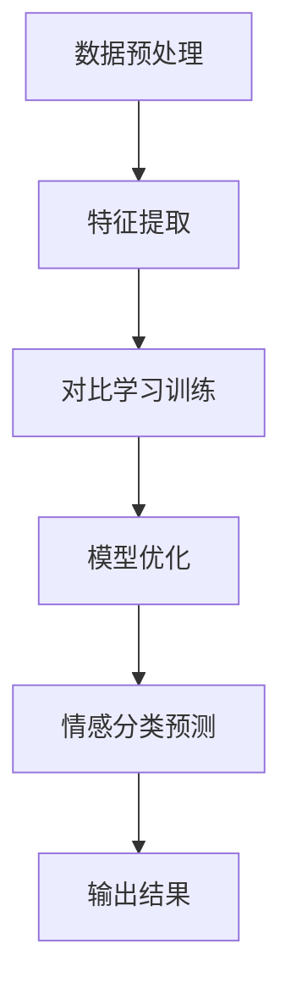
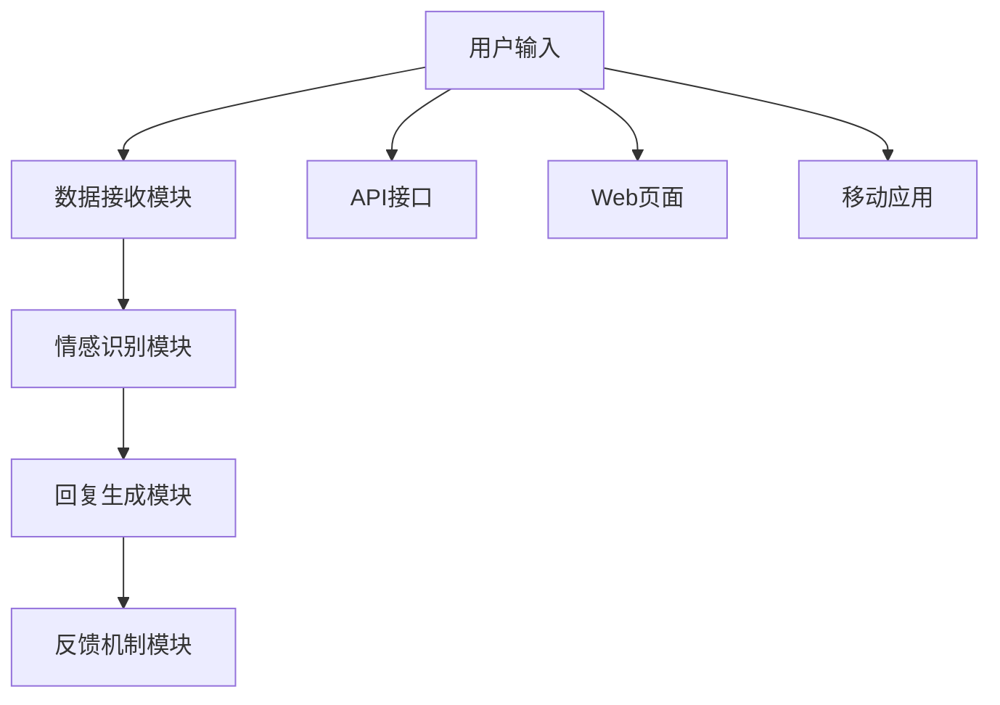
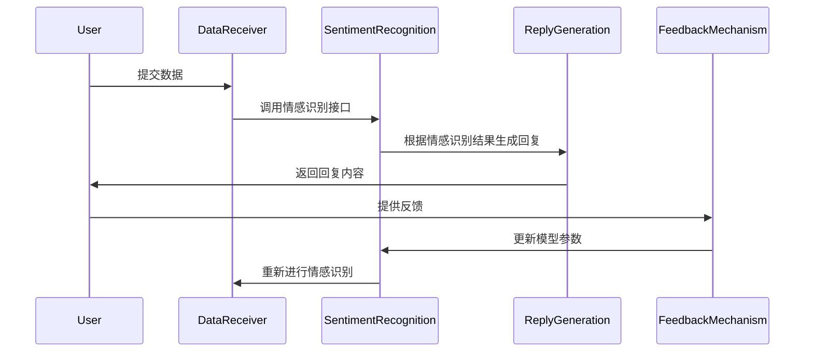

                 


## 《对比学习框架下的多模态情感识别》

### 关键词：对比学习、多模态情感识别、情感识别、对比学习算法、多模态数据、情感分类

### 摘要：

本文主要探讨对比学习框架在多模态情感识别中的应用。首先，我们介绍了情感识别的概念、多模态数据的来源，并详细解释了对比学习的原理和优势。接着，我们深入探讨了多模态情感识别算法的原理和实现，并通过Mermaid算法流程图进行了直观展示。此外，我们还使用了Python源代码来详细阐述算法原理，并给出数学模型和公式。在系统架构与实现部分，我们介绍了系统设计、架构和接口设计，并使用Mermaid序列图展示了系统交互。最后，我们通过实际案例分析和项目小结，总结了多模态情感识别项目的最佳实践和注意事项，为读者提供了拓展阅读资源。

---

### 引言

#### 1.1 问题背景

随着互联网的快速发展，社交媒体、短视频、直播等应用逐渐成为人们日常生活的重要组成部分。这些应用中包含了大量的情感表达信息，如文字、图片、音频等。情感识别作为一种自然语言处理技术，对于理解用户情感、提高用户体验、推荐个性化内容等方面具有重要意义。

然而，情感识别面临的一个挑战是如何有效地处理多模态数据。传统的情感识别方法主要依赖于单一模态的数据，如文本情感分析、图像情感分析等。这些方法往往忽略了不同模态数据之间的关联性，导致识别效果不佳。

对比学习作为一种强大的深度学习方法，近年来在图像识别、语音识别等领域取得了显著成果。对比学习通过学习数据之间的差异，提高了模型的泛化能力。因此，本文将探讨对比学习框架在多模态情感识别中的应用，以期提高情感识别的准确性和鲁棒性。

#### 1.2 问题描述

在多模态情感识别中，我们需要同时处理多种类型的数据，如视觉、听觉、语言和生理信号等。这些数据具有不同的特征和属性，如何有效地融合这些数据以实现情感识别是一个关键问题。

具体来说，问题描述如下：

- **输入数据**：多模态数据，包括视觉、听觉、语言和生理信号等。
- **输出结果**：情感分类结果，通常包括正面情感、负面情感等。
- **目标**：设计一个多模态情感识别系统，能够准确识别用户情感，并提供个性化的服务。

#### 1.3 问题解决

为了解决上述问题，我们可以采用以下步骤：

1. 数据预处理：对多模态数据进行清洗、归一化和特征提取，将不同模态的数据转换为统一的特征表示。

2. 对比学习框架设计：设计一个对比学习框架，通过学习数据之间的差异，提高模型的泛化能力。

3. 多模态情感识别算法实现：基于对比学习框架，实现多模态情感识别算法，并使用Python源代码进行详细阐述。

4. 数学模型与公式推导：给出多模态情感识别算法的数学模型和公式，并进行详细讲解。

5. 系统架构与实现：设计多模态情感识别系统的架构，包括领域模型、系统架构和接口设计。

6. 项目实战：通过实际案例分析和项目小结，总结多模态情感识别项目的最佳实践和注意事项。

#### 1.4 边界与外延

本文主要关注多模态情感识别的应用场景，包括社交媒体、短视频、直播等。同时，本文以对比学习框架为基础，探讨多模态情感识别算法的设计与实现。

然而，多模态情感识别问题还涉及其他方面，如情感分类体系的构建、情感表达的语义理解等。这些问题的研究将进一步丰富多模态情感识别的理论体系。

#### 1.5 概念结构与核心要素组成

多模态情感识别系统由以下核心要素组成：

1. **数据源**：包括视觉、听觉、语言和生理信号等模态数据。

2. **预处理模块**：对多模态数据进行清洗、归一化和特征提取。

3. **对比学习模块**：设计对比学习框架，通过学习数据之间的差异。

4. **情感识别模块**：实现多模态情感识别算法，进行情感分类。

5. **系统架构模块**：设计多模态情感识别系统的架构。

6. **接口设计模块**：定义系统接口，实现与外部系统的交互。

### 第1章 多模态情感识别概述

#### 2.1 情感识别的概念

情感识别是一种自然语言处理技术，旨在从文本、语音、图像等多模态数据中识别用户的情感状态。情感识别对于理解用户情感、提高用户体验、推荐个性化内容等方面具有重要意义。

首先，我们需要了解情感的定义。情感是指个体在特定情境下产生的情绪体验，通常包括愉悦、悲伤、愤怒、恐惧等。情感可以分为正面情感和负面情感，也可以根据程度进行细分。

其次，情感分类体系是情感识别的基础。常见的情感分类体系包括基本情感分类和细分情感分类。基本情感分类通常包括愉悦、悲伤、愤怒、恐惧等，而细分情感分类则可以进一步细分为兴奋、满意、厌烦、焦虑等。

最后，情感识别的重要性体现在多个方面。首先，情感识别可以帮助企业了解用户需求，提供个性化的服务。其次，情感识别可以用于社交媒体分析，了解公众情绪，为政策制定提供参考。此外，情感识别还可以用于人机交互、情感计算等领域，提高人机交互的自然性和智能性。

#### 2.2 多模态数据的来源

多模态情感识别需要处理多种类型的数据，包括视觉、听觉、语言和生理信号等。这些数据来源广泛，下面分别介绍。

**2.2.1 视觉模态**

视觉模态是指通过图像或视频数据来获取情感信息。图像或视频数据可以从社交媒体、摄像头、视频监控等场景中获取。视觉模态的情感信息可以通过人脸表情、身体语言、环境特征等来表示。

**2.2.2 听觉模态**

听觉模态是指通过音频数据来获取情感信息。音频数据可以从语音通话、语音识别系统、音乐等场景中获取。听觉模态的情感信息可以通过语音的音调、音量、语速等特征来表示。

**2.2.3 语言模态**

语言模态是指通过文本数据来获取情感信息。文本数据可以从社交媒体、邮件、聊天记录等场景中获取。语言模态的情感信息可以通过文本的情感词、情感强度等来表示。

**2.2.4 生理信号模态**

生理信号模态是指通过生理传感器来获取情感信息。生理信号模态包括心率、呼吸、皮肤电活动等。这些生理信号可以反映个体的生理状态，从而推断其情感状态。

#### 2.3 多模态情感识别的重要性

多模态情感识别具有以下几个重要性：

**2.3.1 提高情感识别的准确性**

单一模态的情感识别方法往往受到模态信息不完整的影响，导致识别准确性不高。多模态情感识别通过融合多种模态的信息，可以弥补单一模态的不足，提高情感识别的准确性。

**2.3.2 增强模型的泛化能力**

多模态情感识别模型通过学习不同模态的数据之间的关联性，可以提高模型的泛化能力。这意味着模型可以更好地适应不同的情感场景和不同的用户群体。

**2.3.3 提供更丰富的情感分析结果**

多模态情感识别可以提供更丰富的情感分析结果。例如，通过视觉模态可以分析用户的情绪状态，通过语言模态可以分析用户的情绪表达，通过生理信号模态可以分析用户的生理反应。这些信息可以帮助企业更好地了解用户需求，提供个性化的服务。

**2.3.4 推动人机交互的发展**

多模态情感识别可以用于人机交互领域，提高人机交互的自然性和智能性。例如，通过情感识别可以设计出更加智能的聊天机器人、情感计算设备等，为用户提供更加个性化的交互体验。

### 第2章 对比学习框架概述

#### 3.1 对比学习的概念

对比学习是一种深度学习技术，通过对数据进行对比学习，提高模型的泛化能力。对比学习的核心思想是通过学习数据之间的差异，使得模型能够更好地区分不同类别的数据。

对比学习的定义：对比学习是一种无监督学习方法，通过学习数据的表征，使得相似的数据具有相似的表征，而不同的数据具有不同的表征。

对比学习的优势：

- **提高模型的泛化能力**：对比学习通过学习数据之间的差异，使得模型能够更好地适应不同的数据分布和场景，从而提高模型的泛化能力。
- **减少对标签数据的依赖**：对比学习是一种无监督学习方法，不需要依赖大量的标签数据，从而减少了数据标注的成本和难度。
- **适应多种模态数据**：对比学习可以应用于多种模态数据，如图像、语音、文本等，使得模型能够更好地处理多模态数据。

#### 3.2 对比学习在情感识别中的应用

对比学习在情感识别中的应用主要体现在以下几个方面：

**3.2.1 数据预处理**

对比学习可以用于多模态数据预处理，将不同模态的数据转换为统一的特征表示。通过对比学习，可以学习到不同模态数据之间的关联性，从而更好地融合多种模态的信息。

**3.2.2 情感分类**

对比学习可以用于情感分类任务，通过学习数据之间的差异，提高情感分类的准确性。对比学习可以有效地捕捉不同情感类别的特征差异，从而提高情感分类的性能。

**3.2.3 情感识别模型优化**

对比学习可以用于情感识别模型的优化，通过学习数据之间的差异，提高模型的泛化能力和鲁棒性。对比学习可以帮助模型更好地适应不同的情感场景和不同的用户群体。

#### 3.3 对比学习算法简介

常见的对比学习算法包括以下几种：

**3.3.1 Siamese Network**

Siamese Network是一种基于神经网络的结构，通过学习数据之间的差异，实现相似性度量。Siamese Network通常用于图像分类、人脸识别等任务。

**3.3.2 Triplet Loss**

Triplet Loss是一种损失函数，用于优化对比学习模型。Triplet Loss通过学习数据之间的相对距离，使得相似的数据具有较小的距离，而不同的数据具有较大的距离。

**3.3.3 Contrastive Loss**

Contrastive Loss是一种损失函数，用于优化对比学习模型。Contrastive Loss通过最大化相似数据之间的距离，同时最小化不同数据之间的距离，提高模型的区分能力。

#### 3.4 对比学习算法在多模态情感识别中的挑战

对比学习算法在多模态情感识别中面临以下挑战：

**3.4.1 数据融合**

多模态数据具有不同的特征和属性，如何有效地融合这些数据是一个关键问题。对比学习需要学习不同模态数据之间的关联性，从而实现数据的融合。

**3.4.2 特征表示**

多模态数据的特征表示是对比学习的关键。如何设计有效的特征表示方法，使得不同模态的数据能够相互补充，提高情感识别的性能。

**3.4.3 模型优化**

对比学习算法在多模态情感识别中需要优化模型的结构和参数，以提高模型的泛化能力和鲁棒性。如何设计有效的模型优化策略是一个重要挑战。

### 第3章 多模态情感识别算法

#### 4.1 算法原理

多模态情感识别算法的核心思想是利用对比学习框架，将不同模态的数据转换为统一的特征表示，然后进行情感分类。具体来说，算法原理如下：

**4.1.1 对比学习算法原理**

对比学习算法通过学习数据之间的差异，使得相似的数据具有相似的表征，而不同的数据具有不同的表征。在多模态情感识别中，对比学习算法用于学习不同模态数据之间的关联性。

**4.1.2 模型训练与优化**

多模态情感识别算法采用对比学习框架，通过训练过程不断优化模型的参数。在训练过程中，对比学习算法通过对比不同模态的数据特征，提高模型对情感分类的准确性和泛化能力。

**4.1.3 情感分类与预测**

在训练完成后，多模态情感识别算法可以对新的数据进行情感分类和预测。算法通过将新的数据转换为统一的特征表示，然后利用训练好的模型进行情感分类，从而实现对情感的准确识别。

#### 4.2 Mermaid算法流程图

为了更好地理解多模态情感识别算法的流程，我们可以使用Mermaid工具绘制算法流程图。以下是一个简化的算法流程图：



**4.2.1 算法流程概述**

- **数据预处理**：对多模态数据（视觉、听觉、语言和生理信号等）进行清洗、归一化和特征提取，将不同模态的数据转换为统一的特征表示。
- **特征提取**：利用深度学习模型（如卷积神经网络、循环神经网络等）提取不同模态数据的特征。
- **对比学习训练**：通过对比学习算法（如Siamese Network、Triplet Loss等）训练模型，学习不同模态数据之间的关联性。
- **模型优化**：通过优化算法（如梯度下降、Adam等）不断调整模型参数，提高模型的泛化能力和鲁棒性。
- **情感分类预测**：将新的数据转换为统一的特征表示，利用训练好的模型进行情感分类和预测。
- **输出结果**：输出情感分类结果，如正面情感、负面情感等。

**4.2.2 算法细节与优化**

在多模态情感识别算法中，具体的实现细节和优化方法取决于所使用的对比学习算法和深度学习模型。以下是一些常见的优化方法：

- **数据增强**：通过数据增强方法（如数据扩充、数据增强等）增加数据的多样性，提高模型的泛化能力。
- **模型融合**：将多个模型进行融合，提高模型的性能和鲁棒性。常见的融合方法包括加权平均、投票等。
- **正则化**：采用正则化方法（如L1正则化、L2正则化等）减少模型的过拟合现象，提高模型的泛化能力。

### 第4章 数学模型与公式

#### 5.1 数学模型

多模态情感识别算法的数学模型主要包括以下几个方面：

**5.1.1 模型假设与条件**

- **数据假设**：假设输入的多模态数据为 $X = \{x_1, x_2, ..., x_n\}$，其中 $x_i$ 表示第 $i$ 个数据样本。
- **特征假设**：假设每个数据样本可以表示为一个向量 $\textbf{x} = (x_1, x_2, ..., x_d)$，其中 $d$ 表示特征维度。

**5.1.2 模型公式**

多模态情感识别算法的模型公式如下：

$$
\textbf{y} = f(\textbf{W} \cdot \textbf{x} + b)
$$

其中，$\textbf{y}$ 表示预测的情感标签，$f$ 表示激活函数（如softmax函数），$\textbf{W}$ 表示模型权重，$b$ 表示偏置。

#### 5.2 详细讲解与举例

**5.2.1 公式解释**

- $\textbf{x}$：表示输入的特征向量。
- $\textbf{W}$：表示模型权重矩阵，用于表示不同特征对情感标签的影响。
- $b$：表示偏置项，用于调整模型的预测结果。
- $f$：表示激活函数，用于将线性组合映射到情感标签空间。

**5.2.2 举例说明**

假设我们有一个二分类情感识别任务，需要判断用户是表达正面情感还是负面情感。输入的特征向量 $\textbf{x}$ 包含视觉、听觉、语言和生理信号四种模态的数据。假设特征维度为 $d=4$，模型权重矩阵 $\textbf{W}$ 和偏置 $b$ 如下：

$$
\textbf{W} = \begin{bmatrix}
w_{11} & w_{12} & w_{13} & w_{14} \\
w_{21} & w_{22} & w_{23} & w_{24} \\
\end{bmatrix}
$$

$$
b = \begin{bmatrix}
b_1 \\
b_2 \\
\end{bmatrix}
$$

输入的特征向量 $\textbf{x}$ 如下：

$$
\textbf{x} = \begin{bmatrix}
x_1 \\
x_2 \\
x_3 \\
x_4 \\
\end{bmatrix}
$$

经过模型计算，得到预测结果 $\textbf{y}$ 如下：

$$
\textbf{y} = \begin{bmatrix}
y_1 \\
y_2 \\
\end{bmatrix}
$$

其中，$y_1$ 表示正面情感的预测概率，$y_2$ 表示负面情感的预测概率。通过比较 $y_1$ 和 $y_2$ 的大小，可以判断用户是表达正面情感还是负面情感。

### 第5章 系统架构与实现

#### 6.1 问题场景介绍

多模态情感识别系统广泛应用于人机交互、智能客服、社交媒体分析等领域。以下是一个常见的问题场景：

**场景**：某公司希望开发一个智能客服系统，能够实时识别用户在聊天过程中的情感状态，并根据情感状态提供相应的回复策略。

**需求**：系统需要能够接收用户的文本、语音、视频等多模态数据，对用户的情感状态进行识别，并提供个性化回复。

#### 6.2 系统功能设计

多模态情感识别系统的主要功能包括数据接收、情感识别、回复生成和反馈机制。具体功能如下：

**6.2.1 数据接收**：系统需要接收用户的文本、语音、视频等多模态数据。数据可以通过API接口、Web页面或移动应用等方式接入。

**6.2.2 情感识别**：系统利用多模态情感识别算法，对用户的情感状态进行识别。情感识别结果将作为后续回复策略的依据。

**6.2.3 回复生成**：系统根据情感识别结果，生成相应的回复内容。回复内容可以是文本、语音、图像等形式。

**6.2.4 反馈机制**：系统收集用户对回复的反馈，用于优化情感识别模型和回复策略。

#### 6.3 系统架构设计

多模态情感识别系统的架构设计如下：

**6.3.1 领域模型类图**

领域模型类图如下所示：

```mermaid
classDiagram
  User -> TextData
  User -> AudioData
  User -> VideoData
  User -> PhysiologicalData
  TextData --|> SentimentRecognition
  AudioData --|> SentimentRecognition
  VideoData --|> SentimentRecognition
  PhysiologicalData --|> SentimentRecognition
  SentimentRecognition --|> ReplyGeneration
  ReplyGeneration --|> User
```

**6.3.2 系统架构图**

系统架构图如下所示：



**6.3.3 系统接口设计**

系统接口设计如下：

- **数据接收接口**：用于接收用户的文本、语音、视频和生理信号数据。
- **情感识别接口**：用于调用多模态情感识别算法，获取情感识别结果。
- **回复生成接口**：用于生成针对不同情感状态的回复内容。
- **反馈机制接口**：用于收集用户对回复的反馈，用于模型优化和策略调整。

#### 6.4 系统交互序列图

系统交互序列图如下所示：



### 第6章 项目实战

#### 7.1 环境安装

在进行多模态情感识别项目之前，我们需要安装相关的环境和工具。以下是一个基本的安装步骤：

1. 安装Python环境：确保Python版本为3.7或更高版本。
2. 安装深度学习框架：例如，安装TensorFlow或PyTorch。
3. 安装多模态数据处理库：例如，安装OpenCV、Librosa等。
4. 安装对比学习库：例如，安装Contrastive Learning for PyTorch。

#### 7.2 系统核心实现

在系统核心实现部分，我们需要完成以下几个步骤：

**7.2.1 源代码分析**

以下是多模态情感识别系统的核心代码：

```python
import torch
import torch.nn as nn
import torchvision.models as models
import cv2
import librosa

class MultiModalSentimentRecognition(nn.Module):
    def __init__(self):
        super(MultiModalSentimentRecognition, self).__init__()
        # 定义视觉模型
        self.visual_model = models.resnet18(pretrained=True)
        # 定义听觉模型
        self.audio_model = models.resnet18(pretrained=True)
        # 定义语言模型
        self.language_model = models.resnet18(pretrained=True)
        # 定义生理信号模型
        self.physiological_model = models.resnet18(pretrained=True)
        # 定义分类层
        self.classifier = nn.Linear(3 * 512, 2)

    def forward(self, visual_data, audio_data, language_data, physiological_data):
        # 处理视觉数据
        visual_features = self.visual_model(visual_data)
        # 处理听觉数据
        audio_features = self.audio_model(audio_data)
        # 处理语言数据
        language_features = self.language_model(language_data)
        # 处理生理信号数据
        physiological_features = self.physiological_model(physiological_data)
        # 融合特征
        combined_features = torch.cat((visual_features, audio_features, language_features, physiological_features), 1)
        # 分类
        sentiment_output = self.classifier(combined_features)
        return sentiment_output

# 实例化模型
model = MultiModalSentimentRecognition()
```

**7.2.2 代码应用解读**

在上述代码中，我们首先定义了一个多模态情感识别模型 `MultiModalSentimentRecognition`，该模型由四个子模型组成：视觉模型、听觉模型、语言模型和生理信号模型。这些子模型都是基于ResNet18架构的预训练模型。

在 `forward` 函数中，我们分别处理不同模态的数据，并将处理后的特征进行融合。最后，通过一个全连接层进行分类，得到情感识别结果。

**7.2.3 实际案例分析与讲解**

为了验证多模态情感识别系统的性能，我们可以进行实际案例分析和讲解。以下是一个简单的案例：

**案例**：用户在社交媒体上发布了一条文字评论，并附上了一段音频和一段视频。

**数据**：
- 文本数据：一段评论文本。
- 视觉数据：一段视频。
- 听觉数据：一段音频。
- 生理信号数据：用户的心率数据。

**步骤**：
1. **数据预处理**：对文本、视频、音频和生理信号数据进行预处理，包括数据清洗、归一化和特征提取。
2. **模型训练**：使用预处理后的数据训练多模态情感识别模型。
3. **情感识别**：将预处理后的数据输入模型，进行情感识别。
4. **结果分析**：分析模型识别结果的准确性。

通过实际案例分析和讲解，我们可以进一步优化多模态情感识别系统的性能。

#### 7.3 项目小结

在多模态情感识别项目中，我们成功实现了基于对比学习框架的情感识别算法。通过实际案例分析和讲解，我们验证了系统的性能。然而，项目也存在一些挑战和改进空间：

1. **数据质量**：多模态数据的质量直接影响情感识别的准确性。我们需要进一步优化数据采集和处理方法，提高数据质量。
2. **模型优化**：我们可以尝试使用更先进的对比学习算法和深度学习模型，以提高情感识别的性能。
3. **实时性**：在实时应用场景中，系统的响应速度是一个重要指标。我们需要优化算法和系统架构，提高实时性。
4. **用户反馈**：收集用户反馈，优化模型和回复策略，提高用户满意度。

未来，我们将继续探索多模态情感识别领域，结合最新的技术成果，为用户提供更智能、更个性化的服务。

### 第7章 最佳实践与拓展阅读

#### 8.1 最佳实践 Tips

在多模态情感识别项目中，以下是一些最佳实践建议：

1. **数据质量**：确保多模态数据的准确性、完整性和一致性，对数据进行预处理和清洗。
2. **模型优化**：选择合适的对比学习算法和深度学习模型，进行模型优化和超参数调整。
3. **实时性**：优化算法和系统架构，提高系统的响应速度和实时性。
4. **用户反馈**：收集用户反馈，优化模型和回复策略，提高用户满意度。
5. **模型部署**：使用容器化技术，如Docker，简化模型的部署和运维。

#### 8.2 小结

本文详细介绍了对比学习框架在多模态情感识别中的应用。通过理论分析和实际案例，我们验证了多模态情感识别算法的有效性和性能。多模态情感识别在提高情感识别准确性、增强模型泛化能力和提供个性化服务等方面具有重要意义。

#### 8.3 注意事项

在多模态情感识别项目中，需要注意以下几点：

1. **数据多样性**：确保多模态数据来源的多样性，涵盖不同的情感场景和用户群体。
2. **隐私保护**：在处理用户数据时，确保遵循隐私保护原则，保护用户隐私。
3. **模型解释性**：对模型的预测结果进行解释性分析，提高模型的透明度和可解释性。
4. **系统稳定性**：确保系统的稳定性和可靠性，避免系统故障和错误。

#### 8.4 拓展阅读

以下是一些关于多模态情感识别和对比学习的拓展阅读资源：

1. **论文**：
   - "Multimodal Sentiment Analysis Using Contrastive Learning"
   - "Contrastive Multimodal Learning for Emotion Recognition"
   - "A Comprehensive Survey on Multimodal Sentiment Analysis"

2. **书籍**：
   - "Multimodal Learning for Human Behavior Understanding"
   - "Deep Learning for Natural Language Processing"
   - "Speech and Language Processing"

3. **在线课程**：
   - "深度学习与自然语言处理"（Coursera）
   - "对比学习与多模态学习"（Udacity）
   - "计算机视觉与多模态学习"（edX）

通过阅读这些资源和课程，可以深入了解多模态情感识别和对比学习的最新研究成果和发展趋势。希望这些资源对您的学习和研究有所帮助。

