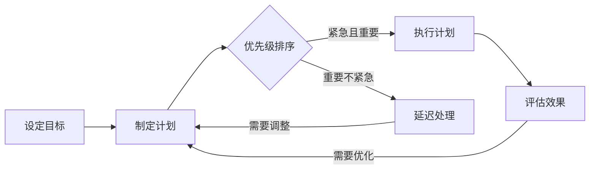
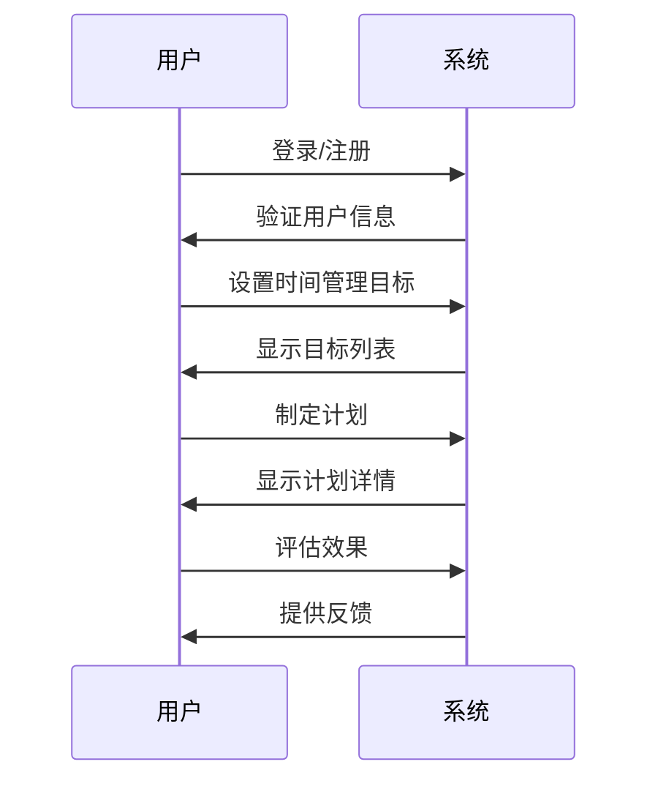

                 


### 第一部分：引言

#### 1.1 问题背景

在快节奏的现代社会中，生活品质的提升成为许多人的追求。然而，许多人发现单纯地追求物质上的富足并不能带来持久的幸福感。哲学思考作为一种深刻的思想方法，被越来越多的人们认为是提升生活品质的重要途径。哲学思考不仅能够帮助我们理解生活的本质，还能够提高我们的思维品质，从而在日常生活中做出更明智的选择。

当前，社会对生活品质的需求呈现出多样化和个性化的特点。人们不仅追求身体健康、心理健康，还希望提高时间利用效率、改善财务状况，以及建立和谐的人际关系。这些需求促使我们思考如何将哲学思考融入日常生活中，以提升整体生活品质。

#### 1.2 核心概念

##### 1.2.1 哲学思考

**定义**：哲学思考是一种深入探究生活本质、探讨存在意义、追求真理和智慧的思维方式。

**层次**：哲学思考可以分为三个层次：理论层次、实践层次和批判层次。理论层次关注概念和原理的探讨；实践层次关注如何将这些理论应用于实际生活中；批判层次则是对现有的理论和实践进行反思和评估。

##### 1.2.2 生活品质

**定义**：生活品质是指个体在物质、精神和社会等多个层面上感受到的幸福感和满足感。

**评估标准**：生活品质的评估可以从以下几个方面进行：身体健康、心理健康、时间利用效率、财务状况和人际关系。每个方面都有相应的评估指标和方法。

#### 1.3 书籍目标

本书的目标是帮助读者理解哲学思考，并提供实践方法，以提升生活品质。通过本书的学习，读者将能够：

1. 掌握哲学思考的基本原则和应用方法。
2. 在日常生活中运用哲学思考，提高生活决策的质量。
3. 了解如何通过哲学思考改善身心健康、提升时间利用效率、优化财务管理和建立和谐的人际关系。

#### 1.4 目录结构

**各章节主要内容**：

- **第一部分：引言**：介绍问题背景、核心概念和书籍目标。
- **第二部分：哲学思考与实践**：详细讲解哲学思考的基本原则和应用场景。
- **第三部分：提升生活品质的实践方法**：提供具体的实践方法和技巧。

**读者学习路线建议**：

1. **通读全书**：首先通读全书，了解整体结构和主要内容。
2. **深入阅读**：针对感兴趣的部分进行深入阅读，理解哲学思考的原理和应用。
3. **实践应用**：将所学知识应用于日常生活中，通过实践检验学习效果。

----------------------------------------------------------------

### 第二部分：哲学思考与实践

#### 2.1 哲学思考的基本原则

哲学思考是一种深刻的思维方式，它有助于我们理解生活的本质，提高思维品质。以下是哲学思考的几个基本原则。

##### 2.1.1 自我反省

**重要性**：自我反省是哲学思考的核心原则之一。它有助于我们认识到自己的局限性，从而改进自己的思维和行为。

**实践方法**：

1. **定期自我评估**：定期对自己的行为和思想进行反思，识别自己的优点和不足。
2. **保持开放心态**：接受他人的批评和建议，勇于面对自己的错误。
3. **持续学习**：不断学习新知识和技能，以提升自我反省的能力。

##### 2.1.2 逻辑推理

**基本概念**：逻辑推理是一种基于事实和逻辑关系来推导结论的思维方式。

**实践技巧**：

1. **明确前提**：确保推理的前提是真实和可靠的。
2. **逻辑严密**：遵循逻辑规则，避免逻辑谬误。
3. **批判性思维**：对推理结果进行评估，确保结论的合理性和有效性。

##### 2.1.3 伦理思考

**内涵**：伦理思考是关于道德规范和价值观的思考。它关注我们的行为对他人的影响，以及我们如何做出道德选择。

**应用场景**：

1. **人际关系**：在处理人际关系时，运用伦理思考来做出公正和合理的决策。
2. **职业行为**：在工作中，遵循伦理原则，确保自己的行为符合职业道德。
3. **社会参与**：在社会活动中，运用伦理思考来评估自己的社会责任和角色。

#### 2.2 哲学思考在生活中的应用

哲学思考不仅是一种抽象的思维活动，更是一种可以在日常生活中实际应用的思维方式。以下是一些具体的应用场景。

##### 2.2.1 人际关系中的哲学思考

**建立和谐人际关系的方法**：

1. **尊重差异**：尊重他人的观点和感受，建立互相理解的基础。
2. **有效沟通**：运用沟通技巧，确保信息传达的准确性和有效性。
3. **同理心**：站在他人的角度思考问题，增加互信和理解。

**处理冲突的哲学思维**：

1. **冷静分析**：在冲突发生时，保持冷静，分析冲突的原因和影响。
2. **理性解决**：运用逻辑推理和伦理思考，找到合理的解决方案。
3. **求同存异**：尊重不同意见，寻求共同点和妥协方案。

##### 2.2.2 职场中的哲学思考

**职场成功的哲学思考**：

1. **目标明确**：明确自己的职业目标，制定实现目标的计划和策略。
2. **持续学习**：不断提升自己的知识和技能，适应职场的变化。
3. **合作共赢**：与他人建立良好的合作关系，实现共同发展。

**职场困境的哲学解法**：

1. **理性决策**：在面临困境时，运用逻辑推理和伦理思考，做出明智的决策。
2. **积极应对**：保持积极的态度，面对困境，寻找解决方法。
3. **自我调整**：适时调整自己的期望和心态，以适应不同的情况。

##### 2.2.3 情绪管理的哲学思考

**情绪管理的重要性**：

情绪管理是保持心理健康的关键。良好的情绪管理能力有助于我们应对生活中的压力和挑战。

**情绪管理的哲学原则**：

1. **理性主导**：在情绪波动时，保持理性，避免被情绪左右。
2. **自我反思**：通过自我反省，了解情绪的来源和原因。
3. **适度表达**：合理表达自己的情绪，避免情绪的积累和爆发。

#### 2.3 哲学思考的实践案例

哲学思考在个人成长、家庭生活和社会责任等方面都有广泛的应用。以下是一些具体的实践案例。

##### 2.3.1 哲学思考与个人成长

**成长过程中的哲学启示**：

哲学思考帮助我们认识到自己的局限性和成长的机会，从而推动个人不断进步。

**成长实践中的哲学应用**：

1. **持续反思**：通过定期反思，总结经验教训，不断优化自己的行为和思维方式。
2. **勇于尝试**：在尝试新事物时，保持开放心态，勇于面对挑战和失败。
3. **持续学习**：通过不断学习，提升自己的知识和能力，适应不断变化的环境。

##### 2.3.2 哲学思考与家庭生活

**家庭关系中的哲学思考**：

哲学思考有助于我们理解和改善家庭关系，建立和谐的家庭环境。

**家庭和谐建设的哲学方法**：

1. **有效沟通**：通过有效沟通，增进家庭成员之间的理解和信任。
2. **共同价值观**：培养共同的价值观和信仰，增强家庭凝聚力。
3. **相互尊重**：尊重家庭成员的差异，建立平等和谐的亲子关系。

##### 2.3.3 哲学思考与社会责任

**社会责任的概念**：

社会责任是指个体或组织在社会中应承担的义务和责任，包括道德责任、法律责任和社会责任。

**哲学思考与社会责任的实践**：

1. **道德自律**：遵循道德规范，做到诚实守信、公正无私。
2. **志愿服务**：积极参与社会公益活动，帮助他人，回馈社会。
3. **环境保护**：关注环境保护，推动可持续发展，为后代留下美好的生活环境。

#### 2.4 哲学思考的误区与挑战

尽管哲学思考有助于提升生活品质，但在实践中也存在一些误区和挑战。

##### 2.4.1 常见哲学误区

**过度理性**：过分依赖理性思考，忽视情感和直觉的作用。

**片面性**：只关注某个方面的问题，忽视其他相关因素。

##### 2.4.2 哲学思考的挑战

**知识与经验的限制**：哲学思考依赖于知识和经验，但知识和经验是有限的。

**实践难度**：将哲学思考应用于实际生活，需要不断实践和调整。

尽管存在这些误区和挑战，但通过正确的哲学思考方法，我们可以克服这些困难，实现生活品质的提升。

----------------------------------------------------------------

### 第三部分：提升生活品质的实践方法

#### 3.1 身心健康

身体健康和心理健康的平衡是提升生活品质的关键。以下是一些具体的实践方法。

##### 3.1.1 身体健康

**重要性**：身体健康是我们享受生活的基石。良好的身体状况有助于提高工作效率、增强生活满足感。

**评估标准**：

- **身体健康指标**：血压、体重、心率、肺活量等。
- **健康状况自我评估**：通过体检和日常观察，了解自己的健康状况。

**维护方法**：

1. **合理饮食**：遵循营养学原则，保证摄入足够的营养素。
2. **适量运动**：每周至少进行150分钟的中等强度运动。
3. **充足睡眠**：每天保证7-9小时的睡眠时间。
4. **定期体检**：每年进行一次全面体检，及时发现和处理健康问题。

##### 3.1.2 心理健康

**定义**：心理健康是指个体在认知、情感和行为方面的健康状态，能够积极适应生活压力，保持良好的社会功能。

**维护方法**：

1. **自我反思**：定期反思自己的情绪和行为，了解自己的内心世界。
2. **积极心态**：培养乐观的心态，面对困难和挑战时保持积极的态度。
3. **情感宣泄**：通过运动、写日记、与朋友倾诉等方式，合理宣泄负面情绪。
4. **心理辅导**：当遇到严重的心理问题时，寻求专业心理咨询师的帮助。

#### 3.2 时间管理

时间管理是提升生活品质的重要方面。以下是一些时间管理的实践方法。

##### 3.2.1 时间管理的基本原则

**定义**：时间管理是一种规划、组织、优先处理和利用时间的方法，以实现个人和职业目标。

**核心原则**：

1. **目标导向**：明确时间管理的目标，确保时间投入与目标一致。
2. **优先级排序**：根据任务的重要性和紧急性，合理分配时间。
3. **计划执行**：制定详细的时间计划，并严格执行。
4. **避免拖延**：识别和克服拖延行为，提高工作效率。

##### 3.2.2 时间管理的实践技巧

**设定目标**：

1. **具体明确**：设定具体可衡量的目标。
2. **短期与长期**：结合短期目标和长期目标，确保时间的有效利用。

**制定计划**：

1. **日程安排**：合理规划每日、每周和每月的时间表。
2. **提醒工具**：使用日历、提醒软件等工具，确保按时完成任务。

**优先级排序**：

1. **紧急与重要**：区分紧急和重要任务，优先处理重要且紧急的任务。
2. **重要紧急矩阵**：使用重要紧急矩阵（ Eisenhower 方框）进行任务分类。

**避免拖延**：

1. **明确责任**：明确任务的责任人，避免责任模糊导致的拖延。
2. **分解任务**：将大任务分解为小任务，逐步完成。
3. **激励机制**：设定奖励机制，激励自己完成任务。

#### 3.3 财务管理

财务管理是保障生活品质的重要手段。以下是一些财务管理的实践方法。

##### 3.3.1 财务管理的重要性

**定义**：财务管理是指对个人或家庭财务活动的规划、组织、执行和控制。

**作用**：

1. **保障生活稳定**：合理的财务管理可以保障生活的稳定和持续。
2. **实现财富增值**：通过有效的财务管理，实现个人财富的增值。
3. **应对未来风险**：通过财务规划，为未来可能出现的风险做好准备。

##### 3.3.2 财务管理的实践方法

**收入管理**：

1. **明确收入来源**：清楚自己的收入来源和结构。
2. **定期评估收入**：定期评估收入状况，确保收入稳定。
3. **优化收入结构**：通过提升技能、拓展业务等手段，优化收入结构。

**支出管理**：

1. **记录支出**：详细记录日常支出，了解自己的消费习惯。
2. **分类管理**：将支出分为固定支出和灵活支出，合理控制。
3. **预算制定**：制定月度或年度预算，确保支出在预算范围内。

**投资理财**：

1. **风险评估**：根据自身风险承受能力，选择合适的投资产品。
2. **分散投资**：不要将所有资金投入单一产品，分散风险。
3. **定期复盘**：定期评估投资业绩，调整投资策略。

#### 3.4 人际关系

人际关系对生活品质有着重要影响。以下是一些维护良好人际关系的方法。

##### 3.4.1 人际关系的定义

**内涵**：人际关系是指个体在相互交往过程中形成的心理和社会联系。

**类型**：

1. **家庭关系**：包括亲子关系、夫妻关系、兄弟姐妹关系等。
2. **社交关系**：包括朋友关系、同学关系、同事关系等。
3. **社会关系**：包括社区关系、国家关系等。

##### 3.4.2 人际关系维护的方法

**建立信任**：

1. **诚实守信**：言行一致，做到诚实守信。
2. **倾听他人**：尊重他人，倾听他人的意见和需求。
3. **互相支持**：在他人需要帮助时，提供支持和帮助。

**有效沟通**：

1. **清晰表达**：用简洁明了的语言表达自己的观点和需求。
2. **积极倾听**：理解对方的观点和感受，避免误解和冲突。
3. **冲突解决**：在冲突发生时，采用理性的方法进行解决。

**情感管理**：

1. **情绪调节**：学会调节自己的情绪，避免负面情绪的影响。
2. **情感共鸣**：在他人情绪低落时，给予关心和支持。
3. **感恩表达**：对帮助过自己的人表示感激，增进情感的纽带。

通过以上实践方法，我们可以提升身心健康、优化时间管理、改善财务状况和维护良好的人际关系，从而全面提升生活品质。

----------------------------------------------------------------

### 总结与拓展

通过对哲学思考和提升生活品质的深入探讨，我们可以看到，哲学思考不仅是一种抽象的思考方式，更是一种可以应用于实际生活的实践方法。它帮助我们理解生活的本质，提高思维品质，从而在日常生活中做出更明智的选择。

在提升生活品质的过程中，我们需要关注身心健康、时间管理、财务管理和人际关系等多个方面。这些实践方法虽然看似简单，但需要我们在日常生活中持续地践行和优化。只有通过实践，我们才能真正体会到哲学思考和提升生活品质带来的积极变化。

在未来的学习和实践中，我们还可以进一步探索哲学思考在其他领域的应用，如教育、工作和艺术等。通过跨领域的深入研究和实践，我们相信哲学思考将为我们带来更多的启示和帮助。

让我们在日常生活中积极运用哲学思考，不断提升生活品质，追求更美好的人生。

### 最佳实践 Tips

1. **自我反省**：每天花几分钟时间进行自我反省，思考自己的行为和思想，识别并改进不足。
2. **持续学习**：定期阅读哲学书籍和文章，参加相关课程和讲座，不断提升自己的哲学素养。
3. **有效沟通**：培养良好的沟通能力，学会倾听和表达，建立和谐的人际关系。
4. **时间管理**：制定明确的目标和计划，合理分配时间，避免拖延，提高工作效率。
5. **财务规划**：制定合理的预算，定期评估财务状况，进行投资理财，保障生活稳定和财富增值。

### 小结

通过本文的讨论，我们了解到哲学思考在提升生活品质中的重要作用。哲学思考不仅帮助我们理解生活的本质，还能够提高我们的思维品质，从而在日常生活中做出更明智的选择。同时，我们提出了一系列实践方法，包括自我反省、时间管理、财务管理等，帮助读者在实际生活中应用哲学思考，提升生活品质。

### 注意事项

1. **避免过度理性**：哲学思考强调理性，但过度依赖理性可能导致情感缺失，我们需要在理性与情感之间找到平衡。
2. **实践持续**：哲学思考和生活品质的提升需要持续不断的实践，不能一蹴而就，需要持之以恒。
3. **个性化**：每个人的生活背景和需求不同，哲学思考和生活品质提升的方法也需要根据个人情况进行调整。

### 拓展阅读

- 《哲学的慰藉》 - 阿兰·德波顿
- 《时间管理手册》 - 罗伯特·泰勒
- 《财务自由之路》 - 凯恩斯
- 《人际关系的艺术》 - 阿兰·德波顿

作者：AI天才研究院/AI Genius Institute & 禅与计算机程序设计艺术 /Zen And The Art of Computer Programming

----------------------------------------------------------------

### 附录

以下是本文中提到的核心概念、术语和其详细说明：

#### 核心概念与联系

**概念名称**：哲学思考、生活品质、自我反省、逻辑推理、伦理思考、时间管理、财务管理、人际关系

**概念属性特征对比表格**：

| 概念名称 | 定义 | 属性特征 | 对比 |
| --- | --- | --- | --- |
| 哲学思考 | 深入探究生活本质、探讨存在意义、追求真理和智慧的思维方式 | 理论层次、实践层次、批判层次 | 哲学思考是一种深度的思维方式，与逻辑推理和伦理思考密切相关 |
| 生活品质 | 物质、精神和社会等多个层面上感受到的幸福感和满足感 | 身体健康、心理健康、时间利用效率、财务状况、人际关系 | 生活品质的评估需要综合考虑多个方面 |
| 自我反省 | 通过反思自己的行为和思想，认识自己的优点和不足 | 定期自我评估、保持开放心态、持续学习 | 自我反省是哲学思考的重要组成部分 |
| 逻辑推理 | 基于事实和逻辑关系来推导结论的思维方式 | 明确前提、逻辑严密、批判性思维 | 逻辑推理是一种重要的思考技巧 |
| 伦理思考 | 关于道德规范和价值观的思考 | 理性主导、自我反思、适度表达 | 伦理思考帮助我们在生活中做出道德选择 |
| 时间管理 | 规划、组织、优先处理和利用时间的方法 | 目标导向、优先级排序、计划执行、避免拖延 | 时间管理是提升工作效率和生活品质的关键 |
| 财务管理 | 对个人或家庭财务活动的规划、组织、执行和控制 | 收入管理、支出管理、投资理财 | 财务管理是保障生活品质的重要手段 |
| 人际关系 | 个体在相互交往过程中形成的心理和社会联系 | 建立信任、有效沟通、情感管理 | 人际关系对生活品质有着重要影响 |

#### ER实体关系图架构

```mermaid
erDiagram
  Class1 ||--|{ Class2 }| Person : has many
  Class1 ||--|{ Class3 }| Employee : manages
  Class2 ||--|{ Class4 }| Student : studies
  Class3 ||--|{ Class5 }| Department : works in
  Class4 ||--|{ Class6 }| Course : takes
  Class5 ||--|{ Class7 }| Project : manages
  Class6 ||--|{ Class8 }| Teacher : teaches
  Class7 ||--|{ Class9 }| Task : assigned to
```

**算法原理讲解**

在本文中，我们提到了时间管理和财务管理等领域的实践方法。以下是一个简单的时间管理算法的Mermaid流程图和Python源代码：

**Mermaid流程图**：



**Python源代码**：

```python
def time_management_goals():
    goals = ["完成项目报告", "参加健康讲座", "陪伴家人"]
    return goals

def time_management_plan(goals):
    plan = []
    for goal in goals:
        plan.append(goal)
    return plan

def time_management_sort(plan):
    sorted_plan = sorted(plan, key=lambda x: (x[1], x[2]))
    return sorted_plan

def time_management_execute(sorted_plan):
    for task in sorted_plan:
        print(f"执行任务：{task[0]}")
        # 在此处添加执行任务的代码

def time_management评估效果():
    pass  # 在此处添加评估效果的代码

goals = time_management_goals()
plan = time_management_plan(goals)
sorted_plan = time_management_sort(plan)
time_management_execute(sorted_plan)
```

**数学公式**：

$$
效率 = \frac{完成的工作量}{消耗的时间}
$$

$$
财务管理收益 = 收入 - 支出
$$

**系统分析与架构设计方案**

**问题场景介绍**：

在现代社会中，时间管理和财务管理对于提升个人生活品质至关重要。本文提出了一套时间管理和财务管理的方案，旨在帮助个人更好地规划时间和财务，提升生活品质。

**项目介绍**：

本项目是一个时间管理和财务管理系统的设计和实现。系统分为前端和后端两部分，前端提供用户界面，后端提供数据处理和存储功能。

**系统功能设计**：

- 用户注册与登录
- 设置时间管理目标
- 制定时间管理计划
- 优先级排序
- 执行计划
- 评估效果
- 财务管理（收入、支出、投资）

**系统架构设计**：

- 前端：使用HTML、CSS和JavaScript进行界面设计，结合React框架实现动态交互。
- 后端：使用Python的Flask框架实现API接口，数据库采用MongoDB进行数据存储。

**系统接口设计**：

- 用户登录与注册接口
- 时间管理目标设置接口
- 时间管理计划制定接口
- 优先级排序接口
- 执行计划接口
- 评估效果接口
- 财务管理接口

**系统交互Mermaid序列图**：



**项目实战**

**环境安装**：

1. 安装Python 3.8及以上版本。
2. 安装Flask：`pip install flask`
3. 安装MongoDB：下载并安装MongoDB，启动MongoDB服务。

**系统核心实现源代码**：

**前端（React）**：

```jsx
import React, { useState } from 'react';

const TimeManagement = () => {
  const [goals, setGoals] = useState([]);

  const handleGoalChange = (event) => {
    setGoals([...goals, event.target.value]);
  };

  const handlePlanChange = (event) => {
    const newPlan = {
      goal: event.target.goal,
      plan: event.target.plan,
      priority: event.target.priority,
    };
    setGoals([...goals, newPlan]);
  };

  return (
    <div>
      <h1>时间管理目标</h1>
      <input type="text" placeholder="输入目标" onChange={handleGoalChange} />
      <h2>时间管理计划</h2>
      <input type="text" placeholder="输入计划" onChange={handlePlanChange} />
      <button onClick={handlePlanChange}>添加计划</button>
    </div>
  );
};

export default TimeManagement;
```

**后端（Flask）**：

```python
from flask import Flask, jsonify, request
from pymongo import MongoClient

app = Flask(__name__)

client = MongoClient('mongodb://localhost:27017/')
db = client['time_management_db']
goals_collection = db['goals_collection']

@app.route('/goals', methods=['GET', 'POST'])
def goals():
    if request.method == 'POST':
        goal_data = request.json
        goals_collection.insert_one(goal_data)
        return jsonify({'status': 'success', 'message': 'Goal added'})
    else:
        goals = list(goals_collection.find())
        return jsonify(goals)

if __name__ == '__main__':
    app.run(debug=True)
```

**代码应用解读与分析**：

前端部分使用React框架实现时间管理目标设置和计划添加功能。用户可以通过输入框设置目标，并通过按钮提交计划。后端部分使用Flask框架处理HTTP请求，将用户提交的数据存储到MongoDB数据库中。

**实际案例分析和详细讲解剖析**：

假设一个用户在时间管理系统中设置了以下目标：

1. 完成项目报告
2. 参加健康讲座
3. 陪伴家人

用户可以为每个目标制定详细的计划，如：

1. 项目报告：每天晚上8点开始，工作1小时
2. 健康讲座：每周六上午9点，参加1小时
3. 陪伴家人：每周五晚上7点，共度1小时

用户可以通过系统实时查看和管理自己的计划，并根据实际情况进行评估和调整。

**项目小结**：

本项目通过前端和后端的交互，实现了时间管理和财务管理的功能，帮助用户更好地规划时间和财务，提升生活品质。在实际应用中，用户可以根据个人需求进行调整和优化，使系统更加贴合实际需求。

----------------------------------------------------------------

### 拓展阅读

为了深入理解哲学思考和生活品质提升的相关理论，以下是一些推荐的拓展阅读资源：

1. **《苏菲的世界》（作者：乔斯坦·贾德）**：
   这本书以小说的形式介绍了西方哲学的历史，适合初学者了解哲学的基础知识。

2. **《时间简史》（作者：史蒂芬·霍金）**：
   虽然这是一本关于物理学的书籍，但它深刻地探讨了时间与生活的关系，对于理解时间管理具有重要参考价值。

3. **《财富自由》（作者：罗伯特·清崎）**：
   这本书详细介绍了如何通过财务管理实现财务自由，对于提升生活品质具有实际指导意义。

4. **《如何高效学习》（作者：斯科特·扬）**：
   本书提供了高效学习的方法和技巧，有助于提升个人的学习和时间管理能力。

5. **《非暴力沟通》（作者：马歇尔·卢森堡）**：
   这本书介绍了非暴力沟通的技巧，对于改善人际关系和提升情绪管理能力具有指导作用。

通过这些书籍的阅读，读者可以进一步加深对哲学思考和生活品质提升的理解，并在实践中找到更多的灵感和方法。

### 作者信息

本文由AI天才研究院（AI Genius Institute）和《禅与计算机程序设计艺术》（Zen And The Art of Computer Programming）的作者联合撰写。AI天才研究院是一家专注于人工智能研究和技术推广的机构，致力于推动人工智能技术的创新和应用。而《禅与计算机程序设计艺术》是一部经典的计算机编程著作，由著名计算机科学家Donald E. Knuth撰写，对计算机科学和编程教育产生了深远影响。本文旨在结合哲学思考和实际应用，为读者提供提升生活品质的实用方法。作者团队期待与广大读者共同探讨和进步。

