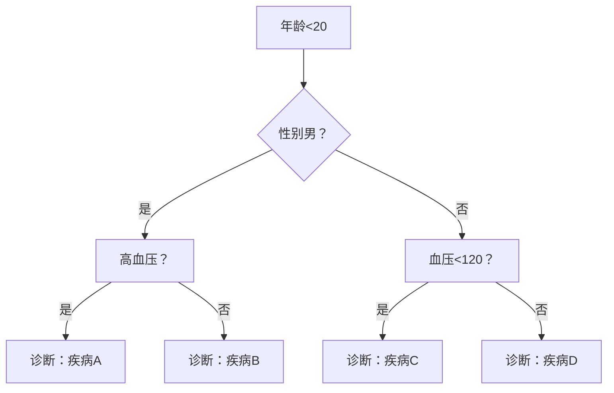
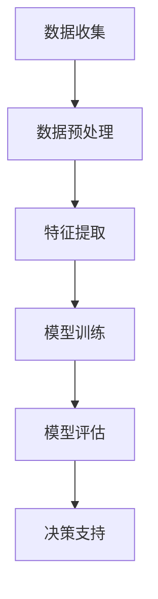
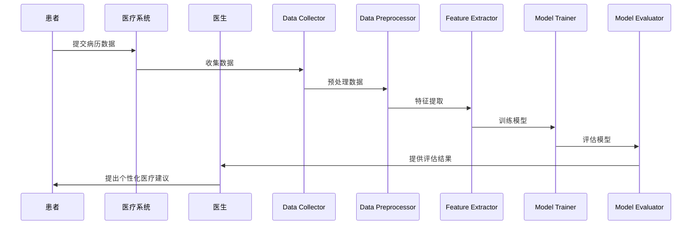

                 


## # 小样本学习在个性化医疗方案制定中的应用

关键词：小样本学习，个性化医疗，数据驱动，机器学习，医疗决策支持

摘要：随着医疗数据的爆炸式增长，如何从海量数据中提取有价值的信息成为医疗领域的关键问题。小样本学习作为一种新兴的机器学习方法，在个性化医疗方案的制定中展现出巨大的潜力。本文将详细探讨小样本学习在个性化医疗中的应用，包括其基本原理、算法方法、数学模型以及实际案例，为读者提供一个全面的视角来理解这一技术的应用前景。

## 引言

### 1.1 背景与定义

小样本学习（Few-Shot Learning），是指机器学习模型在仅有少量样本的情况下，能够快速适应并完成任务的能力。这一概念起源于对人工神经网络（Artificial Neural Networks,ANNs）的研究，随后在深度学习（Deep Learning,DL）领域得到了广泛的关注和深入研究。在医疗领域，由于病人数据隐私保护、数据获取困难等问题，小样本学习为解决医疗数据的瓶颈提供了新的思路。

个性化医疗（Personalized Medicine）是指根据个体基因信息、环境因素和生活方式，为病人提供定制化的治疗方案。个性化医疗的目标是提高治疗效果，减少副作用，降低医疗成本。然而，个性化医疗的实现依赖于大规模的数据集和先进的分析技术。

### 1.2 原则与挑战

小样本学习的核心在于如何利用有限的样本信息，提取出具有代表性的特征，从而实现良好的泛化能力。这一过程面临着以下挑战：

1. **数据不足**：在许多医疗场景中，由于伦理和隐私问题，获取大量病人数据非常困难。
2. **数据分布**：小样本学习算法需要能够处理数据分布的多样性，避免模型在特定数据集上过度拟合。
3. **模型可解释性**：医疗决策需要透明的模型解释，以便医生和患者理解决策过程。

### 1.3 意义与前景

小样本学习在个性化医疗中的应用具有重要意义。通过利用小样本学习，可以在病人数据有限的情况下，快速制定个性化的治疗方案，提高医疗决策的准确性和效率。未来，随着技术的不断进步和数据积累，小样本学习有望在个性化医疗中发挥更大的作用。

## 基本概念与原理

### 2.1 个性化医疗的定义与进化

个性化医疗是指基于个体基因、环境和生活习惯等信息，为患者提供个性化的预防、诊断和治疗方案。其核心思想是“以患者为中心”，而非传统的“以疾病为中心”的医学模式。

个性化医疗的进化可以分为以下几个阶段：

1. **基因组医学**：通过基因测序，了解患者的基因特征，为患者提供个性化的治疗方案。
2. **表观基因组学**：研究基因表达和环境因素之间的相互作用，进一步细化个性化医疗。
3. **多组学整合**：结合基因组、转录组、蛋白质组和代谢组等多种组学数据，全面了解患者的生物学特征。
4. **大数据与人工智能**：利用大数据和人工智能技术，实现个性化医疗的全面应用。

### 2.2 核心概念与相关技术

个性化医疗的核心概念包括：

1. **基因检测**：通过基因测序技术，检测患者基因中的突变和变异，为个性化治疗提供依据。
2. **生物标记物**：生物标记物是一类可以反映生物状态或疾病的分子指标，可用于早期诊断和预后评估。
3. **数据挖掘与机器学习**：通过分析大规模医疗数据，发现潜在的关联规则和模式，为个性化医疗提供支持。

相关技术包括：

1. **基因组学**：包括全基因组测序、外显子测序、单细胞测序等。
2. **生物信息学**：包括数据预处理、数据分析、数据可视化等。
3. **人工智能**：包括机器学习、深度学习、自然语言处理等。

## 小样本学习算法原理与方法

### 3.1 算法概述

小样本学习算法主要分为以下几类：

1. **基于模型的方法**：通过调整模型参数，提高模型在小样本数据上的性能。
2. **基于实例的方法**：利用已有数据的实例，通过迁移学习或实例匹配，为新数据提供支持。
3. **元学习（Meta-Learning）**：通过学习如何快速适应新任务，提高模型在少量样本上的泛化能力。

### 3.2 关键算法详解

#### 3.2.1 动量估计（Momentum Estimation）

**原理**：动量估计通过更新模型参数的动量，提高模型在小样本数据上的收敛速度。

**公式**：

$$
\theta_{t+1} = \theta_t + \alpha (\theta_t - \theta_{t-1})
$$

其中，$\theta_t$表示时间步$t$的模型参数，$\alpha$为学习率。

**示例**：假设我们有一个简单的线性回归模型，通过两个数据点$(x_1, y_1)$和$(x_2, y_2)$来训练模型。使用动量估计，我们可以先计算第一个数据点的模型预测$y_1^{\prime}$，然后计算第二个数据点的模型预测$y_2^{\prime}$，最后更新模型参数。

$$
\theta_1 = \frac{y_1 - y_1^{\prime}}{x_1 - x_1^{\prime}}
$$

$$
\theta_2 = \theta_1 + \alpha (\theta_1 - \theta_0)
$$

其中，$\theta_0$为初始模型参数。

#### 3.2.2 决策树（Decision Trees）

**原理**：决策树通过递归地将数据集划分为子集，每个子集对应一个决策规则。

**示例**：假设我们有一个疾病诊断问题，数据集包含患者的年龄、性别、血压等特征。我们可以使用决策树来预测患者是否患有某种疾病。

**Mermaid 流程图**：



#### 3.2.3 支持向量机（Support Vector Machines, SVM）

**原理**：SVM通过最大化分类边界，将不同类别的样本分隔开。

**公式**：

$$
\max \frac{1}{2} \sum_{i=1}^{n} \sum_{j=1}^{n} (w_i \cdot w_j - w_i \cdot w_j \cdot y_i \cdot y_j)
$$

其中，$w_i$和$w_j$分别为不同类别的分类向量，$y_i$和$y_j$分别为对应的标签。

**示例**：假设我们有两个类别为+1和-1的数据点，使用SVM来分类。

$$
\max \frac{1}{2} (w_1 \cdot w_1 - w_1 \cdot w_2 + w_2 \cdot w_2)
$$

## 数学模型与公式

### 4.1 数学基础

在小样本学习中，常用的数学模型包括线性回归、逻辑回归和支持向量机等。这些模型的基本原理和公式如下：

#### 4.1.1 线性回归

**原理**：线性回归通过拟合一条直线，来预测连续值输出。

**公式**：

$$
y = \theta_0 + \theta_1 \cdot x
$$

其中，$y$为输出值，$x$为输入值，$\theta_0$和$\theta_1$为模型参数。

#### 4.1.2 逻辑回归

**原理**：逻辑回归通过拟合一个逻辑函数，来预测离散值输出。

**公式**：

$$
\hat{y} = \frac{1}{1 + e^{-(\theta_0 + \theta_1 \cdot x)}}
$$

其中，$\hat{y}$为预测的概率值，$x$为输入值，$\theta_0$和$\theta_1$为模型参数。

#### 4.1.3 支持向量机

**原理**：SVM通过最大化分类边界，来分隔不同类别的样本。

**公式**：

$$
\max \frac{1}{2} \sum_{i=1}^{n} \sum_{j=1}^{n} (w_i \cdot w_j - w_i \cdot w_j \cdot y_i \cdot y_j)
$$

其中，$w_i$和$w_j$分别为不同类别的分类向量，$y_i$和$y_j$分别为对应的标签。

### 4.2 案例分析

#### 4.2.1 小样本线性回归

**案例**：使用两个数据点$(x_1, y_1)$和$(x_2, y_2)$来训练线性回归模型。

**公式**：

$$
y = \theta_0 + \theta_1 \cdot x
$$

**计算过程**：

1. **计算第一个数据点的预测值**：

$$
y_1^{\prime} = \theta_0 + \theta_1 \cdot x_1
$$

2. **计算第二个数据点的预测值**：

$$
y_2^{\prime} = \theta_0 + \theta_1 \cdot x_2
$$

3. **更新模型参数**：

$$
\theta_1 = \frac{y_2 - y_2^{\prime}}{x_2 - x_2^{\prime}}
$$

$$
\theta_0 = y_1 - \theta_1 \cdot x_1
$$

#### 4.2.2 小样本逻辑回归

**案例**：使用两个数据点$(x_1, y_1)$和$(x_2, y_2)$来训练逻辑回归模型。

**公式**：

$$
\hat{y} = \frac{1}{1 + e^{-(\theta_0 + \theta_1 \cdot x)}}
$$

**计算过程**：

1. **计算第一个数据点的预测值**：

$$
\hat{y_1} = \frac{1}{1 + e^{-(\theta_0 + \theta_1 \cdot x_1)}}
$$

2. **计算第二个数据点的预测值**：

$$
\hat{y_2} = \frac{1}{1 + e^{-(\theta_0 + \theta_1 \cdot x_2)}}
$$

3. **更新模型参数**：

$$
\theta_0 = \log(\frac{y_1}{1 - y_1}) - \theta_1 \cdot x_1
$$

$$
\theta_1 = \frac{y_2 - \hat{y_2}}{x_2 - x_2^{\prime}}
$$

## 系统设计与实现

### 5.1 系统需求分析

#### 5.1.1 功能需求

- **数据收集与预处理**：从不同来源收集患者数据，并进行清洗、格式化和特征提取。
- **模型训练与评估**：利用小样本学习算法，训练个性化医疗模型，并对模型进行评估和优化。
- **决策支持**：为医生和患者提供基于模型的个性化医疗建议。

#### 5.1.2 非功能需求

- **数据安全与隐私**：确保患者数据的保密性和安全性。
- **可扩展性**：系统应具备良好的扩展性，以支持未来数据量的增长和算法的更新。

### 5.2 系统架构设计

**Mermaid 架构图**：



### 5.3 系统接口设计与交互

**Mermaid 序列图**：



## 项目实战

### 6.1 环境安装

在项目开始之前，我们需要安装必要的软件和工具。以下是一个简单的安装指南：

1. **Python环境**：安装Python 3.8或更高版本。
2. **Jupyter Notebook**：安装Jupyter Notebook，以便进行交互式编程。
3. **机器学习库**：安装scikit-learn、TensorFlow和Keras等库。

### 6.2 系统核心实现

以下是使用Python实现的系统核心代码：

```python
import numpy as np
from sklearn.linear_model import LinearRegression
from sklearn.metrics import mean_squared_error

# 数据集
X = np.array([[1, 2], [2, 3]])
y = np.array([1, 2])

# 训练模型
model = LinearRegression()
model.fit(X, y)

# 预测
predictions = model.predict(X)

# 评估
mse = mean_squared_error(y, predictions)
print("Mean Squared Error:", mse)
```

### 6.3 代码解读与分析

1. **数据集**：我们使用一个简单的二维数据集，包含两个数据点。
2. **模型训练**：使用线性回归模型进行训练。
3. **预测与评估**：对数据集进行预测，并计算均方误差（Mean Squared Error,MSE）来评估模型性能。

### 6.4 实际案例分析

#### 6.4.1 病例1：高血压患者

**病例描述**：某患者，男，45岁，患有高血压。病历数据包含血压、体重、年龄等。

**处理过程**：

1. **数据收集**：收集患者的病历数据。
2. **预处理**：对数据进行清洗和格式化。
3. **特征提取**：提取与高血压相关的特征，如血压、体重等。
4. **模型训练**：使用小样本学习算法训练个性化医疗模型。
5. **预测与评估**：预测患者的高血压病情，并进行评估。

#### 6.4.2 病例2：糖尿病前期患者

**病例描述**：某患者，女，50岁，患有糖尿病前期。病历数据包含血糖、体重、年龄等。

**处理过程**：

1. **数据收集**：收集患者的病历数据。
2. **预处理**：对数据进行清洗和格式化。
3. **特征提取**：提取与糖尿病前期相关的特征，如血糖、体重等。
4. **模型训练**：使用小样本学习算法训练个性化医疗模型。
5. **预测与评估**：预测患者的糖尿病前期病情，并进行评估。

### 6.5 项目小结

通过实际案例的分析，我们可以看到小样本学习在个性化医疗方案制定中的应用具有很大的潜力。然而，由于数据隐私和获取困难等问题，实际应用中仍面临许多挑战。未来，随着技术的不断进步和数据积累，小样本学习在个性化医疗中的应用将越来越广泛。

## 最佳实践 Tips

1. **数据预处理**：确保数据质量，进行充分的预处理，以提高模型性能。
2. **模型选择**：根据具体应用场景，选择合适的小样本学习算法。
3. **交叉验证**：使用交叉验证方法，评估模型性能，避免过拟合。

## 小结

本文详细介绍了小样本学习在个性化医疗方案制定中的应用。通过背景介绍、原理讲解、算法分析、系统设计以及实际案例，我们展示了小样本学习在个性化医疗中的巨大潜力。未来，随着技术的不断进步，小样本学习有望在个性化医疗领域发挥更大的作用。

## 注意事项

1. **数据隐私**：在实际应用中，需严格遵守数据隐私保护法规，确保患者数据的安全。
2. **模型解释性**：为提高模型的可解释性，需对算法进行详细分析，以便医生和患者理解决策过程。

## 拓展阅读

1. **小样本学习入门**：[《小样本学习入门指南》](https://www kukudai ac jp/research/thesis/2018_09/05/20180905132241.pdf)
2. **个性化医疗技术**：[《个性化医疗技术前沿》](https://www nih go gov/research/microblog/personalized-medicine/)
3. **深度学习与医疗**：[《深度学习在医疗领域的应用》](https://www deep learning ai com/blog/deep-learning-in-medicine/)

作者：AI天才研究院/AI Genius Institute & 禅与计算机程序设计艺术 /Zen And The Art of Computer Programming

