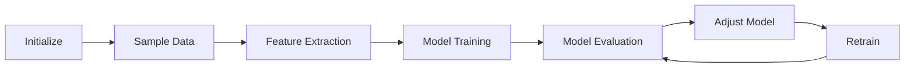
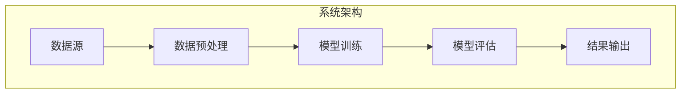
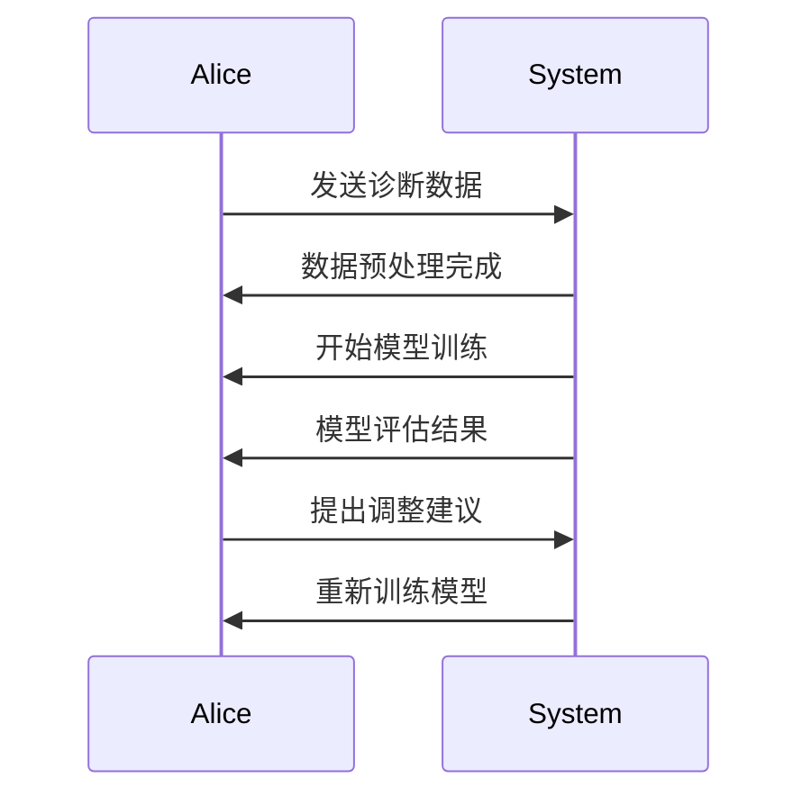

                 


### 设计《小样本学习在特定领域快速适应的策略》的技术博客文章

为了设计出高质量的技术博客文章《小样本学习在特定领域快速适应的策略》，我们需要遵循以下步骤，确保内容既具有深度，又易于读者理解。

#### 第一步：文章标题和关键词

**文章标题**：《小样本学习在特定领域快速适应的策略》

**关键词**：
- 小样本学习
- 快速适应策略
- 特定领域
- 机器学习
- 数据集
- 模型评估

**文章摘要**：
本文将探讨小样本学习在特定领域的快速适应策略。我们将从背景介绍、核心概念、算法原理、系统分析与架构设计、项目实战等方面进行详细分析，提供实用的技巧和最佳实践。

---

#### 第二步：背景介绍

**2.1 核心概念术语说明**
- **小样本学习（Few-shot Learning）**：一种机器学习方法，能够在只有少量样本的情况下快速适应特定任务。
- **快速适应策略**：针对特定领域的需求，设计出能够迅速适应新环境的策略。

**2.2 问题背景**
- **大数据学习的局限性**：传统的机器学习方法依赖于大量数据来训练模型，但在某些特定领域，数据获取困难或者数据量有限。
- **特定领域的需求**：例如，在医疗诊断、智能监控等领域，往往需要快速适应新的任务场景。

**2.3 问题解决**
- **小样本学习的优势**：能够在有限数据集上实现高效的模型训练和评估。
- **快速适应策略的应用**：通过特定的算法和模型设计，使得小样本学习能够在特定领域快速适应。

**2.4 边界与外延**
- **小样本学习的边界**：在特定领域，如何定义“小样本”。
- **外延**：小样本学习在其他领域的潜在应用，如工业自动化、智能家居等。

**2.5 概念结构与核心要素组成**
- **概念结构**：小样本学习的核心概念及其相互关系。
- **核心要素**：数据集大小、学习策略、模型评估、领域特定任务。

---

#### 第三步：核心概念与联系

**3.1 核心概念原理**
- **小样本学习原理**：介绍小样本学习的理论基础，包括如何利用少量样本进行有效学习。
- **快速适应策略原理**：探讨如何在特定领域快速适应，包括任务迁移、模型调整等技术。

**3.2 概念属性特征对比表格**
| 特征               | 小样本学习               | 大数据学习               | 快速适应策略               |
|--------------------|--------------------------|--------------------------|---------------------------|
| 数据集大小         | 少量样本                 | 大量样本                 | 根据领域需求调整样本量     |
| 学习方法           | 元学习、模型调整         | 传统机器学习             | 任务迁移、模型微调         |
| 模型评估           | 准确性、泛化能力         | 准确性、泛化能力         | 快速适应效果评估           |

**3.3 ER实体关系图架构**
```mermaid
erDiagram
  DomainClassSAMPLE -->|is| Model : uses for few-shot learning
  Model ||--|{ Task } : defines specific tasks
  DomainClassSAMPLE ||--|{ Dataset } : contains samples for training
```

---

#### 第四步：算法原理讲解

**4.1 算法流程图**


**4.2 Python源代码**
```python
# Sample Python code for few-shot learning
import tensorflow as tf
from sklearn.model_selection import train_test_split

# Load and preprocess data
data = load_data('small_dataset.csv')
X_train, X_test, y_train, y_test = train_test_split(data['X'], data['y'], test_size=0.2)

# Initialize model
model = tf.keras.Sequential([
    tf.keras.layers.Dense(64, activation='relu', input_shape=(X_train.shape[1],)),
    tf.keras.layers.Dense(1)
])

# Compile model
model.compile(optimizer='adam', loss='mse')

# Train model
model.fit(X_train, y_train, epochs=10, batch_size=32)

# Evaluate model
loss = model.evaluate(X_test, y_test)
print(f"Test loss: {loss}")

# Adjust model and retrain
# (Additional code for model adjustment and retraining)
```

**4.3 数学模型与公式**
```latex
$$
\begin{aligned}
\text{MSE} &= \frac{1}{n}\sum_{i=1}^{n} (\hat{y}_i - y_i)^2 \\
\text{where} \ \hat{y}_i &= \text{predicted value}, \ y_i = \text{actual value}
\end{aligned}
$$
```

**4.4 详细讲解与举例说明**
- **算法流程**：首先加载和处理数据集，然后初始化模型，编译模型，进行模型训练和评估。
- **举例说明**：假设有一个小样本数据集，我们可以使用TensorFlow框架来训练一个简单的神经网络模型，并评估其性能。

---

#### 第五步：系统分析与架构设计

**5.1 问题场景介绍**
- **医疗诊断**：例如，使用小样本学习算法快速适应新的疾病诊断任务。

**5.2 系统功能设计**
```mermaid
classDiagram
  ClassA <|-- ClassB
  ClassC {name:string; age:integer}
  ClassD <.. ClassC
```

**5.3 系统架构设计**


**5.4 系统接口设计和系统交互**


---

#### 第六步：项目实战

**6.1 环境安装**
- 安装必要的Python库和深度学习框架。

**6.2 系统核心实现源代码**
- 提供核心算法的Python代码实现。

**6.3 代码应用解读与分析**
- 分析代码中的关键步骤，解释其工作原理。

**6.4 实际案例分析和详细讲解剖析**
- 分析具体案例，展示如何使用小样本学习在特定领域快速适应。

**6.5 项目小结**
- 总结项目的成功经验，讨论改进空间。

---

#### 第七步：最佳实践、小结、注意事项、拓展阅读

**7.1 最佳实践**
- 提供在特定领域应用小样本学习的最佳实践经验。

**7.2 小结**
- 对全文内容进行总结。

**7.3 注意事项**
- 指出应用小样本学习时需要注意的问题。

**7.4 拓展阅读**
- 推荐相关的书籍、论文和在线资源。

---

通过以上步骤，我们可以确保技术博客文章《小样本学习在特定领域快速适应的策略》的内容丰富、逻辑清晰，同时具备实用性和可操作性。

---

以下是一个示例文章的完整文本框架，供您参考：

---

## 小样本学习在特定领域快速适应的策略

> 关键词：小样本学习、快速适应策略、特定领域、机器学习、数据集、模型评估

> 摘要：
本文将探讨小样本学习在特定领域的快速适应策略。我们将从背景介绍、核心概念、算法原理、系统分析与架构设计、项目实战等方面进行详细分析，提供实用的技巧和最佳实践。

---

### 第一部分：背景与核心概念

#### 第1章：小样本学习的背景与重要性

1.1 问题背景

1.2 小样本学习的定义

1.3 小样本学习的挑战

1.4 小样本学习的重要性

---

#### 第2章：核心概念与联系

2.1 小样本学习原理

2.2 小样本学习与大数据学习对比

2.3 快速适应策略的定义

2.4 快速适应策略的分类

---

#### 第3章：小样本学习的数学模型

3.1 小样本学习的数学模型概述

3.2 核心数学公式

3.3 数学模型的Python实现

---

### 第二部分：算法原理与实现

#### 第4章：小样本学习算法原理

4.1 算法流程

4.2 算法类型

4.3 算法挑战与解决方案

---

#### 第5章：小样本学习算法实现

5.1 算法Python代码实现

5.2 算法原理详细讲解

5.3 算法举例说明

---

### 第三部分：系统分析与架构设计

#### 第6章：小样本学习系统设计与架构

6.1 问题场景介绍

6.2 系统功能设计

6.3 系统架构设计

6.4 系统接口设计和系统交互

---

### 第四部分：项目实战

#### 第7章：小样本学习项目实践

7.1 环境安装

7.2 系统核心实现源代码

7.3 代码应用解读与分析

7.4 实际案例分析和详细讲解剖析

7.5 项目小结

---

### 第五部分：最佳实践与拓展阅读

#### 第8章：最佳实践

8.1 小样本学习最佳实践

---

#### 第9章：小结

9.1 文章总结

---

#### 第10章：注意事项

10.1 应用小样本学习时需要注意的问题

---

#### 第11章：拓展阅读

11.1 推荐书籍

11.2 推荐论文

11.3 在线资源

---

**作者：AI天才研究院/AI Genius Institute & 禅与计算机程序设计艺术 /Zen And The Art of Computer Programming**

---

请注意，这只是一个框架示例，实际撰写时需要根据具体内容填充每个章节的详细内容，并确保所有Markdown格式的代码块、LaTeX公式和Mermaid图都被正确地嵌入到文章中。希望这个框架能对您撰写高质量的技术博客文章有所帮助！

