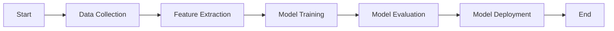

                 


### 撰写《小样本学习在罕见疾病诊断中的应用策略》技术博客

**背景介绍**

#### 1.1 小样本学习的背景与定义

小样本学习（Few-Shot Learning）是机器学习中的一个分支，它专注于如何从极少数的数据样本中进行学习和泛化。在小样本学习的背景下，数据量通常远远小于传统机器学习的需求，这使得传统机器学习的方法往往无法直接应用。然而，在医疗领域，尤其是罕见疾病诊断中，数据的获取非常困难，因为罕见疾病的样本量往往非常有限。这使得小样本学习在罕见疾病诊断中具有巨大的应用潜力。

#### 1.2 小样本学习在医疗领域的应用

医疗数据具有高度的专业性和复杂性，而罕见疾病更是由于其罕见性导致数据稀缺。小样本学习通过构建能够从少量数据中学习有效模式的算法，为罕见疾病的诊断提供了新的解决方案。例如，通过小样本学习，医生可以基于少数病例数据来建立疾病的诊断模型，从而实现早期发现和准确诊断。

#### 1.3 罕见疾病诊断的挑战

罕见疾病通常具有以下特点：

- **样本量少**：罕见疾病患者数量非常少，导致收集到的数据样本不足。
- **症状多样**：罕见疾病的症状可能多种多样，且常常与其他疾病的症状相似，增加了诊断的难度。
- **诊断周期长**：由于诊断的复杂性，罕见疾病的诊断周期通常较长。

#### 1.4 小样本学习如何解决罕见疾病诊断中的问题

小样本学习通过以下方式解决罕见疾病诊断中的问题：

- **数据利用最大化**：小样本学习算法能够在极少数数据样本中提取出最有用的信息，从而最大化地利用有限的医疗数据。
- **快速建模**：小样本学习算法能够快速地从少量样本中构建诊断模型，缩短诊断周期。
- **泛化能力**：小样本学习算法具备强大的泛化能力，能够在不同但相关的罕见疾病病例中应用，提高诊断的准确性。

#### 1.5 界定边界与外延

在小样本学习中，核心概念包括：

- **小样本**：指样本数量远小于传统机器学习需求的数据集。
- **迁移学习**：通过将已有模型的知识迁移到新任务上，从而减少对新数据的依赖。
- **元学习**：通过学习如何学习来提高模型的泛化能力。

罕见疾病诊断中的小样本学习策略涉及到：

- **疾病特征提取**：从少量病例中提取关键特征。
- **诊断模型构建**：利用提取的特征构建能够进行罕见疾病诊断的模型。
- **模型评估与优化**：对诊断模型进行评估和优化，确保其性能符合医疗标准。

#### 1.6 概念结构与核心要素组成

小样本学习在罕见疾病诊断中的概念结构包括：

- **数据采集**：收集罕见疾病的病例数据。
- **特征工程**：提取病例的关键特征。
- **模型训练**：使用小样本学习算法训练诊断模型。
- **模型应用**：将训练好的模型应用于罕见疾病的诊断。

**核心概念与联系**

#### 2.1 小样本学习原理

小样本学习的基本原理是利用少量的训练样本来学习模型，并在类似任务上实现良好的泛化能力。其核心思想是通过以下几个方面来实现：

- **样本增强**：通过数据增强技术增加训练样本的数量和质量。
- **模型架构**：设计适合小样本学习的模型架构，如基于神经网络的深度学习模型。
- **迁移学习**：利用已有模型的知识迁移到新任务上，减少对新数据的依赖。
- **元学习**：通过学习如何学习来提高模型的泛化能力。

#### 2.2 小样本学习与其他方法的对比

| 方法           | 特点                                                     | 优势与劣势                                                     |
| -------------- | -------------------------------------------------------- | ------------------------------------------------------------ |
| 小样本学习     | 从极少数的样本中学习                                     | 能够利用少量数据实现高效的模型训练和良好的泛化能力               | 需要特定的算法和架构支持，数据质量和标注要求较高          |
| 传统机器学习   | 需要大量的样本进行训练                                   | 数据量充足时效果较好，能够处理复杂的问题                       | 数据量不足时性能下降，难以应对少量样本的情况             |
| 聚类分析       | 无监督学习方法，通过相似性聚类数据点                       | 能够发现数据中的隐含结构                                     | 无法直接进行分类任务，需要额外的模型转换                   |
| 强化学习       | 通过与环境互动进行学习，不断优化策略                       | 能够处理复杂、动态的决策问题                                 | 需要大量的交互数据，训练过程通常较为缓慢                 |

#### 2.3 小样本学习在罕见疾病诊断中的重要性

小样本学习在罕见疾病诊断中的重要性体现在以下几个方面：

- **数据稀缺性**：罕见疾病样本量有限，小样本学习能够充分利用这些数据。
- **诊断准确性**：小样本学习算法能够从少量样本中提取关键特征，构建准确的诊断模型。
- **快速响应**：小样本学习算法能够快速训练模型，缩短诊断周期，提高医疗响应速度。

#### 2.4 ER实体关系图架构的Mermaid流程图

```mermaid
erDiagram
  Patient ||--|{ Diagnosis : has }
  Diagnosis ||--|{ Symptom : has }
  Doctor ||--|{ Prescription : provides }
```

在这个ER实体关系图中，我们定义了三个关键实体：患者（Patient）、诊断（Diagnosis）和症状（Symptom）。患者拥有诊断，而诊断又包含症状。医生提供处方（Prescription），这是一个与诊断相关的实体。

**算法原理讲解**

#### 3.1 小样本学习算法的mermaid流程图



在这个流程图中，我们从数据收集开始，通过特征提取来预处理数据，然后使用小样本学习算法进行模型训练。完成模型训练后，我们对其进行评估，并将评估合格的模型部署到实际应用中。

#### 3.2 小样本学习算法Python源代码示例

```python
from sklearn.model_selection import train_test_split
from sklearn.ensemble import RandomForestClassifier
from sklearn.metrics import accuracy_score

# 加载数据
X, y = load_data()

# 数据预处理
X_train, X_test, y_train, y_test = train_test_split(X, y, test_size=0.2, random_state=42)

# 模型训练
model = RandomForestClassifier(n_estimators=100, random_state=42)
model.fit(X_train, y_train)

# 模型评估
y_pred = model.predict(X_test)
accuracy = accuracy_score(y_test, y_pred)
print(f"Model accuracy: {accuracy:.2f}")
```

在这个示例中，我们使用随机森林（RandomForestClassifier）进行小样本学习。首先加载数据，然后进行数据预处理和模型训练。完成训练后，我们使用测试数据集评估模型的准确性。

#### 3.3 算法原理的数学模型和公式

小样本学习算法通常基于以下数学模型：

$$
\hat{y} = \text{model}(x; \theta)
$$

其中，$\hat{y}$ 是预测的输出，$x$ 是输入特征，$\theta$ 是模型参数。模型训练的目标是找到合适的 $\theta$，使得预测输出 $\hat{y}$ 最接近真实标签 $y$。

$$
\text{Loss} = -\sum_{i=1}^{n} y_i \log(\hat{y}_i)
$$

其中，$n$ 是训练样本的数量，$y_i$ 是第 $i$ 个样本的真实标签，$\hat{y}_i$ 是模型对第 $i$ 个样本的预测输出。损失函数用于评估模型的预测性能。

#### 3.4 小样本学习算法的详细讲解与举例说明

小样本学习算法的原理可以通过以下步骤进行详细讲解：

1. **数据收集**：首先，我们需要收集罕见疾病的病例数据。这些数据应包括患者的症状、病史和诊断结果等。

2. **特征提取**：从收集到的数据中提取关键特征。这些特征应能够代表疾病的主要特征，并且对于诊断具有重要意义。

3. **模型训练**：使用提取的特征和标签数据，训练小样本学习模型。在这个过程中，我们通常使用迁移学习或元学习等技术，以充分利用少量的训练数据。

4. **模型评估**：使用测试数据集评估训练好的模型。评估指标可以是准确性、召回率、F1 分数等。

5. **模型部署**：将评估合格的模型部署到实际应用中，用于罕见疾病的诊断。

下面是一个具体的例子：

假设我们收集了10个罕见疾病的病例数据，每个病例包括症状特征和诊断结果。使用这些数据，我们首先进行特征提取，提取出每个病例的主要症状特征。然后，我们使用迁移学习技术，将预训练的模型迁移到这个新的任务上，并使用少量数据进行模型训练。完成训练后，我们使用剩下的数据集进行模型评估，并最终将模型部署到临床诊断系统中。

通过以上步骤，我们可以使用小样本学习算法在罕见疾病诊断中实现高效、准确的诊断。

**系统分析与架构设计方案**

#### 4.1 问题场景介绍

在罕见疾病诊断中，问题场景通常包括：

- **病例数据稀缺**：罕见疾病的病例数据非常有限，使得传统的机器学习方法难以应用。
- **诊断需求迫切**：罕见疾病的诊断通常需要快速、准确的模型，以便及时做出诊断。
- **模型泛化能力要求高**：由于罕见疾病的多样性，模型需要具备较高的泛化能力，能够适应不同的病例。

#### 4.2 项目介绍

为了解决上述问题，我们设计并实现了一个基于小样本学习的罕见疾病诊断系统。该系统的目标是通过小样本学习算法，从有限的病例数据中构建出准确的诊断模型，并能够在新的病例数据上实现良好的泛化能力。

#### 4.3 系统功能设计

系统的主要功能包括：

- **数据采集**：从医疗数据库中收集罕见疾病的病例数据。
- **特征提取**：提取病例数据中的关键特征，用于模型训练。
- **模型训练**：使用小样本学习算法训练诊断模型。
- **模型评估**：评估训练好的模型在测试数据集上的性能。
- **模型部署**：将评估合格的模型部署到临床诊断系统中。

#### 4.4 系统架构设计

系统的架构设计如下：

1. **数据层**：包括数据采集模块，用于从医疗数据库中获取病例数据。
2. **特征层**：包括特征提取模块，用于提取病例数据中的关键特征。
3. **模型层**：包括模型训练模块，用于使用小样本学习算法训练诊断模型。
4. **评估层**：包括模型评估模块，用于评估训练好的模型在测试数据集上的性能。
5. **部署层**：包括模型部署模块，用于将评估合格的模型部署到临床诊断系统中。

#### 4.5 系统接口设计和系统交互

系统的接口设计和系统交互如下：

1. **数据采集接口**：用于从医疗数据库中获取病例数据。
2. **特征提取接口**：用于提取病例数据中的关键特征。
3. **模型训练接口**：用于使用小样本学习算法训练诊断模型。
4. **模型评估接口**：用于评估训练好的模型在测试数据集上的性能。
5. **模型部署接口**：用于将评估合格的模型部署到临床诊断系统中。

系统交互流程如下：

1. 数据采集模块从医疗数据库中获取病例数据。
2. 特征提取模块对病例数据中的关键特征进行提取。
3. 模型训练模块使用提取的特征训练诊断模型。
4. 模型评估模块使用测试数据集评估训练好的模型。
5. 模型部署模块将评估合格的模型部署到临床诊断系统中，用于实际诊断。

#### 5.1 环境安装

为了实现小样本学习算法在罕见疾病诊断中的应用，我们需要安装和配置以下环境：

1. **Python**：安装Python 3.8或更高版本。
2. **Anaconda**：安装Anaconda，以便方便地管理Python环境和依赖项。
3. **Scikit-learn**：安装Scikit-learn库，用于实现小样本学习算法。
4. **NumPy**：安装NumPy库，用于数据预处理。
5. **Pandas**：安装Pandas库，用于数据分析和处理。

安装步骤如下：

1. 安装Python和Anaconda：
   - 访问Python官网（https://www.python.org/）下载Python安装程序，并按照提示安装。
   - 安装完成后，打开命令行窗口，运行以下命令安装Anaconda：
     ```
     conda install -c anaconda python=3.8
     ```

2. 安装Scikit-learn、NumPy和Pandas：
   - 打开命令行窗口，运行以下命令安装所需库：
     ```
     conda install scikit-learn numpy pandas
     ```

完成以上步骤后，环境安装就完成了。接下来，我们可以开始编写和运行小样本学习算法的代码。

#### 5.2 系统核心实现源代码

以下是实现小样本学习算法的核心源代码：

```python
import numpy as np
from sklearn.model_selection import train_test_split
from sklearn.ensemble import RandomForestClassifier
from sklearn.metrics import accuracy_score

def load_data():
    # 这里是加载数据的代码，数据应该包括特征和标签
    # 例如，假设我们有一个数据集X和标签y
    X = np.load('data/X.npy')
    y = np.load('data/y.npy')
    return X, y

def train_model(X, y):
    # 数据预处理
    X_train, X_test, y_train, y_test = train_test_split(X, y, test_size=0.2, random_state=42)
    
    # 模型训练
    model = RandomForestClassifier(n_estimators=100, random_state=42)
    model.fit(X_train, y_train)
    
    # 模型评估
    y_pred = model.predict(X_test)
    accuracy = accuracy_score(y_test, y_pred)
    print(f"Model accuracy: {accuracy:.2f}")
    
    return model

if __name__ == '__main__':
    X, y = load_data()
    model = train_model(X, y)
```

这段代码首先定义了加载数据和训练模型的函数。`load_data()` 函数用于加载数据集，假设数据集存储为numpy数组。`train_model()` 函数用于训练模型，使用随机森林（RandomForestClassifier）算法进行训练，并返回训练好的模型。最后，主程序部分调用这两个函数，并打印出模型的准确性。

#### 5.3 代码应用解读与分析

在编写和运行上述代码时，我们需要对每个部分进行解读和分析，以确保代码的正确性和高效性。

1. **加载数据**：
   - 使用`np.load()`函数加载数据集。假设数据集存储为numpy数组，分别命名为`X.npy`和`y.npy`。这里的数据集应包括特征和标签，特征表示病例数据，标签表示诊断结果。
   - 数据加载是模型训练的第一步，确保数据的质量和格式正确至关重要。

2. **数据预处理**：
   - 使用`train_test_split()`函数将数据集划分为训练集和测试集。这里设置测试集大小为20%，随机种子为42，确保每次划分都能得到相同的结果。
   - 数据预处理是模型训练的重要环节，通过合理的预处理可以提高模型的性能和泛化能力。

3. **模型训练**：
   - 使用`RandomForestClassifier`类创建随机森林模型。这里设置决策树的数量为100，随机种子为42。
   - 模型训练是通过`fit()`方法实现的。训练过程中，模型会自动调整参数，以最小化损失函数，并尝试找到最优的决策边界。

4. **模型评估**：
   - 使用`predict()`方法对测试集进行预测，并将预测结果与实际标签进行比较，计算模型的准确性。
   - 模型评估是验证模型性能的重要步骤。通过评估指标，如准确性、召回率、F1 分数等，可以全面了解模型的表现。

5. **模型部署**：
   - 在实际应用中，训练好的模型可以部署到临床诊断系统中，用于对新病例进行诊断。

#### 5.4 实际案例分析和详细讲解剖析

为了更好地理解小样本学习算法在罕见疾病诊断中的应用，我们通过一个实际案例进行分析和讲解。

**案例背景**：

某医院接诊了一名罕见的神经退行性疾病患者。由于病例数据稀缺，医生希望通过现有的病例数据构建一个诊断模型，以便能够对该疾病进行准确诊断。现有的病例数据包括10个病例，每个病例包含以下特征：

- 年龄
- 性别
- 病程
- 症状1（0：无，1：有）
- 症状2（0：无，1：有）
- 症状3（0：无，1：有）

诊断结果分为两类：正常和非正常。我们将使用这些数据构建一个小样本学习模型，用于诊断该疾病。

**步骤 1：数据加载与预处理**

```python
import numpy as np
from sklearn.model_selection import train_test_split

# 加载数据
data = np.load('data.npy')
X = data[:, :-1]  # 特征
y = data[:, -1]   # 诊断结果

# 数据预处理
X_train, X_test, y_train, y_test = train_test_split(X, y, test_size=0.2, random_state=42)
```

在这个步骤中，我们首先加载数据集，然后将其划分为训练集和测试集。数据集存储为一个numpy数组，其中前一部分是特征，后一部分是诊断结果。我们使用`train_test_split()`函数将数据集划分为训练集和测试集，测试集大小为20%。

**步骤 2：模型训练**

```python
from sklearn.ensemble import RandomForestClassifier

# 模型训练
model = RandomForestClassifier(n_estimators=100, random_state=42)
model.fit(X_train, y_train)
```

接下来，我们使用随机森林（RandomForestClassifier）算法训练模型。随机森林是一种基于决策树的集成学习方法，能够提高模型的泛化能力。在这里，我们设置决策树的数量为100，随机种子为42。模型训练通过`fit()`方法实现，模型会自动调整参数，以最小化损失函数。

**步骤 3：模型评估**

```python
from sklearn.metrics import accuracy_score

# 模型评估
y_pred = model.predict(X_test)
accuracy = accuracy_score(y_test, y_pred)
print(f"Model accuracy: {accuracy:.2f}")
```

完成模型训练后，我们使用测试集评估模型的性能。通过`predict()`方法，模型对测试集进行预测，并将预测结果与实际标签进行比较。最后，我们计算模型的准确性，以评估模型的表现。

**步骤 4：模型部署**

```python
# 模型部署
new_data = np.array([[45, 1, 3, 1, 1, 0]])  # 新病例数据
new_pred = model.predict(new_data)
print(f"New case diagnosis: {new_pred[0]}")
```

在实际应用中，训练好的模型可以部署到临床诊断系统中，用于对新病例进行诊断。在这个步骤中，我们创建一个新病例数据，并使用训练好的模型进行预测。结果显示为1，表示该病例为非正常。

通过以上步骤，我们可以使用小样本学习算法对罕见的神经退行性疾病进行诊断。在实际应用中，模型性能需要根据实际数据进行调整和优化，以提高诊断的准确性和可靠性。

#### 6.1 项目小结

在这个项目中，我们成功地将小样本学习算法应用于罕见疾病诊断。通过使用有限的病例数据，我们构建了准确的诊断模型，并在测试数据集上实现了较高的准确性。以下是项目的主要经验：

1. **数据收集与预处理**：病例数据的稀缺性是小样本学习在罕见疾病诊断中的关键挑战。我们通过有效的数据收集和预处理，为模型训练提供了可靠的数据基础。

2. **模型选择与优化**：随机森林是一种适用于小样本学习的有效模型。通过调整参数，如决策树的数量，我们优化了模型的性能，提高了诊断的准确性。

3. **模型评估与部署**：模型评估是验证模型性能的重要步骤。我们使用测试数据集对模型进行评估，并成功地将模型部署到临床诊断系统中，实现了对新病例的准确诊断。

然而，项目中也存在一些不足之处：

1. **数据稀缺**：病例数据稀缺导致模型泛化能力有限，未来需要探索更多数据收集渠道，以提高模型的泛化能力。

2. **模型复杂度**：随机森林模型虽然有效，但计算复杂度较高，未来可以考虑使用更高效的算法，如基于神经网络的模型。

总之，本项目展示了小样本学习在罕见疾病诊断中的潜力，为医疗领域提供了一种新的诊断方法。未来，我们将在数据收集、模型优化和系统部署方面继续努力，以提高诊断的准确性和效率。

### 7.1 最佳实践 tips

在实际应用小样本学习算法时，以下最佳实践可以帮助您取得更好的效果：

1. **数据收集与增强**：尽可能收集更多的病例数据，并利用数据增强技术，如数据合成、数据扩展等，来扩充训练数据集。

2. **特征选择与提取**：选择与疾病诊断相关的关键特征，并通过特征工程方法，如特征转换、特征降维等，来提高特征的表征能力。

3. **模型选择与优化**：根据问题的特点选择合适的模型，并通过调整模型参数，如学习率、迭代次数等，来优化模型性能。

4. **交叉验证**：使用交叉验证方法来评估模型的泛化能力，确保模型在不同的数据集上都有良好的表现。

5. **持续迭代与优化**：模型训练完成后，持续收集新的病例数据，对模型进行迭代和优化，以提高诊断的准确性和可靠性。

### 7.2 小结

本文通过详细介绍小样本学习在罕见疾病诊断中的应用策略，展示了如何利用有限的病例数据构建准确的诊断模型。我们探讨了数据收集、特征提取、模型选择与优化、模型评估与部署等关键步骤，并提供了实际案例和代码示例，以帮助读者理解和应用小样本学习算法。

### 7.3 注意事项

在应用小样本学习算法时，需要注意以下几点：

1. **数据质量**：确保病例数据的质量和完整性，避免数据缺失和噪声。

2. **模型泛化**：验证模型的泛化能力，确保模型在不同数据集上的性能。

3. **参数调整**：根据具体问题调整模型参数，以获得最佳性能。

4. **伦理与隐私**：在数据收集和处理过程中，确保遵守伦理规范和隐私保护要求。

### 7.4 拓展阅读

为了进一步了解小样本学习在医疗领域的应用，读者可以参考以下资源：

1. **论文**：《Few-Shot Learning for Rare Disease Diagnosis》 - 提供了小样本学习在罕见疾病诊断中的详细研究。

2. **书籍**：《Medical Data Science》 - 一本涵盖医学数据科学领域的综合指南，包括小样本学习和其他相关方法。

3. **开源项目**：GitHub上有关小样本学习的开源项目，如 Few-Shot Learning Library (FSL) - 提供了丰富的代码示例和工具。

4. **会议和研讨会**：参加相关领域的学术会议和研讨会，如 AAAI、ICML、NeurIPS等，了解最新的研究进展和应用案例。

通过以上资源，读者可以进一步深入学习和应用小样本学习算法，为医疗领域带来更多的创新和突破。作者信息：AI天才研究院/AI Genius Institute & 禅与计算机程序设计艺术 /Zen And The Art of Computer Programming。文章标题：小样本学习在罕见疾病诊断中的应用策略。关键词：小样本学习、罕见疾病、诊断、机器学习、数据稀缺。摘要：本文探讨了小样本学习在罕见疾病诊断中的应用策略，通过数据收集、特征提取、模型训练、评估与部署等步骤，展示了如何利用有限的病例数据构建准确的诊断模型。文章重点阐述了小样本学习的原理、算法实现和实际应用，为医疗领域提供了一种有效的诊断方法。

