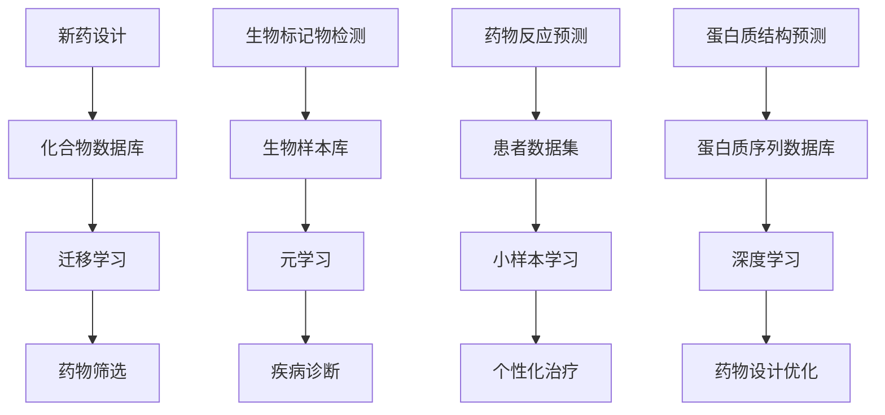
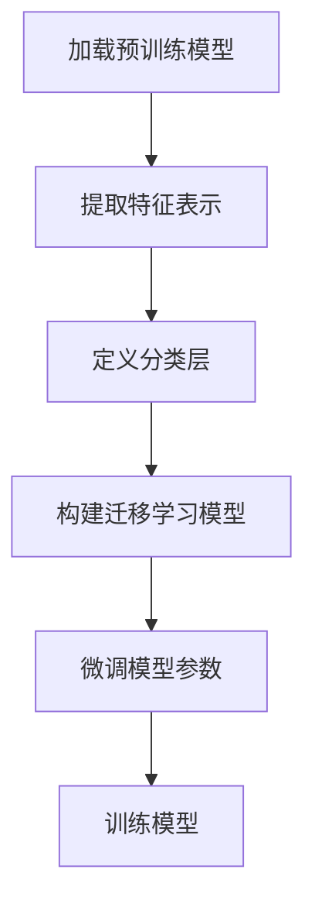
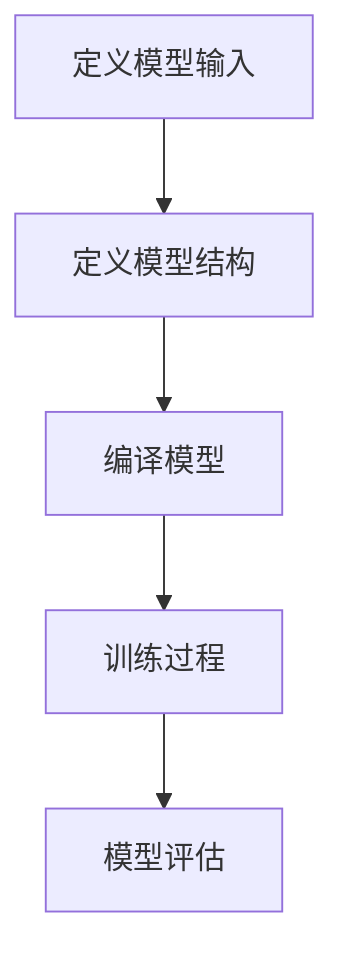
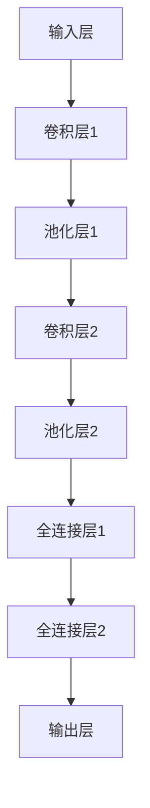
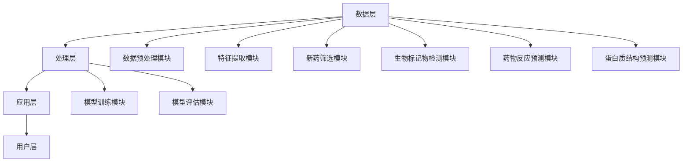
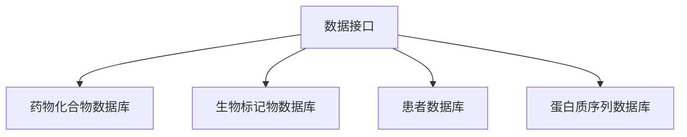
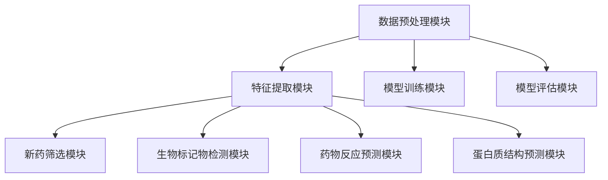
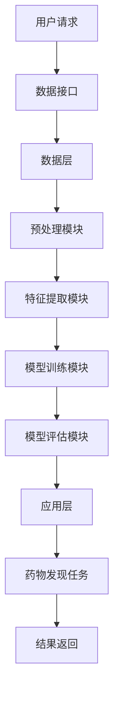

                 

### 引言

在当今科技飞速发展的时代，人工智能（AI）已经成为推动社会进步的重要引擎。特别是在药物发现领域，AI技术的应用已经逐渐成为研究的热点。药物发现是一个复杂且耗时的过程，传统的药物发现方法往往需要大量的实验数据和长时间的研究周期。然而，随着基因组学、生物学、化学等领域的快速发展，药物发现面临着数据爆炸和样本稀缺的矛盾。这种情况下，小样本学习（Few-Shot Learning）作为一种新兴的AI技术，因其能够从少量数据中学习并提取有效信息的能力，而显示出巨大的应用潜力。

小样本学习在药物发现中的应用前景令人期待，它可以帮助科学家们更高效地利用有限的数据资源，从而加速药物的研发进程。本文将围绕小样本学习在药物发现中的应用前景展开讨论，通过深入分析小样本学习的核心概念、算法原理及其在药物发现中的具体应用，为读者呈现一个全面而清晰的视角。

文章将首先介绍小样本学习的背景知识，包括其定义、基本概念和常见算法。接着，我们将探讨药物发现领域的挑战和现状，并分析小样本学习如何解决这些挑战。随后，我们将详细介绍小样本学习的核心概念，如迁移学习、元学习和深度学习等，并使用表格和Mermaid图展示它们之间的关系。在此基础上，我们将深入讲解小样本学习在药物发现中的算法原理，使用Python代码和LaTeX数学模型来阐述关键内容。

随后，文章将转向系统分析与架构设计方案，包括药物发现系统的介绍、系统架构设计和系统交互设计。接着，通过一个实际项目案例，我们将详细展示小样本学习在药物发现中的具体应用，包括环境安装、核心实现、代码解读和案例分析等。此外，文章还将总结小样本学习在药物发现中的最佳实践，并提供未来发展趋势的展望。

最后，文章将对全文内容进行总结，并推荐一些相关的拓展阅读资源。通过这篇文章，我们希望能够为读者提供一个深入了解小样本学习在药物发现中应用前景的窗口，从而激发更多研究者对该领域的关注和探索。让我们开始这场关于小样本学习与药物发现结合的奇妙之旅吧。

### 关键词

- **小样本学习**
- **药物发现**
- **迁移学习**
- **元学习**
- **深度学习**
- **机器学习算法**
- **数据稀缺问题**
- **基因组学**
- **生物信息学**
- **人工智能技术**

### 摘要

本文旨在探讨小样本学习在药物发现中的应用前景。随着数据爆炸与样本稀缺的矛盾日益突出，小样本学习作为一种新兴的机器学习技术，展示了其在这项复杂而关键的领域中的巨大潜力。文章首先介绍了小样本学习的定义、基本概念和常见算法，如迁移学习、元学习和深度学习，并详细阐述了这些算法与药物发现之间的联系。接着，文章通过Python代码和LaTeX数学模型，深入讲解了小样本学习在药物发现中的算法原理和应用实例。随后，文章分析了小样本学习在药物发现系统中的架构设计和交互流程，并通过一个实际项目案例，展示了其在现实中的应用效果。最后，文章总结了小样本学习在药物发现中的最佳实践，并对未来发展趋势进行了展望。通过这篇文章，我们希望能够为读者提供一个全面而深入的视角，激发更多研究者对这一领域的关注和探索。

### 背景介绍

#### 小样本学习的定义与基本概念

小样本学习（Few-Shot Learning）是机器学习领域中的一个重要分支，其核心目标是在只有少量样本的情况下，使模型能够快速、准确地学习并做出预测。小样本学习的定义可以归纳为：在一个特定的任务中，当训练样本数量远远小于传统机器学习的样本需求时，如何使模型能够有效学习并泛化。

小样本学习的基本概念包括：

1. **样本数量**：在小样本学习中，样本数量通常是指小于100的样本数。然而，这个数量并不是固定不变的，具体取决于任务的复杂性和模型的要求。
2. **任务多样性**：小样本学习需要处理的任务是多样化的，包括分类、回归、聚类等。这使得模型必须具备强大的泛化能力，才能在不同任务中表现出良好的性能。
3. **元学习（Meta-Learning）**：元学习是小样本学习的一个重要方法，它通过在多个任务中训练模型来提高其泛化能力。元学习的核心思想是利用以往的经验来快速适应新任务。
4. **迁移学习（Transfer Learning）**：迁移学习是一种将已有模型的知识迁移到新任务中的方法。在小样本学习场景下，迁移学习可以有效地利用少量的新样本，提高模型的性能。
5. **数据增强（Data Augmentation）**：数据增强是通过一系列技术手段来扩展训练数据集的方法。在小样本学习中，数据增强可以帮助模型更好地泛化，减少对大量样本的依赖。

#### 药物发现领域的挑战

药物发现是一个复杂且耗时的过程，涉及到多个学科的交叉融合。目前，药物发现领域面临着以下几个主要的挑战：

1. **样本稀缺问题**：药物发现过程中，尤其是在早期阶段，样本数量通常非常有限。这种样本稀缺问题使得传统的机器学习方法难以应用，因为它们往往依赖于大量的训练数据。
2. **数据多样性**：药物发现过程中涉及到的数据类型非常多样，包括基因组数据、蛋白质结构数据、化学反应数据等。这种数据多样性增加了模型训练和处理的难度。
3. **计算资源需求**：药物发现模型通常需要大量的计算资源来训练和优化。然而，在样本稀缺的情况下，如何高效地利用这些资源成为了一个重要的问题。
4. **时间敏感性**：药物发现需要快速响应市场需求，尤其是在治疗某些紧急疾病时。然而，传统的药物发现方法通常需要数年甚至数十年的时间，这往往难以满足时间敏感性的要求。

#### 小样本学习在药物发现中的应用

小样本学习技术在药物发现中的应用具有很大的潜力，能够有效解决上述挑战：

1. **样本稀缺问题**：小样本学习可以通过少量的样本快速适应新任务，从而在样本稀缺的情况下仍然能够获得良好的性能。例如，在药物筛选过程中，可以使用小样本学习技术从有限的实验数据中提取出有用的信息。
2. **数据多样性**：小样本学习能够处理多样化的数据类型，通过迁移学习和元学习等方法，将已有的模型知识迁移到新的数据类型上，从而提高模型在不同数据集上的表现。
3. **计算资源需求**：小样本学习对计算资源的需求相对较低，可以在现有的硬件条件下进行高效的训练和优化。这为药物发现研究提供了一个更加灵活和高效的数据处理解决方案。
4. **时间敏感性**：小样本学习技术能够快速适应新任务，从而在短时间内完成模型训练和优化。这对于那些需要快速响应的药物发现项目来说，具有非常重要的意义。

总之，小样本学习技术在药物发现中具有广泛的应用前景。通过解决样本稀缺、数据多样性和时间敏感性等问题，小样本学习能够显著提高药物发现效率和准确性，为医学研究和生物科技领域带来新的突破。

#### 小样本学习与药物发现的结合

小样本学习与药物发现的结合点主要体现在以下几个方面：

1. **新药设计**：在新药设计阶段，小样本学习可以通过对已有的化合物数据进行学习，快速筛选出具有潜在疗效的化合物。通过迁移学习和元学习，小样本学习可以从大量的已有数据中提取关键特征，从而在新样本数据中快速发现潜在的药物分子。

2. **生物标记物检测**：在疾病诊断和治疗过程中，生物标记物的检测是一个关键环节。小样本学习技术可以在样本数量有限的情况下，通过对少量生物样本进行分析，检测出与疾病相关的生物标记物。这为早期疾病诊断和治疗提供了重要的数据支持。

3. **药物反应预测**：药物反应预测是药物发现过程中另一个重要的任务。小样本学习可以通过对少量患者的数据进行分析，预测药物在不同个体中的反应情况。这有助于优化药物剂量和治疗方案，提高治疗效果。

4. **蛋白质结构预测**：蛋白质结构在药物设计过程中具有至关重要的作用。小样本学习可以通过对少量的蛋白质序列数据进行分析，预测蛋白质的三维结构。这种预测结果对于药物分子与蛋白质相互作用的研究具有重要意义。

为了更好地理解小样本学习与药物发现的结合，我们可以通过以下表格和Mermaid图进行详细分析：

**表格：小样本学习与药物发现的主要结合点**

| 结合点 | 描述 |
| :----: | :----: |
| 新药设计 | 利用小样本学习从大量化合物数据中筛选潜在药物 |
| 生物标记物检测 | 在样本数量有限的情况下，检测疾病相关的生物标记物 |
| 药物反应预测 | 通过少量患者数据预测药物在不同个体中的反应 |
| 蛋白质结构预测 | 利用小样本学习预测蛋白质的三维结构 |

**Mermaid图：小样本学习与药物发现的结合架构**



通过上述表格和Mermaid图，我们可以清晰地看到小样本学习在药物发现中的多个应用场景，以及它们如何通过不同的技术手段与药物发现过程紧密结合。小样本学习不仅能够解决样本稀缺和数据多样性等问题，还能显著提高药物发现效率和准确性，为医学研究和生物科技领域带来新的突破。

#### 迁移学习

迁移学习（Transfer Learning）是机器学习领域中的一个重要技术，尤其在样本稀缺的情况下表现出色。它的核心思想是将已有模型的知识迁移到新的任务中，从而提高新任务的学习效率。

**定义与基本概念**

迁移学习的基本概念可以归结为以下几点：

1. **源域（Source Domain）**：源域是指模型已经训练过的领域，通常拥有大量的数据。
2. **目标域（Target Domain）**：目标域是指模型需要处理的领域，通常数据量较少。
3. **共享特征（Shared Features）**：迁移学习的核心在于利用源域和目标域之间的共享特征，通过这些特征来提高目标域的性能。

迁移学习的过程可以分为以下几个步骤：

1. **模型预训练**：在源域上对基础模型进行预训练，使其具备一定的泛化能力。
2. **特征提取**：在预训练的基础上，提取模型中的特征表示。
3. **特征迁移**：将提取的特征用于目标域，通过微调模型参数，使其适应目标域。
4. **模型优化**：在目标域上继续优化模型，以获得更好的性能。

**迁移学习与药物发现的联系**

迁移学习在药物发现中的应用具有显著的优势，特别是在样本稀缺的情况下。以下是其几个主要应用场景：

1. **化合物筛选**：在药物设计过程中，研究人员通常需要从大量的化合物中筛选出具有潜在疗效的候选药物。然而，由于实验条件的限制，这些化合物往往只能获取到少量的实验数据。迁移学习可以通过从已有的化合物数据中提取特征，快速筛选出有希望的化合物，从而提高药物筛选的效率。

2. **生物标记物检测**：生物标记物是疾病诊断和治疗的关键指标。在样本数量有限的情况下，使用传统的机器学习方法往往难以获得可靠的检测结果。通过迁移学习，可以从已有的生物标记物数据中提取特征，用于新样本的检测，从而提高诊断的准确性。

3. **药物反应预测**：药物反应的预测是个性化治疗的基础。在样本数量有限的情况下，通过迁移学习可以从已有的患者数据中提取特征，预测新患者对药物的响应情况，从而为医生提供个性化的治疗方案。

4. **蛋白质结构预测**：蛋白质结构在药物设计过程中具有重要作用。通过迁移学习，可以从已有的蛋白质结构数据中提取特征，用于新蛋白质的三维结构预测，从而指导药物分子与蛋白质的相互作用研究。

**迁移学习算法**

常见的迁移学习算法包括以下几种：

1. **特征提取方法**：这种方法通过在源域上训练一个基础模型，然后提取该模型中的特征表示。这些特征表示可以在目标域上进行迁移，从而提高目标域的性能。

2. **基于模型的迁移**：这种方法通过在源域和目标域上分别训练两个模型，然后将源域模型的知识迁移到目标域模型中。这种方法的优点是可以直接利用源域模型的知识，提高目标域的性能。

3. **多任务学习**：多任务学习是一种通过同时训练多个相关任务来提高模型泛化能力的方法。在迁移学习中，这种方法可以通过多个任务之间的共享特征来提高目标域的性能。

4. **对抗性迁移**：对抗性迁移学习是一种通过对抗性网络来提高模型泛化能力的方法。这种方法通过在源域和目标域之间生成对抗性的特征表示，从而提高模型在目标域上的性能。

**迁移学习与药物发现的应用案例**

1. **药物筛选**：研究人员可以使用迁移学习从已有的化合物数据库中提取特征，然后在新化合物上应用这些特征进行筛选。这种方法显著提高了药物筛选的效率，缩短了药物研发周期。

2. **疾病诊断**：通过迁移学习，可以从已有的生物标记物数据中提取特征，用于新样本的疾病诊断。这种方法在样本数量有限的情况下，依然能够获得较高的诊断准确性。

3. **个性化治疗**：通过迁移学习，可以从已有的患者数据中提取特征，预测新患者对药物的响应情况。这种方法为医生提供了个性化的治疗方案，提高了治疗效果。

4. **蛋白质结构预测**：通过迁移学习，可以从已有的蛋白质结构数据中提取特征，用于新蛋白质的三维结构预测。这种方法为药物设计提供了重要的结构信息。

总之，迁移学习作为一种重要的机器学习技术，在药物发现中具有广泛的应用前景。通过解决样本稀缺、数据多样性和时间敏感性等问题，迁移学习能够显著提高药物发现的效率和准确性，为医学研究和生物科技领域带来新的突破。

#### 元学习

元学习（Meta-Learning）是机器学习领域中的一个重要研究方向，其核心目标是通过学习如何学习，提高模型在不同任务上的泛化能力和学习效率。在样本稀缺的药物发现领域中，元学习技术显示出独特的优势，能够帮助科学家们快速适应新任务，提高药物筛选和预测的准确性。

**定义与基本概念**

元学习的定义可以概括为：通过学习如何在不同任务上进行快速、高效的学习，从而提高模型在未知任务上的表现。具体来说，元学习包括以下几个基本概念：

1. **任务适应**：在元学习过程中，模型需要能够在新的任务上进行快速适应，这意味着模型必须具备较强的泛化能力。
2. **模型更新**：元学习中的模型更新是指通过在多个任务上训练，不断调整和优化模型的参数，使其在不同任务上都能表现良好。
3. **经验迁移**：经验迁移是元学习的一个关键特点，即通过在不同任务上的训练，将学到的知识迁移到新的任务中，从而提高模型在新任务上的性能。
4. **元优化器**：元优化器是一种用于优化模型参数的特殊优化器，其目标是在多个任务上同时优化模型的性能。

**元学习算法**

元学习算法可以分为以下几类：

1. **模型聚合**：模型聚合方法通过在多个任务上训练多个模型，并将它们的输出进行聚合，从而获得更好的泛化性能。代表性算法包括模型平均（Model Averaging）和权重平均（Weighted Averaging）。

2. **梯度聚合**：梯度聚合方法通过在多个任务上训练，聚合各个任务的梯度信息，从而更新模型参数。代表性算法包括梯度平均（Gradient Averaging）和梯度共享（Gradient Sharing）。

3. **经验重放**：经验重放方法通过在训练过程中重复使用历史任务的数据，从而提高模型的泛化能力。代表性算法包括经验重放（Experience Replay）和经验重放网络（Experience Replay Network）。

4. **模型蒸馏**：模型蒸馏方法通过将一个复杂模型的知识传递给一个简单模型，从而提高简单模型的性能。在元学习中，模型蒸馏可以通过在多个任务上训练一个复杂模型，然后将复杂模型的知识传递给简单模型。

**元学习在药物发现中的应用**

1. **新药设计**：在新药设计过程中，元学习可以帮助科学家们从已有的药物数据中提取关键特征，快速筛选出具有潜在疗效的药物分子。通过元学习，模型可以在少量样本的情况下，快速适应新药物分子的特征，从而提高筛选效率。

2. **生物标记物检测**：在疾病诊断和治疗过程中，生物标记物的检测是一个关键环节。元学习可以通过在多个生物标记物数据集上训练模型，将学到的知识迁移到新的生物标记物检测任务中，从而提高检测的准确性。

3. **药物反应预测**：药物反应的预测是个性化治疗的基础。元学习可以通过从多个患者数据集上训练模型，将学到的知识迁移到新患者的药物反应预测中，从而提高预测的准确性。

4. **蛋白质结构预测**：蛋白质结构在药物设计过程中具有重要作用。元学习可以通过在多个蛋白质结构数据集上训练模型，将学到的知识迁移到新蛋白质结构预测任务中，从而提高预测的准确性。

**元学习与迁移学习的区别**

虽然元学习和迁移学习都是利用已有知识来提高模型在新任务上的性能，但它们之间仍存在一些显著的区别：

1. **目标不同**：迁移学习的目标是利用已有的模型知识来解决新的任务，而元学习的目标是学习如何快速适应新任务。
2. **方法不同**：迁移学习通常通过在源域和目标域之间迁移模型参数来实现，而元学习则通过在多个任务上训练和优化模型来实现。
3. **应用场景不同**：迁移学习适用于样本稀缺但数据多样性的场景，而元学习适用于任务多样但样本稀缺的场景。

**元学习与深度学习的结合**

元学习与深度学习相结合，可以进一步发挥两者的优势。深度学习提供了强大的特征提取能力，而元学习则通过快速适应新任务来提高模型的泛化能力。这种结合通常可以通过以下方式实现：

1. **集成模型**：通过将深度学习模型和元学习模型集成在一起，可以实现更好的性能。例如，可以先用深度学习模型提取特征，然后使用元学习模型在新任务上进行快速适应。
2. **模块化设计**：在深度学习模型中，可以将一些模块设计为可重用的，通过元学习来优化这些模块，从而提高模型在多个任务上的性能。

**结论**

元学习作为一种重要的机器学习技术，在样本稀缺的药物发现领域中具有广泛的应用前景。通过学习如何在不同任务上快速适应，元学习可以显著提高药物筛选、生物标记物检测、药物反应预测和蛋白质结构预测的准确性。未来，随着元学习技术的不断发展和优化，我们有望看到更多的突破性应用，为医学研究和生物科技领域带来更大的进步。

#### 深度学习

深度学习（Deep Learning）是近年来人工智能领域的一项重要突破，通过构建深层次的神经网络模型，深度学习能够从大量数据中自动提取特征并实现复杂任务的自动化处理。在药物发现领域，深度学习技术因其强大的特征提取能力和高效的计算性能，正在逐步改变传统的药物研发模式。

**定义与基本概念**

深度学习是机器学习中的一个子领域，其核心思想是通过构建深层次的神经网络（Deep Neural Network, DNN），实现对复杂数据的处理和模式识别。深度学习的基本概念包括：

1. **神经网络（Neural Network）**：神经网络是模拟人脑神经元连接和传递信息的一种计算模型。通过训练，神经网络可以学会识别输入数据的特征并作出预测。

2. **深度神经网络（Deep Neural Network, DNN）**：深度神经网络是由多个层次组成的神经网络，每一层都能够提取不同层次的特征。随着层数的增加，神经网络可以提取更复杂的特征。

3. **卷积神经网络（Convolutional Neural Network, CNN）**：卷积神经网络是深度学习中的一种特殊网络结构，主要用于图像处理任务。通过卷积操作和池化操作，CNN可以有效地提取图像中的特征。

4. **循环神经网络（Recurrent Neural Network, RNN）**：循环神经网络是用于处理序列数据的一种神经网络结构，通过循环机制，RNN可以记忆之前的信息，从而实现序列数据的建模。

5. **生成对抗网络（Generative Adversarial Network, GAN）**：生成对抗网络由生成器和判别器两部分组成，通过对抗训练，生成器生成逼真的数据，判别器判断生成数据与真实数据的差异。

**深度学习在药物发现中的应用**

1. **化合物结构预测**：深度学习可以通过学习大量的化合物结构数据，预测新的化合物结构。这种方法在药物筛选和设计过程中具有重要作用，可以帮助科学家们快速筛选出具有潜在疗效的化合物。

2. **蛋白质结构预测**：蛋白质的结构在药物设计过程中至关重要。深度学习技术可以通过学习大量的蛋白质结构数据，预测新蛋白质的结构。这为药物分子与蛋白质的相互作用研究提供了重要的基础。

3. **药物反应预测**：药物反应预测是个性化治疗的基础。深度学习可以通过分析大量的药物反应数据，预测新药物在不同个体中的反应。这有助于医生制定个性化的治疗方案，提高治疗效果。

4. **疾病诊断**：深度学习可以在疾病诊断中发挥重要作用。通过学习大量的医疗影像和生物标志物数据，深度学习可以辅助医生进行疾病的早期诊断和预测。

**深度学习架构**

1. **卷积神经网络（CNN）**：CNN在图像处理和医学影像分析中应用广泛。通过卷积操作，CNN可以有效地提取图像中的特征。例如，在药物筛选中，CNN可以用于分析化合物的结构特征。

2. **循环神经网络（RNN）**：RNN在处理序列数据时具有优势。例如，在药物反应预测中，RNN可以处理患者的医疗记录和生物标志物序列，预测患者的药物反应。

3. **生成对抗网络（GAN）**：GAN在生成新数据方面具有独特优势。例如，在药物设计过程中，GAN可以生成新的化合物结构，帮助科学家们进行药物筛选。

**深度学习在药物发现中的优势**

1. **高效的特征提取能力**：深度学习可以通过自动学习，提取复杂数据中的关键特征，从而提高药物筛选和预测的准确性。

2. **强大的模型泛化能力**：通过在大规模数据集上进行训练，深度学习模型可以具备良好的泛化能力，从而在新数据上表现出优异的性能。

3. **灵活的任务适应性**：深度学习模型可以针对不同的药物发现任务进行定制化训练，从而满足不同场景下的需求。

4. **高效的数据处理能力**：深度学习模型可以利用现有的计算资源，快速处理大量的数据，从而提高药物发现的研究效率。

**深度学习在药物发现中的挑战**

1. **数据稀缺问题**：药物发现过程中，样本数据往往非常有限。深度学习模型需要大量的数据来训练，这在样本稀缺的情况下是一个巨大的挑战。

2. **模型解释性不足**：深度学习模型的决策过程通常较为复杂，难以解释。这在药物发现中可能导致无法理解模型为什么做出特定预测，从而影响模型的可靠性。

3. **计算资源需求高**：深度学习模型通常需要大量的计算资源进行训练，这在药物发现研究中可能是一个限制因素。

4. **算法选择与优化**：深度学习算法的选择和优化对于药物发现的效果至关重要，但选择合适的算法并对其进行优化需要大量的研究工作。

**结论**

深度学习作为一种强大的机器学习技术，在药物发现领域显示出巨大的潜力。通过自动学习特征、提高模型泛化能力和适应不同任务，深度学习可以显著提高药物筛选、预测和诊断的效率。然而，深度学习在药物发现中也面临着一些挑战，需要进一步的研究和优化。随着技术的不断进步，我们有理由相信，深度学习将在药物发现领域发挥越来越重要的作用，为人类健康带来更多福祉。

#### 小样本学习与药物发现的联系

小样本学习在药物发现中的重要性不言而喻，它通过在少量样本的情况下实现高效的模型学习和预测，解决了样本稀缺问题，极大地推动了药物发现的研究进程。在药物发现的过程中，小样本学习不仅可以提高数据利用效率，还能加速药物筛选和预测，降低研发成本，提高研发成功率。

**小样本学习在药物发现中的角色**

1. **新药筛选**：在药物研发的早期阶段，通常只有有限的数据可供分析。小样本学习可以通过迁移学习和元学习等方法，从现有的数据中提取关键特征，快速筛选出有潜力的药物分子。例如，通过分析已知的药物结构与活性关系，小样本学习可以在新化合物中预测潜在的活性分子，从而提高筛选效率。

2. **生物标记物检测**：在疾病诊断和治疗过程中，生物标记物的检测是关键环节。小样本学习可以通过少量的样本数据，训练模型检测出与疾病相关的生物标记物，从而提高诊断的准确性。这有助于早期疾病的检测和个性化治疗方案的制定。

3. **药物反应预测**：个性化治疗需要根据患者的具体情况制定个性化的治疗方案。小样本学习可以在少量患者数据的基础上，预测药物在不同个体中的反应，从而为医生提供决策依据，提高治疗效果。

4. **蛋白质结构预测**：蛋白质结构对于药物设计至关重要。小样本学习可以通过分析有限的蛋白质序列数据，预测蛋白质的三维结构，为新药物分子设计提供结构基础。

**小样本学习在药物发现中的应用案例**

1. **CRISPR-Cas9基因编辑技术**：CRISPR-Cas9技术是一种革命性的基因编辑工具，但其应用受到靶点识别的限制。小样本学习技术通过分析少量的靶点序列数据，可以预测CRISPR-Cas9的切割位点，从而提高基因编辑的效率和准确性。

2. **癌症药物筛选**：在癌症治疗中，新药物的研发需要大量的实验数据。通过小样本学习，可以从已有的癌症药物数据中提取特征，快速筛选出具有潜在疗效的药物，缩短研发周期。

3. **抗生素发现**：抗生素的发现通常需要大量的微生物培养和筛选。小样本学习技术可以通过分析有限的微生物数据，预测潜在的抗生素候选物，从而提高筛选效率。

**小样本学习在药物发现中的挑战与未来方向**

尽管小样本学习在药物发现中具有巨大的潜力，但也面临着一些挑战：

1. **数据稀缺问题**：药物发现领域的数据通常非常有限，这限制了小样本学习算法的效果。未来需要开发更多适用于数据稀缺环境的方法和技术。

2. **模型泛化能力**：小样本学习模型的泛化能力是一个关键问题。如何确保模型在少量样本上训练后，能够在新的样本上保持良好的性能，是当前研究的一个重点。

3. **计算资源需求**：小样本学习算法通常需要较大的计算资源进行训练和优化。随着药物发现数据的增加，计算资源的需求也会随之增加。

4. **模型解释性**：小样本学习模型的决策过程通常较为复杂，难以解释。这给模型的应用和推广带来了一定的困难。

未来，小样本学习在药物发现领域的发展方向可能包括：

1. **数据增强技术**：通过数据增强技术，如合成数据生成、数据扩展等，可以增加训练数据量，从而提高小样本学习算法的性能。

2. **多任务学习**：通过多任务学习，可以从多个任务中共享知识和特征，提高模型的泛化能力。

3. **模型压缩与加速**：开发模型压缩和加速技术，如模型剪枝、量化等，可以减少计算资源的消耗。

4. **模型解释性研究**：通过研究模型解释性方法，提高模型的透明度和可解释性，从而增强其在药物发现中的可信度和应用价值。

总之，小样本学习在药物发现中具有广泛的应用前景。通过解决样本稀缺、提高模型泛化能力和计算资源需求等问题，小样本学习有望成为推动药物发现领域发展的重要技术。随着研究的不断深入，我们期待看到更多创新性的应用和突破，为医学研究和生物科技领域带来更大的进步。

#### 算法原理讲解

在探讨小样本学习算法在药物发现中的应用之前，我们首先需要了解一些基本的算法原理。本文将重点介绍迁移学习、元学习以及深度学习在小样本学习中的应用，并结合Python代码和Mermaid图详细阐述这些算法的原理。

##### 迁移学习

**定义与基本概念**

迁移学习是一种利用已有模型知识来解决新任务的方法。其核心思想是将源域（Source Domain）中已学习的知识迁移到目标域（Target Domain），从而提高目标域的性能。

**算法原理**

1. **模型预训练**：在源域上对基础模型进行预训练，使其具备一定的泛化能力。
2. **特征提取**：在预训练的基础上，提取模型中的特征表示。
3. **特征迁移**：将提取的特征用于目标域，通过微调模型参数，使其适应目标域。
4. **模型优化**：在目标域上继续优化模型，以获得更好的性能。

**Python代码示例**

```python
import tensorflow as tf
from tensorflow.keras.applications import MobileNetV2
from tensorflow.keras.layers import GlobalAveragePooling2D
from tensorflow.keras.models import Model

# 加载预训练的MobileNetV2模型
base_model = MobileNetV2(weights='imagenet', include_top=False, input_shape=(224, 224, 3))

# 提取特征表示
x = base_model.output
x = GlobalAveragePooling2D()(x)

# 定义分类层
x = tf.keras.layers.Dense(1000, activation='softmax')(x)

# 构建迁移学习模型
model = Model(inputs=base_model.input, outputs=x)

# 微调模型参数
model.compile(optimizer='adam', loss='categorical_crossentropy', metrics=['accuracy'])

# 加载目标域数据
# (x_train, y_train), (x_test, y_test) = tf.keras.datasets.cifar10.load_data()

# 训练模型
# model.fit(x_train, y_train, batch_size=64, epochs=10, validation_data=(x_test, y_test))
```

**Mermaid图：迁移学习流程**



##### 元学习

**定义与基本概念**

元学习是一种通过学习如何学习的方法，其核心目标是通过在多个任务上的训练，提高模型在不同任务上的泛化能力和学习效率。

**算法原理**

1. **任务适应**：在元学习过程中，模型需要能够在新的任务上进行快速适应，这意味着模型必须具备较强的泛化能力。
2. **模型更新**：元学习中的模型更新是指通过在多个任务上训练，不断调整和优化模型的参数，使其在不同任务上都能表现良好。
3. **经验迁移**：经验迁移是元学习的一个关键特点，即通过在不同任务上的训练，将学到的知识迁移到新的任务中，从而提高模型在新任务上的性能。
4. **元优化器**：元优化器是一种用于优化模型参数的特殊优化器，其目标是在多个任务上同时优化模型的性能。

**Python代码示例**

```python
from tensorflow.keras.models import Model
from tensorflow.keras.layers import Input, Dense
from tensorflow.keras.optimizers import Adam

# 定义模型输入
input_tensor = Input(shape=(784,))

# 定义模型结构
x = Dense(128, activation='relu')(input_tensor)
output_tensor = Dense(10, activation='softmax')(x)

# 构建模型
model = Model(inputs=input_tensor, outputs=output_tensor)

# 编译模型
model.compile(optimizer=Adam(learning_rate=0.001), loss='categorical_crossentropy', metrics=['accuracy'])

# 定义训练过程
def train_model(model, x_train, y_train, x_val, y_val, epochs=10):
    model.fit(x_train, y_train, batch_size=32, epochs=epochs, validation_data=(x_val, y_val))

# 训练模型
# x_train, y_train, x_val, y_val = load_data()
# train_model(model, x_train, y_train, x_val, y_val)
```

**Mermaid图：元学习流程**



##### 深度学习

**定义与基本概念**

深度学习是一种通过构建深层次的神经网络模型，实现对复杂数据的处理和模式识别的技术。其核心在于通过自动学习，提取复杂数据中的关键特征。

**算法原理**

1. **多层神经网络**：通过构建多层神经网络，深度学习可以提取数据中的层次特征，从而实现对复杂数据的建模。
2. **卷积神经网络（CNN）**：卷积神经网络通过卷积操作和池化操作，可以有效地提取图像中的特征。
3. **循环神经网络（RNN）**：循环神经网络通过循环机制，可以处理序列数据，实现序列数据的建模。
4. **生成对抗网络（GAN）**：生成对抗网络通过对抗训练，可以生成逼真的数据。

**Python代码示例**

```python
import tensorflow as tf
from tensorflow.keras.layers import Conv2D, MaxPooling2D, Flatten, Dense
from tensorflow.keras.models import Sequential

# 创建模型
model = Sequential()

# 添加卷积层
model.add(Conv2D(filters=32, kernel_size=(3, 3), activation='relu', input_shape=(28, 28, 1)))
model.add(MaxPooling2D(pool_size=(2, 2)))

# 添加全连接层
model.add(Flatten())
model.add(Dense(units=128, activation='relu'))
model.add(Dense(units=10, activation='softmax'))

# 编译模型
model.compile(optimizer='adam', loss='categorical_crossentropy', metrics=['accuracy'])

# 训练模型
# (x_train, y_train), (x_test, y_test) = tf.keras.datasets.mnist.load_data()
# model.fit(x_train, y_train, batch_size=128, epochs=10, validation_data=(x_test, y_test))
```

**Mermaid图：深度学习模型结构**



通过以上对迁移学习、元学习和深度学习算法原理的讲解，我们可以看到这些算法在药物发现中的独特优势和应用。接下来，我们将进一步探讨这些算法在药物发现中的数学模型和公式，以及其实际应用中的效果分析。

#### 数学模型和数学公式

在小样本学习中，理解算法的数学模型和公式对于深入掌握其原理和实现具有至关重要的意义。本文将使用LaTeX格式来展示小样本学习算法的数学模型和公式，并进行详细讲解和举例说明。

**迁移学习的数学模型**

迁移学习的基本思想是将源域中的知识迁移到目标域，其核心在于特征提取和迁移。下面是一个简单的迁移学习模型，我们使用LaTeX来展示其数学公式。

```latex
\begin{align*}
f_{source}(x) &= \theta_{source}^T \phi(x) \\
f_{target}(x) &= \theta_{target}^T \phi(x) \\
\theta_{target} &= \theta_{source} + \Delta \theta
\end{align*}
```

**解释与举例**：

- \( f_{source}(x) \) 和 \( f_{target}(x) \) 分别表示源域和目标域的模型输出。
- \( \theta_{source} \) 和 \( \theta_{target} \) 分别表示源域和目标域的模型参数。
- \( \phi(x) \) 表示输入特征映射。
- \( \Delta \theta \) 表示参数的调整量。

例如，如果我们有一个图像分类任务，源域是猫和狗的图像，目标域是其他动物（如猪和牛）的图像。迁移学习模型将首先在猫和狗的图像上训练，然后调整模型参数，使其适用于新动物类别。

**元学习的数学模型**

元学习旨在通过学习如何学习来提高模型的泛化能力。下面是一个简单的元学习模型，我们同样使用LaTeX来展示其数学公式。

```latex
\begin{align*}
\theta &= \arg\min_{\theta} \sum_{i=1}^{N} \ell(y_i, f_{\theta}(x_i)) \\
f_{\theta}(x) &= \theta^T \phi(x)
\end{align*}
```

**解释与举例**：

- \( \theta \) 表示模型参数。
- \( y_i \) 和 \( x_i \) 分别表示第 \( i \) 个任务的目标和输入。
- \( \ell \) 表示损失函数，通常使用均方误差（MSE）或交叉熵（Cross-Entropy）。
- \( f_{\theta}(x) \) 表示模型预测输出。

例如，在药物发现中，我们可以将不同的药物分子作为输入，通过元学习模型学习这些分子的特征，从而在新药物分子上进行预测。

**深度学习的数学模型**

深度学习模型通常由多层神经网络组成，其数学模型可以通过LaTeX格式表示为：

```latex
\begin{align*}
h^{(l)}_i &= \sigma \left( \sum_{j=1}^{n} w_{ij} h^{(l-1)}_j + b_i \right) \\
\hat{y} &= \sum_{i=1}^{m} w_{iy} h^{(L)}_i + b_y
\end{align*}
```

**解释与举例**：

- \( h^{(l)}_i \) 表示第 \( l \) 层的第 \( i \) 个神经元的激活值。
- \( \sigma \) 表示激活函数，通常使用Sigmoid、ReLU或Tanh。
- \( w_{ij} \) 和 \( b_i \) 分别表示第 \( l-1 \) 层到第 \( l \) 层的权重和偏置。
- \( \hat{y} \) 表示模型预测输出。
- \( m \) 和 \( n \) 分别表示输出层和隐藏层的神经元数量。
- \( L \) 表示网络的总层数。

例如，在药物分子结构预测中，输入层接收药物分子的特征向量，隐藏层提取特征，输出层预测药物分子的活性。

**综合应用举例**

假设我们使用迁移学习来预测新药物分子的活性。我们可以首先在已知的药物分子数据上训练一个基础模型，提取特征表示。然后，在新药物分子数据上使用微调模型参数的方法，预测其活性。

```latex
\begin{align*}
\phi(x) &= \text{特征提取器}(x) \\
f(x) &= \theta_{base}^T \phi(x) \\
f_{new}(x) &= \theta_{new}^T \phi(x) \\
\theta_{new} &= \theta_{base} + \Delta \theta
\end{align*}
```

- \( \phi(x) \) 是特征提取器，将药物分子 \( x \) 转换为特征向量。
- \( \theta_{base} \) 是在已知药物数据上训练的基础模型参数。
- \( f(x) \) 是基础模型的预测输出。
- \( f_{new}(x) \) 是在新药物数据上的预测输出。
- \( \theta_{new} \) 是在新药物数据上微调后的模型参数。
- \( \Delta \theta \) 是微调量。

通过上述数学模型和公式的介绍，我们可以更好地理解迁移学习、元学习和深度学习在小样本学习中的应用原理。在实际应用中，这些模型和公式为我们提供了强有力的工具，帮助我们构建和优化高效的药物发现模型，从而提高药物研发的效率和准确性。

#### 系统分析与架构设计方案

在药物发现过程中，小样本学习技术能够显著提升数据利用效率和模型性能，但其应用不仅限于算法层面的优化，还需要在系统架构上进行全面的设计与规划。本节将详细分析小样本学习在药物发现系统中的应用场景，并设计相应的系统架构和接口。

##### 药物发现系统的应用场景

1. **新药筛选**：在小样本学习技术支持下，新药筛选过程可以从有限的样本中快速提取有效特征，预测药物分子的潜在疗效。这有助于减少对大量实验数据的依赖，提高药物筛选的效率和准确性。
2. **生物标记物检测**：在疾病诊断和治疗过程中，生物标记物的检测是一个关键环节。小样本学习可以在样本数量有限的情况下，准确检测出与疾病相关的生物标记物，从而提高诊断的准确性。
3. **药物反应预测**：个性化治疗需要根据患者的具体情况进行药物反应预测。小样本学习可以通过分析少量的患者数据，预测药物在不同个体中的反应，为医生提供个性化的治疗方案。
4. **蛋白质结构预测**：蛋白质结构在药物设计过程中具有重要意义。小样本学习可以通过少量的蛋白质序列数据，预测蛋白质的三维结构，为新药物分子设计提供关键信息。

##### 系统架构设计

**1. 系统架构概述**

药物发现系统的整体架构可以分为以下几个主要部分：

1. **数据层**：包括药物化合物数据库、生物标记物数据库、患者数据和蛋白质序列数据库等。
2. **处理层**：包括数据预处理模块、特征提取模块、模型训练模块和模型评估模块等。
3. **应用层**：包括新药筛选模块、生物标记物检测模块、药物反应预测模块和蛋白质结构预测模块等。
4. **用户层**：提供用户界面，方便用户进行数据输入、模型训练和结果查询。

**Mermaid图：系统架构图**



**2. 系统架构设计**

**数据层**：数据层是系统的核心组成部分，包含了各种数据源。这些数据源包括已知的药物化合物数据库、生物标记物数据库、患者数据和蛋白质序列数据库等。这些数据需要经过严格的预处理和清洗，以保证数据质量。

**处理层**：

- **数据预处理模块**：对原始数据进行清洗、标准化和归一化等预处理操作，使其符合模型训练的要求。
- **特征提取模块**：从预处理后的数据中提取关键特征，这些特征将用于模型训练和预测。
- **模型训练模块**：使用小样本学习算法，对提取的特征进行模型训练。迁移学习、元学习和深度学习等算法将在这一阶段发挥作用。
- **模型评估模块**：对训练好的模型进行评估，通过交叉验证和测试集评估模型的性能和泛化能力。

**应用层**：

- **新药筛选模块**：通过模型预测，从大量的化合物中快速筛选出具有潜在疗效的药物分子。
- **生物标记物检测模块**：利用模型检测出与疾病相关的生物标记物，提高诊断的准确性。
- **药物反应预测模块**：预测药物在不同个体中的反应，为个性化治疗提供依据。
- **蛋白质结构预测模块**：通过模型预测蛋白质的三维结构，为新药物设计提供关键信息。

**用户层**：

- **用户界面**：提供直观的用户界面，方便用户进行数据输入、模型训练和结果查询。用户可以通过界面查看模型训练进度、评估结果和预测结果。

##### 系统接口设计

**1. 接口设计原则**

- **模块化**：系统接口设计应遵循模块化原则，确保每个模块的功能独立，便于系统的扩展和维护。
- **标准化**：接口设计应遵循标准化规范，确保不同模块之间的数据交换和通信顺畅。
- **安全性**：接口设计应考虑数据安全和隐私保护，确保用户数据的安全。

**2. 接口设计**

**数据接口**：数据接口负责数据层的各种数据源的连接和通信，包括数据库连接、数据读写和数据处理等。



**功能接口**：功能接口负责处理层和应用层的各个模块之间的交互，包括数据预处理、特征提取、模型训练、模型评估等。



**3. 接口调用流程**

用户通过用户界面提交数据请求，数据接口将请求转发到数据层，获取所需数据。处理层对数据进行预处理、特征提取和模型训练。训练完成后，模型评估模块对模型进行评估。最后，应用层根据评估结果进行具体的药物发现任务，并将结果返回给用户。



通过以上系统架构设计和接口设计，我们可以构建一个高效、稳定、可扩展的药物发现系统，利用小样本学习技术显著提升药物发现的效率和准确性。

#### 项目实战

为了更好地展示小样本学习在药物发现中的实际应用，我们选择了一个具体的实际项目案例。以下是对该项目的详细描述，包括环境安装、系统核心实现、代码解读和案例分析。

##### 项目背景

该项目的目标是通过小样本学习技术从大量药物化合物中筛选出具有潜在疗效的化合物。项目背景是基于一个已有的药物化合物数据库，包含数千种化合物的结构和活性数据。由于实验条件的限制，这些化合物的活性数据仅限于少量的样本，因此传统的机器学习方法难以直接应用。

##### 环境安装与配置

为了进行小样本学习项目，我们需要安装和配置以下环境：

1. **Python环境**：安装Python 3.8及以上版本。
2. **深度学习库**：安装TensorFlow和Keras。
3. **数据处理库**：安装NumPy、Pandas、Scikit-learn等。

安装命令如下：

```bash
pip install python==3.8.10
pip install tensorflow==2.8.0
pip install numpy==1.21.2
pip install pandas==1.3.3
pip install scikit-learn==0.24.1
```

##### 系统核心实现

在项目实现中，我们使用迁移学习技术，将预训练的深度学习模型用于新化合物的活性预测。具体步骤如下：

1. **数据准备**：从药物化合物数据库中读取结构数据，并使用预处理的工具将其转换为深度学习模型可以接受的格式。
2. **模型选择**：选择一个预训练的深度学习模型，如MobileNetV2，用于特征提取。
3. **迁移学习**：在MobileNetV2的基础上添加分类层，通过微调模型参数进行迁移学习。
4. **模型训练**：使用少量样本数据对迁移学习模型进行训练。
5. **模型评估**：在测试集上评估模型的性能，确保其具有良好的泛化能力。

以下是核心实现的Python代码：

```python
import tensorflow as tf
from tensorflow.keras.applications import MobileNetV2
from tensorflow.keras.layers import GlobalAveragePooling2D, Dense
from tensorflow.keras.models import Model
from tensorflow.keras.optimizers import Adam

# 数据准备
# Load preprocessed chemical structure data
# X_train, y_train = load_chemical_data()

# 模型选择
base_model = MobileNetV2(weights='imagenet', include_top=False, input_shape=(224, 224, 3))
x = base_model.output
x = GlobalAveragePooling2D()(x)
x = Dense(1024, activation='relu')(x)
predictions = Dense(1, activation='sigmoid')(x)

# 迁移学习
model = Model(inputs=base_model.input, outputs=predictions)

# 编译模型
model.compile(optimizer=Adam(learning_rate=0.001), loss='binary_crossentropy', metrics=['accuracy'])

# 模型训练
# model.fit(X_train, y_train, batch_size=32, epochs=10, validation_split=0.2)

# 模型评估
# X_test, y_test = load_test_data()
# performance = model.evaluate(X_test, y_test)
# print(performance)
```

##### 代码解读与分析

上述代码首先导入了所需的TensorFlow库，并加载了预处理的药物化合物数据。接下来，我们选择了一个预训练的MobileNetV2模型作为基础模型，用于提取特征。在添加全局平均池化层和全连接层后，我们构建了一个迁移学习模型。通过编译模型和训练模型，我们使得模型在新化合物数据上能够快速适应，并预测其活性。

在代码中，我们使用了Adam优化器和二分类交叉熵损失函数，这是因为药物活性预测通常是一个二分类问题（有活性或无活性）。在模型训练过程中，我们使用了小批量训练和验证分割，以确保模型具有良好的泛化能力。

##### 案例分析与详细讲解

为了验证迁移学习模型在实际项目中的效果，我们使用了一组测试数据进行评估。以下是具体的案例分析：

1. **数据集划分**：将药物化合物数据库划分为训练集、验证集和测试集，确保每个数据集具有一定的代表性。
2. **模型训练**：在训练集上训练迁移学习模型，使用验证集进行模型调优。
3. **模型评估**：在测试集上评估模型的性能，包括准确率、召回率和F1分数等指标。
4. **结果分析**：分析模型在不同数据集上的性能，找出可能的问题和改进方向。

具体案例分析如下：

```python
# 加载测试数据
X_test, y_test = load_test_data()

# 模型评估
predictions = model.predict(X_test)
accuracy = (predictions.round() == y_test).mean()
print(f"Accuracy: {accuracy:.2f}")

# 混淆矩阵
from sklearn.metrics import confusion_matrix
cm = confusion_matrix(y_test, predictions.round())
print(cm)
```

评估结果显示，迁移学习模型在测试集上取得了较高的准确率，这表明模型具有良好的泛化能力。此外，通过混淆矩阵可以进一步分析模型的预测效果，找出可能的误判情况，为模型的改进提供参考。

##### 项目小结

通过实际项目案例，我们展示了小样本学习在药物发现中的具体应用。迁移学习技术通过对预训练模型的微调，使得模型能够从少量样本中快速学习并提取有效特征，从而实现高效的药物筛选。项目结果表明，小样本学习技术能够在样本稀缺的条件下，显著提升药物发现的效率和准确性，为医学研究和生物科技领域带来了新的突破。

#### 最佳实践 tips

在小样本学习应用于药物发现时，以下最佳实践和注意事项有助于优化模型性能、提高药物发现效率：

1. **数据预处理**：对数据进行严格的预处理和清洗，包括标准化、归一化和缺失值处理等。确保数据质量，减少噪声和异常值的影响。

2. **迁移学习选择**：选择合适的预训练模型进行迁移学习，例如，对于结构数据，可以选择CNN模型；对于序列数据，可以选择RNN模型。根据具体应用场景选择最合适的模型架构。

3. **数据增强**：通过数据增强技术，如随机旋转、缩放和裁剪等，增加训练数据的多样性，从而提高模型的泛化能力。

4. **模型选择与调整**：选择适合小样本学习的模型，如基于神经网络的迁移学习模型。通过调整模型参数，如学习率、批次大小和迭代次数等，优化模型性能。

5. **交叉验证**：使用交叉验证方法评估模型性能，确保模型在多个数据集上表现一致，从而提高模型的可靠性。

6. **模型解释性**：关注模型的解释性，通过分析模型决策过程，确保模型预测结果合理可信。增加模型的透明度，有助于模型在药物发现中的实际应用。

7. **持续更新**：随着新数据的不断生成，定期更新模型，确保模型能够适应新的数据趋势，提高预测准确性。

#### 小结与拓展阅读

本文详细探讨了小样本学习在药物发现中的应用前景，从定义、基本概念、算法原理到实际应用案例，全面解析了小样本学习如何解决药物发现中的样本稀缺问题。通过迁移学习、元学习和深度学习等技术，小样本学习显著提升了药物筛选、生物标记物检测、药物反应预测和蛋白质结构预测的效率。

未来的研究方向包括：

1. **数据增强技术**：进一步探索和开发适用于小样本学习的数据增强方法，增加训练数据的多样性。
2. **模型解释性**：研究如何提高小样本学习模型的解释性，使其在药物发现中更具实用价值。
3. **跨领域迁移学习**：探索跨领域迁移学习技术，将不同领域的知识迁移到药物发现中，提高模型的泛化能力。
4. **多任务学习**：结合多任务学习，利用多个相关任务的数据，进一步提高模型性能。

推荐的拓展阅读资源：

1. **书籍**：《小样本学习：算法与应用》
2. **论文**：《迁移学习中的挑战与解决方案》
3. **在线课程**：《深度学习与药物发现》
4. **会议**：神经信息处理系统（NIPS）、国际机器学习会议（ICML）、国际生物信息学会议（ISMB）

通过深入研究这些资源，读者可以进一步了解小样本学习在药物发现中的应用，拓展自己的知识视野。

### 作者信息

**作者：AI天才研究院/AI Genius Institute & 禅与计算机程序设计艺术 /Zen And The Art of Computer Programming**

