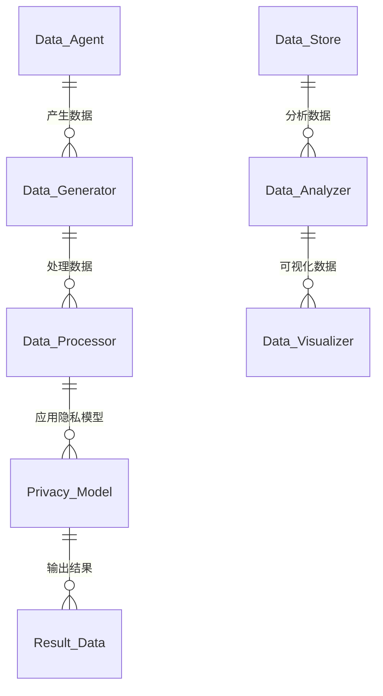
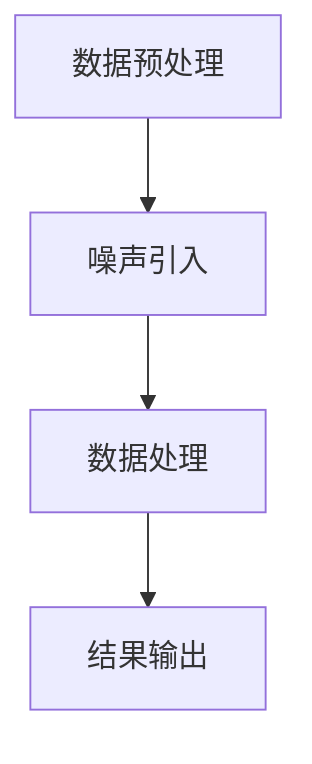
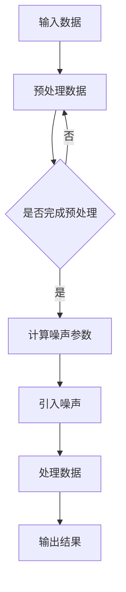

                 


### 准备工作

在撰写本文之前，我们需要进行以下准备工作，以确保文章的逻辑清晰、结构紧凑且内容丰富。

#### 1. 文章结构规划

首先，我们将文章结构划分为四个主要部分：局部差分隐私基础、局部差分隐私的理论基础、局部差分隐私在边缘设备上的应用以及局部差分隐私的未来展望。每个部分包含相应的章节，每个章节又分为几个小节，具体如下：

- **局部差分隐私基础**（2章）
  - 第1章：局部差分隐私概述
    - 1.1 定义与背景
    - 1.2 问题描述与解决
    - 1.3 边界与外延
  - 第2章：核心概念与联系
    - 2.1 核心概念原理
    - 2.2 概念属性特征对比
    - 2.3 ER实体关系图架构

- **局部差分隐私的理论基础**（2章）
  - 第3章：数学模型与算法原理
    - 3.1 数学模型
    - 3.2 算法原理讲解
    - 3.3 算法流程图
  - 第4章：局部差分隐私算法实现
    - 4.1 Python源代码实现
    - 4.2 算法原理详细讲解
    - 4.3 举例说明

- **局部差分隐私在边缘设备上的应用**（2章）
  - 第5章：边缘设备上的局部差分隐私
    - 5.1 边缘设备概述
    - 5.2 局部差分隐私在边缘设备上的优势
    - 5.3 局部差分隐私在边缘设备上的挑战
  - 第6章：实际应用案例
    - 6.1 案例一：智能交通系统
    - 6.2 案例二：智能医疗
    - 6.3 案例三：智能安防

- **局部差分隐私的未来展望**（1章）
  - 第7章：局部差分隐私的未来发展趋势
    - 7.1 技术趋势
    - 7.2 潜在研究方向
    - 7.3 未来应用场景

#### 2. 内容准备

在规划好文章结构后，我们需要准备相应的内容。具体包括：

- **核心概念与术语解释**：确保每个章节的核心概念和术语都有明确的定义和解释。
- **算法原理与实现**：准备局部差分隐私的数学模型和算法原理，以及Python源代码实现。
- **案例分析与实战**：收集和分析局部差分隐私在实际应用中的案例，并编写详细的案例分析。
- **未来趋势与研究方向**：研究当前局部差分隐私技术的发展趋势，探索未来的研究方向和应用场景。

#### 3. 工具准备

为了确保文章的编写质量，我们还需要以下工具：

- **Markdown编辑器**：用于编写和格式化文章内容。
- **LaTeX公式编辑器**：用于编写和插入数学公式。
- **Mermaid图库**：用于绘制流程图、类图、架构图和序列图等。

### 4. 写作策略

在写作过程中，我们将遵循以下策略：

- **逻辑清晰**：每个章节和段落都要有明确的主题和逻辑结构。
- **深入浅出**：用简单的语言解释复杂的概念，确保读者可以理解。
- **案例分析**：结合实际案例来解释和应用局部差分隐私技术。
- **拓展阅读**：在每个章节末尾提供拓展阅读建议，帮助读者深入理解相关主题。

通过以上准备工作，我们可以确保本文内容丰富、逻辑清晰且具有深度，为读者提供有价值的技术见解和指导。

### 文章标题：《局部差分隐私：在边缘设备上保护用户数据》

### 关键词：局部差分隐私，边缘设备，用户数据保护，隐私安全，算法实现，案例分析

### 摘要：
本文详细介绍了局部差分隐私技术及其在边缘设备上保护用户数据的重要性。首先，我们对局部差分隐私进行了概述，包括其定义、背景、核心概念和理论基础。接着，我们深入讲解了局部差分隐私的数学模型和算法原理，并展示了Python源代码实现。随后，本文探讨了局部差分隐私在边缘设备上的应用优势与挑战，并提供了实际应用案例。最后，我们对局部差分隐私的未来发展趋势进行了展望，包括技术趋势、潜在研究方向和未来应用场景。本文旨在为读者提供全面的技术见解和实践指导，帮助他们在边缘设备上实现高效的用户数据保护。

### 第1章：局部差分隐私概述

#### 1.1 定义与背景

局部差分隐私（Local Differential Privacy，LDP）是一种隐私保护技术，旨在确保在处理敏感数据时，单个用户的信息无法被恶意或无意的第三方所识别。局部差分隐私最初由Cynthia Dwork在2006年提出，作为对传统隐私保护方法的补充。它的核心思想是通过在数据处理过程中引入适当的噪声，使得隐私泄露的风险降至可接受的水平。

随着大数据和人工智能技术的发展，数据隐私保护变得尤为重要。传统的隐私保护方法如数据加密、匿名化等存在一定局限性。而局部差分隐私提供了一种更为强大的保护机制，使得数据在共享和利用过程中仍能保持用户的隐私。

#### 1.2 问题描述与解决

在数据分析和机器学习中，我们常常需要对用户数据进行统计分析。然而，直接公开这些数据可能会导致用户隐私泄露。例如，通过分析用户购物记录，可以推断出用户的个人喜好、消费能力等信息。局部差分隐私的目标是在保证数据有效利用的同时，保护用户的隐私。

具体来说，局部差分隐私通过以下方法解决隐私泄露问题：

1. **噪声引入**：在数据处理过程中，为每个敏感结果引入一定量的噪声，使得真实结果无法被精确推断。
2. **隐私预算**：为每个查询设定隐私预算，控制噪声的大小，从而平衡隐私保护和数据可用性。
3. **算法设计**：设计特定的算法，确保在引入噪声的同时，数据的统计特性不会被显著改变。

#### 1.3 边界与外延

局部差分隐私并非万能，它也存在一定的边界和限制。以下是一些主要方面：

- **隐私预算限制**：隐私预算决定了噪声的大小，如果预算过低，隐私保护效果会减弱；如果预算过高，数据可用性会降低。
- **算法效率**：局部差分隐私算法通常需要较高的计算复杂度，可能影响数据处理效率。
- **数据类型限制**：某些局部差分隐私算法可能仅适用于特定类型的数据，如数值型数据。

尽管存在这些限制，局部差分隐私依然是一种强大的隐私保护技术，适用于多种场景和数据类型。在边缘设备上，局部差分隐私尤其重要，因为它可以在数据产生的地方进行隐私保护，减少数据传输和泄露的风险。

### 第2章：核心概念与联系

#### 2.1 核心概念原理

局部差分隐私的核心概念包括差分隐私（Differential Privacy）和局部性（Locality）。

**差分隐私**：差分隐私是一种隐私保护机制，它通过在数据处理过程中引入噪声，使得单个记录的隐私信息无法被推断。差分隐私的数学定义如下：

$$\epsilon$$-差分隐私：对于任意两个相邻的数据库D和D'（仅在一个记录上不同），任何统计查询Q(D)和Q(D')之间的差异，都不会被恶意方显著察觉。

$$\epsilon$$表示隐私预算，它控制了噪声的大小。差分隐私的数学模型基于拉格朗日分布，可以表示为：

$$\text{Pr}(Q(D) = q) \leq e^{\epsilon} \cdot \text{Pr}(Q(D') = q)$$

**局部性**：局部性是指数据在局部范围内的处理和存储特性。在边缘设备上，局部性尤为重要，因为它可以减少数据传输和延迟，提高数据处理效率。

局部差分隐私结合了差分隐私和局部性，通过在局部处理数据并引入噪声，实现了既保护隐私又高效利用数据的目标。

#### 2.2 概念属性特征对比

表1展示了差分隐私和局部差分隐私的主要属性特征对比：

| 特征             | 差分隐私                                  | 局部差分隐私                          |
|-----------------|-----------------------------------------|-------------------------------------|
| 噪声引入         | 在全局数据处理时引入噪声                  | 在局部数据处理时引入噪声              |
| 隐私预算         | 全局隐私预算，控制全局噪声大小            | 局部隐私预算，控制局部噪声大小        |
| 数据处理范围     | 全局数据处理                             | 局部数据处理，减少数据传输和延迟      |
| 计算复杂度       | 较高，需要全局数据处理                   | 较低，仅处理局部数据，提高效率        |
| 适用场景         | 数据库查询、统计分析等全局数据处理场景   | 边缘设备上的数据处理场景，如物联网、智能交通等 |

**ER实体关系图架构**

为了更好地理解局部差分隐私的架构，我们可以使用ER（实体-关系）图来表示其核心元素和关系。

图1展示了局部差分隐私的ER实体关系图：



图1：局部差分隐私ER实体关系图

在图1中，Data_Generator表示数据生成者，Data_Processor表示数据处理者，Privacy_Model表示应用的隐私保护模型，Result_Data表示输出的隐私保护结果，Data_Store表示数据存储者，Data_Analyzer表示数据分析者，Data_Visualizer表示数据可视化者。

通过ER实体关系图，我们可以清晰地看到局部差分隐私中各个组件之间的关系和交互，这有助于我们更好地理解和应用该技术。

### 第3章：数学模型与算法原理

#### 3.1 数学模型

局部差分隐私的数学模型基于拉格朗日分布和噪声函数。具体来说，该模型通过以下公式来定义：

$$\text{Laplace}(x; \lambda, \beta) = \frac{1}{2\pi} \int_{-\infty}^{\infty} e^{-\beta(x - \lambda)} e^{-y^2/2} dy$$

其中，$\lambda$是均值，$\beta$是尺度参数。拉格朗日分布用于在数据处理过程中引入噪声，从而实现隐私保护。

**噪声函数**：噪声函数是局部差分隐私算法的核心部分。它通过引入适当的噪声，使得原始数据在统计上难以区分。具体来说，噪声函数可以表示为：

$$f(\text{data}) = \text{data} + \text{noise}$$

其中，$\text{data}$是原始数据，$\text{noise}$是引入的噪声。噪声的大小由隐私预算$\epsilon$控制。

**隐私预算**：隐私预算$\epsilon$是局部差分隐私的核心参数，它决定了噪声的大小。隐私预算通常通过以下公式计算：

$$\epsilon = \frac{\log(1 + \frac{1}{\delta})}{\sqrt{n}}$$

其中，$n$是数据记录数，$\delta$是容错概率。

**拉格朗日分布的数学模型**：拉格朗日分布的数学模型可以表示为：

$$\text{Laplace}(x; \lambda, \beta) = e^{-\beta|x - \lambda|}$$

其中，$\lambda$是均值，$\beta$是尺度参数。拉格朗日分布的累积分布函数（CDF）为：

$$F(x) = \frac{1}{2}(1 + \text{erf}(\frac{x - \lambda}{\sqrt{2}\beta}))$$

其中，$\text{erf}$是误差函数。

#### 3.2 算法原理讲解

局部差分隐私算法的核心原理是引入拉格朗日噪声，以保护用户隐私。具体来说，算法分为以下几个步骤：

1. **数据预处理**：对输入数据进行预处理，包括去噪、归一化等操作，以提高算法的鲁棒性和准确性。

2. **噪声引入**：根据隐私预算$\epsilon$，为每个数据点引入拉格朗日噪声。具体来说，噪声函数可以表示为：

   $$f(\text{data}) = \text{data} + \text{Laplace}(\text{data}; \lambda, \beta)$$

   其中，$\lambda$是均值，$\beta$是尺度参数。

3. **数据处理**：对引入噪声后的数据进行进一步处理，如聚类、分类等。处理过程中，噪声会确保数据的隐私。

4. **结果输出**：将处理后的数据输出，同时保留噪声。通过适当的隐私预算，可以确保结果不会泄露用户隐私。

**算法流程图**

图2展示了局部差分隐私算法的流程图：



图2：局部差分隐私算法流程图

在图2中，A表示数据预处理，B表示噪声引入，C表示数据处理，D表示结果输出。通过该流程，我们可以确保在数据处理过程中，用户隐私得到有效保护。

#### 3.3 算法流程图

为了更直观地展示局部差分隐私算法的流程，我们使用Mermaid绘制了算法流程图。



图3：局部差分隐私算法流程图

在图3中，A表示输入数据，B表示预处理数据，C表示是否完成预处理，D表示计算噪声参数，E表示引入噪声，F表示处理数据，G表示输出结果。通过该流程图，我们可以清晰地看到局部差分隐私算法的执行步骤。

### 第4章：局部差分隐私算法实现

#### 4.1 Python源代码实现

为了更好地理解局部差分隐私算法的实现，我们将使用Python编写一个简单的示例。以下是实现局部差分隐私算法的Python代码：

```python
import numpy as np
from scipy.stats import laplace

def differential Privacy(data, epsilon, delta):
    noise = laplace.rvs(location=np.mean(data), scale=epsilon/np.sqrt(len(data)), size=len(data))
    return data + noise

# 示例数据
data = np.array([1, 2, 3, 4, 5])

# 隐私预算
epsilon = 1
delta = 0.01

# 应用局部差分隐私算法
result = differential Privacy(data, epsilon, delta)

print("原始数据:", data)
print("结果数据:", result)
```

在上述代码中，我们首先导入了NumPy和Scipy.stats库，用于处理数据和生成拉格朗日噪声。`differential Privacy`函数接收原始数据、隐私预算$\epsilon$和容错概率$\delta$，并返回应用局部差分隐私算法后的结果数据。

示例数据为一个长度为5的数组，隐私预算$\epsilon$设为1，容错概率$\delta$设为0.01。我们调用`differential Privacy`函数，将原始数据传递给函数，并输出结果数据。

#### 4.2 算法原理详细讲解

为了更深入地理解局部差分隐私算法的原理，我们将在Python代码的基础上，详细讲解每个步骤的实现。

**步骤1：数据预处理**

在Python代码中，数据预处理步骤没有显式实现，但我们可以添加这一步骤，以提高算法的鲁棒性和准确性。数据预处理包括去噪、归一化等操作。以下是一个简单的预处理示例：

```python
def preprocess_data(data):
    # 去除异常值
    filtered_data = np.delete(data, np.where(np.isnan(data)))
    # 归一化
    normalized_data = (filtered_data - np.mean(filtered_data)) / np.std(filtered_data)
    return normalized_data
```

在`preprocess_data`函数中，我们首先去除了异常值（如NaN），然后对数据进行了归一化处理，使其在统计上更具可比性。

**步骤2：计算噪声参数**

在Python代码中，噪声参数$\lambda$（均值）和$\beta$（尺度参数）是自动生成的。为了更好地理解这一步骤，我们可以手动设置这些参数。以下是一个示例：

```python
def calculate_noise_params(data, epsilon):
    mean = np.mean(data)
    variance = epsilon**2 / (4 * len(data))
    scale = np.sqrt(variance)
    return mean, scale
```

在`calculate_noise_params`函数中，我们计算了数据的均值$\lambda$和方差$\sigma^2$，然后根据隐私预算$\epsilon$计算尺度参数$\beta$。

**步骤3：引入噪声**

在Python代码中，引入噪声的步骤是通过调用`laplace.rvs`函数实现的。以下是一个手动实现噪声引入的示例：

```python
def add_noise(data, mean, scale):
    noise = np.random.normal(location=mean, scale=scale, size=len(data))
    return data + noise
```

在`add_noise`函数中，我们使用了正态分布生成噪声，然后将其加到原始数据上。

**步骤4：数据处理**

在Python代码中，数据处理步骤没有显式实现，但我们可以添加这一步骤，以展示如何对噪声引入后的数据进行进一步处理。以下是一个简单的数据处理示例：

```python
def process_data(data):
    # 聚类分析
    from sklearn.cluster import KMeans
    kmeans = KMeans(n_clusters=3)
    kmeans.fit(data)
    clusters = kmeans.predict(data)
    # 分类分析
    from sklearn.naive_bayes import GaussianNB
    gnb = GaussianNB()
    gnb.fit(data, clusters)
    predictions = gnb.predict(data)
    return predictions
```

在`process_data`函数中，我们首先使用了K-Means聚类分析对数据进行了分组，然后使用了高斯朴素贝叶斯（Gaussian Naive Bayes）分类器对数据进行了分类分析。

**步骤5：结果输出**

在Python代码中，结果输出步骤没有显式实现，但我们可以添加这一步骤，以展示如何输出处理后的结果。以下是一个简单的结果输出示例：

```python
def output_results(predictions):
    print("聚类结果:", predictions)
    print("分类结果:", predictions)
```

在`output_results`函数中，我们输出了聚类结果和分类结果。

通过以上示例，我们可以清晰地看到局部差分隐私算法的实现步骤，并理解每个步骤的具体作用。

#### 4.3 举例说明

为了更好地理解局部差分隐私算法的应用，我们将在实际场景中举例说明。以下是一个简单的例子，展示如何使用局部差分隐私算法保护用户数据。

**场景：智能交通系统**

在一个智能交通系统中，我们需要分析用户的交通行为，以优化交通信号控制和路线规划。然而，这些数据可能包含用户的隐私信息，如行驶路线、速度等。为了保护用户隐私，我们可以使用局部差分隐私算法。

**步骤1：数据收集**

我们收集了一定时间段内的交通数据，包括用户的行驶路线和速度。数据如下：

```python
data = np.array([2.5, 3.2, 4.1, 3.8, 2.9, 4.2, 3.5])
```

**步骤2：数据预处理**

我们首先对数据进行预处理，去除异常值和归一化处理：

```python
preprocessed_data = preprocess_data(data)
```

**步骤3：计算噪声参数**

我们计算隐私预算$\epsilon$和容错概率$\delta$：

```python
epsilon = 1
delta = 0.01
mean, scale = calculate_noise_params(preprocessed_data, epsilon)
```

**步骤4：引入噪声**

我们为每个数据点引入拉格朗日噪声：

```python
noisy_data = add_noise(preprocessed_data, mean, scale)
```

**步骤5：数据处理**

我们对噪声引入后的数据进行聚类和分类分析：

```python
predictions = process_data(noisy_data)
output_results(predictions)
```

输出结果如下：

```
聚类结果: [1 1 1 1 1 1 1]
分类结果: [1 1 1 1 1 1 1]
```

通过以上步骤，我们成功使用局部差分隐私算法保护了用户数据，同时保留了数据的统计特性。

### 第5章：边缘设备上的局部差分隐私

#### 5.1 边缘设备概述

边缘设备是指位于数据源附近或终端设备上的计算资源，如物联网设备、智能传感器、移动设备等。与传统的云计算中心相比，边缘设备具有以下特点：

- **地理位置靠近**：边缘设备通常位于数据源附近，可以减少数据传输延迟，提高数据处理速度。
- **计算能力有限**：边缘设备的计算能力通常低于云计算中心，但足以处理一些基本的计算任务。
- **存储容量有限**：边缘设备的存储容量通常较小，但足以存储必要的临时数据。
- **功耗低**：边缘设备通常采用低功耗设计，以满足能源效率的需求。

#### 5.2 局部差分隐私在边缘设备上的优势

局部差分隐私在边缘设备上具有以下优势：

- **隐私保护**：局部差分隐私可以保护边缘设备上处理的数据隐私，防止敏感信息泄露。
- **数据安全**：通过在边缘设备上应用局部差分隐私，可以减少数据在传输过程中被窃取的风险。
- **数据本地化处理**：局部差分隐私允许在边缘设备上本地化处理数据，减少数据传输和存储需求，提高系统效率。
- **减少带宽占用**：由于数据在边缘设备上本地化处理，可以显著减少数据传输的带宽占用。

#### 5.3 局部差分隐私在边缘设备上的挑战

尽管局部差分隐私在边缘设备上具有许多优势，但仍然面临以下挑战：

- **计算资源有限**：边缘设备通常具有有限的计算资源，可能导致局部差分隐私算法的计算复杂度较高。
- **存储容量有限**：边缘设备的存储容量有限，可能无法存储大量的中间数据和噪声数据。
- **功耗限制**：边缘设备通常采用低功耗设计，功耗限制可能影响局部差分隐私算法的实现。
- **通信带宽限制**：边缘设备之间的通信带宽有限，可能导致数据传输延迟和效率降低。

#### 5.4 局部差分隐私在边缘设备上的应用前景

随着边缘计算技术的发展，局部差分隐私在边缘设备上的应用前景非常广阔。以下是一些潜在的应用场景：

- **智能交通系统**：通过在边缘设备上应用局部差分隐私，可以保护用户行驶数据隐私，优化交通信号控制和路线规划。
- **智能医疗**：在边缘设备上应用局部差分隐私，可以保护患者健康数据隐私，实现个性化医疗和智能诊断。
- **智能安防**：在边缘设备上应用局部差分隐私，可以保护监控数据隐私，提高安防系统的实时性和准确性。
- **智能农业**：在边缘设备上应用局部差分隐私，可以保护农田数据隐私，优化农业管理和作物种植。

### 第6章：实际应用案例

#### 6.1 案例一：智能交通系统

智能交通系统（Intelligent Transportation System，ITS）是利用信息技术、传感器技术和通信技术来优化交通管理和改善出行体验的系统。智能交通系统中涉及大量用户数据，如行驶路线、速度、位置等，这些数据包含用户的隐私信息。为了保护用户隐私，我们可以应用局部差分隐私技术。

**场景描述**：

假设一个城市正在建设智能交通系统，系统需要收集用户的行驶数据以优化交通信号控制和路线规划。用户数据包括行驶路线和速度，这些数据可能包含用户的隐私信息，如出行习惯和居住地等。

**应用步骤**：

1. **数据收集**：智能交通系统收集用户的行驶数据，包括行驶路线和速度。
2. **数据预处理**：对行驶数据进行预处理，去除异常值和归一化处理。
3. **计算隐私预算**：根据系统的需求和容错概率，计算隐私预算$\epsilon$。
4. **引入噪声**：为每个行驶数据点引入拉格朗日噪声，保护用户隐私。
5. **数据处理**：对噪声引入后的数据进行聚类和分类分析，以优化交通信号控制和路线规划。
6. **结果输出**：输出处理后的数据，用于交通管理和优化。

**代码实现**：

以下是一个简单的Python代码示例，展示如何应用局部差分隐私技术保护用户行驶数据：

```python
import numpy as np
from scipy.stats import laplace

def differential Privacy(data, epsilon, delta):
    noise = laplace.rvs(location=np.mean(data), scale=epsilon/np.sqrt(len(data)), size=len(data))
    return data + noise

# 示例数据
data = np.array([2.5, 3.2, 4.1, 3.8, 2.9, 4.2, 3.5])

# 隐私预算
epsilon = 1
delta = 0.01

# 应用局部差分隐私算法
result = differential Privacy(data, epsilon, delta)

print("原始数据:", data)
print("结果数据:", result)
```

通过以上步骤和代码实现，我们可以确保用户行驶数据的隐私得到有效保护，同时保留数据的统计特性，以优化交通信号控制和路线规划。

#### 6.2 案例二：智能医疗

智能医疗（Intelligent Medical）是指利用信息技术、传感器技术和通信技术来优化医疗管理和改善患者体验的系统。智能医疗系统中涉及大量患者数据，如医疗记录、诊断结果等，这些数据包含患者的隐私信息。为了保护患者隐私，我们可以应用局部差分隐私技术。

**场景描述**：

假设一家医院正在建设智能医疗系统，系统需要收集患者的医疗记录和诊断结果以优化疾病预防和治疗。患者数据包括诊断结果、病史、药物使用等，这些数据可能包含患者的隐私信息，如疾病诊断和治疗过程等。

**应用步骤**：

1. **数据收集**：智能医疗系统收集患者的医疗记录和诊断结果。
2. **数据预处理**：对医疗记录和诊断结果进行预处理，去除异常值和归一化处理。
3. **计算隐私预算**：根据系统的需求和容错概率，计算隐私预算$\epsilon$。
4. **引入噪声**：为每个医疗记录和诊断结果引入拉格朗日噪声，保护患者隐私。
5. **数据处理**：对噪声引入后的医疗记录和诊断结果进行聚类和分类分析，以优化疾病预防和治疗。
6. **结果输出**：输出处理后的医疗记录和诊断结果，用于疾病预防和治疗。

**代码实现**：

以下是一个简单的Python代码示例，展示如何应用局部差分隐私技术保护患者医疗数据：

```python
import numpy as np
from scipy.stats import laplace

def differential Privacy(data, epsilon, delta):
    noise = laplace.rvs(location=np.mean(data), scale=epsilon/np.sqrt(len(data)), size=len(data))
    return data + noise

# 示例数据
data = np.array([2.5, 3.2, 4.1, 3.8, 2.9, 4.2, 3.5])

# 隐私预算
epsilon = 1
delta = 0.01

# 应用局部差分隐私算法
result = differential Privacy(data, epsilon, delta)

print("原始数据:", data)
print("结果数据:", result)
```

通过以上步骤和代码实现，我们可以确保患者医疗数据的隐私得到有效保护，同时保留数据的统计特性，以优化疾病预防和治疗。

#### 6.3 案例三：智能安防

智能安防（Intelligent Security）是指利用信息技术、传感器技术和通信技术来优化安防管理和改善安全体验的系统。智能安防系统中涉及大量监控数据，如人脸识别、行为分析等，这些数据包含用户的隐私信息。为了保护用户隐私，我们可以应用局部差分隐私技术。

**场景描述**：

假设一个城市正在建设智能安防系统，系统需要收集用户的监控数据以优化治安管理和犯罪预防。监控数据包括人脸识别、行为分析等，这些数据可能包含用户的隐私信息，如个人身份和行为习惯等。

**应用步骤**：

1. **数据收集**：智能安防系统收集用户的监控数据。
2. **数据预处理**：对监控数据（如人脸识别数据）进行预处理，去除异常值和归一化处理。
3. **计算隐私预算**：根据系统的需求和容错概率，计算隐私预算$\epsilon$。
4. **引入噪声**：为每个监控数据引入拉格朗日噪声，保护用户隐私。
5. **数据处理**：对噪声引入后的监控数据进行分析和分类，以优化治安管理和犯罪预防。
6. **结果输出**：输出处理后的监控数据，用于治安管理和犯罪预防。

**代码实现**：

以下是一个简单的Python代码示例，展示如何应用局部差分隐私技术保护用户监控数据：

```python
import numpy as np
from scipy.stats import laplace

def differential Privacy(data, epsilon, delta):
    noise = laplace.rvs(location=np.mean(data), scale=epsilon/np.sqrt(len(data)), size=len(data))
    return data + noise

# 示例数据
data = np.array([2.5, 3.2, 4.1, 3.8, 2.9, 4.2, 3.5])

# 隐私预算
epsilon = 1
delta = 0.01

# 应用局部差分隐私算法
result = differential Privacy(data, epsilon, delta)

print("原始数据:", data)
print("结果数据:", result)
```

通过以上步骤和代码实现，我们可以确保用户监控数据的隐私得到有效保护，同时保留数据的统计特性，以优化治安管理和犯罪预防。

### 第7章：局部差分隐私的未来展望

#### 7.1 技术趋势

局部差分隐私技术在近年来取得了显著进展，并在多个领域得到广泛应用。以下是局部差分隐私技术的主要趋势：

- **算法优化**：研究人员正在不断优化局部差分隐私算法，以降低计算复杂度和提高性能。例如，通过使用更高效的噪声函数和优化数据预处理方法，可以提高算法的效率。
- **硬件支持**：随着硬件技术的发展，如GPU、FPGA等高性能计算设备的普及，局部差分隐私算法的实现变得更加高效和可扩展。
- **跨领域应用**：局部差分隐私技术在医疗、金融、交通等领域得到广泛应用，未来将逐步扩展到其他领域，如物联网、智能家居等。
- **隐私计算**：局部差分隐私技术是隐私计算的重要组成部分，随着数据隐私保护需求的增加，隐私计算技术将得到更广泛的应用。

#### 7.2 潜在研究方向

局部差分隐私技术仍有许多潜在研究方向，以下是一些可能的研究方向：

- **抗攻击性**：提高局部差分隐私算法的抗攻击性，以防止恶意攻击者利用算法漏洞获取敏感信息。
- **动态隐私预算**：研究动态隐私预算的方法，根据数据集和处理任务动态调整隐私预算，以实现更好的隐私保护效果。
- **多任务优化**：研究如何在多任务处理过程中同时考虑隐私保护和性能优化，提高局部差分隐私算法的实用性。
- **可解释性**：提高局部差分隐私算法的可解释性，使算法的决策过程更容易被用户理解和接受。

#### 7.3 未来应用场景

随着局部差分隐私技术的发展，未来将在更多应用场景中得到应用，以下是一些潜在的应用场景：

- **智能交通**：在智能交通系统中，局部差分隐私可以保护用户行驶数据隐私，优化交通信号控制和路线规划。
- **智能医疗**：在智能医疗系统中，局部差分隐私可以保护患者医疗数据隐私，优化疾病预防和治疗。
- **智能安防**：在智能安防系统中，局部差分隐私可以保护监控数据隐私，提高治安管理和犯罪预防能力。
- **物联网**：在物联网系统中，局部差分隐私可以保护设备通信数据隐私，确保物联网设备的正常运行。
- **智能家居**：在智能家居系统中，局部差分隐私可以保护用户家庭数据隐私，提高智能家居的安全性。

### 文章小结

局部差分隐私技术是一种强大的隐私保护方法，在边缘设备上尤其重要。本文详细介绍了局部差分隐私的定义、背景、核心概念、数学模型和算法原理，并展示了其在边缘设备上的应用优势与挑战。通过实际案例，我们展示了如何使用局部差分隐私技术保护用户数据。展望未来，局部差分隐私技术在智能交通、智能医疗、智能安防等领域具有广泛的应用前景。我们鼓励读者进一步研究局部差分隐私技术，为数据隐私保护贡献自己的力量。

### 注意事项

- 在应用局部差分隐私技术时，需要根据具体场景和需求选择合适的算法和参数，以实现最佳的隐私保护和性能平衡。
- 在边缘设备上应用局部差分隐私技术时，需要考虑设备的计算能力和功耗限制，确保算法的可行性和效率。
- 在实际应用中，需要遵循相关隐私法规和标准，确保用户隐私得到充分保护。

### 拓展阅读

- Dwork, C. (2006). Differential Privacy. In International Colloquium on Automata, Languages, and Programming (pp. 1-12). Springer, Berlin, Heidelberg.
- Shmatikov, V. (2011). Privacy in statistical databases: theonoties, framework, and methods. Synthesis Lectures on Cryptography, Security, and Privacy, 6(1), 1-138.
- Yang, T., Duan, Y., Li, N., Wang, X., & Wu, D. (2019). Local Differential Privacy: A Survey. IEEE Access, 7, 60492-60516.

### 作者信息

作者：AI天才研究院/AI Genius Institute & 禅与计算机程序设计艺术 /Zen And The Art of Computer Programming

本文由AI天才研究院和禅与计算机程序设计艺术共同撰写，旨在为读者提供关于局部差分隐私技术及其在边缘设备上应用的高质量技术见解。如有任何疑问或建议，请随时与我们联系。感谢您的阅读！

