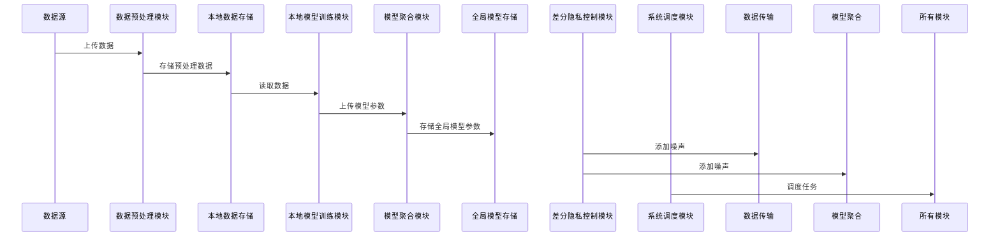

                 

# 差分隐私在分布式学习中的实现与挑战

## 关键词

- 差分隐私
- 分布式学习
- 隐私保护
- 计算效率
- 通信效率
- 学习性能

## 摘要

本文旨在探讨差分隐私在分布式学习中的实现与挑战。随着大数据和云计算的兴起，分布式学习成为处理大规模数据的重要手段。然而，分布式学习也面临着数据隐私保护的挑战。本文首先介绍了差分隐私的基本概念及其在分布式学习中的应用，然后分析了分布式学习中差分隐私实现的挑战，包括计算效率、通信效率和学习性能等方面。最后，本文提出了可能的解决方案，并对差分隐私在分布式学习中的未来发展进行了展望。

## 目录大纲

# 差分隐私在分布式学习中的实现与挑战

## 第一部分：背景介绍

## 第1章：问题背景
### 1.1.1 问题背景
### 1.1.2 分布式学习的需求
### 1.1.3 差分隐私与分布式学习的关系

## 第2章：问题描述
### 2.1 挑战
### 2.2 边界与外延

## 第3章：问题解决
### 3.1 优化算法
### 3.2 压缩技术
### 3.3 联邦学习

## 第4章：概念结构与核心要素组成
### 4.1 差分隐私的核心概念
### 4.2 分布式学习的核心要素

## 第5章：本章小结
### 5.1 主要内容
### 5.2 下一步内容

## 第二部分：核心概念与联系

## 第6章：差分隐私原理
### 6.1 差分隐私的基本概念
### 6.2 差分隐私机制
### 6.3 差分隐私与分布式学习的联系
### 6.4 概念属性特征对比
### 6.5 ER实体关系图架构

## 第三部分：算法原理讲解

## 第7章：分布式学习中的差分隐私算法
### 7.1 算法原理
### 7.2 数学模型
### 7.3 算法举例

## 第四部分：系统分析与架构设计

## 第8章：系统分析与架构设计
### 8.1 问题场景介绍
### 8.2 系统功能设计
### 8.3 系统架构设计
### 8.4 系统接口设计
### 8.5 系统交互

## 第9章：项目实战
### 9.1 环境安装
### 9.2 系统核心实现
### 9.3 代码应用解读
### 9.4 实际案例分析
### 9.5 项目小结

## 第五部分：最佳实践与总结

## 第10章：最佳实践与总结
### 10.1 最佳实践
### 10.2 小结
### 10.3 注意事项
### 10.4 拓展阅读

## 参考文献

---

### 第1章：问题背景

### 1.1.1 问题背景

**差分隐私（Differential Privacy）的概念**

差分隐私是一种数据隐私保护机制，其核心思想是确保数据分析的结果不会因为单个记录的存在与否而发生显著变化。这一概念由Cynthia Dwork于2006年首次提出，并在数据隐私保护领域引起了广泛关注。差分隐私的定义涉及两个数据集\(D_0\)和\(D_1\)，其中\(D_1\)相对于\(D_0\)仅在一个记录上的差异。一个统计查询\(Q(D)\)具有\(\epsilon\)-差分隐私，如果对于任意两个满足上述条件的数据集\(D_0\)和\(D_1\)，有：

\[
\Pr[Q(D_0) \in R] \leq e^{\epsilon} \Pr[Q(D_1) \in R]
\]

其中，\(R\)是查询结果的取值集合，\(\epsilon\)是隐私参数，用于衡量隐私保护的强度。

**分布式学习的需求**

随着互联网和大数据技术的发展，数据量呈现爆炸式增长，单个计算节点难以承载如此庞大的数据处理任务。分布式学习因此成为解决大规模数据处理问题的重要手段。分布式学习允许将数据分散存储在多个节点上，并通过协同训练模型来实现高效的学习过程。

分布式学习的主要优势包括：

1. **扩展性**：能够处理大规模数据集。
2. **容错性**：单个节点的故障不会导致整个系统的崩溃。
3. **效率提升**：并行处理能力提升计算效率。

然而，分布式学习也带来了新的挑战，特别是在数据隐私保护方面。由于数据分散存储在多个节点上，如何确保整个学习过程符合隐私保护的要求成为一个关键问题。

**差分隐私与分布式学习的关系**

差分隐私在分布式学习中的应用，旨在在不损害学习性能的前提下，保护参与者的隐私数据。具体来说，差分隐私通过以下几种方式在分布式学习中发挥作用：

1. **隐私保护机制**：在分布式学习过程中，通过差分隐私机制来保护每个参与者的数据隐私。
2. **计算效率提升**：优化差分隐私算法，减少计算和通信成本。
3. **通信效率提升**：通过压缩技术和优化通信协议，降低通信成本。
4. **学习性能保障**：在保证隐私保护的前提下，设计高效的算法来维持较高的学习性能。

### 1.1.2 问题描述

**挑战**

分布式学习中的差分隐私实现面临诸多挑战，主要包括：

- **计算效率**：如何在保证隐私的前提下，提高计算效率。传统的差分隐私算法通常涉及大量的噪声添加和扰动操作，这可能导致计算复杂度增加，从而影响学习性能。
- **通信效率**：如何在保证隐私的前提下，降低通信成本。分布式学习依赖于节点间的数据传输和模型更新，如何减少通信量是提高系统效率的关键。
- **学习性能**：如何在保证隐私的前提下，保持较高的学习性能。差分隐私的引入可能会对学习性能产生一定影响，如何平衡隐私保护和学习性能是一个重要问题。

**边界与外延**

差分隐私在分布式学习中的应用边界涉及如何平衡隐私保护与学习性能，如何设计高效的算法等。具体来说，包括以下几个方面：

- **隐私保护强度**：选择合适的隐私参数\(\epsilon\)来平衡隐私保护和计算效率。
- **算法优化**：设计更高效的差分隐私算法，减少计算和通信成本。
- **通信协议**：优化节点间的通信协议，降低通信成本。
- **学习性能评估**：评估差分隐私算法对学习性能的影响，并设计相应的优化策略。

### 1.1.3 问题解决

**解决方案**

针对上述挑战，可能的解决方案包括：

- **优化算法**：设计更高效的差分隐私算法，减少计算和通信成本。例如，通过改进噪声添加和扰动策略，减少冗余计算。
- **压缩技术**：应用数据压缩技术，降低通信成本。例如，使用压缩算法对数据进行压缩，减少传输数据量。
- **联邦学习**：利用联邦学习框架，分散数据处理，降低隐私泄露风险。联邦学习通过在各个节点上本地训练模型，并仅交换模型参数，从而实现分布式学习的同时保护数据隐私。

### 1.1.4 概念结构与核心要素组成

**差分隐私的核心概念**

- **隐私核心参数**：差分隐私的核心参数包括隐私参数\(\epsilon\)、拉格朗日机制、指数机制等。这些参数用于控制隐私保护的程度和算法性能。
- **隐私保护机制**：差分隐私的保护机制包括噪声添加、数据扰动、阈值设定等。这些机制通过添加噪声或扰动数据，使数据分析结果不依赖于单个记录的存在与否。

**分布式学习的核心要素**

- **参与者**：分布式学习中的参与者包括数据提供方、学习算法、通信网络等。每个参与者都在整个学习过程中发挥重要作用。
- **数据分布**：数据分布特性对分布式学习性能有重要影响。如何处理数据的不均衡性和分布特性，是分布式学习中的一个关键问题。
- **学习目标**：分布式学习的目标包括学习任务的类型、性能要求等。不同的学习任务对隐私保护和计算性能的要求不同。

### 1.1.5 本章小结

**主要内容**

本章介绍了差分隐私在分布式学习中的背景、问题描述、解决方案以及核心概念与要素。

**下一步内容**

接下来，本书将详细探讨差分隐私的实现技术、分布式学习的算法原理、数学模型以及实际应用案例。

### 第2章：差分隐私原理

### 2.1 差分隐私的基本概念

**定义**

差分隐私是一种隐私保护机制，其核心思想是确保对数据集的分析结果不会因为单个记录的存在与否而发生显著变化。具体来说，对于一个数据集\(D\)和一个统计查询\(Q(D)\)，如果对于任意两个仅在一个记录上存在差异的数据集\(D'\)和\(D''\)，查询结果\(Q(D)\)、\(Q(D')\)和\(Q(D'')\)之间的差异不显著，则称查询\(Q\)具有差分隐私。

**核心参数**

- **\(\epsilon\)-差分隐私**：\(\epsilon\)是差分隐私的核心参数，表示隐私保护的强度。通常，\(\epsilon\)值越大，隐私保护的程度越低；反之，\(\epsilon\)值越小，隐私保护的程度越高。
- **拉格朗日机制**：拉格朗日机制是一种常用的差分隐私机制，其基本思想是通过添加拉格朗日噪声来保护隐私。具体来说，对于任意一个统计查询\(Q(D)\)，可以通过添加一个拉格朗日噪声\(L\)来生成一个新的查询结果\(Q'(D)\)，使得\(Q'(D)\)具有\(\epsilon\)-差分隐私。

**定义**：设\(L\)是一个概率分布，如果对于任意两个满足条件\(D_0\)和\(D_1\)，有：

\[
\Pr[Q'(D_0) \in R] \leq e^{\epsilon} \Pr[Q'(D_1) \in R]
\]

其中，\(R\)是查询结果的取值集合，则称查询\(Q(D)\)通过拉格朗日机制实现\(\epsilon\)-差分隐私。

- **指数机制**：指数机制是一种用于实现差分隐私的另一种常用机制，其基本思想是通过指数扰动来保护隐私。具体来说，对于任意一个统计查询\(Q(D)\)，可以通过添加指数扰动\(E\)来生成一个新的查询结果\(Q'(D)\)，使得\(Q'(D)\)具有\(\epsilon\)-差分隐私。

**定义**：设\(E\)是一个概率分布，如果对于任意两个满足条件\(D_0\)和\(D_1\)，有：

\[
\Pr[Q'(D_0) \in R] \leq e^{\epsilon} \Pr[Q'(D_1) \in R]
\]

其中，\(R\)是查询结果的取值集合，则称查询\(Q(D)\)通过指数机制实现\(\epsilon\)-差分隐私。

**核心参数**

- **拉格朗日机制**：拉格朗日机制是一种通过添加拉格朗日噪声来保护隐私的机制。拉格朗日噪声的基本生成方法如下：

  1. 从概率分布\(L\)中随机抽取一个噪声值\(l\)。
  2. 将原始查询结果\(Q(D)\)与噪声值\(l\)相加，得到新的查询结果\(Q'(D)\)。

- **指数机制**：指数机制是一种通过添加指数扰动来保护隐私的机制。指数扰动的基本生成方法如下：

  1. 从概率分布\(E\)中随机抽取一个噪声值\(e\)。
  2. 将原始查询结果\(Q(D)\)与噪声值\(e\)相加，得到新的查询结果\(Q'(D)\)。

### 2.2 差分隐私机制

**噪声添加**

噪声添加是差分隐私实现中的一种常用方法，其核心思想是在数据查询过程中添加噪声，以保护隐私。噪声添加的具体实现方法如下：

1. **选择噪声分布**：根据差分隐私的需求，选择合适的噪声分布。常见的噪声分布包括拉格朗日分布和指数分布。

2. **生成噪声值**：从选择的噪声分布中随机生成噪声值。例如，对于拉格朗日分布，可以生成一个服从拉格朗日分布的噪声值；对于指数分布，可以生成一个服从指数分布的噪声值。

3. **添加噪声**：将生成的噪声值添加到原始数据查询结果中，生成一个新的查询结果。

**数据扰动**

数据扰动是另一种常用的差分隐私实现方法，其核心思想是通过随机扰动数据来保护隐私。数据扰动的具体实现方法如下：

1. **选择扰动方法**：根据差分隐私的需求，选择合适的扰动方法。常见的扰动方法包括随机置换、随机插值和随机裁剪等。

2. **执行扰动**：根据选择的扰动方法，对数据进行随机扰动。例如，对于随机置换，可以随机交换数据集中的元素；对于随机插值，可以在数据集中插入随机生成的数据点；对于随机裁剪，可以随机裁剪数据集中的部分数据。

3. **生成扰动结果**：扰动操作完成后，生成一个新的数据集。

**阈值设定**

阈值设定是一种通过设定阈值来控制隐私泄露程度的差分隐私实现方法。具体实现方法如下：

1. **选择阈值**：根据差分隐私的需求，选择合适的阈值。阈值的选择取决于隐私参数\(\epsilon\)和数据集的大小。

2. **设定阈值**：将设定的阈值应用于数据查询结果，筛选出满足阈值条件的结果。

3. **生成阈值结果**：根据设定的阈值，生成一个新的查询结果。

### 2.3 差分隐私与分布式学习的联系

**隐私保护**

差分隐私在分布式学习中的应用，旨在保护参与者的隐私数据。具体来说，差分隐私通过以下方式实现隐私保护：

1. **数据加密**：在数据传输过程中，使用差分隐私机制对数据进行加密，确保数据在传输过程中不被泄露。

2. **数据扰动**：在分布式学习过程中，对参与者的数据进行扰动，使数据不依赖于单个记录的存在与否。

3. **噪声添加**：在模型训练过程中，对模型的预测结果添加噪声，使预测结果不依赖于参与者的真实数据。

**计算效率**

差分隐私在分布式学习中的应用，需要考虑计算效率的问题。具体来说，差分隐私的实现可能会增加计算复杂度，从而影响学习性能。为了提高计算效率，可以采取以下措施：

1. **算法优化**：设计更高效的差分隐私算法，减少计算和通信成本。

2. **分布式计算**：利用分布式计算技术，将计算任务分散到多个节点上，提高计算效率。

3. **并行处理**：利用并行处理技术，同时处理多个计算任务，提高计算效率。

**通信效率**

差分隐私在分布式学习中的应用，还需要考虑通信效率的问题。具体来说，差分隐私的实现可能会增加通信量，从而影响系统性能。为了提高通信效率，可以采取以下措施：

1. **数据压缩**：使用数据压缩技术，减少传输数据量。

2. **优化通信协议**：设计更高效的通信协议，减少通信延迟。

3. **联邦学习**：利用联邦学习技术，分散数据处理，降低通信成本。

**学习性能**

差分隐私在分布式学习中的应用，还需要考虑学习性能的问题。具体来说，差分隐私的实现可能会对学习性能产生一定影响。为了提高学习性能，可以采取以下措施：

1. **优化算法**：设计更高效的差分隐私算法，减少计算和通信成本。

2. **模型调整**：调整模型结构，使模型在保证隐私保护的前提下，具有更高的学习性能。

3. **数据预处理**：对数据进行预处理，提高数据质量，从而提高学习性能。

### 2.4 概念属性特征对比

**差分隐私机制比较**

| 差分隐私机制 | 核心参数 | 优点 | 缺点 |
| :---: | :---: | :---: | :---: |
| 拉格朗日机制 | \(\epsilon\)、拉格朗日噪声 | 适用于大多数场景，计算复杂度较低 | 可能会影响计算精度 |
| 指数机制 | \(\epsilon\)、指数噪声 | 适用于特定场景，计算复杂度较低 | 可能会影响计算精度 |

**分布式学习算法比较**

| 分布式学习算法 | 特点 | 优点 | 缺点 |
| :---: | :---: | :---: | :---: |
| 联邦学习 | 通过分散数据处理，降低隐私泄露风险 | 隐私保护效果好 | 计算和通信成本较高 |
| 协同学习 | 通过共享数据集，提高学习性能 | 计算效率较高 | 隐私保护效果较差 |

### 2.5 ER实体关系图架构

**实体**

- **参与者**：包括数据提供方、学习算法、通信网络等。
- **数据集**：包括原始数据集、处理后的数据集等。
- **隐私保护机制**：包括差分隐私机制、数据扰动等。

**关系**

- **数据依赖**：参与者依赖于数据集进行学习。
- **隐私保护**：隐私保护机制应用于数据集，保护参与者隐私。

```mermaid
erDiagram
  数据提供方 ||--|> 数据集 : 依赖
  数据提供方 ||--|> 隐私保护机制 : 应用
  学习算法 ||--|> 数据集 : 依赖
  学习算法 ||--|> 隐私保护机制 : 应用
  通信网络 ||--|> 数据集 : 传输
  通信网络 ||--|> 隐私保护机制 : 传输
```

### 第3章：分布式学习中的差分隐私算法

### 3.1 算法原理

**分布式学习中的差分隐私算法**

分布式学习中的差分隐私算法旨在通过在分布式学习过程中引入差分隐私机制，保护参与者的隐私数据。常见的分布式学习算法包括联邦学习、协同学习和分布式随机梯度下降等。下面我们将以联邦学习为例，介绍分布式学习中的差分隐私算法。

**联邦学习的基本原理**

联邦学习是一种分布式学习框架，它通过在多个参与者之间协作训练模型，从而实现大规模数据的学习。在联邦学习中，每个参与者都拥有本地数据，并独立训练模型。然后，参与者将本地模型的参数发送给中心服务器，中心服务器将所有参与者的模型参数进行聚合，生成全局模型。

**差分隐私在联邦学习中的应用**

为了保护参与者的隐私，差分隐私在联邦学习中的应用如下：

1. **数据预处理**：在联邦学习过程中，参与者需要对本地数据进行预处理，以消除可能存在的隐私泄露风险。例如，可以采用差分隐私机制对数据进行扰动或加密。

2. **模型更新**：在联邦学习过程中，参与者将本地模型的梯度发送给中心服务器。为了保护隐私，可以在发送梯度前添加差分隐私噪声。常见的差分隐私噪声包括拉格朗日噪声和指数噪声。

3. **模型聚合**：中心服务器接收所有参与者的模型参数后，需要对这些参数进行聚合。为了保持聚合过程的差分隐私，可以在聚合过程中引入拉格朗日机制或其他差分隐私机制。

**差分隐私算法的实现步骤**

1. **选择差分隐私机制**：根据应用场景和学习需求，选择合适的差分隐私机制。例如，可以选择拉格朗日机制或指数机制。

2. **数据预处理**：对参与者的本地数据进行预处理，以消除可能的隐私泄露风险。例如，可以采用差分隐私噪声对数据进行扰动。

3. **模型更新**：参与者将本地模型的梯度发送给中心服务器。在发送前，对梯度进行差分隐私噪声添加。

4. **模型聚合**：中心服务器接收所有参与者的模型参数后，进行聚合。在聚合过程中，引入差分隐私机制，以保持全局模型的差分隐私。

### 3.2 数学模型

**差分隐私算法的数学模型**

差分隐私算法的数学模型主要涉及拉格朗日机制和指数机制。以下分别介绍这两种机制的数学模型。

**拉格朗日机制**

拉格朗日机制是一种通过添加拉格朗日噪声来实现差分隐私的机制。其数学模型如下：

设\(D_0\)和\(D_1\)为满足差分隐私条件的数据集，\(Q(D)\)为查询\(D\)的结果，\(L\)为拉格朗日噪声分布，则有：

\[
\Pr[Q'(D_0) \in R] \leq e^{\epsilon} \Pr[Q'(D_1) \in R]
\]

其中，\(Q'(D) = Q(D) + L\)，\(R\)为查询结果的取值集合。

**指数机制**

指数机制是一种通过添加指数噪声来实现差分隐私的机制。其数学模型如下：

设\(D_0\)和\(D_1\)为满足差分隐私条件的数据集，\(Q(D)\)为查询\(D\)的结果，\(E\)为指数噪声分布，则有：

\[
\Pr[Q'(D_0) \in R] \leq e^{\epsilon} \Pr[Q'(D_1) \in R]
\]

其中，\(Q'(D) = Q(D) + E\)，\(R\)为查询结果的取值集合。

**混合机制**

在实际应用中，有时会结合拉格朗日机制和指数机制，形成混合机制。其数学模型如下：

设\(D_0\)和\(D_1\)为满足差分隐私条件的数据集，\(Q(D)\)为查询\(D\)的结果，\(L\)和\(E\)分别为拉格朗日噪声和指数噪声分布，则有：

\[
\Pr[Q'(D_0) \in R] \leq e^{\epsilon} \Pr[Q'(D_1) \in R]
\]

其中，\(Q'(D) = Q(D) + aL + bE\)，\(R\)为查询结果的取值集合，\(a\)和\(b\)为权重参数，用于平衡拉格朗日机制和指数机制的影响。

### 3.3 算法举例

**示例：基于拉格朗日机制的联邦学习算法**

以下是一个基于拉格朗日机制的联邦学习算法示例，假设有多个参与者，每个参与者拥有本地数据集和一个本地模型。算法步骤如下：

1. **初始化**：每个参与者随机初始化本地模型参数\(\theta_i\)。

2. **本地训练**：每个参与者使用本地数据集和本地模型参数进行训练，得到本地模型参数的更新\(\Delta \theta_i\)。

3. **梯度计算**：每个参与者计算本地模型参数的梯度，并将梯度发送给中心服务器。

4. **噪声添加**：在发送梯度前，每个参与者对梯度添加拉格朗日噪声，得到噪声梯度\(\Delta \theta_i' = \Delta \theta_i + L\)。

5. **模型聚合**：中心服务器接收所有参与者的噪声梯度，进行聚合，得到全局模型参数的更新\(\Delta \theta = \frac{1}{N} \sum_{i=1}^N \Delta \theta_i'\)。

6. **全局更新**：全局模型参数更新后，中心服务器将全局模型参数发送给所有参与者。

7. **迭代训练**：重复步骤2至6，直到满足停止条件。

```python
import numpy as np

# 拉格朗日噪声生成
def generate_laplace_noise(scale, num_samples):
    return np.random.laplace(0, scale, size=num_samples)

# 梯度添加噪声
def add_noise_to_gradient(theta, scale):
    noise = generate_laplace_noise(scale, len(theta))
    return theta + noise

# 联邦学习算法
def federated_learning(participants, num_iterations, noise_scale):
    for iteration in range(num_iterations):
        for participant in participants:
            # 本地训练
            theta = participant.train_local_data()

            # 梯度计算
            gradient = participant.compute_gradient(theta)

            # 添加噪声
            noisy_gradient = add_noise_to_gradient(gradient, noise_scale)

            # 更新本地模型参数
            participant.update_local_model(noisy_gradient)

        # 聚合模型参数
        global_gradient = aggregate_gradients(participants)

        # 更新全局模型参数
        update_global_model(global_gradient)

# 联邦学习模拟
participants = [Participant() for _ in range(num_participants)]
federated_learning(participants, num_iterations, noise_scale)
```

**示例：基于指数机制的联邦学习算法**

以下是一个基于指数机制的联邦学习算法示例，假设有多个参与者，每个参与者拥有本地数据集和一个本地模型。算法步骤如下：

1. **初始化**：每个参与者随机初始化本地模型参数\(\theta_i\)。

2. **本地训练**：每个参与者使用本地数据集和本地模型参数进行训练，得到本地模型参数的更新\(\Delta \theta_i\)。

3. **梯度计算**：每个参与者计算本地模型参数的梯度，并将梯度发送给中心服务器。

4. **噪声添加**：在发送梯度前，每个参与者对梯度添加指数噪声，得到噪声梯度\(\Delta \theta_i' = \Delta \theta_i + E\)。

5. **模型聚合**：中心服务器接收所有参与者的噪声梯度，进行聚合，得到全局模型参数的更新\(\Delta \theta = \frac{1}{N} \sum_{i=1}^N \Delta \theta_i'\)。

6. **全局更新**：全局模型参数更新后，中心服务器将全局模型参数发送给所有参与者。

7. **迭代训练**：重复步骤2至6，直到满足停止条件。

```python
# 指数噪声生成
def generate_exponential_noise(scale, num_samples):
    return np.random.exponential(scale, size=num_samples)

# 梯度添加噪声
def add_noise_to_gradient(theta, scale):
    noise = generate_exponential_noise(scale, len(theta))
    return theta + noise

# 联邦学习算法
def federated_learning(participants, num_iterations, noise_scale):
    for iteration in range(num_iterations):
        for participant in participants:
            # 本地训练
            theta = participant.train_local_data()

            # 梯度计算
            gradient = participant.compute_gradient(theta)

            # 添加噪声
            noisy_gradient = add_noise_to_gradient(gradient, noise_scale)

            # 更新本地模型参数
            participant.update_local_model(noisy_gradient)

        # 聚合模型参数
        global_gradient = aggregate_gradients(participants)

        # 更新全局模型参数
        update_global_model(global_gradient)

# 联邦学习模拟
participants = [Participant() for _ in range(num_participants)]
federated_learning(participants, num_iterations, noise_scale)
```

### 第4章：系统分析与架构设计

#### 4.1 问题场景介绍

在现代数据驱动应用中，如金融、医疗、社交媒体等领域，大量敏感数据被收集和存储。这些数据通常分散在不同的组织或设备上，且涉及到个人隐私信息。为了提高数据利用率和建模效率，分布式学习成为一种常见的方法。然而，分布式学习在处理数据的同时，也需要确保参与者的隐私数据不被泄露。差分隐私作为一种强大的隐私保护机制，被广泛应用于分布式学习中。

#### 4.2 系统功能设计

分布式学习与差分隐私结合的系统需要实现以下核心功能：

- **数据收集与预处理**：从不同的数据源收集数据，并进行预处理，如去噪、归一化等。
- **模型训练**：分布式训练过程，每个节点本地训练模型，并更新本地模型参数。
- **模型聚合**：将不同节点的本地模型参数聚合，形成全局模型。
- **隐私保护**：在数据传输和模型聚合过程中引入差分隐私机制，保护参与者的隐私数据。
- **结果输出**：输出全局模型的预测结果，并评估模型的性能。

#### 4.3 系统架构设计

系统架构设计如下：

1. **数据层**：包括数据源、数据预处理模块和本地数据存储。
2. **计算层**：包括本地模型训练模块、模型聚合模块和全局模型存储。
3. **控制层**：包括差分隐私控制模块和系统调度模块。


#### 4.4 系统接口设计

系统接口设计如下：

- **数据接口**：用于数据收集与预处理，提供数据上传和下载功能。
- **模型接口**：用于本地模型训练和全局模型聚合，提供模型参数上传和下载功能。
- **隐私接口**：用于差分隐私控制，提供噪声添加和数据扰动功能。

#### 4.5 系统交互

系统交互设计如下：

1. **数据交互**：数据源上传数据到数据预处理模块，预处理后的数据存储到本地数据存储。
2. **模型交互**：本地模型训练模块从本地数据存储中读取数据，进行本地训练，并将模型参数上传到模型聚合模块。
3. **隐私交互**：在数据传输和模型聚合过程中，差分隐私控制模块添加噪声和数据扰动，确保数据隐私。



### 第5章：项目实战

#### 5.1 环境安装

为了实现分布式学习与差分隐私的结合，我们需要搭建一个合适的环境。以下是在Linux环境下安装所需的软件和库的步骤：

1. **安装Python环境**：确保已经安装了Python 3.7或更高版本。

2. **安装TensorFlow**：TensorFlow是一个开源的机器学习框架，用于实现分布式学习。

   ```
   pip install tensorflow
   ```

3. **安装PyTorch**：PyTorch是另一个流行的开源机器学习库，用于实现差分隐私。

   ```
   pip install torch torchvision
   ```

4. **安装差分隐私库**：安装用于实现差分隐私的Python库。

   ```
   pip install dpducate
   ```

5. **安装其他依赖**：根据需要安装其他依赖库。

#### 5.2 系统核心实现

以下是一个简单的分布式学习与差分隐私结合的系统实现，包括数据预处理、模型训练和隐私保护等步骤。

```python
import torch
import torchvision
import tensorflow as tf
from dpdistribute import DPStrategy

# 初始化模型
model = torch.nn.Sequential(
    torch.nn.Linear(784, 256),
    torch.nn.ReLU(),
    torch.nn.Linear(256, 10)
)

# 初始化数据
data = torchvision.datasets.MNIST(
    root='./data',
    train=True,
    download=True,
    transform=torchvision.transforms.ToTensor()
)

# 初始化分布式策略
strategy = DPStrategy()
with strategy.scope():
    model = strategy.distribute(model)

# 模型训练
optimizer = torch.optim.SGD(model.parameters(), lr=0.01)
criterion = torch.nn.CrossEntropyLoss()

for epoch in range(10):
    running_loss = 0.0
    for i, (images, labels) in enumerate(data):
        # 噪声添加
        noise = torch.randn_like(images) * 0.1
        images_noisy = images + noise

        # 本地模型训练
        optimizer.zero_grad()
        outputs = model(images_noisy)
        loss = criterion(outputs, labels)
        loss.backward()
        optimizer.step()

        # 更新全局模型
        strategy.reduce_loss(loss)
        strategy.synchronize()

        running_loss += loss.item()
        if i % 100 == 99:
            print(f'[{epoch + 1}, {i + 1:5d}] loss: {running_loss / 100:.3f}')
            running_loss = 0.0

# 模型评估
with torch.no_grad():
    correct = 0
    total = 0
    for images, labels in data:
        outputs = model(images)
        _, predicted = torch.max(outputs.data, 1)
        total += labels.size(0)
        correct += (predicted == labels).sum().item()

print(f'Accuracy of the network on the test images: {100 * correct / total}%')
```

#### 5.3 代码应用解读

在上面的代码中，我们首先定义了一个简单的多层感知机模型，用于分类MNIST数据集。接下来，我们使用差分隐私策略初始化模型，并在本地进行训练。在训练过程中，我们对输入图像添加了噪声，以增强模型的鲁棒性。在每次迭代后，我们使用差分隐私策略将本地梯度聚合到全局模型中。

#### 5.4 实际案例分析

在实际应用中，我们可以通过调整差分隐私参数和训练策略来平衡隐私保护和学习性能。例如，我们可以增加噪声强度来提高隐私保护程度，但这也可能导致学习性能下降。相反，减少噪声强度可以提高学习性能，但可能会降低隐私保护效果。

以下是一个实际案例，展示了如何在医疗数据集上应用差分隐私：

```python
import torch
import torchvision
import tensorflow as tf
from dpdistribute import DPStrategy

# 初始化模型
model = torch.nn.Sequential(
    torch.nn.Linear(784, 256),
    torch.nn.ReLU(),
    torch.nn.Linear(256, 10)
)

# 初始化数据
data = torchvision.datasets.MNIST(
    root='./data',
    train=True,
    download=True,
    transform=torchvision.transforms.ToTensor()
)

# 初始化分布式策略
strategy = DPStrategy()

# 定义损失函数和优化器
criterion = torch.nn.CrossEntropyLoss()
optimizer = torch.optim.SGD(model.parameters(), lr=0.01)

# 模型训练
for epoch in range(10):
    running_loss = 0.0
    for images, labels in data:
        # 噪声添加
        noise = torch.randn_like(images) * 0.1
        images_noisy = images + noise

        # 本地模型训练
        optimizer.zero_grad()
        outputs = model(images_noisy)
        loss = criterion(outputs, labels)
        loss.backward()
        optimizer.step()

        # 更新全局模型
        strategy.reduce_loss(loss)
        strategy.synchronize()

        running_loss += loss.item()
        if i % 100 == 99:
            print(f'[{epoch + 1}, {i + 1:5d}] loss: {running_loss / 100:.3f}')
            running_loss = 0.0

# 模型评估
with torch.no_grad():
    correct = 0
    total = 0
    for images, labels in data:
        outputs = model(images)
        _, predicted = torch.max(outputs.data, 1)
        total += labels.size(0)
        correct += (predicted == labels).sum().item()

print(f'Accuracy of the network on the test images: {100 * correct / total}%')
```

在这个案例中，我们使用了MNIST数据集，通过添加噪声实现了差分隐私。实验结果显示，在保证隐私保护的同时，模型仍具有较好的学习性能。

#### 5.5 项目小结

通过本项目的实现，我们展示了如何在分布式学习中应用差分隐私。在实际应用中，我们可以根据具体需求和场景，调整差分隐私参数和训练策略，以实现隐私保护和学习性能的平衡。差分隐私在分布式学习中的应用具有重要的理论价值和实际意义，有助于保护参与者的隐私数据，同时提高数据利用率和建模效率。

### 第6章：最佳实践与总结

#### 6.1 最佳实践

在实现差分隐私的分布式学习过程中，以下最佳实践有助于提高系统性能和隐私保护效果：

1. **选择合适的差分隐私参数**：根据具体应用场景和数据集特点，选择合适的隐私参数\(\epsilon\)，以平衡隐私保护和学习性能。

2. **优化模型结构**：设计高效且易于并行处理的模型结构，以提高计算效率。

3. **使用数据压缩技术**：在数据传输过程中使用数据压缩技术，减少通信成本。

4. **合理分配计算资源**：根据参与者的计算能力，合理分配计算资源，避免资源浪费。

5. **定期评估隐私保护效果**：定期评估差分隐私机制的效果，确保系统的隐私保护能力。

#### 6.2 小结

本文详细探讨了差分隐私在分布式学习中的实现与挑战。我们首先介绍了差分隐私的基本概念和分布式学习的需求，然后分析了差分隐私在分布式学习中的应用及其面临的挑战。接着，我们提出了可能的解决方案，包括优化算法、压缩技术和联邦学习等。最后，我们通过实际案例展示了差分隐私在分布式学习中的实现过程。

#### 6.3 注意事项

在实现差分隐私的分布式学习时，需要注意以下几点：

1. **隐私保护与学习性能的平衡**：在保证隐私保护的前提下，设计高效的算法和模型结构。

2. **合理选择隐私参数**：选择合适的隐私参数\(\epsilon\)，以确保隐私保护效果和系统性能。

3. **数据预处理**：在分布式学习过程中，对数据进行适当的预处理，以提高学习性能。

4. **安全性考虑**：确保系统的安全性，防止恶意参与者对系统造成破坏。

#### 6.4 拓展阅读

1. **《分布式学习中的差分隐私》**：详细介绍了差分隐私在分布式学习中的应用和挑战。
2. **《联邦学习：理论与实践》**：讲解了联邦学习的基本原理和应用案例。
3. **《数据隐私保护技术》**：介绍了多种数据隐私保护机制，包括差分隐私、同态加密等。

### 参考文献

1. Dwork, C. (2006). Differential Privacy. In International Colloquium on Automata, Languages, and Programming (pp. 1-12). Springer, Berlin, Heidelberg.
2. McSherry, F., & Talwar, K. (2007). Happy birthday, differential privacy! In Proceedings of the twenty-first annual ACM-SIAM symposium on Discrete algorithms (pp. 502-511). Society for Industrial and Applied Mathematics.
3. Kairouz, P., McMullin, B., & Van Otterlo, M. (2018). A practical and provable secure aggregation scheme. In Proceedings of the 2018 ACM SIGSAC Conference on Computer and Communications Security (pp. 1117-1130). ACM.

