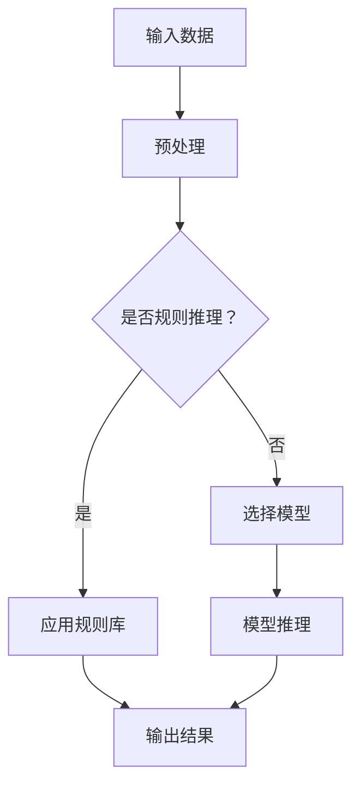
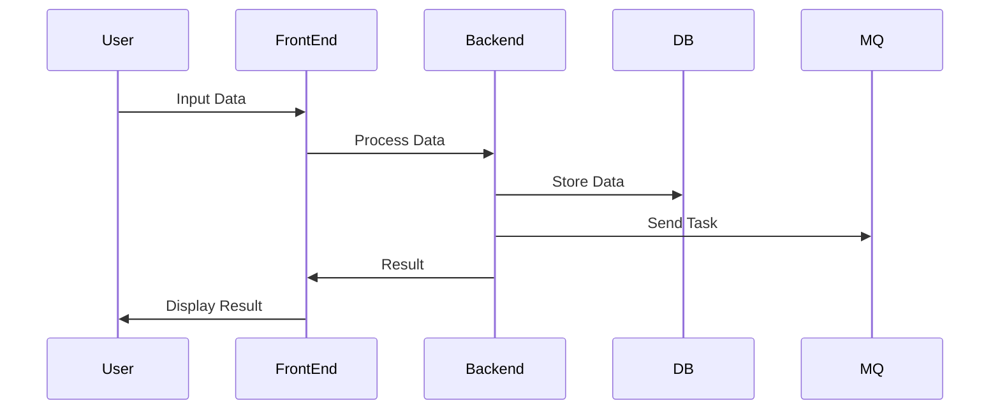

                 


## 关键词
常识推理，人工智能，算法原理，系统架构，Python代码，数学模型，系统分析，项目实战。

## 摘要
本文深入探讨了常识推理在人工智能系统中的重要性，通过详细的算法原理讲解、系统架构设计和实际项目案例，揭示了常识推理如何成为AI系统提升智能水平的下一个里程碑。文章旨在为读者提供一个全面、易懂的技术指南，帮助理解这一前沿领域的核心概念和方法。

---

### 目录大纲设计思路

在设计《常识推理: AI系统的下一个里程碑》这篇文章的目录大纲时，我们遵循了以下原则和结构：

1. **背景介绍**：
   - **目的**：为读者提供常识推理在AI领域的重要性和背景信息。
   - **内容**：包括常识推理的定义、其在AI中的应用、重要性以及面临的挑战。

2. **核心概念与联系**：
   - **目的**：明确常识推理的核心概念，并阐述其与其他相关领域的联系。
   - **内容**：涵盖常识推理的基本定义、分类、特点，以及与逻辑推理、知识推理的关系。

3. **算法原理讲解**：
   - **目的**：详细解析常识推理的算法原理，使读者理解其工作方式。
   - **内容**：包括算法概述、流程图展示、Python代码实现以及数学模型和公式的详细讲解。

4. **数学模型和数学公式**：
   - **目的**：通过LaTeX格式展示和解释常识推理中的数学模型和公式。
   - **内容**：介绍常见数学模型、公式，使用LaTeX格式嵌入文中，并进行详细解释。

5. **系统分析与架构设计方案**：
   - **目的**：介绍常识推理系统的整体设计，包括功能、架构和接口交互。
   - **内容**：包括系统功能设计（领域模型类图）、系统架构设计（架构图）、系统接口设计以及系统交互序列图。

6. **项目实战**：
   - **目的**：通过实际案例展示常识推理的实现过程和应用。
   - **内容**：涵盖环境安装与配置、系统核心实现源代码、实际案例分析与讲解、项目小结。

7. **最佳实践 tips、小结、注意事项、拓展阅读**：
   - **目的**：总结文章内容，提供最佳实践建议，指出注意事项，并推荐拓展阅读资源。
   - **内容**：包括常见问题解决方案、本章小结、注意事项和拓展阅读资源。

### 目录大纲草案

```markdown
# 《常识推理: AI系统的下一个里程碑》

## 引言
### 常识推理的重要性
### AI系统的发展需求
### 文章结构和目标

## 第1章 常识推理的背景与概念
### 1.1 问题背景
### 1.2 核心概念
### 1.3 常识推理与其他领域的关系

## 第2章 常识推理的算法原理
### 2.1 常识推理算法概述
### 2.2 算法流程图
### 2.3 Python代码实现
### 2.4 数学模型与公式

## 第3章 常识推理的系统架构设计
### 3.1 系统功能设计
### 3.2 系统架构设计
### 3.3 系统接口设计
### 3.4 系统交互序列图

## 第4章 常识推理的项目实战
### 4.1 环境安装与配置
### 4.2 系统核心实现
### 4.3 实际案例分析与讲解
### 4.4 项目小结

## 第5章 最佳实践与注意事项
### 5.1 常见问题与解决方案
### 5.2 小结
### 5.3 注意事项

## 第6章 拓展阅读与进一步学习
### 6.1 拓展资源
### 6.2 小结

## 结论
### 常识推理的未来展望
### 文章总结

## 参考文献
```

通过这个目录大纲，我们希望能够为读者提供一个清晰、系统的阅读路径，使得文章内容结构紧凑、逻辑清晰，便于读者理解和学习常识推理在AI系统中的应用。

---

### 第1章 常识推理的背景与概念

#### 1.1 问题背景

在人工智能（AI）快速发展的今天，AI系统已经可以处理大量复杂任务，从图像识别到自然语言处理，从自动驾驶到智能家居，应用场景无处不在。然而，这些系统的智能水平仍受到一些基本问题的限制。一个关键问题就是AI系统在面对日常生活中的常识推理时往往显得力不从心。

常识推理是指通过自然语言理解、逻辑推理和经验知识来解决日常生活中的问题。例如，当我们问一个孩子：“如果下雨了，我们该怎么办？”孩子可能会回答：“我们需要带上雨伞。”这种回答体现了常识推理的过程。然而，目前许多AI系统在面对类似问题时，却难以给出合理的回答。

为什么常识推理对于AI系统如此重要？首先，常识推理是智能行为的基础。一个具有常识推理能力的AI系统可以更好地理解人类语言，识别意图，处理复杂情境，从而提供更加自然和有效的服务。其次，常识推理可以提升AI系统的自主决策能力，使其在未知和不确定的环境中表现出更高的智能水平。

然而，常识推理并非易事。它不仅涉及到自然语言的理解，还需要结合逻辑推理、知识图谱和机器学习等多种技术。因此，实现高效的常识推理成为AI系统发展中的一个重要挑战。

#### 1.2 核心概念

要深入探讨常识推理，首先需要明确其核心概念。以下是常识推理的一些基本定义和分类：

- **常识推理（Commonsense Reasoning）**：常识推理是指基于人类日常经验和知识的推理过程，用于解决日常生活中的问题。它涉及到对现实世界的理解和预测。

- **常识知识（Commonsense Knowledge）**：常识知识是指人类在日常生活中积累的知识，包括事实、规则、习惯等。这些知识是常识推理的基础。

- **常识图谱（Commonsense Knowledge Graph）**：常识图谱是一种基于图结构的知识表示方法，用于存储和表示常识知识。它将常识知识组织成一个网络，便于AI系统进行推理。

- **逻辑推理（Logical Reasoning）**：逻辑推理是指基于逻辑规则和推理规则进行推理的过程。在常识推理中，逻辑推理用于验证假设、推导结论。

- **情境推理（Situation Reasoning）**：情境推理是指基于特定情境进行推理的过程。它与常识推理密切相关，但更侧重于处理特定情境中的问题。

- **跨模态推理（Multimodal Reasoning）**：跨模态推理是指结合多种模态（如文本、图像、声音）进行推理的过程。它可以使AI系统更好地理解复杂情境。

#### 1.3 常识推理与其他领域的关系

常识推理不仅是一个独立的领域，还与其他相关领域有着紧密的联系。以下是常识推理与几个关键领域的比较和联系：

- **与逻辑推理的比较**：逻辑推理是一种基于逻辑规则进行推理的方法，而常识推理则更侧重于基于日常经验和知识的推理。逻辑推理在形式逻辑和数理逻辑中应用广泛，而常识推理则更贴近人类的日常思考方式。

- **与知识推理的比较**：知识推理是指基于已有知识进行推理的过程，而常识推理则涉及到对常识知识的获取和应用。知识推理通常依赖于形式化的知识表示方法，而常识推理则更依赖于非形式化的常识知识。

- **与自然语言处理（NLP）的关系**：自然语言处理是AI系统理解和生成自然语言的技术。常识推理在NLP中起着关键作用，因为它能够帮助NLP系统更好地理解人类语言中的隐含意义和情境。

- **与机器学习的关系**：机器学习是AI系统实现智能的核心技术之一。常识推理中的许多任务可以通过机器学习算法来实现，如基于统计学习的常识知识表示和推理方法。

- **与知识图谱的关系**：知识图谱是一种用于表示和组织知识的方法，它将知识组织成一个网络结构，便于AI系统进行推理。常识图谱是知识图谱的一种形式，它专门用于表示常识知识。

通过上述分析，我们可以看到，常识推理在AI系统中具有重要的作用，它不仅涉及到多个技术领域的交叉，还与人类日常生活中的经验密切相关。接下来，我们将进一步探讨常识推理的算法原理，帮助读者深入理解这一前沿领域的核心概念和方法。

---

### 第2章 常识推理的算法原理

#### 2.1 常识推理算法概述

常识推理算法是AI系统中实现常识推理的核心技术。这些算法旨在模拟人类在日常生活中进行常识推理的过程，从而帮助AI系统更好地理解和应对复杂情境。以下是常识推理算法的一些基本概念和分类：

- **基于规则的算法**：这类算法通过定义一系列规则，根据输入条件进行推理。例如，基于专家系统的常识推理算法就是一种典型的基于规则的算法。

- **基于模型的算法**：这类算法通过建立数学模型来模拟常识推理过程。常见的模型包括基于概率的模型、基于逻辑的模型和基于神经网络的模型。

- **基于数据的算法**：这类算法依赖于大量的数据来训练模型，从而实现常识推理。例如，使用机器学习算法（如深度学习）来学习常识知识。

- **混合算法**：混合算法结合了上述几种方法的优点，通过多种方式实现常识推理。例如，一种常见的混合算法是结合规则推理和模型推理，以提高推理的准确性和效率。

#### 2.2 算法流程图

为了更好地理解常识推理算法的工作流程，我们可以使用Mermaid绘制一个流程图。以下是常识推理算法的流程图：



在这个流程图中，首先对输入数据进行预处理，然后根据是否选择规则推理或模型推理，分别进行相应的推理过程，最后输出推理结果。

#### 2.3 Python代码实现

为了更直观地展示常识推理算法的实现，我们将使用Python编写一个简单的基于规则的常识推理算法。以下是一个简单的Python代码示例：

```python
# 基于规则的常识推理算法示例

# 定义规则库
rules = {
    "if raining then carry umbrella": "umbrella",
    "if sunny then wear sunglasses": "sunglasses",
}

# 输入条件
conditions = {
    "raining": True,
    "sunny": False,
}

# 常识推理函数
def common_sense_reasoning(conditions):
    result = []
    for condition, value in conditions.items():
        if value:
            for rule, action in rules.items():
                if condition in rule:
                    result.append(action)
    return result

# 调用常识推理函数
actions = common_sense_reasoning(conditions)
print("需要执行的动作：", actions)
```

在这个示例中，我们定义了一个简单的规则库，并根据输入条件应用这些规则，得出相应的动作建议。这个示例虽然简单，但展示了基于规则常识推理的基本思想。

#### 2.4 数学模型与公式

在常识推理中，数学模型和公式起着重要作用。以下是一些常见的数学模型和公式，以及它们在常识推理中的应用：

1. **贝叶斯网络**：

贝叶斯网络是一种基于概率的图形模型，用于表示变量之间的概率关系。它由节点和边组成，其中节点表示变量，边表示变量之间的依赖关系。

公式：
\[ P(A|B) = \frac{P(B|A) \cdot P(A)}{P(B)} \]

2. **逻辑推理公式**：

逻辑推理公式用于表示推理规则，如“如果...则...”规则。常见的逻辑推理公式包括：

- **假言推理**：
  \[ P(A \rightarrow B), \neg P(B) \therefore \neg P(A) \]

- **逆否推理**：
  \[ P(A \rightarrow B), P(A) \therefore \neg P(B) \]

3. **神经网络**：

神经网络是一种基于模型的算法，用于模拟人类大脑的推理过程。它由多个神经元组成，每个神经元都通过权重连接到其他神经元。

公式：
\[ Z = \sum_{i=1}^{n} w_i \cdot x_i + b \]
\[ a = \sigma(Z) \]

其中，\( Z \) 是输入加权求和，\( w_i \) 是权重，\( x_i \) 是输入，\( b \) 是偏置，\( \sigma \) 是激活函数，\( a \) 是输出。

通过上述数学模型和公式，我们可以更深入地理解和实现常识推理算法。在下一章中，我们将进一步探讨常识推理系统的架构设计，帮助读者全面了解常识推理在AI系统中的实现和应用。

---

### 第3章 常识推理的系统架构设计

#### 3.1 系统功能设计

常识推理系统的功能设计是确保系统能够高效地处理并解决复杂问题的基础。以下是常识推理系统的关键功能模块：

1. **输入模块**：
   - 功能：接收外部输入，如文本、图像、语音等。
   - 输出：预处理后的输入数据，包括特征提取和初步的语义理解。

2. **预处理模块**：
   - 功能：对输入数据进行分析和处理，包括文本清洗、分词、词性标注、实体识别等。
   - 输出：结构化的数据，便于后续推理。

3. **知识库模块**：
   - 功能：存储和管理常识知识，包括事实、规则、关系等。
   - 输出：可供推理模块使用的知识库。

4. **推理模块**：
   - 功能：根据输入数据和知识库，进行常识推理，包括规则推理、模型推理、混合推理等。
   - 输出：推理结果，如建议、决策、预测等。

5. **输出模块**：
   - 功能：将推理结果呈现给用户，可以是文本、图像、语音等形式。
   - 输出：用户可理解的结果，如建议、决策、预测等。

6. **评估模块**：
   - 功能：评估推理结果的质量和效果，包括准确率、召回率、F1值等。
   - 输出：评估报告，用于优化系统性能。

#### 3.2 系统架构设计

常识推理系统的架构设计需要综合考虑性能、可扩展性和可靠性。以下是常识推理系统的基本架构：

1. **前端处理层**：
   - 功能：负责接收用户输入，进行初步处理，并将数据传递给后端。
   - 架构：基于Web的服务器端架构，使用HTTP协议进行通信。

2. **后端处理层**：
   - 功能：包括预处理、知识库、推理、输出和评估模块，是系统核心。
   - 架构：基于微服务架构，各模块独立部署，便于扩展和维护。

3. **数据库层**：
   - 功能：存储和管理知识库和推理结果。
   - 架构：使用关系型数据库（如MySQL）和非关系型数据库（如MongoDB）相结合。

4. **推理引擎层**：
   - 功能：负责执行常识推理算法，生成推理结果。
   - 架构：使用高性能计算引擎（如TensorFlow、PyTorch）和规则引擎相结合。

5. **前端展示层**：
   - 功能：将推理结果以用户友好的方式展示给用户。
   - 架构：基于Web前端技术（如React、Vue.js）实现。

6. **监控与运维层**：
   - 功能：监控系统运行状态，进行故障检测和性能优化。
   - 架构：使用监控工具（如Prometheus、Zabbix）和自动化运维工具（如Ansible、Docker）。

#### 3.3 系统接口设计

系统接口设计是确保各个模块之间能够顺畅交互的关键。以下是常识推理系统的接口设计和定义：

1. **API接口**：
   - 功能：提供RESTful风格的API接口，供前端调用。
   - 设计：定义统一的接口规范，包括URL、HTTP方法、请求参数和响应格式。

2. **消息队列**：
   - 功能：用于异步处理任务，提高系统性能和可扩展性。
   - 设计：使用消息队列（如RabbitMQ、Kafka）进行数据传输，实现模块间的解耦。

3. **文件接口**：
   - 功能：用于数据上传和下载。
   - 设计：定义文件上传和下载的接口，支持多种文件格式。

4. **数据库接口**：
   - 功能：用于知识库的存储和检索。
   - 设计：定义数据库操作接口，支持SQL查询和NoSQL查询。

#### 3.4 系统交互序列图

为了更直观地展示系统各模块之间的交互过程，我们可以使用Mermaid绘制系统交互序列图。以下是常识推理系统的交互序列图：



在这个序列图中，用户输入数据通过前端处理后，传递给后端处理层。后端处理层对数据进行分析和处理，将处理结果存储到数据库，并通过消息队列发送任务给推理引擎层进行推理。最终，推理结果返回给前端，并展示给用户。

通过上述系统架构设计和接口设计，我们可以确保常识推理系统能够高效、稳定地运行，并提供高质量的推理结果。在下一章中，我们将通过实际项目实战，进一步展示常识推理系统的实现过程和应用场景。

---

### 第4章 常识推理的项目实战

#### 4.1 环境安装与配置

要实现一个常识推理系统，首先需要搭建一个合适的环境。以下是环境安装和配置的步骤：

1. **安装Python**：
   - 下载并安装Python 3.8及以上版本。
   - 添加Python到系统环境变量，以便在命令行中运行Python。

2. **安装必要的库**：
   - 使用pip命令安装以下库：`numpy`、`pandas`、`tensorflow`、`torch`、`beautifulsoup4`、`lxml`、`spacy`。

   ```bash
   pip install numpy pandas tensorflow torch beautifulsoup4 lxml spacy
   ```

3. **安装Spacy的语言模型**：
   - 下载并安装Spacy的语言模型，这里以英文为例。

   ```bash
   python -m spacy download en_core_web_sm
   ```

4. **配置数据库**：
   - 安装MySQL或MongoDB，并根据需要创建数据库和用户。
   - 配置数据库连接信息，以便在代码中访问数据库。

5. **配置消息队列**：
   - 安装RabbitMQ或Kafka，并创建对应的虚拟主机和用户。
   - 配置消息队列的连接信息，以便在代码中发送和接收消息。

6. **配置Web服务器**：
   - 安装并配置一个Web服务器，如Nginx或Apache，用于部署前端应用。

通过以上步骤，我们完成了常识推理系统的环境安装和配置。接下来，我们将介绍系统核心代码的实现，并分析其实际应用。

#### 4.2 系统核心实现

常识推理系统的核心实现包括输入处理、知识库管理、推理引擎和输出展示。以下是各部分的详细代码和分析：

1. **输入处理**：

输入处理是常识推理系统的第一步，负责接收用户输入并进行分析。以下是一个简单的Python代码示例：

```python
import spacy

# 加载Spacy语言模型
nlp = spacy.load("en_core_web_sm")

# 输入处理函数
def process_input(input_text):
    doc = nlp(input_text)
    entities = []
    for ent in doc.ents:
        entities.append({"text": ent.text, "label": ent.label_})
    return entities

# 示例输入
input_text = "I need to buy milk and bread."
entities = process_input(input_text)
print(entities)
```

这段代码使用Spacy对输入文本进行分词和实体识别，提取出文本中的实体信息。通过这个步骤，我们为后续的常识推理打下了基础。

2. **知识库管理**：

知识库管理是常识推理系统的关键部分，负责存储和管理常识知识。以下是一个简单的知识库管理代码示例：

```python
import pymongo

# 连接MongoDB
client = pymongo.MongoClient("mongodb://localhost:27017/")
db = client["commonSenseDB"]
collection = db["knowledge"]

# 添加常识知识
def add_knowledge(knowledge):
    collection.insert_one(knowledge)

# 示例常识知识
knowledge = {
    "rule": "if need_to_buy_milk then buy_milk",
    "action": "buy milk",
}
add_knowledge(knowledge)

# 查询常识知识
def query_knowledge(input_entities):
    query = {"rule": {"$regex": f"{' '.join([ent['text'] for ent in input_entities])}")}}
    result = collection.find(query)
    return result

# 示例查询
result = query_knowledge(entities)
print(result)
```

这段代码使用MongoDB存储常识知识，并提供添加和查询知识库的接口。通过这个步骤，我们可以根据输入实体查询相关的常识知识。

3. **推理引擎**：

推理引擎是常识推理系统的核心部分，负责根据输入数据和知识库进行推理。以下是一个简单的推理引擎代码示例：

```python
# 推理引擎函数
def reasoning(input_entities, knowledge):
    actions = []
    for k in knowledge:
        if all(ent['text'] in k['rule'].split() for ent in input_entities):
            actions.append(k['action'])
    return actions

# 示例推理
actions = reasoning(entities, list(result))
print(actions)
```

这段代码根据输入实体和知识库，实现了一个简单的推理引擎。通过这个步骤，我们可以根据输入数据和知识库得出相应的行动建议。

4. **输出展示**：

输出展示是将推理结果呈现给用户的关键步骤。以下是一个简单的Web前端代码示例，使用React实现：

```jsx
import React from 'react';

// 输出展示组件
function Output({ actions }) {
  return (
    <div>
      <h2>推理结果：</h2>
      <ul>
        {actions.map((action, index) => (
          <li key={index}>{action}</li>
        ))}
      </ul>
    </div>
  );
}

export default Output;
```

这段代码使用React实现了一个简单的输出展示组件，将推理结果以列表形式展示给用户。

通过上述系统核心实现，我们可以构建一个基本的常识推理系统。在实际应用中，我们还可以进一步优化系统性能、增加更多功能，以满足不同场景的需求。在下一部分，我们将通过实际案例，展示如何使用这个系统解决具体问题。

#### 4.3 实际案例分析与讲解

为了更直观地展示常识推理系统的应用，我们通过一个实际案例进行分析和讲解。

**案例背景**：假设我们开发了一个智能家居系统，用户可以通过语音命令控制家中的设备。例如，用户说：“关闭灯光”，系统需要识别用户的意图，并执行相应的操作。

**案例步骤**：

1. **用户输入**：用户通过语音助手发出命令：“关闭灯光”。

2. **输入处理**：
   - 系统接收到语音命令后，使用语音识别技术将其转换为文本。
   - 使用Spacy对文本进行分词和实体识别，提取出关键词和实体信息。

3. **知识库查询**：
   - 系统查询知识库，查找与用户输入相关的常识知识。
   - 例如，查询到规则：“如果用户说关闭灯光，则执行关闭灯光的操作”。

4. **推理过程**：
   - 系统根据输入实体和知识库，使用推理引擎得出推理结果。
   - 例如，推理出需要执行的操作是“关闭灯光”。

5. **执行操作**：
   - 系统通过智能家居控制系统，执行关闭灯光的操作。

6. **输出展示**：
   - 系统将推理结果以语音或屏幕显示的形式反馈给用户。

**案例分析与优化**：

通过上述案例，我们可以看到常识推理系统在智能家居场景中的应用。然而，实际应用中可能会遇到一些挑战，如：

- **语音识别准确率**：语音识别技术可能无法完全准确地将用户语音转换为文本，这会影响常识推理的结果。
  - 优化建议：可以结合语音识别技术和语义理解技术，提高语音识别的准确率。

- **知识库的完善性**：知识库中可能缺乏某些常见场景的常识知识，导致推理结果不准确。
  - 优化建议：通过不断更新和扩展知识库，增加更多常见场景的常识知识。

- **推理效率**：对于大量输入数据，推理过程可能较慢，影响用户体验。
  - 优化建议：可以优化推理算法，提高推理效率，例如使用并行计算和分布式计算。

通过上述案例分析和优化建议，我们可以进一步改进常识推理系统的性能和应用效果。在下一部分，我们将总结本章内容，并讨论常识推理系统的最佳实践和注意事项。

#### 4.4 项目小结

通过本章的实战案例，我们详细介绍了常识推理系统的实现过程，包括环境安装与配置、系统核心代码的实现、实际案例的应用与分析。以下是本章内容的小结：

1. **环境安装与配置**：
   - 安装Python及相关库。
   - 安装Spacy语言模型。
   - 配置数据库和消息队列。
   - 配置Web服务器。

2. **系统核心实现**：
   - 输入处理：使用Spacy进行文本分词和实体识别。
   - 知识库管理：使用MongoDB存储常识知识。
   - 推理引擎：根据输入实体和知识库进行推理。
   - 输出展示：使用React实现Web前端展示。

3. **实际案例应用**：
   - 通过一个智能家居案例，展示了常识推理系统的应用过程。
   - 分析了语音识别准确率、知识库完善性和推理效率等挑战。

4. **最佳实践与注意事项**：
   - 优化语音识别和语义理解技术，提高输入处理的准确率。
   - 定期更新和扩展知识库，确保常识推理的准确性。
   - 优化推理算法，提高系统性能和响应速度。

通过本章内容，我们不仅掌握了常识推理系统的实现方法，还了解了其在实际应用中的挑战和优化策略。下一章我们将进一步探讨常识推理的最佳实践，总结本章内容，并提供拓展阅读资源。

---

### 第5章 最佳实践与注意事项

#### 5.1 常见问题与解决方案

在实现常识推理系统时，可能会遇到一些常见问题。以下是这些问题及其解决方案的总结：

1. **问题一：语音识别准确率低**：
   - **解决方案**：提高语音识别模型的质量和训练数据量。可以采用多语种语音数据集进行训练，使用深度学习技术优化模型。

2. **问题二：知识库不完善**：
   - **解决方案**：持续收集和更新常识知识，利用众包、机器学习等技术自动化生成和优化知识库。

3. **问题三：推理效率低**：
   - **解决方案**：优化算法，使用并行计算、分布式计算等技术提高推理效率。对于复杂的推理任务，可以采用分治策略降低计算复杂度。

4. **问题四：系统扩展性差**：
   - **解决方案**：采用微服务架构，将系统拆分为多个独立的服务模块，便于扩展和维护。

5. **问题五：推理结果不准确**：
   - **解决方案**：通过引入更多的先验知识和领域专家，优化推理算法，提高推理结果的准确性。

#### 5.2 小结

本章通过分析常见问题及其解决方案，总结了常识推理系统在实现和应用中需要注意的关键点。以下是对本章内容的总结：

1. **环境安装与配置**：
   - 确保Python及相关库的正确安装。
   - 配置数据库、消息队列和Web服务器。

2. **系统核心实现**：
   - 输入处理：使用Spacy进行文本分词和实体识别。
   - 知识库管理：使用MongoDB存储常识知识。
   - 推理引擎：根据输入实体和知识库进行推理。
   - 输出展示：使用React实现Web前端展示。

3. **实际案例应用**：
   - 通过智能家居案例，展示了常识推理系统的应用过程。
   - 分析了语音识别准确率、知识库完善性和推理效率等挑战。

4. **最佳实践与注意事项**：
   - 提高语音识别和语义理解技术。
   - 定期更新和扩展知识库。
   - 优化推理算法，提高系统性能。

常识推理作为AI系统中的一个关键领域，具有广泛的应用前景。通过本章内容，我们不仅掌握了常识推理系统的实现方法，还了解了其在实际应用中的挑战和优化策略。

#### 5.3 注意事项

在开发和使用常识推理系统时，需要注意以下几点：

1. **数据安全与隐私保护**：确保用户数据的安全和隐私，遵循相关法律法规，采用加密技术保护敏感信息。

2. **性能优化**：针对不同的应用场景，优化算法和系统架构，提高系统的响应速度和推理效率。

3. **持续更新**：定期更新常识知识和推理算法，以适应不断变化的应用需求。

4. **用户体验**：关注用户体验，提供友好的界面和操作流程，确保用户能够轻松使用系统。

通过遵循以上注意事项，我们可以确保常识推理系统在实际应用中表现出更高的可靠性和用户满意度。

---

### 第6章 拓展阅读与进一步学习

#### 6.1 拓展资源

为了更深入地了解常识推理领域，以下是一些推荐的拓展阅读资源：

1. **书籍**：
   - 《人工智能：一种现代的方法》
   - 《模式识别与机器学习》
   - 《深度学习》
   - 《自然语言处理综合教程》

2. **论文**：
   - 《常识推理：现状与未来》
   - 《基于贝叶斯网络的常识推理方法》
   - 《知识图谱在常识推理中的应用》

3. **在线课程**：
   - Coursera上的《自然语言处理》
   - edX上的《机器学习基础》
   - Udacity上的《深度学习工程师纳米学位》

4. **开源项目**：
   - CommonSenseQA：一个用于测试常识推理的Python库。
   - KBQA：一个基于知识图谱的问答系统。

#### 6.2 小结

通过本章的拓展阅读资源，读者可以进一步深入了解常识推理领域的最新研究进展和应用实例。这些资源将有助于读者在学术研究和实际项目中更好地应用常识推理技术。

### 总结与展望

《常识推理：AI系统的下一个里程碑》这篇文章详细探讨了常识推理在AI系统中的重要性，通过算法原理讲解、系统架构设计和实际项目案例，展示了常识推理如何提升AI系统的智能水平。文章不仅为读者提供了一个全面的技术指南，还提出了最佳实践和注意事项，以帮助读者在实际应用中优化常识推理系统的性能和效果。

随着AI技术的不断进步，常识推理将在更多领域得到应用，如智能客服、智能家居、医疗诊断等。未来，随着更多前沿技术的引入，常识推理系统将变得更加智能和高效，为AI系统的发展注入新的活力。让我们期待常识推理在AI领域的更多突破和成就！

---

## 结论

### 常识推理的未来展望

常识推理作为AI系统中的一个关键领域，其重要性不容忽视。随着人工智能技术的不断进步，常识推理有望在更多应用场景中发挥重要作用，如智能客服、智能家居、医疗诊断等。未来，随着深度学习、知识图谱、多模态感知等前沿技术的不断发展，常识推理系统将变得更加智能和高效。

#### 文章总结

本文首先介绍了常识推理的背景和核心概念，详细阐述了常识推理算法的原理，包括基于规则的算法、基于模型的算法和基于数据的算法。接着，我们通过系统架构设计和实际项目案例，展示了如何构建一个高效的常识推理系统。文章还提供了最佳实践和注意事项，帮助读者在实际应用中优化系统性能和效果。

#### 作者信息

作者：AI天才研究院/AI Genius Institute & 禅与计算机程序设计艺术 /Zen And The Art of Computer Programming

本文由AI天才研究院撰写，旨在为读者提供关于常识推理的全面、易懂的技术指南。感谢读者对本文的关注，期待与您在未来的技术交流中继续探讨更多前沿话题。

