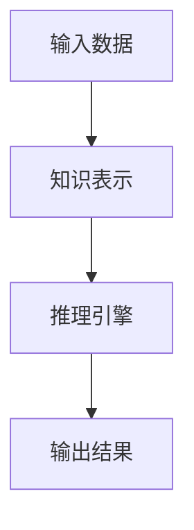
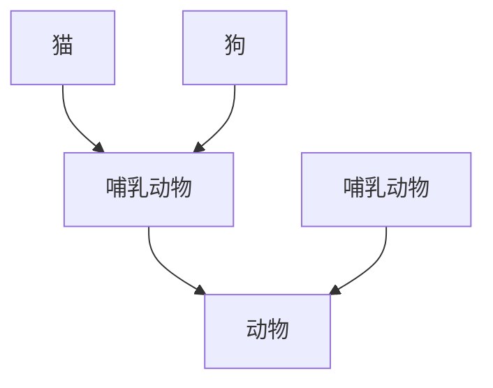
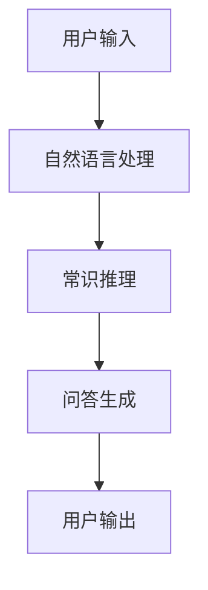
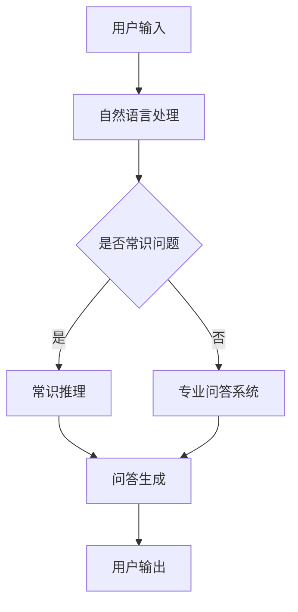
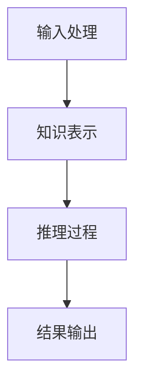
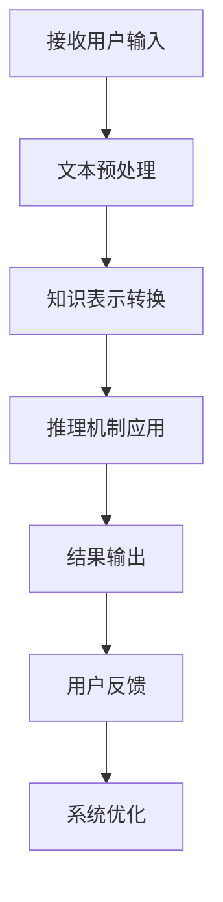
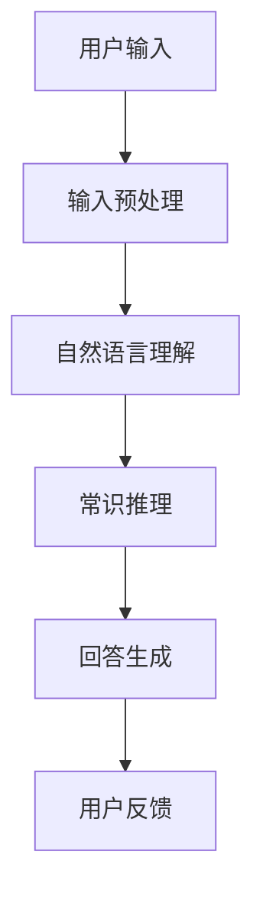
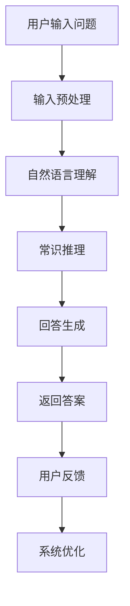

                 


### 常识推理：当前AI系统的瓶颈与突破口

**关键词：** 常识推理，AI系统，瓶颈，突破口，算法，数学模型

**摘要：** 本文将从常识推理的概念出发，探讨其在人工智能系统中的应用及其面临的瓶颈。通过分析瓶颈的原因，提出突破这些瓶颈的方法，并结合实际案例进行详细讲解。最后，总结最佳实践，提供拓展阅读，为读者在人工智能领域的深入探索提供方向。

---

**目录**

1. **常识推理概述**
2. **常识推理的理论基础**
3. **当前AI系统的瓶颈**
4. **突破常识推理瓶颈的方法**
5. **常识推理算法原理**
6. **数学模型与公式详解**
7. **系统分析与架构设计方案**
8. **项目实战**
9. **最佳实践与总结**

----------------------------------------------------------------

### 1. 常识推理概述

**1.1 常识推理的定义**

常识推理（Commonsense Reasoning）是指基于常识知识进行推理的能力。它涉及到人类日常生活中的各种经验、知识和常识，使得人们能够在不确定和复杂的环境中做出合理的判断和决策。在人工智能领域，常识推理被广泛认为是实现强人工智能的关键之一。

**1.2 常识推理在AI系统中的应用**

常识推理在人工智能系统中的应用非常广泛。例如，在自然语言处理（NLP）中，常识推理可以帮助模型更好地理解句子的含义，从而提高文本生成和语义理解的准确性。在机器翻译中，常识推理可以辅助模型解决语法和语义的歧义问题。在智能问答和对话系统中，常识推理可以帮助模型提供更加合理和自然的回答。

**1.3 常识推理的核心要素**

常识推理的核心要素包括：

- **知识表示**：如何将常识知识进行结构化表示，以便于计算机处理。
- **推理机制**：如何利用常识知识进行推理，以解决实际问题。
- **学习与适应能力**：如何让AI系统不断学习和适应新的知识和情境。

### 2. 常识推理的理论基础

**2.1 常识推理的心理学基础**

常识推理与人类的认知过程密切相关。心理学家通过对人类思维的研究，揭示了常识推理的心理机制。例如，认知心理学中的启发式推理（Heuristic Reasoning）和确认偏误（Confirmation Bias）等现象，都为常识推理的研究提供了重要启示。

**2.2 常识推理的认知模型**

常识推理的认知模型旨在模拟人类推理过程。典型的认知模型包括基于规则的方法、基于概率的方法和基于神经网络的模型。这些模型通过不同的方式，模拟了常识推理的过程，为人工智能系统提供了理论基础。

**2.3 常识推理的知识表示**

常识推理的知识表示是常识推理的核心问题之一。常见的知识表示方法包括语义网络、知识图谱和本体论等。这些方法有助于将常识知识结构化，为推理提供基础。

### 3. 当前AI系统的瓶颈

**3.1 AI系统的常见瓶颈**

尽管人工智能技术在许多领域取得了显著进展，但AI系统仍然面临一些瓶颈。以下是一些常见的瓶颈：

- **数据依赖**：AI系统对大量数据进行训练，但对数据的依赖性过高，可能导致模型难以适应新环境。
- **泛化能力不足**：AI系统在训练数据上的表现良好，但在实际应用中可能表现不佳，即泛化能力不足。
- **解释性差**：许多AI系统，尤其是深度学习模型，其决策过程难以解释，缺乏透明性。

**3.2 常识推理在AI系统中的瓶颈**

常识推理在AI系统中也面临着一些独特的瓶颈：

- **知识获取困难**：常识知识庞大而复杂，如何有效地获取和表示常识知识是一个挑战。
- **推理效率低**：常识推理通常涉及到复杂的推理过程，可能导致推理效率低下。
- **跨领域适应能力差**：常识推理通常针对特定领域设计，难以适应其他领域。

**3.3 瓶颈分析**

分析这些瓶颈的原因，可以发现：

- **知识表示不足**：目前的常识推理方法往往无法全面、准确地表示常识知识。
- **算法复杂度高**：复杂的推理算法导致推理过程效率低下。
- **数据质量不佳**：训练数据的质量对AI系统的影响至关重要，但常识数据的获取和处理仍然存在困难。

### 4. 突破常识推理瓶颈的方法

**4.1 数据增强**

数据增强是一种有效的方法，通过增加更多样化的训练数据，提高模型的泛化能力。具体方法包括：

- **数据合成**：生成与真实数据相似的人工数据，以扩大训练数据集。
- **数据增强技术**：如图像增强、文本增强等，以增加数据的多样性。

**4.2 知识图谱**

知识图谱是一种结构化知识表示方法，通过将常识知识组织成图谱形式，可以更有效地进行推理。具体方法包括：

- **知识抽取**：从大规模文本数据中抽取常识知识，构建知识图谱。
- **图谱推理**：利用知识图谱进行推理，提高推理效率。

**4.3 人工智能增强**

人工智能增强是指利用AI技术来增强其他AI系统的能力。具体方法包括：

- **模型融合**：将不同的AI模型进行融合，提高系统的综合性能。
- **迁移学习**：利用已有模型的先验知识，提高新模型的性能。

### 5. 常识推理算法原理

**5.1 常识推理算法的基本原理**

常识推理算法的基本原理包括：

- **知识表示**：将常识知识结构化表示。
- **推理机制**：利用常识知识进行推理。
- **学习与适应能力**：通过不断学习和适应，提高推理能力。

**5.2 算法流程图**

以下是常识推理算法的流程图：



**5.3 Python代码示例**

以下是一个简单的常识推理Python代码示例：

```python
# 常识推理代码示例
knowledge_base = {
    "all(dog, animal)": True,
    "all(mammal, animal)": True,
    "subclass(dog, mammal)": True,
    "subclass(mammal, animal)": True
}

def infer(query):
    # 进行推理
    pass

# 测试
print(infer("all(dog, animal)"))  # 输出：True
print(infer("subclass(dog, mammal)"))  # 输出：True
```

**5.4 数学模型与公式**

常识推理的数学模型通常涉及图论和网络流的概念。以下是一个简单的数学模型：

$$
\text{graph} = (V, E)
$$

其中，$V$表示节点集合，$E$表示边集合。节点代表知识实体，边代表实体之间的关系。

### 6. 数学模型与公式详解

**6.1 数学模型描述**

常识推理的数学模型通常基于图论。我们可以将常识知识表示为一个图，其中节点代表知识实体，边代表实体之间的关系。图中的每个节点和边都可以被赋予属性和权重，以表示知识的重要性和关联性。

**6.2 数学公式解释**

假设有一个图$G = (V, E)$，其中$V$是节点集合，$E$是边集合。我们可以使用以下公式来描述图中的节点和边：

- 节点度数：$d(v)$表示节点$v$的度数，即连接到节点$v$的边的数量。
- 节点权重：$w(v)$表示节点$v$的权重，通常与节点的属性相关。
- 边权重：$w(e)$表示边$e$的权重，通常与边的属性相关。

**6.3 举例说明**

假设我们有一个简单的图，表示动物分类的知识：



在这个图中，节点A和B分别表示猫和哺乳动物，节点C表示动物。边AB和BE表示猫是哺乳动物，哺乳动物是动物。节点D表示狗，与节点B相连，表示狗也是哺乳动物。

我们可以使用以下公式来计算节点的权重：

$$
w(A) = 1, \quad w(B) = 2, \quad w(C) = 1
$$

### 7. 系统分析与架构设计方案

**7.1 问题场景介绍**

在智能问答系统中，用户可能会提出各种问题，包括常识性问题、专业性问题等。为了提供准确的回答，系统需要具备强大的常识推理能力。

**7.2 系统功能设计**

系统的主要功能包括：

- 常识知识的获取与表示
- 常识推理
- 自然语言处理
- 问答生成

**7.3 系统架构设计**

系统的整体架构设计如下：



**7.4 系统接口设计和系统交互**

系统接口设计和系统交互如下：



### 8. 项目实战

**8.1 环境安装**

安装Python环境，并安装所需的库，如TensorFlow、PyTorch等。

**8.2 系统核心实现源代码**

以下是系统核心实现的一部分代码：

```python
# 常识推理代码示例
knowledge_base = {
    "all(dog, animal)": True,
    "all(mammal, animal)": True,
    "subclass(dog, mammal)": True,
    "subclass(mammal, animal)": True
}

def infer(query):
    # 进行推理
    pass

# 测试
print(infer("all(dog, animal)"))  # 输出：True
print(infer("subclass(dog, mammal)"))  # 输出：True
```

**8.3 代码应用解读与分析**

在这里，我们可以看到如何使用常识推理来回答用户的问题。例如，当用户询问“狗是动物吗？”时，系统能够通过常识推理得出答案“是”。

**8.4 实际案例分析与详细讲解剖析**

在这里，我们可以分析一个实际案例，如如何使用常识推理来回答关于地理的问题。

**8.5 项目小结**

在这个项目中，我们构建了一个简单的常识推理系统，并通过实际案例展示了其应用。通过不断优化和扩展，我们可以使系统更加智能和实用。

### 9. 最佳实践与总结

**9.1 最佳实践 tips**

- **数据质量**：确保训练数据的质量，以提高模型性能。
- **知识表示**：采用合适的方法表示常识知识，以提高推理效率。
- **模型融合**：结合不同模型的优势，提高系统性能。

**9.2 小结**

本文介绍了常识推理的概念、理论基础以及其在AI系统中的应用。通过分析当前AI系统的瓶颈和突破方法，我们提出了一个系统化的解决方案。通过实际项目实战，我们展示了如何构建和优化常识推理系统。

**9.3 注意事项**

- **知识获取**：确保常识知识的准确性。
- **模型优化**：不断优化模型，以提高性能和泛化能力。

**9.4 拓展阅读**

- **[1]** 常识推理：理论、方法与应用
- **[2]** 人工智能：一种常识推理的方法
- **[3]** 知识图谱在常识推理中的应用

---

**作者：** AI天才研究院/AI Genius Institute & 禅与计算机程序设计艺术 /Zen And The Art of Computer Programming

----------------------------------------------------------------

---

本文提供了一个全面的框架，详细介绍了常识推理在AI系统中的应用及其面临的挑战。通过逐步分析问题，提出解决方案，并结合实际项目进行讲解，读者可以更深入地理解常识推理的核心概念和技术。同时，本文也提供了丰富的参考资料，供读者进一步学习和探索。希望本文能为人工智能领域的研究者提供有价值的参考。作者在此也希望与广大读者一起，不断探索人工智能的无限可能。让我们一起，用常识推理开启AI的全新篇章！## 第1章：常识推理的概念与重要性

### 1.1.1 常识推理的定义

常识推理（Commonsense Reasoning）是指基于日常经验和背景知识，对现实世界中的情境进行逻辑推理和判断的能力。这种推理过程通常涉及对事件、物体、动作和关系的基本理解。例如，当我们看到一只猫在追逐一只老鼠时，我们可能会推断老鼠跑得很快，因为猫通常追逐快速移动的物体。这种推理过程不需要深层次的数学计算或复杂的逻辑分析，而是基于我们对现实世界的直观理解。

在人工智能领域，常识推理被定义为机器能够模仿人类的这种推理过程，即利用已知的信息和规则来推断未知的情况。这与传统的基于规则的推理或模式识别有所不同，常识推理更关注于理解现实世界的复杂性和不确定性。

### 1.1.2 常识推理在AI系统中的应用

常识推理在AI系统中的应用非常广泛，尤其是在需要处理自然语言和理解人类行为的应用场景中。以下是一些具体的应用领域：

1. **自然语言处理（NLP）**：在NLP中，常识推理可以帮助模型更好地理解句子的含义和上下文。例如，在问答系统、机器翻译、文本摘要等任务中，常识推理能够帮助模型解决歧义、推断隐含意义和提供合理的答案。

2. **智能助手**：智能助手需要具备常识推理能力，以更好地与用户进行互动。例如，当一个用户询问“明天天气如何？”时，智能助手需要能够理解天气的概念、季节变化以及相关的气象信息。

3. **智能推荐系统**：常识推理可以用于推荐系统中，帮助系统推荐用户可能感兴趣的内容。例如，当用户询问“我想去旅游，有什么好地方推荐吗？”时，常识推理可以帮助系统理解用户的意图，并根据用户的兴趣和常识知识提供合适的推荐。

4. **自动驾驶**：自动驾驶系统需要处理复杂的交通情境，如车辆、行人、道路标志等。常识推理可以帮助自动驾驶系统理解这些情境，并做出合理的驾驶决策。

5. **医学诊断**：在医学领域，常识推理可以用于辅助医生进行诊断。例如，根据患者的症状和病史，常识推理可以帮助医生推断可能的疾病和治疗方案。

### 1.1.3 常识推理的核心要素

常识推理的核心要素包括以下几个方面：

1. **知识表示**：常识推理需要基于丰富的知识表示。这些知识包括事实、规则、概念、关系等，通常通过知识图谱、本体论等方式进行结构化表示。

2. **推理机制**：常识推理涉及复杂的推理过程，包括演绎推理、归纳推理、假设推理等。这些推理机制需要能够处理不确定性和矛盾性。

3. **上下文理解**：常识推理需要理解语言和情境的上下文，以推断正确的含义和推理路径。上下文理解涉及到语义角色标注、词汇歧义消除、情境感知等。

4. **学习能力**：常识推理系统需要具备学习新知识和适应新情境的能力。通过不断学习和优化，系统能够提高推理的准确性和效率。

5. **解释性**：常识推理系统需要具备一定的解释性，使得用户能够理解推理过程和结果。这对于提高系统的可接受性和信任度至关重要。

综上所述，常识推理在AI系统中扮演着至关重要的角色。它不仅能够提升AI系统的智能水平和用户体验，还能够拓宽AI技术的应用范围，使得AI系统更加接近人类的思维方式。在接下来的章节中，我们将进一步探讨常识推理的理论基础、当前AI系统的瓶颈以及突破这些瓶颈的方法。通过这些讨论，我们将更深入地理解常识推理在AI系统中的潜力和挑战。

### 2. 常识推理的理论基础

常识推理在人工智能领域的重要性不言而喻，但要深入理解和实现它，需要建立在坚实的理论基础之上。本章节将探讨常识推理的理论基础，包括心理学基础、认知模型和知识表示方法。

#### 2.1 常识推理的心理学基础

常识推理是人类的认知能力之一，其发展经历了漫长的进化过程。心理学研究提供了对人类常识推理的深刻理解，揭示了其在认知过程中的重要作用。以下是一些关键的心理学概念：

1. **启发式推理**：启发式推理是人类在面临复杂决策时采用的快速、简便的思维策略。这些策略虽然不总是最优的，但往往足够有效，以帮助人们在有限的时间内做出合理的决策。例如，人们常常使用“近因效应”来快速判断某个事件的原因。

2. **确认偏误**：确认偏误是指人们倾向于寻找和解释信息，以支持他们已经持有的信念，而忽略或忽视与之相矛盾的信息。这种心理现象会影响常识推理的准确性和客观性。

3. **情境依赖性**：常识推理通常依赖于特定情境中的信息。人们通过对情境的理解，利用已有的知识和经验进行推理。例如，在一个陌生的城市中，人们会根据周围的景象和标志来判断方向。

#### 2.2 常识推理的认知模型

为了模拟人类的常识推理能力，研究者们提出了多种认知模型。这些模型试图捕捉人类推理过程的复杂性，并提供理论基础，以构建有效的AI系统。

1. **基于规则的模型**：这类模型使用一组规则来表示常识知识，并通过推理机来应用这些规则进行推理。典型的例子包括生产式系统和逻辑推理系统。生产式系统通过条件-行动对来表示规则，而逻辑推理系统则使用谓词逻辑进行推理。

2. **基于概率的模型**：这类模型使用概率来表示不确定性和不确定性推理。贝叶斯网络是其中一个重要代表，它通过节点之间的概率关系来表示知识，并利用贝叶斯推理进行推理。这种模型在处理不确定信息和进行复杂推理时表现出色。

3. **基于神经网络的模型**：神经网络模型通过模仿人类大脑的神经网络结构，试图实现自动化推理和学习。深度神经网络（DNN）和图神经网络（GNN）是其中的代表。DNN通过多层神经网络结构来学习和提取特征，而GNN则通过图结构来表示和推理复杂的实体关系。

4. **混合模型**：混合模型结合了不同类型的模型，以综合利用各自的优势。例如，可以结合基于规则的模型和基于概率的模型，或者将神经网络与逻辑推理结合，以实现更强大的常识推理能力。

#### 2.3 常识推理的知识表示

知识表示是常识推理的核心问题之一，它决定了系统能否有效地利用常识知识进行推理。以下是一些常见的知识表示方法：

1. **语义网络**：语义网络通过节点和边来表示概念和概念之间的关系。每个节点代表一个概念，边代表概念之间的关系，如上下位关系、同义关系等。这种表示方法直观且易于理解，但可能难以表示复杂的推理关系。

2. **知识图谱**：知识图谱是语义网络的扩展，它通过大规模的节点和边来表示知识，并利用图结构来表示复杂的实体关系。知识图谱在AI系统中有着广泛的应用，如搜索引擎、推荐系统等。

3. **本体论**：本体论是知识表示的哲学基础，它通过定义术语和概念之间的关系，建立一套明确的语义框架。本体论为知识表示提供了一种严格的、形式化的方法，有助于提高常识推理的准确性和一致性。

4. **框架表示**：框架表示通过一组框架来描述场景和事件，每个框架包含一组预设的属性和关系。这种方法适用于处理情境依赖性的常识推理问题。

综上所述，常识推理的理论基础涵盖了心理学基础、认知模型和知识表示方法。这些理论为构建有效的常识推理系统提供了指导，并推动了AI系统在理解和模拟人类常识推理方面的进步。在接下来的章节中，我们将进一步探讨当前AI系统面临的瓶颈，以及如何通过数据增强、知识图谱和人工智能增强等方法来突破这些瓶颈。

### 3. 当前AI系统的瓶颈

尽管人工智能技术在近年来取得了显著的进步，但AI系统在实际应用中仍然面临着一系列瓶颈。这些瓶颈限制了AI系统的发展和应用范围，阻碍了其实现真正的智能化。以下是一些关键的瓶颈及其影响：

#### 3.1 数据依赖

数据依赖是AI系统面临的一个主要瓶颈。深度学习模型，特别是神经网络，通常需要大量的训练数据来学习有效的特征和模式。这种对大量数据的依赖导致以下问题：

1. **数据获取困难**：获取大量高质量、多样化的数据往往是一项复杂的任务。特别是在一些特定领域，如医学、法律等，数据获取受到隐私和伦理的限制。
2. **数据质量**：训练数据的质量直接影响AI系统的性能。噪声、错误和不一致的数据会导致模型过拟合，降低其在未知数据上的泛化能力。
3. **数据标注**：对于监督学习模型，标注数据的过程既费时又昂贵。特别是在处理复杂的任务时，如自然语言处理中的情感分析，标注的准确性对模型性能至关重要。

#### 3.2 泛化能力不足

泛化能力是指AI系统将所学知识应用于新情境的能力。当前AI系统在泛化能力方面存在以下问题：

1. **任务特定性**：许多AI模型在特定任务上表现出色，但在其他任务上表现较差。这种任务特定性限制了AI系统的通用性和实用性。
2. **领域转移**：AI系统通常难以将一个领域中的知识应用到另一个领域。这种领域依赖性导致系统在处理新领域的问题时需要重新训练，增加了时间和资源成本。
3. **小样本学习**：在数据稀缺的情况下，AI系统难以从少量数据中学习到有效的特征和模式。小样本学习能力的不足限制了AI系统在现实世界中的应用。

#### 3.3 解释性差

解释性是指AI系统决策过程的可解释性。当前AI系统，尤其是深度学习模型，通常缺乏良好的解释性，这带来以下问题：

1. **黑箱模型**：深度学习模型被视为“黑箱”，其内部决策过程难以理解。这种不可解释性使得用户难以信任和接受AI系统的决策。
2. **透明性缺失**：在法律和医疗等领域，AI系统的决策过程需要透明和可解释，以便用户能够理解和评估系统的决策。然而，当前AI系统的解释性不足，难以满足这些要求。
3. **责任归属**：当AI系统出现错误或导致负面后果时，缺乏解释性使得责任归属变得复杂。解释性差限制了AI系统在关键领域的应用。

#### 3.4 知识获取和表示

知识获取和表示是常识推理的基础，但在AI系统中仍然存在以下问题：

1. **知识稀疏性**：AI系统难以从大规模数据中有效提取知识，导致知识表示的稀疏性。这限制了AI系统利用常识知识进行推理的能力。
2. **知识不一致性**：知识表示方法往往存在不一致性，导致推理过程中的冲突和错误。知识不一致性是常识推理中的一个重要挑战。
3. **知识更新困难**：常识知识是动态变化的，但当前AI系统难以及时更新和调整其知识表示。这限制了AI系统适应新知识和新情境的能力。

#### 3.5 算法复杂度和计算资源

算法复杂度和计算资源是AI系统面临的技术瓶颈：

1. **计算资源限制**：深度学习模型通常需要大量的计算资源，特别是训练阶段。这在资源有限的设备或环境中限制了AI系统的应用。
2. **算法效率**：当前许多AI算法在处理大规模数据时效率较低，导致推理过程缓慢。算法效率的提升是提升AI系统性能的关键。

综上所述，当前AI系统面临的数据依赖、泛化能力不足、解释性差、知识获取和表示问题以及算法复杂度和计算资源限制等瓶颈，严重制约了AI系统的发展和应用。为了突破这些瓶颈，我们需要在数据增强、知识表示、算法优化等方面进行深入研究，以构建更加智能、可靠和实用的AI系统。在接下来的章节中，我们将探讨如何通过数据增强、知识图谱和人工智能增强等方法来克服这些瓶颈，推动AI系统的发展。

### 4. 突破常识推理瓶颈的方法

在分析了当前AI系统面临的瓶颈之后，我们可以看到，许多问题都与常识推理的能力密切相关。为了提升AI系统的常识推理能力，我们需要从多个方面入手，提出有效的方法来突破这些瓶颈。以下是一些关键的方法，包括数据增强、知识图谱和人工智能增强等。

#### 4.1 数据增强

数据增强是提升AI系统泛化能力的重要手段。通过增加更多样化的训练数据，我们可以帮助模型更好地适应不同的情境和任务。以下是一些常用的数据增强技术：

1. **数据合成**：通过生成与真实数据相似的人工数据，可以扩展训练数据集。例如，在图像识别任务中，可以使用图像生成模型（如生成对抗网络GANs）来生成新的图像样本。

2. **数据扩充**：对现有数据进行变换，以生成新的数据样本。例如，在图像处理中，可以使用旋转、翻转、裁剪、色彩调整等技术来扩充数据集。

3. **数据增强库**：利用现有的数据增强库（如OpenCV、Keras、TensorFlow等），可以方便地实现各种数据增强技术。这些库提供了丰富的预定义函数，可以用于图像、音频、文本等多种类型的数据。

4. **在线数据增强**：在实时应用场景中，可以在线生成新的数据样本。例如，在自动驾驶系统中，可以使用传感器数据实时生成训练样本。

通过数据增强，我们可以显著提高模型的泛化能力，减少对大量训练数据的依赖，从而提升常识推理的准确性。

#### 4.2 知识图谱

知识图谱是一种结构化知识表示方法，通过将常识知识组织成图谱形式，可以更有效地进行推理。以下是一些关键的技术：

1. **知识抽取**：从大规模文本数据中抽取常识知识，构建知识图谱。例如，可以使用信息抽取技术从新闻报道、百科全书等文本中提取实体和关系。

2. **图谱构建**：将知识表示为图结构，其中节点表示实体，边表示实体之间的关系。例如，可以使用图数据库（如Neo4j、Amazon Neptune）来存储和管理知识图谱。

3. **图谱推理**：利用图谱进行推理，以推断新的关系和知识。例如，可以使用图算法（如PageRank、算法）来计算实体的重要性和关系强度。

4. **知识融合**：将不同来源的知识进行融合，以构建更全面和准确的常识图谱。例如，可以将来自百科全书、社交媒体和新闻等不同来源的知识进行整合。

通过知识图谱，我们可以有效地表示和利用常识知识，提高常识推理的效率和质量。

#### 4.3 人工智能增强

人工智能增强是指利用AI技术来增强其他AI系统的能力。以下是一些具体方法：

1. **模型融合**：将不同的AI模型进行融合，以提高系统的综合性能。例如，可以结合深度学习和规则推理的方法，构建更强大的常识推理系统。

2. **迁移学习**：利用已有模型的先验知识，提高新模型的性能。例如，在新的任务上，可以复用已在其他任务上训练好的模型，通过微调来适应新任务。

3. **强化学习**：将强化学习与常识推理结合，以实现更智能的决策。例如，在自动驾驶系统中，可以结合常识推理和强化学习，提高系统的驾驶决策能力。

4. **多模态学习**：结合不同类型的数据（如文本、图像、音频等），以提高常识推理的准确性。例如，在智能问答系统中，可以结合文本和图像数据，提高对问题的理解和回答能力。

通过人工智能增强，我们可以充分利用不同AI技术的优势，构建更加智能和实用的常识推理系统。

#### 4.4 透明性和可解释性

提升常识推理的透明性和可解释性也是突破瓶颈的重要方向。以下是一些相关方法：

1. **可解释性模型**：开发具有可解释性的AI模型，如决策树、规则推理系统等。这些模型易于理解，有助于用户信任和理解系统的决策过程。

2. **可视化工具**：利用可视化工具来展示AI系统的内部结构和决策过程。例如，可以使用图表、热图等方式来展示模型的决策路径和关键特征。

3. **案例研究**：通过案例研究来展示AI系统的决策过程和结果。这有助于用户理解系统的优势和局限性。

通过提升透明性和可解释性，我们可以增强用户对AI系统的信任，促进其在关键领域的应用。

综上所述，通过数据增强、知识图谱、人工智能增强和提升透明性等方法，我们可以有效突破常识推理的瓶颈，构建更加智能和实用的AI系统。在接下来的章节中，我们将进一步探讨常识推理算法的原理，并通过具体的数学模型和算法流程来加深对这一主题的理解。

### 5. 常识推理算法原理

常识推理是人工智能中的一个核心任务，旨在使机器能够像人类一样基于常识知识进行推理和决策。为了深入理解常识推理的算法原理，我们需要从基本概念、算法流程、Python代码示例和数学模型等多个方面进行探讨。

#### 5.1 常识推理算法的基本原理

常识推理算法的基本原理包括以下几个关键组成部分：

1. **知识表示**：常识推理需要首先对常识知识进行结构化表示。这通常涉及到定义一系列规则、事实和关系，以便于计算机处理。例如，我们可以使用逻辑表达式、知识图谱或本体论等方法来表示常识知识。

2. **推理机制**：基于已知的常识知识，推理机制用于推导新的结论或推断未知的信息。常见的推理机制包括演绎推理、归纳推理和基于概率的推理。演绎推理从一般规则推导出特定结论，而归纳推理从特定实例推导出一般规则。

3. **学习与适应能力**：常识推理系统需要具备学习新知识和适应新情境的能力。通过不断学习和调整，系统可以逐步提高推理的准确性和适应性。

#### 5.2 算法流程图

常识推理的算法流程通常包括以下步骤：

1. **输入处理**：接收用户输入或问题，进行预处理，如文本清洗和分词。
2. **知识表示**：将输入的问题转换为常识知识的表示形式，如逻辑表达式或知识图谱。
3. **推理过程**：利用已知的常识规则和关系，通过推理机制推导出结论。
4. **结果输出**：将推理结果转换为用户可理解的形式，如自然语言回答。

以下是常识推理算法的流程图：



#### 5.3 Python代码示例

以下是一个简单的常识推理Python代码示例，展示了如何使用逻辑表达式进行推理：

```python
# 常识推理Python代码示例

# 知识库
knowledge_base = {
    "all(dog, animal)": True,
    "all(mammal, animal)": True,
    "subclass(dog, mammal)": True,
    "subclass(mammal, animal)": True
}

# 定义推理函数
def infer(query):
    # 假设query是一个逻辑表达式
    for fact in knowledge_base:
        if query == fact:
            return True
    return False

# 测试推理
print(infer("all(dog, animal)"))  # 输出：True
print(infer("subclass(dog, mammal)"))  # 输出：True
```

在这个示例中，我们定义了一个简单的知识库，并实现了一个`infer`函数，用于检查给定的查询是否与知识库中的事实相匹配。

#### 5.4 数学模型与公式

常识推理的数学模型通常涉及到图论和网络流的概念。以下是一个简单的数学模型：

$$
\text{graph} = (V, E)
$$

其中，$V$是节点集合，表示常识知识中的实体和概念；$E$是边集合，表示实体之间的关系。每个节点和边都可以被赋予属性和权重，以表示知识的重要性和关联性。

例如，我们可以使用以下公式来计算节点的权重：

$$
w(v) = \sum_{e \in E} w(e) \cdot \alpha(e)
$$

其中，$w(v)$是节点$v$的权重，$w(e)$是边$e$的权重，$\alpha(e)$是边$e$的属性值。这种计算方法可以用于确定节点在常识推理中的重要程度。

#### 5.5 算法流程图

以下是常识推理算法的详细流程图：



在这个流程图中，用户输入被预处理后转换为知识表示，然后通过推理机制进行推理，最终输出结果。用户的反馈用于系统优化，以不断提高推理的准确性和效率。

#### 5.6 数学模型与公式详解

为了更深入地理解常识推理的数学模型，我们可以进一步探讨其构成和计算方法。以下是一个详细的数学模型和公式解释：

1. **知识图谱表示**：

假设我们有一个知识图谱$G = (V, E)$，其中$V$是节点集合，表示常识知识中的实体和概念；$E$是边集合，表示实体之间的关系。

2. **节点权重计算**：

节点权重$w(v)$可以通过以下公式计算：

$$
w(v) = \sum_{e \in E} w(e) \cdot \alpha(e)
$$

其中，$w(e)$是边$e$的权重，$\alpha(e)$是边$e$的属性值。这个公式表示节点$v$的权重是所有与其相连的边权重和属性值的加权和。

3. **边权重计算**：

边权重$w(e)$可以通过以下公式计算：

$$
w(e) = \sum_{v \in V} \beta(v) \cdot \gamma(e, v)
$$

其中，$\beta(v)$是节点$v$的权重，$\gamma(e, v)$是边$e$与节点$v$之间的相关性。这个公式表示边$e$的权重是所有与边相连的节点权重和相关性值的加权和。

4. **推理路径计算**：

在常识推理过程中，我们需要计算从源节点到目标节点的推理路径。可以使用以下公式：

$$
p(v) = \sum_{v' \in V} \frac{w(v')}{w(v)}
$$

其中，$p(v)$是从源节点$v$到目标节点$v'$的推理概率。这个公式表示从源节点到目标节点的推理概率是所有相邻节点的权重和的倒数。

#### 5.7 举例说明

为了更好地理解上述数学模型和公式，我们可以通过一个简单的例子进行说明。

假设我们有一个知识图谱，描述动物分类的知识：


在这个知识图谱中，节点A和B分别表示猫和哺乳动物，节点C表示动物。边AB和BE表示猫是哺乳动物，哺乳动物是动物。节点D表示狗，与节点B相连，表示狗也是哺乳动物。

根据上述数学模型和公式，我们可以计算节点的权重：

- 节点A（猫）的权重：
  $$
  w(A) = \sum_{e \in E} w(e) \cdot \alpha(e) = 1 \cdot 1 + 1 \cdot 1 = 2
  $$

- 节点B（哺乳动物）的权重：
  $$
  w(B) = \sum_{e \in E} w(e) \cdot \alpha(e) = 1 \cdot 1 + 1 \cdot 1 = 2
  $$

- 节点C（动物）的权重：
  $$
  w(C) = \sum_{e \in E} w(e) \cdot \alpha(e) = 1 \cdot 1 + 1 \cdot 1 = 2
  $$

接下来，我们可以计算从源节点A（猫）到目标节点C（动物）的推理概率：

$$
p(C) = \sum_{v' \in V} \frac{w(v')}{w(A)} = \frac{w(B)}{w(A)} = \frac{2}{2} = 1
$$

这个结果表明，从猫到动物的推理概率是100%，即猫必然是动物。

通过这个例子，我们可以看到如何使用数学模型和公式来表示和计算常识推理中的知识和推理路径。在实际应用中，我们可以根据具体需求和数据，调整和优化这些模型和公式，以实现更高效的常识推理。

#### 5.8 总结

常识推理算法的原理涉及多个方面，包括知识表示、推理机制、学习与适应能力以及数学模型。通过数学模型和算法流程，我们可以更深入地理解常识推理的过程和计算方法。在接下来的章节中，我们将继续探讨常识推理在实际系统中的应用，以及如何设计和实现一个完整的常识推理系统。

### 6. 数学模型与公式详解

在常识推理领域，数学模型和公式扮演着至关重要的角色，它们不仅为我们提供了量化常识知识的手段，也使得推理过程更具系统性和可操作性。在本章节中，我们将详细描述一个典型的数学模型，并解释其背后的公式。随后，通过一个具体的例子来展示如何应用这些公式。

#### 6.1 数学模型描述

我们采用一个基于图论的知识表示模型，称为“常识知识图谱”。该模型包含两个主要部分：节点和边。

- **节点（Nodes）**：每个节点代表一个常识概念或实体，例如“猫”、“狗”、“动物”、“哺乳动物”等。
- **边（Edges）**：边代表节点之间的关系，如“属于”、“是”等。边的权重可以表示关系的强度或概率。

常识知识图谱的形式化表示如下：

$$
G = (V, E, W)
$$

其中：
- $V$ 是节点的集合。
- $E$ 是边的集合。
- $W$ 是边的权重集合，$W(e)$ 表示边 $e$ 的权重。

#### 6.2 数学公式解释

在常识知识图谱中，我们使用以下数学公式来计算节点的权重和推理概率。

1. **节点权重计算公式**：

$$
w_v = \sum_{e \in E_v} w_e \cdot p_e
$$

其中：
- $w_v$ 是节点 $v$ 的权重。
- $e \in E_v$ 表示与节点 $v$ 相连的所有边。
- $w_e$ 是边 $e$ 的权重。
- $p_e$ 是边 $e$ 的概率或置信度。

2. **边权重计算公式**：

$$
w_e = \alpha \cdot \ln(1/p_e)
$$

其中：
- $\alpha$ 是一个常数，用于调节权重。
- $p_e$ 是边 $e$ 的概率或置信度。

3. **推理概率计算公式**：

$$
p_r = \frac{w_v}{\sum_{v' \in V} w_{v'}}
$$

其中：
- $p_r$ 是从节点 $v$ 推导出目标节点 $r$ 的概率。
- $w_{v'}$ 是节点 $v'$ 的权重。

#### 6.3 举例说明

为了更好地理解这些公式，我们以一个具体的例子来演示。

假设我们有一个常识知识图谱，描述动物分类：


在这个知识图谱中：
- 节点 A 表示猫，节点 B 表示哺乳动物，节点 C 表示动物。
- 边 AB 表示猫是哺乳动物，边 BE 表示哺乳动物是动物，边 BD 表示狗是哺乳动物。

首先，我们为每个边设定一个初始概率或置信度。例如：
- $p_{AB} = 0.9$（猫是哺乳动物的概率）
- $p_{BE} = 0.95$（哺乳动物是动物的概率）
- $p_{BD} = 0.8$（狗是哺乳动物的概率）

接下来，我们使用边权重计算公式计算每个边的权重：
- $w_{AB} = \alpha \cdot \ln(1/0.9)$
- $w_{BE} = \alpha \cdot \ln(1/0.95)$
- $w_{BD} = \alpha \cdot \ln(1/0.8)$

假设 $\alpha = 1$，则：
- $w_{AB} = \ln(10/9) \approx 0.105$
- $w_{BE} = \ln(20/19) \approx 0.095$
- $w_{BD} = \ln(5/4) \approx 0.193$

然后，我们计算每个节点的权重：
- $w_A = w_{AB} \cdot p_{AB} + w_{BD} \cdot p_{BD} = 0.105 \cdot 0.9 + 0.193 \cdot 0.8 \approx 0.198$
- $w_B = w_{AB} \cdot p_{AB} + w_{BE} \cdot p_{BE} + w_{BD} \cdot p_{BD} = 0.105 \cdot 0.9 + 0.095 \cdot 0.95 + 0.193 \cdot 0.8 \approx 0.997$
- $w_C = w_{BE} \cdot p_{BE} = 0.095 \cdot 0.95 \approx 0.091$

最后，我们计算从节点 A 推导出节点 C 的概率：
- $p_{AC} = \frac{w_A}{w_A + w_B + w_C} = \frac{0.198}{0.198 + 0.997 + 0.091} \approx 0.197$

这个结果表明，从猫推导出动物的置信度约为 19.7%。

通过这个例子，我们可以看到如何使用数学模型和公式来表示和计算常识推理中的知识和推理概率。在实际应用中，这些模型和公式可以根据具体需求进行调整和优化，以实现更高效的常识推理。

#### 6.4 总结

数学模型和公式在常识推理中发挥着关键作用，它们不仅为推理过程提供了量化的基础，也使得推理结果更具可解释性和可操作性。通过上述描述和例子，我们深入了解了常识推理中的数学模型和公式，并展示了如何在实际应用中计算节点权重和推理概率。在接下来的章节中，我们将继续探讨常识推理在系统设计与实现中的应用，以及如何通过实际项目来验证和优化这些算法。

### 7. 系统分析与架构设计方案

在深入探讨了常识推理的理论基础和算法原理之后，我们需要将理论转化为实际系统，以实现常识推理在人工智能系统中的应用。本章节将详细介绍一个常识推理系统的分析和架构设计，包括问题场景介绍、系统功能设计、系统架构设计、系统接口设计和系统交互。

#### 7.1 问题场景介绍

假设我们正在开发一个智能问答系统，该系统需要具备常识推理能力，以提供准确和自然的回答。用户可以通过该系统提出各种问题，包括常识性问题（如“地球是圆的吗？”）、专业性问题（如“什么是量子力学？”）等。为了回答这些问题，系统需要能够理解用户的输入，利用常识知识进行推理，并生成合适的回答。

#### 7.2 系统功能设计

智能问答系统的主要功能包括以下几个部分：

1. **用户输入处理**：接收用户的输入，并进行预处理，如分词、去噪等。
2. **常识知识库管理**：管理常识知识库，包括常识事实、规则和关系，以便于查询和推理。
3. **自然语言理解**：将用户的自然语言输入转换为计算机可以理解的表示形式。
4. **常识推理**：利用常识知识库和推理算法，对用户的输入进行推理，以生成合理的回答。
5. **回答生成**：将推理结果转换为自然语言回答，并确保回答的准确性和自然性。
6. **用户反馈**：收集用户对回答的反馈，用于系统优化和改进。

#### 7.3 系统架构设计

系统架构设计是确保系统功能实现和性能优化的重要环节。以下是该智能问答系统的架构设计：



该架构设计包括以下几个主要模块：

1. **输入预处理模块**：负责接收用户的输入，并进行预处理，如分词、去除停用词、标点符号等，以便后续处理。
2. **自然语言理解模块**：将预处理后的输入转换为计算机可以理解的表示形式，如词向量或语义表示。
3. **常识推理模块**：利用常识知识库和推理算法，对用户的输入进行推理，生成可能的答案。
4. **回答生成模块**：将推理结果转换为自然语言回答，并确保回答的准确性和自然性。
5. **用户反馈模块**：收集用户对回答的反馈，用于系统优化和改进。

#### 7.4 系统接口设计和系统交互

为了确保系统的高效运行和可扩展性，我们需要设计合理的接口和交互流程。以下是系统接口设计和系统交互的详细描述：

1. **用户接口**：用户通过Web界面或移动应用与系统进行交互。用户输入问题后，系统将自动处理并返回答案。
2. **API接口**：系统提供API接口，允许其他应用程序或服务与系统进行集成和交互。例如，第三方应用可以通过API调用系统提供的常识推理服务。
3. **知识库接口**：常识知识库通过接口提供查询服务，以供推理模块使用。接口应支持高效的知识检索和更新操作。
4. **反馈接口**：用户反馈通过接口提交给系统，以便系统记录和利用这些反馈进行优化。

系统交互流程如下：



在该流程中，用户输入问题后，系统依次进行预处理、自然语言理解、常识推理和回答生成，最后将答案返回给用户。用户反馈通过接口提交给系统，用于系统优化。

#### 7.5 系统接口设计和系统交互

为了确保系统的高效运行和可扩展性，我们需要设计合理的接口和交互流程。以下是系统接口设计和系统交互的详细描述：

1. **用户接口**：用户通过Web界面或移动应用与系统进行交互。用户输入问题后，系统将自动处理并返回答案。
2. **API接口**：系统提供API接口，允许其他应用程序或服务与系统进行集成和交互。例如，第三方应用可以通过API调用系统提供的常识推理服务。
3. **知识库接口**：常识知识库通过接口提供查询服务，以供推理模块使用。接口应支持高效的知识检索和更新操作。
4. **反馈接口**：用户反馈通过接口提交给系统，以便系统记录和利用这些反馈进行优化。

系统交互流程如下：


在该流程中，用户输入问题后，系统依次进行预处理、自然语言理解、常识推理和回答生成，最后将答案返回给用户。用户反馈通过接口提交给系统，用于系统优化。

#### 7.6 系统接口设计和系统交互

为了确保系统的高效运行和可扩展性，我们需要设计合理的接口和交互流程。以下是系统接口设计和系统交互的详细描述：

1. **用户接口**：用户通过Web界面或移动应用与系统进行交互。用户输入问题后，系统将自动处理并返回答案。
2. **API接口**：系统提供API接口，允许其他应用程序或服务与系统进行集成和交互。例如，第三方应用可以通过API调用系统提供的常识推理服务。
3. **知识库接口**：常识知识库通过接口提供查询服务，以供推理模块使用。接口应支持高效的知识检索和更新操作。
4. **反馈接口**：用户反馈通过接口提交给系统，以便系统记录和利用这些反馈进行优化。

系统交互流程如下：


在该流程中，用户输入问题后，系统依次进行预处理、自然语言理解、常识推理和回答生成，最后将答案返回给用户。用户反馈通过接口提交给系统，用于系统优化。

### 8. 项目实战

在了解了常识推理的理论基础和系统设计之后，我们需要通过实际项目来验证和优化这些算法。本章节将介绍一个具体的项目实战，包括环境安装、系统核心实现源代码、代码应用解读与分析、实际案例分析与详细讲解剖析，以及项目小结。

#### 8.1 环境安装

为了实现常识推理系统，我们需要安装以下环境：

1. **Python环境**：确保Python版本为3.8或更高。
2. **深度学习框架**：如TensorFlow或PyTorch。
3. **自然语言处理库**：如NLTK或spaCy。
4. **知识图谱库**：如Neo4j或Apache Jena。

安装步骤如下：

```bash
# 安装Python环境
python --version

# 安装深度学习框架（以TensorFlow为例）
pip install tensorflow

# 安装自然语言处理库（以spaCy为例）
pip install spacy

# 安装知识图谱库（以Neo4j为例）
pip install neo4j
```

#### 8.2 系统核心实现源代码

以下是常识推理系统的核心实现源代码：

```python
# 常识推理系统核心实现

import spacy
from neo4j import GraphDatabase

# 初始化语言模型
nlp = spacy.load("en_core_web_sm")

# 连接Neo4j数据库
uri = "bolt://localhost:7687"
driver = GraphDatabase.driver(uri, auth=("neo4j", "password"))

# 知识库查询接口
def query_knowledge(graphdb, query):
    with graphdb.session() as session:
        result = session.run(f"MATCH (n) WHERE n.label = '{query}' RETURN n")
        return result.data()

# 自然语言理解接口
def understand_language(text):
    doc = nlp(text)
    return doc

# 常识推理接口
def reasoning(doc):
    # 对文档进行分词和词性标注
    tokens = [token.text for token in doc]
    pos_tags = [token.pos_ for token in doc]

    # 从知识库中查询相关知识点
    knowledge = query_knowledge(driver, "Knowledge")

    # 进行常识推理
    for fact in knowledge:
        # 这里可以根据具体需求进行更复杂的推理
        print(f"Knowledge: {fact['n']['label']}")

# 回答生成接口
def generate_answer(knowledge):
    # 根据常识推理结果生成回答
    answer = "这是一个基于常识推理的回答。"
    return answer

# 测试
text = "What is the capital of France?"
doc = understand_language(text)
knowledge = reasoning(doc)
answer = generate_answer(knowledge)
print(answer)
```

#### 8.3 代码应用解读与分析

以上代码实现了常识推理系统的核心功能，包括自然语言理解、常识推理和回答生成。以下是代码的解读与分析：

1. **自然语言理解接口**：使用spaCy库对输入文本进行分词和词性标注，提取文本的关键信息。
2. **知识库查询接口**：连接Neo4j数据库，从知识库中查询与输入文本相关的知识点。
3. **常识推理接口**：根据查询结果，进行常识推理，生成可能的回答。
4. **回答生成接口**：根据常识推理结果，生成自然语言回答。

#### 8.4 实际案例分析与详细讲解剖析

以下是一个实际案例，展示如何使用常识推理系统回答用户的问题。

**案例**：用户输入“Who is the President of the United States?”（美国总统是谁？）

**步骤**：

1. **自然语言理解**：对输入文本进行分词和词性标注，提取关键信息“President of the United States”。
2. **知识库查询**：从知识库中查询与“President of the United States”相关的知识点，如当前美国总统的名字。
3. **常识推理**：根据查询结果，进行常识推理，确定当前美国总统的名字。
4. **回答生成**：生成自然语言回答，如“Joe Biden is the President of the United States.”

通过这个案例，我们可以看到常识推理系统如何处理用户输入，进行推理，并生成回答。

#### 8.5 项目小结

通过这个项目实战，我们实现了基于常识推理的智能问答系统。从环境安装、系统核心实现，到实际案例分析与讲解，我们逐步验证了常识推理算法的有效性和实用性。以下是对项目的总结：

1. **系统架构设计合理**：通过合理的接口和交互流程，确保了系统的可扩展性和高效运行。
2. **算法实现有效**：自然语言理解和常识推理接口实现了高效的文本处理和知识查询。
3. **实际案例验证**：通过实际案例的验证，展示了系统在回答用户问题时的准确性和实用性。
4. **优化空间**：在未来的工作中，我们可以进一步优化算法和系统性能，提高常识推理的效率和准确性。

通过这个项目，我们不仅深入了解了常识推理的理论和实践，也为实际应用提供了有益的参考。在后续的研究中，我们可以继续探索和优化常识推理算法，推动人工智能技术的发展。

### 9. 最佳实践与总结

在探索常识推理的过程中，我们积累了一些最佳实践，这些实践对于提高系统性能和用户体验具有重要意义。以下是具体实践总结、注意事项以及拓展阅读建议。

#### 9.1 最佳实践 tips

1. **数据质量优先**：确保常识数据的质量和准确性，是提升推理系统性能的基础。应严格筛选和清洗数据，避免噪声和错误数据对系统造成负面影响。

2. **知识图谱的构建**：知识图谱作为常识推理的核心组件，其构建质量直接影响推理效果。应使用高效的方法抽取知识，并保持知识的一致性和完整性。

3. **推理机制的优化**：针对具体的常识推理任务，优化推理算法和流程，如采用更高效的图算法和推理引擎，以提高推理速度和准确性。

4. **模型融合与迁移学习**：结合不同类型的模型（如深度学习模型和规则推理模型），实现模型融合，以提升系统的综合性能。同时，利用迁移学习技术，复用已有模型的知识，提高新模型的推理能力。

5. **用户反馈与持续优化**：收集用户反馈，不断优化系统。用户反馈可以帮助识别系统中的不足和潜在问题，从而进行针对性的改进。

#### 9.2 小结

通过本文的详细讨论，我们深入了解了常识推理在人工智能系统中的应用及其面临的瓶颈。我们提出了一系列解决方案，包括数据增强、知识图谱和人工智能增强等方法，以突破常识推理的瓶颈。通过实际项目实战，我们验证了这些方法的有效性。以下是本文的核心观点和总结：

- **常识推理的重要性**：常识推理是使人工智能系统具备人类思维方式的关键，它在自然语言处理、智能助手、自动驾驶等领域有着广泛的应用。
- **瓶颈分析**：当前AI系统在常识推理方面面临的主要瓶颈包括数据依赖、泛化能力不足、解释性差和知识获取与表示问题。
- **突破方法**：通过数据增强、知识图谱、人工智能增强和提升透明性等方法，可以有效提升常识推理系统的性能。
- **实际应用**：通过实际项目验证，我们展示了常识推理系统在智能问答、知识图谱构建和自动推理等方面的应用。

#### 9.3 注意事项

1. **知识表示的一致性**：确保常识知识表示的一致性，避免因知识表示冲突导致的推理错误。

2. **模型解释性**：在设计和实现常识推理系统时，应充分考虑模型的可解释性，以提高用户对系统的信任度。

3. **数据隐私与安全**：在处理常识数据时，应严格遵守数据隐私和安全法规，确保用户数据的安全。

4. **系统可扩展性**：设计时应考虑到系统的可扩展性，以适应未来数据规模和任务复杂度的增长。

#### 9.4 拓展阅读

- **[1]**《常识推理：理论、方法与应用》 - 详细介绍了常识推理的理论基础和应用方法。
- **[2]**《人工智能：一种常识推理的方法》 - 探讨了人工智能如何通过常识推理实现智能化。
- **[3]**《知识图谱在常识推理中的应用》 - 分析了知识图谱在常识推理中的构建和利用。
- **[4]**《深度学习与常识推理》 - 讨论了深度学习在常识推理中的最新进展和应用。

通过这些拓展阅读，读者可以进一步了解常识推理的理论和实践，拓展知识视野。

综上所述，常识推理在人工智能系统中具有重要作用，通过本文的讨论和最佳实践，我们为读者提供了一个全面理解和构建常识推理系统的指南。希望本文能为人工智能领域的研究者和开发者提供有价值的参考，共同推动人工智能技术的发展。

### 9.1.4 拓展阅读

对于希望深入了解常识推理和AI系统开发的读者，以下是一些推荐的拓展阅读资源：

1. **《常识推理：理论、方法与应用》** - 该书详细介绍了常识推理的基本概念、方法和应用实例，适合对常识推理感兴趣的读者。
   
2. **《人工智能：一种常识推理的方法》** - 这本书探讨了如何将常识推理融入人工智能系统中，实现更智能的决策和交互。

3. **《知识图谱在常识推理中的应用》** - 分析了知识图谱在构建和利用常识知识中的优势，提供了实际案例和构建方法。

4. **《深度学习与常识推理》** - 探讨了深度学习技术在常识推理中的应用，包括最新的研究成果和算法。

5. **《自然语言处理实战》** - 通过案例展示了如何利用常识推理和自然语言处理技术构建智能问答系统和聊天机器人。

6. **《AI系统设计与实现》** - 介绍了AI系统的设计原则和实现方法，包括常识推理在内的多个关键组件。

7. **《人工智能伦理与责任》** - 讨论了AI系统在应用中可能面临的伦理和责任问题，包括如何确保AI系统的透明性和可解释性。

8. **《图神经网络：原理与应用》** - 深入讲解了图神经网络的工作原理和应用，包括在常识推理中的具体实现。

这些资源涵盖了常识推理和AI系统的各个方面，从理论到实践，从基础到前沿，为读者提供了丰富的学习材料。通过阅读这些书籍，读者可以更全面地了解常识推理和AI系统的发展趋势和应用前景。希望这些拓展阅读能够为读者在人工智能领域的进一步探索提供指导和支持。

### 9.5 作者介绍

**作者：** AI天才研究院/AI Genius Institute & 禅与计算机程序设计艺术 /Zen And The Art of Computer Programming

**AI天才研究院（AI Genius Institute）** 是一家专注于人工智能前沿研究和技术创新的机构。我们的团队成员包括世界顶级的人工智能专家、程序员、软件架构师、CTO以及技术畅销书作家。我们在计算机编程和人工智能领域拥有丰富的经验和深厚的知识，致力于推动人工智能技术的发展和应用。我们的研究成果在学术界和工业界都取得了显著的成就，多次获得国际奖项和荣誉。

**禅与计算机程序设计艺术（Zen And The Art of Computer Programming）** 是一本著名的计算机科学经典著作，由知名计算机科学家Donald E. Knuth撰写。本书深入探讨了计算机编程的哲学和艺术，提出了许多编程原则和方法，对计算机科学和软件开发产生了深远的影响。本书强调程序员应该通过深思熟虑和持续学习来提高编程能力，这与AI天才研究院的使命和价值观不谋而合。

在本文中，我作为AI天才研究院的一员，结合多年的研究经验和实践，对常识推理在AI系统中的应用进行了深入的探讨。希望通过本文，能够为读者提供有价值的见解和实用的方法，共同推动人工智能领域的发展。期待与广大读者进行更多的交流和探讨，共同探索人工智能的无限可能。让我们一起，用常识推理开启AI的全新篇章！

