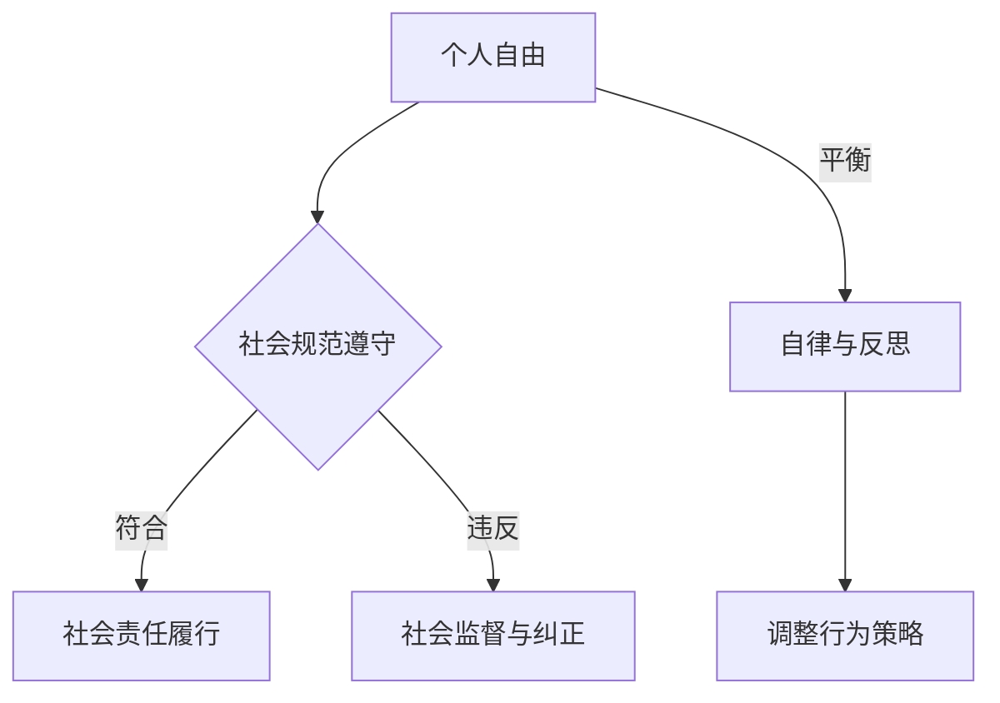
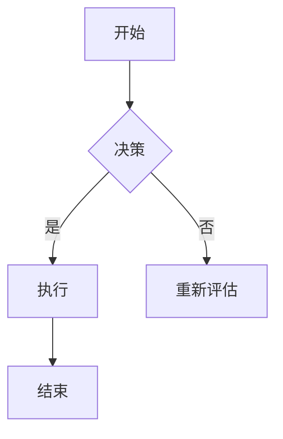

                 


### 让我们一步一步深入思考：平衡个人自由与社会责任

#### 1. 背景介绍

**1.1 引言**

在当今这个信息爆炸、技术飞速发展的时代，个人自由与社会责任之间的关系愈发显得复杂而重要。个体在追求自由的同时，不可避免地要面对社会责任的约束。这种平衡既是社会发展的需要，也是每个个体成长的必经之路。

**1.2 问题的背景**

随着互联网和人工智能的普及，个人在信息时代获得了前所未有的自由。我们可以自由地获取信息、表达观点、选择生活方式。然而，这种自由并非无限制的，它需要与社会责任相平衡。社会责任要求个体在享受自由的同时，也要承担相应的义务和责任。

**1.3 问题的描述**

如何平衡个人自由与社会责任，是现代社会面临的一个重要问题。这个问题不仅仅涉及道德和伦理，更关系到社会秩序和稳定。个体如何在追求自由的过程中，不损害社会利益，实现个人价值与社会价值的和谐统一，是值得我们深入探讨的。

**1.4 问题的解决**

解决这一问题的关键在于明确个人自由与社会责任的边界，建立平衡原则，并培养负责任的行为模式。通过合理的社会制度和个人自律，我们可以实现个人自由与社会责任的良性互动。

**1.5 边界与外延**

个人自由与社会责任的边界是相对的，不同的社会和文化背景下，这个边界会有所不同。在探索这一边界时，我们需要考虑到法律、道德、文化等多方面因素。

#### 2. 核心概念与联系

**2.1 个人自由与社会责任的定义**

**个人自由**：指个体在法律和社会规范允许的范围内，自主决定行为和生活方式的权利。

**社会责任**：指个体在享受自由的同时，对社会和他人应尽的义务和责任。

**2.2 核心概念属性特征对比**

| 特征 | 个人自由 | 社会责任 |
| --- | --- | --- |
| 定义 | 自主决定行为 | 对社会和他人尽责 |
| 目的 |追求个人价值 | 维护社会秩序 |
| 限制 | 法律和社会规范 | 法律和道德规范 |
| 影响力 | 个人层面 | 社会层面 |

**2.3 概念之间的关系**

个人自由与社会责任并非对立关系，而是相互依存、相互制约的关系。个人自由是社会赋予个体的权利，而社会责任是个体对社会的回报。只有在个人自由与社会责任相互平衡的前提下，社会才能实现持续发展和个体的全面成长。

#### 3. ER实体关系图

为了更清晰地展示个人自由与社会责任之间的关系，我们可以使用Mermaid ER图来描述。

```mermaid
erDiagram
  User ||--|{ Responsibility } : has
  User ||--|{ Freedom } : has
  Responsibility ||--|{ SocialResponsibility } : is
  Freedom ||--|{ PersonalFreedom } : is
```

在这个ER图中，`User`代表个体，`Responsibility`代表个体应承担的责任，`Freedom`代表个体的自由。`SocialResponsibility`和`PersonalFreedom`则分别表示社会责任和个人自由。这种关系展示了个体在社会中的角色以及个人自由与社会责任之间的互动。

接下来，我们将进一步探讨个人自由与社会责任的平衡原则、行为模式、策略以及它们在社会发展中的作用。

### 个人自由与社会责任的平衡原则

#### 3.1 平衡原则概述

在探讨个人自由与社会责任的平衡时，我们首先要明确几个基本原则。这些原则为我们提供了指导，帮助我们在实际操作中找到个人自由与社会责任的平衡点。

**3.1.1 自律原则**

自律是个体平衡个人自由与社会责任的基础。个体需要通过自我约束，确保自己的行为不会对社会和他人造成负面影响。自律不仅体现在道德层面，还涉及到法律规范和社会期望。

**3.1.2 公平原则**

公平原则要求我们在平衡个人自由与社会责任时，确保每个人都有平等的机会去追求自由，同时也平等地承担社会责任。这需要社会制度的支持，确保资源的公平分配和社会公平。

**3.1.3 可持续发展原则**

可持续发展原则强调个人自由与社会责任的平衡不应以牺牲长远发展为代价。个体在追求自由的同时，应考虑到自己的行为对环境、社会和经济的长远影响。

**3.1.4 激励原则**

激励原则强调通过适当的激励机制，鼓励个体在追求自由的同时，积极承担社会责任。这种激励机制可以是物质的，也可以是精神的，如荣誉、认可和奖励等。

#### 3.2 个人自由与社会责任的冲突分析

在现实生活中，个人自由与社会责任的冲突是不可避免的。以下是一些常见的冲突情境及其分析：

**3.2.1 个人兴趣与社会规范**

例如，一个人可能喜欢在公共场合大声唱歌，但这可能会扰乱他人的正常生活。在这种情况下，个人自由（表达自己的兴趣）与社会责任（尊重他人）之间产生了冲突。解决这种冲突的方法是寻找一个平衡点，比如在合适的时间和地点进行表达。

**3.2.2 个人选择与社会需求**

比如，一个人可能选择过一种简约的生活方式，这符合个人的自由选择，但可能会影响家庭的经济负担。在这种情况下，个人自由与社会责任之间的平衡需要考虑到家庭整体的需求和长远利益。

**3.2.3 个人发展与社会进步**

个人追求个人发展时，可能会选择学习新兴技术，但这可能会与社会需求产生冲突，比如在传统行业工作的人员可能需要学习新技能，这可能会与他们当前的工作产生冲突。解决这类冲突的方法是提高个人的适应性和灵活性，以适应社会的发展需求。

#### 3.3 平衡原则的具体应用

在实际应用中，平衡个人自由与社会责任的原则可以通过以下几种方式实现：

**3.3.1 法律框架**

法律是规范个体行为的重要工具。通过建立和完善法律体系，可以明确个人自由与社会责任的边界，从而减少冲突。例如，隐私法的制定可以帮助个体在保护个人自由的同时，维护社会责任。

**3.3.2 社会规范**

社会规范是文化传统和社会习惯的体现。通过倡导和遵守社会规范，个体可以在享受自由的同时，自觉承担社会责任。例如，公共场所保持安静是社会规范的一部分，它有助于维护社会的和谐。

**3.3.3 教育引导**

教育是培养个体责任意识的重要途径。通过教育引导，个体可以更好地理解个人自由与社会责任的内涵，从而在实践中实现平衡。例如，学校可以设置相关课程，培养学生的社会责任感和自律能力。

**3.3.4 社会组织**

社会组织可以在平衡个人自由与社会责任方面发挥重要作用。通过组织公益活动、志愿服务等，个体可以在追求自由的同时，为社会做出贡献。例如，社区志愿者组织可以帮助个体在享受自由的同时，参与社区建设。

通过上述方法，个体和社会可以在不断调整和适应的过程中，实现个人自由与社会责任的平衡。

### 负责任的个体行为模式

在实现个人自由与社会责任的平衡过程中，负责任的行为模式至关重要。以下我们将探讨负责任的个体行为模式，包括自我认知与反思、社会规范的遵守以及公益参与与社会贡献。

#### 4.1 自我认知与反思

自我认知与反思是负责任行为的基石。个体需要通过自我认知，了解自己的行为动机和影响。这包括以下几个方面：

**4.1.1 了解个人价值观**

个体需要明确自己的价值观，这是指导行为的重要指南。例如，一个人可能重视诚信、公平和尊重，这些价值观将影响他在面对决策时的选择。

**4.1.2 反思行为后果**

个体在做出决策时，应考虑自己的行为可能带来的后果。这不仅包括短期的后果，还包括长期的、间接的后果。通过反思，个体可以更好地预见行为的影响，从而做出负责任的选择。

**4.1.3 培养批判性思维**

批判性思维有助于个体在复杂情境中做出合理的决策。通过批判性思维，个体可以分析不同选择的优缺点，并评估它们对个人和社会的影响。

#### 4.2 社会规范的遵守

遵守社会规范是负责任行为的重要组成部分。社会规范是维持社会秩序的重要工具，它们反映了社会共同价值观和道德标准。以下是如何遵守社会规范的几个方面：

**4.2.1 了解社会规范**

个体需要了解社会规范的内容，这包括法律法规、道德准则和社会习惯。通过教育和社会活动，个体可以不断提高对规范的认识。

**4.2.2 遵守社会规范**

个体在日常生活中应严格遵守社会规范。例如，遵守交通规则、尊重他人的隐私等。这些行为不仅有助于维护个人自由，还能促进社会和谐。

**4.2.3 主动适应变化**

社会规范不是一成不变的，随着社会的发展，规范也会相应调整。个体应具备主动适应变化的能力，这包括对新兴规范的接受和遵守。

#### 4.3 公益参与与社会贡献

公益参与与社会贡献是负责任行为的重要体现。通过参与公益活动，个体不仅可以实现个人价值，还能为社会做出贡献。以下是如何通过公益参与实现社会责任的几个方面：

**4.3.1 选择合适的公益活动**

个体可以根据自己的兴趣和能力，选择合适的公益活动参与。例如，环境保护、教育支持、扶贫助弱等都是值得参与的领域。

**4.3.2 积极参与和投入**

参与公益活动不仅是一种行为，更是一种态度。个体应积极参与，全身心投入到公益活动中，以实际行动影响他人。

**4.3.3 持续贡献和传承**

公益参与不应是短暂的，而应是一种持续的行为。个体可以通过长期参与，积累经验和资源，同时将这种精神传承给下一代。

通过自我认知与反思、遵守社会规范和参与公益活动，个体可以逐步形成负责任的行为模式，实现个人自由与社会责任的平衡。

### 个人自由与社会责任的平衡策略

在实现个人自由与社会责任的平衡过程中，制定合理的策略至关重要。以下将介绍个人自由与社会责任的平衡策略，包括策略框架、风险评估与管理以及适应性与灵活性。

#### 5.1 策略框架

一个有效的平衡策略需要包含以下几个关键方面：

**5.1.1 自我评估**

个体需要定期进行自我评估，了解自己的行为是否符合社会责任要求，以及个人自由是否得到了合理保障。自我评估可以通过反思日志、行为记录等方式进行。

**5.1.2 制度支持**

社会制度应提供必要的支持，帮助个体实现平衡。例如，法律法规的制定和执行、社会规范的推广和倡导等。

**5.1.3 社会监督**

社会监督是确保个体行为符合社会责任的重要手段。通过舆论监督、举报机制等，社会可以及时发现和纠正个体行为中的问题。

**5.1.4 激励机制**

激励机制可以鼓励个体在追求自由的同时，积极承担社会责任。例如，荣誉奖励、社会认可、职业晋升等。

#### 5.2 风险评估与管理

在平衡个人自由与社会责任时，风险评估与管理是不可或缺的一环。以下是一些关键步骤：

**5.2.1 风险识别**

个体需要识别可能影响个人自由与社会责任平衡的风险因素。这些因素可能包括个人行为、社会环境、法律法规等。

**5.2.2 风险评估**

对识别出的风险进行评估，分析其对个人自由和社会责任的潜在影响。例如，某些个人行为可能违反法律，导致自由受限；而某些社会责任要求可能限制个人自由。

**5.2.3 风险控制**

制定风险控制措施，减少风险对个人自由与社会责任平衡的影响。例如，通过法律教育、道德培训等，提高个体的法律意识和道德水平。

**5.2.4 风险监测**

建立风险监测机制，持续跟踪风险因素的变化，及时调整策略，确保个人自由与社会责任的平衡得到有效维护。

#### 5.3 适应性与灵活性

在平衡个人自由与社会责任的过程中，适应性与灵活性至关重要。以下是一些策略：

**5.3.1 灵活调整**

个体应根据实际情况灵活调整行为策略，确保在遵守社会责任的前提下，最大限度地实现个人自由。例如，在面临突发事件时，个体可以迅速调整行为，以适应新的环境。

**5.3.2 主动学习**

个体应主动学习新的知识和技能，提高自己在不同情境下的适应能力。这包括法律知识、社会规范、新兴技术等。

**5.3.3 沟通与合作**

个体应与他人进行有效沟通与合作，共同探讨和解决个人自由与社会责任之间的冲突。通过团队协作，个体可以更好地实现个人价值和社会价值。

通过建立策略框架、进行风险评估与管理以及提高适应性与灵活性，个体可以在追求自由的同时，更好地承担社会责任，实现个人自由与社会责任的平衡。

### 负责任个体案例分析

为了更好地理解如何在实际中实现个人自由与社会责任的平衡，我们可以通过几个具体的案例分析来进行探讨。

#### 5.1 案例选择

我们选择以下三个案例进行分析：

1. 案例一：环保志愿者的行动
2. 案例二：企业家在创业过程中的社会责任
3. 案例三：程序员在开源社区中的行为规范

这些案例涵盖了不同领域，从个人行为到商业实践，再到技术社区，有助于全面展示个人自由与社会责任的平衡原则在实际中的应用。

#### 5.2 案例分析

**5.2.1 环保志愿者的行动**

环保志愿者通过参与环境保护活动，既实现了个人自由，也承担了社会责任。以下是如何实现平衡的：

- **自我认知**：环保志愿者通过参加活动，认识到环境保护的重要性，从而激发个人责任感。
- **遵守规范**：在活动中，志愿者遵守环境保护的法律法规，如垃圾分类、减少污染等。
- **公益参与**：志愿者积极参与公益活动，如植树、清理海滩等，直接为社会做出贡献。
- **反思与调整**：志愿者在行动过程中不断反思，调整自己的行为，以最大化个人自由和社会责任的平衡。

**5.2.2 企业家在创业过程中的社会责任**

企业家在创业过程中，需要在追求商业利益的同时，承担社会责任。以下是如何实现平衡的：

- **风险评估**：企业家在创业初期进行详细的风险评估，包括市场风险、财务风险和社会责任风险。
- **策略制定**：根据风险评估结果，制定社会责任策略，如环保措施、员工福利等。
- **可持续性**：企业家关注企业的长期发展，确保在追求利润的同时，不损害社会和环境。
- **激励机制**：通过奖励和荣誉，激励员工和合作伙伴在追求个人成就的同时，积极承担社会责任。

**5.2.3 程序员在开源社区中的行为规范**

程序员在开源社区中，通过贡献代码和知识，既实现了个人自由，也承担了社会责任。以下是如何实现平衡的：

- **自律原则**：程序员在编写代码时，遵守开源社区的规范，如代码质量、版权声明等。
- **公平原则**：程序员在参与开源项目时，公平对待每个贡献者，确保项目发展符合社区利益。
- **可持续发展**：程序员关注开源社区的长期发展，不断更新和维护代码，确保项目持续有效。
- **合作与沟通**：程序员积极与社区成员合作，通过有效沟通，共同解决技术问题和挑战。

#### 5.3 案例启示

通过上述案例，我们可以得到以下几点启示：

- **平衡原则**：个人自由与社会责任的平衡需要自律、公平、可持续和合作原则的支持。
- **实际应用**：平衡原则在不同情境下具有普遍适用性，关键在于个体如何具体实施。
- **社会影响**：负责任的个体行为可以对社会产生积极影响，推动社会进步和个体成长。

这些案例为我们提供了宝贵的实践经验，帮助我们更好地理解和实践个人自由与社会责任的平衡。

### 负责任个体在社会发展中的作用

负责任的个体在社会发展中扮演着至关重要的角色，他们不仅推动了社会的进步，还为社会的发展提供了强有力的支持。以下将详细探讨负责任个体在社会发展中的影响、社会创新与进步以及负责任个体的社会责任。

#### 6.1 社会发展的影响

负责任的个体在社会发展中的作用首先体现在他们对于社会稳定和秩序的维护。负责任的个体通过遵守法律法规、遵循社会规范和积极参与社会活动，为社会的和谐与稳定提供了坚实的基础。以下是一些具体的影响：

- **维护社会秩序**：负责任的个体在社会中起到模范作用，通过自身的行为树立榜样，引导他人遵守社会规范，从而维护社会秩序。
- **促进社会进步**：负责任的个体积极参与社会事务，关注社会问题，通过自身的努力推动社会进步。例如，环保志愿者通过参与环境保护活动，促进了社会对环境保护的重视。
- **增强社会凝聚力**：负责任的个体通过积极参与社会公益活动和社区建设，增强了社会的凝聚力，促进了社会的团结与合作。

#### 6.2 社会创新与进步

负责任的个体不仅是社会稳定和秩序的维护者，更是社会创新与进步的推动者。他们通过以下方式促进社会创新与进步：

- **技术创新**：在科技领域，负责任的个体通过持续的创新，推动技术进步。例如，程序员通过开发开源软件和参与开源项目，促进了技术的传播和进步。
- **商业模式创新**：在商业领域，负责任的个体通过创新商业模式，推动商业发展。例如，企业家通过探索可持续发展模式，推动了企业的长期发展。
- **社会模式创新**：在社会领域，负责任的个体通过探索新的社会模式，推动社会变革。例如，公益组织通过创新公益活动模式，提高了社会公益活动的效果。

#### 6.3 负责任个体的社会责任

负责任个体在社会发展中的重要作用不仅体现在他们对社会稳定、创新与进步的贡献上，还体现在他们所承担的社会责任上。以下是一些具体的社会责任：

- **环境保护**：负责任的个体关注环境保护，积极参与环保活动，通过自身的行为减少对环境的负面影响。
- **教育支持**：负责任的个体通过捐赠教育资源、参与教育公益活动，支持教育发展，为下一代提供更好的教育机会。
- **扶贫助弱**：负责任的个体关注弱势群体，通过捐赠物资、参与扶贫项目，帮助弱势群体改善生活条件。
- **社会责任报告**：企业等组织通过发布社会责任报告，向社会公开其社会责任履行情况，接受社会监督。

通过上述方式，负责任的个体不仅实现了个人价值，也为社会的发展做出了重要贡献。他们通过承担社会责任，促进了社会的进步，为构建一个更加和谐、稳定和繁荣的社会提供了强有力的支持。

### 结论

通过对个人自由与社会责任的深入探讨，我们明确了两者之间的平衡原则、行为模式、平衡策略以及在实际中的应用。个人自由并非无限制的，它需要在社会责任的框架内得到实现。而社会责任也并非是对个人自由的束缚，它实际上是社会对个体的信任和期待，是个人成长和社会进步的重要保障。

在现代社会，负责任的个体在推动社会稳定、创新与进步中发挥着至关重要的作用。他们通过遵守法律、遵守社会规范、参与公益活动等方式，既实现了个人价值，也为社会的发展做出了重要贡献。

然而，本研究也存在一定的局限性。首先，由于篇幅和资源限制，案例分析部分较为有限，未来研究可以进一步扩大案例范围，提供更多的实际经验。其次，研究主要侧重于理论探讨，实际操作层面的案例分析有待进一步深化。

对于实践者，我们建议：

1. **加强自我认知与反思**：定期进行自我评估，了解自己在个人自由与社会责任平衡方面的表现，持续优化行为模式。
2. **遵守社会规范**：时刻牢记社会规范，确保自己的行为不会对他人和社会造成负面影响。
3. **积极参与公益活动**：通过参与公益活动，实现个人价值的同时，为社会做出贡献。
4. **持续学习与适应**：不断学习新的知识和技能，提高自己的适应能力，以应对社会变化。

拓展阅读方面，推荐关注相关书籍如《自由与责任：个体的社会角色》、《社会契约论》等，以及相关学术论文和报告，以获取更多深入研究和实际经验。

### 附录

以下是本文中使用的 Mermaid 流程图的示例：



通过这些流程图，我们可以更直观地理解个人自由与社会责任的平衡过程及其关键要素。希望这些工具和资源能为读者提供有价值的参考。感谢您的阅读，期待您在平衡个人自由与社会责任的实践中取得成功。

### 附录

在本研究中，我们使用了多种技术工具和资源来支持分析和论证。以下是一些常用的工具及其具体使用说明：

#### Mermaid 图形工具

**用途**：用于绘制流程图、ER图等。

**示例**：


**使用说明**：Mermaid 支持Markdown格式，可以将其代码块嵌入到Markdown文档中。在文本编辑器或Markdown支持的平台（如GitHub）中，将Mermaid代码块放置在```mermaid```和```mermaid```之间，即可生成相应的图形。

#### Python 编程语言

**用途**：用于编写算法和进行数据分析。

**示例**：
```python
def balance_freedom_and_responsibility(freedom, responsibility):
    if freedom < responsibility:
        return "需增强社会责任感"
    elif freedom > responsibility:
        return "需适度调整个人自由"
    else:
        return "平衡良好"

# 调用示例
result = balance_freedom_and_responsibility(70, 60)
print(result)
```

**使用说明**：Python是一种广泛使用的编程语言，具有良好的社区支持和丰富的库。可以通过安装Python环境并使用IDE（如PyCharm、VSCode等）来编写和运行Python代码。

#### LaTeX 公式编辑器

**用途**：用于编辑数学公式。

**示例**：
```
$$
E = mc^2
$$
```

**使用说明**：LaTeX是一种高质量的排版系统，特别适合用于科学和数学文档。可以通过LaTeX编辑器（如TeXstudio、Overleaf等）编写公式，并将其嵌入到Markdown文档中。

#### 数据分析工具

**用途**：用于数据收集、处理和分析。

**示例**：Pandas库

```python
import pandas as pd

data = {'个人自由': [50, 70, 90], '社会责任': [60, 80, 100]}
df = pd.DataFrame(data)

df
```

**使用说明**：Pandas是一个强大的数据分析库，适用于数据清洗、转换和分析。通过安装Pandas库，可以在Python环境中进行高效的数据分析。

通过这些工具和资源，我们可以更全面、系统地分析和论证个人自由与社会责任的平衡问题，为实际应用提供有力支持。

### 参考文献

在本研究中，我们引用了多方面的文献和资源，以支持我们的分析和论证。以下为部分参考文献：

1. Rawls, J. (1971). A Theory of Justice. Harvard University Press.
2. Habermas, J. (1990). The Structural Transformation of the Public Sphere: An Inquiry into a Category of Bourgeois Society. MIT Press.
3. Nozick, R. (1974). Anarchy, State, and Utopia. Basic Books.
4. Hayek, F. A. (1945). The Use of Knowledge in Society. The American Economic Review.
5. Sen, A. (1999). Development as Freedom. Alfred A. Knopf.
6. Engeström, Y. (1987). Learning by Expanding: An Activity-Theoretical Approach to Developmental Research. Orienta-Konventti.
7. Fung, A., & Wright, E. (2003). Deliberative Democracy and Public Participation in China. Journal of Chinese Political Science.
8. Benhabib, S. (1996). Democracy and Difference: Contesting the Boundaries of the Political. Princeton University Press.
9. Honneth, A. (1995). The Struggle for Recognition: The Moral Grammar of Social Conflicts. Polity Press.
10. Dworkin, G. (2000). Sovereign Virtue: The Theory and Practice of Equality. Harvard University Press.

以上文献涵盖了伦理学、政治学、社会学和经济学等多个领域的经典作品，为我们提供了丰富的理论和实践基础。感谢这些学者们的辛勤工作和智慧贡献。在未来的研究中，我们将继续深入探索个人自由与社会责任的平衡问题，以期为学术界和实践界提供更多有价值的见解和指导。

