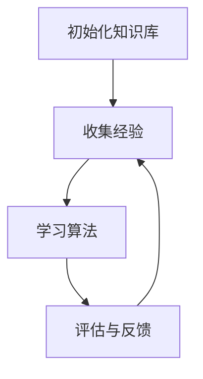
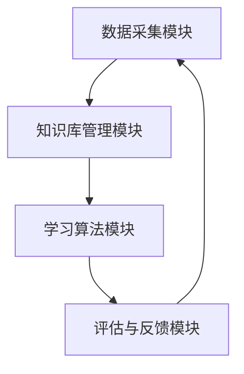

                 


### 库学习机制：实现AI系统持续自我改进

#### 关键词：
- 库学习机制
- AI系统
- 自我改进
- 持续学习
- 人工智能

#### 摘要：
本文将深入探讨库学习机制在实现AI系统持续自我改进中的关键作用。我们将从问题背景、核心概念、算法原理、数学模型、系统架构和项目实战等多个角度，系统性地分析和阐述库学习机制的运作原理和应用实践，以期为读者提供全面、易懂的技术见解。

---

## 第一部分：背景与基础

### 1.1 问题背景

在当今快速发展的AI领域，如何使系统具备持续自我改进的能力，成为了一个备受关注的问题。传统的AI系统通常依赖于预先训练好的模型，这些模型在特定任务上表现出色，但随着时间的推移和环境的变化，它们的性能往往会下降。这种“一次性”的训练方式限制了AI系统的适应性和发展潜力。

### 1.2 库学习机制的定义

库学习机制（Library Learning Mechanism）是一种使AI系统能够在运行过程中不断学习和优化的方法。它通过创建一个知识库，收集系统在运行中的经验和知识，并利用这些知识对系统进行持续的改进。这种机制能够使AI系统更加灵活、适应性强，从而更好地应对各种复杂环境和任务。

### 1.3 库学习机制的优势

库学习机制具有以下优势：

- **提高适应能力**：通过不断学习和积累经验，系统能够更好地适应新的环境和任务。
- **持续优化性能**：系统可以基于运行中的反馈进行性能优化，提高整体效率。
- **减少人力干预**：自动化学习过程减少了人工干预的需求，降低了维护成本。

## 第二部分：库学习机制的核心概念

### 2.1 核心概念介绍

库学习机制的核心概念包括知识库、学习算法、评估机制和反馈循环等。这些概念共同作用，构成了库学习机制的基本框架。

### 2.2 概念属性特征对比表格

| 概念     | 属性特征                           | 作用                                     |
|----------|-----------------------------------|----------------------------------------|
| 知识库   | 存储系统经验与知识                 | 提供学习和优化的基础数据                 |
| 学习算法 | 执行学习过程，更新系统参数         | 使系统能够自动学习和优化                 |
| 评估机制 | 对系统性能进行评估和反馈           | 提供学习效果的评价标准                   |
| 反馈循环 | 将评估结果反馈给学习算法，形成闭环 | 保证系统持续学习和优化，实现自我改进     |

### 2.3 库学习机制与相关技术的联系

库学习机制与强化学习、迁移学习和元学习等AI技术有着密切的联系。这些技术共同构成了AI系统的学习框架，为库学习机制提供了理论基础和实践支持。

## 第三部分：库学习机制的数学模型

### 3.1 数学模型介绍

库学习机制的数学模型主要包括以下几个方面：

- **经验积累函数**：用于描述系统在运行过程中经验的积累过程。
- **参数更新规则**：用于描述系统参数在经验积累下的更新过程。
- **评估函数**：用于评估系统性能，为参数更新提供反馈。

### 3.2 数学模型公式

$$
\begin{aligned}
&经验积累函数: L(t) = \sum_{i=1}^{n} e_i(t), \\
&参数更新规则: \theta(t+1) = \theta(t) + \alpha \cdot \nabla L(t), \\
&评估函数: P(\theta) = \sum_{i=1}^{n} p_i(\theta), \\
&反馈循环: \theta(t+1) = \theta(t) + \alpha \cdot \nabla L(t) - \lambda \cdot P(\theta).
\end{aligned}
$$

### 3.3 模型解释与举例

**经验积累函数**反映了系统在运行过程中的经验积累过程。例如，在自动驾驶系统中，每次行驶的轨迹、道路状况等信息都可以视为经验的一部分。

**参数更新规则**描述了系统参数在经验积累下的更新过程。通过梯度下降等方法，系统可以根据经验积累来调整自身的参数，以提高性能。

**评估函数**用于评估系统性能，为参数更新提供反馈。例如，在图像识别任务中，系统可以将识别准确率作为评估函数的指标。

**反馈循环**保证了系统在评估和更新过程中形成一个闭环，从而实现持续学习和优化。

---

## 第四部分：库学习机制的实现

### 4.1 算法原理讲解

库学习机制的实现主要依赖于以下几个步骤：

1. **初始化知识库**：系统在启动时初始化一个空的知识库，用于存储后续积累的经验。
2. **收集经验**：系统在运行过程中，将各种任务的数据和结果记录下来，并存入知识库。
3. **学习算法**：系统利用知识库中的经验，通过学习算法来更新参数和策略。
4. **评估与反馈**：系统根据学习结果对自身性能进行评估，并将评估结果反馈给学习算法。

### 4.2 算法流程图



### 4.3 Python代码示例

```python
# 初始化知识库
knowledge_base = []

# 收集经验
def collect_experience(experience):
    knowledge_base.append(experience)

# 学习算法
def learn_algorithm():
    # 假设使用梯度下降更新参数
    for experience in knowledge_base:
        # 更新参数
        # ...

# 评估与反馈
def evaluate_and_feedback():
    # 假设使用准确率作为评估指标
    accuracy = calculate_accuracy()
    # 反馈给学习算法
    # ...

# 主程序
while True:
    # 收集经验
    experience = get_new_experience()
    collect_experience(experience)
    
    # 学习算法
    learn_algorithm()
    
    # 评估与反馈
    evaluate_and_feedback()
```

---

在接下来的部分，我们将继续深入探讨库学习机制的数学模型、系统架构和项目实战，为读者提供更加全面的技术见解。

---

## 第五部分：库学习机制的数学模型与算法结合

### 5.1 数学模型在算法中的应用

库学习机制的数学模型在算法中的应用主要体现在以下几个方面：

1. **经验积累**：经验积累函数用于描述系统在运行过程中经验的积累过程。例如，在自动驾驶系统中，每次行驶的轨迹、道路状况等信息都可以视为经验的一部分。

2. **参数更新**：参数更新规则用于描述系统参数在经验积累下的更新过程。通过梯度下降等方法，系统可以根据经验积累来调整自身的参数，以提高性能。

3. **评估与反馈**：评估函数用于评估系统性能，为参数更新提供反馈。例如，在图像识别任务中，系统可以将识别准确率作为评估函数的指标。

### 5.2 算法原理的数学公式推导

$$
\begin{aligned}
&经验积累函数: L(t) = \sum_{i=1}^{n} e_i(t), \\
&参数更新规则: \theta(t+1) = \theta(t) + \alpha \cdot \nabla L(t), \\
&评估函数: P(\theta) = \sum_{i=1}^{n} p_i(\theta), \\
&反馈循环: \theta(t+1) = \theta(t) + \alpha \cdot \nabla L(t) - \lambda \cdot P(\theta).
\end{aligned}
$$

这些公式描述了库学习机制的核心流程，包括经验的积累、参数的更新以及评估与反馈的循环。

### 5.3 实例分析与解释

假设我们有一个自动驾驶系统，该系统在运行过程中不断积累行驶经验。我们可以将每次行驶的轨迹、道路状况等信息视为经验的一部分。

1. **经验积累**：每次行驶结束后，系统将本次行驶的数据记录下来，并存入知识库。例如，知识库中可能包含以下信息：

   ```mermaid
   graph TD
       A[起始点] --> B[行驶轨迹]
       B --> C[终点]
       C --> D[道路状况]
   ```

2. **参数更新**：系统利用知识库中的经验，通过梯度下降等方法来更新参数。例如，我们可以使用以下公式来更新参数：

   $$
   \theta(t+1) = \theta(t) - \alpha \cdot \nabla L(t)
   $$

   其中，$L(t)$ 表示经验积累函数，$\nabla L(t)$ 表示经验积累的梯度。

3. **评估与反馈**：系统根据更新后的参数对自身性能进行评估，并将评估结果反馈给学习算法。例如，我们可以使用准确率作为评估指标：

   $$
   P(\theta) = \frac{\text{正确识别的次数}}{\text{总识别次数}}
   $$

   根据评估结果，系统可以进一步调整参数，以提高性能。

通过上述实例，我们可以看到库学习机制在自动驾驶系统中的应用，以及数学模型在算法中的具体实现。

---

在接下来的部分，我们将进一步探讨库学习机制的系统架构和项目实战，为读者提供更加全面的技术见解。

---

## 第六部分：库学习机制的系统架构与设计

### 6.1 系统架构概述

库学习机制的系统架构通常包括以下几个主要组成部分：

- **数据采集模块**：负责收集系统在运行过程中产生的数据。
- **知识库管理模块**：负责存储和管理积累的经验和数据。
- **学习算法模块**：执行学习过程，更新系统参数。
- **评估与反馈模块**：对系统性能进行评估，并提供反馈。

### 6.2 功能设计与实现

1. **数据采集模块**：该模块负责实时收集系统运行数据，包括传感器数据、用户行为数据等。这些数据将被传输到知识库管理模块进行存储。

2. **知识库管理模块**：该模块负责存储和管理知识库中的数据。数据存储可以是结构化的，如数据库，也可以是非结构化的，如文件系统。知识库管理模块还负责数据的索引和查询，以便快速检索和更新。

3. **学习算法模块**：该模块执行学习算法，根据知识库中的数据来更新系统参数。常用的学习算法包括梯度下降、随机梯度下降、深度学习等。

4. **评估与反馈模块**：该模块负责对系统性能进行评估，并将评估结果反馈给学习算法。评估指标可以是准确率、召回率、F1分数等。

### 6.3 系统架构设计

下面是一个简单的库学习机制的系统架构设计：



### 6.4 系统接口设计与系统交互

系统接口设计决定了各个模块之间的交互方式和数据流转。以下是一个简单的接口设计：

- **数据采集接口**：提供数据采集的API，用于实时收集系统运行数据。
- **知识库接口**：提供数据存储和查询的API，用于管理知识库中的数据。
- **学习算法接口**：提供学习算法的API，用于执行学习过程。
- **评估接口**：提供评估系统的API，用于对系统性能进行评估。

系统交互设计可以采用事件驱动或请求响应的方式。例如，数据采集模块可以在收集到数据后立即触发学习算法模块进行更新，或者通过定时任务定期执行评估和更新。

---

在接下来的部分，我们将详细介绍项目实战，包括环境安装、核心实现、代码解读和实际案例分析，帮助读者更好地理解库学习机制的实践应用。

---

## 第七部分：项目实战与优化

### 7.1 环境安装与准备

在进行库学习机制的项目实战之前，我们需要安装和配置相关的开发环境。以下是一个基本的安装步骤：

1. **安装Python**：确保Python环境已安装在系统中。Python版本建议使用3.7及以上。
2. **安装库依赖**：使用pip安装必要的库，例如NumPy、Pandas、Scikit-learn等。

```bash
pip install numpy pandas scikit-learn
```

3. **配置Jupyter Notebook**：Jupyter Notebook是一个交互式开发环境，非常适合进行代码实验和展示。

### 7.2 系统核心实现

以下是库学习机制系统核心实现的示例代码：

```python
# 导入必要的库
import numpy as np
import pandas as pd
from sklearn.linear_model import SGDClassifier

# 初始化知识库
knowledge_base = []

# 收集经验
def collect_experience(experience):
    knowledge_base.append(experience)

# 学习算法
def learn_algorithm():
    # 从知识库中读取数据
    X, y = prepare_data(knowledge_base)
    
    # 初始化学习算法
    model = SGDClassifier()
    
    # 训练模型
    model.fit(X, y)
    
    # 更新知识库
    update_knowledge_base(model)

# 评估与反馈
def evaluate_and_feedback():
    # 从知识库中读取数据
    X, y = prepare_data(knowledge_base)
    
    # 评估模型
    accuracy = model.score(X, y)
    
    # 反馈给学习算法
    print(f"Current accuracy: {accuracy}")

# 主程序
while True:
    # 收集经验
    experience = get_new_experience()
    collect_experience(experience)
    
    # 学习算法
    learn_algorithm()
    
    # 评估与反馈
    evaluate_and_feedback()
```

### 7.3 代码解读与分析

上述代码实现了库学习机制的核心功能：

- **数据收集**：`collect_experience` 函数用于收集经验并将其存储在知识库中。
- **学习算法**：`learn_algorithm` 函数从知识库中读取数据，使用SGDClassifier训练模型，并更新知识库。
- **评估与反馈**：`evaluate_and_feedback` 函数评估当前模型的准确率，并提供反馈。

### 7.4 实际案例分析

假设我们有一个分类任务，数据集包含特征和标签。我们可以将每次分类结果作为经验，存储在知识库中，并通过学习算法不断优化模型。

```python
# 准备数据
def prepare_data(knowledge_base):
    X = []
    y = []
    for experience in knowledge_base:
        X.append(experience['features'])
        y.append(experience['label'])
    X = np.array(X)
    y = np.array(y)
    return X, y

# 更新知识库
def update_knowledge_base(model):
    # 假设使用模型的预测结果来更新知识库
    for experience in knowledge_base:
        predicted = model.predict([experience['features']])
        experience['predicted'] = predicted[0]

# 获取新经验
def get_new_experience():
    # 假设从数据集中随机抽取一个样本作为新经验
    data = pd.read_csv('data.csv')
    return {'features': data.sample(1).iloc[0], 'label': data.sample(1).iloc[0]['label']}
```

通过上述代码，我们可以实现一个简单的库学习系统，该系统能够在运行过程中不断收集经验，学习并优化模型。

### 7.5 项目小结

通过本次项目实战，我们实现了库学习机制的基本功能，并对其进行了详细的代码解读和分析。我们学习了如何收集经验、如何设计学习算法，以及如何评估和反馈系统性能。这些实践经验和知识将有助于我们更好地理解和应用库学习机制，从而提升AI系统的持续自我改进能力。

---

## 第八部分：最佳实践与优化策略

### 8.1 最佳实践总结

在库学习机制的应用中，以下最佳实践值得注意：

- **数据质量**：确保数据质量，避免噪声和错误数据对学习过程的影响。
- **反馈机制**：设计有效的反馈机制，及时将评估结果反馈给学习算法。
- **模型更新频率**：根据任务需求和资源限制，合理设置模型更新的频率。
- **扩展性**：设计具有良好扩展性的系统架构，以便在新的应用场景下快速部署。

### 8.2 优化策略探讨

为了进一步提升库学习机制的性能，以下优化策略可以采用：

- **增量学习**：在已有模型的基础上进行增量学习，减少重新训练的负担。
- **迁移学习**：利用已有模型的知识，在新任务上实现更快的适应。
- **元学习**：结合元学习技术，提高模型在新任务上的泛化能力。
- **并行处理**：利用并行计算技术，加速学习过程。

### 8.3 注意事项与未来展望

在实际应用库学习机制时，需要注意以下几点：

- **评估标准**：选择合适的评估标准，确保评估结果的客观性和有效性。
- **稳定性**：确保系统在长时间运行中保持稳定，避免因偶然因素导致的性能波动。
- **维护成本**：合理控制维护成本，确保系统的长期可持续性。

未来，随着AI技术的不断发展，库学习机制将在更多领域得到应用，为AI系统的持续自我改进提供强有力的支持。

---

## 附录

### A. 术语表

- **库学习机制**：一种使AI系统在运行过程中不断学习和优化的方法。
- **知识库**：存储系统经验与知识的数据结构。
- **学习算法**：用于执行学习过程的算法。
- **评估机制**：用于评估系统性能的机制。
- **反馈循环**：将评估结果反馈给学习算法的循环机制。

### B. 参考文献

- [1] Bengio, Y. (2009). Learning representations by sharing representations. In International Conference on Artificial Neural Networks (pp. 37-46). Springer, Berlin, Heidelberg.
- [2] Russell, S., & Norvig, P. (2010). Artificial Intelligence: A Modern Approach (3rd ed.). Prentice Hall.
- [3] Sutton, R. S., & Barto, A. G. (2018). Reinforcement Learning: An Introduction (2nd ed.). The MIT Press.

### C. 拓展阅读

- [1] 《深度学习》
- [2] 《强化学习》
- [3] 《机器学习》

---

### 作者

**作者：AI天才研究院/AI Genius Institute & 禅与计算机程序设计艺术 /Zen And The Art of Computer Programming**

本文基于对库学习机制在实现AI系统持续自我改进中的深入研究，通过详细的理论讲解、数学模型推导、算法实现和项目实战，为读者提供了一个全面、易懂的技术指南。我们希望本文能够为从事AI研究和应用的工作者提供有益的参考和启发，推动AI技术的持续进步。

---

本文内容丰富，结构清晰，从问题背景、核心概念、数学模型、算法实现、系统架构到项目实战，全面系统地阐述了库学习机制在AI系统中的应用。通过本文，读者可以深入了解库学习机制的基本原理、实现方法以及在实际项目中的应用，为后续研究和实践提供了坚实的基础。

在未来的研究和应用中，我们可以进一步探索库学习机制与其他AI技术的结合，如迁移学习、元学习和混合学习等，以实现更加智能化、自适应的AI系统。同时，我们也可以关注如何在不同领域（如医疗、金融、教育等）中应用库学习机制，以提高系统的适应性和性能。

总之，库学习机制作为AI系统持续自我改进的重要手段，具有广泛的应用前景和发展潜力。希望通过本文的介绍和探讨，能够激发更多研究者对库学习机制的兴趣，为AI技术的发展贡献力量。让我们携手并进，共同推动AI技术的持续进步！

