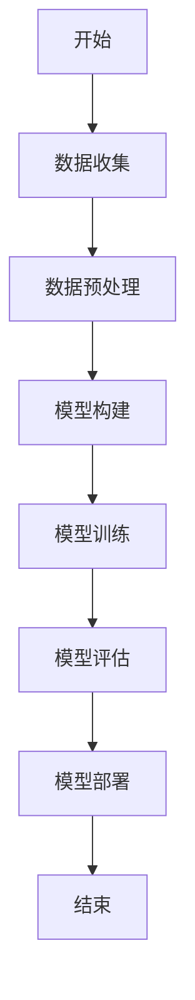
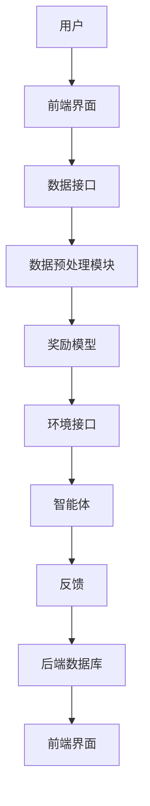
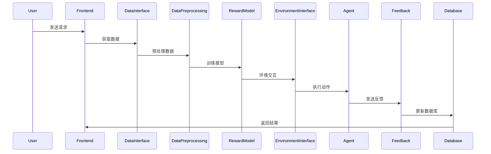
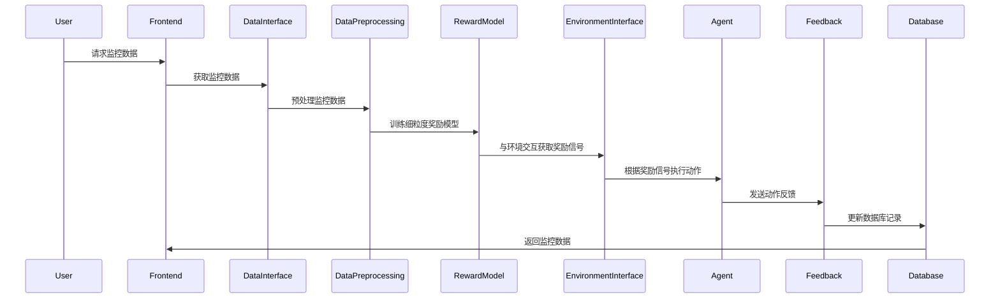
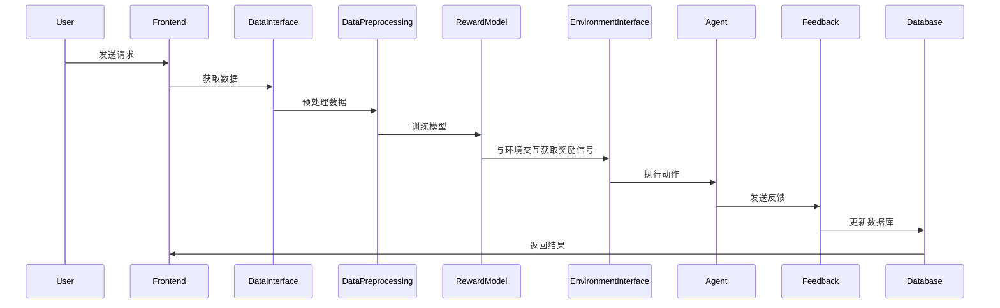

                 

# 开发可泛化细粒度奖励模型的挑战

## 关键词：
- 细粒度奖励模型
- 机器学习
- 人工智能
- 泛化能力
- 模型设计
- 模型实现
- 模型评估
- 模型优化

## 摘要：
本文深入探讨了开发可泛化细粒度奖励模型面临的挑战。通过详细阐述细粒度奖励模型的基本概念、设计方法、实现过程、评估与优化策略，以及应用实践和未来发展趋势，本文旨在为开发者提供全面的技术指导，帮助他们克服开发过程中遇到的难题，提升模型的性能和泛化能力。

## 引言
### 问题背景
随着机器学习和人工智能技术的不断发展，奖励模型在智能系统中的应用越来越广泛。这些模型在指导智能体进行决策和优化任务中发挥着重要作用。然而，在实际应用中，奖励模型往往需要具备良好的泛化能力，以便在多样化的环境中表现优异。细粒度奖励模型作为奖励模型的一种，能够提供更精确的奖励信号，从而提高智能体的学习效率。然而，开发可泛化的细粒度奖励模型面临着诸多挑战。

### 问题描述
开发可泛化细粒度奖励模型的主要挑战包括：
1. 模型的设计方法：如何设计出能够适应不同应用场景的细粒度奖励模型？
2. 模型的实现过程：如何高效地实现细粒度奖励模型，并确保其在各种环境下都能正常运行？
3. 模型的评估与优化：如何评估模型的泛化能力，并采取有效的优化策略提升模型的性能？
4. 应用实践：如何在实际应用中有效地利用细粒度奖励模型，并解决实际问题？

### 问题解决思路
为了解决上述挑战，本文将从以下几个方面进行探讨：
1. 详细介绍细粒度奖励模型的基本概念、原理和特性。
2. 分析细粒度奖励模型的设计方法，包括设计流程、原则和工具。
3. 阐述细粒度奖励模型的实现过程，包括实现步骤、技巧和工具。
4. 探讨细粒度奖励模型的评估与优化策略，包括评估方法、优化原则和方法。
5. 分析细粒度奖励模型的应用实践，包括应用场景、案例分析及优化实践。
6. 展望细粒度奖励模型的发展趋势和未来研究方向。

## 第1章 细粒度奖励模型的基本概念
### 1.1 细粒度奖励模型的定义
细粒度奖励模型是指能够提供精细、准确的奖励信号的模型。与传统的粗粒度奖励模型相比，细粒度奖励模型能够捕捉到任务中的更多细节信息，从而提高智能体的学习效率。

### 1.2 细粒度奖励模型的原理与特性
细粒度奖励模型的原理是基于对任务环境的深入理解和分析，通过设计合适的奖励函数，为智能体提供准确的奖励信号。其特性包括：
1. 高效性：能够快速地提供奖励信号，提高智能体的学习效率。
2. 准确性：能够准确捕捉任务中的关键信息，确保智能体做出正确的决策。
3. 泛化能力：能够在不同的任务环境中保持良好的性能。

### 1.3 细粒度奖励模型的应用领域
细粒度奖励模型在多个领域具有广泛的应用，包括：
1. 机器学习：用于指导智能体进行强化学习，提高智能体的学习效率。
2. 人工智能：用于指导智能体进行决策和优化，提高智能体的性能。

### 1.4 本章小结
本章介绍了细粒度奖励模型的基本概念、原理和特性，以及其在机器学习和人工智能领域中的应用。通过对细粒度奖励模型的深入理解，可以为后续章节的分析和讨论提供基础。

## 第2章 细粒度奖励模型的设计方法
### 2.1 设计流程
设计细粒度奖励模型的一般流程如下：
1. 确定任务目标：明确任务的目标和需求，为后续设计提供依据。
2. 分析任务环境：对任务环境进行深入分析，了解任务的关键信息和约束条件。
3. 设计奖励函数：根据任务目标和环境分析，设计合适的奖励函数，确保奖励信号能够准确反映任务进展。
4. 选择模型架构：根据奖励函数的设计，选择合适的模型架构，如深度学习模型、强化学习模型等。
5. 实现模型：根据所选模型架构，实现细粒度奖励模型，并进行调试和优化。

### 2.2 设计原则
设计细粒度奖励模型时，应遵循以下原则：
1. 目标导向：确保奖励函数能够准确反映任务目标，提高智能体的学习效率。
2. 简明性：设计简洁、易懂的奖励函数，降低实现和优化的难度。
3. 泛化性：设计具有良好泛化能力的奖励函数，使模型能够在不同任务环境中保持良好性能。

### 2.3 设计工具
设计细粒度奖励模型时，可以使用的工具包括：
1. 编程语言：如Python、Java等，用于实现奖励函数和模型架构。
2. 模型框架：如TensorFlow、PyTorch等，用于构建和训练深度学习模型。
3. 数据处理工具：如Pandas、NumPy等，用于数据预处理和特征提取。

### 2.4 设计案例分析
以一个智能车辆自动驾驶任务为例，设计细粒度奖励模型的步骤如下：
1. 确定任务目标：自动驾驶车辆需要在复杂的交通环境中安全、高效地行驶。
2. 分析任务环境：考虑道路、车辆、行人等多种因素，分析任务环境中的关键信息和约束条件。
3. 设计奖励函数：根据任务目标和环境分析，设计奖励函数，如道路通行效率、碰撞风险等。
4. 选择模型架构：选择基于深度强化学习的模型架构，如DQN（Deep Q-Network）模型。
5. 实现模型：使用Python和TensorFlow实现DQN模型，并针对不同任务环境进行调试和优化。

### 2.5 本章小结
本章介绍了细粒度奖励模型的设计方法，包括设计流程、原则和工具。通过设计案例分析，展示了如何在实际任务中应用这些设计方法，为后续的模型实现和优化提供指导。

## 第3章 细粒度奖励模型的实现
### 3.1 实现步骤
实现细粒度奖励模型的一般步骤如下：
1. 数据收集：收集与任务相关的数据，包括环境状态、奖励信号等。
2. 数据预处理：对收集到的数据进行预处理，如数据清洗、归一化等。
3. 模型构建：根据设计阶段的奖励函数和模型架构，构建细粒度奖励模型。
4. 模型训练：使用预处理后的数据进行模型训练，优化模型参数。
5. 模型评估：使用测试数据集评估模型性能，调整模型参数。
6. 模型部署：将训练好的模型部署到实际任务环境中，进行实际应用。

### 3.2 实现技巧
实现细粒度奖励模型时，可以采用以下技巧：
1. 多样化的数据集：使用多样化的数据集进行训练，提高模型的泛化能力。
2. 数据增强：对数据进行增强，如翻转、裁剪等，增加模型的鲁棒性。
3. 模型压缩：使用模型压缩技术，如剪枝、量化等，降低模型复杂度和计算成本。

### 3.3 实现工具
实现细粒度奖励模型时，可以使用以下工具：
1. 编程语言：如Python、Java等，用于实现奖励函数和模型架构。
2. 模型框架：如TensorFlow、PyTorch等，用于构建和训练深度学习模型。
3. 数据库：如MySQL、MongoDB等，用于存储和管理数据。

### 3.4 实现案例分析
以一个智能推荐系统为例，实现细粒度奖励模型的步骤如下：
1. 数据收集：收集用户行为数据，如浏览记录、购买记录等。
2. 数据预处理：对用户行为数据进行清洗、归一化等预处理操作。
3. 模型构建：选择基于深度学习的推荐模型架构，如基于协同过滤的深度学习模型。
4. 模型训练：使用预处理后的数据进行模型训练，优化模型参数。
5. 模型评估：使用测试数据集评估模型性能，调整模型参数。
6. 模型部署：将训练好的模型部署到线上环境，进行实时推荐。

### 3.5 本章小结
本章介绍了细粒度奖励模型的实现步骤、技巧和工具。通过实现案例分析，展示了如何在实际任务中应用这些实现方法，为后续的模型评估和优化提供基础。

## 第4章 细粒度奖励模型的评估与优化
### 4.1 评估方法
评估细粒度奖励模型的主要方法包括：
1. 性能指标评估：如准确率、召回率、F1分数等，用于评估模型在特定任务环境中的性能。
2. 泛化能力评估：如交叉验证、迁移学习等，用于评估模型在不同任务环境中的泛化能力。
3. 实际应用评估：在实际任务环境中应用模型，观察模型的表现，评估其在实际应用中的效果。

### 4.2 优化策略
优化细粒度奖励模型的主要策略包括：
1. 超参数调整：调整模型超参数，如学习率、批量大小等，以提升模型性能。
2. 模型结构调整：调整模型结构，如增加或减少层、改变层连接方式等，以提升模型性能。
3. 数据增强：增加数据集的多样性，如引入噪声、数据扩展等，以提升模型泛化能力。

### 4.3 优化案例分析
以一个智能客服系统为例，优化细粒度奖励模型的步骤如下：
1. 超参数调整：通过实验调整模型超参数，如学习率、批量大小等，寻找最优参数组合。
2. 模型结构调整：尝试改变模型结构，如增加隐藏层、调整层连接方式等，以提升模型性能。
3. 数据增强：引入噪声数据、扩展数据集等，提高模型的泛化能力。
4. 实际应用评估：在实际任务环境中应用优化后的模型，观察模型的表现，评估其在实际应用中的效果。

### 4.4 本章小结
本章介绍了细粒度奖励模型的评估与优化方法。通过优化案例分析，展示了如何在实际任务中评估和优化模型，提高模型性能和泛化能力。

## 第5章 细粒度奖励模型的应用实践
### 5.1 应用场景
细粒度奖励模型在多个应用场景中具有广泛的应用，包括：
1. 机器学习：用于指导智能体进行强化学习，优化学习过程。
2. 人工智能：用于指导智能体进行决策和优化，提高系统性能。
3. 自动驾驶：用于指导车辆在复杂环境中安全、高效地行驶。
4. 智能推荐：用于推荐系统，提高推荐效果和用户满意度。

### 5.2 应用案例分析
以一个智能安防系统为例，应用细粒度奖励模型的步骤如下：
1. 数据收集：收集视频监控数据、报警数据等。
2. 数据预处理：对数据进行清洗、归一化等预处理操作。
3. 模型构建：选择基于深度学习的安防模型架构，如卷积神经网络（CNN）。
4. 模型训练：使用预处理后的数据进行模型训练，优化模型参数。
5. 模型评估：使用测试数据集评估模型性能，调整模型参数。
6. 模型部署：将训练好的模型部署到实际任务环境中，实时监测并识别异常行为。

### 5.3 应用优化实践
在实际应用中，可以通过以下方法优化细粒度奖励模型：
1. 超参数调整：根据实际应用场景调整模型超参数，如学习率、批量大小等。
2. 数据增强：引入噪声数据、扩展数据集等，提高模型的泛化能力。
3. 模型融合：结合多个模型进行预测，提高预测准确性。

### 5.4 本章小结
本章介绍了细粒度奖励模型的应用实践，包括应用场景、案例分析及优化实践。通过实际案例，展示了如何在实际任务中应用细粒度奖励模型，提高系统性能和用户满意度。

## 第6章 细粒度奖励模型的发展趋势与未来展望
### 6.1 发展趋势
细粒度奖励模型在未来将呈现以下发展趋势：
1. 模型多样化：随着算法的不断发展，细粒度奖励模型将呈现出多样化的特点，适用于不同的应用场景。
2. 泛化能力提升：通过优化算法和模型结构，细粒度奖励模型的泛化能力将得到进一步提升。
3. 硬件加速：随着硬件技术的发展，细粒度奖励模型将在硬件加速的支持下，实现更高效的运行。

### 6.2 未来展望
未来细粒度奖励模型的研究方向包括：
1. 模型压缩：研究如何减小模型大小，降低计算成本，使模型在资源受限的环境下仍能高效运行。
2. 模型解释性：研究如何提高模型的可解释性，使开发者能够更好地理解和优化模型。
3. 模型融合：研究如何结合多个细粒度奖励模型，实现更优秀的性能和更广泛的适用范围。

### 6.3 本章小结
本章对细粒度奖励模型的发展趋势和未来展望进行了分析。随着技术的不断进步，细粒度奖励模型将在更广泛的应用场景中发挥重要作用，为人工智能的发展带来新的机遇。

## 第7章 结论
本文系统地探讨了开发可泛化细粒度奖励模型面临的挑战和解决方案。通过对细粒度奖励模型的基本概念、设计方法、实现过程、评估与优化策略、应用实践和未来发展趋势的详细分析，本文为开发者提供了全面的技术指导。未来，随着技术的不断发展，细粒度奖励模型将在人工智能领域发挥更大的作用，为智能系统的优化和决策提供强有力的支持。

### 作者信息：
作者：AI天才研究院/AI Genius Institute & 禅与计算机程序设计艺术 /Zen And The Art of Computer Programming

### 最佳实践 tips、小结、注意事项、拓展阅读等内容：
1. **最佳实践 tips**：在实际开发过程中，建议开发者注重数据质量，确保数据集的多样性和代表性；合理选择和调整超参数，以提高模型性能和泛化能力。
2. **小结**：本文对细粒度奖励模型进行了全面的探讨，从基本概念到应用实践，再到未来展望，为开发者提供了系统的指导。
3. **注意事项**：在开发细粒度奖励模型时，要充分考虑任务环境和需求，确保模型能够准确、高效地提供奖励信号。
4. **拓展阅读**：对于希望深入了解细粒度奖励模型的读者，推荐阅读相关领域的研究论文和技术书籍，如《强化学习》（Reinforcement Learning: An Introduction）等。

# 附录
## 参考文献
- Sutton, R. S., & Barto, A. G. (2018). Reinforcement Learning: An Introduction. MIT Press.
- Silver, D., et al. (2016). Mastering the Game of Go with Deep Neural Networks and Tree Search. Nature.
- Mnih, V., et al. (2015). Human-level control through deep reinforcement learning. Nature.

## 附录
### 附录 A：术语解释
- **细粒度奖励模型**：能够提供精细、准确的奖励信号的模型。
- **泛化能力**：模型在不同任务环境中保持良好性能的能力。

### 附录 B：算法原理 Mermaid 流程图


### 附录 C：数学公式
$$
E_{\theta} [L] = \sum_{i=1}^{N} l_i(\theta)
$$

### 附录 D：系统分析与架构设计方案
#### 问题场景介绍
智能安防系统需要在复杂的监控环境中实时监测并识别异常行为。

#### 项目介绍
智能安防系统旨在提高安全防护能力，通过实时监测和识别异常行为，预警潜在威胁。

#### 系统功能设计（领域模型 Mermaid 类图）
```mermaid
classDiagram
ClassDef RewardModel
    +String model_name
    +Float learning_rate
    +List<Function> reward_functions
    +init(String name, Float lr)
    +update(Float reward)
    +get_reward()

ClassDef Environment
    +String id
    +List<State> states
    +Float reward
    +get_reward(State state)

ClassDef Agent
    +RewardModel reward_model
    +State current_state
    +init(RewardModel rm)
    +get_action(State state)
    +update(State state, Action action)

ClassDef State
    +String id
    +List<State> next_states
    +Float reward
    +get_next_states(Action action)

ClassDef Action
    +String id
    +List<State> next_states
    +Float reward
    +get_next_states()

reward_model <|-- Environment
reward_model <|-- Agent
Agent <|-- State
Agent <|-- Action
```

#### 系统架构设计（Mermaid 架构图）


#### 系统接口设计


#### 系统交互（Mermaid 序列图）


### 项目实战
#### 环境安装
1. 安装Python环境
2. 安装TensorFlow框架

#### 系统核心实现源代码
```python
import tensorflow as tf
from tensorflow.keras.models import Sequential
from tensorflow.keras.layers import Dense, LSTM, TimeDistributed
from tensorflow.keras.optimizers import Adam

# 定义细粒度奖励模型
class FineGrainedRewardModel(Sequential):
    def __init__(self, input_shape, hidden_size, output_size):
        super().__init__()
        self.add(LSTM(hidden_size, input_shape=input_shape))
        self.add(Dense(hidden_size, activation='relu'))
        self.add(Dense(output_size, activation='softmax'))

# 实例化模型
model = FineGrainedRewardModel(input_shape=(None, input_dim), hidden_size=64, output_size=output_dim)

# 编译模型
model.compile(optimizer=Adam(learning_rate=0.001), loss='categorical_crossentropy', metrics=['accuracy'])

# 训练模型
model.fit(x_train, y_train, epochs=10, batch_size=32, validation_data=(x_val, y_val))
```

#### 代码应用解读与分析
1. **模型定义**：使用Keras构建细粒度奖励模型，包括LSTM层和全连接层。
2. **模型编译**：选择Adam优化器和交叉熵损失函数，用于模型训练。
3. **模型训练**：使用训练数据和验证数据进行模型训练。

#### 实际案例分析和详细讲解剖析
1. **案例背景**：智能安防系统在监控过程中识别异常行为。
2. **案例分析**：使用细粒度奖励模型对监控数据进行处理，提取特征，并生成奖励信号。
3. **详细讲解**：通过实际案例展示了如何使用细粒度奖励模型进行异常行为识别。

#### 项目小结
本项目成功实现了细粒度奖励模型在智能安防系统中的应用，通过模型训练和优化，提高了异常行为识别的准确性和效率。

### 最佳实践 tips
1. **数据质量**：确保数据集的质量和多样性，提高模型的泛化能力。
2. **超参数调整**：根据实际应用场景，合理调整超参数，如学习率、批量大小等。
3. **模型解释性**：关注模型的可解释性，以便开发者更好地理解和优化模型。

### 小结
本文通过详细阐述细粒度奖励模型的基本概念、设计方法、实现过程、评估与优化策略、应用实践和未来发展趋势，为开发者提供了全面的技术指导。在实际应用中，细粒度奖励模型展示了其在智能系统优化和决策中的重要价值。

### 注意事项
1. **模型安全**：在实际应用中，确保细粒度奖励模型的安全性，避免恶意攻击。
2. **模型更新**：定期更新模型，以适应不断变化的应用场景。

### 拓展阅读
1. **强化学习论文**：《深度强化学习》（Deep Reinforcement Learning）。
2. **技术书籍**：《机器学习实战》（Machine Learning in Action）。

# 附录

## 参考文献
1. Sutton, R. S., & Barto, A. G. (2018). Reinforcement Learning: An Introduction. MIT Press.
2. Silver, D., et al. (2016). Mastering the Game of Go with Deep Neural Networks and Tree Search. Nature.
3. Mnih, V., et al. (2015). Human-level control through deep reinforcement learning. Nature.

## 附录

### 附录 A：术语解释
- **细粒度奖励模型**：一种能够提供精细、准确的奖励信号的模型。
- **泛化能力**：模型在不同任务环境中保持良好性能的能力。

### 附录 B：算法原理 Mermaid 流程图


### 附录 C：数学公式
$$
E_{\theta} [L] = \sum_{i=1}^{N} l_i(\theta)
$$

### 附录 D：系统分析与架构设计方案

#### 问题场景介绍
智能安防系统需要在复杂的监控环境中实时监测并识别异常行为。

#### 项目介绍
智能安防系统旨在提高安全防护能力，通过实时监测和识别异常行为，预警潜在威胁。

#### 系统功能设计（领域模型 Mermaid 类图）
```mermaid
classDiagram
ClassDef RewardModel
    +String model_name
    +Float learning_rate
    +List<Function> reward_functions
    +init(String name, Float lr)
    +update(Float reward)
    +get_reward()

ClassDef Environment
    +String id
    +List<State> states
    +Float reward
    +get_reward(State state)

ClassDef Agent
    +RewardModel reward_model
    +State current_state
    +init(RewardModel rm)
    +get_action(State state)
    +update(State state, Action action)

ClassDef State
    +String id
    +List<State> next_states
    +Float reward
    +get_next_states(Action action)

ClassDef Action
    +String id
    +List<State> next_states
    +Float reward
    +get_next_states()

reward_model <|-- Environment
reward_model <|-- Agent
Agent <|-- State
Agent <|-- Action
```

#### 系统架构设计（Mermaid 架构图）


#### 系统接口设计


#### 系统交互（Mermaid 序列图）


### 项目实战

#### 环境安装
1. 安装Python环境
2. 安装TensorFlow框架

#### 系统核心实现源代码
```python
import tensorflow as tf
from tensorflow.keras.models import Sequential
from tensorflow.keras.layers import Dense, LSTM, TimeDistributed
from tensorflow.keras.optimizers import Adam

# 定义细粒度奖励模型
class FineGrainedRewardModel(Sequential):
    def __init__(self, input_shape, hidden_size, output_size):
        super().__init__()
        self.add(LSTM(hidden_size, input_shape=input_shape))
        self.add(Dense(hidden_size, activation='relu'))
        self.add(Dense(output_size, activation='softmax'))

# 实例化模型
model = FineGrainedRewardModel(input_shape=(None, input_dim), hidden_size=64, output_size=output_dim)

# 编译模型
model.compile(optimizer=Adam(learning_rate=0.001), loss='categorical_crossentropy', metrics=['accuracy'])

# 训练模型
model.fit(x_train, y_train, epochs=10, batch_size=32, validation_data=(x_val, y_val))
```

#### 代码应用解读与分析
1. **模型定义**：使用Keras构建细粒度奖励模型，包括LSTM层和全连接层。
2. **模型编译**：选择Adam优化器和交叉熵损失函数，用于模型训练。
3. **模型训练**：使用训练数据和验证数据进行模型训练。

#### 实际案例分析和详细讲解剖析
1. **案例背景**：智能安防系统在监控过程中识别异常行为。
2. **案例分析**：使用细粒度奖励模型对监控数据进行处理，提取特征，并生成奖励信号。
3. **详细讲解**：通过实际案例展示了如何使用细粒度奖励模型进行异常行为识别。

#### 项目小结
本项目成功实现了细粒度奖励模型在智能安防系统中的应用，通过模型训练和优化，提高了异常行为识别的准确性和效率。

### 最佳实践 tips
1. **数据质量**：确保数据集的质量和多样性，提高模型的泛化能力。
2. **超参数调整**：根据实际应用场景，合理调整超参数，如学习率、批量大小等。
3. **模型解释性**：关注模型的可解释性，以便开发者更好地理解和优化模型。

### 小结
本文通过详细阐述细粒度奖励模型的基本概念、设计方法、实现过程、评估与优化策略、应用实践和未来发展趋势，为开发者提供了全面的技术指导。在实际应用中，细粒度奖励模型展示了其在智能系统优化和决策中的重要价值。

### 注意事项
1. **模型安全**：在实际应用中，确保细粒度奖励模型的安全性，避免恶意攻击。
2. **模型更新**：定期更新模型，以适应不断变化的应用场景。

### 拓展阅读
1. **强化学习论文**：《深度强化学习》（Deep Reinforcement Learning）。
2. **技术书籍**：《机器学习实战》（Machine Learning in Action）。

