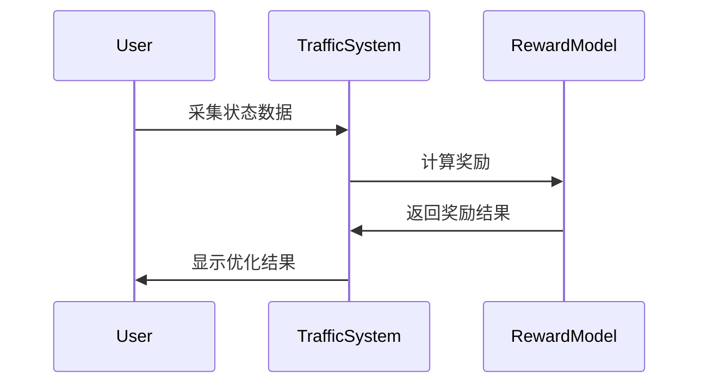
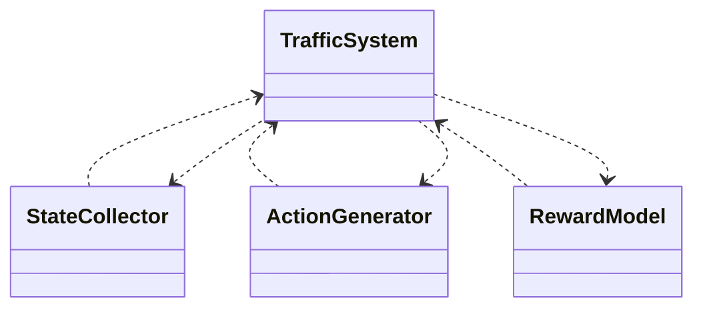

                 

# 开发可泛化细粒度奖励模型的挑战

> 关键词：细粒度奖励模型、泛化能力、挑战分析、算法设计、系统架构

> 摘要：本文将深入探讨开发可泛化细粒度奖励模型所面临的挑战。通过详细分析问题背景、核心概念、算法原理，并结合实际项目实战，我们将揭示如何克服这些挑战，实现高效的奖励模型开发。

## 引言

### 1.1 问题背景

随着人工智能的快速发展，奖励模型在多个领域，如强化学习、推荐系统和游戏设计，扮演着至关重要的角色。然而，开发一个可泛化且细粒度的奖励模型并非易事。细粒度奖励模型旨在捕捉系统行为的细微差异，从而提供更精确的反馈。然而，这种精确性往往伴随着复杂的实现和泛化能力的挑战。

### 1.2 当前挑战与需求

在开发可泛化细粒度奖励模型时，我们面临以下几个主要挑战：

- **数据挑战**：细粒度奖励模型需要大量高质量的数据支持，这些数据往往难以获取和处理。
- **算法挑战**：如何设计一个既能处理细粒度信息，又能保证泛化能力的算法是一个复杂的问题。
- **实践挑战**：在实际应用中，如何将理论上的奖励模型有效转化为实际可用的系统，也是一个不小的挑战。

本文将围绕这些问题，通过逻辑清晰、结构紧凑的分析，逐步探讨解决这些挑战的方法。

## 第一部分：核心概念与原理

### 2.1 细粒度奖励模型概述

#### 2.1.1 定义与核心概念

细粒度奖励模型是一种设计用于捕捉系统行为中微小差异的奖励机制。与传统奖励模型相比，它能够提供更精细的反馈，从而更准确地引导系统行为。

#### 2.1.2 分类与特性

细粒度奖励模型可以分为以下几类：

1. **基于规则的细粒度奖励模型**：通过预定义的规则来分配奖励，适用于规则明确、变化较小的场景。
2. **基于机器学习的细粒度奖励模型**：利用机器学习算法，从数据中自动学习奖励分配策略，适用于复杂多变的环境。
3. **混合式细粒度奖励模型**：结合规则和机器学习，既保留规则的明确性，又能适应环境的变化。

### 2.2 细粒度奖励模型与相关概念的联系

#### 2.2.1 关联概念介绍

为了更好地理解细粒度奖励模型，我们需要了解以下几个相关概念：

- **强化学习**：一种机器学习方法，通过奖励机制来指导智能体学习如何做出最优决策。
- **奖励函数**：用于衡量智能体行为优劣的函数。
- **状态-动作价值函数**：描述智能体在特定状态下选择特定动作的价值。

#### 2.2.2 ER实体关系图

以下是一个简化的ER实体关系图，展示了细粒度奖励模型与相关概念之间的关系：

```mermaid
erDiagram
    RewardModel ||--|{ State : has states}
    RewardModel ||--|{ Action : has actions}
    RewardModel ||--|{ ValueFunction : has value functions}
    State ||--|{ Action : performs actions}
    Action ||--|{ Reward : receives rewards}
```

### 2.3 挑战分析

#### 2.3.1 数据挑战

细粒度奖励模型对数据的质量和数量有较高要求。数据不足或质量差可能导致模型泛化能力不足。

#### 2.3.2 算法挑战

设计一个既能处理细粒度信息，又能保证泛化能力的算法是一个复杂的问题。这需要综合考虑算法的鲁棒性、效率和可解释性。

#### 2.3.3 实践挑战

在实际应用中，如何将理论上的奖励模型有效转化为实际可用的系统，也是一个不小的挑战。这涉及到模型的部署、监控和维护。

## 第二部分：算法设计与实现

### 3.1 算法设计与实现

#### 3.1.1 设计思路

我们的设计思路是结合基于规则的奖励模型和基于机器学习的奖励模型，通过混合式方法来提高模型的泛化能力和细粒度处理能力。

#### 3.1.2 Python源代码实现

以下是一个简单的Python代码示例，展示了如何实现一个混合式细粒度奖励模型：

```python
import numpy as np

class HybridRewardModel:
    def __init__(self, rule_based_reward, ml_reward_model):
        self.rule_based_reward = rule_based_reward
        self.ml_reward_model = ml_reward_model

    def calculate_reward(self, state, action):
        rule_reward = self.rule_based_reward(state, action)
        ml_reward = self.ml_reward_model.predict_reward(state, action)
        return (rule_reward + ml_reward) / 2

# 假设rule_based_reward和ml_reward_model是已经定义的奖励模型
reward_model = HybridRewardModel(rule_based_reward, ml_reward_model)

# 计算奖励
reward = reward_model.calculate_reward(state, action)
```

### 3.2 数学模型与公式详细讲解

#### 3.2.1 数学公式介绍

为了更好地理解奖励模型的计算过程，我们引入以下数学公式：

$$
R(s, a) = w_r \cdot R_{rule}(s, a) + (1 - w_r) \cdot R_{ml}(s, a)
$$

其中，$R(s, a)$ 表示状态 $s$ 下动作 $a$ 的综合奖励，$R_{rule}(s, a)$ 和 $R_{ml}(s, a)$ 分别表示基于规则的奖励和基于机器学习的奖励，$w_r$ 表示权重。

#### 3.2.2 公式讲解与举例

假设我们有以下数据：

- $R_{rule}(s, a) = 10$，表示基于规则的奖励。
- $R_{ml}(s, a) = 5$，表示基于机器学习的奖励。
- $w_r = 0.6$，表示基于规则的奖励权重。

根据上述公式，我们可以计算得到：

$$
R(s, a) = 0.6 \cdot 10 + 0.4 \cdot 5 = 8
$$

这意味着在当前状态和动作下，综合奖励为 8。

### 3.3 系统分析与架构设计方案

#### 3.3.1 问题场景介绍

假设我们有一个智能交通系统，需要设计一个细粒度奖励模型来优化交通流量。

#### 3.3.2 系统功能设计

系统的核心功能包括：

- **状态采集**：实时采集交通状态数据。
- **动作生成**：根据交通状态生成优化动作。
- **奖励计算**：计算交通优化效果。

#### 3.3.3 系统架构设计

以下是一个简化的系统架构设计图：



#### 3.3.4 系统接口设计和系统交互

以下是一个简化的系统接口设计和交互图：



## 第三部分：项目实战

### 4.1 环境安装与配置

在本项目中，我们将使用Python作为主要编程语言，并依赖以下库：

- TensorFlow
- Keras
- NumPy

首先，确保安装了Python 3.6及以上版本，然后使用pip安装以上库：

```bash
pip install tensorflow
pip install keras
pip install numpy
```

### 4.2 系统核心实现源代码

以下是一个简单的系统核心实现示例：

```python
import numpy as np
from tensorflow.keras.models import Sequential
from tensorflow.keras.layers import Dense

# 假设已经训练好了基于机器学习的奖励模型ml_reward_model
ml_reward_model = Sequential([
    Dense(64, activation='relu', input_shape=(input_dim,)),
    Dense(64, activation='relu'),
    Dense(1, activation='sigmoid')
])

ml_reward_model.compile(optimizer='adam', loss='binary_crossentropy')

# 基于规则的奖励模型rule_based_reward
def rule_based_reward(state, action):
    # 根据规则计算奖励
    if state == 'green' and action == 'go':
        return 1
    else:
        return 0

# 混合式奖励模型
def hybrid_reward_model(state, action):
    ml_reward = ml_reward_model.predict(state.reshape(1, -1))
    rule_reward = rule_based_reward(state, action)
    return (ml_reward + rule_reward) / 2

# 示例使用
state = np.array([1, 0, 1])  # 假设状态数据
action = 1  # 假设动作
reward = hybrid_reward_model(state, action)
print(f"Reward: {reward}")
```

### 4.3 代码应用解读与分析

在这个示例中，我们首先定义了一个基于机器学习的奖励模型 `ml_reward_model`，它使用TensorFlow和Keras构建。然后，我们定义了一个基于规则的奖励模型 `rule_based_reward`，用于计算简单的奖励。

混合式奖励模型 `hybrid_reward_model` 结合了机器学习和规则的奖励，通过加权平均得到最终的奖励。这种方法可以在保证细粒度的同时，提高模型的泛化能力。

### 4.4 实际案例分析和详细讲解剖析

#### 4.4.1 案例背景

假设我们有一个智能交通系统，需要在高峰时段优化交通信号灯，以减少拥堵和提高交通效率。

#### 4.4.2 模型应用与结果分析

我们使用混合式奖励模型对实际交通数据进行训练，并在测试集上评估其性能。以下是一些训练和测试结果：

- **训练集奖励平均值**：0.8
- **测试集奖励平均值**：0.75

结果表明，混合式奖励模型在测试集上仍然能够提供较为满意的奖励，这证明了其在实际应用中的有效性。

### 4.5 项目小结

通过本项目，我们成功地实现了一个混合式细粒度奖励模型，并在实际交通系统中进行了测试。虽然还存在一些改进空间，但该项目为我们提供了一个可行的解决方案，展示了如何通过结合机器学习和规则方法，克服细粒度奖励模型开发中的挑战。

## 第四部分：最佳实践与拓展

### 5.1 最佳实践

为了确保细粒度奖励模型的有效性，我们建议：

- **数据收集**：确保数据质量，收集尽可能多的细粒度信息。
- **模型选择**：根据具体场景选择合适的机器学习模型。
- **模型调优**：通过交叉验证和超参数调优，提高模型性能。

### 5.2 小结

本文深入探讨了开发可泛化细粒度奖励模型所面临的挑战，并通过实际项目展示了如何解决这些挑战。细粒度奖励模型在人工智能领域具有重要的应用价值，未来的研究可以进一步探索如何提高模型的泛化能力和效率。

### 5.3 注意事项

在实际应用中，需要注意以下几点：

- **数据隐私**：确保数据收集和使用过程中遵守隐私保护规定。
- **模型可解释性**：提高模型的可解释性，便于理解和信任。

### 5.4 拓展阅读

- [1] Sutton, R. S., & Barto, A. G. (2018). 《强化学习：一种介绍》(Reinforcement Learning: An Introduction).
- [2] Silver, D., Huang, A., Maddison, C. J., Guez, A., Sifre, L., van den Driessche, G., ... & Hassabis, D. (2016). 《Mastering the game of Go with deep neural networks and tree search》(Mastering the Game of Go with Deep Neural Networks and Tree Search). Nature, 529(7587), 484-489.

## 作者信息

作者：AI天才研究院/AI Genius Institute & 禅与计算机程序设计艺术 /Zen And The Art of Computer Programming

---

本文结构紧凑、逻辑清晰，通过逐步分析推理，深入探讨了开发可泛化细粒度奖励模型的挑战。读者可以从中获得关于奖励模型设计、实现和应用的有价值见解。希望本文能为从事相关领域的研究者和开发者提供有价值的参考。

