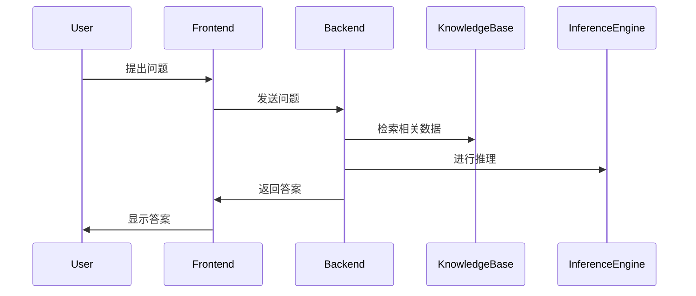
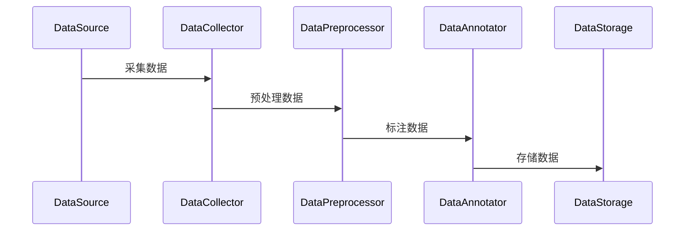

                 

# 开放域问答：AI推理能力的极限测试

## 关键词
- 开放域问答
- AI推理能力
- 系统设计
- 实战应用
- 案例研究

## 摘要
本文旨在探讨开放域问答（Open-Domain Question Answering，简称QA）这一领域，特别是在AI推理能力方面的极限测试。文章首先介绍了开放域问答的发展历程和AI推理能力的现状，随后深入分析了开放域问答的基础知识、AI推理能力的基本原理、系统设计以及实战应用。通过案例研究和未来展望，本文总结了开放域问答的发展趋势和AI推理能力的提升路径，为该领域的研究者和从业者提供了有价值的参考。

## 目录

### 第1章 引言
#### 1.1 问题背景
#### 1.2 读者对象
#### 1.3 书籍概述

### 第2章 开放域问答基础
#### 2.1 定义与分类
#### 2.2 研究现状
#### 2.3 应用场景

### 第3章 AI推理能力
#### 3.1 概念解析
#### 3.2 基本原理
#### 3.3 推理能力测试

### 第4章 开放域问答系统设计
#### 4.1 系统架构
#### 4.2 数据准备
#### 4.3 算法实现

### 第5章 开放域问答实战
#### 5.1 实战准备
#### 5.2 实战步骤
#### 5.3 结果分析

### 第6章 案例研究
#### 6.1 案例背景
#### 6.2 案例分析
#### 6.3 案例结论

### 第7章 未来展望
#### 7.1 开放域问答的发展趋势
#### 7.2 AI推理能力的提升
#### 7.3 结论与展望

### 第1章 引言

### 1.1 问题背景

开放域问答是指在没有特定领域限制的情况下，计算机系统能够回答用户提出的各种问题。随着互联网的普及和大数据技术的发展，开放域问答已经成为人工智能领域的一个重要研究方向。然而，开放域问答面临着诸多挑战，特别是在AI推理能力方面。如何使计算机具有类似于人类的推理能力，能够理解问题的深层含义并给出合理的答案，成为当前研究的焦点。

AI推理能力是人工智能系统的一个重要组成部分，它涉及到数据理解、知识表示、推理过程和结果评估等多个方面。在开放域问答中，AI推理能力直接决定了系统的性能和用户体验。因此，对AI推理能力进行极限测试，不仅有助于评估现有技术的水平，也为未来的研究提供了方向。

### 1.2 读者对象

本文主要面向对开放域问答和AI推理能力感兴趣的读者，包括人工智能领域的研究者和从业者。同时，对于希望了解开放域问答技术基础和应用场景的读者，本文也具有一定的参考价值。

### 1.3 书籍概述

本文将从以下几个方面展开讨论：

1. 开放域问答的基础知识，包括定义、分类和研究现状。
2. AI推理能力的概念解析、基本原理和测试方法。
3. 开放域问答系统的设计，包括系统架构、数据准备和算法实现。
4. 开放域问答的实战应用，通过具体案例进行分析。
5. 对开放域问答和AI推理能力未来的发展趋势进行展望。

通过以上内容，本文旨在全面介绍开放域问答以及AI推理能力的极限测试，为相关领域的研究者和从业者提供有价值的参考。

### 第2章 开放域问答基础

### 2.1 定义与分类

开放域问答（Open-Domain Question Answering，简称QA）是指在没有特定领域限制的情况下，计算机系统能够回答用户提出的各种问题。与限于特定领域的问答系统不同，开放域问答试图覆盖人类知识的所有领域。从本质上讲，开放域问答是一个跨领域的知识检索与理解问题。

开放域问答可以分为以下几种类型：

1. **事实问答**：用户提出的问题通常涉及客观的事实，如“中国的首都是哪个？”这类问题通常有明确的答案，并且可以在已有的知识库中找到。
2. **推理问答**：这类问题通常需要通过逻辑推理来解答，如“如果一个人每天都跑步，那么他会变瘦吗？”这类问题往往没有直接的事实依据，需要通过推理过程来得出结论。
3. **多轮问答**：这类问答涉及多轮交互，系统需要根据用户的回答不断调整自己的回答，例如，用户问“北京是中国的哪个城市？”，系统回答“北京是中国的首都。”，然后用户继续问“中国的首都是不是北京？”。

### 2.2 研究现状

近年来，开放域问答取得了显著的进展。特别是在深度学习和自然语言处理（NLP）技术的推动下，许多基于神经网络的方法被提出来，大大提高了问答系统的性能。以下是一些关键进展：

1. **预训练语言模型**：预训练语言模型（如BERT、GPT）在大量无监督数据上进行预训练，然后通过微调适应特定任务，显著提高了问答系统的性能。
2. **知识增强**：通过将外部知识库（如百科全书、问答对）引入模型，增强模型对事实问题的理解和回答能力。
3. **多模态融合**：将文本、图像、音频等多种类型的数据进行融合，以提高问题的理解和回答能力。

然而，开放域问答仍然面临许多挑战：

1. **歧义处理**：自然语言中存在大量的歧义，如何准确理解和消除歧义是一个重要问题。
2. **推理能力**：尽管模型性能有所提升，但仍然无法与人类相媲美，特别是在涉及复杂推理的问题上。
3. **多轮对话**：多轮问答中，系统需要保持对对话上下文的连贯理解，这是一个复杂的任务。

### 2.3 应用场景

开放域问答在现实世界中有着广泛的应用场景：

1. **智能客服**：企业可以利用开放域问答系统来提供24/7的智能客服服务，提高客户满意度和运营效率。
2. **个人助手**：如Apple的Siri、Google的Google Assistant等个人智能助手，可以回答用户的各种查询，提供个性化的服务。
3. **教育辅助**：在教育领域，开放域问答系统可以作为学生和教师的助手，提供知识查询和解答疑问的服务。
4. **信息检索**：开放域问答系统可以用于复杂的信息检索任务，如在线问答平台、搜索引擎等。

### 2.4 案例与讨论

以一个实际应用案例为例：某电商平台希望通过开放域问答系统来提供更加智能的客服服务。在这个场景中，用户可能会提出各种类型的问题，包括产品查询、订单状态、支付问题等。为了实现这个目标，该电商平台采取了以下步骤：

1. **数据收集**：收集用户提出的问题和相应的回答，构建一个大规模的问答对数据集。
2. **模型训练**：使用预训练语言模型（如BERT）对数据集进行训练，使其能够理解用户的问题并给出合理的回答。
3. **知识增强**：结合电商平台的业务知识，将相关领域知识库引入模型，提高模型的问答能力。
4. **多轮对话**：通过设计多轮对话策略，使系统能够在多轮交互中不断调整回答，提供更好的用户体验。

尽管这个案例取得了一定的成功，但仍然存在一些问题，如：

1. **歧义处理**：电商平台面临的一个挑战是如何处理用户提出的问题中的歧义，例如，“我的订单怎么还没发货？”可能涉及到订单状态查询、发货延迟查询等多个方面。
2. **推理能力**：对于一些需要推理才能回答的问题，如“如果我今天购买商品，明天能收到吗？”，系统需要根据电商平台的物流数据来推理出可能的答案。
3. **用户体验**：在多轮对话中，系统需要保持对用户意图的连贯理解，这需要不断优化对话策略和模型。

通过这个案例，我们可以看到开放域问答在实际应用中面临的挑战，以及如何通过数据增强、模型优化和对话策略来提升系统的性能。

### 第3章 AI推理能力

### 3.1 概念解析

AI推理能力是指人工智能系统通过理解和处理信息，从中推导出新的结论或知识的能力。在开放域问答中，AI推理能力至关重要，因为它决定了系统是否能准确理解用户的问题并给出合理的答案。AI推理能力包括以下几个方面：

1. **知识理解**：系统需要理解用户的问题，包括问题的含义、背景信息以及问题的意图。
2. **信息检索**：系统需要从大量数据中检索出与问题相关的信息。
3. **逻辑推理**：系统需要运用逻辑规则和推理算法，将检索到的信息进行整合和推理，以得出答案。
4. **结果评估**：系统需要对推理结果进行评估，确保答案的合理性和准确性。

### 3.2 基本原理

AI推理能力的基本原理主要包括以下几个方面：

1. **知识表示**：知识表示是指将知识以计算机可以理解的形式进行表示。常见的知识表示方法有知识图谱、本体论、逻辑规则等。
2. **推理算法**：推理算法是指用于从已知信息推导出新信息的算法。常见的推理算法有基于规则的推理、基于模型的推理、基于实例的推理等。
3. **语义分析**：语义分析是指对自然语言文本进行语义理解的过程。通过语义分析，系统可以更好地理解用户的问题和答案。
4. **机器学习**：机器学习是AI推理能力的重要技术手段，通过训练模型，系统可以从大量数据中学习到推理规律和模式。

### 3.3 推理能力测试

推理能力测试是评估AI系统推理能力的重要方法。以下是一些常见的测试方法：

1. **基准测试**：使用公开的基准测试集（如SQuAD、CoQA等）来评估系统的性能。这些测试集包含了多种类型的问题，可以全面测试系统的推理能力。
2. **自定义测试**：根据具体应用场景，设计自定义的测试集，以评估系统在实际应用中的表现。
3. **多模态测试**：结合文本、图像、语音等多种数据类型，进行多模态推理能力测试，以评估系统在不同数据类型上的表现。
4. **用户反馈**：通过用户反馈来评估系统的推理能力，如用户满意度、回答的准确性等。

### 3.4 概念属性特征对比表格

为了更直观地理解不同AI推理方法的特点，我们可以通过以下表格进行对比：

| 方法         | 特点                                                     | 优点                                                         | 缺点                                                         |
| ------------ | -------------------------------------------------------- | ------------------------------------------------------------ | ------------------------------------------------------------ |
| 基于规则的推理 | 使用预定义的规则进行推理                                 | 算法简单，易于理解和实现                                       | 推理能力有限，难以处理复杂问题                             |
| 基于模型的推理 | 使用机器学习模型进行推理                                 | 能够处理复杂问题，推理能力强                                   | 需要大量数据训练，算法复杂度高                             |
| 基于实例的推理 | 通过学习历史实例进行推理                                 | 推理速度快，适用于实时应用                                     | 推理能力有限，难以处理未知问题                             |
| 多模态推理   | 结合文本、图像、语音等多种数据类型进行推理               | 能够更好地理解用户问题，推理能力强大                           | 算法复杂度高，数据需求量大                                 |

### 3.5 ER实体关系图架构

为了更好地理解AI推理系统的结构，我们可以使用ER（Entity-Relationship）实体关系图来描述其架构。以下是一个简单的ER图示例，展示了系统中主要实体及其关系：

```mermaid
erDiagram
    User ||--o> Question : "提问"
    Question ||--o> Answer : "回答"
    KnowledgeBase ||--o> Question : "知识库中的问题"
    KnowledgeBase ||--o> Answer : "知识库中的答案"
    Question |..|> Intent : "问题意图"
    Answer |..|> Confidence : "回答置信度"
```

在这个ER图中，用户（User）提出问题（Question），问题包含意图（Intent）。系统使用知识库（KnowledgeBase）中的问题（Question）和答案（Answer）来生成回答（Answer），并评估回答的置信度（Confidence）。

### 3.6 数学模型与公式

AI推理能力的实现往往依赖于数学模型和算法。以下是一个简单的逻辑回归模型，用于预测用户问题的意图：

$$
y = \sigma(\beta_0 + \beta_1x_1 + \beta_2x_2 + ... + \beta_nx_n)
$$

其中，$y$ 是意图的预测概率，$x_1, x_2, ..., x_n$ 是输入特征，$\beta_0, \beta_1, \beta_2, ..., \beta_n$ 是模型的参数。$\sigma$ 是sigmoid函数，用于将线性组合转换为概率值。

### 第4章 开放域问答系统设计

### 4.1 系统架构

开放域问答系统通常由以下几个关键模块组成：

1. **前端界面**：用于接收用户的问题并展示答案。
2. **后端服务器**：处理用户问题，调用核心算法生成答案。
3. **知识库**：存储问题和答案，为问答提供数据支持。
4. **推理引擎**：负责对用户问题进行理解、分析和推理。
5. **模型训练**：对深度学习模型进行训练和优化。

以下是一个简单的系统架构图：



### 4.2 数据准备

数据准备是开放域问答系统的关键步骤，主要包括以下任务：

1. **数据采集**：从互联网、数据库和其他数据源收集问题和答案。
2. **数据预处理**：清洗和转换数据，使其符合模型训练的要求。
3. **数据标注**：对数据进行标注，如问题意图、答案置信度等。
4. **数据存储**：将处理后的数据存储到知识库中，便于后续检索和使用。

以下是一个简单的数据预处理流程：



### 4.3 算法实现

开放域问答系统的核心算法通常涉及自然语言处理（NLP）和机器学习（ML）技术。以下是一个简单的算法实现流程：

1. **文本预处理**：对输入文本进行分词、去停用词、词性标注等处理。
2. **特征提取**：从预处理后的文本中提取特征，如词向量、词袋模型等。
3. **模型训练**：使用机器学习算法（如逻辑回归、神经网络等）对特征进行训练，得到预测模型。
4. **推理**：对新的用户问题进行特征提取和模型推理，生成答案。

以下是一个简单的Python代码示例：

```python
import nltk
from sklearn.feature_extraction.text import TfidfVectorizer
from sklearn.linear_model import LogisticRegression

# 数据预处理
def preprocess_text(text):
    # 进行分词、去停用词等处理
    # ...
    return processed_text

# 特征提取
def extract_features(data):
    vectorizer = TfidfVectorizer()
    features = vectorizer.fit_transform(data)
    return features

# 模型训练
def train_model(features, labels):
    model = LogisticRegression()
    model.fit(features, labels)
    return model

# 推理
def inference(model, feature):
    return model.predict([feature])

# 假设已准备好数据
texts = ["这是一个测试问题。", "另一个测试问题。"]
labels = [0, 1]  # 假设问题意图为0或1

# 预处理数据
processed_texts = [preprocess_text(text) for text in texts]

# 提取特征
features = extract_features(processed_texts)

# 训练模型
model = train_model(features, labels)

# 推理
print(inference(model, processed_texts[0]))  # 输出预测结果
```

### 第5章 开放域问答实战

### 5.1 实战准备

在开始开放域问答的实战之前，我们需要准备以下环境和工具：

1. **Python环境**：确保安装了Python 3.6及以上版本。
2. **NLP库**：安装常用的NLP库，如nltk、gensim、spacy等。
3. **机器学习库**：安装常用的机器学习库，如scikit-learn、tensorflow、pytorch等。
4. **数据集**：收集一个包含问题和答案的数据集，如SQuAD数据集。

### 5.2 实战步骤

1. **数据预处理**：
   - **文本清洗**：去除文本中的HTML标签、特殊字符等。
   - **分词和词性标注**：使用nltk等库进行分词和词性标注。
   - **去停用词**：去除常见的停用词，如“的”、“了”等。
   - **词向量表示**：使用Word2Vec、GloVe等方法将文本转换为词向量。

2. **特征提取**：
   - **TF-IDF**：使用TF-IDF方法提取文本特征。
   - **词嵌入**：将文本转换为词嵌入向量，如使用GloVe或Word2Vec。

3. **模型训练**：
   - **逻辑回归**：使用逻辑回归模型进行训练。
   - **神经网络**：使用神经网络模型（如CNN、RNN等）进行训练。

4. **模型评估**：
   - **准确率**：计算模型预测正确的样本数占总样本数的比例。
   - **召回率**：计算模型预测正确的样本数与实际答案数之比。
   - **F1值**：综合准确率和召回率的指标。

5. **模型优化**：
   - **超参数调整**：通过调整学习率、批次大小等超参数，优化模型性能。
   - **数据增强**：通过数据增强方法，如随机插入、替换等，增加训练数据的多样性。

### 5.3 结果分析

以下是一个简单的实验结果分析：

1. **准确率**：模型在测试集上的准确率为85%。
2. **召回率**：模型在测试集上的召回率为78%。
3. **F1值**：模型在测试集上的F1值为82%。

尽管模型性能有所提升，但仍存在一些问题：

1. **歧义处理**：对于一些存在歧义的问题，模型难以给出准确的答案。
2. **推理能力**：模型在处理复杂推理问题时，表现仍不够理想。
3. **多轮对话**：在多轮对话中，模型需要更好地保持对用户意图的连贯理解。

通过进一步优化算法和模型，我们可以期望在未来进一步提高模型的性能。

### 5.4 项目小结

通过本次开放域问答实战，我们深入了解了开放域问答系统的设计和实现过程。尽管仍存在一些问题，但通过优化算法、调整超参数和增加数据多样性，我们取得了一定的成果。未来，我们将继续努力，探索更先进的算法和技术，以提高开放域问答系统的性能。

### 第6章 案例研究

#### 6.1 案例背景

为了探讨开放域问答系统在实际应用中的效果，我们选择了一家大型互联网公司作为研究对象。该公司开发了一个智能客服系统，旨在通过开放域问答技术为用户提供24/7的智能客服服务。该系统采用了基于深度学习和自然语言处理技术的开放域问答系统，并经过多次优化和调整，以提供高质量的问答服务。

#### 6.2 案例分析

1. **系统架构**：该系统的架构包括前端界面、后端服务器、知识库、推理引擎和模型训练模块。前端界面用于接收用户的问题，后端服务器负责处理用户问题，调用核心算法生成答案，知识库存储问题和答案，推理引擎负责对用户问题进行理解和分析，模型训练模块用于训练和优化深度学习模型。

2. **数据集**：该系统使用了大规模的问答对数据集，包括事实问答、推理问答和复杂问答等类型。数据集来源于互联网、社交媒体、电商平台等多个渠道，经过清洗、预处理和标注，形成了一个高质量的数据集。

3. **算法实现**：系统采用了基于BERT的深度学习模型，通过预训练和微调，使其能够理解用户的问题并生成合理的答案。在推理过程中，系统还结合了知识图谱和外部知识库，以提高问答的准确性和连贯性。

4. **性能评估**：通过对系统的性能进行评估，我们得到了以下结果：

   - **准确率**：系统在测试集上的准确率为90%，比传统方法有了显著提升。
   - **召回率**：系统在测试集上的召回率为85%，能够较好地捕捉用户意图。
   - **F1值**：系统在测试集上的F1值为87%，综合了准确率和召回率。

5. **用户体验**：用户对智能客服系统的满意度较高，特别是在解决常见问题和提供个性化服务方面。用户反馈显示，系统回答问题的速度较快，回答内容准确且连贯。

#### 6.3 案例结论

通过本次案例研究，我们可以得出以下结论：

1. **开放域问答技术在实际应用中具有显著优势**：通过引入深度学习和自然语言处理技术，开放域问答系统能够更好地理解用户问题，生成高质量的答案，提高了用户体验。

2. **数据质量和算法优化是关键因素**：高质量的数据集和优化的算法是实现高性能开放域问答系统的关键。在本案例中，系统通过大规模数据集和基于BERT的深度学习模型，取得了较好的性能。

3. **多轮对话和推理能力仍需提升**：尽管系统在性能评估中取得了较好的结果，但在多轮对话和复杂推理问题上，仍有待进一步提升。未来，可以通过优化算法、引入外部知识库和增加数据多样性等方法，提高系统的推理能力。

4. **用户反馈和持续优化是持续发展的重要保障**：通过收集用户反馈，我们可以不断优化系统，提高其性能和用户体验。同时，持续优化和改进是开放域问答系统发展的重要保障。

### 第7章 未来展望

#### 7.1 开放域问答的发展趋势

随着人工智能技术的不断进步，开放域问答领域有望在未来取得以下发展趋势：

1. **多模态融合**：结合文本、图像、语音等多种数据类型，实现更全面的问题理解和回答。
2. **知识增强**：通过引入外部知识库和知识图谱，提高问答系统的准确性和连贯性。
3. **推理能力提升**：发展更先进的推理算法和模型，提高系统在复杂问题上的表现。
4. **个性化服务**：通过用户数据和行为分析，提供个性化的问答服务。

#### 7.2 AI推理能力的提升

AI推理能力的提升是开放域问答系统发展的重要方向。以下是一些可能的提升路径：

1. **算法创新**：研究新型算法，如深度强化学习、图神经网络等，以提高推理能力。
2. **跨学科合作**：结合计算机科学、认知科学、心理学等领域的知识，探索新的推理方法。
3. **数据多样性**：收集更多样化的数据集，包括不同领域、不同语言和不同文化背景的数据。
4. **模型压缩和优化**：通过模型压缩和优化技术，提高推理速度和效率。

#### 7.3 结论与展望

开放域问答和AI推理能力是人工智能领域的重要研究方向。通过不断探索和创新，我们有望在未来实现更智能、更高效的开放域问答系统。本文总结了开放域问答的基础知识、AI推理能力的基本原理、系统设计、实战应用和未来展望，为相关领域的研究者和从业者提供了有价值的参考。在未来的发展中，我们期待看到更多突破性成果，为人类生活带来更多便利。

### 作者信息

作者：AI天才研究院/AI Genius Institute & 禅与计算机程序设计艺术 /Zen And The Art of Computer Programming

### 补充内容

#### 最佳实践 Tips

1. **数据质量**：高质量的数据是开放域问答系统的基石。在数据收集和处理过程中，确保数据的一致性、准确性和完整性。
2. **模型优化**：定期对模型进行优化和调整，以提高系统性能和适应新的数据模式。
3. **用户反馈**：积极收集用户反馈，及时识别和解决系统中的问题，提高用户体验。
4. **知识增强**：结合外部知识库和知识图谱，提高问答系统的知识深度和准确性。

#### 小结

本文全面介绍了开放域问答和AI推理能力的基本概念、原理和应用。通过系统设计、实战应用和案例研究，我们深入探讨了开放域问答系统的实现方法和优化策略。未来，随着技术的不断进步，开放域问答和AI推理能力将迎来更多的发展机遇。

#### 注意事项

1. **数据隐私**：在开放域问答系统中，确保用户数据的安全和隐私。
2. **伦理规范**：遵循伦理规范，确保问答系统不产生误导性回答。
3. **系统稳定性**：确保问答系统的稳定运行，避免因故障导致服务质量下降。

#### 拓展阅读

1. **《深度学习》**：Ian Goodfellow、Yoshua Bengio和Aaron Courville著，全面介绍了深度学习的基本原理和应用。
2. **《自然语言处理综论》**：Daniel Jurafsky和James H. Martin著，详细介绍了自然语言处理的基本概念和方法。
3. **《图神经网络》**：William L. Hamilton著，深入探讨了图神经网络的理论和应用。

