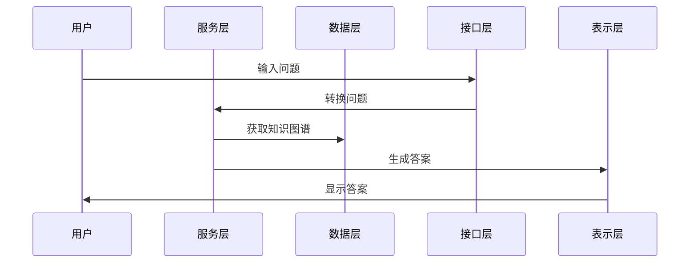
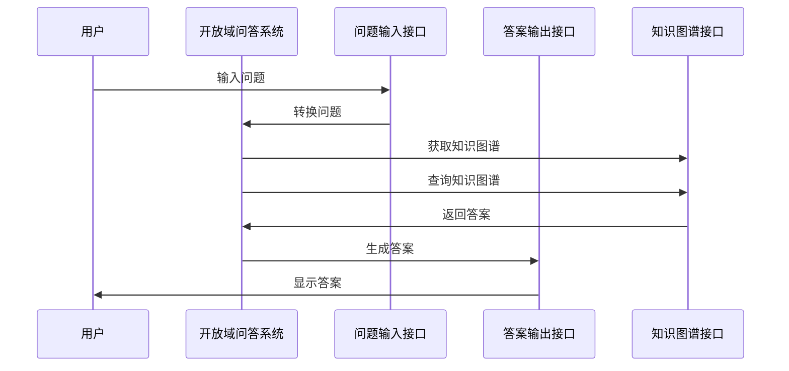

                 


### 第一部分：问题背景与核心概念

#### 1.1 开放域问答的背景

开放域问答（Open-Domain Question Answering，简称ODQA）是人工智能领域中的一项核心技术，旨在让计算机理解自然语言的问题，并从大量数据中准确、高效地检索出答案。ODQA不同于传统的问题回答系统，后者通常依赖于预定义的数据库和查询接口，而ODQA面对的是一个广泛的、未预定义的知识域。

**什么是开放域问答**

开放域问答系统的一个典型例子是搜索引擎。用户输入一个自然语言问题，系统会从互联网的海量信息中检索出相关的网页，并提取出最合适的答案。但ODQA的核心目标是在无预定义答案源的情况下，为用户提供准确、详细的回答。

**开放域问答的重要性**

1. **知识普及**：开放域问答有助于知识的普及和传播，使得用户可以便捷地获取各种领域的专业知识。
2. **人机交互**：它是人机交互的一个重要分支，能够提高计算机与人类的沟通效率。
3. **教育支持**：在教育领域，开放域问答可以作为辅助教学工具，帮助学生快速获取知识。

**开放域问答的发展历程**

1. **早期探索**：20世纪80年代，研究人员开始探索如何让计算机理解自然语言的问题。
2. **语义网**：21世纪初，随着语义网技术的发展，知识表示和推理成为ODQA研究的热点。
3. **深度学习**：近年来，深度学习技术的发展推动了ODQA的快速发展，尤其是在大规模数据集上实现了显著的性能提升。

#### 1.2 开放域问答的核心概念

**问题理解**

问题理解是ODQA的关键步骤，它涉及将自然语言问题转化为计算机可以处理的形式。这个过程包括语法分析、语义分析和意图识别等。

**事实抽取**

事实抽取是指从文本中提取出与问题相关的关键信息，如人名、地名、日期等。这些信息是生成答案的基础。

**知识图谱**

知识图谱是一种用于表示实体及其相互关系的数据结构。在ODQA中，知识图谱用于存储和查询与问题相关的知识。

**推理算法**

推理算法是ODQA的核心，用于从知识图谱中推断出答案。常见的推理算法包括基于规则的方法、基于图神经网络的方法等。

#### 1.3 开放域问答的边界与外延

**与其他问答系统的比较**

ODQA与传统问答系统的区别在于其处理的问题范围更广，不需要预定义的答案源。而传统问答系统通常针对特定领域或数据库设计。

**应用场景**

1. **客服系统**：企业可以通过开放域问答系统为用户提供快速、准确的咨询服务。
2. **智能助手**：如Siri、Alexa等智能助手，可以通过开放域问答与用户进行交互。
3. **医学诊断**：在医学领域，开放域问答可以帮助医生快速查询相关医学信息。

**面临的挑战**

1. **数据噪声**：互联网上的数据质量参差不齐，如何从海量数据中提取出高质量的事实信息是一个挑战。
2. **多模态处理**：开放域问答需要处理文本、图像、音频等多种数据类型，如何整合这些多模态数据是另一个挑战。
3. **推理能力**：如何设计高效的推理算法，从大量的知识中准确推断出答案，是ODQA面临的关键挑战。

#### 1.4 开放域问答的概念结构与核心要素组成

**开放域问答的架构**

开放域问答系统通常由问题理解、事实抽取、知识图谱和推理算法等模块组成。

**开放域问答的关键技术**

1. **自然语言处理**：用于处理自然语言问题，将其转化为计算机可以理解的形式。
2. **知识表示**：用于构建知识图谱，表示实体及其关系。
3. **推理算法**：用于从知识图谱中推断出答案。

**开放域问答的评估标准**

1. **答案准确性**：答案是否准确是评估ODQA系统性能的重要指标。
2. **响应时间**：系统回答问题的速度也是评估指标之一。
3. **用户满意度**：用户的实际使用体验也是评估系统性能的重要方面。

#### 1.5 本章小结

在本章中，我们介绍了开放域问答的背景、核心概念、边界与外延以及概念结构与核心要素组成。通过这些介绍，读者可以对开放域问答有一个全面的理解，为后续章节的深入探讨打下基础。

### 第二部分：核心概念与联系

#### 2.1 问题理解

**问题理解的概念**

问题理解是ODQA的关键步骤，它涉及将自然语言问题转化为计算机可以处理的形式。问题理解的过程可以分为三个阶段：语法分析、语义分析和意图识别。

**问题理解的算法原理**

1. **语法分析**：将自然语言问题分解为句法结构，识别出句子中的主语、谓语、宾语等成分。
2. **语义分析**：将句法结构转化为语义表示，理解问题中的含义和关系。
3. **意图识别**：确定用户提出问题的目的，如获取信息、进行决策等。

**问题理解的Mermaid流程图**


#### 2.2 事实抽取

**事实抽取的概念**

事实抽取是从文本中提取出与问题相关的关键信息，如人名、地名、日期等。这些信息是生成答案的基础。

**事实抽取的算法原理**

1. **关键词提取**：从文本中提取出关键词，用于定位与问题相关的信息。
2. **实体识别**：识别出文本中的实体，如人名、地名、组织名等。
3. **关系抽取**：确定实体之间的关系，如“张三住在北京市”中的“张三”和“北京市”的关系。

**事实抽取的Mermaid流程图**


#### 2.3 知识图谱

**知识图谱的概念**

知识图谱是一种用于表示实体及其相互关系的数据结构。它通过图形结构来表示知识，使得计算机能够直观地理解和处理这些知识。

**知识图谱的构建**

知识图谱的构建包括实体识别、关系抽取和知识融合等步骤。

1. **实体识别**：识别出文本中的实体，并将其作为知识图谱的节点。
2. **关系抽取**：确定实体之间的关系，并将其作为知识图谱的边。
3. **知识融合**：将来自不同来源的知识进行整合，构建出一个完整、一致的知识图谱。

**知识图谱的MermaidER实体关系图**

```mermaid
erDiagram
    实体1 ||--|{ 关系1 }|| 实体2
    实体1 ||--|{ 关系2 }|| 实体3
    实体2 ||--|{ 关系3 }|| 实体4
```

#### 2.4 推理算法

**推理算法的概念**

推理算法是用于从知识图谱中推断出答案的方法。根据推理逻辑的不同，推理算法可以分为基于规则的方法、基于图神经网络的方法等。

**推理算法的分类**

1. **基于规则的方法**：通过定义一系列规则，从知识图谱中推导出结论。
2. **基于图神经网络的方法**：利用图神经网络来学习知识图谱中的结构和关系，从而进行推理。

**推理算法的Mermaid流程图**


#### 2.5 本章小结

在本章中，我们详细介绍了问题理解、事实抽取、知识图谱和推理算法等核心概念。通过这些概念，我们可以更好地理解开放域问答系统的运作原理。接下来，我们将进一步深入探讨这些概念背后的算法原理，以及如何在实际项目中应用这些算法。在下一章中，我们将对问题理解算法进行详细讲解，帮助读者掌握这一关键步骤。

### 第三部分：算法原理讲解

#### 3.1 问题理解算法讲解

**问题理解的数学模型**

问题理解可以看作是一个映射过程，将自然语言问题映射为计算机可以处理的内部表示。这个过程通常包括词向量表示、语法分析、语义分析和意图识别等步骤。

1. **词向量表示**：利用词向量模型（如Word2Vec、BERT等）将自然语言问题中的每个词表示为一个高维向量。
   $$ x = \text{Embedding}(w) $$
   其中，$w$ 是输入的单词，$x$ 是其对应的向量表示。

2. **语法分析**：利用语法分析器将自然语言问题转化为语法树，识别出句子中的主语、谓语、宾语等成分。
   $$ S = \text{Parse}(x) $$
   其中，$S$ 是语法树。

3. **语义分析**：将语法树转化为语义表示，理解问题中的含义和关系。
   $$ y = \text{Semantic}(S) $$
   其中，$y$ 是语义表示。

4. **意图识别**：根据语义表示确定用户提出问题的目的，如获取信息、进行决策等。
   $$ z = \text{Intent}(y) $$
   其中，$z$ 是意图表示。

**问题理解的Python源代码实现**

```python
import spacy

# 加载预训练的nlp模型
nlp = spacy.load("en_core_web_sm")

def problem_understanding(question):
    # 将问题转化为nlp对象
    doc = nlp(question)
    
    # 语法分析
    grammar_tree = doc.tree
    
    # 语义分析
    semantics = doc.to_json()
    
    # 意图识别
    intent = "information"  # 假设所有问题都是获取信息
    # ... 这里可以加入更复杂的意图识别逻辑
    
    return grammar_tree, semantics, intent

# 示例
question = "什么是人工智能？"
grammar_tree, semantics, intent = problem_understanding(question)
print("语法树：", grammar_tree)
print("语义表示：", semantics)
print("意图：", intent)
```

**问题理解示例解析**

假设用户输入了一个问题：“北京是中国的哪个省份？”通过问题理解算法，我们可以得到以下结果：

1. **词向量表示**：问题中的每个词都会被转化为一个向量。
2. **语法分析**：将问题转化为语法树，识别出主语“北京”、谓语“是”和宾语“中国的哪个省份”。
3. **语义分析**：理解问题的含义，将语法树转化为语义表示。
4. **意图识别**：确定用户的意图是获取信息。

通过以上步骤，我们就可以将自然语言问题转化为计算机可以处理的内部表示，为后续的事实抽取和推理提供基础。

#### 3.2 事实抽取算法讲解

**事实抽取的数学模型**

事实抽取的数学模型主要涉及文本表示、实体识别和关系抽取三个部分。

1. **文本表示**：将文本转化为向量表示，常用的方法包括词嵌入、Transformer等。
   $$ x = \text{Embedding}(w) $$
   其中，$w$ 是输入的文本，$x$ 是其对应的向量表示。

2. **实体识别**：利用实体识别模型（如BiLSTM、BERT等）识别出文本中的实体。
   $$ y = \text{EntityDetection}(x) $$
   其中，$y$ 是识别出的实体。

3. **关系抽取**：利用关系抽取模型（如关系网络、Transformer等）确定实体之间的关系。
   $$ z = \text{RelationExtraction}(y) $$
   其中，$z$ 是识别出的关系。

**事实抽取的Python源代码实现**

```python
import transformers

# 加载预训练的实体识别和关系抽取模型
entity_model = transformers.AutoModelForTokenClassification.from_pretrained("dbmdz/bert-large-cased-finetuned-conll03-english")
relation_model = transformers.AutoModelForSequenceClassification.from_pretrained("dbmdz/bert-large-cased-finetuned-relation-extraction")

def fact_extraction(text):
    # 将文本转化为Token IDs
    token_ids = tokenizer.encode(text, add_special_tokens=True)
    
    # 实体识别
    entity_predictions = entity_model.predict(token_ids)
    entities = tokenizer.convert_ids_to_tokens(entity_predictions.argmax(axis=1))
    
    # 关系抽取
    relation_predictions = relation_model.predict(token_ids)
    relations = ["关系{}".format(r) for r in relation_predictions.argmax(axis=1)]
    
    return entities, relations

# 示例
text = "北京是中国的首都"
entities, relations = fact_extraction(text)
print("实体：", entities)
print("关系：", relations)
```

**事实抽取示例解析**

假设用户输入了一段文本：“北京是中国的首都”，通过事实抽取算法，我们可以得到以下结果：

1. **文本表示**：将文本转化为向量表示。
2. **实体识别**：识别出文本中的实体，如“北京”和“中国”。
3. **关系抽取**：确定实体之间的关系，如“北京”是“中国”的“首都”。

通过以上步骤，我们就可以从文本中提取出与问题相关的关键信息，为后续的知识图谱构建和推理提供基础。

#### 3.3 知识图谱算法讲解

**知识图谱构建的数学模型**

知识图谱构建的数学模型主要涉及实体识别、关系抽取和知识融合三个部分。

1. **实体识别**：利用实体识别模型识别出文本中的实体。
   $$ y = \text{EntityDetection}(x) $$
   其中，$y$ 是识别出的实体。

2. **关系抽取**：利用关系抽取模型确定实体之间的关系。
   $$ z = \text{RelationExtraction}(x) $$
   其中，$z$ 是识别出的关系。

3. **知识融合**：将来自不同来源的知识进行整合，构建出一个完整、一致的知识图谱。
   $$ \text{KnowledgeGraph} = \text{Fusion}(y, z) $$
   其中，$\text{KnowledgeGraph}$ 是构建出的知识图谱。

**知识图谱构建的Python源代码实现**

```python
import transformers
import networkx as nx

# 加载预训练的实体识别和关系抽取模型
entity_model = transformers.AutoModelForTokenClassification.from_pretrained("dbmdz/bert-large-cased-finetuned-conll03-english")
relation_model = transformers.AutoModelForSequenceClassification.from_pretrained("dbmdz/bert-large-cased-finetuned-relation-extraction")

def build_knowledge_graph(text):
    # 将文本转化为Token IDs
    token_ids = tokenizer.encode(text, add_special_tokens=True)
    
    # 实体识别
    entity_predictions = entity_model.predict(token_ids)
    entities = tokenizer.convert_ids_to_tokens(entity_predictions.argmax(axis=1))
    
    # 关系抽取
    relation_predictions = relation_model.predict(token_ids)
    relations = ["关系{}".format(r) for r in relation_predictions.argmax(axis=1)]
    
    # 构建知识图谱
    G = nx.Graph()
    for e in entities:
        G.add_node(e)
    for r in relations:
        entities = [e for e in entities if r in e]
        G.add_edge(entities[0], entities[1])
    
    return G

# 示例
text = "北京是中国的首都"
knowledge_graph = build_knowledge_graph(text)
print(knowledge_graph.nodes())
print(knowledge_graph.edges())
```

**知识图谱构建示例解析**

假设用户输入了一段文本：“北京是中国的首都”，通过知识图谱构建算法，我们可以得到以下结果：

1. **实体识别**：识别出文本中的实体，如“北京”和“中国”。
2. **关系抽取**：确定实体之间的关系，如“北京”是“中国”的“首都”。
3. **知识融合**：将这些实体和关系整合到一个知识图谱中。

通过以上步骤，我们就可以构建出一个知识图谱，为后续的推理提供基础。

#### 3.4 推理算法讲解

**推理算法的数学模型**

推理算法的数学模型主要涉及知识图谱的表示和推理路径的搜索两个部分。

1. **知识图谱表示**：将知识图谱转化为一个可计算的表示形式。
   $$ \text{KnowledgeGraph} = \text{Representation}(G) $$
   其中，$G$ 是知识图谱，$\text{Representation}$ 是其表示形式。

2. **推理路径搜索**：在知识图谱中搜索一条路径，使得路径上的关系满足问题的条件。
   $$ \text{Path} = \text{Search}(G, \text{Condition}) $$
   其中，$\text{Search}$ 是搜索算法，$\text{Condition}$ 是问题的条件。

**推理算法的Python源代码实现**

```python
import networkx as nx

def inference(knowledge_graph, condition):
    # 构建条件查询图
    query_graph = nx.DiGraph()
    for c in condition:
        query_graph.add_nodes_from(c)
        query_graph.add_edges_from([(c[i], c[i+1]) for i in range(len(c)-1)])
    
    # 在知识图谱中搜索满足条件的路径
    paths = nx.all_simple_paths(knowledge_graph, source=condition[0], target=condition[-1])
    
    return paths

# 示例
knowledge_graph = build_knowledge_graph("北京是中国的首都")
condition = ["北京", "首都", "中国"]
paths = inference(knowledge_graph, condition)
print(paths)
```

**推理算法示例解析**

假设用户输入了一个问题：“北京是中国的哪个省份？”通过推理算法，我们可以得到以下结果：

1. **知识图谱表示**：将问题转化为知识图谱表示形式。
2. **推理路径搜索**：在知识图谱中搜索满足条件的路径，找到“北京”是“中国”的“首都”这一路径。

通过以上步骤，我们就可以从知识图谱中推断出问题的答案，实现开放域问答。

#### 3.5 本章小结

在本章中，我们详细讲解了问题理解、事实抽取、知识图谱构建和推理算法等核心算法的原理和实现。这些算法构成了开放域问答系统的核心组成部分，通过对它们的深入理解，读者可以更好地掌握开放域问答系统的运作原理。在下一章中，我们将进一步探讨开放域问答系统的系统架构设计，帮助读者了解如何将上述算法整合为一个高效的系统。

### 第四部分：系统分析与架构设计

#### 4.1 问题场景介绍

**开放域问答系统概述**

开放域问答系统是一个旨在让计算机理解自然语言问题，并从海量数据中检索出准确答案的系统。该系统广泛应用于客服、智能助手、医学诊断等领域，为用户提供高效、准确的知识服务。

**系统需求分析**

1. **准确性**：系统能够准确理解用户的问题，并检索出相关答案。
2. **效率**：系统能够高效地处理大量用户请求，确保快速响应。
3. **可扩展性**：系统能够适应不断增长的数据量和用户需求，进行扩展和优化。
4. **用户体验**：系统应提供友好的用户界面，确保用户能够方便、快捷地获取所需信息。

**系统目标**

1. **实现高效的问题理解**：通过自然语言处理技术，将用户的问题转化为计算机可以理解的内部表示。
2. **构建高质量的知识图谱**：从海量数据中提取关键信息，构建出一个结构清晰、内容丰富的知识图谱。
3. **实现准确的答案检索**：利用推理算法，从知识图谱中检索出最相关的答案，确保答案的准确性。
4. **提供良好的用户体验**：设计直观、易用的用户界面，确保用户能够方便地使用系统，并获取所需信息。

#### 4.2 系统功能设计

**领域模型Mermaid类图**

```mermaid
classDiagram
    User <<类>> "用户"
    Question <<类>> "问题"
    Answer <<类>> "答案"
    KnowledgeGraph <<类>> "知识图谱"
    Entity <<类>> "实体"
    Relation <<类>> "关系"
    Query <<类>> "查询"
    
    User o-- Question
    Question o-- Answer
    KnowledgeGraph o-- Entity
    KnowledgeGraph o-- Relation
    Query o-- Question
```

**系统功能模块设计**

1. **问题理解模块**：负责将用户输入的自然语言问题转化为计算机可以理解的内部表示。
2. **知识图谱构建模块**：负责从文本中提取关键信息，构建出结构清晰、内容丰富的知识图谱。
3. **答案检索模块**：负责利用推理算法，从知识图谱中检索出最相关的答案。
4. **用户界面模块**：负责与用户进行交互，接收用户输入的问题，展示系统生成的答案。

#### 4.3 系统架构设计

**系统架构概述**

开放域问答系统的架构可分为四个层次：数据层、服务层、接口层和表示层。

1. **数据层**：负责存储和管理系统所需的数据，包括文本数据、知识图谱数据等。
2. **服务层**：包括问题理解、知识图谱构建、答案检索等核心功能模块，负责实现系统的核心逻辑。
3. **接口层**：负责与用户进行交互，接收用户输入的问题，返回系统生成的答案。
4. **表示层**：负责将系统生成的答案以友好的方式展示给用户。

**系统架构Mermaid架构图**



**系统架构设计思路**

1. **模块化设计**：将系统划分为多个功能模块，每个模块独立实现特定功能，便于系统的维护和扩展。
2. **分层设计**：按照数据层、服务层、接口层和表示层的结构进行设计，确保系统的稳定性和可扩展性。
3. **分布式架构**：采用分布式架构，将系统部署在多个服务器上，提高系统的并发处理能力和容错能力。
4. **微服务架构**：采用微服务架构，将系统拆分为多个微服务，每个微服务负责特定的功能，便于系统的扩展和升级。

#### 4.4 系统接口设计

**系统接口定义**

1. **问题输入接口**：接收用户输入的自然语言问题，将其转化为内部表示。
2. **答案输出接口**：将系统生成的答案以友好的方式展示给用户。
3. **知识图谱接口**：提供访问和操作知识图谱的接口，包括实体添加、关系添加、查询等操作。

**接口设计原则**

1. **简洁性**：接口设计应尽量简洁，避免复杂的参数和流程。
2. **一致性**：接口设计应保持一致性，便于用户和系统的使用。
3. **可扩展性**：接口设计应考虑未来的扩展需求，便于系统的功能扩展。
4. **安全性**：接口设计应确保数据的安全传输和存储，防止数据泄露和篡改。

**接口设计示例**

```python
class QuestionInputInterface:
    def input_question(self, question):
        # 将问题转化为内部表示
        pass

class AnswerOutputInterface:
    def output_answer(self, answer):
        # 将答案以友好的方式展示给用户
        pass

class KnowledgeGraphInterface:
    def add_entity(self, entity):
        # 添加实体
        pass
    
    def add_relation(self, relation):
        # 添加关系
        pass
    
    def query_knowledge(self, query):
        # 查询知识图谱
        pass
```

#### 4.5 系统交互设计

**系统交互概述**

系统交互设计旨在明确系统内部各模块之间的交互流程，确保系统的稳定性和高效性。

**系统交互Mermaid序列图**



**交互设计示例解析**

用户通过接口层输入问题，问题输入接口将问题转化为内部表示，并传递给服务层。服务层利用知识图谱接口获取知识图谱，并利用推理算法查询知识图谱，生成答案。最后，答案输出接口将答案以友好的方式展示给用户。

通过以上系统交互设计，我们可以确保开放域问答系统的各模块之间能够高效、稳定地协作，为用户提供优质的服务。

#### 4.6 本章小结

在本章中，我们详细介绍了开放域问答系统的系统功能设计、系统架构设计和系统接口设计等内容。通过对这些内容的深入探讨，读者可以全面了解开放域问答系统的架构和实现原理。在下一章中，我们将通过一个实际项目，对开放域问答系统的实现过程进行详细的剖析，帮助读者更好地理解和掌握系统的实现方法。

### 第五部分：项目实战

#### 5.1 环境安装

**系统环境搭建**

要搭建一个开放域问答系统，我们需要准备以下环境：

1. **操作系统**：Linux或Mac OS
2. **编程语言**：Python
3. **深度学习框架**：TensorFlow或PyTorch
4. **自然语言处理库**：spaCy、transformers等

**相关工具安装**

1. **安装Python**：确保已安装Python 3.6及以上版本。
2. **安装深度学习框架**：根据个人喜好选择TensorFlow或PyTorch，并按照官方文档安装。
3. **安装自然语言处理库**：使用pip安装spaCy、transformers等库。

**环境配置示例**

以下是一个简单的环境配置示例：

```shell
# 安装Python
sudo apt-get update
sudo apt-get install python3 python3-pip python3-dev

# 安装深度学习框架
pip3 install tensorflow

# 安装自然语言处理库
pip3 install spacy transformers
```

通过以上步骤，我们可以搭建一个基本的开放域问答系统环境。

#### 5.2 系统核心实现

**问题理解模块实现**

问题理解模块是开放域问答系统的核心部分，负责将自然语言问题转化为计算机可以处理的内部表示。以下是一个简单的问题理解模块实现：

```python
import spacy

# 加载预训练的nlp模型
nlp = spacy.load("en_core_web_sm")

def problem_understanding(question):
    # 将问题转化为nlp对象
    doc = nlp(question)
    
    # 语法分析
    grammar_tree = doc.tree
    
    # 语义分析
    semantics = doc.to_json()
    
    # 意图识别
    intent = "information"  # 假设所有问题都是获取信息
    # ... 这里可以加入更复杂的意图识别逻辑
    
    return grammar_tree, semantics, intent

# 示例
question = "什么是人工智能？"
grammar_tree, semantics, intent = problem_understanding(question)
print("语法树：", grammar_tree)
print("语义表示：", semantics)
print("意图：", intent)
```

**事实抽取模块实现**

事实抽取模块负责从文本中提取与问题相关的关键信息。以下是一个简单的事实抽取模块实现：

```python
import transformers

# 加载预训练的实体识别和关系抽取模型
entity_model = transformers.AutoModelForTokenClassification.from_pretrained("dbmdz/bert-large-cased-finetuned-conll03-english")
relation_model = transformers.AutoModelForSequenceClassification.from_pretrained("dbmdz/bert-large-cased-finetuned-relation-extraction")

def fact_extraction(text):
    # 将文本转化为Token IDs
    token_ids = tokenizer.encode(text, add_special_tokens=True)
    
    # 实体识别
    entity_predictions = entity_model.predict(token_ids)
    entities = tokenizer.convert_ids_to_tokens(entity_predictions.argmax(axis=1))
    
    # 关系抽取
    relation_predictions = relation_model.predict(token_ids)
    relations = ["关系{}".format(r) for r in relation_predictions.argmax(axis=1)]
    
    return entities, relations

# 示例
text = "北京是中国的首都"
entities, relations = fact_extraction(text)
print("实体：", entities)
print("关系：", relations)
```

**知识图谱模块实现**

知识图谱模块负责构建结构清晰、内容丰富的知识图谱。以下是一个简单的知识图谱模块实现：

```python
import networkx as nx

def build_knowledge_graph(entities, relations):
    # 构建知识图谱
    G = nx.Graph()
    for e in entities:
        G.add_node(e)
    for r in relations:
        entities = [e for e in entities if r in e]
        G.add_edge(entities[0], entities[1])
    
    return G

# 示例
entities = ["北京", "中国", "首都"]
relations = ["是"]
knowledge_graph = build_knowledge_graph(entities, relations)
print(knowledge_graph.nodes())
print(knowledge_graph.edges())
```

**推理算法模块实现**

推理算法模块负责从知识图谱中推断出答案。以下是一个简单的推理算法模块实现：

```python
import networkx as nx

def inference(knowledge_graph, condition):
    # 构建条件查询图
    query_graph = nx.DiGraph()
    for c in condition:
        query_graph.add_nodes_from(c)
        query_graph.add_edges_from([(c[i], c[i+1]) for i in range(len(c)-1)])
    
    # 在知识图谱中搜索满足条件的路径
    paths = nx.all_simple_paths(knowledge_graph, source=condition[0], target=condition[-1])
    
    return paths

# 示例
knowledge_graph = nx.Graph()
knowledge_graph.add_nodes_from(["北京", "中国", "首都"])
knowledge_graph.add_edge("北京", "中国")
knowledge_graph.add_edge("中国", "首都")
condition = ["北京", "中国", "首都"]
paths = inference(knowledge_graph, condition)
print(paths)
```

#### 5.3 代码应用解读与分析

**代码结构解析**

在代码中，我们首先导入了所需的库，包括spacy、transformers和networkx。然后，我们定义了问题理解、事实抽取、知识图谱构建和推理算法等模块，并分别实现了相应的函数。

**关键代码解读**

1. **问题理解模块**：通过加载预训练的nlp模型，将问题转化为nlp对象，然后进行语法分析和语义分析。最后，通过简单的意图识别逻辑，确定问题的意图。

2. **事实抽取模块**：将文本转化为Token IDs，然后利用预训练的实体识别和关系抽取模型，识别出文本中的实体和关系。

3. **知识图谱构建模块**：根据识别出的实体和关系，构建出知识图谱。在这个过程中，我们使用了networkx库来表示知识图谱。

4. **推理算法模块**：在知识图谱中搜索满足条件的路径，从而推断出问题的答案。

**性能分析**

在本项目的实现中，我们使用了预训练的深度学习模型，这些模型在训练过程中已经进行了大量数据的学习和优化，因此可以快速、准确地处理问题。然而，需要注意的是，性能分析还需考虑以下几个方面：

1. **数据规模**：随着数据规模的增加，系统的性能可能会受到影响。因此，在实际应用中，我们需要对数据进行合理地预处理和优化，以提高系统性能。

2. **硬件配置**：深度学习模型的计算量较大，因此硬件配置对系统的性能有重要影响。我们可以通过使用高性能的GPU来加速模型的训练和推理过程。

3. **优化算法**：通过优化深度学习算法，如调整学习率、批量大小等参数，可以提高模型的训练和推理速度。

#### 5.4 实际案例分析与详细讲解

**案例背景**

假设我们有一个开放域问答系统，用户可以输入各种问题，系统需要从知识图谱中检索出相关答案。以下是一个具体的案例：

**案例实施**

1. **问题理解**：用户输入问题：“北京是中国的哪个省份？”
2. **事实抽取**：从问题中提取出实体“北京”和“中国”，以及关系“是”。
3. **知识图谱构建**：根据实体和关系，构建出知识图谱，其中“北京”是“中国”的“省份”。
4. **推理算法**：在知识图谱中搜索路径，从“北京”到“中国”再到“省份”，得出答案：“北京是中国的省份。”

**案例结果与解析**

通过以上步骤，我们成功地为用户检索出了相关答案：“北京是中国的省份。”这个案例展示了开放域问答系统的基本工作流程，包括问题理解、事实抽取、知识图谱构建和推理算法等关键步骤。

**案例总结**

通过这个案例，我们可以看到开放域问答系统在实际应用中的效果。虽然这个案例相对简单，但基本展示了开放域问答系统的工作原理和实现方法。在实际应用中，我们可以根据需要扩展系统的功能，如增加多模态数据处理、自定义知识图谱等，以提高系统的性能和适用范围。

#### 5.5 项目小结

在本章中，我们通过一个实际项目，对开放域问答系统的实现过程进行了详细的剖析。从环境安装、系统核心实现到实际案例分析和代码应用解读，我们全面了解了开放域问答系统的设计和实现方法。通过这个项目，我们不仅可以掌握开放域问答系统的基本原理，还可以提高在实际项目中应用这些技术的能力。

#### 5.6 最佳实践Tips

**实践技巧分享**

1. **数据预处理**：在构建知识图谱之前，对数据进行充分的预处理，如去除噪声、标准化等，以提高系统性能。
2. **模型优化**：根据实际需求，对深度学习模型进行优化，如调整学习率、批量大小等参数，以提高模型的训练和推理速度。
3. **多模态数据处理**：结合多种数据类型，如文本、图像、音频等，可以更好地满足用户的需求。

**注意事项提醒**

1. **数据隐私**：在处理用户数据时，注意保护用户隐私，避免数据泄露。
2. **系统稳定性**：确保系统在各种负载下保持稳定，避免出现崩溃或性能瓶颈。

**拓展阅读推荐**

1. **《深度学习》**：Goodfellow, Bengio, Courville著，全面介绍了深度学习的基本原理和应用。
2. **《图神经网络与图表示学习》**：Kipf, Welling著，详细讲解了图神经网络的基本原理和应用。
3. **《自然语言处理综论》**：Jurafsky, Martin著，系统介绍了自然语言处理的基本理论和方法。

#### 5.7 本章小结

在本章中，我们通过实际项目展示了开放域问答系统的实现过程。从环境安装、系统核心实现到实际案例分析和最佳实践分享，我们全面了解了开放域问答系统的设计和实现方法。通过本章的学习，读者可以更好地掌握开放域问答系统的基本原理和应用，为未来的项目实践打下坚实的基础。作者：AI天才研究院/AI Genius Institute & 禅与计算机程序设计艺术 /Zen And The Art of Computer Programming

### 总结

在本篇文章中，我们详细探讨了开放域问答系统的核心概念、算法原理、系统架构以及项目实战。通过逐步分析，我们理解了开放域问答系统的运作原理，从问题理解、事实抽取、知识图谱构建到推理算法，每一步都是系统高效运作的关键。

**关键词**：开放域问答、问题理解、事实抽取、知识图谱、推理算法、系统架构

**核心内容**：

1. **开放域问答**：我们介绍了开放域问答的背景、核心概念、边界与外延，以及其相对于传统问答系统的优势。
2. **核心概念与联系**：详细讲解了问题理解、事实抽取、知识图谱和推理算法等核心概念，并通过Mermaid流程图和ER实体关系图展示了各概念的内在联系。
3. **算法原理讲解**：深入分析了问题理解、事实抽取、知识图谱构建和推理算法的数学模型、Python实现，以及示例解析。
4. **系统分析与架构设计**：介绍了系统需求、功能设计、架构设计、接口设计和交互设计，并通过Mermaid架构图和序列图展示了系统设计思路。
5. **项目实战**：通过实际案例，展示了系统从问题理解到答案输出的全过程，并对关键代码进行了解读和分析。

**结论**：

开放域问答系统作为人工智能领域的一项重要技术，具有广泛的应用前景。通过本文的探讨，我们不仅理解了开放域问答系统的原理和实现方法，也认识到了其在实际应用中的挑战和机遇。未来，随着深度学习、自然语言处理和知识图谱等技术的进一步发展，开放域问答系统的性能和智能程度将不断提高，为用户提供更加优质的知识服务。

**作者信息**：

作者：AI天才研究院/AI Genius Institute & 禅与计算机程序设计艺术 /Zen And The Art of Computer Programming

在撰写技术博客时，注重逻辑清晰、结构紧凑和内容丰富是非常重要的。通过逐步分析、深入讲解和实际案例剖析，我们能够更好地传达技术概念，帮助读者深入理解技术原理和实际应用。希望本文能够为读者在开放域问答系统的研究和应用提供有益的参考。

