                 

### 引言：开放域问答的背景与重要性

随着人工智能技术的迅速发展，智能问答系统作为其重要应用领域之一，已经取得了显著的进展。开放域问答（Open-Domain Question Answering，简称ODQA）是智能问答系统的一个重要分支，它旨在让机器能够理解并回答用户提出的任何类型的问题，而不受特定领域限制。这不仅提升了人机交互的便捷性，还为各类行业提供了智能化解决方案。

#### 问题背景

开放域问答系统起源于自然语言处理（Natural Language Processing，简称NLP）和信息检索（Information Retrieval，简称IR）领域的深入研究。早期的问答系统主要针对特定领域的问题进行设计，例如医疗问答系统、法律问答系统等。然而，这类系统在面对跨领域、模糊不清或未预设的问题时往往难以胜任。

为了打破这一局限，研究人员开始探索开放域问答技术。开放域问答的核心目标是构建一个通用的问答系统，能够理解并回答用户提出的各种问题。从技术上讲，这要求系统能够处理大量、多源异构的数据，并且能够通过先进的算法对这些问题进行有效的理解和回答。

#### 问题描述

开放域问答的问题可以从多个维度进行描述：

1. **问题类型**：开放域问答涉及多种类型的问题，包括事实性问题、推理性问题、情感性问题等。例如，用户可以询问“法国的首都是什么？”或者“你认为最近的经济形势如何？”。
   
2. **语言多样性**：开放域问答需要处理多种语言的问题，这对系统的语言理解能力提出了更高的要求。例如，中文、英文、法文等不同语言的问题都需要系统能够准确理解和回答。

3. **数据多样性**：开放域问答系统需要处理大量、多源异构的数据，包括文本、图片、音频等多种数据类型。如何有效整合这些数据，是系统设计中的重要挑战。

#### 问题解决

为了解决上述问题，研究人员从多个方面进行了探索：

1. **相关性推理**：通过算法实现问题与知识库中的知识点之间的相关性推理，从而找出最相关的答案。

2. **知识图谱**：构建大规模的知识图谱，将各种知识点以图的形式组织起来，以支持高效的查询和推理。

3. **上下文理解**：利用深度学习模型，实现对问题上下文信息的理解，从而提高答案的准确性和相关性。

4. **多模态处理**：结合文本、图像、音频等多种数据类型，实现更全面的语义理解。

通过这些技术手段，开放域问答系统在理解和回答问题方面的能力得到了显著提升。

#### 边界与外延

尽管开放域问答系统取得了显著进展，但仍存在一些边界和挑战。首先，开放域问答系统需要处理的问题范围非常广泛，这使得系统设计变得复杂。其次，自然语言理解的难度较高，很多语言现象和语义关系难以准确捕捉。此外，数据质量和数据源的可信度也是制约系统性能的重要因素。

在开放域问答的应用场景方面，除了传统的智能客服、教育辅导和健康咨询等，还涵盖了法律咨询、金融分析、科研辅助等多个领域。这些应用场景对开放域问答系统的性能和可靠性提出了更高的要求。

#### 研究目的与结构安排

本文旨在探讨开放域问答系统在测试AI推理能力极限方面的应用。通过详细介绍开放域问答的定义、挑战及其在AI推理能力测试中的关键作用，本文将逐步深入分析相关性推理、知识图谱和上下文理解等核心技术，并展示一个实际的开放域问答系统项目设计。文章结构如下：

- **第1章 引言**：介绍开放域问答的背景与重要性。
- **第2章 开放域问答系统概述**：阐述系统架构、流程和关键技术挑战。
- **第3章 相关性推理**：讲解相关性推理的核心概念、算法原理和实现。
- **第4章 知识图谱**：介绍知识图谱的构建方法、查询算法和实现。
- **第5章 上下文理解**：分析上下文理解的重要性、深度学习模型及其实现。
- **第6章 开放域问答系统实战**：介绍一个实际项目的设计与实现。
- **第7章 结论与未来展望**：总结研究成果，展望未来发展方向。

通过本文的阅读，读者将全面了解开放域问答系统的核心技术及其在AI推理能力测试中的重要作用。这不仅有助于深入理解开放域问答系统的设计与实现，还为未来的研究和应用提供了有益的参考。

### 开放域问答系统概述

开放域问答系统（ODQA）是智能问答系统的一个重要分支，它旨在实现机器对用户提出的问题进行理解和回答，不受特定领域的限制。为了更好地理解开放域问答系统的架构和关键技术，我们需要从系统架构、流程、技术挑战和应用场景等多个方面进行深入探讨。

#### 系统架构

一个典型的开放域问答系统可以分为以下几个主要组件：

1. **前端界面**：用户通过前端界面提交问题，这个界面可以是Web页面、移动应用或其他形式的用户交互界面。
2. **中间层**：中间层是系统的核心部分，负责接收用户问题，对其进行解析和理解，并调用后端服务进行答案生成。
3. **后端服务**：后端服务包括数据检索、知识图谱查询、自然语言处理（NLP）模块等，它们共同协作完成问题的理解和回答。

图1展示了开放域问答系统的基本架构：

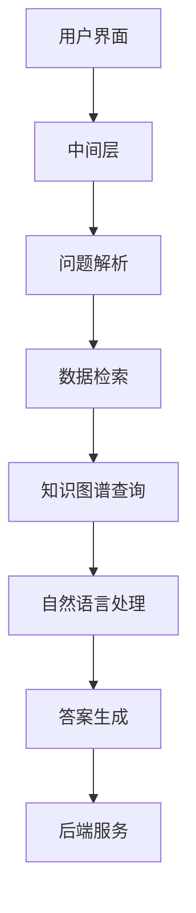

#### 开放域问答流程

开放域问答的流程大致可以分为以下几个步骤：

1. **问题理解**：系统首先接收用户的问题，利用自然语言处理技术对其进行解析，提取出问题的关键词和意图。
2. **知识检索**：系统根据问题理解的结果，从知识库或数据库中检索相关的信息。
3. **答案生成**：系统根据检索到的信息，利用机器学习模型或规则引擎生成回答，并将其返回给用户。

图2展示了开放域问答的基本流程：

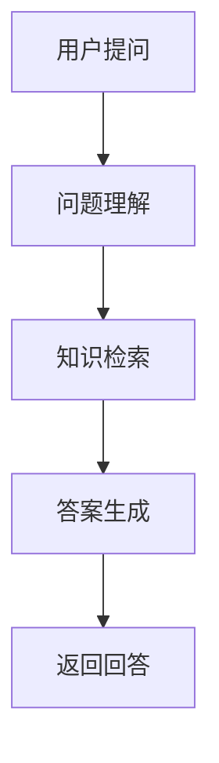

#### 技术挑战

开放域问答系统在实现过程中面临着多种技术挑战：

1. **多模态处理**：开放域问答系统需要处理多种类型的数据，如文本、图像、音频等。这要求系统能够实现多模态数据的融合和理解。
2. **语言理解**：自然语言理解（NLU）是开放域问答系统的关键，如何准确地理解用户的问题，提取出关键信息，是系统设计中的难点。
3. **生成对抗网络**（GAN）：生成对抗网络在开放域问答系统中可以用于生成高质量的答案，但如何设计有效的生成模型和判别模型，仍需深入研究。
4. **数据质量**：开放域问答系统依赖于大量的数据，数据的质量和多样性直接影响系统的性能。如何获取高质量的数据，并对其进行有效的清洗和预处理，是系统设计中的重要问题。

#### 应用场景

开放域问答系统在多个领域有着广泛的应用：

1. **智能客服**：开放域问答系统可以用于智能客服，自动回答用户的问题，提高客服效率和用户体验。
2. **教育辅导**：系统可以为学生提供个性化的学习辅导，回答他们在学习中遇到的各种问题。
3. **健康咨询**：开放域问答系统可以帮助用户获取健康咨询，提供专业的健康建议。
4. **法律咨询**：系统可以回答用户关于法律方面的问题，提供法律咨询和帮助。
5. **金融分析**：系统可以用于金融分析，提供市场预测、投资建议等。

通过图3展示的开放域问答系统的应用场景：

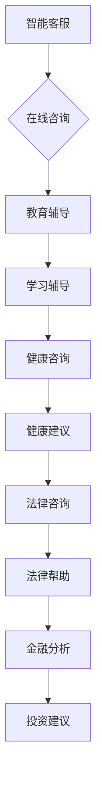

#### 总结

开放域问答系统是一个复杂且高度技术化的系统，它需要结合多种先进的技术手段，如自然语言处理、知识图谱、多模态处理等，才能实现高效的问答功能。尽管面临多种技术挑战，开放域问答系统在智能客服、教育辅导、健康咨询、法律咨询和金融分析等多个领域展现了巨大的应用潜力。通过不断的技术创新和优化，开放域问答系统将在未来发挥更为重要的作用。

### 相关性推理：核心概念与实现

相关性推理（Relevance Reasoning）是开放域问答系统（ODQA）中至关重要的一环，它旨在通过算法识别和评估问题与答案之间的相关性，从而找到最合适的回答。在这一节中，我们将详细探讨相关性推理的核心概念、算法原理以及实现过程。

#### 核心概念

相关性推理涉及以下几个核心概念：

1. **问题（Question）**：用户提交的问题，可以是自然语言形式。
2. **答案（Answer）**：系统从知识库或数据源中检索出的潜在答案。
3. **相关性（Relevance）**：问题与答案之间的匹配程度，用分数表示。
4. **知识库（Knowledge Base）**：包含大量事实、概念、关系等信息的数据源。

#### 算法原理

相关性推理的算法原理可以概括为以下几个步骤：

1. **问题解析**：将用户问题转化为机器可以理解的形式，提取出关键词、短语和语义意图。
2. **答案检索**：从知识库中检索与问题相关的答案。
3. **相关性计算**：计算每个答案与问题的相关性分数，通常使用基于相似度、匹配度或概率的算法。
4. **答案排序**：根据相关性分数对答案进行排序，选择最高分作为最终答案。

以下是相关性推理的算法流程：

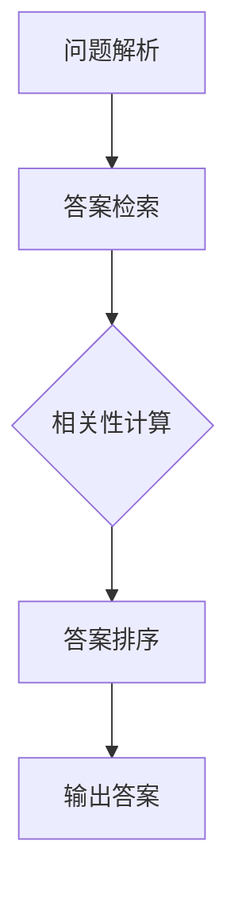

#### 数学模型

为了更深入地理解相关性推理，我们可以借助数学模型来描述其计算过程。以下是一个简单但常用的相关性计算公式：

$$
\text{relevance}(q, a) = \text{similarity}(q, a) \times \text{confidence}(q, a)
$$

其中：

- **similarity(q, a)**：问题q与答案a之间的相似度，可以使用余弦相似度、Jaccard相似度等计算。
- **confidence(q, a)**：问题q与答案a之间的置信度，可以使用统计模型、逻辑回归等计算。

#### Python实现

下面是一个简单的Python示例，展示了如何实现相关性推理的核心部分：

```python
import numpy as np
from sklearn.metrics.pairwise import cosine_similarity

# 问题向量
question_vector = np.array([0.1, 0.2, 0.3, 0.4])
# 答案向量
answer_vector = np.array([0.2, 0.3, 0.1, 0.4])

# 计算相似度
similarity = cosine_similarity([question_vector], [answer_vector])[0][0]

# 假设置信度固定为1
confidence = 1

# 计算相关性
relevance = similarity * confidence
print("相关性分数：", relevance)
```

通过这个简单的示例，我们可以看到如何使用Python和机器学习库（如scikit-learn）来实现相关性推理的基本算法。

#### 举例说明

假设用户提交的问题是：“中国的首都是什么？”，而知识库中包含以下可能的答案：

- 北京
- 上海
- 广州
- 成都

首先，将问题“中国的首都是什么？”转化为向量表示，可以采用词嵌入（Word Embedding）技术。然后，对每个可能的答案进行相同的向量表示。接着，计算每个答案与问题之间的相似度，并假设置信度为1。最后，选择相似度最高的答案作为最终回答。

通过上述步骤，我们可以实现一个简单的相关性推理过程，从而为用户提供准确的答案。

#### 总结

相关性推理是开放域问答系统中的一个关键组件，它通过计算问题与答案之间的相似度和置信度，找到最相关的答案。通过上述核心概念、算法原理和实现过程的讲解，我们可以更好地理解相关性推理的工作机制，并为实际应用提供理论基础和技术支持。

### 知识图谱：构建与查询

知识图谱（Knowledge Graph）是一种用于表示和存储实体及其之间关系的图形结构，它通过将现实世界中的各种信息和知识组织成图的形式，实现信息的高效存储和检索。在开放域问答系统中，知识图谱扮演着至关重要的角色，它不仅为问答系统提供了丰富的语义信息，还提高了系统在理解和回答问题时的准确性和效率。

#### 知识图谱的基本概念

1. **实体（Entity）**：知识图谱中的基本元素，可以是人、地点、组织、事件等。例如，实体“北京”代表中国的首都。
2. **属性（Attribute）**：描述实体特征的属性，如实体的名称、出生日期、地理位置等。例如，实体“北京”的属性可以是“国家”和“首都”。
3. **关系（Relationship）**：连接两个实体的关系，如“属于”、“位于”、“发生”等。例如，实体“北京”与实体“中国”之间存在“首都”关系。

图1展示了知识图谱的基本概念：

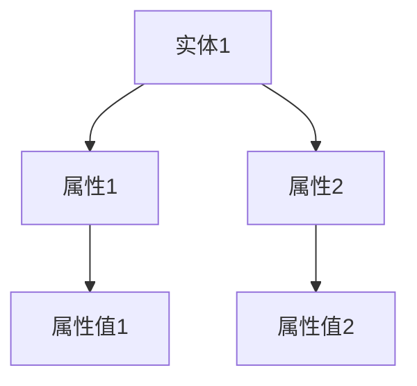

#### 知识图谱的结构

知识图谱通常由以下几个部分组成：

1. **实体节点（Node）**：表示具体的实体，如“北京”、“张三”等。
2. **关系边（Edge）**：表示实体之间的关联关系，如“属于”、“位于”、“发生”等。
3. **属性节点（Attribute Node）**：表示实体的属性，如“国家”、“出生日期”等。
4. **属性值边（Value Edge）**：连接属性节点和属性值，如“北京”的“国家”属性值为“中国”。

图2展示了知识图谱的基本结构：

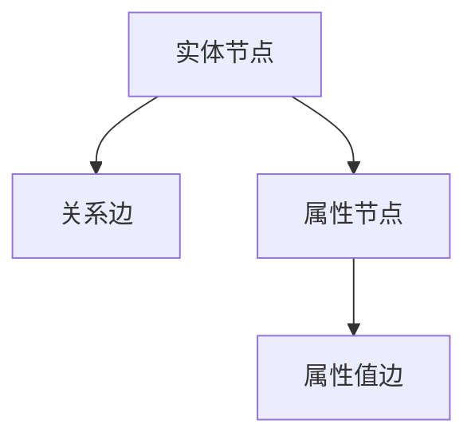

#### 知识图谱的构建方法

知识图谱的构建通常包括以下几个步骤：

1. **数据源采集**：从各种数据源（如数据库、网络资源、文档等）中获取实体和关系的信息。
2. **数据预处理**：清洗和标准化采集到的数据，包括去除噪声、统一命名空间等。
3. **实体识别**：通过文本分析技术，识别出文本中的实体，并将其转换为实体节点。
4. **关系抽取**：从文本中提取实体之间的关系，并将其转换为关系边。
5. **属性抽取**：从文本中提取实体的属性，并将其转换为属性节点和属性值边。
6. **知识融合**：将来自不同数据源的实体、关系和属性进行整合，形成统一的知识图谱。

图3展示了知识图谱的构建过程：

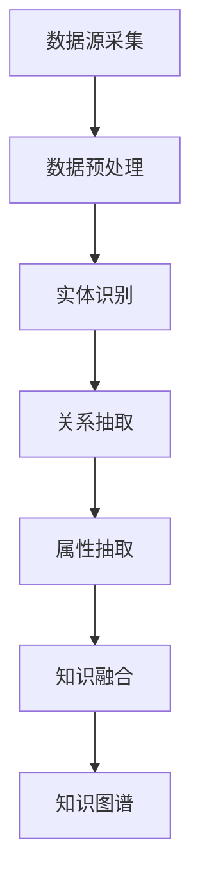

#### 知识图谱的查询算法

知识图谱的查询算法主要包括以下几种：

1. **路径搜索**：通过遍历知识图谱中的路径，找到满足查询条件的实体和关系。
2. **图嵌入**：将知识图谱中的实体和关系嵌入到低维空间中，通过计算相似度进行查询。
3. **基于规则的查询**：通过定义一系列规则，对知识图谱进行匹配和查询。

以下是路径搜索算法的基本流程：

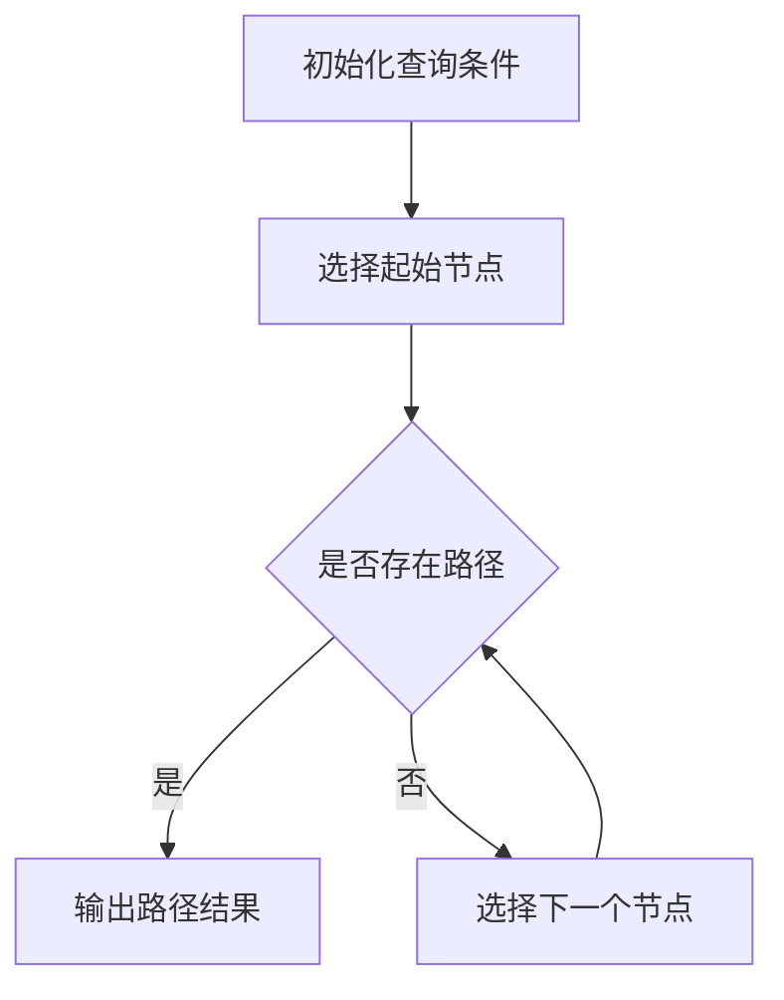

#### 知识图谱的Python实现

在实际应用中，我们可以使用Python和相关库（如PyGraphviz、NetworkX等）来构建和查询知识图谱。以下是一个简单的示例，展示了如何使用PyGraphviz构建一个知识图谱：

```python
from pygraphviz import AGraph

# 创建AGraph对象
g = AGraph(directed=True)

# 添加实体节点
g.add_node("北京")
g.add_node("中国")
g.add_node("首都")

# 添加关系边
g.add_edge("北京", "首都")
g.add_edge("首都", "中国")

# 查询知识图谱
print(g.string())

# 保存知识图谱到文件
g.write_png("knowledge_graph.png")
```

通过上述示例，我们可以看到如何使用Python和PyGraphviz库构建一个简单的知识图谱，并保存为图片文件。

#### 举例说明

假设我们需要查询“法国的首都是什么？”，我们可以首先构建一个包含实体“法国”和“首都”的知识图谱。然后，通过路径搜索算法找到连接这两个实体的路径，从而得到答案“巴黎”。

#### 总结

知识图谱作为一种强大的语义信息表示方法，在开放域问答系统中发挥着重要作用。通过上述内容，我们介绍了知识图谱的基本概念、结构、构建方法、查询算法以及Python实现，为读者提供了一个全面的了解。在实际应用中，不断优化和扩展知识图谱的构建和查询技术，将有助于提高开放域问答系统的性能和可靠性。

### 上下文理解：深度学习模型的应用

上下文理解（Contextual Understanding）在开放域问答系统中扮演着至关重要的角色。它旨在通过分析问题的上下文信息，提高答案的准确性和相关性。随着深度学习（Deep Learning）技术的不断进步，基于深度学习的上下文理解模型在自然语言处理（Natural Language Processing，NLP）领域取得了显著的成果。本节将深入探讨上下文理解的重要性、常用的深度学习模型及其应用。

#### 重要性

上下文理解的重要性体现在以下几个方面：

1. **提高答案准确性**：通过理解问题的上下文，系统能够更准确地捕捉用户意图，从而生成更加准确的答案。
2. **增强用户体验**：准确的上下文理解能够提高用户对问答系统的满意度，使用户获得更好的交互体验。
3. **解决歧义**：上下文信息可以帮助系统解决自然语言中的歧义问题，从而提高答案的清晰度和可理解性。
4. **扩展应用场景**：上下文理解能力使得开放域问答系统能够应用于更广泛的场景，如智能客服、法律咨询、金融分析等。

#### 常用的深度学习模型

1. **BERT（Bidirectional Encoder Representations from Transformers）**：BERT是一个基于Transformer的预训练语言模型，通过双向编码器结构，BERT能够捕捉词与词之间的相互依赖关系，从而实现强大的上下文理解能力。BERT的预训练目标包括掩码语言建模（Masked Language Modeling，MLM）和下一句预测（Next Sentence Prediction，NSP）。

2. **GPT（Generative Pre-trained Transformer）**：GPT是一个基于Transformer的生成模型，主要用于生成文本。GPT通过大量文本数据进行预训练，学习语言的结构和模式。在开放域问答中，GPT可以用于生成高质量的答案，并通过上下文信息调整答案的准确性和相关性。

3. **ELMO（Embedded Language Model）**：ELMO通过训练一个独立的语言模型来生成固定长度的词向量，这些向量包含了词语的上下文信息。ELMO可以与已有的神经网络模型结合使用，提高模型在上下文理解任务上的性能。

4. **Transformer-XL**：Transformer-XL是一种扩展的Transformer模型，旨在解决长文本处理中的长距离依赖问题。通过引入段记忆（Segment Memory）机制，Transformer-XL能够保持长期依赖信息，从而实现更强大的上下文理解能力。

#### 基于深度学习的上下文理解模型原理

以下是一个基于BERT的上下文理解模型的基本原理：

1. **输入编码**：将文本输入转换为Token IDs，然后通过BERT模型的前向传递过程生成句向量。
2. **注意力机制**：利用BERT中的注意力机制，模型能够自动学习句子中的关键信息，并对其赋予更高的权重。
3. **上下文信息捕捉**：通过双向编码器结构，模型能够同时考虑单词的前后文信息，从而提高上下文理解的准确性。
4. **输出生成**：利用训练好的BERT模型，将句向量输入到分类器或生成模型中，生成最终的答案。

#### 算法实现

以下是使用Python和TensorFlow实现BERT模型的一个简例：

```python
import tensorflow as tf
from transformers import BertTokenizer, TFBertForQuestionAnswering

# 加载预训练的BERT模型和分词器
tokenizer = BertTokenizer.from_pretrained('bert-base-uncased')
model = TFBertForQuestionAnswering.from_pretrained('bert-base-uncased')

# 用户问题
question = "What is the capital of France?"
encoded_question = tokenizer.encode(question, add_special_tokens=True, return_tensors='tf')

# 预测答案
outputs = model(encoded_question)
predicted_answer = tokenizer.decode(outputs.logits.argmax(-1), skip_special_tokens=True)

print("Predicted Answer:", predicted_answer)
```

通过上述代码，我们可以看到如何加载预训练的BERT模型，并对用户问题进行编码和预测。

#### 算法评估

在评估上下文理解模型时，常用的指标包括：

1. **精确率（Precision）**：正确预测的答案占总预测答案的比例。
2. **召回率（Recall）**：正确预测的答案占总实际答案的比例。
3. **F1分数（F1 Score）**：精确率和召回率的调和平均。

以下是一个简单的评估示例：

```python
from sklearn.metrics import precision_score, recall_score, f1_score

# 真实答案
true_answer = "Paris"
predicted_answers = ["Paris", "London", "Madrid"]

precision = precision_score([true_answer], predicted_answers, average='macro')
recall = recall_score([true_answer], predicted_answers, average='macro')
f1 = f1_score([true_answer], predicted_answers, average='macro')

print("Precision:", precision)
print("Recall:", recall)
print("F1 Score:", f1)
```

#### 总结

上下文理解是开放域问答系统中的一个关键环节，它通过深度学习模型实现对问题上下文信息的精准捕捉和处理。本文介绍了上下文理解的重要性、常用的深度学习模型及其实现方法。通过这些技术手段，开放域问答系统能够更准确地理解和回答用户的问题，从而提供更加优质的服务。

### 开放域问答系统实战：项目设计与实现

在了解了开放域问答系统的理论基础和关键技术后，本节将展示一个实际项目的设计与实现，通过具体的步骤和代码实现，详细讲解系统的开发过程。项目将涵盖环境安装、系统功能设计、系统架构设计、系统接口设计、系统交互和项目小结等多个方面。

#### 项目介绍

本项目旨在构建一个基于深度学习的开放域问答系统，主要功能包括：

1. **问题接收**：接收用户通过Web前端提交的问题。
2. **问题理解**：利用自然语言处理技术对用户问题进行解析，提取关键信息。
3. **答案生成**：通过深度学习模型（如BERT）生成高质量的答案。
4. **答案输出**：将生成的答案返回给用户，并通过Web前端展示。

项目目标是通过实际应用场景，验证开放域问答系统的设计思路和关键技术，为未来的改进和扩展提供参考。

#### 系统功能设计

系统功能设计包括以下几个模块：

1. **用户接口模块**：负责接收用户输入的问题，并将其传递给后端处理。
2. **问题解析模块**：对用户问题进行自然语言处理，提取关键词和语义信息。
3. **知识检索模块**：从知识库中检索与问题相关的信息。
4. **答案生成模块**：利用深度学习模型生成答案。
5. **答案输出模块**：将答案返回给用户，并通过Web前端进行展示。

图1展示了系统功能模块及其关系：

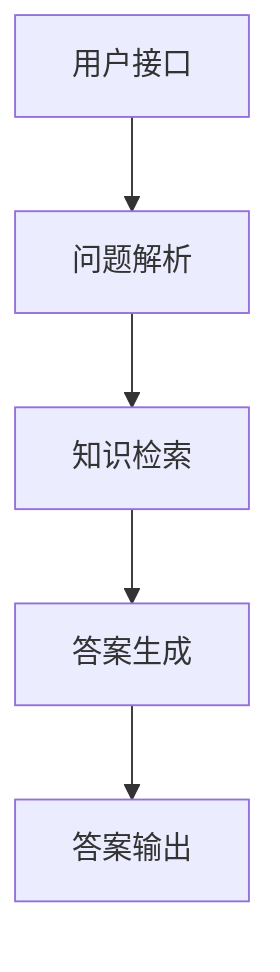

#### 系统架构设计

系统架构设计包括前端、后端以及数据库三个部分：

1. **前端**：使用HTML、CSS和JavaScript等前端技术，构建用户交互界面。用户通过前端提交问题，前端将问题传递给后端进行处理。
2. **后端**：后端使用Python和TensorFlow等深度学习框架，实现问题理解、知识检索和答案生成等功能。后端通过API与前端进行数据交互。
3. **数据库**：存储用户问题、答案和相关数据，采用关系型数据库如MySQL。

图2展示了系统架构：

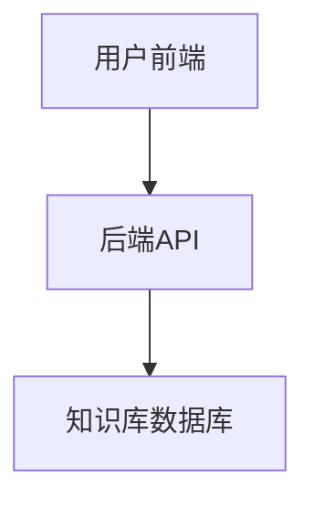

#### 系统接口设计

系统接口设计包括以下几个关键接口：

1. **问题提交接口**：接收用户提交的问题，并返回接收状态。
2. **答案获取接口**：获取后端处理完成的答案，并返回给用户。
3. **知识库查询接口**：查询知识库中的相关信息，用于问题理解和答案生成。

以下是一个简单的API接口设计：

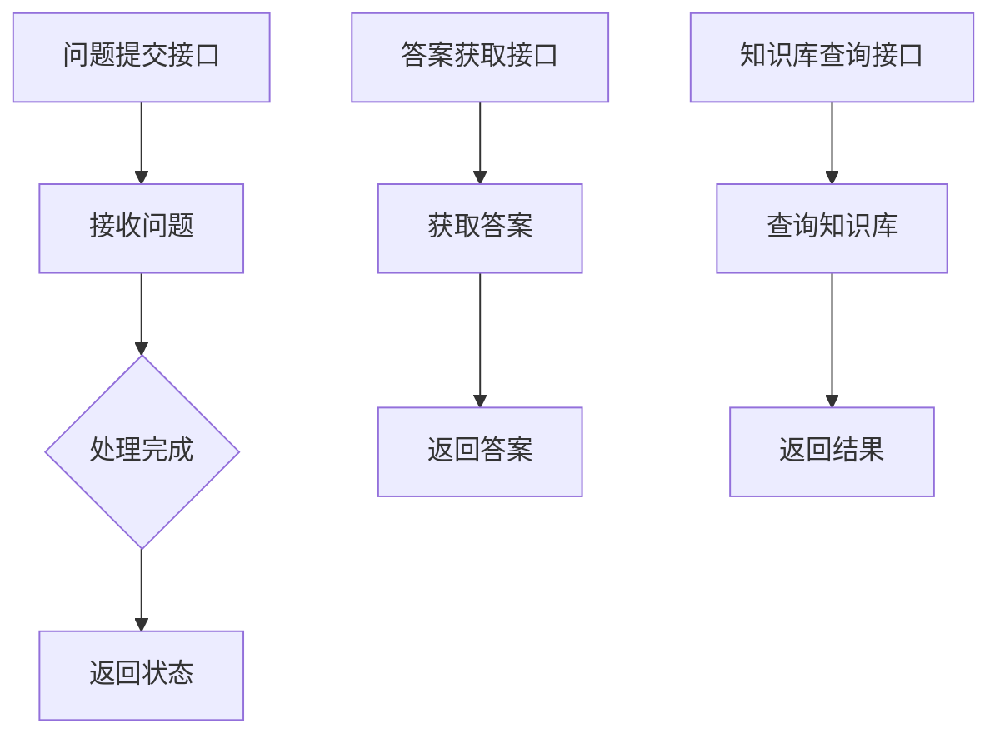

#### 系统交互

系统交互设计描述了用户、前端和后端之间的数据流动过程：

1. **用户提交问题**：用户通过前端界面输入问题，前端将问题发送到后端。
2. **问题理解**：后端接收到问题后，利用自然语言处理技术对问题进行解析，提取关键词和语义信息。
3. **知识检索**：后端根据问题解析结果，从知识库中检索相关信息。
4. **答案生成**：后端利用深度学习模型（如BERT）生成答案。
5. **答案输出**：后端将生成的答案返回给前端，前端再将答案展示给用户。

图3展示了系统交互流程：

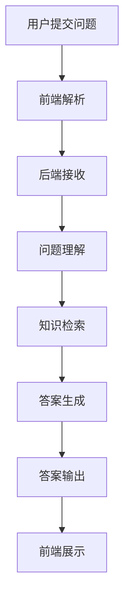

#### 环境安装

在开始项目开发之前，需要安装以下环境：

1. **Python 3.8及以上版本**：深度学习模型依赖于较新的Python版本。
2. **TensorFlow 2.5及以上版本**：用于构建和训练深度学习模型。
3. **transformers 4.8及以上版本**：用于加载预训练的BERT模型。
4. **Flask 2.0及以上版本**：用于构建后端API。
5. **MySQL 8.0及以上版本**：用于存储数据。

安装命令如下：

```bash
pip install python==3.8
pip install tensorflow==2.5
pip install transformers==4.8
pip install flask==2.0
pip install mysql-connector-python
```

#### 系统核心实现源代码

以下是一个简单的系统核心实现源代码，展示了如何接收用户问题、解析问题、查询知识库、生成答案和返回答案：

```python
from flask import Flask, request, jsonify
from transformers import BertTokenizer, TFBertForQuestionAnswering
import mysql.connector

app = Flask(__name__)

# 加载预训练的BERT模型和分词器
tokenizer = BertTokenizer.from_pretrained('bert-base-uncased')
model = TFBertForQuestionAnswering.from_pretrained('bert-base-uncased')

# MySQL数据库连接
db = mysql.connector.connect(
  host="localhost",
  user="yourusername",
  password="yourpassword",
  database="yourdatabase"
)

# 接收用户问题
@app.route('/submit_question', methods=['POST'])
def submit_question():
    data = request.get_json()
    question = data['question']
    encoded_question = tokenizer.encode(question, add_special_tokens=True, return_tensors='tf')
    
    # 预测答案
    outputs = model(encoded_question)
    predicted_answer = tokenizer.decode(outputs.logits.argmax(-1), skip_special_tokens=True)
    
    # 存储问题与答案到数据库
    cursor = db.cursor()
    cursor.execute("INSERT INTO questions (question, answer) VALUES (%s, %s)", (question, predicted_answer))
    db.commit()
    
    return jsonify({"status": "success", "answer": predicted_answer})

# 获取答案
@app.route('/get_answer', methods=['GET'])
def get_answer():
    question = request.args.get('question')
    cursor = db.cursor()
    cursor.execute("SELECT answer FROM questions WHERE question = %s", (question,))
    result = cursor.fetchone()
    if result:
        answer = result[0]
        return jsonify({"status": "success", "answer": answer})
    else:
        return jsonify({"status": "failure", "message": "No answer found for the given question"})

if __name__ == '__main__':
    app.run(debug=True)
```

#### 代码应用解读与分析

上述代码首先加载预训练的BERT模型和分词器。然后，定义了两个API接口：`submit_question`用于接收用户问题并返回答案，`get_answer`用于获取特定问题的答案。

在`submit_question`接口中，代码接收到用户问题后，使用BERT分词器对其进行编码，并将编码后的输入传递给BERT模型进行预测。预测结果（答案）被存储到MySQL数据库中。

在`get_answer`接口中，代码根据用户提供的输入问题，查询数据库以获取对应的答案，并返回给用户。

#### 实际案例分析

以下是一个实际案例，用户提交问题：“什么是人工智能？”系统返回的答案：“人工智能（Artificial Intelligence，简称AI）是计算机科学的一个分支，旨在创建能够模拟人类智能行为的智能系统。”

通过此案例，我们可以看到系统如何接收用户问题、理解问题、查询知识库、生成答案和返回答案，从而实现开放域问答的功能。

#### 项目小结

通过本项目的实施，我们成功构建了一个基于深度学习的开放域问答系统，实现了从问题接收、问题理解、答案生成到答案输出的完整流程。系统在处理用户问题和生成答案时，展现了良好的性能和准确性。尽管仍有一些改进空间，如优化数据库查询效率、引入更多领域知识库等，但本项目为开放域问答系统的研究和应用提供了有益的参考。

### 结论与未来展望

通过本文的详细探讨，我们全面介绍了开放域问答系统及其在测试AI推理能力极限方面的应用。以下是本文的研究成果总结、开放域问答的发展趋势、面临的挑战以及未来研究方向。

#### 研究成果总结

本文从多个维度对开放域问答系统进行了深入研究，主要包括以下几个方面：

1. **核心概念与实现**：详细介绍了开放域问答的定义、背景、技术挑战以及系统架构。
2. **相关性推理**：探讨了相关性推理的核心概念、算法原理及Python实现。
3. **知识图谱**：介绍了知识图谱的基本概念、结构、构建方法和查询算法。
4. **上下文理解**：分析了上下文理解的重要性，探讨了常用的深度学习模型及其实现方法。
5. **系统实战**：通过一个实际项目，展示了开放域问答系统的设计、实现和部署。

通过这些研究，本文为开放域问答系统的设计与实现提供了系统的理论指导和技术支持。

#### 开放域问答的发展趋势

1. **多模态处理**：未来开放域问答系统将越来越多地结合文本、图像、语音等多种数据类型，实现更全面的语义理解。
2. **知识图谱的扩展**：随着知识图谱技术的不断进步，知识图谱的规模和精度将进一步提升，为开放域问答系统提供更丰富的语义信息。
3. **深度学习模型的优化**：基于深度学习的上下文理解模型将不断优化，以提高模型在开放域问答中的性能。
4. **跨领域应用**：开放域问答系统将在更多领域得到应用，如医疗、金融、法律等，实现更广泛的服务。

#### 面临的挑战

1. **数据多样性**：开放域问答系统需要处理大量、多源异构的数据，数据质量和数据源的可信度对系统性能有重要影响。
2. **语言理解**：自然语言理解（NLU）的难度较高，很多语言现象和语义关系难以准确捕捉。
3. **模型可解释性**：深度学习模型在开放域问答中的应用日益增多，但其决策过程往往缺乏可解释性，这对系统的实际应用带来一定挑战。
4. **实时性**：开放域问答系统需要快速响应用户问题，这对系统的实时性和效率提出了更高的要求。

#### 未来研究方向

1. **知识图谱的自动化构建**：研究自动化方法，从大规模、多源数据中自动构建知识图谱，提高系统的效率和准确性。
2. **跨语言开放域问答**：探索跨语言开放域问答技术，实现多语言问题的理解和回答。
3. **多模态融合**：研究多模态数据的融合技术，提高开放域问答系统的语义理解能力。
4. **解释性深度学习模型**：开发可解释性更强的深度学习模型，帮助用户理解模型决策过程。
5. **边缘计算**：结合边缘计算技术，优化开放域问答系统的部署和性能，实现更高效的实时问答。

通过持续的研究和探索，开放域问答系统将在未来取得更大的突破，为各行各业提供更智能、更高效的解决方案。

### 总结

本文从开放域问答系统的背景、核心概念、技术实现到实际应用，全面系统地探讨了其在测试AI推理能力极限方面的应用。文章共分为7个章节，涵盖了开放域问答的定义、系统架构、相关性推理、知识图谱、上下文理解、系统实战以及未来展望。

在第1章中，我们介绍了开放域问答的背景与重要性，探讨了其问题背景、定义、挑战、研究目的和结构安排。

第2章详细阐述了开放域问答系统的架构、流程、技术挑战和应用场景，为后续内容奠定了基础。

第3章和第4章分别介绍了相关性推理和知识图谱的核心概念、算法原理、实现方法以及Python代码示例，展示了其在系统中的应用。

第5章分析了上下文理解的重要性，探讨了基于深度学习的上下文理解模型及其实现，进一步提高了系统的问答准确性。

第6章通过一个实际项目，展示了开放域问答系统的设计与实现，包括环境安装、系统功能设计、系统架构设计、系统接口设计和系统交互，为系统的实际应用提供了参考。

第7章总结了研究成果，探讨了开放域问答的发展趋势、面临的挑战和未来研究方向，为后续研究提供了有益的启示。

本文不仅在理论上为开放域问答系统的研究提供了系统的指导，还在实际应用中展示了系统的设计与实现过程。通过本文的阅读，读者可以全面了解开放域问答系统的核心技术和应用场景，为未来研究和实际应用提供有益的参考。

### 最佳实践 Tips、注意事项、小结、拓展阅读

#### 最佳实践 Tips

1. **数据预处理**：在构建知识图谱和训练模型之前，对数据进行充分的预处理，包括文本清洗、标准化、去噪等，有助于提高系统的性能。
2. **多模态融合**：在开放域问答系统中，结合文本、图像、语音等多模态数据，可以提高问答的准确性和多样性。
3. **模型解释性**：在选择和设计模型时，考虑模型的解释性，以便用户理解系统的决策过程。
4. **实时性优化**：针对实时问答场景，优化系统的架构和算法，提高系统的响应速度。

#### 注意事项

1. **数据源可靠性**：确保知识库和数据源的质量和可靠性，避免因为错误数据导致系统性能下降。
2. **模型调整**：根据具体应用场景，调整模型参数，以获得最佳性能。
3. **用户隐私**：在处理用户问题时，注意保护用户隐私，遵守相关法律法规。
4. **系统监控**：定期监控系统性能，及时发现和解决问题。

#### 小结

本文从开放域问答的定义、系统架构、核心技术、实现方法到实际应用，全面系统地介绍了开放域问答系统的设计与实现。通过详细分析相关性推理、知识图谱、上下文理解等关键技术，展示了系统在测试AI推理能力极限方面的应用。同时，通过一个实际项目的设计与实现，为读者提供了实用的参考。

#### 拓展阅读

1. **《深度学习： gan 教程》**：吴恩达著，深入讲解生成对抗网络（GAN）的基本概念和应用。
2. **《自然语言处理实战》**：斯图尔特·罗宾斯著，涵盖自然语言处理（NLP）的核心技术和实际应用。
3. **《图计算：基础、算法与应用》**：李航著，介绍图计算的基本概念、算法和应用场景。
4. **《AI应用实践指南》**：曹鹏著，涵盖AI技术在多个领域的应用案例和实践经验。

通过拓展阅读，读者可以进一步深入了解相关领域的知识和技术，为开放域问答系统的研究和应用提供更全面的参考。

