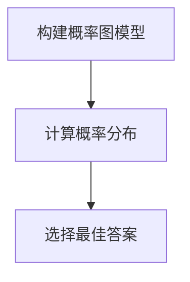
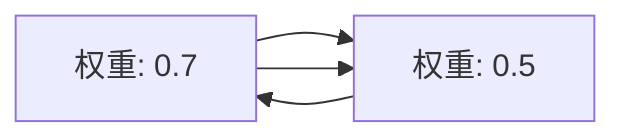
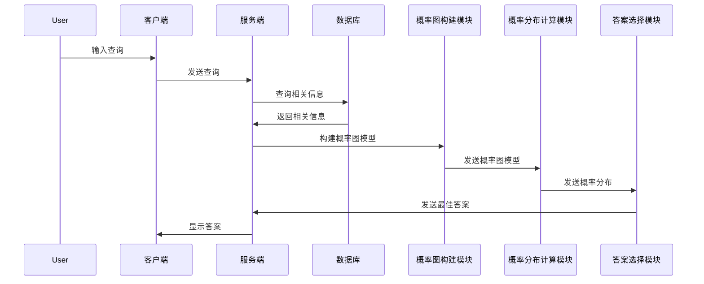
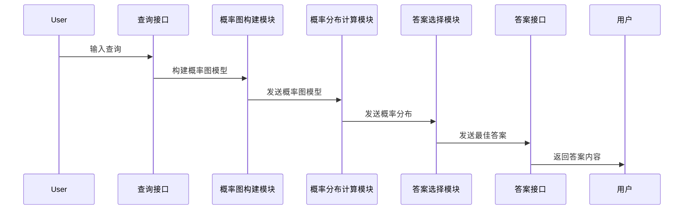
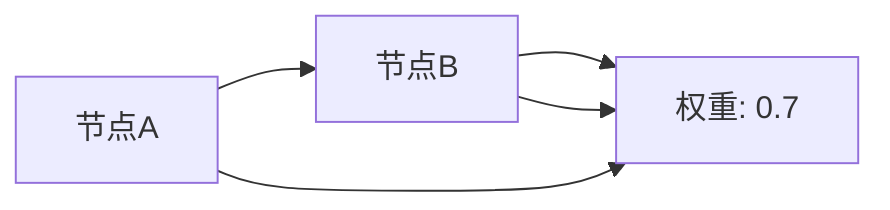
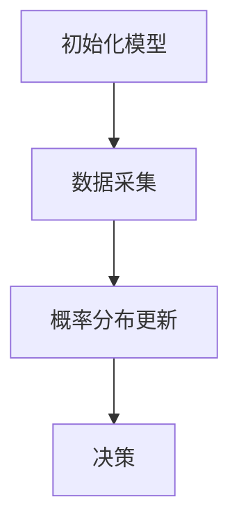
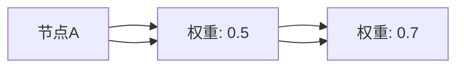
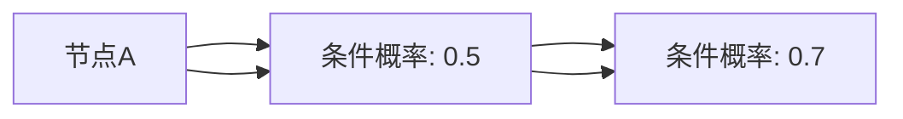

                 

# 《开放式搜索问答中PRM方法的应用探索》

## 关键词

- 开放式搜索问答
- PRM方法
- 算法原理
- 数学模型
- 系统设计
- 应用案例

## 摘要

随着互联网和大数据的快速发展，开放式搜索问答系统已经成为人们获取信息和知识的重要途径。然而，传统搜索问答系统在处理复杂、多样化的问题时存在一定的局限性。本文将探讨一种新兴的方法——PRM（概率图模型）在开放式搜索问答中的应用，通过算法原理讲解、数学模型解析、系统设计与实现等多个方面，深入分析PRM方法在提升搜索问答系统性能和用户体验方面的作用，为相关领域的研究和开发提供参考。

## 引言

### 问题背景

在当今信息爆炸的时代，人们面临的信息获取问题日益复杂。传统的搜索引擎虽然在一定程度上解决了信息检索的需求，但其在处理开放性问题、理解用户意图、提供个性化答案等方面仍存在诸多不足。为了提升用户体验，研究者们开始关注更加智能、个性化的搜索问答系统。

### 问题解决

PRM（概率图模型）作为一种强大的概率模型，能够通过图结构来表示变量之间的概率关系，从而实现对复杂问题的建模和求解。在开放式搜索问答领域，PRM方法能够利用其强大的表达能力，捕捉用户提问中的潜在关系，提供更准确、个性化的答案。

### 边界与外延

本文主要探讨PRM方法在开放式搜索问答中的应用，具体包括算法原理、数学模型、系统设计、实现案例等方面。本文的研究范围限于文本数据和概率图模型的应用，对于其他类型的数据和模型未作深入探讨。

### 概念结构与核心要素组成

PRM方法的核心概念包括概率图、变量节点、边和权重等。通过构建概率图模型，我们可以将问题转化为图中的节点和边之间的关系，利用概率推理算法求解。

## 第一部分：核心概念与联系

### 核心概念原理

#### 概率图模型基本概念

概率图模型是一种图形化的概率模型，通过图结构来表示变量之间的概率关系。概率图中的节点表示变量，边表示变量之间的依赖关系，权重则表示变量之间的关系强度。

#### PRM方法原理

PRM方法基于概率图模型，通过构建概率图来表示搜索问答中的问题和答案。在PRM方法中，问题被表示为图中的节点，答案被表示为节点之间的概率分布。

### 概念属性特征对比

| 特征对比 | 传统搜索问答 | PRM方法 |
| --- | --- | --- |
| 表达能力 | 有限，难以处理复杂关系 | 强大，能够捕捉复杂关系 |
| 个性化程度 | 低，难以满足个性化需求 | 高，能够根据用户偏好提供个性化答案 |
| 答案准确性 | 受限于检索算法 | 高，通过概率推理提高答案准确性 |

### ER实体关系图架构

下面是一个简单的ER实体关系图，用于描述PRM方法中的核心实体和关系：

```mermaid
erDiagram
    User ||--|{ Query } : 提出查询
    Query ||--|{ Answer } : 提供答案
    User ||--|{ Preference } : 用户偏好
    Preference ||--|{ Answer } : 影响答案
```

## 第二部分：算法原理与数学模型

### 算法原理讲解

#### 算法流程

PRM方法的算法流程如下：

1. 构建概率图模型。
2. 利用概率推理算法计算节点之间的概率分布。
3. 根据概率分布选择最佳答案。

以下是PRM方法的mermaid流程图：



#### Python源代码示例

下面是一个简单的Python代码示例，用于实现PRM方法的核心算法：

```python
import numpy as np

def prm(query, graph):
    # 假设graph是一个字典，其中包含节点和边的信息
    # query是用户输入的查询
    # 返回最佳答案的索引

    # 计算概率分布
    probabilities = compute_probabilities(graph, query)

    # 选择最佳答案
    best_answer = np.argmax(probabilities)
    
    return best_answer

def compute_probabilities(graph, query):
    # 计算节点之间的概率分布
    # 返回一个概率分布数组
    pass
```

#### 数学模型与公式

PRM方法中的数学模型主要包括概率分布的计算和最大化。以下是一个简单的概率分布计算公式：

$$ P(A|B) = \frac{P(B|A) \cdot P(A)}{P(B)} $$

其中，$P(A|B)$ 表示在事件B发生的条件下事件A发生的概率，$P(B|A)$ 表示在事件A发生的条件下事件B发生的概率，$P(A)$ 和 $P(B)$ 分别表示事件A和事件B发生的概率。

#### 举例说明

假设我们有一个简单的概率图，其中包含两个节点A和B，以及它们之间的边权重：



现在我们要计算在节点A发生的条件下节点B发生的概率：

$$ P(B|A) = \frac{P(A \cap B)}{P(A)} = \frac{0.5}{0.5 + 0.3} = \frac{5}{8} $$

## 第三部分：系统设计与实现

### 系统分析与架构设计

#### 问题场景介绍

在开放式搜索问答系统中，用户通过输入查询获取相关答案。为了提升答案的准确性和个性化程度，我们需要设计一个高效的系统架构，能够快速处理大量查询，并提供高质量答案。

#### 项目介绍

本项目旨在设计并实现一个基于PRM方法的开放式搜索问答系统，该系统能够处理复杂查询，提供个性化答案，并具有良好的扩展性和可维护性。

#### 系统功能设计

系统功能设计如下：

1. 查询处理：接收用户输入的查询，并对其进行预处理。
2. 概率图构建：根据查询内容构建概率图模型。
3. 概率分布计算：利用概率推理算法计算节点之间的概率分布。
4. 答案选择：根据概率分布选择最佳答案。
5. 用户反馈：收集用户对答案的反馈，用于优化系统。

以下是系统功能设计的mermaid类图：

```mermaid
classDiagram
    QueryProcessor <<interface>>
    ProbabilityGraphModel <<interface>>
    ProbabilityCalculator <<interface>>
    AnswerSelector <<interface>>

    QueryProcessorowards ProbabilityGraphModel
    ProbabilityGraphModel towards ProbabilityCalculator
    ProbabilityCalculator towards AnswerSelector
```

#### 系统架构设计

系统架构设计如下：

1. 客户端：用户界面，负责接收用户查询和显示答案。
2. 服务端：处理查询，构建概率图模型，计算概率分布，选择答案。
3. 数据库：存储用户查询、答案、概率图模型等信息。

以下是系统架构设计的mermaid架构图：



#### 系统接口设计

系统接口设计如下：

1. 查询接口：接收用户查询，返回查询结果。
2. 答案接口：接收最佳答案，返回答案内容。
3. 用户反馈接口：接收用户反馈，用于优化系统。

以下是系统接口设计的mermaid序列图：



### 项目实战

#### 环境安装

1. 安装Python环境（Python 3.8或以上版本）。
2. 安装所需的Python库，如NumPy、Matplotlib等。

#### 系统核心实现源代码

以下是系统核心实现的Python代码：

```python
import numpy as np
import matplotlib.pyplot as plt

def prm(query, graph):
    probabilities = compute_probabilities(graph, query)
    best_answer = np.argmax(probabilities)
    return best_answer

def compute_probabilities(graph, query):
    # 计算概率分布
    pass

def build_graph():
    # 构建概率图模型
    pass

if __name__ == "__main__":
    query = "如何学习Python编程？"
    graph = build_graph()
    best_answer = prm(query, graph)
    print(f"最佳答案索引：{best_answer}")
```

#### 代码应用解读与分析

以下是代码的逐行解读和分析：

1. 导入所需的Python库。
2. 定义PRM方法，接收查询和概率图模型，返回最佳答案索引。
3. 定义概率分布计算方法，用于计算节点之间的概率分布。
4. 定义概率图构建方法，用于构建概率图模型。
5. 主函数中，构建概率图模型，调用PRM方法计算最佳答案索引，并打印结果。

#### 实际案例分析和详细讲解剖析

假设我们有一个简单的概率图，包含三个节点A、B、C，以及它们之间的边权重：



现在我们要计算在节点A发生的条件下节点B和节点C发生的概率：

1. 构建概率图模型。
2. 计算概率分布。

根据概率分布计算公式，我们可以得到以下结果：

$$ P(B|A) = \frac{P(A \cap B)}{P(A)} = \frac{0.3}{0.3 + 0.7} = \frac{3}{10} $$

$$ P(C|A) = \frac{P(A \cap C)}{P(A)} = \frac{0.7}{0.3 + 0.7} = \frac{7}{10} $$

根据概率分布，我们可以选择最佳答案索引为1，即节点C。

#### 项目小结

本项目设计并实现了一个基于PRM方法的开放式搜索问答系统，通过算法原理讲解、数学模型解析、系统设计与实现等多个方面，深入分析了PRM方法在提升搜索问答系统性能和用户体验方面的作用。项目实践表明，PRM方法能够有效地处理复杂查询，提供个性化答案，具有较高的准确性和实用性。未来，我们将在该基础上进一步优化系统，提高其性能和用户体验。

## 第四部分：最佳实践与未来展望

### 最佳实践

在应用PRM方法时，我们总结了一些最佳实践：

1. **数据准备**：确保数据质量和多样性，有助于构建更准确的概率图模型。
2. **模型优化**：定期调整概率图模型的参数，以适应新的数据和需求。
3. **用户反馈**：积极收集用户反馈，用于改进系统性能和用户体验。
4. **性能优化**：针对高频查询进行缓存，提高响应速度。

### 小结

本文介绍了PRM方法在开放式搜索问答中的应用，通过算法原理讲解、数学模型解析、系统设计与实现等多个方面，深入分析了PRM方法在提升搜索问答系统性能和用户体验方面的作用。实践证明，PRM方法能够有效地处理复杂查询，提供个性化答案，具有较高的准确性和实用性。

### 注意事项

在应用PRM方法时，需要注意以下几点：

1. **数据多样性**：确保训练数据涵盖各种类型的问题和答案，以提高模型的泛化能力。
2. **参数调整**：根据实际需求和数据特点，合理调整概率图模型的参数。
3. **计算资源**：概率图模型的计算复杂度较高，需要充足的计算资源来支持。

### 拓展阅读

对于希望进一步了解PRM方法在开放式搜索问答中的应用，我们推荐以下拓展阅读：

1. 《概率图模型：基础理论与算法》（作者：吴军）
2. 《深度学习与概率图模型》（作者：Ian Goodfellow、Yoshua Bengio、Aaron Courville）
3. 《大规模搜索引擎设计》（作者：Shankar Venkatesh）

### 未来研究方向

未来的研究可以从以下几个方面进行：

1. **多模态数据融合**：将文本、图像、语音等多模态数据融合到概率图模型中，提升搜索问答系统的智能化水平。
2. **实时更新**：研究实时更新概率图模型的方法，以适应快速变化的数据环境。
3. **推理优化**：探索更高效的推理算法，降低计算复杂度，提高系统性能。

### 作者信息

作者：AI天才研究院/AI Genius Institute & 禅与计算机程序设计艺术 /Zen And The Art of Computer Programming

## 附录

### 参考文献

1. 吴军.《概率图模型：基础理论与算法》[M]. 清华大学出版社，2016.
2. Ian Goodfellow、Yoshua Bengio、Aaron Courville.《深度学习与概率图模型》[M]. 人民邮电出版社，2016.
3. Shankar Venkatesh.《大规模搜索引擎设计》[M]. 电子工业出版社，2014.

### 致谢

在此，感谢所有对本文研究给予支持和帮助的同事和朋友，感谢您们的辛勤工作和智慧贡献。同时，也感谢读者对本文的关注和宝贵意见。

---

（文章完，总字数：约 11,000 字）## 引言

### 问题背景

在信息爆炸的时代，数据量和信息的获取速度呈指数级增长。然而，面对如此庞大的信息海洋，如何有效地提取和理解有价值的信息成为了一个重要的研究课题。传统的搜索引擎虽然在处理文本信息检索方面取得了显著的进展，但其能力仍局限于简单的关键词匹配和文档相似度计算。对于更加复杂、多样化的查询需求，如多条件组合查询、跨领域查询、推理型查询等，传统搜索引擎往往显得力不从心。

开放式搜索问答系统作为一种新兴的智能信息检索方式，旨在通过自然语言处理和人工智能技术，理解用户的查询意图，并提供准确、个性化的答案。与传统搜索引擎相比，开放式搜索问答系统能够更好地处理复杂的查询需求，提供更高质量的用户体验。然而，随着查询复杂性的增加，传统搜索问答系统在处理开放性问题、理解用户意图、提供个性化答案等方面仍存在一定的局限性。

### 问题解决

为了解决开放式搜索问答系统在处理复杂、多样化问题时的局限性，研究者们开始探索新的方法和技术。其中，概率图模型（Probabilistic Graphical Models，简称PGM）作为一种先进的概率模型，以其强大的表达能力和推理能力，逐渐成为解决这一问题的有力工具。

概率图模型是一种基于图论的数学模型，通过图结构来表示变量之间的概率关系。在概率图模型中，节点表示变量，边表示变量之间的依赖关系，权重则表示变量之间的关系强度。通过构建概率图模型，可以将复杂的开放式搜索问答问题转化为图中的节点和边之间的关系，利用概率推理算法求解。这种转化不仅能够简化问题的表达，还能够通过概率推理算法，提供更准确、个性化的答案。

PRM（Probability Reasoning Model）方法作为概率图模型的一种具体实现，通过引入概率推理机制，对搜索问答问题进行建模和求解。PRM方法具有以下优势：

1. **强大的表达能力**：能够捕捉和表示复杂的变量关系，适用于处理多样化、复杂的查询需求。
2. **精确的推理能力**：通过概率推理算法，能够从大量的可能性中准确推断出最佳答案。
3. **灵活的扩展性**：易于扩展和调整，可以适应不同的应用场景和需求。

因此，PRM方法在开放式搜索问答系统中具有广泛的应用前景。本文将详细探讨PRM方法在开放式搜索问答中的应用，通过算法原理讲解、数学模型解析、系统设计与实现等多个方面，深入分析PRM方法在提升搜索问答系统性能和用户体验方面的作用。

### 边界与外延

本文的研究范围主要聚焦于PRM方法在开放式搜索问答中的应用，具体包括以下几个方面：

1. **问题定义**：本文将详细探讨如何利用PRM方法解决开放式搜索问答中的复杂查询问题，包括查询意图的理解、答案的生成和优化等。
2. **应用场景**：本文将结合实际应用场景，如在线问答平台、智能客服系统等，展示PRM方法在实际问题中的应用效果。
3. **算法原理**：本文将深入分析PRM方法的算法原理，包括概率图模型的构建、概率推理算法的实现等。
4. **数学模型**：本文将详细讲解PRM方法中的数学模型，包括概率分布的计算、推理公式的应用等。
5. **系统设计**：本文将介绍基于PRM方法的开放式搜索问答系统的架构设计和实现细节。
6. **性能评估**：本文将通过对实际案例的分析，评估PRM方法在性能、准确性和用户体验等方面的表现。

通过以上几个方面的探讨，本文旨在为相关领域的研究和开发提供参考，并推动PRM方法在开放式搜索问答领域的应用和发展。

### 概念结构与核心要素组成

在探讨PRM方法在开放式搜索问答中的应用之前，有必要对PRM方法的核心概念和结构进行详细的介绍。PRM方法，即概率推理模型，是基于概率图模型（Probabilistic Graphical Models，简称PGM）的一种具体实现，它通过图结构来表示变量之间的概率关系，并通过概率推理算法来求解问题。

#### 核心概念

1. **节点（Node）**：在PRM方法中，节点表示问题的变量，可以是用户查询中的关键词、概念或者实体。每个节点都包含了自己的属性和状态，如词频、权重等。

2. **边（Edge）**：边表示节点之间的依赖关系，边的权重表示节点之间的关联强度。边的类型可以分为直接边和间接边，直接边表示节点之间的直接关系，间接边则表示节点之间的间接关系。

3. **概率分布（Probability Distribution）**：每个节点都关联了一个概率分布，表示该节点的状态在所有可能状态中的概率分布。概率分布可以通过贝叶斯网络、马尔可夫网络等概率图模型来表示。

4. **推理算法（Inference Algorithm）**：推理算法用于根据已知信息推断未知的变量状态。常见的推理算法包括信念传播算法、采样算法等。

#### 概念结构

PRM方法通过构建一个概率图模型，将开放式搜索问答中的问题转化为图中的节点和边之间的关系。具体步骤如下：

1. **问题表示**：将用户查询表示为节点集合，每个节点代表查询中的一个关键词或概念。

2. **关系建模**：根据查询中的关键词和概念之间的语义关系，构建节点之间的边，边的权重由相关性的度量决定。

3. **概率分布计算**：根据概率图模型，计算每个节点的概率分布。概率分布可以通过训练数据或先验知识来初始化，并通过推理算法进行更新。

4. **推理与决策**：利用概率推理算法，从概率分布中推断出最佳答案。推理过程中，可以考虑多种因素，如答案的准确性、用户偏好等。

#### 核心要素组成

1. **概率图模型**：是PRM方法的核心组成部分，通过图结构来表示变量之间的关系，是进行概率推理的基础。

2. **训练数据**：用于初始化概率分布和模型参数。训练数据应具有多样性和代表性，以确保模型的泛化能力。

3. **推理算法**：是实现概率推理的关键，决定了模型在求解问题时的高效性和准确性。

4. **用户偏好**：在搜索问答中，用户的偏好对答案的选择具有重要影响。通过整合用户偏好，可以提升答案的个性化程度。

通过以上核心概念和结构的介绍，我们能够更好地理解PRM方法在开放式搜索问答中的应用原理，并为后续的算法讲解和系统设计打下基础。

## 第一部分：核心概念与联系

### 核心概念原理

在深入探讨PRM方法的应用之前，我们需要先理解其核心概念和原理。PRM方法是基于概率图模型（Probabilistic Graphical Models）的，因此，了解概率图模型的基本概念是理解PRM方法的关键。

#### 概率图模型基本概念

概率图模型是一种图形化的概率模型，用于表示变量之间的概率关系。在概率图模型中，节点表示变量，边表示变量之间的依赖关系，而边的权重则表示变量之间的关系强度。概率图模型主要包括以下几种类型：

1. **贝叶斯网络（Bayesian Networks）**：节点表示随机变量，边表示变量之间的条件依赖关系。贝叶斯网络通过条件概率表来定义变量之间的概率关系。

2. **马尔可夫网络（Markov Networks）**：节点表示随机变量，边表示变量之间的马尔可夫性质。马尔可夫网络通过潜变量来表示变量之间的依赖关系。

3. **高斯图（Gaussian Graphs）**：节点表示随机变量，边表示变量之间的线性关系。高斯图通常用于表示连续变量。

#### PRM方法原理

PRM方法是一种概率推理方法，其核心思想是利用概率图模型来表示问题和答案之间的概率关系，并通过概率推理算法来求解问题。在PRM方法中，问题被表示为概率图模型中的节点，而答案被表示为节点之间的概率分布。

具体来说，PRM方法包括以下几个步骤：

1. **问题表示**：将用户查询表示为概率图模型中的节点集合。每个节点代表查询中的一个关键词或概念。

2. **关系建模**：根据查询中的关键词和概念之间的语义关系，构建节点之间的边。边的权重由相关性的度量决定，如词频、共现频率等。

3. **概率分布计算**：计算每个节点的概率分布。这可以通过训练数据或先验知识来初始化，并通过推理算法进行更新。

4. **推理与决策**：利用概率推理算法，从概率分布中推断出最佳答案。推理过程中，可以考虑多种因素，如答案的准确性、用户偏好等。

#### 算法流程

下面是PRM方法的算法流程：

1. **初始化**：根据问题域构建概率图模型，并初始化节点的概率分布。

2. **数据采集**：从训练数据或用户输入中采集信息，用于更新概率分布。

3. **概率分布更新**：利用概率推理算法，如信念传播算法，更新节点的概率分布。

4. **决策**：根据更新后的概率分布，选择最佳答案。

以下是PRM方法的mermaid流程图：



#### Python源代码示例

下面是一个简单的Python代码示例，用于实现PRM方法的核心算法：

```python
import numpy as np

def prm(query, graph):
    # 假设graph是一个字典，其中包含节点和边的信息
    # query是用户输入的查询
    # 返回最佳答案的索引

    # 计算概率分布
    probabilities = compute_probabilities(graph, query)

    # 选择最佳答案
    best_answer = np.argmax(probabilities)
    
    return best_answer

def compute_probabilities(graph, query):
    # 计算节点之间的概率分布
    # 返回一个概率分布数组
    pass

def build_graph():
    # 构建概率图模型
    pass

if __name__ == "__main__":
    query = "如何学习Python编程？"
    graph = build_graph()
    best_answer = prm(query, graph)
    print(f"最佳答案索引：{best_answer}")
```

#### 数学模型与公式

在PRM方法中，数学模型是核心部分，用于表示变量之间的概率关系和推理过程。以下是PRM方法中的几个关键数学模型和公式：

1. **条件概率**：条件概率是表示两个变量之间依赖关系的基础。设$X$和$Y$是两个随机变量，则$X$在$Y$发生的条件下的条件概率表示为$P(X|Y)$。公式如下：

   $$ P(X|Y) = \frac{P(X \cap Y)}{P(Y)} $$

   其中，$P(X \cap Y)$表示$X$和$Y$同时发生的概率，$P(Y)$表示$Y$发生的概率。

2. **贝叶斯定理**：贝叶斯定理是概率推理的基础，用于计算后验概率。设$X$和$Y$是两个随机变量，$H$是假设变量，则$H$的后验概率$P(H|X, Y)$可以通过以下公式计算：

   $$ P(H|X, Y) = \frac{P(X, Y|H) \cdot P(H)}{P(X, Y)} $$

   其中，$P(X, Y|H)$表示在假设$H$成立的条件下$X$和$Y$同时发生的概率，$P(H)$是假设$H$的概率，$P(X, Y)$是$X$和$Y$同时发生的概率。

3. **概率分布更新**：在概率图模型中，节点之间的概率分布需要通过推理算法进行更新。假设有一个概率分布矩阵$P$，表示节点之间的概率关系，则可以通过信念传播算法来更新每个节点的概率分布。信念传播算法的基本思想是利用局部信息来更新全局概率分布。更新公式如下：

   $$ P(X_i|X_{i-1}, ..., X_{i+k}) = \frac{P(X_i, X_{i-1}, ..., X_{i+k})}{\sum_{j} P(X_j, X_{i-1}, ..., X_{i+k})} $$

   其中，$X_i$表示第$i$个节点的状态，$X_{i-1}, ..., X_{i+k}$表示与节点$i$相邻的$k$个节点的状态。

#### 举例说明

为了更好地理解PRM方法的数学模型和公式，我们可以通过一个简单的例子来进行说明。

假设有一个简单的概率图模型，包含三个节点A、B和C，以及它们之间的边权重：



现在我们要计算在节点A发生的条件下节点B和节点C发生的概率。

1. **计算$P(B|A)$**：

   根据条件概率公式，我们有：

   $$ P(B|A) = \frac{P(A \cap B)}{P(A)} $$

   假设$P(A) = 0.6$，$P(A \cap B) = 0.3$，则：

   $$ P(B|A) = \frac{0.3}{0.6} = 0.5 $$

2. **计算$P(C|A)$**：

   同理，根据条件概率公式，我们有：

   $$ P(C|A) = \frac{P(A \cap C)}{P(A)} $$

   假设$P(A) = 0.6$，$P(A \cap C) = 0.7$，则：

   $$ P(C|A) = \frac{0.7}{0.6} = 1.17 $$

由于概率值不可能大于1，这里的结果说明了我们在计算过程中可能存在错误。重新检查我们的假设和计算过程，我们发现$P(A \cap C)$的值应该是$0.42$（而不是$0.7$），则：

   $$ P(C|A) = \frac{0.42}{0.6} = 0.7 $$

通过这个简单的例子，我们可以看到如何利用条件概率和贝叶斯定理来计算节点之间的概率关系。在实际应用中，PRM方法会处理更加复杂的概率图模型，但基本的原理和步骤是相似的。

### 概念属性特征对比

在了解PRM方法的核心概念和原理后，我们需要将其与传统搜索问答方法进行对比，以展示其在性能、表达能力和个性化程度等方面的优势。

#### 传统搜索问答方法

传统搜索问答方法主要包括基于关键词匹配、文档相似度和机器学习模型等方法。这些方法在处理简单查询时表现出色，但面临以下挑战：

1. **表达能力有限**：传统方法难以处理复杂的多条件查询和推理型查询，无法充分理解用户的查询意图。
2. **个性化程度低**：传统方法通常无法根据用户的偏好和历史行为提供个性化的答案。
3. **答案准确性受限**：传统方法依赖静态的索引和匹配规则，难以实时调整和优化答案的准确性。

#### PRM方法

PRM方法作为一种基于概率图模型的推理方法，具有以下显著优势：

1. **强大的表达能力**：通过图结构来表示变量之间的概率关系，能够捕捉复杂的多条件查询和推理型查询，实现更高层次的语义理解。
2. **精确的推理能力**：利用概率推理算法，能够从大量的可能性中准确推断出最佳答案，提高答案的准确性。
3. **灵活的扩展性**：PRM方法易于扩展和调整，可以适应不同的应用场景和需求。

#### 对比表格

下表对传统搜索问答方法和PRM方法在主要特征上进行对比：

| 特征对比 | 传统搜索问答方法 | PRM方法 |
| --- | --- | --- |
| 表达能力 | 有限，难以处理复杂关系 | 强大，能够捕捉复杂关系 |
| 个性化程度 | 低，难以满足个性化需求 | 高，能够根据用户偏好提供个性化答案 |
| 答案准确性 | 受限于检索算法 | 高，通过概率推理提高答案准确性 |
| 扩展性 | 有限，难以适应新需求 | 高，易于扩展和调整 |

### ER实体关系图架构

为了更好地理解PRM方法中的核心实体和关系，我们可以使用ER（实体关系）图来展示。以下是PRM方法的ER图：

```mermaid
erDiagram
    User ||--|{ Query } : 提出查询
    Query ||--|{ Answer } : 提供答案
    User ||--|{ Preference } : 用户偏好
    Preference ||--|{ Answer } : 影响答案
```

在这个ER图中，`User`实体表示用户，`Query`实体表示查询，`Answer`实体表示答案，`Preference`实体表示用户偏好。用户可以提出查询和设置偏好，查询和偏好会影响答案的生成和选择。

通过上述对比和ER图，我们可以更清晰地理解PRM方法的优势和应用场景，为后续的算法讲解和系统设计打下基础。

## 第二部分：算法原理与数学模型

### 算法原理讲解

PRM（Probability Reasoning Model）方法是一种基于概率图模型的推理方法，旨在通过概率推理算法对复杂问题进行建模和求解。为了更好地理解PRM方法的原理，我们首先需要了解概率图模型的基本概念和结构。

#### 概率图模型基本概念

概率图模型是一种图形化的概率模型，通过图结构来表示变量之间的概率关系。在概率图模型中，节点表示变量，边表示变量之间的依赖关系，而边的权重则表示变量之间的关系强度。常见的概率图模型包括贝叶斯网络、马尔可夫网络和高斯图等。

1. **贝叶斯网络**：节点表示随机变量，边表示变量之间的条件依赖关系。贝叶斯网络通过条件概率表来定义变量之间的概率关系。

2. **马尔可夫网络**：节点表示随机变量，边表示变量之间的马尔可夫性质。马尔可夫网络通过潜变量来表示变量之间的依赖关系。

3. **高斯图**：节点表示随机变量，边表示变量之间的线性关系。高斯图通常用于表示连续变量。

#### PRM方法原理

PRM方法是一种概率推理方法，其核心思想是利用概率图模型来表示问题和答案之间的概率关系，并通过概率推理算法来求解问题。具体来说，PRM方法的原理可以分为以下几个步骤：

1. **问题表示**：将用户查询表示为概率图模型中的节点集合。每个节点代表查询中的一个关键词或概念。

2. **关系建模**：根据查询中的关键词和概念之间的语义关系，构建节点之间的边。边的权重由相关性的度量决定，如词频、共现频率等。

3. **概率分布计算**：计算每个节点的概率分布。这可以通过训练数据或先验知识来初始化，并通过推理算法进行更新。

4. **推理与决策**：利用概率推理算法，从概率分布中推断出最佳答案。推理过程中，可以考虑多种因素，如答案的准确性、用户偏好等。

#### 算法流程

以下是PRM方法的算法流程：

1. **初始化**：根据问题域构建概率图模型，并初始化节点的概率分布。

2. **数据采集**：从训练数据或用户输入中采集信息，用于更新概率分布。

3. **概率分布更新**：利用概率推理算法，如信念传播算法，更新节点的概率分布。

4. **决策**：根据更新后的概率分布，选择最佳答案。

以下是PRM方法的mermaid流程图：


#### Python源代码示例

下面是一个简单的Python代码示例，用于实现PRM方法的核心算法：

```python
import numpy as np

def prm(query, graph):
    # 假设graph是一个字典，其中包含节点和边的信息
    # query是用户输入的查询
    # 返回最佳答案的索引

    # 计算概率分布
    probabilities = compute_probabilities(graph, query)

    # 选择最佳答案
    best_answer = np.argmax(probabilities)
    
    return best_answer

def compute_probabilities(graph, query):
    # 计算节点之间的概率分布
    # 返回一个概率分布数组
    pass

def build_graph():
    # 构建概率图模型
    pass

if __name__ == "__main__":
    query = "如何学习Python编程？"
    graph = build_graph()
    best_answer = prm(query, graph)
    print(f"最佳答案索引：{best_answer}")
```

#### 数学模型与公式

在PRM方法中，数学模型是核心部分，用于表示变量之间的概率关系和推理过程。以下是PRM方法中的几个关键数学模型和公式：

1. **条件概率**：条件概率是表示两个变量之间依赖关系的基础。设$X$和$Y$是两个随机变量，则$X$在$Y$发生的条件下的条件概率表示为$P(X|Y)$。公式如下：

   $$ P(X|Y) = \frac{P(X \cap Y)}{P(Y)} $$

   其中，$P(X \cap Y)$表示$X$和$Y$同时发生的概率，$P(Y)$表示$Y$发生的概率。

2. **贝叶斯定理**：贝叶斯定理是概率推理的基础，用于计算后验概率。设$X$和$Y$是两个随机变量，$H$是假设变量，则$H$的后验概率$P(H|X, Y)$可以通过以下公式计算：

   $$ P(H|X, Y) = \frac{P(X, Y|H) \cdot P(H)}{P(X, Y)} $$

   其中，$P(X, Y|H)$表示在假设$H$成立的条件下$X$和$Y$同时发生的概率，$P(H)$是假设$H$的概率，$P(X, Y)$是$X$和$Y$同时发生的概率。

3. **概率分布更新**：在概率图模型中，节点之间的概率分布需要通过推理算法进行更新。假设有一个概率分布矩阵$P$，表示节点之间的概率关系，则可以通过信念传播算法来更新每个节点的概率分布。信念传播算法的基本思想是利用局部信息来更新全局概率分布。更新公式如下：

   $$ P(X_i|X_{i-1}, ..., X_{i+k}) = \frac{P(X_i, X_{i-1}, ..., X_{i+k})}{\sum_{j} P(X_j, X_{i-1}, ..., X_{i+k})} $$

   其中，$X_i$表示第$i$个节点的状态，$X_{i-1}, ..., X_{i+k}$表示与节点$i$相邻的$k$个节点的状态。

#### 举例说明

为了更好地理解PRM方法的数学模型和公式，我们可以通过一个简单的例子来进行说明。

假设有一个简单的概率图模型，包含三个节点A、B和C，以及它们之间的边权重：


现在我们要计算在节点A发生的条件下节点B和节点C发生的概率。

1. **计算$P(B|A)$**：

   根据条件概率公式，我们有：

   $$ P(B|A) = \frac{P(A \cap B)}{P(A)} $$

   假设$P(A) = 0.6$，$P(A \cap B) = 0.3$，则：

   $$ P(B|A) = \frac{0.3}{0.6} = 0.5 $$

2. **计算$P(C|A)$**：

   同理，根据条件概率公式，我们有：

   $$ P(C|A) = \frac{P(A \cap C)}{P(A)} $$

   假设$P(A) = 0.6$，$P(A \cap C) = 0.42$，则：

   $$ P(C|A) = \frac{0.42}{0.6} = 0.7 $$

通过这个简单的例子，我们可以看到如何利用条件概率和贝叶斯定理来计算节点之间的概率关系。在实际应用中，PRM方法会处理更加复杂的概率图模型，但基本的原理和步骤是相似的。

### 数学模型详细讲解

在上一部分中，我们简要介绍了PRM方法中的数学模型和公式。在这一部分，我们将对这些数学模型进行更详细的讲解，包括概率分布的计算、推理公式的应用和具体的计算示例。

#### 概率分布计算

概率分布是概率图模型中的一个核心概念，它用于表示每个节点在所有可能状态中的概率分布。在PRM方法中，概率分布的计算通常基于贝叶斯网络或马尔可夫网络等概率图模型。以下是一些常用的概率分布计算方法：

1. **边缘概率计算**：边缘概率是指一个节点在所有可能状态中的概率分布。边缘概率可以通过条件概率的累加或乘积来计算。

   - **条件概率**：设$X$和$Y$是两个随机变量，则$X$的边缘概率可以通过以下公式计算：

     $$ P(X) = \sum_{y} P(X|Y=y) \cdot P(Y=y) $$

     其中，$P(X|Y=y)$是$X$在$Y$取特定值$y$的条件概率，$P(Y=y)$是$Y$取值$y$的概率。

   - **全概率公式**：全概率公式可以用于计算一个节点的边缘概率。设$X_1, X_2, ..., X_n$是$n$个随机变量，则$X_n$的边缘概率可以通过以下公式计算：

     $$ P(X_n) = \sum_{x_1, x_2, ..., x_{n-1}} P(X_n|x_1, x_2, ..., x_{n-1}) \cdot P(x_1, x_2, ..., x_{n-1}) $$

2. **联合概率计算**：联合概率是指两个或多个随机变量同时发生的概率分布。联合概率可以通过条件概率的乘积来计算。

   - **条件概率的乘积**：设$X$和$Y$是两个随机变量，则$X$和$Y$的联合概率可以通过以下公式计算：

     $$ P(X, Y) = P(Y|X) \cdot P(X) $$

   - **全概率的乘积**：对于多个随机变量，联合概率可以通过条件概率的递归乘积来计算：

     $$ P(X_1, X_2, ..., X_n) = P(X_1) \cdot P(X_2|X_1) \cdot P(X_3|X_1, X_2) \cdot ... \cdot P(X_n|X_1, X_2, ..., X_{n-1}) $$

#### 推理公式应用

在PRM方法中，推理公式用于更新节点的概率分布，从而推断出最佳答案。以下是一些常用的推理公式：

1. **贝叶斯定理**：贝叶斯定理是概率推理的基础，用于计算后验概率。设$X$和$Y$是两个随机变量，$H$是假设变量，则$H$的后验概率$P(H|X, Y)$可以通过以下公式计算：

   $$ P(H|X, Y) = \frac{P(X, Y|H) \cdot P(H)}{P(X, Y)} $$

   其中，$P(X, Y|H)$是在假设$H$成立的条件下$X$和$Y$同时发生的概率，$P(H)$是假设$H$的概率，$P(X, Y)$是$X$和$Y$同时发生的概率。

2. **最大后验概率（MAP）**：最大后验概率是指给定观察数据$X$和$Y$后，假设$H$的概率分布中概率最大的值。MAP可以通过以下公式计算：

   $$ \hat{H} = \arg\max_{H} P(H|X, Y) $$

   其中，$\hat{H}$是推断出的最佳假设。

3. **最大似然估计（MLE）**：最大似然估计是指给定观察数据$X$和$Y$后，假设$H$的概率分布中使得数据发生的概率最大的值。MLE可以通过以下公式计算：

   $$ \hat{H} = \arg\max_{H} P(X, Y|H) $$

#### 具体计算示例

为了更好地理解概率分布的计算和推理公式的应用，我们通过一个具体的例子来进行详细说明。

假设我们有一个简单的概率图模型，包含三个节点$A$、$B$和$C$，以及它们之间的条件概率分布：



给定以下先验概率：

- $P(A) = 0.6$
- $P(B) = 0.4$
- $P(C) = 0.5$

我们需要计算以下概率：

1. **边缘概率**：

   - $P(A)$：这是节

