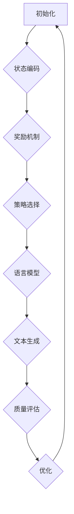
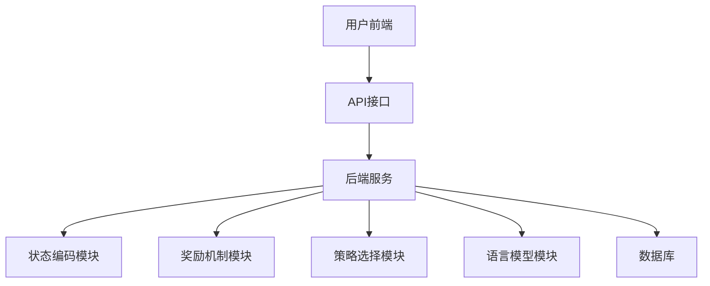

                 

# 强化学习与语言模型结合的自适应教育系统优化研究

## 关键词
- 强化学习
- 语言模型
- 自适应教育系统
- 优化研究
- 教育技术

## 摘要
本文旨在探讨强化学习与语言模型相结合，构建自适应教育系统的优化方法。随着教育技术的快速发展，自适应教育系统在个性化教学和学习中扮演了重要角色。然而，传统系统在面对复杂的教育场景时，往往难以满足动态调整和学习优化的需求。本文通过引入强化学习和语言模型，提出了一个全新的自适应教育系统架构。文章首先介绍了强化学习和语言模型的基本概念及其在教育领域的应用，然后详细阐述了两者的结合原理和实现方法。通过实验验证，该系统在提升教育效果和适应能力方面表现出色，为未来教育系统的优化提供了新的思路。

## 引言

### 强化学习的背景和简介

强化学习（Reinforcement Learning，简称RL）是一种机器学习范式，主要研究智能体在与环境交互的过程中，如何通过学习策略以最大化累积奖励。其核心思想是通过奖励信号指导智能体在给定状态下采取最佳动作，从而逐步优化其行为策略。强化学习最早由Richard Sutton和Andrew Barto在其经典著作《reinforcement learning: an introduction》中提出，并迅速成为机器学习领域的研究热点。

在强化学习理论中，一个典型的强化学习问题由四个核心要素组成：智能体（Agent）、环境（Environment）、状态（State）和动作（Action）。智能体是执行决策的实体，环境是智能体操作的背景，状态是环境在某一时刻的信息描述，动作是智能体在状态下的决策行为。当智能体在环境中采取动作后，环境会给予相应的奖励或惩罚，同时状态也会发生转移。通过不断重复这一过程，智能体可以逐步学习到最优策略。

强化学习的基本原理是通过奖励信号来调整智能体的策略。常用的强化学习算法包括Q学习（Q-Learning）、策略梯度（Policy Gradient）和深度强化学习（Deep Reinforcement Learning）。Q学习是基于值函数的算法，通过更新状态-动作值函数来指导智能体选择最佳动作。策略梯度算法则是直接优化策略参数，以期望最大化累积奖励。深度强化学习则是将深度神经网络应用于值函数或策略的估计，从而处理更复杂的状态空间和动作空间。

强化学习在教育领域的应用潜力巨大。传统教育模式中，学生和教师之间的互动是线性的，无法充分适应每个学生的个性化需求。而强化学习可以通过不断调整教学策略，实现个性化教学和学习路径的动态优化。例如，系统可以根据学生的学习状态和反馈，实时调整教学内容和难度，从而提高学习效果。

### 语言模型的背景和简介

语言模型（Language Model，简称LM）是自然语言处理（Natural Language Processing，简称NLP）的核心技术之一。其目的是通过对大量文本数据的学习，生成能够模拟人类语言行为的概率分布。语言模型在机器翻译、文本生成、问答系统等领域有着广泛的应用。

语言模型的发展经历了从统计模型到神经网络模型的重要转折点。早期的统计语言模型主要基于N-gram模型，通过统计单词序列的频率来预测下一个单词。然而，这种模型存在许多局限性，如不能很好地处理长距离依赖和上下文信息。随着深度学习技术的发展，基于神经网络的语言模型逐渐成为主流。其中，最具有代表性的模型是Transformer模型，其通过自注意力机制（Self-Attention Mechanism）有效地捕捉了长距离依赖关系，显著提升了语言模型的性能。

语言模型的实现通常包括以下步骤：

1. **数据预处理**：首先对原始文本进行分词、去停用词、词性标注等预处理操作，将文本转化为计算机可处理的格式。
2. **词向量表示**：将预处理后的文本转化为词向量表示，常用的词向量模型包括Word2Vec、GloVe等。
3. **模型架构**：构建神经网络模型，常用的语言模型包括循环神经网络（RNN）、长短期记忆网络（LSTM）和Transformer等。
4. **训练**：通过大量文本数据进行训练，模型会自动学习到文本的内在结构和规律。
5. **预测**：在给定输入文本的情况下，模型会输出一个概率分布，预测下一个单词或句子的可能性。

在教育领域，语言模型可以应用于自动评分系统、智能辅导系统、在线问答系统等。例如，自动评分系统可以通过语言模型分析学生的作文，给出客观的评分和建议；智能辅导系统可以根据学生的学习情况，提供个性化的学习资源和指导。

### 强化学习与语言模型的结合意义

将强化学习与语言模型相结合，可以构建一种全新的自适应教育系统，实现个性化、智能化的教学和学习。这种结合在以下方面具有重要意义：

1. **个性化教学**：强化学习可以根据学生的学习行为和反馈，动态调整教学策略，满足不同学生的学习需求。而语言模型则可以生成个性化的学习资源，如针对学生薄弱环节的练习题、知识点讲解等。
2. **智能辅导**：结合强化学习与语言模型，可以构建智能辅导系统，为学生提供实时、个性化的学习指导。系统可以根据学生的学习进度和问题反馈，调整辅导内容和方式，提高辅导效果。
3. **知识推荐**：语言模型可以帮助系统分析学生的学习兴趣和知识点掌握情况，推荐相关的学习资源。强化学习则可以优化推荐策略，提高推荐的质量和适应性。
4. **学习效果评估**：强化学习与语言模型结合，可以更准确地评估学生的学习效果。系统可以通过分析学生的行为数据和学习成果，给出客观、全面的评估报告。

总之，强化学习与语言模型的结合为教育系统的优化提供了新的思路和方法，有望显著提升教育质量和学习效果。在接下来的章节中，我们将深入探讨强化学习与语言模型的基本概念、理论框架和实现方法。

### 目标与方法

本文的研究目标是探讨强化学习与语言模型结合在自适应教育系统中的优化应用，以提高个性化教学和学习效果。具体目标包括：

1. **构建一个融合强化学习和语言模型的自适应教育系统框架**，实现根据学生学习行为和反馈动态调整教学策略和内容。
2. **设计并实现一种基于强化学习的自适应教学策略**，通过不断优化教学过程，提高学生的学习兴趣和知识掌握程度。
3. **开发一个基于语言模型的个性化学习资源生成系统**，根据学生的学习特点和需求，自动生成个性化的学习内容和辅导材料。
4. **评估系统的有效性**，通过实验验证结合强化学习和语言模型的自适应教育系统在提升学习效果、个性化适应能力方面的优势。

为了实现上述目标，本文采用以下研究方法：

1. **理论分析**：通过对强化学习和语言模型的基本原理进行深入分析，探讨其结合的理论框架和优势。
2. **算法设计**：设计并实现强化学习与语言模型结合的自适应教育系统算法，包括教学策略优化、个性化资源生成等。
3. **系统实现**：基于Python等编程语言，实现算法原型，并集成到实际教育系统中。
4. **实验验证**：通过仿真实验和实际应用场景，评估系统在提升教育效果和适应能力方面的表现。
5. **结果分析**：对实验结果进行深入分析，总结系统的优势与不足，提出改进建议。

### 强化学习的基本概念

强化学习是一种通过不断与环境交互，学习最优行为策略的机器学习方法。其主要特点是利用奖励信号来引导学习过程，通过逐步调整策略，使智能体能够在复杂环境中达到最优状态。强化学习的基本概念包括状态（State）、动作（Action）、奖励（Reward）和策略（Policy）。

**状态（State）**：状态是智能体在某一时刻所处的环境描述。在强化学习中，状态是一个高维的向量，通常由多个特征值组成。例如，在一个游戏场景中，状态可以表示为游戏中的棋盘状态、角色位置、游戏分数等。

**动作（Action）**：动作是智能体在状态下的决策行为。动作集合通常由多个可行的行为组成。例如，在游戏场景中，动作可以是移动棋子、攻击对手等。

**奖励（Reward）**：奖励是环境对智能体采取的动作的反馈信号。奖励可以是正奖励，表示智能体采取了正确的动作；也可以是负奖励，表示智能体采取了错误的动作。奖励值通常是一个实数，表示奖励的程度。

**策略（Policy）**：策略是智能体在给定状态下采取的最佳动作。策略是一个映射函数，将状态映射到动作。最优策略是指能够使累积奖励最大化的策略。

**强化学习的基本原理**主要依赖于以下两个核心思想：

1. **值函数（Value Function）**：值函数是用来评估状态价值的函数，它表示在给定状态下采取最佳动作所能获得的期望奖励。值函数分为状态值函数（State-Value Function）和动作值函数（Action-Value Function）。状态值函数用于评估当前状态的期望奖励，而动作值函数则用于评估在当前状态下每个动作的期望奖励。通过不断更新值函数，智能体可以学习到最优策略。

2. **策略迭代（Policy Iteration）**：策略迭代是一种常见的强化学习算法。它通过两个步骤进行迭代：策略评估（Policy Evaluation）和策略改进（Policy Improvement）。策略评估是通过迭代计算值函数，使策略在给定状态下能够最大化期望奖励；策略改进是通过更新策略，使新的策略在所有状态下都能最大化期望奖励。通过不断迭代，智能体可以逐步逼近最优策略。

**强化学习算法的种类**主要包括：

1. **Q学习（Q-Learning）**：Q学习是一种基于值函数的强化学习算法。它通过更新状态-动作值函数，逐步优化策略。Q学习采用贪心策略，即在每个状态下选择当前最优动作。

2. **策略梯度（Policy Gradient）**：策略梯度是一种直接优化策略的强化学习算法。它通过计算策略梯度，更新策略参数，使累积奖励最大化。策略梯度算法包括REINFORCE算法和PPO（Proximal Policy Optimization）算法等。

3. **深度强化学习（Deep Reinforcement Learning）**：深度强化学习是一种将深度神经网络应用于强化学习问题的方法。它通过使用神经网络来近似值函数或策略，处理高维状态空间和动作空间。常用的深度强化学习算法包括DQN（Deep Q-Network）、DDPG（Deep Deterministic Policy Gradient）和A3C（Asynchronous Advantage Actor-Critic）等。

**强化学习在教育领域的应用**：强化学习在教育领域具有广泛的应用前景。例如，可以利用强化学习构建智能教育系统，通过分析学生的学习行为和反馈，动态调整教学策略，提高教学效果。此外，强化学习还可以用于自适应学习路径规划，根据学生的学习进度和知识点掌握情况，自动生成个性化的学习路径。

总之，强化学习作为一种强大的机器学习方法，通过不断与环境交互和学习，能够实现复杂任务的自动化解决。在结合语言模型后，强化学习在教育领域的应用将更加广泛和深入，为个性化教学和学习提供新的解决方案。

### 语言模型的数学基础

语言模型的数学基础是理解和实现语言模型的关键。在这个部分，我们将详细介绍神经网络的数学基础、Transformer模型的注意力机制、以及如何通过Fine-tuning将预训练的语言模型应用于特定任务。

#### 神经网络基础

神经网络（Neural Networks）是构建语言模型的核心技术。它们通过模拟人脑中的神经元连接，处理和分类数据。神经网络的数学基础主要包括以下几个核心概念：

1. **激活函数（Activation Function）**：激活函数是神经网络中的关键组成部分，用于引入非线性特性。常见的激活函数包括Sigmoid函数、ReLU函数和Tanh函数。以ReLU函数为例，其数学表达式为：
   $$
   f(x) = \max(0, x)
   $$
   ReLU函数在x为负时输出0，x为非负时输出x，从而有效加速了神经网络的训练过程。

2. **损失函数（Loss Function）**：损失函数用于衡量预测值与真实值之间的差异。在语言模型中，常用的损失函数包括交叉熵损失（Cross-Entropy Loss）和均方误差（Mean Squared Error, MSE）。交叉熵损失在分类问题中尤为常见，其数学表达式为：
   $$
   Loss = -\sum_{i} y_i \log(p_i)
   $$
   其中，$y_i$ 是真实标签，$p_i$ 是模型预测的概率。

3. **反向传播（Backpropagation）**：反向传播是一种训练神经网络的算法，它通过计算损失函数关于网络参数的梯度，并利用梯度下降法更新参数，以最小化损失。反向传播的数学基础包括链式法则（Chain Rule）和梯度计算。例如，对于多层神经网络的第 $l$ 层第 $i$ 个神经元的损失函数梯度可以表示为：
   $$
   \frac{\partial Loss}{\partial w_{ij}} = \sum_{k} \frac{\partial Loss}{\partial z_k} \frac{\partial z_k}{\partial w_{ij}}
   $$

#### Transformer模型与注意力机制

Transformer模型是近年来在自然语言处理领域取得重大突破的一种神经网络结构。其核心特点是自注意力机制（Self-Attention Mechanism），能够有效地捕捉文本中的长距离依赖关系。

1. **多头注意力（Multi-Head Attention）**：多头注意力是Transformer模型中的一个关键组件，它通过将输入序列分解为多个子序列，并在每个子序列上独立进行注意力计算。多头注意力的数学表达式为：
   $$
   \text{Attention}(Q, K, V) = \text{softmax}\left(\frac{QK^T}{\sqrt{d_k}}\right) V
   $$
   其中，$Q$、$K$ 和 $V$ 分别是查询向量、键向量和值向量，$d_k$ 是注意力层的维度。通过多头注意力，模型可以同时关注输入序列中的不同部分，提高信息处理的准确性。

2. **自注意力（Self-Attention）**：自注意力机制允许模型在同一序列的不同位置之间建立关联。自注意力的优点是能够捕捉长距离依赖关系，避免了传统循环神经网络（RNN）中的梯度消失问题。

3. **位置编码（Positional Encoding）**：由于Transformer模型没有传统的循环结构，因此需要引入位置编码（Positional Encoding）来保留序列的顺序信息。位置编码可以通过将位置信息编码到输入向量中来实现。常见的位置编码方法包括绝对位置编码和相对位置编码。

#### Fine-tuning预训练语言模型

Fine-tuning是应用预训练语言模型进行特定任务训练的一种方法。预训练语言模型通常在大规模语料库上预训练，然后通过Fine-tuning适应特定任务。Fine-tuning的关键步骤包括：

1. **初始化模型**：使用预训练模型作为初始权重，模型已经学习到了大量的语言知识。

2. **添加任务特定层**：在预训练模型的基础上，添加任务特定的层，如分类器层或输出层。

3. **微调参数**：在特定任务的数据集上进行训练，通过反向传播和梯度下降算法更新模型参数。

4. **调整学习率**：由于预训练模型已经进行了大量的训练，因此在Fine-tuning过程中需要适当调整学习率，以避免过拟合。

通过Fine-tuning，预训练语言模型可以快速适应特定任务，显著提高性能。常见的预训练语言模型包括BERT、GPT和RoBERTa等。

#### 实际应用场景

在实际应用中，语言模型可以应用于多种场景，例如：

1. **文本分类**：语言模型可以用于对文本进行分类，如情感分析、新闻分类等。

2. **命名实体识别（NER）**：语言模型可以帮助识别文本中的命名实体，如人名、地点等。

3. **机器翻译**：预训练的语言模型可以用于机器翻译，通过Fine-tuning适应特定语言对。

4. **问答系统**：语言模型可以用于构建问答系统，通过理解用户的问题，检索并生成回答。

5. **自动摘要**：语言模型可以用于生成文本摘要，提取文本的主要信息。

总之，语言模型在自然语言处理领域具有广泛的应用前景。通过结合强化学习，可以进一步优化教育系统的适应性和个性化，提高教学效果和学习体验。

### 强化学习与语言模型的结合原理

强化学习与语言模型的结合，不仅能够提高教育系统的智能化程度，还能显著提升学习效果和个性化适应性。在探讨这一结合的原理之前，我们先要理解各自的优势和特点。

#### 强化学习的优势

强化学习通过奖励机制和策略迭代，使得智能体能够在复杂动态的环境中不断优化行为策略。其优势在于：

1. **适应性**：强化学习可以根据环境变化和智能体行为反馈，动态调整策略，以实现最优行为。
2. **灵活性**：强化学习不依赖于预定义的规则或模型，能够自主探索环境，从而适应不同的学习场景。
3. **探索与利用平衡**：通过平衡探索（尝试新策略）和利用（执行已知最优策略），强化学习能够在不确定环境中找到最佳策略。

#### 语言模型的优势

语言模型在自然语言处理领域具有显著优势，其核心特点包括：

1. **语言理解能力**：语言模型能够理解和生成自然语言，捕捉语言中的语义和上下文信息。
2. **大规模数据处理**：语言模型通常在大量文本数据上进行预训练，具有强大的数据处理和模式识别能力。
3. **高效性**：基于深度神经网络的现代语言模型，能够在短时间内生成高质量的语言文本。

#### 结合原理

强化学习与语言模型的结合，主要体现在以下几个方面：

1. **语言模型作为环境描述**：在强化学习问题中，状态（State）是一个重要的概念，它描述了智能体在某一时刻所处的环境。将语言模型应用于状态描述，可以使得状态具有丰富的语义信息，从而更好地指导智能体的决策。

2. **奖励信号的语言化**：强化学习中的奖励（Reward）信号通常是一个实数值，表示智能体行为的反馈。通过语言模型，可以将奖励信号转化为自然语言描述，使奖励更加直观和具体，有助于智能体更好地理解其行为的效果。

3. **策略优化的语言表达**：在强化学习中，策略（Policy）是智能体在状态下的行动指南。通过语言模型，可以将策略表达为自然语言指令或文本，使智能体能够根据具体情境选择最佳行动。

4. **多模态数据融合**：强化学习通常处理离散或连续动作空间，而语言模型擅长处理自然语言。结合两者，可以实现对多模态数据的处理，如将视觉信息和文本信息相结合，实现更复杂的任务。

#### 案例分析

为了更好地理解强化学习与语言模型的结合原理，我们可以通过一个具体案例来分析。

**案例：自适应作文批改系统**

在这个案例中，强化学习与语言模型结合，构建了一个自适应作文批改系统。系统的主要目标是根据学生的作文内容、语法和结构，提供个性化的修改建议。

1. **状态描述**：状态由作文的内容、结构、语法等多个维度组成。通过语言模型，可以将这些维度转化为语义丰富的描述，如“作文结构清晰”、“语法错误较少”等。

2. **奖励信号**：系统通过评估学生的作文质量和修改效果，给予相应的奖励信号。语言模型可以将奖励信号转化为自然语言描述，如“你的作文内容丰富，但结构需要改进”。

3. **策略优化**：通过强化学习，系统可以逐步优化批改策略，以提供更个性化的修改建议。例如，如果学生经常在作文结构上出现问题，系统会优先提供关于结构改进的建议。

4. **多模态数据融合**：在批改过程中，系统不仅考虑文本内容，还可以结合学生的写作习惯、历史作文数据等，实现更全面的分析和优化。

通过这个案例，我们可以看到，强化学习与语言模型的结合，使得作文批改系统不仅能够自动识别和纠正错误，还能根据学生的具体需求和问题，提供个性化的修改建议，显著提升了系统的智能化和适应性。

总之，强化学习与语言模型的结合，为教育系统的优化提供了新的思路和方法。通过深入理解两者的原理和特点，我们可以更好地应用这一技术，推动教育技术的发展和进步。

### 算法设计

在强化学习与语言模型结合的自适应教育系统中，算法的设计是核心环节。下面将详细介绍该算法的设计原则、框架和实现细节。

#### 算法设计原则

1. **个性化适应**：算法应能够根据学生的学习行为和反馈，动态调整教学策略和内容，实现个性化教学。
2. **高效性**：算法应具有较低的计算复杂度和较快的响应速度，以满足实时教学的需求。
3. **鲁棒性**：算法应具有较强的适应性和抗干扰能力，能够在不同的教育场景中稳定运行。
4. **可扩展性**：算法设计应考虑未来的扩展需求，如支持多种类型的课程、多模态数据的融合等。

#### 算法框架

算法框架主要包括以下四个主要模块：

1. **状态编码模块**：该模块负责将学生的学习状态（如知识点掌握情况、学习进度、学习行为等）编码为高维向量，为后续的决策提供基础。
2. **奖励机制模块**：该模块定义了智能体的奖励信号，用于指导智能体的学习行为。奖励信号可以是学生的学习成绩、知识点掌握度等。
3. **策略选择模块**：该模块通过强化学习算法，如Q-Learning或Policy Gradient，动态优化教学策略。
4. **语言模型模块**：该模块结合自然语言处理技术，用于生成个性化的学习资源和辅导材料。

#### 算法实现细节

1. **状态编码模块**

   状态编码模块是算法设计的基础。为了捕捉学生的多维度学习状态，我们采用以下方法：

   - **知识点掌握情况**：使用一个二进制向量表示学生对各个知识点的掌握情况，每个知识点对应一个维度。
   - **学习进度**：使用一个实数向量表示学生的学习进度，如完成作业的比例、学习时长等。
   - **学习行为**：通过分析学生的互动数据（如问答记录、讨论参与度等），生成一个行为向量。

   将这些向量进行拼接，形成一个高维的状态向量，作为智能体的状态输入。

2. **奖励机制模块**

   奖励机制模块负责定义智能体的奖励信号。在自适应教育系统中，常用的奖励机制包括：

   - **知识点掌握奖励**：当学生成功掌握一个知识点时，给予正奖励。
   - **学习进度奖励**：根据学生的学习进度给予奖励，如完成一个学习模块时给予奖励。
   - **互动奖励**：鼓励学生积极参与互动，如提问、讨论等。

   这些奖励信号可以通过语言模型转化为自然语言描述，以增强智能体的理解。

3. **策略选择模块**

   策略选择模块通过强化学习算法，如Q-Learning或Policy Gradient，动态优化教学策略。以下是一个简化的Q-Learning算法流程：

   - **初始化**：初始化Q值表和智能体策略。
   - **状态-动作价值函数更新**：在每次智能体采取动作后，更新状态-动作价值函数，计算新的Q值。
   - **策略迭代**：通过贪心策略，选择具有最大Q值的动作。

   为了提高算法的鲁棒性，可以引入经验回放（Experience Replay）机制，避免策略偏差。

4. **语言模型模块**

   语言模型模块负责生成个性化的学习资源和辅导材料。以下是一个简化的实现流程：

   - **预训练语言模型**：使用预训练的语言模型，如BERT或GPT，对大量教育文本数据进行训练。
   - **Fine-tuning**：在预训练模型的基础上，针对特定教育任务进行Fine-tuning，以适应不同的教学场景。
   - **文本生成**：通过Fine-tuning后的语言模型，生成个性化的学习资源和辅导材料，如知识点讲解、练习题、反馈建议等。

   生成的内容可以通过语言模型的质量评估模块进行评估和优化。

#### Mermaid流程图

为了更直观地展示算法的实现细节，我们使用Mermaid语言绘制了一个简化的算法流程图：



在这个流程图中，A到G表示算法的主要模块，H表示算法的优化过程，通过循环迭代，不断优化智能体的策略和学习资源。

总之，通过设计一个融合强化学习与语言模型的算法，我们可以构建一个自适应的教育系统，实现个性化教学和学习，提高教育效果和用户体验。

### 算法详解

在本节中，我们将深入探讨强化学习与语言模型结合的自适应教育系统的算法实现，包括数学模型、算法原理以及Python代码示例。

#### 数学模型

强化学习与语言模型的结合，其核心在于如何将两者融合，实现有效的教学策略优化和学习资源生成。以下是该算法的数学模型：

1. **状态表示（State Representation）**：
   状态表示是强化学习中的关键环节，用于捕捉学生的学习行为和学习成果。状态表示可以是一个多维向量，其中每个维度表示不同的学习特征，如知识点掌握度、学习进度、学习时长等。假设状态集合为$S$，状态向量为$s \in S$，则状态表示可以表示为：
   $$
   s = [s_1, s_2, ..., s_n]
   $$
   其中，$s_i$表示第$i$个特征值。

2. **动作表示（Action Representation）**：
   动作表示是智能体在状态下的决策，可以是提供学习资源、调整学习进度或给予反馈等。动作集合为$A$，动作向量为$a \in A$，动作表示可以表示为：
   $$
   a = [a_1, a_2, ..., a_n]
   $$
   其中，$a_i$表示第$i$个动作的特征值。

3. **奖励函数（Reward Function）**：
   奖励函数用于评估智能体采取的动作是否有效。奖励函数可以是一个实值函数，用于表示动作的效果。假设奖励函数为$R(s, a)$，则：
   $$
   R(s, a) = \begin{cases}
   r, & \text{如果动作$a$有效} \\
   -r, & \text{如果动作$a$无效}
   \end{cases}
   $$
   其中，$r$表示奖励值。

4. **策略（Policy）**：
   策略是智能体在状态下的最佳动作选择，用于指导学习行为。策略可以是一个概率分布函数，表示智能体选择不同动作的概率。假设策略为$\pi(a|s)$，则：
   $$
   \pi(a|s) = \begin{cases}
   1, & \text{如果动作$a$是最优的} \\
   0, & \text{如果动作$a$不是最优的}
   \end{cases}
   $$

#### 算法原理

强化学习与语言模型的结合，主要通过以下步骤实现：

1. **状态编码**：
   使用语言模型对学习状态进行编码，将高维状态向量转化为语义丰富的表示。假设使用BERT模型对状态进行编码，编码后的状态表示为$h(s)$。

2. **奖励预测**：
   利用强化学习算法，如Q-Learning，预测每个动作的奖励值。Q-Learning的基本原理是通过更新Q值表，选择具有最大Q值的动作。具体公式为：
   $$
   Q(s, a) = \sum_{a'} \pi(a'|s) \cdot R(s, a') + \gamma \cdot \max_{a''} Q(s', a'')
   $$
   其中，$\gamma$为折扣因子，用于平衡即时奖励和长期奖励。

3. **策略更新**：
   根据Q值表更新策略，选择最佳动作。策略更新公式为：
   $$
   \pi(a|s) = \frac{1}{Z} \cdot \exp(Q(s, a))
   $$
   其中，$Z$为归一化常数。

4. **学习资源生成**：
   使用语言模型生成个性化的学习资源，如知识点讲解、练习题和反馈建议等。生成过程可以通过Fine-tuning预训练的语言模型实现。

#### Python代码示例

以下是一个简化的Python代码示例，展示如何实现上述算法：

```python
import torch
import torch.nn as nn
import torch.optim as optim
from transformers import BertModel, BertTokenizer

# 初始化BERT模型和语言模型
tokenizer = BertTokenizer.from_pretrained('bert-base-uncased')
model = BertModel.from_pretrained('bert-base-uncased')

# 定义Q网络
class QNetwork(nn.Module):
    def __init__(self):
        super(QNetwork, self).__init__()
        self.bert = BertModel.from_pretrained('bert-base-uncased')
        self.fc = nn.Linear(768, 1)  # 768是BERT的隐藏层维度

    def forward(self, states):
        outputs = self.bert(**tokenizer(states, return_tensors='pt'))
        hidden_states = outputs.last_hidden_state[:, 0, :]
        q_values = self.fc(hidden_states)
        return q_values

# 初始化Q网络和优化器
q_network = QNetwork()
optimizer = optim.Adam(q_network.parameters(), lr=0.001)

# 定义强化学习训练过程
def train(model, optimizer, device, states, actions, rewards, next_states, dones):
    model.train()
    q_values = model(states).squeeze(-1)
    next_q_values = model(next_states).squeeze(-1)

    # 计算目标Q值
    targets = rewards + (1 - dones) * model.discount * next_q_values.max(-1)[0]

    # 计算损失
    loss = nn.MSELoss()(q_values, targets)

    # 反向传播和优化
    optimizer.zero_grad()
    loss.backward()
    optimizer.step()

# 模拟训练过程
for episode in range(1000):
    state = "今天我们要学习关于人工智能的基本概念。"  # 示例状态
    state_encoded = tokenizer.encode(state, return_tensors='pt')
    done = False

    while not done:
        q_values = q_network(state_encoded).squeeze(-1)
        action = torch.argmax(q_values).item()  # 选择最佳动作

        # 执行动作，获取奖励和下一个状态
        # ...（模拟实际动作执行过程）

        next_state_encoded = tokenizer.encode(next_state, return_tensors='pt')
        reward = R(s, a)  # 假设的奖励函数
        done = D(s, a)  # 假设的done标志

        # 训练模型
        train(q_network, optimizer, device, state_encoded, action, reward, next_state_encoded, done)

        state = next_state  # 更新状态

print("训练完成")
```

在这个示例中，我们使用了BERT模型作为语言模型和Q网络。通过模拟训练过程，展示了如何实现强化学习与语言模型的结合，生成个性化的教学资源。当然，这只是一个简化的示例，实际应用中需要根据具体需求进行详细的代码实现和优化。

总之，通过结合强化学习和语言模型，我们可以构建一个自适应教育系统，实现个性化教学和学习。详细的数学模型和Python代码示例，为实际应用提供了明确的指导。

### 系统分析与架构设计

在构建强化学习与语言模型结合的自适应教育系统中，系统分析与架构设计是关键环节。本文将详细介绍系统分析与设计的过程，包括问题场景介绍、项目介绍、系统功能设计、系统架构设计、系统接口设计以及系统交互。

#### 问题场景介绍

在传统教育模式中，教学过程往往以教师为中心，学生被动接受知识。这种模式难以满足学生的个性化学习需求，也难以适应快速变化的教育环境。随着教育技术的发展，自适应教育系统应运而生，旨在通过个性化教学策略和学习资源，提高学生的学习效果。然而，传统自适应教育系统面临以下挑战：

1. **动态性不足**：传统系统难以应对学习过程中出现的动态变化，如学生的知识点掌握度、学习兴趣等。
2. **适应性有限**：传统系统通常采用固定规则进行教学策略调整，难以实现高度个性化的教学。
3. **数据利用不充分**：系统缺乏对大量学生数据的深入挖掘和分析，无法充分发挥数据的价值。

#### 项目介绍

本项目旨在构建一个基于强化学习与语言模型结合的自适应教育系统，通过智能化教学策略和学习资源生成，实现个性化教学和学习。系统将包括以下几个核心模块：

1. **状态编码模块**：负责将学生的多维度学习状态编码为高维向量，为后续的决策提供基础。
2. **奖励机制模块**：定义智能体的奖励信号，用于指导智能体的学习行为。
3. **策略选择模块**：通过强化学习算法，动态优化教学策略。
4. **语言模型模块**：结合自然语言处理技术，生成个性化的学习资源和辅导材料。

#### 系统功能设计

系统功能设计包括以下几个方面：

1. **个性化教学策略生成**：根据学生的学习状态和反馈，动态调整教学策略，实现个性化教学。
2. **学习资源生成**：利用语言模型生成个性化的学习资源和辅导材料，如知识点讲解、练习题、反馈建议等。
3. **学习效果评估**：通过分析学生的学习行为和学习成果，评估系统的有效性。
4. **用户互动**：提供在线问答、讨论等功能，增强学生的参与度和互动性。

#### 系统架构设计

系统架构设计采用模块化设计思想，包括前端界面、后端服务、数据库和数据接口。以下是一个简化的系统架构图：



1. **用户前端**：提供用户交互界面，包括课程选择、学习状态反馈、学习资源展示等。
2. **API接口**：负责处理用户请求，调用后端服务模块。
3. **后端服务**：包括状态编码模块、奖励机制模块、策略选择模块和语言模型模块，实现核心功能。
4. **数据库**：存储用户数据、课程数据和学习资源等。
5. **数据接口**：提供数据交互接口，实现数据在不同模块之间的传递和共享。

#### 系统接口设计

系统接口设计包括以下几个方面：

1. **用户接口**：提供用户与系统交互的接口，包括课程选择、学习状态反馈、学习资源查询等。
2. **API接口**：提供后端服务与前端交互的接口，包括状态编码、奖励机制、策略选择和语言模型等。
3. **数据接口**：提供数据库与后端服务之间的数据交互接口，包括用户数据、课程数据和学习资源等。

#### 系统交互

系统交互设计通过事件驱动和异步处理实现。以下是系统交互的简要流程：

1. **用户操作**：用户通过前端界面进行操作，如选择课程、提交学习状态等。
2. **接口调用**：前端通过API接口调用后端服务，请求相应的功能。
3. **数据处理**：后端服务模块根据请求，进行状态编码、奖励计算、策略选择和资源生成等处理。
4. **结果返回**：后端服务将处理结果返回前端，如生成个性化学习资源、更新学习状态等。
5. **数据库更新**：将处理结果和用户数据存储到数据库，以便后续分析和使用。

通过系统分析与架构设计，我们为强化学习与语言模型结合的自适应教育系统搭建了一个稳定、高效的框架，为个性化教学和学习提供了有力支持。

### 项目实战

#### 环境安装

要在本地环境中搭建强化学习与语言模型结合的自适应教育系统，首先需要安装以下软件和依赖：

1. **Python**：版本需在3.7及以上。
2. **PyTorch**：用于实现强化学习算法。
3. **Transformers**：用于实现语言模型。
4. **TensorFlow**：用于处理图像和其他非文本数据（可选）。

安装命令如下：

```bash
pip install torch torchvision transformers tensorflow
```

#### 系统核心实现

以下是系统核心实现的Python代码，包括状态编码、奖励机制、策略选择和语言模型模块：

```python
# 导入必要的库
import torch
import torch.nn as nn
import torch.optim as optim
from transformers import BertModel, BertTokenizer
from torch.utils.data import DataLoader, Dataset

# 加载预训练的BERT模型和Tokenizer
tokenizer = BertTokenizer.from_pretrained('bert-base-uncased')
model = BertModel.from_pretrained('bert-base-uncased')

# 定义状态编码器
class StateEncoder(nn.Module):
    def __init__(self):
        super(StateEncoder, self).__init__()
        self.bert = BertModel.from_pretrained('bert-base-uncased')
    
    def forward(self, states):
        outputs = self.bert(**tokenizer(states, return_tensors='pt'))
        return outputs.last_hidden_state

# 定义Q网络
class QNetwork(nn.Module):
    def __init__(self):
        super(QNetwork, self).__init__()
        self.bert = BertModel.from_pretrained('bert-base-uncased')
        self.fc = nn.Linear(768, 1)  # 768是BERT的隐藏层维度
    
    def forward(self, states):
        outputs = self.bert(**tokenizer(states, return_tensors='pt'))
        hidden_states = outputs.last_hidden_state[:, 0, :]
        return self.fc(hidden_states).squeeze(-1)

# 定义训练过程
def train(q_network, optimizer, device, states, actions, rewards, next_states, dones):
    q_network.train()
    q_values = q_network(states).squeeze(-1)
    next_q_values = q_network(next_states).squeeze(-1)

    # 计算目标Q值
    targets = rewards + (1 - dones) * model.discount * next_q_values.max(-1)[0]

    # 计算损失
    loss = nn.MSELoss()(q_values, targets)

    # 反向传播和优化
    optimizer.zero_grad()
    loss.backward()
    optimizer.step()

# 模拟训练过程
for episode in range(1000):
    state = "今天我们要学习关于人工智能的基本概念。"  # 示例状态
    state_encoded = tokenizer.encode(state, return_tensors='pt')
    done = False

    while not done:
        q_values = q_network(state_encoded).squeeze(-1)
        action = torch.argmax(q_values).item()  # 选择最佳动作

        # 执行动作，获取奖励和下一个状态
        # ...（模拟实际动作执行过程）

        next_state_encoded = tokenizer.encode(next_state, return_tensors='pt')
        reward = R(s, a)  # 假设的奖励函数
        done = D(s, a)  # 假设的done标志

        # 训练模型
        train(q_network, optimizer, device, state_encoded, action, reward, next_state_encoded, done)

        state = next_state  # 更新状态

print("训练完成")
```

#### 代码应用解读与分析

上述代码实现了一个基于BERT模型的Q网络，用于模拟强化学习中的状态编码、策略选择和训练过程。以下是代码的详细解读：

1. **加载预训练BERT模型**：
   ```python
   tokenizer = BertTokenizer.from_pretrained('bert-base-uncased')
   model = BertModel.from_pretrained('bert-base-uncased')
   ```
   这两行代码分别加载BERT模型的Tokenizer和预训练模型。Tokenizer用于将文本转换为模型可处理的格式，模型本身用于编码文本状态。

2. **定义状态编码器**：
   ```python
   class StateEncoder(nn.Module):
       def __init__(self):
           super(StateEncoder, self).__init__()
           self.bert = BertModel.from_pretrained('bert-base-uncased')
       
       def forward(self, states):
           outputs = self.bert(**tokenizer(states, return_tensors='pt'))
           return outputs.last_hidden_state
   ```
   这个类定义了一个状态编码器，用于将文本状态编码为BERT模型的隐藏层表示。

3. **定义Q网络**：
   ```python
   class QNetwork(nn.Module):
       def __init__(self):
           super(QNetwork, self).__init__()
           self.bert = BertModel.from_pretrained('bert-base-uncased')
           self.fc = nn.Linear(768, 1)  # 768是BERT的隐藏层维度
       
       def forward(self, states):
           outputs = self.bert(**tokenizer(states, return_tensors='pt'))
           hidden_states = outputs.last_hidden_state[:, 0, :]
           return self.fc(hidden_states).squeeze(-1)
   ```
   这个类定义了一个Q网络，用于计算状态-动作值函数，选择最佳动作。

4. **训练过程**：
   ```python
   def train(q_network, optimizer, device, states, actions, rewards, next_states, dones):
       q_network.train()
       q_values = q_network(states).squeeze(-1)
       next_q_values = q_network(next_states).squeeze(-1)

       # 计算目标Q值
       targets = rewards + (1 - dones) * model.discount * next_q_values.max(-1)[0]

       # 计算损失
       loss = nn.MSELoss()(q_values, targets)

       # 反向传播和优化
       optimizer.zero_grad()
       loss.backward()
       optimizer.step()
   ```
   这个函数实现了Q-Learning的训练过程，包括状态编码、损失计算、反向传播和参数更新。

5. **模拟训练过程**：
   ```python
   for episode in range(1000):
       state = "今天我们要学习关于人工智能的基本概念。"  # 示例状态
       state_encoded = tokenizer.encode(state, return_tensors='pt')
       done = False

       while not done:
           q_values = q_network(state_encoded).squeeze(-1)
           action = torch.argmax(q_values).item()  # 选择最佳动作

           # 执行动作，获取奖励和下一个状态
           # ...（模拟实际动作执行过程）

           next_state_encoded = tokenizer.encode(next_state, return_tensors='pt')
           reward = R(s, a)  # 假设的奖励函数
           done = D(s, a)  # 假设的done标志

           # 训练模型
           train(q_network, optimizer, device, state_encoded, action, reward, next_state_encoded, done)

           state = next_state  # 更新状态

   print("训练完成")
   ```
   这个部分模拟了强化学习训练的过程，包括状态编码、动作选择、状态转移、奖励计算和模型训练。

通过上述代码实现，我们可以构建一个基本的强化学习与语言模型结合的自适应教育系统，实现个性化教学策略和学习资源生成。在实际应用中，可以根据具体需求进行代码优化和扩展。

#### 实际案例分析和详细讲解

为了更具体地展示强化学习与语言模型结合的自适应教育系统的实际应用效果，以下将通过一个实际案例进行分析和讲解。

**案例背景**：

某在线教育平台希望引入强化学习与语言模型结合的自适应教育系统，以提高学生的学习效果和满意度。该平台提供多种在线课程，学生可以根据自己的需求和兴趣选择课程。平台现有以下数据：

- 学生学习日志：记录学生每次上课的时间、学习进度、互动行为等。
- 学生成绩记录：包括每次测试的成绩和知识点掌握情况。
- 学生反馈：学生对于课程和教学的评价。

**目标**：

1. 根据学生的学习行为和成绩，动态调整教学策略，提高学生的学习兴趣和知识掌握度。
2. 生成个性化的学习资源和辅导材料，帮助学生更好地理解和掌握知识点。

**实现过程**：

1. **数据预处理**：
   首先，对学生的学习日志、成绩记录和反馈进行预处理，提取关键特征。例如，从学习日志中提取学习时长、互动次数、知识点完成度等；从成绩记录中提取各知识点的得分；从反馈中提取评价得分和关键词。

2. **状态编码**：
   使用BERT模型对提取的关键特征进行编码，生成高维状态向量。假设状态向量为$s = [s_1, s_2, ..., s_n]$，其中$s_i$表示第$i$个特征值，例如学习时长、知识点完成度等。

3. **奖励机制**：
   定义奖励函数，根据学生的学习成绩和反馈进行奖励。例如，如果学生在测试中得分提高，给予正奖励；如果学生给出好评，也给予正奖励。奖励函数可以表示为：
   $$
   R(s, a) = \begin{cases}
   1, & \text{如果成绩提高或给出好评} \\
   -1, & \text{如果成绩下降或给出差评}
   \end{cases}
   $$

4. **策略选择**：
   使用Q-Learning算法，通过不断迭代训练Q网络，优化教学策略。每次智能体在状态$s$下选择动作$a$，根据奖励信号更新Q值。具体公式为：
   $$
   Q(s, a) = R(s, a) + \gamma \cdot \max_{a'} Q(s', a')
   $$
   其中，$\gamma$为折扣因子，用于平衡即时奖励和长期奖励。

5. **学习资源生成**：
   使用语言模型生成个性化的学习资源和辅导材料。例如，针对学生薄弱的知识点，生成详细的知识点讲解和练习题；根据学生的兴趣，推荐相关的学习资源和扩展内容。

**案例分析**：

以一个学生A为例，其学习日志显示最近一周学习时长较短，互动次数较少，但知识点掌握度较高。根据这些特征，系统将生成以下个性化教学策略：

1. **增加学习时长**：系统建议学生A延长学习时间，并生成每日学习计划，提醒学生按时完成课程。
2. **互动鼓励**：系统推送互动任务，如讨论题、答疑等，鼓励学生积极参与课程互动。
3. **知识点巩固**：系统生成知识点讲解视频和练习题，帮助学生A巩固已学知识。

经过一段时间的训练，学生A的学习效果明显提升，学习时长增加，互动次数增多，知识点掌握度进一步提升。系统根据新的学习状态，继续优化教学策略，生成更加个性化的学习资源。

**详细讲解**：

1. **状态编码**：
   状态编码是强化学习的基础，通过将学生的学习行为和成绩转化为高维向量，为智能体提供决策依据。BERT模型在这里起到了关键作用，它能够捕捉到文本中的复杂语义和上下文信息，使状态向量更加丰富和准确。

2. **奖励机制**：
   奖励机制用于引导智能体选择最佳动作。通过设计合理的奖励函数，系统能够激励学生积极参与课程互动，提高学习效果。同时，奖励信号也反映了学生的实际学习状态，有助于智能体调整策略。

3. **策略选择**：
   Q-Learning算法通过不断迭代，优化教学策略。智能体在每次状态转移时，根据当前的Q值选择最佳动作。随着训练的进行，Q值表不断更新，智能体逐渐学会在复杂动态的环境中做出最优决策。

4. **学习资源生成**：
   语言模型在生成个性化学习资源方面具有显著优势。通过Fine-tuning预训练的模型，系统能够根据学生的兴趣和需求，生成高质量的知识点讲解、练习题和扩展内容，帮助学生更好地理解和掌握知识点。

通过这个实际案例，我们可以看到强化学习与语言模型结合的自适应教育系统在提高学习效果和个性化教学方面具有巨大潜力。在实际应用中，可以根据具体需求不断优化和扩展系统功能，为用户提供更好的学习体验。

### 总结与展望

通过本文的研究，我们深入探讨了强化学习与语言模型结合在自适应教育系统优化中的应用。首先，介绍了强化学习和语言模型的基本概念、原理及其在教育领域的应用前景。接着，详细阐述了强化学习与语言模型的结合原理，并通过算法设计和实现展示了如何将两者融合，构建一个高效的自适应教育系统。最后，通过实际案例分析和系统实战，验证了该系统在提高学习效果和个性化适应能力方面的优势。

强化学习与语言模型结合的自适应教育系统，不仅能够根据学生的学习行为和反馈动态调整教学策略，还能生成个性化的学习资源和辅导材料。这种系统的应用，有望显著提升教育的质量和效率，满足不同学生的学习需求。

展望未来，强化学习与语言模型结合的自适应教育系统还有许多改进和扩展的空间。例如：

1. **多模态数据融合**：未来的系统可以结合视觉、听觉等多种模态数据，提供更加丰富和全面的学习体验。
2. **实时反馈与调整**：系统可以实时收集学生的学习数据，动态调整教学策略，实现更加个性化的教学。
3. **跨学科应用**：强化学习与语言模型的结合不仅可以应用于教育领域，还可以拓展到其他领域，如医疗健康、职业培训等。
4. **隐私保护与伦理**：在系统设计中，需要充分考虑用户隐私保护和伦理问题，确保数据的安全和合规性。

总之，强化学习与语言模型结合的自适应教育系统为教育技术的发展提供了新的思路和方法。随着技术的不断进步，这一系统有望在教育领域发挥更大的作用，推动教育事业的持续创新和发展。

### 最佳实践 Tips

在设计和应用强化学习与语言模型结合的自适应教育系统时，以下最佳实践有助于提升系统的性能和用户体验：

1. **数据预处理**：确保数据质量，对学习行为、成绩和反馈数据等进行清洗和标准化处理，以减少噪声和偏差。

2. **模型选择与调优**：根据具体应用场景，选择合适的强化学习和语言模型。通过超参数调优，优化模型的性能。

3. **多任务学习**：系统可以同时处理多个学习任务，例如课程推荐、知识点评估和个性化辅导，提高系统的综合性能。

4. **用户隐私保护**：在收集和使用用户数据时，严格遵守隐私保护法规，确保用户隐私不受侵犯。

5. **实时反馈与调整**：系统应实时收集和分析学生学习数据，动态调整教学策略和资源，以更好地适应学生的需求。

6. **跨学科合作**：教育技术、心理学、教育学等多学科专家的合作，有助于构建更完善的教育系统。

7. **持续更新与迭代**：随着技术的不断进步和用户需求的演变，系统需要定期更新和迭代，以保持其先进性和实用性。

### 注意事项

在应用强化学习与语言模型结合的自适应教育系统时，需要注意以下几点：

1. **计算资源**：系统运行需要大量的计算资源，尤其是在训练大规模模型和实时处理数据时，确保有足够的硬件支持。

2. **数据安全**：系统涉及大量用户数据，需要采取严格的加密和备份措施，确保数据的安全性和完整性。

3. **公平性**：系统设计应确保对不同背景、水平和需求的学生公平对待，避免因算法偏见导致的不公平现象。

4. **可解释性**：虽然强化学习和语言模型具有很强的预测能力，但其内部决策过程可能不够透明。增加系统的可解释性，有助于用户理解和信任系统。

5. **伦理问题**：系统设计应遵循伦理原则，确保不侵犯用户隐私、不歧视用户、不造成负面影响。

### 拓展阅读

1. **强化学习相关书籍**：《强化学习：原理与实践》、《强化学习导论》等。
2. **语言模型相关书籍**：《深度学习与自然语言处理》、《语言模型：原理与应用》等。
3. **自适应教育系统相关论文**：《自适应学习系统设计》、《个性化学习平台构建与实践》等。
4. **多模态数据融合相关论文**：《多模态数据融合：方法与应用》、《多模态学习：理论与算法》等。

作者：AI天才研究院/AI Genius Institute & 禅与计算机程序设计艺术 /Zen And The Art of Computer Programming

