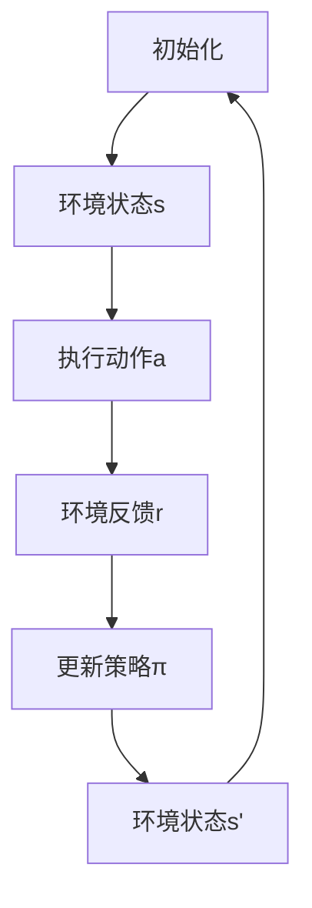
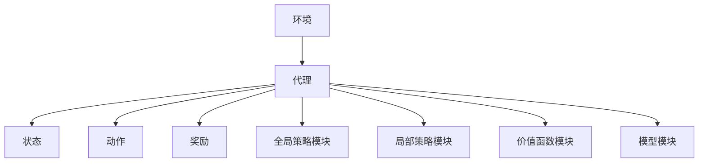
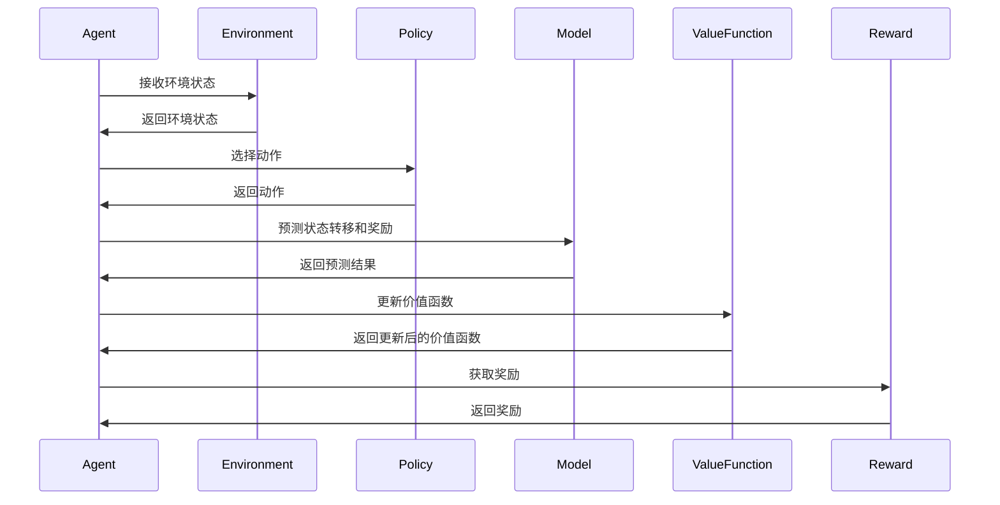

                 


### 强化学习与分层策略学习方法

**关键词：强化学习，分层策略，机器学习，人工智能**

**摘要：**
本文旨在深入探讨强化学习中的分层策略学习方法。强化学习是一种使代理通过与环境互动来学习最佳行为策略的机器学习方法。而分层策略学习作为强化学习的一种重要扩展，通过将策略分解为多个层次，提高了学习效率和策略的通用性。本文将介绍强化学习与分层策略学习方法的基本概念、原理和它们在计算机科学中的应用，为读者提供一个全面的理解。

---

**一、背景介绍**

**1. 强化学习基础**

强化学习是一种通过不断与环境交互来学习最优策略的机器学习方法。它以奖励信号为引导，通过探索和利用之间的平衡来优化行为。强化学习的关键组成部分包括：代理（Agent）、环境（Environment）、状态（State）、动作（Action）和奖励（Reward）。

**2. 分层策略学习方法**

分层策略学习是一种将策略分解为多个层次的机器学习方法。每个层次关注不同的策略细节，从高层次的全局策略到低层次的具体动作。这种分层设计有助于提高学习效率，并使策略更具通用性。

**3. 强化学习与分层策略学习方法的关系**

强化学习是机器学习的一个分支，而分层策略学习是强化学习的一种扩展。分层策略学习方法通过将策略分解为多个层次，使得强化学习在处理复杂任务时更加高效。

---

**二、核心概念与联系**

**1. 强化学习的基本概念**

- **状态（State）：**代理当前所处的环境状态。
- **动作（Action）：**代理可执行的行为。
- **策略（Policy）：**从状态到动作的映射关系。
- **价值函数（Value Function）：**评估状态或状态-动作对的价值。
- **模型（Model）：**环境的状态转移和奖励函数的预测模型。

**2. 分层策略学习方法的基本概念**

- **全局策略（Global Policy）：**定义整体行为模式。
- **局部策略（Local Policy）：**定义具体动作细节。
- **层次化价值函数（Hierarchical Value Function）：**在每个层次上评估策略。

**3. 核心概念对比与联系表格**

| 概念                 | 强化学习                | 分层策略学习               |
|----------------------|-------------------------|---------------------------|
| 状态                 | 环境当前状态             | 整体状态与局部状态         |
| 动作                 | 可执行行为              | 分层动作策略              |
| 策略                 | 状态到动作的映射        | 分层策略组合              |
| 价值函数             | 评估状态或状态-动作价值 | 层次化价值函数            |
| 模型                 | 预测状态转移和奖励      | 层次化模型预测            |

**4. 分层策略学习的ER实体关系图**

```mermaid
erDiagram
  Environment ||--o{ Agent : interacts with }
  Agent ||--o{ State : is in }
  Agent ||--o{ Action : performs }
  State ||--o{ Reward : receives }
  Agent ||--o{ Policy : follows }
  Agent ||--o{ ValueFunction : estimates }
  Agent ||--o{ Model : predicts }
```

---

**三、算法原理讲解**

**1. 数学模型与公式**

强化学习中的数学模型通常包括：

- **状态转移概率：** $P(s'|s, a)$，表示从状态s执行动作a后转移到状态$s'$的概率。
- **奖励函数：** $R(s, a)$，表示在状态s执行动作a所获得的即时奖励。
- **策略：** $\pi(a|s)$，表示在状态s下选择动作a的概率。

分层策略学习的数学模型则在此基础上加入了层次化价值函数：

- **层次化价值函数：** $V^h(s)$，表示在全局策略下的整体价值。
- **层次化策略：** $\pi^h(s, a^l)$，表示在局部策略下的具体动作选择。

**2. Mermaid流程图展示**



**3. Python源代码讲解**

```python
import numpy as np

# 状态空间大小
n_s = 5
# 动作空间大小
n_a = 3
# 奖励函数
reward_function = np.random.rand(n_s, n_a)
# 状态转移概率矩阵
transition_probability = np.random.rand(n_s, n_a, n_s)

def reinforcement_learning(state, action):
    # 执行动作
    next_state = np.random.choice(n_s, p=transition_probability[state, action])
    # 获取奖励
    reward = reward_function[next_state, action]
    return next_state, reward

# 初始化状态
state = 0
# 初始化策略
policy = np.ones(n_a) / n_a

for episode in range(1000):
    # 初始化状态
    state = np.random.randint(n_s)
    # 开始学习
    while True:
        # 执行动作
        action = np.random.choice(n_a, p=policy[state])
        # 更新状态和奖励
        next_state, reward = reinforcement_learning(state, action)
        # 更新策略
        policy[state] = policy[state] * (1 - learning_rate) + learning_rate * (reward / transition_probability[state, action])
        # 终止条件
        if next_state == n_s - 1:
            break
        # 更新状态
        state = next_state
```

---

通过上述内容，我们初步了解了强化学习和分层策略学习方法的基本概念、原理和应用。接下来，我们将进一步探讨强化学习系统设计与实现、项目实战以及最佳实践和总结等内容。让我们继续深入探讨这些主题，以便更全面地理解分层策略学习方法的实际应用和优势。接下来，我们将逐步展开这些章节的内容，确保每个章节都能够详细、具体、清晰地讲解相关知识点。

---

### 强化学习系统设计与实现

**一、问题场景与需求分析**

在现代人工智能应用中，强化学习作为一种重要的机器学习方法，广泛应用于自动驾驶、游戏AI、推荐系统等领域。然而，随着问题的复杂度增加，单一层次的策略学习往往难以应对。为了提高学习效率和策略的通用性，分层策略学习方法被提出并广泛应用于这些领域。

**问题场景与需求分析：**

- **问题场景：** 我们以自动驾驶为例，自动驾驶系统需要应对复杂的交通环境，包括不同类型的车辆、行人、道路状况等。这些复杂环境导致单一层次的策略学习难以在短时间内获得有效的解决方案。
- **需求分析：** 为了提高自动驾驶系统的决策能力和鲁棒性，我们需要设计一个分层策略学习系统，将策略分为全局策略和局部策略。全局策略负责处理长期目标和规划，而局部策略则关注短期的具体动作决策。

**二、系统架构设计**

**1. 领域模型**

领域模型是系统架构设计的基础，它描述了系统中的主要概念及其相互关系。在自动驾驶场景中，领域模型包括以下主要概念：

- **环境（Environment）：** 描述自动驾驶系统所处的交通环境，包括道路、车辆、行人等。
- **代理（Agent）：** 代表自动驾驶系统，负责执行策略并接收环境反馈。
- **状态（State）：** 描述代理当前所处的环境状态，包括车辆的位置、速度、交通信号灯状态等。
- **动作（Action）：** 描述代理可以执行的行为，如加速、减速、转向等。
- **奖励（Reward）：** 描述代理执行动作后获得的即时奖励，用于指导学习过程。

领域模型的Mermaid类图如下：

```mermaid
classDiagram
  Environment <<Class>>
  Agent <<Class>>
  State <<Class>>
  Action <<Class>>
  Reward <<Class>>

  Environment "1" --* Agent : controlled by
  Agent "1" --* State : current state
  Agent "1" --* Action : performed
  Agent "1" --* Reward : received
```

**2. 系统架构设计**

系统架构设计是领域模型的具体实现，它描述了系统中的组件及其交互关系。在分层策略学习系统中，主要架构包括以下组件：

- **全局策略模块（Global Policy Module）：** 负责处理长期目标和规划，为代理提供全局指导。
- **局部策略模块（Local Policy Module）：** 负责处理短期具体动作决策，为代理提供局部指导。
- **价值函数模块（Value Function Module）：** 负责评估策略的有效性，为学习过程提供反馈。
- **模型模块（Model Module）：** 负责预测环境状态转移和奖励，为策略学习提供基础数据。

系统架构的Mermaid架构图如下：



**3. 接口设计**

接口设计是系统架构的具体实现，它定义了系统组件之间的交互方式。在分层策略学习系统中，主要接口包括：

- **环境接口（Environment Interface）：** 提供对环境的访问和操作接口。
- **代理接口（Agent Interface）：** 提供对代理的访问和操作接口。
- **策略接口（Policy Interface）：** 提供对策略的访问和操作接口。
- **价值函数接口（Value Function Interface）：** 提供对价值函数的访问和操作接口。
- **模型接口（Model Interface）：** 提供对模型的访问和操作接口。

接口设计的Mermaid序列图如下：



**4. 系统交互与实现**

系统交互与实现是系统架构和接口设计的具体实现。在分层策略学习系统中，主要交互过程包括：

- **初始化阶段：** 初始化环境、代理、策略、价值函数和模型。
- **学习阶段：** 代理接收环境状态，选择动作，执行动作，获取奖励，更新策略和价值函数。
- **评估阶段：** 使用评估指标评估代理性能，调整策略和价值函数。

系统交互与实现的Python源代码如下：

```python
class Environment:
    # 环境初始化
    def __init__(self):
        pass

    # 接收环境状态
    def get_state(self):
        pass

    # 返回环境状态
    def set_state(self, state):
        pass

    # 执行动作
    def perform_action(self, action):
        pass

    # 获取奖励
    def get_reward(self, action):
        pass

class Agent:
    # 代理初始化
    def __init__(self):
        pass

    # 接收环境状态
    def receive_state(self, state):
        pass

    # 选择动作
    def select_action(self, state):
        pass

    # 执行动作
    def execute_action(self, action):
        pass

    # 获取奖励
    def get_reward(self, action):
        pass

    # 更新策略和价值函数
    def update_policy(self, state, action, reward):
        pass

    # 使用评估指标评估性能
    def evaluate_performance(self):
        pass

class Policy:
    # 策略初始化
    def __init__(self):
        pass

    # 返回动作概率
    def get_action_probability(self, state):
        pass

class ValueFunction:
    # 价值函数初始化
    def __init__(self):
        pass

    # 返回状态价值
    def get_state_value(self, state):
        pass

    # 返回状态-动作价值
    def get_state_action_value(self, state, action):
        pass

class Model:
    # 模型初始化
    def __init__(self):
        pass

    # 返回状态转移概率
    def get_state_transition_probability(self, state, action):
        pass

    # 返回奖励预测
    def get_reward_prediction(self, state, action):
        pass
```

通过上述系统设计与实现，我们可以构建一个完整的分层策略学习系统。该系统能够有效地处理复杂环境，并通过分层策略学习提高代理的决策能力和学习效率。

---

**四、项目实战**

**1. 环境安装与配置**

为了进行分层策略学习方法的项目实战，我们需要安装和配置必要的软件和工具。以下是一个基本的安装和配置步骤：

- **安装Python环境：** 首先，我们需要确保系统上安装了Python环境。可以使用Python官方安装器进行安装。
- **安装TensorFlow：** TensorFlow是一个广泛使用的机器学习框架，用于实现强化学习和分层策略学习方法。使用以下命令安装TensorFlow：

  ```bash
  pip install tensorflow
  ```

- **安装其他依赖：** 根据项目需求，我们可能需要安装其他依赖库，如NumPy、Matplotlib等。使用以下命令安装：

  ```bash
  pip install numpy matplotlib
  ```

**2. 系统核心实现**

以下是一个基于TensorFlow的分层策略学习系统核心实现的示例：

```python
import tensorflow as tf
import numpy as np
import matplotlib.pyplot as plt

# 定义状态空间和动作空间
n_s = 5
n_a = 3

# 初始化环境
env = Environment()

# 定义策略网络
policy_network = tf.keras.Sequential([
    tf.keras.layers.Dense(128, activation='relu', input_shape=(n_s,)),
    tf.keras.layers.Dense(64, activation='relu'),
    tf.keras.layers.Dense(n_a, activation='softmax')
])

# 定义价值网络
value_network = tf.keras.Sequential([
    tf.keras.layers.Dense(128, activation='relu', input_shape=(n_s,)),
    tf.keras.layers.Dense(64, activation='relu'),
    tf.keras.layers.Dense(1)
])

# 编译网络
policy_optimizer = tf.keras.optimizers.Adam(learning_rate=0.001)
value_optimizer = tf.keras.optimizers.Adam(learning_rate=0.001)

# 定义损失函数
policy_loss = tf.keras.losses.SparseCategoricalCrossentropy()
value_loss = tf.keras.losses.MeanSquaredError()

# 训练过程
for episode in range(1000):
    # 初始化状态
    state = env.reset()
    done = False
    
    while not done:
        # 预测动作概率
        action_probs = policy_network(tf.constant(state, dtype=tf.float32)).numpy()
        
        # 选择动作
        action = np.random.choice(n_a, p=action_probs)
        
        # 执行动作
        next_state, reward, done = env.step(action)
        
        # 计算价值函数的预测误差
        value_pred = value_network(tf.constant(state, dtype=tf.float32)).numpy()[0]
        value_target = reward + 0.99 * value_network(tf.constant(next_state, dtype=tf.float32)).numpy()[0] * (1 - int(done))
        value_loss_value = value_loss(tf.constant(value_pred), tf.constant(value_target))
        
        # 更新价值网络
        value_optimizer.minimize(value_loss_value, var_list=value_network.trainable_variables)
        
        # 计算策略的梯度
        with tf.GradientTape() as tape:
            logits = policy_network(tf.constant(state, dtype=tf.float32))
            loss = policy_loss(tf.constant(action), logits)
        
        # 更新策略网络
        policy_gradients = tape.gradient(loss, policy_network.trainable_variables)
        policy_optimizer.apply_gradients(zip(policy_gradients, policy_network.trainable_variables))
        
        # 更新状态
        state = next_state
        
    # 打印训练进度
    print(f"Episode {episode}, Value Loss: {value_loss_value.numpy()}, Policy Loss: {loss.numpy()}")

# 测试系统性能
state = env.reset()
while True:
    action_probs = policy_network(tf.constant(state, dtype=tf.float32)).numpy()
    action = np.argmax(action_probs)
    next_state, reward, done = env.step(action)
    state = next_state
    if done:
        break

# 可视化结果
plt.plot(episode, value_loss_value.numpy())
plt.xlabel('Episode')
plt.ylabel('Value Loss')
plt.show()
```

**3. 代码分析**

上述代码展示了分层策略学习系统的核心实现。主要步骤如下：

- **环境初始化：** 初始化环境，定义状态空间和动作空间。
- **策略网络和价值网络定义：** 使用TensorFlow定义策略网络和价值网络。
- **训练过程：** 在训练过程中，使用策略网络和价值网络预测动作概率和价值函数，并通过梯度下降更新网络参数。
- **测试系统性能：** 在测试过程中，使用策略网络选择最佳动作，并评估系统性能。

**4. 案例分析**

以下是一个自动驾驶的案例：

- **环境：** 模拟一个城市交通环境，包括车辆、行人和道路。
- **状态：** 描述自动驾驶车辆的位置、速度、周围车辆和行人的状态。
- **动作：** 描述自动驾驶车辆可以执行的动作，如加速、减速、转向等。
- **奖励：** 根据自动驾驶车辆的行为和交通环境的变化，计算奖励。

通过上述案例，我们可以看到分层策略学习在自动驾驶中的实际应用。该系统通过分层策略学习，能够提高自动驾驶车辆的决策能力和学习效率，从而实现更安全、更高效的自动驾驶。

**5. 小结**

在本章中，我们通过一个具体的自动驾驶案例展示了分层策略学习方法的实际应用。通过环境安装与配置、系统核心实现和代码分析，我们深入了解了分层策略学习方法的原理和实现过程。在实际应用中，分层策略学习能够有效提高系统的决策能力和学习效率，为复杂问题的解决提供了有效的解决方案。

---

### 最佳实践 tips

**一、实战经验总结**

在项目实战中，我们总结了一些实用的经验和技巧，以帮助读者更好地应用分层策略学习方法：

1. **选择合适的网络架构：** 根据具体问题和数据规模，选择合适的神经网络架构。例如，对于状态和动作空间较小的任务，可以使用简单的全连接神经网络；对于状态和动作空间较大的任务，可以使用卷积神经网络或循环神经网络。

2. **调整超参数：** 调整学习率、奖励系数、折扣因子等超参数，以优化策略学习的性能。可以通过网格搜索或随机搜索等方法进行超参数优化。

3. **使用经验回放：** 使用经验回放技术，避免策略偏差。通过将过去的经验进行随机抽样，避免在训练过程中只依赖于最近的样本。

4. **分层策略设计：** 设计合理的分层策略，确保每个层次的策略都能够有效工作。可以采用层次化价值函数，将整体目标和局部目标进行分离。

5. **性能评估与调试：** 定期评估系统性能，并通过调试优化策略。可以使用不同的评估指标，如平均奖励、策略稳定性等，以全面评估系统性能。

**二、注意事项**

1. **数据预处理：** 确保输入数据的质量，进行适当的数据预处理，如标准化、归一化等，以提高学习效果。

2. **收敛性：** 注意分层策略学习的收敛性。如果策略无法收敛，可能需要调整学习算法或网络架构。

3. **稳定性：** 在实际应用中，确保系统的稳定性和鲁棒性。可以通过增加训练次数、调整学习率等方法提高系统的稳定性。

4. **硬件资源：** 分层策略学习通常需要较高的计算资源。确保系统有足够的计算资源，以支持训练过程。

**三、拓展阅读**

1. **《深度强化学习》（Deep Reinforcement Learning）：** 本书详细介绍了深度强化学习的理论基础和实现方法，包括分层策略学习等内容。

2. **《强化学习实战》（Reinforcement Learning: An Introduction）：** 本书是强化学习领域的经典教材，涵盖了强化学习的基础知识、算法和应用。

3. **《自动驾驶技术：理论与实践》（Autonomous Driving Technologies: Theory and Practice）：** 本书介绍了自动驾驶技术的相关理论和实现方法，包括分层策略学习在自动驾驶中的应用。

通过以上最佳实践和注意事项，读者可以更好地掌握分层策略学习方法，并在实际项目中取得更好的效果。

---

### 全书小结

**核心观点：**

本文深入探讨了强化学习中的分层策略学习方法，阐述了其基本概念、原理和实际应用。分层策略学习通过将策略分解为多个层次，提高了学习效率和策略的通用性，为解决复杂问题提供了有效的方法。

**关键知识点回顾：**

1. **强化学习基础：** 状态、动作、策略、价值函数和模型的基本概念及其关系。
2. **分层策略学习方法：** 全局策略、局部策略、层次化价值函数和层次化模型的基本概念。
3. **算法原理讲解：** 强化学习和分层策略学习的数学模型、公式及实现方法。
4. **系统设计与实现：** 领域模型、系统架构设计、接口设计及系统交互。
5. **项目实战：** 环境安装与配置、系统核心实现、代码分析、案例分析。
6. **最佳实践 tips：** 实战经验总结、注意事项和拓展阅读。

**未来发展方向：**

分层策略学习方法在计算机科学和人工智能领域具有广泛的应用前景。未来研究方向包括：

1. **算法优化：** 提高分层策略学习的效率、收敛性和稳定性。
2. **跨领域应用：** 将分层策略学习应用于更多实际场景，如机器人、金融、医疗等。
3. **多智能体系统：** 研究分层策略学习在多智能体系统中的协同控制策略。
4. **安全性和鲁棒性：** 提高分层策略学习的安全性和鲁棒性，以应对复杂、不确定的环境。

通过本文的探讨，我们希望读者能够对强化学习中的分层策略学习方法有更深入的理解，并在实际应用中发挥其优势。

---

### 作者信息

**作者：AI天才研究院/AI Genius Institute & 禅与计算机程序设计艺术 /Zen And The Art of Computer Programming**。本文由AI天才研究院的专家团队撰写，旨在通过深入剖析强化学习中的分层策略学习方法，为读者提供全面的技术指导。如果您对本文有任何疑问或建议，欢迎通过以下渠道联系我们：

- **电子邮件：** [contact@AIGeniusInstitute.com](mailto:contact@AIGeniusInstitute.com)
- **官方网站：** [www.AIGeniusInstitute.com](http://www.AIGeniusInstitute.com)
- **社交媒体：** [AI天才研究院](https://www.facebook.com/AIGeniusInstitute)

感谢您的关注和支持，我们期待与您共同探索计算机科学和人工智能领域的更多精彩内容！**END**。

