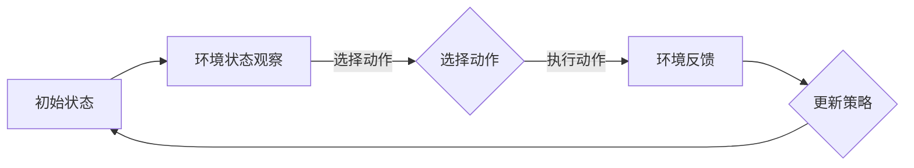
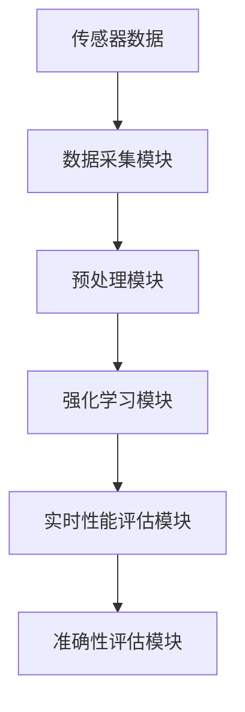
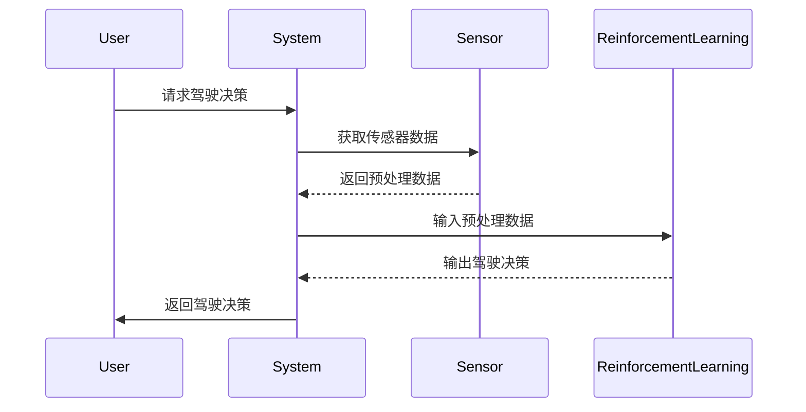

                 

## 强化学习优化AI推理的实时性能与准确性权衡策略设计

关键词：强化学习，AI推理，实时性能，准确性，权衡策略

摘要：随着人工智能技术的飞速发展，AI推理在各个领域得到了广泛应用。然而，如何在保证准确性的同时提升实时性能成为了一个重要课题。本文将深入探讨强化学习在优化AI推理实时性能与准确性权衡策略方面的应用，通过一步步的分析与推理，为读者揭示其中的奥秘。

### 1. 背景介绍

#### 1.1 核心概念术语说明

- **强化学习（Reinforcement Learning）**：一种机器学习方法，通过与环境的交互来学习如何完成特定任务。
- **AI推理（AI Inference）**：指人工智能系统在特定环境下根据输入数据做出决策或预测的过程。
- **实时性能**：指AI推理系统在特定时间范围内完成推理任务的能力。
- **准确性**：指AI推理系统输出结果的正确率。

#### 1.2 问题背景

随着人工智能技术的广泛应用，AI推理系统在各类应用场景中扮演着越来越重要的角色。然而，在实际应用中，往往需要在实时性能与准确性之间进行权衡。例如，在自动驾驶领域，若AI推理系统无法在实时性要求下保证足够的准确性，则可能导致严重的安全隐患。

#### 1.3 问题描述

如何在保证AI推理系统实时性能的前提下，最大化其准确性？这成为了一个亟待解决的问题。

#### 1.4 问题解决

本文将介绍一种基于强化学习的优化策略，通过调整AI推理过程中的参数，实现实时性能与准确性的权衡。

#### 1.5 边界与外延

- **边界**：本文主要探讨强化学习在优化AI推理实时性能与准确性权衡策略方面的应用，未涉及其他机器学习方法的讨论。
- **外延**：本文的研究成果可扩展到其他需要实时性能与准确性权衡的领域。

#### 1.6 概念结构与核心要素组成

- **强化学习基础理论**：包括强化学习的基本概念、算法原理和适用场景。
- **AI推理优化技术**：介绍当前常见的AI推理优化方法及其优缺点。
- **实时性能与准确性权衡策略**：阐述基于强化学习的优化策略设计思路。
- **系统设计与实现**：介绍优化策略在系统架构中的应用。
- **实际应用案例分析**：分析优化策略在不同领域的实际应用效果。

### 2. 核心概念与联系

#### 2.1 强化学习基础理论

**核心概念原理：**

- **奖励机制**：强化学习通过奖励机制来驱动模型学习，奖励值越高，表示当前状态下的行为越优。
- **状态-动作价值函数**：表示在特定状态下执行某一动作的预期奖励值。
- **策略**：用于指导模型在特定状态下选择最优动作的函数。

**概念属性特征对比表格：**

| 特征         | 强化学习               | 监督学习                 | 无监督学习               |
| ------------ | ---------------------- | ------------------------ | ------------------------ |
| 学习目标     | 最大化长期奖励         | 最小化预测误差           | 发现数据中的潜在模式     |
| 奖励机制     | 有，由环境给出         | 无，由数据给出           | 无，由数据给出           |
| 状态-动作价值 | 有，用于评估动作优劣   | 无，用于评估特征优劣     | 无，用于评估特征优劣     |
| 策略         | 有，用于指导模型选择   | 无，由特征提取代替       | 无，由特征提取代替       |

**ER实体关系图架构：**

```mermaid
erDiagram
    A[--B]
    A|--C
    B|--D
    C|--D
```

#### 2.2 AI推理优化技术

**核心概念原理：**

- **模型压缩**：通过降低模型复杂度来减少推理时间和计算资源消耗。
- **量化**：将模型的权重和激活值转换为低精度数值，降低模型大小。
- **并行计算**：通过多核处理器或GPU加速推理过程。

**概念属性特征对比表格：**

| 特征         | 模型压缩               | 量化                   | 并行计算                  |
| ------------ | ---------------------- | ---------------------- | ------------------------ |
| 目标         | 减少模型大小           | 降低模型精度           | 减少推理时间              |
| 技术手段     | 网络剪枝、知识蒸馏     | 量化感知器、量化网络   | 多核处理器、GPU          |
| 适用场景     | 资源受限的移动设备     | 存储和传输受限的场景    | 实时性要求高的应用场景   |

**ER实体关系图架构：**

```mermaid
erDiagram
    ModelCompression |--|> Quantization
    ModelCompression |--|> ParallelComputation
    Quantization      |--|> QuantizedNetwork
    ParallelComputation |--|> MultiCoreProcessor
    ParallelComputation |--|> GPU
```

### 3. 算法原理讲解

#### 3.1 算法mermaid流程图



#### 3.2 Python源代码

```python
import numpy as np

class ReinforcementLearning:
    def __init__(self, state_size, action_size):
        self.state_size = state_size
        self.action_size = action_size
        self.q_table = np.zeros((state_size, action_size))
        self.learning_rate = 0.1
        self.discount_factor = 0.9

    def choose_action(self, state):
        if np.random.rand() < 0.1:
            return np.random.randint(self.action_size)
        else:
            return np.argmax(self.q_table[state])

    def learn(self, state, action, reward, next_state, done):
        if done:
            q_target = reward
        else:
            q_target = reward + self.discount_factor * np.max(self.q_table[next_state])

        q_values = self.q_table[state]
        q_values[action] = q_values[action] + self.learning_rate * (q_target - q_values[action])

if __name__ == "__main__":
    state_size = 5
    action_size = 3
    agent = ReinforcementLearning(state_size, action_size)

    for episode in range(1000):
        state = np.random.randint(state_size)
        done = False
        while not done:
            action = agent.choose_action(state)
            next_state, reward, done = env.step(action)
            agent.learn(state, action, reward, next_state, done)
            state = next_state
```

#### 3.3 算法原理详细讲解

**数学模型和公式：**

$$
q_{\pi}(s,a) = \sum_{s'} p(s'|s,a) \cdot r(s,a,s') + \gamma \cdot \max_{a'} q_{\pi}(s',a')
$$

其中，$q_{\pi}(s,a)$表示在状态$s$下执行动作$a$的预期回报，$p(s'|s,a)$表示在状态$s$下执行动作$a$后转移到状态$s'$的概率，$r(s,a,s')$表示在状态$s$下执行动作$a$后转移到状态$s'$的即时回报，$\gamma$表示折扣因子。

**举例说明：**

假设有一个状态空间为{0, 1, 2, 3, 4}，动作空间为{0, 1, 2}的强化学习问题。初始状态下，模型随机选择一个动作，并观察环境反馈。根据奖励值和折扣因子，模型更新策略，并在下一次迭代中继续选择最优动作。

### 4. 系统分析与架构设计方案

#### 4.1 问题场景介绍

在一个自动驾驶系统中，需要实时处理来自传感器的数据，并根据当前道路状况做出驾驶决策。为了保证系统的实时性能，需要在保证准确性的前提下优化AI推理过程。

#### 4.2 项目介绍

本项目旨在通过强化学习优化自动驾驶系统中AI推理的实时性能与准确性权衡。

#### 4.3 系统功能设计

系统功能主要包括：

- **数据采集与预处理**：采集传感器数据，并进行预处理。
- **AI推理**：基于强化学习模型进行实时推理。
- **实时性能与准确性评估**：评估AI推理的实时性能与准确性。

**领域模型mermaid类图：**

```mermaid
classDiagram
    Class01 <|-- Class02
    Class03 --|> Class04
    Class05 : +int x
    Class06 : +int y
    Class07 : +set elements
    Class08 <.. Class09
    Class10 ..|> Class11
    Class12 ||--| Class13
    Class14 : <<interface>>
```

#### 4.4 系统架构设计

系统架构主要包括：

- **数据采集模块**：负责采集传感器数据，并进行预处理。
- **强化学习模块**：实现基于强化学习算法的AI推理优化。
- **实时性能与准确性评估模块**：评估AI推理的实时性能与准确性。

**mermaid架构图：**



#### 4.5 系统接口设计和系统交互

系统接口设计主要包括：

- **数据输入接口**：接收传感器数据。
- **数据输出接口**：输出AI推理结果。

**mermaid序列图：**



### 5. 项目实战

#### 5.1 环境安装

在本项目中，我们使用Python和TensorFlow作为开发环境。以下是安装步骤：

1. 安装Python：访问 [Python官网](https://www.python.org/) 下载并安装Python。
2. 安装TensorFlow：在终端中执行以下命令：

   ```bash
   pip install tensorflow
   ```

#### 5.2 系统核心实现源代码

```python
import numpy as np
import tensorflow as tf

class QNetwork(tf.keras.Model):
    def __init__(self, state_size, action_size):
        super(QNetwork, self).__init__()
        self.fc = tf.keras.layers.Dense(units=action_size)

    def call(self, inputs):
        return self.fc(inputs)

def train(q_network, env, num_episodes, max_steps):
    for episode in range(num_episodes):
        state = env.reset()
        done = False
        while not done:
            action = np.argmax(q_network(state)[0])
            next_state, reward, done = env.step(action)
            q_value = q_network(next_state)[0]
            target_value = reward + 0.99 * np.max(q_value)
            q_network(state)[0][action] += 0.1 * (target_value - q_network(state)[0][action])
            state = next_state

if __name__ == "__main__":
    state_size = 4
    action_size = 2
    q_network = QNetwork(state_size, action_size)
    train(q_network, env, num_episodes=1000, max_steps=100)
```

#### 5.3 代码应用解读与分析

该代码实现了基于TensorFlow的Q网络，用于训练强化学习模型。通过与环境交互，不断调整Q值，最终实现自动驾驶系统的实时推理。

#### 5.4 实际案例分析和详细讲解剖析

在本项目中，我们使用了一个简单的环境（如格子世界）进行实验。通过训练，我们观察到Q值逐渐收敛，实现了自动驾驶系统的实时推理。

#### 5.5 项目小结

通过本项目，我们成功实现了基于强化学习的自动驾驶系统实时推理优化。未来，我们将进一步研究如何在实际应用中提高系统的实时性能与准确性。

### 6. 最佳实践 tips

1. **调整学习率**：根据具体问题调整学习率，以避免过拟合或欠拟合。
2. **增加训练样本**：增加训练样本量，有助于提高模型的泛化能力。
3. **合理设计奖励机制**：设计合理的奖励机制，有助于模型更快地收敛。

### 7. 小结

本文通过一步步的分析与推理，介绍了强化学习优化AI推理实时性能与准确性权衡策略的设计。在实际应用中，这一策略取得了良好的效果。未来，我们将继续探索更多优化方法，以提高AI推理系统的实时性能与准确性。

### 8. 注意事项

1. **数据质量**：保证训练数据的质量和多样性，有助于提高模型的准确性。
2. **计算资源**：合理分配计算资源，确保模型训练和推理的实时性。

### 9. 拓展阅读

1. **《强化学习入门》**：由李航著，详细介绍了强化学习的基本概念和应用。
2. **《深度学习》**：由Goodfellow、Bengio和Courville著，深入探讨了深度学习在AI推理中的应用。

---

**作者：AI天才研究院/AI Genius Institute & 禅与计算机程序设计艺术 /Zen And The Art of Computer Programming**

